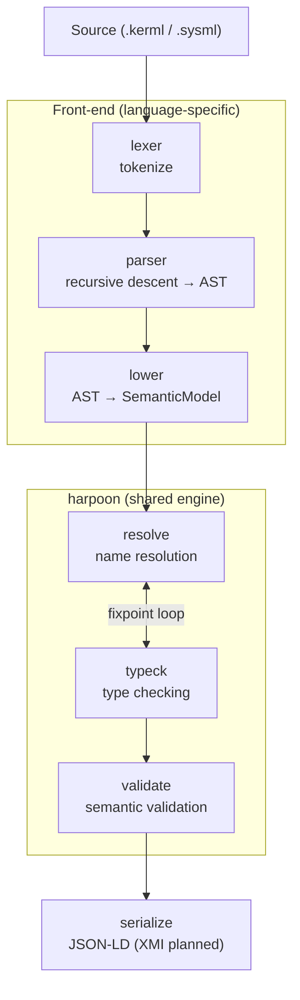

# Forge

> ⚠️ **Status: early development.** Forge is a work in progress. APIs, file formats,
> the CLI surface, and the supported grammar subset all change without notice. It is
> not yet ready for production use.

**Forge** is a Cargo-style build system and package manager for Systems Modeling. If you
practice MBSE (Model-Based Systems Engineering), Forge gives you a familiar, command-line
workflow for working with **KerML** and **SysML v2** models.

What it is meant to do:

- **Check** the validity of KerML / SysML v2 files (parse, resolve names, type-check, validate).
- **Reference libraries** from a repository and resolve dependencies between models.
- **Serialize** models to interchange formats (JSON-LD today; XMI planned).
- **Run simulations** and other model-driven tooling on top of a shared compiler engine.

At its core is **`kermlc`**, a KerML compiler written in Rust targeting the
**KerML 1.0 Beta 2** specification. A future `sysmlc` driver will sit over the same engine.

## High-level Architecture

Forge is a Cargo-style workspace: thin, language-specific driver binaries (`kermlc`, and the
planned `sysmlc`) sit over **`harpoon`**, one shared, language-agnostic compiler engine. The
front-end is specific to each modeling language; everything downstream of the semantic model is
shared.



The compiler pipeline flows linearly with a fixpoint loop (`resolve` ⇄ `typeck`) inside
`harpoon::compile()`. Driver binaries handle parsing/lowering and the standard-library prelude,
then hand a `SemanticModel` to the engine; serialization is a downstream step the driver invokes.

| Layer        | Crates                                                                 |
|--------------|-----------------------------------------------------------------------|
| Front-end    | `kermlc_lexer`, `kermlc_parser`, `kermlc_lower`, `kermlc_ast`         |
| Engine       | `harpoon` (facade) + `harpoon_resolve`, `harpoon_typeck`, `harpoon_validate`, `harpoon_serial_json`, `harpoon_hir` |
| Foundation   | `harpoon_intern`, `harpoon_diagnostics`                               |
| Binary       | `kermlc` (CLI)                                                         |

## Status

Forge is **pre-1.0** and under active development. The KerML front-end implements a growing
subset of the textual grammar; resolution, type checking, validation, and JSON-LD serialization
work for that subset. The `sysmlc` driver, XMI output, package management, and simulation are
planned but not yet implemented.

## Build & Test

```bash
cargo build      # build all crates
cargo test       # run all tests
cargo clippy --all-targets -- -D warnings
```

## License

Forge is **dual-licensed**:

- **Free under the [AGPL-3.0-only](LICENSE).** Use it for any purpose, including inside a company.
  If you build on Forge and distribute it — or offer it as a network service — you must release
  your derivative under the AGPL-3.0 too, with its source available to users (strong copyleft).
- **Commercial license** for building **closed-source** products or services on top of Forge,
  without the AGPL's copyleft obligations. See [`COMMERCIAL-LICENSE.md`](COMMERCIAL-LICENSE.md).

See [`LICENSING.md`](LICENSING.md) for help choosing, or contact
[licensing@kadabra.rs](mailto:licensing@kadabra.rs).

## Contributing

Contributions are welcome. Because Forge is dual-licensed, all contributors sign a
[Contributor License Agreement](CLA.md) before their first pull request is merged (handled
automatically by a bot). See [`CONTRIBUTING.md`](CONTRIBUTING.md).

Here's test contribution
