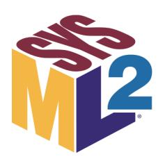

# **OMG Systems Modeling Language™ (SysML®)**

Version 2.0

# **Part 1: Language Specification**

**\_\_\_\_\_\_\_\_\_\_\_\_\_\_\_\_\_\_\_\_\_\_\_\_\_\_\_\_\_\_\_\_\_\_\_\_\_\_\_\_\_\_\_\_\_\_\_\_\_\_\_\_\_\_\_\_\_\_\_\_\_\_\_\_\_\_\_\_\_\_\_\_\_\_\_\_\_\_\_**

**OMG Document Number:** formal/2025-09-03

**Date:** September 2025

**Standard document URL:** <https://www.omg.org/spec/SysML/2.0/Language/>

**Machine Readable File(s):** <https://www.omg.org/spec/SysML/20250201/>

**\_\_\_\_\_\_\_\_\_\_\_\_\_\_\_\_\_\_\_\_\_\_\_\_\_\_\_\_\_\_\_\_\_\_\_\_\_\_\_\_\_\_\_\_\_\_\_\_\_\_\_\_\_\_\_\_\_\_\_\_\_\_\_\_\_\_\_\_\_\_\_\_\_\_\_\_\_\_\_**

```
Copyright © 2019-2025, 88solutions Corporation
Copyright © 2019-2025, Airbus
Copyright © 2019-2025, Aras Corporation
Copyright © 2019-2025, Association of Universities for Research in Astronomy (AURA)
Copyright © 2019-2025, BigLever Software
Copyright © 2019-2025, Boeing
Copyright © 2022-2025, Budapest University of Technology and Economics
Copyright © 2021-2025, Commissariat à l'énergie atomique et aux énergies alternatives (CEA)
Copyright © 2019-2025, Contact Software GmbH
Copyright © 2019-2025, Dassault Systèmes (No Magic)
Copyright © 2019-2025, DSC Corporation
Copyright © 2020-2025, DEKonsult
Copyright © 2020-2025, Delligatti Associates LLC
Copyright © 2019-2025, The Charles Stark Draper Laboratory, Inc.
Copyright © 2020-2025, ESTACA
Copyright © 2023-2025, Galois, Inc.
Copyright © 2019-2025, GfSE e.V.
Copyright © 2019-2025, George Mason University
Copyright © 2019-2025, IBM
Copyright © 2019-2025, Idaho National Laboratory
Copyright © 2019-2025, INCOSE
Copyright © 2019-2025, Intercax LLC
Copyright © 2019-2025, Jet Propulsion Laboratory (California Institute of Technology)
Copyright © 2019-2025, Kenntnis LLC
Copyright © 2020-2025, Kungliga Tekniska högskolon (KTH)
Copyright © 2019-2025, LightStreet Consulting LLC
Copyright © 2019-2025, Lockheed Martin Corporation
Copyright © 2019-2025, Maplesoft
Copyright © 2021-2025, MID GmbH
Copyright © 2020-2025, MITRE
Copyright © 2019-2025, Model Alchemy Consulting
Copyright © 2019-2025, Model Driven Solutions, Inc.
Copyright © 2019-2025, Model Foundry Pty. Ltd.
Copyright © 2023-2025, Object Management Group, Inc.
Copyright © 2019-2025, On-Line Application Research Corporation (OAC)
Copyright © 2019-2025, oose eG
Copyright © 2019-2025, Østfold University College
Copyright © 2019-2025, PTC
Copyright © 2020-2025, Qualtech Systems, Inc.
Copyright © 2019-2025, SAF Consulting
Copyright © 2019-2025, Simula Research Laboratory AS
Copyright © 2019-2025, System Strategy, Inc.
Copyright © 2019-2025, Thematix Partners, LLC
Copyright © 2019-2025, Tom Sawyer
Copyright © 2023-2025, Tucson Embedded Systems, Inc.
Copyright © 2019-2025, Universidad de Cantabria
Copyright © 2019-2025, University of Alabama in Huntsville
Copyright © 2019-2025, University of Detroit Mercy
Copyright © 2019-2025, University of Kaiserslauten
```

Copyright © 2020-2025, Willert Software Tools GmbH (SodiusWillert)

# USE OF SPECIFICATION - TERMS, CONDITIONS & NOTICES

The material in this document details an Object Management Group specification in accordance with the terms, conditions and notices set forth below. This document does not represent a commitment to implement any portion of this specification in any companys products. The information contained in this document is subject to change without notice.

# LICENSES

The companies listed above have granted to the Object Management Group, Inc. (OMG) a nonexclusive, royalty-free, paid up, worldwide license to copy and distribute this document and to modify this document and distribute copies of the modified version. Each of the copyright holders listed above has agreed that no person shall be deemed to have infringed the copyright in the included material of any such copyright holder by reason of having used the specification set forth herein or having conformed any computer software to the specification.

Subject to all of the terms and conditions below, the owners of the copyright in this specification hereby grant you a fully-paid up, non-exclusive, nontransferable, perpetual, worldwide license (without the right to sublicense), to use this specification to create and distribute software and special purpose specifications that are based upon this specification, and to use, copy, and distribute this specification as provided under the Copyright Act; provided that: (1) both the copyright notice identified above and this permission notice appear on any copies of this specification; (2) the use of the specifications is for informational purposes and will not be copied or posted on any network computer or broadcast in any media and will not be otherwise resold or transferred for commercial purposes; and (3) no modifications are made to this specification. This limited permission automatically terminates without notice if you breach any of these terms or conditions. Upon termination, you will destroy immediately any copies of the specifications in your possession or control.

# PATENTS

The attention of adopters is directed to the possibility that compliance with or adoption of OMG specifications may require use of an invention covered by patent rights. OMG shall not be responsible for identifying patents for which a license may be required by any OMG specification, or for conducting legal inquiries into the legal validity or scope of those patents that are brought to its attention. OMG specifications are prospective and advisory only. Prospective users are responsible for protecting themselves against liability for infringement of patents.

# GENERAL USE RESTRICTIONS

Any unauthorized use of this specification may violate copyright laws, trademark laws, and communications regulations and statutes. This document contains information which is protected by copyright. All Rights Reserved. No part of this work covered by copyright herein may be reproduced or used in any form or by any means--graphic, electronic, or mechanical, including photocopying, recording, taping, or information storage and retrieval systems--without permission of the copyright owner.

# DISCLAIMER OF WARRANTY

WHILE THIS PUBLICATION IS BELIEVED TO BE ACCURATE, IT IS PROVIDED "AS IS" AND MAY CONTAIN ERRORS OR MISPRINTS. THE OBJECT MANAGEMENT GROUP AND THE COMPANIES LISTED ABOVE MAKE NO WARRANTY OF ANY KIND, EXPRESS OR IMPLIED, WITH REGARD TO THIS PUBLICATION, INCLUDING BUT NOT LIMITED TO ANY WARRANTY OF TITLE OR

OWNERSHIP, IMPLIED WARRANTY OF MERCHANTABILITY OR WARRANTY OF FITNESS FOR A PARTICULAR PURPOSE OR USE. IN NO EVENT SHALL THE OBJECT MANAGEMENT GROUP OR ANY OF THE COMPANIES LISTED ABOVE BE LIABLE FOR ERRORS CONTAINED HEREIN OR FOR DIRECT, INDIRECT, INCIDENTAL, SPECIAL, CONSEQUENTIAL, RELIANCE OR COVER DAMAGES, INCLUDING LOSS OF PROFITS, REVENUE, DATA OR USE, INCURRED BY ANY USER OR ANY THIRD PARTY IN CONNECTION WITH THE FURNISHING, PERFORMANCE, OR USE OF THIS MATERIAL, EVEN IF ADVISED OF THE POSSIBILITY OF SUCH DAMAGES.

The entire risk as to the quality and performance of software developed using this specification is borne by you. This disclaimer of warranty constitutes an essential part of the license granted to you to use this specification.

# RESTRICTED RIGHTS LEGEND

Use, duplication or disclosure by the U.S. Government is subject to the restrictions set forth in subparagraph (c) (1) (ii) of The Rights in Technical Data and Computer Software Clause at DFARS 252.227-7013 or in subparagraph (c)(1) and (2) of the Commercial Computer Software - Restricted Rights clauses at 48 C.F.R. 52.227-19 or as specified in 48 C.F.R. 227-7202-2 of the DoD F.A.R. Supplement and its successors, or as specified in 48 C.F.R. 12.212 of the Federal Acquisition Regulations and its successors, as applicable. The specification copyright owners are as indicated above and may be contacted through the Object Management Group, 9C Medway Road, PMB 274, Milford, MA 01757, U.S.A.

# TRADEMARKS

CORBA®, CORBA logos®, FIBO®, Financial Industry Business Ontology®, Financial Instrument Global Identifier®, IIOP®, IMM®, Model Driven Architecture®, MDA®, Object Management Group®, OMG®, OMG Logo®, SoaML®, SOAML®, SysML®, UAF®, Unified Modeling Language™, UML®, UML Cube Logo®, VSIPL®, and XMI® are registered trademarks of the Object Management Group, Inc.

For a complete list of trademarks, see: [https://www.omg.org/legal/tm\\_list.htm](https://www.omg.org/legal/tm_list.htm). All other products or company names mentioned are used for identification purposes only, and may be trademarks of their respective owners.

# COMPLIANCE

The copyright holders listed above acknowledge that the Object Management Group (acting itself or through its designees) is and shall at all times be the sole entity that may authorize developers, suppliers and sellers of computer software to use certification marks, trademarks or other special designations to indicate compliance with these materials.

Software developed under the terms of this license may claim compliance or conformance with this specification if and only if the software compliance is of a nature fully matching the applicable compliance points as stated in the specification. Software developed only partially matching the applicable compliance points may claim only that the software was based on this specification, but may not claim compliance or conformance with this specification. In the event that testing suites are implemented or approved by Object Management Group, Inc., software developed using this specification may claim compliance or conformance with the specification only if the software satisfactorily completes the testing suites.

# OMG'S ISSUE REPORTING PROCEDURE

All OMG specifications are subject to continuous review and improvement. As part of this process we encourage readers to report any ambiguities, inconsistencies, or inaccuracies they may find by completing the Issue Reporting Form listed on the main web page [https://www.omg.org](http://www.omg.org/), under Documents, Report a Bug/Issue.

# **Preface**

# **OMG**

Founded in 1989, the Object Management Group, Inc. (OMG) is an open membership, not-for-profit computer industry standards consortium that produces and maintains computer industry specifications for interoperable, portable, and reusable enterprise applications in distributed, heterogeneous environments. Membership includes Information Technology vendors, end users, government agencies, and academia.

OMG member companies write, adopt, and maintain its specifications following a mature, open process. OMG's specifications implement the Model Driven Architecture® (MDA®), maximizing ROI through a fulllifecycle approach to enterprise integration that covers multiple operating systems, programming languages, middleware and networking infrastructures, and software development environments. OMG's specifications include: UML® (Unified Modeling Language™); CORBA® (Common Object Request Broker Architecture); CWM™ (Common Warehouse Metamodel); and industry-specific standards for dozens of vertical markets.

More information on the OMG is available at <https://www.omg.org/>.

# **OMG Specifications**

As noted, OMG specifications address middleware, modeling, and vertical domain frameworks. All OMG Specifications are available from the OMG website at: <https://www.omg.org/spec>

All of OMG's formal specifications may be downloaded without charge from our website. (Products implementing OMG specifications are available from individual suppliers.) Copies of specifications, available in PostScript and PDF format, may be obtained from the Specifications Catalog cited above or by contacting the Object Management Group, Inc. at:

OMG Headquarters 9C Medway Road, PMB 274 Milford, MA 01757 USA

Tel: +1-781-444-0404 Fax: +1-781-444-0320

Email: [pubs@omg.org](mailto:pubs@omg.org)

Certain OMG specifications are also available as ISO standards. Please consult [https://www.iso.org](https://www.iso.org/)

# **Issues**

All OMG specifications are subject to continuous review and improvement. As part of this process we encourage readers to report any ambiguities, inconsistencies, or inaccuracies they may find by completing the Issue Reporting Form listed on the main web page [https://www.omg.org,](https://www.omg.org/) under Specifications, Report an Issue.

| 1 Scope1                                    |  |
|---------------------------------------------|--|
| 2 Conformance3                              |  |
| 3 Normative References5                     |  |
| 4 Terms and Definitions7                    |  |
| 5 Symbols9                                  |  |
| 6 Introduction11                            |  |
| 6.1 Document Overview11                     |  |
| 6.2 Document Organization12                 |  |
| 6.3 Acknowledgements13                      |  |
| 7 Language Description15                    |  |
| 7.1 Language Overview15                     |  |
| 7.2 Elements and Relationships16            |  |
| 7.2.1 Elements and Relationships Overview16 |  |
| 7.2.2 Elements17                            |  |
| 7.2.3 Relationships18                       |  |
| 7.3 Dependencies18                          |  |
| 7.3.1 Dependencies Overview18               |  |
| 7.3.2 Dependency Declaration19              |  |
| 7.4 Annotations19                           |  |
| 7.4.1 Annotations Overview19                |  |
| 7.4.2 Comments and Documentation21          |  |
| 7.4.3 Textual Representation22              |  |
| 7.5 Namespaces and Packages23               |  |
| 7.5.1 Namespaces Overview23                 |  |
| 7.5.2 Owned Members and Aliases26           |  |
| 7.5.3 Imports27                             |  |
| 7.5.4 Import Filtering29                    |  |
| 7.5.5 Root Namespaces30                     |  |
| 7.6 Definition and Usage31                  |  |
| 7.6.1 Definition and Usage Overview31       |  |
| 7.6.2 Definitions39                         |  |
| 7.6.3 Usages40                              |  |
| 7.6.4 Reference Usages42                    |  |
| 7.6.5 Effective Names42                     |  |
| 7.6.6 Feature Chains43                      |  |
| 7.6.7 Variations and Variants43             |  |
| 7.6.8 Implicit Specialization44             |  |
| 7.7 Attributes45                            |  |
| 7.7.1 Attributes Overview45                 |  |
| 7.7.2 Attribute Definitions and Usages46    |  |
| 7.8 Enumerations47                          |  |
| 7.8.1 Enumerations Overview47               |  |
| 7.8.2 Enumeration Definitions and Usages48  |  |
| 7.9 Occurrences49                           |  |
| 7.9.1 Occurrences Overview49                |  |
| 7.9.2 Occurrence Definitions and Usages54   |  |
| 7.9.3 Time Slices and Snapshots54           |  |
| 7.9.4 Individual Definitions and Usages55   |  |
| 7.9.5 Event Occurrence Usages55             |  |
| 7.10 Items56                                |  |
| 7.10.1 Items Overview56                     |  |
| 7.10.2 Item Definitions and Usages57        |  |
| 7.11 Parts58                                |  |
| 7.11.1 Parts Overview58                     |  |
|                                             |  |

| 7.11.2 Part Definitions and Usages60            |  |
|-------------------------------------------------|--|
| 7.12 Ports61                                    |  |
| 7.12.1 Ports Overview61                         |  |
| 7.12.2 Port Definitions and Usages63            |  |
| 7.12.3 Conjugated Port Definitions and Usages63 |  |
| 7.13 Connections63                              |  |
| 7.13.1 Connections Overview63                   |  |
| 7.13.2 Connection Definitions and Usages68      |  |
| 7.13.3 Bindings as Usages72                     |  |
| 7.13.4 Feature Values72                         |  |
| 7.13.5 Successions as Usages73                  |  |
| 7.14 Interfaces74                               |  |
| 7.14.1 Interfaces Overview74                    |  |
| 7.14.2 Interface Definitions and Usages77       |  |
| 7.15 Allocations78                              |  |
| 7.15.1 Allocations Overview78                   |  |
| 7.15.2 Allocation Definitions and Usages80      |  |
| 7.16 Flows and Messages80                       |  |
| 7.16.1 Flows and Messages Overview80            |  |
| 7.16.2 Flow Definitions and Usages83            |  |
| 7.17 Actions85                                  |  |
| 7.17.1 Actions Overview85                       |  |
|                                                 |  |
| 7.17.2 Action Definitions and Usages99          |  |
| 7.17.3 Control Nodes101                         |  |
| 7.17.4 Succession Shorthands102                 |  |
| 7.17.5 Conditional Successions103               |  |
| 7.17.6 Perform Action Usages104                 |  |
| 7.17.7 Send Action Usages105                    |  |
| 7.17.8 Accept Action Usages106                  |  |
| 7.17.9 Assignment Action Usages109              |  |
| 7.17.10 Terminate Action Usages110              |  |
| 7.17.11 If Action Usages111                     |  |
| 7.17.12 Loop Action Usages111                   |  |
| 7.18 States113                                  |  |
| 7.18.1 States Overview113                       |  |
| 7.18.2 State Definitions and Usages117          |  |
| 7.18.3 Transition Usages119                     |  |
| 7.18.4 Exhibit State Usages122                  |  |
| 7.19 Calculations122                            |  |
| 7.19.1 Calculations Overview122                 |  |
| 7.19.2 Calculation Definitions and Usages124    |  |
| 7.20 Constraints125                             |  |
| 7.20.1 Constraints Overview125                  |  |
| 7.20.2 Constraint Definitions and Usages127     |  |
| 7.20.3 Assert Constraint Usages128              |  |
| 7.21 Requirements129                            |  |
| 7.21.1 Requirements Overview129                 |  |
| 7.21.2 Requirement Definition and Usage133      |  |
| 7.21.3 Concern Definitions and Usages135        |  |
| 7.21.4 Satisfy Requirement Usages136            |  |
| 7.22 Cases137                                   |  |
| 7.22.1 Cases Overview137                        |  |
| 7.22.2 Case Definitions and Usages137           |  |
| 7.23 Analysis Cases138                          |  |
| 7.23.1 Analysis Cases Overview138               |  |
| 7.23.2 Analysis Case Definitions and Usages140  |  |

| 7.23.3 Trade-Off Analyses140                           |  |
|--------------------------------------------------------|--|
| 7.24 Verification Cases141                             |  |
| 7.24.1 Verification Cases Overview141                  |  |
| 7.24.2 Verification Case Definitions and Usages144     |  |
| 7.25 Use Cases145                                      |  |
| 7.25.1 Use Cases Overview145                           |  |
| 7.25.2 Use Case Definitions and Usages147              |  |
| 7.25.3 Include Use Case Usages148                      |  |
| 7.26 Views and Viewpoints149                           |  |
| 7.26.1 Views and Viewpoints Overview149                |  |
| 7.26.2 View Definitions and Usages152                  |  |
| 7.26.3 Viewpoint Definitions and Usages153             |  |
| 7.26.4 Rendering Definitions and Usages154             |  |
| 7.26.5 Compartments and Diagrams as View Usages154     |  |
| 7.27 Metadata157                                       |  |
| 7.27.1 Metadata Overview157                            |  |
| 7.27.2 Metadata Definitions and Usages159              |  |
| 7.27.3 Semantic Metadata160                            |  |
| 7.27.4 User-Defined Keywords161                        |  |
| 8 Metamodel163                                         |  |
| 8.1 Metamodel Overview163                              |  |
| 8.2 Concrete Syntax163                                 |  |
| 8.2.1 Concrete Syntax Overview163                      |  |
| 8.2.2 Textual Notation163                              |  |
| 8.2.2.1 Textual Notation Overview163                   |  |
| 8.2.2.1.1 EBNF Conventions163                          |  |
| 8.2.2.1.2 Lexical Structure165                         |  |
| 8.2.2.2 Elements and Relationships Textual Notation166 |  |
| 8.2.2.3 Dependencies Textual Notation166               |  |
|                                                        |  |
| 8.2.2.4 Annotations Textual Notation166                |  |
| 8.2.2.4.1 Annotations166                               |  |
| 8.2.2.4.2 Comments and Documentation166                |  |
| 8.2.2.4.3 Textual Representation166                    |  |
| 8.2.2.5 Namespaces and Packages Textual Notation167    |  |
| 8.2.2.5.1 Packages167                                  |  |
| 8.2.2.5.2 Package Elements168                          |  |
| 8.2.2.6 Definition and Usage Textual Notation168       |  |
| 8.2.2.6.1 Definitions168                               |  |
| 8.2.2.6.2 Usages169                                    |  |
| 8.2.2.6.3 Reference Usages170                          |  |
| 8.2.2.6.4 Body Elements170                             |  |
| 8.2.2.6.5 Specialization172                            |  |
| 8.2.2.6.6 Multiplicity173                              |  |
| 8.2.2.7 Attributes Textual Notation173                 |  |
| 8.2.2.8 Enumerations Textual Notation173               |  |
| 8.2.2.9 Occurrences Textual Notation174                |  |
| 8.2.2.9.1 Occurrence Definitions174                    |  |
| 8.2.2.9.2 Occurrence Usages174                         |  |
| 8.2.2.9.3 Occurrence Successions174                    |  |
| 8.2.2.10 Items Textual Notation175                     |  |
| 8.2.2.11 Parts Textual Notation175                     |  |
| 8.2.2.12 Ports Textual Notation175                     |  |
| 8.2.2.13 Connections Textual Notation176               |  |
| 8.2.2.13.1 Connection Definition and Usage176          |  |
| 8.2.2.13.2 Binding Connectors176                       |  |
| 8.2.2.13.3 Successions176                              |  |

| 8.2.2.14 Interfaces Textual Notation177                  |  |
|----------------------------------------------------------|--|
| 8.2.2.14.1 Interface Definitions177                      |  |
| 8.2.2.14.2 Interface Usages177                           |  |
| 8.2.2.15 Allocations Textual Notation178                 |  |
| 8.2.2.16 Flows Textual Notation178                       |  |
| 8.2.2.17 Actions Textual Notation179                     |  |
| 8.2.2.17.1 Action Definitions179                         |  |
| 8.2.2.17.2 Action Usages180                              |  |
| 8.2.2.17.3 Control Nodes181                              |  |
| 8.2.2.17.4 Send and Accept Action Usages181              |  |
|                                                          |  |
| 8.2.2.17.5 Assignment Action Usages183                   |  |
| 8.2.2.17.6 Terminate Action Usages183                    |  |
| 8.2.2.17.7 Structured Control Action Usages183           |  |
| 8.2.2.17.8 Action Successions184                         |  |
| 8.2.2.18 States Textual Notation184                      |  |
| 8.2.2.18.1 State Definitions184                          |  |
| 8.2.2.18.2 State Usages185                               |  |
| 8.2.2.18.3 Transition Usages186                          |  |
| 8.2.2.19 Calculations Textual Notation187                |  |
| 8.2.2.20 Constraints Textual Notation187                 |  |
| 8.2.2.21 Requirements Textual Notation188                |  |
| 8.2.2.21.1 Requirement Definitions188                    |  |
| 8.2.2.21.2 Requirement Usages189                         |  |
| 8.2.2.21.3 Concerns189                                   |  |
| 8.2.2.22 Cases Textual Notation189                       |  |
| 8.2.2.23 Analysis Cases Textual Notation190              |  |
| 8.2.2.24 Verification Cases Textual Notation190          |  |
| 8.2.2.25 Use Cases Textual Notation190                   |  |
| 8.2.2.26 Views and Viewpoints Textual Notation190        |  |
| 8.2.2.26.1 View Definitions190                           |  |
| 8.2.2.26.2 View Usages191                                |  |
|                                                          |  |
| 8.2.2.26.3 Viewpoints191                                 |  |
| 8.2.2.26.4 Renderings191                                 |  |
| 8.2.2.27 Metadata Textual Notation192                    |  |
| 8.2.3 Graphical Notation193                              |  |
| 8.2.3.1 Graphical Notation Overview193                   |  |
| 8.2.3.2 Elements and Relationships Graphical Notation194 |  |
| 8.2.3.3 Dependencies Graphical Notation195               |  |
| 8.2.3.4 Annotations Graphical Notation195                |  |
| 8.2.3.5 Namespaces and Packages Graphical Notation197    |  |
| 8.2.3.6 Definition and Usage Graphical Notation199       |  |
| 8.2.3.7 Attributes Graphical Notation201                 |  |
| 8.2.3.8 Enumerations Graphical Notation202               |  |
| 8.2.3.9 Occurrences Graphical Notation203                |  |
| 8.2.3.10 Items Graphical Notation207                     |  |
| 8.2.3.11 Parts Graphical Notation208                     |  |
| 8.2.3.12 Ports Graphical Notation210                     |  |
| 8.2.3.13 Connections Graphical Notation214               |  |
| 8.2.3.14 Interfaces Graphical Notation217                |  |
|                                                          |  |
| 8.2.3.15 Allocations Graphical Notation218               |  |
| 8.2.3.16 Flows Graphical Notation219                     |  |
| 8.2.3.17 Actions Graphical Notation222                   |  |
| 8.2.3.18 States Graphical Notation232                    |  |
| 8.2.3.19 Calculations Graphical Notation236              |  |
| 8.2.3.20 Constraints Graphical Notation238               |  |
| 8.2.3.21 Requirements Graphical Notation240              |  |

| 8.2.3.22 Cases Graphical Notation246                |  |
|-----------------------------------------------------|--|
| 8.2.3.23 Analysis Cases Graphical Notation246       |  |
| 8.2.3.24 Verification Cases Graphical Notation248   |  |
| 8.2.3.25 Use Cases Graphical Notation249            |  |
| 8.2.3.26 Views and Viewpoints Graphical Notation251 |  |
| 8.2.3.27 Metadata Graphical Notation255             |  |
| 8.3 Abstract Syntax255                              |  |
| 8.3.1 Abstract Syntax Overview255                   |  |
| 8.3.2 Elements and Relationships Abstract Syntax257 |  |
| 8.3.3 Dependencies Abstract Syntax258               |  |
| 8.3.4 Annotations Abstract Syntax258                |  |
| 8.3.5 Namespaces and Packages Abstract Syntax259    |  |
| 8.3.6 Definition and Usage Abstract Syntax261       |  |
| 8.3.6.1 Overview261                                 |  |
| 8.3.6.2 Definition261                               |  |
| 8.3.6.3 ReferenceUsage268                           |  |
| 8.3.6.4 Usage269                                    |  |
| 8.3.6.5 VariantMembership277                        |  |
| 8.3.7 Attributes Abstract Syntax278                 |  |
| 8.3.7.1 Overview278                                 |  |
| 8.3.7.2 AttributeDefinition278                      |  |
| 8.3.7.3 AttributeUsage279                           |  |
| 8.3.8 Enumerations Abstract Syntax280               |  |
| 8.3.8.1 Overview280                                 |  |
| 8.3.8.2 EnumerationDefinition280                    |  |
| 8.3.8.3 EnumerationUsage281                         |  |
| 8.3.9 Occurrences Abstract Syntax281                |  |
| 8.3.9.1 Overview281                                 |  |
| 8.3.9.2 EventOccurrenceUsage282                     |  |
| 8.3.9.3 OccurrenceDefinition283                     |  |
| 8.3.9.4 OccurrenceUsage284                          |  |
| 8.3.9.5 PortionKind286                              |  |
| 8.3.10 Items Abstract Syntax287                     |  |
| 8.3.10.1 Overview287                                |  |
| 8.3.10.2 ItemDefinition287                          |  |
| 8.3.10.3 ItemUsage288                               |  |
| 8.3.11 Parts Abstract Syntax289                     |  |
| 8.3.11.1 Overview289                                |  |
| 8.3.11.2 PartDefinition289                          |  |
| 8.3.11.3 PartUsage289                               |  |
| 8.3.12 Ports Abstract Syntax291                     |  |
| 8.3.12.1 Overview291                                |  |
| 8.3.12.2 ConjugatedPortDefinition292                |  |
| 8.3.12.3 ConjugatedPortTyping292                    |  |
| 8.3.12.4 PortConjugation293                         |  |
| 8.3.12.5 PortDefinition294                          |  |
| 8.3.12.6 PortUsage295                               |  |
| 8.3.13 Connections Abstract Syntax296               |  |
| 8.3.13.1 Overview296                                |  |
| 8.3.13.2 BindingConnectorAsUsage297                 |  |
| 8.3.13.3 ConnectionDefinition297                    |  |
| 8.3.13.4 ConnectionUsage298                         |  |
| 8.3.13.5 ConnectorAsUsage299                        |  |
| 8.3.13.6 SuccessionAsUsage299                       |  |
| 8.3.14 Interfaces Abstract Syntax300                |  |
|                                                     |  |

| 8.3.14.2 InterfaceDefinition300          |  |
|------------------------------------------|--|
| 8.3.14.3 InterfaceUsage301               |  |
| 8.3.15 Allocations Abstract Syntax302    |  |
| 8.3.15.1 Overview302                     |  |
| 8.3.15.2 AllocationDefinition302         |  |
| 8.3.15.3 AllocationUsage303              |  |
| 8.3.16 Flow Abstract Syntax304           |  |
|                                          |  |
| 8.3.16.1 Overview304                     |  |
| 8.3.16.2 FlowDefinition304               |  |
| 8.3.16.3 FlowUsage305                    |  |
| 8.3.16.4 SuccessionFlowUsage306          |  |
| 8.3.17 Actions Abstract Syntax306        |  |
| 8.3.17.1 Overview306                     |  |
| 8.3.17.2 AcceptActionUsage309            |  |
| 8.3.17.3 ActionDefinition311             |  |
| 8.3.17.4 ActionUsage312                  |  |
| 8.3.17.5 AssignmentActionUsage314        |  |
| 8.3.17.6 ControlNode316                  |  |
| 8.3.17.7 DecisionNode317                 |  |
| 8.3.17.8 ForkNode318                     |  |
| 8.3.17.9 ForLoopActionUsage319           |  |
| 8.3.17.10 IfActionUsage320               |  |
| 8.3.17.11 JoinNode322                    |  |
| 8.3.17.12 LoopActionUsage322             |  |
| 8.3.17.13 MergeNode323                   |  |
| 8.3.17.14 PerformActionUsage324          |  |
| 8.3.17.15 SendActionUsage325             |  |
| 8.3.17.16 TerminateActionUsage326        |  |
| 8.3.17.17 TriggerInvocationExpression327 |  |
|                                          |  |
| 8.3.17.18 TriggerKind328                 |  |
| 8.3.17.19 WhileLoopActionUsage329        |  |
| 8.3.18 States Abstract Syntax331         |  |
| 8.3.18.1 Overview331                     |  |
| 8.3.18.2 ExhibitStateUsage332            |  |
| 8.3.18.3 StateSubactionKind333           |  |
| 8.3.18.4 StateSubactionMembership334     |  |
| 8.3.18.5 StateDefinition334              |  |
| 8.3.18.6 StateUsage336                   |  |
| 8.3.18.7 TransitionFeatureKind339        |  |
| 8.3.18.8 TransitionFeatureMembership339  |  |
| 8.3.18.9 TransitionUsage340              |  |
| 8.3.19 Calculations Abstract Syntax345   |  |
| 8.3.19.1 Overview345                     |  |
| 8.3.19.2 CalculationDefinition345        |  |
| 8.3.19.3 CalculationUsage346             |  |
| 8.3.20 Constraints Abstract Syntax347    |  |
| 8.3.20.1 Overview347                     |  |
|                                          |  |
| 8.3.20.2 AssertConstraintUsage347        |  |
| 8.3.20.3 ConstraintDefinition348         |  |
| 8.3.20.4 ConstraintUsage349              |  |
| 8.3.21 Requirements Abstract Syntax351   |  |
| 8.3.21.1 Overview351                     |  |
| 8.3.21.2 ActorMembership353              |  |
| 8.3.21.3 ConcernDefinition353            |  |
| 8.3.21.4 ConcernUsage354                 |  |
| 8.3.21.5 FramedConcernMembership355      |  |

| 8.3.21.7 RequirementConstraintMembership356    |  |
|------------------------------------------------|--|
| 8.3.21.8 RequirementDefinition357              |  |
| 8.3.21.9 RequirementUsage359                   |  |
| 8.3.21.10 SatisfyRequirementUsage363           |  |
| 8.3.21.11 SubjectMembership364                 |  |
| 8.3.21.12 StakeholderMembership365             |  |
| 8.3.22 Cases Abstract Syntax366                |  |
| 8.3.22.1 Overview366                           |  |
| 8.3.22.2 CaseDefinition367                     |  |
| 8.3.22.3 CaseUsage368                          |  |
| 8.3.22.4 ObjectiveMembership370                |  |
| 8.3.23 Analysis Cases Abstract Syntax371       |  |
| 8.3.23.1 Overview371                           |  |
| 8.3.23.2 AnalysisCaseDefinition371             |  |
| 8.3.23.3 AnalysisCaseUsage372                  |  |
| 8.3.24 Verification Cases Abstract Syntax374   |  |
| 8.3.24.1 Overview374                           |  |
| 8.3.24.2 RequirementVerificationMembership375  |  |
| 8.3.24.3 VerificationCaseDefinition375         |  |
| 8.3.24.4 VerificationCaseUsage376              |  |
| 8.3.25 Use Cases Abstract Syntax378            |  |
| 8.3.25.1 Overview378                           |  |
| 8.3.25.2 IncludeUseCaseUsage378                |  |
| 8.3.25.3 UseCaseDefinition379                  |  |
| 8.3.25.4 UseCaseUsage380                       |  |
|                                                |  |
| 8.3.26 Views and Viewpoints Abstract Syntax381 |  |
| 8.3.26.1 Overview381                           |  |
| 8.3.26.2 Expose383                             |  |
| 8.3.26.3 MembershipExpose384                   |  |
| 8.3.26.4 NamespaceExpose385                    |  |
| 8.3.26.5 RenderingDefinition385                |  |
| 8.3.26.6 RenderingUsage386                     |  |
| 8.3.26.7 ViewDefinition387                     |  |
| 8.3.26.8 ViewpointDefinition388                |  |
| 8.3.26.9 ViewpointUsage389                     |  |
| 8.3.26.10 ViewRenderingMembership390           |  |
| 8.3.26.11 ViewUsage391                         |  |
| 8.3.27 Metadata Abstract Syntax393             |  |
| 8.3.27.1 Overview393                           |  |
| 8.3.27.2 MetadataDefinition393                 |  |
| 8.3.27.3 MetadataUsage394                      |  |
| 8.4 Semantics394                               |  |
| 8.4.1 Semantics Overview394                    |  |
| 8.4.2 Definition and Usage Semantics402        |  |
| 8.4.2.1 Definitions402                         |  |
| 8.4.2.2 Usages402                              |  |
| 8.4.2.3 Variation Definitions and Usages403    |  |
| 8.4.3 Attributes Semantics404                  |  |
| 8.4.3.1 Attribute Definitions404               |  |
| 8.4.3.2 Attribute Usages404                    |  |
| 8.4.4 Enumerations Semantics404                |  |
| 8.4.5 Occurrences Semantics405                 |  |
| 8.4.5.1 Occurrence Definitions405              |  |
| 8.4.5.2 Occurrence Usages406                   |  |
| 8.4.5.3 Event Occurrence Usages407             |  |
|                                                |  |

| 8.4.6 Items Semantics407                |  |
|-----------------------------------------|--|
| 8.4.6.1 Item Definitions407             |  |
| 8.4.6.2 Item Usages408                  |  |
| 8.4.7 Parts Semantics408                |  |
| 8.4.7.1 Part Definitions408             |  |
| 8.4.7.2 Part Usages409                  |  |
| 8.4.8 Ports Semantics409                |  |
| 8.4.8.1 Port Definitions409             |  |
| 8.4.8.2 Port Usages410                  |  |
| 8.4.9 Connections Semantics411          |  |
| 8.4.9.1 Connection Definitions411       |  |
| 8.4.9.2 Connection Usages413            |  |
| 8.4.9.3 Binding Connectors As Usages414 |  |
|                                         |  |
| 8.4.9.4 Successions As Usages414        |  |
| 8.4.10 Interfaces Semantics415          |  |
| 8.4.10.1 Interface Definitions415       |  |
| 8.4.10.2 Interface Usages416            |  |
| 8.4.11 Allocations Semantics416         |  |
| 8.4.11.1 Allocation Definitions416      |  |
| 8.4.11.2 Allocation Usages417           |  |
| 8.4.12 Flows Semantics417               |  |
| 8.4.12.1 Flow Definitions417            |  |
| 8.4.12.2 Flow Usages418                 |  |
| 8.4.12.3 Succession Flow Usages420      |  |
| 8.4.13 Actions Semantics420             |  |
| 8.4.13.1 Action Definitions420          |  |
| 8.4.13.2 Action Usages421               |  |
| 8.4.13.3 Decision Transition Usages423  |  |
| 8.4.13.4 Control Nodes424               |  |
| 8.4.13.5 Send Action Usages428          |  |
| 8.4.13.6 Accept Action Usages430        |  |
| 8.4.13.7 Assignment Action Usages432    |  |
| 8.4.13.8 Terminate Action Usages433     |  |
| 8.4.13.9 If Action Usages434            |  |
| 8.4.13.10 Loop Action Usages435         |  |
| 8.4.13.11 Perform Action Usages437      |  |
| 8.4.14 States Semantics438              |  |
| 8.4.14.1 State Definitions438           |  |
| 8.4.14.2 State Usages439                |  |
| 8.4.14.3 Transition Usages440           |  |
| 8.4.14.4 Exhibit State Usages442        |  |
| 8.4.15 Calculations Semantics443        |  |
|                                         |  |
| 8.4.15.1 Calculation Definitions443     |  |
| 8.4.15.2 Calculation Usages444          |  |
| 8.4.16 Constraints Semantics445         |  |
| 8.4.16.1 Constraint Definitions445      |  |
| 8.4.16.2 Constraint Usages446           |  |
| 8.4.16.3 Assert Constraint Usages446    |  |
| 8.4.17 Requirements Semantics447        |  |
| 8.4.17.1 Requirement Definitions447     |  |
| 8.4.17.2 Requirement Usages448          |  |
| 8.4.17.3 Satisfy Requirement Usages449  |  |
| 8.4.17.4 Concern Definitions450         |  |
| 8.4.17.5 Concern Usages450              |  |
| 8.4.18 Cases Semantics450               |  |
|                                         |  |

| 8.4.18.2 Case Usages451                   |  |
|-------------------------------------------|--|
| 8.4.19 Analysis Cases Semantics452        |  |
| 8.4.19.1 Analysis Case Definitions452     |  |
| 8.4.19.2 Analysis Case Usages453          |  |
| 8.4.20 Verification Cases Semantics454    |  |
| 8.4.20.1 Verification Case Definitions454 |  |
| 8.4.20.2 Verification Case Usages455      |  |
| 8.4.21 Use Cases Semantics455             |  |
| 8.4.21.1 Use Case Definitions456          |  |
| 8.4.21.2 Use Case Usages456               |  |
| 8.4.21.3 Include Use Case Usages456       |  |
| 8.4.22 Views and Viewpoints Semantics457  |  |
| 8.4.22.1 View Definitions457              |  |
| 8.4.22.2 View Usages457                   |  |
| 8.4.22.3 Viewpoint Definitions457         |  |
| 8.4.22.4 Viewpoint Usages458              |  |
| 8.4.22.5 Rendering Definitions458         |  |
| 8.4.22.6 Rendering Usages458              |  |
| 8.4.23 Metadata Semantics459              |  |
| 8.4.23.1 Metadata Definitions459          |  |
| 8.4.23.2 Metadata Usages459               |  |
| 9 Model Libraries461                      |  |
| 9.1 Model Libraries Overview461           |  |
| 9.2 Systems Model Library461              |  |
| 9.2.1 Systems Model Library Overview461   |  |
| 9.2.2 Attributes462                       |  |
| 9.2.2.1 Attributes Overview462            |  |
| 9.2.2.2 Elements462                       |  |
| 9.2.2.2.1 AttributeValue462               |  |
| 9.2.2.2.2 attributeValues462              |  |
| 9.2.3 Items463                            |  |
| 9.2.3.1 Items Overview463                 |  |
| 9.2.3.2 Elements463                       |  |
| 9.2.3.2.1 Item463                         |  |
| 9.2.3.2.2 items464                        |  |
| 9.2.3.2.3 Touches464                      |  |
| 9.2.4 Parts465                            |  |
| 9.2.4.1 Parts Overview465                 |  |
| 9.2.4.2 Elements465                       |  |
| 9.2.4.2.1 Part465                         |  |
| 9.2.4.2.2 parts466                        |  |
| 9.2.5 Ports466                            |  |
| 9.2.5.1 Ports Overview466                 |  |
| 9.2.5.2 Elements466                       |  |
| 9.2.5.2.1 Port466                         |  |
| 9.2.5.2.2 ports467                        |  |
| 9.2.6 Connections467                      |  |
| 9.2.6.1 Connections Overview467           |  |
| 9.2.6.2 Elements467                       |  |
| 9.2.6.2.1 BinaryConnection467             |  |
| 9.2.6.2.2 binaryConnections468            |  |
| 9.2.6.2.3 Connection468                   |  |
| 9.2.6.2.4 connections468                  |  |
| 9.2.7 Interfaces469                       |  |
|                                           |  |

| 9.2.7.2 Elements469                     |  |
|-----------------------------------------|--|
| 9.2.7.2.1 BinaryInterface469            |  |
| 9.2.7.2.2 binaryInterfaces470           |  |
| 9.2.7.2.3 Interface470                  |  |
| 9.2.7.2.4 interfaces470                 |  |
| 9.2.8 Allocations471                    |  |
| 9.2.8.1 Allocations Overview471         |  |
| 9.2.8.2 Elements471                     |  |
| 9.2.8.2.1 Allocation471                 |  |
| 9.2.8.2.2 allocations471                |  |
| 9.2.9 Flows472                          |  |
| 9.2.9.1 Flows Overview472               |  |
| 9.2.9.2 Elements472                     |  |
| 9.2.9.2.1 Flow472                       |  |
| 9.2.9.2.2 flows472                      |  |
| 9.2.9.2.3 Message473                    |  |
| 9.2.9.2.4 MessageAction474              |  |
| 9.2.9.2.5 messages474                   |  |
| 9.2.9.2.6 SuccessionFlow475             |  |
| 9.2.9.2.7 successionFlows475            |  |
| 9.2.10 Actions476                       |  |
|                                         |  |
| 9.2.10.1 Actions Overview476            |  |
| 9.2.10.2 Elements476                    |  |
| 9.2.10.2.1 AcceptAction476              |  |
| 9.2.10.2.2 acceptActions476             |  |
| 9.2.10.2.3 AcceptMessageAction477       |  |
| 9.2.10.2.4 Action477                    |  |
| 9.2.10.2.5 actions479                   |  |
| 9.2.10.2.6 AssignmentAction479          |  |
| 9.2.10.2.7 assignmentActions480         |  |
| 9.2.10.2.8 ControlAction480             |  |
| 9.2.10.2.9 DecisionAction481            |  |
| 9.2.10.2.10 DecisionTransitionAction481 |  |
| 9.2.10.2.11 ForkAction482               |  |
| 9.2.10.2.12 ForLoopAction482            |  |
| 9.2.10.2.13 forLoopActions483           |  |
| 9.2.10.2.14 IfThenAction483             |  |
| 9.2.10.2.15 ifThenActions484            |  |
| 9.2.10.2.16 IfThenElseAction484         |  |
| 9.2.10.2.17 ifThenElseActions485        |  |
| 9.2.10.2.18 JoinAction485               |  |
| 9.2.10.2.19 LoopAction486               |  |
| 9.2.10.2.20 loopActions486              |  |
| 9.2.10.2.21 MergeAction486              |  |
| 9.2.10.2.22 SendAction487               |  |
| 9.2.10.2.23 sendActions487              |  |
| 9.2.10.2.24 TerminateAction488          |  |
| 9.2.10.2.25 terminateActions488         |  |
| 9.2.10.2.26 TransitionAction489         |  |
| 9.2.10.2.27 transitionActions489        |  |
| 9.2.10.2.28 WhileLoopAction490          |  |
| 9.2.10.2.29 whileLoopActions490         |  |
| 9.2.11 States491                        |  |
| 9.2.11.1 States Overview491             |  |
| 9.2.11.2 Elements491                    |  |
|                                         |  |

| 9.2.11.2.2 stateActions492                |  |
|-------------------------------------------|--|
| 9.2.11.2.3 StateTransitionAction492       |  |
| 9.2.12 Calculations493                    |  |
| 9.2.12.1 Calculations Overview493         |  |
| 9.2.12.2 Elements493                      |  |
| 9.2.12.2.1 Calculation493                 |  |
| 9.2.12.2.2 calculations493                |  |
| 9.2.13 Constraints494                     |  |
| 9.2.13.1 Constraints Overview494          |  |
| 9.2.13.2 Elements494                      |  |
| 9.2.13.2.1 assertedConstraintChecks494    |  |
| 9.2.13.2.2 ConstraintCheck494             |  |
| 9.2.13.2.3 constraintChecks495            |  |
| 9.2.13.2.4 negatedConstraintChecks495     |  |
| 9.2.14 Requirements496                    |  |
| 9.2.14.1 Requirements Overview496         |  |
| 9.2.14.2 Elements496                      |  |
| 9.2.14.2.1 ConcernCheck496                |  |
| 9.2.14.2.2 concernChecks496               |  |
| 9.2.14.2.3 DesignConstraintCheck497       |  |
| 9.2.14.2.4 FunctionalRequirementCheck497  |  |
| 9.2.14.2.5 InterfaceRequirementCheck497   |  |
| 9.2.14.2.6 PerformanceRequirementCheck498 |  |
| 9.2.14.2.7 PhysicalRequirementCheck498    |  |
| 9.2.14.2.8 RequirementCheck499            |  |
| 9.2.14.2.9 requirementChecks499           |  |
| 9.2.15 Cases500                           |  |
| 9.2.15.1 Cases Overview500                |  |
| 9.2.15.2 Elements500                      |  |
| 9.2.15.2.1 Case500                        |  |
| 9.2.15.2.2 cases501                       |  |
| 9.2.16 Analysis Cases501                  |  |
| 9.2.16.1 Analysis Cases Overview501       |  |
| 9.2.16.2 Elements501                      |  |
| 9.2.16.2.1 AnalysisCase501                |  |
| 9.2.16.2.2 analysisCases502               |  |
| 9.2.17 Verification Cases502              |  |
| 9.2.17.1 Verification Cases Overview502   |  |
| 9.2.17.2 Elements502                      |  |
| 9.2.17.2.1 PassIf502                      |  |
| 9.2.17.2.2 VerdictKind503                 |  |
| 9.2.17.2.3 VerificationCase503            |  |
| 9.2.17.2.4 verificationCases504           |  |
| 9.2.17.2.5 VerificationCheck504           |  |
| 9.2.17.2.6 VerificationMethod505          |  |
| 9.2.17.2.7 VerificationMethodKind505      |  |
| 9.2.18 Use Cases506                       |  |
| 9.2.18.1 Use Cases Overview506            |  |
| 9.2.18.2 Elements506                      |  |
| 9.2.18.2.1 UseCase506                     |  |
| 9.2.18.2.2 useCases506                    |  |
|                                           |  |
| 9.2.19 Views507                           |  |
| 9.2.19.1 Views Overview507                |  |
| 9.2.19.2 Elements507                      |  |
| 9.2.19.2.1 asElementTable507              |  |
|                                           |  |

| 9.2.19.2.3 asTextualNotation508                     |  |
|-----------------------------------------------------|--|
| 9.2.19.2.4 asTreeDiagram508                         |  |
| 9.2.19.2.5 GraphicalRendering509                    |  |
| 9.2.19.2.6 Rendering509                             |  |
| 9.2.19.2.7 renderings509                            |  |
| 9.2.19.2.8 TabularRendering510                      |  |
| 9.2.19.2.9 TextualRendering510                      |  |
| 9.2.19.2.10 View511                                 |  |
| 9.2.19.2.11 ViewpointCheck511                       |  |
| 9.2.19.2.12 viewpointChecks512                      |  |
| 9.2.19.2.13 viewpointConformance512                 |  |
| 9.2.19.2.14 views513                                |  |
| 9.2.20 Standard View Definitions513                 |  |
| 9.2.20.1 Standard View Definitions Overview513      |  |
| 9.2.20.2 Elements514                                |  |
| 9.2.20.2.1 ActionFlowView514                        |  |
| 9.2.20.2.2 BrowserView515                           |  |
| 9.2.20.2.3 GeneralView515                           |  |
| 9.2.20.2.4 GeometryView516                          |  |
| 9.2.20.2.5 GridView516                              |  |
| 9.2.20.2.6 InterconnectionView517                   |  |
| 9.2.20.2.7 SequenceView517                          |  |
|                                                     |  |
| 9.2.20.2.8 StateTransitionView518                   |  |
| 9.2.21 Metadata519                                  |  |
| 9.2.21.1 Metadata Overview519                       |  |
| 9.2.21.2 Elements519                                |  |
| 9.2.21.2.1 MetadataItem519                          |  |
| 9.2.21.2.2 metadataItems519                         |  |
| 9.2.22 SysML520                                     |  |
| 9.3 Metadata Domain Library520                      |  |
| 9.3.1 Metadata Domain Library Overview520           |  |
| 9.3.2 Modeling Metadata521                          |  |
| 9.3.2.1 Modeling Metadata Overview521               |  |
| 9.3.2.2 Elements521                                 |  |
| 9.3.2.2.1 Issue521                                  |  |
| 9.3.2.2.2 Rationale521                              |  |
| 9.3.2.2.3 Refinement522                             |  |
| 9.3.2.2.4 StatusInfo522                             |  |
| 9.3.2.2.5 StatusKind523                             |  |
| 9.3.3 Risk Metadata523                              |  |
| 9.3.3.1 Risk Metadata Overview523                   |  |
| 9.3.3.2 Elements524                                 |  |
| 9.3.3.2.1 Level524                                  |  |
| 9.3.3.2.2 LevelEnum524                              |  |
| 9.3.3.2.3 Risk525                                   |  |
| 9.3.3.2.4 RiskLevel525                              |  |
| 9.3.3.2.5 RiskLevelEnum526                          |  |
| 9.3.4 Parameters of Interest Metadata526            |  |
| 9.3.4.1 Parameters of Interest Metadata Overview526 |  |
| 9.3.4.2 Elements526                                 |  |
| 9.3.4.2.1 MeasureOfEffectiveness526                 |  |
| 9.3.4.2.2 MeasureOfPerformance527                   |  |
| 9.3.4.2.3 measuresOfEffectiveness527                |  |
| 9.3.4.2.4 measuresOfPerformance528                  |  |
| 9.3.5 Image Metadata528                             |  |
| 9.3.5.1 Image Metadata Overview528                  |  |
|                                                     |  |

| 9.3.5.2 Elements528                                     |  |
|---------------------------------------------------------|--|
| 9.3.5.2.1 Icon528                                       |  |
| 9.3.5.2.2 Image529                                      |  |
| 9.4 Analysis Domain Library530                          |  |
| 9.4.1 Analysis Domain Library Overview530               |  |
| 9.4.2 Analysis Tooling530                               |  |
| 9.4.2.1 Analysis Tooling Overview530                    |  |
| 9.4.2.2 Elements530                                     |  |
| 9.4.2.2.1 ToolExecution530                              |  |
| 9.4.2.2.2 ToolVariable530                               |  |
| 9.4.3 Sampled Functions531                              |  |
| 9.4.3.1 Sampled Functions Overview531                   |  |
| 9.4.3.2 Elements531                                     |  |
| 9.4.3.2.1 Domain531                                     |  |
| 9.4.3.2.2 Interpolate532                                |  |
| 9.4.3.2.3 interpolateLinear532                          |  |
| 9.4.3.2.4 Range533                                      |  |
| 9.4.3.2.5 Sample533                                     |  |
| 9.4.3.2.6 SampledFunction534                            |  |
| 9.4.3.2.7 SamplePair534                                 |  |
| 9.4.4 State Space Representation535                     |  |
| 9.4.4.1 State Space Representation Overview535          |  |
| 9.4.4.2 Elements535                                     |  |
| 9.4.5 Trade Studies536                                  |  |
| 9.4.5.1 Trade Studies Overview536                       |  |
| 9.4.5.2 Elements536                                     |  |
| 9.4.5.2.1 EvaluationFunction536                         |  |
| 9.4.5.2.2 MaximizeObjective537                          |  |
| 9.4.5.2.3 MinimizeObjective537                          |  |
| 9.4.5.2.4 TradeStudy538                                 |  |
| 9.4.5.2.5 TradeStudyObjective539                        |  |
| 9.5 Cause and Effect Domain Library540                  |  |
| 9.5.1 Cause and Effect Domain Library Overview540       |  |
| 9.5.2 Causation Connections540                          |  |
| 9.5.2.1 Causation Connections Overview540               |  |
| 9.5.2.2 Elements540                                     |  |
| 9.5.2.2.1 Causation540                                  |  |
| 9.5.2.2.2 causations541                                 |  |
| 9.5.2.2.3 causes541                                     |  |
| 9.5.2.2.4 effects541                                    |  |
| 9.5.2.2.5 Multicausation542                             |  |
| 9.5.2.2.6 multicausations543                            |  |
| 9.5.3 Cause and Effect543                               |  |
| 9.5.3.1 Cause and Effect Overview543                    |  |
| 9.5.3.2 Elements543                                     |  |
| 9.5.3.2.1 CausationMetadata543                          |  |
|                                                         |  |
| 9.5.3.2.2 CausationSemanticMetadata544                  |  |
| 9.5.3.2.3 CauseMetadata544                              |  |
| 9.5.3.2.4 EffectMetadata545                             |  |
| 9.5.3.2.5 MulticausationSemanticMetadata545             |  |
| 9.6 Requirement Derivation Domain Library546            |  |
| 9.6.1 Requirement Derivation Domain LIbrary Overview546 |  |
| 9.6.2 Derivation Connections546                         |  |
| 9.6.2.1 Derivation Connections Overview546              |  |
| 9.6.2.2 Elements546                                     |  |
|                                                         |  |

| 9.6.2.2.2 derivations547                   |  |
|--------------------------------------------|--|
| 9.6.2.2.3 derivedRequirements547           |  |
| 9.6.2.2.4 originalRequirements548          |  |
| 9.6.3 Requirement Derivation548            |  |
| 9.6.3.1 Requirement Derivation Overview548 |  |
| 9.6.3.2 Elements548                        |  |
| 9.6.3.2.1 DerivationMetadata548            |  |
| 9.6.3.2.2 DerivedRequirementMetadata549    |  |
| 9.6.3.2.3 OriginalRequirementMetadata549   |  |
| 9.7 Geometry Domain Library550             |  |
| 9.7.1 Geometry Domain Library Overview550  |  |
| 9.7.2 Spatial Items550                     |  |
| 9.7.2.1 Spatial Items Overview550          |  |
| 9.7.2.2 Elements550                        |  |
| 9.7.2.2.1 CurrentDisplacementOf550         |  |
| 9.7.2.2.2 CurrentPositionOf551             |  |
| 9.7.2.2.3 DisplacementOf551                |  |
| 9.7.2.2.4 PositionOf552                    |  |
| 9.7.2.2.5 SpatialItem553                   |  |
| 9.7.3 Shape Items554                       |  |
| 9.7.3.1 Shape Items Overview554            |  |
| 9.7.3.2 Elements554                        |  |
| 9.7.3.2.1 Circle554                        |  |
| 9.7.3.2.2 CircularCone554                  |  |
| 9.7.3.2.3 CircularCylinder555              |  |
| 9.7.3.2.4 CircularDisc555                  |  |
| 9.7.3.2.5 Cone556                          |  |
| 9.7.3.2.6 ConeOrCylinder556                |  |
| 9.7.3.2.7 ConicSection557                  |  |
| 9.7.3.2.8 ConicSurface558                  |  |
| 9.7.3.2.9 Cuboid558                        |  |
| 9.7.3.2.10 CuboidOrTriangularPrism559      |  |
| 9.7.3.2.11 Cylinder560                     |  |
| 9.7.3.2.12 Disc560                         |  |
| 9.7.3.2.13 EccentricCone561                |  |
| 9.7.3.2.14 EccentricCylinder561            |  |
| 9.7.3.2.15 Ellipse562                      |  |
|                                            |  |
| 9.7.3.2.16 Ellipsoid562                    |  |
| 9.7.3.2.17 Hyperbola563                    |  |
| 9.7.3.2.18 Hyperboloid563                  |  |
| 9.7.3.2.19 Line564                         |  |
| 9.7.3.2.20 Parabola564                     |  |
| 9.7.3.2.21 Paraboloid564                   |  |
| 9.7.3.2.22 Path565                         |  |
| 9.7.3.2.23 PlanarCurve565                  |  |
| 9.7.3.2.24 PlanarSurface566                |  |
| 9.7.3.2.25 Polygon566                      |  |
| 9.7.3.2.26 Polyhedron567                   |  |
| 9.7.3.2.27 Pyramid567                      |  |
| 9.7.3.2.28 Quadrilateral568                |  |
| 9.7.3.2.29 Rectangle569                    |  |
| 9.7.3.2.30 RectangularCuboid569            |  |
| 9.7.3.2.31 RectangularPyramid570           |  |
| 9.7.3.2.32 RectangularToroid570            |  |
| 9.7.3.2.33 RightCircularCone571            |  |
| 9.7.3.2.34 RightCircularCylinder571        |  |

| 9.7.3.2.35 RightTriangle571                           |  |
|-------------------------------------------------------|--|
| 9.7.3.2.36 RightTriangularPrism572                    |  |
| 9.7.3.2.37 Shell573                                   |  |
| 9.7.3.2.38 Sphere573                                  |  |
| 9.7.3.2.39 Tetrahedron573                             |  |
| 9.7.3.2.40 Toriod574                                  |  |
| 9.7.3.2.41 Torus574                                   |  |
| 9.7.3.2.42 Triangle575                                |  |
| 9.7.3.2.43 TriangularPrism576                         |  |
| 9.8 Quantities and Units Domain Library576            |  |
| 9.8.1 Quantities and Units Domain Library Overview576 |  |
| 9.8.2 Quantities577                                   |  |
| 9.8.2.1 Quantities Overview577                        |  |
| 9.8.2.2 Elements578                                   |  |
| 9.8.2.2.1 3dVectorQuantityValue578                    |  |
| 9.8.2.2.2 QuantityDimension578                        |  |
| 9.8.2.2.3 QuantityPowerFactor579                      |  |
| 9.8.2.2.4 scalarQuantities579                         |  |
| 9.8.2.2.5 ScalarQuantityValue580                      |  |
| 9.8.2.2.6 SystemOfQuantities580                       |  |
| 9.8.2.2.7 tensorQuantities581                         |  |
| 9.8.2.2.8 TensorQuantityValue581                      |  |
| 9.8.2.2.9 vectorQuantities583                         |  |
| 9.8.2.2.10 VectorQuantityValue583                     |  |
| 9.8.3 Measurement References584                       |  |
| 9.8.3.1 Measurement References Overview584            |  |
| 9.8.3.2 Elements584                                   |  |
| 9.8.3.2.1 3dCoordinateFrame584                        |  |
| 9.8.3.2.2 AffineTransformationMatrix3d584             |  |
| 9.8.3.2.3 ConversionByConvention585                   |  |
| 9.8.3.2.4 ConversionByPrefix586                       |  |
| 9.8.3.2.5 CoordinateFrame587                          |  |
| 9.8.3.2.6 CoordinateFramePlacement587                 |  |
| 9.8.3.2.7 CoordinateTransformation588                 |  |
| 9.8.3.2.8 countQuantities588                          |  |
| 9.8.3.2.9 CountValue589                               |  |
| 9.8.3.2.10 CyclicRatioScale589                        |  |
| 9.8.3.2.11 DefinitionalQuantityValue590               |  |
| 9.8.3.2.12 DerivedUnit590                             |  |
| 9.8.3.2.13 dimensionOneQuantities591                  |  |
| 9.8.3.2.14 DimensionOneUnit591                        |  |
| 9.8.3.2.15 DimensionOneValue591                       |  |
| 9.8.3.2.16 IntervalScale592                           |  |
| 9.8.3.2.17 LogarithmicScale592                        |  |
| 9.8.3.2.18 MeasurementScale593                        |  |
| 9.8.3.2.19 MeasurementUnit594                         |  |
| 9.8.3.2.20 NullTransformation594                      |  |
|                                                       |  |
| 9.8.3.2.21 nullTransformation595                      |  |
| 9.8.3.2.22 one595                                     |  |
| 9.8.3.2.23 OrdinalScale596                            |  |
| 9.8.3.2.24 QuantityValueMapping596                    |  |
| 9.8.3.2.25 Rotation597                                |  |
| 9.8.3.2.26 ScalarMeasurementReference597              |  |
| 9.8.3.2.27 SimpleUnit598                              |  |
| 9.8.3.2.28 SystemOfUnits599                           |  |
|                                                       |  |

| 9.8.3.2.30 Translation600                                |  |
|----------------------------------------------------------|--|
| 9.8.3.2.31 TranslationOrRotation601                      |  |
| 9.8.3.2.32 TranslationRotationSequence601                |  |
| 9.8.3.2.33 UnitConversion602                             |  |
| 9.8.3.2.34 UnitPowerFactor602                            |  |
| 9.8.3.2.35 UnitPrefix603                                 |  |
| 9.8.3.2.36 VectorMeasurementReference603                 |  |
| 9.8.4 ISQ604                                             |  |
| 9.8.4.1 ISQ Overview604                                  |  |
| 9.8.4.2 Elements605                                      |  |
| 9.8.4.2.1 amountOfSubstance605                           |  |
| 9.8.4.2.2 AmountOfSubstanceUnit605                       |  |
| 9.8.4.2.3 AmountOfSubstanceValue605                      |  |
| 9.8.4.2.4 AngularMeasureValue606                         |  |
| 9.8.4.2.5 Cartesian3dSpatialCoordinateFrame606           |  |
| 9.8.4.2.6 Displacement3dVector607                        |  |
| 9.8.4.2.7 duration607                                    |  |
| 9.8.4.2.8 DurationUnit607                                |  |
| 9.8.4.2.9 DurationValue608                               |  |
| 9.8.4.2.10 electricCurrent608                            |  |
| 9.8.4.2.11 ElectricCurrentUnit608                        |  |
| 9.8.4.2.12 ElectricCurrentValue609                       |  |
| 9.8.4.2.13 length609                                     |  |
| 9.8.4.2.14 LengthUnit610                                 |  |
| 9.8.4.2.15 LengthValue610                                |  |
| 9.8.4.2.16 luminousIntensity610                          |  |
| 9.8.4.2.17 LuminousIntensityUnit611                      |  |
| 9.8.4.2.18 LuminousIntensityValue611                     |  |
| 9.8.4.2.19 mass611                                       |  |
| 9.8.4.2.20 MassUnit612                                   |  |
| 9.8.4.2.21 MassValue612                                  |  |
|                                                          |  |
| 9.8.4.2.22 Position3dVector612                           |  |
| 9.8.4.2.23 Spatial3dCoordinateFrame613                   |  |
| 9.8.4.2.24 thermodynamicTemperature613                   |  |
| 9.8.4.2.25 ThermodynamicTemperatureUnit614               |  |
| 9.8.4.2.26 ThermodynamicTemperatureValue614              |  |
| 9.8.4.2.27 universalCartesianSpatial3dCoordinateFrame614 |  |
| 9.8.5 SI Prefixes615                                     |  |
| 9.8.5.1 SI Prefixes Overview615                          |  |
| 9.8.5.2 Elements616                                      |  |
| 9.8.6 SI616                                              |  |
| 9.8.6.1 SI Overview616                                   |  |
| 9.8.6.2 Elements616                                      |  |
| 9.8.7 US Customary Units616                              |  |
| 9.8.7.1 US Customary Units Overview616                   |  |
| 9.8.7.2 Elements617                                      |  |
| 9.8.8 Time617                                            |  |
| 9.8.8.1 Time Overview617                                 |  |
| 9.8.8.2 Elements617                                      |  |
| 9.8.8.2.1 Clock617                                       |  |
| 9.8.8.2.2 Date617                                        |  |
| 9.8.8.2.3 DateTime618                                    |  |
| 9.8.8.2.4 DurationOf618                                  |  |
| 9.8.8.2.5 Iso8601DateTime618                             |  |
| 9.8.8.2.6 Iso8601DateTimeEncoding619                     |  |
| 9.8.8.2.7 Iso8601DateTimeStructure619                    |  |

| 9.8.8.2.8 timeInstant620                          |  |
|---------------------------------------------------|--|
| 9.8.8.2.9 TimeInstantValue620                     |  |
| 9.8.8.2.10 TimeOf621                              |  |
| 9.8.8.2.11 TimeOfDay622                           |  |
| 9.8.8.2.12 TimeScale622                           |  |
| 9.8.8.2.13 universalClock622                      |  |
| 9.8.8.2.14 UTC623                                 |  |
| 9.8.8.2.15 utcTimeInstant623                      |  |
| 9.8.8.2.16 UtcTimeInstantValue624                 |  |
| 9.8.9 Quantity Calculations624                    |  |
| 9.8.9.1 Quantity Calculations Overview624         |  |
| 9.8.9.2 Elements628                               |  |
| 9.8.10 Vector Calculations628                     |  |
| 9.8.10.1 Vector Calculations Overview628          |  |
| 9.8.10.2 Elements631                              |  |
| 9.8.11 Tensor Calculations631                     |  |
| 9.8.11.1 Tensor Calculations Overview631          |  |
| 9.8.11.2 Elements633                              |  |
| 9.8.12 Measurement Ref Calculations633            |  |
| 9.8.12.1 Measurement Ref Calculations Overview633 |  |
| 9.8.12.2 Elements634                              |  |
| A Annex: Example Model635                         |  |
| A.1 Introduction635                               |  |
| A.2 Model Organization635                         |  |
| A.3 Definitions636                                |  |
| A.4 Parts640                                      |  |
| A.5 Parts Interconnection642                      |  |
| A.6 Actions645                                    |  |
| A.7 States647                                     |  |
| A.8 Requirements650                               |  |
| A.9 Analysis652                                   |  |
| A.10 Verification653                              |  |
| A.11 View and Viewpoint655                        |  |
| A.12 Variability656                               |  |
|                                                   |  |

| 2. Annotations – Representative Notation20                |  |
|-----------------------------------------------------------|--|
| 3. Packages – Representative Notation24                   |  |
| 4. Definition and Usage – Representative Notation34       |  |
| 5. Attributes – Representative Notation45                 |  |
| 6. Enumerations – Representative Notation47               |  |
| 7. Occurrences – Representative Notation51                |  |
| 8. Items – Representative Notation56                      |  |
| 9. Parts – Representative Notation58                      |  |
| 10. Ports – Representative Notation61                     |  |
| 11. Connections – Representative Notation65               |  |
| 12. Interfaces – Representative Notation74                |  |
| 13. Allocations – Representative Notation79               |  |
| 14. Flows and Messages – Representative Notation81        |  |
| 15. Actions – Representative Notation87                   |  |
| 16. Control Node Definitions101                           |  |
| 17. States – Representative Notation114                   |  |
| 18. Calculations – Representative Notation123             |  |
| 19. Constraints – Representative Notation126              |  |
| 20. Requirements – Representative Notation130             |  |
| 21. Analysis Cases – Representative Notation138           |  |
| 22. Verification Cases – Representative Notations142      |  |
| 23. Use Cases – Representative Notation145                |  |
| 24. Views and Viewpoints – Representative Notation149     |  |
| 25. Diagrams – Representative Examples155                 |  |
| 26. Metadata – Representative Notation157                 |  |
| 27. EBNF Notation Conventions164                          |  |
| 28. Abstract Syntax Synthesis Notation164                 |  |
| 29. Grammar Production Definitions164                     |  |
| 30. Graphical BNF Conventions193                          |  |
| 31. Implied Definition Subclassification Relationships396 |  |
| 32. Implied Usage Subsetting Relationships397             |  |
| 33. Other Implied Relationships400                        |  |
| 34. Standard View Definitions513                          |  |

| 1. SysML Language Architecture12              |  |
|-----------------------------------------------|--|
| 2. Elements257                                |  |
| 3. Dependencies258                            |  |
| 4. Annotation258                              |  |
| 5. Namespaces259                              |  |
| 6. Imports260                                 |  |
| 7. Packages260                                |  |
| 8. Definition and Usage261                    |  |
| 9. Variant Membership261                      |  |
| 10. Attribute Definition and Usage278         |  |
| 11. Enumeration Definition and Usage280       |  |
| 12. Occurrence Definition and Usage281        |  |
| 13. Event Occurrences282                      |  |
| 14. Item Definition and Usage287              |  |
| 15. Part Definition and Usage289              |  |
| 16. Port Definition and Usage291              |  |
| 17. Port Conjugation291                       |  |
| 18. Connectors as Usages296                   |  |
| 19. Connection Definition and Usage297        |  |
| 20. Interface Definition and Usage300         |  |
| 21. Allocation Definition and Usage302        |  |
| 22. Flows304                                  |  |
| 23. Action Definition and Usage306            |  |
| 24. Control Nodes307                          |  |
| 25. Performed Actions307                      |  |
| 26. Send and Accept Actions308                |  |
| 27. Assignment Actions308                     |  |
| 28. Terminate Actions309                      |  |
| 29. Structured Control Actions309             |  |
| 30. State Definition and Usage331             |  |
| 31. State Membership331                       |  |
| 32. Exhibited States332                       |  |
| 33. Transition Usage332                       |  |
| 34. Calculation Definition and Usage345       |  |
| 35. Constraint Definition and Usage347        |  |
| 36. Asserted Constraints347                   |  |
| 37. Requirement Definition and Usage351       |  |
| 38. Satisfied Requirements351                 |  |
| 39. Concern Definition and Usage352           |  |
| 40. Requirement Constraint Membership352      |  |
| 41. Requirement Parameter Memberships353      |  |
| 42. Case Definition and Usage366              |  |
| 43. Case Membership366                        |  |
| 44. Analysis Case Definition and Usage371     |  |
| 45. Verification Case Definition and Usage374 |  |
| 46. Verification Membership374                |  |
| 47. Use Case Definition and Usage378          |  |
| 48. Included Use Case378                      |  |
| 49. View Definition and Usage381              |  |
| 50. Viewpoint Definition and Usage382         |  |
| 51. Rendering Definition and Usage382         |  |
| 52. Expose Relationship383                    |  |
| 53. View Rendering Membership383              |  |
| 54. Metadata Definition and Usage393          |  |

| 55. State Space Representation action and calculation definitions536 |  |
|----------------------------------------------------------------------|--|
| 56. Model Organization for SimpleVehicleModel635                     |  |
| 57. Part Definition for Vehicle636                                   |  |
| 58. Part Definition for FuelTank Referencing Fuel it Stores638       |  |
| 59. Axle and its Subclass FrontA639                                  |  |
| 60. Example Definition Elements639                                   |  |
| 61. Part Usage for vehicle_b640                                      |  |
| 62. Parts Tree for vehicle_b641                                      |  |
| 63. Variant engine4Cyl642                                            |  |
| 64. Parts Interconnection for vehicle_b643                           |  |
| 65. Action providePower645                                           |  |
| 66. Action flow for providePower645                                  |  |
| 67. Action flow for transportPassenger646                            |  |
| 68. Vehicle States648                                                |  |
| 69. Requirement Definition MassRequirement650                        |  |
| 70. Requirements Group vehicleSpecification651                       |  |
| 71. Analysis Case fuelEconomyAnalysis653                             |  |
| 72. Vehicle Mass Verification Test654                                |  |
| 73. Vehicle Safety View655                                           |  |
| 74. Rendering of view vehiclePartsTree_Safety656                     |  |
| 75. Variability Model for vehicleFamily656                           |  |
| 76. Vehicle Individuals and Snapshots658                             |  |

# <span id="page-32-0"></span>**1 Scope**

The purpose of this standard is to specify the Systems Modeling Language™ (SysML), to guide the implementation of conformant modeling tools, and to provide the basis for the development of material and other resources to train users in the application of SysML.

SysML is a general-purpose modeling language for modeling systems that is intended to facilitate a model-based systems engineering (MBSE) approach to engineer systems. It provides the capability to create and visualize models that represent many different aspects of a system. This includes representing the requirements, structure, and behavior of the system, and the specification of analysis cases and verification cases used to analyze and verify the system. The language is intended to support multiple systems engineering methods and practices. The specific methods and practices may impose additional constraints on how the language is used.

SysML is defined as an extension of the Kernel Modeling Language (KerML), which provides a common, domainindependent language for building semantically rich and interoperable modeling languages. SysML also provides a capability to provide further language extensions. It is anticipated that SysML will be customized using this language extension mechanism to model more specialized domain-specific applications, such as automotive, aerospace, healthcare, and information systems, as well as discipline specific extensions such as safety and reliability.

**Note.** Definitions of *system* and *systems engineering* can be found in *ISO/IEC 15288 Systems and Software Engineering – System Life Cycle Process.*

# <span id="page-34-0"></span>**2 Conformance**

This specification defines the Systems Modeling Language (SysML), a language used to construct *models* of systems (whether they are real, planned or imagined). The specification comprises this document together with the content of the machine-readable files listed on the cover page. If there are any conflicts between this document and the machine-readable files, the machine-readable files take precedence.

A *SysML model* shall conform to this specification only if it can be represented according to the syntactic requirements specified in [Clause 8](#page-194-0) . The model may be represented in a form consistent with the requirements for the SysML concrete syntax (which includes both textual and graphical notation), in which case it can be parsed (as specified in [8.2](#page-194-2) ) into an abstract syntax form, or it may be represented directly in an abstract syntax form.

A *SysML modeling tool* is a software application that creates, manages, analyzes, visualizes, executes or performs other services on SysML models. A tool can conform to this specification in one or more of the following ways.

- 1. *Abstract Syntax Conformance.* A tool demonstrating Abstract Syntax Conformance provides a user interface and/or API that enables instances of SysML abstract syntax metaclasses to be created, read, updated, and deleted. The tool must also provide a way to validate the well-formedness of models that corresponds to the constraints defined in the SysML metamodel. A well-formed model represented according to the abstract syntax is syntactically conformant to SysML as defined above. (See [8.3](#page-286-1) .)
- 2. *Concrete Syntax Conformance.* A tool demonstrating Concrete Syntax Conformance provides a user interface and/or API that enables instances of SysML concrete syntax notation to be created, read, updated, and deleted. Note that a conforming tool may also provide the ability to create, read, update and delete additional notational elements that are not defined in SysML. Concrete Syntax Conformance implies Abstract Syntax Conformance, in that creating models in the concrete syntax acts as a user interface for the abstract syntax. However, a tool demonstrating Concrete Syntax Conformance need not represent a model internally in exactly the form modeled for the abstract syntax in this specification. (See [8.2](#page-194-2) .)

There are two variants of Concrete Syntax Conformance:

- a. *Textual Notation Conformance.* A tool demonstrating Textual Notation Conformance provides Concrete Syntax Conformance for the SysML textual notation. (See [8.2.2](#page-194-4) )
- b. *Graphical Notation Conformance.* A tool demonstrating Graphical Notation Conformance provides Concrete Syntax Conformance for the SysML graphical notation. As part of this, the tool shall also support the textual notation at least to the extent necessary to properly render text in the graphical notation, and may also fully support the textual notation in conjunction with the graphical notation. (See [8.2.3](#page-224-0) .)
- 3. *Semantic Conformance.* A tool demonstrating Semantic Conformance provides a demonstrable way to interpret a syntactically conformant model (as defined above) according to the SysML semantics, e.g., via semantic model analysis or model execution. Semantic Conformance implies Abstract Syntax Conformance, in that the semantics for SysML are only defined on well-formed models represented in the abstract syntax. (See [8.4](#page-425-1) and [9.2](#page-492-2) .)
- 4. *Model Interchange Conformance.* A tool demonstrating model interchange conformance can import and/ or export syntactically conformant SysML models (as defined above) as a *project interchange file* as specified in [KerML, Clause 10], with the following further conditions:
  - The project interchange file shall use the standard .kpar (KerML Project Archive) extension.
  - All model interchange files in the project interchange file shall be SysML models. Textual notation files shall use the extension .sysml.

- The metadata for the project interchange file shall identify the metamodel using the normative SysML metamodel URI as given for this specification (i.e., https://www.omg.org/spec/ SysML/*yymmnn*, where *yymmnn* is the current date-based version identifier).
- 5. *Domain Library Support.* In addition to the Systems Model Library, a conformant tool may provide one or more of the domain model libraries specified in [Clause 9](#page-492-0) .

Every conformant SysML modeling tool shall demonstrate at least Abstract Syntax Conformance and Model Interchange Conformance. In addition, such a tool may demonstrate Concrete Syntax Conformance and/or Semantic Conformance, both of which are dependent on Abstract Syntax Conformance. The tool may also provide Domain Library Support.

# <span id="page-36-0"></span>**3 Normative References**

The following normative documents contain provisions which, through reference in this text, constitute provisions of this specification.

[ISO15897] *ISO/IEC 15897:2011 Information technology – User interfaces – Procedures for the registration of cultural elements*

<https://www.iso.org/standard/50707.html>

[KerML] *Kernel Modeling Language (KerML),* Version 1.0 <https://www.omg.org/spec/KerML/1.0>

[MOF] *Meta Object Facility,* Version 2.5.1 <https://www.omg.org/spec/MOF/2.5.1>

[OCL] *Object Constraint Language,* Version 2.4 <https://www.omg.org/spec/OCL/2.4>

[SMOF] *MOF Support for Semantic Structures,* Version 1.0 <https://www.omg.org/spec/SMOF/1.0>

[SysML v1] *OMG Systems Modeling Language (SysML),* Version 1.7 <https://www.omg.org/spec/SysML/1.7>

[SysML v1 to v2] *OMG Systems Modeling Language (SysML)*, Version 2.0 Part 2: SysML v1 to SysML v2 Transformation <https://www.omg.org/spec/SYSML/2.0/Transformation>

[UML] *Unified Modeling Language (UML),* Version 2.5.1 <https://www.omg.org/spec/UML/2.5.1>

The following references were used in the definition of the Quantities and Units model library (see [9.8](#page-607-1) ):

[GUM] *JCGM 100:2008 and ISO/IEC Guide 98-3, Evaluation of measurement data - Guide to the expression of uncertainty in measurement*

<https://www.bipm.org/en/publications/guides/#gum>

[ISO 80000-1] *ISO 80000-1:2009, Quantities and units - Part 1: General* <https://www.iso.org/obp/ui/#iso:std:iso:80000:-1:ed-1:v1:en>

[ISO 80000-2] *ISO 80000-2:2019, Quantities and units - Part 2: Mathematical signs and symbols to be used in the natural sciences and technology*

[https://www.iso.org/obp/ui/#iso:std:iso:80000:-2:ed-2:v1:en](https://www.iso.org/obp/ui/#iso:std:iso:80000:-1:ed-1:v1:en)

[ISO 80000-3] *ISO 80000-3:2019, Quantities and units - Part 3: Space and Time* <https://www.iso.org/obp/ui/#iso:std:iso:80000:-3:ed-2:v1:en>

[ISO 80000-4] *ISO 80000-4:2019, Quantities and units - Part 4: Mechanics* <https://www.iso.org/obp/ui/#iso:std:iso:80000:-4:ed-2:v1:en>

[ISO 80000-5] *ISO 80000-5:2019, Quantities and units - Part 5: Thermodynamics* <https://www.iso.org/obp/ui/#iso:std:iso:80000:-5:ed-2:v1:en>

[IEC 80000-6] *IEC 80000-6:2008, Quantities and units - Part 6: Electromagnetism* <https://www.iso.org/obp/ui/#iso:std:iec:80000:-6:ed-1:v1:en,fr>

[ISO 80000-7] *ISO 80000-7:2019, Quantities and units - Part 7: Light* <https://www.iso.org/obp/ui/#iso:std:iso:80000:-7:ed-2:v1:en>

[ISO 80000-8] *ISO 80000-8:2020, Quantities and units - Part 8: Acoustics* <https://www.iso.org/obp/ui/#iso:std:iso:80000:-8:ed-2:v1:en>

[ISO 80000-9] *ISO 80000-9:2019, Quantities and units - Part 9: Physical chemistry and molecular physics* <https://www.iso.org/obp/ui/#iso:std:iso:80000:-9:ed-2:v1:en>

[ISO 80000-10] *ISO 80000-10:2019, Quantities and units - Part 10: Atomic and nuclear physics* <https://www.iso.org/obp/ui/#iso:std:iso:80000:-10:ed-2:v1:en>

[ISO 80000-11] *ISO 80000-11:2019, Quantities and units - Part 11: Characteristic numbers* <https://www.iso.org/obp/ui/#iso:std:iso:80000:-11:ed-2:v1:en>

[ISO 80000-12] *ISO 80000-12:2019, Quantities and units - Part 12: Solid state physics* <https://www.iso.org/obp/ui/#iso:std:iso:80000:-12:ed-2:v1:en>

[IEC 80000-13] *IEC 80000-13:2008, Quantities and units - Part 13: Information science and technology* <https://www.iso.org/obp/ui/#iso:std:iec:80000:-13:ed-1:v1:en>

[IEC 80000-14] *IEC 80000-14:2008, Quantities and units - Part 14: Telebiometrics related to human physiology* <https://www.iso.org/obp/ui/#iso:std:iec:80000:-14:ed-1:v1:en>

[NIST SP-811] *NIST Special Publication 811, The NIST Guide for the use of the International System of Units* (In particular its Appendix B "Conversion Factors") <https://www.nist.gov/pml/special-publication-811>

[VIM] *JCGM 200:2012 and ISO/IEC Guide 99, International vocabulary of metrology - Basic and general concepts and associated terms (VIM)*

<https://www.bipm.org/en/publications/guides/#vim>

[ISO 8601-1] *ISO 8601-1:2019 (First edition) Date and time — Representations for information interchange — Part 1: Basic rules* <https://www.iso.org/standard/70907.html>

# <span id="page-38-0"></span>**4 Terms and Definitions**

Various terms and definitions are specified throughout the body of this specification.

# <span id="page-40-0"></span>**5 Symbols**

A concrete syntax for SysML is specified in subclause [8.2](#page-194-2) of this specification.

# <span id="page-42-0"></span>**6 Introduction**

# <span id="page-42-1"></span>**6.1 Document Overview**

The Systems Modeling Language (SysML) is a general-purpose modeling language for modeling systems that is intended to facilitate a model-based systems engineering (MBSE) approach to engineer systems. This document provides the standard specification for SysML Version 2 (SysML v2). SysML v2 is intended to enhance the precision, expressiveness, interoperability, and the consistency and integration of the language relative to SysML Versions 1.0 to 1.7 [SysML v1].

SysML v1 was specified as a profile of the Unified Modeling Language v2 [UML]. SysML v2, on the other hand, is specified as a metamodel extending the Kernel metamodel from the Kernel Modeling Language [KerML]. In order to facilitate the transition from SysML v1 to SysML v2, this standard also specifies a formal transformation from models using the SysML v1.7 profile of UML to models using the SysML v2 metamodel [SysML v1 to v2].

This document specifies the textual and graphical concrete syntax, abstract syntax, and semantics for SysML v2. The SysML v2 textual notation (see [8.2.2](#page-194-4) ) and the SysML v2 graphical notation (see [8.2.3](#page-224-0) ) provide the concrete syntax representation of the SysML v2 abstract syntax (see [8.3](#page-286-1) ). The SysML v2 abstract syntax extends the Kernel abstract syntax, providing specialized constructs for modeling systems (as shown in [Fig. 1](#page-43-1) ). Further, the Systems Library (see [9.2](#page-492-2) ) is a model library that extends the Kernel Library to provide the semantic specification for SysML v2 (see [8.4](#page-425-1) ; see also [KerML] on the use of model libraries for semantic specification). Finally, SysML v2 provides an additional set of Domain Libraries (see [9.4](#page-561-0) and following) to provide a set of reference models in various domains important to systems modeling (such as Analysis and Quantities and Units).

<span id="page-43-1"></span>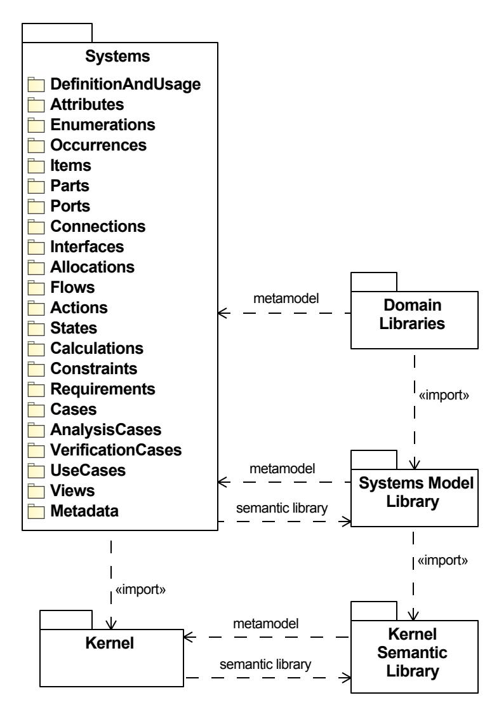

**Figure 1. SysML Language Architecture**

# <span id="page-43-0"></span>**6.2 Document Organization**

The rest of this document is organized into three major clauses.

- [Clause 7](#page-46-0) describes SysML from a user point of view. Its subclauses describe the modeling constructs in SysML, including for each a general overview, related abstract syntax diagrams and a description of the textual and graphical notation. The overviews in this clause should be considered informative. The abstract syntax and notation subclauses, however, are normative, including descriptions of the processing of the textual notation and its relationship to the graphical notation and the abstract syntax.
- [Clause 8](#page-194-0) provides the normative specification of the metamodel that defines the SysML language. This includes the concrete syntax (textual and graphical notations), the abstract syntax and the semantics for the language. The SysML abstract syntax and semantics are formally extensions of the Kernel abstract syntax and semantics provided by KerML (as discussed in [6.1](#page-42-1) ). However, this clause does not cover details of the Kernel metamodel, which are included by normative reference to the KerML specification [KerML].
- [Clause 9](#page-492-0) specifies a set of model libraries defined in SysML itself. The Systems Library extends the Kernel Library from [KerML] in order to provide systems-modeling-specific semantics to SysML language constructs. The Domain Libraries provide domain-specific models on which users can draw

when creating their own models. Each model library is described with a set of subclauses that covers each of the top-level packages in the model library, referred to as its *library models.*

These clauses are followed by informative [Annex A](#page-666-0) , which presents an example model using the SysML language as defined in this specification to illustrate how the language features can be used to model a system.

In addition, Clause 10 of [KerML] on Model Interchange is included by reference as a normative part of this specification in order to define allowable methods for interchanging SysML models.

# <span id="page-44-0"></span>**6.3 Acknowledgements**

The primary authors of this specification document and the syntactic and semantic models defined in it are:

- Sanford Friedenthal, SAF Consulting
- Ed Seidewitz, Model Driven Solutions
- Roger Burkhart, Thematix Partners
- Eran Gery, IBM
- Hisashi Miyashita, Mgnite
- Hans Peter de Koning, DEKonsult

Other contributors include:

- Oystein Haugen, Østfold University College
- Tomas Juknevicius, Dassault Systèmes
- Charles Krueger, BigLever Software

The specification was formally submitted for standardization by the following organizations:

- 88Solutions Corporation
- Dassault Systèmes
- GfSE e.V.
- IBM
- INCOSE
- Intercax LLC
- Lockheed Martin Corporation
- MITRE
- Model Driven Solutions, Inc.
- PTC
- Simula Research Laboratory AS
- Thematix Partners LLC

However, work on the specification was also supported by over 200 people in over 80 organizations that participated in the SysML v2 Submission Team (SST), by contributing use cases, providing critical review and comment, and validating the language design. The following individuals had leadership roles in the SST:

- Manas Bajaj, Intercax LLC (API and services development lead)
- Yves Bernard, Airbus (v1 to v2 transformation co-lead)
- Bjorn Cole, Lockheed Martin Corporation (metamodel development co-lead)
- Sanford Friedenthal, SAF Consulting (SST co-lead, requirements V&V lead)
- Charles Galey, Lockheed Martin Corporation (metamodel development co-lead)
- Karen Ryan, Siemens (metamodel development co-lead)
- Ed Seidewitz, Model Driven Solutions (SST co-lead, pilot implementation lead)
- Tim Weilkiens, oose (v1 to v2 transformation co-lead)

The specification was prepared using CATIA Magic/No Magic modeling tools and the OpenMBEE system for model publication [\(http://www.openmbee.org](http://www.openmbee.org/)), supported by the 3DEXPERIENCE platform, with the invaluable support of the following individuals:

- Tyler Anderson, Dassault Systèmes
- Christopher Delp, Jet Propulsion Laboratory
- Jackson Galloway, Dassault Systèmes
- Ivan Gomes, Twingineer
- Doris Lam, Jet Propulsion Laboratory
- Robert Karban, Jet Propulsion Laboratory
- Christopher Klotz, Dassault Systèmes
- John Watson, Lightstreet Consulting

The following individuals made significant contributions to the SysML v2 pilot implementation developed by the SST in conjunction with the development of this specification:

- Ivan Gomes, Twingineer
- Hisashi Miyashita, Mgnite
- Miyako Wilson, Georgia Institute of Technology
- Santiago Leon, Tom Sawyer
- William Piers, Obeo
- Tilo Schreiber, Siemens
- Zoltán Ujhelyi, IncQuery Labs

# <span id="page-46-0"></span>**7 Language Description**

(Informative)

# <span id="page-46-1"></span>**7.1 Language Overview**

The System Modeling Language (SysML) contains concepts that are used to model systems, their components, and the external environment in a context. It extends the Kernel Modeling Language (KerML) as specified in the KerML specification [KerML]. SysML directly uses some elements of KerML, but most SysML elements are specializations of KerML elements.

This clause provides an informative description of all these language concepts in their context of use in SysML. [Clause 8](#page-194-0) gives the full definition of the SysML metamodel, which is the normative specification for implementing the language. In contrast, the description in this clause focuses on how the various constructs of the language are used, along with the Systems Model Library (see [9.2](#page-492-2) ), to construct models. While non-normative, it is intended to be precise and consistent with the normative specification of the language.

SysML directly uses the following concepts from KerML:

- *Elements* and *relationships* that define the basic graph structure of a model (see [7.2](#page-47-0) ).
- *Dependencies* between modeling elements (see [7.3](#page-49-1) ).
- *Annotations* for attaching metadata to a model, including comments and textual representations (see [7.4](#page-50-1) ).
- *Namespaces* that contain and name elements, and, particularly, *packages* used to organize the elements in a model (see [7.5](#page-54-0) ).
- *Specialization* of elements that specify types, including subclassification, subsetting, redefinition and feature typing (see [7.6](#page-62-0) ).
- *Expressions* can be used to specify calculations, case results, constraints and formal requirements. The full KerML expression sub-language is available in SysML, as described in the KerML specification. The description of this sub-language is not repeated in the SysML specification document.

The modeling constructs specific to SysML, as specified in subclauses [7.6](#page-62-0) through [7.27](#page-188-0) , are built on the KerML foundation, and cover the following areas:

- Fundamental aspects of constructing a model, including:
  - The general pattern of *definition* and *usage*, which is applied to many of the SysML language constructs (see [7.6](#page-62-0) ). The pattern of definition and usage elements facilitates model reuse, such that a concept can be defined once and then used in many different contexts. A usage element can be further specialized for its specific context.
  - The modeling of *variability,* which includes the definition of *variation* points within a model where choices can be made to select a specific *variant,* and the selection of a particular variant may constrain the allowable choices at other variation points. A system can be *configured* by making appropriate choices at each of the variation points of a variability model, consistent with specified constraints. Variation points can be defined in any of the specific modeling areas listed below, so the ability to model variability is built into the base syntax of definitions and usages (see [7.6](#page-62-0) ).
- The modeling of attributive information about things, including:
  - *Attributes* that specify characteristics of something that can be defined by simple or compound data types, and dimensional quantities such as mass, length, etc. (see [7.7](#page-76-0) ).
  - *Enumerations* that are attributes restricted to a specified set of enumerated values (see [7.8](#page-78-0) ).
- The modeling of *occurrences* with temporal and spatial extent. Temporal extent enables an occurrence to be represented at specific points in time, over a duration in time, or over an entire lifetime. Spatial extent enables an occurrence to be represented at a position and orientation with respect to a coordinate frame, and to have a shape and size (see [7.9](#page-80-0) ).
- The modeling of *individuals* with specific identities (see [7.9](#page-80-0) ).

- The modeling of *structure* to represent how parts are decomposed, interconnected and classified, and includes:
  - *Items* that may flow through a process or system or be stored by a system (see [7.10](#page-87-0) ).
  - *Parts* that are the foundational units of structure, which can be composed and interconnected, to form composite parts and entire systems (see [7.11](#page-89-0) ).
  - *Ports* that define connection points on parts that enable interactions between parts (see [7.12](#page-92-0) ).
  - *Connections* (see [7.13](#page-94-2) ) and *interfaces* (see [7.14](#page-105-0) ) that define how parts and ports are interconnected.
  - *Allocations* that assign responsibility for realizing the features of one element by another element (see [7.15](#page-109-0) ).
- The modeling of *behavior,* which specifies how parts interact and includes:
  - *Flows* of values and items between parts and actions (see [7.16](#page-111-1) ).
  - *Actions* performed by a part, including their temporal ordering (see [7.17](#page-116-0) ).
  - *States* exhibited by a part, the allowable *transitions* between those states, and the actions enabled in a state or during a transition (see [7.18](#page-144-0) ).
- The modeling of *calculations* that are parameterized expressions that can be evaluated to produce specific results (see [7.19](#page-153-1) ).
- The modeling of *constraints,* which specify conditions that can be evaluated as true or false, or asserted to be true or false (see [7.20](#page-156-0) ).
- The modeling of *requirements,* which is a special kind of constraint that a *subject* must satisfy to be a valid solution (see [7.21](#page-160-0) ).
- The modeling of *cases,* which define the steps required to produce a desired result relative to a *subject*, possibly also involving external *actors,* to achieve a specific *objective* (see [7.22](#page-168-0) ), including:
  - *Analysis cases,* whose steps are the *actions* necessary to analyze a subject (see [7.23](#page-169-0) ).
  - *Verification cases,* whose objective is to verify how a requirement is satisfied by the subject (see [7.24](#page-172-0) ).
  - *Use cases,* that specify required behavior of the subject with the objective of providing a measurable benefit to one or more external actors (see [7.25](#page-176-0) ).
- The modeling of *viewpoint*s that specify information of interest by a set of stakeholders, and *views* that specify a query of the model, and a rendering of the query results, that is intended to satisfy a particular viewpoint (see [7.26](#page-180-0) ).
- The modeling of user-defined *metadata* that allows for both simple tagging of elements with additional model-level information and more sophisticated semantic extension of the SysML language. In a similar way that SysML extends KerML, modelers can use this metadata capability to build domain and userspecific extensions of SysML, both syntactically and semantically. This allows SysML to be highly adaptable for specific application domains and user needs, while maintaining a high level of underlying standardization and tool interoperability. (See [7.27](#page-188-0) .)

It should be noted that SysML does not contain specific language constructs called system, subsystem, assembly, component, and many other commonly used terms. An entity with structure and behavior in SysML is represented simply as a part (see [7.11](#page-89-0) ). The language provides straightforward extension mechanisms to specify terminology that is appropriate for the domain of interest.

# <span id="page-47-0"></span>**7.2 Elements and Relationships**

# <span id="page-47-1"></span>**7.2.1 Elements and Relationships Overview**

*Metamodel references:*

- *Textual notation, [8.2.2.2](#page-197-0)*
- *Graphical notation, [8.2.3.2](#page-225-0)*
- *Abstract syntax, [8.3.2](#page-288-0)*
- *Semantics, none*

*Elements* are the constituents of a model. Some elements represent *relationships* between other elements, known as the *related elements* of the relationship. One of the related elements of a relationship may be the *owning* related

element of the relationship. If the owning related element of a relationship is deleted from a model, then the relationship is also deleted. Some of the related elements of a relationship (distinct from the owning related element, if any) may be *owned* related elements. If a relationship has owned related elements, then, if the relationship is deleted from a model, all its owned related elements are also deleted.

The *owned relationships* of an element are all those relationships for which the element is the owning related element. The *owned elements* of an element are all those elements that are owned related elements of the owned relationships of the element (notice the extra level of indirection through the owned relationships). The *owning relationship* of an element (if any) is the relationship for which the element is an owned related element (of which the element can have at most one). The *owner* of an element (if any) is the owning related element of the owning relationship of the element (again, notice the extra level of indirection through the owning relationship).

The deletion rules for relationships imply that, if an element is deleted from a model, then all its owned relationships are also deleted and, therefore, all its owned elements. This may result in a further cascade of deletions until all deletion rules are satisfied. An element that has no owner acts as the *root element* of an *ownership tree structure,* such that all elements and relationships in the structure are deleted if the root element is deleted. Deleting any element other than the root element results in the deletion of the entire subtree rooted in that element.

Graphically, non-relationship elements are generally represented using a box-like shape or other icon, while relationships are shown using lines connecting the symbols for the related elements. However, in some cases, additional shapes may be attached to relationship lines in order to present additional information. The specific conventions for such graphical notations are covered in subsequent subclauses.

# <span id="page-48-0"></span>**7.2.2 Elements**

Various specific kinds of model elements in SysML are described in subsequent subclauses. However, there are certain concepts that apply to all model elements.

Every element has a unique identifier known as its *element ID*. The properties of an element can change over its lifetime, but its element ID does not change after the element is created. An element may also have additional identifiers, its *alias IDs,* which may be assigned for tool-specific purposes. The SysML notation, however, does not have any provision for specifying element or alias IDs, since these are expected to be managed by the underlying modeling tooling. Instead, an element can be given a *name* and/or a *short name,* and it can also have any number of alias names relative to one or more namespaces (see [7.5](#page-54-0) ).

In most cases, an element is *declared* using a keyword indicating the *kind* of element it is (e.g., **part def** or **attribute**). The declaration of an element may also specify a short name and/or name for it, in that order. The short name is distinguished by being surrounded by the delimiting characters < and >.

**part** <'1.2.4'> myName;

While the language makes no formal distinction between names and short names, the intent is that the name of an element should be fully descriptive, particularly in the context of the definition of the element, while the short name, if given, should be an abbreviated name useful for referring to the element. Note also that it is not required to specify either a name or a short name for an element. However, unless at least one of these is given, it is not possible to reference the element using the textual notation (though it is still possible to show it in relationships on graphical diagrams).

Names and short names can contain essentially any printable characters (and certain control characters). However, when written in the textual notation, they must be represented with a specific lexical structure, which has two variants.

1. A *basic name* is one that can be lexically distinguished in itself from other parts of the textual notation. The initial character of a basic name must be a lowercase letter, an uppercase letter or an underscore. The remaining characters of a basic name can be any character allowed as an initial character or any digit.

However, a reserved word may not be used as a name, even though it has the form of a basic name (see [8.2.2.1.2](#page-196-0) for the list of the reserved words in SysML).

```
Vehicle
power_line
```

2. An *unrestricted name* provides a way to represent a name that contains any character. It is represented as a non-empty sequence of characters surrounded by single quotes. The name consists of the characters *within* the single quotes – the single quotes are *not* included as part of the represented name. The characters within the single quotes may not include non-printable characters (including backspace, tab and newline). However, these characters may be included as part of the name itself through use of an escape sequence. In addition, the single quote character or the backslash character may only be included within the name by using an escape sequence.

```
'+'
'circuits in line'
'On/Off Switch'
'Ångström'
```

An *escape sequence* is a sequence of two text characters starting with a backslash as an escape character, which actually denotes only a single character (except for the newline escape sequence, which represents however many characters is necessary to represent an end of line in a specific implementation). See [KerML, 8.2.2.3] for a complete description of unrestricted names and escape sequences.

In addition to its declaration, the representation for an element may also list other elements *owned* by the containing element. In the textual notation, such owned elements are shown represented as a *body* delimited by curly braces {...}, particularly when the owning element is a namespace (see [7.5](#page-54-0) ). In the graphical notation, owned elements may be shown in *compartments* within the symbol representing the owning element, particularly when the owning element is a package, definition or usage (see [7.5](#page-54-0) and [7.6.1](#page-62-1) ).

# <span id="page-49-0"></span>**7.2.3 Relationships**

A relationship is a kind of element that relates two or more other elements. Some relationships are constrained to have exactly two related elements (i.e., *binary* relationships) while others may have more. The related elements of relationships are ordered. A relationship may designate certain of its related elements as *sources* with the rest being *targets*. In this case, the relationship is said to be *directed* from the sources to the targets. An *undirected* relationship simply designates all its related elements to be targets, with no source elements.

A relationship may also be the source or target of other relationships. In particular, a relationship may be annotated by being the target of an annotation relationship (see [7.4](#page-50-1) ). In some cases, the annotating element may be owned by the annotated relationship via the annotation relationship, particularly in the case of a documentation comment (see [8.2.2.4.2](#page-197-4) ).

# <span id="page-49-1"></span>**7.3 Dependencies**

# <span id="page-49-2"></span>**7.3.1 Dependencies Overview**

*Metamodel references:*

- *Textual notation, [8.2.2.3](#page-197-1)*
- *Graphical notation, [8.2.3.3](#page-226-0)*
- *Abstract syntax, [8.3.3](#page-289-0)*
- *Semantics, none*

A *dependency* is a kind of relationship between any number of client (source) and supplier (target) elements. This implies that a change to a supplier element may result in a change to a client element. Dependencies can be useful for representing relationships between elements in an abstract way. For example, a dependency can be used to

represent that an upper layer of an architecture stack may depend on a lower layer of the stack. A dependency can also be extended to reflect more specialized relationships, such as refinement (e.g., by using user-defined keywords, see [7.27](#page-188-0) ).

**Table 1. Dependencies – Representative Notation**

<span id="page-50-3"></span>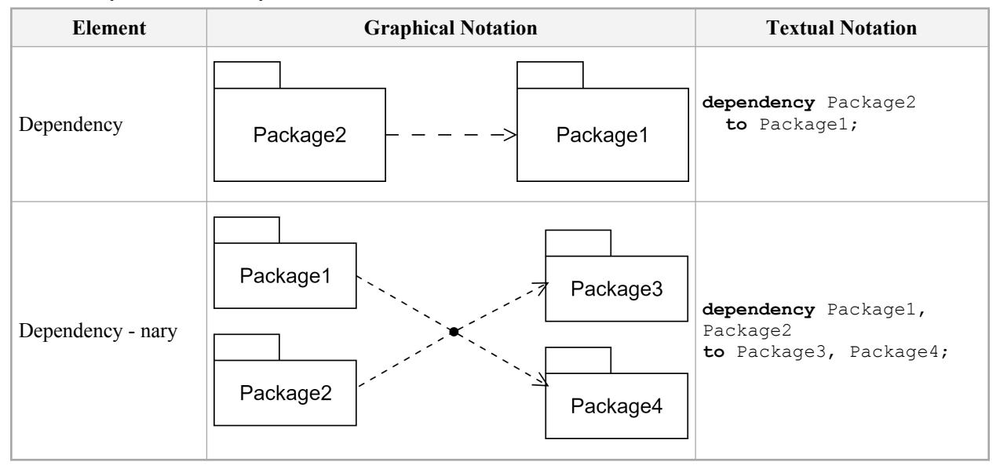

# <span id="page-50-0"></span>**7.3.2 Dependency Declaration**

A dependency is declared textually using the keyword **dependency**. The client elements of the dependency are then given as a comma-separated list of qualified names following the keyword **from**, followed by a similar list of the supplier elements after the keyword **to**. If no short name or name is given for the dependency, then the keyword **from** may be omitted.

```
dependency Use
    from 'Application Layer' to 'Service Layer';
// 'Service Layer' is the client of this dependency, not its name.
dependency 'Service Layer'
    to 'Data Layer', 'External Interface Layer';
```

A dependency declaration may also optionally have a body containing any annotating elements owned by the dependency via annotation relationships (see [7.4](#page-50-1) ).

```
dependency 'Service Layer'
    to 'Data Layer', 'External Interface Layer' {
    /* 'Service Layer' is the client of this dependency,
     * not its name. */
}
```

# <span id="page-50-1"></span>**7.4 Annotations**

# <span id="page-50-2"></span>**7.4.1 Annotations Overview**

*Metamodel references:*

- *Textual notation, [8.2.2.4](#page-197-2)*
- *Graphical notation, [8.2.3.4](#page-226-1)*
- *Abstract syntax, [8.3.4](#page-289-1)*

# • *Semantics, none*

An *annotating element* is an element that is used to provide additional information about other elements. An annotation is a relationship between an annotating element and an annotated element that is being described. An annotating element can annotate multiple annotated elements, and each element can have multiple annotations.

A *comment* is one kind of annotating element that is used to provide textual descriptions about other elements. Comments can be members of namespaces and, therefore, can be named. Such member comments may be about the namspace that owns them, or they may be about different elements. *Documentation* is a distinguished kind of comment used to document the annotated element. Documentation comments always annotate a single element, which is their owning element.

A *textual representation* is an annotating element whose textual body provides a representation of the annotated element in a specifically named language. This representation may be in the SysML textual notation or it may be in another language. If the named language is machine-parsable, then the body text should be legal input text as defined for that language. In particular, annotating a SysML model element with a textual annotation in a language other than SysML can be used as a semantically "opaque" element specified in the other language.

It is also possible to annotate elements with user-defined *metadata,* allowing both syntactic and semantic extension of SysML. This capability is described in [7.27](#page-188-0) .

**Table 2. Annotations – Representative Notation**

<span id="page-51-0"></span>

| Element                                                     | Graphical Notation | Textual Notation                                        |
|-------------------------------------------------------------|--------------------|---------------------------------------------------------|
| Comment                                                     |                    | /*This is a comment.*/                                  |
| Comment                                                     |                    | comment Comment1<br>/*This is a comment.*/              |
| Documentation                                               |                    | doc /*This is<br>documentation.*/                       |
| Documentation                                               |                    | doc Document1<br>/*This is<br>documentation.*/          |
| Documentation with<br>locale (in French,<br>region Belgium) |                    | doc locale "fr_BE"<br>/* Ceci n'est pas une<br>pipe. */ |

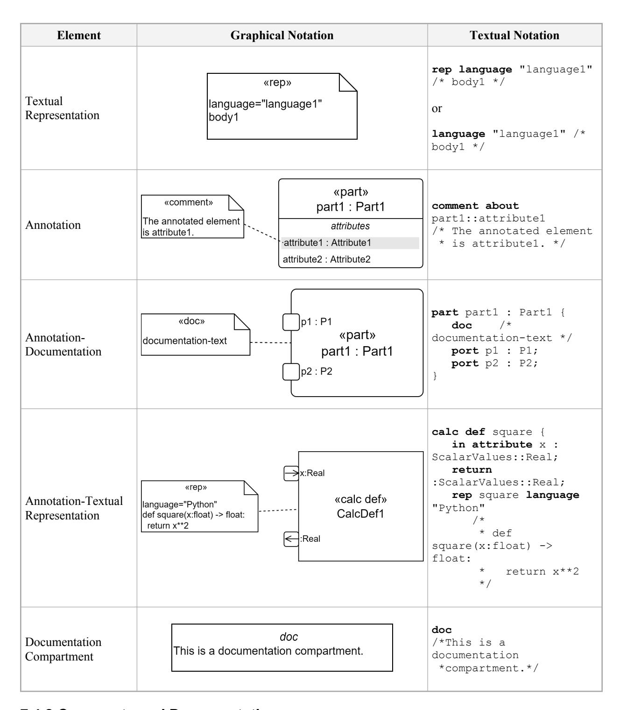

# <span id="page-52-0"></span>**7.4.2 Comments and Documentation**

The full declaration of a comment begins with the keyword **comment**, optionally followed by a short name and/or name (see [7.2](#page-47-0) ). One or more qualified names of annotated elements for the comment, separated by commas, are then given after the keyword **about**, indicating that the comment has annotation relationships to each of the identified elements. The body of the comment is written lexically as text between /\* and \*/ delimiters.

```
item A;
part B;
comment Comment1 about A, B
    /* This is the comment body text. */
```

If the comment is an owned member of a namespace (see [7.5](#page-54-0) ), then the explicit identification of annotated elements can be omitted, in which case the annotated element is implicitly the containing namespace. Further, in this case, if no short name or name is given for the comment, then the **comment** keyword can also be omitted.

```
package P {
    comment C /* This is a comment about P. */
    /* This is also a comment about P. */
}
```

A *locale* can also be specified for a comment, using the keyword **locale** followed by the locale string, placed immediately before the comment body (whether or not the **comment** keyword is used). The locale identifies the language of the body text and, optionally, the region and/or encoding. The format is

```
language[_territory][.codeset][@modifier] (conformant to [ISO15897]).
```

```
comment C_US_English locale "en_US"
    /* This is US English comment text */
```

A documentation comment is notated similarly to a regular comment, but using the keyword **doc** rather than **comment**. The documenting element of documentation is always the owning element of the documentation.

```
part X {
    doc X_Comment
        /* This is a documentation comment about X. */
    doc /* This is more documentation about X. */
}
```

When a comment is written in the textual notation, the actual body text of the comment is extracted from the lexical comment body according to the rules given in the KerML specification [KerML, 8.2.3.3.2]. The body text of a comment can include markup information (such as HTML), and a tool may graphically display such text as rendered according to the markup. However, marked up "rich text" for a comment is stored in the comment body in plain text including all mark up text, with all line terminators and white space included as entered, other than what is removed according to the rules referenced above.

# <span id="page-53-0"></span>**7.4.3 Textual Representation**

A textual representation is notated similarly to a regular comment, but with the keyword **rep** used instead of **comment**. As for documentation, a textual representation is always owned by its represented element. In particular, if the textual representation is an owned member of a namespace (see [7.5](#page-54-0) ), then the represented element is the containing namespace. A textual representation declaration must also specify the language as a literal string following the keyword **language**. If the textual representation has no short name or name, then the **rep** keyword can also be omitted.

```
part def C {
    attribute x: Real;
    assert x_constraint {
        rep inOCL language "ocl"
        /* self.x > 0.0 */
    }
}
action def setX(c : C, newX : Real) {
    language "alf"
        /* c.x = newX;
         * WriteLine("Set new x");
```

\*/ }

The lexical comment text given for a textual representation is processed as for regular comment text, and it is the result after such processing that is the textual representation body expected to conform to the named language.

**Note.** Since the lexical form of a comment is used to specify the textual representation body, it is not possible to include comments of a similar form in the body text.

The language name in a textual representation is case insensitive. The name can be of a natural language, but will often be for a machine-parsable language. In particular, there are recognized standard language names.

If the language is "sysml", then the body of the textual representation must be a legal representation of the represented element in the SysML textual notation. A tool can use such a textual representation to record the original SysML notation text from which an element is parsed. Other standard language names that can be used in a textual representation include "kerml", "ocl", and "alf", in which case the body of the textual representation must be written in the Kernel Modeling Language [KerML], Object Constraint Language [OCL] or the Action Language for fUML [Alf], respectively. (This is the same set of standard language names as in [KerML, 7.2.4.3, 8.3.2.3], with the addition of "sysml".)

However, for any other language than "sysml", the SysML specification does not define how the body text is to be semantically interpreted as part of the model being represented. An element with no other definition than a textual representation in a language other than SysML is essentially a semantically "opaque" element specified in the other language. Nevertheless, a conforming SysML tool may (but is not required to) interpret such an element consistently with the specification of the named language.

# <span id="page-54-0"></span>**7.5 Namespaces and Packages**

# <span id="page-54-1"></span>**7.5.1 Namespaces Overview**

*Metamodel references:*

- *Textual notation, [8.2.2.5](#page-198-0)*
- *Graphical notation, [8.2.3.5](#page-228-0)*
- *Abstract syntax, [8.3.5](#page-290-0)*
- *Semantics, none*

A *namespace* is a kind of element that can contain other elements and provide names for them. The elements contained in a namespace are referred to as its *member elements. Membership* is a kind of relationship that relates a namespace to its members. A membership relationship can specify the name by which its member element is known relative to the containing namespace and whether the element membership is visible outside the namespace or not (see [7.5.2](#page-57-0) ).

An element may be *owned* via its membership in a namespace. When a namespace is deleted, all such owned members will also be deleted. An element may also have a membership in a namespace without being owned by the namespace. In this case, the membership may introduce an *alias* name for the element relative to the namespace. Note that it is possible for an element to have both owning and non-owning memberships with the same namespace, but it can have at most one owning membership across all namespaces.

An *import* relationship allows one namespace to import memberships from another namespace (see [7.5.3](#page-58-0) ). The member elements from imported memberships become (unowned) members of the importing namespace in addition to being members of the imported namespace. In particular, this allows members of the imported namespace to be referenced in textual notations within the scope of the importing namespace without having to qualify the member names with the name of the imported namespace. An import can also be *recursive*, which means that, in addition to importing members of the referenced namespace itself, all namespaces that are owned members of the imported package are also recursively imported.

A *package* is a kind of namespace that is used solely as a container for other elements to organize the model. In addition, a package has the capability to *filter* imported elements based on certain conditions (see [7.5.4](#page-60-0) ), usually defined in terms of the metadata provided by annotations of those elements (see [7.4](#page-50-1) and [7.27](#page-188-0) ). Only elements that meet all filter conditions actually become imported members of the package. Together, recursive import and filtering provide a general capability for specifying that a package automatically contain a set of elements identified from across a model by their metadata.

In addition to packages, all kinds of SysML *definitions* and *usages* are also namespaces (see [7.6](#page-62-0) and following subclauses). All rules discussed generically for namespaces in this subclause [7.5](#page-54-0) apply generically to packages, definitions and usages (even though the examples in this subclause are given using packages).

In general, an element may have different names in different namespaces, and the same name may identify different elements relative to different namespaces. Therefore, to unambiguously identify an element by name, the element name must be *qualified* by the namespace relative to which the element name is to be resolved. Such a *qualified name* is notated by specifying a name to identify the namespace, followed by the symbol ::, followed by the element name. Since the namespace name may also be qualified, a qualified name is most generally a sequence of *segment names* separated by :: punctuation, of which all but the last must identify namespaces. An *unqualified name* can be considered the degenerate case of a qualified name with just one element name in its sequence, for which the namespace to be used is implicit.

Note that qualified names do not appear in the abstract syntax. Instead, the abstract syntax representation contains actual references to the identified elements. *Name resolution* is the process of determining the element that is identified by a qualified name. An unqualified name used within the body of a namespace is resolved in the context of that namespace and, potentially, other namespaces in which the first namespace is lexically nested, taking into account imported (see [7.5.3](#page-58-0) ) and inherited (see [7.6](#page-62-0) ) memberships. A qualified name with more than one segment is resolved by recursively resolving the name of the qualifying namespace and then resolving the element name in that context. The full name resolution process is specified in [KerML, 8.2.3.5].

**Table 3. Packages – Representative Notation**

<span id="page-55-0"></span>

| Element                       | Graphical Notation | Textual Notation                             |
|-------------------------------|--------------------|----------------------------------------------|
| Package (name in<br>body)     |                    | package Package1;                            |
| Package (name in<br>tab)      |                    | package Package1;                            |
| Package with owned<br>package |                    | package Package1 {<br>package Package2;<br>} |

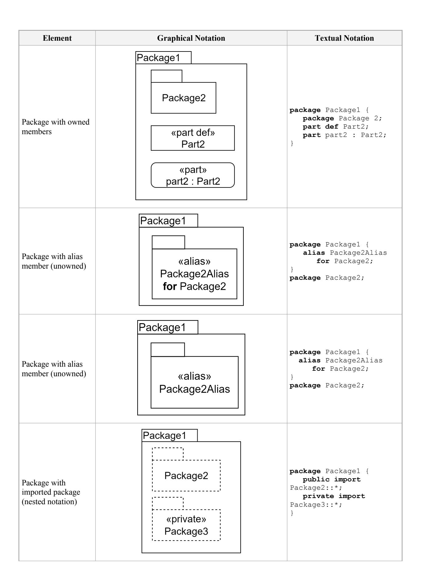

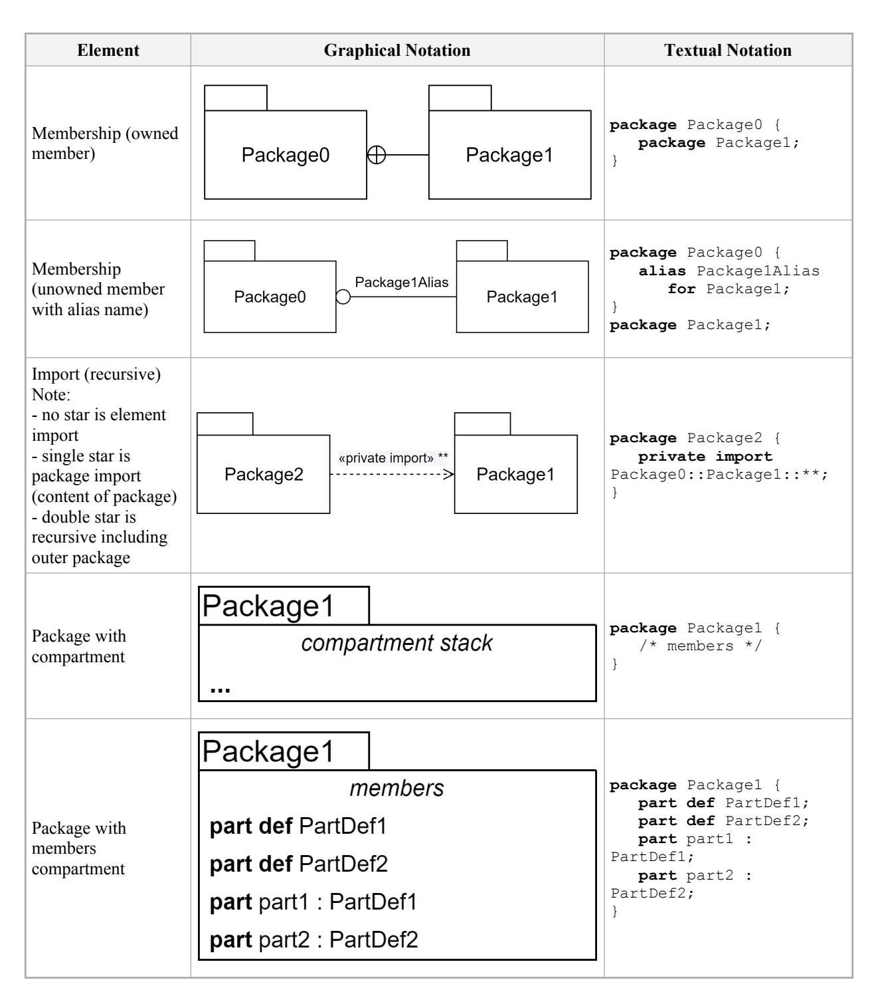

# <span id="page-57-0"></span>**7.5.2 Owned Members and Aliases**

A package is declared using the keyword **package**, with the *owned members* of the package listed in its body.

```
package Configurations {
    attribute def ConfigEntry {
        attribute key: String;
        attribute value: String;
    }
```

```
item ConfigData {
        attribute entries[*]: ConfigEntry;
    }
}
```

In general, declaring an element within the body of a namespace denotes that the element is an owned member of the namespace—that is, that there is an *owning membership* relationship between the namespace and the member element. The *visibility* of the membership can be specified by placing one of the keywords **public**, **protected** or **private** before the public element declaration. If the membership is **public** (the default), then it is visible outside of the namespace. If it is **private***,* then it is not visible. For namespaces other than definitions and usages, **protected** visibility is equivalent to **private**. For definitions and usages, **protected** visibility has a special meaning relating to member inheritance (see [7.6](#page-62-0) ).

```
package P {
    public part def A;
    private attribute def B;
    part a : A; // public by default
}
```

An *alias* for an element is a non-owning membership of the element in a namespace, which may or may not be the same namespace that owns the element. An alias name or short name is determined only relative to its membership in the namespace, and can therefore be different than the name or short name defined on the element itself. Note that the same element may be related to a namespace by multiple alias memberships, allowing the element to have multiple, different names relative to that namespace.

An alias is declared using the keyword **alias** followed by the alias short name and/or name, with a qualified name identifying the element given after the keyword **for**. An alias declaration may also optionally have a body containing annotating elements for the alias (see [8.2.2.4.1](#page-197-3) ). The visibility of the alias membership can be specified as for an owned member.

```
package P1 {
    item A;
    item B;
    alias <C> CCC for B {
        doc /* Documentation of the alias. */
    }
    private alias D for B;
}
```

A comment (see [7.4](#page-50-1) ), including documentation, declared within a namespace body also becomes an owned member of the namespace. If no annotated elements are specified for the comment (with an **about** clause), then, by default, the comment is considered to be about the containing namespace.

```
package P9 {
    item A;
    comment Comment1 about A
        /* This is a comment about item A. */
    comment Comment2
        /* This is a comment about package P9. */
    /* This is also a comment about package P9. */
    doc P9_Doc
         /* This is documentation about package P9. */
}
```

# <span id="page-58-0"></span>**7.5.3 Imports**

An owned *import* of a Namespace is denoted using the keyword **import** followed by a qualified name, optionally suffixed by "::\*" and/or "::\*\*".

If the qualified name in an **import** does *not* have any suffix, then this specifies a *membership import* whose imported membership is identified by the qualified name. Such an import results in the identified membership becoming an *imported membership* of the namespace owning the import. That is, the member element of this membership becomes an *imported member* of the importing namespace. Note that the imported membership may be an alias membership (see [7.5.2](#page-57-0) ), in which case the element is imported with that alias name.

```
package P2 {
    private import P1::A;
    private import P1::C; // Imported with name "C".
    package Q {
        import C; // "C" is re-imported from P2 into Q.
    }
}
```

If the qualified name in an **import** is further suffixed by "::\*", then then this specifies a *namespace import* in which the qualified name identifies the *imported namespace*. In this case, all visible memberships of the imported namespace of the import become imported memberships of the importing namespace.

```
package P3 {
    // Memberships A, B and C are all imported from P1.
    private import P1::*;
}
```

If the declaration of either a membership or namespace import is further suffixed by "::\*\*", then the import is *recursive.* Such an import is equivalent to importing memberships as described above for either an imported membership or namespace, followed by further recursively importing from each imported member that is itself a namespace, with the following limitations:

- 1. Recursive import only continues with a namespace that is either the imported element of an original recursive membership import or an owned member of an imported namespace.
- 2. Memberships inherited via implicit specializations (of any kind) are not imported by recursive imports (see also [7.6.8](#page-75-0) on Implicit Specialization).

```
package P4 {
    item A;
    item B;
    package Q {
        item C;
    }
}
package P5 {
    private import P4::**;
    // The above recursive import is equivalent to all
    // of the following taken together:
    // private import P4;
    // private import P4::*;
    // private import P4::Q::*;
}
package P6 {
    private import P4::*::**;
    // The above recursive import is equivalent to all
    // of the following taken together:
    // private import P4::*;
    // private import P4::Q::*;
    // (Note that P4 itself is not imported.)
}
```

The *visibility* of an import is always shown explicitly by placing the keyword **private**, **protected**, or **public** before the import declaration. If the import is **private** (which is the default in the abstract syntax), then the imported memberships become private relative to the importing namespace. A visibility of **protected** is the same as **private**, unless the importing namespace is a definition or usage, in which case the imported memberships are also visible in all specializations of the definition or usage (see also [7.6](#page-62-0) on inheritance). If the import is **public**, then all the imported memberships become public for the importing namespace. An import declaration may also optionally have a body containing annotating elements owned by the import (see [8.2.2.4.1](#page-197-3) ).

```
package P7 {
    public import P1::A {
        /* The imported membership is visible outside P7. */
    }
    private import P4::* {
        doc /* None of the imported memberships are visible
             * outside of P7. */
}
```

# <span id="page-60-0"></span>**7.5.4 Import Filtering**

A package may also contain *filter conditions* that filter the imports for the package. A filter condition is a Booleanvalued, model-level evaluable expression (see [KerML. 7.4.9]) declared using the keyword **filter** followed by a Boolean-valued, model-level evaluable expression (see [KerML. 7.4.9]). The filter conditions of a package are evaluated on the member elements of all memberships that are potentially to be imported into the package (see [7.5.3](#page-58-0) ). Only those memberships that for which all the filter conditions evaluate to true are actually imported.

Filter conditions can, for example, be used to select which elements to import into a package based on *metadata* applied to those elements (see also [7.27](#page-188-0) on metadata).

```
package ApprovalMetadata {
    metadata def Approval {
        attribute approved : Boolean;
        attribute approver : String;
        attribute level : Natural;
    }
    ...
}
package DesignModel {
    public import ApprovalMetadata::*;
    part System {
         @Approval {
            approved = true;
            approver = "John Smith";
            level = 2;
        }
    }
    ...
}
package UpperLevelApprovals {
    // This package imports all direct or indirect members
    // of the DesignModel package that have been approved
    // at a level greater than 1.
    public import DesignModel::**;
    filter @ApprovalMetadata::Approval and
           ApprovalMetadata::Approval::approved and
           ApprovalMetadata::Approval::level > 1;
}
```

Note that a filter condition in a package will filter *all* imports of that package. That is why full qualification is used for ApprovalMetadata::Approval in the example above, since an imported element of the ApprovalMetadata package would be filtered out by the very filter condition in which the elements are intended to be used. This may be avoided by combining one or more filter conditions with a *specific* import in a *filter import* declaration.

A filter import includes one or more filter conditions in the import declaration, listed after the imported membership or namespace specification, each surrounded by square brackets [... ]. For such a filtered import, memberships are imported, from that specific import, if and only if they satisfy all the given filter conditions.

```
package UpperLevelApprovals {
    // Recursively import all annotation data types and all
    // features of those types.
    private import ApprovalMetadata::**;
    // The filter condition for this import applies only to
    // elements imported from the DesignModel package.
    public import DesignModel::**[@Approval and approved and level > 1];
}
```

The SysML package from the Systems Model Library (see [9.2.22](#page-551-0) ) contains a complete model of the SysML abstract syntax represented in SysML itself, and it publicly imports the KerML package from the Kernel Library containing the Kernel abstract syntax model (see [KerML, 9.2.17]). When a filter condition is evaluated on an element, abstract syntax metadata for the element can be tested as if the element had an implicit metadata usage (see [7.27](#page-188-0) ) defined by the definition from the SysML package corresponding to the abstract syntax metaclass of the element.

```
package PackageApprovals {
    private import ApprovalMetadata::*;
    private import SysML::*;
    // This imports all part definitions from the DesignModel that have
    // at least one owned part usage and have been marked as approved.
    public import DesignModel::**[@PartDefinition and
                           @PartDefinition::ownedPart != null and
                           @Approval and
                           Approval::approved];
}
```

**Note.** Namespaces other than packages cannot have filter conditions (except for their special use in view definitions and usages – see [7.26](#page-180-0) ). However, any kind of namespaces may have filtered imports.

# <span id="page-61-0"></span>**7.5.5 Root Namespaces**

A *root namespace* is a namespace that has no owner. The owned members of a root namespace are known as *toplevel elements*. Any element that is not a root namespace has an owner and, therefore, must be in the ownership tree of a top-level element of some root namespace.

The declaration of a root namespace is implicit and no identification of it is provided in the SysML notation. Instead, the content of a root namespace is given simply by the list of its top-level elements. For the purposes of model interchange (see [KerML, Clause 10]), a single *project* may contain one or more root namespace, though there is no syntax for defining a project in the SysML syntax.

```
doc /* This is a model notated in SysML textual notation. */
item def I;
attribute def A;
item i: I;
package P;
```

While a root namespace has no explicit owner, it is considered to be within the scope of a single *global namespace.* This global namespace may contain several root namespaces (such as those being managed as a project), and always contains at least all of the KerML and SysML model libraries (see [KerML, Clause 9] and [Clause 9](#page-492-0) ). Any root namespace within the global namespace may refer to the name of a top-level element of any other root namespace using an unqualified name (since root namespaces are themselves never named).

If an import is owned by a root namespace, then the memberships imported by it are visible to and within all the toplevel elements of the root namespace. However, an import owned by a root namespace is required to be **private**, so none of the imported memberships become globally visible outside of the root namespace. (This rule disallows the "re-export" of the same element from multiple different root namespaces, which would cause ambiguity that could complicate the resolution of unqualified, globally-visible names.)

# <span id="page-62-0"></span>**7.6 Definition and Usage**

# <span id="page-62-1"></span>**7.6.1 Definition and Usage Overview**

*Metamodel references:*

- *Textual notation, [8.2.2.6](#page-199-1)*
- *Graphical notation, [8.2.3.6](#page-230-0)*
- *Abstract syntax, [8.3.6](#page-292-0)*
- *Semantics, [8.4.2](#page-433-0)*

# **Definitions and Usages**

The modeling capabilities of SysML facilitate reuse in different contexts. Definition and usage elements provide a consistent foundation for many SysML language constructs to provide this capability, including attributes, occurrences, items, parts, ports, connections, interfaces, allocations, actions, states, calculations, constraints, requirements, concerns, cases, analysis cases, verification cases, use cases, views, viewpoints and renderings.

In general, a *definition* element classifies a certain kind of element (e.g., a classification of attributes, parts, actions, etc.). A *usage* element is a usage of a definition element in a certain context. A usage must always be defined by at least one definition element that corresponds to its usage kind. For example, a part usage is defined by a part definition, and an action usage is defined by an action definition. If no definition is specified explicitly, then the usage is defined implicitly by the most general definition of the appropriate kind from the Systems Library (see [9.2](#page-492-2) ). For example, a part usage is implicitly defined by the most general part definition Part from the model library package Parts.

# **Features**

A definition may have owned usage elements nested in it, referred to as its *features*. A usage may also have nested usage elements as features. In this case, the context for the nested usages is the containing usage. A simple example is illustrated by a parts tree that is defined by a hierarchy of part usages. A vehicle usage defined by Vehicle could contain part usages for engine, transmission, frontAxle, and rearAxle. Each part usage has its own (implicit or explicit) part definition.

A feature relates instances of its featuring definition or usage to instances of its definition. For example, a *mass* feature with definition MassValue, featured by the definition Vehicle, relates each specific instance of Vehicle to the specific MassValue for that vehicle, known as the *value* of the *mass* feature of the vehicle.

A usage can also be contained directly in an owning package. In this case, the usage element is considered to be an implicit feature of the most general kernel type Anything. That is, a package-level usage is essentially a generic feature that can be applied in any context, or further specialized in specific contexts (as described under Specialization below).

A usage may have a *multiplicity* that constrains its cardinality, that is, the allowed number of values it may have for any instance of its featuring definition or usage. The multiplicity is specified as a range, giving the lower and upper bound expressions that are evaluated to determine the lower and upper bounds of the specified range. The bounds must be natural numbers. The lower bound must be finite, but the upper bound may also have the infinite value \*. An upper bound value of \* indicates that the range is unbounded, that is, it includes all numbers greater than or equal to the lower bound value. If a lower bound is not given, then the lower bound is taken to be the same as the upper bound, unless the upper bound is \*, in which case the lower bound is taken to be 0. For example, a Vehicle definition could include a usage element called wheels with multiplicity 4, meaning each Vehicle has exactly four wheels. A less restrictive constraint, such as a multiplicity of 4..8, means each Vehicle can have 4 to 8 wheels.

A usage may be *referential* or *composite.* A referential usage represents a simple reference between a featuring instance and one or more values. A composite usage, on the other hand, indicates that the related instance is integral to the structure of the containing instance. As such, if the containing instance is destroyed, then any instances related to it by composite usages are also destroyed. For example, a Vehicle would have a composite usage of its wheels*,* but only a referential usage of the *road* on which it is driving.

**Note.** The concept of composition only applies to occurrences that exist over time and can be created and destroyed (see [7.9](#page-80-0) ). Attribute usages are always referential and any nested features of attributes definitions and usages are also always referential (see [7.7](#page-76-0) ).

# **Specialization**

Definition and usage elements can be specialized using several different kinds of *specialization* relationships.

A definition is specialized using the *subclassification* relationship. The specialized definition inherits the features of the more general definition element and can add other features. For example, if Vehicle has a feature called fuel, that is defined by Fuel, and Truck is a specialized kind of Vehicle, then Truck inherits the feature fuel. An inherited feature can be subsetted or redefined as described below. The Truck definition can also add its own features such as cargoSize.

A definition can specialize more than one other definition, in which case the definition inherits the features from each of the definitions it specializes. All inherited features must have names that are distinct from each other and any owned features of the specializing definition. Name conflicts can be resolved by redefining one or more of the otherwise conflicting inherited features (see below).

A usage inherits the features from its definition in the same way that a specialized definition inherits from a more general definition element. For example, if a part usage vehicle is defined by a part definition Vehicle, and Vehicle has a mass defined by MassValue, then vehicle inherits the feature mass*.* In some cases, a usage may have more than one definition element, in which case the usage inherits the features from each of its definition elements, with the same rules for conflicting names as described above for subclassification. A usage can also add its own features, and subset or redefine its inherited features. This enables each usage to be modified for its context.

A usage can be specialized using the *subsetting* relationship. A subsetting usage has a subset of the values of the subsetted usage. The subsetting usage may further constrain its definition and multiplicity. For the example above, Truck inherits the feature wheels with multiplicity 4..8 from Vehicle. The part usage truck further inherits wheels with multiplicity 4..8 from Truck. The part usage truck can subset wheels by defining frontLeftWheel, frontRightWheel, rearLeftwheel1, and rearRightWheel1, each with multiplicity 1..1, together giving the minimum total multiplicity of 4. The truck usage can then define additional subsets of wheels, such as rearLeftwheel2, and rearRightwheel2, with multiplicity 0..1, indicating they are optional.

*Redefinition* is a kind of subsetting. While, in general, a subsetting usage is an additional feature to the subsetted usage, a redefining usage *replaces* the redefined usage in the context of redefining usage. For the example above, Vehicle contains a feature called fuel that is defined by Fuel. Truck inherits fuel from Vehicle. The part usage truck would then normally inherit fuel as defined by Fuel from Truck. However, truck can instead redefine fuel to restrict its definition to DieselFuel, a subclassification of Fuel. In this case, the new redefining feature replaces the fuel feature that would otherwise be inherited, meaning that the fuel of the truck part must be defined by DieselFuel.

A usage, particularly one with nested usages, can be reused by subsetting it. For example, subsetting the part usage vehicle is analogous to specializing the part definition Vehicle. Suppose vehicle1 is a part usage that subsets vehicle, with the parts-tree decomposition described above. This enables vehicle1 to inherit the features and structure of vehicle. The part usage vehicle1 can be further specialized by adding other part usages to it, such as a body and chassis, and it can redefine parts from vehicle as needed*.* For example, vehicle1 may redefine engine to be a 4-cylinder engine. The original part vehicle remains unchanged, but vehicle1 is a unique design configuration that specializes vehicle. Other part usages, such as vehicle2, could be created in a similar way to represent other design configurations.

**Note.** If the part definition Vehicle is modified, the modification will propagate down through the specializations described above. However, it is expected that if Vehicle is baselined in a configuration management tool, then a change to Vehicle is a new revision, and it is up to the modelers to determine whether to retain the previous version of Vehicle or move to the next revision.

# **Variability**

*Variation* and *variant* are used to model variability typically associated with a family of design configurations. A variation (sometimes referred to as a *variation point*) identifies an element in a model that can vary from one design configuration to another. One example of a variation is an engine in a vehicle. For each variation, there are design choices called variants. For this example, where the *engine* feature is designated as a point of variation, the design choices are a 4-cylinder engine variant or a 6-cylinder engine variant.

Variation can apply to any kind of definition or usage in the model (except for enumeration, see [7.8](#page-78-0) ). The variation element then specifies all possible variants (i.e., choices) for that variation point. For example, the specified variants for the engine variation are the 4-cylinder engine and the 6-cylinder engine.

Variants are usage elements. If the containing variation is a definition, then each of its variants is implicitly defined by the variation definition. If the containing variation is a usage, then each of its variants implicitly subsets the variation usage. For example, the 4-cylinder engine and the 6-cylinder engine are subsets of all possible engines.

Variations can be nested within other variations, to any level of nesting. For example, the 6-cylinder engine variant may in turn contain cylinders with a variation for bore diameter that includes variants for small-bore diameter and large-bore diameter. Alternatively, the bore diameter variation could be applied more generally to the cylinder of *engine*, enabling both the 4-cylinder engine and the 6-cylinder engine to have this variation point.

A model with variability can be quite complex since the variation can extend to many other aspects of the model including its structure, behavior, requirements, analysis, and verification. Also, the selection of a particular variant often impacts many other design choices that include other parts, connections, actions, states, and attributes. Constraints can be used to constrain the available choices for a given variant. For example, the choice of a 6-cylinder engine may constrain the choice of transmission to be an automatic transmission, whereas the choice of a 4-cylinder engine may allow for both an automatic transmission or a manual transmission.

Variations and variants are used to construct a model that is sometimes referred to as a superset model, which includes the variants to configure all possible design configurations. A particular configuration is selected by selecting a variant for each variation. SysML provides validation rules that can evaluate whether a particular configuration is a valid configuration based on the choices and constraints provided in the superset model. Variability modeling in SysML can augment other external variability modeling applications, which provide robust capabilities for managing variability across multiple kinds of models such as CAD, CAE, and analysis models, and auto-generating the variant design configurations based on the selections.

**Note.** The approach to variability modeling in SysML is intended to align with industry standards such as *ISO/IEC 26580:2021 Software and systems engineering — Methods and tools for the feature-based approach to software and systems product line engineering.*

# **Graphical Compartments**

The graphical notation for a definition or usage may include one or more *compartments*, which show member elements (if any) using textual or graphical notation. In the graphical symbols in all Representative Notation tables in [Clause 7](#page-46-0) , the term *compartment stack* is a placeholder for any valid compartment for the model element.

**Table 4. Definition and Usage – Representative Notation**

<span id="page-65-0"></span>

| Element                                                           | Graphical Notation | Textual Notation                                                                                                                                                   |
|-------------------------------------------------------------------|--------------------|--------------------------------------------------------------------------------------------------------------------------------------------------------------------|
| Name Compartment<br>- Definition (without<br>and with short name) |                    | part def PartDef1;<br>part def <pd2> PartDef2;</pd2>                                                                                                               |
| Name Compartment<br>- Definition                                  |                    | abstract part def<br>PartDef1 :> PartDef0;<br>package P {<br>alias PartDefAlias1<br>for PartDef1;<br>}<br>package Q {<br>alias PartDefAlias2<br>for PartDef1;<br>} |
| Name Compartment<br>- Definition<br>(qualified name)              |                    | package Package1 {<br>package Package2 {<br>part def PartDef3;<br>}<br>}                                                                                           |
| Name Compartment<br>- Definition<br>(abstract)                    |                    | abstract part def<br>PartDef1;                                                                                                                                     |
| Name Compartment<br>- Definition<br>(variation)                   |                    | variation part def<br>PartDef1;                                                                                                                                    |

| Element                                                      | Graphical Notation | Textual Notation                                                                                                                            |
|--------------------------------------------------------------|--------------------|---------------------------------------------------------------------------------------------------------------------------------------------|
| Name Compartment<br>- Usage (without and<br>with short name) |                    | part part1 : PartDef1;<br>part <'p#2'> part2 :<br>PartDef2;                                                                                 |
| Name Compartment<br>- Usage                                  |                    | part part1 {<br>part part2 {<br>part part3 :<br>PartDef3;<br>}<br>}                                                                         |
| Name Compartment<br>- Usage (abstract)                       |                    | abstract part part1 :<br>PartDef1; package P {<br>alias partAlias1<br>for part1;<br>}<br>package Q {<br>alias partAlias2<br>for part1;<br>} |
| Name Compartment<br>- Usage (variation)                      |                    | variation part part1 :<br>PartDef1;                                                                                                         |
| Name Compartment<br>- Usage (variant)                        |                    | variant part part1 :<br>PartDef1;                                                                                                           |
| Name Compartment<br>- Inherited Usage                        |                    | No textual notation.                                                                                                                        |
| Name Compartment<br>- Subsetted Usage                        |                    | part part1S : PartDef1S<br>[m]<br>subsets part1;                                                                                            |
| Name Compartment<br>- Redefined Usage<br>(with binding)      |                    | part part1R : PartDef1R<br>[m]<br>redefines part1 =<br>part2;                                                                               |

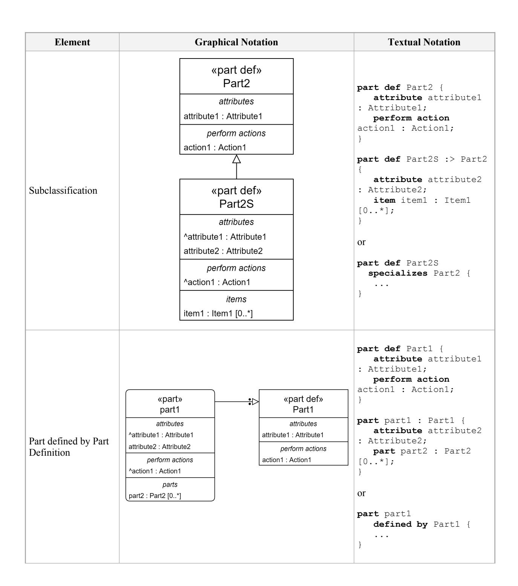

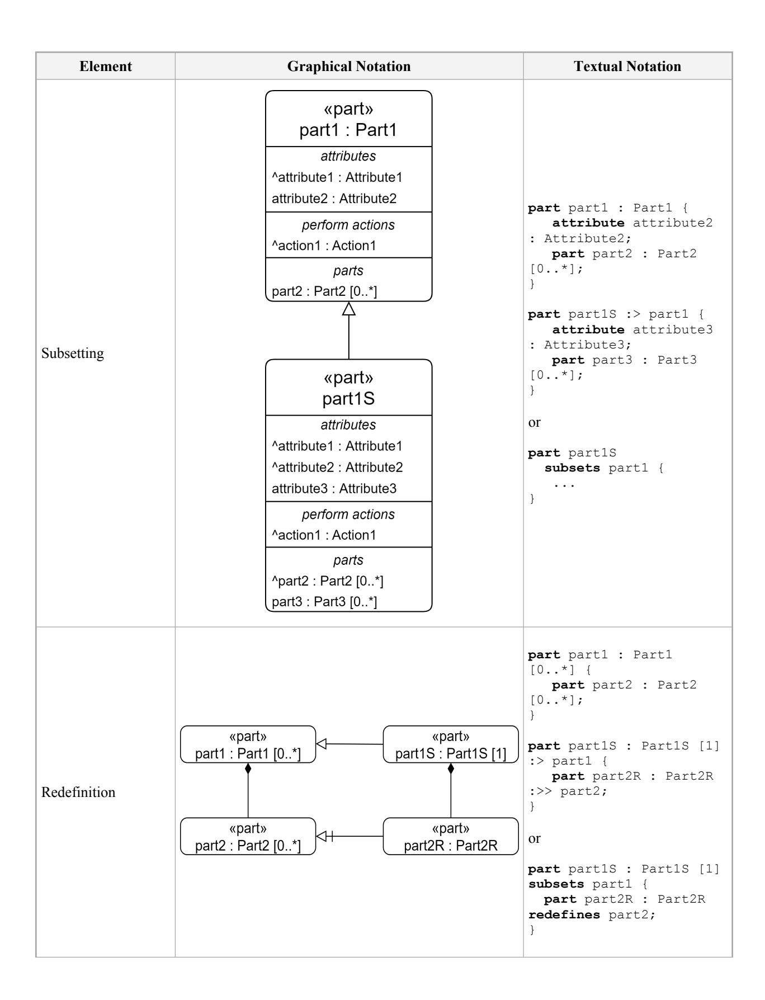

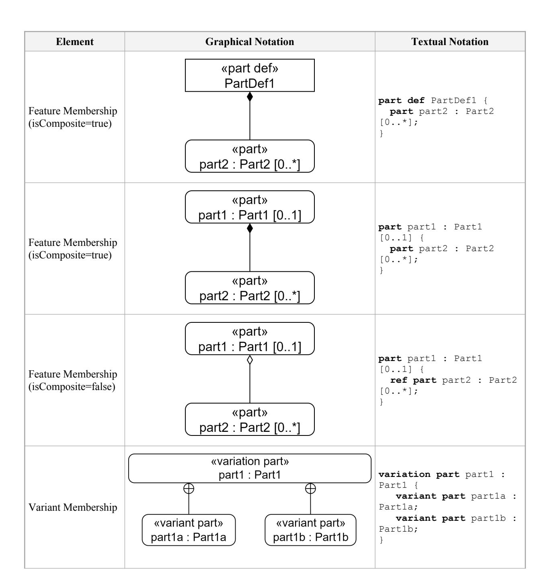

| Element                      | Graphical Notation | Textual Notation                                                                                                                                                                                                                                                                                                                              |
|------------------------------|--------------------|-----------------------------------------------------------------------------------------------------------------------------------------------------------------------------------------------------------------------------------------------------------------------------------------------------------------------------------------------|
| Variants<br>Compartment      | or<br>or           | variation item<br>itemChoice : ItemDef {<br>variant part1;<br>variant item1;<br>}<br>or<br>variation item<br>itemChoice : ItemDef {<br>variant part<br>references part1;<br>variant item<br>references item1;<br>}<br>or<br>variation item<br>itemChoice : ItemDef {<br>variant part part1 :<br>Part1;<br>variant item item1 :<br>Item1;<br>} |
| Variant Parts<br>Compartment |                    | variation part<br>partChoice : PartDef {<br>variant part part1 :<br>PartDef1;<br>variant part part2 :<br>PartDef2;<br>}                                                                                                                                                                                                                       |
| Relationships<br>Compartment |                    | part def PartDef1;<br>part def PartDef2 :><br>PartDef1;<br>part part1 : PartDef1;<br>part part2 : PartDef2 :><br>part1;<br>connect part2 to part3;<br>part part3;                                                                                                                                                                             |

# <span id="page-70-0"></span>**7.6.2 Definitions**

There is a basic common notation for all kinds of definitions, as described here in subclause [7.6](#page-62-0) , with additional special notations for certain kinds of definitions described in the later subclauses specifically related to those kinds of definitions. As a kind of Namespace (see [7.5](#page-54-0) ), the representation of a definition includes a *declaration* and a *body.*

A definition is declared using a keyword specific to the kind of definition (e.g., **item**, **part**, **action**, etc.) followed by the keyword **def**. One or more owned subclassifications may also optionally be included in the declaration of a definition by giving a comma-separated list of qualified names of the general definitions after the keyword **specializes** (or the symbol :>). A definition is specified as *abstract* by placing the keyword **abstract** before its kind keyword.

```
abstract part def Vehicle;
part def Automobile specializes Vehicle;
part def Truck :> Vehicle;
```

A definition that is not abstract is called a *concrete* definition. Declaring a definition to be abstract means that all instances of the definition must also be instances of at least one concrete definition or usage that directly or indirectly specializes the abstract definition.

The body of a definition is specified generically as for any namespace. In the textual notation, this is done by listing the members and imports between curly braces {... } (see [7.5](#page-54-0) ), or alternatively by a semicolon ; if the definition has no members or imports. Usages declared within the body of a definition are owned usages that specify *features* of the Definition.

```
item def Super {
    private package N {
        item def Sub specializes Super;
    }
   item f : N::Sub;
}
```

# <span id="page-71-0"></span>**7.6.3 Usages**

There is a basic common notation for all kinds of usages, as described here in subclause [7.6](#page-62-0) , with additional special notations for certain kinds of usage described in the later subclauses specifically related to those kinds of usages. As a kind of namespace (see [7.5](#page-54-0) ), the representation of a usage includes a *declaration* and a *body.*

A usage is declared using a keyword specific to the kind of usage (e.g., **item**, **part**, **action**, etc.). One or more owned specializations may also optionally be included in the declaration of a usage. There are three kinds of specializations relevant to usages:

- 1. *Feature typings* specify the definitions of a usage (also known as its *types*). Textually, they are declared by giving a comma-separated list of the qualified names of the definition elements after the keyword **defined by** (or the symbol :). The definitions given must be consistent with the kind of usage being defined.
- 2. *Subsettings* specify other usages subsetted by the owning usage. Textually, they are declared by giving a comma-separated list of the qualified names of the subsetted usages after the keyword **subsets** (or the symbol :>).
- 3. *Redefinitions* specify other usages redefined by the owning usage. Textually, they are declared by giving a comma-separated list of the qualified names of the redefined usages after the keyword **redefines** (or the symbol :>>). (Note that redefinition is a kind of subsetting, so the owned redefinitions of a usage will be a subset of the owned subsettings in the abstract syntax.)

```
item x : A, B :> f :>> g;
// Equivalent declaration:
item x defined by A defined by B subsets f redefines g;
```

The *multiplicity* of a usage can be given in square brackets [... ] after the name part of the declaration of a usage (if it is named) or after one of the owned specialization clauses in the declaration (but, in all cases, only one multiplicity may be specified). (This allows for a notation style consistent with previous modeling languages, in which the multiplicity is always placed after the declared type.)

A *multiplicity range* is written in the form [*lowerBound*..*upperBound*], where each of *lowerBound* and *upperBound* is either a literal or the identification of a usage. Literals can be used to specify a multiplicity range with fixed lower and/or upper bounds. The values of the bounds of a multiplicity range must be natural numbers. If only a single bound is given, then the value of that bound is used as both the lower and upper bound of the range, unless the result is the infinite value \*, in which case the lower bound is taken to be 0. If two bounds are given, and the value of the first bound is \*, then the meaning of the multiplicity range is not defined.

```
item def Person {
    ref item parent[2] : Person;
    ref item mother : Person[1..1] subsets parent;
    attribute numberOfChildren : Natural;
    ref item children[0..numberOfChildren] : Person;
}
item def ChildlessPerson specializes Person {
    ref item redefines children[0];
}
```

A multiplicity may be optionally followed by one or both of the following keywords (in either order), or they can be used without giving an explicit muiltiplicity, at any place in the declaration a multiplicity would be allowed.

- **nonunique** If a usage is *non-unique,* then the same value may appear more than once as a value of the usage. The default is that the usage is *unique,* meaning that no two values of the usage may be the same.
- **ordered** If a usage is *ordered,* then the values of the usage can be placed in order, indexed from 1 to the number of values. The default is that the feature is *unordered.*

If a multiplicity is not declared for a usage, then the usage inherits the multiplicity constraints of any other usages it subsets or redefines. If no tighter constraint is inherited, the effective default is the most general multiplicity [0..\*]. However, a tighter default of [1..1] is implicitly declared for the usage if all of the following conditions hold:

- 1. The usage is an attribute usage, an item usage (including a part usage, except if it is a connection usage), or a port usage.
- 2. The usage is owned by a definition or another usage (not a package).
- 3. The usage does not have any *explicit* owned subsettings or owned redefinitions.

There are a number of additional properties of a usage that can be flagged by adding specific keywords to its declaration. If present these are always specified in the following order, before the kind keyword in the usage declaration.

- 1. **in**, **out**, **inout** Specifies a *directed usage* with the indicated *direction*, which determines what things are allowed to change its values relative to its featuring instance.
  - **in** Things "outside" the featuring instance. These usages identify things input to an instance.
  - **out** The featuring instance itself or things "inside" it. These usages identify things output by an instance.
  - **inout** Both things "outside" and "inside" the featuring instance. These usages identify things that are both input to and output by an instance.
- 2. **derived** Specifies that the usage is *derived.* Such a feature is typically expected to have a bound value expression that completely determines its value at all times (see also [7.13.3](#page-103-0) on binding a usage to a value).
- 3. **abstract** Specifies that the usage is *abstract*. A usage that is not abstract is called a *concrete* usage. Similarly to an abstract definition (see [7.6.2](#page-70-0) ), declaring a usage to be abstract means that any value of the

- usage must also be a value of some concrete usage that directly or indirectly specializes (subsets or redefines) the abstract usage.
- 4. **constant** Specifies that the usage is *constant*. Values of a constant usage are the same during the entire existence of the featuring instance. Note that this only applies if the featuring instance is an occurrence and the usage is such that its values would otherwise be allowed to vary over time if it was not constrained to be constant (see also [7.9.2](#page-85-0) on occurrences and usages with time-varying values).
- 5. **ref** Specifies that the usage is *referential*. A usage that is not referential is *composite.* Values of a composite usage, for each featuring instance, cannot exist after the featuring instance ceases to exist. A composite usage must be featured by an occurrence (such as an item, part or action; see [7.9](#page-80-0) and following). This only applies to values at the time the instance goes out of existence, not to other things that may have been values of the usage before that, but are not any longer. Values of a composite usage cannot be values of another composite usage unless it is on the same featuring instance. (Note also that a directed usage is always referential, whether or not the keyword **ref** is also given explicitly in its declaration.)

```
abstract part def Container {
    abstract ref item content;
}
part def Tank :> Container {
    in item fuelFlow : Fuel;
    ref item fuel : Fuel :>> content;
}
```

(See also the discussion of end features in [7.13.2](#page-99-0) .)

The body of a usage is specified generically as for any namespace. In the textual notation, this is done by listing the members and imports between curly braces {... } (see [7.5](#page-54-0) ), or alternatively by a semicolon ; if it has no members or imports. Usages declared within the body of another Usage are owned (*nested*) usages that specify *features* of the owning usage.

```
part vehicle : Vehicle {
    part wheelAssembly[2] {
        part axle : Axle;
        part wheel : Wheel;
    }
}
```

# <span id="page-73-0"></span>**7.6.4 Reference Usages**

A *reference usage* is a usage that is declared without any kind keyword. Unlike other kinds of usages, the definitions (types) of a reference usage are not restricted to be of a particular kind. The declaration of a reference usage may, but is not required, to include the **ref** keyword. However, a reference usage is always, by definition, referential. A reference usage is otherwise declared like any other usage, as given above.

```
abstract part def Container {
    abstract ref content : Base::Anything;
}
part def OrderedContainer {
    // By default, the following is a reference usage.
    orderedContent ordered :>> content;
}
```

# <span id="page-73-1"></span>**7.6.5 Effective Names**

If a name and/or short name are declared for an element, these are used in the name resolution process to identify the element (as discussed in [7.6.1](#page-62-1) ). However, if neither a name or a short name are given in the declaration of a usage with an owned redefinition, then its *effective* name and short name are implicitly determined by the name and short name of the redefining usage of its first owned redefinition (which may itself be an implicit name, if the redefined

usage is itself a redefining usage). This is useful when redefining a usage in order to constrain it, while maintaining the same naming as for the original usage.

```
part def Engine {
    part cylinders : Cylinder[2..*];
}
part def FourCylinderEngine :> Engine {
    // This redefines Engine::cylinders with a
    // new usage, restricting the multiplicity
    // to 4. It's declared name is empty,
    // but its effective name is "cylinders".
    part redefines cylinders[4];
}
part def SixCylinderEngine :> Engine {
    part redefines cylinders[6];
}
```

Certain other kinds of usages (such as perform action usages) specify an alternate effective name rule, as described in the subclauses relevant to those usages (e.g., [7.17.6](#page-135-0) describes the rule for perform action usages).

# <span id="page-74-0"></span>**7.6.6 Feature Chains**

A *feature chain* is a textual notation specified as a sequence of two or more qualified names separated by dot (.) symbols. Each qualified name in a feature chain must resolve to a Usage (or, more generally, a KerML Feature). The first qualified name in a feature chain is resolved in the local namespace as usual (see [7.6.1](#page-62-1) ). Subsequent qualified names are then be resolved using the previously resolved usage (feature) as the context namespace, but considering only public memberships.

A feature chain is similar to a qualified name but, unlike a qualified name, the path of usages (features) in the chain is recorded in the abstract syntax, not just the reference to the final usages. This means that different paths to the same usage can be distinguished in the abstract syntax representation of a model. Feature chains can be used to specify the target for most kinds of relationships involving usages, including subsetting and redefinition. However, their use is particularly important when specifying the related features of a connection usage that are more deeply nested than the connection usage itself (see [7.13](#page-94-2) ). (See also [KerML, 7.3.4.6].)

```
item uncles subsets parents.siblings;
item cousins redefines parents.siblings.children;
connect vehicle.wheelAssembly.wheels to vehicle.road;
```

In general, when a textual notation is described as including the *identification* of a usage, this can be done by using either a qualified name or a feature chain.

# <span id="page-74-1"></span>**7.6.7 Variations and Variants**

A definition or usage is specified as a *variation* by placing the keyword **variation** before its kind keyword. A variation is always abstract, so the **abstract** keyword is not used on a variation.

All usages declared within the body of a variation definition or usage are declared as *variant* usages by placing the keyword **variant** at the beginning of their declarations. Variant usages may only be declared within a variation. The kind of a variant usage must be consistent with the kind of its owning variation.

```
variation part def TransmissionChoices :> Transmission {
    variant part manual : ManualTransmission;
    variant part automatic : AutomaticTransmission;
}
```

A non-variant usage can also be declared to act as a variant of a variation by not including a kind keyword in the variant declaration and, instead, following the **variant** keyword with the identification of a separately declared

usage. Such a variant declaration may also optionally further constrain the variant usage by including a multiplicity and/or further specializations.

```
// These are non-variant usages.
part smallEngine : FourCylinderEngine;
part bigEngine : SixCylinderEngine;
part def Vehicle {
    variation part engine : Engine {
        // These are variant usages within the variation part "engine",
        // based on the referenced non-variant usages.
        variant smallEngine;
        variant bigEngine;
    }
}
```

# <span id="page-75-0"></span>**7.6.8 Implicit Specialization**

The meaning or *semantics* of a definition is given by what things it classifies relative to the system being modeled. Specific kinds of definitions are already restricted to classifying specific kinds of things. E.g., an attribute definition classifies attributive values, a part definition classifies systems and parts of systems, etc.

The Systems Model Library (see [9.2](#page-492-2) ), which is based on the KerML Kernel Semantic Library (see [KerML, 9.2]) is a set of *ontological* SysML models that define the basic kinds of things relevant for systems modeling. The semantics of definition elements in SysML is given by requiring that each such element (directly or indirectly) specialize the corresponding *base definition* from the Systems Model Library (or base classifier from the Kernel Semantic Library) corresponding to its kind.

At the highest level, every definition element must directly or indirectly specialize the most general classifier Anything from the Base model in the Kernel Semantic Library (see [KerML, 9.2.2]). Specific kinds of definition then have more specific requirements for what more specific base definition they must specialize. For example, an attribute definition must specialize the base attribute definition AttributeValue from the Attributes model in the Systems Model Library, while a part definition must specialize the base part definition Part from the Parts model.

The Systems Model Library also includes a parallel hierarchy of *base usages* (or base features in the Kernel Semantic Library). So, every usage element must directly or indirectly specialize (subset) the most general feature *things* from the from the Base model in the Kernel Semantic Library. And specific kinds of usage then also have more specific requirements for what more specific base usage they must specialize. For example, an attribute usage must subset the base attribute usage attributeValues from the Attributes model in the Systems Model Library, while a part usage must subset the base part usage parts from the Parts model. In general, each base usage is defined by the corresponding base definition. E.g., the base usage parts is defined by the base definition Part, so that every part usage is ultimately a direct or indirect usage of Part.

These and other *semantic constraints* are fully described in [8.4](#page-425-1) . However, it is not generally necessary for a modeler to explicitly satisfy these constraints when constructing a model. Rather, the violation of a semantic constraint *implies* the need for a specific relationship, which may then be added to the model automatically by tooling (see also [KerML, 8.4.2]). In particular, if a definition or usage, as explicitly declared, does not directly or indirectly specialize the required base definition or usage, then the declaration is considered to include an *implicit* subclassification or subsetting of the appropriate base definition or usage.

```
attribute def A; // Implicitly subclassifies Attributes::AttributeValue.
part def P { // Implicitly subclassifies Parts::Part.
   ref x; // Implicitly subsets Base::things.
   attribute a : A; // Implicitly subsets Attributes::attributeValues.
   part p; // Implicitly subsets Parts::parts.
   part q :> p; // No implicit specialization.
```

```
}
part def Q :> P; // No implicit specialization.
```

# <span id="page-76-0"></span>**7.7 Attributes**

# <span id="page-76-1"></span>**7.7.1 Attributes Overview**

*Metamodel references:*

- *Textual notation, [8.2.2.7](#page-204-1)* • *Graphical notation, [8.2.3.7](#page-232-0)*
- *Abstract syntax, [8.3.7](#page-309-0)*
- *Semantics, [8.4.3](#page-435-0)*

An *attribute definition* defines a set of data values, such as numbers, quantitative values with units, qualitative values such as text strings, or data structures of such values. An *attribute usage* is a usage of an attribute definition. An attribute usage is always referential and any nested features of an attribute definition or usage must also be referential (see also [7.6](#page-62-0) on referential and composite usages).

The data values of an attribute usage are constrained to be in the range specified by its definition. The range of data values for an attribute definition can be further restricted using constraints (see [7.20](#page-156-0) ). An enumeration definition is a specialized kind of attribute definition that further restricts the values of the data type to a discrete set of data values (see [7.8](#page-78-0) ).

Attribute usages can be defined by KerML data types as well as SysML attribute definitions. This allows them to be typed by primitive data types from the Kernel Data Type Library (see [KerML, 9.3]), such as String, Boolean, and numeric types including Integer, Rational, Real and Complex. The Kernel Data Type Library also includes basic structured data types for collections.

Attribute usages representing quantities with units are defined using the SysML Quantities and Units Domain Library or extensions of the elements in this library (see [9.8](#page-607-1) ). The library provides base attribute definitions for scalar, vector and tensor quantity values, along with other models that specify the full set of international standard quantity kinds and units. Fundamental to this approach is the principle that only the kind of unit (e.g., MassUnit, LengthUnit, TimeUnit, etc.) is associated with an attribute definition, while a specific unit (e.g., kg, m, s, etc.) is only given with an actual quantity value. This means that an attribute usage for a quantity value is independent of the specific units used, allowing for automatic conversion and interoperability between different units of the same kind (e.g., kilograms and pounds mass, meters and feet, etc.).

<span id="page-76-2"></span>The values of an attribute usage are data values, whether primitive values like integers or structured values with nested attributes, that do not themselves change over time. However, the owner of an attribute usage may be an occurrence definition or usage (or a specialized kind of occurrence, such as an item, part or action). In this case, the value of the attribute usage may vary over the lifetime of its owning occurrence, in the sense that it can have different values at different points in time, reflecting the changing condition of the occurrence over time. (See also the discussion in [7.9](#page-80-0) .)

**Table 5. Attributes – Representative Notation**

| Element                   | Graphical Notation | Textual Notation                                                                         |
|---------------------------|--------------------|------------------------------------------------------------------------------------------|
| Attribute Definition      |                    | attribute def<br>AttributeDef1;<br>attribute def<br>AttributeDef1 {<br>/* members */     |
|                           |                    |                                                                                          |
|                           |                    | }                                                                                        |
|                           |                    | attribute attribute1 :<br>AttributeDef1;                                                 |
| Attribute                 |                    | attribute attribute1 :<br>AttributeDef1 {<br>/* members */<br>}                          |
|                           |                    |                                                                                          |
| Attributes<br>Compartment |                    | {<br>attribute attribute1 :<br>AttributeDef1<br>[1*]<br>ordered nonunique;<br>/* */<br>} |

# <span id="page-77-0"></span>**7.7.2 Attribute Definitions and Usages**

An attribute definition is declared as described in [7.6.2](#page-70-0) , using the kind keyword **attribute**. An attribute definition may only specialize other attribute definitions (including enumeration definitions) or KerML data types (see [KerML, 7.4.2]). An attribute usage may be declared as described in [7.6.3](#page-71-0) , using the kind keyword **attribute**. An attribute usage may only be defined by attribute definitions or KerML data types. (See also [7.8](#page-78-0) on enumeration definitions and enumeration usages.

An attribute usage is always referential, whether or not the **ref** keyword (see [7.6.3](#page-71-0) ) is used explicitly in its declaration. The default multiplicity of an attribute usage is [1..1], under the conditions described in [7.6.3](#page-71-0) . In general, any kind of usage may be declared in the body of an attribute definition or attribute usage, but all such usages shall be referential. (There are further restrictions on what can be nested in an enumeration definition – see [7.8](#page-78-0) .)

```
attribute def SensorRecord {
    ref part sensor : Sensor;
    attribute reading : Real;
}
```

The base attribute definition is AttributeValue from the Attributes library model (see [9.2.2](#page-493-0) ), which is simply an alias for the data type DataValue from the KerML Base library model (see [KerML, 9.2.2]). The base attribute usage is attributeValues from the Attributes library model, which is simply an alias for the feature dataValues from the KerML Base library model.

# <span id="page-78-0"></span>**7.8 Enumerations**

# <span id="page-78-1"></span>**7.8.1 Enumerations Overview**

*Metamodel references:*

- *Textual notation, [8.2.2.8](#page-204-2)* • *Graphical notation, [8.2.3.8](#page-233-0)*
- *Abstract syntax, [8.3.8](#page-311-0)*
- *Semantics, [8.4.4](#page-435-3)*

An enumeration definition is a kind of attribute definition (see [7.7](#page-76-0) ) whose instances are limited to specific set of *enumerated values.* An *enumeration usage* is an attribute usage that is required to have a single definition that is an enumeration definition.

An enumeration usage is restricted to only the set of enumerated values specified in its definition. Since an enumeration definition is a kind of attribute definition, it can also be used to define a regular attribute usage. Even if the attribute usage is not syntactically an enumeration usage, it is still semantically restricted to take on only the values allowed by its enumeration definition.

An enumeration definition can specialize an attribute definition that is not itself an enumeration definition. In this case, the enumerated values of the enumeration definition will be a subset of the attribute values of the specialized attribute definition. Which enumerated values correspond to which attribute values may be specified by binding the enumerated values to expressions that evaluate to the desired values of the specialized attributed definition (see also [7.13](#page-94-2) on binding usages to values). In this case, the results of all the expressions must be distinct (typically they will just be literals).

For example, an enumeration definition DiameterChoices may specialize the attribute definition LengthValue. DiameterChoices may include literals that are equal to 60 mm, 80 mm, and 100 mm. An attribute usage called cylinderDiameter can be defined by DiameterChoices, and its value can equal one of the three enumerated values.

An enumeration definition may not contain anything other than the declaration of its enumerated values. However, if the enumeration definition specializes an attribute definition with nested usages, then those nested usages will be inherited by the enumeration definition, and they may be bound to specific values within each enumerated value of the enumeration definition.

<span id="page-78-2"></span>An enumeration definition may not specialize another enumeration definition. This is because the semantics of specialization require that the set of instances classified by a definition be a subset of the instances of classified by any definition it specializes. The enumerated values defined in an enumeration definition, however, would *add* to the set of enumerated values allowed by any enumeration definition it specialized, which is inconsistent with the semantics of specialization.

**Table 6. Enumerations – Representative Notation**

| Element                   | Graphical Notation | Textual Notation                                                                                                                                                                |
|---------------------------|--------------------|---------------------------------------------------------------------------------------------------------------------------------------------------------------------------------|
|                           |                    | enum def<br>EnumerationDef1;                                                                                                                                                    |
| Enumeration<br>Definition |                    | enum def EnumerationDef1<br>{<br>/* members */<br>}                                                                                                                             |
| Enums Compartment         |                    | enum def EnumerationDef1<br>{<br>enum enum1;<br>enum enum2;<br>}<br>or<br>enum def EnumerationDef1 {<br>enum1;<br>enum2;<br>}                                                   |
| Enums Compartment         |                    | enum def EnumerationDef1<br>{<br>enum = value1<br>[unit1];<br>enum = value2<br>[unit2];<br>}<br>or<br>enum def EnumerationDef1 {<br>= value1 [unit1];<br>= value2 [unit2];<br>} |

# <span id="page-79-0"></span>**7.8.2 Enumeration Definitions and Usages**

An enumeration definition is declared as described in [7.6.2](#page-70-0) , using the kind keyword **enum**, with the additional restrictions described below. As a kind of attribute definition, an enumeration definition may generally subclassify other attribute definitions or KerML data types. However, an enumeration definition must not subclassify another enumeration definition. An enumeration usage is declared as described in [7.6.3](#page-71-0) , using the kind keyword **enum**.

Any owned members declared in the body of an enumeration definition must be enumeration usages, which are the *enumerated values* of the enumeration definition. An enumeration definition is always considered to be a variation and its enumerated values are its variants. The keywords **abstract** and **variation** may not be used with an enumeration definition. The declaration of an enumeration usage as an enumerated value of an enumeration definition may not include the keyword **variant** nor any of the other property keywords given in [7.6.3](#page-71-0) (i.e, any direction keywords, **abstract**, **derived**, etc.).

Since the body of an enumeration definition may only declare enumeration usages, the declaration of an enumerated value may omit the **enum** keyword. An enumerated usage declared as an enumerated value is considered to be implicitly defined by its owning enumeration definition and, therefore, may not have any explicitly declared definition other than that enumeration definition (and need not have any explicitly declared definition at all).

```
enum def ConditionColor { red; green; yellow; }
attribute def ConditionLevel {
    attribute color : ConditionColor;
}
enum def RiskLevel :> ConditionLevel {
    enum low { :>> color = ConditionColor::green; }
    enum medium { :>> color = ConditionColor::yellow; }
    enum high { :>> color = ConditionColor::red; }
}
```

There are no special restrictions on the declaration of an enumeration usage outside the body of an enumeration definition, other than as for an attribute usage in general (see [9.2.2](#page-493-0) ), except that such an enumeration usage must be explicitly defined by a single enumeration definition. As a kind of attribute usage, an enumeration usage is always referential, whether or not **ref** is included in its declaration, and all the nested usages of an enumeration usage must also be referential.

```
enum assessedRisk : RiskLevel {
    // The following feature is added for this usage.
    // It is legal, since all attribute usages are
    // referential.
    attribute assessment : String;
}
```

# <span id="page-80-0"></span>**7.9 Occurrences**

# <span id="page-80-1"></span>**7.9.1 Occurrences Overview**

*Metamodel references:*

- *Textual notation, [8.2.2.9](#page-205-0)* • *Graphical notation, [8.2.3.9](#page-234-0)*
- *Abstract syntax, [8.3.9](#page-312-1)*
- *Semantics, [8.4.5](#page-436-0)*

# **Occurrences**

An *occurrence definition* is a definition of a class of occurrences that have an extent in time and may have spatial extent. An *occurrence usage* is a usage of an occurrence definition.

The extent of an occurrence in time is known as its *lifetime,* which covers the period in time from the occurrence's creation to its destruction. An occurrence maintains its identity over its lifetime, while the values of its features may change over time. The lifetime of an occurrence begins when the identity of the occurrence is established, and the the lifetime ends when the occurrence loses its identity. For example, the lifetime of a car could begin when it leaves the production-line, or when a vehicle identification number is assigned to the car. Similarly, the lifetime of a car could end when the car is disassembled or demolished.

The performance of a behavior is also an occurrence that takes place over time. The lifetime of a behavior performance begins at the start of the performance and ends when the performance is completed. Structural and behavioral occurrences are often related. For example, a machine on an automobile assembly line, during its lifetime, will repeatedly perform a behavioral task, each performance of which has its own respective lifetime, which then affects the construction of some car being assembled on the line.

If an occurrence definition or usage has nested composite features, then those features must also be usages of occurrence definitions (including the various specialized kinds of occurrences, such as parts, items and actions). If an occurrence has values for any composite features at the end of its lifetime, then the lifetime of those composite values must also end. However, if a composite suboccurrence is removed from its containing occurrence before the end of the lifetime of the containing occurrence, then the former suboccurrence can continue to exist. For example, if a wheel is attached to a car when the car is destroyed, then the wheel is also destroyed. However, if the wheel is removed before the car is destroyed, then the wheel can continue to exist even after the car is destroyed. Values of a composite feature cannot be values of another composite feature except on the same containing occurrence. (See also [7.6](#page-62-0) on referential and composite usages.)

# **Time Slices and Snapshots**

The lifetime of an occurrence can be partitioned into *time slices* which correspond to some duration of time. These time slices represent periods or phases of a lifetime, such as the deployment or operational phase. Time slices can be further partitioned into other time slices. For example, the lifetime of a car might be divided into time slices corresponding to its assembly, being in inventory before being sold, and then sequential periods of ownership with different owners.

A time slice with zero duration is a *snapshot*. Start, end and intermediate snapshots can be defined for any time slice to represent particular instants of time in an occurrence's lifetime. For example, the start snapshot of each ownership time slice of a car corresponds to the sale of the car to a new owner, which happens at the same time as the end snapshot of the previous ownership (or inventory) time slice.

# **Individuals**

Any kind of occurrence definition can be restricted to define a class that represents an *individual*, that is, a single real or perceived object with a unique identity. For example, consider the part definition Car modeling the class of all cars (parts are kinds of items which are kinds of occurrences, see [7.11](#page-89-0) ). An individual car called Car1 with a unique vehicle identification number can then be modeled as an individual part definition that is a subclassification of the general part definition Car. As such, Car1 inherits all the features of Car (such as its parts engine, transmission, chassis, wheels, etc.), but has individual values for each of those features (individual engine, individual transmission, individual chassis, four individual wheels, etc.), each of which is itself a uniquely identifiable subclassification of a more general part definition (Engine, Transmission, Chassis, Wheel, etc.).

An occurrence usage can also be restricted to be the usage of a single individual. In this case, exactly one of the definitions of the occurrence usage must be an occurrence definition for that individual. Such an individual usage can be used to model a role that an individual plays for some period of time. For example, the individual part definition Car1 can be used in different contexts, such as the usage of Car1 when it is in for service and the usage of Car1 when it is used for normal operations. Let car1InService be the usage of Car1 when it is in for service to have its tires rotated. For this usage, car1InService has four wheels that play different roles, including frontleft, front-right, rear-left, and rear-right. The four wheels of Car1 are individual Wheel usages defined by the individual definitions Wheel1, Wheel2, Wheel3, and Wheel4. Each of these individual definitions is a subclassification of Wheel. When car1InService enters the shop, the front-left wheel individual usage is initially defined by the individual definition Wheel1, but after the tires are rotated, the front-left wheel is defined by the individual definition Wheel2.

The lifetime of an individual and any of its time slices can be actual or projected. For example, the individual car Car1 may be purchased as a used car. Car1 has had an actual lifetime up to that time. A mechanic may perform diagnostics and obtain some measurements, and may estimate the remaining life of the car or its parts based on the measurements. For example, the mechanic may estimate the remaining lifetime of the tires, based on the tread measurements and the estimated tire wear rate.

At a given point in time, the condition of an individual (sometimes called its "state", which should not be confused with a behavioral state usage, as described in [7.18](#page-144-0) ) can be specified by the values of its attributes. As an example, the condition of car1inOperation at different points in time can be specified in terms of its acceleration, velocity, and position. In addition, its finite (i.e., discrete) state (in the sense that can be modeled with state

definitions and usages, see [7.18](#page-144-0) ) can be specified at different points in time as off or on, and any nested state such as forward or reverse. The condition of the car can continue to change over its lifetime, and can be specified as a function of discrete and/or continuous time.

# **Events**

An *event* is a reference from one occurrence to another occurrence that represents some relevant happening during the lifetime of the first occurrence. Such an event model makes no commitment as to how the event actually happens. Different specializations of the containing occurrence may realize the modeled event in different ways.

In particular, occurrences may collaborate by transferring information between each other via *messages* (see [7.16](#page-111-1) ). The sending of such a message is an event in the lifetime of the sending occurrence, while the receipt of such a message is an event in the lifetime of the receiving occurrence. These events can possibly be realized as the performance of a send action and corresponding accept action, respectively, with the message being the resulting transfer between them (see [7.17](#page-116-0) ). However, it could also be realized as the start and end of an explicitly modeled flow (see [7.16](#page-111-1) on flows and messages).

**Table 7. Occurrences – Representative Notation**

<span id="page-82-0"></span>

| Element                                | Graphical Notation | Textual Notation                                                                                                  |
|----------------------------------------|--------------------|-------------------------------------------------------------------------------------------------------------------|
| Occurrence<br>Definition               |                    | occurrence def<br>OccurrenceDef1;                                                                                 |
|                                        |                    | occurrence def<br>OccurrenceDef1 {<br>/* members */<br>}                                                          |
| Occurrence                             |                    | occurrence occurrence1 :<br>OccurrenceDef1;<br>occurrence occurrence1 :<br>OccurrenceDef1 {<br>/* members */<br>} |
| Individual<br>Occurrence<br>Definition |                    | individual def<br>'OccurrenceDef1-1'<br>:> OccurrenceDef1;                                                        |

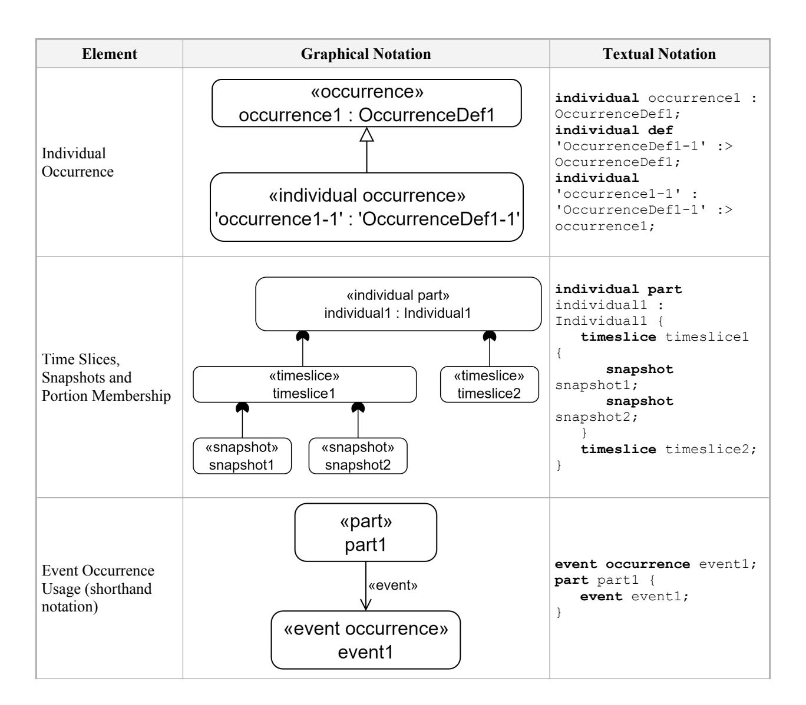

| Element                            | Graphical Notation | Textual Notation                                                                                |
|------------------------------------|--------------------|-------------------------------------------------------------------------------------------------|
| Occurrences<br>Compartment         |                    | {<br>occurrence occur1 :<br>OccurDef [1*]<br>ordered nonunique;<br>/* */<br>}                   |
| Individuals<br>Compartment (parts) |                    | {<br>individual part part1<br>:<br>PartDef1_1 [1*]<br>ordered nonunique;<br>/* */<br>}          |
| Timeslices<br>Compartment          |                    | part part1 {<br>timeslice phase1;<br>timeslice phase2;<br>/* */<br>}                            |
| Snapshots<br>Compartment           |                    | part part1 {<br>snapshot snapshot1;<br>snapshot snapshot2;<br>snapshot snapshot3;<br>/* */<br>} |

# <span id="page-85-0"></span>**7.9.2 Occurrence Definitions and Usages**

An occurrence definition or usage (that is not of a more specialized kind) can be declared as described in [7.6.2](#page-70-0) and [7.6.3](#page-71-0) , using the kind keyword **occurrence**. An occurrence usage may only be defined by occurrence definitions (of any kind) or KerML classes (see [KerML, 7.4.3]).

```
occurrence def Flight {
     ref part aircraft : Aircraft;
}
```

Unlike the features of attribute definitions and usages (see [7.7](#page-76-0) ), the features of an occurrence definition or usage may have values that vary over the lifetime of a featuring occurrence. Such variability may be, for example, the result of the binding of a feature to another feature with a varying value (see [7.13.3](#page-103-0) ), a flow of values into or out of a feature (see [7.16](#page-111-1) ), or an explicit assignment of values to a feature (see [8.2.2.17.5](#page-214-0) ). However, the following kinds of features do *not* vary over time in this way, and, instead, have values relative to the entire duration of the featuring occurrence:

- 1. Time slices and snapshots, because they represent specific portions of the duration of their featuring occurrences (see [7.9.3](#page-85-1) ).
- 2. Bindings, because they reflect relationships that can hold across time (see [7.13.3](#page-103-0) and [7.13.4](#page-103-1) ).
- 3. Successions, because they determine ordering of occurrences across time (see [7.13.5](#page-104-0) ).
- 4. Composite subactions, because their values and ordering across time are determined by succession relationships and other control constructs (see [7.17](#page-116-0) on actions and [7.18](#page-144-0) on states).

```
action def ChangeAircraft {
    in flight : Flight;
    in newAircraft : Aircraft;
    // This assignment changes the aircraft for the given flight.
    assign flight.aircraft := newAircraft;
}
```

A feature that would otherwise be allowed to vary in time may be declared to nevertheless have a constant value using the **constant** keyword (see [7.6.3](#page-71-0) ). Such a feature must have the same value over the entire duration of a featuring occurrence.

```
occurrence def ApprovedFlight :> Flight {
    // This redefines the aircraft feature so it is constant for
    // an entire ApprovedFlight.
    constant ref part approvedAircraft redefines aircraft;
}
```

The base definition for occurence definitions is the class Occurrence from the Occurrences model in the Kernel Semantic Library (see [KerML, 9.2.4]). The base usage for occurrence usages is the feature occurrences from the Occurrences model*.*

# <span id="page-85-1"></span>**7.9.3 Time Slices and Snapshots**

An occurrence usage (of any kind) can be declared as a *time slice* or a *snapshot* using the keyword **timeslice** or **snapshot**, respectively, placed immediately before the kind keyword of the declaration (after any of the other usage property keywords described in [7.6.3](#page-71-0) ). Alternatively, **timeslice** or **snapshot** may be used in place of the kind keyword, in which case the declaration is equivalent to **timeslice occurrence** or **snapshot occurrence** (that is, an occurrence usage not of a more specialized kind, but declared as a time slice or snapshot, respectively).

A time slice or snapshot usage must be declared in the body of an occurrence definition or usage (of any kind). If it is declared in the body of an occurrence definition, then it represents a portion of the instances of the containing occurrence definition. If it is declared in the body of another occurrence usage, then it represents a portion of the instances of the definition(s) of that containing usage. Note that it is allowable to declare a time slice or snapshot

usage within a time slice usage. However, it is not generally useful to declare a time slice or snapshot usage within a snapshot usage, since a snapshot is, by definition, without duration.

```
occurrence def Flight {
    ref part aircraft : Aircraft;
    // The following are time slices of Flight.
    timeslice preflight;
    timeslice inflight;
    timeslice postflight;
}
part aircraft : Aircraft {
    // The following are snapshots of the part aircraft.
    snapshot part aircraftTakeOff;
    snapshot part aircraftLanding;
}
```

# <span id="page-86-0"></span>**7.9.4 Individual Definitions and Usages**

An occurrence definition (of any kind) can be declared as an *individual definition* using the keyword **individual**, placed immediately before the kind keyword of the declaration. Alternatively, **individual** may be used in place of the kind keyword, in which case the declaration is equivalent to **individual occurrence** (that is, an occurrence usage not of a more specialized kind, but representing an individual).

```
individual def Flight_248 :> Flight;
individual part def TestPlane_1 :> Aircraft;
```

An occurrence usage (of any kind) is considered to be an *individual usage* if it has a definition that is an individual definition. An occurrence usage must not have more than one definition that is an individual definition. An occurrence usage may also be explicitly declared to be an individual usage using the keyword **individual**, placed after any of the other usage property keywords described in [7.6.3](#page-71-0) , but before a **timeslice** or **snapshot** keyword (if any). In this case, the occurrence usage must have exactly one definition that is an individual definition. If the declaration of an occurrence usage includes the the keyword **individual** (and, possibly, **timeslice** or **snapshot**), but no kind keyword, then this is equivalent to having included the **occurrence** keyword (that is, an occurrence isage not of a more specialized kind, but representing an individual, and, possibly, a time slice or snapshot).

```
individual flightRecord : Flight_248 {
    individual part redefines aircraft : TestPlane_1;
    individual timeslice redefines preflight;
    individual timeslice redefines inflight;
    individual timeslice redefines postflight;
}
```

# <span id="page-86-1"></span>**7.9.5 Event Occurrence Usages**

An *event occurrence usage* is declared like an occurrence usage, as described in [7.9.2](#page-85-0) , [7.9.3](#page-85-1) , and [7.9.4](#page-86-0) , but using the kind keyword **event occurrence** instead of just **occurrence**. It is related to another occurrence usage, representing the occurring event, by a *reference subsetting* relationship, which is a special kind of subsetting relationship specified using the keyword **references** or the symbol ::>. Or, if the event occurrence usage has no such reference subsetting, then the referenced event occurrence is the event occurrence usage itself.

```
part client {
    event occurrence request[1] references subscriptionMessage.source;
    event occurrence delivery[*] ::> publicationMessage.target;
}
```

An event occurrence usage may also be declared using just the keyword **event** instead of **event occurrence**. In this case, the declaration does not include either a name or a short name. Instead, the referenced event occurrence of the event occurrence usage is identified by giving a qualified name or feature chain immediately after the **event** keyword.

```
part client {
    event subscriptionMessage.source[1];
    event publicationMessage.target[*];
}
```

The **ref** keyword may be used in the declaration of an event occurrence usage, but an event occurrence usage is always referential, whether or not **ref** is included in its declaration.

# <span id="page-87-0"></span>**7.10 Items**

# <span id="page-87-1"></span>**7.10.1 Items Overview**

*Metamodel references:*

- *Textual notation, [8.2.2.10](#page-206-0)*
- *Graphical notation, [8.2.3.10](#page-238-0)*
- *Abstract syntax, [8.3.10](#page-318-0)*
- *Semantics, [8.4.6](#page-438-1)*

An *item definition* is a kind of occurrence definition (see [7.9](#page-80-0) ) that defines a class of identifiable objects that may be acted on over time, but which do not necessarily perform actions themselves. An *item usage* is a usage of one or more item definitions.

Item usages can be used to represent inputs and outputs to actions such as water, fuel, electrical signals and data. Item usages, such as fuel, may flow through a system and be stored by a system. An item may have attributes (see [7.7](#page-76-0) ), states (see [7.18](#page-144-0) ), and nested item usages.

An item that performs actions is normally modeled as a part (see [7.11](#page-89-0) ). All parts are items, but not all items are necessarily parts. An item may also be considered to be a part during some time slices of its lifetime but not others. For instance, an engine being assembled can be modeled as an item moving along an assembly line. However, once the engine assembly is completed, the engine can be considered to be a part that may be installed into a car, where it is expected to perform the action providing power to propel the car. But later it may be removed from the car and again be considered only an inactive item in a junkyard.

Items may also have an extent in space as well as time. The *shape* of an item is its boundary in three-dimensional space. Items without shapes are *closed* enabling them to be boundaries of other items (for example, a twodimensional sphere has no boundary, but it is the shape of a three-dimensional ball). The Geometry Domain Library (see [9.7](#page-581-0) ) includes a model of basic kinds of geometric shapes that can be composed to construct compound spatial items.

<span id="page-87-2"></span>An item can also identify other items as *enveloping* shapes, which are closed items that are the boundary of a hypothetical item occupying the same or larger space as the enveloped item. Some of these can be *bounding* shapes, which overlap the bounded item on all sides. The spatial boundaries of items can break into separate closed items, such as the inside and outside of an egg shell. These inner boundaries can be the boundary of a hypothetical item, the interior of which is a *void* of the item. Items with no voids are *solid*.

**Table 8. Items – Representative Notation**

| Element           | Graphical Notation | Textual Notation                                                       |
|-------------------|--------------------|------------------------------------------------------------------------|
|                   |                    | item def ItemDef1;                                                     |
| Item Definition   |                    | item def ItemDef1 {<br>/* members */<br>}                              |
|                   |                    |                                                                        |
|                   |                    | item item1 : ItemDef1;                                                 |
| Item              |                    | item item1 : ItemDef1 {<br>/* members */<br>}                          |
|                   |                    |                                                                        |
| Items Compartment |                    | {<br>item item1 :<br>ItemDef1 [1*]<br>ordered nonunique;<br>/* */<br>} |

# <span id="page-88-0"></span>**7.10.2 Item Definitions and Usages**

An item definition or usage (that is not of a more specialized kind) is declared as a kind of occurrence definition or usage (see [7.9.2](#page-85-0) ), using the kind keyword **item**. An item usage must only be defined by item definitions (of any kind) or KerML structures (see [KerML, 7.4.4]). The default multiplicity of an item usage is [1..1], under the conditions described in [7.6.3](#page-71-0) .

```
item def Fuel {
    attribute pressure : PressureValue;
    ref item impurities[0..*] : Material;
}
```

The base item definition and usage are Item and items from the Items library model (see [9.2.3](#page-494-0) ). (For other semantic constraints on item usages, see [8.4.6](#page-438-1) ).

# <span id="page-89-0"></span>**7.11 Parts**

# <span id="page-89-1"></span>**7.11.1 Parts Overview**

*Metamodel references:*

- *Textual notation, [8.2.2.11](#page-206-1)*
- *Graphical notation, [8.2.3.11](#page-239-0)*
- *Abstract syntax, [8.3.11](#page-320-0)*
- *Semantics, [8.4.7](#page-439-1)*

A *part definition* represents a modular unit of structure such as a system, system component, or external entity that may directly or indirectly interact with the system. A part definition is a kind of item definition (see [7.10](#page-87-0) ) and, as such, defines a class of part objects that are occurrences with temporal (and possibly spatial) extent. A part usage is a kind of item usage that is a usage of one or more part definitions, but may also be a usage of item definitions that are not part definitions. This allows a part to be treated like an item in some cases (e.g., when an engine under assembly flows through an assembly line) and as a part in other cases (e.g., when an assembled engine is installed in a vehicle).

A system is modeled as a composite part, and its part usages may themselves have further composite structure. The parts of a system may have attributes (see [7.7](#page-76-0) ) that represent different performance, physical and other quality characteristics. The parts may have ports (see [7.12](#page-92-0) ) that define the points at which those parts may be interconnected (see [7.13](#page-94-2) and [7.14](#page-105-0) ). Parts may also *perform* actions (see [7.17](#page-116-0) ) resulting in items flowing across the connections between them, and *exhibit* states (see [7.18](#page-144-0) ) that enable different actions.

A part can represent any level of abstraction, such as a purely logical component without implementation constraints, or a physical component with a part number, or some intermediate abstraction. Parts can also be used to represent different kinds of system components such as hardware components, software components, facilities, organizations, or users of a system.

**Table 9. Parts – Representative Notation**

<span id="page-89-2"></span>

| Element         | Graphical Notation | Textual Notation                          |
|-----------------|--------------------|-------------------------------------------|
|                 |                    | part def PartDef1;                        |
| Part Definition |                    | part def PartDef1 {<br>/* members */<br>} |
|                 |                    |                                           |
|                 |                    |                                           |

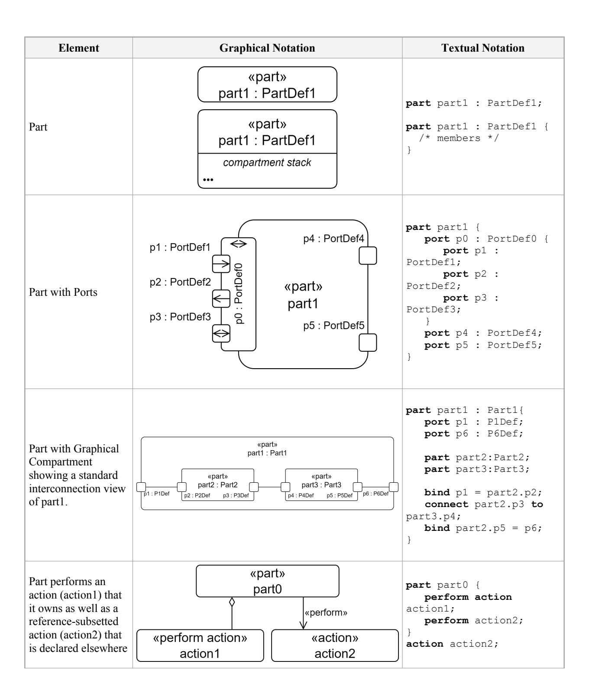

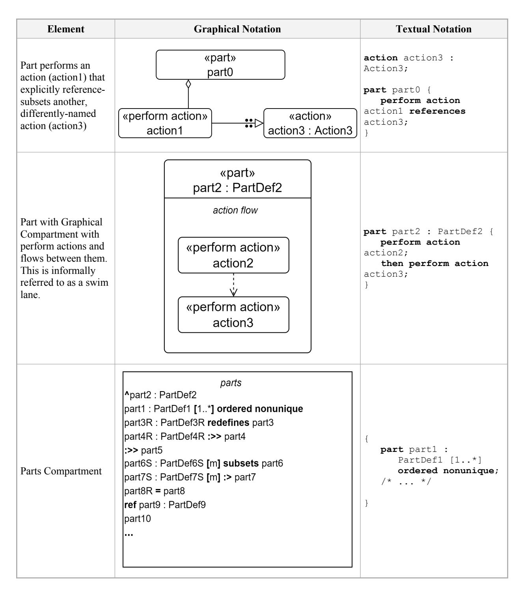

# <span id="page-91-0"></span>**7.11.2 Part Definitions and Usages**

A part definition or usage (that is not of a more specialized kind) is declared as a kind of occurrence definition or usage (see [7.9.2](#page-85-0) ), using the kind keyword **part**. As a kind of item usage (see [7.10](#page-87-0) ), a part usage must only be defined by item definitions (including part definitions) or KerML structures (see [KerML, 7.4.4]). The default multiplicity of a part usage is[1..1], under the conditions described in [7.6.3](#page-71-0) .

```
item def Person;
part def Vehicle {
```

```
ref part driver[0..1] : Person;
    part engine : Engine;
    part wheels[4] : Wheel;
}
```

The base part definition and usage are Part and parts from the Parts library model (see [9.2.4](#page-496-0) ). (For other semantic constraints on part usages, see [8.4.7](#page-439-1) ).

**Note.** Because the base usage of a part usage is the part usage parts defined by the base part definition Part, every part usage is always directly or indirectly defined by at least one part definition, implicitly if not explicitly, in addition to any other item definitions.

# <span id="page-92-0"></span>**7.12 Ports**

# <span id="page-92-1"></span>**7.12.1 Ports Overview**

*Metamodel references:*

- *Textual notation, [8.2.2.12](#page-206-2)*
- *Graphical notation, [8.2.3.12](#page-241-0)*
- *Abstract syntax, [8.3.12](#page-322-0)*
- *Semantics, [8.4.8](#page-440-1)*

A *port definition* is a kind of occurrence definition (see [7.9](#page-80-0) ) that defines a connection point to enable interactions between occurrences (most commonly parts). A *port usage* is a kind of occurrence usage definition that is a usage of a port definition.

A port usage may be connected to one or more other port usages (see [7.14](#page-105-0) ). Such connections enable interactions between the occurrences that own the ports. The features of the port usages (whether inherited from its definition or declared locally for the usage) specify what can be exchanged in such interactions. Since ports are themselves kinds of occurrences, port definitions and usages can contain nested port usages.

A feature of a port may be *directed*, with one of the *directions* **in**, **out**, or **inout** (see also [7.6.3](#page-71-0) ). Flows nested in a connection between ports may be used to model transfers between matching directed features of the ports (see [7.16](#page-111-1) ). Two features *match* if they have conforming definitions and either both have no direction or they have conjugate directions. The conjugate of direction **in** is **out** and vice versa, while direction **inout** is its own conjugate. A transfer can occur from the **out** features of one port usage to the matching **in** features of connected port usages. Transfers can occur in both directions between matching **inout** features. Two ports are said to *conform* if each feature of one port has a matching feature on the other port. In this case, if the two ports are connected, it is possible to have a flow between every directed feature of one port and the matching feature on the other port. Bindings can also be used to relate features of connected ports (see [7.13.3](#page-103-0) ).

<span id="page-92-2"></span>Each port definition has a *conjugated* port definition whose directed features are conjugate to those of the original port definition. A conjugated port usage is a usage of a conjugated port definition. A conjugated port usage automatically conforms to a usage of the corresponding original port definition.

**Table 10. Ports – Representative Notation**

| Element                          | Graphical Notation | Textual Notation                                                                                                                                                                                         |
|----------------------------------|--------------------|----------------------------------------------------------------------------------------------------------------------------------------------------------------------------------------------------------|
| Port Definition                  |                    | port def PortDef1;<br>port def PortDef1 {<br>/* members */<br>}                                                                                                                                          |
| Port                             |                    | port port1 : PortDef1;<br>port port1 : PortDef1 {<br>/* members */<br>}                                                                                                                                  |
| Ports Compartment                |                    | {<br>port port1 : PortDef1<br>[1*]<br>ordered nonunique;<br>/* */<br>}                                                                                                                                   |
| Directed Features<br>Compartment |                    | {<br>in attribute1 :<br>AttributeDef1;<br>out attribute2 :<br>AttributeDef2;<br>inout attribute3 :<br>AttributeDef3;<br>in item1 : ItemDef1;<br>out item2 : ItemDef2;<br>inout item3 :<br>ItemDef3;<br>} |

# <span id="page-94-0"></span>**7.12.2 Port Definitions and Usages**

A port definition or usage is declared as a kind of occurrence definition or usage (see [7.9.2](#page-85-0) ), using the kind keyword **port**. A port usage must only be defined by port definitions. The default multiplicity of a port usage is [1..1], under the conditions described in [7.6.3](#page-71-0) . All the features of a port definition or port usage, other than any nested port usages, must be referential (non-composite).

```
port def FuelingPort {
    attribute flowRate : Real;
    out fuelOut : Fuel;
    in fuelReturn : Fuel;
}
part def FuelTank {
    port fuelOutPort : FuelingPort;
}
```

The base port definition and usage are Port and ports from the Ports library model (see [9.2.5](#page-497-1) ). (For other semantic constraints on port usages, see [8.4.8](#page-440-1) .)

# <span id="page-94-1"></span>**7.12.3 Conjugated Port Definitions and Usages**

Every port definition also implicitly declares a single, nested *conjugated port definition,* which has the same features as its original port definition, except that any directed features have conjugated directions (i.e., **in** and **out** are reversed, with **inout** unchanged). The name of the conjugated port definition is always given by the name of the original port definition with the character ~ prepended, in the namespace of the original port definition. For example, if a port definition has the name *P*, then its conjugated port definition has the name *P::'~P'*.

A *conugated port usage* is a shorthand for declaring a port usage defined by a conjugated port definition. With this shorthand, rather than using the actual name of the conjugated port definition, the name of the original port definition can be used, preceded by the symbol ~. For example,

```
port p : ~P;
is equivalent to
      port p : P::'~P';
```

Since the symbol ~ is *not* considered part of a name when used in a conjugated port usage, it does not have to be placed within quotes, while quotes *do* have to be used to represent the actual name of the conjugated port definition as a lexical unrestricted name (see [7.2.2](#page-48-0) ). Note that, if the original port definition itself has a name that is itself lexically represented as an unrestricted name, such as *'P-1',* then its conjugated port definition has the (qualified) name *'P-1'::'~P-1'*, but the corresponding conjugated port usage is

```
port p1 : ~'P-1'
```

where the ~ is *not* placed inside the quotes.

# <span id="page-94-2"></span>**7.13 Connections**

# <span id="page-94-3"></span>**7.13.1 Connections Overview**

*Metamodel references:*

- *Textual notation, [8.2.2.13](#page-207-0)*
- *Graphical notation, [8.2.3.13](#page-245-0)*
- *Abstract syntax, [8.3.13](#page-327-0)*
- *Semantics, [8.4.9](#page-442-0)*

# **Connection Definition and Usage**

A *connection definition* is both a relationship and a kind of part definition (see [7.11](#page-89-0) ) that classifies connections between related things, such as items and parts. Unless it is abstract, at least two of the owned features of a connection definition must be *connection ends,* which specify the things that are related by the connection definition. Connection definitions with exactly two connection ends are called *binary connection definitions*, and they classify *binary connections.*

The features of a connection definition that are not connection ends characterize connections separately from the connected things. Since a connection is a part, values of these non-end features can potentially change over the lifetime of the connection. However, the values of connection ends (i.e., the things that are actually connected) do not change over time (though they can potentially be occurrences that themselves have features whose values change over time).

A connection usage is a part usage (see [7.11](#page-89-0) ) that is a usage of a connection definition, connecting usage elements such as item and part usages. A connection usage redefines the connection ends from its definition, associating those ends with the specific usage elements that are to be connected. For example, a connection definition could have connection ends that are part usages defined by part definitions Pump and Tank. A usage of this connection definition would then associate corresponding connection ends with specific pump and tank part usages. Supposing that the pump and tank part usages have multiplicity 1, then this means that the single value of the pump usage is to be connected to the single value of the tank usage.

A connection usage that connects parts is often a logical connection that abstracts away details of how the parts are connected. For example, plumbing that includes pipes and fittings may be used to connect a pump and a tank. It is sometimes desired to model the connection of the pump to the tank at a more abstract level without including the plumbing. This is viewed as a logical connection between the pump and the tank.

Alternatively, the plumbing can be modeled as a part (informally referred to as an *interface medium*) where the pump connects to the plumbing, and the plumbing connects to the tank. As a part itself, a connection can contain the plumbing either as a composite feature, or as a reference to the plumbing that is owned by a higher level pump-tank system context. In this way, the logical connection without structure can be transformed into a physical connection.

# **Bindings and Successions**

Bindings and successions are special kinds of connections. They are usages, but, unlike regular connection usages, they are *not* part usages. The connections specified by bindings and successions are not occurrences and are not created and destroyed. Rather, they assert specific relationships between the features that they connect, which must be true at all times.

A *binding* is a binary connection that requires its two related usages to have the same values. A binding can also be used to bind a referential feature in one context to a composite feature in another context to assert they are the same thing. For example, the steering wheel in a car may be considered part of the interior of the car, while at the same time it is considered part of the steering subsystem. The steering wheel can be a composite part usage of the interior, and a reference part usage of the steering subsystem, and these two usages can be bound together to assert that they are the same part.

A *feature value* is a shorthand for initializing or binding a usage to the result of an *expression* (see [7.19](#page-153-1) ) as part of the declaration of the usage. There are two types of feature value binding.

- A *fixed* feature value establishes the binding of the usage to the result of evaluating the given expression at the point of declaration of the usage. Such a binding cannot be overridden in a redefinition of the usage because, once asserted, a binding must be true for all instances of the usage.
- A *default* feature value also includes an expression, but it does not immediately establish the binding of the usage. Instead, the evaluation of the expression and the binding of the usage is delayed until the instantiation of a definition or usage that features the original usage. Unlike a fixed feature value, a default feature value can be overridden in a redefinition of its original feature with a new feature value (fixed or

default). In this case, the new overriding feature value is used instead of the original feature value for binding the redefining usage.

A *succession* is a binary connection that requires its two related usages to have values that are occurrences that happen completely separated in time, with the first occurrence happening before the second. Successions can be used to assert the ordering of any kind of occurrences in time, but are particularly useful for event occurrences (see [7.9](#page-80-0) ) and performances of actions (see [7.17](#page-116-0) ).

**Table 11. Connections – Representative Notation**

<span id="page-96-0"></span>

| Element                                                 | Graphical Notation | Textual Notation                                                                                                                              |
|---------------------------------------------------------|--------------------|-----------------------------------------------------------------------------------------------------------------------------------------------|
| Connection<br>Definition                                |                    | connection def<br>ConnectionDef1 {<br>end end1 : Part1;<br>end end2 : Part2;<br>}<br>connection def<br>ConnectionDef1 {<br>/* members */<br>} |
|                                                         |                    |                                                                                                                                               |
| Connection<br>Definition                                |                    | connection def<br>ConnectionDef1 {<br>end [01] part end1<br>: Part1;<br>end [1*] part end2<br>: Part2;<br>}                                   |
| Connection<br>Definition (with<br>direction indication) |                    | connection def<br>ConnectionDef2 {<br>end [11] part<br>sourceEnd : Part1;<br>end [1*] part<br>targetEnd : Part2;<br>}                         |

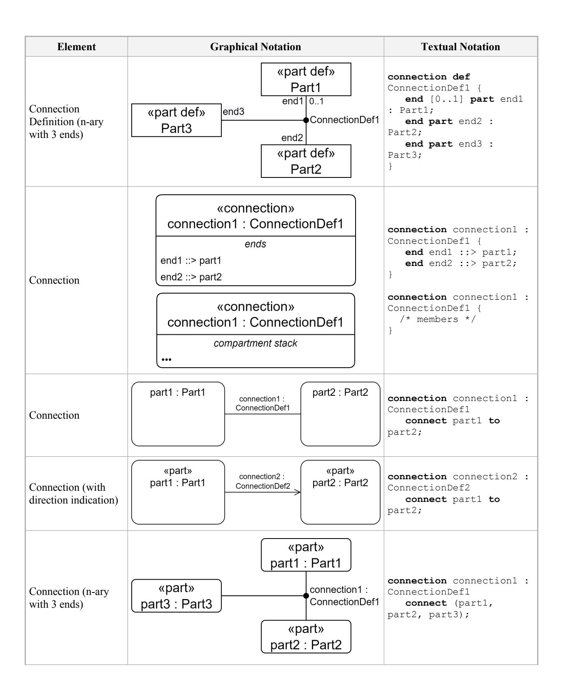

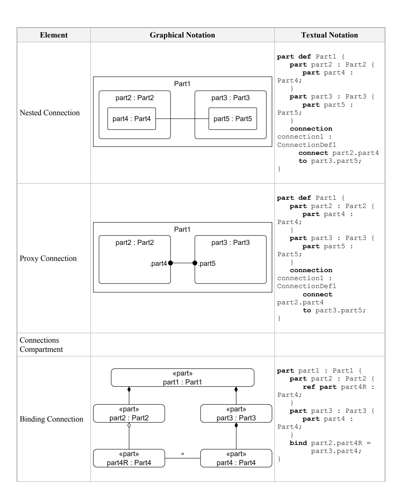

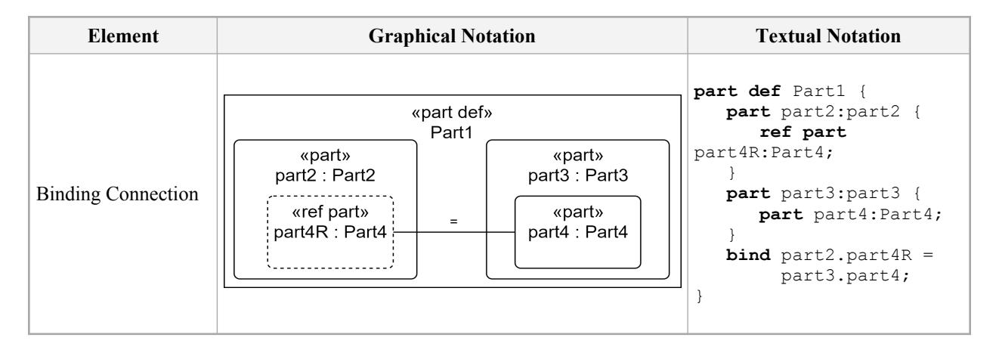

# <span id="page-99-0"></span>**7.13.2 Connection Definitions and Usages**

A connection definition or usage (that is not of a more specialized kind) is declared as a kind of occurrence definition or usage (see [7.9.2](#page-85-0) ), using the kind keyword **connection**. A connection usage must only be defined by connection definitions (of any kind) or KerML association structures (see [KerML, 7.4.5]). Unless it is abstract, a connection definition or usage must have at least two end features (which may be owned or inherited). A binary connection definition or usage is one that has exactly two end features.

End features are declared as usages (see [7.6.3](#page-71-0) ), prefixed by the keyword **end**. End features are always considered referential (non-composite), whether or not their declaration explicitly includes the **ref** keyword. The end features of a connection definition or usage identify the *participants* in the connections that are instances of the connection definition or usage and must have multiplicity 1..1. If a multiplicity is not explicitly declared for an end feature, then a default of 1..1 is implicitly declared for it (regardless of the usual conditions for default multiplicity given in [7.6.3](#page-71-0) ).

Connection definitions and usages are also relationships. For a connection definition, its related elements are given by the definitions of its end features. For a connection usage, its related elements are the features associated to each of its end features via *reference subsetting* relationships, whose textual notation is the keyword **references** or the equivalent symbol ::>. (See also [7.2](#page-47-0) on Relationships.)

```
// The related elements of this connection definition
// are the part definitions Hub and Device.
connection def DeviceConnection {
    end part hub : Hub;
    end part device : Device;
    // This is a non-end feature of the connection definition.
    attribute bandwidth : Real;
}
// The related elements of this connection usage
// are the part usages mainSwitch and sensorFeed.
connection connection1 : DeviceConnection {
    end part hub ::> mainSwitch[1];
    end part device ::> sensorFeed[1];
}
```

The kind keyword (e.g., **part** in the example above) may be omitted from an end declaration unless it has an owned cross feature, as described later). In this case, the end feature is a reference usage by default (i.e., as if **ref** was used as the kind keyword).

For a binary connection definition or usage, one or both end features can be explicitly declared to subset a *cross feature* owned by the other related type. This is done with *cross subsetting*, which is a special kind of subsetting relationship specified using the keyword **crossing** or the symbol =>. Only end features may have cross subsetting relationships, and an end feature can have at most one owned cross subsetting.

```
part def Hub {
    ref part connectedDevices [1..*] ordered : Device;
}
part def Device {
    ref part connectingHub [0..1] : Hub;
}
connection def DeviceConnection {
    end part hub : Hub crosses device.connectingHub;
    end part device : Device => hub.connectedDevices;
    attribute bandwidth : Real;
}
```

This specifies that each instance of the DeviceConnection connection definition must link a value of the connectingHub feature of the device with a value of the connectedDevices feature of the hub. That is, creating a DeviceConnection between a Hub and a Device means that the Device must be one of the connectedDevices of the Hub and that the Hub must the connectingHub of the Device. As shown above, the target of a cross subsetting relationship must be a feature chain (see [7.6.6](#page-74-0) ) in which the first feature is the other connection end and the second feature is the cross feature for that end.

Cross feature multiplicity effectively constrains the number of instances of a connection definition. It applies to each set of instances (connections) of the connection definition that have the same (single) values for each of the other ends. For a binary connection definition, this is the same as the number of values resulting from "navigating" across the association from an instance of one related type to instances of the other related type. Cross feature uniqueness and ordering apply to the instances navigated to, preventing duplication among them and ordering them to form a sequence.

For example, given a specific Device, navigating across all DeviceConnections with that Device as the device to the corresponding hub gives a collection of Hubs that must be the same as the connectingHub of the Device. The connectingHub feature has a multiplicity of 0..1, requiring that there must be at most one DeviceConnection for any Device. Similarly, given a specific Hub, navigating across all DeviceConnections with that Hub as the hub to the corresponding device gives a collection of Devices that must be the same as the connectedDevices of the Hub. The connectedDevices feature has a multiplicity lower bound of 1, requiring that there must be at least one DeviceConnection for every Hub. The declaration of connectedDevices as ordered means that this collection is ordered in the same order as the connectedDevices of the Hub. Similarly, if connectedDevices were non-unique, the collection could contain duplicate Devices.

Note that these semantics depend on the values of cross features being exclusively due to the existence of corresponding connections. In particular, cross features can only meet their minimum multiplicity constraints if such connections exist. For example, a Hub having a Device as one of its connectedDevices is sufficient to require that a DeviceConnection exists between that Hub and that Device, and, therefore, that the Hub is also the connectingHub of the Device. In addition, since connectedDevices has a multiplicity lower bound of 1, there must be at least one DeviceConnection for every Hub (as stated above), to provide the required value for connectedDevices.

It is also possible to declare cross features directly in the declaration of the ends of a connection definition, rather than nested in the related types of the connection definition. Such *owned cross features* are declared between the **end** and kind keywords of the association end declarations (and, in this case, the kind keyword is required). These may be full usage declarations, including declared name and or short name, owned subsettings and redefinitions, etc., but without bodies and nested elements (see [7.6.3](#page-71-0) on usage declaration).

```
connection def HubDeviceConnection {
   end connectingHub [0..1] ordered part hub : Hub;
   end connectedDevices [1..*] part device : Device;
```

```
attribute bandwidth : Real;
}
```

**Note.** Owned cross features are in the namespace of the owning end features, so their names are qualified by the name of the end features, e,g., *HubDeviceConnection::hub::connectedDevices*.

For a binary connection definition, an owned cross feature is implied to be featured by the type of the other association end, rather than its owning connection end. Further, a connection end with a cross feature has an implied cross subsetting relationship to the cross feature through the other end feature. This ensures owned cross features have the same semantics as cross features that are nested directly in the related types of the connection end. (For further details, see [8.4.9.1](#page-442-1) on connection definition semantics.)

**Note.** If an end feature has an owned cross feature, then it may not have an explicit cross subsetting relationship declared to an unowned cross feature.

While owned cross features can have full feature declarations, it is often sufficient to just include the cross multiplicity, ordering, and/or uniqueness on one or more connection ends.

```
connection def HubDeviceConnection {
    end [0..1] part hub : Hub;
    end [1..*] ordered part device : Device;
    attribute bandwidth : Real;
}
```

This specifies that every Device must have at most one Hub as its hub, and that every Hub may have one or more Devices as connectedDevices, which are ordered. Note that the connection ends themselves, as participants of the connection, still always have multiplicity 1..1, whether or not this is included in the declaration.

Cross features can also be used in connection definitions with more than two ends, but they must all be owned by the connection ends. In general, the cross multiplicity, ordering, and uniqueness of a connection end apply to the the collection of its values from each set of instances of the connection definition that have the same (single) values for each of the other ends.

```
connection def ProtocolDeviceConnection {
    end [*] part hub : Hub;
    end [*] ordered part device : Device;
    end [0..1] item protocol : Protocol;
}
```

The cross multiplicity 0..1 for protocol requires that, for every pair of a Hub and a Device, at most one ProtocolDeviceConnection instance may connect that Hub as its hub and Device as its device to a Protocol as its protocol. Similarly, every pair of a Hub as hub and a Protocol as protocol may be connected to any number of Devices as device, including none at all, as declared by the cross multiplicity of device. This collection of connected Devices is ordered, as declared by the cross ordering of device. The same applies to the cross multiplicity of hub. (For further details, see [8.4.9.1](#page-442-1) on connection definition semantics.)

Connection usages may also have end features with cross features, either specified using cross subsetting or as owned cross features. The cross feature for the end feature further constrains any inherited cross feature(s).

```
part def NetworkConfiguration {
    part networkHubs[*] : Axle;
    part networkDevices[*] : Device;
    // Connects each one of the networkHubs to at most four of the networkDevices.
    connection networkConnections : DeviceConnection {
        end [1] part hub references networkHubs;
        end [0..4] part device references networkDevices;
    }
}
```

There are two shorthand textual notations for connection usages.

Rather than using explicit end feature declarations in the body of a connection usage, the related features of the connection usage may be identified in a comma-separated list, between parentheses (...), preceded by the keyword **connect**, placed after the connection usage declaration and before its body. The identification of a related feature may optionally be preceded by a cross multiplicity and/or an end feature name followed by the keyword **references** or the symbol ::>. If the declaration part of the connection usage is empty when using this notation, then the keyword **connection** may be omitted.

```
connection connection1 : DeviceConnection connect (
    [1] hub ::> mainSwitch[1], [1] device ::> sensorFeed
);
// This is a ternary connection.
// It is equivalent to "connection connect (axle, wheel1, wheel2);"
connect (axle, wheel1, wheel2);
```

If the connection usage is binary, then a further special notation may be used in which the source related feature is identified directly after the keyword **connect** and the target related feature is identified after the keyword **to**. As above, if the declaration part of the connection usage is empty, then the keyword **connection** may be omitted.

```
connection connection1 : DeviceConnection
    connect [1] hub ::> mainSwitch to [1] device ::> sensorFeed;
connect leftWheel to leftHalfAxle;
```

The base connection definition and usage are Connection and connections from the Connections library (see [9.2.6](#page-498-1) ). For a binary connection definition or usage, the base definition and usage are further restricted to BinaryConnection and binaryConnections, which enforce that the connection has exactly two ends.

If a connection definition has a single owned superclassification relationship with another connection definition, it may inherit end features from this general connection definition. However, if it declares any owned end features, then each of these must redefine an end feature of the general connection definition, in order, up to the number of end features of the general connection definition. If no redefinition is given explicitly for an owned end feature, then it is considered to implicitly redefine the end feature at the same position, in order, of the general connection definition, if any. An implicitly or explicitly redefining connection end may also further constrain the cross multiplicity (if any) of the superclassifier connection ends that it redefines.

```
// Implicitly specializes Connections::BinaryConnection by default.
connection def AssetOwnership {
    attribute valuationOnPurchase : MonetaryValue;
    end [1..*] item owner : LegalEntity; // Implicitly redefines BinaryConnection::source.
    end [*] item ownedAsset : Asset; // Implicitly redefines BinaryConnection::target.
}
connection def SoleOwnership specializes AssetOwnership {
    end [1] item owner; // Implicitly redefines Ownership::owner.
    // ownedAsset is inherited.
}
```

Any specialization of a binary connection definition must also be binary. That is, it can inherit or redefine the two end features from the general connection definition, but it cannot add more end features.

If a connection definition has more than one owned superclassification with other connection definitions, then it *must* declare a number of owned end features at least equal to the maximum number of end features of any of the general connection definitions. Each of these owned end features must then redefine the corresponding end feature (if any) at the same position, in order, of each of the general connections, either explicitly or implicitly.

Similar rules hold for the end features of a connection usage that is defined by one or more connection definitions and/or subsets or redefines one or more connection usages.

```
connection connection1 : DeviceConnection {
    end [1] part hub ::> mainSwitch; // Implicitly redefines DeviceConnection::hub.
    end [1] part device ::> sensorFeed; // Implicitly redefines DeviceConnection::device.
}
```

# <span id="page-103-0"></span>**7.13.3 Bindings as Usages**

A binding can be declared as a usage as described in [7.6.3](#page-71-0) , using the kind keyword **binding**. Note that a binding is not a kind of occurrence usage (unlike a regular connection usage), so the notations for time slices, snapshots and individuals (described in [7.9](#page-80-0) ) do *not* apply to it. Further, the two related features of a binding are specified using a special notation.

The two related features of a binding are identified after its declaration part and before its body, following the keyword **bind** and separated by the symbol =. If the declaration part is empty, then the keyword **binding** may be omitted.

```
part def Vehicle {
    part fuelTank {
        out fuelFlowOut : Fuel;
    }
    part engine {
        in fuelFlowIn : Fuel;
    }
    binding fuelFlowBinding
        bind fuelTank.fuelFlowOut = engine.fuelFlowIn;
    // The following is equivalent to the above, but
    // without the name.
    bind fuelTank.fuelFlowOut = engine.fuelFlowIn;
}
```

The base usage for a binding is the the KerML feature selfLinks from the Links model in the Kernel Semantic Library (see [KerML, 9.2.3]).

# <span id="page-103-1"></span>**7.13.4 Feature Values**

A *feature value* is a relationship between an owning usage and a *value expression,* whose result provides values for the feature. The feature value relationship is specified as either *bound* or *initial,* and as either *fixed* or *default.* A usage can have at most one feature value relationship.

A fixed, bound feature value relationship is declared using the symbol = followed by a representation of the value expression (using the expression notation from [KerML, 7.4.9]). This notation is appended to the declaration of the usage being bound by the feature value. Usages that have a feature value relationship of this form implicitly have a nested binding between the feature and the result of the value expression.

```
attribute monthsInYear : Natural = 12;
item def TestRecord {
    attribute scores[1..*] : Integer;
    derived attribute averageScore[1] : Rational = sum(scores)/size(scores);
    attribute cutoff : Integer default = 0.75 * averageScore;
}
```

**Note.** The semantics of binding mean that such a feature value asserts that a feature is *equivalent* to the result of the value expression. To highlight this, a feature with such a feature value can be flagged as **derived** (though this is not required, nor is it required that the value of a **derived** feature be computed using a feature value – see also [7.6.3](#page-71-0) ).

A fixed, initial feature value relationship is declared as above but using the symbol := instead of =. In this case, the usage also has an implicit nested binding, but the binding only applies to the *starting snapshot* of the owning definition or usage of the bound usage (which means that that the owner must be a kind of occurrence definition or usage, see [7.9](#page-80-0) ). That is, the result of the value expression gives the initial values of the declared feature but, unlike in the case of a bound value, these initial values may subsequently change.

```
part def Counter {
    attribute count[1] : Natural := 0;
}
```

A default feature value relationship is declared similarly to the above, but with the keyword **default** preceding the symbol = or :=, depending on whether it is bound or initial. However, for a default, bound feature value, the symbol = may be elided.

```
part def Vehicle {
    attribute mass : Real default 1500.0;
    feature engine[1] : Engine default := standardEngine;
}
item def TestWithCutoff :> TestRecord {
    attribute cutoff : Rational default = 0.75 * averageScore;
}
```

For a default feature value relationship, no implicit binding is added to the usage declaration, but the default will apply when an instance of the owning definition or usage is constructed, if no other explicit values are given for the defaulted usage.

# <span id="page-104-0"></span>**7.13.5 Successions as Usages**

A succession can be declared as a usage as described in [7.6.3](#page-71-0) , using the kind keyword **succession**. Note that a succession is not a kind of occurrence usage (unlike a regular connection usage), so the notations for time slices, snapshots and individuals (described in [7.9](#page-80-0) ) do *not* apply to it. Further, the two related features of a succession are specified using a special notation.

The two related features of a succession are identified after its declaration part and before its body, following the keyword **succession** and separated by the keyword **then**. If the declaration part is empty, then the keyword **succession** may be omitted. The related features of a succession must be occurrence usages. As for regular connection usages, constraining multiplicities can also be defined on the end features of a succession.

```
part def Camera {
    action focus[*] : Focus;
    action shoot[*] : Shoot;
    // Each focus may be preceded by a previous focus.
    succession multiFocusing
        first [0..1] focus then [0..1] focus;
    // Each shoot must follow a focus.
    first [1] focus then [0..1] shoot;
    // The Camera can be focused after shooting.
    first [0..1] shoot then focus;
}
```

If a succession is placed lexically directly between the two occurrence usages that are its related elements, then the declaration of the succession can be shortened to just the keyword **then**, prepended to the declaration of the second occurrence usage. A multiplicity for the source end of the succession can optionally be placed directly after the **then** keyword.

```
occurrence def Flight {
    timeslice preflight[1];
```

```
then timeslice inflight[1];
    then timeslice postflight[1];
}
// The above is equivalent to the following.
occurrence def Flight {
    timeslice preflight[1];
    first preflight then inflight;
    timeslice inflight[1];
    first inflight then postflight;
    timeslice postflight[1];
}
```

**Note.** There are additional shorthands for the use of successions within the bodies of action definitions and usages (see [7.17.4](#page-133-0) ).

The base usage for a succession is the KerML feature happensBeforeLinks from the Occurrences model in the Kernel Semantic Library (see [KerML, 9.2.4]).

# <span id="page-105-0"></span>**7.14 Interfaces**

# <span id="page-105-1"></span>**7.14.1 Interfaces Overview**

*Metamodel references:*

- *Textual notation, [8.2.2.14](#page-208-0)*
- *Graphical notation, [8.2.3.14](#page-248-0)*
- *Abstract syntax, [8.3.14](#page-331-0)*
- *Semantics, [8.4.10](#page-446-0)*

An *interface definition* is a kind of connection definition (see [7.13](#page-94-2) ) whose ends are restricted to be port definitions (see [7.12](#page-92-0) ). An *interface usage* is a kind of connection that is usage of an interface definition. The ends of an interface usage are restricted to be port usages.

An interface is simply a connection all of whose ends are ports. As such, an interface facilitates the specification and reuse of compatible connections between parts. For example, consider a *Power* interface definition between an *Appliance* and *Wall Power*. The *power* port on one end of the interface represents the *Appliance* connection point, and the *outlet* port on the other end represents the *Wall Power* connection point. This interface can then be used for connecting many different appliances to wall power.

<span id="page-105-2"></span>When modeling physical interactions, an interface definition or usage can contain constraints (see [7.20](#page-156-0) ) to constrain the values of the features of the ports on its ends. For example, such features may be *across* and *through* variables, which are constrained by conservation laws across the interface (e.g., Kirchhoff's Laws). When specifying an interface between electrical components, the across and through variables are port features defined as *Voltage* and *Current* quantities, respectively. The feature values on either port are constrained such that the voltages must be equal, and the sum of the currents must equal zero.

**Table 12. Interfaces – Representative Notation**

| Element                   | Graphical Notation | Textual Notation                                                                                                                                                |
|---------------------------|--------------------|-----------------------------------------------------------------------------------------------------------------------------------------------------------------|
| Interface Definition      |                    | interface def<br>InterfaceDef1 {<br>end port1:Port1;<br>end port2:Port2;<br>}<br>interface def<br>InterfaceDef1 {<br>/* members */<br>}                         |
| Interface                 |                    | interface interface1 :<br>InterfaceDef1 {<br>end port1 :> pa;<br>end port2 :> pb;<br>}<br>interface interface1 :<br>InterfaceDef1 {<br>/* members */<br>}       |
| Interfaces<br>Compartment |                    | {<br>interface interface1<br>: InterfaceDef1 [1*];<br>interface interface2<br>: InterfaceDef2;<br>/* */<br>}                                                    |
| Interface                 |                    | part part1:Part1 {<br>port p4:P4;<br>}<br>part part2:Part2 {<br>port p2:P2;<br>}<br>interface interface1 :<br>InterfaceDef1<br>connect part1.p4<br>to part2.p2; |

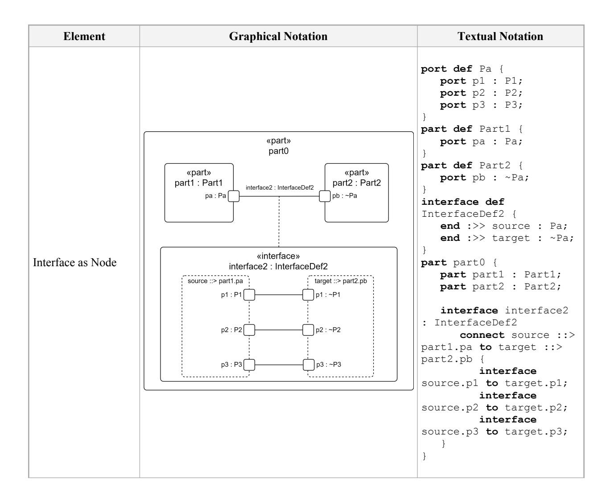

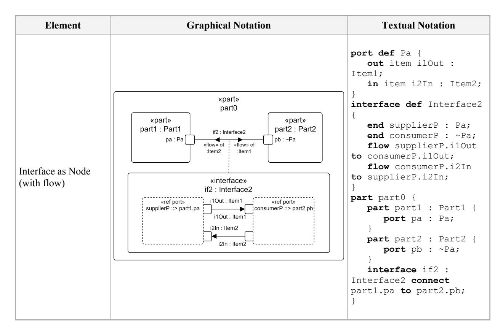

# <span id="page-108-0"></span>**7.14.2 Interface Definitions and Usages**

An interface definition or usage is declared like a connection definition or usage (see [7.13.2](#page-99-0) ), but using the kind keyword **interface**. An interface usage must only be defined by interface definitions. All the end features of an interface definition or usage must be port usages, so the use of the **port** keyword is optional on such end features if no owned cross feature is declared on the end.

The shorthand notations for connection usages described in (see [7.13.2](#page-99-0) ) may also be used for interface usages. However, if the declaration part of an interface usage is empty, then the **interface** keyword is still included, but the **connect** keyword may be omitted.

```
port def FuelingPort {
    out fuel : Fuel;
}
interface def FuelingInterface {
    end fuelOutPort : FuelingPort;
    end fuelInPort : ~FuelingPort;
}
interface fuelLine : FuelingInterface
    connect fuelTank.fuelingPort to engine.fuelingPort;
// The following is equivalent to the above, except
// for not using a specialized interface definition.
interface fuelTank.fuelingPort to engine.fuelingPort;
```

If a send action (see [7.17.7](#page-136-0) ) is used to send a transfer via a port that is at one end of a binary interface, then the port at the other end of the interface automatically becomes the target of the transfer. Such automatic targeting happens in either direction between the ports related by the interface. If a port is connected by multiple interfaces, then each transfer outgoing from the port will target exactly one of the ports at the other ends of these interfaces, but which one is not determined by the interface semantics.

```
part def DistributedSystem {
   item def Request;
   item def Response; part client {
       port clientPort;
       action clientBehavior {
           send new Request() via clientPort;
           then accept Response via clientPort;
       }
   }
   part server {
       port serverPort;
       action serverBehavior {
           accept Request via serverPort;
           then send new Response() via serverPort;
       }
   }
   // Transfers from the clientPort automatically target the serverPort
   // and vice versa.
   interface client.clientPort to server.serverPort;
}
```

Targeting of transfers outgoing from a port at one end of an interface with three or more ends is similar to the case of a port connected by multiple binary interfaces. In all cases, an outgoing transfer is targeted to a port at one of the other ends of any of the interfaces connecting the port, but which one is is not determined by the interface semantics.

**Note.** Transfers via ports must be targeted across interfaces. It does not happen across other kinds of connections.

The base interface definition and usage are Interface and interfacess from the Interfacess library (see [9.2.7](#page-500-0) ). For a binary interface definition or usage, the base definition and usage are further restricted to BinaryInterface and binaryInterfaces, which enforce that the interface has exactly two ends.

# <span id="page-109-0"></span>**7.15 Allocations**

# <span id="page-109-1"></span>**7.15.1 Allocations Overview**

*Metamodel references:*

- *Textual notation, [8.2.2.15](#page-209-0)*
- *Graphical notation, [8.2.3.15](#page-249-0)*
- *Abstract syntax, [8.3.15](#page-333-0)*
- *Semantics, [8.4.11](#page-447-1)*

An *allocation definition* is a *connection definition* (see [7.13](#page-94-2) ) that specifies that a target element is responsible for realizing some or all of the intent of the source element. An *allocation usage* is a usage of one or more allocation definitions. An allocation definition or usage can be further refined using nested allocation usages that provide a finer-grained decomposition of the containing allocation.

As used by systems engineers, an allocation denotes a "mapping" across the various structures and hierarchies of a system model. This concept of "allocation" requires flexibility suitable for abstract system specification, rather than a particular constrained method of system or software design. System modelers often associate various elements in a user model in abstract, preliminary, and sometimes tentative ways. Allocations can be used early in the design as a precursor to more detailed rigorous specifications and implementations.

Allocations can provide an effective means for navigating a model by establishing cross relationships and ensuring that various parts of the model are properly integrated. Since these relationships are instantiable connections, they can also be semantically related to other such relationships, including satisfying requirements (see [7.21](#page-160-0) ),

performing actions (see [7.17](#page-116-0) ) and exhibiting states (see [7.18](#page-144-0) ). Modelers can also create specialized allocation definitions to reflect conventions for allocation on specific projects or within certain system models.

**Table 13. Allocations – Representative Notation**

<span id="page-110-0"></span>

| Element                             | Graphical Notation | Textual Notation                                                                                                                                                                      |
|-------------------------------------|--------------------|---------------------------------------------------------------------------------------------------------------------------------------------------------------------------------------|
| Allocation Definition               |                    | allocation def<br>AllocationDef1;<br>allocation def<br>AllocationDef1 {<br>/* members */<br>}                                                                                         |
| Allocation                          |                    | allocation allocation1 :<br>AllocationDef1;<br>allocation allocation1 :<br>AllocationDef1 {<br>/* members */<br>}                                                                     |
| Allocated<br>Compartment            |                    | part part3 {<br>allocate part1 to<br>part3;<br>allocate part3 to<br>part2;<br>}                                                                                                       |
| Allocation                          |                    | part part1 : Part1;<br>part part2 : Part2;<br>allocate part1 to part2;                                                                                                                |
| Allocation (with sub<br>allocation) |                    | part part1 : Part1 {<br>perform action1;<br>}<br>part part2 : Part2 {<br>perform action2;<br>}<br>allocate part1 to part2<br>{<br>allocate<br>part1.action1<br>to part2.action2;<br>} |

# <span id="page-111-0"></span>**7.15.2 Allocation Definitions and Usages**

An allocation definition or usage is declared like a connection definition or usage (see [7.13.2](#page-99-0) ), but using the kind keyword **allocation**. An allocation usage must only be defined by allocation definitions. Allocation definitions and usages are always binary, having exactly two end features, even if abstract.

Shorthand notations similar to those for connection usages, as described in see [7.13.2](#page-99-0) , may also be used for allocation usages, but using the keyword **allocate** instead of **connect**. If the declaration part of the allocation usage is empty when using this notation, then the keyword **allocation** may be omitted.

```
part def LogicalSystem {
    part component : LogicalComponent;
}
part def PhysicalDevice {
    part assembly : PhysicalAssembly;
}
allocation def LogicalToPhysicalAllocation {
    end part logical : LogicalSystem;
    end part physical : PhysicalDevice;
    // This is a nested sub-allocation.
    allocate logical.component to physical.assembly;
}
part system : LogicalSystem;
part device : PhysicalDevice;
allocation systemToDevice : LogicalToPhysicalAllocation
    allocate logical ::> system to physical ::> device;
```

The base allocation definition and usage are Allocation and allocations from the Allocations library model (see [9.2.8](#page-502-0) ).

# <span id="page-111-1"></span>**7.16 Flows and Messages**

# <span id="page-111-2"></span>**7.16.1 Flows and Messages Overview**

*Metamodel references:*

- *Textual notation, [8.2.2.16](#page-209-1)*
- *Graphical Notation, [8.2.3.16](#page-250-0)*
- *Abstract Syntax, [8.3.16](#page-335-0)*
- *Semantics, [8.4.12](#page-448-1)*

A *flow definition* is both a relationship and a kind of action definition (see [7.17](#page-116-0) ) that classifies *transfers* of some *payload* between interacting occurrences, such as parts and actions. A flow definition is a binary relationship between two ends, the first of which is the *source*, from which the payload comes, and the second of which is the *target*, to which the payload is delivered. The transferred payload can be anything (attribute value, item, part, etc.). A flow definition may also have features other than its source and target that characterize the classified transfers separately from the interacting occurrences.

A *flow usage* is an action usage (see [7.17](#page-116-0) ) that is a usage of a flow definition, connecting usage elements such as part and action usages. It represents the performance of a transfer, as classified by its flow definition, between the values of the interacting usages, which must be occurrences. The transfer is directed from the first end (the source) to the second end (the *target*).

There are three kinds of flows.

- 1. A *message* is modeled as a flow usage that specifies that some transfer happens between the source and target ends, and can define the payload that is to be transferred. However, a message does not specify how the payload is to be obtained from the source or delivered to the target.
- 2. A *streaming flow* is modeled as a flow usage that not only specifies the source and target of a transfer (and, optionally, the payload), but also identifies the *source output* feature of the source usage from which the payload is obtained and the *target input* feature of the target usage to which the payload is to be delivered.
- 3. A *succession flow* is modeled as a *succession flow usage*, which is both a flow usage and a succession. A succession flow is specified in the same way as a streaming flow, but it adds the further constraint that the transfer source must complete before the transfer starts, and the transfer must complete before the target can start.

Messages are typically used to model abstract logical interaction between part usages in a certain context, which may be realized in a more detailed model using streaming or succession flows (or transfers from send actions to accept actions, see [7.17](#page-116-0) ).

<span id="page-112-0"></span>**Table 14. Flows and Messages – Representative Notation**

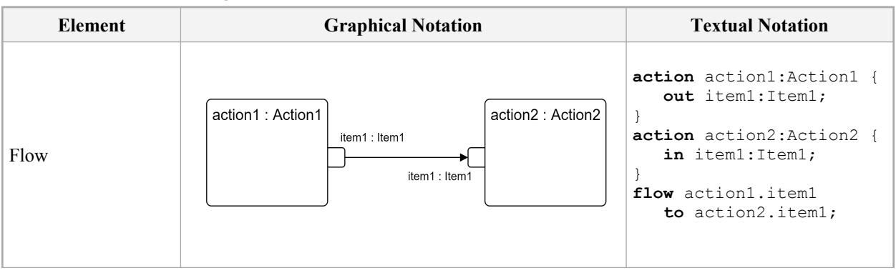

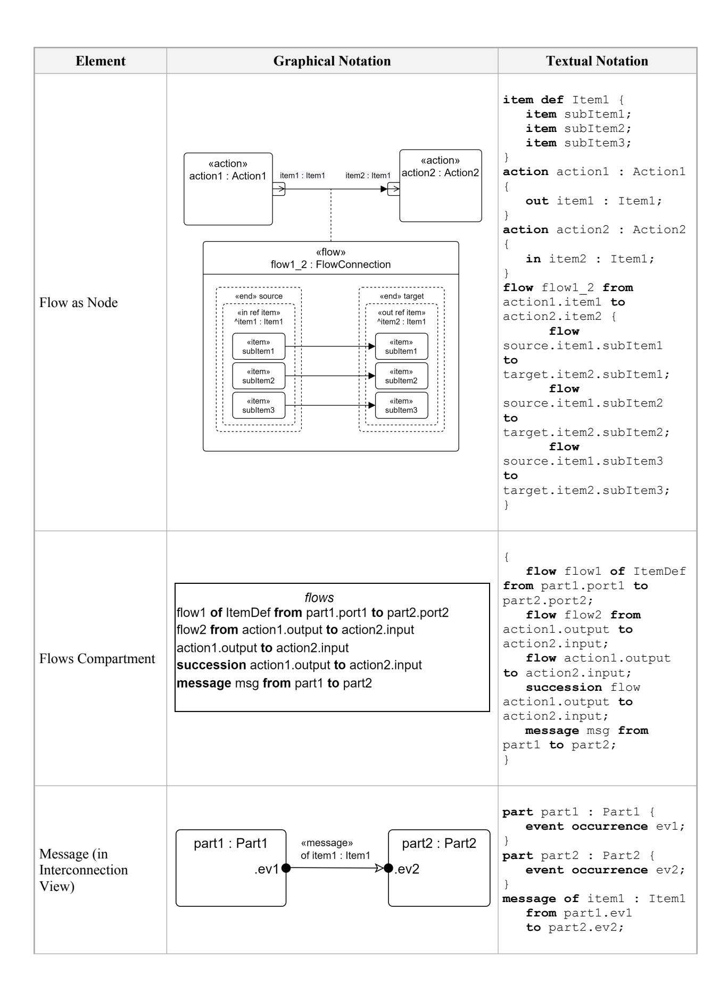

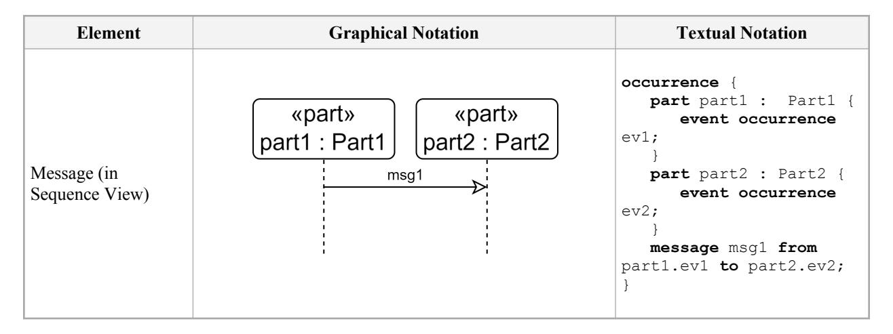

# <span id="page-114-0"></span>**7.16.2 Flow Definitions and Usages**

A flow definition is declared like a regular connection definition (see [7.13.2](#page-99-0) ), but using the kind keyword **flow**. A flow usage is declared like a regular connection usage (see [7.13.2](#page-99-0) ), but using one of the kind keywords **message**, **flow**, or **succession flow** (as discussed further below). A flow usage must only be defined by flow definitions or KerML interactions (see [KerML, 7.4.10]).

A non-abstract flow definition is always binary, having exactly two end features. An abstract flow definition may have less than two end features. The payload of a flow definition can be constrained by redefining the *payload* feature of the flow.

```
flow def FuelFlow {
   ref item :>> payload : Fuel;
   end tank : FuelTank;
   end eng : Engine;
}
```

A flow usage may be declared as either a message, a streaming flow, or a succession flow.

A flow usage is declared as a message using the kind keyword **message** rather than **flow**. In addition, the declaration of a message may also optionally include an explicit specification of the name, type (definition) and/or multiplicity of the payload of the message, after the keyword **of**. The payload name is followed by the keyword **defined by** (or the symbol :), but this keyword (or the symbol) is omitted if the name is omitted. In the absence of a payload specification, the message declaration does not constrain what kinds of values may be transferred between the source and target of the message.

A message is always abstract (whether or not the **abstract** keyword is included explicitly in its declaration). If a message declaration explicitly specifies defining flow usages for the message, then these should always be abstract and have no end features. A message does not explicitly identify the interacting source and target occurrences at the ends of the transfers it specifies. Instead, a message declaration may identify the source and target *events* at which a transfer may be initiated and received, respectively (see also [7.9.5](#page-86-1) on event occurrence usages). If they are included, then they follow the payload specification (if any), with the source event identified after the keyword **from**, followed by the target event after the keyword **to**. Alternative, if the source and target event identification is not included, then the message declaration may include a feature value (see [7.13.4](#page-103-1) ) to provide a value for the message.

```
part def Vehicle {
   attribute def ControlSignal;
   part controller {
       event occurrence sendControl;
   }
   part engine {
```

```
event occurrence receiveControl;
   }
   message of ControlSignal from controller.sendControl to engine.receiveControl;
}
```

A flow usage is declared as a streaming flow using the kind keyword **flow**. It may include a specification of the flow payload, as for a message declaration. A flow declaration then includes a specification of not only the source and target related features of the flow, but, more specifically, the output feature of the source from which the flow receives its payload (after the keyword **from**) and the input feature of the target to which the flow delivers the payload (given using dot notation after they keyword **to**). This is done by giving a feature chain with at least two features, the last of which identifies the output or input feature, with the preceding part of the chain identifying the source or target of the flow. If no declaration part or payload specification is included in the flow declaration, then the **from** keyword may also be omitted.

```
part def Vehicle {
   part fuelTank : FuelTank {
       out fuelOut : Fuel;
   }
   part engine : Engine {
       in fuelIn : Fuel;
   }
   // This flow usage actually connects the fuelTank to the
   // engine. The transfer moves Fuel from fuelOut to fuelIn.
   flow fuelFlow : FuelFlow of flowingFuel : Fuel
       from fuelTank.fuelOut to engine.fuelIn; // The following is equivalent to the above, except without the name
   // and leaving the flow definition and payload implicit.
   flow fuelTank.fuelOut to engine.fuelIn;
}
```

A flow usage is declared as a succession flow like a streaming flow above, but using the keyword **succession flow**.

```
action def TakePicture {
   action focus : Focus {
       out image : Image;
   }
   action shoot : Shoot {
       in image : Image;
   }
   // The use of a succession flow usage means that focus must
   // complete before the image is transferred, after which shoot can begin.
   succession flow focus.image to shoot.image;
}
```

Similar rules for specialization and inheritance apply to flow definitions and usages as to regular connection definitions and usages (see [7.13.2](#page-99-0) ).

The base flow definition is MessageAction from the Flows library model (see [9.2.9](#page-503-0) ). The base flow usages are also from the Flows library model:

- messages for a message.
- flows for a streaming flow.
- successionFlows for a succession flow.

# <span id="page-116-0"></span>**7.17 Actions**

# <span id="page-116-1"></span>**7.17.1 Actions Overview**

*Metamodel references:*

- *Textual notation, [8.2.2.17](#page-210-0)*
- *Graphical notation, [8.2.3.17](#page-253-0)*
- *Abstract syntax, [8.3.17](#page-337-1)*
- *Semantics, [8.4.13](#page-451-1)*

# **Action Definition and Usage**

An *action definition* is a kind of occurrence definition (see [7.9](#page-80-0) ) that classifies action performances. An *action usage* is a kind of occurrence usage that is a usage of one or more action definitions.

An action definition may have features with directions **in**, **out** or **inout** that act as the *parameters* of the action. Features with direction **in** or **inout** are input parameters, and features with direction **out** or **inout** are output parameters. An action usage inherits the parameters of its definitions, if any, and it can also define its own parameters to augment or redefine those of its definitions.

Actions are occurrences over time that can coordinate the performance of other actions and generate effects on items and parts involved in the performance (including those items' existence and relation to other things). The features of an action definition or usage that are themselves action usages specify the performance of the action in terms of the performances of each of the subactions. If an action has parameters, then it may also transform the values of its input parameters into values of its output parameters.

Action definitions and usages follow the same patterns that apply to structural elements (see [7.6](#page-62-0) ). Action definitions and action usages can be decomposed into lower-level action usages to create an action tree, and action usages can be referenced by other actions. In addition, an action definition can be subclassified, and an action usage can be subsetted or redefined. This provides enhanced flexibility to modify a hierarchy of action usages to adapt to its context.

# **Performed Actions**

A *perform action usage* is an action usage that specifies that an action is performed by the owner of the performed action usage. A perform action usage is referential, which allows the performed action behavior to be defined in a different context than that of the performer (perhaps by an action usage in a functionally decomposed action tree). However, if the owner of the perform action usage is an occurrence, then the referenced action performance must be carried out entirely within the lifetime of the performing occurrence.

In particular, a perform action usage can be a feature of a part definition or usage, specifying that the referenced action is performed by the containing part during its lifetime. A perform action usage can also be a feature of an action definition or usage. In this case, the perform action usage represents a "call" from the containing action to the performed action.

# **Sequencing of Actions**

Since action usages are kinds of occurrence usages, their ordering can be specified using successions (see [7.13](#page-94-2) ). However, a succession between action usages may, additionally, have a *guard condition,* represented as a Boolean expression (see [7.19](#page-153-1) ). If the succession has a guard, then the time ordering of the source and target of the succession is only asserted when the guard condition evaluates to true.

The sequencing of action usages may be further controlled using *control nodes*, which are special kinds of action usages that impose additional constraints on action sequencing. Control nodes are always connected to other actions usages by incoming and outgoing successions (with or without guards). The kinds of control nodes include the following.

- A *fork node* has one incoming succession and one or more outgoing successions. The actions connected to the outgoing successions cannot start until the action connected to the incoming succession has completed.
- A *join node* has one or more incoming successions and one outgoing succession. The action connected to the outgoing succession cannot start until all the actions connected to the incoming successions have completed.
- A *decision node* has one incoming succession and one or more outgoing successions. Exactly one of the actions connected to an outgoing succession can start after the action connected to the incoming succession has completed. Which of the downstream actions is performed can be controlled by placing guards on the outgoing successions.
- A *merge node* has one or more incoming successions and one outgoing succession. The action connected to the outgoing succession cannot start until any one of the actions connected to an incoming succession has completed.

# **Bindings and Flows Between Actions**

An output parameter of one action usage may be *bound* to the input parameter of another action usage (see [7.13](#page-94-2) on binding). Such a binding indicates that the values of the target input parameter will always be the same as the values of the source output parameter. If the two actions are performed concurrently, then this equivalence will be maintained over time throughout their performances. An input parameter of an action definition or usage can also be bound to the input parameter of a nested action usage, passing the values of the input parameter into the nested action, and an output parameter of a nested action usage can be bound an output parameter of a containing action definition or usage, passing the values of the output parameter out.

The binding of action parameters, however, does not model the case when there is an actual *transfer* of items between the actions that may itself take time or have other modeled properties. Such a transfer can be more properly modeled using a flow between the two action usages (see [7.16](#page-111-1) ), in which the transfer source output is an output parameter of the source action usage and the transfer target input is the input parameter of the target action usage. A streaming flow represents a flow in which the transfer can be ongoing while both the source and target action are being performed. A succession flow represents a flow that imposes the additional succession constraint that the transfer cannot begin until the source action completes and the target action cannot start until the transfer has completed.

Transfers can also be performed using *send and accept action usages*. In this case, the source and target of the transfer do not have to be explicitly connected with a flow. Instead, the source of the transfer is specified using a send action usage contained in some some source part or action, while the target is given by an accept action usage in some destination part or action (which may be the same as or different than the source). A send action usage includes an expression that is evaluated to provide the values to be transferred, and it specifies the destination to which those values are to be sent (possibly delegated through a port and across one or more interfaces – see also [7.12](#page-92-0) and [7.14](#page-105-0) on interfaces between ports). An accept action usage specifies the type of values that can be received by the action. When a send action performed in the source is matched with a compatible accept action performed in the destination, then the transfer of values from the origin to the destination can be completed.

# **Assignment Actions**

An *assignment action usage* is used to change the value of a *referent* feature of a *target* occurrence. The target is specified as the result of an expression and the referent is specified as a feature chain relative to that target. The new value for the feature is determined as the result of a different expression. When the assignment action usage completes, the referent feature has the new assigned value for the target occurrence.

Note that the target must be an occurrence, because the values of the features of attributes do not change over time (see also [7.7](#page-76-0) on attributes and [7.9](#page-80-0) on occurrences). If the referent feature has a multiplicity upper bound other than 1, then an assignment action can assign multiple values to it, consistent with the multiplicity of the feature. The values are all assigned atomically, at the same time.

A *initializing feature value* can be used as a shorthand for assigning an initial value to a usage as part of the declaration of the usage that is a feature of an occurrence definition or usage. Unlike when feature is a bound using a feature value (as described in [7.13](#page-94-2) ), the initial value of a feature can be later assigned a different value.

As for a binding feature value, there are two types of initializing feature value.

- A *fixed* feature value assigns the result of evaluating the given expression to a usage at the point of declaration of the usage. Such an assignment cannot be overridden in a redefinition of the usage because, once asserted, it would be indeterminate which initialization is to be used.
- A *default* feature value also includes an initial-value expression, but it does not immediately assign an initial value to the usage. Instead, the evaluation of the expression and the assignment of its result to the usage is delayed until the instantiation of a definition or usage that features the original usage. Unlike a fixed feature value, a default feature value can be overridden in a redefinition of its original feature with a new feature value (fixed or default). In this case, the new overriding feature value is used instead of the original feature value for initializing the redefining usage.

# **Terminate Actions**

A *terminate action usage* is used to terminate the performance of some other action. The terminated action ends its performance by the completion of the terminate action usage. The terminated action may be given as an argument to the terminate action usage. If not given explicitly, by default, a terminate action usage terminates its own immediately containing action.

A terminate action usage may also be used to terminate a non-action occurrence. In this case, the lifetime of the terminated occurrence must end by the completion of the terminate action usage (see also [7.9.1](#page-80-1) on occurrence lifetimes). That is, the terminate action usage effectively "destroys" the terminated occurrence.

# **Structured Control Actions**

*Structured control action usages* are used to control the performance of nested action usages in a structured way. There are three kinds of structured control action usages:

- 1. An *if action usage* evaluates a *condition expression* and then performs a *then clause* action usage if the expression evaluates to true, or, optionally, an *else clause* action usage if the expression evaluates to false.
- 2. A *while loop action usage* performs a *body clause* action usage iteratively, as long as its *while expression* continues to evaluate to true and its *until expression* continues to evaluate to false.
- 3. A *for loop action usage* performs a *body clause* action usage iteratively, assigning a *loop variable* successively for each iteration to the values resulting from the evaluation of a *sequence expression.*

**Table 15. Actions – Representative Notation**

<span id="page-118-0"></span>

| Element           | Graphical Notation | Textual Notation                              |
|-------------------|--------------------|-----------------------------------------------|
| Action Definition |                    | action def ActionDef1;                        |
|                   |                    | action def ActionDef1 {<br>/* members */<br>} |
|                   |                    |                                               |
|                   |                    |                                               |

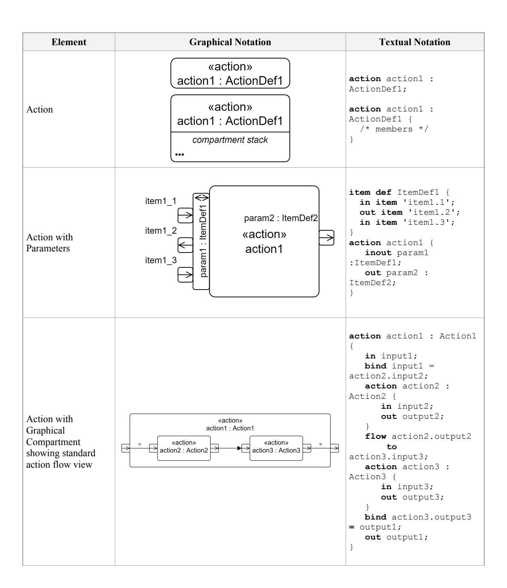

| Element                        | Graphical Notation | Textual Notation                                                                                                                                                                            |
|--------------------------------|--------------------|---------------------------------------------------------------------------------------------------------------------------------------------------------------------------------------------|
| Actions<br>Compartment         |                    | {<br>action action1 :<br>ActionDef1 [1*]<br>ordered nonunique;<br>/* */<br>perform action<br>action10;<br>action action11 {<br>action<br>'action11.1';<br>action<br>'action11.2';<br>}<br>} |
| Perform Actions<br>Compartment |                    | {<br>perform action<br>action1 : ActionDef1<br>[1*] ordered<br>nonunique;<br>/* */<br>}                                                                                                     |

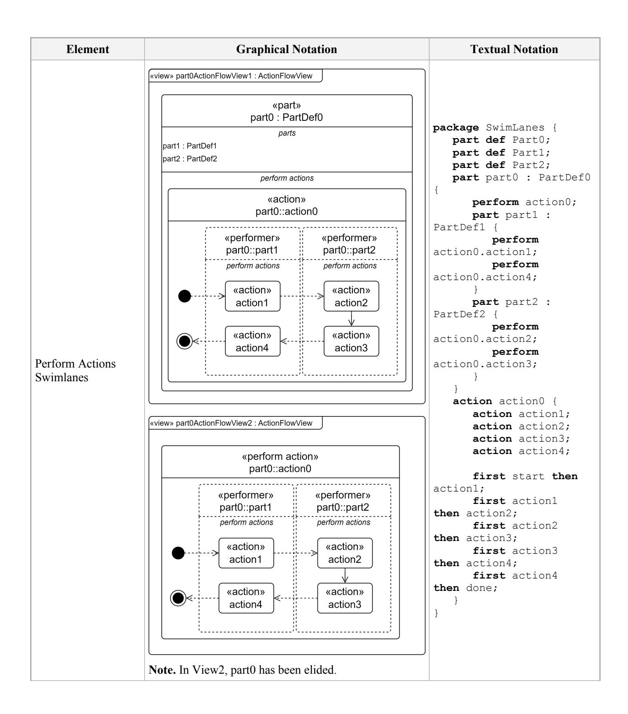

| Element                                               | Graphical Notation | Textual Notation                                                                                                                                                                                                  |
|-------------------------------------------------------|--------------------|-------------------------------------------------------------------------------------------------------------------------------------------------------------------------------------------------------------------|
| Parameters<br>Compartment                             |                    | {<br>in param1 : ParamDef<br>[1*] ordered<br>nonunique;<br>/* */<br>}                                                                                                                                             |
| Actions with and<br>without Conditional<br>Succession |                    | action action1 :<br>Action1;<br>action action2 :<br>Action2;<br>succession action1<br>if guard1 then<br>action2;<br>or<br>action action1 :<br>Action1;<br>if guard1 then action2;<br>action action2 :<br>Action2; |

| Element                       | Graphical Notation | Textual Notation                                                                                                                                                                                                                                                                                                                                      |
|-------------------------------|--------------------|-------------------------------------------------------------------------------------------------------------------------------------------------------------------------------------------------------------------------------------------------------------------------------------------------------------------------------------------------------|
| Actions with Control<br>Nodes |                    | first start;<br>then fork fork1;<br>then action1;<br>then action2;<br>action action1;<br>then join1;<br>action action2;<br>then join1;<br>join join1;<br>then decide decision1;<br>if guard2 then<br>action3;<br>if guard1 then<br>action4;<br>action action3;<br>then merge1;<br>action action4;<br>then merge1;<br>merge merge1;<br>then terminate; |
| Performed By<br>Compartment   |                    | No textual notation                                                                                                                                                                                                                                                                                                                                   |

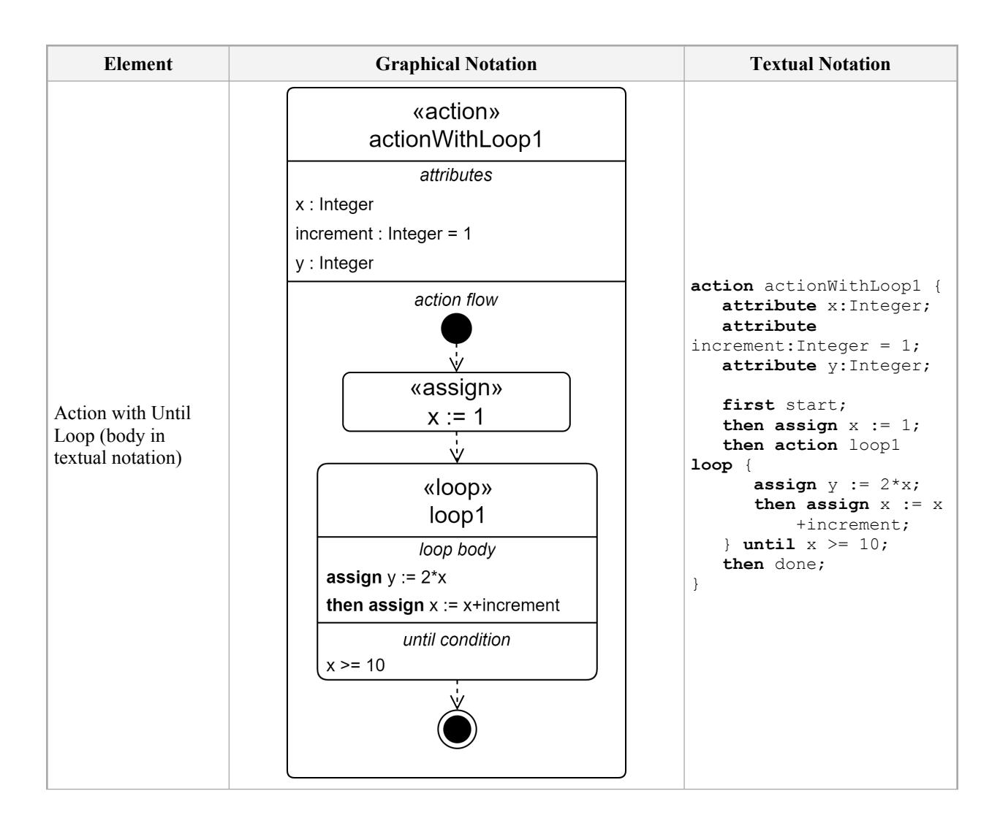

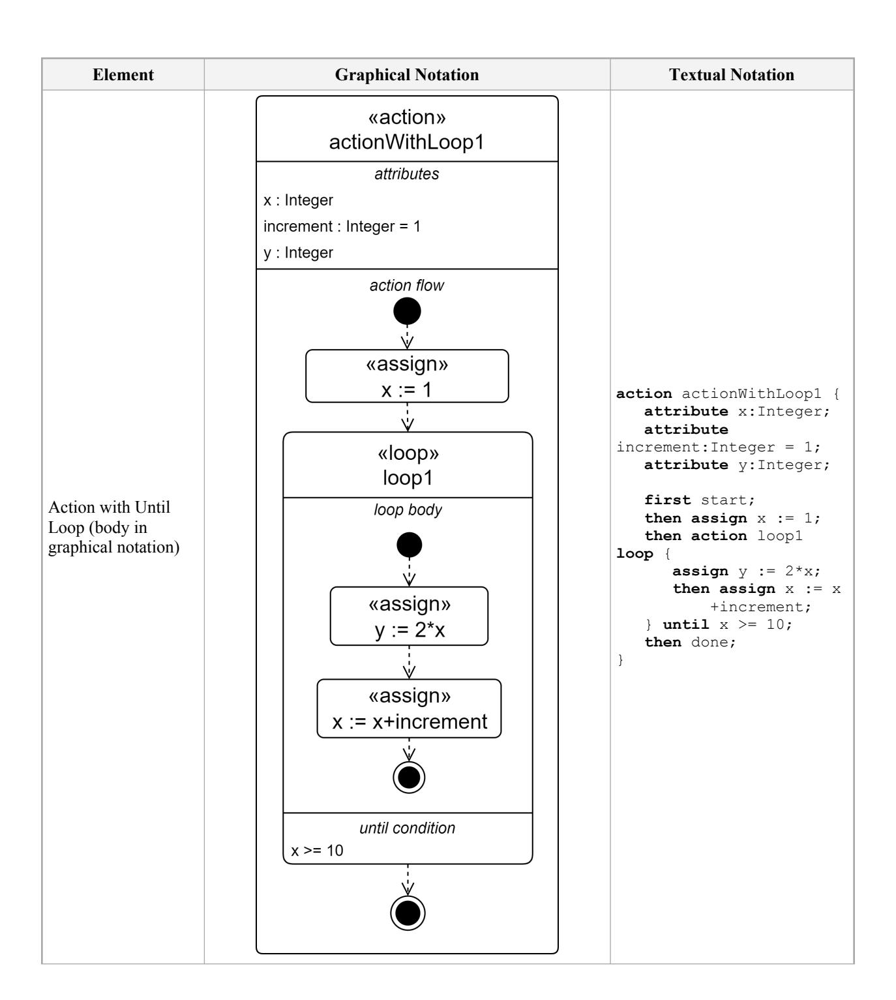

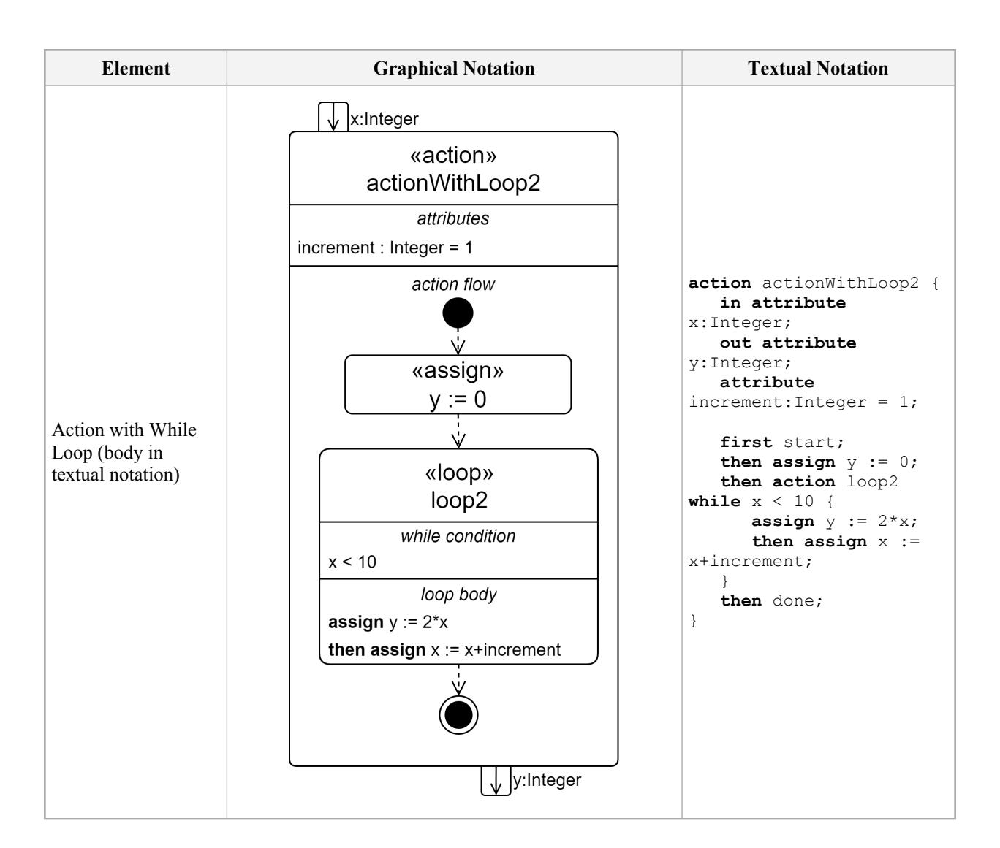

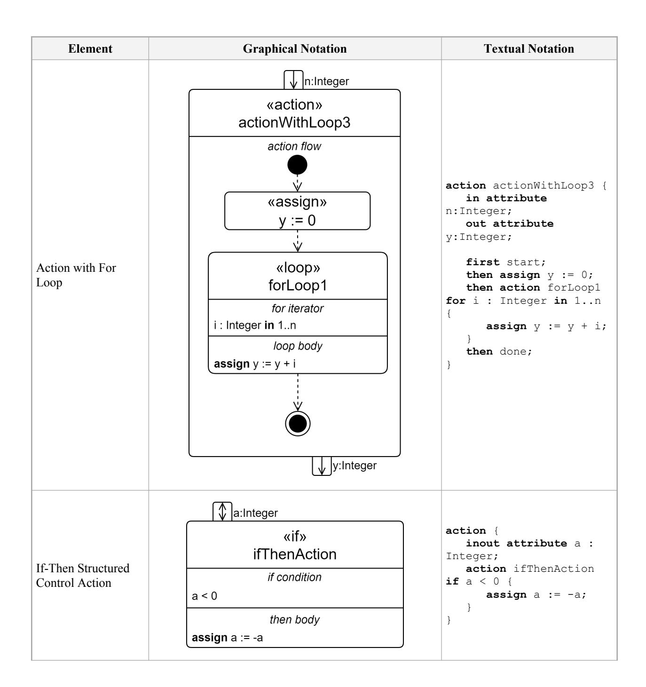

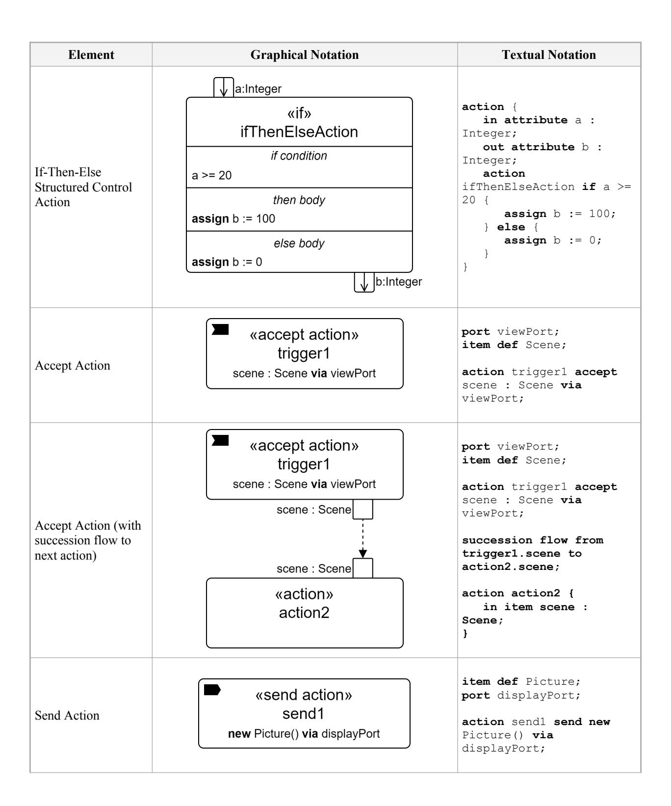

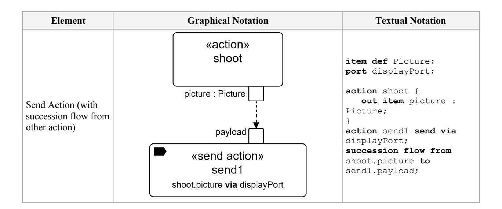

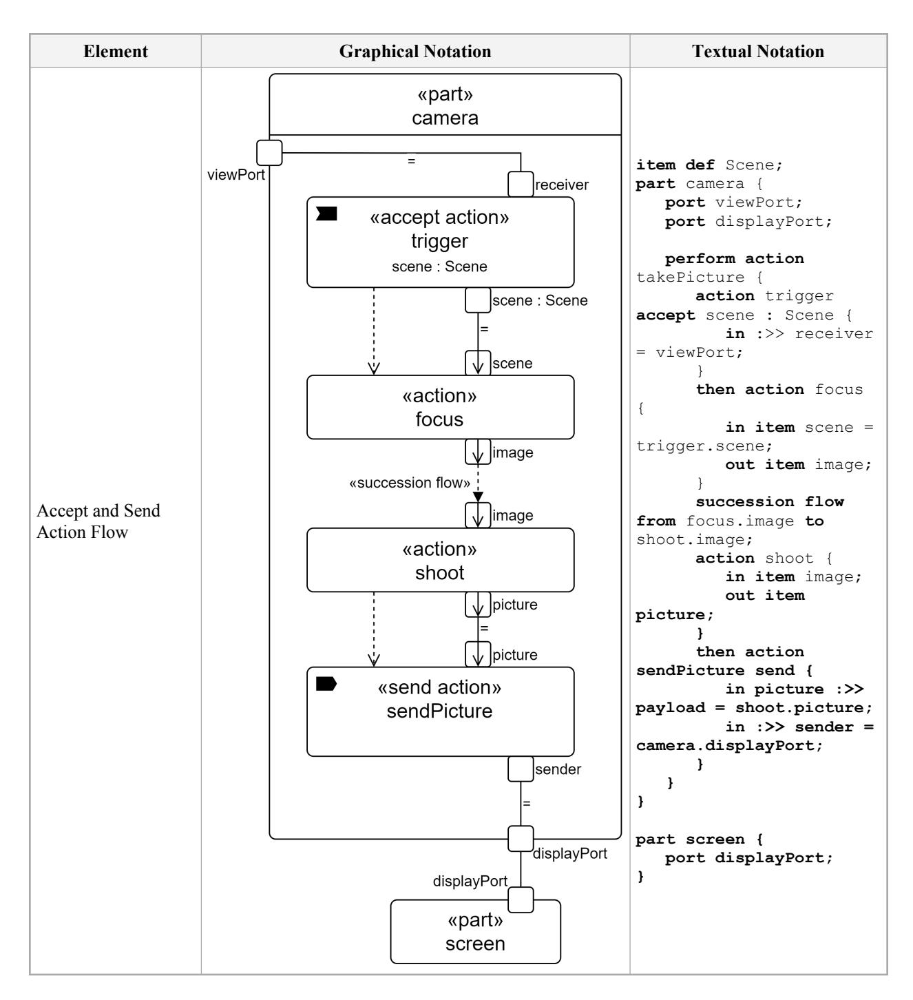

# <span id="page-130-0"></span>**7.17.2 Action Definitions and Usages**

An action definition or usage (that is not of a more specialized kind) can be declared as a kind of occurrence definition or usage (see [7.9.2](#page-85-0) ), using the kind keyword **action**. An action usage must only be defined by action definitions (of any kind) or KerML behaviors (see [KerML, 7.4.7]).

Any directed features declared in the body of an action definition or usage are considered to be owned parameters of the action. Features with direction **in** are input parameters, those with direction **out** are output parameters, and those with direction **inout** are both input and output parameters.

```
action def TakePicture {
    // The following two features are considered parameters.
    in scene : Scene;
    out picture : Picture;
    bind focus.scene = scene;
    action focus : Focus { in scene; out image; }
    first focus then shoot;
    flow focus.image to shoot.image;
    action shoot : Shoot { in image; out picture; }
    bind picture = focus.picture;
}
```

If an action definition has superclassification relationships (implicit or explicit) with other action definitions (or KerML behaviors), then each of the owned parameters of the specialized action definition must redefine, in order, the parameter at the position of each of the general action definitions. The redefining parameters must have the same direction as the redefined parameters.

```
action def A { in a1; out a2; }
action def B { in b1; out b2; }
action def C specializes A, B {
    in c1 redefines a1 redefines b1;
    out c2 redefines a2 redefines b2;
}
```

If an action definition has a single superclassification, then the specialized action definition may declare fewer owned parameters than the general action definition, inheriting any additional parameters from the general definition (which are considered to be ordered after any owned parameters). If there is more than one superclassification, then every parameter from every general action definition must be redefined by an owned parameter of the specialized action definition. If the required redefinitions are not explicitly declared for a parameter, then the parameter is considered to implicitly have redefinitions sufficient to meet the stated requirements.

```
action def A1 :> A { in aa; } // aa redefines A::a1, A::a2 is inherited.
action def B1 :> B { in b1; out b2; inout b3; } // Redefinitions are implicit.
action def C1 :> A1, B1 { in c1; out c2; inout c3; }
```

If an action usage has any type of specialization relationship (i.e., feature typing, subsetting or redefinition, implicit or explicit) with an action definition or usage (or KerML behavior or step), the rules for the redefinition of the parameters of the general definitions and usages are the same as given for the redefinition of parameters of an action definition above.

```
action focus : Focus {
    // Parameters redefine parameters of Focus.
    in scene;
    out image;
}
action refocus subsets focus; // Parameters are inherited.
```

Binding connection usages (see [7.13.3](#page-103-0) ) and flow usages (see [7.16](#page-111-1) ) can be used to connect subactions in the body of an action definition or usage. In addition, the feature value shorthand for binding (see [7.13.4](#page-103-1) ) is often useful for action parameters.

```
action providePower : ProvidePower {
    in fuelCmd : FuelCmd;
    action generatePower : GeneratePower {
        in fuelCmd : FuelCmd = providePower::fuelCmd;
        out generatedTorque : Torque;
    }
```

```
flow generatePower.generatedTorque
     to transmitPower.generatedTorque;
    action transmitPower : TransmitPower {
        in generatedTorque : Torque;
        out transmittedTorque;
    // ...
}
```

The base action definition and usage are Action and actions from the Actions library model (see [9.2.10](#page-507-0) ). (For other semantic constraints on action usages, see [8.4.13](#page-451-1) .)

# <span id="page-132-0"></span>**7.17.3 Control Nodes**

A *control node* is a special syntactic notation for an action usage whose definition is a concrete specialization of the abstract action usage ControlAction from the Actions library model (see [9.2.10](#page-507-0) ). A control node is declared like a normal action usage (see [7.17.2](#page-130-0) ), but using one of the keywords shown in [Table 16](#page-132-1) instead of the keyword **action**. A control node can only be declared in the body of an action definition or usage and implicitly subsets the action usage shown in the table corresponding to its keyword, thereby inheriting the corresponding definition. A control node is always composite, so the **ref** keyword is never used in a control node declaration. A control node declaration can have a body, but only containing annotating elements related to it via annotation relationships (see [8.2.2.4.1](#page-197-3) ).

**Table 16. Control Node Definitions**

<span id="page-132-1"></span>

| Keyword | Subsetting                 | Definition              |
|---------|----------------------------|-------------------------|
| merge   | Actions::Action::merges    | Actions::MergeAction    |
| decide  | Actions::Action::decisions | Actions::DecisionAction |
| join    | Actions::Action::joins     | Actions::JoinAction     |
| fork    | Actions::Action::forks     | Actions::ForkAction     |

Control nodes are used to control the sequencing of other action usages connected to them via sucessions. The following rules apply to these connections.

- 1. Incoming successions to a **merge** node must have source multiplicity 0..1 and subset the incomingHBLink feature inherited by MergeAction from the Kernel Semantic Library Behavior ControlPerformances::MergePerformance (see [KerML, 9.2.9]).
- 2. Outgoing successions from a **decide** node must have target multiplicity 0..1 and subset the outgoingHBLink feature inherited from the Kernel Library Behavior ControlPerformances::DecisionPerformance (see [KerML, 9.2.9]).
- 3. Incoming successions to a **join** node must have source multiplicity 1..1.
- 4. Outgoing successions from a **fork** node must have target multiplicity 1..1.

These rules shall be enforced in the abstract syntax, even if not shown explicitly in the concrete syntax notation for a model. (See also [8.4.13.4](#page-455-0) on the semantic constraints related to control nodes.)

```
// Both action1 and action2 will proceed concurrently
// after fork1.
fork fork1;
first fork1 then action1;
first fork1 then action2;
action action1;
```

```
action action2;
// join1 will be performed after both action1
// and action2 have completed.
first action1 then join1;
first action2 then join1;
join join1;
first join1 then decision1;
// One of action3 or action4 will be chosen
// (non-deterministically) to be performed after decision1.
decide decision1;
first decision1 then action3;
first decision1 then action4;
action action3;
action action4;
// merge1 will be performed after either action3
// or action4 have completed.
first action3 then merge1;
first action4 then merge1;
merge merge1;
```

# <span id="page-133-0"></span>**7.17.4 Succession Shorthands**

The basic notation for successions (see [7.13.5](#page-104-0) ) may be used to specify the sequencing of action usages within the body of an action definition or usage. There are also additional textual notation shorthands that may be used *only* within the body of an action definition or usage, as described below. Further, every action inherits the features start and done from the base action definition Actions::Action, which represent the start and end snapshots of the action.

The source of a succession may be specified separately from the target by using the keyword **first** followed by a qualified name or feature chain for the source action usage. Similarly, the target of a succession may be specified separately from the source by using the keyword **then** followed by a qualified name or feature chain for the target action usage.

```
first action1;
then action2;
// The above two declarations are together
// equivalent to the following single succession.
first action1 then action2;
```

The **then** keyword may also be followed by a complete action usage declaration, rather than just the name.

```
first action1;
then action action2;
// The above two declarations are together
// equivalent to the following.
first action1 then action2;
action action2;
```

The **then** shorthand can be used lexically following any action usage, not just following a **first** declaration, with the preceding action usage becoming the source of the succession. This is particularly useful when a sequence of actions is to be performed successively or in a loop.

```
first start;
then merge 'loop';
then action initialize;
then action monitor;
then action finalize;
then 'loop';
```

The source of a succession must be an occurrence usage. Therefore, the source of a succession represented using the **then** shorthand is actually determined as the nearest occurrence lexically previous to the **then**, skipping over any intervening non-occurrence usages (and conditional successions, see [7.17.5](#page-134-0) . Since a succession is not an occurrence usage, this allows several **then** successions to be placed in a sequence after a common source action usage. This is particularly useful for specifying multiple successions outgoing from **fork** and **decide** nodes.

```
// The two successions following fork1 both have
// fork1 as their source.
fork fork1;
    then action1;
    then action2;
action action1;
    then join1;
action action2;
    then join1;
join join1;
// The two successions following decision1 both have
// decision1 as their source.
then decide decision1;
    then action3;
    then action4;
action action3;
    then merge1;
action action4;
    then merge1;
merge merge1;
```

# <span id="page-134-0"></span>**7.17.5 Conditional Successions**

A succession within the body of an action definition or usage may be given a *guard* condition. A guard is given as a Boolean-valued expression preceded by the keyword **if.** It is placed in the declaration of the succession (see [7.13.5](#page-104-0) ) after the specification of the source of the succession and before the specification of the target.

```
succession conditionalOnActive
   first initialize if isActive then monitor;
```

Such a conditional succession actually declares a special transition usage (see also [7.18.3](#page-150-0) on transition usages in state models), which is a kind of action usage defined by the action definition DecisionTransitionAction from the Actions model library (see [9.2.10](#page-507-0) ). The transition usage performs the evaluation of the guard expression and, if true, asserts the existence of the succession. (See [8.4.13.3](#page-454-0) on the semantic constraints related to decision transition usages used for conditional successions.)

As usual, if the declaration part is empty, the keyword **succession** may be omitted. The source for the succession may then be further omitted, in which case the source is identified from a lexically previous action usage, as for the **then** shorthand described in [7.17.4](#page-133-0) . Further, the keyword **else** may be used in place of a guard expression to indicate a succession to be taken if the guards evaluate to false on all of an immediately preceding set of conditional successions. However, the target of a conditional succession *must* be specified as a qualified name or feature chain and cannot be a full action usage declaration, even when the shorthand notation is used.

The conditional succession shorthand notation is particularly useful for notating several conditional successions outgoing from a **decide** node.

```
merge 'loop';
action checkLevel { out level; }
decide;
    if level <= refillLevel then refill;
    if level >= maxLevel then drain;
    else continue;
action refill;
then 'loop';
action drain;
then 'loop';
action continue;
```

# <span id="page-135-0"></span>**7.17.6 Perform Action Usages**

A *perform action usage* is declared as an action usage (see [7.17.2](#page-130-0) ) but using the kind keyword **perform action** instead of just **action**. A perform action usage is a kind of event occurrence usage (see [7.9.5](#page-86-1) ) for which the event occurrence is an action usage, known as the *performed action.* As for an event occurrence usage, the performed action is related to the perform action usage by a *reference subsetting* relationship, specified textually using the keyword **references** or the symbol ::>. Or, if the perform action usage has no such reference subsetting, then the performed action is the perform action usage itself.

```
part def Vehicle {
    perform action powerVehicle references VehicleActions::providePower;
    abstract perform action moveVehicle; // Performed action is itself.
}
```

A perform action usage may also be declared using just the keyword **perform** instead of **perform action**. In this case, the declaration does not include either a name or short name. Instead, the performed action of the perform action usage is identified by giving a qualified name or feature chain immediately after the **perform** keyword.

```
part vehicle : Vehicle {
    // The performed action is VehicleActions::move.
    perform VehicleActions::move :> Vehicle::moveVehicle;
}
```

If a perform action usage is used in the body of a part definition or usage, then the part is considered to be the *performer* of the performed action (see also [8.4.13.11](#page-468-0) on the semantics of perform action usages). A perform action usage may also be used in the body of another action definition or usage, in which case it acts like a referential "call" of the performed action by the containing action.

```
action initialization {
    in item device;
    perform Utility::startUpCheck {
        in component = device;
        out status;
    }
    ...
}
```

The **ref** keyword may be used in the declaration of a performed action usage, but a perform action usage is always referential, whether or not **ref** is included in its declaration.

# <span id="page-136-0"></span>**7.17.7 Send Action Usages**

A *send action usage* is declared as an action usage (see [7.17.2](#page-130-0) ) implicitly defined by the action definition SendAction from the Actions library model (see [9.2.10](#page-507-0) ). A SendAction has three input parameters:

- 1. a set of *payload* values
- 2. a *sender* occurrence
- 3. a *receiver* occurrence

The behavior of a SendAction is to *transfer* the payload from the sender to the receiver.

In the textual notation for a send action usage, values for the three SendAction parameters are given after the action declaration part, identified by the keywords **send** (payload), **via** (sender) and **to** (receiver). If the declaration part is empty, then the **action** keyword may be omitted.

```
part monitor {
    action sendReadingTo {
        in part destination;
        perform getReading { out reading : SensorReading; }
        // Send a reading from the monitor to the destination.
        action sendReading
            send getReading.reading via monitor to destination;
        // The following send action is equivalent to the
        // one above, but without a name.
        send getReading.reading via monitor to destination;
    }
}
```

Alternatively, values can be provided for send-action parameters using flows or bindings, as in a regular action usage (see [7.17.2](#page-130-0) ).

```
part monitor {
    action sendReadingTo {
        in part destination;
        perform getReading { out reading : SensorReading; }
        flow getReading.reading to sendReading.payload;
        action sendReading send {
            in payload;
            in sender = monitor;
            in receiver = destination;
        }
        send getReading.reading {
            // payload parameter is already bound in the "send" declaration.
            in sender = monitor;
            in receiver = destination;
        }
    }
}
```

A send action usage can specify both a sender (**via**) and receiver (**to**), but it will generally give only one or the other. When a send action usage is directly or indirectly a composite feature of a part definition or usage, then the default for the sender (**via**) of the send action usage is the containing part, not the send action itself. This is known as the default *sending context.*

```
part monitor {
    action sendReadingTo {
        in part destination;
        perform getReading { out reading : SensorReading; }
        // The sender for the following send action is, by default,
        // the sending context, which is the part "monitor".
        send getReading.reading to destination;
    }
}
```

If a send action usage is *not* in the composition hierarchy of a part definition or usage (or any item definition or usage), then the sending context is the highest-level containing action usage. Note that a perform action usage is always referential, so that the sending context for subactions of a perform action usage is the perform action usage itself, *not* the containing performing part.

```
part monitor {
    ref part destination;
    perform action sending {
        perform getReading { out reading : SensorReading; }
        // The sender for the following send action is, by default,
        // the sending context, which is the action "sending",
        // not the part "monitor".
        send getReading.reading to destination;
    }
}
```

When sending through a port (see [7.12](#page-92-0) on ports), the port usage will usually be the sender (**via**), with the actual receiver determined by interface connections having the port usage as their source (see [7.14](#page-105-0) ). When sending via a port, the send action is allowed to also include an explicit receiver (**to**), but this must still be another port connected to the sending port by an interface.

```
part def MonitorDevice {
    port readingPort;
    action monitoring {
       perform getReading { out reading : SensorReading; }
       send getReading.reading via readingPort;
    }
}
```

A send action usage must be one of the following:

- 1. An owned feature of an action definition or usage.
- 2. The owned **entry**, **do** or **exit** action of a state definition or usage (see [7.18](#page-144-0) ).
- 3. The owned **effect** action of a transition usage (see [7.18](#page-144-0) ).

The base send action usage is sendActions from the Actions library model (see [9.2.10](#page-507-0) ), which is defined by SendAction. (See [8.4.13.5](#page-459-0) for additional semantic constraints on send action usages.)

# <span id="page-137-0"></span>**7.17.8 Accept Action Usages**

An *accept action usage* is declared as an action usage (see [7.17.2](#page-130-0) ) implicitly defined by the action definition AcceptAction from the Actions library model (see [9.2.10](#page-507-0) ). An AcceptAction has two parameters:

- 1. an output parameter for a set of *payload* values
- 2. an input parameter giving a *receiver* occurrence

The behavior of an AcceptAction is to accept the *transfer* of a payload received by the given receiver, and then output that payload.

The textual notation for an accept action usage includes special notation for declaring a usage-specific payload parameter and giving a value for the receiver parameter. The payload parameter declaration is identified by the keyword **accept**, and the expression giving the transfer receiver is identified by the keyword **via**. If the action declaration part is empty, then the **action** keyword may be omitted.

The payload parameter declaration for an accept action usage identifies the type of values accepted by the accept action. It is declared as a reference usage (see [7.6](#page-62-0) ), but without the **ref** keyword or any body. If the payload parameter declaration has the form of a single qualified name (and, optionally, a multiplicity), then the qualified name is interpreted as the definition (type) of the payload parameter (*not* its name).

```
part controller {
    action accepting {
        // ...
        action acceptReading
            accept reading : SensorReading via controller;
        // The following accept action is equivalent to the
        // one above, but it does not name the accept action or
        // the payload parameter.
        accept SensorReading via controller;
        // ...
    }
}
```

Alternatively, a value can be provided for the receiver parameter (but *not* the payload parameter) using a flow or binding, as for a parameter of a regular action usage (see [7.17.2](#page-130-0) ).

```
part controller {
    action accepting {
        //...
        accept SensorReading {
            in receiver = controller;
        }
}
```

A payload parameter declaration can also include a feature value (see [7.13.4](#page-103-1) ). In this case, the accept action usage will only accept exactly the value that is the result of the feature value expression. The following special notations can also be used for the feature value of a payload parameter:

- *Change trigger.* A change trigger is notated using the keyword **when** followed by an expression whose result must be a Boolean value. A change trigger evaluates to a ChangeSignal (as defined in the Observation model from the Kernel Semantic Library Library [KerML, 9.2.13]) that is sent when the result of the given expression changes from false to true (or sent immediately if the expression is true when first evaluated).
- *Absolute time trigger.* An absolute time trigger is notated using the keyword **at** followed by an expression whose result must be a TimeInstantValue (see [9.8.8](#page-648-1) ). An absolute time trigger evaluates to a TimeSignal (as defined in the Trigger model from the Kernel Semantic Library Library [KerML, 9.2.14]) that is sent when the current time (relative to the localClock, which defaults to the defaultClock, see [9.8.8](#page-648-1) ) reaches the TimeInstantValue that is the result of the given expression.
- *Relative time trigger.* A relative time trigger is notated using the keyword **after** followed by an Expression whose result must be a DurationValue (see [9.8.8](#page-648-1) ). A relative time trigger evaluates to a

TimeSignal (as defined in the Trigger model from the Kernel Semantic Library Library [KerML, 9.2.14]) that is sent when the current time (relative to the localClock, which defaults to the defaultClock, see [9.8.8](#page-648-1) ) reaches the TimeInstantValue that is computed as the result of the given expression added to the time at which the time trigger is evaluated.

```
part controller {
    in level : Real;
    attribute threshold : Real;
    action {
        // Both of the following accept actions trigger (once) when the
        // given expression becomes true.
        accept : ChangeSignal = Triggers::triggerWhen({ level > threshold });
        accept when level > threshold;
        // The following accept action triggers at the given date and time.
        accept at Iso8601DateTime("2024-02-01T00:00:00Z");
        // The following accept action triggers 30 seconds after the evaluation
        // of its time trigger.
        accept after 30 [s];
    }
}
```

When an accept action usage is directly or indirectly a composite feature of a part definition or usage, then the default for the receiver (**via**) of the accept action usage is the containing part, not the accept action itself. This is known as the default *accepting context.*

```
part controller {
    action accepting {
        // The receiver for the following accept action is, by default,
        // the accepting context, which is the part "controller".
        accept SensorReading;
        // ...
    }
}
```

If an accept action usage is *not* in the composition hierarchy of a part definition or usage (or any item definition or usage), then the accepting context is the highest-level containing action usage. Note that a perform action usage is always referential, so that the accepting context for subactions of a perform action usage is the perform action usage itself, *not* the containing performing part.

```
part controller {
    perform action accepting {
        // The receiver for the following accept action is, by default,
        // the accepting context, which is the "accepting" action,
        // not the part "controller".
        accept reading : SensorReading;
        // ...
     }
}
```

When accepting through a port (see [7.12](#page-92-0) on ports), the port usage is the receiver (**via**).

```
part def ControllerDevice {
    port sensorPort;
    action control {
       accept reading : SensorReading via sensorPort;
```

```
}
}
```

An accept action usage must be one of the following:

- 1. An owned feature of an action definition or usage.
- 2. The owned **entry**, **do** or **exit** action of a state definition or usage (see [7.18](#page-144-0) ).
- 3. The owned **effect** action or **accept** action of a transition usage (see [7.18](#page-144-0) ).

The base accept action usage is acceptActions from the Actions library model (see [9.2.10](#page-507-0) ), which is defined by AcceptAction. (See [8.4.13.6](#page-461-0) for additional semantic constraints on accept action usages.)

# <span id="page-140-0"></span>**7.17.9 Assignment Action Usages**

An *assignment action usage* is declared as an action usage (see [7.17.2](#page-130-0) ) that is implicitly defined by the action definition AssignmentAction from the Actions model (see [9.2.10](#page-507-0) ). An AssignmentAction sets a *referent* feature of a *target* occurrence to a new *assigned value*. In the textual notation for an assignment action usage, these three things are specified in an *assignment part* between the usual action declaration part and the action body (if any). An assignment part consists of the keyword **assign** followed by an expression that evaluates to the target and a feature chain identifying the referent, separated by a dot (.), followed by the symbol := and an expression whose result is the assigned value. If the declaration part is empty, then the **action** keyword may be omitted.

```
action def UpdateVehiclePosition {
    in part sim : Simulation;
    in attribute deltaT : TimeDurationValue;
    // The target of the assignment below is "sim".
    // The referent feature chain is "vehicle.position".
    assign sim.vehicle.position :=
        sim.vehicle.position + sim.vehicle.velocity * deltaT;
    // After the above assignment "sim.vehicle.position" has the
    // value of the result of the assigned value expression,
    // evaluated at the time of the assignment.
}
action def RecordNames {
    in item record : Record;
    in item entries : Entry[1..*];
    // "entries.name" evaluates to the names of all entries.
    // These values are assigned to the "names" feature of "record".
    assign record.names := entries.name;
}
```

To be *assignable*, the target expression of an assignment action usage must evaluate to an occurrence, and the last feature in the referent feature chain must be allowed to have values that vary over time (see [7.9.2](#page-85-0) ). If the target expression of an assignment action usage is omitted, then the target is implicitly the occurrence owning the assignment action usage.

```
action counter {
    // This attribute is initialized using a feature value.
    attribute count : Natural := 0;
    // The target of the following assign action usage is
    // implicitly the action "counter".
    assign count := count + 1;
    // ...
}
```

Every assignment action usage must be one of the following:

- 1. An owned feature of an action definition or usage.
- 2. The owned **entry**, **do** or **exit** action of a state definition or usage (see [7.18](#page-144-0) ).
- 3. The owned **effect** of a transition usage (see [7.18](#page-144-0) ).

The base assignment action usage is assignmentActions from the Actions library model (see [9.2.10](#page-507-0) ). (See [8.4.13.7](#page-463-0) for other semantic constraints on assignment action usages.)

# <span id="page-141-0"></span>**7.17.10 Terminate Action Usages**

A *terminate action usage* is declared as an action usage (see [7.17.2](#page-130-0) ) implicitly defined by the action definition TerminateAction from the Actions library model (see [9.2.10](#page-507-0) ). A TerminateAction has a single parameter that identifies a *terminated occurrence*. The behavior of a TerminateAction is to force the lifetime of the terminated occurrence to end by the completion of the TerminateAction (see also [7.9.1](#page-80-1) on the occurrence lifetimes). If the terminated occurrence is an action, this is equivalent to terminating the performance of the action.

```
part processor {
    private ref action process : ProcessWorkflow;
    action startProcessing {
        assign process := new ProcessWorkFlow();
    }
    action terminateProcessing {
        // The following terminate action has the name "terminate1".
        action terminate1 terminate process; // Terminates "process" action.
        // The following terminate action is unnamed.
        terminate this; // Terminates "processor" part.
    }
}
```

In the textual notation for a terminate action usage, the value for the terminated occurrence parameter is given after the action declaration part, after the keyword **terminate**. If the declaration part is empty, then the **action** keyword may be omitted.

```
action def MonitoredActivity {
    merge continue;
    then action performCriticalActivity {
        perform action monitorCriticalActivity;
        perform action criticalActivity;
        then terminate; // Terminates "performCriticalActivity" even if
                        // "monitorCriticalActivity" is still ongoing.
    }
    then decide;
        if continueActivity() then continue;
        else stop;
    action stop terminate; // Terminates performance of "MonitoredActivity".
}
```

If a value is not given for the terminated occurrence parameter, then the default is to terminate the immediately containing action of the terminate action usage. Note that this means that, if the terminate action usage is in a nested action, it is that nested action that is terminated, not any containing actions of the nested action.

Alternatively, a value can be provided for the terminated occurrence parameter using a flow.

```
action def TerminateProcessByID {
    in attribute id : ProcessID;
    perform action getProcessByID {
        in processID = id;
```

```
out process;
    }
    flow getProcessByID.process to terminateProcess.terminatedProcess;
    action terminateProccess terminate {
        in terminatedProcess;
    }
}
```

The base terminate action usage is terminateActions from the Actions library model (see 9.2.9), which is defined by TerminateAction. (See [8.4.13.8](#page-464-0) for additional semantic constraints on terminate action usages.)

# <span id="page-142-0"></span>**7.17.11 If Action Usages**

An *if action usage* is an action usage that is implicitly defined by one of the action definitions IfThenAction or IfThenElseAction from the Actions model (see [9.2.10](#page-507-0) ). In the textual notation, an if action usage can have a typical action declaration (see [7.17.2](#page-130-0) ), but *without* the usual action body. Instead, the action declaration part is followed by the keyword **if**, which introduces a Boolean-valued *condition expression,* followed by a *then clause* and, for an IfThenElseAction, the keyword **else** and an *else clause.* The behavior of an if action usage is to first evaluate the condition expression. If the result is true, then the then-clause is performed, otherwise the else-clause is performed, if there is one.

Each of the then-clause and the else-clause is itself notated as an action usage, but with the body required to be given using curly braces { … }, with a semicolon not allowed for an empty body.

```
action test if speed < lowerLimit
    action increase : IncreaseSpeed { }
else
    action main : MaintainSpeed { }
```

If the if action usage does not include a declaration part, the leading **action** keyword can be omitted. If either or both of the clauses have no declaration part, then the **action** keyword can be omitted for them, too, leaving only their bodies surrounded by curly braces.

```
if selectedSensor != null {
    assign reading := selectedSensor.reading;
} else {
    assign reading := undefinedValue;
}
```

With one except, only the basic form of action declaration can be used for the clauses of an if action usage, not the special notations for perform action usages, send action usages, etc. The except is that, if the else-clause is itself an if action usage, then the special if action usage notation can be used. This allows for a typical "else if" structure for expressing the performance of a sequence of multiple tests.

```
if threat.level == high then {
    perform soundAlarm {in cause = threat;}
} else if threat.level == medium then {
    action sendNotification {in msg = threat;}
} else {
    action beginMonitoring {in target = threat;}
}
```

# <span id="page-142-1"></span>**7.17.12 Loop Action Usages**

A *loop action usage* is an action usage that is implicitly defined by one of the concrete specializations of the abstract action definition LoopAction from the Actions model (see [9.2.10](#page-507-0) ). There are two forms of loop action usages, the *while loop action usage* and the *for loop action usage.* In the textual notation, both kinds of loop action can have

a typical action declaration (see [7.17.2](#page-130-0) ), but *without* the usual action body. Instead, the body is replaced with special notations specific to each kind of LoopAction.

# **While Loops**

A while loop action usage is implicitly defined by the WhileLoopAction specialization of LoopAction. For a while loop action usage, the action declaration part is followed by the keyword **while**, which introduces a Booleanvalued *while expression,* followed by a *body clause,* and then, optionally, the keyword **until**, which introduces a Boolean-valued *until expression* terminated with a semicolon. The behavior of the while loop action usage is to repeatedly perform the body clause as long as the while expression evaluates to true and the until expression (if there is one) evaluates to false. The while expression is evaluated before the first iteration of the body clause, but the until expression is not evaluated for the first time until after the first iteration of the body clause (if the while expression evaluates to true).

Similarly to the then and else clauses of an if action usage (see [7.17.11](#page-142-0) ), the body clause is itself notated as an action usage, but with its body required to be given using curly braces { … }, with a semicolon not allowed for an empty body.

```
action advance while t < endTime
    action step {
        perform advanceState {
            :>> stateVector = systemState;
            :>> deltaT = dt;
        }
        then assign t := t + dt;
    } until stateVector.position >= endPosition;
```

The **action** keyword can be omitted for the while loop action usage itself and/or for the body clause, if they have no action declaration part.

```
while not ready {
    assign ready := poll(device);
}
```

The keyword **loop** may be used as a shorthand for **while true**. This is useful for a while loop that is designed to be non-terminating or will be terminated with just an until expression.

```
loop {
    assign charge := MonitorBattery();
    then if charge < 100 {
        action AddCharge;
    }
} until charge >= 100;
```

# **For Loops**

A for loop action usage is implicitly defined by the ForLoopAction specialization of LoopAction. For a for loop action usage, the action declaration part is followed by the keyword **for**, which introduces a *loop variable declaration* followed by the keyword **in** and a *sequence expression,* and, after that, a *body clause.* The behavior of the for loop action usage is to first evaluate the sequence expression, which should result in a sequence of values. The body clause is then performed iteratively, with the loop variable assigned to each value sequentially for each iteration.

As for a while loop action usage, the body clause is itself notated as an action usage, but with its body required to be given using curly braces { … }, with a semicolon not allowed for an empty body.

```
action dynamicScenario
    for power : PowerValue in powerProfile
```

```
action dynamicsStep {
    assign position := ComputeDynamics(position, power);
}
```

The **action** keyword can be omitted for the for loop action usage itself and/or for the body clause, if they have no action declaration part.

```
for power : PowerValue in powerProfile {
    assign position := ComputeDynamics(position, power);
}
```

The .. operator can be used to construct a sequence of Integer values between two bounds (inclusive), which can be useful as the sequence expression of a for loop (especially for indexing).

```
for i in 1..scenario->size() {
    assign positionList :=
        positionList->including(scenario.postion#(i));
    assign velocityList :=
        velocityList->including(scenario.velocity#(i));
}
```

# <span id="page-144-0"></span>**7.18 States**

# <span id="page-144-1"></span>**7.18.1 States Overview**

*Metamodel references:*

- *Textual notation, [8.2.2.18](#page-215-1)*
- *Graphical notation, [8.2.3.18](#page-263-0)*
- *Abstract syntax, [8.3.18](#page-362-0)*
- *Semantics,* [8.4.14](#page-469-0)

# **States**

A *state definition* is a kind of action definition (see [7.17](#page-116-0) ) that defines the conditions under which other actions can execute. A state usage is a usage of a state definition. State definitions and usages are used to describe state-based behavior, where the execution of any particular state is triggered by events.

A state definition or usage can contain specially identified action usages that are only performed while the state is activated.

- An *entry action* starts when the state is activated.
- A *do action* starts after the entry action completes and continues while the state is active.
- An *exit action* starts when the state is exited, and the state becomes inactive once the exit action is completed.

State definitions and usages follow the same patterns that apply to structural elements (see [7.6](#page-62-0) ). States can be decomposed into lower-level states to create a hierarchy of state usages, and states can be referenced by other states. In addition, a state definition can be specialized, and a state usage can be subsetted and redefined. This provides enhanced flexibility to modify a state hierarchy to adapt to its context.

# **Exhibited States**

A state usage can be a feature of a part definition or a part usage, which can exhibit a state by referencing the state usage or by containing an owned state usage. Whether owned or referenced, the state usage that the part exhibits can represent a top state in a hierarchy of state usages.

An *exhibit state usage* is a state usage that specifies that a state is exhibited by the owner of the exhibit state usage. An exhibit state usage is referential, which allows the exhibited state behavior to be defined in a different context than that of the exhibitor (perhaps by a state usage in a state decomposition hierarchy). However, if the owner of the exhibit state usage is an occurrence, then the referenced state performance must be carried out entirely within the lifetime of the performing occurrence.

In particular, an exhibit state usage can be a feature of a part definition or usage, specifying that the referenced state is exhibited by the containing part. Typically, the exhibited state and its substates will reflect conditions of the exhibiting part, such as the operating states of a vehicle. The values of the exhibit state usage are then references to occurrences of the state when the exhibiting part is "in" that state.

# **Transitions**

State usages can be connected by *transition usages*, which can activate and deactivate the state usages. The triggering of a transition usage from its source state usage to its target state usage deactivates the source state and activates the target state. The trigger of a transition usage is an accept action usage (see [7.17](#page-116-0) ), which accepts an incoming transfer. The transition usage can contain a *guard condition*, which is a Boolean expression (see [7.19](#page-153-1) ) that must evaluate to true for the transition to occur. In addition, a transition usage may specify an *effect action usage* that starts if the transition is triggered, after the source state is deactivated, and must complete before the target state is activated. If the triggering transfer of a transition has a payload, then this payload is available for use in the guard condition and effect action of the transition, and after the transition completes.

# **Parallel State***s*

A *parallel state* is one whose substates are performed concurrently. As such, no transitions are allowed between the substates of a parallel state. In contrast, if a non-parallel state has substates then, exactly one of the substates shall be active at any point in time in the lifetime of the containing state after completion of the entry action (if any).

**Table 17. States – Representative Notation**

<span id="page-145-0"></span>

| Element          | Graphical Notation | Textual Notation                                                               |
|------------------|--------------------|--------------------------------------------------------------------------------|
|                  |                    | state def StateDef1;                                                           |
| State Definition |                    | state def StateDef1 {<br>/* members */<br>}                                    |
|                  |                    |                                                                                |
| State            |                    | state state1 :<br>StateDef1;<br>state state1 : StateDef1<br>{<br>/* members */ |
|                  |                    |                                                                                |
|                  |                    | }                                                                              |

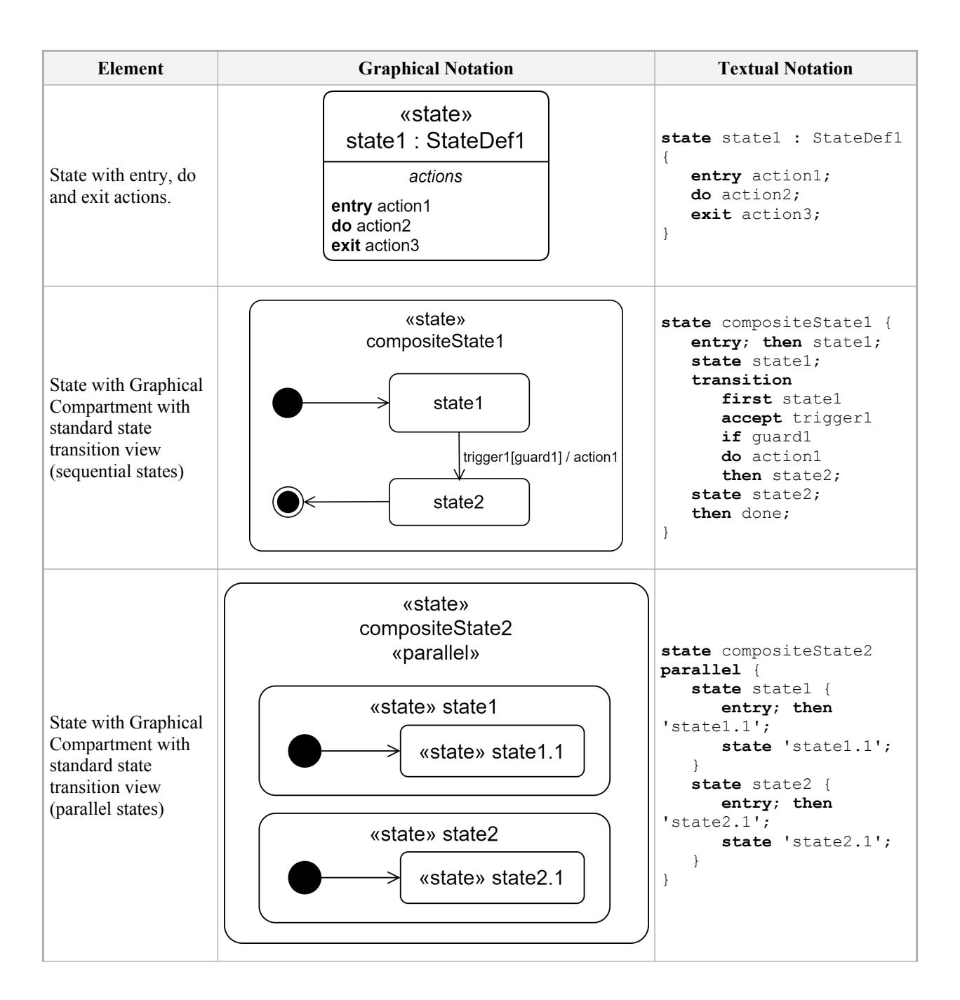

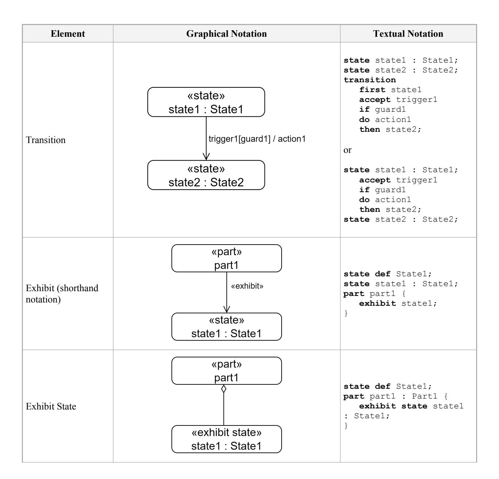

| Element                       | Graphical Notation | Textual Notation                                                                                                                                                          |
|-------------------------------|--------------------|---------------------------------------------------------------------------------------------------------------------------------------------------------------------------|
| States Compartment            |                    | {<br>state state1 :<br>StateDef [1*]<br>ordered nonunique;<br>/* */<br>exhibit state<br>state10;<br>state state11 {<br>state 'state11.1';<br>state 'state11.2';<br>}<br>} |
| Exhibit States<br>Compartment |                    | {<br>exhibit state state1<br>:<br>StateDef [1*]<br>ordered nonunique;<br>/* */<br>}                                                                                       |
| Exhibited By<br>Compartment   |                    | No textual notation                                                                                                                                                       |

# <span id="page-148-0"></span>**7.18.2 State Definitions and Usages**

A state definition or usage is declared as an action definition or usage (see [7.17.2](#page-130-0) ), but using the keyword **state** instead of **action**. In addition, entry, do and exit actions can be declared (at most one of each) in the body of a state definition or usage, using the keywords **entry action**, **do action**, and **exit action**, followed by an action declaration and body, in the usual form.

```
state def Exercising {
    entry action warmup : WarmUp;
    do action exercise : Exercise {
        action strengthTraining;
        then action cardioTraining;
    }
    exit action cooldown : Cooldown;
}
```

In addition to the generic **action** notation as above, the special notations for send action usages (see [7.17.7](#page-136-0) ), accept action usages (see [7.17.8](#page-137-0) ), and assignment action usages (see [7.17.9](#page-140-0) ) can be used for entry, do, and exit actions.

```
state def Operating {
    entry assign stateCode := StateCodes::Operating;
    do send new ReadySignal() to Controller;
}
```

The **entry**, **do**, and **exit** keywords can also be used without any **action** keyword. If the keyword is immediately followed by a semicolon ;, then they are empty actions. If they are followed by a qualified name or feature chain for an action usage, then this is a shorthand for relating the entry, do, or exit action to the identified action usage via *reference subsetting* (see also [7.13.2](#page-99-0) ).

```
action monitorTemperature;
state def TurnedOn {
    // This is an empty entry action.
    entry;
    // The following is equivalent to
    // do action references monitorTemperature;
    do monitorTemperature;
}
```

A state definition or usage may hierarchically contain state usages in its body. By default, these substate usages are considered to be *exclusive*, that is, their performances do not overlap in time. The initial state usage to be performed is indicated by a succession (see [7.13.5](#page-104-0) ) from the entry action to that state usage, representing that this is the state that is entered on completion of the entry action. If the containing state has no substantive entry action, then an empty entry action may be used as the source of the succession. A shorthand may also be used for a succession whose source is the entry action, consisting of the keyword **then** followed by a qualified name or feature chain for the target state usage, placed immediately after the entry action declaration (see also [7.17.4](#page-133-0) ).

```
state def OperationalStates {
    entry action initial;
    then off;
    // The above shorthand is equivalent to
    // first initial then off;
    state off;
    state starting;
    state on;
}
```

Conditional successions (see [7.17.5](#page-134-0) ) may be used when the initial state to be entered depends on some condition.

```
state def OperationalStates {
    entry action initial { out attribute isStarting : Boolean; }
    if not initial.isStarting then off;
    if initial.isStarting then starting;
    state off;
```

```
state starting;
    state on;
}
```

If the keyword **parallel** is added to a state definition or usage, just before the body part, then that state definition or usage becomes a parallel state, and its contained state usages can be performed concurrently (that is, "in parallel").

```
state def VehicleStates parallel {
    // These substates are performed concurrently.
    state OperationalStates;
    state HealthStates;
}
```

Transitions between the nested states of a state definition or state usage are indicated using transition usages (see [7.18.3](#page-150-0) ). However, no transitions are allowed between the concurrent states nested in a parallel state.

The base state definition and usage are StateAction and stateActions from the States library model (see [7.18](#page-144-0) ). (For other semantic constraints on state usages, see [8.4.14](#page-469-0) .)

# <span id="page-150-0"></span>**7.18.3 Transition Usages**

A transition usage is also a kind of action usage (see [7.17.2](#page-130-0) ) that can be used within non-parallel states. (A parallel state with concurrent substates is not allowed to have transitions to or from its substates.) A transition usage is implicitly defined by the action definition StateTransitionAction from the States library model (see [7.18](#page-144-0) ). A transition usage also relates a *source* state usage to a *target* state usage, declaring that it is possible to transition from a performance of the source state to a new performance of the target state.

A transition usage is identified with the keyword **transition**. The source and target states are identified using the same keywords as for a succession (see [7.13.5](#page-104-0) ), **first** and **then**.

```
state def OnOff1 {
    entry;
    then off;
    state off;
    state on;
    transition off_on first off then on;
    transition on_off first on then off;
}
```

A transition usage can also have an *accepter*, which is an accept action usage use to trigger the transition. The accepter action for a transition usage is placed between the source and target parts and notated using the **accept** keyword, with its payload and receiver parameters specified exactly as discussed in [7.17.8](#page-137-0) .

```
item def TurnOn;
state def OnOff2 {
    port commPort;
    entry;
    then off;
    state off;
    state on;
    transition off_on
        first off
        accept TurnOn via commPort
```

```
then on;
    transition on_off
        first on
        accept after 5[min]
        then off;
}
```

A transition usage can also have a Boolean-valued guard expression. The guard expression is evaluated during the performance of the source, and the transition usage is only enabled to possibly cause a transition out of the source state when the guard evaluates to true. The guard expression is given after the keyword **if**, placed between the source and target parts, after the accepter (if any).

```
state def OnOff3 {
    in attribute isInitOff : Boolean;
    in attribute isEnabled : Boolean;
    port commPort;
    entry action init;
    transition first init if isInitOff then off;
    transition first init if not isInitOff then on;
    state off;
    state on;
    transition off_on
        first off
        accept TurnOn via commPort
        if isEnabled
        then on;
    transition on_off
        first on
        accept after 5[min]
        if isEnabled
        then off;
}
```

**Note.** An entry action can have outgoing transitions, but they will have the same semantics as conditional successions. A transition usage with a source that is *not* a state usage is not allowed to have an accepter.

Finally, a transition usage can have an *effect action*, which is an action usage that is performed if the transition usage is triggered. An effect action is notated using the keyword **do** in the same way as a do action on a state definition or usage (see [7.18.2](#page-148-0) ). In the textual notation for a transition usage, it is also placed between the source and target parts, after the guard and accepter (if the transition usage has those).

```
action def PowerUp;
item def TimeoutSignal;
state def OnOff4 {
    in attribute isInitOff;
    in attribute isEnabled;
    port commPort;
    entry action init;
    transition first init if isInitOff then off;
    transition first init if not isInitOff then on;
    state off;
    state on;
    transition off_on
```

```
first off
        if isEnabled
        accept TurnOn via commPort
        do action powerUp : PowerUp;
        then on;
    transition on_off
        first on
        if isEnabled
        accept after 5[min]
        do send new TimeoutSignal() via commPort
        then off;
}
```

In the textual notation, there is also a shorthand for a transition usage without a declaration part, in which both the **transition** keyword *and* the source part can be omitted. In this case, the source is taken to be the closest lexically previous state usage, which means the transition usages out of a certain state usage need to be placed essentially immediately after their source states. This notation can also be used when the transition source is the entry action, which is particularly useful, because it means the entry action does not need to be named.

```
state def OnOff5 {
    in attribute isInitOff;
    in attribute isEnabled;
    port commPort;
    entry;
        if isInitOff then off;
        if not isInitOff then on;
    state off;
    accept TurnOn via commPort
        if isEnabled
        do action powerUp : PowerUp;
        then on;
    state on;
    accept after 5[min]
        if isEnabled
        do send new TimeoutSignal() via commPort;
        then off;
}
```

In summary, the guard and accepter of a transition action usage determine whether a transition usage is triggered:

- 1. A transition usage can only be triggered during a performance of its source.
- 2. If a transition usage has a guard expression, it can only be triggered if the guard expression evaluates to true.
- 3. If a transition has an accepter, and it meets the above conditions, then it is triggered if the accepter can accept in incoming transfer via its receiver parameter, in which case the accepter is performed as described in [7.17.8](#page-137-0) (see also [8.4.13.6](#page-461-0) ).

If a transition usage is triggered, then it establishes a succession relationship between the source performance and a new performance of the target, and a transition is performed as follows:

- 1. If the source state has a do action that is still being performed, that is interrupted.
- 2. Then, if the source state has an exit action, that is performed.
- 3. Once that completes, if the transition usage has an effect action, that is performed.
- 4. Once that completes, if the target state has an entry action, that is performed.
- 5. Once that completes, if the target state has a do action, that is performed.

The source of a transition usage must be a state usage, but its target may be an action usage other than a state usage. In particular, a transition to done indicates that the source state is the final state of the containing state performance, though the containing state does not necessarily terminate immediately. Alternatively, a transition to a terminate action (see [7.17.10](#page-141-0) ) may be used to immediately terminate the containing state performance if that transition is triggered.

```
item def Abort;
state def OnOff6 {
    port commPort;
    entry; then off;
    state off;
    accept TurnOn via commPort then on;
    accept Abort via commPort then stop;
    state on;
    accept after 5[min] then done;
    action stop terminate;
}
```

# <span id="page-153-0"></span>**7.18.4 Exhibit State Usages**

An *exhibit state usage* is declared as a state usage (see [7.18.2](#page-148-0) ) but using the kind keyword **exhibit state** instead of just **state**. An exhibit state usage is a kind of perform action usage (see [7.17.6](#page-135-0) ) for which the action usage is a state usage, known as the *exhibited state.* As for a perform action usage, the exhibited state is related to the exhibit state usage by a *reference subsetting* relationship, specified textually using the keyword **references** or the symbol ::>. Or, if the exhibit state usage has no such reference subsetting, then the exhibited state is the exhibit state usage itself.

```
part def Vehicle {
    exhibit state operatingState references VehicleStates::operating;
    abstract exhibit state monitoringState; // Exhibited state is itself.
}
```

An exhibit state usage may also be declared using just the keyword **exhibit** instead of **exhibit state**. In this case, the declaration does not include either a name or short name. Instead, the exhibited state of the exhibit state usage is identified by giving a qualified name or feature chain immediately after the **exhibit** keyword.

```
part vehicle : Vehicle {
    // The exhibited state is VehicleActions::monitoring.
    exhibit VehicleStates::monitoring :> Vehicle::monitoringState;
}
```

If an exhibit state usage is used in the body of a part definition or usage, then the part is considered to be the *performer* of the exhibit state usage (see also [8.4.14.4](#page-473-0) on the semantics of exhibit state usages). The **ref** keyword may be used in the declaration of a exhibit state usage, but a exhibit state usage is always referential, whether or not **ref** is included in its declaration.

# <span id="page-153-1"></span>**7.19 Calculations**

# <span id="page-153-2"></span>**7.19.1 Calculations Overview**

*Metamodel references:*

- *Textual notation, [8.2.2.19](#page-218-0)*
- *Graphical notation, [8.2.3.19](#page-267-0)*

- *Abstract syntax, [8.3.19](#page-376-0)*
- *Semantics, [8.4.15](#page-474-0)*

A *calculation definition* is a kind of action definition (see [7.17](#page-116-0) ) that has a distinguished parameter with direction **out** called the *result* parameter (which is usually the only **out** parameter). A calculation definition specifies a reusable computation that returns a result in the result parameter. A *calculation usage* is an action usage that is a usage of a calculation definition.

In addition to its parameters, a calculation definition or usage may have features that are calculation or action usages that carry out steps in the computation of the result of the calculation. The calculation may also have other features that are used to record intermediate results in the computation. The final result is specified as an *expression* written in terms of the input parameters of the calculation and any intermediate results.

KerML includes extensive syntax for constructing expressions, including traditional operator notations for functions in the Kernel Function Library, which is adopted in its entirety into SysML. In addition, a calculation definition is also a KerML function, and a calculation usage is itself a KerML expression. This allows a calculation definition or usage to also be invoked using the notation of a KerML invocation expression. (See the KerML Specification [KerML, 7.4.9] for a complete description of the KerML expression sublanguage.)

Calculation definitions are often used to define mathematical functions, in which case the defined computation should be *pure*. A pure calculation has the following properties:

- 1. Two invocations of the calculation definition with the same values for the input parameters always produce the same values for the result parameter.
- 2. The performance of the calculation does not produce any side effects (that is, it does not effect any occurrence that is not a composite part of its performance or that of a subaction or subcalculation).

Any subcalculations or subactions of a pure calculation must also be pure, including the final expression computing the result. Further, the inputs of a pure calculation should either be attributes or the calculation should not rely on features of input occurrences that may change from one invocation of the calculation definition to another.

**Table 18. Calculations – Representative Notation**

<span id="page-154-0"></span>

| Element         | Graphical Notation | Textual Notation                          |
|-----------------|--------------------|-------------------------------------------|
|                 |                    |                                           |
| Calc Definition |                    | calc def CalcDef1 {<br>expression1<br>}   |
|                 |                    | calc def CalcDef1 {<br>/* members */<br>} |
|                 |                    |                                           |

| Element | Graphical Notation | Textual Notation                              |
|---------|--------------------|-----------------------------------------------|
| Calc    |                    |                                               |
|         |                    | calc calc1 : CalcDef1 {<br>expression1<br>}   |
|         |                    | calc calc1 : CalcDef1 {<br>/* members */<br>} |
|         |                    |                                               |
|         |                    |                                               |

# <span id="page-155-0"></span>**7.19.2 Calculation Definitions and Usages**

A calculation definition or usage is declared as an action definition or usage (see [7.17.2](#page-130-0) ), but using the keyword **calc** instead of **action**. As for an action definition or usage, directed usages declared in the body of a calculation definition or usage are consider to be parameters. In addition, the result parameter for a calculation definition or usage can be declared as an out parameter using the keyword **return** instead of **out**. Note that a calculation definition or usage always has a result parameter, inherited if not owned.

```
calc def Velocity {
    in v_i : VelocityValue;
    in a : AccelerationValue;
    in dt : TimeValue;
    return v_f : VelocityValue;
}
```

If a calculation definition has superclassification relationships (implicit or explicit) with action definitions (or KerML behaviors), then the rules for the redefinition of the non-result parameters of the calculation definition are the same as for an action definition (see [7.17.2](#page-130-0) ). In addition, if a calculation definition specializes other calculation definitions (or KerML functions), then its result parameter redefines the results parameters of the calculation definitions it specializes, regardless of the positions of those parameters.

```
calc def Dynamics {
    in initialState : DynamicState;
    in time : TimeValue;
    return : DynamicState;
}
calc def VehicleDynamics specializes Dynamics {
    // Each parameter redefines the corresponding parameter of Dynamics
    in initialState : VehicleState;
    in time : TimeValue;
    return : VehicleState;
}
```

If a calculation usage has any type of specialization relationship (i.e., feature typing, subsetting or redefinition, implicit or explicit) with an action definition or usage (or KerML behavior or step), the rules for the redefinition of the parameters of the general definitions and usages are the same as given for the redefinition of parameters of a calculation definition above.

```
calc computation : Dynamics {
    // Parameters redefine parameters of Dynamics.
    in initialState;
    in time;
```

```
return result;
}
calc vehicleComputation subsets computation {
    // Input parameters are inherited, result is redefined.
    return : VehicleState;
}
```

The body of a calculation definition or usage is like the body of an action definition or usage (see [7.17.2](#page-130-0) ), with the optional addition of the declaration of a result expression at the end, using the expression sublanguage from [KerML, 7.4.9]. The result of the result expression is implicitly bound to the result parameter of the containing calculation definition or usage..

```
calc def Average {
    in scores[1..*] : Rational;
    return : Rational;
    sum(scores) / size(scores)
}
```

**Note.** A result expression is written *without* a final semicolon.

The result of a calculation definition or usage can also be explicitly bound, particularly using a feature value on the result parameter declaration (see [7.13.4](#page-103-1) ). In this case, the body of the calculation definition or usage should *not* include a result expression.

```
calc def Average {
    in scores[1..*] : Rational;
    return : Rational = sum(scores) / size(scores);
}
```

The base calculation definition and usage are Calculation and calculations from the Calculations library model (see [7.19](#page-153-1) ).

# <span id="page-156-0"></span>**7.20 Constraints**

# <span id="page-156-1"></span>**7.20.1 Constraints Overview**

*Metamodel references:*

- *Textual notation, [8.2.2.20](#page-218-1)*
- *Graphical notation, [8.2.3.20](#page-269-0)*
- *Abstract syntax, [8.3.20](#page-378-0)*
- *Semantics, [8.4.16](#page-476-0)*

# **Constraint Definition and Usage**

A *constraint definition* is a kind of occurrence definition (see [7.9](#page-80-0) ) that defines a logical predicate. Similar to a calculation definition (see [7.19](#page-153-1) ), a constraint definition may have parameters with direction **in**. A constraint always has an implicit Boolean-value result parameter with direction **out**. A constraint usage is an occurrence usage that is the usage of a constraint definition.

Also similarly to a calculation, a constraint definition or usage may have features that are calculation or action usages that carry out steps in the computation of the result of the calculation. The constraint may also have other features that are used to record intermediate results in the computation. The final result is specified as an expression written in terms of the input parameters of the calculation and any intermediate results. In addition, a constraint definition is also a KerML predicate and a constraint usage is a KerML Boolean expression, which allows a constraint definition or usage to also be invoked using the notation of a KerML invocation expression.

For a given set of input parameter values, a constraint usage is *satisfied* if its expression evaluates to true and is *violated* otherwise. The parameters of a constraint usage may be bound to specific features whose values can be constrained by the constraint expression. For the constraint expression {x < y}, the constraint usage may bind x to the diameter of a bolt and bind *y* to the diameter of a hole that the bolt must fit into. This constraint can then be evaluated to be true or false. E.g., if x is 3 and y is 5, then the expression x < y evaluates to true, and the constraint is satisfied*.* In the general case, the expression used to define a constraint can be arbitrarily complicated, as long as the overall expression returns a Boolean value.

A constraint usage that is a feature of another definition or usage may also directly reference features of its containing context, in which case it may be used to effectively constrain the values of those features. In a context with the features bolt diameter and hole diameter, a constraint usage may be defined directly without parameters using the expression {'bolt diameter' < 'hole diameter'}.

# **Asserted Constraints**

In general, a constraint may be satisfied sometimes and violated other times. However, an *assert constraint usage* asserts that the result of a given constraint must be always true at all times. If, at some point in time, it can be determined that an assert constraint usage evaluates to other than its asserted value, this would be a logical inconsistency in the model. Constraints associated with the laws of physics, for example, should be asserted to be true, because they cannot be violated in any valid model of the real world. However, a constraint can also be asserted simply if its satisfaction is expected to be implied within a model. That way, if the constraint is violated, this can be flagged by tooling as needing resolution.

An assert constraint usage can also be *negated,* which means that the given constraint is asserted to be false rather than true. A negated assert constraint usage can be used to assert that some condition must never happen if the model is logically consistent.

**Table 19. Constraints – Representative Notation**

<span id="page-157-0"></span>

| Element               | Graphical Notation | Textual Notation                                              |
|-----------------------|--------------------|---------------------------------------------------------------|
|                       |                    | constraint def<br>ConstraintDef1;                             |
| Constraint Definition |                    | constraint def<br>ConstraintDef1 {<br>/* members */<br>}      |
|                       |                    |                                                               |
| Constraint            |                    | constraint constraint1 :<br>ConstraintDef1;                   |
|                       |                    | constraint constraint1 :<br>ConstraintDef1 {<br>/* members */ |
|                       |                    | }                                                             |

| Element                                   | Graphical Notation | Textual Notation                                                                                                                                                            |
|-------------------------------------------|--------------------|-----------------------------------------------------------------------------------------------------------------------------------------------------------------------------|
| Constraints<br>Compartment                |                    | {<br>constraint<br>constraint1 :<br>ConstraintDef1<br>[1*]<br>ordered nonunique;<br>/* */<br>assert constraint<br>constraint10;<br>constraint<br>{boolean_expression1}<br>} |
| Assert Constraints<br>Compartment         |                    | {<br>assert constraint<br>constraint1 :<br>ConstraintDef1<br>[1*]<br>ordered nonunique;<br>/* */<br>assert<br>constraint<br>{boolean_expression1}<br>}                      |
| Assert Constraint<br>(shorthand notation) |                    | constraint constraint1;<br>part part1 {<br>assert constraint1;<br>}                                                                                                         |

# <span id="page-158-0"></span>**7.20.2 Constraint Definitions and Usages**

A constraint definition or usage can be declared as a kind of occurrence definition or usage (see [7.9.2](#page-85-0) ), using the kind keyword **constraint**. A constraint usage must be defined by a single constraint definition or a KerML predicate (see [KerML, 7.4.8]).

Constraint definitions and usages are not calculation definitions and usages, but, like calculation definitions and usages, they are kinds of KerML functions and expressions (a predicate is a kind of function). As such, any directed usages declared in the body of a constraint definition or usage are considered to be owned parameters of the

constraint. Furthermore, every constraint definition and usage has a result parameter, but, since this must have a Boolean type, it is generally not necessary to redeclare it for a constraint definition or usage.

The body of a constraint definition or usage is also like the body of a calculation definition or usage (see [7.19.2](#page-155-0) ), including the addition of the declaration of a result expression at the end, using the expression sublanguage from [KerML, 7.4.9]. For a constraint definition or usage, the result expression must be Boolean valued.

```
constraint def IsFull {
    in tank : FuelTank;
    tank.fuelLevel == tank.maxFuelLevel // Result expression
}
part def Vehicle {
    part fuelTank : FuelTank;
    constraint isFull : IsFull {
        in tank = fuelTank;
    }
}
```

The base constraint definition and usage are Constraint and constraints from the Constraints model library (see [7.20](#page-156-0) )

# <span id="page-159-0"></span>**7.20.3 Assert Constraint Usages**

An assert constraint usage is declared like a regular constraint usage (see [8.4.16.2](#page-477-0) ), except using the kind keyword **assert constraint** instead of just **constraint**. By default, an assert constraint usage asserts that it must evaluate to true at all times. However, an assert constraint usage may be *negated* by inserting the keyword **not** between **assert** and **constraint**, in which case the assertion is that the assert constraint usage evaluates to *false* at all times.

```
part testObject {
    attribute computedMass : MassValue;
    assert constraint { computedMass >= 0[kg] }
    // Alternatively, the following is equivalent.
    assert not constraint { computedMass < 0[kg] }
}
```

An assert constraint usage may also be declared using just the keyword **assert** instead of **assert constraint**. In this case, the declaration does not include either a name or short name for the assert constraint usage. Instead, the constraint to be asserted is identified by giving a qualified name or feature chain immediately after the **assert** keyword, and it is then related to the assert constraint usage by a *reference subsetting relationship* (see also [8.4.5.3](#page-438-0) ). A negated assert constraint usage of this form can be constructed using **assert not**.

```
constraint negativeMass {
    attribute mass : MassValue;
    mass < 0[kg]
}
part testObject {
    attribute computedMass : MassValue;
    // The following is equivalent to
    // assert not constraint references negativeMass { ... }
    assert not negativeMass {
        :>> mass = computedMass;
    }
}
part alienObject {
    attribute antiMass : MassValue;
    // The following is equivalent to
    // assert constraint references negativeMass { ... }
```

```
assert negativeMass {
        :>> mass = antiMass;
    }
}
```

# <span id="page-160-0"></span>**7.21 Requirements**

# <span id="page-160-1"></span>**7.21.1 Requirements Overview**

*Metamodel references:*

- *Textual notation, [8.2.2.21](#page-219-0)*
- *Graphical notation, [8.2.3.21](#page-271-0)*
- *Abstract syntax, [8.3.21](#page-382-0)*
- *Semantics, [8.4.17](#page-478-0)*

# **Requirements**

A *requirement definition* is a kind of constraint definition (see [7.20](#page-156-0) ) that specifies stakeholder-imposed constraints that a design solution must satisfy to be a valid solution. A requirement definition contains one or more features that are constraint usages designated as the *required constraints.* These may be specified informally using text statements (commonly known as "shall" statements) or more formally using constraint expressions. A requirement definition may also optionally include *assumed constraints.* The required constraints of a requirement only apply if all the assumed constraints are satisfied.

A *requirement usage* is a kind of constraint usage (see [7.20](#page-156-0) ) that is a usage of a requirement definition in some context. The context for multiple requirements can be provided by a package (see [7.5](#page-54-0) ), a part (see [7.11](#page-89-0) ) or another requirement. A design solution must satisfy the requirement and all of its member requirements and constraints to be a valid solution.

A requirement definition or usage may be decomposed into nested requirement usages, which may themselves be further decomposed. Since a requirement usage is a kind of constraint usage, any nested composite requirement usage is automatically considered to be a required constraint of the containing requirement definition or usage. A requirement definition or usage may also reference another requirement usage as a required constraint. For the overall requirement to then be satisfied, all such composite or referenced requirements must be satisfied.

Like any usage element, the features of a requirement usage can redefine the features of its requirement definition. For example, a requirement definition MaximumMass may include the require constraint {massActual <= massRequired}, written in terms of the attribute usages massActual and massRequired. A requirement usage maximumVehicleMass defined by MaximumMass could restrict the subject of the requirement to be a Vehicle, redefine the massActual attribute to be the mass of the subject Vehicle, and redefine the massRequired attribute and bind it to 2000 kilograms. In this way, the requirement definition serves as a requirement template that can be reused and tailored to each context of use.

# **Subjects**

A requirement definition or usage always has a *subject,* which is a distinguished parameter that identifies the entity on which the requirement is being specified. A requirement usage can only be satisfied by an entity that conforms to the definition of its subject. For example, if the subject of a requirement is defined to be a Vehicle*,* then a standard vehicle model or sports vehicle model can satisfy the requirement, as long as these usages are defined by Vehicle or a specialization of it. The subject can also be restricted to be a certain kind of definition element, if it is desired to constrain what kind of entity can satisfy the requirement. For example, the subject can be restricted to be an action, if it is desired to constrain the requirement to be satisfied only by action usages.

Constraining the subject of a requirement definition or usage is also useful to allow features of the subject definition to be used in formal expressions for the assumed and required constraints of the requirement. However, this may not be necessary if the requirement is specified more informally, or in terms of parameters or other features to be bound later. In this case, it is not necessary to explicitly specify the subject of a requirement, in which case it the subject is implicitly assumed to be defined as Anything.

**Note.** Cases also have subjects (see [7.22](#page-168-0) ).

# **Actors, Stakeholders and Concerns**

Actors and stakeholders are additional distinguished parameters that may be specified for a requirement definition or usage. Actor and stakeholder parameters are part usages representing entities that play special roles relative to the requirement definition or usage. A requirement may have multiple actors and stakeholders, some of which may have the same definition, representing the same kind of entity playing different roles relative to the requirement.

An *actor parameter* represents a role played by an entity external to the subject of the requirement but necessary for the satisfaction of the requirement. For example, a requirement whose subject is a Vehicle may also specify an actor that is the Driving Environment. Features of this actor may be used in, for example, the assumed constraints of the requirement, to constrain the environment in which the required constraints apply. The satisfaction of the requirement by a specific subject entity is then relative to the specific environment entity filling the actor role.

**Note.** Actor parameters may also be specified for cases (see [7.22](#page-168-0) ) and, in particular, use cases (see [7.25](#page-176-0) ).

A *stakeholder parameter* represents a role played by an entity (usually a person, organization or other group) having concerns related to the containing requirement. Stakeholder concerns may also be explicitly modeled as special kinds of requirements. A *concern definition* is a kind of requirement definition that represents a stakeholder concern. A *concern usage* is a kind of requirement usage that is a usage of a concern definition. The stakeholder parameters of a concern definition or usage then delineate the stakeholders that have a certain concern.

Rather than explicitly referencing specific stakeholders, a requirement definition or usage can be specified as *framing* the modeled concerns of relevant stakeholders. All the framed concerns of a requirement must then be *addressed* for the requirement to be satisfied.

**Note.** Stakeholder and concern modeling is frequently used in the context of view and viewpoint modeling (see [7.26](#page-180-0) ). A viewpoint is a kind of requirement that frames certain stakeholder concerns to be addressed by one more more views satisfying the viewpoint.

# **Requirement Satisfaction**

Since a requirement is a kind of constraint, a requirement can be evaluated to be true or false. A requirement is *satisfied* when it evaluates to true.

A *satisfy requirement usage* is a kind of assert constraint usage (see [7.20](#page-156-0) ) that asserts that a requirement is satisfied when a given feature is bound to the subject parameter of the requirement. Other parameters or features of the requirement may also be bound in the body of the satisfy requirement usage. For example, the maximumVehicleMass requirement above could be asserted to be satisfied by a specific vehicle c1 usage, which means that the required constraint {massActual <= massRequired} must be true when massActual is bound to the mass of vehicle c1*.*

<span id="page-161-0"></span>Similarly to an assert constraint usage, a satisfy requirement usage can also be *negated.* A negated satisfy requirement usage asserts that some entity does *not* satisfy the given requirement.

**Table 20. Requirements – Representative Notation**

| Element                                               | Graphical Notation | Textual Notation                                                                                                                                                                                                                                                                    |
|-------------------------------------------------------|--------------------|-------------------------------------------------------------------------------------------------------------------------------------------------------------------------------------------------------------------------------------------------------------------------------------|
| Requirement<br>Definition                             |                    | requirement def <r1><br/>RequirementDef1 {<br/>subject s1 :<br/>Subject1;<br/>}<br/>requirement def<br/>RequirementDef1 {<br/>/* members */<br/>}</r1>                                                                                                                              |
| Requirement                                           |                    | requirement <r1><br/>requirement1 :<br/>RequirementDef1 {<br/>subject redefines s1<br/>= mySubject;<br/>}<br/>requirement requirement1<br/>:<br/>RequirementDef1 {<br/>doc /* */<br/>subject redefines s1<br/>= mySubject;<br/>require require2;<br/>assume constraint1;<br/>}</r1> |
| Requirement with<br>Assume and Require<br>Constraints |                    | constraint assumption1 {<br>/**/ }<br>constraint constraint1 {<br>/**/ }<br>requirement requirement1<br>{<br>assume assumption1;<br>assume constraint<br>assumption2 { /**/ }<br>require constraint1;<br>}                                                                          |

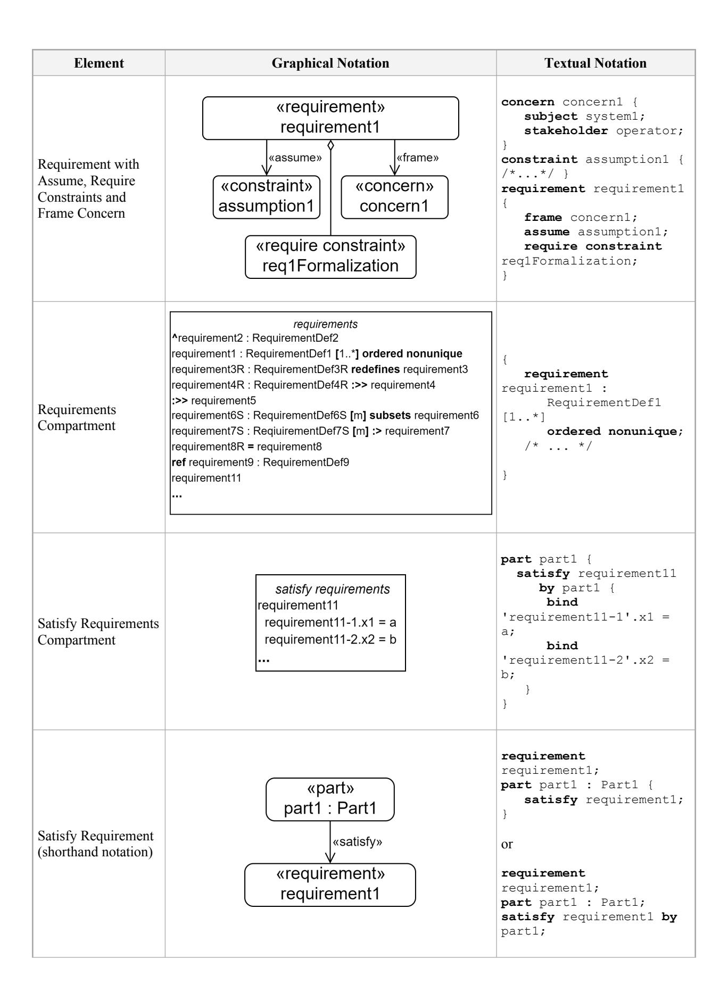

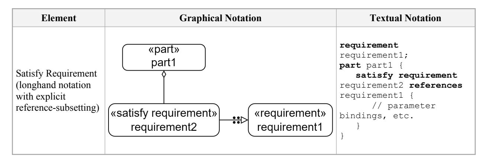

# <span id="page-164-0"></span>**7.21.2 Requirement Definition and Usage**

A requirement definition or usage is declared as a kind of constraint definition or usage (see [7.20.2](#page-158-0) ), using the kind keyword **requirement**. A requirement usage must be defined by a single requirement definition.

The informal *text* of a requirement is given by any documentation comments written in the body of a requirement definition or usage. If a requirement definition or usage is declared with a short name (see [7.2](#page-47-0) ), then this is also considered to be its *requirement ID.*

Formally, a requirement is a kind of constraint. However, rather than specifying its constraint expression directly, a requirement constraint is built from two sets of other constraints: the *assumed* and *required* constraints of the requirement. The effective constraint for the requirement is them a logical implication: if all the assumption constraints are true, all the required constraints must be true. Required and assumed constraints are declared as composite constraint usages in the body of a requirement definition or usage, by prefixing a regular constraint usage declaration (see [7.20.2](#page-158-0) ) with the keyword **assume** or **require**.

```
requirement def <'1.1'> MaximumMass {
    doc
    /*
     * Assuming the required mass is greater than 0,
     * the actual mass shall be less than or equal to
     * the required mass.
     */
    attribute massActual : MassValue;
    attribute massRequired : MassValue;
    assume constraint { massRequired > 0[kg] }
    require constraint { massActual <= massRequired }
}
```

An assumed or required constraint may also be declared using just the keyword **assume** or **require** instead of **assume constraint** or **require constraint**. In this case, the declaration does not include either a name or short name for the constraint usage. Instead, the constraint to be assumed or required is identified by giving a qualified name or feature chain immediately after the **assume** or **require** keyword, and it is then related to the assumed or required constraint usage by a *reference subsetting relationship* (see also [8.4.5.3](#page-438-0) ).

```
constraint massIsPositive {
    attribute mass : MassValue;
    mass > 0[kg];
}
constraint massLimit {
    attribute mass : MassValue;
    attribute massLimit : MassValue;
    massActual <= massRequired
```

```
}
requirement def <'1.1'> MaximumMass {
    attribute massActual : MassValue;
    attribute massRequired : MassValue;
    assume massIsPositive {
        :>> mass = massRequired;
    }
    require massLimit {
        :>> mass = massActual;
        :>> massLimit = massRequired;
    }
}
```

The *subject* of a requirement definition or usage is modeled as its first parameter. Following the general rule for parameters (see [7.17.2](#page-130-0) ), the subject parameter of a requirement definition or usage will redefine the subject parameter of any requirement definitions or usages that it specializes. The base requirement definition in the Requirements library model specifies the most general possible subject, with the default name subj and the most general type Anything, and this can then be further specialized in specific requirement definitions and usages. A subject parameter is always an **in** parameter, so it is not necessary to declare it with an explicit direction. Instead, the keyword **subject** is used to identify the declaration of a subject parameter, which must come before the declaration of any other parameters in a requirement definition or usage.

```
requirement <'v1.1'> vehicleMaximumMass : MaximumMass {
    doc
    /* The total mass of a Vehicle shall be no greater than
     * its required mass.
     */
    subject vehicle : Vehicle;
    attribute :>> massActual = vehicle.totalMass;
    attribute :>> massRequired = 2000[kg];
    // Required and assumed constraints are inherited.
}
```

A requirement definition or usage may also have one or more *actor* or *stakeholder* parameters. Similarly to the declaration of a subject parameter, these distinguished parameters are declared using the keywords **actor** and **stakeholder** rather than explicitly declaring their direction. Actor and stakeholder parameters are part usages, so they must be (explicitly or implicitly) defined by part definitions (see [7.11.2](#page-91-0) ).

```
requirement def BrakingRequirement {
    subject vehicle : Vehicle;
    actor environment : 'Driving Environment';
    stakeholder driver : Person;
    attribute speedLimit : SpeedValue;
    attribute maxBrakingDistance : DistanceValue;
    assume constraint {
        doc /* The environment conditions are poor. */
    }
    assume constraint {
        doc /* The driver is an occupant of the vehicle. */
    }
    assume constraint {
        doc /* The vehicle speed is less than the speed limit. */
    }
    require constraint {
        doc /* The vehicle shall brake from its initial speed to zero
             * speed in a distance less than the maxBrakingDistance.
             */
```

```
}
}
```

A composite requirement usage nested in a requirement definition or usage is a *subrequirement* of the containing requirement definition or usage. Subrequirements are considered to automatically be required constraints of the containing requirement definition or usage. This is useful for modeling groups of requirements that are intended to be satisfied together on the same subject. To simplify doing this, if a subject parameter is not explicitly declared for a subrequirement, it is assumed to have the same subject as its containing requirement definition or usage, with its subject bound to that of the container.

```
requirement def VehicleRequirementsGroup {
    subject vehicle : Vehicle;
    // The subject of the following subrequirements
    // are implicitly bound to the subject "vehicle"
    // of the containing requirement definition.
    requirement driving : DrivingRequirement;
    requirement braking : BrakingRequirement;
    // The subject of the following subrequirement
    // is declared explicitly.
    requirement engineRqts : EngineRequirementsGroup {
        subject engine = vehicle.engine;
    }
}
```

The base requirement definition and usage are RequirementCheck and requirementChecks from the Requirements model library (see [9.2.14](#page-527-0) ).

# <span id="page-166-0"></span>**7.21.3 Concern Definitions and Usages**

A concern definition or usage is declared as a requirement definition or usage (see [7.21.2](#page-164-0) ) using the kind keyword **concern** instead of **requirement**. Otherwise, a concern definition or usage is specified exactly like a regular requirement definition or usage. The intent, however, is that the concerns of one or more stakeholders can be modeled as the required constraints of a concern definition or usage with appropriate stakeholder parameters.

```
concern def BrakingConcern {
    subject vehicle : Vehicle;
    stakeholder driver : Person;
    attribute maxBrakingDistance : DistanceValue;
    assume constraint {
        doc /* The driver is an occupant of the vehicle. */
    }
    require constraint {
        doc /* The vehicle shall brake from its initial speed to zero
             * speed in a distance less than the maxBrakingDistance.
             */
    }
}
```

One or more concerns can then be *framed* in other requirement definitions and usages. A framed concern usage is a subrequirement usage (see [7.21.2](#page-164-0) ) indicated by prefixing a concern usage declaration with the keyword **frame**. As for an assumed or required constraint, the keyword **frame** can be used rather than **frame concern** to declare a framed concern using reference subsetting. In any case, since the framed concern usage itself is a subrequirement, it will automatically be considered a required constraint of its containing requirement definition or usage.

```
requirement def BrakingRequirement {
    subject vehicle : Vehicle;
```

```
actor environment : 'Driving Environment';
    attribute speedLimit : SpeedValue;
    attribute maxBrakingDistance : DistanceValue;
    assume constraint {
        doc /* The environment conditions are poor. */
    }
    frame concern brakingConcern : BrakingConcern {
        // Subject is automatically bound to "vehicle".
        :>> maxBrakingDistance = BrakingRequirement::maxBrakingDistance;
    }
}
```

The base concern definition and usage are ConcernCheck and concernChecks from the Requirements model library (see [9.2.14](#page-527-0) ).

# <span id="page-167-0"></span>**7.21.4 Satisfy Requirement Usages**

A satisfy requirement usage is declared as a requirement usage (see [7.21.2](#page-164-0) ), using the kind keyword **satisfy requirement**. However, a satisfy requirement usage differs from a regular requirement usage in two ways:

- 1. The subject parameter of a satisfy requirement usage must be bound to a *satisfying feature.*
- 2. A satisfy requirement usage is a kind of assert constraint usage (see [7.20.3](#page-159-0) ).

Together, these mean that a satisfy requirement usage asserts that it is satisfied as a requirement (that is, it always evaluates to true) when the role of its subject is bound to the satisfying feature. The satisfying feature for a satisfy requirement usage can be specified in its declaration, immediately before its body, after keyword **by**.

```
part vehicle1 : Vehicle;
satisfy requirement braking : BrakingRequirement by vehicle1 {
    :>> speedLimit = 100[km/h];
    :>> maxBrakingDistance = 10[m];
}
```

A satisfy requirement usage may also be declared using just the keyword **satisfy** instead of **satisfy requirement**. In this case, the declaration does not include either a name or short name for the satisfy requirement usage. Instead, the requirement to be satisfied is identified by giving a qualified name or feature chain immediately after the **satisfy** keyword, and it is then related to the satisfy requirement usage by a *reference subsetting relationship* (see also [8.4.5.3](#page-438-0) ).

```
satisfy vehicleMaximumMass by vehicle1;
```

A satisfy requirement usage can be *negated* by placing the keyword **not** before **satisfy**. A negated satisfy requirement usage asserts that the modeled requirement is *not* satisfied by the value of the given satisfying feature.

```
part vehicle2 : ExperimentalVehicle;
not satisfy vehicleMaximumMass by vehicle2;
```

A satisfy requirement usage can be declared without an explicit satisfying feature if it is nested in definition or usage. In this case, the satisfying feature is considered to be given by the containing definition or usage (in the case of a definition this is essentially the self feature of the definition; see [KerML, 9.2.2]).

```
part vehicle3 : Vehicle {
    part engine : Engine;
    // ...
    // "vehicle3" is implicitly the satisfying feature.
```

```
satisfy rqts : VehicleRequirementsGroup;
}
```

# <span id="page-168-0"></span>**7.22 Cases**

# <span id="page-168-1"></span>**7.22.1 Cases Overview**

*Metamodel references:*

- *Textual notation, [8.2.2.22](#page-220-2)*
- *Graphical notation, [8.2.3.22](#page-277-0)*
- *Abstract syntax, [8.3.22](#page-397-0)*
- *Semantics,* [8.4.18](#page-481-2)

A *case definition* is a kind of calculation definition (see [7.19](#page-153-1) ) that produces a result intended to achieve a specific objective regarding a given subject. A *case usage* is a kind of calculation usage that is a usage of a case definition. A case is a general concept that may be used in its own right, but also provides the basis for more specific kinds of cases, including analysis cases (see [7.23](#page-169-0) ), verification cases (see [7.24](#page-172-0) ), and use cases (see [7.25](#page-176-0) ).

The *subject* of a case is modeled as a distinguished parameter, similarly to the subject of a requirement (see [7.21](#page-160-0) ). The *objective* of a case is modeled as a requirement usage to be satisfied by the performance of the case. Depending on the kind of case, the subject of the objective may be the same as the subject of the case (such as for a verification case or a use case) or it may be the result of the case (such as for an analysis case).

A case definition or usage may also have one or more *actor parameters* that represent roles played by an entity external to the subject of the case but necessary to the specification of the case. An actor parameter is a part usage representing an entity that plays a designated actor role for the case. A case may have multiple actors representing the same kind of entity playing different roles relative to the case.

**Note.** Actor parameters may also be specified for any kind of case, but they are used, in particular, in the specification of use cases (see [7.25](#page-176-0) ). Requirements may also have actor parameters (see [7.21](#page-160-0) ).

The body of a case can be specified using subactions and subcalculations needed to achieve the case objective. This generally includes some combination of collecting information about the subject, evaluating it, and then producing a result.

# <span id="page-168-2"></span>**7.22.2 Case Definitions and Usages**

A case definition or usage is declared as a kind of calculation definition or usage (see [7.19.2](#page-155-0) ), using the kind keyword **case**. A case usage must be defined by a single case definition.

The *subject* of a case definition or usage is modeled as its first parameter. Following the general rule for parameters (see [7.17.2](#page-130-0) ), the subject parameter of a case definition or usage will redefine the subject parameter of any case definitions or usages that it specializes. The base case definition in the Cases library model specifies the most general possible subject, with the default name subj and the most general type Anything, and this can then be further specialized in specific case definitions and usages. A subject parameter is always an **in** parameter, so it is not necessary to declare it with an explicit direction. Instead, the keyword **subject** is used to identify the declaration of a subject parameter, which must come before the declaration of any other parameters in a case definition or usage.

A case definition or usage may also have one or more *actor* parameters. Similarly to the declaration of a subject parameter, these distinguished parameters are declared using the keyword **actor** rather than explicitly declaring their direction. Actor parameters are part usages, so they must be (explicitly or implicitly) defined by part definitions (see [7.11.2](#page-91-0) ).

The *objective* of a case definition or usage is declared as a requirement usage (see [7.21.2](#page-164-0) ), but using the keyword **objective** instead of **requirement**. The subject of an objective requirement is bound by default to the result of the case definition or usage, meaning that the objective of the case concerns its result. However, this can be overridden in specific case definitions or usages (but see [7.23.2](#page-171-0) and [7.24.2](#page-175-0) on the required bindings for analysis cases and verification cases).

```
case def FaultRecovery {
    subject system : AutomationSystem;
    actor engineer : Person;
    objective {
        doc
        /* The engineer determines the cause of the system
         * fault and resolves it returning the system to
         * nominal operation.
         */
    }
}
```

The base case definition and usage for are Case and cases from the Cases model library (see [9.2.15](#page-531-0) ).

# <span id="page-169-0"></span>**7.23 Analysis Cases**

# <span id="page-169-1"></span>**7.23.1 Analysis Cases Overview**

*Metamodel references:*

- *Textual notation, [8.2.2.23](#page-221-0)*
- *Graphical notation, [8.2.3.23](#page-277-1)*
- *Abstract syntax, [8.3.23](#page-402-0)*
- *Semantics, [8.4.19](#page-483-0)*

An *analysis case definition* is a kind of case definition (see [7.22](#page-168-0) ) whose objective is to carry out an analysis on the subject of the case. An *analysis case usage* is a kind of case usage that is a usage of an analysis case definition.

The subject of an analysis case identifies what is being analyzed. The subject can often be kept quite general in an analysis case definition and then made more specific in usages of that definition. Performing an analysis case returns a result about the subject. For example, a fuel economy analysis of a vehicle subject returns the estimated fuel economy of the vehicle, given a set of analysis inputs and assumed conditions. The analysis result can be evaluated to determine whether it satisfies the analysis objective.

The performance of an analysis case can be specified in a number of different ways.

- The analysis case can include a set of *analysis actions*, each of which can specify calculations that return results. For example, the fuel economy analysis referred to above may require both a dynamics analysis and a fuel consumption analysis. The dynamics analysis determines the vehicle trajectory and the required engine power versus time. The fuel consumption analysis determines the fuel consumed to achieve the required engine power. Both the dynamics analysis and the fuel consumption analysis may require multiple calculations.
- An analysis can be specified in SysML and solved by external solvers. In this case, the analysis case specifies the analysis to be performed, but does not define how the analysis is actually executed. For example, the analysis case could specify that the analysis result is obtained by integrating a differential equation, without detailing what integration algorithm is to be used to do this.
- <span id="page-169-2"></span>• An analysis case can also specify a set of simultaneous equations to be solved. This can be done defining one or more constraint usages (see [7.20](#page-156-0) ) that logically and each of the equations, and asserting that the constraint must be true. A solver would be expected to solve the equations such that it returns values that satisfy each equation.

**Table 21. Analysis Cases – Representative Notation**

| Element                     | Graphical Notation | Textual Notation                                                                                                                                                                                                  |
|-----------------------------|--------------------|-------------------------------------------------------------------------------------------------------------------------------------------------------------------------------------------------------------------|
| Analysis Case<br>Definition |                    | analysis def<br>AnalysisDef1 {<br>subject s1 :<br>Subject1;<br>objective {<br>doc /* '' */;<br>assume<br>assumption1;<br>}<br>}<br>analysis def<br>AnalysisDef1 {<br>/* members */<br>}                           |
| Analysis Case               |                    | analysis analysis1 :<br>AnalysisDef1 {<br>subject redefines s1<br>= mySubject;<br>objective {<br>doc /* '' */<br>assume<br>assumption1;<br>}<br>}<br>analysis analysis1 :<br>AnalysisDef1 {<br>/* members */<br>} |
| Analyses<br>Compartment     |                    | analysis analysis1 :<br>AnalysisDef1 {<br><br>analysis analysis4 :<br>AnalysisDef4;<br>}                                                                                                                          |

# <span id="page-171-0"></span>**7.23.2 Analysis Case Definitions and Usages**

An analysis case definition or usage is declared as a case definition or usage (see [7.22.2](#page-168-2) ), using the kind keyword **analysis**. An analysis case usage must be defined by a single analysis case definition.

For an analysis case, the subject of the objective is always bound to the result of the analysis case definition or usage. That is, the objective is always about the result that is produced by the analysis.

```
analysis def FuelEconomyAnalysis {
    subject vehicle : Vehicle;
    return fuelEconomyResult : DistancePerVolumeValue;
    objective fuelEconomyAnalysisObjective {
        doc
       /*
         * The objective of this analysis is to determine whether the
         * subject vehicle can satisfy the fuel economy requirement.
         */
        requirement : FuelEconomyRequirement;
    }
    // ...
}
```

The base analysis case definition and usage are AnalysisCase and analysisCases in the AnalsysisCases model library (see [9.2.16](#page-532-1) ).

# <span id="page-171-1"></span>**7.23.3 Trade-Off Analyses**

A *trade-off analysis* is a special kind of analysis used to evaluate and compare alternatives. Such an analysis can be modeled by a usage of the TradeStudy analysis case definition from the TradeStudies library model found in the Analysis Domain Library (see [9.4.5](#page-567-0) ).

The subject of a TradeStudy analysis case is the collection of alternatives to be analyzed. An *evaluation function* is then provided that is used to evaluate each alternative, in order to find the alternative that meets the objective of the analysis case. Common TradeStudy objectives are to maximize or minimize the value of the objective function.

An example of a trade-off analysis is an analysis that evaluates and compares alternatives for a vehicle engine in terms of various criteria, such as power, mass, efficiency and cost. The evaluation function establishes a relative weighting of each criterion based on its importance to the stakeholder. The evaluation result is computed for each alternative based on a weighted sum of the normalized value for each of the criteria. The evaluation results for each alternative are then compared with each other, based on the TradeStudy objective, to determine a preferred solution.

```
analysis engineTradeStudy : TradeStudy {
    // The subject is bound to the two alternatives to be studied.
    subject : Engine = (engine4cyl, engine6cyl);
    // The objective is to find the alternative that has the
    // maximum value for the evaluationFunction.
    objective : MaximizeObjective;
    // For each one of the alternatives, the evaluationFunction
    // produces a numerical evaluation result.
    calc :>> evaluationFunction {
        in part anEngine : Engine :>> alternative;
        calc powerRollup: PowerRollup {
            in engine = anEngine;
```

```
return power;
    }
    calc massRollup: MassRollup {
        in engine = anEngine;
        return mass;
    }
    calc efficiencyRollup: EfficiencyRollup {
        in engine = anEngine;
        return efficiency;
    }
    calc costRollup: CostRollup {
        in engine = anEngine;
        return cost;
    }
    return :>> result : Real = EngineEvaluation(
        power = powerRollup.power,
        mass = massRollup.mass,
        efficiency = efficiencyRollup.efficiency,
        cost = costRollup.cost
    );
}
// The selected alternative will be the one that has the
// maximum value for the evaluationFunction.
return part :>> selectedAlternative : Engine;
```

# <span id="page-172-0"></span>**7.24 Verification Cases**

# <span id="page-172-1"></span>**7.24.1 Verification Cases Overview**

*Metamodel references:*

}

- *Textual notation, [8.2.2.24](#page-221-1)*
- *Graphical notation, [8.2.3.24](#page-279-0)*
- *Abstract syntax, [8.3.24](#page-405-0)*
- *Semantics, [8.3.24](#page-405-0)*

A *verification case definition* is a kind of case definition (see [7.22](#page-168-0) ) whose result is a verdict on whether the subject of the case satisfies certain requirements. A *verification case usage* is a case usage that is a usage of a verification case definition.

The subject of a verification case is an input parameter that identifies the system or other entity that is being evaluated as to whether it satisfies certain requirements (often referred to as the "unit under test" or "unit under verification"). The subject may be kept general in a verification case definition and then made more specific in usages of that definition. The objective of a verification case is to verify that the verification subject satisfies one or more specific requirements, which are specified as a special kind of required constraint in the objective. The result of the validation case is a *verdict,* which is one of the following:

- *Pass* indicates that the subject has been determined to satisfy the requirements to be verified.
- *Fail* indicates that the subject has been determined *not* to satisfy the requirements to be verified.
- *Inconclusive* indicates that a determination could not be made as to whether the subject satisfies the requirements to be verified.
- *Error* indicates that an error occurred during the performance of the verification.

A typical verification case includes a set of *verification actions* that perform the following steps.

- 1. *Collect data* about the subject as needed to support the verification objective, which is typically done using *verification methods* such as analysis, inspection, demonstration, and test.
- 2. *Analyze collected data.* For example, the data may include multiple measurements that span a range of conditions for a particular individual, or measurements of different individuals. This analysis step may need to determine the probability distribution, mean, and standard deviation associated with the measurements.
- 3. *Evaluate the results of the analysis* based on the objective to produce a verdict.

Each of the verification actions in the verification case requires a set of resources to perform the actions. This may include verification personnel, equipment, facilities, and other resources. These resources may be represented in the model as parts that perform actions, or more specifically, using actor parameters on the verification case.

**Table 22. Verification Cases – Representative Notations**

<span id="page-173-0"></span>

| Element                         | Graphical Notation | Textual Notation                                                       |
|---------------------------------|--------------------|------------------------------------------------------------------------|
| Verification Case<br>Definition |                    | verification def                                                       |
|                                 |                    | VerificationDef1 {<br>subject s1 :<br>Subject1;                        |
|                                 |                    | objective {<br>doc /* '' */<br>verify<br>requirement1;<br>}<br>}       |
|                                 |                    | verification def<br>VerificationDef1 {<br>/* members */<br>}           |
|                                 |                    | verification<br>verification1 :                                        |
| Verification Case               |                    | VerificationDef1 {<br>subject redefines s1<br>= mySubject;             |
|                                 |                    | objective {<br>doc /* '' */<br>verify<br>requirement1;<br>}<br>}       |
|                                 |                    | verification<br>verification1 :<br>VerificationDef1 {<br>/* members */ |
|                                 |                    | }                                                                      |

| Element                                 | Graphical Notation | Textual Notation                                                                                                                                                                                                                                                       |
|-----------------------------------------|--------------------|------------------------------------------------------------------------------------------------------------------------------------------------------------------------------------------------------------------------------------------------------------------------|
| Verified<br>Requirements<br>Compartment |                    |                                                                                                                                                                                                                                                                        |
| Verifications<br>Compartment            |                    | {<br>verification<br>verification1 :<br>VerificationDef1<br>[1*]<br>ordered nonunique;<br>/* */<br>perform verification<br>verification10;<br>verification<br>verification11 {<br>verification<br>'verification11.1';<br>verification<br>'verification11.2';<br>}<br>} |
| Verification Methods<br>Compartment     |                    | metadata<br>VerificationMethod {<br>kind = (<br>VerificationMethodKind::inspect,<br>VerificationMethodKind::demo<br>VerificationMethodKind::analyze,<br>VerificationMethodKind::test);<br>}                                                                            |
| Verifies<br>Compartment                 |                    | objective {<br>verify requirement1;<br>verify requirement2;<br>}                                                                                                                                                                                                       |
| Verify                                  |                    | requirement<br>requirement1:<br>Requirement1;<br>verification<br>verificationCase1 :<br>VerificationCase1 {<br>objective {<br>verify<br>requirement1;<br>}<br>}                                                                                                        |

# <span id="page-175-0"></span>**7.24.2 Verification Case Definitions and Usages**

A verification case definition or usage is declared as a case definition or usage (see [7.22.2](#page-168-2) ), using the kind keyword **verification**. A verification case usage must be defined by a single verification case definition.

For a verification case, the subject of the objective is always bound to the subject of the verification case definition or usage. That is, the objective is always about the verification of requirements relative to the subject of the case.

In addition to assumed and required constraint usages allowed in any requirement usage (see [7.21.2](#page-164-0) ), the objective of a verification case may also have *requirement verification* usages, which indicate the requirements to be verified by the verification case. A requirement verification usage is a subrequirement of the objective that is indicated by prefixing a requirement usage declaration with the keyword **verify**. As for an assumed or required constraint, the keyword **verify** can be used rather than **verify requirement** to declare a verified requirement using reference subsetting. In any case, since the requirement verification usage itself is a subrequirement, it is automatically considered a required constraint of its containing objective. In addition, its subject is bound by default to the subject of the objective, which is itself bound to the subject of the verification case.

The result of a verification case is a verdict that can have the values pass, fail, inconclusive, or error. In simple cases, the PassIf calculation definition from the VerificationCases library model (see [9.2.17](#page-533-1) ) can be used to obtain a pass or fail verdict based on a Boolean value. In addition, the VerificationMethod metadata definition can be used to annotate a verification case with the method used to carry out the verification, one of inspect, analyze, demo, or test (see also [7.27](#page-188-0) ).

```
verification def VehicleMassTest {
    import VerificationCases::*;
    subject testVehicle : Vehicle;
    objective vehicleMassVerificationObjective {
        // The subject of the verify is automatically bound to "testVehicle".
        verify vehicleMassRequirement;
    }
    metadata VerificationMethod {
        kind = VerificationMthodKind::test;
    }
    action collectData {
        in part testVehicle : Vehicle = VehicleMassTest::testVehicle;
        out massMeasured :> ISQ::mass;
    }
    action processData {
        in massMeasured :> ISQ::mass = collectData.massMeasured;
        out massProcessed :> ISQ::mass;
    }
    action evaluateData {
        in massProcessed :> ISQ::mass = processData.massProcessed;
        out verdict : VerdictKind =
            // Check that "testVehicle" statisfies "vehicleMassRequirement"
            // if its mass equals 'massProcessed'.
            PassIf(vehicleMassRequirement(
                vehicle = testVehicle,
                massActual = massProcessed)
            );
    }
    return verdict : VerdictKind = evaluateData.verdict;
}
```

# <span id="page-176-0"></span>**7.25 Use Cases**

# <span id="page-176-1"></span>**7.25.1 Use Cases Overview**

*Metamodel references:*

- *Textual notation, [8.2.2.25](#page-221-2)*
- *Graphical notation, [8.2.3.25](#page-280-0)*
- *Abstract syntax, [8.3.25](#page-409-0)*
- *Semantics, [8.4.21](#page-486-1)*

A *use case definition* is a kind of case definition (see [7.22](#page-168-0) ) that specifies the required behavior of its subject relative to one or more external actors. The objective of the use case is to provide an observable result of value to one or more of its actors. A *use case usage* is a case usage that is a usage of a use case.

A use case is typically specified as a sequence of interactions between the subject and the various actors, which are all modeled as part usages. Each interaction can be modeled as a *message* (see [7.13](#page-94-2) ) that delivers some payload or signal from an actor to the system or vice versa. The sources and target ends of these messages can either be modeled simply as abstract events within the lifetime of the subject and actor occurrences (see [7.9](#page-80-0) ), or more concretely as actions performed to carry out the interaction (see [7.17](#page-116-0) ).

An *include use case usage* is a use case usage that is also a kind of perform action usage (see [7.17](#page-116-0) ). A use case definition or usage may contain an include use case usage to specify that the behavior of the containing use case includes the behavior of the included use case. The subject of the included use case is the same as the subject of the containing use case, so the subject parameter of the included use case must have a definition that is compatible with the definition of the containing use case. Actor parameters of the included use case may be bound to corresponding actor parameters of the containing use case as necessary (see also [7.17](#page-116-0) on parameter binding and [7.13](#page-94-2) on binding in general).

<span id="page-176-2"></span>As a behavior, a use case can be performed with specific values for its subject and actor parameters. If a given subject also has a design model that decomposes its internal structure, then it should be possible to construct an interaction of the internal parts of the subject, consistent with the design model, that can be shown to be a specialization of the behavior specified by the performance of the use case for that subject. This is known as a *realization* of the use case relative to the design model. A system is properly designed to provide the behavior required by a set of use cases if there is a legal realization of each use case relative to the design of the system.

**Table 23. Use Cases – Representative Notation**

| Element             | Graphical Notation | Textual Notation                                                   |
|---------------------|--------------------|--------------------------------------------------------------------|
| Use Case Definition |                    | use case def UseCaseDef1                                           |
|                     |                    | {<br>subject s1:Subject1;<br>objective {<br>doc /* This is the     |
|                     |                    | objective description.<br>*/<br>require<br>requirement1;<br>}<br>} |
|                     |                    | use case def UseCaseDef1<br>{<br>/* members */<br>}                |
| Use Case            |                    | use case useCase1 :                                                |
|                     |                    | UseCaseDef1 {<br>subject redefines s1 =<br>mySubject;              |
|                     |                    | objective {<br>doc /* '' */<br>require<br>requirement1;<br>}<br>}  |
|                     |                    | use case useCase1 :<br>UseCaseDef1 {<br>/* members */<br>}         |

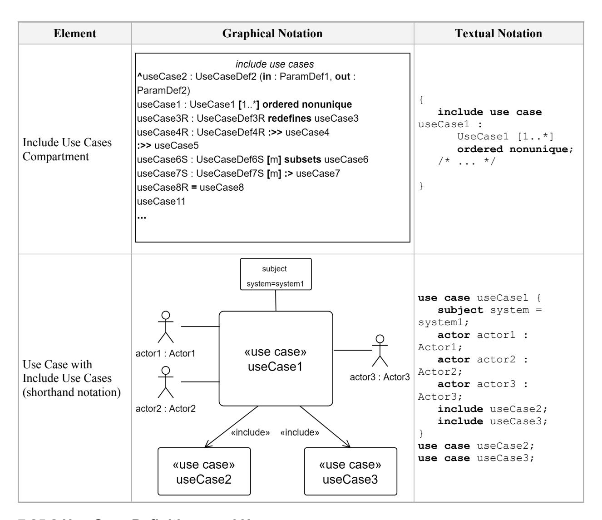

# <span id="page-178-0"></span>**7.25.2 Use Case Definitions and Usages**

A use case definition or usage is declared as a case definition or usage (see [7.22.2](#page-168-2) ), using the kind keyword **use case**. A use case usage must be defined by a single use case definition.

A use case definition will typically have an explicit declaration of its subject and one or more external actors (see see [7.22.2](#page-168-2) on the declaration of subject and actor parameters in case definitions). The objective of the use case is for the subject to provide some result of value to one or more of the actors. The subject and the actors interact in order to achieve this objective, and the use case definition may specify this interaction as, for example, messages passing between them (see [7.16.2](#page-114-0) on message declarations).

```
use case def 'Provide Transportation' {
    subject vehicle : Vehicle {
        event occurrence driverEnters [1];
        then event occurrence passengerEnters [0..*];
        then event occurrence startsDrive [1];
        then event occurrence endsDrive [1];
        then event occurrence passengerExits [0..*];
        then event occurrence driverExits [1];
    }
    actor driver : Person {
```

```
event occurrence entersVehicle [1];
    then event occurrence exitsVehicle [1];
}
actor passengers : Person[0..4] {
    event occurrence entersVehicle [1];
    then event occurrence exitsVehicle [1];
}
actor environment : Environment {
    event occurrence vehicleDrives [1];
}
objective {
    doc /* Transport driver and passengers from starting location
     * to ending location.
     */
}
message of Enter from driver.entersVehicle to vehicle.driverEnters;
then message of Enter from passengers.entersVehicle to vehicle.passengerEnters;
then message of Drive from vehicle.drives to environment.vehicleDrives;
then message of Exit from passengers.exitsVehicle to vehicle.passengerExits;
then message of Exit from driver.exitsVehicle to vehicle.driverExits;
```

The base use case definition and usage are UseCase and useCases from the UseCases library model (see [9.2.18](#page-537-0) )

# <span id="page-179-0"></span>**7.25.3 Include Use Case Usages**

}

An *include* use case usage is declared as a use case usage (see [7.25.2](#page-178-0) ) using the kind keyword **include use case** instead of just **use case**. An include use case usage is a kind of perform action usage (see [7.17.6](#page-135-0) ) for which the action usage is a use case usage, known as the *included use case.* As for a perform action usage, the included use case is related to the include use usage by a *reference subsetting* relationship, specified textually using the keyword **references** or the symbol ::>. Or, if the include use case usage has no such reference subsetting, then the included use case is the include use case usage itself.

An include use case usage may also be declared using just the keyword **include** instead of **include use case**. In this case, the declaration does not include either a name or short name. Instead, the included use case of the include use case usage is identified by giving a qualified name or feature chain immediately after the **include** keyword.

The subject of an included use case usage is bound by default to the subject of its containing use case definition or usage. However, the actor parameters of the included use case usages should be explicitly bound to appropriate actors of the containing use case, as necessary.

```
use case 'provide transportation' : 'Provide Transportation' {
    first start;
    then include 'enter vehicle' {
        actor :>> driver = 'provide transportation'::driver;
        actor :>> passengers = 'provide transportation'::passengers;
    }
    then include 'drive vehicle' {
        actor :>> driver = 'provide transportation'::driver;
        actor :>> environment = 'provide transportation'::environment;
    }
    then include 'exit vehicle' {
        actor :>> driver = 'provide transportation'::driver;
        actor :>> passengers = 'provide transportation'::passengers;
    }
```

```
then done;
}
```

# <span id="page-180-0"></span>**7.26 Views and Viewpoints**

# <span id="page-180-1"></span>**7.26.1 Views and Viewpoints Overview**

*Metamodel references:*

- *Textual notation,* [8.2.2.26](#page-221-3)
- *Graphical notation,* [8.2.3.26](#page-282-0)
- *Abstract syntax,* [8.3.26](#page-412-0)
- *Semantics,* [8.4.22](#page-488-0)

A *viewpoint definition* is a kind of requirement definition (see [7.21](#page-160-0) ) that frames the concerns of one or more stakeholders regarding information about a modeled system or domain of interest. A *viewpoint usage* is a requirement usage that is a usage of a viewpoint definition. The subject of a viewpoint is a *view* that is required to address the stakeholder concerns.

A *view definition* is a kind of part definition (see [7.11](#page-89-0) ) that specifies how to create a view artifact to satisfy one or more viewpoints. A view artifact is a rendering of information that addresses some aspect of a system or domain of interest of concern to one or more stakeholders. A view definition can include *view conditions* to extract the relevant model content, and a *rendering* that specifies how the model content should be rendered in a view artifact. A view condition is specified using metadata, in the same way as for a filter condition on a package (see [7.5](#page-54-0) ).

A view definition and its rendering can preserve a correspondence between elements of the model and of the graphical and/or textual elements of the view artifact. The implementation of a rendering can follow this correspondence to propagate changes to a view artifact back to the model from which the view artifact was extracted and rendered.

A view usage is a kind of part usage (see [7.11](#page-89-0) ) that is a usage of a view definition. A view usage *exposes* a portion of a model, which is a kind of import (see [7.5](#page-54-0) ) without regard to visibility that provides the scope of application of the view conditions. The view rendering can then be applied to those exposed elements that meet all the view conditions to produce the view artifact. A view usage can add further view conditions to those inherited from its view definition, and it can specify a view rendering if one is not provided by its definition.

View usages can be nested and ordered within a composite view to generate composite view artifacts. The view usage also can contain further rendering specifications on the symbolic representation, style, and layout for a particular view. For example, a complex view definition with deeply nested structures can be rendered as a document, where each nested view usage corresponds to a section of a document, and the ordering represents the order of the sections within the document. Within each section of the document, the nested view usages can then specify the information that is rendered as a combination of text, graphical, and tabular information.

<span id="page-180-2"></span>A *rendering definition* is a kind of part definition (see [7.11](#page-89-0) ) that specifies how a view artifact is to be rendered. A *rendering usage* is a kind of part usage that is a usage of a rendering definition. A rendering usage is used in a view definition or usage to specify the view rendering.

**Table 24. Views and Viewpoints – Representative Notation**

| Element         | Graphical Notation | Textual Notation                                                                                                                                                     |
|-----------------|--------------------|----------------------------------------------------------------------------------------------------------------------------------------------------------------------|
| View Definition |                    | view def ViewDef1 {<br>satisfy viewpoint1;<br>/* */<br>filter<br>filterExpression1;<br>/* */<br>render rendering1;<br>}<br>view def ViewDef1 {<br>/* members */<br>} |
|                 |                    |                                                                                                                                                                      |
|                 |                    |                                                                                                                                                                      |
|                 |                    |                                                                                                                                                                      |
|                 |                    |                                                                                                                                                                      |
| View            |                    |                                                                                                                                                                      |
|                 |                    | view view1 : ViewDef1 {<br>satisfy viewpoint1;<br>expose part1::**;<br>filter @PartUsage;<br>render asTable;<br>}<br>view view1 : ViewDef1 {<br>/* members */<br>}   |
|                 |                    |                                                                                                                                                                      |
|                 |                    |                                                                                                                                                                      |
|                 |                    |                                                                                                                                                                      |
|                 |                    |                                                                                                                                                                      |

| Element               | Graphical Notation | Textual Notation                                                                                  |
|-----------------------|--------------------|---------------------------------------------------------------------------------------------------|
| Viewpoint Definition  |                    | viewpoint def<br>ViewPointDef1;<br>viewpoint def<br>ViewPointDef1 {<br>/* members */              |
|                       |                    | }                                                                                                 |
|                       |                    | viewpoint viewpoint1 :<br>ViewPointDef1;                                                          |
| Viewpoint             |                    | viewpoint viewpoint1 :<br>ViewPointDef1 {<br>/* members */                                        |
|                       |                    | }                                                                                                 |
| Expose                |                    | part part1 : Part1;<br>view view1 : View1 {<br>expose part1;<br>}                                 |
|                       |                    |                                                                                                   |
| Frame                 |                    | concern concern1 :<br>Concern1;<br>viewpoint viewpoint1 :<br>Viewpoint1 {<br>frame concern1;<br>} |
| Frames<br>Compartment |                    | {<br>frame concern<br>concern1 : Concern1<br>[1*]<br>ordered nonunique;<br>/* */<br>}             |

# <span id="page-183-0"></span>**7.26.2 View Definitions and Usages**

A view definition or usage is declared as a kind of part definition or usage (see [7.11.2](#page-91-0) ), using the kind keyword **view**. A view usage must be defined by a single view definition.

A view definition includes *filter conditions* on what kinds of elements can be included in a view and identifies a *view rendering* that determines how the included elements are to be rendered. The filter conditions are specified in the same way as for packages (see [7.5.4](#page-60-0) ), by using the keyword **filter** followed by a Boolean-valued, model-level evaluable expression (see [KerML. 7.4.9]).

The view rendering is specified using the keyword **render** followed by a composite rendering usage declaration (see [7.26.4](#page-185-0) ). Alternatively, the keyword **render** may be followed by just a qualified name or feature chain identifying a rendering usage, which establishes a reference subsetting relationship between the view rendering usage and the identified rendering usage. The Views model in the Systems Model Library provides a limited number of basic standard renderings (see [9.2.19](#page-538-0) ).

```
view def 'Part Structure View' {
    import Views::*;
    filter @SysML::PartUsage;
    render asTreeDiagram;
}
```

A view usage inherits any filter conditions from its view definition and can declare addition conditions of its own. If a view usage does not declare a view rendering, then this will be inherited from the view definition, if it has one. If a view usage does declare a view rendering, then this will redefine the view rendering from its view definition (if any). Note that this means that the view rendering for a view usage must be consistent with the rendering specified in the view definition, though it can be more specialized.

In addition, a view usage can specify which elements are actually to be *exposed* by the view. This is done using expose relationships, which are a special kind of import relationships. Expose relationships are declared like import relationships (see [7.5.3](#page-58-0) ), but using the keyword **expose** instead of **import** and with no specification of visibility. A view artifact is generated from a view usage by first importing the exposed elements based on the expose relationships of the view usage, filtering those based on the filter conditions that are owned and inherited by the view usage, and then generating a rendered view artifact using the view rendering specified for the view usage. An expose relationship always has **protected** visibility, which means that the elements exposed by a view usage are *not* publicly visible outside the view usage, but they *are* visible within specializations of the view usage.

```
view 'vehicle parts view' : 'Part Structure View' {
    // Recursive import is useful for exposing elements
    // from hierarchical models.
    expose VehicleDesignModel::**;
    // This is an additional filter condition.
    filter not @SysML::ConnectionUsage;
    // This implicitly redefines the view rendering from
    // the view definition.
    render asMyTreeDiagram;
}
```

Since an expose relationship is a kind of import relationship, the filtered import notation can also be used with it (see [7.5.4](#page-60-0) ). This provides an alternate way to filter the elements exposed by a view usage.

```
view 'vehicle parts view' : 'Part Structure View' {
    // This applies the filter directly on the imported
    // elements from the expose relationships. (The filter
    // conditions from the view definition also still apply.)
```

```
expose VehicleDesignModel::**[not @SysML::ConnectionUsage];
    render asMyTreeDiagram;
}
```

The base view definition and usage are View and views from the Views model library (see [9.2.19](#page-538-0) ).

# <span id="page-184-0"></span>**7.26.3 Viewpoint Definitions and Usages**

A viewpoint definition or usage is declared as a kind of requirement definition or usage (see [7.21.2](#page-164-0) ). A viewpoint usage must be defined by a single viewpoint definition.

The subject of a viewpoint definition or usage must be a view. Otherwise, a viewpoint is specified with assumed and required constraints, just like any requirement definition or usage. However, it is typical for a viewpoint definition to be structured as framing a set of stakeholder concerns (see [7.21.3](#page-166-0) ) regarding information about a modeled system or domain of interest. The viewpoint then models the requirement for view needed in order to address the framed concerns.

```
concern 'system breakdown' {
    stakeholder se : 'Systems Engineer';
    stakeholder ivv : 'IV&V';
}
concern 'modularity' {
    stakeholder se : 'Systems Engineer';
}
viewpoint def 'System Structure Perspective' {
    frame 'system breakdown';
    frame 'modularity';
    require constraint {
        doc
        /* A system structure view shall show the hierarchical
         * part decomposition of a system, starting with a
         * specified root part.
         */
    }
}
```

Since a viewpoint usage is a kind of requirement usage, a view usage can be declared to satisfy a viewpoint usage using a satisfy requirement usage (see [7.21.4](#page-167-0) ). However, as a short cut, any composite viewpoint usage nested in a view definition or usage is asserted to be satisfied by that view.

```
view def 'Part Structure View' {
    // This viewpoint is asserted to be satisfied by any
    // instance of the view definition.
    viewpoint vp : 'System Structure Perspective';
    //...
}
```

Alternatively, a satisfy requirement usage can be used explicitly between a viewpoint and a view. In particular, a satisfy requirement usage for a viewpoint that is nested in a view definition or usage will, by default, have the containing view as its satisfying feature (as described in general for nested satisfy requirement usages in [7.21.4](#page-167-0) ).

```
viewpoint 'vehicle structure perspective' :
    'System Structure Perspective' {
    subject : Vehicle;
}
view 'vehicle parts view' : 'Part Structure View' {
```

```
// This asserts that the give viewpoint is satisfied by the
    // 'vehicle parts view'.
    satisfy 'vehicle structure perspective';
    // ...
}
```

The base viewpoint definition and usage are Viewpoint and viewpoints from the Views library model (see [9.2.19](#page-538-0) ).

# <span id="page-185-0"></span>**7.26.4 Rendering Definitions and Usages**

A rendering definition or usage is declared as a kind of part definition or usage (see [7.11.2](#page-91-0) ), using the kind keyword **rendering**. A rendering usage must be defined by a single rendering definition.

While a rendering is intended to specify how a view is rendered as a view artifact, there are no specific constructs provided in SysML for specifying that. A rendering definition or usage can be defined similarly to any other part definition or usage, perhaps with nested subrenderings and references to related view usages. Nevetheless, conforming tools can provide libraries of rendering usages that reflect the capabilities they provide for rendering various kinds of views, which can then be identified in user models specifying those kinds of views. A small number of basic standard rendering usages are provided in the Views library model (see [9.2.19](#page-538-0) ).

The base rendering definition and usage are Rendering and renderings from the Views library model (see [9.2.19](#page-538-0) ).

# <span id="page-185-1"></span>**7.26.5 Compartments and Diagrams as View Usages**

A *compartment* is a view usage (see [7.26.2](#page-183-0) ). For example, a part definition or part usage may contain an attributes compartment that lists its attributes (see, for example, [Table 9](#page-89-2) in [7.11.2](#page-91-0) ). The compartment label is the view name. This view implicitly exposes the owning part and applies a filter expression to select the attributes of the part. The filtered contents are then rendered as a list of attributes in accordance with the textual rendering specified in the graphical notation (see [7.7.1](#page-76-1) and [8.2.3.7](#page-232-0) ).

A graphical node symbol, such as for a part definition or usage, can have any number of compartments. Each compartment can be rendered using graphical notation in a graphical compartment or using textual notation in a textual compartment. For example, an interconnection view of a part can be rendered in a graphical compartment of the part symbol showing nested parts as nodes and connections as edges. The parts can also be rendered in a textual compartment labeled as parts and rendered as a list of parts.

A *diagram* is also a view usage. The diagram header is the name compartment of the view usage. As with any other view usage, the filtered contents of a diagram are rendered in a compartment. These contents are typically rendered as a graphical compartment that contains nodes and edges, but it may be a textual compartment as well. A graphical node within the graphical compartment of a diagram can also have compartments that are view usages as described above. This provides a mechanism to nest views within other views. Definition and usage nodes can include symbols on the boundary of the node to represent ports and parameters.

An edge in a graphical view can be attached via a dashed line to a node that elaborates the features of the edge. The attached node can also have graphical or textual compartments to show the internal structure of a connection, such as its decomposition into nested connections.

A view usage may contain other view usages that each contain a name compartment and rendered contents in their respective compartment. This enables nesting of diagrams within other diagrams.

The StandardViewDefinitions package in the Systems Model Library (see [9.2.20](#page-544-1) ) provides a set of standard view definitions for typical kinds of diagrams, including the valid contents for the view. The standard views are then rendered as specified for the graphical notation, such as the General View in [8.2.3.5](#page-228-0) , the Interconnection View in

[8.2.3.11](#page-239-0) , etc. (see [Table 34](#page-544-3) in [9.2.20](#page-544-1) for the complete list). However, visualization of SysML models is not limited to these standard views. User-defined view definitions and usages can be used to provide a wide range of views beyond the standard set.

**Table 25. Diagrams – Representative Examples**

<span id="page-186-0"></span>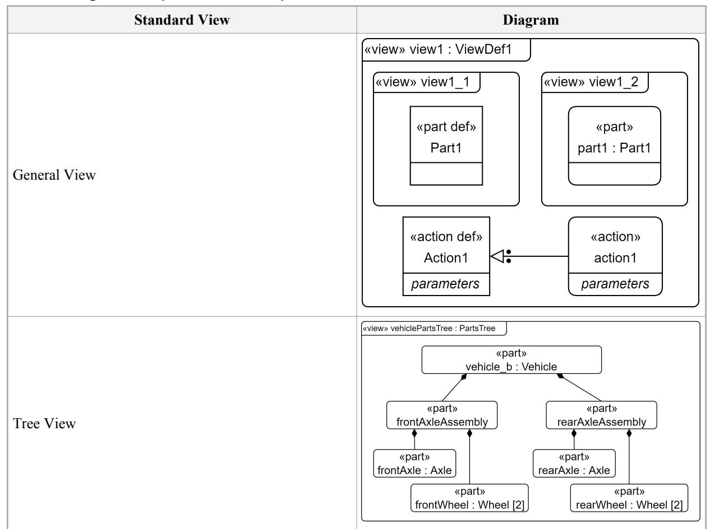

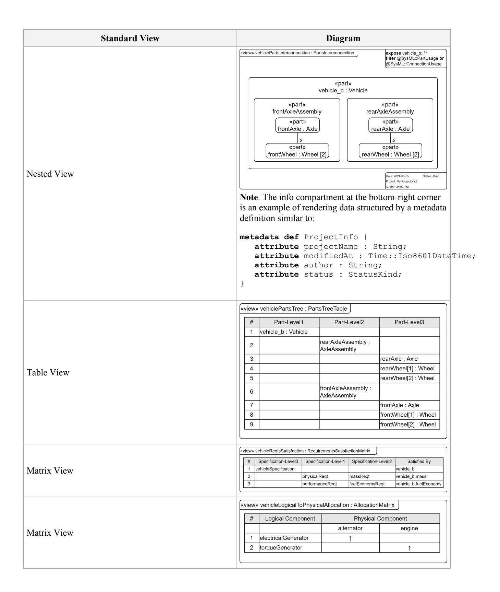

# <span id="page-188-0"></span>**7.27 Metadata**

# <span id="page-188-1"></span>**7.27.1 Metadata Overview**

*Metamodel references:*

- *Textual notation,* [8.2.2.27](#page-223-0)
- *Graphical notation,* [8.2.3.27](#page-286-0)
- *Abstract syntax,* [8.3.27](#page-424-0)
- *Semantics,* [8.4.23](#page-490-0)

A *metadata usage* is a kind of annotating element (see [7.4](#page-50-1) ) that allows for the definition of structured metadata with modeler-specified attributes. This may be used, for example, to add tool-specific information to a model that can be relevant to the function of various kinds of tooling that may use or process a model, or domain-specific information relevant to a certain project or organization. A metadata usage is defined by a single *metadata definition*. If the definition has no nested features itself, then the metadata usage simply acts as a user-defined syntactic tag on the annotated element. If the definition does have features, then the metadata usage must provide value bindings for all of them, specifying metadata for the annotated element.

**Table 26. Metadata – Representative Notation**

<span id="page-188-2"></span>

| Element  | Graphical Notation | Textual Notation                                                                                                                                                                                       |
|----------|--------------------|--------------------------------------------------------------------------------------------------------------------------------------------------------------------------------------------------------|
| Metadata |                    | metadata MetadataDef1 {<br>attribute1=value1;<br>attribute2="value2";<br>attribute3="http://"<br>}<br>or<br>@MetadataDef1 {<br>attribute1=value1;<br>attribute2="value2";<br>attribute3="http://"<br>} |

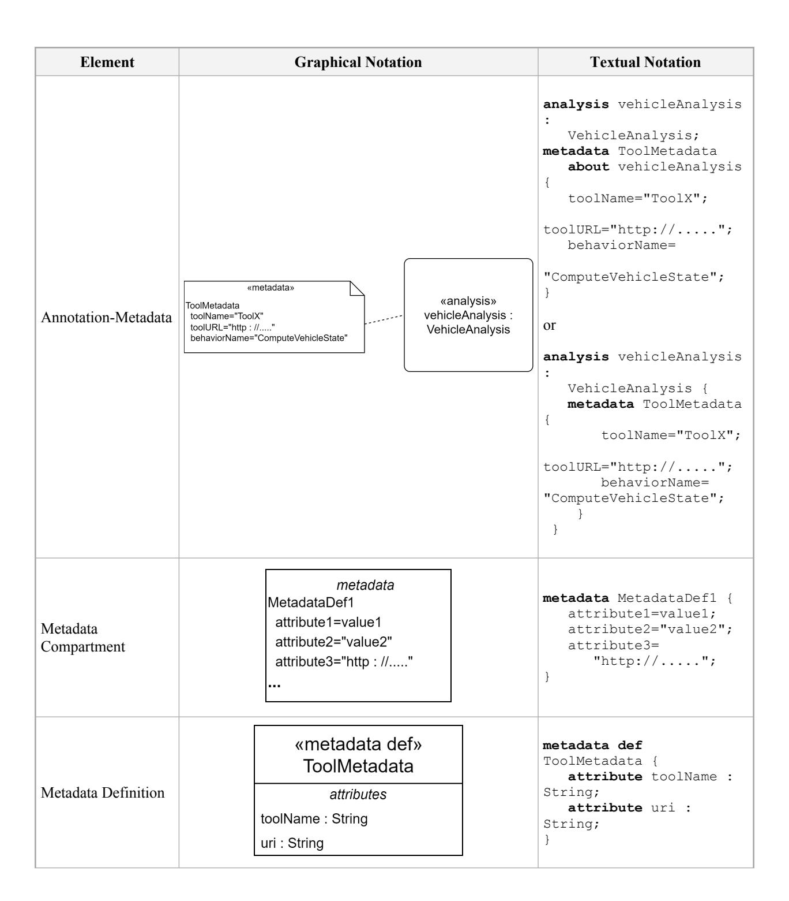

| Element                        | Graphical Notation | Textual Notation                                                                                                                                                                                                                                                                              |
|--------------------------------|--------------------|-----------------------------------------------------------------------------------------------------------------------------------------------------------------------------------------------------------------------------------------------------------------------------------------------|
| SemanticMetadata<br>Definition |                    | state 'failure modes'<br>[*];<br>metadata def <fm><br/>'failure mode' :&gt;<br/>SemanticMetadata {<br/>:&gt;&gt; baseType =<br/>'failure modes' meta<br/>SysML::StateUsage;<br/>:&gt; annotatedElement :<br/>SysML::StateDefinition;<br/>:&gt; annotatedElement :<br/>SysML::StateUsage;</fm> |
|                                |                    | }                                                                                                                                                                                                                                                                                             |

# <span id="page-190-0"></span>**7.27.2 Metadata Definitions and Usages**

A metadata definition is declared like an item definition (see [7.10](#page-87-0) ), but using the keyword **metadata def**.

```
metadata def SecurityRelated;
metadata def ApprovalAnnotation {
    attribute approved : Boolean;
    attribute approver : String;
}
```

A metadata usage is declared like an item usage (see [7.10](#page-87-0) ) using the keyword **metadata** (or the symbol @) followed by the keyword **defined by** (or the symbol :) and the qualified name of exactly one metadata definition or KerML Metaclass (see [KerML], 7.4.13). If there is no declared name or short name, then the keyword **defined by** (or the symbol :) may also be omitted. In addition, one or more annotated elements can be identified for the metadata usage after the keyword **about**, indicating that the metadata usage has annotation relationships to each of the identified elements (see also [7.4](#page-50-1) on annotation relationships).

```
metadata securityDesignAnnotation : SecurityRelated
    about SecurityRequirements, SecurityDesign;
```

If the specified metadata definition (or KerML metaclass) has features, then a body must be given for the metadata usage that declares reference usages (see [7.6](#page-62-0) ) that redefine each of the features of the definition and binds them to the result of model-level evaluable expressions (see [KerML, 7.4.9]). These nested reference usages of a metadata usage must always have the same names as the names of the features of its metadata definition, so the shorthand prefix redefines notation (see [7.6](#page-62-0) ) is always used

```
metadata ApprovalAnnotation about Design {
    ref :>> approved = true;
    ref :>> approver = "John Smith";
}
```

The keyword **ref** and/or **redefines** (or the equivalent symbol :>>) may be omitted in the declaration of a feature of a metadata usage.

```
metadata ApprovalAnnotation about Design {
    approved = true;
    approver = "John Smith";
}
```

If the metadata usage is an owned member of a namespace (see [7.5](#page-54-0) ), then the explicit identification of annotated elements can be omitted, in which case the annotated element shall be implicitly the containing namespace.

```
part def Design {
    // This metadata usage is implicitly about the part def Design.
    @ApprovalAnnotation {
        approved = true;
        approver = "John Smith";
    }
}
```

The base metadata definition and usage are MetadataItem and metadataItems from the Metadata library (see [9.2.21](#page-550-0) ). The base metadata definition MetadataItem specializes the KerML metaclass Metaobject, and it inherits the feature annotatedElement from Metaobject, which is typed by the reflected KerML metaclass KerML::Element (see [KerML, 9.2.17]). When a metadata usage is declared, its inherited annotatedElement feature is implicitly bound to reflective instances representing its annotated elements.

```
metadata securityDesignAnnotation : SecurityRelated
    about SecurityRequirements, SecurityDesign {
    // The feature "annotatedElement" is implicitly bound to the list
    // of SecurityRequirements meta KerML::Element and
    // SecurityDesign meta KerML::Element.
}
```

A metadata definition can restrict the kind of elements that it can be applied to by subsetting Metaobject::annotatedElement and restricting its type. If a metadata usage then inherits one or more concrete features that directly or indirectly subset annotatedElement, any annotated element of the metadata usage must conform to the type of at least one of these features. The restricted type should be one of the reflective metaclasses from the KerML (see [KerML, 9.2.17]) or SysML (see [9.2.22](#page-551-0) ) abstract syntax models.

```
metadata def CommandMetadata {
    // A metadata usage of this definition may annotate
    // an ActionDefinition or an ActionUsage.
    :> annotatedElement : SysML::ActionDefinition;
    :> annotatedElement : SysML::ActionUsage;
}
action def Save specializes UserAction {
    @CommandMetadata; // This is valid.
    redefine action doAction {
        @CommandMetadata; // This is valid.
    }
}
item def Options {
    @CommandMetadata; // This is INVALID.
}
```

# <span id="page-191-0"></span>**7.27.3 Semantic Metadata**

If the metadata definition of a metadata usage is a direct or indirect specialization of KerML metaclass SemanticMetadata from the Metaobjects model in the Kernel Semantic Library (see [KerML, 9.2.16]), then the annotated elements of the metadata usage must all be types (e.g., definitions or usages), and the inherited feature SemanticMetadata::baseType must be bound to a value of type KerML::Type (which is a generalization of SysML::Definition and SysML::Usage). Each annotated element is then considered to implicitly specialize a definition or usage determined from the baseType value as follows:

• If the annotated type is a definition and the baseType is a definition (or KerML classifier), then the annotated definition implicitly subclassifies the baseType.

- If the annotated type is a definition and the baseType is a usage (or KerML feature), then the annotated definition implicitly subclassifies each definition (or type) of the baseType.
- If the annotated type is a usage and the baseType is a usage (or KerML feature), then the annotated usage implicitly subsets the baseType.
- Otherwise no implicit specialization is added.

When evaluated in a model-level evaluable expression, the meta-cast operator **meta** (see [KerML, 7.4.9.2]) may be used to cast a type element referenced as its first operand to the actual reflective metadata definition (or KerML metaclass) value for the type, which may then be bound to the baseType feature of SemanticMetadata.

```
action def UserAction;
action userActions : UserAction[*] nonunique;
metadata def CommandMetadata :> SemanticMetadata {
    // The meta-cast operation "userAction meta SysML::Usage" has
    // type Usage, which conforms to the type KermL::Type of baseType.
    // Since userActions is an ActionUsage, the expression evaluates
    // at model level to a value of type SysML::ActionUsage.
    :>> baseType = userActions meta SysML::Usage;
}
// Save implicitly subclassifies UserAction
// (which is the definition of userActions).
action def Save {
    @CommandMetadata;
}
// previousAction implicitly subsets userActions.
action previousAction[1] {
    @CommandMetadata;
}
```

# <span id="page-192-0"></span>**7.27.4 User-Defined Keywords**

A *user-defined keyword* is the (possibly qualified) name (or short name) of a metadata definition (or KerML metaclass) preceded by the symbol #. Such a keyword can be used in package, dependency, definition and usage declarations. The user-defined keyword is placed immediately before the language-defined (reserved) keyword for the declaration and specifies a metadata annotation of the declared element. If the named metadata definition is a kind of SemanticMetadata, then the implicit specialization rules given in [7.27.3](#page-191-0) for semantic metadata also apply.

```
occurrence def Situation;
occurrence situations : Situation[0..*] nonunique;
// It is often convenient to use a lower-case initial name or
// short name for semantic metadata intended to be used as a keyword.
metadata def <situation> SituationMetadata :> SemanticMetadata {
    :>> baseType = situations meta SysML::Usage;
}
// Failure is an OccurrenceDefinition that implicitly subclassifies Situation.
#situation occurrence def Failure;
// batteryLow is an OccurrenceUsage that implicitly subsets situations.
#situation occurrence batteryLow;
```

In addition, a user-defined keyword for semantic metadata may also be used to declare a definition or usage without using any language-defined keyword.

```
// Failure is a definition that implicitly subclassifies Situation.
#situation def Failure;
// batteryLow is a usage implicitly subsets situations.
#situation batteryLow;
```

It is also possible to include more than one user defined-keyword in a declaration.

**#SecurityRelated #situation def** Vulnerability;

# <span id="page-194-0"></span>**8 Metamodel**

# <span id="page-194-1"></span>**8.1 Metamodel Overview**

The SysML metamodel extends the KerML metamodel as specified in the KerML specification [KerML].

- The SysML concrete syntax includes a textual notation (see [8.2.2](#page-194-4) ), which is generally distinct from that of KerML, though consistent on common elements (such as packages and expressions), and a complete graphical notation (see [8.2.3](#page-224-0) ).
- The SysML abstract syntax (see [8.3](#page-286-1) ) imports the KerML abstract syntax, reusing some KerML metaclasses directly, and further specializing most other KerML metaclasses.
- The SysML semantics (see [8.4](#page-425-1) ) are defined by relating the SysML abstract syntax to the semantic models in the Systems Model Library (see [Clause 9](#page-492-0) ), which is based on the Kernel Model Library from KerML, and providing syntactic transformations from SysML models to syntactically equivalent KerML models (including elements that are otherwise implicit in the SysML abstract syntax).

Throughout this clause, the names of elements from the SysML (and KerML) abstract syntax models appear in a "code" font. Further:

- 1. Names of metaclasses appear exactly as in the abstract syntax, including capitalization, except possibly with added pluralization. When used as English common nouns, e.g., "a Usage", "multiple Subsettings", they refer to instances of the metaclass. E.g., "Usages can be nested in other Usages" refers to instances of the metaclass Usage that reside in models. This can be modified with the term "metaclass" as necessary to refer to the metaclass itself instead of its instances, e.g., "The Usage metaclass is contained in the DefinitionAndUsage package."
- 2. Names of properties of metaclasses, when used as English common nouns, e.g., "an ownedUsage", "multiple nestedActions", refer to values of the properties. This can be modified using the term "metaproperty" as necessary to refer to the metaproperty itself instead of its values, e.g., "The ownedUsage metaproperty is contained in the DefinitionAndUsage package."

Similar stylistic conventions apply to text about SysML (and KerML) models, except that an "*italic code*" front is used.

- 1. Convention 1 above applies to SysML Definitions (e.g., *Action*), using "definition" (or a more specialized term) instead of "metaclass" (e.g., "the action definition *Action*").
- 2. Convention 2 above applies to SysML Usages (e.g, *actions*), using "usage" (or a more specialized term) instead of "metaproperty" (e.g., "the action usage *actions*").

# <span id="page-194-2"></span>**8.2 Concrete Syntax**

# <span id="page-194-3"></span>**8.2.1 Concrete Syntax Overview**

*Concrete syntax* specifies the how the language appears to modelers. They construct and review models shown according to the concrete syntax. The SysML concrete syntax includes both a textual notation, described in [8.2.2](#page-194-4) , and a graphical notation, described in [8.2.3](#page-224-0) . Various views of a SysML model may be rendered entirely using the textual notation, entirely using the graphical notation, or using a combination of the two.

# <span id="page-194-4"></span>**8.2.2 Textual Notation**

# <span id="page-194-5"></span>**8.2.2.1 Textual Notation Overview**

# <span id="page-194-6"></span>**8.2.2.1.1 EBNF Conventions**

The *grammar* definition for the SysML textual concrete syntax defines how lexical tokens for an input text are grouped in order to construct an abstract syntax representation of a model (see [8.3](#page-286-1) ). The concrete syntax grammar definition uses an Extended Backus Naur Form (EBNF) notation (see [Table 27](#page-195-0) ) that includes further notations to describe how the concrete syntax maps to the abstract syntax (see [Table 28](#page-195-1) ).

Productions in the grammar formally result in the synthesis of classes in the abstract syntax and the population of their properties (see [Table 29](#page-195-2) ). Productions may also be parameterized, with the parameters typed by abstract syntax classes. Information passed in parameters during parsing allows a production to update the properties of the provided abstract syntax elements as a side-effect of the parsing it specifies. Some productions only update the properties of parameters, without synthesizing any new abstract syntax element.

**Table 27. EBNF Notation Conventions**

<span id="page-195-0"></span>

| Lexical element                  | LEXICAL             |
|----------------------------------|---------------------|
| Terminal element                 | 'terminal'          |
| Non-terminal element             | NonterminalElement  |
| Sequential elements              | Element1 Element2   |
| Alternative elements             | Element1   Element2 |
| Optional elements (zero or one)  | Element ?           |
| Repeated elements (zero or more) | Element *           |
| Repeated elements (one or more)  | Element +           |
| Grouping                         | ( Elements )        |

**Table 28. Abstract Syntax Synthesis Notation**

<span id="page-195-2"></span><span id="page-195-1"></span>

| Property assignment         | p = Element                     | Assign the result of parsing the<br>concrete syntax<br>Element to abstract<br>syntax property<br>p.                                                                                                                                                                |
|-----------------------------|---------------------------------|--------------------------------------------------------------------------------------------------------------------------------------------------------------------------------------------------------------------------------------------------------------------|
| List property construction  | p += Element                    | Add the result of parsing the<br>concrete syntax<br>Element to the<br>abstract syntax list property<br>p.                                                                                                                                                          |
| Boolean property assignment | p ?= Element                    | If the concrete syntax<br>Element is<br>parsed, then set the abstract Boolean<br>property<br>p to true.                                                                                                                                                            |
| Non-parsing assignment      | { p = value }<br>{ p += value } | Assign (or add) the given<br>value to<br>the abstract syntax property<br>p,<br>without parsing any input.<br>The<br>value may be a literal or a reference<br>to another abstract syntax property.<br>The symbol "this" refers to the<br>element being synthesized. |
| Name resolution             | [QualifiedName]                 | Parse a<br>QualifiedName, then<br>resolve that name to an Element<br>reference for use as a value in an<br>assignment as above.                                                                                                                                    |

**Table 29. Grammar Production Definitions**

| Production definition                  | NonterminalElement :<br>AbstractSyntaxElement =               | Define a production for the<br>NonterminalElement that<br>synthesizes the<br>AbstractSyntaxElement. If the<br>NonterminalElement has the<br>same name as the<br>AbstractSyntaxElement, then ":<br>AbstractSyntaxElement" may<br>be omitted. |
|----------------------------------------|---------------------------------------------------------------|---------------------------------------------------------------------------------------------------------------------------------------------------------------------------------------------------------------------------------------------|
| Parameterized production<br>definition | NonterminalElement (p :<br>Type) :<br>AbstractSyntaxElement = | Define a production for the<br>NonterminalElement that<br>synthesizes the<br>AbstractSyntaxElement, with a<br>parameter named<br>p, whose<br>type is<br>an abstract syntax class.                                                           |

# <span id="page-196-0"></span>**8.2.2.1.2 Lexical Structure**

The lexical structure of the SysML textual notation is identical to that of the KerML textual notation [KerML], except for the following two points.

1. The reserved keywords of SysML are the following.

**about abstract accept action actor after alias all allocate allocation analysis and as assert assign assume at attribute bind binding by calc case comment concern connect connection constant constraint crosses decide def default defined dependency derived do doc else end entry enum event exhibit exit expose false filter first flow for fork frame from hastype if implies import in include individual inout interface istype item join language library locale loop merge message meta metadata nonunique not null objective occurrence of or ordered out package parallel part perform port private protected public redefines ref references render rendering rep require requirement return satisfy send snapshot specializes stakeholder standard state subject subsets succession terminate then timeslice to transition true until use variant variation verification verify via view viewpoint when while xor**

2. The set of special lexical terminals matching either certain keywords or their symbolic equivalents are the following in SysML.

```
DEFINED_BY = ':' | 'defined' 'by'
SPECIALIZES = ':>' | 'specializes'
SUBSETS = ':>' | 'subsets'
REFERENCES = '::>' | 'references'
CROSSES = '=>' | 'crosses'
REDEFINES = ':>>' | 'redefines'
```

Tooling for the SysML textual notation should generally highlight keywords relative to other text, for example by using boldface and/or distinctive coloring. However, while keywords are shown in boldface in this specification, the specification does not require any specific highlighting (or any highlighting at all). SysML textual notation documents are expected to be interchanged as plain text (see also [KerML, Clause 10] on Model Interchange). This recommendation also applies to snippets of textual notation used as part of the graphical notation, i.e., textual elements residing inside graphical elements.

# <span id="page-197-0"></span>**8.2.2.2 Elements and Relationships Textual Notation**

```
Identification : Element =
    ( '<' declaredShortName = NAME '>' )?
    ( declaredName = NAME )?
RelationshipBody : Relationship =
    ';' | '{' ( ownedRelationship += OwnedAnnotation )* '}'
```

# <span id="page-197-1"></span>**8.2.2.3 Dependencies Textual Notation**

```
Dependency =
    ( ownedRelationship += PrefixMetadataAnnotation )*
    'dependency' DependencyDeclaration
    RelationshipBody
DependencyDeclaration =
    ( Identification 'from' )?
    client += [QualifiedName] ( ',' client += [QualifiedName] )* 'to'
    supplier += [QualifiedName] ( ',' supplier += [QualifiedName] )*
```

# <span id="page-197-2"></span>**8.2.2.4 Annotations Textual Notation**

# <span id="page-197-3"></span>**8.2.2.4.1 Annotations**

```
Annotation =
    annotatedElement = [QualifiedName]
OwnedAnnotation : Annotation =
    ownedRelatedElement += AnnotatingElement
AnnotatingMember : OwningMembership =
    ownedRelatedElement += AnnotatingElement
AnnotatingElement =
      Comment
    | Documentation
    | TextualRepresentation
    | MetadataFeature
```

# <span id="page-197-4"></span>**8.2.2.4.2 Comments and Documentation**

```
Comment =
    ( 'comment' Identification
      ( 'about' ownedRelationship += Annotation
        ( ',' ownedRelationship += Annotation )*
      )?
    )?
    ( 'locale' locale = STRING_VALUE )?
    body = REGULAR_COMMENT
Documentation =
    'doc' Identification
    ( 'locale' locale = STRING_VALUE )?
    body = REGULAR_COMMENT
```

# <span id="page-197-5"></span>**8.2.2.4.3 Textual Representation**

```
TextualRepresentation =
    ( 'rep' Identification )?
    'language' language = STRING_VALUE body = REGULAR_COMMENT
```

# <span id="page-198-0"></span>**8.2.2.5 Namespaces and Packages Textual Notation**

# <span id="page-198-1"></span>**8.2.2.5.1 Packages**

```
RootNamespace : Namespace =
    PackageBodyElement*
Package =
    ( ownedRelationship += PrefixMetadataMember )*
    PackageDeclaration PackageBody
LibraryPackage =
    ( isStandard ?= 'standard' ) 'library'
    ( ownedRelationship += PrefixMetadataMember )*
    PackageDeclaration PackageBody
PackageDeclaration : Package =
    'package' Identification
PackageBody : Package =
    ';' | '{' PackageBodyElement* '}'
PackageBodyElement : Package =
      ownedRelationship += PackageMember
    | ownedRelationship += ElementFilterMember
    | ownedRelationship += AliasMember
    | ownedRelationship += Import
MemberPrefix : Membership =
    ( visibility = VisibilityIndicator )?
PackageMember : OwningMembership
    MemberPrefix
    ( ownedRelatedElement += DefinitionElement
    | ownedRelatedElement = UsageElement )
ElementFilterMember : ElementFilterMembership =
    MemberPrefix
    'filter' ownedRelatedElement += OwnedExpression ';'
AliasMember : Membership =
    MemberPrefix
    'alias' ( '<' memberShortName = NAME '>' )?
    ( memberName = NAME )?
     'for' memberElement = [QualifiedName]
    RelationshipBody
Import =
    visibility = VisibilityIndicator
    'import' ( isImportAll ?= 'all' )?
    ImportDeclaration
    RelationshipBody
ImportDeclaration : Import =
    MembershipImport | NamespaceImport
MembershipImport =
    importedMembership = [QualifiedName]
    ( '::' isRecursive ?= '**' )?
NamespaceImport =
      importedNamespace = [QualifiedName] '::' '*'
      ( '::' isRecursive ?= '**' )?
```

```
| importedNamspace = FilterPackage
      { ownedRelatedElement += importedNamespace }
FilterPackage : Package =
    ownedRelationship += FilterPackageImport
    ( ownedRelationship += FilterPackageMember )+
FilterPackageMember : ElementFilterMembership =
    '[' ownedRelatedElement += OwnedExpression ']'
VisibilityIndicator : VisibilityKind =
    'public' | 'private' | 'protected'
```

# <span id="page-199-0"></span>**8.2.2.5.2 Package Elements**

```
DefinitionElement : Element =
      Package
    | LibraryPackage
    | AnnotatingElement
    | Dependency
    | AttributeDefinition
    | EnumerationDefinition
    | OccurrenceDefinition
    | IndividualDefinition
    | ItemDefinition
    | PartDefinition
    | ConnectionDefinition
    | FlowDefinition
    | InterfaceDefinition
    | PortDefinition
    | ActionDefinition
    | CalculationDefinition
    | StateDefinition
    | ConstraintDefinition
    | RequirementDefinition
    | ConcernDefinition
    | CaseDefinition
    | AnalysisCaseDefinition
    | VerificationCaseDefinition
    | UseCaseDefinition
    | ViewDefinition
    | ViewpointDefinition
    | RenderingDefinition
    | MetadataDefinition
    | ExtendedDefinition
UsageElement : Usage =
      NonOccurrenceUsageElement
    | OccurrenceUsageElement
```

# <span id="page-199-1"></span>**8.2.2.6 Definition and Usage Textual Notation**

# <span id="page-199-2"></span>**8.2.2.6.1 Definitions**

```
BasicDefinitionPrefix =
    isAbstract ?= 'abstract' | isVariation ?= 'variation'
DefinitionExtensionKeyword : Definition =
    ownedRelationship += PrefixMetadataMember
DefinitionPrefix : Definition =
    BasicDefinitionPrefix? DefinitionExtensionKeyword*
```

```
Definition =
    DefinitionDeclaration DefinitionBody
DefinitionDeclaration : Definition
    Identification SubclassificationPart?
DefinitionBody : Type =
      ';' | '{' DefinitionBodyItem* '}'
DefinitionBodyItem : Type =
      ownedRelationship += DefinitionMember
    | ownedRelationship += VariantUsageMember
    | ownedRelationship += NonOccurrenceUsageMember
    | ( ownedRelationship += SourceSuccessionMember )?
      ownedRelationship += OccurrenceUsageMember
    | ownedRelationship += AliasMember
    | ownedRelationship += Import
DefinitionMember : OwningMembership =
    MemberPrefix
    ownedRelatedElement += DefinitionElement
VariantUsageMember : VariantMembership =
    MemberPrefix 'variant'
    ownedVariantUsage = VariantUsageElement
NonOccurrenceUsageMember : FeatureMembership =
    MemberPrefix
    ownedRelatedElement += NonOccurrenceUsageElement
OccurrenceUsageMember : FeatureMembership =
    MemberPrefix
    ownedRelatedElement += OccurrenceUsageElement
StructureUsageMember : FeatureMembership =
    MemberPrefix
    ownedRelatedElement += StructureUsageElement
BehaviorUsageMember : FeatureMembership =
    MemberPrefix
    ownedRelatedElement += BehaviorUsageElement
8.2.2.6.2 Usages
FeatureDirection : FeatureDirectionKind =
    'in' | 'out' | 'inout'
RefPrefix : Usage =
    ( direction = FeatureDirection )?
    ( isDerived ?= 'derived' )?
    ( isAbstract ?= 'abstract' | isVariation ?= 'variation' )?
    ( isConstant ?= 'constant' )?
BasicUsagePrefix : Usage =
    RefPrefix
    ( isReference ?= 'ref' )?
EndUsagePrefix : Usage =
    isEnd ?= 'end' ( ownedRelationship += OwnedCrossFeatureMember )?
(see Note 1)
OwnedCrossFeatureMember : OwningMembership =
    ownedRelatedElement += OwnedCrossFeature
```

```
OwnedCrossFeature : ReferenceUsage =
    BasicUsagePrefix UsageDeclaration
UsageExtensionKeyword : Usage =
    ownedRelationship += PrefixMetadataMember
UnextendedUsagePrefix : Usage =
    EndUsagePrefix | BasicUsagePrefix
UsagePrefix : Usage
    UnextendedUsagePrefix UsageExtensionKeyword*
Usage =
    UsageDeclaration UsageCompletion
UsageDeclaration : Usage =
    Identification FeatureSpecializationPart?
UsageCompletion : Usage =
    ValuePart? UsageBody
UsageBody : Usage =
    DefinitionBody
ValuePart : Feature =
    ownedRelationship += FeatureValue
FeatureValue =
    ( '='
    | isInitial ?= ':='
    | isDefault ?= 'default' ( '=' | isInitial ?= ':=' )?
    )
    ownedRelatedElement += OwnedExpression
```

1. A Usage parsed with isEnd = true for which mayTimeVary = true must also have isConstant set to true, even though this is not explicitly notated in the textual notation, in order to satisfy the KerML constraint checkFeatureEndIsConstant.

# <span id="page-201-0"></span>**8.2.2.6.3 Reference Usages**

```
DefaultReferenceUsage : ReferenceUsage =
    RefPrefix Usage
ReferenceUsage =
    ( EndUsagePrefix | RefPrefix )
    'ref' Usage
VariantReference : ReferenceUsage =
    ownedRelationship += OwnedReferenceSubsetting
    FeatureSpecialization* UsageBody
```

# <span id="page-201-1"></span>**8.2.2.6.4 Body Elements**

```
NonOccurrenceUsageElement : Usage =
      DefaultReferenceUsage
    | ReferenceUsage
    | AttributeUsage
    | EnumerationUsage
    | BindingConnectorAsUsage
```

```
| SuccessionAsUsage
    | ExtendedUsage
OccurrenceUsageElement : Usage =
    StructureUsageElement | BehaviorUsageElement
StructureUsageElement : Usage =
      OccurrenceUsage
    | IndividualUsage
    | PortionUsage
    | EventOccurrenceUsage
    | ItemUsage
    | PartUsage
    | ViewUsage
    | RenderingUsage
    | PortUsage
    | ConnectionUsage
    | InterfaceUsage
    | AllocationUsage
    | Message
    | FlowUsage
    | SuccessionFlowUsage
BehaviorUsageElement : Usage =
      ActionUsage
    | CalculationUsage
    | StateUsage
    | ConstraintUsage
    | RequirementUsage
    | ConcernUsage
    | CaseUsage
    | AnalysisCaseUsage
    | VerificationCaseUsage
    | UseCaseUsage
    | ViewpointUsage
    | PerformActionUsage
    | ExhibitStateUsage
    | IncludeUseCaseUsage
    | AssertConstraintUsage
    | SatisfyRequirementUsage
VariantUsageElement : Usage =
      VariantReference
    | ReferenceUsage
    | AttributeUsage
    | BindingConnectorAsUsage
    | SuccessionAsUsage
    | OccurrenceUsage
    | IndividualUsage
    | PortionUsage
    | EventOccurrenceUsage
    | ItemUsage
    | PartUsage
    | ViewUsage
    | RenderingUsage
    | PortUsage
    | ConnectionUsage
    | InterfaceUsage
    | AllocationUsage
```

| SuccessionFlowUsage | BehaviorUsageElement

| Message | FlowUsage

# <span id="page-203-0"></span>**8.2.2.6.5 Specialization**

```
SubclassificationPart : Classifier =
      SPECIALIZES ownedRelationship += OwnedSubclassification
      ( ',' ownedRelationship += OwnedSubclassification )*
OwnedSubclassification : Subclassification =
    superClassifier = [QualifiedName]
FeatureSpecializationPart : Feature =
      FeatureSpecialization+ MultiplicityPart? FeatureSpecialization*
    | MultiplicityPart FeatureSpecialization*
FeatureSpecialization : Feature =
    Typings | Subsettings | References | Crosses | Redefinitions
Typings : Feature =
      TypedBy ( ',' ownedRelationship += FeatureTyping )*
TypedBy : Feature =
    DEFINED_BY ownedRelationship += FeatureTyping
FeatureTyping =
    OwnedFeatureTyping | ConjugatedPortTyping
OwnedFeatureTyping : FeatureTyping =
      type = [QualifiedName]
    | type = OwnedFeatureChain
      { ownedRelatedElement += type }
Subsettings : Feature =
    Subsets ( ',' ownedRelationship += OwnedSubsetting )*
Subsets : Feature =
    SUBSETS ownedRelationship += OwnedSubsetting
OwnedSubsetting : Subsetting =
      subsettedFeature = [QualifiedName]
    | subsettedFeature = OwnedFeatureChain
      { ownedRelatedElement += subsettedFeature }
References : Feature =
    REFERENCES ownedRelationship += OwnedReferenceSubsetting
OwnedReferenceSubsetting : ReferenceSubsetting =
      referencedFeature = [QualifiedName]
    | referencedFeature = OwnedFeatureChain
      { ownedRelatedElement += referenceFeature }
Crosses : Feature =
    CROSSES ownedRelationship += OwnedCrossSubsetting
OwnedCrossSubsetting : CrossSubsetting =
      crossedFeature = [QualifiedName]
    | crossedFeature = OwnedFeatureChain
      { ownedRelatedElement += crossedFeature }
Redefinitions : Feature =
    Redefines ( ',' ownedRelationship += OwnedRedefinition )*
Redefines : Feature =
    REDEFINES ownedRelationship += OwnedRedefinition
```

```
OwnedRedefinition : Redefinition =
      redefinedFeature = [QualifiedName]
    | redefinedFeature = OwnedFeatureChain
      { ownedRelatedElement += redefinedFeature }
OwnedFeatureChain : Feature =
    ownedRelationship += OwnedFeatureChaining
    ( '.' ownedRelationship += OwnedFeatureChaining )+
OwnedFeatureChaining : FeatureChaining =
    chainingFeature = [QualifiedName]
8.2.2.6.6 Multiplicity
MultiplicityPart : Feature =
      ownedRelationship += OwnedMultiplicity
    | ( ownedRelationship += OwnedMultiplicity )?
      ( isOrdered ?= 'ordered' ( { isUnique = false } 'nonunique' )?
      | { isUnique = false } 'nonunique' ( isOrdered ?= 'ordered' )? )
OwnedMultiplicity : OwningMembership =
    ownedRelatedElement += MultiplicityRange
MultiplicityRange =
    '[' ( ownedRelationship += MultiplicityExpressionMember '..' )?
          ownedRelationship += MultiplicityExpressionMember ']'
MultiplicityExpressionMember : OwningMembership =
    ownedRelatedElement += ( LiteralExpression | FeatureReferenceExpression )
8.2.2.7 Attributes Textual Notation
AttributeDefinition : AttributeDefinition =
    DefinitionPrefix 'attribute' 'def' Definition
AttributeUsage : AttributeUsage =
    UsagePrefix 'attribute' Usage
8.2.2.8 Enumerations Textual Notation
EnumerationDefinition =
    DefinitionExtensionKeyword*
    'enum' 'def' DefinitionDeclaration EnumerationBody
EnumerationBody : EnumerationDefinition =
      ';'
    | '{' ( ownedRelationship += AnnotatingMember
          | ownedRelationship += EnumerationUsageMember )*
      '}'
EnumerationUsageMember : VariantMembership =
    MemberPrefix ownedRelatedElement += EnumeratedValue
EnumeratedValue : EnumerationUsage =
    'enum'? Usage
EnumerationUsage : EnumerationUsage =
    UsagePrefix 'enum' Usage
```

# <span id="page-205-0"></span>**8.2.2.9 Occurrences Textual Notation**

# <span id="page-205-1"></span>**8.2.2.9.1 Occurrence Definitions**

```
OccurrenceDefinitionPrefix : OccurrenceDefinition =
    BasicDefinitionPrefix?
    ( isIndividual ?= 'individual'
      ownedRelationship += EmptyMultiplicityMember
    )?
    DefinitionExtensionKeyword*
OccurrenceDefinition =
    OccurrenceDefinitionPrefix 'occurrence' 'def' Definition
IndividualDefinition : OccurrenceDefinition =
    BasicDefinitionPrefix? isIndividual ?= 'individual'
    DefinitionExtensionKeyword* 'def' Definition
    ownedRelationship += EmptyMultiplicityMember
EmptyMultiplicityMember : OwningMembership =
    ownedRelatedElement += EmptyMultiplicity
EmptyMultiplicity : Multiplicity =
    { }
8.2.2.9.2 Occurrence Usages
OccurrenceUsagePrefix : OccurrenceUsage =
    BasicUsagePrefix
    ( isIndividual ?= 'individual' )?
    ( portionKind = PortionKind
      { isPortion = true }
    )?
    UsageExtensionKeyword*
OccurrenceUsage =
    OccurrenceUsagePrefix 'occurrence' Usage
IndividualUsage : OccurrenceUsage =
    BasicUsagePrefix isIndividual ?= 'individual'
    UsageExtensionKeyword* Usage
PortionUsage : OccurrenceUsage =
    BasicUsagePrefix ( isIndividual ?= 'individual' )?
    portionKind = PortionKind
    UsageExtensionKeyword* Usage
    { isPortion = true }
PortionKind =
    'snapshot' | 'timeslice'
EventOccurrenceUsage =
    OccurrenceUsagePrefix 'event'
    ( ownedRelationship += OwnedReferenceSubsetting
      FeatureSpecializationPart?
    | 'occurrence' UsageDeclaration? )
    UsageCompletion
```

# <span id="page-205-3"></span>**8.2.2.9.3 Occurrence Successions**

```
SourceSuccessionMember : FeatureMembership =
    'then' ownedRelatedElement += SourceSuccession
```

```
SourceSuccession : SuccessionAsUsage =
    ownedRelationship += SourceEndMember
SourceEndMember : EndFeatureMembership =
    ownedRelatedElement += SourceEnd
SourceEnd : ReferenceUsage =
    ( ownedRelationship += OwnedMultiplicity )?
8.2.2.10 Items Textual Notation
ItemDefinition =
    OccurrenceDefinitionPrefix
    'item' 'def' Definition
ItemUsage =
    OccurrenceUsagePrefix 'item' Usage
8.2.2.11 Parts Textual Notation
PartDefinition =
    OccurrenceDefinitionPrefix 'part' 'def' Definition
PartUsage =
    OccurrenceUsagePrefix 'part' Usage
8.2.2.12 Ports Textual Notation
PortDefinition =
    DefinitionPrefix 'port' 'def' Definition
    ownedRelationship += ConjugatedPortDefinitionMember
    { conjugatedPortDefinition.ownedPortConjugator.
        originalPortDefinition = this }
(See Note 1)
ConjugatedPortDefinitionMember : OwningMembership =
    ownedRelatedElement += ConjugatedPortDefinition
ConjugatedPortDefinition =
    ownedRelationship += PortConjugation
PortConjugation =
    {}
PortUsage =
    OccurrenceUsagePrefix 'port' Usage
ConjugatedPortTyping : ConjugatedPortTyping =
    '~' originalPortDefinition = ~[QualifiedName]
(See Note 2)
```

- 1. Even though it is not explicitly represented in the text, a PortDefinition is always parsed as containing a nested ConjugatedPortDefinition with a PortDefinition Relationship pointing back to the containing PortDefinition. The abstract syntax for ConjugatedPortDefinition sets its effectiveName to the name of its originalPortDefinition with the symbol ~ prepended to it (see [8.3.12.2](#page-323-0) ). (See also [8.4.8.1](#page-440-2) .)
- 2. The notation ~[QualifiedName] indicates that a QualifiedName shall be parsed from the input text, but that it shall be resolved as if it was the qualified name constructed as follows:

- Extract the last segment name of the given QualifiedName and prepend the symbol ~ to it.
- Append the name so constructed to the end of the entire original QualifiedName.

For example, if the ConjugatedPortTyping is ~A::B::C, then the given QualifiedName is A::B::C, and ~[QualifiedName] is resolved as A::B::C::'~C'. Alternatively, a conforming tool may first resolve the given QualifiedName as usual to a PortDefinition and then use the conjugatedPortDefinition of this PortDefinition as the resolution of ~[QualifiedName].

# <span id="page-207-0"></span>**8.2.2.13 Connections Textual Notation**

# <span id="page-207-1"></span>**8.2.2.13.1 Connection Definition and Usage**

```
ConnectionDefinition =
    OccurrenceDefinitionPrefix 'connection' 'def' Definition
ConnectionUsage =
    OccurrenceUsagePrefix
    ( 'connection' UsageDeclaration ValuePart?
      ( 'connect' ConnectorPart )?
    | 'connect' ConnectorPart )
    UsageBody
ConnectorPart : ConnectionUsage =
    BinaryConnectorPart | NaryConnectorPart
BinaryConnectorPart : ConnectionUsage =
    ownedRelationship += ConnectorEndMember 'to'
    ownedRelationship += ConnectorEndMember
NaryConnectorPart : ConnectionUsage =
    '(' ownedRelationship += ConnectorEndMember ','
        ownedRelationship += ConnectorEndMember
        ( ',' ownedRelationship += ConnectorEndMember )* ')'
ConnectorEndMember : EndFeatureMembership :
    ownedRelatedElement += ConnectorEnd
ConnectorEnd : ReferenceUsage =
        ( ownedRelationship += OwnedCrossMultiplicityMember )?
        ( declaredName = NAME REFERENCES )?
        ownedRelationship += OwnedReferenceSubsetting
OwnedCrossMultiplicityMember : OwningMembership =
        ownedRelatedElement += OwnedCrossMultiplicity
OwnedCrossMultiplicity : Feature =
        ownedRelationship += OwnedMultiplicity
8.2.2.13.2 Binding Connectors
BindingConnectorAsUsage =
    UsagePrefix ( 'binding' UsageDeclaration )?
    'bind' ownedRelationship += ConnectorEndMember
    '=' ownedRelationship += ConnectorEndMember
    UsageBody
8.2.2.13.3 Successions
```

```
SuccessionAsUsage =
    UsagePrefix ( 'succession' UsageDeclaration )?
    'first' s.ownedRelationship += ConnectorEndMember
```

```
'then' s.ownedRelationship += ConnectorEndMember
UsageBody
```

# <span id="page-208-0"></span>**8.2.2.14 Interfaces Textual Notation**

# <span id="page-208-1"></span>**8.2.2.14.1 Interface Definitions**

```
InterfaceDefinition =
    OccurrenceDefinitionPrefix 'interface' 'def'
    DefinitionDeclaration InterfaceBody
InterfaceBody : Type =
    ';' | '{' InterfaceBodyItem* '}'
InterfaceBodyItem : Type =
      ownedRelationship += DefinitionMember
    | ownedRelationship += VariantUsageMember
    | ownedRelationship += InterfaceNonOccurrenceUsageMember
    | ( ownedRelationship += SourceSuccessionMember )?
      ownedRelationship += InterfaceOccurrenceUsageMember
    | ownedRelationship += AliasMember
    | ownedRelationship += Import
InterfaceNonOccurrenceUsageMember : FeatureMembership =
    MemberPrefix ownedRelatedElement += InterfaceNonOccurrenceUsageElement
InterfaceNonOccurrenceUsageElement : Usage =
      ReferenceUsage
    | AttributeUsage
    | EnumerationUsage
    | BindingConnectorAsUsage
    | SuccessionAsUsage
InterfaceOccurrenceUsageMember : FeatureMembership =
    MemberPrefix ownedRelatedElement += InterfaceOccurrenceUsageElement
InterfaceOccurrenceUsageElement : Usage =
    DefaultInterfaceEnd | StructureUsageElement | BehaviorUsageElement
DefaultInterfaceEnd : PortUsage =
    isEnd ?= 'end' Usage
8.2.2.14.2 Interface Usages
InterfaceUsage =
    OccurrenceUsagePrefix 'interface'
    InterfaceUsageDeclaration InterfaceBody
InterfaceUsageDeclaration : InterfaceUsage =
      UsageDeclaration ValuePart?
      ( 'connect' InterfacePart )?
    | InterfacePart
InterfacePart : InterfaceUsage =
    BinaryInterfacePart | NaryInterfacePart
BinaryInterfacePart : InterfaceUsage =
    ownedRelationship += InterfaceEndMember 'to'
    ownedRelationship += InterfaceEndMember
NaryInterfacePart : InterfaceUsage =
    '(' ownedRelationship += InterfaceEndMember ','
```

<span id="page-208-2"></span>ownedRelationship += InterfaceEndMember

```
( ',' ownedRelationship += InterfaceEndMember )* ')'
InterfaceEndMember : EndFeatureMembership =
    ownedRelatedElement += InterfaceEnd
InterfaceEnd : PortUsage :
    ( ownedRelationship += OwnedCrossMultiplicityMember )?
    ( declaredName = NAME REFERENCES )?
    ownedRelationship += OwnedReferenceSubsetting
8.2.2.15 Allocations Textual Notation
AllocationDefinition =
    OccurrenceDefinitionPrefix 'allocation' 'def' Definition
AllocationUsage =
    OccurrenceUsagePrefix
    AllocationUsageDeclaration UsageBody
AllocationUsageDeclaration : AllocationUsage =
      'allocation' UsageDeclaration
      ( 'allocate' ConnectorPart )?
    | 'allocate' ConnectorPart
8.2.2.16 Flows Textual Notation
FlowDefinition :
    OccurrenceDefinitionPrefix 'flow' 'def' Definition
Message : FlowUsage =
    OccurrenceUsagePrefix 'message'
    MessageDeclaration DefinitionBody
    { isAbstract = true }
MessageDeclaration : FlowUsage =
      UsageDeclaration ValuePart?
      ( 'of' ownedRelationship += FlowPayloadFeatureMember )?
      ( 'from' ownedRelationship += MessageEventMember
        'to' ownedRelationship += MessageEventMember
      )?
    | ownedRelationship += MessageEventMember 'to'
      ownedRelationship += MessageEventMember
MessageEventMember : ParameterMembership =
    ownedRelatedElement += MessageEvent
MessageEvent : EventOccurrenceUsage =
    ownedRelationship += OwnedReferenceSubsetting
FlowUsage =
    OccurrenceUsagePrefix 'flow'
    FlowDeclaration DefinitionBody
SuccessionFlowUsage =
    OccurrenceUsagePrefix 'succession' 'flow'
    FlowDeclaration DefinitionBody
FlowDeclaration : FlowUsage =
      UsageDeclaration ValuePart?
      ( 'of' ownedRelationship += FlowPayloadFeatureMember )?
      ( 'from' ownedRelationship += FlowEndMember
        'to' ownedRelationship += FlowEndMember )?
```

```
| ownedRelationship += FlowEndMember 'to'
      ownedRelationship += FlowEndMember
FlowPayloadFeatureMember : FeatureMembership =
    ownedRelatedElement += FlowPayloadFeature
FlowPayloadFeature : PayloadFeature =
    PayloadFeature
PayloadFeature : Feature =
      Identification? PayloadFeatureSpecializationPart
      ValuePart?
    | ownedRelationship += OwnedFeatureTyping
      ( ownedRelationship += OwnedMultiplicity )?
    | ownedRelationship += OwnedMultiplicity
      ownedRelationship += OwnedFeatureTyping
PayloadFeatureSpecializationPart : Feature =
      ( -> FeatureSpecialization )+ MultiplicityPart?
      FeatureSpecialization*
    | MultiplicityPart FeatureSpecialization+
FlowEndMember : EndFeatureMembership =
    ownedRelatedElement += FlowEnd
FlowEnd =
    ( ownedRelationship += FlowEndSubsetting )?
    ownedRelationship += FlowFeatureMember
FlowEndSubsetting : ReferenceSubsetting =
      referencedFeature = [QualifiedName]
    | referencedFeature = FeatureChainPrefix
      { ownedRelatedElement += referencedFeature }
FeatureChainPrefix : Feature =
    ( ownedRelationship += OwnedFeatureChaining '.' )+
    ownedRelationship += OwnedFeatureChaining '.'
FlowFeatureMember : FeatureMembership =
    ownedRelatedElement += FlowFeature
FlowFeature : ReferenceUsage =
    ownedRelationship += FlowFeatureRedefinition
(See Note 1)
FlowFeatureRefefinition : Redefinition =
    redefinedFeature = [QualifiedName]
```

1. To ensure that a FlowFeature passes the validateRedefinitionDirectionConformance constraint (see [KerML, 8.3.3.3.8]), its direction must be set to the direction of its redefinedFeature, relative to its owning FlowEnd, that is, the result of the following OCL expression:

owningType.directionOf(ownedRedefinition->at(1).redefinedFeature)

# <span id="page-210-0"></span>**8.2.2.17 Actions Textual Notation**

# <span id="page-210-1"></span>**8.2.2.17.1 Action Definitions**

```
ActionDefinition =
    OccurrenceDefinitionPrefix 'action' 'def'
```

```
DefinitionDeclaration ActionBody
ActionBody : Type =
    ';' | '{' ActionBodyItem* '}'
ActionBodyItem : Type =
      NonBehaviorBodyItem
    | ownedRelationship += InitialNodeMember
      ( ownedRelationship += ActionTargetSuccessionMember )*
    | ( ownedRelationship += SourceSuccessionMember )?
      ownedRelationsuip += ActionBehaviorMember
      ( ownedRelationship += ActionTargetSuccessionMember )*
    | ownedRelationship += GuardedSuccessionMember
NonBehaviorBodyItem =
      ownedRelationship += Import
    | ownedRelationship += AliasMember
    | ownedRelationship += DefinitionMember
    | ownedRelationship += VariantUsageMember
    | ownedRelationship += NonOccurrenceUsageMember
    | ( ownedRelationship += SourceSuccessionMember )?
      ownedRelationship += StructureUsageMember
ActionBehaviorMember : FeatureMembership =
    BehaviorUsageMember | ActionNodeMember
InitialNodeMember : FeatureMembership =
    MemberPrefix 'first' memberFeature = [QualifiedName]
    RelationshipBody
ActionNodeMember : FeatureMembership =
    MemberPrefix ownedRelatedElement += ActionNode
ActionTargetSuccessionMember : FeatureMembership =
    MemberPrefix ownedRelatedElement += ActionTargetSuccession
GuardedSuccessionMember : FeatureMembership =
    MemberPrefix ownedRelatedElement += GuardedSuccession
8.2.2.17.2 Action Usages
ActionUsage =
    OccurrenceUsagePrefix 'action'
    ActionUsageDeclaration ActionBody
ActionUsageDeclaration : ActionUsage =
    UsageDeclaration ValuePart?
PerformActionUsage =
    OccurrenceUsagePrefix 'perform'
    PerformActionUsageDeclaration ActionBody
PerformActionUsageDeclaration : PerformActionUsage =
    ( ownedRelationship += OwnedReferenceSubsetting
      FeatureSpecializationPart?
    | 'action' UsageDeclaration )
    ValuePart?
ActionNode : ActionUsage =
      ControlNode
    | SendNode | AcceptNode
    | AssignmentNode
    | TerminateNode
```

```
| IfNode | WhileLoopNode | ForLoopNode
ActionNodeUsageDeclaration : ActionUsage =
    'action' UsageDeclaration?
ActionNodePrefix : ActionUsage =
    OccurrenceUsagePrefix ActionNodeUsageDeclaration?
8.2.2.17.3 Control Nodes
ControlNode =
    MergeNode | DecisionNode | JoinNode| ForkNode
ControlNodePrefix : OccurrenceUsage =
    RefPrefix
    ( isIndividual ?= 'individual )?
    ( portionKind = PortionKind
      { isPortion = true }
    )?
    UsageExtensionKeyword*
MergeNode =
    ControlNodePrefix
    isComposite ?= 'merge' UsageDeclaration
    ActionBody
DecisionNode =
    ControlNodePrefix
    isComposite ?= 'decide' UsageDeclaration
    ActionBody
JoinNode =
    ControlNodePrefix
    isComposite ?= 'join' UsageDeclaration
    ActionBody
ForkNode =
    ControlNodePrefix
    isComposite ?= 'fork' UsageDeclaration
    ActionBody
8.2.2.17.4 Send and Accept Action Usages
AcceptNode : AcceptActionUsage =
    OccurrenceUsagePrefix
    AcceptNodeDeclaration ActionBody
AcceptNodeDeclaration : AcceptActionUsage =
    ActionNodeUsageDeclaration?
    'accept' AcceptParameterPart
AcceptParameterPart : AcceptActionUsage =
    ownedRelationship += PayloadParameterMember
    ( 'via' ownedRelationship += NodeParameterMember )?
PayloadParameterMember : ParameterMembership =
    ownedRelatedElement += PayloadParameter
PayloadParameter : ReferenceUsage =
      PayloadFeature
```

<span id="page-212-1"></span>| Identification PayloadFeatureSpecializationPart?

TriggerValuePart

```
TriggerValuePart : Feature =
    ownedRelationship += TriggerFeatureValue
TriggerFeatureValue : FeatureValue =
    ownedRelatedElement += TriggerExpression
TriggerExpression : TriggerInvocationExpression =
      kind = ( 'at | 'after' )
      ownedRelationship += ArgumentMember
    | kind = 'when'
      ownedRelationship += ArgumentExpressionMember
ArgumentMember : ParameterMembership =
    ownedMemberParameter = Argument
Argument : Feature =
    ownedRelationship += ArgumentValue
ArgumentValue : FeatureValue =
    value = OwnedExpression
ArgumentExpressionMember : ParameterMembership =
    ownedRelatedElement += ArgumentExpression
ArgumentExpression : Feature =
    ownedRelationship += ArgumentExpressionValue
ArgumentExpressionValue : FeatureValue =
    ownedRelatedElement += OwnedExpressionReference
SendNode : SendActionUsage =
    OccurrenceUsagePrefix ActionUsageDeclaration? 'send'
    ( ownedRelationship += NodeParameterMember SenderReceiverPart?
    | ownedRelationship += EmptyParameterMember SendReceiverPart )?
    ActionBody
SendNodeDeclaration : SendActionUsage =
    ActionNodeUsageDeclaration? 'send'
    ownedRelationship += NodeParameterMember SenderReceiverPart?
SenderReceiverPart : SendActionUsage =
      'via' ownedRelationship += NodeParameterMember
      ( 'to' ownedRelationship += NodeParameterMember )?
    | ownedRelationship += EmptyParameterMember
      'to' ownedRelationship += NodeParameterMember
NodeParameterMember : ParameterMembership =
    ownedRelatedElement += NodeParameter
NodeParameter : ReferenceUsage =
    ownedRelationship += FeatureBinding
FeatureBinding : FeatureValue =
    ownedRelatedElement += OwnedExpression
EmptyParameterMember : ParameterMembership =
    ownedRelatedElement += EmptyUsage
EmptyUsage : ReferenceUsage =
    {}
```

1. The productions for ArgumentMember, Argument, ArgumentValue, ArgumentExpressionMember, ArgumentExpression and ArgumentExpressionValue are the same as given in [KerML, 8.2.5.8.1].

# <span id="page-214-0"></span>**8.2.2.17.5 Assignment Action Usages**

```
AssignmentNode : AssignmentActionUsage =
    OccurrenceUsagePrefix
    AssignmentNodeDeclaration ActionBody
AssignmentNodeDeclaration: ActionUsage =
    ( ActionNodeUsageDeclaration )? 'assign'
    ownedRelationship += AssignmentTargetMember
    ownedRelationship += FeatureChainMember ':='
    ownedRelationship += NodeParameterMember
AssignmentTargetMember : ParameterMembership =
    ownedRelatedElement += AssignmentTargetParameter
AssignmentTargetParameter : ReferenceUsage =
    ( ownedRelationship += AssignmentTargetBinding '.' )?
AssignmentTargetBinding : FeatureValue =
    ownedRelatedElement += NonFeatureChainPrimaryExpression
FeatureChainMember : Membership =
      memberElement = [QualifiedName]
    | OwnedFeatureChainMember
OwnedFeatureChainMember : OwningMembership =
    ownedRelatedElement += OwnedFeatureChain
```

# <span id="page-214-1"></span>**8.2.2.17.6 Terminate Action Usages**

```
TerminateNode : TerminateActionUsage =
    OccurrenceUsagePrefix ActionNodeUsageDeclaration?
    'terminate' ( ownedRelationship += NodeParameterMember )?
    ActionBody
```

# <span id="page-214-2"></span>**8.2.2.17.7 Structured Control Action Usages**

```
IfNode : IfActionUsage =
    ActionNodePrefix
    'if' ownedRelationship += ExpressionParameterMember
    ownedRelationship += ActionBodyParameterMember
    ( 'else' ownedRelationship +=
      ( ActionBodyParameterMember | IfNodeParameterMember ) )?
ExpressionParameterMember : ParameterMembership =
    ownedRelatedElement += OwnedExpression
ActionBodyParameterMember : ParameterMembership =
    ownedRelatedElement += ActionBodyParameter
ActionBodyParameter : ActionUsage =
    ( 'action' UsageDeclaration? )?
    '{' ActionBodyItem* '}'
IfNodeParameterMember : ParameterMembership =
    ownedRelatedElement += IfNode
WhileLoopNode : WhileLoopActionUsage =
```

```
ActionNodePrefix
    ( 'while' ownedRelationship += ExpressionParameterMember
    | 'loop' ownedRelationship += EmptyParameterMember
    )
    ownedRelationship += ActionBodyParameterMember
    ( 'until' ownedRelationship += ExpressionParameterMember ';' )?
ForLoopNode : ForLoopActionUsage =
    ActionNodePrefix
    'for' ownedRelationship += ForVariableDeclarationMember
    'in' ownedRelationship += NodeParameterMember
    ownedRelationship += ActionBodyParameterMember
ForVariableDeclarationMember : FeatureMembership =
    ownedRelatedElement += UsageDeclaration
ForVariableDeclaration : ReferenceUsage =
    UsageDeclaration
8.2.2.17.8 Action Successions
ActionTargetSuccession : Usage =
    ( TargetSuccession | GuardedTargetSuccession | DefaultTargetSuccession )
    UsageBody
TargetSuccession : SuccessionAsUsage =
    ownedRelationship += SourceEndMember
    'then' ownedRelationship += ConnectorEndMember
GuardedTargetSuccession : TransitionUsage =
    ownedRelationship += GuardExpressionMember
    'then' ownedRelationship += TransitionSuccessionMember
DefaultTargetSuccession : TransitionUsage =
    'else' ownedRelationship += TransitionSuccessionMember
GuardedSuccession : TransitionUsage =
    ( 'succession' UsageDeclaration )?
    'first' ownedRelationship += FeatureChainMember
    ownedRelationship += GuardExpressionMember
    'then' ownedRelationship += TransitionSuccessionMember
    UsageBody
8.2.2.18 States Textual Notation
8.2.2.18.1 State Definitions
```

```
StateDefinition =
    OccurrenceDefinitionPrefix 'state' 'def'
    DefinitionDeclaration StateDefBody
StateDefBody : StateDefinition =
      ';'
    | ( isParallel ?= 'parallel' )?
      '{' StateBodyItem* '}'
StateBodyItem : Type =
      NonBehaviorBodyItem
    | ( ownedRelationsup += SourceSuccessionMember )?
      ownedRelationship += BehaviorUsageMember
      ( ownedRelationship += TargetTransitionUsageMember )*
    | ownedRelationship += TransitionUsageMember
    | ownedRelationship += EntryActionMember
```

```
( ownedRelationship += EntryTransitionMember )*
    | ownedRelationship += DoActionMember
    | ownedRelationship += ExitActionMember
EntryActionMember : StateSubactionMembership =
    MemberPrefix kind = 'entry'
    ownedRelatedElement += StateActionUsage
DoActionMember : StateSubactionMembership =
    MemberPrefix kind = 'do'
    ownedRelatedElement += StateActionUsage
ExitActionMember : StateSubactionMembership =
    MemberPrefix kind = 'exit'
    ownedRelatedElement += StateActionUsage
EntryTransitionMember : FeatureMembership :
    MemberPrefix
    ( ownedRelatedElement += GuardedTargetSuccession
    | 'then' ownedRelatedElement += TargetSuccession
    ) ';'
StateActionUsage : ActionUsage =
    EmptyActionUsage ';'
    | StatePerformActionUsage
    | StateAcceptActionUsage
    | StateSendActionUsage
    | StateAssignmentActionUsage
EmptyActionUsage : ActionUsage =
    {}
StatePerformActionUsage : PerformActionUsage =
    PerformActionUsageDeclaration ActionBody
StateAcceptActionUsage : AcceptActionUsage =
    AcceptNodeDeclaration ActionBody
StateSendActionUsage : SendActionUsage
    SendNodeDeclaration ActionBody
StateAssignmentActionUsage : AssignmentActionUsage =
    AssignmentNodeDeclaration ActionBody
TransitionUsageMember : FeatureMembership =
    MemberPrefix ownedRelatedElement += TransitionUsage
TargetTransitionUsageMember : FeatureMembership =
    MemberPrefix ownedRelatedElement += TargetTransitionUsage
8.2.2.18.2 State Usages
StateUsage =
    OccurrenceUsagePrefix 'state'
    ActionUsageDeclaration StateUsageBody
StateUsageBody : StateUsage =
       ';'
     | ( isParallel ?= 'parallel' )?
       '{' StateBodyItem* '}'
ExhibitStateUsage =
    OccurrenceUsagePrefix 'exhibit'
```

```
( ownedRelationship += OwnedReferenceSubsetting
  FeatureSpecializationPart?
| 'state' UsageDeclaration )
ValuePart? StateUsageBody
```

# <span id="page-217-0"></span>**8.2.2.18.3 Transition Usages**

```
TransitionUsage =
    'transition' ( UsageDeclaration 'first' )?
    ownedRelationship += FeatureChainMember
    ownedRelationship += EmptyParameterMember
    ( ownedRelationship += EmptyParameterMember
      ownedRelationship += TriggerActionMember )?
    ( ownedRelationship += GuardExpressionMember )?
    ( ownedRelationship += EffectBehaviorMember )?
    'then' ownedRelationship += TransitionSuccessionMember
    ActionBody
TargetTransitionUsage : TransitionUsage =
    ownedRelationship += EmptyParameterMember
    ( 'transition'
      ( ownedRelationship += EmptyParameterMember
        ownedRelationship += TriggerActionMember )?
      ( ownedRelationship += GuardExpressionMember )?
      ( ownedRelationship += EffectBehaviorMember )?
    | ownedRelationship += EmptyParameterMember
      ownedRelationship += TriggerActionMember
      ( ownedRelationship += GuardExpressionMember )?
      ( ownedRelationship += EffectBehaviorMember )?
    | ownedRelationship += GuardExpressionMember
      ( ownedRelationship += EffectBehaviorMember )?
    )?
    'then' ownedRelationship += TransitionSuccessionMember
    ActionBody
TriggerActionMember : TransitionFeatureMembership =
    'accept' { kind = 'trigger' } ownedRelatedElement += TriggerAction
TriggerAction : AcceptActionUsage =
    AcceptParameterPart
GuardExpressionMember : TransitionFeatureMembership =
    'if' { kind = 'guard' } ownedRelatedElement += OwnedExpression
EffectBehaviorMember : TransitionFeatureMembership =
    'do' { kind = 'effect' } ownedRelatedElement += EffectBehaviorUsage
EffectBehaviorUsage : ActionUsage =
      EmptyActionUsage
    | TransitionPerformActionUsage
    | TransitionAcceptActionUsage
    | TransitionSendActionUsage
    | TransitionAssignmentActionUsage
TransitionPerformActionUsage : PerformActionUsage =
    PerformActionUsageDeclaration ( '{' ActionBodyItem* '}' )?
TransitionAcceptActionUsage : AcceptActionUsage =
    AcceptNodeDeclaration ( '{' ActionBodyItem* '}' )?
TransitionSendActionUsage : SendActionUsage =
    SendNodeDeclaration ( '{' ActionBodyItem* '}' )?
```

```
TransitionAssignmentActionUsage : AssignmentActionUsage =
    AssignmentNodeDeclaration ( '{' ActionBodyItem* '}' )?
TransitionSuccessionMember : OwningMembership =
    ownedRelatedElement += TransitionSuccession
TransitionSuccession : Succession =
    ownedRelationship += EmptyEndMember
    ownedRelationship += ConnectorEndMember
EmptyEndMember : EndFeatureMembership =
    ownedRelatedElement += EmptyFeature
EmptyFeature : ReferenceUsage =
    {}
8.2.2.19 Calculations Textual Notation
CalculationDefinition =
    OccurrenceDefinitionPrefix 'calc' 'def'
    DefinitionDeclaration CalculationBody
CalculationUsage : CalculationUsage =
    OccurrenceUsagePrefix 'calc'
    ActionUsageDeclaration CalculationBody
CalculationBody : Type =
      ';' | '{' CalculationBodyPart '}'
CalculationBodyPart : Type =
      CalculationBodyItem*
      ( ownedRelationship += ResultExpressionMember )?
CalculationBodyItem : Type =
      ActionBodyItem
    | ownedRelationship += ReturnParameterMember
ReturnParameterMember : ReturnParameterMembership =
    MemberPrefix? 'return' ownedRelatedElement += UsageElement
ResultExpressionMember : ResultExpressionMembership =
    MemberPrefix? ownedRelatedElement += OwnedExpression
8.2.2.20 Constraints Textual Notation
ConstraintDefinition =
    OccurrenceDefinitionPrefix 'constraint' 'def'
    DefinitionDeclaration CalculationBody
ConstraintUsage =
    OccurrenceUsagePrefix 'constraint'
    ConstraintUsageDeclaration CalculationBody
AssertConstraintUsage =
    OccurrenceUsagePrefix 'assert' ( isNegated ?= 'not' )?
    ( ownedRelationship += OwnedReferenceSubsetting
      FeatureSpecializationPart?
    | 'constraint' ConstraintUsageDeclaration )
    CalculationBody
ConstraintUsageDeclaration : ConstraintUsage =
```

<span id="page-218-1"></span>UsageDeclaration ValuePart?

# <span id="page-219-0"></span>**8.2.2.21 Requirements Textual Notation**

# <span id="page-219-1"></span>**8.2.2.21.1 Requirement Definitions**

```
RequirementDefinition =
    OccurrenceDefinitionPrefix 'requirement' 'def'
    DefinitionDeclaration RequirementBody
RequirementBody : Type =
      ';' | '{' RequirementBodyItem* '}'
RequirementBodyItem : Type =
      DefinitionBodyItem
    | ownedRelationship += SubjectMember
    | ownedRelationship += RequirementConstraintMember
    | ownedRelationship += FramedConcernMember
    | ownedRelationship += RequirementVerificationMember
    | ownedRelationship += ActorMember
    | ownedRelationship += StakeholderMember
SubjectMember : SubjectMembership =
    MemberPrefix ownedRelatedElement += SubjectUsage
SubjectUsage : ReferenceUsage =
    'subject' UsageExtensionKeyword* Usage
RequirementConstraintMember : RequirementConstraintMembership =
    MemberPrefix? RequirementKind
    ownedRelatedElement += RequirementConstraintUsage
RequirementKind : RequirementConstraintMembership =
      'assume' { kind = 'assumption' }
    | 'require' { kind = 'requirement' }
RequirementConstraintUsage : ConstraintUsage =
      ownedRelationship += OwnedReferenceSubsetting
      FeatureSpecializationPart? RequirementBody
    | ( UsageExtensionKeyword* 'constraint'
      | UsageExtensionKeyword+ )
      ConstraintUsageDeclaration CalculationBody
FramedConcernMember : FramedConcernMembership =
    MemberPrefix? 'frame'
    ownedRelatedElement += FramedConcernUsage
FramedConcernUsage : ConcernUsage =
      ownedRelationship += OwnedReferenceSubsetting
      FeatureSpecializationPart? CalculationBody
    | ( UsageExtensionKeyword* 'concern'
      | UsageExtensionKeyword+ )
      CalculationUsageDeclaration CalculationBody
ActorMember : ActorMembership =
    MemberPrefix ownedRelatedElement += ActorUsage
ActorUsage : PartUsage =
    'actor' UsageExtensionKeyword* Usage
StakeholderMember : StakeholderMembership =
    MemberPrefix ownedRelatedElement += StakeholderUsage
StakeholderUsage : PartUsage =
    'stakeholder' UsageExtensionKeyword* Usage
```

# <span id="page-220-0"></span>**8.2.2.21.2 Requirement Usages**

```
RequirementUsage =
    OccurrenceUsagePrefix 'requirement'
    ConstraintUsageDeclaration RequirementBody
SatisfyRequirementUsage =
    OccurrenceUsagePrefix 'assert' ( isNegated ?= 'not' ) 'satisfy'
    ( ownedRelationship += OwnedReferenceSubsetting
      FeatureSpecializationPart?
    | 'requirement' UsageDeclaration )
    ValuePart?
    ( 'by' ownedRelationship += SatisfactionSubjectMember )?
    RequirementBody
SatisfactionSubjectMember : SubjectMembership =
    ownedRelatedElement += SatisfactionParameter
SatisfactionParameter : ReferenceUsage =
    ownedRelationship += SatisfactionFeatureValue
SatisfactionFeatureValue : FeatureValue =
    ownedRelatedElement += SatisfactionReferenceExpression
SatisfactionReferenceExpression : FeatureReferenceExpression =
    ownedRelationship += FeatureChainMember
8.2.2.21.3 Concerns
ConcernDefinition =
    OccurrenceDefinitionPrefix 'concern' 'def'
    DefinitionDeclaration RequirementBody
ConcernUsage =
    OccurrenceUsagePrefix 'concern'
    ConstraintUsageDeclaration RequirementBody
8.2.2.22 Cases Textual Notation
CaseDefinition =
    OccurrenceDefinitionPrefix 'case' 'def'
    DefinitionDeclaration CaseBody
CaseUsage =
    OccurrenceUsagePrefix 'case'
    ConstraintUsageDeclaration CaseBody
CaseBody : Type =
      ';'
    | '{' CaseBodyItem*
          ( ownedRelationship += ResultExpressionMember )?
      '}'
CaseBodyItem : Type =
      ActionBodyItem
```

<span id="page-220-2"></span>| ownedRelationship += SubjectMember | ownedRelationship += ActorMember | ownedRelationship += ObjectiveMember

ownedRelatedElement += ObjectiveRequirementUsage

ObjectiveMember : ObjectiveMembership =

MemberPrefix 'objective'

```
ObjectiveRequirementUsage : RequirementUsage =
    UsageExtensionKeyword* ConstraintUsageDeclaration
    RequirementBody
```

# <span id="page-221-0"></span>**8.2.2.23 Analysis Cases Textual Notation**

```
AnalysisCaseDefinition =
    OccurrenceDefinitionPrefix 'analysis' 'def'
    DefinitionDeclaration CaseBody
AnalysisCaseUsage =
    OccurrenceUsagePrefix 'analysis'
    ConstraintUsageDeclaration CaseBody
```

# <span id="page-221-1"></span>**8.2.2.24 Verification Cases Textual Notation**

```
VerificationCaseDefinition =
    OccurrenceDefinitionPrefix 'verification' 'def'
    DefinitionDeclaration CaseBody
VerificationCaseUsage =
    OccurrenceUsagePrefix 'verification'
    ConstraintUsageDeclaration CaseBody
RequirementVerificationMember : RequirementVerificationMembership =
    MemberPrefix 'verify' { kind = 'requirement' }
    ownedRelatedElement += RequirementVerificationUsage
RequirementVerificationUsage : RequirementUsage =
      ownedRelationship += OwnedReferenceSubsetting
      FeatureSpecialization* RequirementBody
    | ( UsageExtensionKeyword* 'requirement'
      | UsageExtensionKeyword+ )
      ConstraintUsageDeclaration RequirementBody
```

# <span id="page-221-2"></span>**8.2.2.25 Use Cases Textual Notation**

```
UseCaseDefinition =
    OccurrenceDefinitionPrefix 'use' 'case' 'def'
    DefinitionDeclaration CaseBody
UseCaseUsage =
    OccurrenceUsagePrefix 'use' 'case'
    ConstraintUsageDeclaration CaseBody
IncludeUseCaseUsage :
    OccurrenceUsagePrefix 'include'
    ( ownedRelationship += OwnedReferenceSubsetting
      FeatureSpecializationPart?
    | 'use' 'case' UsageDeclaration )
    ValuePart?
    CaseBody
```

# <span id="page-221-3"></span>**8.2.2.26 Views and Viewpoints Textual Notation**

# <span id="page-221-4"></span>**8.2.2.26.1 View Definitions**

```
ViewDefinition =
    OccurrenceDefinitionPrefix 'view' 'def'
    DefinitionDeclaration ViewDefinitionBody
```

```
ViewDefinitionBody : ViewDefinition =
    ';' | '{' ViewDefinitionBodyItem* '}'
ViewDefinitionBodyItem : ViewDefinition =
      DefinitionBodyItem
    | ownedRelationship += ElementFilterMember
    | ownedRelationship += ViewRenderingMember
ViewRenderingMember : ViewRenderingMembership =
    MemberPrefix 'render'
    ownedRelatedElement += ViewRenderingUsage
ViewRenderingUsage : RenderingUsage =
      ownedRelationship += OwnedReferenceSubsetting
      FeatureSpecializationPart?
      UsageBody
    | ( UsageExtensionKeyword* 'rendering'
      | UsageExtensionKeyword+ )
      Usage
8.2.2.26.2 View Usages
ViewUsage =
    OccurrenceUsagePrefix 'view'
    UsageDeclaration? ValuePart?
    ViewBody
ViewBody : ViewUsage =
    ';' | '{' ViewBodyItem* '}'
ViewBodyItem : ViewUsage =
      DefinitionBodyItem
    | ownedRelationship += ElementFilterMember
    | ownedRelationship += ViewRenderingMember
    | ownedRelationship += Expose
Expose =
    'expose' ( MembershipExpose | NamespaceExpose )
    RelationshipBody
MembershipExpose =
    MembershipImport
NamespaceExpose =
    NamespaceImport
8.2.2.26.3 Viewpoints
ViewpointDefinition =
    OccurrenceDefinitionPrefix 'viewpoint' 'def'
    DefinitionDeclaration RequirementBody
ViewpointUsage =
    OccurrenceUsagePrefix 'viewpoint'
    ConstraintUsageDeclaration RequirementBody
8.2.2.26.4 Renderings
RenderingDefinition =
    OccurrenceDefinitionPrefix 'rendering' 'def'
    Definition
```

```
RenderingUsage =
    OccurrenceUsagePrefix 'rendering'
    Usage
```

# <span id="page-223-0"></span>**8.2.2.27 Metadata Textual Notation**

```
MetadataDefinition =
    ( isAbstract ?= 'abstract')? DefinitionExtensionKeyWord*
    'metadata' 'def' Definition
PrefixMetadataAnnotation : Annotation =
    '#' annotatingElement = PrefixMetadataUsage
    { ownedRelatedElement += annotatingElement }
PrefixMetadataMember : OwningMembership =
    '#' ownedRelatedEleemnt = PrefixMetadataUsage
PrefixMetadataUsage : MetadataUsage =
    ownedRelationship += OwnedFeatureTyping
MetadataUsage =
    UsageExtensionKeyword* ( '@' | 'metadata' )
    MetadataUsageDeclaration
    ( 'about' ownedRelationship += Annotation
      ( ',' ownedRelationship += Annotation )*
    )?
    MetadataBody
MetadataUsageDeclaration : MetadataUsage =
    ( Identification ( ':' | 'typed' 'by' ) )?
    ownedRelationship += OwnedFeatureTyping
MetadataBody : Type =
    ';' |
    '{' ( ownedRelationship += DefinitionMember
        | ownedRelationship += MetadataBodyUsageMember
        | ownedRelationship += AliasMember
        | ownedRelationship += Import
        )*
    '}'
MetadataBodyUsageMember : FeatureMembership =
    ownedMemberFeature = MetadataBodyUsage
MetadataBodyUsage : ReferenceUsage :
    'ref'? ( ':>>' | 'redefines' )? ownedRelationship += OwnedRedefinition
    FeatureSpecializationPart? ValuePart?
    MetadataBody
ExtendedDefinition : Definition =
    BasicDefinitionPrefix? DefinitionExtensionKeyword+
    'def' Definition
ExtendedUsage : Usage =
    UnextendedUsagePrefix UsageExtensionKeyword+
    Usage
```

# <span id="page-224-0"></span>**8.2.3 Graphical Notation**

# <span id="page-224-1"></span>**8.2.3.1 Graphical Notation Overview**

A *graphical view* is rendered as a graph with nodes connected by edges. The nodes and edges may be rendered with specialized syntax in different views. Nodes that depict definition and usage elements may also contain connection points, such as those corresponding to ports and parameters.

Each node in a graphical view can have any number of *compartments*. Each compartment is also a view that contains selected members of the node (which may be modeled as a view usage having a filter condition selecting the contents). The compartment shall either be a textual compartment, whose contents are rendered using textual syntax, or a graphical compartment, whose contents are rendered using graphical syntax. In either case, the rendering shall be as specified in the graphical notation grammar (see below and [8.2.3.2](#page-225-0) ).

A *diagram* is a view where the diagram header is the name compartment of the view (see view-frame in [8.2.3.26](#page-282-0) ). The view exposes some portion of the model and applies filter conditions to select the contents to be rendered in a compartment of the view. The compartment shall either be a textual compartment or a graphical compartment.

The StandardViewDefinitions package in the Systems Model Library (see [9.2.20](#page-544-1) ) provides a set of standard view definitions for typical kinds of diagrams, including the valid contents for the view. The standard views are then rendered as specified in the graphical notation grammar (as given in [Table 34](#page-544-3) in [9.2.20.1](#page-544-2) ). User-defined view definitions and usages (see [8.2.2.26](#page-221-3) and [8.2.3.26](#page-282-0) ) can also be used to provide views beyond the standard set. Userdefined views may use or extend the graphical notation specification, but this is not required.

The SysML graphical notation is expressed using a simplified form of the EBNF notation used to define the SysML textual notation (see [8.2.2.1.1](#page-194-6) ). This graphical BNF has been extended to include productions with a mixture of graphical and textual elements. [Table 30](#page-224-2) summarizes the conventions used.

**Table 30. Graphical BNF Conventions**

<span id="page-224-2"></span>

| Non-terminal element                        | non-terminal-element                         |
|---------------------------------------------|----------------------------------------------|
| Non-terminal element production (complete)  | non-terminal-element = elements              |
| Non-terminal element production (partial)   | non-terminal-element =  elements             |
| Grouping                                    | ( elements )                                 |
| Alternative elements                        | elements   elements                          |
| Repeated elements (zero or more)            | element *                                    |
| Repeated elements (one or more)             | element +                                    |
| Optional elements (zero or one)             | element ?                                    |
| Elements                                    | 2-D layout of graphical and textual elements |
| Graphical element                           | graphical shape or graphical line            |
| Graphical shape                             | 2-D shape with optional nested elements      |
| Graphical line                              | 1-D shape with optional nested elements      |
| Graphical line that connects other elements | &element graphical-line &element             |
| Sequential text elements                    | element1 element2                            |
| Terminal text element as literal string     | 'terminal'                                   |
| Terminal text element as lexical symbol     | LEXICAL                                      |

**Graphical Notation to Textual Notation mapping** graphical production <=> textual production

These conventions make a distinction between a complete production, which must include all alternatives within the production itself, and partial productions, which allow alternatives to be distributed across multiple productions located anywhere within a specification. This distinction allows greater reuse of production symbols across sections of a specification that build on partial productions given by earlier sections, while still making clear productions that are already complete within a given section.

A graphical production contains a two-dimensional layout of graphical and textual elements including graphical shapes and lines. Shapes may contain other elements nested within these shapes. Generally speaking, graphical elements specify only containment and connectivity of graphical and textual elements out of which they are built. Shapes within the graphical notation may generally be relocated anywhere within a given graphical layout. They may also have any of their graphical elements stretched as necessary to hold their contents.

Lines that connect other graphical elements may be composed of one or more straight or curved line segments. Any of these line segments may contain a semicircular jump symbol where the segment overlaps a line segment of another connecting line.

A textual production contains only other textual productions. All production symbols within the graphical BNF follow a convention of all-lowercase names with optional internal hyphens. Elements of the textual notation defined in subclause [8.2.2](#page-194-4) of this specification may also be referenced by textual productions within the graphical BNF. These imported textual notation elements can be distinguished from those of the graphical BNF by their use of one or more uppercase letters within the name.

# <span id="page-225-0"></span>**8.2.3.2 Elements and Relationships Graphical Notation**

```
element =
     dependencies-and-annotations-element
   | general-element
   | element-inside-textual-compartment
compartment =| general-compartment
general-compartment =
      general-view
general-view =
      (general-element)*
      (dependencies-and-annotations-element)*
      (ellipsis-at-lower-left-corner)?
ellipsis-at-lower-left-corner = '...'
general-element =
      general-node
    | general-relationship
element-node =
    usage-node | definition-node | annotation-node | namespace-node
 element-inside-textual-compartment =
rel-name =
```

```
Identification
| QualifiedName
```

**Note.** An element inside a textual compartment is selected by graying out a substring containing the element. The grayed-out section must cover a single element within the textual syntax inside the compartment.

# <span id="page-226-0"></span>**8.2.3.3 Dependencies Graphical Notation**

```
dependencies-and-annotations-element =| dependencies-element
dependencies-element =|
      binary-dependency
    | n-ary-dependency
binary-dependency =
n-ary-dependency =
    &n-ary-association-dot (n-ary-dependency-client-or-supplier-link &element-node)+
n-ary-dependency-client-or-supplier-link =
      n-ary-dependency-client-link
    | n-ary-dependency-supplier-link
n-ary-association-dot =
n-ary-dependency-client-link =
n-ary-dependency-supplier-link =
element-node =
    usage-node | definition-node | annotation-node | namespace-node
```

**Note.** An n-ary dependency must have two or more client elements or two or more supplier elements.

# <span id="page-226-1"></span>**8.2.3.4 Annotations Graphical Notation**

```
dependencies-and-annotations-element =|
      annotation-node
    | annotation-link
annotation-node =
       comment-node
     | documentation-node
     | textual-representation-node
text-block = (LINE_TEXT)*
comment-node =
       comment-without-keyword
```

```
| comment-with-keyword
comment-without-keyword =
comment-with-keyword =
documentation-node =
documentation-compartment =
       Identification
       text-block
textual-representation-node =
language-string = 'language' '=' STRING_VALUE
annotation-link =
annotated-element =
      element
    | element-inside-textual-compartment
```

**Note.** A comment node may be attached to zero, one, or more than one annotated elements. All other annotation nodes must be attached to one and only one annotated element.

# <span id="page-228-0"></span>**8.2.3.5 Namespaces and Packages Graphical Notation**

```
general-node =| namespace-node
namespace-node =| package-node
package-node =
      package-with-name-inside
    | package-with-name-in-tab
    | imported-package-with-name-inside
    | imported-package-with-name-in-tab
package-with-name-inside =
package-with-name-in-tab =
imported-package-with-name-inside =
imported-package-with-name-in-tab =
```

```
package-compartment =
      general-compartment
    | documentation-compartment
    | packages-compartment
    | members-compartment
    | relationships-compartment
compartment =| package-compartment
packages-compartment =
      packages-compartment-contents
packages-compartment-contents = packages-compartment-element* '…'?
packages-compartment-element = el-prefix? Identification
members-compartment =
      members-compartment-contents
members-compartment-contents = members-compartment-element* '…'?
members-compartment-element = el-prefix? (DefinitionElement | UsageElement)
relationships-compartment =
       relationships-compartment-contents
relationships-compartment-contents = (relationships-compartment-element)* '…'?
relationships-compartment-element = el-prefix? relationship-name QualifiedName
relationship-name = 'defines', 'defined by', 'specializes', 'specialized by', 'connect to',
      'subsets', 'subsetted by', 'performs', 'performed by', 'allocated', 'allocated to',
      'satisfy', 'satisfied by'
general-relationship =|
      import
    | top-level-import
    | recursive-import
    | owned-membership
    | unowned-membership
import =
```

```
top-level-import =
recursive-import =
owned-membership =
unowned-membership =
```

# <span id="page-230-0"></span>**8.2.3.6 Definition and Usage Graphical Notation**

```
general-node =| type-node
type-node =
      definition-node
    | usage-node
general-node |= usage-node definition-node<
namespace-node =| type-node
definition-name-with-alias =
    DefinitionDeclaration
    ( '«alias»' ( QualifiedName (',' QualifiedName)* ) )?
usage-name-with-alias =
    '^'? UsageDeclaration
    ( '«alias»' ( QualifiedName (',' QualifiedName)* ) )?
compartment-stack = (compartment)*
compartment =|
    | features-compartment
    | variants-compartment
    | variant-elementusages-compartment
features-compartment =
      features-compartment-contents
features-compartment-contents = (features-compartment-element)* '…'?
features-compartment-element = el-prefix? UsagePrefix usage-cp
```

```
variants-compartment =
      variants-compartment-contents
variants-compartment-contents = members-compartment-contents
variant-elementusages-compartment =
      variants-compartment-contents
general-relationship =|
      type-relationship
type-relationship =
      subclassification
    | subsetting
    | definition
    | redefinition
    | composite-feature-membership
    | noncomposite-feature-membership
subclassification =
definition =
subsetting =
reference-subsetting =
redefinition =
composite-feature-membership =
noncomposite-feature-membership =
```

```
el-prefix = '^' | '/'
usage-cp = usageDeclaration ValuePart?
extended-def =
```

```
extended-def-name-compartment =
     '«' BasicDefinitionPrefix? DefinitionExtensionKeyword+ 'def' '»'
     definition-name-with-alias
```

Note. This production is only valid for cases where one or more DefinitionExtensionKeyword names a MetadataDefinition that is a direct or indirect specialization of KerML metaclass SemanticMetadata.

```
definition-node |= extended-def
extended-usage =
```

```
extended-usage-name-compartment =
     '«' BasicUsagePrefix? UsageExtensionKeyword+ '»'
     usage-name-with-alias
```

Note. This production is only valid for cases where one or more UsageExtensionKeyword names a MetadataDefinition that is a direct or indirect specialization of KerML metaclass SemanticMetadata.

usage-node |= extended-usage

# <span id="page-232-0"></span>**8.2.3.7 Attributes Graphical Notation**

```
definition-node =| attribute-def
attribute-def =
```

```
attribute-def-name-compartment =
      '«' DefinitionPrefix 'attribute' 'def' '»'
      definition-name-with-alias
usage-node =| attribute
attribute =
```

```
attribute-name-compartment =
      '«' UsagePrefix 'attribute' '»'
      usage-name-with-alias
compartment =| attributes-compartment
attributes-compartment =
```

attributes-compartment-contents

attributes-compartment-contents = (attributes-compartment-element)\* '…'? attributes-compartment-element = el-prefix? UsagePrefix usage-cp

# <span id="page-233-0"></span>**8.2.3.8 Enumerations Graphical Notation**

```
definition-node =| enumeration-def
enumeration-def =
```

```
enumeration-def-name-compartment =
      '«' DefinitionPrefix 'enum' 'def' '»'
      definition-name-with-alias
usage-node =| enumeration
enumeration =
```

```
enumeration-name-compartment =
      '«' UsagePrefix 'enum' '»'
      usage-name-with-alias
compartment =| enums-compartment
enums-compartment =
      enums-compartment-contents
enums-compartment_contents = (enums-compartment-element)* '…'?
enums-compartment-element = el-prefix? UsagePrefix usage-cp
```

# <span id="page-234-0"></span>**8.2.3.9 Occurrences Graphical Notation**

```
definition-node =| occurrence-def
general-relationship =| portion-relationship
occurrence-def =
```

```
occurrence-def-name-compartment =
      '«' DefinitionPrefix 'occurrence' 'def' '»'
      definition-name-with-alias
usage-node =|
      occurrence
    | occurrence-refxfx
    | timeslice-or-snapshot-node
occurrence =
```

occurrence-ref =

```
occurrence-name-compartment =
      '«' OccurrenceUsagePrefix 'occurrence' '»'
      usage-name-with-alias
timeslice-or-snapshot-node =
      timeslice
    | snapshot
timeslice =
```

```
timeslice-name-compartment =
      '«timeslice»'
      usage-name-with-alias
```

snapshot =

```
snapshots-name-compartment
      '«snapshot»'
      usage-name-with-alias
```

event-occurrence-def =

```
event-occurrence-def-name-compartment =
      '«' DefinitionPrefix 'event' 'occurrence' 'def' '»'
      definition-name-with-alias
definition-node |= event-occurrence-def
event-occurrence =
```

```
event-occurrence-name-compartment =
      '«' OccurrenceUsagePrefix 'event' 'occurrence' '»'
      usage-name-with-alias
usage-node |= event-occurrence
event-edge =
eventer = usage-node | definition-node<
portion-relationship =
compartment =|
      occurrences-compartment
    | individuals-compartment
    | timeslices-compartment
    | snapshots-compartment
    | sequence-compartment
occurrences-compartment =
      occurrences-compartment-contents
occurrences-compartment-contents = (occurrences-compartment-element)* '…'?
occurrences-compartment-element = el-prefix? OccurrenceUsagePrefix usage-cp
individuals-compartment =
      individuals-compartment-contents
individuals-compartment-contents = (individuals-compartment-element)* '…'?
individuals-compartment-element = occurrences-compartment-element
timeslices-compartment =
      timeslices-compartment-contents
timeslices-compartment-contents = (timeslices-compartment-element)* '…'?
timeslices-compartment-element = occurrences-compartment-element
```

| sq-proxy

lifeline =

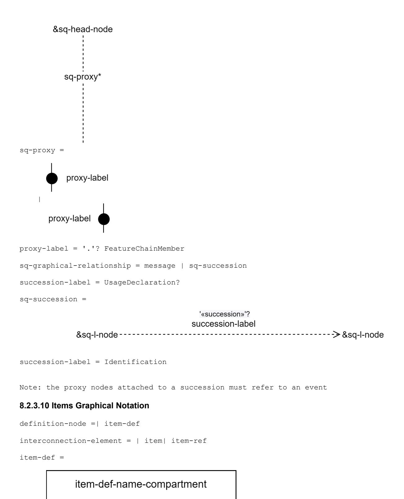

<span id="page-238-0"></span>

item-def-name-compartment =

```
'«' DefinitionPrefix 'item' 'def' '»'
      definition-name-with-alias
usage-node =| item
item =
item-name-compartment =
    '«' OccurrenceUsagePrefix 'item' '»'
    usage-name-with-alias
item-ref =
compartment =| items-compartment
items-compartment =
     items-compartment-contents
items-compartment-contents = (items-compartment-element)* '…'
items-compartment-element = el-prefix? OccurrenceUsagePrefix usage-cp
8.2.3.11 Parts Graphical Notation
definition-node =| part-def
interconnection-element = | part | part-ref
```

<span id="page-239-0"></span>part-def =

```
part-def-name-compartment =
      '«' DefinitionPrefix 'part' 'def' '»'
      definition-name-with-alias
usage-node =| part
part =
part-name-compartment =
      '«' OccurrenceUsagePrefix 'part' '»'
      usage-name-with-alias
part-ref =
compartment =|
      parts-compartment
    | directed-features-compartment
    | interconnection-compartment
```

```
parts-compartment =
      parts-compartment-contents
parts-compartment-contents = (parts-compartment-element)* '…'?
parts-compartment-element = el-prefix? OccurrenceUsagePrefix usage-cp
directed-features-compartment =
      directed-features-compartment-contents
directed-features-compartment-contents = (directed-features-compartment-element)* '…'?
directed-features-compartment-element =
  el-prefix FeatureDirection Definition-Body-Item*
interconnection-compartment =
      interconnection-view
interconnection-view =|
      (interconnection-element)*
      (dependencies-and-annotations-element)*
      (ellipsis-at-lower-left-corner)?
general-view =| interconnection-view
8.2.3.12 Ports Graphical Notation
definition-node =| port-def
port-def =
port-def-name-compartment =
      '«' DefinitionPrefix 'port' 'def' '»'
      definition-name-with-alias
usage-node =| port-usage
```

<span id="page-241-0"></span>port-usage =

```
port-name-compartment =
      '«' OccurrenceUsagePrefix 'port' '»'
      usage-name-with-alias
compartment =| ports-compartment
ports-compartment =
      ports-compartment-contents
ports-compartment-contents = (ports-compartment-element)* '…'?
ports-compartment-element = el-prefix? OccurrenceUsagePrefix usage-cp
interconnection-element =| port-def | port
pdh =
    |
    |
pdv =
    |
    |
port-l =
```

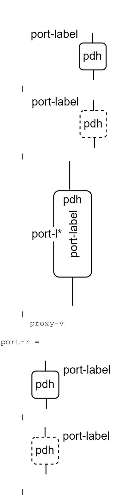

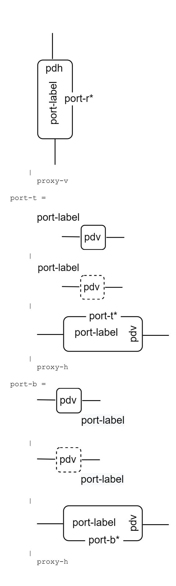

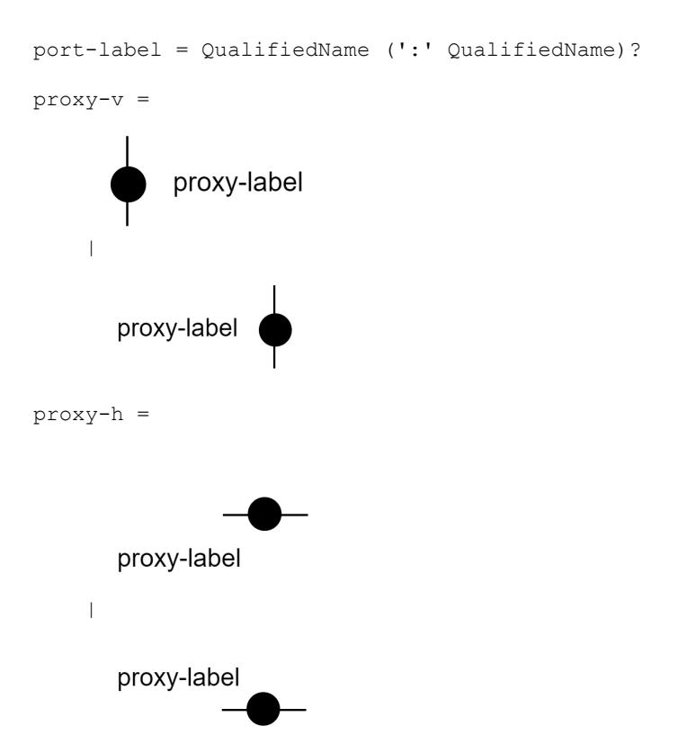

**Note.** Dotted line port productions (references) are only possible for nested ports

**Note.** The proxy option of a port production is valid only on a part usage contained within an interconnection view.

# <span id="page-245-0"></span>**8.2.3.13 Connections Graphical Notation**

```
definition-node =| connection-def
connection-def =
```

```
connection-def-name-compartment =
      '«' DefinitionPrefix 'connection' 'def' '»'
      definition-name-with-alias
usage-node =| connection
connection =
```

```
connection-name-compartment =
      '«' OccurrenceUsagePrefix 'connection' '»'
      usage-name-with-alias
compartment =| connections-compartment
connections-compartment =
      connections-compartment-contents
connections-compartment-contents = (connections-compartment-element)* '…'?
connections-compartment-element =
    el-prefix? OccurrenceUsagePrefix UsageDeclaration
interconnection-element =|
      connection-def
    | connection
    | connection-relationship
    | attribute
connection-relationship =
      binding-connection
    | connection-graphical
    | n-ary-connection
    | n-ary-connection-def
    | connection-definition-elaboration
    | connection-usage-elaboration
    | connection-def-graphical
connection-graphical =
    |
c-adornment =
    (a-property | a-direction | a-subsetting |a-redefinition)*
a-property =
    'ordered' | 'nonunique' | 'abstract' | 'derived' | 'readonly'
a-direction =
    'in' | 'out' | 'inout'
a-subsetting =
    'subsets' OwnedSubsetting (',' OwnedSubsetting)*
a-redefinition =
```

```
'redefines' OwnedRedefinition (',' OwnedRedefinition)*
connection-end = usage-node | usage-edge
usage-edge =| connection-graphical | binding-connection
connection-label = UsageDeclaration
connection-def-graphical =
    |
cdef-label = Identification
n-ary-connection-def =
    n-ary-def-connection-dot n-ary-def-segment+
n-ary-def-connection-dot =
n-ary-def-segment =
definition-node |= n-ary-def-connection-dot
general-relationship |= n-ary-def-segment
n-ary-connection =
    n-ary-connection-dot n-ary-segment+
n-ary-connection-dot =
usage-node |= n-ary-connection-dot
cdot-label = UsageDeclaration
n-ary-segment =
```

binding-connection =

general-relationship |= connection-def-graphical

rolename = Identification? multiplicity = MultiplicityRange? connection-definition-elaboration =

connection-usage-elaboration =

**Note.** The usage-nodes at the ends of a binding-connection must be of compatible types.

# <span id="page-248-0"></span>**8.2.3.14 Interfaces Graphical Notation**

definition-node =| interface-def interconnection-element =| interface interface-def =

interface-def-name-compartment = '«' DefinitionPrefix 'interface' 'def' '»' definition-name-with-alias<

```
usage-node =| interface
interface =
interface-name-compartment =
      '«' OccurrenceUsagePrefix 'interface' '»'
      usage-name-with-alias
compartment =|
      interfaces-compartment
    | ends-compartment
interfaces-compartment =
      interfaces-compartment-contents
interfaces-compartment-contents = (interfaces-compartment-element)* '…'?
interfaces-compartment-element =
      el-prefix? OccurenceUsagePrefix InterfaceUsageDeclaration
ends-compartment =
      ends-compartment-contents
ends-compartment-contents = (ends-compartment-element)* '…'?
ends-compartment-element = QualifedName (':' QualifiedName)?
connection-relationship =
    | interface-connection
interface-connection =
```

interface-label = UsageDeclaration?

# <span id="page-249-0"></span>**8.2.3.15 Allocations Graphical Notation**

```
definition-node =| allocation-def
allocation-def =
```

```
allocation-def-name-compartment =
      '«' DefinitionPrefix 'allocation' 'def' '»'
      definition-name-with-alias
usage-node =| allocation
allocation =
```

```
allocation-name-compartment =
      '«' OccurrenceUsagePrefix 'allocation' '»'
      usage-name-with-alias
compartment =| allocations-compartment
allocations-compartment =
      allocations-compartment-contents
allocations-compartment-contents = (allocations-compartment-element)* '…'?
allocations-compartment-element =
      el-prefix? OccurrenceUsagePrefix AllocationUsageDeclaration UsageBody*
general-relationship =| allocate-relationship
allocate-relationship =
allocation-node =
      general-node
```

# <span id="page-250-0"></span>**8.2.3.16 Flows Graphical Notation**

| element-in-textual-compartment

usage-edge = |allocate-relationship

definition-node =| flow-def flow-def =

```
flow-def-name-compartment =
    '«' DefinitionPrefix 'succession'? 'flow' 'def' '»'
    definition-name-with-alias
usage-node =| flow-node
flow-node =
flow-name-compartment =
      '«' OccurrenceUsagePrefix ( 'message' | 'succession'? 'flow' ) '»'
      usage-name-with-alias
compartment =| flows-compartment
flows-compartment =
                       'flows'
      flows-compartment-contents
flows-compartment-contents = (flows-compartment-element)* '...'?
flows-compartment-element =
    el-prefix? OccurrenceUsagePrefix
    ( 'message' MessageDeclaration
    | 'succession'? FlowDeclaration
    )
interconnection-element =|
      flow-def
    | flow
connection-relationship =|
      message-connection
    | flow
    | succession-flow
    | flow-on-connection
usage-edge =| message | flow | succession-flow
msg-end-node =
      occurrence| sq-l-node| item | part | port | action | state
    | use-case | verification-case | analysis-case | proxy
message =
```

```
Note: proxy nodes and ends of messages must refer to occurrences
message-label =
    UsageDeclaration? ('of' FlowPayloadFeatureMember)? | FlowPayloadFeatureMember
flow =
flow-label =
    UsageDeclaration? ('of' FlowPayloadFeatureMember)? | FlowPayloadFeatureMember
flow-end-node =
    parameter | proxy
Note: proxy nodes at ends of flows must refer to directed features
succession-flow =
succession-flow-label = flow-label
flow-on-connection =
flow-node =
      flow-node-r
    | flow-node-l
    | sflow-node-r
    | sflow-node-l
    | message-node-r
    | message-node-l
flow-node-r =
flow-node-l =
```

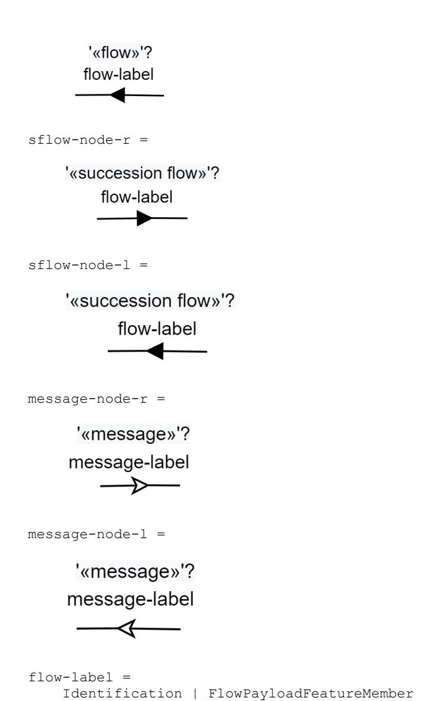

# <span id="page-253-0"></span>**8.2.3.17 Actions Graphical Notation**

definition-node =| action-def action-def =

```
action-def-name-compartment =
      '«' DefinitionPrefix 'action' 'def' '»'
      definition-name-with-alias<
usage-node =|
      action
    | perform-action-usage
action =
action-name-compartment =
      '«' OccurrenceUsagePrefix 'action' '»'
      usage-name-with-alias<
```

perform-action-usage =

action-ref =

```
perform-action-name-compartment =
      '«' OccurrenceUsagePrefix 'perform' 'action' '»'
      usage-name-with-alias
compartment =|
      actions-compartment
    | perform-actions-compartment
    | parameters-compartment
    | action-flow-compartment
actions-compartment =
      actions-compartment-contents
actions-compartment-contents = (actions-compartment-element)* '…'?
actions-compartment-element =
      el-prefix? OccurrenceUsagePrefix ActionUsageDeclaration
perform-actions-compartment =
      perform-actions-compartment-contents
perform-actions-compartment-contents = (perform-actions-compartment-element)* '…'?
perform-actions-compartment-element =
      el-prefix? OccurrenceUsagePrefix PerformActionUsageDeclaration
parameters-compartment =
      parameters-compartment-contents
parameters-compartment-contents = (parameters-compartment-element)* '…'?
parameters-compartment-element =
      el-prefix? FeatureDirection UsageDeclaration ValueOrFlowPart? DefinitionBodyItem*
performed-by-compartment =
      performed-by-compartment-contents
performed-by-compartment-contents = QualifiedName* '…'?
```

```
action-flow-view
action-flow-view =
     (dependencies-and-annotations-element)*
     (action-flow-element)*
     (perform-action-swimlanes)?
action-flow-element =|
      action-ref
    | action
    | action-flow-node
    | action-flow-relationship
action-flow-node =
      start-node
    | done-node
    | terminate-node
    | fork-node
    | join-node
    | decision-node
    | merge-node
    | send-action-node
    | accept-action-node
    | while-loop-action-node
    | for-loop-action-node
    | if-else-action-node
    | assign-action-node
action-flow-relationship =
      flow
    | aflow-succession
    | binding-connection
    | else-branch
param-l =
```

|

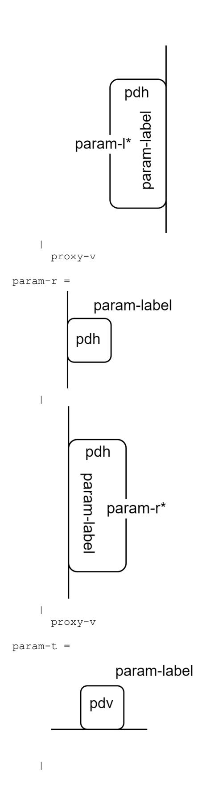

```
|
      proxy-h
param-b =
    |
    |
      proxy-h
param-label = QualifiedName (':' QualifiedName)*
start-node =
done-node =
terminate-node =
fork-node =
join-node =
```

decision-node =

```
merge-node =
send-action-node =
send-action-name-compartment =
      '«' OccurrenceUsagePrefix 'send' 'action' '»'
      usage-name-with-alias
send-action-expression = NodeParameterMember 'to' NodeParameterMember
accept-action-node =
accept-action-name-compartment =
      '«' OccurrenceUsagePrefix 'accept' 'action' '»'
      usage-name-with-alias
accept-action-expression = AcceptParameterPart
while-loop-action-node =
```

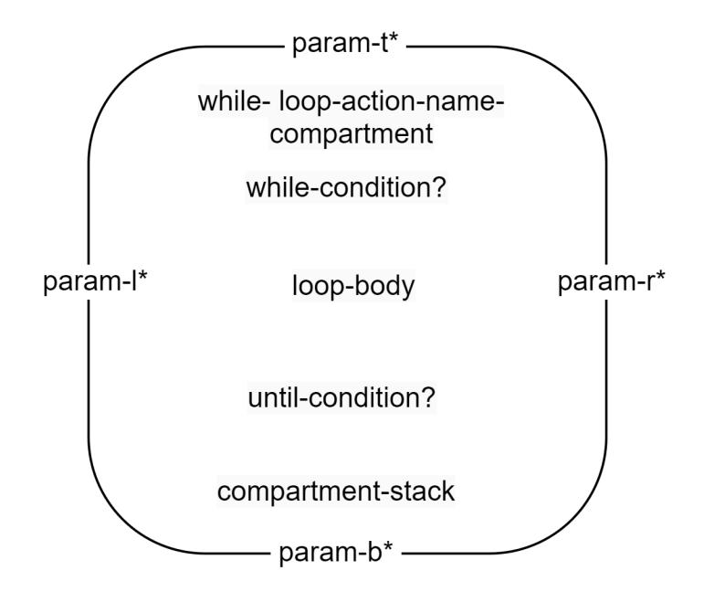

while-condition =

condition-expression

until-condition =

condition-expression

while-loop-action-name-compartment = '«' OccurrenceUsagePrefix 'loop' '»' usage-name-with-alias

for-loop-action-node =

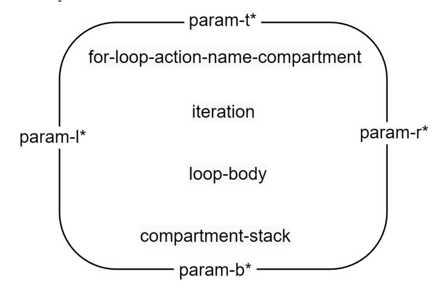

iteration =

iteration-expression

```
loop-body =
  action-body
for-loop-action-name-compartment =
    '«' OccurrenceUsagePrefix 'loop' '»'
    usage-name-with-alias
if-else-action-node =
if-condition =
  condition-expression
then-body =
  action-body
else-body =
  action-body
ifelse-action-name-compartment =
    '«' OccurrenceUsagePrefix 'if' '»'
    usage-name-with-alias
action-body =
    action-body-textual | action-flow-view
condition-expression =
    ExpressionParameterMember
iteration-expression =
    ForVariableDeclarationMember 'in' NodeParameterMember
```

```
action-body-textual =
    ActionBodyParameterMember
assign-action-node =
assign-action-name-compartment =
      '«' OccurrenceUsagePrefix 'assign' '»'
      usage-name-with-alias
perform-actions-swimlanes = (swimlane)*
swimlane =
```

```
parameter =
  param-l | param-r | param-t | param-b
aflow-succession =
```

```
else-branch =
perform-edge =
performer-node = part | action | part-def | action-def | distinguished-parameter
usage-edge = |succession perform-edge
guard-expression = '[' OwnedExpression ']'
```

**Note.** All swimlanes are attached to each other on vertical edges and aligned along the top and bottom horizontal edges.

**Note.** The proxy option of a parameter production is valid only on an action usage contained within an action flow view.

# <span id="page-263-0"></span>**8.2.3.18 States Graphical Notation**

```
definition-node =| state-def
state-def =
```

```
state-def-name-compartment =
      '«' DefinitionPrefix 'state' 'def' '»'
      definition-name-with-alias
      ('«' 'parallel' '»')?
usage-node =|
      state-node
    | exhibit-state-usage
```

state =

state-ref =

```
state-name-compartment =
      '«' OccurrenceUsagePrefix 'state' '»'
      usage-name-with-alias
      ('«' 'parallel' '»')?
exhibit-state-usage =
```

```
state-subaction-body = state-subaction-body-textual | action-flow-view
state-subaction-body-textual = state-subaction-declaration? ( '{' ActionBodyItem* '}' )?
state-subaction-declaration =
      PerformActionUsageDeclaration
    | AcceptNodeDeclaration
    | SendNodeDeclaration
    | AssignmentNodeDeclaration
state-do-action =
  state-subaction-body
state-entry-action =
```

```
state-subaction-body
state-exit-action =
  state-subaction-body
entry-action =
              |
entry-action-name-comp =
'«' 'entry' OccurrenceUsagePrefix 'action' '»'
   usage-name-with-alias
exit-action =
exit-action-name-comp =
'«' 'exit' OccurrenceUsagePrefix 'action' '»'
   usage-name-with-alias
do-action =
```

do-action-name-comp =

```
'«' 'do' OccurrenceUsagePrefix 'action' '»'
   usage-name-with-alias
exhibit-state-name-compartment =
       '«exhibit-state»'
       state-name-compartment
compartment =|
      states-compartment
    | states-actions-compartment
    | exhibit-states-compartment
    | successions-compartment
    | state-transition-compartment
states-compartment =
      states-compartment-contents
states-compartment-contents = (states-compartment-element)* '…'?
states-compartment-element =
    el-prefix? OccurrencePrefix ActionUsageDeclaration
state-actions-compartment =
      state-actions-compartment-contents
state-actions-compartment-contents = (state-actions-compartment-element)* '…'?
state-actions-compartment-element =
    el-prefix? EntryActionMember | DoActionMember | ExitActionMember
exhibit-states-compartment =
      exhibit-states-compartment-contents
exhibit-states-compartment-contents = exhibit-state-scompartment-element* '…'?
exhibit-states-compartment-element-compartment = UsageDeclaration
succession-compartment =
      succession-compartment-contents
succession-compartment-contents = QualifiedName* '…'?
state-transition-compartment =
      state-transition-view
state-transition-view =
      (state-transition-element)*
      (dependencies-and-annotations-element)*
state-transition-element =
```

```
state-transition-node
  | transition
  | st-succession
state-transition-node =
    state-node
  | state-ref-node
  | start-node
  | entry-action
  | do-action
  | exit-action
  | done-node
  | fork-node
  | join-node
  | decision-node
  | merge-node
  | terminate-node
  | action
  | perform-action-usage
  | action-ref
transition =
    |
state-source =
   state-node | state-ref-node
transition-label = trigger-expression '/' ActionUsage
trigger-expression = AcceptParameterPart (guard-expression)?
st-succession =
   |
exhibit-edge =
exhibitor = part | part-def
general-relationship |= exhibit-edge
usage-edge = |transition | st-succession | exhibit-edge
8.2.3.19 Calculations Graphical Notation
definition-node =| calc-def
calc-def =
```

```
calc-def-name-compartment =
      '«' DefinitionPrefix 'calc' 'def' '»'
      definition-name-with-alias
usage-node =| calc
calc =
calc-name-compartment =
      occurrence-name-prefix
      '«' 'ref'? keyword* 'calc' '»'
      definition-name-with-alias
calc-name-compartment =
      '«' OccurrenceUsagePrefix 'calc' '»'
      usage-name-with-alias
action-flow-element =|
      calc-def
    | calc
compartment =|
      calcs-compartment
    | result-compartment
calcs-compartment =
      calcs-compartment-contents
calcs-compartment-contents = calcs-compartment-element* '…'?
calcs-compartment-element = el-prefix? OccurrenceUsagePrefix ActionUsageDeclaration
```

result-compartment-contents

result-compartment-contents = OwnedExpression

# <span id="page-269-0"></span>**8.2.3.20 Constraints Graphical Notation**

```
definition-node =| constraint-def
constraint-def =
```

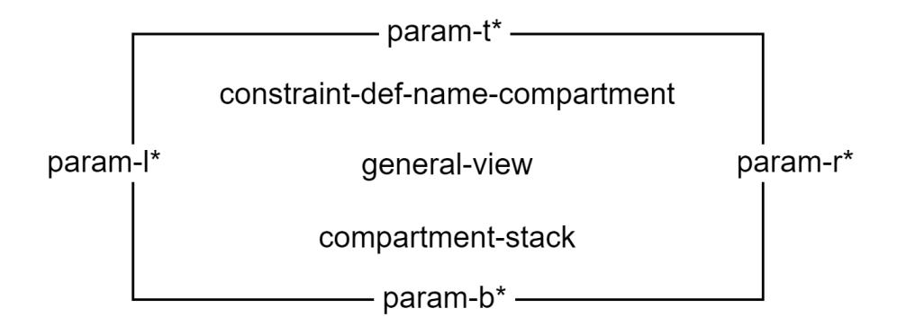

```
constraint-def-name-compartment =
      '«' DefinitionPrefix 'constraint' 'def' '»'
      definition-name-with-alias
usage-node =
      constraint
    | assert-constraint-usage
```

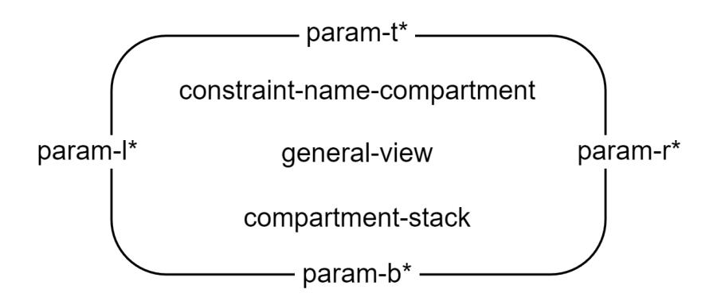

constraint-ref =

constraint =

```
constraint-name-compartment =
      '«' OccurrenceUsagePrefix 'constraint' '»'
      usage-name-with-alias
assert-constraint-node =
```

```
assert-constraint-name-compartment =
       '«assert constraint»'
       constraint-name-compartment
```

assume-constraint-node =

```
assume-constraint-name-compartment =
      '«' OccurrenceUsagePrefix 'assume' 'constraint' '»'
      usage-name-with-alias
usage-node =| assume-constraint-node assert-constraint-node<
assume-edge =
assumer = requirement | requirement-def
general-relationship |= assume-edge
```

```
assert-edge =
assertor = usage-node | definition-node
general-relationship |= assert-edge
compartment =|
      constraints-compartment
    | assert-constraints-compartment
constraints-compartment =
      constraints-compartment-contents
constraints-compartment-contents = (constraints-usage-compartment-element)* '…'?
constraints-usage-compartment-element =
      el-prefix? OccurrenceUsagePrefix ConstraintUsageDeclaration CalculationBody*
assert-constraints-compartment =
      assert-constraints-compartment-contents
assert-constraints-compartment-contents = (assert-constraints-compartment-element)* '…'?
assert-constraints-compartment-element =
      el-prefix? OccurrenceUsagePrefix ( 'not' )?
      ( OwnedSubsetting FeatureSpecializationPart? | UsageDeclaration )
      CalculationUsageParameterPart CalculationBody
interconnection-element =|
      constraint-ref
    | constraint
8.2.3.21 Requirements Graphical Notation
definition-node =|
      requirement-def
    | concern-def
requirement-def =
```

```
requirement-def-name-compartment =
      '«' DefinitionPrefix 'requirement' 'def' '»'
      definition-name-with-alias
usage-node =
      requirement
    | satisfy-requirement-usage
    | concern
requirement =
requirement-ref =
requirement-name-compartment =
      '«' OccurrenceUsagePrefix 'requirement' '»'
      usage-name-with-alias
satisfy-requirement-usage =
satisfy-requirement-name-compartment =
       '«satisfy requirement»'
```

requirement-name-compartment

```
concern-def-name-compartment =
      '«' DefinitionPrefix 'concern' 'def' '»'
      definition-name-with-alias
concern =
```

```
concern-name-compartment =
      '«' OccurrenceUsagePrefix 'concern' '»'
      usage-name-with-alias
compartment =|
      constraints-compartment
    | assert-constraints-compartment
compartment =|
      requirements-compartment
    | require-constraints-compartment
    | assume-constraints-compartment
    | satisfy-requirements-compartment
    | satisfies-compartment
    | actors-compartment
    | subject-compartment
    | stakeholders-compartment
    | frames-compartment
requirements-compartment =
```

```
requirements-compartment-contents
```

```
requirements-compartment-contents = (requirements-compartment-element)* '…'?
requirements-compartment-element =
    OccurrenceUsagePrefix ConstraintUsageDeclaration
require-constraints-compartment =
```

```
require-constraints-compartment-contents
```

```
require-constraints-compartment-contents = require-constraint-element* '…'?
require-constraint-element =
```

```
el-prefix? requireMemberPrefix? RequirementConstraintUsage
assume-constraints-compartment =
      assume-constraints-compartment-contents
assume-constraints-compartment-contents = require-constraint-element* '…'?
satisfy-requirements-compartment =
      satisfy-requirements-compartment-contents
satisfy-requirements-compartment-contents = text-block
satisfies-compartment =
      satisfies-compartment-contents
satisfies-compartment-contents = UsageDeclaration* '…'?
actors-compartment =
      actors-compartment-contents
actors-compartment-contents = (actors-compartment-element)* '…'?
actors-compartment-element = el-prefix? MemberPrefix usage-cp
subject-compartment =
      subject-compartment-contents
subject-compartment-contents = (subject-compartment-element)* '…'?
subject-compartment-element = el-prefix? MemberPrefix usage-cp
stakeholders-compartment =
      stakeholders-compartment-contents
stakeholders-compartment-contents = (stakeholders-compartment-element)* '…'?
stakeholders-compartment-element = el-prefix? MemberPrefix usage-cp
frames-compartment =
      frames-compartment-contents
frames-compartment-contents = (frames-compartment-element)* '…'?
```

frames-compartment-element = el-prefix\* MemberPrefix? FramedConcernUsage

```
concerns-compartment-contents
```

```
interconnection-element =|
      requirement-ref
    | requirement
    | concern
    | distinguished-parameter
    | distinguished-parameter-link
    | concern-stakeholder-link
general-relationship =| frame-relationship
subject-actors-stakeholders-node =| requirement
distinguished-parameter =
      subject
    | actor
    | stakeholder
subject =
```

actor =

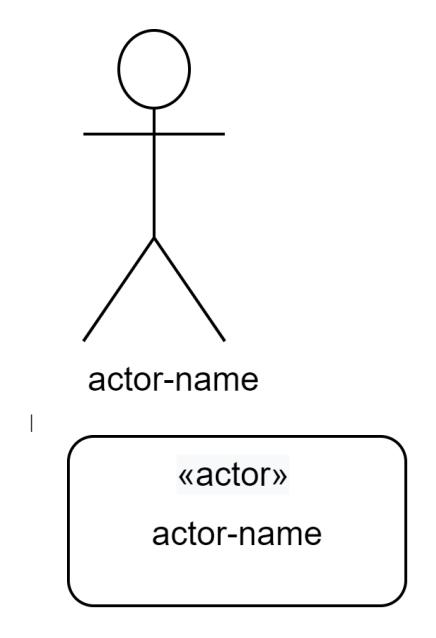

stakeholder =

```
subject-name = UsageDeclaration
actor-name = UsageDeclaration
stakeholder-name = UsageDeclaration
distinguished-parameter-link =
frame-relationship =
concern-stakeholder-link =
satisfy-edge =
satisfier = usage-node | definition-node
general-relationship |= satisfy-edge
require-edge =
requirer = usage-node | definition-node
general-relationship |= require-edge
require-constraint-node =
```

```
require-constraint-name-compartment =
      '«' OccurrenceUsagePrefix 'require' 'constraint' '»'
      usage-name-with-alias
usage-node |= require-constraint-node
frame-concern-node =
frame-concern-name-compartment =
      '«' OccurrenceUsagePrefix 'frame' 'concern' '»'
      usage-name-with-alias
usage-node |= frame-concern-node
frame-edge =
framer = requirement | requirement-def | viewpoint | viewpoint-def
general-relationship |= frame-edge
8.2.3.22 Cases Graphical Notation
compartment =| objective-compartment
objective-compartment =
      objective-compartment-contents
objective-compartment-contents = (objective-compartment-element)* '…'?
objective-compartment-element =
      comp-prefix? MemberPrefix ConstraintUsageDeclaration RequirementBody
8.2.3.23 Analysis Cases Graphical Notation
```

```
definition-node =| analysis-def
analysis-def =
```

```
analysis-def-name-compartment =
      '«' DefinitionPrefix 'analysis' 'def' '»'
      definition-name-with-alias
usage-node =| analysis
analysis =
analysis-name-compartment =
      '«' OccurrenceUsagePrefix 'analysis' '»'
      usage-name-with-alias
compartment =| analyses-compartment
analyses-compartment =
      analyses-compartment-contents
analyses-compartment-contents = analyses-compartment-element* '…'?
analyses-compartment-element =
      el-prefix? OccurrenceUsagePrefix ConstraintUsageDeclaration CaseBody
action-flow-element =|
      analysis-def
    | analysis
subject-actors-stakeholders-node =| analysis | analysis-def
```

# **8.2.3.24 Verification Cases Graphical Notation**

```
definition-node =| verification-def
verification-def =
verification-def-name-compartment =
      '«' DefinitionPrefix 'verification' 'def' '»'
      definition-name-with-alias
usage-node =| verification
verification =
verification-name-compartment =
      '«' OccurrenceUsagePrefix 'verification' '»'
      usage-name-with-alias
verify-requirement-node =
```

```
verify-requirement-name-compartment =
      '«' OccurrenceUsagePrefix 'verify' 'requirement' '»'
      usage-name-with-alias
usage-node |= verify-requirement-node
compartment =|
      verifications-compartment
    | verifies-compartment
    | verification-methods-compartment
verifications-compartment =
      verifications-compartment-contents
verifications-compartment-contents = (verifications-compartment-element)* '…'?
verifications-compartment-element =
    el-prefix? OccurrenceUsagePrefix ConstraintUsageDeclaration CaseBody '…'
verifies-compartment =
      verifies-compartment-contents
verifies-compartment-contents = (verifies-compartment-element)* '…'?
verifies-compartment-element = el-prefix? MemberPrefix RequirementVerificationUsage '…'
verification-methods-compartment =
      verification-methods-compartment-contents
verification-methods-compartment-contents = (verification-methods-compartment-element)* '…'?
verification-methods-compartment-element = MetadataBody
action-flow-element =|
      verification-def
    | verification
general-relationship =| verify-relationship
verify-relationship =
subject-actors-stakeholders-node =| verification | verification-def
8.2.3.25 Use Cases Graphical Notation
definition-node =| use-case-def
use-case-def =
```

```
use-case-def-name-compartment =
      '«' DefinitionPrefix 'use' 'case' 'def' '»'
      definition-name-with-alias
usage-node =|
      use-case
    | include-use-case-usage
use-case =
```

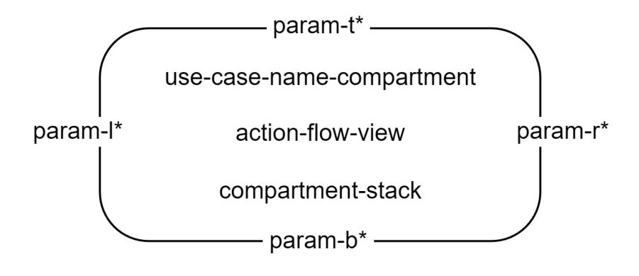

```
use-case-name-compartment =
      '«' OccurrenceUsagePrefix 'use' 'case' '»'
      usage-name-with-alias
```

include-use-case-usage =

```
include-use-case-name-compartment =
       '«include use case»'
       requirement-name-compartment
```

```
compartment =|
      use-cases-compartment
    | include-actions-compartment
    | includes-compartment
use-cases-compartment =
      use-cases-compartment-contents
use-cases-compartment-contents = use-cases-compartment-element* '…'?
use-cases-compartment-element = el-prefix? OccurrenceUsagePrefix ConstraintUsageDeclaration
include-use-cases-compartment =
      include-use-cases-compartment-contents
include-use-cases-compartment-contents = (include-use-cases-compartment-element* '…'?
include-use-cases-compartment-element =
      el-prefix? OccurrenceUsagePrefix
      ( OwnedSubsetting FeatureSpecializationPart? | UsageDeclaration )
      ( ValuePart | ActionUsageParameterList )? CaseBody
includes-compartment =
      includes-compartment-contents
includes-compartment-contents = (includes-compartment-element)* '…'?
includes-compartment-element =
    el-prefix? OccurrenceUsagePrefix
    ( OwnedSubsetting FeatureSpecializationPart? | UsageDeclaration )
action-flow-element =|
       use-case-def
     | use-case
general-relationship =| include-use-case-relationship
include-use-case-relationship =
subject-actors-stakeholders-node =| use-case | use-case-def
8.2.3.26 Views and Viewpoints Graphical Notation
root-view =
        framed-view<
definition-node =|
      viewpoint-def
    | view-def
viewpoint-def =
```

```
viewpoint-def-name-compartment =
      '«' DefinitionPrefix 'viewpoint' 'def' '»'
      definition-name-with-alias
view-def =
```

```
view-def-name-compartment =
      '«' DefinitionPrefix 'view' 'def' '»'
      definition-name-with-alias
usage-node |=
      viewpoint
    | view
    | framed-view
viewpoint =
```

```
viewpoint-name-compartment =
      '«' OccurrenceUsagePrefix 'viewpoint' '»'
      usage-name-with-alias
```

view =

```
view-name-compartment =
      '«' OccurrenceUsagePrefix 'view' '»'
      usage-name-with-alias
compartment =|
    | views-compartment
    | viewpoints-compartment
    | exposes-compartment
```

```
| filters-compartment
    | rendering-compartment
views-compartment =
      views-compartment-contents
views-compartment-contents = (views-compartment-element)* '…'
views-compartment-element =
      el-prefix? OccurrenceUsagePrefix UsageDeclaration? ValueOrFlowPart? ViewBody
viewpoints-compartment =
      viewpoints-compartment-contents
viewpoints-compartment-contents = (viewpoints-compartment-element)* '…'?
viewpoints-compartment-element =
    el-prefix? OccurrenceUsagePrefix ConstraintUsageDeclaration RequirementBody
exposes-compartment =
      exposes-compartment-contents
exposes-compartment-contents = exposes-compartment-element* '…'?
exposes-compartment-element = MembershipExpose | NamespaceExpose
filters-compartment =
      filters-compartment-contents
filters-compartment-contents = (filters-compartment-element)* '…'?
filters-compartment-element = el-prefix? MemberPrefix OwnedExpression
rendering-compartment =
      rendering-compartment-contents
rendering-compartment-contents = usage-cp* '…'?
interconnection-element =|
      viewpoint-def
    | viewpoint
    | view-def
    | view
framed-view =
```

```
frameless-view =
      general-view
    | interconnection-view
    | action-flow-view
    | state-transition-view
    | sequence-view
view-frame-name-compartment = '«view»' QualifiedName (':' QualifiedName)?
view-frame-info-contents = Expose? ElementFilterMember? AnnotatingElement*
view-frame-info-compartment-tr =
view-frame-info-compartment-bl =
view-frame-info-compartment-br =
general-relationship =| expose-relationship
expose-relationship =
     expose_r | toplevel-expose-r | recursive-expose-r
expose_r =
```

```
toplevel-expose-r =
recursive-expose-r =
```

**Note.** The view frame info compartments are optional elements. The AnnotatingElement\* enables adding any relevant supporting information related to a view, possibly using a configurable rendering.

**Note.** A model library in Section 9.2.18 defines standard graphical view definitions for SysML. These may be supplemented by further, customized view definitions specific to a model.

# <span id="page-286-0"></span>**8.2.3.27 Metadata Graphical Notation**

```
annotation-node =| metadata-feature-annotation-node
metadata-feature-annotation-node =
```

```
metadata-feature-decl = Identifier
metadata-feature-name-value-list =
    ( metadata-feature-name '=' expression-text )*
metadata-feature-name = Identifier
expression-text = text-block
metadata-def =
```

```
metadata-def-name-compartment =
    basic-name-prefix
    '«' keyword* 'metadata' 'def' '»'
    definition-name-with-alias
```

# <span id="page-286-1"></span>**8.3 Abstract Syntax**

# <span id="page-286-2"></span>**8.3.1 Abstract Syntax Overview**

The *abstract syntax* is the common underlying syntactic representation for SysML models. The SysML textual or graphical notations (see [8.2](#page-194-2) ) provide for concrete presentation of models in the abstract syntax presentation. This concrete syntax notation may also be parsed to create or update the abstract syntax representation of models. The semantics for SysML models are then formally defined on the abstract syntax representation (see [8.4](#page-425-1) ).

The SysML abstract syntax is specified as a MOF model [MOF] that is an extension of the KerML abstract syntax model [KerML]. Each of the subsequent abstract subclauses describes one package in the abstract syntax model, including one or more overview diagrams and descriptions of each of the elements in the package. In the diagrams, metaclasses and relationships from the KerML abstract syntax are shown in gray. See [KerML] for the description of these elements.

The MOF-compliant class model for the abstract syntax defines the basic structural representation for any SysML model. In addition to this basic structure, the abstract syntax also includes *constraints* defined on various metaclasses. A conformant tool shall be able to accept any KerML model that conforms to the structural abstract syntax class model, and it may then additionally report on and/or enforce the constraints on a model so represented (as further described below).

The SysML abstract syntax model follows the conventions from [KerML, 8.3.1] on three kinds of constraints:

1. *Derivation constraints.* These constraints specify how the values of the derived properties of a metaclass are computed from the values of other properties in the abstract syntax model. A tool conformant to the SysML abstract syntax shall always enforce derivation constraints. However, the computed values of derived properties may depend on whether implied relationships are included in the model or not (see below). A derivation constraint has a name starting with the word derive, followed by the name of the metaclass it constrains, followed by the name of the derived property it is for. The OCL specification of such a constraint always has the form of an equality, with the derived property on the left-hand side and the derivation expression on the right-hand side. For example, the derivation constraint for the derived propertyUsage::isReference is called deriveUsageIsReference and has the OCL specification isReference = not isComposite.

**Note.** Derivation constraints are *not* included for derived properties in the following cases:

- The derived property subsets a property with multiplicity upper bound 1. In this case, if the derived property has a value, it must be the same as that of the subsetted property.
- The derived property redefines another derived property. In this case, the derivation of the redefined property also applies to the redefining property, though the redefining property will generally place additional constraints on type and/or multiplicity.
- 2. *Semantic constraints.* These constraints specify relationships that are semantically required in a SysML model (see [8.4.1](#page-425-2) ), particularly relationships with elements in the Kernel Semantic Library (see [KerML, 9.2]) and Systems Model Library (see [9.2](#page-492-2) ). These constraints may be violated by a model as entered by a user or as interchanged. In this case, a tool may satisfy the constraints by introducing *implied relationships* into the model, it may simply report their violation, or it may ignore the violations. Semantic constraints have names that start with the word check, followed by the name of the constrained metaclass, followed by a descriptive word or phrase. For example, checkPartDefinitionSpecialization.
- 3. *Validation constraints.* These constraints specify additional syntactic conditions that must be satisfied in order to give a model a proper semantic interpretation. They are written presuming that all semantic constraints are satisfied. A *valid* model is a model that satisfies all validation constraints. A tool conformant to the SysML abstract syntax should report violations of validation constraints. A tool conformant to the SysML semantics is only required to operate on valid models. Validation constraints have names that start with the word validate, followed by the name of the metaclass, followed by a descriptive word or phrase. For example, validateUsageOwningType.

# <span id="page-288-0"></span>**8.3.2 Elements and Relationships Abstract Syntax**

<span id="page-288-1"></span>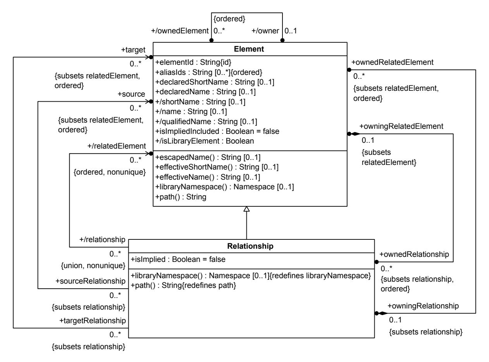

**Figure 2. Elements**

It is a general design principle of the KerML abstract syntax that non-Relationship Elements are related only by reified instances of Relationships. All other meta-associations between Elements are derived from these reified Relationships. For example, the owningRelatedElement/ownedRelationship meta-association between an Element and a Relationship is fundamental to establishing the structure of a model. However, the owner/ownedElement meta-association between two Elements is derived, based on the Relationship structure between them.

# <span id="page-289-0"></span>**8.3.3 Dependencies Abstract Syntax**

<span id="page-289-2"></span>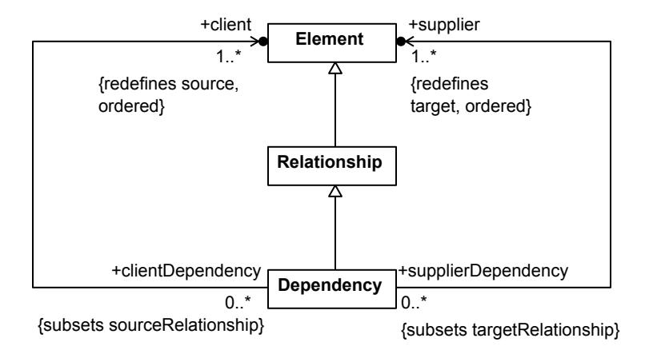

**Figure 3. Dependencies**

# **8.3.4 Annotations Abstract Syntax**

<span id="page-289-3"></span><span id="page-289-1"></span>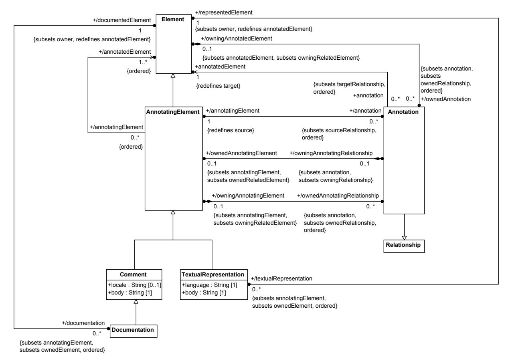

**Figure 4. Annotation**

# <span id="page-290-0"></span>**8.3.5 Namespaces and Packages Abstract Syntax**

<span id="page-290-1"></span>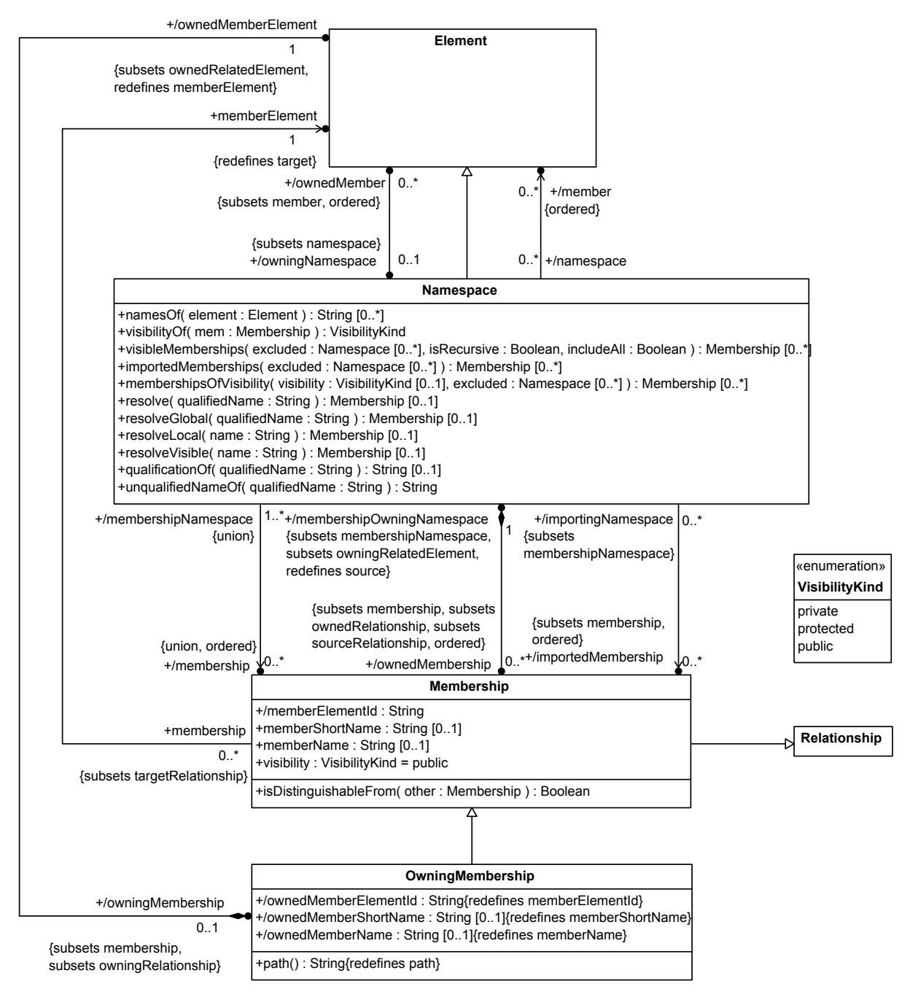

**Figure 5. Namespaces**

<span id="page-291-0"></span>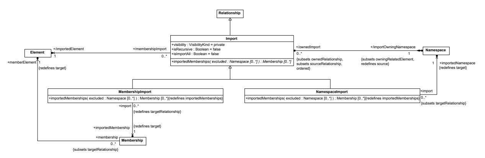

**Figure 6. Imports**

<span id="page-291-1"></span>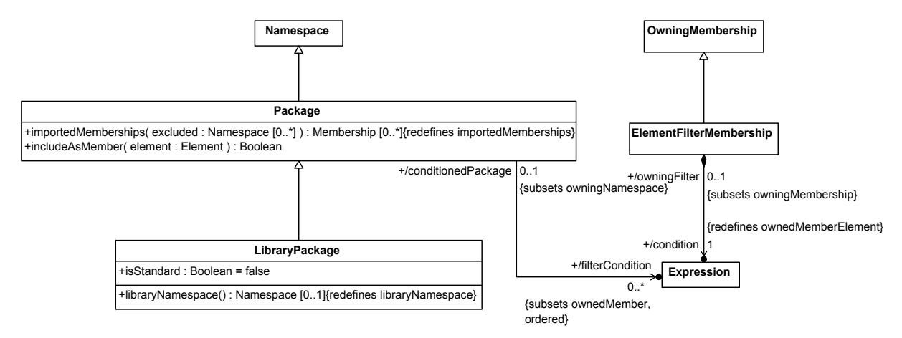

**Figure 7. Packages**

# <span id="page-292-0"></span>**8.3.6 Definition and Usage Abstract Syntax**

# <span id="page-292-1"></span>**8.3.6.1 Overview**

<span id="page-292-3"></span>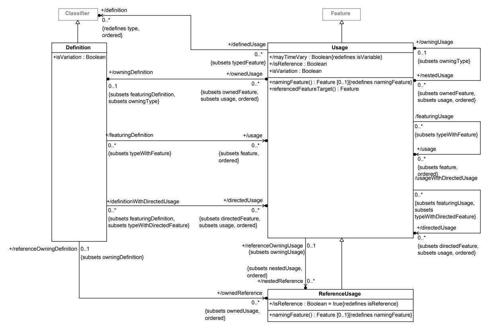

**Figure 8. Definition and Usage**

<span id="page-292-4"></span>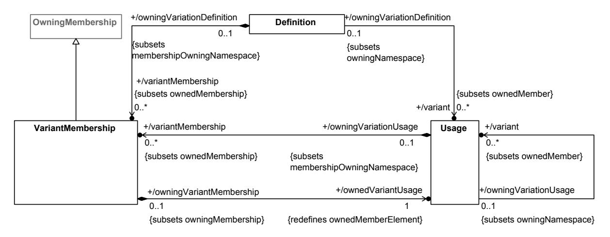

**Figure 9. Variant Membership**

# <span id="page-292-2"></span>**8.3.6.2 Definition**

# **Description**

A Definition is a Classifier of Usages. The actual kinds of Definition that may appear in a model are given by the subclasses of Definition (possibly as extended with user-defined *SemanticMetadata*).

Normally, a Definition has owned Usages that model features of the thing being defined. A Definition may also have other Definitions nested in it, but this has no semantic significance, other than the nested scoping resulting from the Definition being considered as a Namespace for any nested Definitions.

However, if a Definition has isVariation = true, then it represents a *variation point* Definition. In this case, all of its members must be variant Usages, related to the Definition by VariantMembership Relationships. Rather than being features of the Definition, variant Usages model different concrete alternatives that can be chosen to fill in for an abstract Usage of the variation point Definition.

# **General Classes**

Classifier

# **Attributes**

/directedUsage : Usage [0..\*] {subsets directedFeature, usage, ordered}

The usages of this Definition that are directedFeatures.

isVariation : Boolean

Whether this Definition is for a variation point or not. If true, then all the memberships of the Definition must be VariantMemberships.

/ownedAction : ActionUsage [0..\*] {subsets ownedOccurrence, ordered}

The ActionUsages that are ownedUsages of this Definition.

/ownedAllocation : AllocationUsage [0..\*] {subsets ownedConnection, ordered}

The AllocationUsages that are ownedUsages of this Definition.

/ownedAnalysisCase : AnalysisCaseUsage [0..\*] {subsets ownedCase, ordered}

The AnalysisCaseUsages that are ownedUsages of this Definition.

/ownedAttribute : AttributeUsage [0..\*] {subsets ownedUsage, ordered}

The AttributeUsages that are ownedUsages of this Definition.

/ownedCalculation : CalculationUsage [0..\*] {subsets ownedAction, ordered}

The CalculationUsages that are ownedUsages of this Definition.

/ownedCase : CaseUsage [0..\*] {subsets ownedCalculation, ordered}

The code>CaseUsages that are ownedUsages of this Definition.

/ownedConcern : ConcernUsage [0..\*] {subsets ownedRequirement}

The ConcernUsages that are ownedUsages of this Definition.

/ownedConnection : ConnectorAsUsage [0..\*] {subsets ownedUsage, ordered}

The ConnectorAsUsages that are ownedUsages of this Definition. Note that this list includes BindingConnectorAsUsages, SuccessionAsUsages, and FlowUsages because these are ConnectorAsUsages even though they are not ConnectionUsages.

/ownedConstraint : ConstraintUsage [0..\*] {subsets ownedOccurrence, ordered}

The ConstraintUsages that are ownedUsages of this Definition.

/ownedEnumeration : EnumerationUsage [0..\*] {subsets ownedAttribute, ordered}

The EnumerationUsages that are ownedUsages of this Definition.

/ownedFlow : FlowUsage [0..\*] {subsets ownedConnection}

The FlowUsages that are ownedUsages of this Definition.

/ownedInterface : InterfaceUsage [0..\*] {subsets ownedConnection, ordered}

The InterfaceUsages that are ownedUsages of this Definition.

/ownedItem : ItemUsage [0..\*] {subsets ownedOccurrence, ordered}

The ItemUsages that are ownedUsages of this Definition.

/ownedMetadata : MetadataUsage [0..\*] {subsets ownedItem, ordered}

The MetadataUsages that are ownedUsages of this Definition.

/ownedOccurrence : OccurrenceUsage [0..\*] {subsets ownedUsage, ordered}

The OccurrenceUsages that are ownedUsages of this Definition.

/ownedPart : PartUsage [0..\*] {subsets ownedItem, ordered}

The PartUsages that are ownedUsages of this Definition.

/ownedPort : PortUsage [0..\*] {subsets ownedUsage, ordered}

The PortUsages that are ownedUsages of this Definition.

/ownedReference : ReferenceUsage [0..\*] {subsets ownedUsage, ordered}

The ReferenceUsages that are ownedUsages of this Definition.

/ownedRendering : RenderingUsage [0..\*] {subsets ownedPart, ordered}

The RenderingUsages that are ownedUsages of this Definition.

/ownedRequirement : RequirementUsage [0..\*] {subsets ownedConstraint, ordered}

The RequirementUsages that are ownedUsages of this Definition.

/ownedState : StateUsage [0..\*] {subsets ownedAction, ordered}

The StateUsages that are ownedUsages of this Definition.

/ownedTransition : TransitionUsage [0..\*] {subsets ownedUsage}

The TransitionUsages that are ownedUsages of this Definition.

/ownedUsage : Usage [0..\*] {subsets ownedFeature, usage, ordered}

The Usages that are ownedFeatures of this Definition.

/ownedUseCase : UseCaseUsage [0..\*] {subsets ownedCase, ordered}

The UseCaseUsages that are ownedUsages of this Definition.

/ownedVerificationCase : VerificationCaseUsage [0..\*] {subsets ownedCase, ordered}

The VerificationCaseUsages that are ownedUsages of this Definition.

/ownedView : ViewUsage [0..\*] {subsets ownedPart, ordered}

The ViewUsages that are ownedUsages of this Definition.

/ownedViewpoint : ViewpointUsage [0..\*] {subsets ownedRequirement, ordered}

The ViewpointUsages that are ownedUsages of this Definition.

/usage : Usage [0..\*] {subsets feature, ordered}

The Usages that are features of this Definition (not necessarily owned).

/variant : Usage [0..\*] {subsets ownedMember}

The Usages which represent the variants of this Definition as a variation point Definition, if isVariation = true. If isVariation = false, the there must be no variants.

/variantMembership : VariantMembership [0..\*] {subsets ownedMembership}

The ownedMemberships of this Definition that are VariantMemberships. If isVariation = true, then this must be all ownedMemberships of the Definition. If isVariation = false, then variantMembershipmust be empty.

# **Operations**

None.

# **Constraints**

# deriveDefinitionDirectedUsage

The directedUsages of a Definition are all its directedFeatures that are Usages.

directedUsage = directedFeature->selectByKind(Usage)

# deriveDefinitionOwnedAction

The ownedActions of a Definition are all its ownedUsages that are ActionUsages.

ownedAction = ownedUsage->selectByKind(ActionUsage)

# deriveDefinitionOwnedAllocation

The ownedAllocations of a Definition are all its ownedUsages that are AllocationUsages.

ownedAllocation = ownedUsage->selectByKind(AllocationUsage)

# deriveDefinitionOwnedAnalysisCase

The ownedAnalysisCases of a Definition are all its ownedUsages that are AnalysisCaseUsages.

ownedAnalysisCase = ownedUsage->selectByKind(AnalysisCaseUsage)

# deriveDefinitionOwnedAttribute

The ownedAttributes of a Definition are all its ownedUsages that are AttributeUsages.

ownedAttribute = ownedUsage->selectByKind(AttributeUsage)

# deriveDefinitionOwnedCalculation

The ownedCalculations of a Definition are all its ownedUsages that are CalculationUsages.

ownedCalculation = ownedUsage->selectByKind(CalculationUsage)

# deriveDefinitionOwnedCase

The ownedCases of a Definition are all its ownedUsages that are CaseUsages.

ownedCase = ownedUsage->selectByKind(CaseUsage)

# deriveDefinitionOwnedConcern

The ownedConcerns of a Definition are all its ownedUsages that are ConcernUsages.

ownedConcern = ownedUsage->selectByKind(ConcernUsage)

# deriveDefinitionOwnedConnection

The ownedConnections of a Definition are all its ownedUsages that are ConnectorAsUsages.

ownedConnection = ownedUsage->selectByKind(ConnectorAsUsage)

# deriveDefinitionOwnedConstraint

The ownedConstraints of a Definition are all its ownedUsages that are ConstraintUsages.

ownedConstraint = ownedUsage->selectByKind(ConstraintUsage)

# deriveDefinitionOwnedEnumeration

The ownedEnumerations of a Definition are all its ownedUsages that are EnumerationUsages.

ownedEnumeration = ownedUsage->selectByKind(EnumerationUsage)

# deriveDefinitionOwnedFlow

The ownedFlows of a Definition are all its ownedUsages that are FlowUsages.

ownedFlow = ownedUsage->selectByKind(FlowConnectionUsage)

# deriveDefinitionOwnedInterface

The ownedInterfaces of a Definition are all its ownedUsages that are InterfaceUsages.

ownedInterface = ownedUsage->selectByKind(ReferenceUsage)

# deriveDefinitionOwnedItem

The ownedItems of a Definition are all its ownedUsages that are ItemUsages.

ownedItem = ownedUsage->selectByKind(ItemUsage)

# deriveDefinitionOwnedMetadata

The ownedMetadata of a Definition are all its ownedUsages that are MetadataUsages.

ownedMetadata = ownedUsage->selectByKind(MetadataUsage)

# deriveDefinitionOwnedOccurrence

The ownedOccurrences of a Definition are all its ownedUsages that are OccurrenceUsages.

ownedOccurrence = ownedUsage->selectByKind(OccurrenceUsage)

# deriveDefinitionOwnedPart

The ownedParts of a Definition are all its ownedUsages that are PartUsages.

ownedPart = ownedUsage->selectByKind(PartUsage)

# deriveDefinitionOwnedPort

The ownedPorts of a Definition are all its ownedUsages that are PortUsages.

ownedPort = ownedUsage->selectByKind(PortUsage)

# deriveDefinitionOwnedReference

The ownedReferences of a Definition are all its ownedUsages that are ReferenceUsages.

ownedReference = ownedUsage->selectByKind(ReferenceUsage)

# deriveDefinitionOwnedRendering

The ownedRenderings of a Definition are all its ownedUsages that are RenderingUsages.

ownedRendering = ownedUsage->selectByKind(RenderingUsage)

# deriveDefinitionOwnedRequirement

The ownedRequirements of a Definition are all its ownedUsages that are RequirementUsages.

ownedRequirement = ownedUsage->selectByKind(RequirementUsage)

# deriveDefinitionOwnedState

The ownedStates of a Definition are all its ownedUsages that are StateUsages.

ownedState = ownedUsage->selectByKind(StateUsage)

# deriveDefinitionOwnedTransition

The ownedTransitions of a Definition are all its ownedUsages that are TransitionUsages.

ownedTransition = ownedUsage->selectByKind(TransitionUsage)

# deriveDefinitionOwnedUsage

The ownedUsages of a Definition are all its ownedFeatures that are Usages.

ownedUsage = ownedFeature->selectByKind(Usage)

# deriveDefinitionOwnedUseCase

The ownedUseCases of a Definition are all its ownedUsages that are UseCaseUsages.

ownedUseCase = ownedUsage->selectByKind(UseCaseUsage)

# deriveDefinitionOwnedVerificationCase

The ownedValidationCases of a Definition are all its ownedUsages that are ValidationCaseUsages.

ownedVerificationCase = ownedUsage->selectByKind(VerificationCaseUsage)

# deriveDefinitionOwnedView

The ownedViews of a Definition are all its ownedUsages that are ViewUsages.

ownedView = ownedUsage->selectByKind(ViewUsage)

# deriveDefinitionOwnedViewpoint

The ownedViewpoints of a Definition are all its ownedUsages that are ViewpointUsages.

ownedViewpoint = ownedUsage->selectByKind(ViewpointUsage)

# deriveDefinitionUsage

The usages of a Definition are all its features that are Usages.

usage = feature->selectByKind(Usage)

# deriveDefinitionVariant

The variants of a Definition are the ownedVariantUsages of its variantMemberships.

variant = variantMembership.ownedVariantUsage

# deriveDefinitionVariantMembership

The variantMemberships of a Definition are those ownedMemberships that are VariantMemberships.

variantMembership = ownedMembership->selectByKind(VariantMembership)

# validateDefinitionVariationIsAbstract

If a Definition is a variation, then it must be abstract.

```
isVariation implies isAbstract
```

validateDefinitionVariationOwnedFeatureMembership

If a Definition is a variation, then all it must not have any ownedFeatureMemberships.

```
isVariation implies ownedFeatureMembership->isEmpty()
```

validateDefinitionVariationSpecialization

A variation Definition may not specialize any other variation Definition.

```
isVariation implies
    not ownedSpecialization.specific->exists(
        oclIsKindOf(Definition) and
        oclAsType(Definition).isVariation)
```

# <span id="page-299-0"></span>**8.3.6.3 ReferenceUsage**

# **Description**

A ReferenceUsage is a Usage that specifies a non-compositional (isComposite = false) reference to something. The definition of a ReferenceUsage can be any kind of Classifier, with the default being the top-level Classifier *Base::Anything* from the Kernel Semantic Library. This allows the specification of a generic reference without distinguishing if the thing referenced is an attribute value, item, action, etc.

# **General Classes**

Usage

# **Attributes**

/isReference : Boolean {redefines isReference}

Always true for a ReferenceUsage.

# **Operations**

namingFeature() : Feature [0..1] {redefines namingFeature}

If this ReferenceUsage is the *payload* parameter of a TransitionUsage, then its naming Feature is the payloadParameter of the triggerAction of that TransitionUsage (if any).

```
body: if owningType <> null and owningType.oclIsKindOf(TransitionUsage) and
    owningType.oclAsType(TransitionUsage).inputParameter(2) = self then
    owningType.oclAsType(TransitionUsage).triggerPayloadParameter()
else self.oclAsType(Usage).namingFeature()
endif
```

# **Constraints**

validateReferenceUsageIsReference

A ReferenceUsage is always referential.

isReference

# <span id="page-300-0"></span>**8.3.6.4 Usage**

# **Description**

A Usage is a usage of a Definition.

A Usage may have nestedUsages that model features that apply in the context of the owningUsage. A Usage may also have Definitions nested in it, but this has no semantic significance, other than the nested scoping resulting from the Usage being considered as a Namespace for any nested Definitions.

However, if a Usage has isVariation = true, then it represents a *variation point* Usage. In this case, all of its members must be variant Usages, related to the Usage by VariantMembership Relationships. Rather than being features of the Usage, variant Usages model different concrete alternatives that can be chosen to fill in for the variation point Usage.

# **General Classes**

Feature

# **Attributes**

/definition : Classifier [0..\*] {redefines type, ordered}

The Classifiers that are the types of this Usage. Nominally, these are Definitions, but other kinds of Kernel Classifiers are also allowed, to permit use of Classifiers from the Kernel Model Libraries.

/directedUsage : Usage [0..\*] {subsets directedFeature, usage, ordered}

The usages of this Usage that are directedFeatures.

/isReference : Boolean

Whether this Usage is a referential Usage, that is, it has isComposite = false.

isVariation : Boolean

Whether this Usage is for a variation point or not. If true, then all the memberships of the Usage must be VariantMemberships.

/mayTimeVary : Boolean {redefines isVariable}

Whether this Usage may be time varying (that is, whether it is featured by the snapshots of its owningType, rather than being featured by the owningType itself). However, if isConstant is also true, then the value of the Usage is nevertheless constant over the entire duration of an instance of its owningType (that is, it has the same value on all snapshots).

The property mayTimeVary redefines the KerML property Feature::isVariable, making it derived. The property isConstant is inherited from Feature.

/nestedAction : ActionUsage [0..\*] {subsets nestedOccurrence, ordered}

The ActionUsages that are nestedUsages of this Usage.

/nestedAllocation : AllocationUsage [0..\*] {subsets nestedConnection, ordered}

The AllocationUsages that are nestedUsages of this Usage.

/nestedAnalysisCase : AnalysisCaseUsage [0..\*] {subsets nestedCase, ordered}

The AnalysisCaseUsages that are nestedUsages of this Usage.

/nestedAttribute : AttributeUsage [0..\*] {subsets nestedUsage, ordered}

The code>AttributeUsages that are nestedUsages of this Usage.

/nestedCalculation : CalculationUsage [0..\*] {subsets nestedAction, ordered}

The CalculationUsage that are nestedUsages of this Usage.

/nestedCase : CaseUsage [0..\*] {subsets nestedCalculation, ordered}

The CaseUsages that are nestedUsages of this Usage.

/nestedConcern : ConcernUsage [0..\*] {subsets nestedRequirement}

The ConcernUsages that are nestedUsages of this Usage.

/nestedConnection : ConnectorAsUsage [0..\*] {subsets nestedUsage, ordered}

The ConnectorAsUsages that are nestedUsages of this Usage. Note that this list includes BindingConnectorAsUsages, SuccessionAsUsages, and FlowConnectionUsages because these are ConnectorAsUsages even though they are not ConnectionUsages.

/nestedConstraint : ConstraintUsage [0..\*] {subsets nestedOccurrence, ordered}

The ConstraintUsages that are nestedUsages of this Usage.

/nestedEnumeration : EnumerationUsage [0..\*] {subsets nestedAttribute, ordered}

The code>EnumerationUsages that are nestedUsages of this Usage.

/nestedFlow : FlowUsage [0..\*] {subsets nestedConnection}

The code>FlowUsages that are nestedUsages of this Usage.

/nestedInterface : InterfaceUsage [0..\*] {subsets nestedConnection, ordered}

The InterfaceUsages that are nestedUsages of this Usage.

/nestedItem : ItemUsage [0..\*] {subsets nestedOccurrence, ordered}

The ItemUsages that are nestedUsages of this Usage.

/nestedMetadata : MetadataUsage [0..\*] {subsets nestedItem, ordered}

The MetadataUsages that are nestedUsages of this of this Usage.

/nestedOccurrence : OccurrenceUsage [0..\*] {subsets nestedUsage, ordered}

The OccurrenceUsages that are nestedUsages of this Usage.

/nestedPart : PartUsage [0..\*] {subsets nestedItem, ordered}

The PartUsages that are nestedUsages of this Usage.

/nestedPort : PortUsage [0..\*] {subsets nestedUsage, ordered}

The PortUsages that are nestedUsages of this Usage.

/nestedReference : ReferenceUsage [0..\*] {subsets nestedUsage, ordered}

The ReferenceUsages that are nestedUsages of this Usage.

/nestedRendering : RenderingUsage [0..\*] {subsets nestedPart, ordered}

The RenderingUsages that are nestedUsages of this Usage.

/nestedRequirement : RequirementUsage [0..\*] {subsets nestedConstraint, ordered}

The RequirementUsages that are nestedUsages of this Usage.

/nestedState : StateUsage [0..\*] {subsets nestedAction, ordered}

The StateUsages that are nestedUsages of this Usage.

/nestedTransition : TransitionUsage [0..\*] {subsets nestedUsage}

The TransitionUsages that are nestedUsages of this Usage.

/nestedUsage : Usage [0..\*] {subsets ownedFeature, usage, ordered}

The Usages that are ownedFeatures of this Usage.

/nestedUseCase : UseCaseUsage [0..\*] {subsets nestedCase, ordered}

The UseCaseUsages that are nestedUsages of this Usage.

/nestedVerificationCase : VerificationCaseUsage [0..\*] {subsets nestedCase, ordered}

The VerificationCaseUsages that are nestedUsages of this Usage.

/nestedView : ViewUsage [0..\*] {subsets nestedPart, ordered}

The ViewUsages that are nestedUsages of this Usage.

/nestedViewpoint : ViewpointUsage [0..\*] {subsets nestedRequirement, ordered}

The ViewpointUsages that are nestedUsages of this Usage.

/owningDefinition : Definition [0..1] {subsets owningType, featuringDefinition}

The Definition that owns this Usage (if any).

/owningUsage : Usage [0..1] {subsets owningType}

The Usage in which this Usage is nested (if any).

```
/usage : Usage [0..*] {subsets feature, ordered}
```

The Usages that are features of this Usage (not necessarily owned).

```
/variant : Usage [0..*] {subsets ownedMember}
```

The Usages which represent the variants of this Usage as a variation point Usage, if isVariation = true. If isVariation = false, then there must be no variants.

/variantMembership : VariantMembership [0..\*] {subsets ownedMembership}

The ownedMemberships of this Usage that are VariantMemberships. If isVariation = true, then this must be all memberships of the Usage. If isVariation = false, then variantMembershipmust be empty.

# **Operations**

```
namingFeature() : Feature [0..1] {redefines namingFeature}
```

If this Usage is a variant, then its naming Feature is the referencedFeature of its ownedReferenceSubsetting.

```
body: if not owningMembership.oclIsKindOf(VariantMembership) then
    self.oclAsType(Feature).namingFeature()
else if ownedReferenceSubsetting = null then null
else ownedReferenceSubsetting.referencedFeature
endif endif
```

# referencedFeatureTarget() : Feature

If ownedReferenceSubsetting is not null, return the featureTarget of the referencedFeature of the ownedReferenceSubsetting.

```
body: if ownedReferenceSubsetting = null then null
else ownedReferenceSubsetting.referencedFeature.featureTarget
endif
```

# **Constraints**

# checkUsageVariationDefinitionSpecialization

If a Usage has an owningVariationDefinition, then it must directly or indirectly specialize that Definition.

```
owningVariationDefinition <> null implies
    specializes(owningVariationDefinition)
```

# checkUsageVariationUsageSpecialization

If a Usage has an owningVariationUsage, then it must directly or indirectly specialize that Usage.

```
owningVariationUsage <> null implies
    specializes(owningVariationUsage)
```

# checkUsageVariationUsageTypeFeaturing

If a Usage has an owningVariationUsage, then it must have the same featuringTypes as that Usage.

```
owningVariationUsage <> null implies
    featuringType->asSet() = owningVariationUsage.featuringType->asSet()
```

# deriveUsageDirectedUsage

The directedUsages of a Usage are all its directedFeatures that are Usages.

```
directedUsage = directedFeature->selectByKind(Usage)
```

# deriveUsageIsReference

A Usage is referential if it is not composite.

```
isReference = not isComposite
```

# deriveUsageMayTimeVary

A Usage mayTimeVary if and only if all of the following are true

- It has an owningType that specializes *Occurrences::Occurrence* (from the Kernel Semantic Library).
- It is not a portion.
- It does not specialize *Links::SelfLink* or *Occurrences::HappensLink* (from the Kernel Semantic Library).
- If isComposite = true, it does not specialize *Actions::Action* (from the Systems Model Library).

```
mayTimeVary =
    owningType <> null and
    owningType.specializesFromLibrary('Occurrences::Occurrence') and
    not (
        isPortion or
        specializesFromLibrary('Links::SelfLink') or
        specializesFromLibrary('Occurrences::HappensLink') or
        isComposite and specializesFromLibrary('Actions::Action')
    )
```

# deriveUsageNestedAction

The ownedActions of a Usage are all its ownedUsages that are ActionUsages.

```
nestedAction = nestedUsage->selectByKind(ActionUsage)
```

# deriveUsageNestedAllocation

The ownedAllocations of a Usage are all its ownedUsages that are AllocationUsages.

```
nestedAllocation = nestedUsage->selectByKind(AllocationUsage)
```

# deriveUsageNestedAnalysisCase

The ownedAnalysisCases of a Usage are all its ownedUsages that are AnalysisCaseUsages.

```
nestedAnalysisCase = nestedUsage->selectByKind(AnalysisCaseUsage)
```

# deriveUsageNestedAttribute

The ownedAttributes of a Usage are all its ownedUsages that are AttributeUsages.

```
nestedAttribute = nestedUsage->selectByKind(AttributeUsage)
```

# deriveUsageNestedCalculation

The ownedCalculations of a Usage are all its ownedUsages that are CalculationUsages.

nestedCalculation = nestedUsage->selectByKind(CalculationUsage)

# deriveUsageNestedCase

The ownedCases of a Usage are all its ownedUsages that are CaseUsages.

nestedCase = nestedUsage->selectByKind(CaseUsage)

# deriveUsageNestedConcern

The ownedConcerns of a Usage are all its ownedUsages that are ConcernUsages.

nestedConcern = nestedUsage->selectByKind(ConcernUsage)

# deriveUsageNestedConnection

The ownedConnections of a Usage are all its ownedUsages that are ConnectorAsUsages.

nestedConnection = nestedUsage->selectByKind(ConnectorAsUsage)

# deriveUsageNestedConstraint

The ownedConstraints of a Usage are all its ownedUsages that are ConstraintUsages.

nestedConstraint = nestedUsage->selectByKind(ConstraintUsage)

# deriveUsageNestedEnumeration

The ownedEnumerations of a Usage are all its ownedUsages that are EnumerationUsages.

ownedNested = nestedUsage->selectByKind(EnumerationUsage)

# deriveUsageNestedFlow

The ownedFlows of a Usage are all its ownedUsages that are FlowConnectionUsages.

nestedFlow = nestedUsage->selectByKind(FlowConnectionUsage)

# deriveUsageNestedInterface

The ownedInterfaces of a Usage are all its ownedUsages that are InterfaceUsages.

nestedInterface = nestedUsage->selectByKind(ReferenceUsage)

# deriveUsageNestedItem

The ownedItems of a Usage are all its ownedUsages that are ItemUsages.

nestedItem = nestedUsage->selectByKind(ItemUsage)

# deriveUsageNestedMetadata

The ownedMetadata of a Usage are all its ownedUsages that are MetadataUsages.

nestedMetadata = nestedUsage->selectByKind(MetadataUsage)

# deriveUsageNestedOccurrence

The ownedOccurrences of a Usage are all its ownedUsages that are OccurrenceUsages.

nestedOccurrence = nestedUsage->selectByKind(OccurrenceUsage)

# deriveUsageNestedPart

The ownedParts of a Usage are all its ownedUsages that are PartUsages.

nestedPart = nestedUsage->selectByKind(PartUsage)

# deriveUsageNestedPort

The ownedPorts of a Usage are all its ownedUsages that are PortUsages.

nestedPort = nestedUsage->selectByKind(PortUsage)

# deriveUsageNestedReference

The ownedReferences of a Usage are all its ownedUsages that are ReferenceUsages.

nestedReference = nestedUsage->selectByKind(ReferenceUsage)

# deriveUsageNestedRendering

The ownedRenderings of a Usage are all its ownedUsages that are RenderingUsages.

nestedRendering = nestedUsage->selectByKind(RenderingUsage)

# deriveUsageNestedRequirement

The ownedRequirements of a Usage are all its ownedUsages that are RequirementUsages.

nestedRequirement = nestedUsage->selectByKind(RequirementUsage)

# deriveUsageNestedState

The ownedStates of a Usage are all its ownedUsages that are StateUsages.

nestedState = nestedUsage->selectByKind(StateUsage)

# deriveUsageNestedTransition

The ownedTransitions of a Usage are all its ownedUsages that are TransitionUsages.

nestedTransition = nestedUsage->selectByKind(TransitionUsage)

# deriveUsageNestedUsage

The ownedUsages of a Usage are all its ownedFeatures that are Usages.

nestedUsage = ownedFeature->selectByKind(Usage)

# deriveUsageNestedUseCase

The ownedUseCases of a Usage are all its ownedUsages that are UseCaseUsages.

```
nestedUseCase = nestedUsage->selectByKind(UseCaseUsage)
```

# deriveUsageNestedVerificationCase

The ownedValidationCases of a Usage are all its ownedUsages that are ValidationCaseUsages.

nestedVerificationCase = nestedUsage->selectByKind(VerificationCaseUsage)

# deriveUsageNestedView

The ownedViews of a Usage are all its ownedUsages that are ViewUsages.

nestedView = nestedUsage->selectByKind(ViewUsage)

# deriveUsageNestedViewpoint

The ownedViewpoints of a Usage are all its ownedUsages that are ViewpointUsages.

nestedViewpoint = nestedUsage->selectByKind(ViewpointUsage)

# deriveUsageUsage

The usages of a Usage are all its features that are Usages.

usage = feature->selectByKind(Usage)

# deriveUsageVariant

The variants of a Usage are the ownedVariantUsages of its variantMemberships.

variant = variantMembership.ownedVariantUsage

# deriveUsageVariantMembership

The variantMemberships of a Usage are those ownedMemberships that are VariantMemberships.

variantMembership = ownedMembership->selectByKind(VariantMembership)

# validateUsageIsReferential

A Usage that is directed, an end feature or has no featuringTypes must be referential.

direction <> null or isEnd or featuringType->isEmpty() implies isReference

# validateUsageVariationIsAbstract

If a Usage is a variation, then it must be abstract.

isVariation implies isAbstract

# validateUsageVariationOwnedFeatureMembership

If a Usage is a variation, then it must not have any ownedFeatureMemberships.

isVariation implies ownedFeatureMembership->isEmpty()

# validateUsageVariationSpecialization

A variation Usage may not specialize any variation Definition or Usage.

```
isVariation implies
    not ownedSpecialization.specific->exists(
        oclIsKindOf(Definition) and
        oclAsType(Definition).isVariation or
        oclIsKindOf(Usage) and
        oclAsType(Usage).isVariation)
```

# <span id="page-308-0"></span>**8.3.6.5 VariantMembership**

# **Description**

A VariantMembership is a Membership between a variation point Definition or Usage and a Usage that represents a variant in the context of that variation. The membershipOwningNamespace for the VariantMembership must be either a Definition or a Usage with isVariation = true.

# **General Classes**

OwningMembership

# **Attributes**

/ownedVariantUsage : Usage {redefines ownedMemberElement}

The Usage that represents a variant in the context of the owningVariationDefinition or owningVariationUsage.

# **Operations**

None.

# **Constraints**

validateVariantMembershipOwningNamespace

The membershipOwningNamespace of a VariantMembership must be a variation-point Definition or Usage.

```
membershipOwningNamespace.oclIsKindOf(Definition) and
    membershipOwningNamespace.oclAsType(Definition).isVariation or
membershipOwningNamespace.oclIsKindOf(Usage) and
    membershipOwningNamespace.oclAsType(Usage).isVariation
```

# <span id="page-309-0"></span>**8.3.7 Attributes Abstract Syntax**

# **8.3.7.1 Overview**

<span id="page-309-3"></span><span id="page-309-1"></span>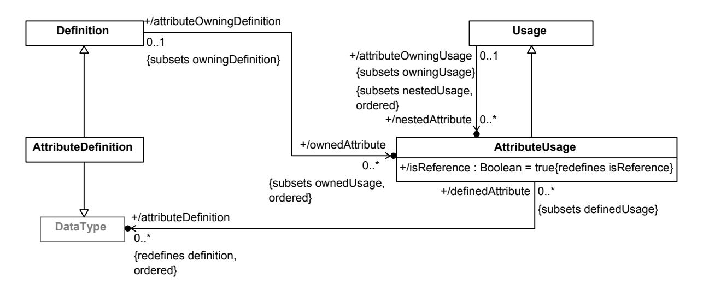

**Figure 10. Attribute Definition and Usage**

# <span id="page-309-2"></span>**8.3.7.2 AttributeDefinition**

# **Description**

An AttributeDefinition is a Definition and a DataType of information about a quality or characteristic of a system or part of a system that has no independent identity other than its value. All features of an AttributeDefinition must be referential (non-composite).

As a DataType, an AttributeDefinition must specialize, directly or indirectly, the base DataType *Base::DataValue* from the Kernel Semantic Library.

# **General Classes**

Definition DataType

# **Attributes**

None.

# **Operations**

None.

# **Constraints**

validateAttributeDefinitionFeatures

All features of an AttributeDefinition must be non-composite.

feature->forAll(not isComposite)

# <span id="page-310-0"></span>**8.3.7.3 AttributeUsage**

# **Description**

An AttributeUsage is a Usage whose type is a DataType. Nominally, if the type is an AttributeDefinition, an AttributeUsage is a usage of a AttributeDefinition to represent the value of some system quality or characteristic. However, other kinds of kernel DataTypes are also allowed, to permit use of DataTypes from the Kernel Model Libraries. An AttributeUsage itself as well as all its nested features must be referential (noncomposite).

An AttributeUsage must specialize, directly or indirectly, the base Feature *Base::dataValues* from the Kernel Semantic Library.

# **General Classes**

Usage

# **Attributes**

/attributeDefinition : DataType [0..\*] {redefines definition, ordered}

The DataTypes that are the types of this AttributeUsage. Nominally, these are AttributeDefinitions, but other kinds of kernel DataTypes are also allowed, to permit use of DataTypes from the Kernel Model Libraries.

/isReference : Boolean {redefines isReference}

Always true for an AttributeUsage.

# **Operations**

None.

# **Constraints**

checkAttributeUsageSpecialization

An AttributeUsage must directly or indirectly specialize *Base::dataValues* from the Kernel Semantic Library.

```
specializesFromLibrary('Base::dataValues')
```

validateAttributeUsageFeatures

All features of an AttributeUsage must be non-composite.

```
feature->forAll(not isComposite)
```

validateAttributeUsageIsReference

An AttributeUsage is always referential.

isReference

# <span id="page-311-0"></span>**8.3.8 Enumerations Abstract Syntax**

# **8.3.8.1 Overview**

<span id="page-311-3"></span><span id="page-311-1"></span>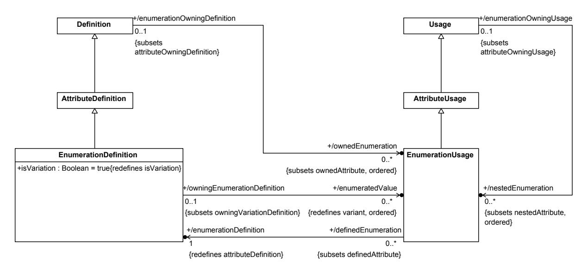

**Figure 11. Enumeration Definition and Usage**

# <span id="page-311-2"></span>**8.3.8.2 EnumerationDefinition**

# **Description**

An EnumerationDefinition is an AttributeDefinition all of whose instances are given by an explicit list of enumeratedValues. This is realized by requiring that the EnumerationDefinition have isVariation = true, with the enumeratedValues being its variants.

# **General Classes**

AttributeDefinition

# **Attributes**

/enumeratedValue : EnumerationUsage [0..\*] {redefines variant, ordered}

EnumerationUsages of this EnumerationDefinitionthat have distinct, fixed values. Each enumeratedValue specifies one of the allowed instances of the EnumerationDefinition.

isVariation : Boolean {redefines isVariation}

An EnumerationDefinition is considered semantically to be a variation whose allowed variants are its enumerationValues.

# **Operations**

None.

# **Constraints**

validateEnumerationDefinitionIsVariation

An EnumerationDefinition must be a variation.

isVariation

# <span id="page-312-0"></span>**8.3.8.3 EnumerationUsage**

# **Description**

An EnumerationUsage is an AttributeUsage whose attributeDefinition is an EnumerationDefinition.

# **General Classes**

AttributeUsage

# **Attributes**

/enumerationDefinition : EnumerationDefinition {redefines attributeDefinition}

The single EnumerationDefinition that is the type of this EnumerationUsage.

# **Operations**

None.

# **Constraints**

None.

# <span id="page-312-1"></span>**8.3.9 Occurrences Abstract Syntax**

# **8.3.9.1 Overview**

<span id="page-312-3"></span><span id="page-312-2"></span>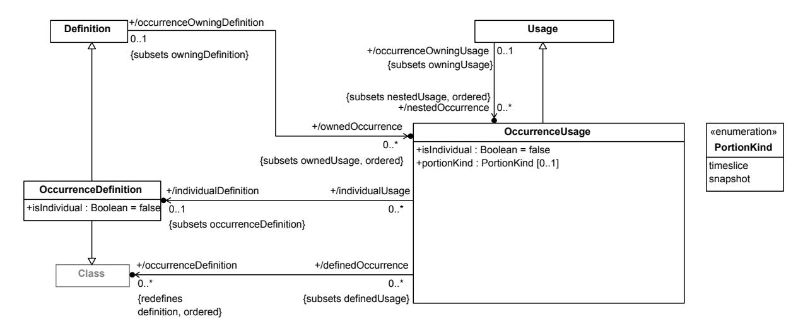

**Figure 12. Occurrence Definition and Usage**

<span id="page-313-1"></span>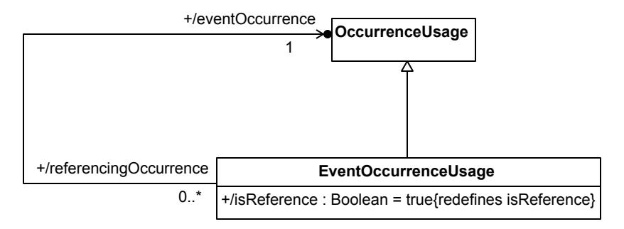

**Figure 13. Event Occurrences**

# <span id="page-313-0"></span>**8.3.9.2 EventOccurrenceUsage**

# **Description**

An EventOccurrenceUsage is an OccurrenceUsage that represents another OccurrenceUsage occurring as a *suboccurrence* of the containing occurrence of the EventOccurrenceUsage. Unless it is the EventOccurrenceUsage itself, the referenced OccurrenceUsage is related to the EventOccurrenceUsage by a ReferenceSubsetting Relationship.

If the EventOccurrenceUsage is owned by an OccurrenceDefinition or OccurrenceUsage, then it also subsets the *timeEnclosedOccurrences* property of the Class *Occurrence* from the Kernel Semantic Library model *Occurrences*.

# **General Classes**

OccurrenceUsage

# **Attributes**

/eventOccurrence : OccurrenceUsage

The OccurrenceUsage referenced as an event by this EventOccurrenceUsage. It is the referenceFeature of the ownedReferenceSubsetting for the EventOccurrenceUsage, if there is one, and, otherwise, the EventOccurrenceUsage itself.

/isReference : Boolean {redefines isReference}

Always true for an EventOccurrenceUsage.

# **Operations**

None.

# **Constraints**

checkEventOccurrenceUsageSpecialization

If an EventOccurrenceUsage has an owningType that is an OccurrenceDefinition or OccurrenceUsage, then it must directly or indirectly specialize the Feature

*Occurrences::Occurrence::timeEnclosedOccurrences*.

```
owningType <> null and
(owningType.oclIsKindOf(OccurrenceDefinition) or
```

```
owningType.oclIsKindOf(OccurrenceUsage)) implies
   specializesFromLibrary('Occurrences::Occurrence::timeEnclosedOccurrences')
```

# deriveEventOccurrenceUsageEventOccurrence

If an EventOccurrenceUsage has no ownedReferenceSubsetting, then its eventOccurrence is the EventOccurrenceUsage itself. Otherwise, the eventOccurrence is the featureTarget of the referencedFeature of the ownedReferenceSubsetting (which must be an OccurrenceUsage).

```
eventOccurrence =
    if referencedFeatureTarget() = null then self
    else if referencedFeatureTarget().oclIsKindOf(OccurrenceUsage) then
        referencedFeatureTarget().oclAsType(OccurrenceUsage)
    else null
    endif endif
```

# validateEventOccurrenceUsageIsReference

An EventOccurrenceUsage must be referential.

isReference

# validateEventOccurrenceUsageReference

If an EventOccurrenceUsage has an ownedReferenceSubsetting, then the featureTarget of the referencedFeature must be an OccurrenceUsage.

```
referencedFeatureTarget() <> null implies
    referencedFeatureTarget().oclIsKindOf(OccurrenceUsage)
```

# <span id="page-314-0"></span>**8.3.9.3 OccurrenceDefinition**

# **Description**

An OccurrenceDefinition is a Definition of a Class of individuals that have an independent life over time and potentially an extent over space. This includes both structural things and behaviors that act on such structures. If isIndividual is true, then the OccurrenceDefinition is constrained to have (at most) a single instance that is the entire life of a single individual.

# **General Classes**

Definition

Class

# **Attributes**

isIndividual : Boolean

Whether this OccurrenceDefinition is constrained to represent at most one thing.

# **Operations**

None.

# **Constraints**

checkOccurrenceDefinitionIndividualSpecialization

An OccurrenceDefinition with isIndividual = true must directly or indirectly specialize *Occurrences::Life* from the Kernel Semantic Library.

isIndividual implies specializesFromLibrary('Occurrences::Life')

checkOccurrenceDefinitionMultiplicitySpecialization

An OccurrenceDefinition with isIndividual = true must have a multiplicity that specializes *Base::zeroOrOne* from the Kernel Semantic Library.

```
isIndividual implies
    multiplicity <> null and
    multiplicity.specializesFromLibrary('Base::zeroOrOne')
```

# <span id="page-315-0"></span>**8.3.9.4 OccurrenceUsage**

# **Description**

An OccurrenceUsage is a Usage whose types are all Classes. Nominally, if a type is an OccurrenceDefinition, an OccurrenceUsage is a Usage of that OccurrenceDefinition within a system. However, other types of Kernel Classes are also allowed, to permit use of Classes from the Kernel Model Libraries.

# **General Classes**

Usage

# **Attributes**

/individualDefinition : OccurrenceDefinition [0..1] {subsets occurrenceDefinition}

The at most one occurrenceDefinition that has isIndividual = true.

isIndividual : Boolean

Whether this OccurrenceUsage represents the usage of the specific individual represented by its individualDefinition.

/occurrenceDefinition : Class [0..\*] {redefines definition, ordered}

The Classes that are the types of this OccurrenceUsage. Nominally, these are OccurrenceDefinitions, but other kinds of kernel Classes are also allowed, to permit use of Classes from the Kernel Model Libraries.

portionKind : PortionKind [0..1]

The kind of temporal portion (time slice or snapshot) is represented by this OccurrenceUsage. If portionKind is not null, then the owningType of the OccurrenceUsage must be non-null, and the OccurrenceUsage represents portions of the featuring instance of the owningType.

# **Operations**

None.

# **Constraints**

checkOccurrenceUsageSnapshotSpecialization

If an OccurrenceUsage has portionKind = snapshot, then it must directly or indirectly specialize *Occurrences::Occurrence::snapshots* from the Kernel Semantic Library.

```
portionKind = PortionKind::snapshot implies
    specializesFromLibrary('Occurrences::Occurrence::snapshots')
```

# checkOccurrenceUsageSpecialization

An OccurrenceUsage must directly or indirectly specialize *Occurrences::occurrences* from the Kernel Semantic Library.

```
specializesFromLibrary('Occurrences::occurrences')
```

# checkOccurrenceUsageSuboccurrenceSpecialization

A composite OccurrenceUsage, whose ownedType is a Class, another OccurrenceUsage, or any kind of Feature typed by a Class, must directly or indirectly specialize

*Occurrences::Occurrence::suboccurrences*

```
isComposite and
owningType <> null and
(owningType.oclIsKindOf(Class) or
 owningType.oclIsKindOf(OccurrenceUsage) or
 owningType.oclIsKindOf(Feature) and
    owningType.oclAsType(Feature).type->
        exists(oclIsKind(Class))) implies
    specializesFromLibrary('Occurrences::Occurrence::suboccurrences')
```

# checkOccurrenceUsageTimeSliceSpecialization

If an OccurrenceUsage has portionKind = timeslice, then it must directly or indirectly specialize *Occurrences::Occurrence::timeSlices* from the Kernel Semantic Library.

```
portionKind = PortionKind::timeslice implies
    specializesFromLibrary('Occurrences::Occurrence::timeSlices')
```

# deriveOccurrenceUsageIndividualDefinition

The individualDefinition of an OccurrenceUsage is the occurrenceDefinition that is an OccurrenceDefinition with isIndividual = true, if any.

```
individualDefinition =
    let individualDefinitions : OrderedSet(OccurrenceDefinition) =
        occurrenceDefinition->
            selectByKind(OccurrenceDefinition)->
            select(isIndividual) in
    if individualDefinitions->isEmpty() then null
    else individualDefinitions->first() endif
```

# validateOccurrenceUsageIndividualDefinition

An OccurrenceUsage must have at most one occurrenceDefinition with isIndividual = true.

```
occurrenceDefinition->
    selectByKind(OccurrenceDefinition)->
    select(isIndividual).size() <= 1
```

validateOccurrenceUsageIndividualUsage

If an OccurrenceUsage has isIndividual = true, then it must have an individualDefinition.

```
isIndividual implies individualDefinition <> null
```

# validateOccurrenceUsageIsPortion

If an OccurrenceUsage has a non-null portionKind, then it must have isPortion = true.

```
portionKind <> null implies isPortion
```

# validateOccurrenceUsagePortionKind

If an OccurrenceUsage has a non-null portionKind, then its owningType must be an OccurrenceDefinition or an OccurrenceUsage.

```
portionKind <> null implies
    owningType <> null and
    (owningType.oclIsKindOf(OccurrenceDefinition) or
     owningType.oclIsKindOf(OccurrenceUsage))
```

# <span id="page-317-0"></span>**8.3.9.5 PortionKind**

# **Description**

PortionKind is an enumeration of the specific kinds of *Occurrence* portions that can be represented by an OccurrenceUsage.

# **General Classes**

None.

# **Literal Values**

snapshot

A snapshot of an Occurrence (a time slice with zero duration).

timeslice

A time slice of an Occurrence (a portion over time).

# <span id="page-318-0"></span>**8.3.10 Items Abstract Syntax**

# **8.3.10.1 Overview**

<span id="page-318-3"></span><span id="page-318-1"></span>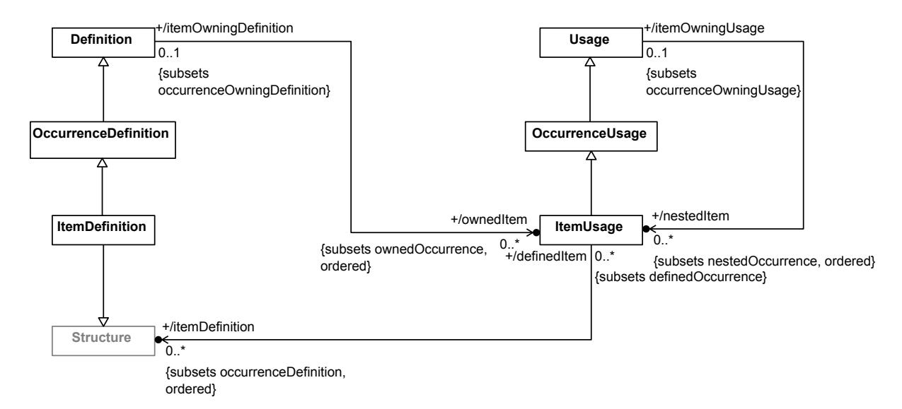

**Figure 14. Item Definition and Usage**

# <span id="page-318-2"></span>**8.3.10.2 ItemDefinition**

# **Description**

An ItemDefinition is an OccurrenceDefinition of the Structure of things that may themselves be systems or parts of systems, but may also be things that are acted on by a system or parts of a system, but which do not necessarily perform actions themselves. This includes items that can be exchanged between parts of a system, such as water or electrical signals.

# **General Classes**

Structure

OccurrenceDefinition

# **Attributes**

None.

# **Operations**

None.

# **Constraints**

checkItemDefinitionSpecialization

An ItemDefinition must directly or indirectly specialize the Systems Library Model ItemDefinition *Items::Item.*

specializesFromLibrary('Items::Item')

# <span id="page-319-0"></span>**8.3.10.3 ItemUsage**

# **Description**

An ItemUsage is a ItemUsage whose definition is a Structure. Nominally, if the definition is an ItemDefinition, an ItemUsage is a ItemUsage of that ItemDefinition within a system. However, other kinds of Kernel Structures are also allowed, to permit use of Structures from the Kernel Model Libraries.

# **General Classes**

OccurrenceUsage

# **Attributes**

/itemDefinition : Structure [0..\*] {subsets occurrenceDefinition, ordered}

The Structures that are the definitions of this ItemUsage. Nominally, these are ItemDefinitions, but other kinds of Kernel Structures are also allowed, to permit use of Structures from the Kernel Library.

# **Operations**

None.

# **Constraints**

# checkItemUsageSpecialization

An ItemUsage must directly or indirectly specialize the Systems Model Library ItemUsage *items*.

```
specializesFromLibrary('Items::items')
```

# checkItemUsageSubitemSpecialization

```
isComposite and owningType <> null and
(owningType.oclIsKindOf(ItemDefinition) or
 owningType.oclIsKindOf(ItemUsage)) implies
    specializesFromLibrary('Items::Item::subitem')
```

# deriveItemUsageItemDefinition

The itemDefinitions of an ItemUsage are those occurrenceDefinitions that are Structures.

```
itemDefinition = occurrenceDefinition->selectByKind(Structure)
```

# <span id="page-320-0"></span>**8.3.11 Parts Abstract Syntax**

# <span id="page-320-1"></span>**8.3.11.1 Overview**

<span id="page-320-4"></span>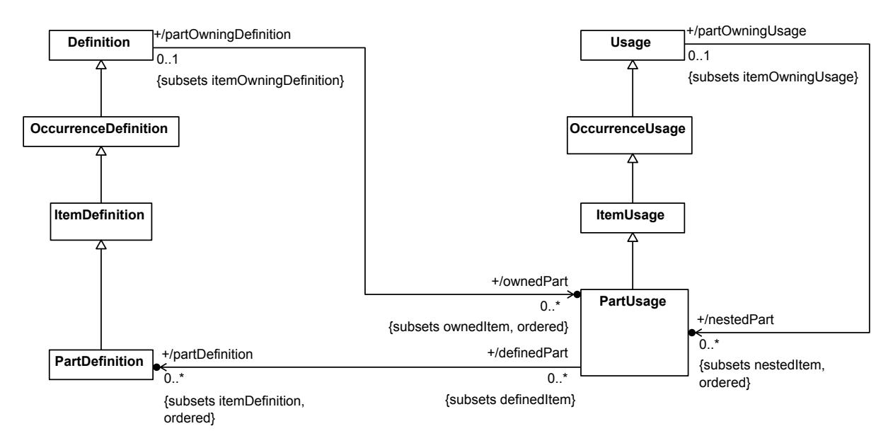

**Figure 15. Part Definition and Usage**

# <span id="page-320-2"></span>**8.3.11.2 PartDefinition**

# **Description**

A PartDefinition is an ItemDefinition of a Class of systems or parts of systems. Note that all parts may be considered items for certain purposes, but not all items are parts that can perform actions within a system.

# **General Classes**

ItemDefinition

# **Attributes**

None.

# **Operations**

None.

# **Constraints**

checkPartDefinitionSpecialization

A PartDefinition must directly or indirectly specialize the base PartDefinition *Parts::Part* from the Systems Model Library.

specializesFromLibrary('Parts::Part')

# <span id="page-320-3"></span>**8.3.11.3 PartUsage**

# **Description**

A PartUsage is a usage of a PartDefinition to represent a system or a part of a system. At least one of the itemDefinitions of the PartUsage must be a PartDefinition.

A PartUsage must subset, directly or indirectly, the base PartUsage *parts* from the Systems Model Library.

# **General Classes**

ItemUsage

# **Attributes**

/partDefinition : PartDefinition [0..\*] {subsets itemDefinition, ordered}

The itemDefinitions of this PartUsage that are PartDefinitions.

# **Operations**

None.

# **Constraints**

# checkPartUsageActorSpecialization

If a PartUsage is owned via an ActorMembership, then it must directly or indirectly specialize either *Requirements::RequirementCheck::actors* (if its owningType is a RequirementDefinition or RequirementUsage or *Cases::Case::actors* (otherwise).

```
owningFeatureMembership <> null and
owningFeatureMembership.oclIsKindOf(ActorMembership) implies
    if owningType.oclIsKindOf(RequirementDefinition) or
       owningType.oclIsKindOf(RequirementUsage)
    then specializesFromLibrary('Requirements::RequirementCheck::actors')
    else specializesFromLibrary('Cases::Case::actors')
```

# checkPartUsageSpecialization

A PartUsage must directly or indirectly specialize the PartUsage *Parts::parts* from the Systems Model Library.

```
specializesFromLibrary('Parts::parts')
```

# checkPartUsageStakeholderSpecialization

If a PartUsage is owned via a StakeholderMembership, then it must directly or indirectly specialize either *Requirements::RequirementCheck::stakeholders*.

```
owningFeatureMembership <> null and
owningFeatureMembership.oclIsKindOf(StakeholderMembership) implies
    specializesFromLibrary('Requirements::RequirementCheck::stakeholders')
```

# checkPartUsageSubpartSpecialization

A composite PartUsage whose owningType is a ItemDefinition or ItemUsage must directly or indirectly specialize the PartUsage *Items::Item::subparts* from the Systems Model Library.

```
isComposite and owningType <> null and
(owningType.oclIsKindOf(ItemDefinition) or
```

```
owningType.oclIsKindOf(ItemUsage)) implies
   specializesFromLibrary('Items::Item::subparts')
```

# derivePartUsagePartDefinition

The partDefinitions of an PartUsage are those itemDefinitions that are PartDefinitions.

itemDefinition->selectByKind(PartDefinition)

# validatePartUsagePartDefinition

At least one of the itemDefinitions of a PartUsage must be a PartDefinition.

partDefinition->notEmpty()

# <span id="page-322-0"></span>**8.3.12 Ports Abstract Syntax**

# <span id="page-322-1"></span>**8.3.12.1 Overview**

<span id="page-322-2"></span>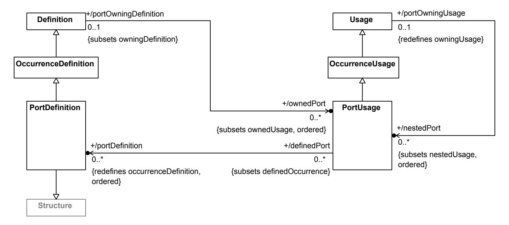

**Figure 16. Port Definition and Usage**

<span id="page-322-3"></span>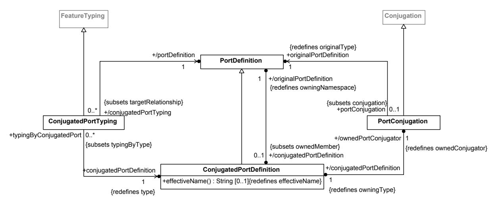

**Figure 17. Port Conjugation**

# <span id="page-323-0"></span>**8.3.12.2 ConjugatedPortDefinition**

# **Description**

A ConjugatedPortDefinition is a PortDefinition that is a PortDefinition of its original PortDefinition. That is, a ConjugatedPortDefinition inherits all the features of the original PortDefinition, but input flows of the original PortDefinition become outputs on the ConjugatedPortDefinition and output flows of the original PortDefinition become inputs on the ConjugatedPortDefinition. Every PortDefinition (that is not itself a ConjugatedPortDefinition) has exactly one corresponding ConjugatedPortDefinition, whose effective name is the name of the originalPortDefinition, with the character ~ prepended.

# **General Classes**

PortDefinition

# **Attributes**

/originalPortDefinition : PortDefinition {redefines owningNamespace}

The original PortDefinition for this ConjugatedPortDefinition, which is the owningNamespace of the ConjugatedPortDefinition.

/ownedPortConjugator : PortConjugation {redefines ownedConjugator}

The PortConjugation that is the ownedConjugator of this ConjugatedPortDefinition, linking it to its originalPortDefinition.

# **Operations**

effectiveName() : String [0..1] {redefines effectiveName}

If the name of the originalPortDefinition is non-empty, then return that with the character ~ prepended.

```
body: let originalName : String = originalPortDefinition.name in
if originalName = null then null
else '~' + originalName
endif
```

# **Constraints**

validateConjugatedPortDefinitionConjugatedPortDefinitionIsEmpty

A ConjugatedPortDefinition must not itself have a conjugatedPortDefinition

```
conjugatedPortDefinition = null
```

validateConjugatedPortDefinitionOriginalPortDefinition

The originalPortDefinition of the ownedPortConjugator of a ConjugatedPortDefinition must be the originalPortDefinition of the ConjugatedPortDefinition.

ownedPortConjugator.originalPortDefinition = originalPortDefinition

# <span id="page-323-1"></span>**8.3.12.3 ConjugatedPortTyping**

# **Description**

A ConjugatedPortTyping is a FeatureTyping whose type is a ConjugatedPortDefinition. (This relationship is intended to be an abstract-syntax marker for a special surface notation for conjugated typing of ports.)

# **General Classes**

FeatureTyping

# **Attributes**

conjugatedPortDefinition : ConjugatedPortDefinition {redefines type}

The type of this ConjugatedPortTyping considered as a FeatureTyping, which must be a ConjugatedPortDefinition.

/portDefinition : PortDefinition

The originalPortDefinition of the conjugatedPortDefinition of this ConjugatedPortTyping.

# **Operations**

None.

# **Constraints**

deriveConjugatedPortTypingPortDefinition

The portDefinition of a ConjugatedPortTyping is the originalPortDefinition of the conjugatedPortDefinition of the ConjugatedPortTyping.

portDefinition = conjugatedPortDefinition.originalPortDefinition

# <span id="page-324-0"></span>**8.3.12.4 PortConjugation**

# **Description**

A PortConjugation is a Conjugation Relationship between a PortDefinition and its corresponding ConjugatedPortDefinition. As a result of this Relationship, the ConjugatedPortDefinition inherits all the features of the original PortDefinition, but input flows of the original PortDefinition become outputs on the ConjugatedPortDefinition and output flows of the original PortDefinition become inputs on the ConjugatedPortDefinition.

# **General Classes**

Conjugation

# **Attributes**

/conjugatedPortDefinition : ConjugatedPortDefinition {redefines owningType}

The ConjugatedPortDefinition that is conjugate to the originalPortDefinition.

originalPortDefinition : PortDefinition {redefines originalType}

The PortDefinition being conjugated.

# **Operations**

None.

# **Constraints**

None.

# <span id="page-325-0"></span>**8.3.12.5 PortDefinition**

# **Description**

A PortDefinition defines a point at which external entities can connect to and interact with a system or part of a system. Any ownedUsages of a PortDefinition, other than PortUsages, must not be composite.

# **General Classes**

Structure

OccurrenceDefinition

# **Attributes**

/conjugatedPortDefinition : ConjugatedPortDefinition [0..1] {subsets ownedMember}

The that is conjugate to this PortDefinition.

# **Operations**

None.

# **Constraints**

# checkPortDefinitionSpecialization

A PortDefinition must directly or indirectly specialize the PortDefinition *Ports::Port* from the Systems Model Library.

```
specializesFromLibrary('Ports::Port')
```

# derivePortDefinitionConjugatedPortDefinition

The conjugatedPortDefinition of a PortDefinition is the ownedMember that is a ConjugatedPortDefinition.

```
conjugatedPortDefinition =
let conjugatedPortDefinitions : OrderedSet(ConjugatedPortDefinition) =
    ownedMember->selectByKind(ConjugatedPortDefinition) in
if conjugatedPortDefinitions->isEmpty() then null
else conjugatedPortDefinitions->first()
endif
```

# validatePortDefinitionConjugatedPortDefinition

Unless it is a ConjugatedPortDefinition, a PortDefinition must have exactly one ownedMember that is a ConjugatedPortDefinition.

```
not oclIsKindOf(ConjugatedPortDefinition) implies
    ownedMember->
```

```
selectByKind(ConjugatedPortDefinition)->
size() = 1
```

# validatePortDefinitionOwnedUsagesNotComposite

The ownedUsages of a PortDefinition that are not PortUsages must not be composite.

```
ownedUsage->
    reject(oclIsKindOf(PortUsage))->
    forAll(not isComposite)
```

# <span id="page-326-0"></span>**8.3.12.6 PortUsage**

# **Description**

A PortUsage is a usage of a PortDefinition. A PortUsage itself as well as all its nestedUsages must be referential (non-composite).

# **General Classes**

OccurrenceUsage

# **Attributes**

/portDefinition : PortDefinition [0..\*] {redefines occurrenceDefinition, ordered}

The occurrenceDefinitions of this PortUsage, which must all be PortDefinitions.

# **Operations**

None.

# **Constraints**

# checkPortUsageOwnedPortSpecialization

A PortUsage whose owningType is a PartDefinition or PartUsage must directly or indirectly specialize the PortUsage *Parts::Part::ownedPorts* from the Systems Model Library.

```
owningType <> null and
(owningType.oclIsKindOf(PartDefinition) or
 owningType.oclIsKindOf(PartUsage)) implies
    specializesFromLibrary('Parts::Part::ownedPorts')
```

# checkPortUsageSpecialization

A PortUsage must directly or indirectly specialize the PortUsage *Ports::ports* from the Systems Model Library.

```
specializesFromLibrary('Ports::ports')
```

# checkPortUsageSubportSpecialization

A composite PortUsage with an owningType that is a PortDefinition or PortUsage must directly or indirectly specialize the PortUsage *Ports::Port::subports* from the Systems Model Library.

```
isComposite and owningType <> null and
(owningType.oclIsKindOf(PortDefinition) or
```

```
owningType.oclIsKindOf(PortUsage)) implies
   specializesFromLibrary('Ports::Port::subports')
```

# validatePortUsageIsReference

Unless a PortUsage has an owningType that is a PortDefinition or a PortUsage, it must be referential (noncomposite).

```
owningType = null or
not owningType.oclIsKindOf(PortDefinition) and
not owningType.oclIsKindOf(PortUsage) implies
    isReference
```

# validatePortUsageNestedUsagesNotComposite

The nestedUsages of a PortUsage that are not themselves PortUsages must not be composite.

```
nestedUsage->
    reject(oclIsKindOf(PortUsage))->
    forAll(not isComposite)
```

# <span id="page-327-0"></span>**8.3.13 Connections Abstract Syntax**

# <span id="page-327-1"></span>**8.3.13.1 Overview**

<span id="page-327-2"></span>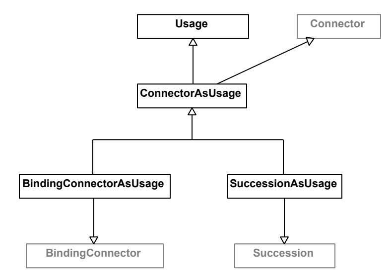

**Figure 18. Connectors as Usages**

<span id="page-328-2"></span>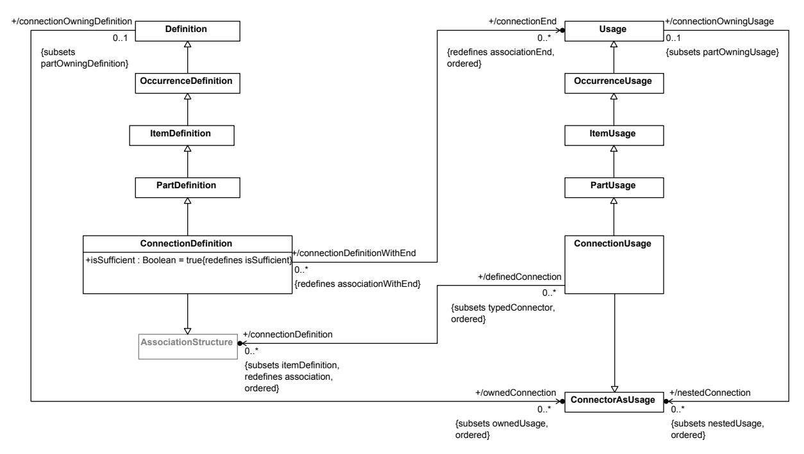

**Figure 19. Connection Definition and Usage**

# <span id="page-328-0"></span>**8.3.13.2 BindingConnectorAsUsage**

# **Description**

A BindingConnectorAsUsage is both a BindingConnector and a ConnectorAsUsage.

# **General Classes**

ConnectorAsUsage BindingConnector

# **Attributes**

None.

# **Operations**

None.

# **Constraints**

None.

# <span id="page-328-1"></span>**8.3.13.3 ConnectionDefinition**

# **Description**

A ConnectionDefinition is a PartDefinition that is also an AssociationStructure. The end Features of a ConnectionDefinition must be Usages.

# **General Classes**

# PartDefinition AssociationStructure

# **Attributes**

/connectionEnd : Usage [0..\*] {redefines associationEnd, ordered}

The Usages that define the things related by the ConnectionDefinition.

isSufficient : Boolean {redefines isSufficient}

A ConnectionDefinition always has isSufficient = true.

# **Operations**

None.

# **Constraints**

checkConnectionDefinitionBinarySpecialization

A binary ConnectionDefinition must directly or indirectly specialize the ConnectionDefinition *Connections::BinaryConnection* from the Systems Model Library.

```
ownedEndFeature->size() = 2 implies
    specializesFromLibrary('Connections::BinaryConnections')
```

# checkConnectionDefinitionSpecializations

A ConnectionDefinition must directly or indirectly specialize the ConnectionDefinition *Connections::Connection* from the Systems Model Library.

```
specializesFromLibrary('Connections::Connection')
```

# validateConnectionDefinitionIsSufficient

A ConnectionDefinition must have isSufficient = true.

isSufficient

# <span id="page-329-0"></span>**8.3.13.4 ConnectionUsage**

# **Description**

A ConnectionUsage is a ConnectorAsUsage that is also a PartUsage. Nominally, if its type is a ConnectionDefinition, then a ConnectionUsage is a Usage of that ConnectionDefinition, representing a connection between parts of a system. However, other kinds of kernel AssociationStructures are also allowed, to permit use of AssociationStructures from the Kernel Model Libraries.

# **General Classes**

PartUsage ConnectorAsUsage

# **Attributes**

/connectionDefinition : AssociationStructure [0..\*] {subsets itemDefinition, redefines association, ordered}

The AssociationStructures that are the types of this ConnectionUsage. Nominally, these are , but other kinds of Kernel AssociationStructures are also allowed, to permit use of AssociationStructures from the Kernel Model Libraries

# **Operations**

None.

# **Constraints**

checkConnectionUsageBinarySpecialization

A binary ConnectionUsage must directly or indirectly specialize the ConnectionUsage *Connections::binaryConnections* from the Systems Model Library.

```
ownedEndFeature->size() = 2 implies
    specializesFromLibrary('Connections::binaryConnections')
```

# checkConnectionUsageSpecialization

A ConnectionUsage must directly or indirectly specialize the ConnectionUsage *Connections::connections* from the Systems Model Library.

```
specializesFromLibrary('Connections::connections')
```

# <span id="page-330-0"></span>**8.3.13.5 ConnectorAsUsage**

# **Description**

A ConnectorAsUsage is both a Connector and a Usage. ConnectorAsUsage cannot itself be instantiated in a SysML model, but it is a base class for the concrete classes BindingConnectorAsUsage, SuccessionAsUsage, ConnectionUsage and FlowConnectionUsage.

# **General Classes**

Connector

Usage

# **Attributes**

None.

# **Operations**

None.

# **Constraints**

None.

# <span id="page-330-1"></span>**8.3.13.6 SuccessionAsUsage**

# **Description**

A SuccessionAsUsage is both a ConnectorAsUsage and a Succession.

# **General Classes**

Succession ConnectorAsUsage

# **Attributes**

None.

# **Operations**

None.

# **Constraints**

None.

# <span id="page-331-0"></span>**8.3.14 Interfaces Abstract Syntax**

# **8.3.14.1 Overview**

<span id="page-331-3"></span><span id="page-331-1"></span>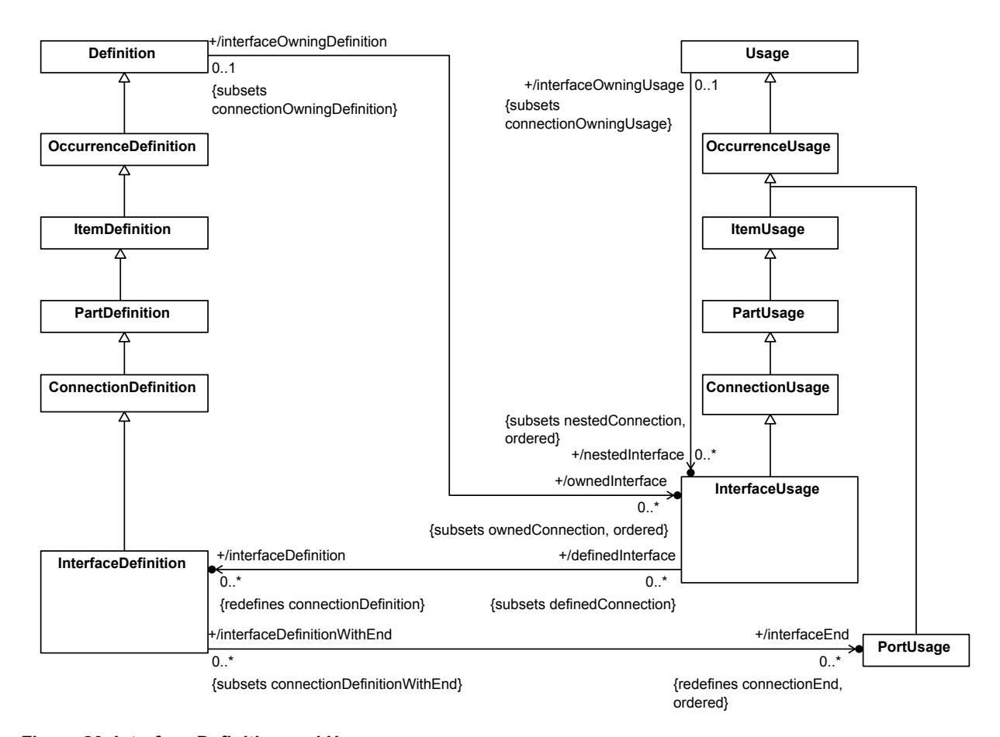

**Figure 20. Interface Definition and Usage**

# <span id="page-331-2"></span>**8.3.14.2 InterfaceDefinition**

# **Description**

An InterfaceDefinition is a ConnectionDefinition all of whose ends are PortUsages, defining an interface between elements that interact through such ports.

# **General Classes**

ConnectionDefinition

# **Attributes**

/interfaceEnd : PortUsage [0..\*] {redefines connectionEnd, ordered}

The PortUsages that are the connectionEnds of this InterfaceDefinition

# **Operations**

None.

# **Constraints**

checkInterfaceDefinitionBinarySpecialization

A binary InterfaceDefinition must directly or indirectly specialize the InterfaceDefinition *Interfaces::BinaryInterface* from the Systems Model Library.

```
ownedEndFeature->size() = 2 implies
    specializesFromLibrary('Interfaces::BinaryInterface')
```

checkInterfaceDefinitionSpecialization

An InterfaceDefinition must directly or indirectly specialize the InterfaceDefinition *Interfaces::Interface* from the Systems Model Library.

```
specializesFromLibrary('Interfaces::Interface')
```

# <span id="page-332-0"></span>**8.3.14.3 InterfaceUsage**

# **Description**

An InterfaceUsage is a Usage of an InterfaceDefinition to represent an interface connecting parts of a system through specific ports.

# **General Classes**

ConnectionUsage

# **Attributes**

/interfaceDefinition : InterfaceDefinition [0..\*] {redefines connectionDefinition}

The InterfaceDefinitions that type this InterfaceUsage.

# **Operations**

None.

# **Constraints**

checkInterfaceUsageBinarySpecialization

A binary InterfaceUsage must directly or indirectly specialize the InterfaceUsage *Interfaces::binaryInterfaces* from the Systems Model Library.

```
ownedEndFeature->size() = 2 implies
    specializesFromLibrary('Interfaces::binaryInterfaces')
```

checkInterfaceUsageSpecialization

An InterfaceUsage must directly or indirectly specialize the InterfaceUsage *Interfaces::interfaces* from the Systems Model Library.

specializesFromLibrary('Interfaces::interfaces')

# <span id="page-333-0"></span>**8.3.15 Allocations Abstract Syntax**

# **8.3.15.1 Overview**

<span id="page-333-3"></span><span id="page-333-1"></span>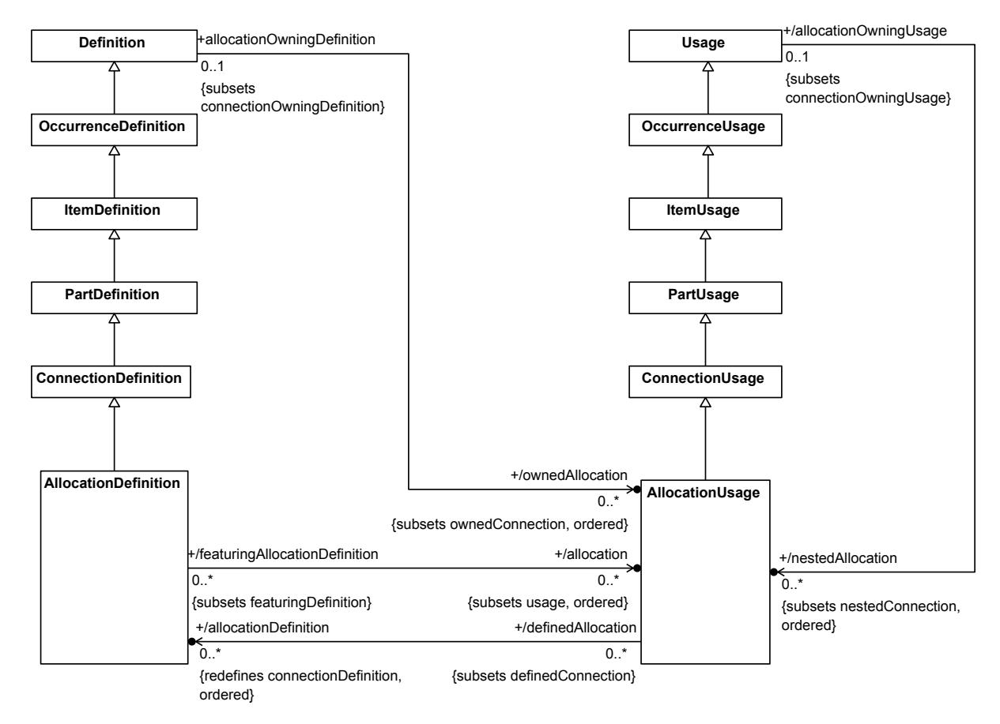

**Figure 21. Allocation Definition and Usage**

# <span id="page-333-2"></span>**8.3.15.2 AllocationDefinition**

# **Description**

An AllocationDefinition is a ConnectionDefinition that specifies that some or all of the responsibility to realize the intent of the source is allocated to the target instances. Such allocations define mappings across the various structures and hierarchies of a system model, perhaps as a precursor to more rigorous specifications and

implementations. An AllocationDefinition can itself be refined using nested allocations that give a finergrained decomposition of the containing allocation mapping.

# **General Classes**

ConnectionDefinition

# **Attributes**

/allocation : AllocationUsage [0..\*] {subsets usage, ordered}

The AllocationUsages that refine the allocation mapping defined by this AllocationDefinition.

# **Operations**

None.

# **Constraints**

checkAllocationDefinitionSpecialization

An AllocationDefinition must directly or indirectly specialize the AllocationDefinition *Allocations::Allocation* from the Systems Model Library.

specializesFromLibrary('Allocations::Allocation')

# deriveAllocationDefinitionAllocation

The allocations of an AllocationDefinition are all its usages that are AllocationUsages.

allocation = usage->selectAsKind(AllocationUsage)

# <span id="page-334-0"></span>**8.3.15.3 AllocationUsage**

# **Description**

An AllocationUsage is a usage of an AllocationDefinition asserting the allocation of the source feature to the target feature.

# **General Classes**

ConnectionUsage

# **Attributes**

/allocationDefinition : AllocationDefinition [0..\*] {redefines connectionDefinition, ordered}

The AllocationDefinitions that are the types of this AllocationUsage.

# **Operations**

None.

# **Constraints**

checkAllocationUsageSpecialization

An AllocationUsage must directly or indirectly specialize the AllocationUsage *Allocations::allocations* from the Systems Model Library.

specializesFromLibrary('Allocations::allocations')

# <span id="page-335-0"></span>**8.3.16 Flow Abstract Syntax**

# <span id="page-335-1"></span>**8.3.16.1 Overview**

<span id="page-335-3"></span>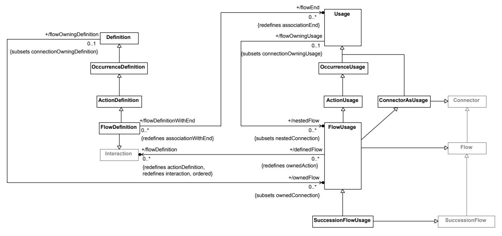

**Figure 22. Flows**

# <span id="page-335-2"></span>**8.3.16.2 FlowDefinition**

# **Description**

A FlowDefinition is an ActionDefinition that is also an Interaction (which is both a KerML Behavior and Association), representing flows between Usages.

# **General Classes**

ActionDefinition Interaction

# **Attributes**

/flowEnd : Usage [0..\*] {redefines associationEnd}

The Usages that define the things related by the FlowDefinition.

# **Operations**

None.

# **Constraints**

checkFlowDefinitionBinarySpecialization

A binary FlowDefinition must directly or indirectly specialize the base FlowDefinition *Flows::Message* from the Systems Model Library.

```
flowEnd->size() = 2 implies
    specializesFromLibrary('Flows::Message')
```

# checkFlowDefinitionSpecialization

A FlowDefinition must directly or indirectly specialize the base FlowDefinition *Flows::MessageAction* from the Systems Model Library.

```
specializesFromLibrary('Flows::MessageAction')
```

# validateFlowDefinitionFlowEnds

A FlowDefinition may not have more than two flowEnds.

```
flowEnd->size() <= 2
```

# <span id="page-336-0"></span>**8.3.16.3 FlowUsage**

# **Description**

A FlowUsage is an ActionUsage that is also a ConnectorAsUsage and a KerML Flow.

# **General Classes**

Flow ActionUsage ConnectorAsUsage

# **Attributes**

/flowDefinition : Interaction [0..\*] {redefines actionDefinition, interaction, ordered}

The Interactions that are the types of this FlowUsage. Nominally, these are FlowDefinitions, but other kinds of Kernel Interactions are also allowed, to permit use of Interactions from the Kernel Model Libraries.

# **Operations**

None.

# **Constraints**

checkFlowUsageFlowSpecialization

If a FlowUsage has ownedEndFeatures, it must directly or indirectly specialize the FlowUsage *Flows::flows* from the Systems Model Library.

```
ownedEndFeatures->notEmpty() implies
    specializesFromLibrary('Flows::flows')
```

# checkFlowUsageSpecialization

A FlowUsage must directly or indirectly specialize the base FlowUsage *Flows::messages* from the Systems Library model.

# <span id="page-337-0"></span>**8.3.16.4 SuccessionFlowUsage**

# **Description**

A SuccessionFlowUsage is a FlowUsage that is also a KerML SuccessionFlow.

# **General Classes**

FlowUsage SuccessionFlow

# **Attributes**

None.

# **Operations**

None.

# **Constraints**

checkSuccessionFlowUsageSpecialization

A SuccessionFlowUsage must directly or indirectly specialize the base FlowUsage *Flows::successionFlows* from the Systems Library model.

specializesFromLibrary('Flows::successionFlows')

# <span id="page-337-1"></span>**8.3.17 Actions Abstract Syntax**

# **8.3.17.1 Overview**

<span id="page-337-3"></span><span id="page-337-2"></span>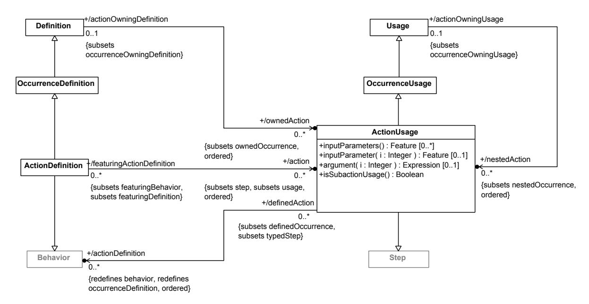

**Figure 23. Action Definition and Usage**

<span id="page-338-0"></span>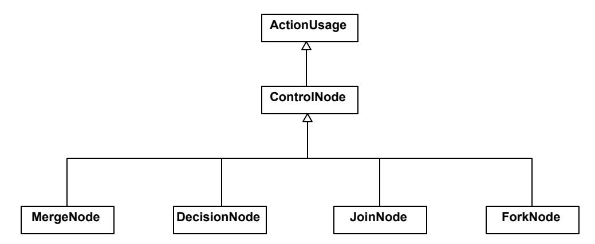

**Figure 24. Control Nodes**

<span id="page-338-1"></span>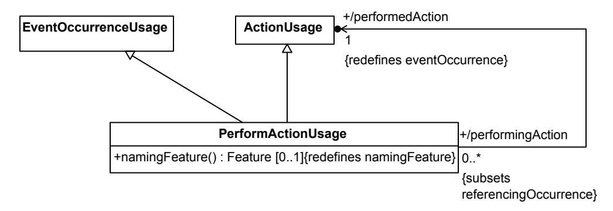

**Figure 25. Performed Actions**

<span id="page-339-0"></span>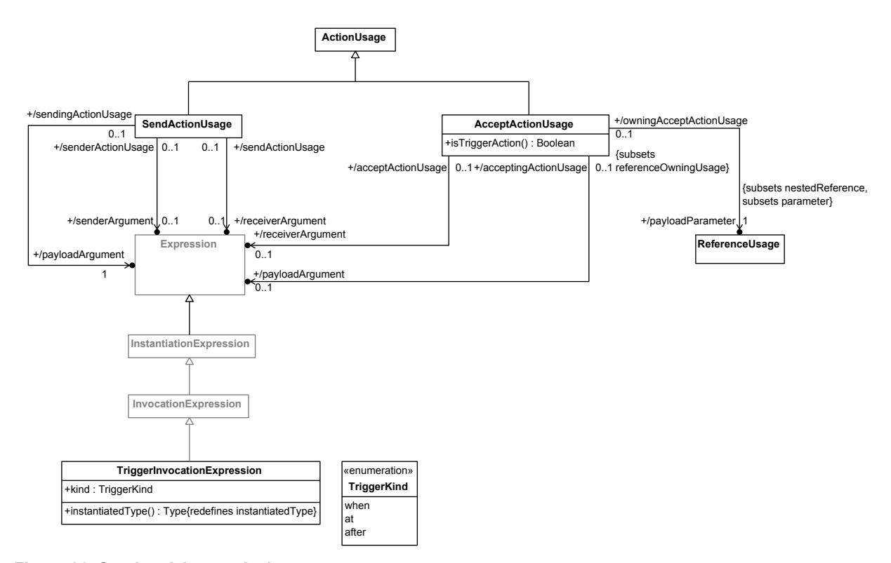

**Figure 26. Send and Accept Actions**

<span id="page-339-1"></span>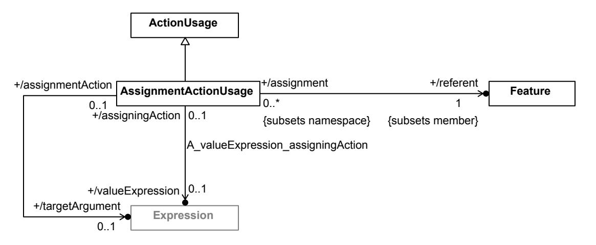

**Figure 27. Assignment Actions**

<span id="page-340-1"></span>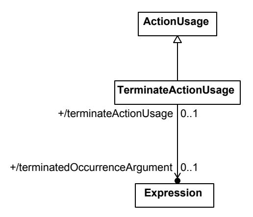

**Figure 28. Terminate Actions**

<span id="page-340-2"></span>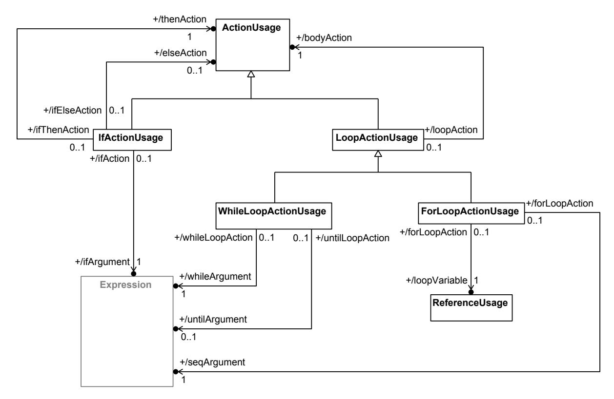

**Figure 29. Structured Control Actions**

# <span id="page-340-0"></span>**8.3.17.2 AcceptActionUsage**

# **Description**

An AcceptActionUsage is an ActionUsage that specifies the acceptance of an *incomingTransfer* from the *Occurrence* given by the result of its receiverArgument Expression. (If no receiverArgument is provided, the default is the *this* context of the AcceptActionUsage.) The payload of the accepted *Transfer* is output on its payloadParameter. Which *Transfers* may be accepted is determined by conformance to the typing and (potentially) binding of the payloadParameter.

# **General Classes**

# ActionUsage

# **Attributes**

```
/payloadArgument : Expression [0..1]
```

An Expression whose result is bound to the *payload* parameter of this AcceptActionUsage. If provided, the AcceptActionUsage will only accept a *Transfer* with exactly this *payload*.

/payloadParameter : ReferenceUsage {subsets nestedReference, parameter}

The nestedReference of this AcceptActionUsage that redefines the payload output parameter of the base AcceptActionUsage *AcceptAction* from the Systems Model Library.

```
/receiverArgument : Expression [0..1]
```

An Expression whose result is bound to the *receiver* input parameter of this AcceptActionUsage.

# **Operations**

```
isTriggerAction() : Boolean
```

Check if this AcceptActionUsage is the triggerAction of a TransitionUsage.

```
body: owningType <> null and
owningType.oclIsKindOf(TransitionUsage) and
owningType.oclAsType(TransitionUsage).triggerAction->includes(self)
```

# **Constraints**

checkAcceptActionUsageReceiverBindingConnector

If the payloadArgument of an AcceptActionUsage is a TriggerInvocationExpression, then the AcceptActionusage must have an ownedFeature that is a BindingConnector between its *receiver* parameter and the *receiver* parameter of the TriggerInvocationExpression.

```
payloadArgument <> null and
payloadArgument.oclIsKindOf(TriggerInvocationExpression) implies
    let invocation : Expression =
        payloadArgument.oclAsType(Expression) in
    parameter->size() >= 2 and
    invocation.parameter->size() >= 2 and
    ownedFeature->selectByKind(BindingConnector)->exists(b |
        b.relatedFeatures->includes(parameter->at(2)) and
        b.relatedFeatures->includes(invocation.parameter->at(2)))
```

# checkAcceptActionUsageSpecialization

An AcceptActionUsage that is not the triggerAction of a TransitionUsage must directly or indirectly specialize the ActionUsage *Actions::acceptActions* from the Systems Model Library.

```
not isTriggerAction() implies
    specializesFromLibrary('Actions::acceptActions')
```

checkAcceptActionUsageSubactionSpecialization

A composite AcceptActionUsage that is a subaction usage, but is *not* the triggerAction of a TransitionUsage, must directly or indirectly specialize the ActionUsage *Actions::Action::acceptSubactions* from the Systems Model Library.

```
isSubactionUsage() and not isTriggerAction() implies
    specializesFromLibrary('Actions::Action::acceptSubactions')
```

# checkAcceptActionUsageTriggerActionSpecialization

An AcceptActionUsage that is the triggerAction of TransitionUsage must directly or indirectly specialize the ActionUsage *Actions::TransitionAction::accepter* from the Systems Model Library.

```
isTriggerAction() implies
    specializesFromLibrary('Actions::TransitionAction::accepter')
```

# deriveAcceptActionUsagePayloadArgument

The payloadArgument of an AcceptUsageAction is its first argument Expression.

```
payloadArgument = argument(1)
```

# deriveAcceptActionUsagePayloadParameter

The payloadParameter of an AcceptActionUsage is its first parameter.

```
payloadParameter =
 if parameter->isEmpty() then null
 else parameter->first() endif
```

# deriveAcceptActionUsageReceiverArgument

The receiverArgument of an AcceptUsageAction is its second argument Expression.

```
receiverArgument = argument(2)
```

# validateAcceptActionUsageParameters

An AcceptUsageAction must have at least two input parameters, corresponding to its *payload* and *receiver, respectively (even if they have no FeatureValue). (Note that the payloadParameter is an input as well as an output.)*

```
inputParameters()->size() >= 2
```

# <span id="page-342-0"></span>**8.3.17.3 ActionDefinition**

# **Description**

An ActionDefinition is a Definition that is also a Behavior that defines an *Action* performed by a system or part of a system.

# **General Classes**

Behavior

OccurrenceDefinition

# **Attributes**

/action : ActionUsage [0..\*] {subsets step, usage, ordered}

The ActionUsages that are steps in this ActionDefinition, which define the actions that specify the behavior of the ActionDefinition.

# **Operations**

None.

# **Constraints**

checkActionDefinitionSpecialization

An ActionDefinition must directly or indirectly specialize the ActionDefinition *Actions::Action* from the Systems Model Library.

```
specializesFromLibrary('Actions::Action')
```

# deriveActionDefinitionAction

The actions of a ActionDefinition are those of its usages that are ActionUsages.

```
action = usage->selectByKind(ActionUsage)
```

# <span id="page-343-0"></span>**8.3.17.4 ActionUsage**

# **Description**

An ActionUsage is a Usage that is also a Step, and, so, is typed by a Behavior. Nominally, if the type is an ActionDefinition, an ActionUsage is a Usage of that ActionDefinition within a system. However, other kinds of kernel Behaviors are also allowed, to permit use of Behaviors from the Kernel Model Libraries.

# **General Classes**

Step

OccurrenceUsage

# **Attributes**

/actionDefinition : Behavior [0..\*] {redefines behavior, occurrenceDefinition, ordered}

The Behaviors that are the types of this ActionUsage. Nominally, these would be ActionDefinitions, but other kinds of Kernel Behaviors are also allowed, to permit use of Behaviors from the Kernel Model Libraries.

# **Operations**

```
argument(i : Integer) : Expression [0..1]
```

Return the i-th argument Expression of an ActionUsage, defined as the value Expression of the FeatureValue of the i-th owned input parameter of the ActionUsage. Return null if the ActionUsage has less than i owned input parameters or the i-th owned input parameter has no FeatureValue.

```
body: if inputParameter(i) = null then null
else
    let featureValue : Sequence(FeatureValue) = inputParameter(i).
        ownedMembership->select(oclIsKindOf(FeatureValue)) in
    if featureValue->isEmpty() then null
```

```
else featureValue->at(1).value
    endif
endif
```

inputParameter(i : Integer) : Feature [0..1]

Return the i-th owned input parameter of the ActionUsage. Return null if the ActionUsage has less than i owned input parameters.

```
body: if inputParameters()->size() < i then null
else inputParameters()->at(i)
endif
```

inputParameters() : Feature [0..\*]

Return the owned input parameters of this ActionUsage.

```
body: input->select(f | f.owner = self)
```

isSubactionUsage() : Boolean

Check if this ActionUsage is composite and has an owningType that is an ActionDefinition or ActionUsage but is *not* the entryAction or exitAction of a StateDefinition or StateUsage. If so, then it represents an *Action* that is a *subaction* of another *Action*.

```
body: isComposite and owningType <> null and
(owningType.oclIsKindOf(ActionDefinition) or
 owningType.oclIsKindOf(ActionUsage)) and
(owningFeatureMembership.oclIsKindOf(StateSubactionMembership) implies
 owningFeatureMembership.oclAsType(StateSubactionMembership).kind =
    StateSubactionKind::do)
```

# **Constraints**

checkActionUsageOwnedActionSpecialization

A composite ActionUsage whose owningType is PartDefinition or PartUsage must directly or indirectly specialize the ActionUsage *Parts::Part::ownedActions* from the Systems Model Library.

```
isComposite and owningType <> null and
(owningType.oclIsKindOf(PartDefinition) or
 owningType.oclIsKindOf(PartUsage)) implies
    specializesFromLibrary('Parts::Part::ownedActions')
```

checkActionUsageSpecialization

An ActionUsage must directly or indirectly specialize the ActionUsage *Actions::actions* from the Systems Model Library.

```
specializesFromLibrary('Actions::actions')
```

checkActionUsageStateActionRedefinition

An ActionUsage that is the *entry*, *do*, or *exit Action* of a StateDefinition or StateUsage must redefine the entryAction, doAction, or exitAction feature, respectively, of the StateDefinition *States::StateAction* from the Systems Model Library.

```
owningFeatureMembership <> null and
owningFeatureMembership.oclIsKindOf(StateSubactionMembership) implies
    let kind : StateSubactionKind =
        owningFeatureMembership.oclAsType(StateSubactionMembership).kind in
    if kind = StateSubactionKind::entry then
        redefinesFromLibrary('States::StateAction::entryAction')
    else if kind = StateSubactionKind::do then
        redefinesFromLibrary('States::StateAction::doAction')
    else
        redefinesFromLibrary('States::StateAction::exitAction')
    endif endif
```

# checkActionUsageSubactionSpecialization

A composite ActionUsage that is a subaction usage must directly or indirectly specialize the ActionUsage *Actions::Action::subactions* from the Systems Model Library.

```
isSubactionUsage() implies
    specializesFromLibrary('Actions::Action::subactions')
```

# <span id="page-345-0"></span>**8.3.17.5 AssignmentActionUsage**

# **Description**

An AssignmentActionUsage is an ActionUsage that is defined, directly or indirectly, by the ActionDefinition *AssignmentAction* from the Systems Model Library. It specifies that the value of the referent Feature, relative to the target given by the result of the targetArgument Expression, should be set to the result of the valueExpression.

# **General Classes**

ActionUsage

# **Attributes**

/referent : Feature {subsets member}

The Feature whose value is to be set.

/targetArgument : Expression [0..1]

The Expression whose value is an occurrence in the domain of the referent Feature, for which the value of the referent will be set to the result of the valueExpression by this AssignmentActionUsage.

/valueExpression : Expression [0..1]

The Expression whose result is to be assigned to the referent Feature.

# **Operations**

None.

# **Constraints**

checkAssignmentActionUsageAccessedFeatureRedefinition

The first ownedFeature of the first ownedFeature of the first parameter of an AssignmentActionUsage must redefine *AssignmentAction::target::startingAt::accessedFeature*.

```
let targetParameter : Feature = inputParameter(1) in
targetParameter <> null and
targetParameter.ownedFeature->notEmpty() and
targetParameter->first().ownedFeature->notEmpty() and
targetParameter->first().ownedFeature->first().
    redefines('AssigmentAction::target::startingAt::accessedFeature')
```

# checkAssignmentActionUsageReferentRedefinition

The first ownedFeature of the first ownedFeature of the first parameter of an AssignmentActionUsage must redefine the referent of the AssignmentActionUsage.

```
let targetParameter : Feature = inputParameter(1) in
targetParameter <> null and
targetParameter.ownedFeature->notEmpty() and
targetParameter->first().ownedFeature->notEmpty() and
targetParameter->first().ownedFeature->first().redefines(referent)
```

# checkAssignmentActionUsageSpecialization

An AssignmentActionUsage must directly or indirectly specialize the ActionUsage *Actions::assignmentActions* from the Systems Model Library.

```
specializesFromLibrary('Actions::assignmentActions')
```

# checkAssignmentActionUsageStartingAtRedefinition

The first ownedFeature of the first parameter of an AssignmentActionUsage must redefine *AssignmentAction::target::startingAt*.

```
let targetParameter : Feature = inputParameter(1) in
targetParameter <> null and
targetParameter.ownedFeature->notEmpty() and
targetParameter.ownedFeature->first().
    redefines('AssignmentAction::target::startingAt')
```

# checkAssignmentActionUsageSubactionSpecialization

A composite AssignmentActionUsage that is a subaction usage must directly or indirectly specialize the ActionUsage *Actions::Action::assignments* from the Systems Model Library.

```
isSubactionUsage() implies
    specializesFromLibrary('Actions::Action::assignments')
```

# deriveAssignmentActionUsageReferent

The referent of an AssignmentActionUsage is the first Feature that is the memberElement of a ownedMembership that is not a FeatureMembership.

```
referent =
    let unownedFeatures : Sequence(Feature) = ownedMembership->
        reject(oclIsKindOf(FeatureMembership)).memberElement->
        selectByKind(Feature) in
    if unownedFeatures->isEmpty() then null
    else unownedFeatures->first().oclAsType(Feature)
    endif
```

# deriveAssignmentActionUsageValueExpression

The valueExpression of a AssignmentActionUsage is its second argument Expression.

```
valueExpression = argument(2)
```

# deriveAssignmentUsageTargetArgument

The targetArgument of a AssignmentActionUsage is its first argument Expression.

```
targetArgument = argument(1)
```

# validateAssignmentActionUsage

The featureTarget of the referent of an AssignmentActionUsage must be able to have time-varying values.

```
referent <> null implies referent.featureTarget.mayTimeVary
```

# validateAssignmentActionUsageReferent

An AssignmentActionUsage must have an ownedMembership that is not an OwningMembership and whose memberElement is a Feature.

```
ownedMembership->exists(
    not oclIsKindOf(OwningMembership) and
    memberElement.oclIsKindOf(Feature))
```

# <span id="page-347-0"></span>**8.3.17.6 ControlNode**

# **Description**

A ControlNode is an ActionUsage that does not have any inherent behavior but provides constraints on incoming and outgoing Successions that are used to control other Actions. A ControlNode must be a composite owned usage of an ActionDefinition or ActionUsage.

# **General Classes**

ActionUsage

# **Attributes**

None.

# **Operations**

multiplicityHasBounds(mult : Multiplicity, lower : Integer, upper : UnlimitedNatural) : Boolean

Check that the given Multiplicity has lowerBound and upperBound expressions that are model-level evaluable to the given lower and upper values.

```
body: mult <> null and
if mult.oclIsKindOf(MultiplicityRange) then
    mult.oclAsType(MultiplicityRange).hasBounds(lower, upper)
else
    mult.allSuperTypes()->exists(
        oclisKindOf(MultiplicityRange) and
        oclAsType(MultiplicityRange).hasBounds(lower, upper)
endif
```

# **Constraints**

# checkControlNodeSpecialization

A ControlNode must directly or indirectly specialize the ActionUsage *Actions::Action::control* from the Systems Model Library.

```
specializesFromLibrary('Action::Action::controls')
```

# validateControlNodeIncomingSuccessions

All incoming Successions to a ControlNode must have a target multiplicity of 1..1.

```
targetConnector->selectByKind(Succession)->
    collect(connectorEnd->at(2).multiplicity)->
    forAll(targetMult |
        multiplicityHasBounds(targetMult, 1, 1))
```

# validateControlNodeIsComposite

A ControlNode must be composite.

```
isComposite
```

# validateControlNodeOutgoingSuccessions

All outgoing Successions from a ControlNode must have a source multiplicity of 1..1.

```
sourceConnector->selectByKind(Succession)->
    collect(connectorEnd->at(1).multiplicity)->
    forAll(sourceMult |
        multiplicityHasBounds(sourceMult, 1, 1))
```

# validateControlNodeOwningType

The owningType of a ControlNode must be an ActionDefinition or ActionUsage.

```
owningType <> null and
(owningType.oclIsKindOf(ActionDefinition) or
 owningType.oclIsKindOf(ActionUsage))
```

# <span id="page-348-0"></span>**8.3.17.7 DecisionNode**

# **Description**

A DecisionNode is a ControlNode that makes a selection from its outgoing Successions.

# **General Classes**

ControlNode

# **Attributes**

None.

# **Operations**

None.

# **Constraints**

# checkDecisionNodeOutgoingSuccessionSpecialization

All outgoing Successions from a DecisionNode must subset the inherited *outgoingHBLink* feature of the DecisionNode.

```
sourceConnector->selectByKind(Succession)->
    forAll(subsetsChain(self,
        resolveGlobal('ControlPerformances::MergePerformance::outgoingHBLink')))
```

# checkDecisionNodeSpecialization

A DecisionNode must directly or indirectly specialize the ActionUsage *Actions::Action::decisions* from the Systems Model Library.

```
specializesFromLibrary('Actions::Action::decisions')
```

validateDecisionNodeIncomingSuccessions

A DecisionNode may have at most one incoming Succession.

```
targetConnector->selectByKind(Succession)->size() <= 1
```

# validateDecisionNodeOutgoingSuccessions

All outgoing Successions from a DecisionNode must have a target multiplicity of 0..1.

```
sourceConnector->selectAsKind(Succession)->
    collect(connectorEnd->at(2))->
    forAll(targetMult |
        multiplicityHasBounds(targetMult, 0, 1))
```

# <span id="page-349-0"></span>**8.3.17.8 ForkNode**

# **Description**

A ForkNode is a ControlNode that must be followed by successor Actions as given by all its outgoing Successions.

# **General Classes**

ControlNode

# **Attributes**

None.

# **Operations**

None.

# **Constraints**

# checkForkNodeSpecialization

A ForkNode must directly or indirectly specialize the ActionUsage *Actions::Action::forks* from the Systems Model Library.

```
specializesFromLibrary('Actions::Action::forks')
```

validateForkNodeIncomingSuccessions

A ForkNode may have at most one incoming Succession.

```
targetConnector->selectByKind(Succession)->size() <= 1
```

# <span id="page-350-0"></span>**8.3.17.9 ForLoopActionUsage**

# **Description**

A ForLoopActionUsage is a LoopActionUsage that specifies that its bodyAction ActionUsage should be performed once for each value, in order, from the sequence of values obtained as the result of the seqArgument Expression, with the loopVariable set to the value for each iteration.

# **General Classes**

LoopActionUsage

# **Attributes**

/loopVariable : ReferenceUsage

The ownedFeature of this ForLoopActionUsage that acts as the loop variable, which is assigned the successive values of the input sequence on each iteration. It is the ownedFeature that redefines *ForLoopAction::var*.

/seqArgument : Expression

The Expression whose result provides the sequence of values to which the loopVariable is set for each iterative performance of the bodyAction. It is the Expression whose result is bound to the *seq* input parameter of this ForLoopActionUsage.

# **Operations**

None.

# **Constraints**

checkForLoopActionUsageSpecialization

A ForLoopActionUsage must directly or indirectly specialize the ActionUsage *Actions::forLoopActions* from the Systems Model Library.

```
specializesFromLibrary('Actions::forLoopActions')
```

checkForLoopActionUsageSubactionSpecialization

A composite ForLoopActionUsage that is a subaction usage must directly or indirectly specialize the ActionUsage *Actions::Action::forLoops* from the Systems Model Library.

```
isSubactionUsage() implies
    specializesFromLibrary('Actions::Action::forLoops')
```

checkForLoopActionUsageVarRedefinition

The loopVariable of a ForLoopActionUsage must redefine the ActionUsage *Actions::ForLoopAction::var*.

```
loopVariable <> null and
loopVariable.redefinesFromLibrary('Actions::ForLoopAction::var')
```

# deriveForLoopActionUsageLoopVariable

The loopVariable of a ForLoopActionUsage is its first ownedFeature, which must be a ReferenceUsage.

```
loopVariable =
    if ownedFeature->isEmpty() or
        not ownedFeature->first().oclIsKindOf(ReferenceUsage) then
        null
    else
        ownedFeature->first().oclAsType(ReferenceUsage)
    endif
```

# deriveForLoopActionUsageSeqArgument

The seqArgument of a ForLoopActionUsage is its first argument Expression.

```
seqArgument = argument(1)
```

# validateForLoopActionUsageLoopVariable

The first ownedFeature of a ForLoopActionUsage must be a ReferenceUsage.

```
ownedFeature->notEmpty() and
ownedFeature->at(1).oclIsKindOf(ReferenceUsage)
```

# validateForLoopActionUsageParameters

A ForLoopActionUsage must have two owned input parameters.

```
inputParameters()->size() = 2
```

# <span id="page-351-0"></span>**8.3.17.10 IfActionUsage**

# **Description**

An IfActionUsage is an ActionUsage that specifies that the thenAction ActionUsage should be performed if the result of the ifArgument Expression is true. It may also optionally specify an elseAction ActionUsage that is performed if the result of the ifArgument is false.

# **General Classes**

ActionUsage

# **Attributes**

```
/elseAction : ActionUsage [0..1]
```

The ActionUsage that is to be performed if the result of the ifArgument is false. It is the (optional) third parameter of the IfActionUsage.

```
/ifArgument : Expression
```

The Expression whose result determines whether the thenAction or (optionally) the elseAction is performed. It is the first parameter of the IfActionUsage.

/thenAction : ActionUsage

The ActionUsage that is to be performed if the result of the ifArgument is true. It is the second parameter of the IfActionUsage.

# **Operations**

None.

# **Constraints**

# checkIfActionUsageSpecialization

A IfActionUsage must directly or indirectly specialize the ActionUsage *Actions::ifThenActions* from the Systems Model Library. If it has an elseAction, then it must directly or indirectly specialize

*Actions::ifThenElseActions*

```
if elseAction = null then
    specializesFromLibrary('Actions::ifThenActions')
else
    specializesFromLibrary('Actions::ifThenElseActions')
endif
```

# checkIfActionUsageSubactionSpecialization

A composite IfActionUsage that is a subaction usage must directly or indirectly specialize the ActionUsage *Actions::Action::ifSubactions* from the Systems Model Library.

```
isSubactionUsage() implies
    specializesFromLibrary('Actions::Action::ifSubactions')
```

# deriveIfActionUsageElseAction

The elseAction of an ifActionUsage is its third parameter, if there is one, which must then be an ActionUsage.

```
elseAction =
    let parameter : Feature = inputParameter(3) in
    if parameter <> null and parameter.oclIsKindOf(ActionUsage) then
        parameter.oclAsType(ActionUsage)
    else
        null
    endif
```

# deriveIfActionUsageIfArgument

The ifArgument of an ifActionUsage is its first parameter, which must be an Expression.

```
ifArgument =
    let parameter : Feature = inputParameter(1) in
    if parameter <> null and parameter.oclIsKindOf(Expression) then
        parameter.oclAsType(Expression)
    else
        null
    endif
```

# deriveIfActionUsageThenAction

The thenAction of an ifActionUsage is its second parameter, which must be an ActionUsage.

```
thenAction =
    let parameter : Feature = inputParameter(2) in
    if parameter <> null and parameter.oclIsKindOf(ActionUsage) then
        parameter.oclAsType(ActionUsage)
    else
        null
    endif
```

# validateIfActionUsageParameters

An IfActionUsage must have at least two owned input parameters.

```
inputParameters()->size() >= 2
```

# <span id="page-353-0"></span>**8.3.17.11 JoinNode**

# **Description**

A JoinNode is a ControlNode that waits for the completion of all the predecessor Actions given by incoming Successions.

# **General Classes**

ControlNode

# **Attributes**

None.

# **Operations**

None.

# **Constraints**

checkJoinNodeSpecialization

A JoinNode must directly or indirectly specialize the ActionUsage *Actions::Action::joins* from the Systems Model Library.

```
specializesFromLibrary('Actions::Action::join')
```

validateJoinNodeOutgoingSuccessions

A JoinNode may have at most one outgoing Succession.

```
sourceConnector->selectByKind(Succession)->size() <= 1
```

# <span id="page-353-1"></span>**8.3.17.12 LoopActionUsage**

# **Description**

A LoopActionUsage is an ActionUsage that specifies that its bodyAction should be performed repeatedly. Its subclasses WhileLoopActionUsage and ForLoopActionUsage provide different ways to determine how many times the bodyAction should be performed.

# **General Classes**

ActionUsage

# **Attributes**

/bodyAction : ActionUsage

The ActionUsage to be performed repeatedly by the LoopActionUsage. It is the second parameter of the LoopActionUsage.

# **Operations**

None.

# **Constraints**

deriveLoopActionUsageBodyAction

The bodyAction of a LoopActionUsage is its second input parameter, which must be an Action.

```
bodyAction =
    let parameter : Feature = inputParameter(2) in
    if parameter <> null and parameter.oclIsKindOf(Action) then
        parameter.oclAsType(Action)
    else
        null
    endif
```

# <span id="page-354-0"></span>**8.3.17.13 MergeNode**

# **Description**

A MergeNode is a ControlNode that asserts the merging of its incoming Successions. A MergeNode may have at most one outgoing Successions.

# **General Classes**

ControlNode

# **Attributes**

None.

# **Operations**

None.

# **Constraints**

checkMergeNodeIncomingSuccessionSpecialization

All incoming Successions to a MergeNode must subset the inherited *incomingHBLink* feature of the MergeNode.

```
targetConnector->selectByKind(Succession)->
    forAll(subsetsChain(self,
        resolveGlobal('ControlPerformances::MergePerformance::incomingHBLink')))
```

# checkMergeNodeSpecialization

A MergeNode must directly or indirectly specialize the ActionUsage *Actions::Action::merges* from the Systems Model Library.

```
specializesFromLibrary('Actions::Action::merges')
```

validateMergeNodeIncomingSuccessions

All incoming Successions to a MergeNode must have a source multiplicity of 0..1.

```
targetConnector->selectByKind(Succession)->
    collect(connectorEnd->at(1))->
    forAll(sourceMult |
        multiplicityHasBounds(sourceMult, 0, 1))
```

validateMergeNodeOutgoingSuccessions

A MergeNode may have at most one outgoing Succession.

```
sourceConnector->selectAsKind(Succession)->size() <= 1
```

# <span id="page-355-0"></span>**8.3.17.14 PerformActionUsage**

# **Description**

A PerformActionUsage is an ActionUsage that represents the performance of an ActionUsage. Unless it is the PerformActionUsage itself, the ActionUsage to be performed is related to the PerformActionUsage by a ReferenceSubsetting relationship. A PerformActionUsage is also an EventOccurrenceUsage, with its performedAction as the eventOccurrence.

# **General Classes**

ActionUsage EventOccurrenceUsage

# **Attributes**

/performedAction : ActionUsage {redefines eventOccurrence}

The ActionUsage to be performed by this PerformedActionUsage. It is the eventOccurrence of the PerformActionUsage considered as an EventOccurrenceUsage, which must be an ActionUsage.

# **Operations**

```
namingFeature() : Feature [0..1] {redefines namingFeature}
```

The naming Feature of a PerformActionUsage is its performedAction, if this is different than the PerformActionUsage. If the PerformActionUsage is its own performedAction, then the naming Feature is the same as the usual default for a Usage.

```
body: if performedAction <> self then performedAction
else self.oclAsType(Usage).namingFeature()
endif
```

# **Constraints**

checkPerformActionUsageSpecialization

If a PerformActionUsage has an owningType that is a PartDefinition or PartUsage, then it must directly or indirectly specialize the ActionUsage *Parts::Part::performedActions*.

```
owningType <> null and
(owningType.oclIsKindOf(PartDefinition) or
 owningType.oclIsKindOf(PartUsage)) implies
    specializesFromLibrary('Parts::Part::performedActions')
```

# validatePerformActionUsageReference

If a PerformActionUsage has an ownedReferenceSubsetting, then the featureTarget of the referencedFeature must be an ActionUsage.

```
referencedFeatureTarget() <> null implies
    referencedFeatureTarget().oclIsKindOf(ActionUsage)
```

# <span id="page-356-0"></span>**8.3.17.15 SendActionUsage**

# **Description**

A SendActionUsage is an ActionUsage that specifies the sending of a payload given by the result of its payloadArgument Expression via a *MessageTransfer* whose *source* is given by the result of the senderArgument Expression and whose target is given by the result of the receiverArgument Expression. If no senderArgument is provided, the default is the *this* context for the action. If no receiverArgument is given, then the receiver is to be determined by, e.g., outgoing *Connections* from the sender.

# **General Classes**

ActionUsage

# **Attributes**

/payloadArgument : Expression

An Expression whose result is bound to the *payload* input parameter of this SendActionUsage.

/receiverArgument : Expression [0..1]

An Expression whose result is bound to the *receiver* input parameter of this SendActionUsage.

/senderArgument : Expression [0..1]

An Expression whose result is bound to the *sender* input parameter of this SendActionUsage.

# **Operations**

None.

# **Constraints**

# checkSendActionUsageSpecialization

A SendActionUsage must directly or indirectly specialize the ActionUsage *Actions::sendActions* from the Systems Model Library.

```
specializesFromLibrary('Actions::sendActions')
```

# checkSendActionUsageSubactionSpecialization

A composite SendActionUsage that is a subaction must directly or indirectly specialize the ActionUsage *Actions::Action::sendSubactions* from the Systems Model Library.

```
isSubactionUsage() implies
    specializesFromLibrary('Actions::Action::acceptSubactions')
```

# deriveSendActionUsagePayloadArgument

The payloadArgument of a SendActionUsage is its first argument Expression.

```
payloadArgument = argument(1)
```

# deriveSendActionUsageReceiverArgument

The receiverArgument of a SendActionUsage is its third argument Expression.

```
receiverArgument = argument(3)
```

# deriveSendActionUsageSenderArgument

The senderArgument of a SendActionUsage is its second argument Expression.

```
senderArgument = argument(2)
```

# validateSendActionParameters

A SendActionUsage must have at least three owned input parameters, corresponding to its *payload*, *sender* and *receiver*, respectively (whether or not they have FeatureValues).

```
inputParameters()->size() >= 3
```

# <span id="page-357-0"></span>**8.3.17.16 TerminateActionUsage**

# **Description**

A TerminateActionUsage is an ActionUsage that directly or indirectly specializes the ActionDefinition *TerminateAction* from the Systems Model Library, which causes a given *terminatedOccurrence* to end during its performance. By default, the terminatedOccurrence is the featuring instance (*that*) of the performance of the TerminateActionUsage, generally the performance of its immediately containing ActionDefinition or ActionUsage.

# **General Classes**

ActionUsage

# **Attributes**

/terminatedOccurrenceArgument : Expression [0..1]

The Expression that is the featureValue of the *terminateOccurrence* parameter of this TerminateActionUsage

# **Operations**

None.

# **Constraints**

checkTerminateActionUsageSpecialization

A TerminateActionUsage must directly or indirectly specialize the ActionUsage *Actions::terminateActions* from the Systems Modeling Library.

```
specializesFromLibrary('Actions::terminateActions')
```

checkTerminateActionUsageSubactionSpecialization

A composite TerminateActionUsage that is a subaction must must directly or indirectly specialize the ActionUsage *Actions::Action::terminateSubactions* from the Systems Modeling Library.

```
isSubactionUsage() implies
    specializesFromLibrary('Actions::Action::terminateSubactions')
```

deriveTerminateActionUsageTerminatedOccurrenceArgument

The terminatedOccurrenceArgument of a TerminateActionUsage is its first argument.

terminatedOccurrenceArgument = argument(1)

# <span id="page-358-0"></span>**8.3.17.17 TriggerInvocationExpression**

# **Description**

A TriggerInvocationExpression is an InvocationExpression that invokes one of the trigger Functions from the Kernel Semantic Library *Triggers package, as indicated by its kind.*

# **General Classes**

InvocationExpression

# **Attributes**

kind : TriggerKind

Indicates which of the Functions from the *Triggers* model in the Kernel Semantic Library is to be invoked by this TriggerInvocationExpression.

# **Operations**

instantiatedType() : Type {redefines instantiatedType}

Return one of the Functions *TriggerWhen*, *TriggerAt* or *TriggerAfter*, from the Kernel Semantic Library *Triggers* package, depending on whether the kind of this TriggerInvocationExpression is when, at or after, respectively.

```
body: resolveGlobal(
    if kind = TriggerKind::when then
        'Triggers::TriggerWhen'
    else if kind = TriggerKind::at then
        'Triggers::TriggerAt'
    else
        'Triggers::TriggerAfter'
    endif endif
).memberElement.oclAsType(Type)
```

# **Constraints**

validateTriggerInvocationExpressionAfterArgument

If a TriggerInvocationExpression has kind = after, then it must have an argument Expression with a result that conforms to the type *Quantities::ScalarQuantityValue* and a feature that directly or indirectly redefines *Quantities::TensorQuantityValue::mRef* and directly or indirectly specializes *ISQBase::DurationUnit*.

```
kind = TriggerKind::after implies
    argument->notEmpty() and
    argument->at(1).result.specializesFromLibrary('Quantities::ScalarQuantityValue') and
    let mRef : Element =
        resolveGlobal('Quantities::TensorQuantityValue::mRef').ownedMemberElement in
    argument->at(1).result.feature->
        select(ownedRedefinition.redefinedFeature->
           closure(ownedRedefinition.redefinedFeature)->
           includes(mRef))->
        exists(specializesFromLibrary('ISQBase::DurationUnit'))
```

# validateTriggerInvocationExpressionAtArgument

If a TriggerInvocationExpression has kind = at, then it must have an argument Expression with a result that conforms to the type *Time::TimeInstantValue*.

```
kind = TriggerKind::at implies
    argument->notEmpty() and
    argument->at(1).result.specializesFromLibrary('Time::TimeInstantValue')
```

# validateTriggerInvocationExpressionWhenArgument

If a TriggerInvocationExpression has kind = when, then it must have an argument that is a FeatureReferenceExpression whose referent is an Expression with a result that conforms to the type *ScalarValues::Boolean*.

```
kind = TriggerKind::when implies
    argument->notEmpty() and
    argument->at(1).oclIsKindOf(FeatureReferenceExpression) and
    let referent : Feature =
        argument->at(1).oclAsType(FeatureReferenceExpression).referent in
    referent.oclIsKindOf(Expression) and
    referent.oclAsType(Expression).result.specializesFromLibrary('ScalarValues::Boolean')
```

# <span id="page-359-0"></span>**8.3.17.18 TriggerKind**

# **Description**

TriggerKind enumerates the kinds of triggers that can be represented by a TriggerInvocationExpression.

# **General Classes**

None.

# **Literal Values**

after

Indicates a *relative time trigger*, corresponding to the *TriggerAfter* Function from the *Triggers* model in the Kernel Semantic Library.

at

Indicates an *absolute time trigger*, corresponding to the *TriggerAt* Function from the *Triggers* model in the Kernel Semantic Library.

when

Indicates a *change trigger*, corresponding to the *TriggerWhen* Function from the *Triggers* model in the Kernel Semantic Library.

# <span id="page-360-0"></span>**8.3.17.19 WhileLoopActionUsage**

# **Description**

A WhileLoopActionUsage is a LoopActionUsage that specifies that the bodyAction ActionUsage should be performed repeatedly while the result of the whileArgument Expression is true or until the result of the untilArgument Expression (if provided) is true. The whileArgument Expression is evaluated before each (possible) performance of the bodyAction, and the untilArgument Expression is evaluated after each performance of the bodyAction.

# **General Classes**

LoopActionUsage

# **Attributes**

/untilArgument : Expression [0..1]

The Expression whose result, if false, determines that the bodyAction should continue to be performed. It is the (optional) third owned parameter of the WhileLoopActionUsage.

/whileArgument : Expression

The Expression whose result, if true, determines that the bodyAction should continue to be performed. It is the first owned parameter of the WhileLoopActionUsage.

# **Operations**

None.

# **Constraints**

checkWhileLoopActionUsageSpecialization

A WhileLoopActionUsage must directly or indirectly specialize the ActionUsage *Actions::whileLoopActions* from the Systems Model Library.

```
specializesFromLibrary('Actions::whileLoopActions')
```

# checkWhileLoopActionUsageSubactionSpecialization

A composite WhileLoopActionUsage that is a subaction usage must directly or indirectly specialize the ActionUsage *Actions::Action::whileLoops* from the Systems Model Library.

```
isSubactionUsage() implies
    specializesFromLibrary('Actions::Action::whileLoops')
```

# deriveWhileLoopActionUsageUntilArgument

The whileArgument of a WhileLoopActionUsage is its third input parameter, which, if it exists, must be an Expression.

```
untilArgument =
    let parameter : Feature = inputParameter(3) in
    if parameter <> null and parameter.oclIsKindOf(Expression) then
        parameter.oclAsType(Expression)
    else
        null
    endif
```

# deriveWhileLoopActionUsageWhileArgument

The whileArgument of a WhileLoopActionUsage is its first input parameter, which must be an Expression.

```
whileArgument =
    let parameter : Feature = inputParameter(1) in
    if parameter <> null and parameter.oclIsKindOf(Expression) then
        parameter.oclAsType(Expression)
    else
        null
    endif
```

# validateWhileLoopActionUsage

A WhileLoopActionUsage must have at least two owned input parameters.

```
inputParameters()->size() >= 2
```

# <span id="page-362-0"></span>**8.3.18 States Abstract Syntax**

# **8.3.18.1 Overview**

<span id="page-362-2"></span><span id="page-362-1"></span>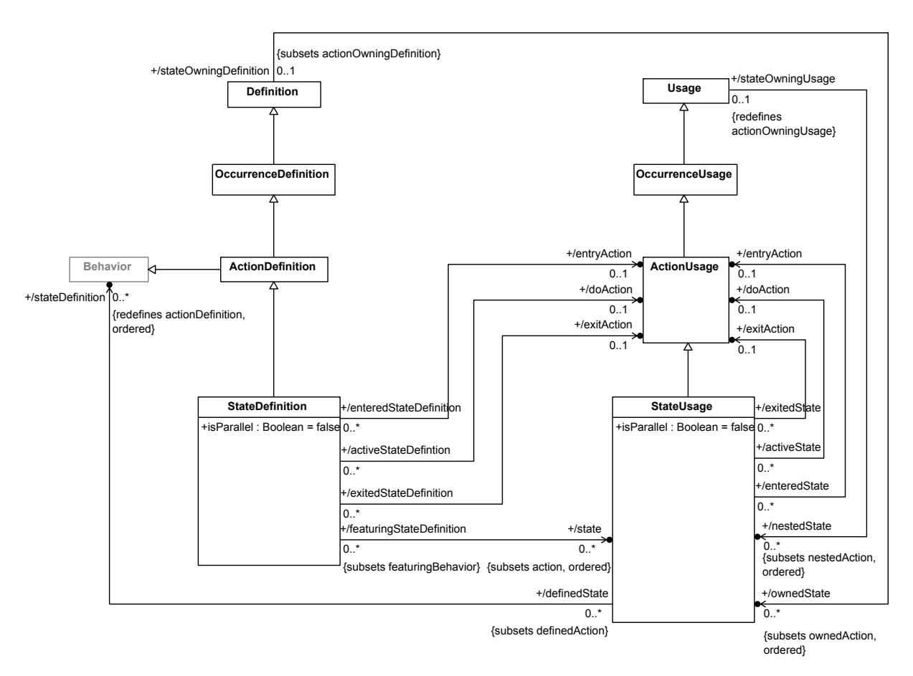

**Figure 30. State Definition and Usage**

<span id="page-362-3"></span>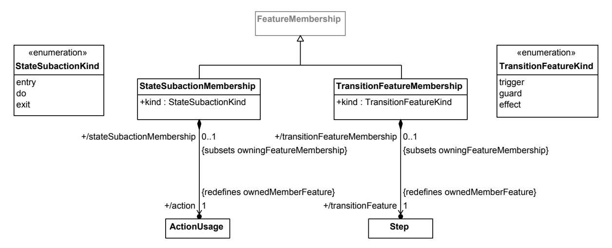

**Figure 31. State Membership**

<span id="page-363-1"></span>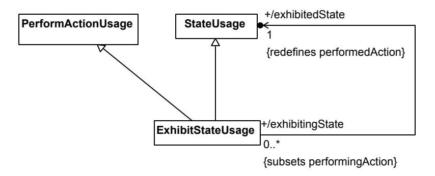

**Figure 32. Exhibited States**

<span id="page-363-2"></span>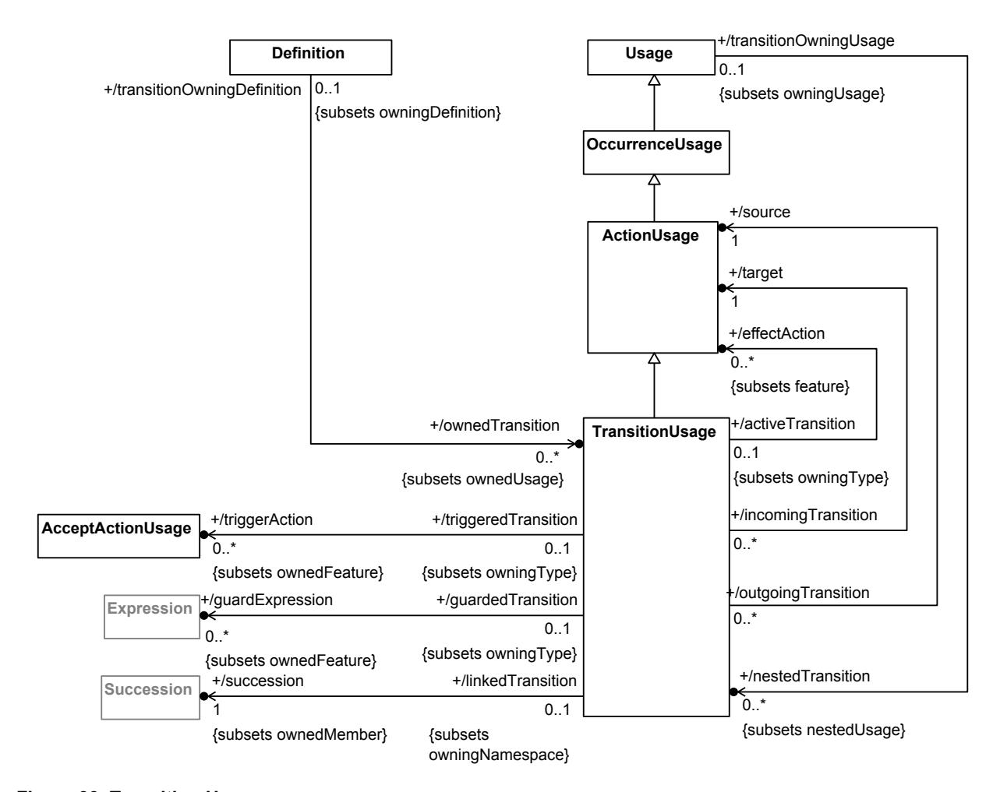

**Figure 33. Transition Usage**

# <span id="page-363-0"></span>**8.3.18.2 ExhibitStateUsage**

# **Description**

An ExhibitStateUsage is a StateUsage that represents the exhibiting of a StateUsage. Unless it is the StateUsage itself, the StateUsage to be exhibited is related to the ExhibitStateUsage by a ReferenceSubsetting Relationship. An ExhibitStateUsage is also a PerformActionUsage, with its exhibitedState as the performedAction.

# **General Classes**

PerformActionUsage StateUsage

# **Attributes**

/exhibitedState : StateUsage {redefines performedAction}

The StateUsage to be exhibited by the ExhibitStateUsage. It is the performedAction of the ExhibitStateUsage considered as a PerformActionUsage, which must be a StateUsage.

# **Operations**

None.

# **Constraints**

checkExhibitStateUsageSpecialization

If an ExhibitStateUsage has an owningType that is a PartDefinition or PartUsage, then it must directly or indirectly specialize the StateUsage *Parts::Part::exhibitedStates*.

```
owningType <> null and
(owningType.oclIsKindOf(PartDefinition) or
 owningType.oclIsKindOf(PartUsage)) implies
    specializesFromLibrary('Parts::Part::exhibitedStates')
```

# validateExhibitStateUsageReference

If an ExhibitStateUsage has an ownedReferenceSubsetting, then the featureTarget of the referencedFeature must be a StateUsage.

```
referencedFeatureTarget() <> null implies
    referencedFeatureTarget().oclIsKindOf(StateUsage)
```

# <span id="page-364-0"></span>**8.3.18.3 StateSubactionKind**

# **Description**

A StateSubactionKind indicates whether the action of a StateSubactionMembership is an entry, do or exit action.

# **General Classes**

None.

# **Literal Values**

do

Indicates that the action of a StateSubactionMembership is a doAction.

entry

Indicates that the action of a StateSubactionMembership is an entryAction.

exit

Indicates that the action of a StateSubactionMembership is an exitAction.

# <span id="page-365-0"></span>**8.3.18.4 StateSubactionMembership**

# **Description**

A StateSubactionMembership is a FeatureMembership for an entry, do or exit ActionUsage of a StateDefinition or StateUsage.

# **General Classes**

FeatureMembership

# **Attributes**

/action : ActionUsage {redefines ownedMemberFeature}

The ActionUsage that is the ownedMemberFeature of this StateSubactionMembership.

kind : StateSubactionKind

Whether this StateSubactionMembership is for an entry, do or exit ActionUsage.

# **Operations**

None.

# **Constraints**

validateStateSubactionMembershipOwningType

The owningType of a StateSubactionMembership must be a StateDefinition or a StateUsage.

```
owningType.oclIsKindOf(StateDefinition) or
owningType.oclIsKindOf(StateUsage)
```

# <span id="page-365-1"></span>**8.3.18.5 StateDefinition**

# **Description**

A StateDefinition is the Definition of the Behavior of a system or part of a system in a certain state condition.

A StateDefinition may be related to up to three of its ownedFeatures by StateBehaviorMembership Relationships, all of different kinds, corresponding to the entry, do and exit actions of the StateDefinition.

# **General Classes**

ActionDefinition

# **Attributes**

/doAction : ActionUsage [0..1]

The ActionUsage of this StateDefinition to be performed while in the state defined by the StateDefinition. It is the owned ActionUsage related to the StateDefinition by a StateSubactionMembership with kind = do.

```
/entryAction : ActionUsage [0..1]
```

The ActionUsage of this StateDefinition to be performed on entry to the state defined by the StateDefinition. It is the owned ActionUsage related to the StateDefinition by a StateSubactionMembership with kind = entry.

```
/exitAction : ActionUsage [0..1]
```

The ActionUsage of this StateDefinition to be performed on exit to the state defined by the StateDefinition. It is the owned ActionUsage related to the StateDefinition by a StateSubactionMembership with kind = exit.

```
isParallel : Boolean
```

Whether the ownedStates of this StateDefinition are to all be performed in parallel. If true, none of the ownedActions (which includes ownedStates) may have any incoming or outgoing Transitions. If false, only one ownedState may be performed at a time.

```
/state : StateUsage [0..*] {subsets action, ordered}
```

The StateUsages, which are actions in the StateDefinition, that specify the discrete states in the behavior defined by the StateDefinition.

# **Operations**

None.

# **Constraints**

# checkStateDefinitionSpecialization

A StateDefinition must directly or indirectly specialize the StateDefinition *States::StateAction* from the Systems Model Library.

```
specializesFromLibrary('States::StateAction')
```

# deriveStateDefinitionDoAction

The doAction of a StateDefinition is the action of the owned StateSubactionMembership with kind = do.

```
doAction =
    let doMemberships : Sequence(StateSubactionMembership) =
        ownedMembership->
            selectByKind(StateSubactionMembership)->
            select(kind = StateSubactionKind::do) in
    if doMemberships->isEmpty() then null
    else doMemberships->at(1)
    endif
```

# deriveStateDefinitionEntryAction

The entryAction of a StateDefinition is the action of the owned StateSubactionMembership with kind = entry.

```
entryAction =
    let entryMemberships : Sequence(StateSubactionMembership) =
        ownedMembership->
            selectByKind(StateSubactionMembership)->
            select(kind = StateSubactionKind::entry) in
    if entryMemberships->isEmpty() then null
    else entryMemberships->at(1)
    endif
```

# deriveStateDefinitionExitAction

The exitAction of a StateDefinition is the action of the owned StateSubactionMembership with kind = exit .

```
exitAction =
    let exitMemberships : Sequence(StateSubactionMembership) =
        ownedMembership->
            selectByKind(StateSubactionMembership)->
            select(kind = StateSubactionKind::exit) in
    if exitMemberships->isEmpty() then null
    else exitMemberships->at(1)
    endif
```

# deriveStateDefinitionState

The states of a StateDefinition are those of its actions that are StateUsages.

```
state = action->selectByKind(StateUsage)
```

# validateStateDefinitionParallelSubactions

If a StateDefinition is parallel, then its ownedActions (which includes its ownedStates) must not have any incomingTransitions or outgoingTransitions.

```
isParallel implies
    ownedAction.incomingTransition->isEmpty() and
    ownedAction.outgoingTransition->isEmpty()
```

# validateStateDefinitionStateSubactionKind

A StateDefinition must not have more than one owned StateSubactionMembership of each kind.

```
ownedMembership->
    selectByKind(StateSubactionMembership)->
    isUnique(kind)
```

# <span id="page-367-0"></span>**8.3.18.6 StateUsage**

# **Description**

A StateUsage is an ActionUsage that is nominally the Usage of a StateDefinition. However, other kinds of kernel Behaviors are also allowed as types, to permit use of Behaviors

A StateUsage may be related to up to three of its ownedFeatures by StateSubactionMembership Relationships, all of different kinds, corresponding to the entry, do and exit actions of the StateUsage.

# **General Classes**

ActionUsage

# **Attributes**

/doAction : ActionUsage [0..1]

The ActionUsage of this StateUsage to be performed while in the state defined by the StateDefinition. It is the owned ActionUsage related to the StateUsage by a StateSubactionMembership with kind = do.

/entryAction : ActionUsage [0..1]

The ActionUsage of this StateUsage to be performed on entry to the state defined by the StateDefinition. It is the owned ActionUsage related to the StateUsage by a StateSubactionMembership with kind = entry.

/exitAction : ActionUsage [0..1]

The ActionUsage of this StateUsage to be performed on exit to the state defined by the StateDefinition. It is the owned ActionUsage related to the StateUsage by a StateSubactionMembership with kind = exit.

isParallel : Boolean

Whether the nestedStates of this StateUsage are to all be performed in parallel. If true, none of the nestedActions (which include nestedStates) may have any incoming or outgoing Transitions. If false, only one nestedState may be performed at a time.

/stateDefinition : Behavior [0..\*] {redefines actionDefinition, ordered}

The Behaviors that are the types of this StateUsage. Nominally, these would be StateDefinitions, but kernel Behaviors are also allowed, to permit use of Behaviors from the Kernel Model Libraries.

# **Operations**

isSubstateUsage(isParallel : Boolean) : Boolean

Check if this StateUsage is composite and has an owningType that is a StateDefinition or StateUsage with the given value of isParallel, but is *not* an entryAction, doAction, or exitAction. If so, then it represents a *StateAction* that is a *substate* or *exclusiveState* (for isParallel = false) of another *StateAction*.

```
body: isComposite and owningType <> null and
(owningType.oclIsKindOf(StateDefinition) and
    owningType.oclAsType(StateDefinition).isParallel = isParallel or
 owningType.oclIsKindOf(StateUsage) and
    owningType.oclAsType(StateUsage).isParallel = isParallel) and
not owningFeatureMembership.oclIsKindOf(StateSubactionMembership)
```

# **Constraints**

checkStateUsageExclusiveStateSpecialization

A StateUsage that is a substate usage with a non-parallel owning StateDefinition or StateUsage must directly or indirectly specialize the StateUsage *States::StateAction::exclusiveStates* from the Systems Model Library.

```
isSubstateUsage(false) implies
    specializesFromLibrary('States::StateAction::exclusiveStates')
```

# checkStateUsageOwnedStateSpecialization

A composite StateUsage whose owningType is a PartDefinition or PartUsage must directly or indirectly specialize the StateUsage *Parts::Part::ownedStates* from the Systems Model Library.

```
isComposite and owningType <> null and
(owningType.oclIsKindOf(PartDefinition) or
 owningType.oclIsKindOf(PartUsage)) implies
    specializesFromLibrary('Parts::Part::ownedStates')
```

# checkStateUsageSpecialization

A StateUsage must directly or indirectly specialize the StateUsage *States::stateActions* from the Systems Model Library.

```
specializesFromLibrary('States::stateActions')
```

# checkStateUsageSubstateSpecialization

A StateUsage that is a substate usage with a owning StateDefinition or StateUsage that is parallel must directly or indirectly specialize the StateUsage *States::StateAction::substates* from the Systems Model Library.

```
isSubstateUsage(true) implies
    specializesFromLibrary('States::StateAction::substates')
```

# deriveStateUsageDoAction

The doAction of a StateUsage is the action of the owned StateSubactionMembership with kind = do.

```
doAction =
    let doMemberships : Sequence(StateSubactionMembership) =
        ownedMembership->
            selectByKind(StateSubactionMembership)->
            select(kind = StateSubactionKind::do) in
    if doMemberships->isEmpty() then null
    else doMemberships->at(1)
    endif
```

# deriveStateUsageEntryAction

The entryAction of a StateUsage is the action of the owned StateSubactionMembership with kind = entry.

```
entryAction =
    let entryMemberships : Sequence(StateSubactionMembership) =
        ownedMembership->
            selectByKind(StateSubactionMembership)->
            select(kind = StateSubactionKind::entry) in
    if entryMemberships->isEmpty() then null
    else entryMemberships->at(1)
    endif
```

# deriveStateUsageExitAction

The exitAction of a StateUsage is the action of the owned StateSubactionMembership with kind = exit .

```
exitAction =
    let exitMemberships : Sequence(StateSubactionMembership) =
        ownedMembership->
            selectByKind(StateSubactionMembership)->
            select(kind = StateSubactionKind::exit) in
    if exitMemberships->isEmpty() then null
    else exitMemberships->at(1)
    endif
```

# validateStateUsageParallelSubactions

If a StateUsage is parallel, then its nestedActions (which includes nestedStates) must not have any incomingTransitions or outgoingTransitions.

```
isParallel implies
    nestedAction.incomingTransition->isEmpty() and
    nestedAction.outgoingTransition->isEmpty()
```

# validateStateUsageStateSubactionKind

A StateUsage must not have more than one owned StateSubactionMembership of each kind.

```
ownedMembership->
    selectByKind(StateSubactionMembership)->
    isUnique(kind)
```

# <span id="page-370-0"></span>**8.3.18.7 TransitionFeatureKind**

# **Description**

A TransitionActionKind indicates whether the transitionFeature of a TransitionFeatureMembership is a trigger, guard or effect.

# **General Classes**

None.

# **Literal Values**

effect

Indicates that the transitionFeature of a TransitionFeatureMembership is an effectAction.

guard

Indicates that the transitionFeature of a TransitionFeatureMembership is a guardExpression.

trigger

Indicates that the transitionFeature of a TransitionFeatureMembership is a triggerAction.

# <span id="page-370-1"></span>**8.3.18.8 TransitionFeatureMembership**

# **Description**

A TransitionFeatureMembership is a FeatureMembership for a trigger, guard or effect of a TransitionUsage, whose transitionFeature is a AcceptActionUsage, *Boolean*-valued Expression or ActionUsage, depending on its kind.

# **General Classes**

FeatureMembership

# **Attributes**

kind : TransitionFeatureKind

Whether this TransitionFeatureMembership is for a trigger, guard or effect.

/transitionFeature : Step {redefines ownedMemberFeature}

The Step that is the ownedMemberFeature of this TransitionFeatureMembership.

# **Operations**

None.

# **Constraints**

validateTransitionFeatureMembershipEffectAction

If the kind of a TransitionUsage is effect, then its transitionFeature must be a kind of ActionUsage.

```
kind = TransitionFeatureKind::effect implies
    transitionFeature.oclIsKindOf(ActionUsage)
```

validateTransitionFeatureMembershipGuardExpression

If the kind of a TransitionUsage is guard, then its transitionFeature must be a kind of Expression whose result is a *Boolean* value.

```
kind = TransitionFeatureKind::guard implies
    transitionFeature.oclIsKindOf(Expression) and
    let guard : Expression = transitionFeature.oclIsKindOf(Expression) in
    guard.result.specializesFromLibrary('ScalarValues::Boolean') and
    guard.result.multiplicity <> null and
    guard.result.multiplicity.hasBounds(1,1)
```

validateTransitionFeatureMembershipOwningType

The owningType of a TransitionFeatureMembership must be a TransitionUsage.

```
owningType.oclIsKindOf(TransitionUsage)
```

validateTransitionFeatureMembershipTriggerAction

If the kind of a TransitionUsage is trigger, then its transitionFeature must be a kind of AcceptActionUsage.

```
kind = TransitionFeatureKind::trigger implies
    transitionFeature.oclIsKindOf(AcceptActionUsage)
```

# <span id="page-371-0"></span>**8.3.18.9 TransitionUsage**

# **Description**

A TransitionUsage is an ActionUsage representing a triggered transition between ActionUsages or StateUsages. When triggered by a triggerAction, when its guardExpression is true, the TransitionUsage asserts that its source is exited, then its effectAction (if any) is performed, and then its target is entered.

A TransitionUsage can be related to some of its ownedFeatures using TransitionFeatureMembership Relationships, corresponding to the triggerAction, guardExpression and effectAction of the TransitionUsage.

# **General Classes**

ActionUsage

# **Attributes**

/effectAction : ActionUsage [0..\*] {subsets feature}

The ActionUsages that define the effects of this TransitionUsage, which are the ownedFeatures of the TransitionUsage related to it by TransitionFeatureMemberships with kind = effect, which must all be ActionUsages.

/guardExpression : Expression [0..\*] {subsets ownedFeature}

The Expressions that define the guards of this TransitionUsage, which are the ownedFeatures of the TransitionUsage related to it by TransitionFeatureMemberships with kind = guard, which must all be Expressions.

/source : ActionUsage

The source ActionUsage of this TransitionUsage, which becomes the source of the succession for the TransitionUsage.

/succession : Succession {subsets ownedMember}

The Succession that is the ownedFeature of this TransitionUsage, which, if the TransitionUsage is triggered, asserts the temporal ordering of the source and target.

/target : ActionUsage

The target ActionUsage of this TransitionUsage, which is the targetFeature of the succession for the TransitionUsage.

/triggerAction : AcceptActionUsage [0..\*] {subsets ownedFeature}

The AcceptActionUsages that define the triggers of this TransitionUsage, which are the ownedFeatures of the TransitionUsage related to it by TransitionFeatureMemberships with kind = trigger, which must all be AcceptActionUsages.

# **Operations**

sourceFeature() : Feature [0..1]

Return the Feature to be used as the source of the succession of this TransitionUsage, which is the first member of the TransitionUsage that is a Feature, that is owned by the TransitionUsage via a Membership that is *not* a FeatureMembership, and whose featureTarget is an ActionUsage.

```
body: let features : Sequence(Feature) = ownedMembership->
    reject(oclIsKindOf(FeatureMembership)).memberElement->
    selectByKind(Feature)->
    select(featureTarget.oclIsKindOf(ActionUsage)) in
if features->isEmpty() then null
else features->first()
endif
```

triggerPayloadParameter() : ReferenceUsage [0..1]

Return the payloadParameter of the triggerAction of this TransitionUsage, if it has one.

```
body: if triggerAction->isEmpty() then null
else triggerAction->first().payloadParameter
endif
```

# **Constraints**

# checkTransitionUsageActionSpecialization

A composite TransitionUsage whose owningType is an ActionDefinition or ActionUsage and whose source is *not* a StateUsage must directly or indirectly specialize the ActionUsage *Actions::Action::decisionTransitions* from the Systems Model Library.

```
isComposite and owningType <> null and
(owningType.oclIsKindOf(ActionDefinition) or
 owningType.oclIsKindOf(ActionUsage)) and
source <> null and not source.oclIsKindOf(StateUsage) implies
    specializesFromLibrary('Actions::Action::decisionTransitions')
```

# checkTransitionUsagePayloadSpecialization

If a TransitionUsage has a triggerAction, then the *payload* parameter of the TransitionUsage subsets the Feature chain of the triggerAction and its payloadParameter.

```
triggerAction->notEmpty() implies
    let payloadParameter : Feature = inputParameter(2) in
    payloadParameter <> null and
    payloadParameter.subsetsChain(triggerAction->at(1), triggerPayloadParameter())
```

# checkTransitionUsageSourceBindingConnector

A TransitionUsage must have an ownedMember that is a BindingConnector between its source and its first input parameter (which redefines *Actions::TransitionAction::transitionLinkSource*).

```
ownedMember->selectByKind(BindingConnector)->exists(b |
    b.relatedFeatures->includes(source) and
    b.relatedFeatures->includes(inputParameter(1)))
```

# checkTransitionUsageSpecialization

A TransitionUsage must directly or indirectly specialize the ActionUsage *Actions::transitionActions* from the Systems Model Library.

```
specializesFromLibrary('Actions::transitionActions')
```

# checkTransitionUsageStateSpecialization

A composite TransitionUsage whose owningType is a StateDefinition or StateUsage and whose source is a StateUsage must directly or indirectly specialize the ActionUsage

*States::StateAction::stateTransitions* from the Systems Model Library

```
isComposite and owningType <> null and
(owningType.oclIsKindOf(StateDefinition) or
 owningType.oclIsKindOf(StateUsage)) and
source <> null and source.oclIsKindOf(StateUsage) implies
    specializesFromLibrary('States::StateAction::stateTransitions')
```

# checkTransitionUsageSuccessionBindingConnector

A TransitionUsage must have an ownedMember that is a BindingConnector between its succession and the inherited Feature *TransitionPerformances::TransitionPerformance::transitionLink*.

```
ownedMember->selectByKind(BindingConnector)->exists(b |
    b.relatedFeatures->includes(succession) and
    b.relatedFeatures->includes(resolveGlobal(
        'TransitionPerformances::TransitionPerformance::transitionLink')))
```

# checkTransitionUsageSuccessionSourceSpecialization

The sourceFeature of the succession of a TransitionUsage must be the source of the TransitionUsage (i.e., the first connectorEnd of the succession must have a ReferenceSubsetting Relationship with the source).

```
succession.sourceFeature = source
```

# checkTransitionUsageTransitionFeatureSpecialization

The triggerActions, guardExpressions, and effectActions of a TransitionUsage must specialize, respectively, the *accepter*, *guard*, and *effect* features of the ActionUsage *Actions::TransitionActions* from the Systems Model Library.

```
triggerAction->forAll(specializesFromLibrary('Actions::TransitionAction::accepter') and
guardExpression->forAll(specializesFromLibrary('Actions::TransitionAction::guard') and
effectAction->forAll(specializesFromLibrary('Actions::TransitionAction::effect'))
```

# deriveTransitionUsageEffectAction

The effectActions of a TransitionUsage are the transitionFeatures of the ownedFeatureMemberships of the TransitionUsage with kind = effect, which must all be ActionUsages.

```
triggerAction = ownedFeatureMembership->
    selectByKind(TransitionFeatureMembership)->
    select(kind = TransitionFeatureKind::trigger).transitionFeatures->
    selectByKind(AcceptActionUsage)
```

# deriveTransitionUsageGuardExpression

The triggerActions of a TransitionUsage are the transitionFeatures of the ownedFeatureMemberships of the TransitionUsage with kind = trigger, which must all be Expressions.

```
guardExpression = ownedFeatureMembership->
    selectByKind(TransitionFeatureMembership)->
```

```
select(kind = TransitionFeatureKind::trigger).transitionFeature->
selectByKind(Expression)
```

# deriveTransitionUsageSource

The source of a TransitionUsage is featureTarget of the result of sourceFeature(), which must be an ActionUsage.

```
source =
    let sourceFeature : Feature = sourceFeature() in
    if sourceFeature = null then null
    else sourceFeature.featureTarget.oclAsType(ActionUsage)
```

# deriveTransitionUsageSuccession

The succession of a TransitionUsage is its first ownedMember that is a Succession.

```
succession = ownedMember->selectByKind(Succession)->at(1)
```

# deriveTransitionUsageTarget

The target of a TransitionUsage is given by the featureTarget of the targetFeature of its succession, which must be an ActionUsage.

```
target =
    if succession.targetFeature->isEmpty() then null
    else
        let targetFeature : Feature =
            succession.targetFeature->first().featureTarget in
        if not targetFeature.oclIsKindOf(ActionUsage) then null
        else targetFeature.oclAsType(ActionUsage)
        endif
    endif
```

# deriveTransitionUsageTriggerAction

The triggerActions of a TransitionUsage are the transitionFeatures of the ownedFeatureMemberships of the TransitionUsage with kind = trigger, which must all be AcceptActionUsages.

```
triggerAction = ownedFeatureMembership->
    selectByKind(TransitionFeatureMembership)->
    select(kind = TransitionFeatureKind::trigger).transitionFeature->
    selectByKind(AcceptActionUsage)
```

# validateTransitionUsageParameters

A TransitionUsage must have at least one owned input parameter and, if it has a triggerAction, it must have at least two.

```
if triggerAction->isEmpty() then
    inputParameters()->size() >= 1
else
    inputParameters()->size() >= 2
endif
```

# validateTransitionUsageSuccession

A TransitionUsage must have an ownedMember that is a Succession with an ActionUsage as the featureTarget of its targetFeature.

```
let successions : Sequence(Successions) =
    ownedMember->selectByKind(Succession) in
successions->notEmpty() and
successions->at(1).targetFeature.featureTarget->
    forAll(oclIsKindOf(ActionUsage))
```

# validateTransitionUsageTriggerActions

If the source of a TransitionUsage is *not* a StateUsage, then the TransitionUsage must not have any triggerActions.

```
source <> null and not source.oclIsKindOf(StateUsage) implies
    triggerAction->isEmpty()
```

# <span id="page-376-0"></span>**8.3.19 Calculations Abstract Syntax**

# **8.3.19.1 Overview**

<span id="page-376-3"></span><span id="page-376-1"></span>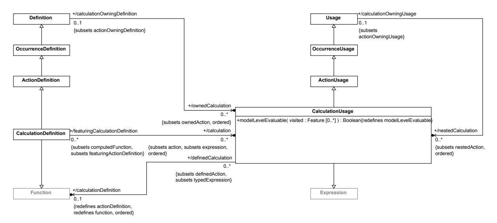

**Figure 34. Calculation Definition and Usage**

# <span id="page-376-2"></span>**8.3.19.2 CalculationDefinition**

# **Description**

A CalculationDefinition is an ActionDefinition that also defines a Function producing a result.

# **General Classes**

ActionDefinition Function

# **Attributes**

/calculation : CalculationUsage [0..\*] {subsets action, expression, ordered}

The actions of this CalculationDefinition that are CalculationUsages.

# **Operations**

None.

# **Constraints**

checkCalculationDefinitionSpecialization

A CalculationDefinition must directly or indirectly specialize the CalculationDefinition *Calculations::Calculation* from the Systems Model Library.

specializesFromLibrary('Calculations::Calculation')

deriveCalculationUsageCalculation

The calculations of a CalculationDefinition are those of its actions that are CalculationUsages.

calculation = action->selectByKind(CalculationUsage)

# <span id="page-377-0"></span>**8.3.19.3 CalculationUsage**

# **Description**

A CalculationUsage is an ActionUsage that is also an Expression, and, so, is typed by a Function. Nominally, if the type is a CalculationDefinition, a CalculationUsage is a Usage of that CalculationDefinition within a system. However, other kinds of kernel Functions are also allowed, to permit use of Functions from the Kernel Model Libraries.

# **General Classes**

ActionUsage Expression

# **Attributes**

/calculationDefinition : Function [0..1] {redefines function, actionDefinition, ordered}

The Function that is the type of this CalculationUsage. Nominally, this would be a CalculationDefinition, but a kernel Function is also allowed, to permit use of Functions from the Kernel Model Libraries.

# **Operations**

modelLevelEvaluable(visited : Feature [0..\*]) : Boolean {redefines modelLevelEvaluable}

A CalculationUsage is not model-level evaluable.

**body**: false

# **Constraints**

checkCalculationUsageSpecialization

A CalculationUsage must specialize directly or indirectly the CalculationUsage *Calculations::calculations* from the Systems Model Library.

specializesFromLibrary('Calculations::calculations')

# checkCalculationUsageSubcalculationSpecialization

```
owningType <> null and
(owningType.oclIsKindOf(CalculationDefinition) or
 owningType.oclIsKindOf(CalculationUsage)) implies
    specializesFromLibrary('Calculations::Calculation::subcalculations')
```

# <span id="page-378-0"></span>**8.3.20 Constraints Abstract Syntax**

# <span id="page-378-1"></span>**8.3.20.1 Overview**

<span id="page-378-3"></span>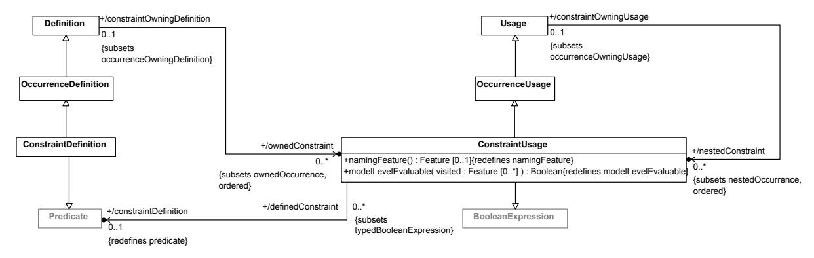

**Figure 35. Constraint Definition and Usage**

<span id="page-378-4"></span>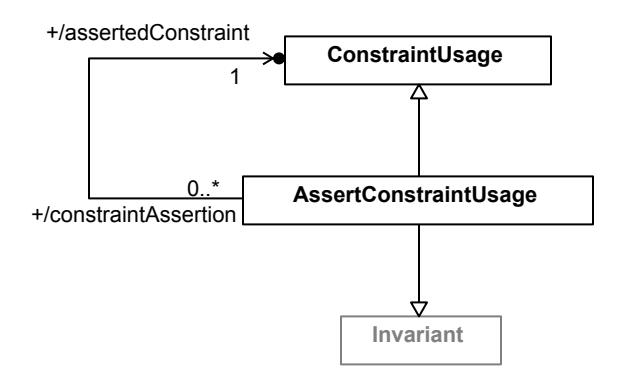

**Figure 36. Asserted Constraints**

# <span id="page-378-2"></span>**8.3.20.2 AssertConstraintUsage**

# **Description**

An AssertConstraintUsage is a ConstraintUsage that is also an Invariant and, so, is asserted to be true (by default). Unless it is the AssertConstraintUsage itself, the asserted ConstraintUsage is related to the AssertConstraintUsage by a ReferenceSubsetting Relationship.

# **General Classes**

Invariant ConstraintUsage

# **Attributes**

/assertedConstraint : ConstraintUsage

The ConstraintUsage to be performed by the AssertConstraintUsage. It is the referenceFeature of the ownedReferenceSubsetting for the AssertConstraintUsage, if there is one, and, otherwise, the AssertConstraintUsage itself.

# **Operations**

None.

# **Constraints**

# checkAssertConstraintUsageSpecialization

If a AssertConstraintUsage is negated, then it must directly or indirectly specialize the ConstraintUsage *Constraints::negatedConstraintChecks*. Otherwise, it must directly or indirectly specialize the ConstraintUsage *Constraints::assertedConstraintChecks*.

```
if isNegated then
    specializesFromLibrary('Constraints::negatedConstraintChecks')
else
    specializesFromLibrary('Constraints::assertedConstraintChecks')
endif
```

# deriveAssertConstraintUsageAssertedConstraint

If an AssertConstraintUsage has no ownedReferenceSubsetting, then its assertedConstraint is the AssertConstraintUsage itself. Otherwise, the assertedConstraint is the featureTarget of the referencedFeature of the ownedReferenceSubsetting, which must be a ConstraintUsage.

```
assertedConstraint =
    if referencedFeatureTarget() = null then self
    else if referencedFeatureTarget().oclIsKindOf(ConstraintUsage) then
        referencedFeatureTarget().oclAsType(ConstraintUsage)
    else null
    endif endif
```

# validateAssertConstraintUsageReference

If an AssertConstraintUsage has an ownedReferenceSubsetting, then the featureTarget of its referencedFeature must be a ConstraintUsage.

```
referencedFeaureTarget() <> null implies
    referencedFeatureTarget().oclIsKindOf(ConstraintUsage)
```

# <span id="page-379-0"></span>**8.3.20.3 ConstraintDefinition**

# **Description**

A ConstraintDefinition is an OccurrenceDefinition that is also a Predicate that defines a constraint that may be asserted to hold on a system or part of a system.

# **General Classes**

Predicate OccurrenceDefinition

# **Attributes**

None.

# **Operations**

None.

# **Constraints**

checkConstraintDefinitionSpecialization

A ConstraintDefinition must directly or indirectly specialize the base ConstraintDefinition *Constraints::ConstraintCheck* from the Systems Model Library.

specializesFromLibrary('Constraints::ConstraintCheck')

# <span id="page-380-0"></span>**8.3.20.4 ConstraintUsage**

# **Description**

A ConstraintUsage is an OccurrenceUsage that is also a BooleanExpression, and, so, is typed by a Predicate. Nominally, if the type is a ConstraintDefinition, a ConstraintUsage is a Usage of that ConstraintDefinition. However, other kinds of kernel Predicates are also allowed, to permit use of Predicates from the Kernel Model Libraries.

# **General Classes**

BooleanExpression OccurrenceUsage

# **Attributes**

/constraintDefinition : Predicate [0..1] {redefines predicate}

The (single) Predicate that is the type of this ConstraintUsage. Nominally, this will be a ConstraintDefinition, but other kinds of Predicates are also allowed, to permit use of Predicates from the Kernel Model Libraries.

# **Operations**

modelLevelEvaluable(visited : Feature [0..\*]) : Boolean {redefines modelLevelEvaluable}

A ConstraintUsage is not model-level evaluable.

**body**: false

namingFeature() : Feature [0..1] {redefines namingFeature}

The naming Feature of a ConstraintUsage that is owned by a RequirementConstraintMembership and has an ownedReferenceSubsetting is the featureTarget of the referencedFeature of that ownedReferenceSubsetting.

```
body: if owningFeatureMembership <> null and
owningFeatureMembership.oclIsKindOf(RequirementConstraintMembership) and
ownedReferenceSubsetting <> null then
    ownedReferenceSubsetting.referencedFeature.featureTarget
else
    self.oclAsType(OccurrenceUsage).namingFeature()
endif
```

# **Constraints**

# checkConstraintUsageCheckedConstraintSpecialization

A ConstraintUsage whose owningType is an ItemDefinition or ItemUsage must directly or indirectly specialize the ConstraintUsage *Items::Item::checkedConstraints*.

```
owningType <> null and
(owningType.oclIsKindOf(ItemDefinition) or
 owningType.oclIsKindOf(ItemUsage)) implies
    specializesFromLibrary('Items::Item::checkedConstraints')
```

# checkConstraintUsageRequirementConstraintSpecialization

A ConstraintUsage whose owningFeatureMembership is a RequirementConstraintMembership must directly or indirectly specialize on the ConstraintUsages *assumptions* or *constraints* from the ConstraintDefinition *Requirements::RequirementCheck* in the Systems Model Library, depending on whether the kind of the RequirementConstraintMembership is assumption or requirement, respectively.

```
owningFeatureMembership <> null and
owningFeatureMembership.oclIsKindOf(RequirementConstraintMembership) implies
    if owningFeatureMembership.oclAsType(RequirementConstraintMembership).kind =
        RequirementConstraintKind::assumption then
        specializesFromLibrary('Requirements::RequirementCheck::assumptions')
    else
        specializesFromLibrary('Requirements::RequirementCheck::constraints')
    endif
```

# checkConstraintUsageSpecialization

A ConstraintUsage must directly or indirectly specialize the base ConstraintUsage *Constraints::constraintChecks* from the Systems Model Library.

```
specializesFromLibrary('Constraints::constraintChecks')
```

# <span id="page-382-0"></span>**8.3.21 Requirements Abstract Syntax**

# <span id="page-382-1"></span>**8.3.21.1 Overview**

<span id="page-382-2"></span>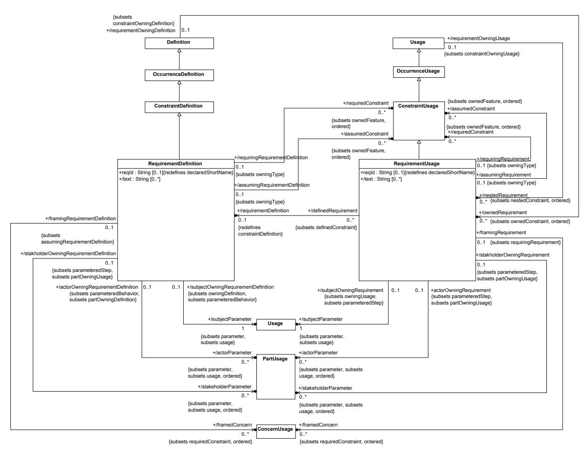

**Figure 37. Requirement Definition and Usage**

<span id="page-382-3"></span>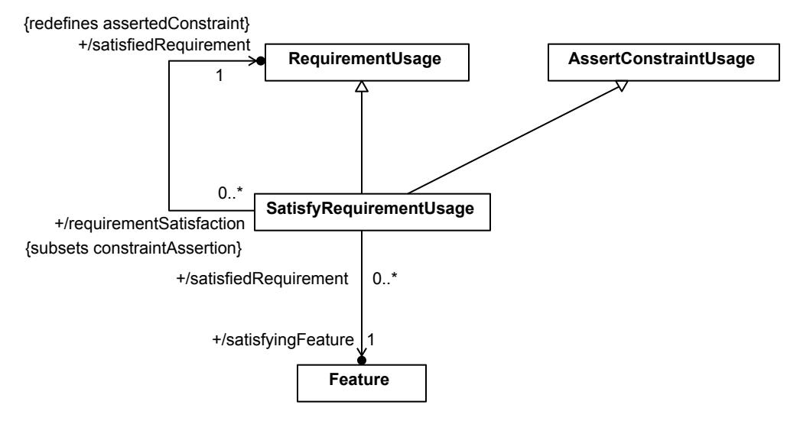

**Figure 38. Satisfied Requirements**

<span id="page-383-0"></span>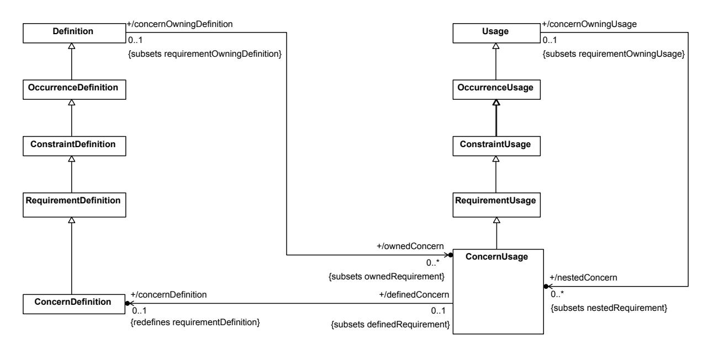

**Figure 39. Concern Definition and Usage**

<span id="page-383-1"></span>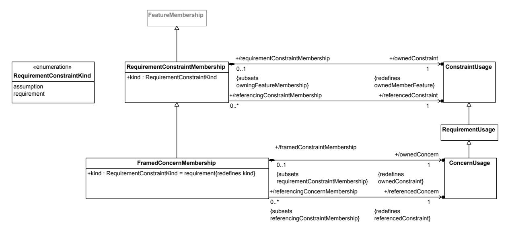

**Figure 40. Requirement Constraint Membership**

<span id="page-384-2"></span>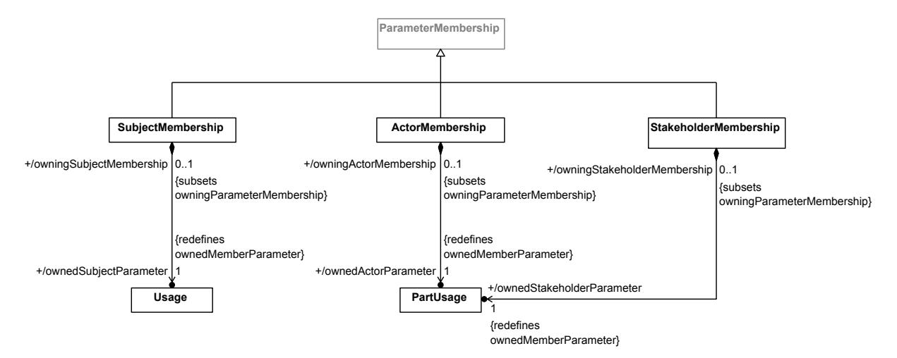

**Figure 41. Requirement Parameter Memberships**

# <span id="page-384-0"></span>**8.3.21.2 ActorMembership**

# **Description**

An ActorMembership is a ParameterMembership that identifies a PartUsage as an *actor* parameter, which specifies a role played by an external entity in interaction with the owningType of the ActorMembership.

# **General Classes**

ParameterMembership

# **Attributes**

/ownedActorParameter : PartUsage {redefines ownedMemberParameter}

The PartUsage specifying the actor.

# **Operations**

None.

# **Constraints**

validateActorMembershipOwningType

The owningType of an ActorMembership must be a RequirementDefinition, RequirementUsage, CaseDefinition, or CaseUsage.

```
owningType.oclIsKindOf(RequirementUsage) or
owningType.oclIsKindOf(RequirementDefinition) or
owningType.oclIsKindOf(CaseDefinition) or
owningType.oclIsKindOf(CaseUsage)
```

# <span id="page-384-1"></span>**8.3.21.3 ConcernDefinition**

# **Description**

A ConcernDefinition is a RequirementDefinition that one or more stakeholders may be interested in having addressed. These stakeholders are identified by the ownedStakeholdersof the ConcernDefinition.

# **General Classes**

RequirementDefinition

# **Attributes**

None.

# **Operations**

None.

# **Constraints**

checkConcernDefinitionSpecialization

A ConcernDefinition must directly or indirectly specialize the base ConcernDefinition *Requirements::ConcernCheck* from the Systems Model Library.

specializesFromLibrary('Requirements::ConcernCheck')

# <span id="page-385-0"></span>**8.3.21.4 ConcernUsage**

# **Description**

A ConcernUsage is a Usage of a ConcernDefinition.

The ownedStakeholder features of the ConcernUsage shall all subset the *ConcernCheck::concernedStakeholders* feature. If the ConcernUsage is an ownedFeature of a StakeholderDefinition or StakeholderUsage, then the ConcernUsage shall have an ownedStakeholder feature that is bound to the *self* feature of its owner.

# **General Classes**

RequirementUsage

# **Attributes**

/concernDefinition : ConcernDefinition [0..1] {redefines requirementDefinition}

The ConcernDefinition that is the single type of this ConcernUsage.

# **Operations**

None.

# **Constraints**

checkConcernUsageFramedConcernSpecialization

If a ConcernUsage is owned via a FramedConcernMembership, then it must directly or indirectly specialize the ConcernUsage *Requirements::RequirementCheck::concerns* from the Systems Model Library.

```
owningFeatureMembership <> null and
owningFeatureMembership.oclIsKindOf(FramedConcernMembership) implies
    specializesFromLibrary('Requirements::RequirementCheck::concerns')
```

# checkConcernUsageSpecialization

A ConcernUsage must directly or indirectly specialize the base ConcernUsage *Requirements::concernChecks* from the Systems Model Library.

specializesFromLibrary('Requirements::concernChecks')

# <span id="page-386-0"></span>**8.3.21.5 FramedConcernMembership**

# **Description**

A FramedConcernMembership is a RequirementConstraintMembership for a framed ConcernUsage of a RequirementDefinition or RequirementUsage.

# **General Classes**

RequirementConstraintMembership

# **Attributes**

kind : RequirementConstraintKind {redefines kind}

The kind of an FramedConcernMembership must be requirement.

/ownedConcern : ConcernUsage {redefines ownedConstraint}

The ConcernUsage that is the ownedConstraint of this FramedConcernMembership.

/referencedConcern : ConcernUsage {redefines referencedConstraint}

The ConcernUsage that is referenced through this FramedConcernMembership. It is the referencedConstraint of the FramedConcernMembership considered as a RequirementConstraintMembership, which must be a ConcernUsage.

# **Operations**

None.

# **Constraints**

validateFramedConcernMembershipConstraintKind

A FramedConcernMembership must have kind = requirement.

kind = RequirementConstraintKind::requirement

# <span id="page-386-1"></span>**8.3.21.6 RequirementConstraintKind**

# **Description**

A RequirementConstraintKind indicates whether a ConstraintUsage is an assumption or a requirement in a RequirementDefinition or RequirementUsage.

# **General Classes**

None.

# **Literal Values**

assumption

Indicates that a member ConstraintUsage of a RequirementDefinition or RequirementUsage represents an assumption.

requirement

Indicates that a member ConstraintUsage of a RequirementDefinition or RequirementUsagerepresents an requirement.

# <span id="page-387-0"></span>**8.3.21.7 RequirementConstraintMembership**

# **Description**

A RequirementConstraintMembership is a FeatureMembership for an assumed or required ConstraintUsage of a RequirementDefinition or RequirementUsage.

# **General Classes**

FeatureMembership

# **Attributes**

kind : RequirementConstraintKind

Whether the RequirementConstraintMembership is for an assumed or required ConstraintUsage.

/ownedConstraint : ConstraintUsage {redefines ownedMemberFeature}

The ConstraintUsage that is the ownedMemberFeature of this RequirementConstraintMembership.

/referencedConstraint : ConstraintUsage

The ConstraintUsage that is referenced through this RequirementConstraintMembership. It is the referencedFeature of the ownedReferenceSubsetting of the ownedConstraint, if there is one, and, otherwise, the ownedConstraint itself.

# **Operations**

None.

# **Constraints**

deriveRequirementConstraintMembershipReferencedConstraint

The referencedConstraint of a RequirementConstraintMembership is the featureTarget of the referencedFeature of the ownedReferenceSubsetting of the ownedConstraint, if there is one, and, otherwise, the ownedConstraint itself.

```
referencedConstraint =
    let referencedFeature : Feature =
        ownedConstraint.referencedFeatureTarget() in
    if referencedFeature = null then ownedConstraint
    else if referencedFeature.oclIsKindOf(ConstraintUsage) then
        refrencedFeature.oclAsType(ConstraintUsage)
    else null
    endif endif
```

# validateRequirementConstraintMembershipIsComposite

The ownedConstraint of a RequirementConstraintMembership must be composite.

```
ownedConstraint.isComposite
```

# validateRequirementConstraintMembershipOwningType

The owningType of a RequirementConstraintMembership must be a RequirementDefinition or a RequirementUsage.

```
owningType.oclIsKindOf(RequirementDefinition) or
owningType.oclIsKindOf(RequirementUsage)
```

# <span id="page-388-0"></span>**8.3.21.8 RequirementDefinition**

# **Description**

A RequirementDefinition is a ConstraintDefinition that defines a requirement used in the context of a specification as a constraint that a valid solution must satisfy. The specification is relative to a specified subject, possibly in collaboration with one or more external actors.

# **General Classes**

ConstraintDefinition

# **Attributes**

/actorParameter : PartUsage [0..\*] {subsets parameter, usage, ordered}

The parameters of this RequirementDefinition that represent actors involved in the requirement.

/assumedConstraint : ConstraintUsage [0..\*] {subsets ownedFeature, ordered}

The owned ConstraintUsages that represent assumptions of this RequirementDefinition, which are the ownedConstraints of the RequirementConstraintMemberships of the RequirementDefinition with kind = assumption.

/framedConcern : ConcernUsage [0..\*] {subsets requiredConstraint, ordered}

The ConcernUsages framed by this RequirementDefinition, which are the ownedConcerns of all FramedConcernMemberships of the RequirementDefinition.

reqId : String [0..1] {redefines declaredShortName}

An optional modeler-specified identifier for this RequirementDefinition (used, e.g., to link it to an original requirement text in some source document), which is the declaredShortName for the RequirementDefinition.

/requiredConstraint : ConstraintUsage [0..\*] {subsets ownedFeature, ordered}

The owned ConstraintUsages that represent requirements of this RequirementDefinition, derived as the ownedConstraints of the RequirementConstraintMemberships of the RequirementDefinition with kind = requirement.

/stakeholderParameter : PartUsage [0..\*] {subsets parameter, usage, ordered}

The parameters of this RequirementDefinition that represent stakeholders for th requirement.

/subjectParameter : Usage {subsets parameter, usage}

The parameter of this RequirementDefinition that represents its subject.

```
/text : String [0..*]
```

An optional textual statement of the requirement represented by this RequirementDefinition, derived from the bodies of the documentation of the RequirementDefinition.

# **Operations**

None.

# **Constraints**

# checkRequirementDefinitionSpecialization

A RequirementDefinition must directly or indirectly specialize the base RequirementDefinition *Requirements::RequirementCheck* from the Systems Model Library.

```
specializesFromLibrary('Requirements::RequirementCheck')
```

# deriveRequirementDefinitionActorParameter

The actorParameters of a RequirementDefinition are the ownedActorParameters of the ActorMemberships of the RequirementDefinition.

```
actorParameter = featureMembership->
    selectByKind(ActorMembership).
    ownedActorParameter
```

# deriveRequirementDefinitionAssumedConstraint

The assumedConstraints of a RequirementDefinition are the ownedConstraints of the RequirementConstraintMemberships of the RequirementDefinition with kind = assumption.

```
assumedConstraint = ownedFeatureMembership->
    selectByKind(RequirementConstraintMembership)->
    select(kind = RequirementConstraintKind::assumption).
    ownedConstraint
```

# deriveRequirementDefinitionFramedConcern

The framedConcerns of a RequirementDefinition are the ownedConcerns of the FramedConcernMemberships of the RequirementDefinition.

```
framedConcern = featureMembership->
    selectByKind(FramedConcernMembership).
    ownedConcern
```

# deriveRequirementDefinitionRequiredConstraint

The requiredConstraints of a RequirementDefinition are the ownedConstraints of the RequirementConstraintMemberships of the RequirementDefinition with kind = requirement.

```
requiredConstraint = ownedFeatureMembership->
    selectByKind(RequirementConstraintMembership)->
    select(kind = RequirementConstraintKind::requirement).
    ownedConstraint
```

# deriveRequirementDefinitionStakeholderParameter

The stakeHolderParameters of a RequirementDefinition are the ownedStakeholderParameters of the StakeholderMemberships of the RequirementDefinition.

```
stakeholderParameter = featureMembership->
    selectByKind(StakholderMembership).
    ownedStakeholderParameter
```

# deriveRequirementDefinitionSubjectParameter

The subjectParameter of a RequirementDefinition is the ownedSubjectParameter of its SubjectMembership (if any).

```
subjectParameter =
    let subjects : OrderedSet(SubjectMembership) =
        featureMembership->selectByKind(SubjectMembership) in
    if subjects->isEmpty() then null
    else subjects->first().ownedSubjectParameter
    endif
```

# deriveRequirementDefinitionText

The texts of aRequirementDefinition are the bodies of the documentation of the RequirementDefinition.

```
text = documentation.body
```

# validateRequirementDefinitionOnlyOneSubject

A RequirementDefinition must have at most one featureMembership that is a SubjectMembership.

```
featureMembership->
    selectByKind(SubjectMembership)->
    size() <= 1
```

# validateRequirementDefinitionSubjectParameterPosition

The subjectParameter of a RequirementDefinition must be its first input.

```
input->notEmpty() and input->first() = subjectParameter
```

# <span id="page-390-0"></span>**8.3.21.9 RequirementUsage**

# **Description**

A RequirementUsage is a Usage of a RequirementDefinition.

# **General Classes**

ConstraintUsage

# **Attributes**

/actorParameter : PartUsage [0..\*] {subsets parameter, usage, ordered}

The parameters of this RequirementUsage that represent actors involved in the requirement.

/assumedConstraint : ConstraintUsage [0..\*] {subsets ownedFeature, ordered}

The owned ConstraintUsages that represent assumptions of this RequirementUsage, derived as the ownedConstraints of the RequirementConstraintMemberships of the RequirementUsage with kind = assumption.

/framedConcern : ConcernUsage [0..\*] {subsets requiredConstraint, ordered}

The ConcernUsages framed by this RequirementUsage, which are the ownedConcerns of all FramedConcernMemberships of the RequirementUsage.

reqId : String [0..1] {redefines declaredShortName}

An optional modeler-specified identifier for this RequirementUsage (used, e.g., to link it to an original requirement text in some source document), which is the declaredShortName for the RequirementUsage.

/requiredConstraint : ConstraintUsage [0..\*] {subsets ownedFeature, ordered}

The owned ConstraintUsages that represent requirements of this RequirementUsage, which are the ownedConstraints of the RequirementConstraintMemberships of the RequirementUsage with kind = requirement.

/requirementDefinition : RequirementDefinition [0..1] {redefines constraintDefinition}

The RequirementDefinition that is the single definition of this RequirementUsage.

/stakeholderParameter : PartUsage [0..\*] {subsets parameter, usage, ordered}

The parameters of this RequirementUsage that represent stakeholders for the requirement.

/subjectParameter : Usage {subsets parameter, usage}

The parameter of this RequirementUsage that represents its subject.

/text : String [0..\*]

An optional textual statement of the requirement represented by this RequirementUsage, derived from the bodies of the documentation of the RequirementUsage.

# **Operations**

None.

# **Constraints**

# checkRequirementUsageObjectiveRedefinition

A RequirementUsage whose owningFeatureMembership is a ObjectiveMembership must redefine the objectiveRequirement of each CaseDefinition or CaseUsage that is specialized by the owningType of the RequirementUsage.

```
owningfeatureMembership <> null and
owningfeatureMembership.oclIsKindOf(ObjectiveMembership) implies
    owningType.ownedSpecialization.general->forAll(gen |
        (gen.oclIsKindOf(CaseDefinition) implies
            redefines(gen.oclAsType(CaseDefinition).objectiveRequirement)) and
        (gen.oclIsKindOf(CaseUsage) implies
            redefines(gen.oclAsType(CaseUsage).objectiveRequirement))
```

# checkRequirementUsageRequirementVerificationSpecialization

A RequirementUsage whose owningFeatureMembership is a RequirementVerificationMembership must directly or indirectly specialize the RequirementUsage

*VerificationCases::VerificationCase::obj::requirementVerifications*.

```
owningFeatureMembership <> null and
owningFeatureMembership.oclIsKindOf(RequirementVerificationMembership) implies
    specializesFromLibrary('VerificationCases::VerificationCase::obj::requirementVerifications')
```

# checkRequirementUsageSpecialization

A RequirementUsage must directly or indirectly specialize the base RequirementUsage *Requirements::requirementChecks* from the Systems Model Library.

```
specializesFromLibrary('Requirements::requirementChecks')
```

# checkRequirementUsageSubrequirementSpecialization

A composite RequirementUsage whose owningType is a RequirementDefinition or RequirementUsage must directly or indirectly specialize the RequirementUsage

*Requirements::RequirementCheck::subrequirements* from the Systems Model Library.

```
isComposite and owningType <> null and
    (owningType.oclIsKindOf(RequirementDefinition) or
     owningType.oclIsKindOf(RequirementUsage)) implies
    specializesFromLibrary('Requirements::RequirementCheck::subrequirements')
```

# deriveRequirementUsageActorParameter

The actorParameters of a RequirementUsage are the ownedActorParameters of the ActorMemberships of the RequirementUsage.

```
actorParameter = featureMembership->
    selectByKind(ActorMembership).
    ownedActorParameter
```

# deriveRequirementUsageAssumedConstraint

The assumedConstraints of a RequirementUsage are the ownedConstraints of the RequirementConstraintMemberships of the RequirementDefinition with kind = assumption.

```
assumedConstraint = ownedFeatureMembership->
    selectByKind(RequirementConstraintMembership)->
```

```
select(kind = RequirementConstraintKind::assumption).
ownedConstraint
```

# deriveRequirementUsageFramedConcern

The framedConcerns of a RequirementUsage are the ownedConcerns of the FramedConcernMemberships of the RequirementUsage.

```
framedConcern = featureMembership->
    selectByKind(FramedConcernMembership).
    ownedConcern
```

# deriveRequirementUsageRequiredConstraint

The requiredConstraints of a RequirementUsage are the ownedConstraints of the RequirementConstraintMemberships of the RequirementUsage with kind = requirement.

```
requiredConstraint = ownedFeatureMembership->
    selectByKind(RequirementConstraintMembership)->
    select(kind = RequirementConstraintKind::requirement).
    ownedConstraint
```

# deriveRequirementUsageStakeholderParameter

The stakeHolderParameters of a RequirementUsage are the ownedStakeholderParameters of the StakeholderMemberships of the RequirementUsage.

```
stakeholderParameter = featureMembership->
    selectByKind(AStakholderMembership).
    ownedStakeholderParameter
```

# deriveRequirementUsageSubjectParameter

The subjectParameter of a RequirementUsage is the ownedSubjectParameter of its SubjectMembership (if any).

```
subjectParameter =
    let subjects : OrderedSet(SubjectMembership) =
        featureMembership->selectByKind(SubjectMembership) in
    if subjects->isEmpty() then null
    else subjects->first().ownedSubjectParameter
    endif
```

# deriveRequirementUsageText

The texts of aRequirementUsage are the bodies of the documentation of the RequirementUsage.

```
text = documentation.body
```

# validateRequirementUsageOnlyOneSubject

A RequirementDefinition must have at most one featureMembership that is a SubjectMembership.

```
featureMembership->
    selectByKind(SubjectMembership)->
    size() <= 1
```

validateRequirementUsageSubjectParameterPosition

The subjectParameter of a RequirementUsage must be its first input.

```
input->notEmpty() and input->first() = subjectParameter
```

# <span id="page-394-0"></span>**8.3.21.10 SatisfyRequirementUsage**

# **Description**

A SatisfyRequirementUsage is an AssertConstraintUsage that asserts, by default, that a satisfied RequirementUsage is true for a specific satisfyingFeature, or, if isNegated = true, that the RequirementUsage is false. The satisfied RequirementUsage is related to the SatisfyRequirementUsage by a ReferenceSubsetting Relationship.

# **General Classes**

AssertConstraintUsage RequirementUsage

# **Attributes**

/satisfiedRequirement : RequirementUsage {redefines assertedConstraint}

The RequirementUsage that is satisfied by the satisfyingSubject of this SatisfyRequirementUsage. It is the assertedConstraint of the SatisfyRequirementUsage considered as an AssertConstraintUsage, which must be a RequirementUsage.

/satisfyingFeature : Feature

The Feature that represents the actual subject that is asserted to satisfy the satisfiedRequirement. The satisfyingFeature is bound to the subjectParameter of the SatisfyRequirementUsage.

# **Operations**

None.

# **Constraints**

checkSatisfyRequirementUsageBindingConnector

A SatisfyRequirementUsage must have exactly one ownedMember that is a BindingConnector between its subjectParameter and some Feature other than the subjectParameter.

```
ownedMember->selectByKind(BindingConnector)->
    select(b |
        b.relatedElement->includes(subjectParameter) and
        b.relatedElement->exists(r | r <> subjectParameter))->
    size() = 1
```

checkSatisfyRequirementUsageSpecialization

If a SatisfyRequirementUsage is negated, then it must directly or indirectly specialize the RequirementUsage *Requirements::notSatisfiedRequirementChecks*. Otherwise, it must directly or indirectly specialize the RequirementUsage *Requirements::satisfiedRequirementChecks*.

```
if isNegated then
    specializesFromLibrary('Requirements::notSatisfiedRequirementChecks')
else
```

```
specializesFromLibrary('Requirements::satisfiedRequirementChecks')
endif
```

# deriveSatisfyRequirementUsageSatisfyingFeature

The satisfyingFeature of a SatisfyRequirementUsage is the Feature to which the subjectParameter is bound.

```
satisfyingFeature =
    let bindings: BindingConnector = ownedMember->
        selectByKind(BindingConnector)->
        select(b | b.relatedElement->includes(subjectParameter)) in
    if bindings->isEmpty() or
       bindings->first().relatedElement->exits(r | r <> subjectParameter)
    then null
    else bindings->first().relatedElement->any(r | r <> subjectParameter)
    endif
```

# validateSatisfyRequirementUsageReference

If a SatisfyRequirementUsage has an ownedReferenceSubsetting, then the featureTarget of its referencedFeature must be a RequirementUsage.

```
referencedFeatureTarget() <> null implies
    referencedFeatureTarget().oclIsKindOf(RequirementUsage)
```

# <span id="page-395-0"></span>**8.3.21.11 SubjectMembership**

# **Description**

A SubjectMembership is a ParameterMembership that indicates that its ownedSubjectParameter is the subject of its owningType. The owningType of a SubjectMembership must be a RequirementDefinition, RequirementUsage, CaseDefinition, or CaseUsage.

# **General Classes**

ParameterMembership

# **Attributes**

/ownedSubjectParameter : Usage {redefines ownedMemberParameter}

The UsageownedMemberParameter of this SubjectMembership.

# **Operations**

None.

# **Constraints**

validateSubjectMembershipOwningType

The owningType of a SubjectMembership must be a RequirementDefinition, RequirementUsage, CaseDefinition, or CaseUsage.

```
owningType.oclIsType(RequirementDefinition) or
owningType.oclIsType(RequiremenCaseRequirementDefinition) or
```

```
owningType.oclIsType(CaseDefinition) or
owningType.oclIsType(CaseUsage)
```

# <span id="page-396-0"></span>**8.3.21.12 StakeholderMembership**

# **Description**

A StakeholderMembership is a ParameterMembership that identifies a PartUsage as a stakeholderParameter of a RequirementDefinition or RequirementUsage, which specifies a role played by an entity with concerns framed by the owningType.

# **General Classes**

ParameterMembership

# **Attributes**

/ownedStakeholderParameter : PartUsage {redefines ownedMemberParameter}

The PartUsage specifying the stakeholder.

# **Operations**

None.

# **Constraints**

validateStakeholderMembershipOwningType

The owningType of a StakeholderMembership must be a RequirementDefinition or RequirementUsage.

owningType.oclIsKindOf(RequirementUsage) or owningType.oclIsKindOf(RequirementDefinition)

# <span id="page-397-0"></span>**8.3.22 Cases Abstract Syntax**

# **8.3.22.1 Overview**

<span id="page-397-2"></span><span id="page-397-1"></span>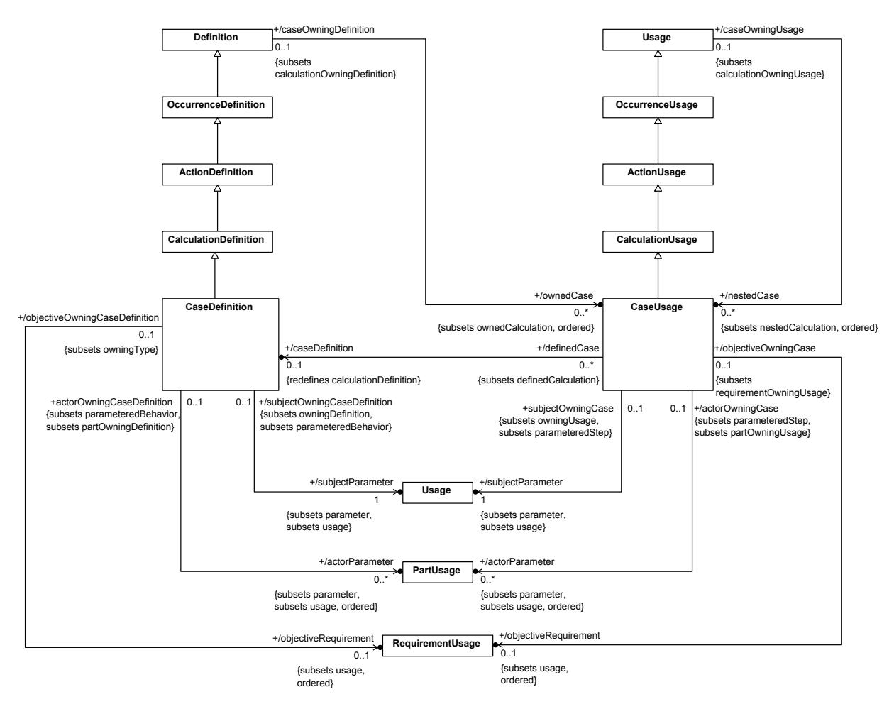

**Figure 42. Case Definition and Usage**

<span id="page-397-3"></span>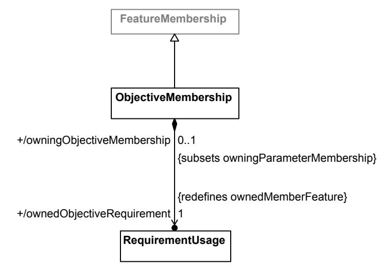

**Figure 43. Case Membership**

# <span id="page-398-0"></span>**8.3.22.2 CaseDefinition**

# **Description**

A CaseDefinition is a CalculationDefinition for a process, often involving collecting evidence or data, relative to a subject, possibly involving the collaboration of one or more other actors, producing a result that meets an objective.

# **General Classes**

CalculationDefinition

# **Attributes**

```
/actorParameter : PartUsage [0..*] {subsets parameter, usage, ordered}
```

The parameters of this CaseDefinition that represent actors involved in the case.

/objectiveRequirement : RequirementUsage [0..1] {subsets usage, ordered}

The RequirementUsage representing the objective of this CaseDefinition.

```
/subjectParameter : Usage {subsets parameter, usage}
```

The parameter of this CaseDefinition that represents its subject.

# **Operations**

None.

# **Constraints**

# checkCaseDefinitionSpecialization

A CaseDefinition must directly or indirectly specialize the base CaseDefinition *Cases::Case>* from the Systems Model Library.

```
specializesFromLibrary('Cases::Case')
```

# deriveCaseDefinitionActorParameter

The actorParameters of a CaseDefinition are the ownedActorParameters of the ActorMemberships of the CaseDefinition.

```
actorParameter = featureMembership->
    selectByKind(ActorMembership).
    ownedActorParameter
```

# deriveCaseDefinitionObjectiveRequirement

The objectiveRequirement of a CaseDefinition is the ownedObjectiveRequirement of its ObjectiveMembership, if any.

```
objectiveRequirement =
    let objectives: OrderedSet(RequirementUsage) =
        featureMembership->
            selectByKind(ObjectiveMembership).
```

```
ownedRequirement in
if objectives->isEmpty() then null
else objectives->first().ownedObjectiveRequirement
endif
```

# deriveCaseDefinitionSubjectParameter

The subjectParameter of a CaseDefinition is the ownedSubjectParameter of its SubjectMembership (if any).

```
subjectParameter =
    let subjectMems : OrderedSet(SubjectMembership) =
        featureMembership->selectByKind(SubjectMembership) in
    if subjectMems->isEmpty() then null
    else subjectMems->first().ownedSubjectParameter
    endif
```

# validateCaseDefinitionOnlyOneObjective

A CaseDefinition must have at most one featureMembership that is a ObjectiveMembership.

```
featureMembership->
    selectByKind(ObjectiveMembership)->
    size() <= 1
```

# validateCaseDefinitionOnlyOneSubject

A CaseDefinition must have at most one featureMembership that is a SubjectMembership.

```
featureMembership->selectByKind(SubjectMembership)->size() <= 1
```

# validateCaseDefinitionSubjectParameterPosition

The subjectParameter of a CaaseDefinition must be its first input.

```
input->notEmpty() and input->first() = subjectParameter
```

# <span id="page-399-0"></span>**8.3.22.3 CaseUsage**

# **Description**

A CaseUsage is a Usage of a CaseDefinition.

# **General Classes**

CalculationUsage

# **Attributes**

```
/actorParameter : PartUsage [0..*] {subsets parameter, usage, ordered}
```

The parameters of this CaseUsage that represent actors involved in the case.

```
/caseDefinition : CaseDefinition [0..1] {redefines calculationDefinition}
```

The CaseDefinition that is the type of this CaseUsage.

```
/objectiveRequirement : RequirementUsage [0..1] {subsets usage, ordered}
```

The RequirementUsage representing the objective of this CaseUsage.

/subjectParameter : Usage {subsets parameter, usage}

The parameter of this CaseUsage that represents its subject.

# **Operations**

None.

# **Constraints**

# checkCaseUsageSpecialization

A CaseUsage must directly or indirectly specialize the base CaseUsage *Cases::cases* from the Systems Model Library.

```
specializesFromLibrary('Cases::cases')
```

# checkCaseUsageSubcaseSpecialization

A composite CaseUsage whose owningType is a CaseDefinition or CaseUsage must directly or indirectly specialize the CaseUsage *Cases::Case::subcases*.

```
isComposite and owningType <> null and
    (owningType.oclIsKindOf(CaseDefinition) or
     owningType.oclIsKindOf(CaseUsage)) implies
    specializesFromLibrary('Cases::Case::subcases')
```

# deriveCaseUsageActorParameter

The actorParameters of a CaseUsage are the ownedActorParameters of the ActorMemberships of the CaseUsage.

```
actorParameter = featureMembership->
    selectByKind(ActorMembership).
    ownedActorParameter
```

# deriveCaseUsageObjectiveRequirement

The objectiveRequirement of a CaseUsage is the RequirementUsage it owns via an ObjectiveMembership, if any.

```
objectiveRequirement =
    let objectives: OrderedSet(RequirementUsage) =
        featureMembership->
            selectByKind(ObjectiveMembership).
            ownedRequirement in
    if objectives->isEmpty() then null
    else objectives->first().ownedObjectiveRequirement
    endif
```

# deriveCaseUsageSubjectParameter

The subjectParameter of a CaseUsage is the ownedSubjectParameter of its SubjectMembership (if any).

```
subjectParameter =
    let subjects : OrderedSet(SubjectMembership) =
```

```
featureMembership->selectByKind(SubjectMembership) in
if subjects->isEmpty() then null
else subjects->first().ownedSubjectParameter
endif
```

# validateCaseUsageOnlyOneObjective

A CaseUsage must have at most one featureMembership that is a ObjectiveMembership.

```
featureMembership->
    selectByKind(ObjectiveMembership)->
    size() <= 1
```

# validateCaseUsageOnlyOneSubject

A CaseUsage must have at most one featureMembership that is a SubjectMembership.

```
featureMembership->
        selectByKind(SubjectMembership)->
        size() <= 1
```

# validateCaseUsageSubjectParameterPosition

The subjectParameter of a CaseUsage must be its first input.

```
input->notEmpty() and input->first() = subjectParameter
```

# <span id="page-401-0"></span>**8.3.22.4 ObjectiveMembership**

# **Description**

An ObjectiveMembership is a FeatureMembership that indicates that its ownedObjectiveRequirement is the objective RequirementUsage for its owningType, which must be a CaseDefinition or CaseUsage.

# **General Classes**

FeatureMembership

# **Attributes**

/ownedObjectiveRequirement : RequirementUsage {redefines ownedMemberFeature}

The RequirementUsage that is the ownedMemberFeature of this RequirementUsage.

# **Operations**

None.

# **Constraints**

validateObjectiveMembershipIsComposite

The ownedObjectiveRequirement of an ObjectiveMembership must be composite.

```
ownedObjectiveRequirement.isComposite
```

validateObjectiveMembershipOwningType

The owningType of an ObjectiveMembership must be a CaseDefinition or CaseUsage.

owningType.oclIsType(CaseDefinition) or owningType.oclIsType(CaseUsage)

# <span id="page-402-0"></span>**8.3.23 Analysis Cases Abstract Syntax**

# **8.3.23.1 Overview**

<span id="page-402-3"></span><span id="page-402-1"></span>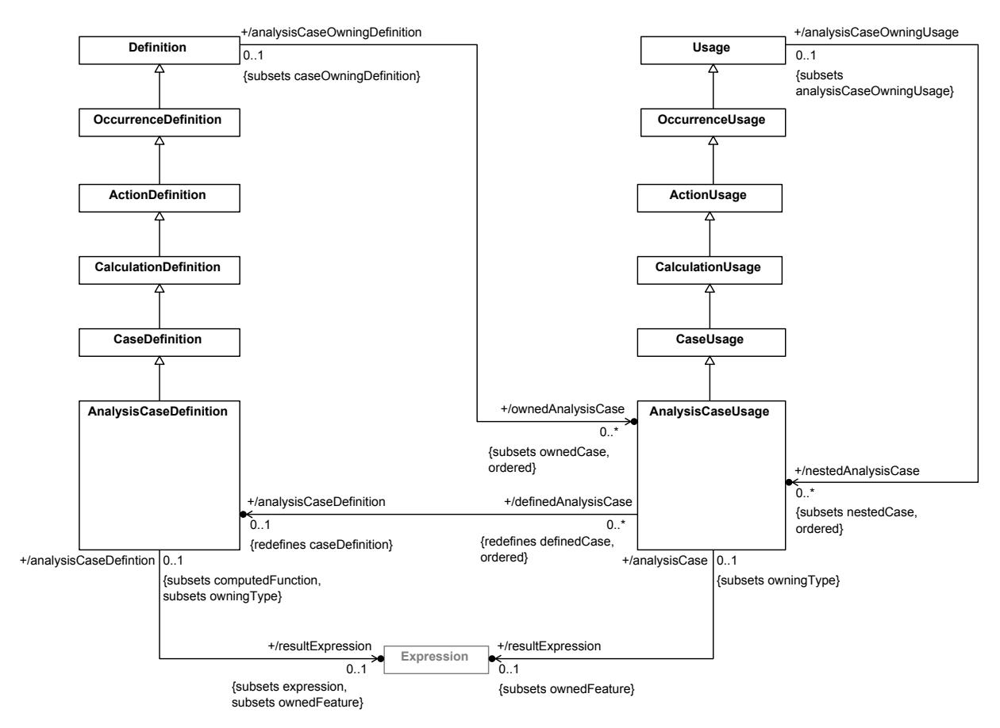

**Figure 44. Analysis Case Definition and Usage**

# <span id="page-402-2"></span>**8.3.23.2 AnalysisCaseDefinition**

# **Description**

An AnalysisCaseDefinition is a CaseDefinition for the case of carrying out an analysis.

# **General Classes**

CaseDefinition

# **Attributes**

/resultExpression : Expression [0..1] {subsets expression, ownedFeature}

An Expression used to compute the result of the AnalysisCaseDefinition, owned via a ResultExpressionMembership.

# **Operations**

None.

# **Constraints**

checkAnalysisCaseDefinitionSpecialization

An AnalysisCaseDefinition must directly or indirectly specialize the base AnalysisCaseDefinition *AnalysisCases::AnalysisCase* from the Systems Model Library.

```
specializesFromLibrary('AnalysisCases::AnalysisCase')
```

deriveAnalysisCaseDefinitionResultExpression

The resultExpression of a AnalysisCaseDefinition is the ownedResultExpression of its ResultExpressionMembership, if any.

```
resultExpression =
    let results : OrderedSet(ResultExpressionMembership) =
        featureMembersip->
            selectByKind(ResultExpressionMembership) in
    if results->isEmpty() then null
    else results->first().ownedResultExpression
    endif
```

# <span id="page-403-0"></span>**8.3.23.3 AnalysisCaseUsage**

# **Description**

An AnalysisCaseUsage is a Usage of an AnalysisCaseDefinition.

# **General Classes**

CaseUsage

# **Attributes**

/analysisCaseDefinition : AnalysisCaseDefinition [0..1] {redefines caseDefinition}

The AnalysisCaseDefinition that is the definition of this AnalysisCaseUsage.

/resultExpression : Expression [0..1] {subsets ownedFeature}

An Expression used to compute the result of the AnalysisCaseUsage, owned via a ResultExpressionMembership.

# **Operations**

None.

# **Constraints**

checkAnalysisCaseUsageSpecialization

An AnalysisCaseUsage must directly or indirectly specialize the base AnalysisCaseUsage *AnalysisCases::analysisCases* from the Systems Model Library.

```
specializesFromLibrary('AnalysisCases::analysisCases')
```

# checkAnalysisCaseUsageSubAnalysisCaseSpecialization

A composite AnalysisCaseUsage whose owningType is an AnalysisCaseDefinition or AnalysisCaseUsage must specialize the AnalysisCaseUsage *AnalysisCases::AnalysisCase::subAnalysisCases from the Systems Model Library.*

```
isComposite and owningType <> null and
    (owningType.oclIsKindOf(AnalysisCaseDefinition) or
     owningType.oclIsKindOf(AnalysisCaseUsage)) implies
    specializesFromLibrary('AnalysisCases::AnalysisCase::subAnalysisCases')
```

# deriveAnalysisCaseUsageResultExpression

The resultExpression of a AnalysisCaseUsage is the ownedResultExpression of its ResultExpressionMembership, if any.

```
resultExpression =
    let results : OrderedSet(ResultExpressionMembership) =
        featureMembersip->
            selectByKind(ResultExpressionMembership) in
    if results->isEmpty() then null
    else results->first().ownedResultExpression
    endif
```

# <span id="page-405-0"></span>**8.3.24 Verification Cases Abstract Syntax**

# <span id="page-405-1"></span>**8.3.24.1 Overview**

<span id="page-405-2"></span>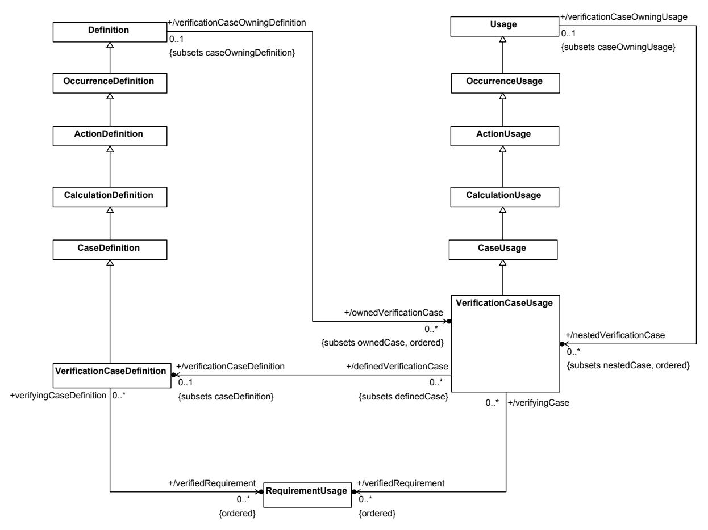

**Figure 45. Verification Case Definition and Usage**

<span id="page-405-3"></span>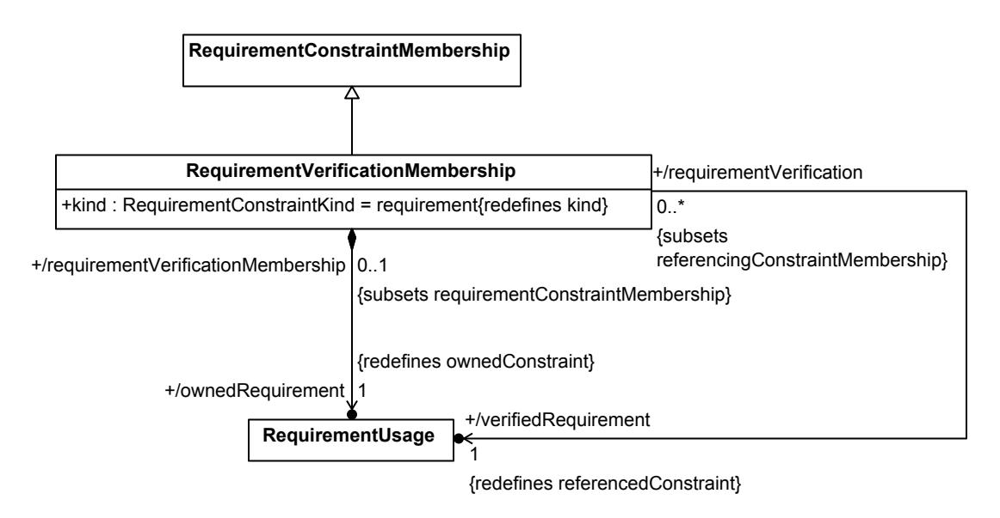

**Figure 46. Verification Membership**

# <span id="page-406-0"></span>**8.3.24.2 RequirementVerificationMembership**

# **Description**

A RequirementVerificationMembership is a RequirementConstraintMembership used in the objective of a VerificationCase to identify a RequirementUsage that is verified by the VerificationCase.

# **General Classes**

RequirementConstraintMembership

# **Attributes**

kind : RequirementConstraintKind {redefines kind}

The kind of a RequirementVerificationMembership must be requirement.

/ownedRequirement : RequirementUsage {redefines ownedConstraint}

The owned RequirementUsage that acts as the ownedConstraint for this RequirementVerificationMembership. This will either be the verifiedRequirement, or it will subset the verifiedRequirement.

/verifiedRequirement : RequirementUsage {redefines referencedConstraint}

The RequirementUsage that is identified as being verified. It is the referencedConstraint of the RequirementVerificationMembership considered as a RequirementConstraintMembership, which must be a RequirementUsage.

# **Operations**

None.

# **Constraints**

validateRequirementVerificationMembershipKind

A RequirementVerificationMembership must have kind = requirement.

kind = RequirementConstraintKind::requirement

# validateRequirementVerificationMembershipOwningType

The owningType of a RequirementVerificationMembership must a RequirementUsage that is owned by an ObjectiveMembership.

```
owningType.oclIsKindOf(RequirementUsage) and
owningType.owningFeatureMembership <> null and
owningType.owningFeatureMembership.oclIsKindOf(ObjectiveMembership)
```

# <span id="page-406-1"></span>**8.3.24.3 VerificationCaseDefinition**

# **Description**

A VerificationCaseDefinition is a CaseDefinition for the purpose of verification of the subject of the case against its requirements.

# **General Classes**

CaseDefinition

# **Attributes**

/verifiedRequirement : RequirementUsage [0..\*] {ordered}

The RequirementUsages verified by this VerificationCaseDefinition, which are the verifiedRequirements of all RequirementVerificationMemberships of the objectiveRequirement.

# **Operations**

None.

# **Constraints**

checkVerificationCaseSpecialization

A VerificationCaseDefinition must directly or indirectly specialize the base VerificationCaseDefinition *VerificationCases::VerificationCase* from the Systems Model Library.

```
specializesFromLibrary('VerificationCases::VerificationCase')
```

deriveVerificationCaseDefinitionVerifiedRequirement

The verifiedRequirements of a VerificationCaseDefinition are the verifiedRequirements of its RequirementVerificationMemberships.

```
verifiedRequirement =
    if objectiveRequirement = null then OrderedSet{}
    else
        objectiveRequirement.featureMembership->
            selectByKind(RequirementVerificationMembership).
            verifiedRequirement->asOrderedSet()
    endif
```

# <span id="page-407-0"></span>**8.3.24.4 VerificationCaseUsage**

# **Description**

A VerificationCaseUsage is a Usage of a VerificationCaseDefinition.

# **General Classes**

CaseUsage

# **Attributes**

/verificationCaseDefinition : VerificationCaseDefinition [0..1] {subsets caseDefinition}

The VerificationCase that is the definition of this VerificationCaseUsage.

/verifiedRequirement : RequirementUsage [0..\*] {ordered}

The RequirementUsages verified by this VerificationCaseUsage, which are the verifiedRequirements of all RequirementVerificationMemberships of the objectiveRequirement.

# **Operations**

None.

# **Constraints**

checkVerificationCaseUsageSpecialization

A VerificationCaseUsage must subset, directly or indirectly, the base VerificationCaseUsage *VerificationCases::verificationCases* from the Systems Model Library.

```
specializesFromLibrary('VerificationCases::verificationCases')
```

checkVerificationCaseUsageSubVerificationCaseSpecialization

If it is composite and owned by a VerificationCaseDefinition or VerificationCaseUsage, then it must specialize VerificationCaseUsage

*VerificationCases::VerificationCase::subVerificationCases.*

```
isComposite and owningType <> null and
    (owningType.oclIsKindOf(VerificationCaseDefinition) or
     owningType.oclIsKindOf(VerificationCaseUsage)) implies
    specializesFromLibrary('VerificationCases::VerificationCase::subVerificationCases')
```

# deriveVerificationCaseUsageVerifiedRequirement

The verifiedRequirements of a VerificationCaseUsage are the verifiedRequirements of its RequirementVerificationMemberships.

```
verifiedRequirement =
    if objectiveRequirement = null then OrderedSet{}
    else
        objectiveRequirement.featureMembership->
            selectByKind(RequirementVerificationMembership).
            verifiedRequirement->asOrderedSet()
    endif
```

# <span id="page-409-0"></span>**8.3.25 Use Cases Abstract Syntax**

# <span id="page-409-1"></span>**8.3.25.1 Overview**

<span id="page-409-3"></span>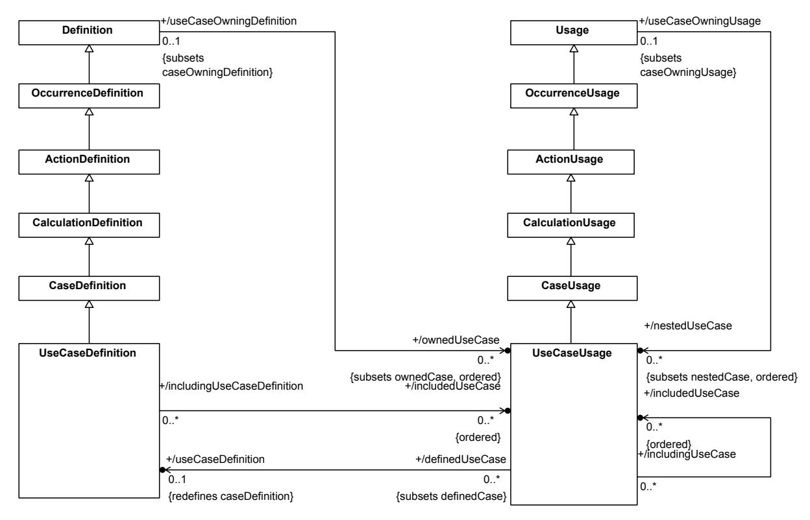

**Figure 47. Use Case Definition and Usage**

<span id="page-409-4"></span>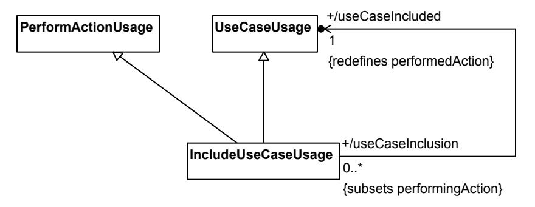

**Figure 48. Included Use Case**

# <span id="page-409-2"></span>**8.3.25.2 IncludeUseCaseUsage**

# **Description**

An IncludeUseCaseUsage is a UseCaseUsage that represents the inclusion of a UseCaseUsage by a UseCaseDefinition or UseCaseUsage. Unless it is the IncludeUseCaseUsage itself, the UseCaseUsage to be included is related to the includedUseCase by a ReferenceSubsetting Relationship. An IncludeUseCaseUsage is also a PerformActionUsage, with its useCaseIncluded as the performedAction.

# **General Classes**

PerformActionUsage UseCaseUsage

# **Attributes**

/useCaseIncluded : UseCaseUsage {redefines performedAction}

The UseCaseUsage to be included by this IncludeUseCaseUsage. It is the performedAction of the IncludeUseCaseUsage considered as a PerformActionUsage, which must be a UseCaseUsage.

# **Operations**

None.

# **Constraints**

checkIncludeUseCaseSpecialization

A IncludeUseCaseUsage whose owningType is a UseCaseDefinition or UseCaseUsage must directly or indirectly specialize the UseCaseUsage *UseCases::UseCase::includedUseCases* from the Systems Model Library.

```
owningType <> null and
(owningType.oclIsKindOf(UseCaseDefinition) or
 owningType.oclIsKindOf(UseCaseUsage) implies
    specializesFromLibrary('UseCases::UseCase::includedUseCases')
```

validateIncludeUseCaseUsageReference

If an IncludeUseCaseUsage has an ownedReferenceSubsetting, then the featureTarget of the referencedFeature must be a UseCaseUsage.

```
referencedFeatureTarget() <> null implies
    referencedFeatureTarget().oclIsKindOf(UseCaseUsage)
```

# <span id="page-410-0"></span>**8.3.25.3 UseCaseDefinition**

# **Description**

A UseCaseDefinition is a CaseDefinition that specifies a set of actions performed by its subject, in interaction with one or more actors external to the subject. The objective is to yield an observable result that is of value to one or more of the actors.

# **General Classes**

CaseDefinition

# **Attributes**

/includedUseCase : UseCaseUsage [0..\*] {ordered}

The UseCaseUsages that are included by this UseCaseDefinition, which are the useCaseIncludeds of the IncludeUseCaseUsages owned by this UseCaseDefinition.

# **Operations**

None.

# **Constraints**

checkUseCaseDefinitionSpecialization

A UseCaseDefinition must directly or indirectly specializes the base UseCaseDefinition *UseCases::UseCase* from the Systems Model Library.

```
specializesFromLibrary('UseCases::UseCase')
```

deriveUseCaseDefinitionIncludedUseCase

The includedUseCases of a UseCaseDefinition are the useCaseIncludeds of the IncludeUseCaseUsages owned by the UseCaseDefinition.

```
includedUseCase = ownedUseCase->
    selectByKind(IncludeUseCaseUsage).
    useCaseIncluded
```

# <span id="page-411-0"></span>**8.3.25.4 UseCaseUsage**

# **Description**

A UseCaseUsage is a Usage of a UseCaseDefinition.

# **General Classes**

CaseUsage

# **Attributes**

/includedUseCase : UseCaseUsage [0..\*] {ordered}

The UseCaseUsages that are included by this UseCaseUse, which are the useCaseIncludeds of the IncludeUseCaseUsages owned by this UseCaseUsage.

/useCaseDefinition : UseCaseDefinition [0..1] {redefines caseDefinition}

The UseCaseDefinition that is the definition of this UseCaseUsage.

# **Operations**

None.

# **Constraints**

checkUseCaseUsageSpecialization

A UseCaseUsage must directly or indirectly specializes the base UseCaseUsage *UseCases::useCases* from the Systems Model Library.

```
specializesFromLibrary('UseCases::useCases')
```

checkUseCaseUsageSubUseCaseSpecialization

A composite UseCaseUsage whose owningType is a UseCaseDefinition or UseCaseUsage must specialize the UseCaseUsage *UseCases::UseCase::subUseCases* from the Systems Model Library.

```
isComposite and owningType <> null and
(owningType.oclIsKindOf(UseCaseDefinition) or
 owningType.oclIsKindOf(UseCaseUsage)) implies
    specializesFromLibrary('UseCases::UseCase::subUseCases')
```

# deriveUseCaseUsageIncludedUseCase

The includedUseCases of a UseCaseUsage are the useCaseIncludeds of the IncludeUseCaseUsages owned by the UseCaseUsage.

```
includedUseCase = ownedUseCase->
    selectByKind(IncludeUseCaseUsage).
    useCaseIncluded
```

# <span id="page-412-0"></span>**8.3.26 Views and Viewpoints Abstract Syntax**

# <span id="page-412-1"></span>**8.3.26.1 Overview**

<span id="page-412-2"></span>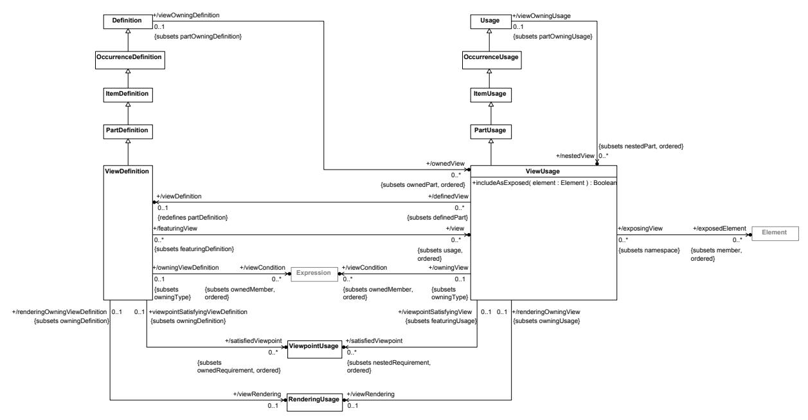

**Figure 49. View Definition and Usage**

<span id="page-413-0"></span>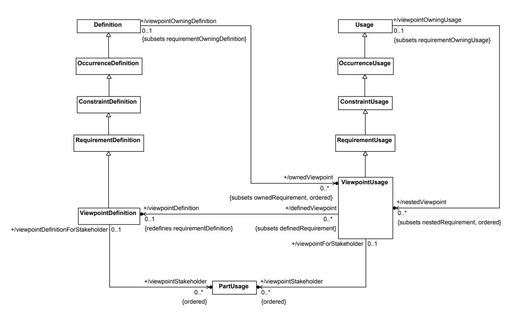

**Figure 50. Viewpoint Definition and Usage**

<span id="page-413-1"></span>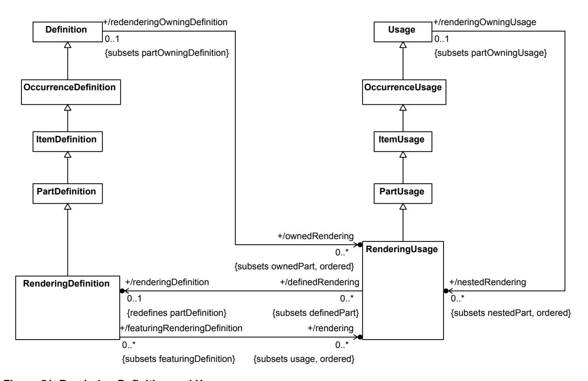

**Figure 51. Rendering Definition and Usage**

<span id="page-414-1"></span>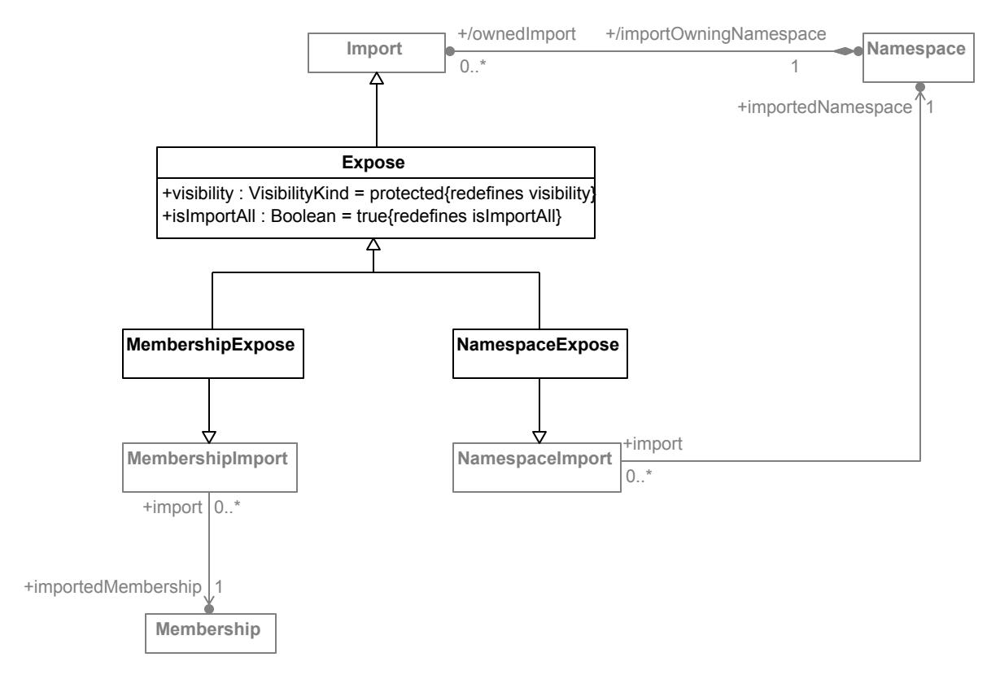

**Figure 52. Expose Relationship**

<span id="page-414-2"></span>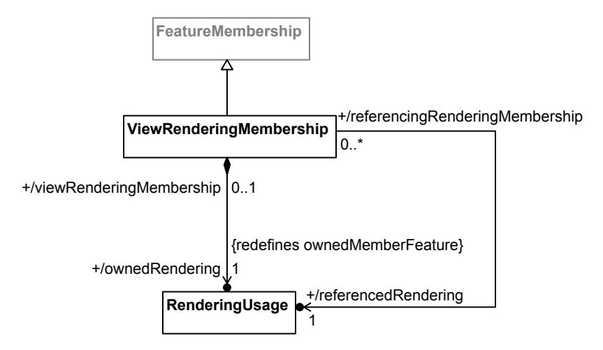

**Figure 53. View Rendering Membership**

# <span id="page-414-0"></span>**8.3.26.2 Expose**

# **Description**

An Expose is an Import of Memberships into a ViewUsage that provide the Elements to be included in a view. Visibility is always ignored for an Expose (i.e., isImportAll = true).

# **General Classes**

# Import

# **Attributes**

isImportAll : Boolean {redefines isImportAll}

An Expose always imports all Elements, regardless of visibility (isImportAll = true).

visibility : VisibilityKind {redefines visibility}

An Expose always has protected visibility.

# **Operations**

None.

# **Constraints**

validateExposeIsImportAll

An Expose always imports all Elements, regardless of visibility.

isImportAll

validateExposeOwningNamespace

The importOwningNamespace of an Expose must be a ViewUsage.

importOwningNamespace.oclIsType(ViewUsage)

validateExposeVisibility

An Expose always has protected visibility.

visibility = VisibilityKind::protected

# <span id="page-415-0"></span>**8.3.26.3 MembershipExpose**

# **Description**

A MembershipExpose is an Expose that exposes a specific importedMembership and, if isRecursive = true, additional Memberships recursively.

# **General Classes**

MembershipImport

Expose

**Attributes**

None.

**Operations**

None.

**Constraints**

None.

# <span id="page-416-0"></span>**8.3.26.4 NamespaceExpose**

# **Description**

A NamespaceExpose is an Expose Relationship that exposes the Memberships of a specific importedNamespace and, if isRecursive = true, additional Memberships recursively.

# **General Classes**

NamespaceImport Expose

# **Attributes**

None.

# **Operations**

None.

# **Constraints**

None.

# <span id="page-416-1"></span>**8.3.26.5 RenderingDefinition**

# **Description**

A RenderingDefinition is a PartDefinition that defines a specific rendering of the content of a model view (e.g., symbols, style, layout, etc.).

# **General Classes**

PartDefinition

# **Attributes**

/rendering : RenderingUsage [0..\*] {subsets usage, ordered}

The usages of a RenderingDefinition that are RenderingUsages.

# **Operations**

None.

# **Constraints**

checkRenderingDefinitionSpecialization

A RenderingDefinition must directly or indirectly specialize the base RenderingDefinition *Views::Rendering* from the Systems Model Library.

specializesFromLibrary('Views::Rendering')

# deriveRenderingDefinitionRendering

The renderings of a RenderingDefinition are all its usages that are RenderingUsages.

```
rendering = usages->selectByKind(RenderingUsage)
```

# <span id="page-417-0"></span>**8.3.26.6 RenderingUsage**

# **Description**

A RenderingUsage is the usage of a RenderingDefinition to specify the rendering of a specific model view to produce a physical view artifact.

# **General Classes**

PartUsage

# **Attributes**

/renderingDefinition : RenderingDefinition [0..1] {redefines partDefinition}

The RenderingDefinition that is the definition of this RenderingUsage.

# **Operations**

None.

# **Constraints**

# checkRenderingUsageRedefinition

A RenderingUsage whose owningFeatureMembership is a ViewRenderingMembership must redefine the RenderingUsage *Views::View::viewRendering*.

```
owningFeatureMembership <> null and
owningFeatureMembership.oclIsKindOf(ViewRenderingMembership) implies
    redefinesFromLibrary('Views::View::viewRendering')
```

# checkRenderingUsageSpecialization

A RenderingUsage must directly or indirectly specialize the base RenderingUsage *Views::renderings* from the Systems Model Library.

```
specializesFromLibrary('Views::renderings')
```

# checkRenderingUsageSubrenderingSpecialization

A RenderingUsage whose owningType is a RenderingDefinition or RenderingUsage must directly or indirectly specialize the RenderingUsage *Views::Rendering::subrenderings* from the Systems Model Library.

```
owningType <> null and
(owningType.oclIsKindOf(RenderingDefinition) or
 owningType.oclIsKindOf(RenderingUsage)) implies
    specializesFromLibrary('Views::Rendering::subrenderings')
```

# <span id="page-418-0"></span>**8.3.26.7 ViewDefinition**

# **Description**

A ViewDefinition is a PartDefinition that specifies how a view artifact is constructed to satisfy a viewpoint. It specifies a viewConditions to define the model content to be presented and a viewRendering to define how the model content is presented.

# **General Classes**

PartDefinition

# **Attributes**

/satisfiedViewpoint : ViewpointUsage [0..\*] {subsets ownedRequirement, ordered}

The composite ownedRequirements of this ViewDefinition that are ViewpointUsages for viewpoints satisfied by the ViewDefinition.

/view : ViewUsage [0..\*] {subsets usage, ordered}

The usages of this ViewDefinition that are ViewUsages.

/viewCondition : Expression [0..\*] {subsets ownedMember, ordered}

The Expressions related to this ViewDefinition by ElementFilterMemberships, which specify conditions on Elements to be rendered in a view.

/viewRendering : RenderingUsage [0..1]

The RenderingUsage to be used to render views defined by this ViewDefinition, which is the referencedRendering of the ViewRenderingMembership of the ViewDefinition.

# **Operations**

None.

# **Constraints**

checkViewDefinitionSpecialization

A ViewDefinition must directly or indirectly specialize the base ViewDefinition *Views::View* from the Systems Model Library.

```
specializesFromLibrary('Views::View')
```

deriveViewDefinitionSatisfiedViewpoint

The satisfiedViewpoints of a ViewDefinition are its ownedRequirements that are composite ViewpointUsages

```
satisfiedViewpoint = ownedRequirement->
    selectByKind(ViewpointUsage)->
    select(isComposite)
```

deriveViewDefinitionView

The views of a ViewDefinition are all its usages that are ViewUsages.

```
view = usage->selectByKind(ViewUsage)
```

# deriveViewDefinitionViewCondition

The viewConditions of a ViewDefinition are the conditions of its owned ElementFilterMemberships.

```
viewCondition = ownedMembership->
    selectByKind(ElementFilterMembership).
    condition
```

# deriveViewDefinitionViewRendering

The viewRendering of a ViewDefinition is the referencedRendering of its owned ViewRenderingMembership, if any.

```
viewRendering =
    let renderings: OrderedSet(ViewRenderingMembership) =
        featureMembership->selectByKind(ViewRenderingMembership) in
    if renderings->isEmpty() then null
    else renderings->first().referencedRendering
    endif
```

# validateViewDefinitionOnlyOneViewRendering

A ViewDefinition must have at most one ViewRenderingMembership.

```
featureMembership->
    selectByKind(ViewRenderingMembership)->
    size() <= 1
```

# <span id="page-419-0"></span>**8.3.26.8 ViewpointDefinition**

# **Description**

A ViewpointDefinition is a RequirementDefinition that specifies one or more stakeholder concerns that are to be satisfied by creating a view of a model.

# **General Classes**

RequirementDefinition

# **Attributes**

/viewpointStakeholder : PartUsage [0..\*] {ordered}

The PartUsages that identify the stakeholders with concerns framed by this ViewpointDefinition, which are the owned and inherited stakeholderParameters of the framedConcerns of this ViewpointDefinition.

# **Operations**

None.

# **Constraints**

checkViewpointDefinitionSpecialization

A ViewpointDefinition must directly or indirectly specialize the base ViewpointDefinition *Views::Viewpoint* from the Systems Model Library.

```
specializesFromLibrary('Views::Viewpoint')
```

# deriveViewpointDefinitionViewpointStakeholder

The viewpointStakeholders of a ViewpointDefinition are the ownedStakeholderParameters of all featureMemberships that are StakeholderMemberships.

```
viewpointStakeholder = framedConcern.featureMemberhsip->
    selectByKind(StakeholderMembership).
    ownedStakeholderParameter
```

# <span id="page-420-0"></span>**8.3.26.9 ViewpointUsage**

# **Description**

A ViewpointUsage is a Usage of a ViewpointDefinition.

# **General Classes**

RequirementUsage

# **Attributes**

/viewpointDefinition : ViewpointDefinition [0..1] {redefines requirementDefinition}

The ViewpointDefinition that is the definition of this ViewpointUsage.

/viewpointStakeholder : PartUsage [0..\*] {ordered}

The PartUsages that identify the stakeholders with concerns framed by this ViewpointUsage, which are the owned and inherited stakeholderParameters of the framedConcerns of this ViewpointUsage.

# **Operations**

None.

# **Constraints**

checkViewpointUsageSpecialization

A ViewpointUsage must directly or indirectly specialize the base ViewpointUsage *Views::viewpoints* from the Systems Model Library.

```
specializesFromLibrary('Views::viewpoints')
```

checkViewpointUsageViewpointSatisfactionSpecialization

A composite ViewpointUsage whose owningType is a ViewDefinition or ViewUsage must directly or indirectly specialize the ViewpointUsage *Views::View::viewpointSatisfactions* from the Systems Model Library.

```
isComposite and owningType <> null and
(owningType.oclIsKindOf(ViewDefinition) or
```

```
owningType.oclIsKindOf(ViewUsage)) implies
   specializesFromLibrary('Views::View::viewpointSatisfactions')
```

# deriveViewpointUsageViewpointStakeholder

The viewpointStakeholders of a ViewpointUsage are the ownedStakeholderParameters of all featureMemberships that are StakeholderMemberships.

```
viewpointStakeholder = framedConcern.featureMemberhsip->
    selectByKind(StakeholderMembership).
    ownedStakeholderParameter
```

# <span id="page-421-0"></span>**8.3.26.10 ViewRenderingMembership**

# **Description**

A ViewRenderingMembership is a FeatureMembership that identifies the viewRendering of a ViewDefinition or ViewUsage.

# **General Classes**

FeatureMembership

# **Attributes**

/ownedRendering : RenderingUsage {redefines ownedMemberFeature}

The owned RenderingUsage that is either itself the referencedRendering or subsets the referencedRendering

/referencedRendering : RenderingUsage

The RenderingUsage that is referenced through this ViewRenderingMembership. It is the referencedFeature of the ownedReferenceSubsetting for the ownedRendering, if there is one, and, otherwise, the ownedRendering itself.

# **Operations**

None.

# **Constraints**

deriveVewRenderingMembershipReferencedRendering

The referencedRendering of a ViewRenderingMembership is the the featureTarget of the referencedFeature of the ownedReferenceSubsetting (which must be a RenderingUsage) of the ownedRendering, if there is one, and, otherwise, the ownedRendering itself.

```
referencedRendering =
    let referencedFeature : Feature =
        ownedRendering.referencedFeatureTarget() in
    if referencedFeature = null then ownedRendering
    else if referencedFeature.oclIsKindOf(RenderingUsage) then
        refrencedFeature.oclAsType(RenderingUsage)
    else null
    endif endif
```

validateViewRenderingMembershipOwningType

The owningType of a ViewRenderingMembership must be a ViewDefinition or a ViewUsage.

```
owningType.oclIsKindOf(ViewDefinition) or
owningType.oclIsKindOf(ViewUsage)
```

# <span id="page-422-0"></span>**8.3.26.11 ViewUsage**

# **Description**

A ViewUsage is a usage of a ViewDefinition to specify the generation of a view of the members of a collection of exposedNamespaces. The ViewUsage can satisfy more viewpoints than its definition, and it can specialize the viewRendering specified by its definition.

# **General Classes**

PartUsage

# **Attributes**

/exposedElement : Element [0..\*] {subsets member, ordered}

The Elements that are exposed by this ViewUsage, which are those memberElements of the imported Memberships from all the Expose Relationships that meet all the owned and inherited viewConditions.

/satisfiedViewpoint : ViewpointUsage [0..\*] {subsets nestedRequirement, ordered}

The nestedRequirements of this ViewUsage that are ViewpointUsages for (additional) viewpoints satisfied by the ViewUsage.

/viewCondition : Expression [0..\*] {subsets ownedMember, ordered}

The Expressions related to this ViewUsage by ElementFilterMemberships, which specify conditions on Elements to be rendered in a view.

/viewDefinition : ViewDefinition [0..1] {redefines partDefinition}

The ViewDefinition that is the definition of this ViewUsage.

/viewRendering : RenderingUsage [0..1]

The RenderingUsage to be used to render views defined by this ViewUsage, which is the referencedRendering of the ViewRenderingMembership of the ViewUsage.

# **Operations**

includeAsExposed(element : Element) : Boolean

Determine whether the given element meets all the owned and inherited viewConditions.

```
body: let metadataFeatures: Sequence(AnnotatingElement) =
    element.ownedAnnotation.annotatingElement->
        select(oclIsKindOf(MetadataFeature)) in
self.membership->selectByKind(ElementFilterMembership).
    condition->forAll(cond |
        metadataFeatures->exists(elem |
            cond.checkCondition(elem)))
```

# **Constraints**

# checkViewUsageSpecialization

A ViewUsage must directly or indirectly specialize the base ViewUsage *Views::views* from the Systems Model Library.

```
specializesFromLibrary('Views::views')
```

# checkViewUsageSubviewSpecialization

A ViewUsage whose owningType is a ViewDefinition or ViewUsage must specialize the ViewUsage *Views::View::subviews* from the Systems Library Model.

```
owningType <> null and
(owningType.oclIsKindOf(ViewDefinition) or
 owningType.oclIsKindOf(ViewUsage)) implies
    specializesFromLibrary('Views::View::subviews')
```

# deriveViewUsageExposedElement

The exposedElements of a ViewUsage are those memberElements of the imported Memberships from all the Expose Relationships for which the includeAsExposed operation returns true.

```
exposedElement = ownedImport->selectByKind(Expose).
    importedMemberships(Set{}).memberElement->
    select(elm | includeAsExposed(elm))->
    asOrderedSet()
```

# deriveViewUsageSatisfiedViewpoint

The satisfiedViewpoints of a ViewUsage are its ownedRequirements that are composite ViewpointUsages

```
satisfiedViewpoint = ownedRequirement->
    selectByKind(ViewpointUsage)->
    select(isComposite)
```

# deriveViewUsageViewCondition

The viewConditions of a ViewUsage are the conditions of its owned ElementFilterMemberships.

```
viewCondition = ownedMembership->
    selectByKind(ElementFilterMembership).
    condition
```

# deriveViewUsageViewRendering

The viewRendering of a ViewUsage is the referencedRendering of its owned ViewRenderingMembership, if any.

```
viewRendering =
    let renderings: OrderedSet(ViewRenderingMembership) =
        featureMembership->selectByKind(ViewRenderingMembership) in
    if renderings->isEmpty() then null
    else renderings->first().referencedRendering
    endif
```

# validateViewUsageOnlyOneViewRendering

A ViewUsage must have at most one ViewRenderingMembership.

```
featureMembership->
    selectByKind(ViewRenderingMembership)->
    size() <= 1
```

# <span id="page-424-0"></span>**8.3.27 Metadata Abstract Syntax**

# <span id="page-424-1"></span>**8.3.27.1 Overview**

<span id="page-424-3"></span>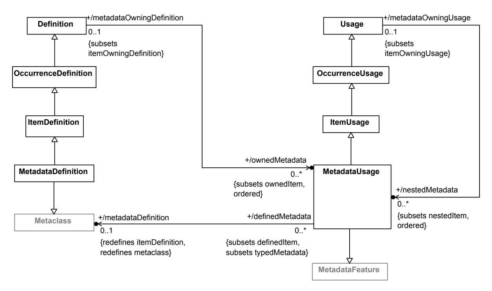

**Figure 54. Metadata Definition and Usage**

# <span id="page-424-2"></span>**8.3.27.2 MetadataDefinition**

# **Description**

A MetadataDefinition is an ItemDefinition that is also a Metaclass.

# **General Classes**

ItemDefinition

Metaclass

# **Attributes**

None.

# **Operations**

None.

# **Constraints**

checkMetadataDefinitionSpecialization

A MetadataDefinition must directly or indirectly specialize the base MetadataDefinition *Metadata::MetadataItem* from the Systems Model Library.

specializesFromLibrary('Metadata::MetadataItem')

# <span id="page-425-0"></span>**8.3.27.3 MetadataUsage**

# **Description**

A MetadataUsage is a Usage and a MetadataFeature, used to annotate other Elements in a system model with metadata. As a MetadataFeature, its type must be a Metaclass, which will nominally be a MetadataDefinition. However, any kernel Metaclass is also allowed, to permit use of Metaclasses from the Kernel Model Libraries.

# **General Classes**

MetadataFeature ItemUsage

# **Attributes**

/metadataDefinition : Metaclass [0..1] {redefines itemDefinition, metaclass}

The MetadataDefinition that is the definition of this MetadataUsage.

# **Operations**

None.

# **Constraints**

checkMetadataUsageSpecialization

A MetadataUsage must directly or indirectly specialize the base MetadataUsage *Metadata::metadataItems* from the Systems Model Library.

specializesFromLibrary('Metadata::metadataItems')

# <span id="page-425-1"></span>**8.4 Semantics**

# <span id="page-425-2"></span>**8.4.1 Semantics Overview**

The semantics of constructs in SysML are specified in terms of the constructs defined in KerML supported by reuse of model elements from the Kernel Semantic Model Library (see [KerML, 9.2]) and the Systems Model Library (see [9.2](#page-492-2) ). This is similar to how the KerML Kernel Layer semantics are build on the KerML Core Layer (see [KerML, 8.4.4.1]). The semantic requirements are formalized by *semantic constraints* included in the SysML abstract syntax (see also [8.3.1](#page-286-2) on the various kinds of constraints in the abstract syntax). Additionally, other semantic constraints require relationships between elements within a user model necessary for the model to be semantically well formed.

Specifically, there are four categories of semantic constraints used to specify SysML semantics, each dealing with a different kind of relationship.

- 1. *Specialization constraints.* These constraints require that Definition or Usage elements of a certain kind directly or indirectly specialize some specific base Definition or Usage from the Kernel Semantic Library or the Systems Model Library. They are the fundamental means for providing semantics to abstract syntax elements in SysML. Specialization constraints always have the word Specialization in their name. For example, checkPartDefinitionSpecialization requires that a PartDefinition directly or indirectly specialize the PartDefinition *Parts::Part* from the Systems Model Library.
- 2. *Redefinition constraints.* These constraints require that certain Usages in a model have Redefinition relationships with certain other Usages (or KerML Features) in the model. While Redefinitions are kinds of Specializations, redefinition constraints differ from the specialization constraints described above because of the specific semantics of redefinition. Redefinition constraints always have the word Redefinition in their name. For example, checkRenderingUsageRedefinition requires a Redefinition on a RenderingUsage used to specify a viewRendering.
- 3. *Type-featuring constraints.* These constraints require that certain Usages in a model have TypeFeaturing relationships with certain other Definitions or Usages in the model. The SysML specification includes only one constraint in this category, checkVariationUsageTypeFeaturing, which applies to a variant Usage in a variation model. However, various type-featuring constraints from KerML also apply to corresponding SysML constructs. For instance, the KerML checkConnectorTypeFeaturing also applies to SysML ConnectionUsages.
- 4. *Binding-connector constraints.* These constraints require that BindingConnectors exist between certain Features in a model. For example, checkSatisfyRequirementUsageBindingConnector requires that the satisfyingFeature of a SatisfyRequirementUsage be bound to the subject of the SatisfyRequirementUsage. (In a SysML model, it is allowable for binding-connector constraints to be satisfied by SysML BindingConnectorAsUsages, rather than plain KerML BindingConnectors.)

A SysML model parsed from the textual or graphical concrete syntax (see [8.2](#page-194-2) ) or obtained through model interchange (see [KerML, Clause 10]) will not necessarily meet the semantic constraints specified for the abstract syntax. In this case, a tool may insert certain implied Relationships into the model in order to meet the semantic constraints. In all cases, the semantics of a model are only defined if it meets all semantic and validation constraints (see [8.3.1](#page-286-2) ).

For specialization constraints applying to Definitions, the implied Relationship is a Subclassification, as given in [Table 31](#page-427-0) . For specialization constraints applying to Usages, the implied Relationship is a Subsetting, as given in [Table 32](#page-428-0) . For redefinition, type-featuring and binding-connector constraints, the implied Relationship is a Redefinition, TypeFeaturing, or BindingConnector, as given in [Table 33](#page-431-0) . Note that an implied Relationship should only be added if the constraint would actually be violated otherwise. For the detailed conditions on when a constraint applies, see its specification in the abstract syntax model ( [8.3](#page-286-1) ).

When including implied Relationships for specialization constraints, it is possible that multiple such constraints may apply to a single Element. For example, a PartDefinition is a kind of ItemDefinition, which is a kind of OccurrenceDefinition, and there are specialization constraints for all three of these metaclasses, with corresponding implied Subclassification Relationships. However, simply including all three implied Subclassification would be redundant, because the Subclassification implied by the checkPartDefinitionSpecialization constraint will also automatically satisfy the checkItemDefinitionSpecialization and checkOccurrenceDefinitionSpecialization constraints.

Therefore, in order to avoid redundant Relationships, a tool should observe the following rules when selecting which Specializations to actually include for a certain constrained Element, out of the set of those implied by all specialization constraints applicable to the Element:

- 1. If there is any ownedSpecialization or other implied Specialization whose general Type is a direct or indirect subtype of (but not the same as) the general Type of an implied Specialization, or if there is an ownedSpecialization with the same general Type, then that implied Specialization should *not* be included.
- 2. If there are two implied Specializations with the same general Type, then only one should be included.

Note that the above rules do *not* apply to Redefinitions implied by redefinition constraints, because Redefinition relationships have semantics beyond just basic Specialization.

The following subclauses specify the semantics for each syntactic area of SysML in terms of the semantic constraints that must be satisfied for various Elements, the pattern of Relationships these imply, and the model library Elements that are reused to support this. For compactness, the textual notation is used in these subclauses to present model snippets to illustrate the semantic patterns being discussed. However, it should be understood that, like the semantic constraints themselves, these semantic patterns are actually defined on the abstract syntax representation of a model, independent of its textual or graphical concrete syntax representation.

**Table 31. Implied Definition Subclassification Relationships**

<span id="page-427-0"></span>

| Semantic Constraint                                   | Subclassification Target<br>(see Note 1) |
|-------------------------------------------------------|------------------------------------------|
| checkOccurrenceDefinitionIndividual<br>Specialization | Occurrences::Life                        |
| checkItemDefinitionSpecialization                     | Items::Item                              |
| checkPartDefinitionSpecialization                     | Parts::Part                              |
| checkPortDefinitionSpecialization                     | Ports::Port                              |
| checkConnectionDefinitionSpecialization               | Connections::Connection                  |
| checkConnectionDefinitionBinarySpecialization         | Connections::BinaryConnection            |
| checkInterfaceDefinitionSpecialization                | Interfaces::Interface                    |
| checkInterfaceDefinitionBinarySpecialization          | Interface::BinaryInterface               |
| checkAllocationDefinitionSpecialization               | Allocations::Allocation                  |
| checkFlowDefinitionSpecialization                     | Flows::MessageAction                     |
| checkFlowDefinitionBinarySpecialization               | Flows::Message                           |
| checkActionDefinitionSpecialization                   | Actions::Action                          |
| checkStateDefinitionSpecialization                    | States::StateAction                      |
| checkCalculationDefinitionSpecialization              | Calculations::Calculation                |
| checkConstraintDefinitionSpecialization               | Constraints::ConstraintCheck             |
| checkRequirementDefinitionSpecialization              | Requirements::RequirementCheck           |
| checkConcernDefinitionSpecialization                  | Concerns::ConcernCheck                   |
| checkCaseDefinitionSpecialization                     | Cases::Case                              |
| checkAnalysisCaseDefinitionSpecialization             | AnalysisCases::AnalysisCase              |
| checkVerificationCaseDefinitionSpecialization         | VerificationCases::VerificationCase      |
| checkUseCaseDefinitionSpecialization                  | UseCases::UseCase                        |
| checkViewDefinitionSpecialization                     | Views::View                              |
| checkViewpointDefinitionSpecialization                | Views::ViewpointCheck                    |
| checkRenderingDefinitionSpecialization                | Views::Rendering                         |
| checkMetadataDefinitionSpecialization                 | Views::MetadataItem                      |

1. In all cases, the source of the Subclassification is the Definition to which the constraint applies.

**Table 32. Implied Usage Subsetting Relationships**

<span id="page-428-0"></span>

| Semantic Constraint                                     | Subsetting Target<br>(see Note 1)                                                                                |
|---------------------------------------------------------|------------------------------------------------------------------------------------------------------------------|
| checkUsageVariationUsageSpecialization                  | owningVariationUsage of the<br>Usage                                                                             |
| checkAttributeUsageSpecialization                       | Attributes::attributes                                                                                           |
| checkEventOccurrenceSpecialization                      | Occurrences::Occurrence::<br>timeEnclosedOccurrences                                                             |
| checkOccurrenceDefinitionMultiplicity<br>Specialization | Base::exactlyOne (source is the<br>multiplicity of<br>the<br>OccurrenceDefinition)                               |
| checkOccurrenceUsageSpecialization                      | Occurrences::occurrences                                                                                         |
| checkOccurrenceUsageSuboccurrence<br>Specialization     | Occurrences::Occurrence::<br>suboccurrences                                                                      |
| checkOccurrenceUsageSnapshot<br>Specialization          | Occurrences::Occurrence::<br>snapshots                                                                           |
| checkOccurrenceUsageTimeSlice<br>Specialization         | Occurrences::Occurrence::<br>timeSlices                                                                          |
| checkItemUsageSpecialization                            | Items::items                                                                                                     |
| checkItemUsageSubitemSpecialization                     | Items::Item::subitems                                                                                            |
| checkPartUsageSpecialization                            | Parts::parts                                                                                                     |
| checkPartUsageSubpartSpecialization                     | Items::Item::subparts                                                                                            |
| checkPartUsageActorSpecialization                       | Requirements::Requirement::actors or<br>Cases::Case::actors (depending on the<br>owningType of the<br>PartUsage) |
| checkPartUsageStakeholderSpecialization                 | Requirements::Requirement::<br>stakeholders                                                                      |
| checkPortUsageSpecialization                            | Ports::ports                                                                                                     |
| checkPortUsageSubportSpecialization                     | Ports::Port::subports                                                                                            |
| checkPortUsageOwnedPortSpecialization                   | Parts::Part::ownedPorts                                                                                          |
| checkConnectionUsageSpecialization                      | Connections::connections                                                                                         |
| checkConnectionUsageBinarySpecialization                | Connections::binaryConnections                                                                                   |
| checkInterfaceUsageSpecialization                       | Interfaces::interfaces                                                                                           |
| checkInterfaceUsageBinarySpecialization                 | Interfaces::binaryInterfaces                                                                                     |
| checkAllocationUsageSpecialization                      | Allocations::allocations                                                                                         |
| checkFlowUsageSpecialization                            | Flows::messages                                                                                                  |
| checkFlowUsageFlowSpecialization                        | Flows::Flows                                                                                                     |

| Semantic Constraint                                   | Subsetting Target<br>(see Note 1)                                                                                           |
|-------------------------------------------------------|-----------------------------------------------------------------------------------------------------------------------------|
| checkSuccessionFlowUsage<br>Specialization            | Flow::successionFlowss                                                                                                      |
| checkActionUsageSpecialization                        | Actions::actions                                                                                                            |
| checkActionUsageSubactionSpecialization               | Actions::Action::subactions                                                                                                 |
| checkActionUsageOwnedActionSpecialization             | Parts::Part::ownedActions                                                                                                   |
| checkActionUsageAnalysisAction<br>Specialization      | AnalysisCases::AnalysisCase::<br>analysisActions                                                                            |
| checkControlNodeSpecialization                        | Actions::Action::controls                                                                                                   |
| checkJoinNodeSpecialization                           | Actions::Action::joins                                                                                                      |
| checkForkNodeSpecialization                           | Actions::Action::forks                                                                                                      |
| checkMergeNodeSpecialization                          | Actions::Action::merges                                                                                                     |
| checkMergeNodeIncomingSuccession<br>Specialization    | incomingHBLink of the<br>MergeNode (source is the<br>incoming<br>Succession)                                                |
| checkDecisionNodeSpecialization                       | Actions::Action::decisions                                                                                                  |
| checkDecisionNodeOutgoingSuccession<br>Specialization | outgoingHBLink of the<br>DecisionNode (source is the<br>outgoing<br>Succession)                                             |
| checkSendActionUsageSpecialization                    | Actions::sendActions                                                                                                        |
| checkSendActionUsageSubaction<br>Specialization       | Actions::Action::sendSubactions                                                                                             |
| checkAcceptActionUsageSpecialization                  | Actions::acceptActions                                                                                                      |
| checkAcceptActionUsageSubaction<br>Specialization     | Actions::Action::acceptSubctions                                                                                            |
| checkAcceptActionUsageTriggerAction<br>Specialization | Actions::TransitionAction::accepter                                                                                         |
| checkAssignmentActionUsageSpecialization              | Actions::assignmentActions                                                                                                  |
| checkAssignmentActionUsageSubaction<br>Specialization | Actions::Action::assignments                                                                                                |
| checkTerminateActionUsageSpecialization               | Actions::terminateActions                                                                                                   |
| checkTerminateActionUsageSubaction<br>Specialization  | Actions::Action::terminateSubactions                                                                                        |
| checkIfActionUsageSpecialization                      | Actions::ifThenActions or<br>Actions::ifThenElseActions (depending on<br>whether the<br>IfActionUsage has an<br>elseClause) |
| checkIfActionUsageSubactionSpecialization             | Actions::Action::ifSubactions                                                                                               |
| checkWhileLoopActionUsageSpecialization               | Actions::whileLoopActions                                                                                                   |
| checkWhileLoopActionUsageSubaction<br>Specialization  | Actions::Action::whileLoops                                                                                                 |

| Semantic Constraint                                         | Subsetting Target<br>(see Note 1)                                                                                                                                                                                       |  |
|-------------------------------------------------------------|-------------------------------------------------------------------------------------------------------------------------------------------------------------------------------------------------------------------------|--|
| checkForLoopActionUsageSpecialization                       | Actions::forLoopActions                                                                                                                                                                                                 |  |
| checkForLoopActionUsageSubaction<br>Specialization          | Actions::Action::forLoops                                                                                                                                                                                               |  |
| checkPerformActionUsageSpecialization                       | Parts::Part::performedActions                                                                                                                                                                                           |  |
| checkStateUsageSpecialization                               | States::stateActions                                                                                                                                                                                                    |  |
| checkStateUsageOwnedStateSpecialization                     | Parts::Part::ownedStates                                                                                                                                                                                                |  |
| checkStateUsageSubstateSpecialization                       | States::State::substates                                                                                                                                                                                                |  |
| checkStateUsageExclusiveState<br>Specialization             | States::State::exclusiveStates                                                                                                                                                                                          |  |
| checkTransitionUsageSpecialization                          | Actions::transitions                                                                                                                                                                                                    |  |
| checkTransitionUsageActionSpecialization                    | Actions::Action::decisionTransitions                                                                                                                                                                                    |  |
| checkTransitionUsageStateSpecialization                     | States::StateAction::stateTransitions                                                                                                                                                                                   |  |
| checkTransitionUsagePayloadSpecialization                   | TransitionAction::triggerAction.<br>payloadParameter (source is<br>TransitionAction::payload)                                                                                                                           |  |
| checkTransitionUsageSuccessionSource<br>Specialization      | source of the<br>TransitionUsage (source is the<br>sourceFeature of the<br>succession of the<br>TransitionUsage;<br>Relationship is a<br>ReferenceSubsetting)                                                           |  |
| checkTransitionUsageTransitionFeature<br>Specialization     | accepter,<br>guard, or<br>effect of<br>Actions::TranstionActions (for the<br>triggerActions,<br>guardExpressions, and<br>effectActions of the<br>TransitionUsage,<br>respectively)                                      |  |
| checkExhibitStateUsageSpecialization                        | Parts::Part::exhibitedStates                                                                                                                                                                                            |  |
| checkCalculationUsageSpecialization                         | Calculations::calculations                                                                                                                                                                                              |  |
| checkCalculationUsageSubcalculation<br>Specialization       | Calculations::Calculation::subcalculations                                                                                                                                                                              |  |
| checkConstraintUsageSpecialization                          | Constraints::constraintChecks                                                                                                                                                                                           |  |
| checkConstraintUsageCheckedConstraint<br>Specialization     | Items::Item::checkConstraints                                                                                                                                                                                           |  |
| checkConstraintUsageRequirementConstraint<br>Specialization | Requirements::RequirementCheck::assumptions<br>or<br>Requirements::RequirementCheck::constraints<br>(depending on whether the kind of the owning<br>RequirementConstraintMembership is<br>assumption or<br>requirement) |  |
| checkAssertConstraintUsageSpecialization                    | Either<br>Constraints::assertedConstraints (if<br>isNegated = false) or<br>Constraints::negatedConstraints (if<br>isNegated<br>= true)                                                                                  |  |

| Semantic Constraint                                             | Subsetting Target<br>(see Note 1)                                      |
|-----------------------------------------------------------------|------------------------------------------------------------------------|
| checkRequirementUsageSpecialization                             | Requirements::requirementChecks                                        |
| checkRequirementUsageSubrequirement<br>Specialization           | Requirements::RequirementCheck::<br>subrequirement                     |
| checkRequirementUsageRequirement<br>VerificationSpecialization  | VerificationCases::VerificationCase::obj::<br>requirementVerifications |
| checkConcernUsageSpecialization                                 | Requirements::concernChecks                                            |
| checkConcernUsageFramedConcern<br>Specialization                | Requirements::RequirementCheck::concerns                               |
| checkCaseUsageSpecialization                                    | Cases::Cases                                                           |
| checkCaseUsageSubcaseSpecialization                             | Cases::Case::subcases                                                  |
| checkAnalysisCaseUsageSpecialization                            | AnalysisCases::analysisCases                                           |
| checkAnalysisCaseUsageSubAnalysisCase<br>Specialization         | AnalysisCases::AnalysisCase::<br>subAnalysisCases                      |
| checkVerificationCaseUsageSpecialization                        | VerificationCases::verificationCases                                   |
| checkVerificationCaseUsageSubVerification<br>CaseSpecialization | VerificationCases::VerificationCase::<br>subVerificationCases          |
| checkUseCaseUsageSpecialization                                 | UseCases::useCases                                                     |
| checkUseCaseUsageSubUseCaseSpecialization                       | UseCases::UseCase::subUseCases                                         |
| checkIncludeUseCaseUsageSpecialization                          | UseCases::UseCase::includedUseCases                                    |
| checkViewUsageSpecialization                                    | Views::views                                                           |
| checkViewUsageSubviewSpecialization                             | Views::View::subviews                                                  |
| checkViewpointUsageSpecialization                               | Views::viewpoints                                                      |
| checkViewpointUsageViewpointSatisfaction<br>Specialization      | Views::View::viewpointSatisfactions                                    |
| checkRenderingUsageSpecialization                               | Views::renderings                                                      |
| checkRenderingUsageSubrendering<br>Specialization               | Views::Rendering::subrenderings                                        |
| checkMetadataUsageSpecialization                                | Metadata::metadataItems                                                |

1. Unless otherwise indicated, the source of the Subsetting is the Usage to which the constraint applies.

# **Table 33. Other Implied Relationships**

<span id="page-431-0"></span>

| Semantic Constraint | Source | Target |
|---------------------|--------|--------|
| Redefinition        |        |        |

| Semantic Constraint                                       | Source                                                                                                           | Target                                                                                                                                                                                               |
|-----------------------------------------------------------|------------------------------------------------------------------------------------------------------------------|------------------------------------------------------------------------------------------------------------------------------------------------------------------------------------------------------|
| checkActionUsageStateAction<br>Redefinition               | The<br>ActionUsage                                                                                               | entryAction,<br>doAction,<br>or<br>exitAction of<br>States::StateAction (depending<br>on whether the<br>kind of the owning<br>StateSubactionMembership is<br>entry,<br>do, or<br>exit, respectively) |
| checkAssignmentActionUsage<br>AccessedFeatureRedefinition | The first<br>ownedFeature of the first<br>ownedFeature of the first<br>parameter of the<br>AssignmentActionUsage | AssignmentAction::target::<br>startingAt::accessedFeature                                                                                                                                            |
| checkAssignmentActionUsage<br>ReferentRedefinition        | The first<br>ownedFeature of the first<br>ownedFeature of the first<br>parameter of the<br>AssignmentActionUsage | referent of the<br>AssignmentActionUsage                                                                                                                                                             |
| checkAssignmentActionUsage<br>StartingAtRedefinition      | The first<br>ownedFeature of the first<br>parameter of the<br>AssignmentActionUsage                              | AssignmentAction::target::<br>startingAt                                                                                                                                                             |
| checkRequirementUsage<br>ObjectiveSpecialization          | The<br>RequirementUsage                                                                                          | The<br>objectiveRequirement of<br>each<br>CaseDefinition or<br>CaseUsage specialized by the<br>owningType of the<br>RequirementUsage.                                                                |
| checkRenderingUsage<br>Redefinition                       | The<br>RenderingUsage                                                                                            | Views::View::viewRendering                                                                                                                                                                           |
| TypeFeaturing                                             |                                                                                                                  |                                                                                                                                                                                                      |
| checkUsageVariationUsage<br>TypeFeaturing                 | The<br>Usage                                                                                                     | featuringTypes of the<br>owningVariationUsage of the<br>Usage                                                                                                                                        |
| BindingConnector<br>(see Note 1)                          |                                                                                                                  |                                                                                                                                                                                                      |
| checkAcceptActionUsage<br>ReceiverBindingConnector        | The<br>receiver parameter (second<br>parameter) of the<br>AcceptActionUsage                                      | The<br>receiver parameter (second<br>parameter) of the<br>TriggerInvocationExpression                                                                                                                |
| checkTransitionUsageSource<br>BindingConnector            | The<br>source of the<br>TransitionUsage                                                                          | The<br>transitionLinkSource<br>parameter (first input<br>parameter)<br>of the<br>TransitionUsage                                                                                                     |
| checkTransitionUsage<br>SuccessionBindingConnector        | The<br>succession of the<br>TransitionUsage                                                                      | TransitionPerformances::<br>TransitionPerformance::<br>transitionLink                                                                                                                                |
| checkSatisfyRequirement<br>UsageBindingConnector          | subjectParameter of the<br>SatisfyRequirementUsage                                                               | Base::things::that                                                                                                                                                                                   |

1. It is acceptable to use either KerML BindingConnectors or SysML BindingConnectorAsUsages as the implied Relationships for binding-connector constraints. However, a conforming tool should consistently use one or the other.

# <span id="page-433-0"></span>**8.4.2 Definition and Usage Semantics**

*Abstract syntax reference: [8.3.6](#page-292-0)*

# <span id="page-433-1"></span>**8.4.2.1 Definitions**

A SysML Definition has the semantics of a KerML Classifier (see [KerML, 8.4.3.3]). However, a Definition element is always either instantiated as one of its more specific subclasses (e.g., AttributeDefinition, ItemDefinition, etc.), or with at least one semantic metadata annotation. In the former case, the Definition has the semantics of the more specialize kind. In the latter case it has semantics as given by the base Type(s) from the annotation(s) (see [8.4.23](#page-490-0) ).

# <span id="page-433-2"></span>**8.4.2.2 Usages**

A SysML Usage has the semantics of a KerML Feature (see [KerML, 8.4.3.4]). However, a Usage element is always either instantiated as one of its more specific subclasses (e.g., AttributeUsage, ItemUsage, etc.), or with at least one semantic metadata annotation. In the former case, the Usage has the semantics of the more specialized kind, except that a ReferenceUsage has no additional semantics. In the latter case it has semantics as given by the base Type(s) from the annotation(s) (see [8.4.23](#page-490-0) ).

In KerML, any Type that directly or indirectly specializes *Occurrence* may have Features with isVariable = true. The checkFeatureFeatureMembershipTypeFeaturing constraint requires that such variable Features are featured by the *snapshots* of their owningType. A *snapshot* covers the entire three-dimensional extent of an *Occurrence* at a specific point in time. Therefore, variable Features being featured by those *snapshots* means that an *Occurrence* that is an instance of the owningType can potentially have a different value for the variable Feature at each point in time during its *Life*. (See [KerML, 8.4.4.3] for more on the semantics of variable features.)

In SysML, the property Usage::mayTimeVary redefines Feature::isVariable and makes it derived. The deriveUsageMayTimeVary constraint specifies that mayTimeVary is true if and only if all the following are true about a Usage:

- 1. It has an owningType that directly or indirectly specializes *Occurrences::Occurrence*.
- 2. It has isPortion = false.
- 3. It does not specialize *Links::SelfLink* (from the Kernel Semantic Library).
- 4. It does not specialize *Occurrences::HappensLink* (from the Kernel Semantics Library).
- 5. If isComposite = true, it does not specialize *Actions::Action* (from the Systems Model Library).

The first two conditions above are required to avoid violating KerML validation constraints on isVariable. The last condition means that BindingAsUsages, SuccssionAsUsages and composite ActionUsages are not variable. This allows, in particular, for the temporal ordering of actions to be determined by successions, transitions and other control constructs (see [8.4.13](#page-451-1) and [8.4.14](#page-469-0) on the semantics of actions and states).

Usage also inherits the property isConstant from Feature. If a Usage has both mayTimeVary = true and isConstant = true, then the Usage is asserted to be constant over the entire duration of any instance of its owningType. That is, it must have the same values on every snapshot of any instance of the owningType.

If a Usage has isEnd = true and mayTimeVary = true then it must also have isConstant = true in order to satisfy the KerML constraint checkFeatureEndIsConstaint. This is, in particular, the case for end features of ConnectionDefinitions, ConnectionUsages, FlowDefinitions and FlowUsages, even though the keyword **constant** is not explicitly notated in the declaration of the end feature.

# <span id="page-434-0"></span>**8.4.2.3 Variation Definitions and Usages**

A Definition or Usage with isVariation = true has additional semantic restrictions. In this case, the validateDefinitionVariationMembership and validateUsageVariationMembership constraints require that all the ownedMembers of the Definition or Usage be variant Usages. The checkUsageVariationDefinitionSpecialization and checkUsageVariationUsageSpecialization constraints then require that each variant Usage directly or indirectly specialize its owning variation Definition or Usage.

Thus, a variation Definition of the form

```
variation part def P {
    variant part p1;
    variant part p2;
    ...
}
```

has, with implied Relationships included, the equivalent kernel semantics of

```
// KerML
class P specializes Parts::Part {
    member feature p1 : P subsets Parts::parts;
    member feature p2 : P subsets Parts::parts;
    ...
}
```

Note that VariantMemberships are OwningMemberships but *not* FeatureMemberships, so variant Usages are ownedMembers but *not* ownedFeatures of the variation Definition. Similarly, a Usage of the form

```
variation part p {
    variant part p1;
    variant part p2;
    ...
}
```

has, with implied Relationships included, the equivalent kernel semantics of

```
// KerML
feature p subsets Parts::parts {
    member feature p1 subsets p;
    member feature p2 subsets p;
    ...
}
```

(PartDefinition and PartUsage are used in the examples above for concreteness, but the variation semantics are similar for any kind of Definition or Usage *other* than EnumerationDefinition or EnumerationUsage.)

In addition, the allowable instances of a variation Definition or Usage shall be restricted to values of its corresponding owned variant Usages. This is the fundamental intent of enumerating the variants in the variation declaration. Since a variation enumerates in this way a fixed set of allowed variants, it is not valid for a variation to specialize another variation, since this would imply an inconsistent subsetting of the allowed instances in the specialized Definition or Usage.

**Note.** The semantic restriction on the instances of a variation is not currently formally captured in the *Systems* semantic model. However, it is required to be enforced by any semantically conformant tool for variability modeling.

# <span id="page-435-0"></span>**8.4.3 Attributes Semantics**

*Abstract syntax reference: [8.3.7](#page-309-0)*

# <span id="page-435-1"></span>**8.4.3.1 Attribute Definitions**

An AttributeDefinition is a kind of Definition and a kind of KerML DataType. The base AttributeDefinition *Attributes::AttributeValue* (see [9.2.2.2.1](#page-493-3) ) is just an alias for the KerML DataType *Base::DataValue* (see [KerML, 9.2.2]). Therefore, SysML AttributeDefinitions have the same semantics as KerML DataTypes (see [KerML, 8.4.4.2]), and the KerML checkDataTypeSpecialization constraint requires that an AttributeDefinition specialize *Base::DataValue*. An AttributeDefinition is also syntactically restricted by the validateAttributeDefinitionFeatures constraint to have no composite features.

```
attribute def D1 specializes Base::DataValue {
    ref a subsets Base::things;
}
```

As specified in the Kernel Semantic Library, *DataValue* is disjoint from *Occurrence*, which is the base Type of SysML OccurrenceDefinitions (see [8.4.5](#page-436-0) ). This means that an AttributeDefinition cannot specialize an OccurrenceDefinition (or any of its more specialized kinds, such as ItemDefinition, ActionDefinition and ConstraintDefinition).

# <span id="page-435-2"></span>**8.4.3.2 Attribute Usages**

An AttributeUsage is a kind of Usage that is syntactically required to be defined only by DataTypes (including AttributeDefinitions). The base AttributeUsage *Attributes::attributeValues* (see [9.2.2.2.2](#page-493-4) ) is an alias for the KerML Feature *Base::dataValues* (see [KerML, 9.2.2]). The checkAttributeUsageDataTypeSpecialization constraint requires that an AttributeUsage specialize *Base::dataValues*, which is typed by *Base::DataValue.* AttributeUsages are also syntactically restricted by the validateAttributeUsageIsReference to be referential (non-composite) and, by the validateAttributeUsageFeatures constraint to have no composite features.

```
attribute def D2 specializes Base::DataValue {
    ref attribute a : ScalarValue::String subsets Base::dataValues;
}
ref attribute d : D2 subsets Base::dataValues {
    ref attribute b subsets a;
}
```

# <span id="page-435-3"></span>**8.4.4 Enumerations Semantics**

*Abstract syntax reference: [8.3.8](#page-311-0)*

An EnumerationDefinition is a kind of AttributeDefinition, so the semantic constraints for KerML DataTypes apply to it, as for an AttributeDefinition (see [8.4.3](#page-435-0) ). However, an EnumerationDefinition is also required to have isVariation = true, and its enumeratedValues are then just its variants (see [8.4.2.3](#page-434-0) on the semantics of variation Definitions). Therefore, an EnumerationDefinition of the form

```
enum def E {
    enum e1;
    enum e2;
```

```
...
}
```

is essentially equivalent to

```
variation attribute def E specializes Base::DataValue {
    variant attribute e1 : E subsets Base::dataValues;
    variant attribute e2 : E subsets Base::dataValues;
    ...
}
```

Note, in particular, that this means that the enumeratedValues are *not* features of the containing EnumeratedDefinition but, rather, members owned via VariantMemberships. However, other than when nested in an EnumerationDefinition, an EnumerationUsage is semantically just an AttributeUsage that is required to be typed by exactly one EnumerationDefinition (syntactically enforced by the 1..1 multiplicity of EnumerationUsage::enumerationDefinition, see [8.3.8](#page-311-0) ).

Since an EnumerationDefinition is already a variation, there is no further concept of a "variation enumeration". Also, since, in general, a variation cannot specialize another variation (as discussed in [8.4.2.3](#page-434-0) ), an EnumerationDefinition cannot specialize another EnumerationDefinition.

# <span id="page-436-0"></span>**8.4.5 Occurrences Semantics**

*Abstract syntax reference: [8.3.9](#page-312-1)*

# <span id="page-436-1"></span>**8.4.5.1 Occurrence Definitions**

An OccurrenceDefinition is a kind of Definition and a kind of KerML Class. The kernel checkClassSpecialization constraint requires that it specialize the base Class *Occurrences::Occurrence* from the Kernel Semantic Library (see [KerML, 9.2.4]). Therefore, SysML OccurrenceDefinitions have the same basic semantics as KerML Classes (see [KerML, 8.4.4.3]). However, there are additional semantic constraints on an OccurrenceDefinition if it has isIndividual = true (see below). The Class *Occurrences::Occurrence* is disjoint with *Base::DataValues*, the base Type for AttributeDefinitions (see [8.4.3](#page-435-0) ), so an OccurrenceDefinition cannot specialize an AttributeDefinition.

If an OccurrenceDefinition has isIndividual = true, the following additional constraints apply:

- checkOccurrenceDefinitionIndividualSpecialization requires that it specialize the Class *Life* from the Kernel Semantic Library model Occurrences (see [KerML, 9.2.4]).
- checkOccurrenceDefinitionMultiplicitySpecialization requires that it have a multiplicity that specializes the MultiplicityRange *zeroOrOne* from the Kernel Semantic Library model Base (see [KerML, 9.2.2]).

An OccurrenceDefinition declaration of the form

```
individual occurrence def Ind;
```

is parsed with a nested Multiplicity to act as the source of the required implied Subsetting to *zeroOrOne*. The declaration thus has the equivalent kernel semantics of

```
// KerML
class Ind specializes Occurrences::Life {
    multiplicity subsets Base::zeroOrOne;
}
```

The Kernel Semantic Library Class *Life* classifies all *Occurrences* that are *maximal portions*, that is, those *Occurrences* that are not a portion of any other *Occurrence*. Every *Occurrence* is a portion of some *Life*

(possibly itself), as given by the value of its *portionOfLife* feature (see [KerML, 9.2.4]). In this way, a single *Life* instance also identifies all possible portions that have that *Life* as their *portionOfLife* value. Colloquially, a *Life* represents the "identity" of an individual and the totality of its existence in space and time.

A individual OccurrenceDefinition is a subclass of *Life* with a *zeroOrOne* multiplicity, meaning that it has at most a single instance. If this instance exists, then the OccurrenceDefinition models exactly a single individual, as described above. If the instance does not exist, it means there is no such individual. The optional multiplicity thus provides for the ability to model counterfactual situations in which a certain individual is asserted *not* to exist.

# <span id="page-437-0"></span>**8.4.5.2 Occurrence Usages**

An OccurrenceUsage is a kind of Usage that is syntactically required to be defined only by Classes (including OccurrenceDefinitions). The following specialization constraints apply to an OccurrenceUsage:

- checkOccurrenceUsageSpecialization requires that it specialize the Feature *Occurrences::occurrences* from the Kernel Model Library (see [KerML, 9.2.4]), which is typed by *Occurrences::Occurrence*.
- checkOccurrenceUsageSuboccurrenceSpecialization requires that, if the OccurrenceUsage is composite (non-referential) and owned by an OccurrenceDefinition or OccurrenceUsage, it specialize the Feature *Occurrences::Occurrence::suboccurrences* (see [KerML, 9.2.4]), which subsets *Occurrences::occurrences.*

```
occurrence def Occ specializes Occurrences::Occurrence {
    ref occurrence a subsets Occurrences::occurrences;
    occurrence b subsets Occurrences::Occurrence::suboccurrences;
}
```

An OccurrenceUsage that has an occurrenceDefinition with isIndividual = true represents a usage of the individual modeled by that OccurrenceDefinition (or possibly a time slice or snapshot of it, see below). This is constrained as follows:

- validateOccurranceUsageIndividualDefinition requires that an OccurrenceUsage have at most one such occurrenceDefinition that has isIndividual = true.
- validateOccurrenceUsageIsIndividual requires that, if the OccurrenceUsage has isIndividual = true, it have *exactly* one such occurrenceDefinition (which will then be the value of its individualDefinition property).

If an OccurrenceUsage has a non-null portionKind, then the following additional constraints apply:

- validateOccurrenceUsageIsPortion requires that the OccurrenceUsage is a portion feature (see [KerML, 9.2.4] on the semantic model for portions).
- validateOccurrenceUsagePortionKind requires that the OccurrenceUsage have an owningType that is an OccurrenceDefinition or OccurrenceUsage.
- If portionKind = timeslice, then checkOccurrenceUsageTimeSliceSpecialization requires that the OccurrenceUsage specialize the Feature *Occurrences::Occurrence::timeSlices* from the Kernel Semantic Library Model Occurrences (see [KerML, 9.2.4]).
- If portionKind = snapshot, then checkOccurrenceUsageSnapshotSpecialization requires that the OccurrenceUsage specialize the Feature *Occurrences::Occurrence::snapshots* from the Kernel Semantic Library Model Occurrences (see [KerML, 9.2.4]).

Thus, the time slice and snapshot declarations in the following:

```
occurrence def Occ {
    timeslice occurrence t;
```

```
snapshot occurrence s;
}
```

have, with implied Relationships included, the equivalent kernel semantics of

```
//KerML
class Occ specializes Occurrences::Occurrence {
    portion feature t subsets Occurrences::Occurrence::timeslices;
    portion feature s subsets Occurrences::Occurrence::snapshots;
}
```

# <span id="page-438-0"></span>**8.4.5.3 Event Occurrence Usages**

An EventOccurrenceUsage is a kind of OccurrenceUsage that is required to always be referential by the validateEventOccurrenceUsageIsReference. All general semantic constraints on an OccurrenceUsage (see [8.4.5.2](#page-437-0) ) also apply to an EventOccurrenceUsage. In addition, if an EventOccurrenceUsage is an ownedFeature of an OccurrenceDefinition or OccurrenceUsage, then the checkEventOccurrenceUsageSpecialization constraint requires that it specialize the kernel Feature *Occurrences::Occurrence::timeEnclosedOccurrences* (see [KerML, 9.2.4]). In this case, any *Occurrence* referenced by the EventOccurrenceUsage must happen within the lifetime of the featuring *Occurrence* of the EventOccurrenceUsage.

For example, the following model:

```
occurrence occ1;
     occurrence occ2 {
          event occurrence evt references occ1;
          // Other than having a name, the above is equivalent to
          // event occ1;
     }
is, with implied Relationships included, semantically equivalent to
     occurrence occ1 subsets Occurrences::occurrences;
     occurrence occ2 subsets Occurrences::occurrences {
          ref occurrence evt references occ1
              subsets Occurrences::Occurrence::timeEnclosedOccurrences;
     }
```

Thus, the values of *occ2.evt* will be some subset of the *Occurrences* represented by *occ1* that happen within the lifetime of *occ2.*

An EventOccurrenceUsage that is *not* an ownedFeature of an OccurrenceDefinition or OccurrenceUsage has the same semantics as a referential OccurrenceUsage (see [8.4.5.2](#page-437-0) ).

# <span id="page-438-1"></span>**8.4.6 Items Semantics**

*Abstract syntax reference: [8.3.10](#page-318-0)*

# <span id="page-438-2"></span>**8.4.6.1 Item Definitions**

An ItemDefinition is a kind of OccurrenceDefinition and a kind of KerML Structure. As such, all the general semantic constraints for an OccurrenceDefinition (see [8.4.5](#page-436-0) ) and a Structure (see [KerML, 8.4.4.4]) also apply to an ItemDefinition. In addition, the checkItemDefinitionSpecialization constraint requires that an ItemDefinition specialize the base ItemDefinition *Items::Item* (see [9.2.3.2.1](#page-494-3) ), which subclassifies the kernel Class *Objects::Object* (see [KerML, 9.2.5]).

The *Item* semantic model also includes additional features whose semantics is covered in other subclauses:

- *subparts* A subset of *subitems* and *Parts::parts* that collects the values of all composite PartUsages featured by an *Item*. Covered under Parts Semantics (see [8.4.7](#page-439-1) ).
- *checkedConstraints –* A subset of *Constraints::constraintChecks* and *Object::ownedPerformances* that collects all checks of composite ConstraintUsages featured by an *Item.* Covered under Constraints Semantics (see [8.4.16](#page-476-0) ).

# <span id="page-439-0"></span>**8.4.6.2 Item Usages**

An ItemUsage is a kind of OccurrenceUsage. As such, all the general semantic constraints for an OccurrenceUsage (see [8.4.5](#page-436-0) ) also apply to an ItemUsage. The following additional specialization constraints also apply to an ItemUsage:

- checkItemUsageSpecialization requires that an ItemUsage specialize the base ItemUsage *Items::items* (see [9.2.3.2.2](#page-495-0) ), which subsets the Kernel Feature *Objects::objects* (see [KerML, 9.2.5]).
- checkItemUsageSubitemSpecialization requires that an ItemUsage that is composite and has an owningType that is an ItemDefinition or ItemUsage specialize the ItemUsage *Items::Item::subitems* (see [9.2.3.2.1](#page-494-3) ), which subsets *Objects::Objects::subobjects* (see [KerML, 9.2.5]) and *Items::items*.

```
item def I specializes Items::Item {
    ref item a subsets Items::items;
    item b subsets Items::Item::subitems;
}
```

As a kind of *Object*, an *Item* may have a physical extent in three-dimensional space as well as existing over time. The semantic model for an *Item* contains a number of specializations of the kernel spatial model (see [KerML, 9.2.4 and 9.2.5]), including the features *shape, envelopingShapes, boundingShapes, voids,* and *isSolid* (see [9.2.3.2.1](#page-494-3) for details). This provides the basis for the geometric shape model defined in the Geometry Domain Library (see [9.7](#page-581-0) ).

# <span id="page-439-1"></span>**8.4.7 Parts Semantics**

*Abstract syntax reference: [8.3.11](#page-320-0)*

# <span id="page-439-2"></span>**8.4.7.1 Part Definitions**

A PartDefinition is a kind of ItemDefinition. As such, all the general semantic constraints for an ItemDefinition (see [8.4.6](#page-438-1) ) also apply to a PartDefinition. In addition, the checkPartDefinitionSpecialization constraint requires that a PartDefinition specialize the base PartDefinition *Parts::Part* (see [9.2.4.2.1](#page-496-3) ), which subclassifies *Items::Item* (see [9.2.3.2.1](#page-494-3) )*.*

The *Part* semantic model also includes additional features whose semantics is covered in other subclauses:

- *ownedPorts* A subset of *Ports::ports* and *Occurrences::timeEnclosedOccurrences* that collects the values of the PortUsages featured by a *Part*. Covered under Ports Semantics (see [8.4.8](#page-440-1) ).
- *performedActions* A subset of *Actions::actions* and *Objects::enactedPerformances* that collects the values of the PerformedActionUsages featured by a *Part*. Covered under Actions Semantics (see [8.4.13](#page-451-1) ).
- *ownedActions* A subset of *Actions::actions* and *Objects::ownedPerformances* that collects the values of the composite ActionUsages featured by a *Part.* Covered under Actions Semantics (see [8.4.13](#page-451-1) ).
- *exhibitedStates* A subset of *States::stateActions* and *performedActions* that collects the values of the ExhibitStateUsages featured by a *Part*. Covered under States Semantics (see [8.4.14](#page-469-0) ).

• *ownedStates* – A subset of *States::stateActions* and *ownedActions* that collects the values of the composite StateUsages featured by a *Part*. Covered under States Semantics (see [8.4.14](#page-469-0) ).

# <span id="page-440-0"></span>**8.4.7.2 Part Usages**

A PartUsage is a kind of ItemUsage. As such, all the general semantic constraints for an ItemUsage (see [8.4.6](#page-438-1) ) also apply to a PartUsage, as well as the following additional specialization constraints:

- checkPartUsageSpecialization requires that a PartUsage specialize the base PartUsage *Parts::parts* (see [9.2.4.2.2](#page-497-0) ).
- checkPartUsageSubpartSpecialization requires that a PartUsage that is composite and has an owningType that is an ItemDefinition or ItemUsage specialize the PartUsage *Items::Item::subparts* (see [9.2.3.2.1](#page-494-3) ), which subsets *Items::Item::subitems* (see [9.2.3.2.1](#page-494-3) ) and *Parts::parts*.

```
part def P specializes Parts::Part {
    ref part a subsets Parts::parts;
    part b subsets Items::Item::subparts;
    item c subsets Items::Item::subitems {
        part p : P subsets Items::Item::subparts;
    }
}
```

- checkPartUsageActorSpecialization requires that a PartUsage that is owned by a ActorMembership specialize either the PartUsage *Requirements::RequirementCheck::actors* (see [9.2.14.2.8](#page-530-0) ) or *Cases::Case::actors* (see [9.2.15.2.1](#page-531-3) ). See also Requirements Semantics ( [8.4.17](#page-478-0) ) and Case Semantics (see [8.4.18](#page-481-2) ).
- checkPartUsageStakeholderSpecialization requires that a PartUsage that is owned by a StakeholderMembership specialize the PartUsage *Requirements::RequirementCheck::stakeholders* (see [9.2.14.2.8](#page-530-0) ). See also Requirements Semantics ( [8.4.17](#page-478-0) ).

# <span id="page-440-1"></span>**8.4.8 Ports Semantics**

*Abstract syntax reference: [8.3.12](#page-322-0)*

# <span id="page-440-2"></span>**8.4.8.1 Port Definitions**

A PortDefinition is a kind of OccurrenceDefinition and a kind of KerML Structure. As such, all the general semantic constraints for an OccurrenceDefinition (see [8.4.5](#page-436-0) ) and a Structure (see [KerML, 8.4.4.4]) also apply to a PortDefinition. The following additional constraints apply to a PortDefinition:

- checkPortDefinitionSpecialization requires that a PortDefinition specialize the base PortDefinition *Ports::Port* (see [9.2.5.2.1](#page-497-4) ), which subclassifies the kernel Class *Objects::Object* (see [KerML, 9.2.5]).
- validatePortDefinitionNestedUsagesNotComposite requires that all nestedUsages of the PortDefinition that are *not* PortUsages are referential (non-composite).

A PortDefinition is parsed as containing a ConjugatedPortDefinition with a ConjugatedPortDefinition Relationship pointing back to the containing PortDefinition. A PortConjugation is a kind of KerML Conjugation and, except for being syntactically restricted to be between a ConjugatedPortDefinition and a (non-conjugated) PortDefinition, it has the same effect as Conjugation. That is, the ConjugatedPortDefinition is considered to inherit the features of its PortDefinition, but in and out directions are reversed (see [KerML, 8.3.3.1]).

Thus, a PortDefinition declaration of the form

```
port def Pd {
    // Directed features are always referential
    // (ref keyword is optional).
    in ref a;
    out ref b;
    inout ref c;
    ref item d;
}
```

has, with implied Specializations included, the equivalent kernel semantics of

```
// KerML
struct Pd specializes Ports::Port {
    in feature a subsets Base::things;
    out feature b subsets Base::things;
    inout feature c subsets Base::things;
    feature d subsets Items::Item;
    struct '~Pd' conjugates Pd {
        //* Effective conjugated features:
        out feature a subsets Base::things;
       in feature b subsets Base::things;
       inout feature c subsets Base::things;
       feature d subsets Items::Item;
       *// }
}
```

Note that the KerML validateSpecificationSpecificNotConjugated constraint disallows a Type that is conjugated from having an ownedSpecialization (see [KerML, 8.3.3.1]) . Nevertheless, ~Pd still satisfies the checkPortDefinitionSpecialization constraint because its original PortDefinition does.

The base PortDefinition *Port* declares the PortUsage *interfacingPorts* (see [9.2.5.2.1](#page-497-4) ). If a *Port* is a *participant* in an *Interface*, then the other *participants* in the *Interface* must be a subset of the *interfacingPorts* of the first *Port*. The *interfacingPorts* of a *Port* are thus all the *Ports* connected to it via *Interfaces*. *Port* also redefines the feature

*Occurrences::Occurrence::outgoingTransfersFromSelf* (see [KerML, 9.2.4.13]), constraining it to be a subset of the *incomingTransfersToSelf* of the *interfacingPorts*. Since the *incomingTransfersToSelf* of an *Occurrence* have that *Occurrence* as their *target* (see [KerML, 9.2.4.13]), this means that any *outgoingTransferFromSelf* of a *Port* must have one of the *interfacingPorts* of the *Port* as its *target*. If the *Port* has more than one *interfacingPort*, then this specification does not determine which of those is used as the *target* for any particular *outgoingTransfer*.

# <span id="page-441-0"></span>**8.4.8.2 Port Usages**

A PortUsage is a kind of OccurrenceUsage that is syntactically restricted to be defined only by PortDefinitions. As such, all the general semantic constraints for an OccurrenceUsage (see [8.4.5](#page-436-0) ) also apply to a PortUsage, as well as the following additional constraints:

- checkPortUsageSpecialization requires that a PortUsage specialize the base PortUsage *Ports::ports* (see [9.2.5.2.2](#page-498-0) ), which subsets the kernel Feature *Objects::objects* (see [KerML, 9.2.5]).
- checkPortUsageSubportSpecialization constraint requires that a PortUsage that is composite and has an owningType that is an PortDefinition or PortUsage specialize the PortUsage *Ports::Port::subports* (see [9.2.5.2.1](#page-497-4) ), which subsets *Occurrences::Occurrence::timeEnclosedOccurrences* (see [KerML, 9.2.4]) and *Ports::ports*.
- validatePortUsageNestedUsagesNotComposite requires that all nestedUsages of the PortUsage that are *not* PortUsages are referential (non-composite).

```
port p : Pd specializes Ports::ports {
    port p1 subsets Ports::Port::subports;
    ref port p2 subsets Ports::ports;
}
```

The following constraints apply to a PortUsage that is *not* nested in a PortDefinition or PortUsage:

- validatePortUsageIsReference requires that it is referential (non-composite).
- checkPortUsageOwnedPortSpecialization requires that a PortUsage has an owningType that is a PartDefinition or PartUsage specialize the PortUsage *Parts::Part::ownedPorts* (see [9.2.4.2.1](#page-496-3) ).

```
part def P specializes Parts::Part {
    // PortUsages not nested in PortDefinitions or PortUsages
    // are always referential (ref keyword is optional).
    ref port p : Pd subsets Parts::Part::ownedPorts;
}
```

A PortUsage may have an ownedFeatureTyping that is a ConjugatedPortTyping, in which case the type is the ConjugatedPortDefinition for the named PortDefinition (see [8.2.2.12](#page-206-2) ). Thus, the declaration

```
port p : ~Pd;
is equivalent to
      port p : Pd::'~Pd';
```

# <span id="page-442-0"></span>**8.4.9 Connections Semantics**

*Abstract Syntax Reference: [8.3.13](#page-327-0)*

# <span id="page-442-1"></span>**8.4.9.1 Connection Definitions**

A ConnectionDefinition is a kind of PartDefinition and a kind of KerML AssociationStructure. As such, all the general semantic constraints for a PartDefinition (see [8.4.7](#page-439-1) ) and an AssociationStructure (see [KerML, 8.4.4.5.2]) also apply to a ConnectionDefinition. In addition, the checkConnectionDefinitionSpecialization constraint requires that a ConnectionDefinition specialize the base ConnectionDefinition *Connections::Connection* (see [9.2.6.2.3](#page-499-1) ), which subclassifies the PartDefinition *Parts::Part* (see [9.2.4.2.1](#page-496-3) ) and the kernel AssociationStructure *Objects::LinkObject* (see [KerML, 9.2.5]).

A ConnectionDefinition must have at last two connectionEnd Features (unless it is abstract), and it may also have ownedFeatures that are not ends. The checkFeatureEndSpecialization and checkFeatureEndRedefinitionSpecialization constraints apply to the connectionEnds of a ConnectionDefinition. As a result, all connectionEnds must directly or indirectly specialize the kernel Feature *Link::participant* and they must redefine the end Features of any Associations specialized by their owning ConnectionDefinition (see [KerML, 8.4.4.5]). (Note also that the constraint validateUsageIsReferential requires that all end Usages are referential.)

```
connection def C specializes Connections::Connection {
    end ref e1 subsets Links::Link::participant;
    end ref e2 subsets Links::Link::participant;
    end ref e3 subsets Links::Link::participant;
}
connection def D specializes C {
    end ref f1 redefines C::e1;
    end ref f2 redefines C::e2;
```

```
end ref f3 redefines C::e3;
}
```

The checkConnectionDefinitionBinarySpecialization constraint requires that a binary ConnectionDefinition specialize the ConnectionDefinition *Connections::BinaryConnection,* which subclassifies *Connection* and *Objects::BinaryLinkObject* (see [KerML, 9.2.5]), which is a subclassification of *Objects::LinkObject* and *Links::BinaryLink* (see [KerML, 9.2.3] that restricts a *BinaryConnection* two have exactly two *participants* corresponding to two ends called *source* and *target.* As required by the checkFeatureEndRedefinition constraint, the first connectionEnd of a binary Association will redefine *Connections::BinaryConnection::source* and its second connectionEnd will redefine *Connections::BinaryConnection::target*.

```
connection def B specializes Connections::BinaryConnections {
    end ref e1 redefines Connections::BinaryConnection::source;
    end ref e2 redefines Connections::BinaryConnection::target;
}
```

A binary ConnectionDefinition can also specify *cross features* for one or both of its connectionEnds using CrossSubsetting. Such a cross feature must be a feature of the type of the other connectionEnd than the one for the cross feature.

The validateCrossSubsettingCrossedFeature constraint requires that the target of a CrossSubsetting be a feature chain consisting of the other connectionEnd and the cross feature. CrossSubsetting is a kind of Subsetting, so it semantically requires that the value of a connectionEnd be one of the values of the cross feature for the other connectionEnd. Further, the validateConnectionDefinitionIsSufficient constraint requires that a ConnectionDefinition has isSufficient = true, so instances of the ConnectionDefinition must exist for all values of its cross features.

This also means that cross-feature multiplicity applies to each set of instances (connections) of the ConnectionDefinition that have the same (singleton) value for the connectionEnd. Cross feature uniqueness and ordering apply to the collection of values of the other connectionEnd in each of those connection sets, preventing duplication in each collection and ordering them to form a sequence.

For example, the binary ConnectionDefinition *B1* below specifies cross features for both its ends (*without* implied relationships included):

```
item def T1 {
    ref item e2_cross[0..1] : T2;
}
item def T2 {
    ref item e1_cross[1..4] nonunique ordered : T1;
}
connection def B1 {
    end ref e1 : T1 crosses e2.e1_cross;
    end ref e2 : T2 crosses e1.e2_cross;
}
```

In this case, an instance *t1* of *T1* having a value *t2* for *e2\_cross* is sufficient to require that an instance of *B1* exist linking *t1* to *t2* and, therefore, that *t1* is a value of *e1\_cross* for *t2*. Conversely, an instance of *B1* linking *t1* to *t2* is sufficient to require that *t1* has a value *t2* for *e2\_cross* and *t2* has a value *t1* for *e1\_cross*. The instances of *B1* are then constrained by the multiplicity requirements that there be at most one value of *e2\_cross* connected to any value of *e1\_cross* and one to four values of *e1\_cross* connected to any value of *e2\_cross*.

Cross features may also be directly owned by the corresponding connectionEnd. Such an *owned cross feature* may be declared with the declaration of the corresponding connectionEnd. The TypeFeaturing and Specialization of an owned cross feature are implied by the checkFeatureOwnedCrossFeatureTypeFeaturing and checkFeatureCrossingSpecialization

constraints. For example, the following binary Association declaration (the cross feature names are optional, but they are included here for convenience of reference):

```
connection def B2
    end e1_cross [1..4] nonunique ordered ref e1 : T1;
    end e2_cross [0..1] ref e2 : T2;
}
```

is essentially semantically equivalent to the previous example *B1*, in that *e1\_cross* is implied to be featured by *T2*, *e2\_cross* is implied to be featured by *T1*, and the two end features have implied CrossSubsettings with each other. As a result, the instances of *B2* and the values of *e1\_cross* and *e2\_cross* are coordinated in the same way as *B1* and its cross features.

A ConnectionDefinition with three or more connectionEnds may also have ends with cross features, but, in this case, the cross features *must* be owned by their corresponding connectionEnds. For example:

```
connection def Ternary {
    end a_cross[1] ref a[1] : A;
    end b_cross[0..2] ref b[1] : B;
    end c_cross[*] nonunique ordered ref c[1] : C;
}
```

Owned cross feature multiplicity has the following general semantics: For a ConnectionDefinition with *N* connectionEnds, with *N* of 2 or greater, consider the *i*-th connectionEnd *ei*. The multiplicity of the owned cross feature of *ei* applies to each set of instances of the ConnectionDefinition that have the same (singleton) values for each of the *N-1* associationEnds other than *ei*. Uniqueness and ordering of the owned cross feature apply to the collection of values of *ei* in each of those link sets, preventing duplication in each collection and ordering them to form a sequence.

For full details on the semantics of cross features and corresponding implied relationships, see [KerML, 8.4.4.5.1].

# <span id="page-444-0"></span>**8.4.9.2 Connection Usages**

A ConnectionUsage is a PartUsage and a ConnectorAsUsage, which is a kind of KerML Connector. As such, all the general semantic constraints for a PartUsage (see [8.4.7](#page-439-1) ) and a Connector (see [KerML, 8.4.4.6.1]) also apply to a ConnectionUsage. In addition, the checkConnectionUsageSpecialization constraint requires that a ConnectionUsage specialize the base ConnectionUsage *Connections::connections* (see [9.2.6.2.4](#page-499-2) ), which is defined by Connections::Connection and subsets the PartUsage *Parts::parts* (see [9.2.4.2.2](#page-497-0) ) and the kernel Feature *Objects::linkObjects* (see [KerML, 9.2.5]). A ConnectionUsage is syntactically restricted to be defined only by AssociationStructures (including ConnectionDefinitions). Further, the checkFeatureEndRedefinition constraint requires that the end Features of a ConnectionUsage redefine of corresponding end Features of its connectionDefinitions (see [KerML, 8.4.4.5]).

```
connection c : C subsets Connections::connections {
    end ref e1 references f1 redefines C::e1;
    end ref e2 references f2 redefines C::e2;
    end ref e3 references f3 redefines C::e1;
}
```

Note that the relatedFeatures of a ConnectionUsage are determined by the referencedFeatures of its ends. Therefore, unless the ConnectionUsage is abstract, every end must have an ownedReferenceSubsetting.

The checkConnectionUsageBinarySpecialization constraint requires that a binary ConnectionUsage specialize the ConnectionUsage *Connections::binaryConnections* (see [9.2.6.2.2](#page-499-0) ), which is defined by *Connections::BinaryConnection* and subsets he *Connections::connections* and the kernel Feature *Objects::binaryLinkObjects* (see [KerML, 9.2.5])

```
connection b : B subsets Connections::binaryConnections {
    end ref source references f1 redefines B::source;
    end ref target references f2 redefines B::target;
}
```

Since a ConnectionUsage is a kind of PartUsage, the checkPartUsageSupartSpecialization constraint requires that a composite ConnectionUsage nested in an ItemDefinition or ItemUsage of any kind specialize the PartUsage *Items::Item::subparts* (see [9.2.3.2.1](#page-494-3) ) as well as *Connections::connections* or *Connections::binaryConnections* (see also [8.4.7.2](#page-440-0) ).

```
part def P specializes Parts::Part {
    part f1 subsets Items::Item::subparts;
    part f2 subsets Items::Item::subparts;
    connector b : B
        subsets Connections::binaryConnections, Items::Items::subparts
        connects f1 to f2;
}
```

An end feature of a ConnectionUsage may also have an owned cross feature, with the same syntax and semantics as for an owned cross feature of a connectionEnd of a ConnectionDefinition (see [8.4.9.1](#page-442-1) , [KerML, 8.4.4.5.1]; see also [KerML, 8.4.4.6.1])

# <span id="page-445-0"></span>**8.4.9.3 Binding Connectors As Usages**

A BindingConnectorAsUsage is a kind of ConnectorAsUsage and a kind of KerML BindingConnector. As such, all the general semantic constraints for a Usage (see [8.4.2](#page-433-0) ) and a BindingConnector (see [KerML, 8.4.4.6.2]) also apply to a BindingConnectorAsUsage. In particular, the checkBindingConnectorSpecialization constraint requires that BindingConnectorAsUsages specialize the kernel Feature *Links:selfLink,* which is typed by the Association *SelfLink* (see [KerML, 9.2.3]). A BindingConnectorAsUsage therefore has the same basic semantics as a KerML BindingConnector, asserting that the (single) values of its two ends must be the same things (see [KerML, 8.4.4.6.2]).

Thus, a BindingConnectorAsUsage declaration of the form

```
bind f1 = f2;
```

has, with implied Specializations included, the equivalent kernel semantics of

```
// KerML
connector subsets Links::selfLinks {
    end feature thisThing redefines Links::SelfLink::thisThing references f1;
    end feature thatThing redefines Links::SelfLink::thatThing references f2;
}
```

Note that a BindingConnectorAsUsage does *not* have the semantics of a SysML ConnectionUsage, because a ConnectionUsage must be defined by AssociationStructures (see [8.4.9.2](#page-444-0) ), and *Links::selfLink* is an Association but *not* an AssociationStructure.

The KerML checkFeatureValueBindingConnector constraint requires that a FeatureValue with isDefault = false have a BindingConnector to enforce its semantics (see [KerML, 8.4.4.11]). For a SysML model, it is allowable to use a BindingConnectorAsUsage, rather than a plain KerML BindingConnector, as the implied Relationship to satisfy this constraint.

# <span id="page-445-1"></span>**8.4.9.4 Successions As Usages**

A SuccessionAsUsage is a kind of ConnectorAsUsage and a kind of KerML Succession. As such, all the general semantic constraints for an Usage (see [8.4.2](#page-433-0) ) and a Succession (see [KerML, 8.4.4.6.3]) also apply to a SuccessionAsUsage. In particular, the checkSuccessionSpecialization constraint requires that a SuccessionAsUsage specialize the KerML Feature *Occurrences::happensBeforeLinks* (see [KerML, 9.2.4]), which is typed by the Association *HappensBefore.* A SuccessionAsUsage therefore has the same basic semantics as a KerML Succession, asserting that the *Occurrence* identified by its first end happens temporally before the one identified by its second end.

Thus, a SuccessionAsUsage declaration of the form

```
succession first f1 then f2;
```

has, with implied Specifications included, the equivalent kernel semantics of

```
// KerML
connector subsets Occurrences::happensBeforeLinks {
    end feature earlierOccurrence references f1
        redefines Occurrences::HappensBefore::earlierOccurrence;
    end feature laterOccurrence references f2
        redefines Occurrences::HappensBefore::laterOccurrence;
}
```

Note that a SuccessionAsUsage does *not* have the semantics of a SysML ConnectionUsage, because a ConnectionUsage must be defined by AssociationStructures (see [8.4.9.2](#page-444-0) ), and *Occurrences::HappensBefore* is an Association but *not* an AssociationStructure.

# <span id="page-446-0"></span>**8.4.10 Interfaces Semantics**

*Abstract syntax reference: [8.3.14](#page-331-0)*

# <span id="page-446-1"></span>**8.4.10.1 Interface Definitions**

An InterfaceDefinition is a kind of ConnectionDefinition whose connectionEnds are syntactically restricted to to be PortUsages. As such, all the general semantic constraints that apply to a ConnectionDefinition (see [8.4.9.1](#page-442-1) ) also apply to an InterfaceDefinition, as well as the following additional specialization constraints:

- checkInterfaceDefinitionSpecialization requires that an InterfaceDefinition specialize the base InterfaceDefinition *Interfaces::Interface* (see [9.2.7.2.3](#page-501-1) ), which subclassifies the ConnectionDefinition *Connection::Connection* (see [9.2.6.2.3](#page-499-1) ).
- checkInterfaceDefinitionBinarySpecialization requires that an InterfaceDefinition that is binary specialize the InterfaceDefinition *Interfaces::BinaryInterface* (see [9.2.7.2.1](#page-500-3) ), which subclassifies *Interfaces::Interface* and the ConnectionDefinition *Connections::BinaryConnection* (see [9.2.6.2.1](#page-498-4) ), redefining the *source* and *target* ends so that they are PortUsages.

```
interface def I1 specializes Interfaces::Interface {
    end port p1 subsets Links::Link::participant;
    end port p2 subsets Links::Link::participant;
    end port p3 subsets Links::Link::participant;
}
interface def I2 specializes Interfaces::BinaryInterface {
    end port p1 redefines Interfaces::BinaryInterface::source;
    end port p2 redefines Interfaces::BinaryInterface::target;
}
```

In the base InterfaceDefinition *Interface*, the *participant Ports* are constrained such that the *interfacingPorts* of each *participant* includes all the other *participants* (see [9.2.7.2.3](#page-501-1) ). The semantics of *Ports* requires that the *outgoingTransfersFromSelf* of a *Port* target one of its *interfacingPorts* (see

8.4.8.1). The term "other *participants*" as used here means "*Ports* that are values of other ends of the *Interface*". It is possible that some of these other values are actually the same as the original *Port*. This allows, for example, a *Port* to be connected to itself by an *Interface*, in which case *outgoingTransfersFromSelf* of the *Port* will target the same *Port*.

# <span id="page-447-0"></span>**8.4.10.2 Interface Usages**

An InterfaceUsage is a kind of ConnectionUsage whose connectionDefinitions are syntactically restricted to to be only InterfaceDefinitions. Since InterfaceDefinitions have ends that are PortUsages, the ends of an InterfaceUsage must also be ports. The general semantic constraints of a ConnectionUsage (see [8.4.9.2](#page-444-0) ) also apply to an InterfaceUsage, as well as the following additional specialization constraints:

- checkInterfaceUsageSpecialization requires that an InterfaceUsage specialize the base InterfaceUsage *Interfaces::interfaces* (see [9.2.7.2.4](#page-501-2) ), which is defined by the InterfaceDefinition *Interfaces::Interface* (see [9.2.7.2.3](#page-501-1) ) and subsets the ConnectionUsage *Connection::connections* (see [9.2.6.2.4](#page-499-2) ).
- checkInterfaceUsageBinarySpecialization requires that a binary InterfaceUsage specialize the InterfaceUsage *Interfaces::binaryInterfaces* (see [9.2.7.2.2](#page-501-0) ), which is defined by the InterfaceDefinition *Interfaces::BinaryInterface* (see [9.2.7.2.1](#page-500-3) ) and subsets the ConnectionUsage *Connections::binaryConnections* (see [9.2.6.2.2](#page-499-0) ).

```
interface i1 : I1 subsets Interfaces::interfaces {
    end port p1 references q1 redefines I1::e1;
    end port p2 references q2 redefines I1::e2;
    end port p3 references q3 redefines I1::e3;
}
interface i2 : I2 subsets Interfaces::binaryInterfaces {
    end port p1 references q1 redefines I2::p1;
    end port p2 references q2 redefines I2::p2;
}
part def P specializes Parts::Part {
    part f1 : F1 subsets Items::Item::subparts;
    part f2 : F2 subsets Items::Item::subparts;
    // A nested InterfaceUsage also subsets subparts.
    interface b : B
        subsets Interface::binaryInterfaces, Items::Items::subparts
        connects f1.p1 to f2.p2;
}
```

# <span id="page-447-1"></span>**8.4.11 Allocations Semantics**

*Abstract syntax reference: [8.3.15](#page-333-0)*

# <span id="page-447-2"></span>**8.4.11.1 Allocation Definitions**

An AllocationDefinition is a kind of binary ConnectionDefinition. The checkAllocationDefinitionSpecialization constraint requires that an AllocationDefinition specialize the base AllocationDefinition *Allocations::Allocation* (see [9.2.8.2.1](#page-502-3) ), which subclassifies the ConnectionDefinition *Connection::BinaryConnection* (see [9.2.6.2.1](#page-498-4) ). Otherwise, the semantics of an AllocationDefinition are the same as for a binary ConnectionDefinition (see [8.4.9.1](#page-442-1) ).

```
allocation def A specializes Allocations::Allocation {
    end e1 redefines Allocations::Allocation::source;
    end e2 redefines Allocations::Allocation::target;
}
```

# <span id="page-448-0"></span>**8.4.11.2 Allocation Usages**

An AllocationUsage is a kind of binary ConnectionUsage whose connectionDefinitions are syntactically restricted to to be only AllocationDefinitions. The checkAllocationUsageSpecialization constraint requires that an AllocationUsage specialize the base AllocationUsage *Allocations::allocations* (see [9.2.8.2.2](#page-502-4) ), which is defined by the AllocationDefinition *Allocations::Allocation* (see [9.2.8.2.1](#page-502-3) ) and subsets the ConnectionUsage *Connection::binaryConnections* (see [9.2.6.2.4](#page-499-2) ) (see [9.2.6.2.2](#page-499-0) ). Otherwise, the semantics of an AllocationUsage are the same as for a ConnectionUsage (see [8.4.9.2](#page-444-0) )

```
allocation a : A subsets Allocations::allocations {
    end ref e1 references f1 redefines A::e1;
    end ref e2 references f2 redefines A::e2;
    // A nested AllocationUsage is a subpart.
    allocation subsets Allocations::allocations, Items::Item::subparts
        allocate e1.x to e2.y;
}
```

# <span id="page-448-1"></span>**8.4.12 Flows Semantics**

# <span id="page-448-2"></span>**8.4.12.1 Flow Definitions**

A FlowDefinition is a kind of ActionDefinition, and a kind of KerML Interaction. As such, all the general semantic constraints for ActionDefinitions (see [8.4.13.1](#page-451-2) ) and Interactions (see [KerML, 8.4.4.10.1]) also apply to FlowDefinitions. In addition, the checkFlowDefinitionSpecialization constraint requires that a FlowDefinition specialize the base FlowDefinition *Flows::MessageAction* (see [9.2.9.2.4](#page-505-0) ), which subclassifies the ActionDefinition *Actions::Action* (see [9.2.10.2.4](#page-508-1) ), as well as the kernel Association *Links::Link* (see [KerML, 9.2.3]). If the FlowDefinition is binary, then the checkFlowBinarySpecialization constraint further requires that it specialize the FlowConnection*Flows::Message* (see [9.2.9.2.3](#page-504-0) ), which subclassifies *MessageAction* and the kernel Interaction *Transfers::Transfer* (see [KerML, 9.2.7]).

An abstract FlowDefinition may have less than two flowEnds. In particular, an abstract FlowDefinition with no ownedEndFeatures may be used to type a FlowUsage declared as a message (see [8.4.12.2](#page-449-0) ). It also inherits *MessageAction::payload*, which represents the payload of the flow. This feature can be redefined the restrict the allowed type of the payload.

```
abstract flow def M specializes Flows::MessageAction {
   item i : I redefines Flows::MessageAction::payload;
}
```

A non-abstract FlowDefinition is always binary, with *source* and *target* ends corresponding to the corresponding ends of *Transfer*. It also inherits *Message::payload,* which is a redefinition of *MessageAction::payload* and *Transfer::payload,* representing the payload being transferred by the flow. These features can be redefined to restrict the allowed type of the ends connected by a flow and the type of the payload transferred across the flow, as desired. Note that the *source* and *target* ends must be kinds of *Occurrences,* but that the *payload* can be anything,

```
flow def F1 specializes Flows::Message {
   item i : I redefines Flows::Message::payload;
   end p : P redefines Flows::Message::source;
   end q : Q redefines Flows::Message::target;
}
```

The ends of a *Message* identify the *Occurrences* between which *payload* values are flowing, but they do not identify how these values are obtained from the *source* (the *sourceOutput* Feature) or to where they are delivered at the target (the *targetInput* Feature). In order to restrict the *sourceOutput* and *targetInput* in a FlowDefinition, the FlowDefinition can specialize *Flows::Flow* (see [9.2.9.2.1](#page-503-3) ), which is a *Message* that also subclassifies the kernel Interaction *FlowTransfer* (see [KerML, 9.2.7]).

```
part def P specializes Parts::Part {
   port p1 : Pd subsets Parts::Part::ownedPorts;
}
part def Q specializes Parts::Part {
   port p2 : ~Pd subsets Parts::Part::ownedPorts;
}
flow def F2 specializes Flows::Flow {
   item i : I redefines Flows::Flow::payload;
   end p : P redefines Flows::Flow::source {
       port p1 redefines P::p1, Flows::Flow::source::sourceInput;
   }
   end q : Q redefines Flows::Flow::target {
       port p2 redefines Q::p2, Flows::Flow::source::targetOuput;
   }
}
```

A FlowDefinition may also (explicitly) specialize *Flow::SuccessionFlow* (see [9.2.9.2.6](#page-506-0) ), which is a *Flow* that also subclassifies the kernel Interaction *FlowTransferBefore* (see [KerML, 9.2.7]). A *SuccessionFlow* not only represents a flow from the *source* to the *target,* but it also asserts that the flow happens after the completion of the lifetime of the *source* and before the start of the lifetime of the *target* (e.g., if the *source* and *target* are *Actions,* then the *source Action* must complete before the flow can start, and the flow must complete before the *target Action* can start).

# <span id="page-449-0"></span>**8.4.12.2 Flow Usages**

A FlowUsage is a kind of ActionUsage and a kind of KerML Flow that is syntactically restricted to be defined by only KerML Interactions (including FlowDefinitions). As such, all the general semantic constraints that apply to an ActionUsage (see [8.4.13.2](#page-452-0) ), and an Flow (see [KerML, 8.4.4.10.2]) also apply to a FlowUsage. In addition, the checkFlowUsageSpecification constraint requires that a FlowUsage specialize the base FlowUsage *Flows::messages* (see [9.2.9.2.5](#page-505-1) ), which is typed by the FlowDefinition *Flows::Message* (see [9.2.9.2.3](#page-504-0) ) and subsets the ActionUsage *Actions::actions* (see [9.2.10.2.5](#page-510-0) ), and the kernel Step *Transfers::transfers* (see [KerML, 9.2.7]). Further, if the FlowUsage has ownedEndFeatures, then it must specialize the FlowUsage *Flows::flows* (see [9.2.9.2.2](#page-503-4) ), which is defined by the FlowDefinition *Flows::Flow* (see [9.2.9.2.1](#page-503-3) ) and subsets *Flows::messages* and the kernel Step *Transfers::flowTransfers* (see [KerML, 9.2.7]).

A message declaration of the form

```
message m : M of i : I from evt1 to evt2;
```

is parsed as an abstract FlowUsage, but without any flowEnds (see [8.2.2.16](#page-209-1) ), so it is required by checkFlowUsageSpecification to just specialize *Flows::messages.* Rather than being parsed as flowEnds, *evt1* and *evt2* are parsed as in parameters, which are then, by the KerML checkFeatureParameterRedefinition constraint (see [KerML, 8.4.4.7]), required to redefine the parameters *sourceEvent* and *targetEvent* from *Message.* The payload declaration i : I is parsed as a KerML PayloadFeature (see [KerML, 8.4.4.10]) that is required by the checkPayloadFeatureRedefinition constraint to redefine the Feature *Transfers::Transfer::payload* (see [KerML, 9.2.7]; this is equivalent to redefining *Flows::Message::payload*).

```
abstract flow m : M subsets Flows::messages {
   // PayloadFeature
   ref i : I redefines Transfers::Transfer::payload;
   // parameters
   in redefines Flows::Message::sourceEvent
```

```
references evt1;
   in redefines Flows::Message::targetEvent
      references evt2;
}
```

Such a FlowUsage asserts that there is some *sourceEvent* that occurs to initiate a flow and provide the payload and some *targetEvent* that occurs to accept the flow payload, but it does not constrain what the actually connected *source* and *target* Features are. This allows for, e.g., the case in which the *sourceEvent* is a *SendAction* and the *targetEvent* is an *AcceptAction,* but the connected *source* and *target* Features are Ports (see also [8.4.13](#page-451-1) ).

For a FlowUsage to be considered a message, it must not have any owned flowEnds. Therefore, such a FlowUsage should only be defined by FlowDefinitions that are abstract and have no flowEnds. Otherwise, flownEnds will be inhertied from both the Flow\Definitions and messages, with no way to redefine them, resulting in the FlowUsage having more than two end Features, violating the KerML validateConnectorBinarySpecialization constraint.

A flow declaration of the form

```
flow f : F of i : I from src.src_out to tgt.tgt_in;
```

is parsed with two FlowEnds (see [KerML, 8.3.4.9]) referencing *src* and *tgt*, with nested redefinitions of *src\_out* and *tgt\_in* (as for a KerML Flow [KerML, 8.4.4.10]), respectively. Since it has FlowEnds, the checkFlowUsageFlowSpecification constraint requires it to specialize *Flows::flows.* The KerML checkFeatureEndRedefinition and checkFeatureFlowFeatureRedefinition constraints then require both the redefinition of the end Features (as for a regular ConnectionUsage, see [8.4.9.2](#page-444-0) ) and the redefinition of the *sourceOutput* and *targetInput* Features.

```
flow f : F subsets Flows::flows {
   // PayloadFeature
   ref i : I redefines Transfers::Transfer::payload;
   // First FlowEnd
   end redefines Flows::flows::source references src {
       redefines Transfers::Transfer::source::sourceOutput, src_out;
   }
   // Second FlowEnd
   end redefines Flows::flows::target references tgt {
       redefines Transfers::Transfer::target::targetInput, tgt_in;
   }
}
```

In this case, the *sourceEvent* and *targetEvent* parameters default to the starting and ending snapshots of the *Flow*, which are required to occur during the lifetime of the *source* and *target Occurrences,* respectively.

Since a FlowUsage is a kind of ActionUsage, the checkActionUsageSubactionSpecialization constraint requires that a FlowUsage nested in an ActionDefinition or ActionUsage specialize *Actions::Action::subactions* (see [9.2.10.2.4](#page-508-1) ) as well as *Flows::Flows* (see also [8.4.13.2](#page-452-0) ).

```
action def A specializes Actions::Action {
   action a1 : A1 subsets Actions::Action::subactions;
   action a2 : A2 subsets Actions::Action::subactions;
   flow subsets Flows::flows, Actions::Action::subactions
       from a1.a1_out to a2.a2_in;
}
```

# <span id="page-451-0"></span>**8.4.12.3 Succession Flow Usages**

A SuccessionFlowUsage is a kind of FlowUsage and a kind of KerML SuccessionFlow. As such, all the general semantic constraints of a FlowUsage (see [8.4.12.2](#page-449-0) ) and a SuccessionFlow (see [KerML, 8.4.4.10]) also apply to a SuccessionFlowUsage. A SuccessionFlowUsage is semantically the same as a FlowUsage, except that the checkSuccessionFlowUsageSpecialization constraint requires that it specialize the FlowUsage *Flows::successionFlows* (see [9.2.9.2.7](#page-506-1) ), which is defined by the FlowConnectionDefinition *SuccessionFlowConnection* (see [9.2.9.2.6](#page-506-0) ; see also [8.4.12.1](#page-448-2) ) and subsets the FlowUsage *Flows::flows* (see [9.2.9.2.2](#page-503-4) ) and the kernel Step *flowTransfersBefore* (see [KerML, 9.2.7]). As a result, a SuccessionFlowUsage has the semantics of both a temporal succession from its *source* to itself to its *target* and a flow from the *source* to the *target.*

Thus, a succession flow declaration of the form

```
succession flow of i : I from src.src_out to tgt.tgt_in;
```

is semantically equivalent, with implied Specializations included, to:

```
succession flow subsets Flows::successionFlows {
   // PayloadFeature
   ref i : I redefines Transfers::Transfer::payload;
   // First FlowEnd
   end redefines Flows::flows::source references src {
       redefines Transfers::Transfer::source::sourceOutput, src_out;
   }
   // Second FlowEnd
   end redefines Flows::flows::target references tgt {
       redefines Transfers::Transfer::target::targetInput, tgt_in;
   }
}
```

*Abstract syntax reference: [8.3.16](#page-335-0)*

# <span id="page-451-1"></span>**8.4.13 Actions Semantics**

*Abstract syntax reference: [8.3.17](#page-337-1)*

# <span id="page-451-2"></span>**8.4.13.1 Action Definitions**

An ActionDefinition is a kind of OccurrenceDefinition and a kind of KerML Behavior. As such, all the general semantic constraints for an OccurrenceDefinition (see [8.4.5](#page-436-0) ) and a Behavior (see [KerML, 8.4.4.7.1]) also apply to an ActionDefinition. In addition, the checkActionDefinitionSpecialization constraint requires that an ActionDefinition specialize the base ActionDefinition *Actions::Action* (see [9.2.10.2.4](#page-508-1) ), which subclassifies the kernel Behavior *Performances::Performance* (see [KerML, 9.2.6]). Further, the KerML checkFeatureParameterRedefinition constraint (see [KerML, 8.4.4.7.1]) requires that any owned parameters (i.e., directed ownedFeatures) of an ActionDefinition redefine corresponding parameters of any Behaviors it specializes (including other ActionDefinitions).

```
action def A specializes Actions::Action {
    in ref x[0..*] subsets Base::things;
    out ref y[0..1] subsets Base::things;
    inout ref z subsets Base::things;
}
action def A1 specializes A {
    in ref x1[1] redefines x;
    out ref y1[1] redefines y;
```

```
// z is inherited without redefinition
}
```

The *Action* semantic model also includes additional features that collect various composite *subactions* of an *Action:*

- *subactions* All *subperformances* of an *Action* that are *Actions* (see [8.4.13.2](#page-452-0) ).
- *transitions* The *subactions* that are *TransitionActions* (see [8.4.13.3](#page-454-0) and [8.4.14.3](#page-471-0) ).
  - *decisionTransitions* The *transitions* that are *DecisionTransitionActions.*
- *controls* The *subactions* that are *ControlActions* (see [8.4.13.4](#page-455-0) ).
  - *merges* The *controls* that are *MergeActions*.
  - *decisions* The *controls* that are *DecisionActions*.
  - *joins* The *controls* that are *JoinActions*.
  - *forks* The *controls* that are *ForkActions*.
- *sendSubactions* The *subactions* that are *SendActions* (see [8.4.13.5](#page-459-0) ).
- *acceptSubactions* The *subactions* that are *AcceptActions* (see [8.4.13.6](#page-461-0) ).
- *assignments* The *subactions* that are *AssignmentActions* (see [8.4.13.7](#page-463-0) ).
- *ifSubactions* The *subactions* that are *IfThenActions* (see [8.4.13.9](#page-465-0) ).
- *loops* The *subactions* that are *LoopActions* (see [8.4.13.10](#page-466-0) ).
  - *whileLoops* The *loops* that are *WhileLoopActions*.
  - *forLoops* The *loops* that are *ForLoopActions.*

# <span id="page-452-0"></span>**8.4.13.2 Action Usages**

An ActionUsage is a kind of OccurrenceUsage and a kind of KerML Step. As such, all the general semantic constraints for an OccurrenceUsage (see [8.4.5](#page-436-0) ) and a Step (see [KerML, 8.4.4.7.2]) also apply to an ActionUsage, as well as the following additional specialization constraints:

• checkActionUsageSpecialization requires that an ActionUsage specialize the base ActionUsage *Actions::actions* (see [9.2.10.2.5](#page-510-0) ), which is defined by the ActionDefinition *Actions::Action* (see [9.2.10.2.4](#page-508-1) ) and subsets the kernel Step *Performances::performances* (see [KerML, 9.2.6]). Further, the KerML checkFeatureParameterRedefinition constraint requires that any owned parameters (i.e., directed ownedFeatures) of a ActionUsage redefine corresponding parameters of any Behaviors or Steps it specializes (including ActionDefinitions and ActionUsages).

```
action a : A subsets Actions::actions {
    in ref x redefines A::x = x1;
    out ref y redefines A::y;
    inout ref z redefines A::z := z1 ;
}
action a1 : A1 subsets a {
    in ref x redefines A1::x, a::x;
    out ref y redefines A2::y, a::y;
}
```

• checkActionUsageSubactionSpecialization requires that an ActionUsage that is composite, has an owningType that is an ActionDefinition or ActionUsage, and is *not* the entryAction or exitAction of a StateDefinition or StateUsage (see [8.4.14](#page-469-0) ) specialize the ActionUsage *Actions::Action::subactions* (see [9.2.10.2.4](#page-508-1) ), which subsets the kernel Step *Performances::Performance::subperformances* (see [KerML, 9.2.6]). Note also that, in other cases, the general KerML checkStepEnclosedPerformanceSpecialization and checkStepSubperformanceSpecialization constraints will still apply (see [KerML, 8.4.4.7]).

```
action def Act subsets Actions::Action {
    action act1 subsets Actions::Action::subactions;
    ref action act2 subsets Actions::actions,
```

```
Performances::Performance::enclosedPerformances;
```

• checkActionUsageOwnedActionSpecialization requires that a composite ActionUsage whose owningType is a PartDefinition or a PartUsage specialize the ActionUsage *Parts::Part::ownedActions* (see [9.2.4.2.1](#page-496-3) ), which subsets the ActionUsage *Action::actions* and the kernel Feature *Objects::Object::ownedPerformances* (see [KerML, 9.2.5]). Note also that, in other cases, the general KerML checkStepOwnedPerformanceSpecialization constraint will still apply (see [KerML, 8.4.4.7]).

```
part def PA specializes Parts::Part {
    action a : A subsets Parts::Part::ownedActions;
}
item def IA specializes Items::Item {
    action a : A subsets Objects::Object::ownedPerformances;
}
```

- checkActionUsageStateActionRedefinition requires that an ActionUsage that is an entryAction, exitAction or doAction of a StateDefinition or StateUsage specialize, respectively, the *entryAction, exitAction*, or *doAction* feature of the StateDefinition *States::StateAction* (see [9.2.11.2.1](#page-522-3) ), which redefine the *entry, exit,* and *do* features of the kernel Behavior *StatePerformances::StatePerformance* (see [KerML, 9.2.6]), restricting them to be *Actions* (see [9.2.10.2.4](#page-508-1) ). (See also [8.4.14](#page-469-0) on State Semantics.)
- checkActionUsageAnalysisActionSpecialization requires that an ActionUsage that is an analysisAction of an AnalysisCaseDefinition or AnalysisCaseUsage specialize the ActionUsage *Actions::Action::analysisSteps* (see [9.2.10.2.4](#page-508-1) ). (See also [8.4.19](#page-483-0) on Analysis Case Semantics.)

# **Semantics of** *this*

}

*Action* inherits the kernel Feature *Occurrences::Occurrence::this* (see [KerML, 9.2.4]). The value for this Feature is determined in by the semantic model for *Object::Object* (see [KerML, 9.2.5]) and *Performances::Performance* (see [KerML, 9.2.6]), as further specialized for *Parts::Part::ownedActions* (see [9.2.4.2.1](#page-496-3) ) and *Actions::Action::subactions* (see [9.2.10.2.4](#page-508-1) ). For an *Action* in a hierarchy of *subactions,* the value of *this* is the top-level *Action* in the hierarchy (that is, one that is not one of the *subactions* of any other *Action*), unless that top-level *Action* is itself one of the *ownedActions* of a *Part* (or on of the *ownedPerformances* of an *Item*), in which case the value is that *Part* (or *Item*).

For example, consider the model

```
package Pkg {
    action def A specializes Actions::Action {
        action b subsets Actions::Action::subactions;
    }
    action a1 : A[1] subsets Action::actions {
        // a1.this == a1
        // b.x == a1
    }
    part p subsets Parts::parts {
        action a2: A[1] subsets Parts::Part::ownedActions {
            // a2.this == p
            // b.this == p
        }
    }
}
```

As indicated, the value of *this* for both the *Action a1* and its *subaction a1.b* will be (the value of) *a1*, since the ActionUsage *a1* is at "package level", while the value of *this* for both *p.a2* and *p.a2.b* will be (the value of) *p,* since *a2* is an *ownedAction* of *p.*

The semantics of *this* are particularly important in the specification of default semantics for SendActionUsages (see [8.4.13.5](#page-459-0) ) and AcceptActionUsages (see [8.4.13.6](#page-461-0) ).

# <span id="page-454-0"></span>**8.4.13.3 Decision Transition Usages**

A Succession in the body of an ActionDefinition or ActionUsage may be syntactically declared with a guard Expression. In this case, it is actually parsed as a TransitionUsage, with the guard Expression and the declared Succession nested in the TransitionUsage (see [8.2.2.17.8](#page-215-0) ). The checkTransitionUsageActionSpecialization constraint requires that a composite TransitionUsage whose ownedType is an ActionDefinition or ActionUsage, but *not* a StateDefinition or StateUsage, specialize the ActionUsage *Actions::Action::decisionTransitions* (see [9.2.10.2.4](#page-508-1) ), which is typed by the ActionDefinition *Actions::DecisionTransitionAction* (see [9.2.10.2.10](#page-512-1) ). *DecisionTransitionAction* subclassifies the ActionDefinition *Actions::TransitionAction* (see [9.2.10.2.26](#page-520-0) ) and the kernel Behavior *TransitionPerformances::NonStateTransitionPerformance* (see [KerML, 9.2.10]). It represents a *TransitionAction* that has a *guard*, but no *accepter* or *effects*.

For example, consider the following model of a conditional Succession between to ActionUsages:

```
action def AC {
    action a1 { out ref test : ScalarValues::Boolean; }
    succession sc first a1 if a1.test then a2;
    action a2;
}
```

With implied Relationships included (see [8.2.2.18.3](#page-217-0) on the semantic constraints related to a TransitionUsage), this has the equivalent kernel semantics of:

```
// KerML
behavior AC specializes Actions::Action {
    step a1 subsets Actions::Action::subactions {
        out feature test : ScalarValues::Boolean;
    }
    step sc subsets Actions::Action::decisionTransitions {
        in feature redefines
            Actions::TransitionAction::transitionLinkSource;
        bool redefines Actions::TransitionAction::guard {
            a1.test
        }
        member succession sc_link
            subsets Occurrences::happensBeforeLinks
            featured by AC
            first a1 then a2;
        member binding featured by AC of sc_link =
            TransitionPerformances::TransitionPerformance::transitionLink;
        member binding featured by AC of s1 = transitionLinkSource;
    }
    step a2 subsets Actions::Action::subactions;
}
```

As specified for a *NonStateTransitionPerformance*, the *guard* of a *DecisionTransitionAction* is evaluated after the completion of the *Performance* of the *transitionLinkSource*, which is the source of the nested *transitionLink* Succession. If the *guard* evaluates to true, then the *transitionLink* may have a value, meaning that there must be a *Performance* of the targetFeature of the Succession temporally following the *Performance* of the sourceFeature. If the *guard* evaluates to false, the *transitionLink* does not have a value, so no such temporal ordering is asserted.

# <span id="page-455-0"></span>**8.4.13.4 Control Nodes**

A ControlNode is a kind of ActionUsage that has no inherent behavior but is used to control other *Actions* within a containing *Action*. All the general semantic constraints of an ActionUsage (see [8.4.13.2](#page-452-0) ) also apply to a ControlNode, as well as the following additional constraints:

- checkControlNodeSpecialization requires that a ControlNode specialize the ActionUsage *Actions::Action::controls* (see [9.2.10.2.4](#page-508-1) ), which is defined by the ActionDefinition *Actions::ControlAction* (see [9.2.10.2.8](#page-511-1) ) and subsets the composite ActionUsage *Actions::Action::subactions* (further implying that a ControlNode must be composite). *ControlAction* includes a constraint that it's performance is instantaneous.
- validateControlNodeOwningType requires that the owningType of a ControlNode be an ActionDefinition or ActionUsage.
- validateControlNodeIncomingSuccessions requires that all incoming Successions to a ControlNode have target multiplicity 1..1.
- validateControlNodeOutgoingSuccessions requires that all outgoing Successions from a ControlNode have source multiplicity 1..1.

**Note.** Multiplicities are given in a model as MultiplicityRanges which have Expressions for lowerBound and upperBound. When checking validation constraints such as the above on MultiplicityRanges, the lowerBound and upperBound Expressions shall be *model-level evaluable* to the required values for the bounds (see [KerML, 8.4.4.9]). If the lowerBound is empty, then an upperBound value of 1 is equivalent to multiplicity 1..1. The constraints can also be equivalently satisfied by multiplicities that subset the MultiplicityRanges *ExactlyOne* or *ZeroOrOne* from the Kernel Semantic Library model *Base* (see [KerML, 9.2.2]).

The ControlNode metaclass is itself abstract, but it has four concrete subclasses representing various specific ControlNode elements. Each of these places additional constraints on incoming and outgoing Successions, as appropriate to achieve the specific control constraints required for each kind of element.

# **Join Nodes**

A JoinNode is a kind of ControlNode that represents the joining of control. The following additional constraints apply to a JoinNode:

- checkJoinNodeSpecialization requires that a JoinNode specialize the ActionUsage *Actions::Action::joins* (see [9.2.10.2.4](#page-508-1) ), which is defined by the ActionDefinition *Actions::JoinAction* (see [9.2.10.2.21](#page-517-2) ) and subsets *Actions::Action::controls. JoinAction* subclassifies *ControlAction*.
- validateJoinNodeOutgoingSuccessions requires that a JoinNode have at most one outgoing Succession.
- validateJoinNodeIncomingSuccessions constraint requires that all incoming Successions to a JoinNode have source multiplicity 1..1.

The semantics of a JoinNode are entirely a result of the above constraints. Because of the required multiplicities, for each performance of a JoinNode, every incoming Succession must have a value, temporally ordering the JoinNode as happening after all the source *Occurrences* (typically *Actions*) of the incoming Successions.

For example, consider the following model of a JoinNode with two incoming Successions and one outgoing Succession, explicitly showing the required Succession multiplicities:

```
action def A1 {
    action a1;
    action a2;
    succession s1 first a1[1..1] then j[1..1];
    succession s2 first a2[1..1] then j[1..1];
    join j;
    succession s3 first j[1..1] then a3;
    action a3;
}
```

With implied Specializations included, this is semantically equivalent to:

```
action def A1 specializes Actions::Action {
    action a1 subsets Actions::Action::subactions;
    action a2 subsets Actions::Action::subactions;
    succession s1 subsets Occurrences::happensBeforeLinks
        first a1[1..1] then m[1..1];
    succession s2 subsets Occurrences::happensBeforeLinks
        first a2[1..1] then m[1..1];
    join j subsets Actions::Action::joins;
    succession s3 subsets Occurrences::happensBeforeLinks
        first j[1..1] then a3;
    action a3 subsets Actions::Action::subactions;
}
```

# **Fork Nodes**

A ForkNode is a kind of ControlNode that represents a forking of control.The following additional constraints apply to a ForkNode:

- checkForkNodeSpecialization requires that a ForkNode specialize the ActionUsage *Actions::Action::forks* (see [9.2.10.2.4](#page-508-1) ), which is defined by the ActionDefinition *Actions::ForkAction* (see [9.2.10.2.21](#page-517-2) ) and subsets *Actions::Action::controls. ForkAction* subclassifies *ControlAction*.
- validateForkNodeIncomingSuccessions requires that a ForkNode have at most one incoming Succession.
- validateForkNodeOutgoingSuccessions requires that all outgoing Successions from a ForkNode have target multiplicity 1..1.

The semantics of a ForkNode are entirely a result of the above constraints. Because of the required multiplicities, for each performance of a ForkNode, every outgoing Succession must have a value, temporally ordering the ForkNode as happening before all the target *Occurrences* (typically *Actions*) of the outcoming Successions.

For example, consider the following model of a ForkNode with two incoming Successions and one outgoing Succession, explicitly showing the required Succession multiplicities:

```
action def A2 {
    action a1;
    succession s1 first a1 then f[1..1];
    fork f;
    succession s2 first f[1..1] then a2[1..1];
```

```
succession s3 first f[1..1] then a3[1..1];
    action a2;
    action a3;
}
```

With implied Specializations included, this is semantically equivalent to:

```
action def A2 specializes Actions::Action {
    action a1 subsets Actions::Action::subactions;
    succession s1 subsets Occurrences::happensBeforeLinks
        first a1 then f[1..1];
    fork f subsets Actions::Action::forks;
    succession s2 subsets Occurrences::happensBeforeLinks
        first f[1..1] then a2[1..1];
    succession s3 subsets Occurrences::happensBeforeLinks
        first f[1..1] then a3[0..1];
    action a2 subsets Actions::Action::subactions;
    action a3 subsets Actions::Action::subactions;
}
```

# **Merge Nodes**

A MergeNode is a kind of ControlNode that represents the merging of control. The following additional constraints apply to a MergeNode.

- checkMergeNodeSpecialization constraint requires that a MergeNode specialize the ActionUsage *Actions::Action::merges* (see [9.2.10.2.4](#page-508-1) ), which is defined by the ActionDefinition *Actions::MergeAction* (see [9.2.10.2.21](#page-517-2) ) and subsets *Actions::Action::controls. MergeAction* subclassifies *ControlAction* and the kernel Behavior *ControlPerformances::MergePerformance* (see [KerML, 9.2.9]).
- checkMergeNodeIncomingSuccessionSpecialization requires that any incoming Succession to a MergeNode specialize the Feature *MergePerformance::incomingHBLink* (which is inherited by *MergeAction*).
- validateMergeNodeOutgoingSuccessions requires that a MergeNode have at most one outgoing Succession.
- validateMergeNodeIncomingSuccessions requires that all incoming Successions to a MergeNode have source multiplicity 0..1.

Since *MergePerformance::incomingHBLink* has a multiplicity of 1, the result of the above constraints is that, for any performance of a *MergeAction*, there must be exactly one incoming Succession that has a value, representing the incoming "control" that triggers this specific performance of the *MergeAction*.

For example, consider the following model of a MergeNode with two incoming Successions and one outgoing Succession, explicitly showing the required Succession multiplicities:

```
action def A3 {
    action a1;
    action a2;
    succession s1 first a1[0..1] then m[1..1];
    succession s2 first a2[0..1] then m[1..1];
    merge m;
    succession s3 first m[1..1] then a3;
    action a3;
}
```

With implied Specializations included, this is semantically equivalent to:

```
action def A3 specializes Actions::Action {
    action a1 subsets Actions::Action::subactions;
    action a2 subsets Actions::Action::subactions;
    succession s1 subsets Occurrences::happensBeforeLinks
        subsets m.incomingHBLink
        first a1[0..1] then m[1..1];
    succession s2 subsets Occurrences::happensBeforeLinks
        subsets m.incomingHBLink
        first a2[0..1] then m[1..1];
    merge m subsets Actions::Action::merges{
        // m inherits the following feature from MergePerformance:
        // incomingHBLink : HappensBefore[1];
    }
    succession s3 subsets Occurrences::happensBeforeLinks
        first m[1..1] then a3;
    action a3 subsets Actions::Action::subactions;
}
```

# **Decision Nodes**

A DecisionNode is a kind of ControlNode that represents a control decision. The following additional constraints apply to a DecisionNode:

- checkDecisionNodeSpecialization requires that a DecisionNode specialize the ActionUsage *Actions::Action::decisions* (see [9.2.10.2.4](#page-508-1) ), which is defined by the ActionDefinition *Actions::DecisionAction* (see [9.2.10.2.21](#page-517-2) ) and subsets *Actions::Action::controls. DecisionAction* subclassifies *ControlAction* and the kernel Behavior *ControlPerformances::DecisionPerformance* (see [KerML, 9.2.9]).
- checkDecisionNodeOutgoingSuccessionSpecialization requires that any incoming Succession to a MergeNode specialize the Feature *DecisionPerformance::outgoingHBLink* (which is inherited by *DecisionAction*).
- validateDecisionNodeIncomingSuccessions requires that a DecisionNode have at most one incoming Succession.
- validateDecisionNodeOutcomingSuccessions constraint requires that all outgoing Successions from a DecisionNode have target multiplicity 0..1.

Since *DecisionPerformance::outgoingHBLink* has a multiplicity of 1, the result of these constraints is that, for any performance of a *DecisionAction*, there must be exactly one outgoing Succession that has a value, representing the outgoing "control" decided on by this specific performance of the *DecisionAction*.

For example, consider the following model of a DecisionNode with one incoming Successions and two outgoing Successions, explicitly showing the required Succession multiplicities:

```
action def A4 {
    action a1;
    succession s1 first a1 then d[1..1];
    decide d;
    succession s2 first d[1..1] then a2[0..1];
    succession s3 first d[1..1] then a3[0..1];
    action a2;
    action a3;
}
```

With implied Specializations included, this is semantically equivalent to:

```
action def A4 specializes Actions::Action {
    action a1 subsets Actions::Action::subactions;
    succession s1 subsets Occurrences::happensBeforeLinks
        first a1[0..1] then d[1..1];
    decide d subsets Actions::Action::decisions {
        // d inherits the following feature from DecisionPerformance:
        // outgoingHBLink : HappensBefore[1];
    }
    succession s2 subsets Occurrences::happensBeforeLinks
        subsets d.outgoingHBLink
        first d[1..1] then a2[0..1];
    succession s3 subsets Occurrences::happensBeforeLinks
        subsets d.outgoingHBLink
        first d[1..1] then a3[0..1];
    action a2 subsets Actions::Action::subactions;
    action a3 subsets Actions::Action::subactions;
}
```

The semantics of a DecisionNode do not determine which of the outgoing Successions will have a value for any specific performance of the DecisionNode. However, the outgoing Successions of a DecisionNode will typically have guard conditions, in which case only the Succession(s) for which the guard is true may have values.

```
action def A5 {
    action a1 { out ref x : ScalarValues::Integer; }
    succession s1 first a1 then d[1..1];
    decide d;
    succession s2 first d[1..1] if x < 0 then a2[0..1];
    succession s3 first d[1..1] if x >= 0 then a3[0..1];
    action a2;
    action a3;
}
```

Such *conditional* Successions are actually parsed as TransitionUsages defined by the ActionDefinition *DecisionTransitionAction* (see [8.2.2.17.8](#page-215-0) ), with a nested Succession. It is this nested Succession that actually has the DecisionNode as its source, and, therefore, to which the validateDecisionNodeOutcomingSuccessions constraint applies. See [8.4.13.3](#page-454-0) on the semantics of decision TransitionUsages.

# <span id="page-459-0"></span>**8.4.13.5 Send Action Usages**

A SendActionUsage is a kind of ActionUsage, so all general semantic constraints for an ActionUsage (see [8.4.13.2](#page-452-0) ) also apply to a SendActionUsage, as well as the following additional specialization constraints:

- checkSendActionUsageSpecialization requires that a SendActionUsage specialize the ActionUsage *Actions::sendActions* (see [9.2.10.2.23](#page-518-1) ), which is defined by the ActionDefinition *Actions::SendAction* (see [9.2.10.2.22](#page-518-0) ) and subsets the ActionUsage *Actions::actions* (see [9.2.10.2.5](#page-510-0) ) and the kernel Feature *Transfers::sendPerformances* (see [KerML, 9.2.7]).
- checkSendActionUsageSubactionSpecialization constraint requires that a SendActionUsage that is composite, has an owningType that is an ActionDefinition or ActionUsage, and is *not* the entryAction or exitAction of a StateDefinition or StateUsage (see [8.4.14](#page-469-0) ) specialize the

ActionUsage *Actions::Action::sendSubactions* (see [9.2.10.2.4](#page-508-1) ), which subsets *Actions::sendActions* and *Actions::Action::subactions*.

A SendActionUsage provides arguments for the parameters of a *SendAction.* A SendActionUsage declaration of the form

```
action snd send p via src to tgt;
```

(where all of *p, src* and *tgt* are Expressions) is parsed (including implied Specializations) as (see [8.2.2.17.4](#page-212-1) ):

```
action s subsets Actions::sendActions {
    in ref redefines Actions::SendAction::payload = p;
    in ref redefines Actions::SendAction::sender = src;
    in ref redefines Actions::SendAction::receiver = tgt;
}
```

*SendAction* subclassifies the ActionDefinition *Actions::Action* (see [9.2.10.2.4](#page-508-1) ) and the kernel Behavior *Transfers::SendPerformance* (see [KerML, 9.2.7]). The semantics of *SendPerformance* is to initiate a *sentMessage,* which is a *MessageTransfer* (for a *SendAction,* this will also be a *MessageConnection,* see ) from a given *sender*. The *SendAction::payload* parameter (which redefines *SendPerformance::sentItems*) provides the values that are transferred.

If given, the *receiver* parameter specifies the *target* of the *sentMessage.* This parameter is optional. If no *receiver* is given, then the *target* of the *sentMessage* is unspecified by the *SendAction,* and must be determined from other constraints in the model. (For example, if the *SendAction* has a PortUsage as its *sender,* then the *target* of the *sentMessage* may be determined by an InterfaceUsage outgoing from that PortUsage; see [8.4.8.1](#page-440-2) and [8.4.10.1](#page-446-1) .)

The *sender* parameter is mandatory. However, if no explicit value is given for this parameter, it defaults to the value of *this* for the *SendAction* (see [8.4.13.2](#page-452-0) on the semantics of *this* for *Actions* in general). This is particularly important when the *SendAction* is nested in other containing *Actions* or *Parts.*

For example, consider a SendActionUsage with no declared *sender* nested in an ActionDefinition:

```
action def AS {
    action snd send p to tgt;
}
```

This is equivalent to

```
action def AS specializes Actions::Action {
    action snd subsets Actions::Action::sendSubactions {
        in ref redefines payload = p;
        in ref redefines sender = this;
        in ref redefines receiver = tgt;
    }
}
```

Therefore, in the model

```
package Sending {
    action as1 : AS[1] subsets Action::actions {
        // snd.sender == as1
    }
    part p subsets Parts::parts {
        action as2: AS[1] subsets Parts::Part::ownedActions {
            // snd.sender == p
```

```
}
        }
}
```

the default *sender* for *as1.snd* is *as1,* but the default *sender* for *p.as2.snd* is *p.*

# <span id="page-461-0"></span>**8.4.13.6 Accept Action Usages**

An AcceptActionUsage is a kind of ActionUsage, so all general semantic constraints for an ActionUsage (see [8.4.13.2](#page-452-0) ) also apply to an AcceptActionUsage, as well as the following additional specialization constraints:

- checkAcceptActionUsageSpecialization requires that (unless it is the triggerAction of a TransitionUsage, see [8.4.14.3](#page-471-0) ) an AcceptActionUsage specialize the ActionUsage *Actions::acceptActions* (see [9.2.10.2.2](#page-507-4) ), which is defined by the ActionDefinition *Actions::AcceptAction* (see [9.2.10.2.1](#page-507-3) ) and subsets *Actions::Action::actions* (see [9.2.10.2.5](#page-510-0) ) and the kernel Feature *Transfers::acceptPerformances* (see [KerML, 9.2.7]).
- checkAcceptActionUsageSubactionSpecialization requires that an AcceptActionUsage that is composite, has an owningType that is an ActionDefinition or ActionUsage, and is *not* the triggerAction of a TransitionUsage or the entryAction or exitAction of a StateDefinition or StateUsage (see [8.4.14](#page-469-0) ) specialize the ActionUsage *Actions::Action::acceptSubactions* (see [9.2.10.2.4](#page-508-1) ), which subsets *Actions::acceptActions* and *Actions::Action::subactions*.

An AcceptActionUsage provides an argument for the input parameter *receiver* of an *AcceptAction* and declares what can be accepted in the output parameter *payload.* An AcceptActionUsage declaration of the form

```
action acpt accept x : T via tgt;
(where src and tgt are Expressions) is parsed (including implied Specializations) as (see 8.2.2.17.4 ):
      action acpt subsets Actions::acceptActions {
          inout ref x : T redefines Actions::AcceptAction::payload;
          in ref redefines Actions::AcceptAction::receiver = tgt;
      }
```

*AcceptAction* subclassifies the ActionDefinition *Actions::AcceptMessageAction* (see [9.2.10.2.3](#page-508-0) ), which itself subclassifies *Actions::Action* (see [9.2.10.2.4](#page-508-1) ) and the kernel Behavior *Transfers::AcceptPerformance* (see [KerML, 9.2.7]). The semantics of *AcceptPerformance* is to select an *incomingTransfer* of the given *receiver Occurrence* that is a *MessageTransfer* and whose transferred values conform to its *acceptedItem* parameter, as redefined in the AcceptActionUsage (*AcceptAction::payload* itself redefines *AcceptPerformance::acceptedItem*). *AcceptAction* has a nested StateActionUsage, such that, when the *AcceptAction* is performed, it waits for the acceptance of a conforming *MessageTransfer,* and then completes if and when such a *MessageTransfer* is eventually accepted. If so, then the transferred values of the *acceptedMessage* are placed on the *payload* output parameter.

The *receiver* parameter is mandatory. However, if no explicit value is given for this parameter, it defaults to the value of *this* for the *AcceptAction* (see [8.4.13.2](#page-452-0) on the semantics of *this* for *Actions* in general). This is particularly important when the *AcceptAction* is nested in other containing *Actions* or *Parts.*

For example, consider an AcceptActionUsage with no declared *receiver* nested in an ActionDefinition:

```
action def AA {
    action acpt accept x : T;
}
```

This is equivalent to

```
action def AA specializes Actions::Action {
    action acpt subsets Actions::Action::acceptSubactions {
        inout ref x : T redefines Actions::AcceptAction::payload;
        in ref redefines Actions::AcceptAction::receiver = this;
    }
}
```

Therefore, in the model

```
package Accepting {
    action aa1 : AA[1] subsets Action::actions {
        // acpt.receiver == aa1
    }
    part p subsets Parts::parts {
        action aa2: AA[1] subsets Parts::Part::ownedActions {
            // acpt.receiver == p
        }
    }
}
```

the default *receiver* for *aa1.acpt* is *aa1,* but the default *receiver* for *p.aa2.accept* is *p.*

Note also that the *AcceptAction::payload* parameter actually has direction **inout**, which means that an input value may be optionally provided for it. If a the *payload* parameter has a FeatureValue Relationship to a value Expression, then any *acceptedMessage* must have values that match the result of the value Expression bound to the *payload* parameter. This is used, in particular, to provide the semantics for TriggerInvocationExpressions as used in AcceptActionUsages.

A TriggerInvocationExpression (see [8.3.17.17](#page-358-0) ) is a kind of KerML InvocationExpression (see [KerML, 8.3.4.8]), with the corresponding semantics (see [KerML, 8.4.4.9]). The checkTriggerInvocationExpressionSpecialization constraint requires that a TriggerInvocationExpression specialize (invoke) one of the Functions *TriggerWhen, TriggerAt* or *TriggerAfter,* from the Kernel Semantic Library *Triggers* package (see [KerML, 9.2.14]), depending on whether its kind is when, at or after (see TriggerKind, [8.3.17.18](#page-359-0) ), respectively. An AcceptActionUsage with a change (**when**), absolute time (**at**) or relative time (**after**) trigger is parsed as having its *payload* parameter bound to a TriggerInvocationExpression of the corresponding kind.

So, the following:

```
action def AT {
         action acpt_when accept when boolean_expr;
         action acpt_at accept at time_expr;
         action acpt_after accept after duration_expr;
     }
is equivalent to:
     action def AT specializes Actions::Action {
         action acpt_when subsets Actions::Action:acceptSubactions {
              in ref redefines Actions::AcceptAction::payload =
                  Triggers::TriggerWhen({ boolean_expr }, receiver);
              in ref redefines Actions::AcceptAction::receiver = this;
         }
         action acpt_at subsets Actions::Action:acceptSubactions {
              in ref redefines Actions::AcceptAction::payload =
                  Triggers::TriggerAt(time_expr, receiver);
              in ref redefines Actions::AcceptAction::receiver = this;
         }
         action acpt_after subsets Actions::Action:acceptSubactions {
              in ref redefines Actions::AcceptAction::payload =
```

```
Triggers::TriggerAfter(duration_expr, receiver);
        in ref redefines Actions::AcceptAction::receiver = this;
    }
}
```

Note that the checkAcceptActionUsageReceiverBindingConnector constraint requires that the second parameter of a TriggerInvocationExpression be bound to the *receiver* parameter of the containing AcceptActionUsage, indicating that it is the AcceptActionUsage *receiver* that is to be signaled by the trigger. Each of the *Triggers* Functions also has two additional parameters, which all get their default values.

- 1. *clock*, typed by *Clocks::Clock* (see [KerML, 9.2.12]), defaults to *Occurrences::Occurrence::localClock* (see [KerML, 9.2.4]).
- 2. *monitor,* typed by *Observation::ChangeMonitor* (see [KerML, 9.2.13]), defaults to *Observation::defaultMonitor.*

In particular, the *Occurrences::Occurrence::localClock* itself defaults to the singleton *universalClock* (see [9.8.8.2.13](#page-653-2) and [KerML, 9.2.12]). However, for a *suboccurrence,* this default is overridden to instead be the *localClock* of the containing *Occurrence.* This means that binding the *localClock* feature to a new *Clock* instance in an OccurrenceDefinition or OccurrenceUsage (particularly a PartDefinition or PartUsage) means that this *Clock* instance will be used as the default for all contained *suboccurrences* (particularly *ownedActions* and *subactions*) at any level of nesting in the composition hierarchy (unless it is further overridden at some lower level).

```
part def TimeContext specializes Parts::Part {
    ref redefines localClock = new Time::Clock();
    action behavior subsets Parts::Part::ownedActions {
        // Uses the value bound to TimeContext::localClock,
        // not the default universalClock.
        action subsets Actions::Action::acceptSubactions
           accept after 30 [SI::s];
    }
}
```

# <span id="page-463-0"></span>**8.4.13.7 Assignment Action Usages**

An AssignmentActionUsage is a kind of ActionUsage, so all general semantic constraints for an ActionUsage (see [8.4.13.2](#page-452-0) ) also apply to an AssignmentActionUsage, as well as the following additional specialization constraints:

- checkAssignmentActionUsageSpecialization requires that an AssignmentActionUsage specialize the ActionUsage *Actions::assignmentActions* (see [9.2.10.2.7](#page-511-0) ), which is defined by the ActionDefinition *Actions::AssignmentAction* (see [9.2.10.2.6](#page-510-1) ) and subsets *Actions::Action::actions* (see [9.2.10.2.5](#page-510-0) ).
- checkAssignmentActionUsageSubactionSpecialization constraint requires that an AssignmentActionUsage that is composite, has an owningType that is an ActionDefinition or ActionUsage, and is *not* the entryAction or exitAction of a StateDefinition or StateUsage (see [8.4.14](#page-469-0) ) specialize the ActionUsage *Actions::Action::assignments* (see [9.2.10.2.4](#page-508-1) ), which subsets *Actions::assignmentActions* and *Actions::Action::subactions*.

An AssignmentActionUsage has two input parameters for the *target* Occurrence and the *replacementValues* to be assigned. The *target* has a time slice called *startingAt* with a nested feature called *accessedFeature.* The referent Feature to be assigned by the AssignmentActionUsage is actually parsed as an alias member of the AssignmentActionUsage (see [8.2.2.17.4](#page-212-1) ). The following constraints then apply:

• checkAssignmentActionUsageStartingAtRedefinition requires that the first ownedFeature of the first parameter of an AssignmentActionUsage (the *target* parameter) redefines *Actions::AssignmentAction::target::startingAt.*

- checkAssignmentActionUsageAccessedFeatureRedefinition requires that the first ownedFeature of the above redefinition of startingAt redefines *Actions::AssignmentAction::target::startingAt::accessedFeature.*
- checkAssignmentActionReferentRedefinition requires that *target.startingAt.accessedFeature* of the AssignmentActionUsage redefine the referent

An AssignmentActionUsage declaration of the form

Feature.

```
action asgn assign tgt.rfnt := val;
```

(where *tgt* and *val* are Expressions and *rfnt* is a qualified name or feature chain) is parsed (including implied Specializations) as

```
action asgn subsets Actions::assignmentActions {
    in ref redefines Actions::AssignmentAction::target = tgt {
        redefines Actions::AssignmentAction::target::startingAt {
            redefines Actions::AssignmentAction::target::startingAt::accessedFeature,
                      rfnt;
        }
    }
    inout ref redefines Actions::AssignmentAction::replacementValues = val;
}
```

*AssignmentAction* subclassifies the *Actions::Action* (see [9.2.10.2.4](#page-508-1) ) and the kernel Behavior *ControlPerformances::FeatureWritePerformance* (see [KerML, 9.2.9]). The semantics of *FeatureWritePerformance* is that, at the time it ends, the *accessedFeature* of the *target* Occurrence will have the given *replacementValues.*

# <span id="page-464-0"></span>**8.4.13.8 Terminate Action Usages**

A TerminateActionUsage is a kind of ActionUsage, so all general semantic constraints for an ActionUsage (see [8.4.13.2](#page-452-0) ) also apply to a TerminateActionUsage, as well as the following additional specialization constraints:

- checkTerminateActionUsageSpecialization requires that a TerminateActionUsage specialize the ActionUsage *Actions::terminateActions* (see [9.2.10.2.25](#page-519-1) ), which is defined by the ActionDefinition *Actions::TerminateAction* (see [9.2.10.2.24](#page-519-0) ) and subsets *Actions::Action::actions* (see [9.2.10.2.5](#page-510-0) ).
- checkTerminateActionUsageSubactionSpecialization constraint requires that a TerminateActionUsage that is composite, has an owningType that is an ActionDefinition or ActionUsage, and is not the entryAction or exitAction of a StateDefinition or StateUsage (see [8.4.14](#page-469-0) ) specialize the ActionUsage *Actions::Action::terminateSubactions* (see [9.2.10.2.4](#page-508-1) ), which subsets *Actions::terminateActions* and *Actions::Action::subactions*.

A TerminateActionUsage optionally provides an argument for the *terminatedOccurrence* parameter of a *TerminateAction*. A TerminateActionUsage declaration of the form

```
action trm terminate occ;
```

(where *occ* is an Expression) is parsed (including implied Specializations, presuming the TerminateActionUsage is a *subaction*) as (see [8.4.13.8](#page-464-0) ):

```
action trm subsets Actions::Action::terminateSubactions {
    in ref redefines Actions::terminateActions::terminatedOccurrence = occ;
}
```

When a *TerminateAction* is performed, it has a nested composite ActionUsage of the KerML Function Library Function *OccurrenceFunctions::destroy*, with the *terminatedOccurrence* as its argument. The semantics of *destroy* then require that the lifetime of the *terminateOccurrence* end during the performance of *destroy* and, hence, during the performance of the *TerminateAction*.

The *TerminateAction::terminatedOccurrence* parameter is mandatory, but the ActionUsage *terminateActions* provides a default of *that* for this parameter. As specified in [KerML], this means that, by default, the *terminatedOccurrence* will be the featuring instance of a *terminateAction*, which will generally be the immediately containing Action within which the terminateAction is being performed.

# <span id="page-465-0"></span>**8.4.13.9 If Action Usages**

An IfActionUsage is a kind of ActionUsage, so all general semantic constraints for an ActionUsage (see [8.4.13.2](#page-452-0) ) also apply to an IfActionUsage, as well as the following additional specialization constraints:

- checkIfActionUsageSpecialization requires that
  - If an IfActionUsage does *not* have an elseAction, it specialize the ActionUsage *Actions::ifThenActions* (see [9.2.10.2.15](#page-515-0) ), which is defined by the ActionDefinition *Actions::IfThenAction* (see [9.2.10.2.14](#page-514-1) ) and subsets *Actions::Action::actions* (see [9.2.10.2.5](#page-510-0) ).
  - If the IfActionUsage has an elseAction, it specialize the ActionUsage *Actions::ifThenElseActions* (see [9.2.10.2.17](#page-516-0) ), which is defined by the ActionDefinition *Actions::IfThenElseAction* (see [9.2.10.2.14](#page-514-1) ) and subsets *Actions::Action::actions* (see [9.2.10.2.5](#page-510-0) ).
- checkIfActionUsageSubactionSpecialization constraint requires that an IfActionUsage that is composite, has an owningType that is an ActionDefinition or ActionUsage, and is *not* the entryAction or exitAction of a StateDefinition or StateUsage (see [8.4.14](#page-469-0) ) specialize the ActionUsage *Actions::Action::ifSubactions* (see [9.2.10.2.4](#page-508-1) ), which subsets *Actions::ifThenActions* and *Actions::Action::subactions*.

The ActionDefinition *IfThenAction* has two input parameters: *ifTest,* which is a *BooleanEvaluation,* and *thenClause,* which is an *Action. IfThenElseAction* specializes *IfThenAction,* adding a third input parameter: *elseClause,* which is also an *Action.* The ifArgument, thenAction and (optionally) elseAction of an IfActionUsage are then parsed as parameters of the IfActionUsage that redefine the corresponding parameters of the *IfThenAction* or *IfThenElseAction*.

Thus, IfActionUsages such as the following:

```
action def AC {
    action if1 if test1
        then action then1 {
             // ...
        }
    action if2 if test2
        then action then2 {
             // ...
        }
        else action else2 {
             // ...
        }
}
```

(where *test1* and *test2* can be arbitrary *Boolean*-valued Expressions) are parsed, with implied Specializations included, as (see [8.2.2.17.7](#page-214-2) ):

```
action def AC specializes Actions::Action {
    action if1 subsets Actions::Action::ifSubactions {
        in calc redefines Actions::IfThenAction::ifTest {
            test1
        }
        in action then1 redefines Actions::IfThenAction::thenClause {
            // ...
        }
    }
    action if2 subsets Actions::Action::ifSubactions,
        Actions::ifThenElseActions {
        in calc redefines Actions::IfThenAction::ifTest {
            test1
        }
        in action then1 redefines Actions::IfThenAction::thenClause {
            // ...
        }
        in action else2 redefines Actions::IfThenElseAction::elseClause {
            // ...
        }
}
```

*IfThenAction* specializes the KerML Behavior *IfThenPerformance,* whose behavior is to first evaluate the *ifTest* and then, if the result of that evaluation is true, perform the *thenClause. IfThenElseAction* specializes the KerML Behavior *IfThenElsePerformance,* which specializes *IfThenPerformance,* adding the additional behavior such that, if the result of the evaluation of the *ifTest* is false, it performs the *elseClause.*

# <span id="page-466-0"></span>**8.4.13.10 Loop Action Usages**

A LoopActionUsage is a kind of ActionUsage, so all general semantic constraints for an ActionUsage (see [8.4.13.2](#page-452-0) ) also apply to a LoopActionUsage. LoopActionUsage is abstract. There are two concrete subclasses of LoopActionUsage, WhileLoopActionUsage and ForLoopActionUsage, and further semantic constraints are specific to those subclasses.

# **While Loops**

A WhileLoopActionUsage is a kind of LoopActionUsage. The following additional specialization constraints apply to a WhileLoopActionUsage:

- checkWhileLoopActionUsageSpecialization requires that a WhileLoopActionUsage specialize the ActionUsage *Actions::whileLoopActions* (see [9.2.10.2.29](#page-521-1) ), which is defined by the ActionDefinition *Actions::WhileLoopAction* (see [9.2.10.2.28](#page-521-0) ) and (indirectly) subsets *Actions::Action::actions* (see [9.2.10.2.5](#page-510-0) ).
- checkWhileLoopActionUsageSubactionSpecialization requires that a WhileLoopActionUsage that is composite, has an owningType that is an ActionDefinition or ActionUsage, and is *not* the entryAction or exitAction of a StateDefinition or StateUsage (see [8.4.14](#page-469-0) ) specialize the ActionUsage *Actions::Action::whileLoops* (see [9.2.10.2.4](#page-508-1) ), which subsets *Actions::whileLoopActions* and (indirectly) *Actions::Action::subactions*.

A *WhileLoopAction* has three input parameters:

- 1. *whileTest*, which is a *BooleanExpression* that defaults to *true*
- 2. *body*, which is an *Action*
- 3. *untilTest*, which is a *BooleanExpression* that defaults to *false*

The whileArgument, bodyAction, and untilArgument of the WhileLoopActionUsage are then parsed as owned parameters (see [8.2.2.17.7](#page-214-2) ), which must redefine the corresponding parameters of *WhileLoopAction,* as required by the KerML checkFeatureParameterRedefinition constraint (see [KerML, 8.4.4.7.1]).

Thus, a WhileLoopActionUsage such as the following

```
action def AW {
    action loop1
       while test1
        action body1 {
             // ...
        }
        until test2;
}
```

(where *test1* and *test2* can be arbitrary *Boolean*-valued Expressions) is parsed, with implied Specializations included, as:

```
action def AW specializes Actions::Action {
    action loop1 subsets Actions::Action::whileLoops {
        in calc redefines Actions::WhileLoopAction::whileTest {
            test1
        }
        in action body1 redefines Actions::WhileLoopAction::body {
            // ...
        }
        in calc redefines Actions::WhileLoopAction::untilTest {
            test2
        }
    }
}
```

*WhileLoopAction* specializes the KerML Behavior *LoopPerformance,* whose behavior is to perform the *body* while the *whileTest* evaluates to true and the *untilTest* evaluates to false. The *whileTest* is evaluated before each (possible) performance of the *body*, and the *untilTest* is evaluated after each performance of the *body*.

# **For Loops**

A ForLoopActionUsage is a kind of LoopActionUsage. The following additional specialization constraints apply to a ForLoopActionUsage:

- checkForLoopActionUsageSpecialization requires that a ForLoopActionUsage specialize the ActionUsage *Actions::forLoopActions* (see [9.2.10.2.13](#page-514-0) ), which is defined by the ActionDefinition *Actions::ForLoopAction* (see [9.2.10.2.12](#page-513-1) ) and (indirectly) subsets *Actions::Action::actions* (see [9.2.10.2.5](#page-510-0) ).
- checkForLoopActionUsageSubactionSpecialization constraint requires that a ForLoopActionUsage that is composite, has an owningType that is an ActionDefinition or ActionUsage, and is *not* the entryAction or exitAction of a StateDefinition or StateUsage (see [8.4.14](#page-469-0) ) specialize the ActionUsage *Actions::Action::forLoops* (see [9.2.10.2.4](#page-508-1) ), which subsets *Actions::forLoopActions* and (indirectly) *Actions::Action::subactions*.

*ForLoopAction* has two input parameters:

- 1. *seq,* which is a sequence of *Anything*
- 2. *body,* which is an *Action*

It also has a protected ownedFeature *var* that is a subset of *seq* with multiplicity 0..1. The loopVariable, seqArgument, and bodyAction of a ForLoopActionUsage are parsed as follows (see [8.2.2.17.7](#page-214-2) ):

- 1. loopVariable is an ownedFeature
- 2. seqArgument is related by a FeatureValue to an owned parameter
- 3. bodyAction is an owned parameter

The checkForLoopActionUsageVarRedefinition constraint then requires that the loopVariable redefine *ForLoopAction::var.* The KerML checkFeatureParameterRedefinition constraint (see [KerML, 8.4.4.7.1]) requires that the two parameters redefine the corresponding parameters *seq* and *body* of *ForLoopAction*.

Thus, a ForLoopActionUsage such as the following

```
action def AF {
   action loop2 for v : T in vals
       action body2 {
           // ...
       }
}
```

(where *vals* is an Expression) is parsed, with implied Specializations included, as:

```
action def AF specializes Actions::Action {
    action loop2 subsets Actions::Action::forLoops {
        protected v : T redefines Actions::ForLoopAction::var;
        in ref redefines Actions::ForLoopAction::seq = vals;
        in action body2 redefines Actions::ForLoopAction::body {
            // ...
        }
    }
}
```

*ForLoopAction* uses a nested WhileLoopActionUsage to iteratively perform its *body Action*, with its *var* assigned to each successive value from *seq* in turn.

# <span id="page-468-0"></span>**8.4.13.11 Perform Action Usages**

A PerformActionUsage is a kind of ActionUsage and a kind of EventOccurrenceUsage. As such, all general semantic constraints on an ActionUsage (see [8.4.13.2](#page-452-0) ) and an EventOccurrenceUsage (see [8.4.5.3](#page-438-0) ) also apply to a PerformActionUsage. In particular, validateEventOccurrenceUsageIsReference requires a PerformActionUsage to be referential. In addition, if a PerformActionUsage is an ownedFeature of a PartDefinition or PartUsage, then the checkPerformActionUsageSpecialization constraint requires that it specialize the ActionUsage *Parts::Part::performedActions* (see [9.2.4.2.1](#page-496-3) ), which subsets *Actions::actions* (see [9.2.10.2.5](#page-510-0) ) and the kernel Feature

*Occurrences::Occurrence::enactedPerformances* (see [KerML, 9.2.4]). In this case, any *Action* referenced by the PerformActionUsage is considered to have been performed by the containing *Part* within its lifetime.

For example, the following model:

```
action act;
part p {
    perform action perf references act;
    // Other than having a name, the above is equivalent to
    // perform act;
}
```

is, with implied Specializations included, semantically equivalent to

```
action act1 subsets Actions::actions;
part p subsets Parts::parts {
    ref action perf references act
       subsets Parts::Part::performedActions;
}
```

Thus, the values of *p.perf* will be some subset of the *Actions* represented by *act* that are performed by *p.*

As a referential ActionUsage, a PerformActionUsage that is an ownedFeature of an ActionDefinition or ActionUsage is required by the KerML checkStepEnclosedPerformanceSpecialization constraint (see [KerML, 8.4.4.7.2]) to specialize *Performances::Performance::enclosedPerformance* (see [KerML, 9.2.6]). If the PerformActionUsage has a ReferenceSubsetting, then this will suffice to satisfy the checkActionUsageSpecialization constraint, if the referenced ActionUsage does. However, if it does not have a ReferenceSubsetting (or other relevant explicit ownedSpecialization), it requires an implied Subsetting of *Actions::actions.*

```
action def APA specializes Actions::Action {
    perform action pa1 references act
        subsets Performances::Performance::enclosedPerformances;
    perform action pa2 subsets Actions::actions
        subsets Performances::Performance::enclosedPerformances;
}
```

A PerformActionUsage that is an ownedFeature of an OccurrenceDefinition or OccurrenceUsage but *not* a PartDefinition, PartUsage, ActionDefinition or ActionUsage has the same semantics as an EventOccurrenceUsage in that context, with an ActionUsage as its referenced OccurrenceUsage (see [8.4.5.3](#page-438-0) ). Otherwise, a PerformActionUsage has the same semantics as a referential ActionUsage (see [8.4.13.2](#page-452-0) ).

# <span id="page-469-0"></span>**8.4.14 States Semantics**

*Abstract syntax reference: [8.3.18](#page-362-0)*

# <span id="page-469-1"></span>**8.4.14.1 State Definitions**

A StateDefinition is a kind of ActionDefinition. As such, all the general semantic constraints for an ActionDefinition (see [8.4.13.1](#page-451-2) ) also apply to a StateDefinition. In addition, the checkStateDefinitionSpecialization constraint requires that a StateDefinition specialize the base StateDefinition *States::StateAction* (see [9.2.11.2.1](#page-522-3) ), which specializes the ActionDefinition *Actions::Action* (see [9.2.10.2.4](#page-508-1) ) and the kernel Behavior *StatePerformances::StatePerformance* (see [KerML, 9.2.6]).

```
state def S specializes States::StateAction;
state def S1 specializes S;
```

Further, the checkActionUsageStateActionRedefinition constraint (see [8.4.13.2](#page-452-0) ) requires that an ActionUsage that is an entryAction, exitAction or doAction of a StateDefinition (i.e., is owned via a StateSubactionMembership) redefine, respectively, the *entryAction, exitAction*, or *doAction* feature of *StateAction* (see [9.2.11.2.1](#page-522-3) ), which redefine the *entry, exit,* and *do* features of *StatePerformances::StatePerformance* (see [KerML, 9.2.6]), restricting them to be *Actions* (see [9.2.10.2.4](#page-508-1) ).

```
state def SA specializes States::StateAction {
    entry action entAct redefines States::StateAction::entryAction;
    do action doAct redefines States::StateAction::doAction;
    exit action extAct redefines States::StateAction::exitAction;
}
```

A *StateAction* is a kind of *StatePerformance*, which specifies the basic semantics of entry into a state, the performance of behaviors while in a state, and the acceptance of an *incomingTransfer,* causing an exit from the state (see [KerML, 9.2.6]). See also the descriptions of the semantics of StateUsages (see [8.4.14.2](#page-470-0) ) and TransitionUsages (see [8.4.14.3](#page-471-0) ). The *StateAction* semantic model also includes various additional features related to various kinds of *subactions* of *StateActions:*

- *subactions* Redefines *Action::subactions* to subset *StatePeformances::middle,* thus excluding *entryActions* and *exitActions* from the collection of *subactions* for a *StateAction* (see [8.4.14.2](#page-470-0) )*.*
- *substates* The *subactions* that are *StateActions* (see [8.4.14.2](#page-470-0) ).
- *exclusiveStates* The *substates* that are *mutually exclusive,* that is whose performances do not overlap in time. If a StateDefinition or StateUsage is *not* parallel (i.e., isParallel = false), than all the *substates* of its *StateActions* will be *exclusiveStates* (see [8.4.14.2](#page-470-0) ).
- *stateTransitions* The subset of *transitions* (inherited from *Action;* see [8.4.13.1](#page-451-2) ) that are *StateTransitionActions* (see [8.4.14.3](#page-471-0) ).

# <span id="page-470-0"></span>**8.4.14.2 State Usages**

A StateUsage is a kind of ActionUsage. As such, all the general semantic constraints for an ActionUsage (see [8.4.13.2](#page-452-0) ) also apply to a StateUsage, as well as the following additional specialization constraints:

• checkStateUsageSpecialization requires that a StateUsage specialize the base StateUsage *States::stateActions* (see [9.2.11.2.2](#page-523-0) ), which is defined by the StateDefinition *States::StateAction* (see [9.2.11.2.1](#page-522-3) ) and subsets the ActionUsage *Actions::actions* (see [9.2.10.2.5](#page-510-0) ).

```
state s : S subsets States::StateActions;
state s1 : S1 subsets s;
```

- checkStateUsageSubstateSpecialization requires that a composite StateUsage whose whose owningType is a StateDefinition or StateUsage, but is *not* the entryAction or exitAction, specialize the StateUsage *States::StateAction::substates* (see [9.2.11.2.1](#page-522-3) ), which subsets *State::StateAction::subactions*.
- checkStateUsageExclusiveStateSpecialization requires that a composite StateUsage whose whose owningType is a StateDefinition or StateUsage for which isParallel = false, but is *not* the entryAction or exitAction, specialize the StateUsage *States::StateAction::exclusiveStates* (see [9.2.11.2.1](#page-522-3) ), which subsets *State::StateAction::substates*. This constraint enforces the semantic requirement that a nonparallel *StateAction* perform only one *substate* at a time.

```
state def SE specializes States::StateAction {
    state se1 subsets States::StateAction::exclusiveStates;
    state se2 subsets States::StateAction::exclusiveStates;
}
state def SP specializes States::StateAction parallel {
    state sp1 subsets States::StateAction::substates;
    state sp2 subsets States::StateAction::substates;
}
```

• checkStateUsageOwnedStateSpecialization requires that a composite StateUsage whose owningType is a PartDefinition or a PartUsage specialize the StateUsage *Parts::Part::ownedStates* (see [9.2.4.2.1](#page-496-3) ), which subsets the ActionUsage *Parts::Part::ownedActions*. Note also that, in other cases, the general KerML checkStepEnclosedPerformanceSpecialization, checkStepSubperformanceSpecialization and

checkStepOwnedPerformanceSpecialization constraints will still apply (see [KerML, 8.4.4.7]), as well as checkActionUsageSubactionSpecialization (see [8.4.13.2](#page-452-0) ).

```
action def AS subsets Action::Action {
    ref state st1 subsets Performances::Performance::enclosedPerformance;
    state st2 subsets Actions::Action::ownedActions;
}
part def PS specializes Parts::Part {
    state s : S subsets Parts::Part::ownedStates;
}
item def IS specializes Items::Item {
    state s : S subsets Objects::Object::ownedPerformances;
}
```

In addition, the checkActionUsageStateActionRedefinition constraint (see [8.4.13.2](#page-452-0) ) requires that an ActionUsage that is an entryAction, exitAction or doAction of a StateUsage (i.e., is owned via a StateSubactionMembership) redefine, respectively, the *entryAction, exitAction*, or *doAction* feature of the StateDefinition *StateAction* (see [9.2.11.2.1](#page-522-3) ), which redefine the *entry, exit,* and *do* features of the kernel Behavior *StatePerformances::StatePerformance* (see [KerML, 9.2.6]), restricting them to be *Actions* (see [9.2.10.2.4](#page-508-1) ).

```
state sa subsets States::stateActions {
    entry action entAct redefines States::StateAction::entryAction;
    do action doAct redefines States::StateAction::doAction;
    exit action extAct redefines States::StateAction::exitAction;
}
```

# <span id="page-471-0"></span>**8.4.14.3 Transition Usages**

A TransitionUsage is a kind of ActionUsage. As such, all the general semantic constraints for an ActionUsage (see [8.4.13.2](#page-452-0) ) also apply to a TransitionUsage, as well as the following additional specialization constraints:

- checkTransitionUsageSpecialization requires that a TransitionUsage specialize the ActionUsage *Actions::transitionActions* (see [9.2.10.2.27](#page-520-1) ), which is defined by the ActionDefinition *Actions::TransitionAction* (see [9.2.10.2.26](#page-520-0) ) and subsets the ActionUsage *Actions::actions* (see [9.2.10.2.5](#page-510-0) ).
- checkTransitionUsageActionSpecialization requires that a composite TransitionUsage whose ownedType is an ActionDefinition or ActionUsage, but *not* a StateDefinition or StateUsage, specialize the ActionUsage *Actions::Action::decisionTransitions* (see [9.2.10.2.4](#page-508-1) ), which is typed by the ActionDefinition *Actions::DecisionTransitionAction* (see [9.2.10.2.10](#page-512-1) ) and subsets the ActionUsage Actions::Action::transitions (see [9.2.10.2.4](#page-508-1) ). (For the semantics of TransitionUsages of *DecisionTransitionActions,* see [8.4.13.3](#page-454-0) .)
- checkTransitionUsageStateSpecialization requires that a composite TransitionUsage whose ownedType is a StateDefinition or StateUsage specialize the ActionUsage *States::StateAction::stateTransitions* (see [9.2.11.2.1](#page-522-3) ), which is typed by the ActionDefinition *States::StateTransitionAction* (see [9.2.11.2.3](#page-523-1) ) and subsets the ActionUsage Actions::Action::transitions (see [9.2.10.2.4](#page-508-1) ).

*StateTransitionAction* subclassifies *Actions::TransitionAction* (see [9.2.10.2.26](#page-520-0) ) and the kernel Behavior *StatePerformances::StateTransitionPerformance* (see [KerML, 9.2.11]). The *transitionLinkSource* of a *StateTransitionAction* must be a *StateAction.* The *StateTransitionAction* then represents a possible transition from the source *StateAction* to a target *Action.*

A TransitionUsage is parsed as having the following ownedMemberships (see [8.2.2.18.3](#page-217-0) ):

- An alias (non-owning) Membership to its source StateUsage (or a Feature chain identifying the source).
- A ParameterMembership for the *transitionLinkSource* parameter.
- A ParameterMembership for the *payload* parameter (if the TransitionUsage has a triggerAction).
- Zero to three TransitionFeatureMemberships for up to one each of a triggerAction, guardExpression, and effectAction. Note also that a triggerAction is parsed as an AcceptActionUsage, with *payload* and, optionally, *receiver* parameters (see [8.4.13.6](#page-461-0) ).
- An OwningMembership for the succession of the TransitionUsage, which is a Succession whose targetFeature is the target of the TransitionUsage (or a Feature chain identifying the target).

# The following semantic constraints then apply:

- checkFeatureParameterRedefinition (see [KerML, 8.4.4.7]) requires that the *transitionLinkSource* and *payload* parameters of a TransitionUsage redefinition the corresponding parameters of *StateTransitionAction* (see [9.2.11.2.3](#page-523-1) ), as inherited from *Transition*
- checkTransitionUsagePayloadSpecialization requires that the *payload* parameter of a TransitionUsage also subset the payloadParameter of the triggerAction. Note also that the effective name of a ReferenceUsage used as the *payload* parameter of a TransitionUsage is defined to be the name of the payloadParameter it subsets, rather than the name of the *StateTransitionAction::payload* feature it redefines.
- checkTransitionUsageTransitionFeatureSpecialization requires that the triggerAction, guardExpression, and effectAction of a TransitionUsage (if they exist) specialize, respectively, the *accepter, guard,* and *effect* features of *TransitionAction* ( [9.2.10.2.26](#page-520-0) ; see also [KerML, 9.2.10, 9.2.11] for inherited features).
- checkTransitionUsageSuccessionSourceSpecialization requires that the sourceFeature of the succession of a TransitionUsage be the aliased source for the TransitionUsage.
- checkTransitionUsageSuccessionBindingConnector requires that a TransitionUsage have an ownedMember that is a BindingConnector between its succession and the inherited *TransitionPerformances::TransitionPerformance::transitionLink* feature.
- checkTransitionUsageSourceBindingConnector requires that a TransitionUsage have an ownedMember that is a BindingConnector between its source and its *transitionLinkSource* parameter.
- checkConnectorTypeFeaturing (see [KerML, 8.4.4.6.1]) then determines the featuringType of the Succession and two BindingConnectors owned by a TransitionUsage (typically the owningType of the TransitionUsage).

As a result of all the above semantic constraints, a TransitionUsage such as in the following model

```
state def ST {
    state s1;
    transition trns
       first s1
        accept x : T via tgt
        if test
        effect action efct {
             // ...
        }
        then s2;
    state s2;
}
```

(where *test* is a *Boolean*-valued Expression) has, with implied Relationships included, the equivalent kernel semantics of:

```
// KerML
behavior ST specializes States::StateAction {
```

```
step s1 subsets States::StateAction::exclusiveStates;
    step trns subsets States::State::stateTransitions {
        alias s1 of SC::s1;
        in feature redefines
            States::StateTransitionAction::transitionLinkSource;
        in feature x
            redefines States::StateTransitionAction::payload
            subsets accepter.x;
        step redefines Actions::TransitionAction::accepter {
            inout ref x : T redefines Actions::AcceptAction::payload;
            in ref redefines Actions::AcceptAction::receiver = tgt;
        }
        bool redefines Actions::TransitionAction::guard {
            test
        }
        step efct redefines Actions::TransitionAction::effect {
            // ...
        }
        member succession trns_link
            subsets Occurrences::happensBeforeLinks
            featured by ST
            first s1 then s2;
        member binding featured by ST of trns_link =
            TransitionPerformances::TransitionPerformance::transitionLink;
        member binding featured by ST of s1 = transitionLinkSource;
    }
    step s2 subsets States::StateAction::exclusiveStates;
}
```

A *StateTransitionAction* is a kind of *StateTransitionPerformance,* which specifies the fundamental semantics of transition out of a state. The *guard* of a *StateTransitionAction* is evaluated during the performance of its source *StateAction,* and, if the *guard* evaluates to true and the transition accepts a *Transfer,* then its *accepter* is also performed during the source *StateAction,* after which the *exitAction* of the *StateAction* is performed (if it has one), and then the *effect* of the *StateTransitionAction* is performed (if it has one). Finally, the *transitionLink* of the *StateTransitionAction* is asserted to have a value, meaning that there must be a target *Action* temporally following the source *StateAction.* (For a complete description of the semantics of *StateTransitionPerformance,* see [KerML, 9.2.10].)

# <span id="page-473-0"></span>**8.4.14.4 Exhibit State Usages**

An ExhibitStateUsage is a kind of StateUsage and a kind of PerformActionUsage. As such, all general semantic constraints on a StateUsage (see [8.4.14.2](#page-470-0) ) and a PerformActionUsage (see [8.4.13.11](#page-468-0) ) also apply to a ExhibitStateUsage. In particular, validateEventOccurrenceUsageIsReference requires an ExhibitStateUsage to be referential. In addition, if an ExhibitStateUsage is an ownedFeature of a PartDefinition or PartUsage, then the checkExhibitStateUsageSpecialization constraint requires that it specialize the StateUsage *Parts::Part::exhibitStates* (see [9.2.4.2.1](#page-496-3) ), which subsets *State::states* (see [7.18](#page-144-0) ) and *Parts::Part::performedActions*. In this case, any *State* referenced by the ExhibitStateUsage is considered to have been exhibited by the containing *Part* within its lifetime.

For example, the following model:

```
state st;
      part p {
          exhibit state exhb references st;
      }
is, with implied Specializations included, semantically equivalent to
      state st subsets State::states;
      part p subsets Parts::parts {
```

**subsets** Parts::Part::exhibitedStates;

**ref state** exhb **references** st

Thus, the values of *p.exhb* will be the subset of the *States* represented by *st* that are performed by *p.*

As a referential StateUsage, an ExhibitStateUsage that is an ownedFeature of an ActionDefinition or ActionUsage (including a StateDefinition or StateUsage) is required by the KerML checkStepEnclosedPerformanceSpecialization constraint (see [KerML, 8.4.4.7.2]) to specialize *Performances::Performance::enclosedPerformance* (see [KerML, 9.2.6]). If the ExhibitStateUsage has a ReferenceSubsetting, then this will suffice to satisfy the checkStateUsageSpecialization constraint, if the referenced StateUsage does. However, if it does not have a ReferenceSubsetting (or other relevant explicit ownedSpecialization), it requires an implied Subsetting of *State::states.*

```
state def SES specializes States::State {
    exhibit state es1 references st
        subsets Performances::Performance::enclosedPerformances;
    exhibit state es2 subsets State::states
        subsets Performances::Performance::enclosedPerformances;
}
```

An ExhibitStateUsage that is an ownedFeature of an OccurrenceDefinition or OccurrenceUsage but *not* a PartDefinition, PartUsage, ActionDefinition or ActionUsage has the same semantics as an EventOccurrenceUsage in that context, with a StateUsage as its referenced OccurrenceUsage (see [8.4.5.3](#page-438-0) ). Otherwise, an ExhibitStateUsage has the same semantics as a referential StateUsage (see [8.4.14.2](#page-470-0) ).

# <span id="page-474-0"></span>**8.4.15 Calculations Semantics**

*Abstract syntax reference: [8.3.19](#page-376-0)*

}

# <span id="page-474-1"></span>**8.4.15.1 Calculation Definitions**

A CalculationDefinition is a kind of ActionDefinition and a kind of KerML Function. As such, all the general semantic constraints for an ActionDefinition (see [8.4.13.1](#page-451-2) ) and a Function (see [KerML, 8.4.4.8.1]) apply to a CalculationDefinition. In addition, the checkCalculationDefinitionSpecialization constraint requires that a CalculationDefinition specialize the base CalculationDefinition *Calculations::Calculation* (see [9.2.12.2.1](#page-524-3) ), which subclassifies the ActionDefinition *Actions::Action* (see [9.2.10.2.4](#page-508-1) ) and the kernel Behavior *Performances::Evaluation* (see [KerML, 9.2.6]). Further, in addition to the KerML checkFeatureParameterRedefinition constraint, that applies to all kinds of ActionDefinitions (see [8.4.13.1](#page-451-2) ), the KerML checkFeatureResultRedefinition constraint (see [KerML, 8.4.4.8.1]) constraint also requires that the result parameter of a CalculationDefinition redefine the result parameters of any Functions it specializes (including other CalculationDefinitions), which means that it ultimately directly or indirectly specializes *Performances::Evaluation::result.*

```
calc def C specializes Calculations::Calculation {
    in ref a redefines Base::things;
    in ref b redefines Base::things;
```

```
return ref result redefines Calculations::Calculation::result;
}
calc def C1 specializes C {
    in ref a redefines C::a;
    // The result parameter can be in any position.
    return ref result redefines C::result;
    in ref b redefines C::b;
}
```

Further, if a CalculationDefinition owns an Expression via a ResultExpressionMembership, then the KerML checkFunctionResultBindingConnector constraint (see [KerML, 8.4.4.8.1]) requires that the CalculationDefinition have, as an ownedFeature, a BindingConnector between the result parameter of the Expression and the result parameter of the CalculationDefinition.

```
calc def C2 specializes Calculations::Calculation {
    return redefines Calculations::Calculation::result;
    binding result = resultExpr.result; // Implied
    resultExpr
}
```

where *resultExpr* is an arbitrary Expression and *resultExpr.result* represents a Feature chain to the Expression result.

# <span id="page-475-0"></span>**8.4.15.2 Calculation Usages**

A CalculationUsage is a kind of ActionUsage and a kind of KerML Expression. As such, all the general semantic constraints for an ActionUsage (see [8.4.13.2](#page-452-0) ) and an Expression (see [KerML, 8.4.4.8.2]) apply to a CalculationUsage, as well as the following additional specialization constraints:

• checkCalculationUsageSpecialization requires that a CalculationUsage specialize the base CalculationUsage *Calculations::calculations* (see [9.2.12.2.2](#page-524-4) ), which is defined by the CalculationDefinition *Calculations::Calculation* (see [9.2.12.2.1](#page-524-3) ) and subsets the ActionUsage *Actions::actions* (see [9.2.10.2.4](#page-508-1) ) and the kernel Step *Performances::evaluations* (see [KerML, 9.2.6]). Further, in addition to the KerML checkFeatureParameterRedefinition constraint, that applies to all kinds of ActionUsages (see [8.4.13.2](#page-452-0) ), the KerML checkFeatureResultRedefinition constraint (see [KerML, 8.4.4.8.1]) also requires that the result parameter of a CalculationUsage redefine the result parameters of any Functions or Expressions it specializes (including CalculationDefinitions and CalculationUsages)*.*

```
calc c : C subsets Calculations::calculations {
    in ref a redefines C::a;
    in ref b redefines C::b;
    return result redefines C::result, Calculation::calculations::result;
}
calc c1 : C1 subsets c {
    return ref result redefines C1::result, c::result;
}
```

• checkCalculationUsageSubcalculationSpecialization requires that a CalculationUsage that is composite and has an owningType that is a CalculationDefinition or CalculationUsage specialize the CalculationUsage *Calculations::Calculation::subcalculations* (see [9.2.12.2.1](#page-524-3) ), which subsets *Calculations::calculations* and the ActionUsage *Actions::Action::subactions* (see [9.2.10.2.4](#page-508-1) ). Note also that, in other cases, the general checkActionUsageSubactionSpecialization constraint (see [8.4.13.2](#page-452-0) ) and the KerML checkStepEnclosedPerformanceSpecialization and checkStepSubperformanceSpecialization constraints (see [KerML, 8.4.4.7]) will still apply.

```
calc def Clc subsets Calculations::Calculation {
    calc clc1 subsets Calculations::Calculation::subcalculations;
    ref calc clc2 subsets Calculations::calculations,
        Performances::Performance::enclosedPerformances;
}
action def AClc subsets Actions::Action {
    calc clc3 subsets Calculations::calculations,
        Actions::Action::subactions;
}
```

Further, if a CalculationUsage owns an Expression via a ResultExpressionMembership, then the KerML checkExpressionResultBindingConnector constraint (see [KerML, 8.4.4.8.1]) requires that the CalculationUsage have, as an ownedFeature, a BindingConnector between the result parameter of the Expression and the result parameter of the CalculationUsage.

```
calc c2 subsets Calculations::calculations {
    binding result = resultExpr.result; // Implied
    resultExpr
}
```

where *resultExpr* is an arbitrary Expression and *resultExpr.result* represents a Feature chain to the Expression result.

# <span id="page-476-0"></span>**8.4.16 Constraints Semantics**

*Abstract syntax reference: [8.3.20](#page-378-0)*

# <span id="page-476-1"></span>**8.4.16.1 Constraint Definitions**

A ConstraintDefinition is a kind of OccurrenceDefinition and a kind of KerML Predicate. As such, all the general semantic constraints for an OccurrenceDefinition (see [8.4.5](#page-436-0) ) and a Predicate (see [KerML, 8.4.4.8.1]) also apply to a ConstraintDefinition. In addition, the checkConstraintDefinitionSpecialization constraint requires that a ConstraintDefinition specialize the base ConstraintDefinition *Constraints::ConstraintCheck* (see [9.2.10.2.4](#page-508-1) ), which subclassifies the kernel Predicate *Performances::BooleanEvaluation* (see [KerML, 9.2.6]).

A ConstraintDefinition is not a CalculationDefinition, but, since a Predicate is a kind of KerML Function, the KerML checkFeatureParameterRedefinition constraint (see [KerML, 8.4.4.7.1]) and checkFeatureResultRedefinition (see [KerML, 8.4.4.8.1]) constraints also apply to the parameters of a ConstraintDefinition, as for a CalculationDefinition (see [8.4.15.1](#page-474-1) ). However, the result parameter of *BooleanEvaluation* has type *ScalarValues::Boolean*, so the result of a ConstraintDefinition must also have type *Boolean* (or a specialization of it), and, therefore, it is often just inherited into the ConstraintDefinition.

Also as for a CalculationDefinition, if a ConstraintDefinition owns an Expression via a ResultExpressionMembership, then the KerML checkFunctionResultBindingConnector constraint (see [KerML, 8.4.4.8.1]) requires that the ConstraintDefinition have, as an ownedFeature, a BindingConnector between the result parameter of the Expression and the result parameter of the ConstraintDefinition. The result Expression must therefore be *Boolean-*valued.

```
constraint def Cst specializes Constraints::ConstraintCheck {
    in attribute x : ScalarValues::Real subsets Base::dataValues;
    // Implied binding between the inherited result parameter
    // and the result of the Expression x > 0.
    x > 0
}
```

# <span id="page-477-0"></span>**8.4.16.2 Constraint Usages**

A ConstraintUsage is a kind of OccurrenceUsage and a kind of KerML Expression. As such, all the general semantic constraints for an OccurrenceUsage (see [8.4.5](#page-436-0) ) and an Expression (see [KerML, 8.4.4.8.2]) also apply to a ConstraintUsage, as well as the following additional specialization constraints:

• checkConstraintUsageSpecialization requires that a ConstraintUsage specialize the base ConstraintUsage *Constraints::constraintChecks* (see [9.2.13.2.3](#page-526-0) ), which is defined by the ConstraintDefinition *Constraints::ConstraintCheck* (see [9.2.13.2.2](#page-525-4) ) and subsets the kernel Step *Performances::booleanEvaluations* (see [KerML, 9.2.6]). Further, the KerML checkFeatureParameterRedefinition constraint (see [KerML, 8.4.4.7.1]) and checkFeatureResultRedefinition (see [KerML, 8.4.4.8.1]) constraints also apply to the parameters of a ConstraintUsage, as for a ConstraintDefinition (see [8.4.16.1](#page-476-1) ).

```
constraint cst : Cst subsets Constraints::constraintChecks {
    in ref x redefines Cst::x = 2;
    // Inherits result parameter and result Expression from Cst.
}
```

• checkConstraintUsageCheckedConstraintSpecialization requires that a composite ConstraintUsage whose owningType is an ItemDefinition or an ItemUsage (including a PartDefinition or PartUsage) specialize the ConstraintUsage *Items::Item::checkedConstraints* (see [9.2.4.2.1](#page-496-3) ), which subsets the ConstraintUsage *Constraints::constraintChecks* and the kernel Feature *Objects::Object::ownedPerformances* (see [KerML, 9.2.5]). Note also that, in other cases, the general KerML checkStepOwnedPerformanceSpecialization constraint will still apply (see [KerML, 8.4.4.7]).

```
item def ICst specializes Items::Item {
    constraint c : Cst subsets Items::Item::checkedConstraints;
}
action def ACst specializes Actions::Action {
    constraint c : Cst subsets Objects::Object::ownedPerformances;
}
```

• checkConstraintUsageRequirementConstraintSpecialization requires that a ConstraintUsage whose owningFeatureMembership is a RequirementConstraintMembership specialize either the *assumptions* (if it is an assumedConstraint) or *constraints* (if it is a requiredConstraint) feature of the RequirementDefinition *Requirements::RequirementCheck* (see [9.2.14.2.8](#page-530-0) ). (See also [8.4.17](#page-478-0) on requirements semantics.)

# <span id="page-477-1"></span>**8.4.16.3 Assert Constraint Usages**

An AssertConstraintUsage is a kind of ConstraintUsage and a kind of KerML Invariant. As such, all the general semantic constraints for a ConstraintUsage (see [8.4.16.2](#page-477-0) ) and an Invariant (see [KerML, 8.4.4.8.2]). In addition, the checkAssertConstraintUsageSpecialization constraint requires that an AssertConstraintUsage specialize one of the following:

- If the AssertConstraintUsage is *not* negated, ConstraintUsage *Constraints::assertedConstraintChecks* (see [9.2.13.2.1](#page-525-3) ), which subsets the ConstraintUsage *Constraints::constraintChecks* (see [9.2.13.2.3](#page-526-0) ) and the kernel Expression *Performances::trueEvaluations* (see [KerML, 9.2.6]).
- If the AssertConstraintUsage *is* negated, the ConstraintUsage *Constraints::negatedConstraintChecks* (see [9.2.13.2.4](#page-526-1) ), which subsets the ConstraintUsage *Constraints::constraintChecks* (see [9.2.13.2.3](#page-526-0) ) and the kernel Expression *Performances::falseEvaluations* (see [KerML, 9.2.6]).

```
assert constraint ast references cst subsets Constraints::assertedConstraints;
assert constraint ast1 : Cst subsets Constraints::assertedConstraints {
    redefines x = 3;
}
assert not constraint ast2 : Cst subsets Constraints::negatedConstraints {
    redefines x = -3;
}
```

In general, a *ConstraintCheck* of a ConstraintUsage at a certain point in time produces a *Boolean* result indicating whether the modeled constraint holds or not at that point in time. This may be true at some times and false at other times. However, *assertedConstraintChecks* subsets *trueEvaluations,* which only includes *BooleanEvaluations* that have true results. Therefore, a *ConstraintCheck* of a non-negated AssertConstraintUsage must have a true result—that is, the constraint modeled by the AssertConstraintUsage is asserted to *always* hold. Similarlty, *negatedConstraintChecks* subsets *falseEvaluations,* which only includes *BooleanEvaluations* that have false results. Therefore, a *ConstraintCheck* of a negated AssertConstraintUsage must have a false result—that is, the constraint modeled by the AssertConstraintUsage is asserted to *never* hold.

# <span id="page-478-0"></span>**8.4.17 Requirements Semantics**

*Abstract syntax reference: [8.3.21](#page-382-0)*

# <span id="page-478-1"></span>**8.4.17.1 Requirement Definitions**

A RequirementDefinition is a kind of ConstraintDefinition. As such, all the general semantic constraints for a ConstraintDefinition (see [8.4.16.1](#page-476-1) ) also apply to a RequirementDefinition. In addition, the checkRequirementDefinitionSpecialization constraint requires that a RequirementDefinition specialize the base RequirementDefinition *Requirements::RequirementCheck* (see [9.2.14.2.8](#page-530-0) ), which specializes the ConstraintDefinition *Constraints::ConstraintCheck* (see [9.2.13.2.2](#page-525-4) ).

```
requirement def R specializes Requirements::RequirementCheck;
requirement def R1 specializes R;
```

A RequirementDefinitions differs from a plain ConstraintDefinition in that it represents a condition on a *subject* in terms of *assumed* and *required* constraints.

- validateRequirementDefinitionSubjectParameterPosition requires that the subjectParameter of a RequirementDefinition be its first parameter. Thus, as a result of the KerML checkFeatureParameterRedefinition constraint (see [KerML, 8.4.4.7.1]), the subjectParameter of a RequirementDefinition will always redefine the subjectParameter of any RequirementDefinitions it specializes, and so will directly or indirectly redefine the base subject parameter *Requirements::RequirementCheck::subj* (see [9.2.14.2.8](#page-530-0) )*.*
- checkConstraintUsageRequirementConstraintSpecialization (see [8.4.16.2](#page-477-0) ) requires that a ConstraintUsage that is an assumedConstraint or requiredConstraint of a RequirementDefinition specialize, respectively, the *assumptions* or *constraints* feature of RequirementCheck, both of which subset *Constraints::constraintChecks* (see [9.2.13.2.3](#page-526-0) ).

```
requirement def R2 specializes Requirements::RequirementCheck {
    subject subj redefines Requirements::RequirementCheck::subj;
    assume constraint ca subsets Requirements::RequirementCheck::assumptions;
    require constraint cr subsets Requirements::RequirementCheck::constraints;
}
```

The result of a RequirementCheck is defined to be the following logical test: if all the *assumptions* have a true result, then all the *constraints* must have a true result. In addition to the assumedConstraints and requiredConstraints declared as above, *RequirementCheck* includes two other features that contribute to the requiredConstraints that are checked:

- *subrequirements –* Collects the values of the composite RequirementUsages featured by a *RequirementCheck,* subsetting *constraints.* (See [8.4.17.2](#page-479-0) on the semantics of RequirementUsages.)
- *concernChecks* Collects the values of the composite ConcernUsages featured by a *RequirementCheck,* subsetting *subrequirements* (since ConcernUsages are kinds of RequirementUsages). (See [8.4.17.5](#page-481-1) on the semantics of ConcernUsages.)

Finally, *RequirementCheck* includes two features that collect the values of PartUsages representing entities playing actor and stakeholder roles relative to a RequirementDefinition (or RequirementUsage):

- *actors* Collects the values of PartUsages that are owned via ActorMemberships. (See also [8.4.7.2](#page-440-0) on the semantics of PartUsages.)
- *stakeholders* Collects the values of PartUsages that are owned via StakeholderMemberships. (See also [8.4.7.2](#page-440-0) on the semantics of PartUsages.)

```
requirement def R3 specializes Requirements::RequirementCheck {
    actor a subsets Requirements::RequirementCheck::actors;
    stakeholder s subsets Requirements::RequirementCheck::stakeholders;
}
```

# <span id="page-479-0"></span>**8.4.17.2 Requirement Usages**

A RequirementUsage is a kind of ConstraintUsage. As such, all the general semantic constraints for a ConstraintUsage (see [8.4.16.2](#page-477-0) ) also apply to a RequirementUsage, as well as the following additional specialization constraints:

• checkRequirementUsageSpecialization requires that a RequirementUsage specialize the base RequirementUsage *Requirements::requirementChecks* (see [9.2.14.2.9](#page-530-1) ), which subsets *Constraints::constraintChecks* (see [9.2.13.2.3](#page-526-0) ).

```
requirement r : R subsets Requirements::requirementChecks;
```

• checkRequirementUsageSubrequirementSpecialization requires that a composite RequirementUsage whose owningType is a RequirementDefinition or RequirementUsage specialize the RequirementUsage *Requirements::RequirementCheck::subrequirements* (see [9.2.14.2.8](#page-530-0) ), which subsets *Requirements::RequirementCheck::constraints* (see also [8.4.17.1](#page-478-1) ).

```
requirement def Rqt specializes Requirements::RequirementCheck {
    requirement rqt1 subsets Requirements::RequirementCheck::subrequirements;
    ref requirement rqt2 subsets Requirements::requirements,
        Performances::enclosedPerformances;
}
```

- checkRequirementUsageObjectiveRedefinition requires that a RequirementUsage owned by a CaseDefinition or CaseUsage via an ObjectiveMembership redefine the objectiveRequirement of each CaseDefinition or CaseUsage specialized by its owningType. (See also [8.4.18](#page-481-2) on Case Semantics.)
- checkRequirementUsageRequirementVerificationSpecialization requires that a RequirementUsage that is owned by the objective of a CaseDefinition or CaseUsage via a RequirementVerificationMembership specializes the RequirementUsage *VerificationCases::VerificationCase::obj::requirementVerifications* (see VerificationCase).

Similarly to RequirementDefinitions, a RequirementUsage also has a *subject* and *assumed* and *required* constraints (see also [8.4.17.1](#page-478-1) ).

- validateRequirementUsageSubjectParameterPosition requires that the subjectParameter of a RequirementUsage be its first parameter. Thus, as a result of the KerML checkFeatureParameterRedefinition constraint (see [KerML, 8.4.4.7.1]), the subjectParameter of a RequirementUsage will always redefine the subjectParameter of any RequirementDefinitions and RequirementUsages it specializes, and so will directly or indirectly redefine the base subject parameter *Requirements::RequirementCheck::subj* (see [9.2.14.2.8](#page-530-0) )*.*
- checkConstraintUsageRequirementConstraintSpecialization (see [8.4.16.2](#page-477-0) ) requires that a ConstraintUsage that is an assumedConstraint or requiredConstraint of a RequirementUsage specialize, respectively, the *assumptions* or *constraints* feature of RequirementCheck, both of which subset *Constraints::constraintChecks* (see [9.2.13.2.3](#page-526-0) ).

```
requirement r1 : R1 subsets Requirements::requirementChecks {
    subject subj redefines R1::subj;
    assume constraint ca subsets Requirements::RequirementCheck::assumptions;
    require constraint cr subsets Requirements::RequirementCheck::constraints;
}
```

# <span id="page-480-0"></span>**8.4.17.3 Satisfy Requirement Usages**

A SatisfyRequirementUsage is a kind of RequirementUsage and a kind of AssertConstraintUsage. As such, all the general semantic constraints for a RequirementUsage (see [8.4.17.2](#page-479-0) ) and an AssertConstraintUsage (see [8.4.16.3](#page-477-1) ) also apply to a SatisfyRequirementUsage. In addition, the checkSatisfyRequirementUsageBindingConnector constraint requires that a SatisfyRequirementUsage have a BindingConnector between its subjectParameter and some other Feature, which is then considered to be the satisfyingFeature of the SatisfyRequirementUsage. Further, the checkAssertConstraintUsageSpecialization applies to a SatisfyRequirementUsage, so it must either specialize *Constraints::assertedConstraintChecks* (see [9.2.13.2.1](#page-525-3) ), or *Constraints::negatedConstraintChecks* (see [9.2.13.2.4](#page-526-1) ), if negated. Together, these constraints mean that a SatisfyRequirementUsage asserts the satisfaction (or not, if negated) of a requirement when the satisfyingFeature is bound as the subject of the requirement

A SatisfyRequirementUsage of the form

```
satisfy requirement sr : R by f;
```

is parsed with *f* bound to the subjectParameter of the SatisfyRequirementUsage using a FeatureValue Relationship (see [8.2.2.21.2](#page-220-0) ). The KerML checkFeatureValueBindingConnector constraint (see [KerML, 8.4.4.11]) then requires that the SatisfyRequirementUsage have a BindingConnector that effectively also meets the checkSatisfyRequirementUsageBindingConnector constraint.

```
satisfy requirement sr : R subsets Requirements::requirementChecks,
    Constraints::assertedConstraintChecks {
    subject subj redefines R::subj = f;
    // Implicit BindingConnector for the FeatureValue also meets
    // the checkSatisfyRequirementUsageBindingConnector constraint.
    bind subj = subj::f_expr.result;
}
```

where *f\_expr* is the FeatureReferenceExpression that references *f* as the value Expression of the FeatureValue.

If a SatisfyRequirementUsage is declared *without* an explicit satisfyingFeature: then the implicit BindingConnector for the checkSatisfyRequirementUsageBindingConnector constraint targets the Feature *Base::things::that* (see [KerML, 9.2.2]). This means that a SatisfyRequirementUsage nested in a Definition or Usage, such as

```
part p {
    satisfy requirement sr1 : R1;
}
```

is asserted to satisfy the featuring instance of that containing Definition or Usage.

```
part p subsets Parts::parts {
    satisfy requirement sr1 : R1 subsets Requirements::requirementCheck,
        Constraints::assertedConstraintChecks {
        subject subj redefines R1::subj;
        // The implied BindingConnector means that sr1 is effectively
        // satisfied by the containing Part p.
        bind subj = Base::things::that;
    }
}
```

# <span id="page-481-0"></span>**8.4.17.4 Concern Definitions**

A ConcernDefinition is a kind of RequirementDefinition. As such, all the general semantic constraints for a RequirementDefinition (see [8.4.17.1](#page-478-1) ) also apply to a ConcernDefinition. In addition, the checkConcernDefinitionSpecialization constraint requires that a ConcernDefinition specialize the base ConcernDefinition *Requirements::ConcernCheck* (see [9.2.14.2.1](#page-527-3) ), which specializes the RequirementDefinition *Requirements::RequirementCheck* (see [9.2.14.2.8](#page-530-0) ).

```
concern def Crn specializes Requirements::ConcernCheck;
concern def Crn1 specializes Crn;
```

# <span id="page-481-1"></span>**8.4.17.5 Concern Usages**

A ConcernUsage is a kind of RequirementUsage. As such, all the general semantic constraints for a RequirementUsage (see [8.4.17.2](#page-479-0) ) also apply to a ConcernUsage, as well as the following additional specialization constraints:

• checkConcernUsageSpecialization requires that a ConcernUsage specialize the base ConcernUsage *Requirements::concernChecks* (see [9.2.14.2.2](#page-527-4) ), which subsets *Requirements::requirementChecks* (see [9.2.14.2.9](#page-530-1) ).

```
concern crn : Crn subsets Requirements::concernChecks;
```

• checkConcernUsageFramedConcernSpecialization requires that a ConcernUsage that is owned by a RequirementDefinition or RequirementUsage via a FramedConcernMembership specialize the ConcernUsage *Requirements::RequirementCheck::concerns* (see [9.2.14.2.8](#page-530-0) ), which subsets *Requirements::concernChecks* and *Requirements::RequirementCheck::subrequirements*.

```
requirement def Rcrn subsets Requirements::RequirementCheck {
    concern crn1 : Crn1 subsets Requirements::RequirementCheck::concerns;
}
```

# <span id="page-481-2"></span>**8.4.18 Cases Semantics**

*Abstract syntax reference: [8.3.22](#page-397-0)*

# <span id="page-481-3"></span>**8.4.18.1 Case Definitions**

A CaseDefinition is a kind of CalculationDefinition. As such, all the general semantic constraints for a CalculationDefinition (see [8.4.15.1](#page-474-1) ) apply to a CaseDefinition. In addition, the checkCaseDefinitionSpecialization constraint requires that a CaseDefinition specialize the base CaseDefinition *Cases::Case* (see [9.2.15.2.1](#page-531-3) ), which subclassifies the CalculationDefinition

*Calculations::Calculation* (see [9.2.12.2.1](#page-524-3) ). Further, the KerML checkFeatureParameterRedefinition and checkFeatureResultRedefinition constraints (see [KerML, 8.4.4.8.1]) also apply to a CaseDefinition, as for any CalculationDefinition (see [8.4.15.1](#page-474-1) ).

```
case def Cs specializes Cases::Case {
    return ref result redefines Cases::Case::result;
}
case def cs1 : Cs1 specializes cs {
    return ref result redefines Cs1:result, cs::result;
}
```

A CaseDefinition differs from a plain CalculationDefinition in that it has a *subject* and an *objective,* and it may also have one or more *actor* features.

- validateCaseDefinitionSubjectParameterPosition requires that the subjectParameter of a CaseDefinition be its first parameter. Thus, as a result of the KerML checkFeatureParameterRedefinition constraint (see [KerML, 8.4.4.7.1]), the subjectParameter of a CaseDefinition will always redefine the subjectParameter of any CaseDefinitions it specializes, and so will directly or indirectly redefine the base subject parameter *Case::Case::subj* (see [9.2.15.2.1](#page-531-3) )*.*
- checkRequirementUsageObjectiveRedefinition (see [8.2.2.21.2](#page-220-0) ) effectively requires that the objectiveRequirement of a CaseDefinition redefine the objectiveRequirements of any CaseDefinitions specialized by the first CaseDefinition, which means that it will directly or indirectly redefined the RequirementUsage *Cases::Case::obj*. The *obj* feature has a default binding to the *result* of the *Case,* so, unless the default is overridden, the subjectParameter of the objectiveRequirement of a CaseDefinition should conform to the result of the CaseDefinition.
- checkPartUsageActorSpecialization requires that a PartUsage that is owned by a CaseDefinition via an ActorMembership specialize the PartUsage *Cases::Case::actors* (see [8.4.7.2](#page-440-0) ).

```
case def Cs2 specializes Cases::Case {
    subject subj redefines Cases::Case::subj;
    objective obj redefines Cases::Case::obj;
    actor a subsets Cases::Case::actors;
    return result : T redefines Cases::Case::result;
}
```

Additional semantics are defined for each of the more specialized kinds of CaseDefinition (see [8.4.19.1](#page-483-1) on AnalysisCaseDefinitions, [8.4.20.1](#page-485-1) on VerificationCaseDefinitions, and [8.4.21.1](#page-487-0) on UseCaseDefinitions).

# <span id="page-482-0"></span>**8.4.18.2 Case Usages**

A CaseUsage is a kind of CalculationUsage. As such, all the general semantic constraints for an CalculationUsage (see [8.4.15.2](#page-475-0) ) apply to a CaseUsage, as well as the following additional specialization constraints:

• checkCaseUsageSpecialization requires that a CaseUsage specialize the base CaseUsage *Cases::cases* (see [9.2.12.2.2](#page-524-4) ), which is defined by the CaseDefinition *Cases::Case* (see [9.2.12.2.1](#page-524-3) ) and subsets the CalculationUsage *Calculations::calculations* (see [9.2.10.2.4](#page-508-1) )*.* Further, the KerML checkFeatureParameterRedefinition and checkFeatureResultRedefinition constraints (see [KerML, 8.4.4.8.1]) also apply to a CaseUsage, as for any CalculationUsage (see [8.4.15.2](#page-475-0) ).

```
case cs : Cs subsets Cases::cases {
    return result redefines Cs::result;
```

```
}
case cs1 : Cs1 subsets cs {
    return ref result redefines Cs1::result, cs::result;
}
```

• checkCaseUsageSubcaseSpecialization requires that a CaseUsage that is composite and has an owningType that is a CaseDefinition or CaseUsage specialize the CaseUsage *Cases::Case::subcases* (see [9.2.12.2.1](#page-524-3) ), which subsets *Cases::cases* and the CalculationUsage *Calculations::Calculation::subcalculations* (see [9.2.10.2.4](#page-508-1) ).

```
case def Csc subsets Cases::Case {
    case csc1 subsets Cases::Case::subcases;
    ref case csc2 subsets Cases::cases,
        Performances::Performance::enclosedPerformances;
}
```

Similarly to a CaseDefinition, a CaseUsage also has a *subject* and an *objective*, and may have one or more *actor* features (see also [8.4.18.1](#page-481-3) ).

- validateCaseUsageSubjectParameterPosition requires that the subjectParameter of a CaseUsage be its first parameter. Thus, as a result of the KerML checkFeatureParameterRedefinition constraint (see [KerML, 8.4.4.7.1]), the subjectParameter of a CaseUsage will always redefine the subjectParameter of any CaseDefinition or CaseUsage it specializes, and so will directly or indirectly redefine the base subject parameter *Case::Case::subj* (see [9.2.15.2.1](#page-531-3) )*.*
- checkRequirementUsageObjectiveRedefinition (see [8.2.2.21.2](#page-220-0) ) effectively requires that the objectiveRequirement of a CaseUsage redefine the objectiveRequirements of any CaseDefinitions or CaseUsages specialized by the first CaseUsage, which means that it will directly or indirectly redefined the RequirementUsage *Cases::Case::obj*. The *obj* feature has a default binding to the *result* of the *Case,* so, unless the default is overridden, the subjectParameter of the objectiveRequirement of a CaseUsage should conform to the result of the CaseUsage.
- checkPartUsageActorSpecialization requires that a PartUsage that is owned by a CaseUsage via an ActorMembership specialize the PartUsage *Cases::Case::actors* (see [8.4.7.2](#page-440-0) ).

```
case cs2 specializes Cases::cases {
    subject subj redefines Cases::Case::subj;
    objective obj redefines Cases::Case::obj;
    actor a subsets Cases::Case::actors;
    return result redefines Cases::Case::result;
}
```

Additional semantics are defined for each of the more specialized kinds of CaseUsage (see [8.4.19.2](#page-484-0) on AnalysisCaseUsages, [8.4.20.2](#page-486-0) on VerificationCaseUsages, and [8.4.21.2](#page-487-1) on UseCaseUsages).

# <span id="page-483-0"></span>**8.4.19 Analysis Cases Semantics**

*Abstract syntax reference: [8.3.23](#page-402-0)*

# <span id="page-483-1"></span>**8.4.19.1 Analysis Case Definitions**

An AnalysisCaseDefinition is a kind of CaseDefinition. As such, all the general semantic constraints for a CaseDefinition (see [8.3.22.2](#page-398-0) ) apply to an AnalysisCaseDefinition. In addition, the checkAnalysisCaseDefinitionSpecialization constraint requires that an AnalysisCaseDefinition specialize the base AnalysisCaseDefinition *AnalysisCases::AnalysisCase* (see [9.2.16.2.1](#page-532-4) ), which subclassifies the CaseDefinition *Cases::Case* (see [9.2.15.2.1](#page-531-3) ).

As discussed in [8.4.18.1](#page-481-3) , the checkRequirementUsageObjectiveRedefinition constraint implies that the objectiveRequirement of any CaseDefinition directly or indirectly redefines the RequirementUsage *Cases::Case::obj.* The *obj* feature is then redefined in *AnalysisCases*, with its subjectParameter bound to the *result* of the *AnalysisCase,* so that the objective is *about* the *result.* This means that the objectiveRequirement for an AnalysisCaseDefinition must have a subjectParameter that is consistent with the result of the AnalysisCaseDefinition.

The analysisAction property of an AnalysisCaseDefinition (see [8.3.23.2](#page-402-2) ) collects all the composite actions of the AnalysisCaseDefinition that are directly or indirectly defined by the ActionDefinition *ActivityCases::AnalysisAction*. The AnalysisCaseDefinition *AnalysisCases::AnalysisCase* then has an *analysisSteps* feature that subsets *Actions::Action::subaction* (see [9.2.10.2.4](#page-508-1) ) and collects the values of the analysisActions. The checkActionUsageAnalysisActionSpecialization constraint requires that any ActionUsage that is an analysisAction of an AnalysisCaseDefinition specialize *AnalysisCases::AnalysisCase::analysisSteps* (see [8.4.13.2](#page-452-0) ).

```
analysis case def AC specializes AnalysisCases::AnalysisCase {
    subject subj redefines AnalysisCases::AnalysisCase::subj;
    objective obj redefines AnalysisCases::AnalysisCase::obj {
        // AnalysisCases::AnalysisCase::obj::subj is bound to
        // AnalysisCases::AnalysisCase::result.
        subject subj : T redefines AnalysisCases::AnalysisCase::obj::subj;
    }
    action aa : Actions::AnalysisAction
        subsets AnalysisCases::AnalysisCase::analysisSteps;
    return result : T redefines AnalysisCases::AnalysisCase::result;
}
```

# <span id="page-484-0"></span>**8.4.19.2 Analysis Case Usages**

An AnalysisCaseUsage is a kind of CaseUsage. As such, all the general semantic constraints for a CaseUsage (see [8.4.18.2](#page-482-0) ) apply to an AnalysisCaseUsage, as well as the following additional specialization constraints:

- checkAnalysisCaseUsageSpecialization constraint requires that an AnalysisCaseUsage specialize the base AnalysisCaseUsage *AnalysisCases::analysisCases* (see [9.2.16.2.2](#page-533-0) ), which is defined by the AnalysisCaseDefinition *AnalysisCases::AnalysisCase* (see [9.2.16.2.1](#page-532-4) ) and subsets the CaseUsage *Cases::cases* (see [9.2.15.2.2](#page-532-0) ).
- checkAnalysisCaseUsageSubAnalysisCaseSpecialization requires that an AnalysisCaseUsage that is composite and has an owningType that is an AnalysisCaseDefinition or AnalysisCaseUsage specialize the AnalysisCaseUsage *AnalysisCases::AnalysisCase::subAnalysisCases* (see [9.2.16.2.1](#page-532-4) ), which subsets *AnalysisCases::analysisCases* and the CaseUsage *Cases::Case::subcases* (see [9.2.15.2.1](#page-531-3) ).

As for an AnalysisCaseDefinition (see [8.4.19.1](#page-483-1) ), the checkRequirementUsageObjectiveRedefinition constraint and the binding of *AnalysisCases::AnalysisCase::obj::subj* imply that the objectiveRequirement for an AnalysisCaseUsage must have a subjectParameter that is consistent with the result of the AnalysisCaseUsage. Also similarly to an AnalysisCaseDefinition, the analysisAction property of an AnalysisCaseUsage (see [8.3.23.3](#page-403-0) ) collects all the composite actions of the AnalysisCaseUsage that are directly or indirectly defined by the ActionDefinition *ActivityCases::AnalysisAction*, and the checkActionUsageAnalysisActionSpecialization constraint also requires that any ActionUsage that is an analysisAction of an AnalysisCaseUsage specialize *AnalysisCases::AnalysisCase::analysisSteps* (see [8.4.13.2](#page-452-0) ).

```
analysis case ac specializes AnalysisCases::analysisCases {
    subject subj redefines AnalysisCases::AnalysisCase::subj;
    objective obj redefines AnalysisCases::AnalysisCase::obj {
        // AnalysisCases::AnalysisCase::obj::subj is bound to
        // AnalysisCases::AnalysisCase::result.
```

```
subject subj : T redefines AnalysisCases::AnalysisCase::obj::subj;
    }
    action aa : Actions::AnalysisAction
        subsets AnalysisCases::AnalysisCase::analysisSteps;
    analysis case anl1 subsets AnalysisCases::subAnalysisCases;
    return result : T redefines AnalysisCases::AnalysisCase::result;
}
```

# <span id="page-485-0"></span>**8.4.20 Verification Cases Semantics**

*Abstract syntax reference: [8.3.24](#page-405-0)*

# <span id="page-485-1"></span>**8.4.20.1 Verification Case Definitions**

A VerificationCaseDefinition is a kind of CaseDefinition. As such, all the general semantic constraints for a CaseDefinition (see [8.3.22.2](#page-398-0) ) apply to a VerificationCaseDefinition. In addition, the checkVerificationCaseDefinitionSpecialization constraint requires that a VerificationCaseDefinition specialize the base VerificationCaseDefinition *VerificationCases::VerificationCase* (see [9.2.17.2.3](#page-534-1) ), which subclassifies the CaseDefinition *Cases::Case* (see [9.2.15.2.1](#page-531-3) ).

As discussed in [8.4.18.1](#page-481-3) , the checkRequirementUsageObjectiveRedefinition constraint implies that the objectiveRequirement of any CaseDefinition directly or indirectly redefines the RequirementUsage *Cases::Case::obj.* The *obj* feature is then redefined in *VerificationCase*, with its *subj* parameter bound to the *subj* parameter of the *VerificationCase,* so that the objective is *about* the subject of the *VerificationCase.* This means that the objectiveRequirement for a VerificationCaseDefinition must have a subjectParameter that is consistent with the subjectParameter of the VerificationCaseDefinition.

The intent is that the objective of a VerificationCaseDefinition is to verify the satisfaction of requirements on the subject of the VerificationCaseDefinition. In addition to regular RequirementConstraintMemberships (see [8.4.17.2](#page-479-0) ), the objectiveRequirement of a VerificationCaseDefinition can have RequirementVerificationMemberships whose ownedRequirements reference the verifiedRequirements of the VerificationCaseDefinition. The checkRequirementUsageRequirementVerificationSpecialization constraint (see [8.4.17.2](#page-479-0) ) then requires that a RequirementUsage owned by the objective of a VerificationCaseDefinition via a RequirementVerificationMembership specialize the RequirementUsage *VerificationCases::VerificationCase::obj::requirementVerifications*, which subsets *Requirements::RequirementCheck::subrequirements*. The *requirementVerifications* feature thus collects checks, in the context of the objective of the *VerificationCase,* of the requirements to be verified, which are then required *constraints* on the objective of the *VerificationCase* (since *subrequirement* subsets *constraints*).

```
verification case V specializes VerificationCases::VerificationCase {
    subject subj : S redefines VerificationCases::VerificationCase::subj;
    objective obj redefines VerificationCases::VerificationCase::obj {
        // VerificationCases::VerificationCase::obj::subj is bound to
        // VerificationCases::VerificationCase::subj.
        subject subj : S redefines
VerificationCases::VerificationCase::obj::subj;
        verify requirement vr
            subsets
VerificationCases::VerificationCase::obj::requirementVerifications;
    }
    return verdict redefines VerificationCases::VerificationCase::verdict;
}
```

The result of a VerificationCaseDefinition is a *verdict* that indicates whether a performance of a *VerificationCase* was *pass, fail, inconclusive,* or *error.* Commonly, the *verdict* will only be *pass* if the objective of the *VerificationCase* was satisfied, meaning all the necessary requirements were verified. However, this may not always be the desired condition for passing, so the criteria for passing must be modeled explicitly.

# <span id="page-486-0"></span>**8.4.20.2 Verification Case Usages**

A VerificationCaseUsage is a kind of CaseUsage. As such, all the general semantic constraints for a CaseUsage (see [8.4.18.2](#page-482-0) ) apply to a VerificationCaseUsage, as well as the following additional specialization constraints:

- checkVerificationCaseUsageSpecialization constraint requires that a VerificationCaseUsage specialize the base VerificationCaseUsage *VerificationCases::verificationCases* (see [9.2.17.2.4](#page-535-0) ), which is defined by the VerificationCaseDefinition *VerificationCases::VerificationCase* (see [9.2.17.2.3](#page-534-1) ) and subsets the CaseUsage *Cases::cases* (see [9.2.15.2.2](#page-532-0) ).
- checkVerificationCaseUsageSubAnalysisCaseSpecialization requires that a VerificationCaseUsage that is composite and has an owningType that is a VerificationCaseDefinition or VerificationCaseUsage specialize the VerificationCaseUsage *VerificationCases::VerificationCase::subVerificationCases* (see [9.2.17.2.3](#page-534-1) ), which subsets *VerificationCases::verificationCases* and the CaseUsage *Cases::Case::subcases* (see [9.2.15.2.1](#page-531-3) ).

As for a VerificationCaseDefinition (see [8.4.20.1](#page-485-1) ), the checkRequirementUsageObjectiveRedefinition constraint and the binding of *VerificationCases::VerificationCase::obj::subj* imply that the objectiveRequirement for a VerificationCaseUsage must have a subjectParameter that is consistent with the subjectParameter of the VerificationCaseUsage. Also similarly to a VerificationCaseDefinition, the objectiveRequirement of a VerificationCaseUsage may own RequirementUsages via RequirementVerificationMemberships, to which the checkRequirementUsageRequirementVerificationSpecialization constraint applies (see [8.4.17.2](#page-479-0) ).

```
verification v specializes VerificationCases::VerificationCase {
    subject subj : S redefines VerificationCases::VerificationCase::subj;
    objective obj redefines VerificationCases::VerificationCase::obj {
        // VerificationCases::VerificationCase::obj::subj is bound to
        // VerificationCases::VerificationCase::subj.
        subject subj : S redefines
VerificationCases::VerificationCase::obj::subj;
        verify requirement vr
            subsets
VerificationCases::VerificationCase::obj::requirementVerifications;
    }
    verification v1 subsets
VerificationCases::VerificationCase::subVerificationCases;
    return verdict redefines VerificationCases::VerificationCase::verdict;
}
```

As discussed for a VerificationCaseDefinition (see [8.4.20.1](#page-485-1) ), the result of a VerificationCaseUsage is a *verdict* on whether a *VerificationCase* passes.

# <span id="page-486-1"></span>**8.4.21 Use Cases Semantics**

*Abstract syntax reference: [8.3.25](#page-409-0)*

# <span id="page-487-0"></span>**8.4.21.1 Use Case Definitions**

A UseCaseDefinition is a kind of CaseDefinition. As such, all the general semantic constraints for a CaseDefinition (see [8.3.22.2](#page-398-0) ) apply to a UseCaseDefinition. In addition, the checkUseCaseDefinitionSpecialization constraint requires that a UseCaseDefinition specialize the base UseCaseDefinition *UseCases::UseCase* (see [9.2.18.2.1](#page-537-3) ), which subclassifies the CaseDefinition *Cases::Case* (see [9.2.15.2.1](#page-531-3) ).

```
use case def UC specializes UseCases::UseCase {
    subject subj redefines Cases::Case::subj;
    objective obj redefines Cases::Case::obj;
    actor a subsets Cases::Case::actors;
    return result redefines Cases::Case::result;
}
```

# <span id="page-487-1"></span>**8.4.21.2 Use Case Usages**

A UseCaseUsage is a kind of CaseUsage. As such, all the general semantic constraints for a CaseUsage (see [8.4.18.2](#page-482-0) ) apply to a UseCaseUsage, as well as the following additional specialization constraints:

- checkUseCaseUsageSpecialization constraint requires that a UseCaseUsage specialize the base UseCaseUsage *UseCases::useCases* (see [9.2.18.2.2](#page-537-4) ), which is defined by the UseCaseDefinition *UseCases::UseCase* (see [9.2.18.2.1](#page-537-3) ) and subsets the CaseUsage *Cases::cases* (see [9.2.15.2.2](#page-532-0) ).
- checkUseCaseUsageSubAnalysisCaseSpecialization requires that a UseCaseUsage that is composite and has an owningType that is a UseCaseDefinition or UseCaseUsage specialize the UseCaseUsage *UseCases::UseCase::subUseCases* (see [9.2.18.2.1](#page-537-3) ), which subsets *UseCases::useCases* and the CaseUsage *Cases::Case::subcases* (see [9.2.15.2.1](#page-531-3) ).

```
use case uc specializes UseCases::useCases {
    subject subj redefines UseCases::Case::subj;
    objective obj redefines UseCases::Case::obj;
    actor a subsets Cases::Case::actors;
    use case uc1 subsets UseCases::UseCase::subUseCases;
    return result redefines UseCases::UseCase::result;
}
```

# <span id="page-487-2"></span>**8.4.21.3 Include Use Case Usages**

An IncludeUseCaseUsage is a kind of UseCaseUsage and a kind of PerformActionUsage. As such, all general semantic constraints on a UseCaseUsage (see [8.4.21.2](#page-487-1) ) and a PerformActionUsage (see [8.4.13.11](#page-468-0) ) also apply to a IncludeUseCaseUsage. In particular, validateEventOccurrenceUsageIsReference requires an IncludeUseCaseUsage to be referential. In addition, if an IncludeUseCaseUsage has an owningType that is a UseCaseDefinition or UseCaseUsage, then the checkUseCaseUsageSpecialization constraint requires that it specialize the UseCaseUsage *UseCases::UseCase::includedUseCases* (see [9.2.18.2.1](#page-537-3) ), which subsets *UseCases::useCases* (see [9.2.18.2.2](#page-537-4) ) and the kernel Feature *Performances::Performance::enclosedPerformances* (see [KerML, 9.2.6]).

For example, the following model:

```
use case uc1;
use case uc2 {
    include use case incl references uc1;
}
```

is, with implied Specializations included, semantically equivalent to

```
use case uc1 subsets UseCases::useCases;
use case uc2 subsets UseCases::useCases {
```

```
ref use case incl references uc1
       subsets UseCases::UseCase::includedUseCases;
}
```

Thus, the values of *uc2.incl* will be the subset of the *UseCases* represented by *uc1* that are performed within *uc2.*

If the IncludeUseCaseUsage has a ReferenceSubsetting, then this will suffice to satisfy the checkUseCaseUsageSpecialization constraint, if the referenced UseCaseUsage does. However, if it does not have a ReferenceSubsetting (or other relevant explicit ownedSpecialization), it requires an implied Subsetting of *UseCases::useCases.*

```
use case def UIU specializes UseCases::UseCases {
    include use case iu1 references uc1
        subsets UseCases::UseCase::includedUseCases;
    include use case iu2 subsets UseCases::useCases
        subsets UseCases::UseCase::includedUseCases;
}
```

An ExhibitStateUsage that is an ownedFeature of an ActionDefinition or ActionUsage other than a UseCaseDefinition or UseCaseUsage has the same semantics as a PerformActionUsage in that context (see [7.17.6](#page-135-0) , with a UseCaseUsage as its performedAction. If it is an ownedFeature of an OccurrenceDefinition or OccurrenceUsage that is *not* an ActionDefinition or ActionUsage, it has the same semantics as an EventOccurrenceUsage in that context (see [8.4.5.3](#page-438-0) ). Otherwise, it has the same semantics as a referential UseCaseUsage (see [8.4.14.2](#page-470-0) ).

# <span id="page-488-0"></span>**8.4.22 Views and Viewpoints Semantics**

*Abstract syntax reference: [8.3.26](#page-412-0)*

# <span id="page-488-1"></span>**8.4.22.1 View Definitions**

A ViewDefinition is a kind of PartDefinition. As such, all the general semantic constraints for an PartDefinition (see [8.4.7.1](#page-439-2) ) also apply to a ViewDefinition. In addition, the checkViewDefinitionSpecialization constraint requires that a ViewDefinition specialize the base ViewDefinition *Views::View* (see [9.2.19.2.10](#page-542-0) ), which subclassifies *Parts::Part* (see [9.2.4.2.1](#page-496-3) )*.*

# <span id="page-488-2"></span>**8.4.22.2 View Usages**

A ViewUsage is a kind of PartUsage. As such, all the general semantic constraints for an PartUsage (see [8.4.7.2](#page-440-0) ) also apply to a ViewUsage, as well as the following additional specialization constraints:

- checkViewUsageSpecialization requires that a ViewUsage specialize the base ViewUsage *Views::views* (see [9.2.19.2.14](#page-544-0) ).
- checkViewUsageSubviewSpecialization requires that a ViewUsage that is composite and has an owningType that is a ViewDefinition or ViewUsage specialize the ViewUsage *Views::View::subviews* (see [9.2.19.2.10](#page-542-0) ), which subsets *Views::views*.

```
view def V specializes Views::View {
    ref view v1 subsets Views::views;
    view v2 subsets Views::View::subviews;
}
```

# <span id="page-488-3"></span>**8.4.22.3 Viewpoint Definitions**

A ViewpointDefinition is a kind of RequirementDefinition. As such, all the general semantic constraints for a RequirementDefinition (see [8.4.17.1](#page-478-1) ) also apply to a ViewpointDefinition. In addition, the

checkViewpointDefinitionSpecialization constraint requires that a ViewpointDefinition specialize the base ViewpointDefinition *Views::ViewpointCheck* (see [9.2.19.2.11](#page-542-1) ), which specializes the RequirementDefinition *Requirements::RequirementCheck* (see [9.2.14.2.8](#page-530-0) ).

```
viewpoint def Vp specializes Viewpoints::ViewpointCheck;
viewpoint def Vp1 specializes Vp;
```

# <span id="page-489-0"></span>**8.4.22.4 Viewpoint Usages**

A ViewpointUsage is a kind of RequirementUsage. As such, all the general semantic constraints for a RequirementUsage (see [8.4.17.2](#page-479-0) ) also apply to a ViewpointUsage, as well as the following additional specialization constraints:

• checkViewpointUsageSpecialization requires that a ViewpointUsage specialize the base ViewpointUsage *Views::viewpointChecks* (see [9.2.19.2.12](#page-543-0) ), which subsets *Requirements::requirementChecks* (see [9.2.14.2.9](#page-530-1) ).

```
viewpoint vp : Vp subsets Views::viewpointChecks;
```

• checkViewpointUsageViewpointSatisfactionSpecialization requires that a composite ViewpointUsage whose owningType is a ViewDefinition or ViewUsage specialize the ViewpointUsage *Views::View::viewpointSatisfactions* (see [9.2.19.2.10](#page-542-0) ), which subsets *Views::viewpointChecks*. Since the *Views::View* model asserts the satisfaction of the *viewpointSatisfactions*, this means that any composite ViewpointUsage that is an ownedFeature of a ViewDefinition or ViewpointUsage is implicitly asserted to be satisfied by the specified *View.*

```
view def Vw subsets Views::View {
    // The following ViewpointUsage is implicitly asserted to be
    // satisfied by the Views defined by Vw.
    viewpoint vp1 : Vp1 subsets Views::View::viewpointSatisfactions;
}
```

# <span id="page-489-1"></span>**8.4.22.5 Rendering Definitions**

A RenderingDefinition is a kind of PartDefinition. As such, all the general semantic constraints for a PartDefinition (see [8.4.7.1](#page-439-2) ) also apply to a RenderingDefinition. In addition, the checkRenderingDefinitionSpecialization constraint requires that a RenderingDefinition specialize the base RenderingDefinition *Views::Rendering* (see [9.2.19.2.6](#page-540-1) ), which subclassifies *Parts::Part* (see [9.2.4.2.1](#page-496-3) )*.*

# <span id="page-489-2"></span>**8.4.22.6 Rendering Usages**

A RenderingUsage is a kind of PartUsage. As such, all the general semantic constraints for an PartUsage (see [8.4.7.2](#page-440-0) ) also apply to a RenderingUsage, as well as the following additional specialization constraints:

- checkRenderingUsageSpecialization requires that a RenderingUsage specialize the base RenderingUsage *Views::rendering* (see [9.2.19.2.7](#page-540-2) ).
- checkRenderingUsageSubrenderingSpecialization requires that a RenderingUsage that is composite and has an owningType that is a RenderingDefinition or RenderingUsage specialize the RenderingUsage *Views::Rendering::subrenderings* (see [9.2.19.2.6](#page-540-1) ), which subsets *Renderings::renderings*.

```
rendering def Rnd specializes Renderings::Rendering {
    ref rendering rnd1 subsets Renderings::renderings;
    view rnd2 subsets Renderings::Rendering::subrenderings;
}
```

• checkRenderingUsageRedefinition requires that a RenderingUsage that is owned by a ViewDefinition or ViewUsage via a ViewRenderingMembership redefines the viewRendering of each ViewDefinition or ViewUsage that is specialized by the owning ViewDefinition or ViewUsage. This means that the viewRendering of a ViewDefinition or ViewUsage will always directly or indirectly redefined the RenderingUsage *Views::View::viewRendering* (see [9.2.19.2.10](#page-542-0) ).

```
rendering r1;
rendering r2;
view def VR specializes Views::View {
    render r1 redefines Views::View::viewRendering;
}
view def vr : VR {
    render r2 redefines VR::r1;
}
```

# <span id="page-490-0"></span>**8.4.23 Metadata Semantics**

*Abstract syntax reference: [8.3.27](#page-424-0)*

# <span id="page-490-1"></span>**8.4.23.1 Metadata Definitions**

A MetadataDefinition is a kind of ItemDefinition and a kind of KerML Metaclass. As such, the general semantic constraints for an ItemDefinition (see [8.4.6.1](#page-438-2) ) and a Metaclass (see [KerML, 8.4.4.13]) also apply to a MetadataDefinition. In addition, the checkMetadataDefinitionSpecialization constraint requires that a MetadataDefinition specialize the base MetadataDefinition *Metadata::MetadataItem* (see [9.2.21.2.1](#page-550-3) ), which subclassifies *Items::Item* (see [9.2.3.2.1](#page-494-3) ) and the kernel Metaclass *Metaobjects::Metaobject* (see [KerML, 9.2.16]).

The instances of a MetadataDefinition are *MetadataItems* that are part of the structure of a model itself, rather than being an instance in the system represented by the model. The *SysML* library model is a reflective model of the MOF abstract syntax for SysML, containing one SysML MetadataDefinition corresponding to each MOF metaclass in the abstract syntax model (see [9.2.22](#page-551-0) for more details on the relationship between the *SysML* model and the abstract syntax).

# <span id="page-490-2"></span>**8.4.23.2 Metadata Usages**

A MetadataUsage is a kind of ItemUsage and a kind of KerML MetadataFeature. As such, the general semantic constraints for an ItemUsage (see [8.4.6.2](#page-439-0) ) and a MetadataFeature (see [KerML, 8.4.4.13]) also apply to a MetadataUsage. In addition, the checkMetadataUsageSpecialization constraint requires that a MetadataUsage specialize the base MetadataUsage *Metadata::metadataItems* (see [9.2.21.2.2](#page-550-4) ), which is defined by *Metadata::MetadataItem* (see [9.2.21.2.1](#page-550-3) ) and subsets *Items::items* (see [9.2.3.2.2](#page-495-0) ) and the kernel Feature *Metaobjects::metaobjects* (see [KerML, 9.2.16]).

See [KerML, 8.4.4.13.2] for further description of the model-level semantics of MetadataUsages as MetadataFeatures that can be used to annotate Elements of a model. See also [KerML, 8.4.4.13.3] for a discussion of *semantic metadata* that is also usable in SysML.

# <span id="page-492-0"></span>**9 Model Libraries**

# <span id="page-492-1"></span>**9.1 Model Libraries Overview**

The SysML model libraries are an integral part of the language. The Systems Model Library (see [9.2](#page-492-2) ) is used any time a Definition or Usage element is instantiated in a user model, providing a bridge to the semantic models in the Kernel Model Library [KerML, Clause 8]. For example, any ItemDefinition or ItemUsage must directly or indirectly specialize the base ItemDefinition *Item* from the *Items* library model, where *Item* specializes the Kernel Class *Object,* giving Items the semantics of structural Objects.

SysML also includes a set of domain libraries, which provide models of fundamental concepts from domains of particular importance in systems engineering. These models are normative and available for use in all SysML user models. The following domain libraries are included.

- The *Metadata Domain Library* contains models of attribute definitions for a useful set of standard metadata annotations (see [9.3](#page-551-1) ; see also [7.4](#page-50-1) on Annotations).
- The *Analysis Domain Library* contains models of concepts useful in carrying out analyses of systems. In particular, it includes frameworks for state space representation of systems and for performing trade-off studies (see [9.4](#page-561-0) )*.*
- The *Cause and Effect Domain Library* contains a language extension for modeling cause and effect relationships (see [9.5](#page-571-0) ).
- The *Requirement Derivation Domain Library* contains a language extension for modeling requirement derivation relationships (see [9.6](#page-577-0) ).
- The *Geometry Domain Library* contains a model for physical items with spacial extent, including an extensive set of basic geometric shapes that can be used to construct such items (see [9.7](#page-581-0) ).
- The *Quantities and Units Domain Library* contains a comprehensive set of models for scalar, vector and tensor quantities, including quantity value and unit definitions covering the ISO/IEC 80000 and ISO 8601-1 standards (see [9.8](#page-607-1) ).

The normative machine-readable representation for each of these model libraries is a project interchange file, formatted consistent with the standard for model interchange given in [KerML, 10.3], as specified for SysML in Clause 2 under *Model Interchange Conformance*. The documentation on these models provided here in [Clause 9](#page-492-0) is either derived from the model files themselves or gives additional overview information on the use of the models, and is therefore also considered normative.

Each library model is packaged as a model interchange file in the project interchange file for its corresponding model library (see [KerML, 10.2]). Regardless of whether such a library model is interchanged in textual notation, XMI or JSON format, the elementId for any Element in the library model shall be a name-based (version 5) UUID (see [UUID, 14.2]), constructed as specified in [KerML, 9.1], except using the prefix https://www.omg.org/spec/SysML/ when constructing the URL for a standard library package. The elementIds constructed in this way shall be normative across all forms of interchange of the library models. For Elements with non-null qualifiedNames, in particular, the elementIds shall remain stable for future versions of the library models, though future revisions of this specification may deprecate certain existing Elements and their names, or introduce new Elements with new names and hence UUIDS that are distinct (with a high probability).

# <span id="page-492-2"></span>**9.2 Systems Model Library**

# <span id="page-492-3"></span>**9.2.1 Systems Model Library Overview**

The Systems Model Library includes models for the base types of all kinds of Definition and Usage elements in SysML. Each of the following subclauses describes a library model package corresponding to the elements in the similarly named abstract syntax package (see [8.3](#page-286-1) ). For example, the *Attributes* library model package (see

[9.2.2](#page-493-0) ) includes the *Attribute* and *attributes* types that are the base types for all AttributeDefinitions and AttributeUsages (respectively) as specified in the Attributes abstract syntax package (see [8.3.7](#page-309-0) ).

It also includes a package of *StandardViewDefinitions* (see [9.2.20](#page-544-1) ) and a reflective *SysML* model of the SysML abstract syntax (see [9.2.22](#page-551-0) ).

# <span id="page-493-0"></span>**9.2.2 Attributes**

# <span id="page-493-1"></span>**9.2.2.1 Attributes Overview**

This package defines the base types for attributes and related structural elements in the SysML language.

# <span id="page-493-2"></span>**9.2.2.2 Elements**

# <span id="page-493-3"></span>**9.2.2.2.1 AttributeValue**

# **Element**

AttributeDefinition

# **Description** *AttributeValue* is the most general type of data values that represent qualities or characteristics of a system or part of a system. *AttributeValue* is the base type of all AttributeDefinitions. **General Types** DataValue **Features** None. **Constraints** None.

# <span id="page-493-4"></span>**9.2.2.2.2 attributeValues**

# **Element**

AttributeUsage

# **Description**

*attributeValues* is the base feature for all AttributeUsages.

# **General Types**

dataValues

AttributeValue

# **Features**

None.

# **Constraints**

None.

# <span id="page-494-0"></span>**9.2.3 Items**

# <span id="page-494-1"></span>**9.2.3.1 Items Overview**

This package defines the base types for items and related structural elements in the SysML language.

# <span id="page-494-2"></span>**9.2.3.2 Elements**

# <span id="page-494-3"></span>**9.2.3.2.1 Item**

# **Element**

ItemDefinition

# **Description**

*Item* is the most general class of objects that are part of, exist in or flow through a system. *Item* is the base type of all ItemDefinitions.

# **General Types**

Object

# **Features**

```
boundingShapes : Item [0..*] {subsets envelopingShapes}
```

*envelopingShapes* that are *StructuredSpaceObjects* with every *face* or every *edge* intersecting this *Item*.

checkedConstraints : ConstraintCheck [0..\*] {subsets ownedPerformances}

*Constraints* that have been checked by this *Item*.

envelopingShapes : Item [0..\*]

Shapes that are the shape of an *Item* that includes this *Item* in space and time.

isSolid : Boolean

An *Item* is solid if it has no *voids*.

shape : Item {redefines spaceBoundary}

Spatial boundary of this *Item*.

subitems : Item [0..\*] {subsets suboccurrences}

The *Items* that are composite subitems of this *Item*.

subparts : Part [0..\*] {subsets subitems}

The *subitems* of this item that are *parts*.

<span id="page-495-0"></span>voids : Item [0..\*] {redefines innerSpaceOccurrences} *voids* are the *innerSpaceOccurrences* of *Item* Item. **Constraints** None. **9.2.3.2.2 items Element** ItemUsage **Description** *items* is the base feature of all ItemUsages. **General Types** Item objects **Features** None. **Constraints** None. **9.2.3.2.3 Touches Element** ConnectionDefinition **Description** Touching *Occurrences* are *JustOutsideOf* each other and happen at the same time (*HappensWhile*). **General Types** JustOutsideOf HappensWhile **Features** touchedItem : Item {redefines separateSpace, thatOccurrence}

<span id="page-495-1"></span>touchedItemToo : Item {redefines thisOccurrence, separateSpaceToo}

touches : Item [0..\*] {subsets justOutsideOfOccurrences, happensWhile}

touchesToo : Item [0..\*] {subsets timeCoincidentOccurrences, justOutsideOfOccurrences}

Owned cross feature of *touchedItemToo*.

# **Constraints**

None.

# <span id="page-496-0"></span>**9.2.4 Parts**

# <span id="page-496-1"></span>**9.2.4.1 Parts Overview**

This package defines the base types for parts and related structural elements in the SysML language.

# <span id="page-496-2"></span>**9.2.4.2 Elements**

# <span id="page-496-3"></span>**9.2.4.2.1 Part**

# **Element**

PartDefinition

# **Description**

*Part* is the most general class of objects that represent all or a part of a system. *Part* is the base type of all PartDefinitions.

# **General Types**

Item

# **Features**

```
exhibitedStates : StateAction [0..*] {subsets performedActions}
```

*StateActions* that are exhibited by this *Part*.

ownedActions : Action [0..\*] {subsets ownedPerformances}

*Actions* that are owned by this *Part*. The *this* reference of a *ownedAction* is always its owning *Part*.

ownedPorts : Port [0..\*] {subsets timeEnclosedOccurrences}

*Ports* that are owned by this *Part*.

ownedStates : StateAction [0..\*] {subsets ownedActions}

*StateActions* that are owned by this *Part*.

performedActions : Action [0..\*] {subsets enactedPerformances}

*Actions* that are performed by this *Part*.

# **Constraints**

None.

# <span id="page-497-4"></span><span id="page-497-3"></span><span id="page-497-2"></span><span id="page-497-1"></span><span id="page-497-0"></span>**9.2.4.2.2 parts Element** PartUsage **Description** *parts* is the base feature of all PartUsages. **General Types** Part items **Features** None. **Constraints** None. **9.2.5 Ports 9.2.5.1 Ports Overview** This package defines the base types for ports and related structural elements in the SysML language. **9.2.5.2 Elements 9.2.5.2.1 Port Element** PortDefinition **Description** *Port* is the most general class of objects that represent connection points for interacting with a *Part*. *Port* is the base type of all PortDefinitions. **General Types** Object **Features** subports : Port [0..\*] {subsets timeEnclosedOccurrences} **Constraints** None.

# <span id="page-498-1"></span><span id="page-498-0"></span>**9.2.5.2.2 ports Element** PortUsage **Description** *ports* is the base feature of all PortUsages. **General Types** objects Port **Features** None. **Constraints** None. **9.2.6 Connections 9.2.6.1 Connections Overview** This package defines the base types for connections and related structural elements in the SysML language. **9.2.6.2 Elements 9.2.6.2.1 BinaryConnection Element** ConnectionDefinition **Description** *BinaryConnection* is the most general class of binary links between two things within some containing structure. *BinaryConnection* is the base type of all ConnectionDefinitions with exactly two ends. **General Types** Connection BinaryLinkObject **Features**

<span id="page-498-4"></span><span id="page-498-3"></span><span id="page-498-2"></span>source : Anything {redefines source}

target : Anything {redefines target}

**Constraints**

<span id="page-499-2"></span><span id="page-499-1"></span><span id="page-499-0"></span>

| None.                                                                                                                                                             |
|-------------------------------------------------------------------------------------------------------------------------------------------------------------------|
| 9.2.6.2.2<br>binaryConnections                                                                                                                                    |
| Element                                                                                                                                                           |
| ConnectionUsage                                                                                                                                                   |
| Description                                                                                                                                                       |
| binaryConnections is the base feature of all binary<br>ConnectionUsages.                                                                                          |
| General Types                                                                                                                                                     |
| BinaryConnection                                                                                                                                                  |
| binaryLinkObjects                                                                                                                                                 |
| connections                                                                                                                                                       |
| Features                                                                                                                                                          |
| None.                                                                                                                                                             |
| Constraints                                                                                                                                                       |
| None.                                                                                                                                                             |
| 9.2.6.2.3<br>Connection                                                                                                                                           |
| Element                                                                                                                                                           |
| ConnectionDefinition                                                                                                                                              |
| Description                                                                                                                                                       |
| Connection is the most general class of links between things within some containing structure.<br>Connection is the<br>base type of all<br>ConnectionDefinitions. |
| General Types                                                                                                                                                     |
| Part                                                                                                                                                              |
| LinkObject                                                                                                                                                        |
| Features                                                                                                                                                          |
| None.                                                                                                                                                             |
| Constraints                                                                                                                                                       |
| None.                                                                                                                                                             |
| 9.2.6.2.4<br>connections                                                                                                                                          |
| Element                                                                                                                                                           |

# ConnectionUsage

# **Description**

*connections* is the base feature of all ConnectionUsages.

# **General Types**

linkObjects

parts

# **Features**

None.

# **Constraints**

None.

# <span id="page-500-0"></span>**9.2.7 Interfaces**

# <span id="page-500-1"></span>**9.2.7.1 Interfaces Overview**

This package defines the base types for interfaces and related structural elements in the SysML language.

# <span id="page-500-2"></span>**9.2.7.2 Elements**

# <span id="page-500-3"></span>**9.2.7.2.1 BinaryInterface**

# **Element**

InterfaceDefinition

# **Description**

*BinaryInterface* is the most general class of links between two PortUsages within some containing structure. BinaryInterface is the base Type of all InterfaceDefinitions with exactly two ends.

# **General Types**

BinaryConnection

Interface

# **Features**

source : Port [0..\*] {redefines source}

target : Port {redefines target}

# **Constraints**

None.

<span id="page-501-2"></span><span id="page-501-1"></span><span id="page-501-0"></span>

| 9.2.7.2.2<br>binaryInterfaces                                                                                                                                         |
|-----------------------------------------------------------------------------------------------------------------------------------------------------------------------|
| Element                                                                                                                                                               |
| InterfaceUsage                                                                                                                                                        |
| Description                                                                                                                                                           |
| binaryInterfaces is the base feature of all binary<br>InterfaceUsages.                                                                                                |
| General Types                                                                                                                                                         |
| interfaces                                                                                                                                                            |
| BinaryInterface                                                                                                                                                       |
| binaryConnections                                                                                                                                                     |
| Features                                                                                                                                                              |
| None.                                                                                                                                                                 |
| Constraints                                                                                                                                                           |
| None.                                                                                                                                                                 |
| 9.2.7.2.3<br>Interface                                                                                                                                                |
| Element                                                                                                                                                               |
| InterfaceDefinition                                                                                                                                                   |
| Description                                                                                                                                                           |
| Interface is the most general class of links between<br>PortUsages within some containing structure.<br>Interface<br>is the base type of all<br>InterfaceDefinitions. |
| General Types                                                                                                                                                         |
| Connection                                                                                                                                                            |
| Features                                                                                                                                                              |
| None.                                                                                                                                                                 |
| Constraints                                                                                                                                                           |
| None.                                                                                                                                                                 |
| 9.2.7.2.4<br>interfaces                                                                                                                                               |
| Element                                                                                                                                                               |
| InterfaceUsage                                                                                                                                                        |
| Description                                                                                                                                                           |

<span id="page-502-3"></span><span id="page-502-2"></span><span id="page-502-1"></span><span id="page-502-0"></span>*interfaces* is the base feature of all InterfaceUsages. **General Types** Interface connections **Features** None. **Constraints** None. **9.2.8 Allocations 9.2.8.1 Allocations Overview** This package defines the base types for allocations and related structural elements in the SysML language. **9.2.8.2 Elements 9.2.8.2.1 Allocation Element** AllocationDefinition **Description** *Allocation* is the most general class of allocations, represented as a connection between the source of the allocation and the target. *Allocation* is the base type of all AllocationDefinitions. **General Types** BinaryConnection **Features** source : Anything {redefines source} target : Anything {redefines target} **Constraints** None. **9.2.8.2.2 allocations Element**

<span id="page-502-4"></span>AllocationUsage

**Description**

<span id="page-503-3"></span><span id="page-503-2"></span><span id="page-503-1"></span><span id="page-503-0"></span>*allocations* is the base feature of all ConnectionUsages. **General Types** Allocation binaryConnections **Features** None. **Constraints** None. **9.2.9 Flows 9.2.9.1 Flows Overview** This package defines the base types for flows and related behavioral elements in the SysML language. **9.2.9.2 Elements 9.2.9.2.1 Flow Element** FlowDefinition **Description** *Flow* is a subclass of messages that are also flow transfers. It is the base type for FlowUsages that identify their *source* output and *target* input. **General Types** FlowTransfer Message **Features** source : Occurrence {redefines source, source} target : Occurrence {redefines target, target} **Constraints** None. **9.2.9.2.2 flows Element**

<span id="page-503-4"></span>FlowUsage

# **Description**

*flows* is the base feature of all FlowUsages that identify their source output and target input.

# **General Types**

messages

flowTransfers

Flow

# **Features**

source : Occurrence {redefines source, source, source}

target : Occurrence {redefines target, target, target}

# **Constraints**

None.

# <span id="page-504-0"></span>**9.2.9.2.3 Message**

# **Element**

FlowUsage

# **Description**

*Message* is the subclass of message actions that represent a transfer of objects or values between two occurrences. It is the base type of FlowUsages.

# **General Types**

MessageAction

Transfer

# **Features**

payload : Anything [1..\*] {redefines payload, payload}

A payload that may be transferred during the interaction.

source : Occurrence {redefines source}

sourceEvent : Occurrence

An occurrence happening during the source of this flow message that is either the start of the message or happens before it. (**in** parameter)

target : Occurrence {redefines target}

targetEvent : Occurrence

An occurrence happening during the target of this message that is either the end of the message or happens after it. (**in** parameter)

| Constraints |  |
|-------------|--|
|             |  |

None.

# <span id="page-505-0"></span>**9.2.9.2.4 MessageAction**

# **Element**

FlowDefinition

# **Description**

*MessageAction* is the most general class of actions that represent interactions between linked things. It is the base type of all FlowDefinitions.

# **General Types**

Action

Link

# **Features**

payload : Anything [0..\*]

A payload that may be transferred during the interaction.

# **Constraints**

None.

# <span id="page-505-1"></span>**9.2.9.2.5 messages**

# **Element**

FlowUsage

# **Description**

*messages* is the base feature of all FlowUsages.

# **General Types**

Message

transfers

actions

# **Features**

source : Occurrence {redefines source, source}

target : Occurrence {redefines target, target}

# **Constraints**

None.

# <span id="page-506-0"></span>**9.2.9.2.6 SuccessionFlow**

# **Element**

FlowDefinition

# **Description**

p>*SuccessionFlow* is a subclass of flows that happen after their *source* and before their *target*. It is the base type for all SuccessionFlowUsages.

# **General Types**

FlowTransferBefore

Flow

# **Features**

source : Occurrence {redefines source, source}

target : Occurrence {redefines target, target}

# **Constraints**

None.

# <span id="page-506-1"></span>**9.2.9.2.7 successionFlows**

# **Element**

FlowUsage

# **Description**

*successionFlows* is the base feature of all SuccessionFlowUsages.

# **General Types**

flows

SuccessionFlow

transfersBefore

# **Features**

source : Occurrence {redefines source, source, source}

target : Occurrence {redefines target, target, target}

<span id="page-507-4"></span><span id="page-507-3"></span><span id="page-507-2"></span><span id="page-507-1"></span><span id="page-507-0"></span>

| Constraints                                                                                                                                                                  |
|------------------------------------------------------------------------------------------------------------------------------------------------------------------------------|
| None.                                                                                                                                                                        |
| 9.2.10<br>Actions                                                                                                                                                            |
| 9.2.10.1<br>Actions Overview                                                                                                                                                 |
| This package defines the base types for actions and related behavioral elements in the SysML language.                                                                       |
| 9.2.10.2<br>Elements                                                                                                                                                         |
| 9.2.10.2.1<br>AcceptAction                                                                                                                                                   |
| Element                                                                                                                                                                      |
| ActionDefinition                                                                                                                                                             |
| Description                                                                                                                                                                  |
| An<br>AcceptAction is a<br>AcceptMessageAction that waits for a<br>payload or<br>acceptedMessage of the specified<br>kind to be accepted by a state transition nested in it. |
| General Types                                                                                                                                                                |
| AcceptMessageAction                                                                                                                                                          |
| Features                                                                                                                                                                     |
| None.                                                                                                                                                                        |
| Constraints                                                                                                                                                                  |
| None.                                                                                                                                                                        |
| 9.2.10.2.2<br>acceptActions                                                                                                                                                  |
| Element                                                                                                                                                                      |
| ActionUsage                                                                                                                                                                  |
| Description                                                                                                                                                                  |
| acceptActions is the base feature for all<br>SendActionUsages.                                                                                                               |
| General Types                                                                                                                                                                |
| AcceptAction                                                                                                                                                                 |
| actions                                                                                                                                                                      |
| Features                                                                                                                                                                     |
| None.                                                                                                                                                                        |
| Constraints                                                                                                                                                                  |

None.

# <span id="page-508-0"></span>**9.2.10.2.3 AcceptMessageAction**

# **Element**

ActionDefinition

# **Description**

An *AcceptMessageAction* is an *Action* and *AcceptPerformance* that identifies an *incomingTransferToSelf* of a designated *receiver Occurrence*, providing its *payload* as output.

# **General Types**

Action

AcceptPerformance

# **Features**

acceptedMessage : MessageTransfer, MessageAction {redefines acceptedTransfer}

payload : Anything [1..\*] {redefines payload}

The payload received from the incoming *Transfer*. If an input value is provided for this parameter, then the *Transfer* payload must match that value.

# **Constraints**

None.

# <span id="page-508-1"></span>**9.2.10.2.4 Action**

# **Element**

ActionDefinition

# **Description**

*Action* is the most general class of performances of ActionDefinitions in a system or part of a system. *Action* is the base class of all ActionDefinitions.

# **General Types**

Performance

# **Features**

acceptSubactions : AcceptAction [0..\*] {subsets subactions, acceptActions}

The *subactions* of this *Action* that are *AcceptActions*.

assignments : AssignmentAction [0..\*] {subsets subactions}

The *subactions* of this *Action* that are *AssignmentActions*.

```
controls : ControlAction [0..*] {subsets subactions}
The subactions of this Action that are ControlActions.
decisions : DecisionAction [0..*] {subsets controls}
The controls of this Action that are DecisionActions.
decisionTransitions : DecisionTransitionAction [0..*] {subsets transitions}
The subactions of this Action that are DecisionTransitionActions
done : Action {redefines endShot}
The ending snapshot of this Action.
forks : ForkAction [0..*] {subsets controls}
The controls of this Action that are ForkActions.
forLoops : ForLoopAction [0..*] {subsets loops}
The loops of this Action that are ForLoopActions.
ifSubactions : IfThenAction [0..*] {subsets subactions}
The subactions of this Action that are IfThenActions (including IfThenElseActions).
joins : JoinAction [0..*] {subsets controls}
The controls of this Action that are JoinActions.
loops : LoopAction [0..*] {subsets subactions}
The subactions of this Action that are LoopActions.
merges : MergeAction [0..*] {subsets controls}
The controls of this Action that are MergeActions.
sendSubactions : SendAction [0..*] {subsets subactions, sendActions}
The subactions of this Action that are SendActions.
start : Action {redefines startShot}
The starting snapshot of this Action.
subactions : Action [0..*] {subsets enclosedPerformances}
The subperformances of this Action that are Actions. The this reference of a subaction is always the same
as that of its owning Action.
terminateSubactions : TerminateAction [0..*] {subsets subactions, terminateActions}
```

The *subactions* of this *Action* that are *TerminateActions*.

<span id="page-510-1"></span><span id="page-510-0"></span>transitions : TransitionAction [0..\*] {subsets subactions} The *subactions* of this *Action* that are *TransitionActions*. whileLoops : WhileLoopAction [0..\*] {subsets loops} The *loops* of this *Action* that are *WhileLoopActions*. **Constraints** None. **9.2.10.2.5 actions Element** ActionUsage **Description** *actions* is the base feature for all ActionUsages. **General Types** Action performances **Features** None. **Constraints** None. **9.2.10.2.6 AssignmentAction Element** ActionDefinition **Description** An *AssignmentAction* is an *Action* used to type an AssignmentActionUsage. It is also a *FeatureWritePerformance* that updates the *accessedFeature* of its target *Occurrence* with the given *replacementValues*. **General Types** FeatureWritePerformance Action **Features**

<span id="page-511-1"></span><span id="page-511-0"></span>

| replacementValues : Anything [0*] {redefines replacementValues}                                       |
|-------------------------------------------------------------------------------------------------------|
| The values to be assigned to the<br>accessedFeature of the<br>target.                                 |
| target : Occurrence {redefines onOccurrence}                                                          |
| The target<br>Occurrence whose<br>accessedFeature is being assigned.                                  |
| Constraints                                                                                           |
| None.                                                                                                 |
| 9.2.10.2.7<br>assignmentActions                                                                       |
| Element                                                                                               |
| ActionUsage                                                                                           |
| Description                                                                                           |
| assignmentActions is the base feature for all<br>AssignmentActionUsages.                              |
| General Types                                                                                         |
| AssignmentAction                                                                                      |
| actions                                                                                               |
| Features                                                                                              |
| target : Occurrence {redefines target}                                                                |
| The default<br>target for<br>assignmentActions is the featuring instance (if that is an<br>Occurrence |
| Constraints                                                                                           |
| None.                                                                                                 |
| 9.2.10.2.8<br>ControlAction                                                                           |
| Element                                                                                               |
| ActionDefinition                                                                                      |
| Description                                                                                           |
| A<br>ControlAction is the<br>Action of a<br>ControlNode, which has no inherent behavior.              |
| General Types                                                                                         |
| Action                                                                                                |
| Features                                                                                              |
| None.                                                                                                 |
|                                                                                                       |

<span id="page-512-1"></span><span id="page-512-0"></span>

| Constraints                                                                                                                                                                                                                                                 |
|-------------------------------------------------------------------------------------------------------------------------------------------------------------------------------------------------------------------------------------------------------------|
| None.                                                                                                                                                                                                                                                       |
| 9.2.10.2.9<br>DecisionAction                                                                                                                                                                                                                                |
| Element                                                                                                                                                                                                                                                     |
| ActionDefinition                                                                                                                                                                                                                                            |
| Description                                                                                                                                                                                                                                                 |
| A<br>DecisionAction is the<br>ControlAction for a<br>DecisionNode. It is a<br>DecisionPerformance that selects one<br>outgoing<br>HappensBeforeLink.                                                                                                        |
| General Types                                                                                                                                                                                                                                               |
| DecisionPerformance                                                                                                                                                                                                                                         |
| ControlAction                                                                                                                                                                                                                                               |
| Features                                                                                                                                                                                                                                                    |
| None.                                                                                                                                                                                                                                                       |
| Constraints                                                                                                                                                                                                                                                 |
| None.                                                                                                                                                                                                                                                       |
| 9.2.10.2.10<br>DecisionTransitionAction                                                                                                                                                                                                                     |
| Element                                                                                                                                                                                                                                                     |
| ActionDefinition                                                                                                                                                                                                                                            |
| Description                                                                                                                                                                                                                                                 |
| A<br>DecisionTransitionAction is a<br>TransitionAction and<br>NonStateTransitionPerformance that has a<br>single<br>guard, but no<br>trigger or<br>effects. It is the base type of<br>TransitionUsages used as conditional<br>successions in action models. |
| General Types                                                                                                                                                                                                                                               |
| NonStateTransitionPerformance                                                                                                                                                                                                                               |
| TransitionAction                                                                                                                                                                                                                                            |
| Features                                                                                                                                                                                                                                                    |
| accepter : AcceptMessageAction [0] {redefines accepter}                                                                                                                                                                                                     |
| effect : Action [0] {redefines effect}                                                                                                                                                                                                                      |
| Constraints                                                                                                                                                                                                                                                 |
| None.                                                                                                                                                                                                                                                       |

# <span id="page-513-0"></span>**9.2.10.2.11 ForkAction**

# **Element**

ActionDefinition

# **Description**

A *ForkAction* is the *ControlAction* for a ForkNode.

Note: Fork behavior results from requiring that the target multiplicity of all outgoing succession connectors be 1..1.

# **General Types**

ControlAction

# **Features**

None.

# **Constraints**

None.

# <span id="page-513-1"></span>**9.2.10.2.12 ForLoopAction**

# **Element**

ActionDefinition

# **Description**

A *ForLoopAction* is a *LoopAction* that iterates over an ordered sequence of values. It is the base type for all ForLoopActionUsages.

# **General Types**

LoopAction

# **Features**

body : Action [0..\*] {redefines body}

The *Action* that is performed on each iteration of the loop.

index : Positive

The index of the element of *seq* assigned to *var* on the current iteration of the loop.

initialization : AssignmentAction

Initializes *index* to 1.

seq : Anything [0..\*] {ordered, nonunique}

The sequence of values over which the loop iterates.

<span id="page-514-0"></span>var : Anything The loop variable that is assigned successive elements of *seq* on each iteration of the loop. whileLoop : WhileLoopAction While *index* is less than or equal to the size of *seq*, assigns *var* to the *index* element of *seq*, then performs *body* and increments *index*. **Constraints** None. **9.2.10.2.13 forLoopActions Element** ActionUsage **Description** *forLoopActions* is the base feature for all ForLoopActionUsages. **General Types** loopActions ForLoopAction **Features** None. **Constraints** None. **9.2.10.2.14 IfThenAction Element** ActionDefinition **Description** An *IfThenAction* is a Kernel *IfThenPerformance* that is also an *Action*. It is the base type for all IfActionUsages.

Action

<span id="page-514-1"></span>**General Types**

IfThenPerformance

ifTest : BooleanEvaluation {redefines ifTest}

An evaluation of a *Boolean*-valued Expression whose result determines whether or not the *thenClause* is performed.

thenClause : Performance [0..1] {redefines thenClause}

An optional *Performance* that occurs if and only if the result of the *ifTest* is true.

# **Constraints**

None.

# <span id="page-515-0"></span>**9.2.10.2.15 ifThenActions**

# **Element**

ActionUsage

# **Description**

*ifThenActions* is the base feature for all IfActionUsages.

# **General Types**

IfThenAction

actions

# **Features**

None.

# **Constraints**

None.

# <span id="page-515-1"></span>**9.2.10.2.16 IfThenElseAction**

# **Element**

ActionDefinition

# **Description**

An *IfThenElseAction* is a Kernel *IfThenElsePeformance* that is also an *IfThenAction*. It is the base type for all IfActionUsages that have an elseAction.

# **General Types**

IfThenAction

IfThenElsePerformance

# **Features**

<span id="page-516-1"></span><span id="page-516-0"></span>

| elseClause : Performance [01] {redefines elseClause}                                                                 |
|----------------------------------------------------------------------------------------------------------------------|
| An optional<br>Performance that occurs if and only if the result of the<br>ifTest is false.                          |
| Constraints                                                                                                          |
| None.                                                                                                                |
| 9.2.10.2.17<br>ifThenElseActions                                                                                     |
| Element                                                                                                              |
| ActionUsage                                                                                                          |
| Description                                                                                                          |
| ifThenElseActions is the base feature for all<br>IfActionUsages that have an<br>elseAction.                          |
| General Types                                                                                                        |
| IfThenElseAction                                                                                                     |
| ifThenActions                                                                                                        |
| Features                                                                                                             |
| None.                                                                                                                |
| Constraints                                                                                                          |
| None.                                                                                                                |
| 9.2.10.2.18<br>JoinAction                                                                                            |
| Element                                                                                                              |
| ActionDefinition                                                                                                     |
| Description                                                                                                          |
| A<br>JoinAction is the<br>ControlAction for a<br>JoinNode.                                                           |
| Note: Join behavior results from requiring that the source multiplicity of all incoming succession connectors be 11. |
| General Types                                                                                                        |
| ControlAction                                                                                                        |
| Features                                                                                                             |
| None.                                                                                                                |
| Constraints                                                                                                          |
| None.                                                                                                                |
|                                                                                                                      |

# <span id="page-517-0"></span>**9.2.10.2.19 LoopAction Element** ActionDefinition **Description** A *LoopAction* is the base type for all LoopActionUsages. **General Types** Action **Features** body : Action [0..\*] The Action that is performed repeatedly in the loop. **Constraints** None. **9.2.10.2.20 loopActions Element** ActionUsage **Description** *loopActions* is the base feature for all LoopActionUsages. **General Types** LoopAction actions **Features** None. **Constraints**

<span id="page-517-1"></span>None.

# <span id="page-517-2"></span>**9.2.10.2.21 MergeAction**

# **Element**

ActionDefinition

# **Description**

A *MergeAction* is the *ControlAction* for a MergeNode. It is a *MergePerformance* that selects exactly one incoming *HappensBefore* link.

# **General Types**

MergePerformance

ControlAction

**Features**

None.

**Constraints**

None.

# <span id="page-518-0"></span>**9.2.10.2.22 SendAction**

# **Element**

ActionDefinition

# **Description**

A *SendAction* is an *Action* and *SendPerformance* used to type a SendActionUsages. It initiates an *outgoingTransferFromSelf* from a designated *sender Occurrence* with a given *payload*, optionally to a designated *receiver Occurrence*.

# **General Types**

Action

SendPerformance

# **Features**

payload : Anything [1..\*] {redefines payload}

The payload to be sent in the outgoing *Transfer*.

sentMessage : MessageTransfer, MessageAction {redefines sentTransfer}

# **Constraints**

None.

# <span id="page-518-1"></span>**9.2.10.2.23 sendActions**

# **Element**

ActionUsage

# **Description**

*sendActions* is the base feature for all SendActionUsages.

<span id="page-519-0"></span>

| General Types                                                                                                                                                                                                                      |
|------------------------------------------------------------------------------------------------------------------------------------------------------------------------------------------------------------------------------------|
| SendAction                                                                                                                                                                                                                         |
| actions                                                                                                                                                                                                                            |
| Features                                                                                                                                                                                                                           |
| None.                                                                                                                                                                                                                              |
| Constraints                                                                                                                                                                                                                        |
| None.                                                                                                                                                                                                                              |
| 9.2.10.2.24<br>TerminateAction                                                                                                                                                                                                     |
| Element                                                                                                                                                                                                                            |
| ActionDefinition                                                                                                                                                                                                                   |
| Description                                                                                                                                                                                                                        |
| A<br>TerminateAction is an<br>Action that terminates a given<br>Occurrence, meaning that the<br>Occurrence ends<br>during the performance of this<br>Action.<br>TerminateAction is the base type for all<br>TerminateActionUsages. |
| General Types                                                                                                                                                                                                                      |
| Action                                                                                                                                                                                                                             |
| Features                                                                                                                                                                                                                           |
| terminatedOccurrence : Occurrence                                                                                                                                                                                                  |
| The<br>Occurrence to be terminated. (in<br>parameter)                                                                                                                                                                              |
| Constraints                                                                                                                                                                                                                        |
| None.                                                                                                                                                                                                                              |
| 9.2.10.2.25<br>terminateActions                                                                                                                                                                                                    |
| Element                                                                                                                                                                                                                            |
| ActionUsage                                                                                                                                                                                                                        |
| Description                                                                                                                                                                                                                        |
| terminateActions is the base feature for all<br>TerminateActionUsages.                                                                                                                                                             |
| General Types                                                                                                                                                                                                                      |
| TerminateAction                                                                                                                                                                                                                    |
| actions                                                                                                                                                                                                                            |

<span id="page-519-1"></span>**Features**

terminatedOccurrence : Occurrence {redefines terminatedOccurrence}

The default *terminatedOccurrence* for a *terminateAction* is its featuring occurrence (which will generally be a containing *Action*).

# **Constraints**

None.

# <span id="page-520-0"></span>**9.2.10.2.26 TransitionAction**

# **Element**

ActionDefinition

# **Description**

A *TransitionAction* is a *TransitionPerformance* with an Action as *transitionLinkSource*. It is the base type of all TransitionUsages.

# **General Types**

Action

TransitionPerformance

# **Features**

acceptedMessage : MessageTransfer, MessageAction {redefines trigger}

accepter : AcceptMessageAction [0..1] {subsets subactions, redefines accept}

effect : Action [0..\*] {subsets subactions, redefines effect}

receiver : Occurrence {redefines triggerTarget}

transitionLinkSource : Action {redefines transitionLinkSource}

# **Constraints**

None.

# <span id="page-520-1"></span>**9.2.10.2.27 transitionActions**

# **Element**

TransitionUsage

# **Description**

*transitionActions* is the base feature for all TransitionUsages.

# **General Types**

Action

<span id="page-521-0"></span>TransitionAction actions **Features** None. **Constraints** None. **9.2.10.2.28 WhileLoopAction Element** ActionDefinition **Description** A *WhileLoopAction* is a Kernel *LoopPerformance* that is also a *LoopAction*. It is the base type for all WhileLoopActionUsages. **General Types** LoopAction LoopPerformance **Features** body : Action [0..\*] {redefines body, body} The *Action* that is performed while the *whileTest* is true and the *untilTest* is false. untilTest : BooleanEvaluation [0..\*] {redefines untilTest} Successive evaluations of a *Boolean*-valued Expression that must be false for the loop to continue. The Expression is evaluated after the *body* is performed. whileTest : BooleanEvaluation [1..\*] {redefines whileTest} Successive evaluations of a *Boolean*-valued Expression that must be true for the loop to continue. the Expression is evaluated before the *body* is performed and is always evaluated at least once. **Constraints** None. **9.2.10.2.29 whileLoopActions Element**

<span id="page-521-1"></span>ActionUsage

**Description**

*whileLoopActions* is the base feature for all WhileLoopActionUsages.

# **General Types**

WhileLoopAction

loopActions

# **Features**

None.

# **Constraints**

None.

# <span id="page-522-0"></span>**9.2.11 States**

# <span id="page-522-1"></span>**9.2.11.1 States Overview**

This package defines the base types for states and related behavioral elements in the SysML language.

# <span id="page-522-2"></span>**9.2.11.2 Elements**

# <span id="page-522-3"></span>**9.2.11.2.1 StateAction**

# **Element**

StateDefinition

# **Description**

A *StateAction* is a kind of *Action* that is also a *StatePerformance*. It is the base type for all StateDefinitions.

# **General Types**

Action

StatePerformance

# **Features**

doAction : Action {redefines do}

entryAction : Action {redefines entry}

exclusiveStates : StateAction [0..\*] {subsets substates}

The substates of this StateAction that are mutually exclusive, that is, whose performances do not overlap in time.

exitAction : Action {redefines exit}

stateTransitions : StateTransitionAction [0..\*] {subsets transitions}

subactions : Action [0..\*] {subsets middle, redefines subactions}

The *subperformances* of this *StateAction* that are *Actions*, other than the entry and exit *Actions*. These *subactions* all take place in the "middle" of the *StatePerformance*, that is, after the entry *Action* and before the exit *Action*.

substates : StateAction [0..\*] {subsets subactions}

The *subactions* of this *StateAction* that are *StateActions*.

# <span id="page-523-0"></span>NOTE: This feature is declared as an ActionUsage, not a StateUsage, so that the constraint checkStateUsageExclusiveStateSpecialization does not apply to it, since this constraint would otherwise incorrectly require that *substates* subset *exclusiveStates*. **Constraints** None. **9.2.11.2.2 stateActions Element** StateUsage **Description** *stateActions* is the base feature for all StateUsages. **General Types** StateAction actions **Features** None. **Constraints** None. **9.2.11.2.3 StateTransitionAction Element** ActionDefinition

# <span id="page-523-1"></span>**Description**

A *StateTransitionAction* is a *TransitionAction* and a *StateTransitionPerformance* whose *transitionLinkSource* is a *StateAction*. It is the base type of TransitionUsages used as transitions in state models.

# **General Types**

TransitionAction

# StateTransitionPerformance

# **Features**

payload : Anything [0..\*]

receiver : Occurrence {redefines receiver}

transitionLinkSource : StateAction {redefines transitionLinkSource, transitionLinkSource}

# **Constraints**

None.

# <span id="page-524-0"></span>**9.2.12 Calculations**

# <span id="page-524-1"></span>**9.2.12.1 Calculations Overview**

This package defines the base types for calculations and related behavioral elements in the SysML language.

# <span id="page-524-2"></span>**9.2.12.2 Elements**

# <span id="page-524-3"></span>**9.2.12.2.1 Calculation**

# **Element**

CalculationDefinition

# **Description**

*Calculation* is the most general class of evaluations of CalculationDefinitions in a system or part of a system. *Calculation* is the base class of all CalculationDefinitions.

# **General Types**

Evaluation

Action

# **Features**

subcalculations : Calculation [0..\*] {subsets subactions}

The *subcalculations* of this Calculations that are Calculations

# **Constraints**

None.

# <span id="page-524-4"></span>**9.2.12.2.2 calculations**

# **Element**

CalculationUsage

# **Description**

<span id="page-525-4"></span><span id="page-525-3"></span><span id="page-525-2"></span><span id="page-525-1"></span><span id="page-525-0"></span>

| calculations is the base Feature for all<br>CalculationUsages.                                             |
|------------------------------------------------------------------------------------------------------------|
| General Types                                                                                              |
| evaluations                                                                                                |
| Calculation                                                                                                |
| actions                                                                                                    |
| Features                                                                                                   |
| None.                                                                                                      |
| Constraints                                                                                                |
| None.                                                                                                      |
| 9.2.13<br>Constraints                                                                                      |
| 9.2.13.1<br>Constraints Overview                                                                           |
| This package defines the base types for constraints and related behavioral elements in the SysML language. |
| 9.2.13.2<br>Elements                                                                                       |
| 9.2.13.2.1<br>assertedConstraintChecks                                                                     |
| Element                                                                                                    |
| ConstraintUsage                                                                                            |
| Description                                                                                                |
| assertedConstraintChecks is the subset of<br>constraintChecks for<br>ConstraintChecks asserted to be true. |
| General Types                                                                                              |
| constraintChecks                                                                                           |
| trueEvaluations                                                                                            |
| Features                                                                                                   |
| None.                                                                                                      |
| Constraints                                                                                                |
| None.                                                                                                      |
| 9.2.13.2.2<br>ConstraintCheck                                                                              |
| Element                                                                                                    |
| ConstraintDefinition                                                                                       |
| Description                                                                                                |

<span id="page-526-0"></span>*ConstraintCheck* is the most general class for constraint checking. *ConstraintCheck* is the base type of all ConstraintDefinitions. **General Types** BooleanEvaluation **Features** None. **Constraints** None. **9.2.13.2.3 constraintChecks Element** ConstraintUsage **Description** *constraintChecks* is the base feature of all ConstraintUsages. **General Types** booleanEvaluations ConstraintCheck **Features** None. **Constraints** None. **9.2.13.2.4 negatedConstraintChecks Element** ConstraintUsage **Description** *negatedConstraintChecks* is the subset of *constraintChecks* for *ConstraintChecks* asserted to be false. **General Types** falseEvaluations

# **Features**

<span id="page-526-1"></span>constraintChecks

<span id="page-527-4"></span><span id="page-527-3"></span><span id="page-527-2"></span><span id="page-527-1"></span><span id="page-527-0"></span>

| None.                                                                                                                       |
|-----------------------------------------------------------------------------------------------------------------------------|
| Constraints                                                                                                                 |
| None.                                                                                                                       |
| 9.2.14<br>Requirements                                                                                                      |
| 9.2.14.1<br>Requirements Overview                                                                                           |
| This package defines the base types for requirements and related behavioral elements in the SysML language.                 |
| 9.2.14.2<br>Elements                                                                                                        |
| 9.2.14.2.1<br>ConcernCheck                                                                                                  |
| Element                                                                                                                     |
| ConcernDefinition                                                                                                           |
| Description                                                                                                                 |
| ConcernCheck is the most general class for concern checking.<br>ConcernCheck is the base type of all<br>ConcernDefinitions. |
| General Types                                                                                                               |
| RequirementCheck                                                                                                            |
| Features                                                                                                                    |
| None.                                                                                                                       |
| Constraints                                                                                                                 |
| None.                                                                                                                       |
| 9.2.14.2.2<br>concernChecks                                                                                                 |
| Element                                                                                                                     |
| ConcernUsage                                                                                                                |
| Description                                                                                                                 |
| concernChecks is the base feature of all<br>ConcernUsages.                                                                  |
| General Types                                                                                                               |
| ConcernCheck                                                                                                                |
| requirementChecks                                                                                                           |
| Features                                                                                                                    |
| None.                                                                                                                       |
|                                                                                                                             |

<span id="page-528-0"></span>

| Constraints                                                                                                                                                                |
|----------------------------------------------------------------------------------------------------------------------------------------------------------------------------|
| None.                                                                                                                                                                      |
| 9.2.14.2.3<br>DesignConstraintCheck                                                                                                                                        |
| Element                                                                                                                                                                    |
| ConstraintDefinition                                                                                                                                                       |
| Description                                                                                                                                                                |
| A<br>DesignConstraintCheck specifies a constraint on the implementation of the system or system part, such as the<br>system must use a commercial-off-the-shelf component. |
| General Types                                                                                                                                                              |
| RequirementCheck                                                                                                                                                           |
| Features                                                                                                                                                                   |
| part : Part {redefines subj}                                                                                                                                               |
| Constraints                                                                                                                                                                |
| None.                                                                                                                                                                      |
| 9.2.14.2.4<br>FunctionalRequirementCheck                                                                                                                                   |
| Element                                                                                                                                                                    |
| ConstraintDefinition                                                                                                                                                       |
| Description                                                                                                                                                                |
| A<br>FunctionalRequirementCheck specifies an action that a system, or part of a system, must perform.                                                                      |
| General Types                                                                                                                                                              |
| RequirementCheck                                                                                                                                                           |

# <span id="page-528-1"></span>**Features**

subject : Action {redefines subj}

# **Constraints**

None.

# <span id="page-528-2"></span>**9.2.14.2.5 InterfaceRequirementCheck**

# **Element**

ConstraintDefinition

# **Description**

An *InterfaceRequirementCheck* specifies an *Interface* for connecting systems and system parts, which optionally may include item flows across the *Interface* and/or *Interface* constraints.

# **General Types**

RequirementCheck

# **Features**

subject : BinaryInterface {redefines subj}

# **Constraints**

None.

# <span id="page-529-0"></span>**9.2.14.2.6 PerformanceRequirementCheck**

# **Element**

ConstraintDefinition

# **Description**

A *PerformanceRequirementCheck* quantitatively measures the extent to which a system, or a system part, satisfies a required capability or condition.

# **General Types**

RequirementCheck

# **Features**

subject : AttributeValue {redefines subj}

# **Constraints**

None.

# <span id="page-529-1"></span>**9.2.14.2.7 PhysicalRequirementCheck**

# **Element**

ConstraintDefinition

# **Description**

A *PhysicalRequirementCheck* specifies physical characteristics and/or physical constraints of the system, or a system part.

# **General Types**

RequirementCheck

# **Features**

subject : Part {redefines subj}

# **Constraints**

None.

# <span id="page-530-0"></span>**9.2.14.2.8 RequirementCheck**

# **Element**

RequirementDefinition

# **Description**

*RequirementCheck* is the most general class for requirements checking. *RequirementCheck* is the base type of all RequirementDefinitions.

# **General Types**

ConstraintCheck

# **Features**

```
actors : Part [0..*]
```

The *Parts* that fill the role of actors for this *RequirementCheck*.

```
assumptions : ConstraintCheck [0..*] {ordered}
```

The checks of assumptions that must hold for the required constraints to apply.

```
concerns : ConcernCheck [0..*] {subsets constraints}
```

The checks of any concerns being addressed (as required constraints).

```
constraints : ConstraintCheck [0..*] {ordered}
```

The checks of required constraints.

```
stakeholders : Part [0..*]
```

The *Parts* that represent stakeholders interested in the requirement being checked.

```
subj : Anything
```

The entity that is being check for satisfaction of the required constraints.

# **Constraints**

```
[no name]
```

```
allTrue(assumptions) implies allTrue(constraints)
```

# <span id="page-530-1"></span>**9.2.14.2.9 requirementChecks**

# **Element**

RequirementUsage

# **Description**

requirementChecks is the base feature of all RequirementUsages.

# **General Types**

constraintChecks

RequirementCheck

# **Features**

None.

# **Constraints**

None.

# <span id="page-531-0"></span>**9.2.15 Cases**

# <span id="page-531-1"></span>**9.2.15.1 Cases Overview**

This package defines the base types for cases and related behavioral elements in the SysML language.

# <span id="page-531-2"></span>**9.2.15.2 Elements**

# <span id="page-531-3"></span>**9.2.15.2.1 Case**

# **Element**

CaseDefinition

# **Description**

*Case* is the most general class of performances of CaseDefinitions. *Case* is the base class of all CaseDefinitions.

# **General Types**

Calculation

# **Features**

actors : Part [0..\*]

The *Parts* that fill the role of actors for this *Case*.

obj : RequirementCheck

A check of whether the objective RequirementUsage was satisfied for this *Case*. By default, the *subj* for the objective is the result of the *Case*.

subcases : Case [0..\*] {subsets subcalculations}

Other *Cases* carried out as part of the performance of this *Case*.

subj : Anything

<span id="page-532-0"></span>The subject that was investigated by this *Case*. **Constraints** None. **9.2.15.2.2 cases Element** CaseUsage **Description** *cases* is the base feature of all CaseUsages. **General Types** calculations Case **Features** None. **Constraints** None. **9.2.16 Analysis Cases 9.2.16.1 Analysis Cases Overview** This package defines the base types for analysis cases and related behavioral elements in the SysML language. **9.2.16.2 Elements 9.2.16.2.1 AnalysisCase Element** AnalysisCaseDefinition **Description** *AnalysisCase* is the most general class of performances of AnalysisCaseDefinitions. *AnalysisCase* is the base class of all AnalysisCaseDefinitions. **General Types** Case **Features**

<span id="page-532-4"></span><span id="page-532-3"></span><span id="page-532-2"></span><span id="page-532-1"></span>subAnalysisCases : AnalysisCase [0..\*] {subsets subcases}

<span id="page-533-4"></span><span id="page-533-3"></span><span id="page-533-2"></span><span id="page-533-1"></span><span id="page-533-0"></span>

| The<br>subcases of this<br>AnalysisCase that are<br>AnalysisCaseUsages.                                           |
|-------------------------------------------------------------------------------------------------------------------|
| Constraints                                                                                                       |
| None.                                                                                                             |
| 9.2.16.2.2<br>analysisCases                                                                                       |
| Element                                                                                                           |
| AnalysisCaseUsage                                                                                                 |
| Description                                                                                                       |
| analysisCases is the base feature of all<br>AnalysisCaseUsages.                                                   |
| General Types                                                                                                     |
| AnalysisCase                                                                                                      |
| cases                                                                                                             |
| Features                                                                                                          |
| None.                                                                                                             |
| Constraints                                                                                                       |
| None.                                                                                                             |
| 9.2.17<br>Verification Cases                                                                                      |
| 9.2.17.1<br>Verification Cases Overview                                                                           |
| This package defines the base types for verification cases and related behavioral elements in the SysML language. |
| 9.2.17.2<br>Elements                                                                                              |
| 9.2.17.2.1<br>PassIf                                                                                              |
| Element                                                                                                           |
| CalculationDefinition                                                                                             |
| Description                                                                                                       |
| PassIf returns a<br>pass or<br>fail VerdictKind depending on whether its argument is true or false.               |
| General Types                                                                                                     |
| None.                                                                                                             |
| Features                                                                                                          |
| isPassing : Boolean                                                                                               |
|                                                                                                                   |

<span id="page-534-1"></span><span id="page-534-0"></span>verdict : VerdictKind **return** *pass* if *isPassing* is true and *fail* **Constraints** None. **9.2.17.2.2 VerdictKind Element** EnumerationDefinition **Description** *VerdictKind* is an enumeration of the possible results of a *VerificationCase* **General Types** AttributeValue **Features** error fail inconclusive pass **Constraints** None. **9.2.17.2.3 VerificationCase Element** VerificationCaseDefinition **Description** *VerificationCase* is the most general class of performances of VerificationCaseDefinitions. *VerificationCase* is the base class of all VerificationCaseDefinitions. **General Types** Case **Features** obj : VerificationCheck {redefines obj}

The objective of this *VerificationCase*, whose *subject* is bound to the *subject* of the *VerificationCase* and whose requirementVerifications are bound to the requirementVerifications of the *VerificationCase*.

requirementVerifications : RequirementCheck [0..\*]

Checks on whether the verifiedRequirements of the VerificationCaseDefinition have been satisfied.

subj : Anything {redefines subj}

The subject of this *VerificationCase*, representing the system under test, which is bound to the *subject* of the *objective* of the *VerificationCase*.

subVerificationCases : VerificationCase [0..\*] {subsets subcases}

The *subcases* of this *VerificationCase* that are *VerificationCases*.

verdict : VerdictKind {redefines result}

The result of a *VerificationCase* must be a *VerdictKind*.

# **Constraints**

None.

# <span id="page-535-0"></span>**9.2.17.2.4 verificationCases**

# **Element**

VerificationCaseUsage

# **Description**

*verificationCases* is the base feature of all VerificationCaseUsages.

# **General Types**

VerificationCase

cases

# **Features**

None.

# **Constraints**

None.

# <span id="page-535-1"></span>**9.2.17.2.5 VerificationCheck**

# **Element**

RequirementDefinition

# **Description**

*VerificationCheck* is a specialization of *RequirementCheck* used for the objective of a *VerificationCase* in order to record the evaluations of the *RequirementChecks* of requirements being verified.

# **General Types**

RequirementCheck

# **Features**

requirementVerifications : RequirementCheck [0..\*] {subsets constraints}

A record of the evaluations of the *RequirementChecks* of requirements being verified.

# **Constraints**

None.

# <span id="page-536-0"></span>**9.2.17.2.6 VerificationMethod**

# **Element**

AttributeDefinition

# **Description**

*VerificationMethod* can be used as metadata annotating a verification case or action.

# **General Types**

None.

# **Features**

kind : VerificationMethodKind [1..\*]

The methods by which the annotated verification was carried out.

# **Constraints**

None.

# <span id="page-536-1"></span>**9.2.17.2.7 VerificationMethodKind**

# **Element**

EnumerationDefinition

# **Description**

*VerificationMethodKind* is an enumeration of the standard methods by which verification can be carried out.

# **General Types**

AttributeValue

# **Features**

analyze

demo

inspect

test

# **Constraints**

None.

# <span id="page-537-0"></span>**9.2.18 Use Cases**

# <span id="page-537-1"></span>**9.2.18.1 Use Cases Overview**

This package defines the base types for use cases and related behavioral elements in the SysML language.

# <span id="page-537-2"></span>**9.2.18.2 Elements**

# <span id="page-537-3"></span>**9.2.18.2.1 UseCase**

# **Element**

UseCaseDefinition

# **Description**

*UseCase* is the most general class of performances of UseCaseDefinitions. *UseCase* is the base class of all UseCaseDefinitions.

# **General Types**

Case

# **Features**

includedUseCases : UseCase [0..\*] {subsets subUseCases}

Other *UseCase* included by this *UseCase* (i.e., as modeled by an IncludeUseCaseUsage).

subUseCases : UseCase [0..\*] {subsets subcases}

Other *UseCase* carried out as part of the performance of this *UseCase*.

# **Constraints**

None.

# <span id="page-537-4"></span>**9.2.18.2.2 useCases**

# **Element**

UseCaseUsage

# **Description**

<span id="page-538-3"></span><span id="page-538-2"></span><span id="page-538-1"></span><span id="page-538-0"></span>*useCases* is the base feature of all UseCaseUsages. **General Types** cases UseCase **Features** None. **Constraints** None. **9.2.19 Views 9.2.19.1 Views Overview** This package defines the base types for views, viewpoints, renderings and related elements in the SysML language. **9.2.19.2 Elements 9.2.19.2.1 asElementTable Element** RenderingUsage **Description** *asElementTable* renders a *View* as a table, with one row for each exposed *Element* and columns rendered by applying the *columnViews* in order to the *Element* in each row. **General Types** TabularRendering **Features** columnView : View [0..\*] {ordered} The *Views* to be rendered in the column cells, in order, of each rows of the table. **Constraints** None. **9.2.19.2.2 asInterconnectionDiagram Element**

<span id="page-538-4"></span>RenderingUsage

<span id="page-539-1"></span><span id="page-539-0"></span>

| asInterconnectionDiagram renders a<br>View as an interconnection diagram, using the graphical notation defined<br>in the SysML specification. |
|-----------------------------------------------------------------------------------------------------------------------------------------------|
| General Types                                                                                                                                 |
| GraphicalRendering                                                                                                                            |
| Features                                                                                                                                      |
| None.                                                                                                                                         |
| Constraints                                                                                                                                   |
| None.                                                                                                                                         |
| 9.2.19.2.3<br>asTextualNotation                                                                                                               |
| Element                                                                                                                                       |
| RenderingUsage                                                                                                                                |
| Description                                                                                                                                   |
| asTextualNotation renders a<br>View into textual notation as defined in the KerML and SysML specifications.                                   |
| General Types                                                                                                                                 |
| TextualRendering                                                                                                                              |
| Features                                                                                                                                      |
| None.                                                                                                                                         |
| Constraints                                                                                                                                   |
| None.                                                                                                                                         |
| 9.2.19.2.4<br>asTreeDiagram                                                                                                                   |
| Element                                                                                                                                       |
| RenderingUsage                                                                                                                                |
| Description                                                                                                                                   |
| asTreeDiagram renders a<br>View as a tree diagram, using the graphical notation defined in the SysML specification.                           |
| General Types                                                                                                                                 |
| GraphicalRendering                                                                                                                            |
| Features                                                                                                                                      |
| None.                                                                                                                                         |
| Constraints                                                                                                                                   |

<span id="page-540-2"></span><span id="page-540-1"></span><span id="page-540-0"></span>

| Element                                                                         |
|---------------------------------------------------------------------------------|
| RenderingDefinition                                                             |
| Description                                                                     |
| A<br>GraphicalRendering is a<br>Rendering of a<br>View into a graphical format. |
| General Types                                                                   |
| Rendering                                                                       |
| Features                                                                        |
| None.                                                                           |
| Constraints                                                                     |
| None.                                                                           |
| 9.2.19.2.6<br>Rendering                                                         |
| Element                                                                         |
| RenderingDefinition                                                             |
| Description                                                                     |
| Rendering is the base type of all<br>RenderingDefinitions.                      |
| General Types                                                                   |
| Part                                                                            |
| Features                                                                        |
| subrenderings : Rendering [0*]                                                  |
| Other<br>Rendering used to carry out this<br>Rendering.                         |
| Constraints                                                                     |
| None.                                                                           |
| 9.2.19.2.7<br>renderings                                                        |
| Element                                                                         |
| RenderingUsage                                                                  |
| Description                                                                     |

None.

**9.2.19.2.5 GraphicalRendering**

<span id="page-541-1"></span><span id="page-541-0"></span>

| General Types                                                               |
|-----------------------------------------------------------------------------|
| Rendering                                                                   |
| parts                                                                       |
| Features                                                                    |
| None.                                                                       |
| Constraints                                                                 |
| None.                                                                       |
| 9.2.19.2.8<br>TabularRendering                                              |
| Element                                                                     |
| RenderingDefinition                                                         |
| Description                                                                 |
| A<br>TabularRendering is a<br>Rendering of a<br>View into a tabular format. |
| General Types                                                               |
| Rendering                                                                   |
| Features                                                                    |
| None.                                                                       |
| Constraints                                                                 |
| None.                                                                       |
| 9.2.19.2.9<br>TextualRendering                                              |
| Element                                                                     |
| RenderingDefinition                                                         |
| Description                                                                 |
| A<br>TextualRendering is a<br>Rendering of a<br>View into a textual format. |
| General Types                                                               |
| Rendering                                                                   |
| Features                                                                    |
| None.                                                                       |

*renderings* is the base feature of all RenderingUsages.

# **Constraints**

None.

# <span id="page-542-0"></span>**9.2.19.2.10 View**

# **Element**

ViewDefinition

# **Description**

*View* is the base type of all ViewDefinitions.

# **General Types**

Part

# **Features**

```
self : View {redefines self}
```

subviews : View [0..\*]

Other *Views* that are used in the rendering of this *View*.

viewpointConformance : viewpointConformance

An assertion that all *viewpointSatisfactions* are true.

viewpointSatisfactions : ViewpointCheck [0..\*]

Checks that the *View* satisfies all required ViewpointUsages.

viewRendering : Rendering [0..1]

The *Rendering* of this *View*.

# **Constraints**

None.

# <span id="page-542-1"></span>**9.2.19.2.11 ViewpointCheck**

# **Element**

ViewpointDefinition

# **Description**

*ViewpointCheck* is a *RequirementCheck* for checking if a *View* meets the concerns of *concernedStakeholders*. It is the base type of all ViewpointDefinitions.

# **General Types**

RequirementCheck

# **Features**

subject : View {redefines subj}

The subject of this *ViewpointCheck*, which must be a *View*.

# **Constraints**

None.

# <span id="page-543-0"></span>**9.2.19.2.12 viewpointChecks**

# **Element**

ViewpointUsage

# **Description**

viewpointChecks is the base feature of all ViewpointUsages.

# **General Types**

ViewpointCheck

requirementChecks

# **Features**

None.

# **Constraints**

None.

# <span id="page-543-1"></span>**9.2.19.2.13 viewpointConformance**

# **Element**

SatisfyRequirementUsage

# **Description**

A *RequirementCheck* that all *viewpointSatisfactions* are true.

# **General Types**

RequirementCheck

# **Features**

viewpointSatisfactions : ViewpointCheck [0..\*] {subsets constraints}

The required *ViewpointChecks*.

# **Constraints**

| None. |  |
|-------|--|
|-------|--|

# <span id="page-544-0"></span>**9.2.19.2.14 views**

# **Element**

ViewUsage

# **Description**

*views* is the base feature of all ViewUsages.

# **General Types**

parts

View

# **Features**

None.

# **Constraints**

None.

# <span id="page-544-1"></span>**9.2.20 Standard View Definitions**

# <span id="page-544-2"></span>**9.2.20.1 Standard View Definitions Overview**

This package defines normative standard view definitions that shall be supported by any tool conforming to the SysML graphical notation. The standard view definitions include filter conditions to specify valid contents for the view, which shall then be rendered as specified in the graphical notation grammar (see [8.2.3](#page-224-0) ). [Table 34](#page-544-3) lists all the standard view definitions contained in the package, along with the corresponding graphical notation subclause that specifies the rendering of each view.

**Note.** Visualization of SysML models is not limited to these standard views. User-defined view definitions and usages can be used to provide a wide range of views beyond the standard set (see [8.2.2.26](#page-221-3) , [8.2.3.26](#page-282-0) , and [8.3.26](#page-412-0) ).

**Table 34. Standard View Definitions**

<span id="page-544-3"></span>

| Standard View Definition    | Default Compartment                                |
|-----------------------------|----------------------------------------------------|
| General View (gv)           | Default compartment for a package, see<br>8.2.3.5  |
| Interconnection View (iv)   | Default compartment for a part, see<br>8.2.3.11    |
| Action Flow View (afv)      | Default compartment for an action, see<br>8.2.3.17 |
| State Transition View (stv) | Default compartment for a state, see<br>8.2.3.18   |

| Standard View Definition | Default Compartment                                   |
|--------------------------|-------------------------------------------------------|
| Sequence View (sv)       | Default compartment for an occurrence, see<br>8.2.3.9 |
| Geometry View (gev)      |                                                       |
| Grid View (grv)          |                                                       |
| Browser View (bv)        |                                                       |

# <span id="page-545-0"></span>**9.2.20.2 Elements**

# <span id="page-545-1"></span>**9.2.20.2.1 ActionFlowView**

# **Element**

ViewDefinition

# **Description**

ViewDefinition to present connections between actions. Valid nodes and edges in an *ActionFlowView* are:

- Actions with nested actions
- Parameters with direction
- Flow connection usages (e.g., kinds of transfers from output to input)
- Binding connections between parameters (e.g., delegate a parameter from one level of nesting to another)
- Proxy connection points
- Swim lanes
- Conditional succession
- Control nodes (fork, join, decision, merge)
- Control structures, e.g., if-then-else, until-while-loop, for-loop
- Send and accept actions
- Change and time triggers
- Compartments on actions and parameters

Short name: afv

# **General Types**

InterconnectionView

# **Features**

None.

# **Constraints**

None.

# <span id="page-546-0"></span>**9.2.20.2.2 BrowserView**

# **Element**

ViewDefinition

# **Description**

ViewDefinition to present the hierarchical membership structure of model elements starting from an exposed root element. The typical rendering in graphical notation is as an indented list of rows, consisting of dynamically collapsible-expandable nodes that represent branches and leaves of the tree.

Short name: bv

# **General Types**

None.

# **Features**

None.

# **Constraints**

None.

# <span id="page-546-1"></span>**9.2.20.2.3 GeneralView**

# **Element**

ViewDefinition

# **Description**

ViewDefinition to present any members of exposed model element(s). This is the most general view, enabling presentation of any model element. The typical rendering in graphical notation is as a graph of nodes and edges.

Specializations of *GeneralView* can be specified through appropriate selection of filters, e.g.:

- package view, filtering on Package, Package containment, package Import
- definition and usage view, filtering on Definition, Usage, Specialization, FeatureTyping (covering defined by)
- requirement view, filtering on RequirementDefinition, RequirementUsage, Specialization, FeatureTyping, SatisfyRequirementUsage, AllocationDefinition, AllocationUsage, ...
- view and viewpoint view, filtering on ViewDefinition, ViewUsage, ViewpointDefinition, ViewpointUsage, RenderingDefinition, RenderingUsage, ConcernDefinition, ConcernUsage, StakeholderMembership, ...
- language extension view, filtering on Metaclass, MetadataFeature, MetadataAccessExpression, ...

Note: filters are specified by referencing concepts from the *KerML* and *SysML* standard library packages.

Short name: gv

# **General Types**

<span id="page-547-0"></span>

| None.                                                                                                                                                                                                                                                                                                                                                                                                                                |
|--------------------------------------------------------------------------------------------------------------------------------------------------------------------------------------------------------------------------------------------------------------------------------------------------------------------------------------------------------------------------------------------------------------------------------------|
| Features                                                                                                                                                                                                                                                                                                                                                                                                                             |
| None.                                                                                                                                                                                                                                                                                                                                                                                                                                |
| Constraints                                                                                                                                                                                                                                                                                                                                                                                                                          |
| None.                                                                                                                                                                                                                                                                                                                                                                                                                                |
| 9.2.20.2.4<br>GeometryView                                                                                                                                                                                                                                                                                                                                                                                                           |
| Element                                                                                                                                                                                                                                                                                                                                                                                                                              |
| ViewDefinition                                                                                                                                                                                                                                                                                                                                                                                                                       |
| Description                                                                                                                                                                                                                                                                                                                                                                                                                          |
| ViewDefinition to present a visualization of exposed spatial items in two or three dimensions Valid nodes and<br>edges in a<br>GeometryView are:                                                                                                                                                                                                                                                                                     |
| •<br>Spatial item, including shape<br>•<br>Coordinate frame<br>•<br>Feature related to spatial item, such as a quantity (e.g. temperature) of which values are to be rendered on<br>a color scale                                                                                                                                                                                                                                    |
| The typical rendering in graphical notation would include a number of visualization parameters, such as:<br>•<br>2D or 3D view<br>•<br>viewing direction<br>•<br>zoom level<br>•<br>light sources<br>•<br>object projection mode, e.g., isometric, perspective, orthographic<br>•<br>object rendering mode, e.g., shaded, wireframe, hidden line<br>•<br>object pan (placement) and rotate (orientation) settings<br>•<br>color maps |
| Short name: gev                                                                                                                                                                                                                                                                                                                                                                                                                      |
| General Types                                                                                                                                                                                                                                                                                                                                                                                                                        |
| None.                                                                                                                                                                                                                                                                                                                                                                                                                                |
| Features                                                                                                                                                                                                                                                                                                                                                                                                                             |
| None.                                                                                                                                                                                                                                                                                                                                                                                                                                |
| Constraints                                                                                                                                                                                                                                                                                                                                                                                                                          |
| None.                                                                                                                                                                                                                                                                                                                                                                                                                                |
| 9.2.20.2.5<br>GridView                                                                                                                                                                                                                                                                                                                                                                                                               |
| Element                                                                                                                                                                                                                                                                                                                                                                                                                              |

<span id="page-547-1"></span>ViewDefinition

# **Description**

ViewDefinition to present exposed model elements and their relationships, arranged in a rectangular grid. *GeometryView* is the generalization of the following more specialized views:

- Tabular view
- Data value tabular view
- Relationship matrix view

<span id="page-548-0"></span>

<span id="page-548-1"></span>ViewDefinition

**Description**

ViewDefinition to present time ordering of event occurrences on lifelines of exposed features. Valid nodes and edges in a *SequenceView* are:

- Features such as parts with their lifelines
- Event occurrences on the lifelines
- Messages sent from one part to another with and without a type of flow
- Succession between event occurrences
- Nested sequence view (e.g., a reference to a view)
- Compartments

<span id="page-549-0"></span>

| The typical rendering in graphical notation depicts the exposed features horizontally along the top, with vertical<br>lifelines. The time axis is vertical, with time increasing from top to bottom. |
|------------------------------------------------------------------------------------------------------------------------------------------------------------------------------------------------------|
| Short name: sv                                                                                                                                                                                       |
| General Types                                                                                                                                                                                        |
| None.                                                                                                                                                                                                |
| Features                                                                                                                                                                                             |
| None.                                                                                                                                                                                                |
| Constraints                                                                                                                                                                                          |
| None.                                                                                                                                                                                                |
| 9.2.20.2.8<br>StateTransitionView                                                                                                                                                                    |
| Element                                                                                                                                                                                              |
| ViewDefinition                                                                                                                                                                                       |
| Description                                                                                                                                                                                          |
| ViewDefinition to present states and their transitions. Valid nodes and edges in a<br>StateTransitionView are:                                                                                       |
| •<br>States with nested states<br>•<br>Entry, do, and exit actions<br>•<br>Transition usages with triggers, guards, and actions<br>•<br>Compartments on states                                       |
| Short name: stv                                                                                                                                                                                      |
| General Types                                                                                                                                                                                        |
| InterconnectionView                                                                                                                                                                                  |
| Features                                                                                                                                                                                             |
| None.                                                                                                                                                                                                |
| Constraints                                                                                                                                                                                          |
| None.                                                                                                                                                                                                |

# <span id="page-550-0"></span>**9.2.21 Metadata**

# <span id="page-550-1"></span>**9.2.21.1 Metadata Overview**

This package defines the base types for metadata definitions and related metadata annotations in the SysML language.

# <span id="page-550-2"></span>**9.2.21.2 Elements**

# <span id="page-550-3"></span>**9.2.21.2.1 MetadataItem**

# **Element**

MetadataDefinition

# **Description**

*MetadataItem* is the most general class of *Items* that represent *Metaobjects*. *MetadataItem* is the base type of

# all MetadataDefinitions. **General Types** Item Metaobject **Features** None. **Constraints** None.

# <span id="page-550-4"></span>**9.2.21.2.2 metadataItems**

# **Element**

ItemUsage

# **Description**

*metadataItems* is the base feature of all MetadataUsages.

Note: It is not itself a MetadataUsage, because it is not being used as an AnnotatingElement here.

# **General Types**

items

metaobjects

MetadataItem

# **Features**

None.

# **Constraints**

None.

# <span id="page-551-0"></span>**9.2.22 SysML**

This package contains a reflective SysML model of the SysML abstract syntax. It is generated from the normative MOF abstract syntax model (see [8.3](#page-286-1) ) as follows.

- 1. The *SysML* model imports all elements from the reflective *KerML* package (see [KerML, 9.2.17]) and directly contains all metaclasses mapped from the SysML abstract syntax, without any subpackaging.
- 2. A metaclass from the MOF model is mapped into a MetadataDefinition in the KerML package.
  - The MOF metaclass name is mapped unchanged.
  - Generalizations of the MOF metaclass are mapped to ownedSpecializations.
  - All properties from the MOF metaclass are mapped to usages of the corresponding MetadataDefinition (see below). All non-association-end properties are grouped before association-end properties.
- 3. A property from the MOF model is mapped into an AttributeUsage or ItemUsage, depending on whether the MOF property type is a data type or a class.
  - The following feature properties are set as appropriate:
    - isAbstract = true if the MOF property is a derived union
    - isReadonly = true if the MOF property is read-only.
    - isDerived = true if the MOF property is derived.
    - isReferential = true if the MOF property is *not* composite.
    - isOrdered = true if the MOF property is ordered
    - isUnique = false if the MOF property is non-unique
  - The MOF property name is mapped unchanged.
  - The MOF property type is mapped to an ownedTyping relationship.
    - If the MOF property type is a primitive type, the relationship is to the corresponding type from the *ScalarValues* package (see [KerML, 9.3.2]).
    - If the MOF property type is a metaclass, the relationship is to the corresponding reflective MetadataDefinition.
  - The MOF property multiplicity is mapped to an owned MultiplicityRange with bounds given by LiteralExpressions.
  - Subsetted properties from the MOF property are mapped to ownedSubsettings of the corresponding reflective Features or Usages.
  - Redefined properties from the MOF property are mapped to ownedRedefinitions of the corresponding reflective Features or Usages.
  - If the MOF property is annotatedElement, then Metaobject::annotatedElement is added to the list of redefined properties for the mapping.
- 4. An enumeration from the MOF model is mapped into an EnumerationDefinition.
  - The MOF enumeration name is mapped unchanged.
  - Each enumeration literal from the MOF enumeration is mapped into an enumeratedValue of the EnumerationDefinition, with the same name as the MOF enumeration literal.

Note that associations are not mapped from the MOF model and, hence, non-navigable association-owned end properties are not included in the reflective model.

# <span id="page-551-1"></span>**9.3 Metadata Domain Library**

# <span id="page-551-2"></span>**9.3.1 Metadata Domain Library Overview**

The Metadata Domain Library contains library models of generally useful metadata that can be used to annotate model elements (see [7.4](#page-50-1) ).

# <span id="page-552-0"></span>**9.3.2 Modeling Metadata**

# <span id="page-552-1"></span>**9.3.2.1 Modeling Metadata Overview**

This package contains definitions of metadata generally useful for annotating models.

# <span id="page-552-2"></span>**9.3.2.2 Elements**

# <span id="page-552-3"></span>**9.3.2.2.1 Issue**

# **Element**

MetadataDefinition

# **Description**

*Issue* is used to record some issue concerning the annotated element.

# **General Types**

MetadataItem

# **Features**

text : String

A textual description of the issue.

# **Constraints**

None.

# <span id="page-552-4"></span>**9.3.2.2.2 Rationale**

# **Element**

MetadataDefinition

# **Description**

*Rationale* is used to explain a choice or other decision made related to the annotated element.

# **General Types**

MetadataItem

# **Features**

explanation : Anything [0..1]

A reference to a Feature that provides a formal explanation of the rationale. (For example, a trade study whose result explains the choice of a certain alternative).

text : String

A textual description of the rationale (required).

# **Constraints**

None.

# <span id="page-553-0"></span>**9.3.2.2.3 Refinement**

# **Element**

MetadataDefinition

# **Description**

*Refinement* is used to identify a Dependency as modeling a refinement relationship. In such a relationship, the source elements of the relationship provide a more precise and/or accurate representation than the target elements.

# **General Types**

MetadataItem

# **Features**

annotatedElement : Dependency {redefines annotatedElement}

# **Constraints**

None.

# <span id="page-553-1"></span>**9.3.2.2.4 StatusInfo**

# **Element**

MetadataDefinition

# **Description**

*StatusInfo* is used to annotate a model element with status information.

# **General Types**

MetadataItem

# **Features**

originator : String [0..1]

The originator of the *annotatedElement*.

owner : String [0..1]

The current owner of the *annotatedElement*.

risk : Risk [0..1]

An assessment of risk for the *annotatedElement*.

status : StatusKind

<span id="page-554-2"></span><span id="page-554-1"></span><span id="page-554-0"></span>

| Constraints                                                                           |
|---------------------------------------------------------------------------------------|
| None.                                                                                 |
| 9.3.2.2.5<br>StatusKind                                                               |
| Element                                                                               |
| EnumerationDefinition                                                                 |
| Description                                                                           |
| StatusKind enumerates the possible statuses of work on a model element.               |
| General Types                                                                         |
| AttributeValue                                                                        |
| Features                                                                              |
| closed                                                                                |
| Status is closed.                                                                     |
| done                                                                                  |
| Status is done.                                                                       |
| open                                                                                  |
| Status is open.                                                                       |
| tbc                                                                                   |
| Status is to be confirmed.                                                            |
| tbd                                                                                   |
| Status is to be determined.                                                           |
| tbr                                                                                   |
| Status is to be resolved.                                                             |
| Constraints                                                                           |
| None.                                                                                 |
| 9.3.3<br>Risk Metadata                                                                |
| 9.3.3.1<br>Risk Metadata Overview                                                     |
| This package defines metadata for annotating model elements with assessments of risk. |

The current status of work on the *annotatedElement* (required).

# <span id="page-555-0"></span>**9.3.3.2 Elements**

# <span id="page-555-1"></span>**9.3.3.2.1 Level**

# **Element**

AttributeDefinition

# **Description**

A *Level* is a *Real* number in the interval 0.0 to 1.0, inclusive.

# **General Types**

AttributeValue

Real

# **Features**

level : Level {redefines self}

# **Constraints**

levelRange

level >= 0.0 and level <= 1.0

# <span id="page-555-2"></span>**9.3.3.2.2 LevelEnum**

# **Element**

EnumerationDefinition

# **Description**

*LevelEnum* provides standard probability Levels for low, medium and high risks.

# **General Types**

Level

# **Features**

high

High level, taken to be 75%.

low

Low level, taken to be 25%.

medium

Medium level taken to be 50%.

# **Constraints**

None.

# <span id="page-556-0"></span>**9.3.3.2.3 Risk**

# **Element**

MetadataDefinition

# **Description**

*Risk* is used to annotate a model element with an assessment of the risk related to it in some typical risk areas.

# **General Types**

MetadataItem

# **Features**

costRisk : RiskLevel [0..1]

The risk that work on the *annotatedElement* will exceed its planned cost.

scheduleRisk : RiskLevel [0..1]

The risk that work on the *annotatedElement* will not be completed on schedule.

technicalRisk : RiskLevel [0..1]

The risk of unresolved technical issues regarding the *annotatedElement*.

totalRisk : RiskLevel [0..1]

The total risk associated with the *annotatedElement*.

# **Constraints**

None.

# <span id="page-556-1"></span>**9.3.3.2.4 RiskLevel**

# **Element**

AttributeDefinition

# **Description**

*RiskLevel* gives the probability of a risk occurring and, optionally, the impact if the risk occurs.

# **General Types**

AttributeValue

# **Features**

impact : Level [0..1]

<span id="page-557-0"></span>The impact of the risk if it occurs (with 0.0 being no impact and 1.0 being the most severe impact). probability : Level The probability that a risk will occur. **Constraints** None. **9.3.3.2.5 RiskLevelEnum Element** EnumerationDefinition **Description** *RiskLevelEnum* enumerates standard *RiskLevels* for low, medium and high risks (without including impact). **General Types** RiskLevel **Features** high Risk level with high probability. low Risk level with low probability. medium Risk level with medium probability. **Constraints** None. **9.3.4 Parameters of Interest Metadata 9.3.4.1 Parameters of Interest Metadata Overview**

<span id="page-557-2"></span><span id="page-557-1"></span>This package contains definitions of metadata to identify key parameters of interest, including measures of effectiveness (MOE) and other key measures of performance (MOP).

# <span id="page-557-3"></span>**9.3.4.2 Elements**

# <span id="page-557-4"></span>**9.3.4.2.1 MeasureOfEffectiveness**

# **Element**

MetadataDefinition

# **Description**

*MeasureOfEffectiveness* (short name *moe*) is semantic metadata for identifying an attribute as a measure of effectiveness.

# **General Types**

SemanticMetadata

MetadataItem

# **Features**

annotatedElement : Usage {redefines annotatedElement}

baseType : Type {redefines baseType}

Base type is *measuresOfEffectiveness*.

# **Constraints**

None.

# <span id="page-558-0"></span>**9.3.4.2.2 MeasureOfPerformance**

# **Element**

MetadataDefinition

# **Description**

*MeasureOfPerformance* (short name *mop*) is semantic metadata for identifying an attribute as a measure of performance.

# **General Types**

SemanticMetadata

MetadataItem

# **Features**

annotatedElement : Usage {redefines annotatedElement}

baseType : Type {redefines baseType}

Base type is *measuresOfPeformance*.

# **Constraints**

None.

# <span id="page-558-1"></span>**9.3.4.2.3 measuresOfEffectiveness**

# **Element**

<span id="page-559-4"></span><span id="page-559-3"></span><span id="page-559-2"></span><span id="page-559-1"></span><span id="page-559-0"></span>

| AttributeUsage                                                                                                                                                                                               |
|--------------------------------------------------------------------------------------------------------------------------------------------------------------------------------------------------------------|
| Description                                                                                                                                                                                                  |
| Base feature for attributes that are measures of effectiveness.                                                                                                                                              |
| General Types                                                                                                                                                                                                |
| attributeValues                                                                                                                                                                                              |
| Features                                                                                                                                                                                                     |
| None.                                                                                                                                                                                                        |
| Constraints                                                                                                                                                                                                  |
| None.                                                                                                                                                                                                        |
| 9.3.4.2.4<br>measuresOfPerformance                                                                                                                                                                           |
| Element                                                                                                                                                                                                      |
| AttributeUsage                                                                                                                                                                                               |
| Description                                                                                                                                                                                                  |
| Base feature for attributes that are measures of performance.                                                                                                                                                |
| General Types                                                                                                                                                                                                |
| attributeValues                                                                                                                                                                                              |
| Features                                                                                                                                                                                                     |
| None.                                                                                                                                                                                                        |
| Constraints                                                                                                                                                                                                  |
| None.                                                                                                                                                                                                        |
| 9.3.5<br>Image Metadata                                                                                                                                                                                      |
| 9.3.5.1<br>Image Metadata Overview                                                                                                                                                                           |
| This package provides attributive data and metadata to allow a model element to be annotated with an image to be<br>used in its graphical rendering or as a marker to adorn graphical or textual renderings. |
| 9.3.5.2<br>Elements                                                                                                                                                                                          |
| 9.3.5.2.1<br>Icon                                                                                                                                                                                            |
| Element                                                                                                                                                                                                      |
| MetadataDefinition                                                                                                                                                                                           |
| Description                                                                                                                                                                                                  |

*Icon* metadata can be used to annotate a model element with an image to be used to show render the element on a diagram and/or a small image to be used as an adornment on a graphical or textual rendering. Alternatively, another metadata definition can be annotated with an *Icon* to indicate that any model element annotated by the containing metadata can be rendered according to the *Icon*.

# **General Types**

MetadataItem

# **Features**

fullImage : Image [0..1]

A full-sized image that can be used to render the annotated element on a graphical view, potentially as an alternative to its standard rendering.

smallImage : Image [0..1]

A smaller image that can be used as an adornment on the graphical rendering of the annotated element or as a marker in a textual rendering.

# **Constraints**

None.

# <span id="page-560-0"></span>**9.3.5.2.2 Image**

# **Element**

AttributeDefinition

# **Description**

*Image* provides the data necessary for the physical definition of a graphical image.

# **General Types**

AttributeValue

# **Features**

content : String [0..1]

Binary data for the image according to the given MIME type, encoded as given by the encoding.

encoding : String [0..1]

Describes how characters in the content are to be decoded into binary data. At least "base64", "hex", "identify", and "JSONescape" shall be supported.

location : String [0..1]

A URI for the location of a resource containing the image content, as an alternative for embedding it in the content attribute.

type : String [0..1]

The MIME type according to which the content should be interpreted.

# **Constraints**

None.

# <span id="page-561-0"></span>**9.4 Analysis Domain Library**

# <span id="page-561-1"></span>**9.4.1 Analysis Domain Library Overview**

The Analysis Domain Library provides library models supporting the modeling of analysis cases (see [7.23](#page-169-0) ) and related analysis tasks.

# <span id="page-561-2"></span>**9.4.2 Analysis Tooling**

# <span id="page-561-3"></span>**9.4.2.1 Analysis Tooling Overview**

This package contains definitions for metadata annotations related to analysis tool integration.

# <span id="page-561-4"></span>**9.4.2.2 Elements**

# <span id="page-561-5"></span>**9.4.2.2.1 ToolExecution**

# **Element**

MetadataDefinition

# **Description**

*ToolExecution* metadata identifies an external analysis tool to be used to implement the annotated action.

# **General Types**

MetadataItem

# **Features**

toolName : String

uri : String

# **Constraints**

None.

# <span id="page-561-6"></span>**9.4.2.2.2 ToolVariable**

# **Element**

MetadataDefinition

# **Description**

*ToolVariable* metadata is used in the context of an action that has been annotated with *ToolExecution* metadata. It is used to annotate a parameter or other feature of the action with the name of the variable in the tool that is to correspond to the annotated feature.

# **General Types** MetadataItem

**Features**

name : String

**Constraints**

None.

# <span id="page-562-0"></span>**9.4.3 Sampled Functions**

# <span id="page-562-1"></span>**9.4.3.1 Sampled Functions Overview**

This package provides a library model of discretely sampled mathematical functions.

A *SampledFunction* can be used for many engineering purposes. For example, it can represent a time series observation, where the domain consists of time instants expressed on a given timescale and the range consists of observed quantity values. It can also capture a physical property of a substance that depends on temperature or pressure or both.

A *SampledFunction* with numerical domain and range types can be used as input to an interpolation algorithm in order to obtain range values for domain values that fall in-between the discretely sampled domain values.

# <span id="page-562-2"></span>**9.4.3.2 Elements**

# <span id="page-562-3"></span>**9.4.3.2.1 Domain**

# **Element**

CalculationDefinition

# **Description**

*Domain* returns the sequence of the *domainValues* of all samples in a *SampledFunction*.

# **General Types**

Calculation

# **Features**

fn : SampledFunction

input

result : Anything [0..\*]

output

# **Constraints**

None.

# <span id="page-563-0"></span>**9.4.3.2.2 Interpolate**

# **Element**

CalculationDefinition

# **Description**

An *Interpolate* calculation returns an interpolated range value from a given *SampledFunction* for a given domain *value*. If the input domain *value* is outside the bounds of the *domainValues* of the *SampleFunction*, null is returned.

# **General Types**

Calculation

# **Features**

fn : SampledFunction

input

result : Anything [0..1]

output

value : Anything

input

# **Constraints**

None.

# <span id="page-563-1"></span>**9.4.3.2.3 interpolateLinear**

# **Element**

CalculationUsage

# **Description**

*interpolateLinear* is an *Interpolate* calculation assuming a linear functional form between *SamplePairs*.

# **General Types**

Interpolate

calculations

# **Features**

fn : SampledFunction

input

<span id="page-564-0"></span>result : Anything [0..1] {redefines result} output value : Anything {redefines value} input **Constraints** None. **9.4.3.2.4 Range Element** CalculationDefinition **Description** *Range* returns the sequence of the *rangeValues* of all samples in a *SampledFunction*. **General Types** Calculation **Features** fn : SampledFunction input result : Anything [0..\*] output **Constraints** None. **9.4.3.2.5 Sample Element** CalculationDefinition **Description** *Sample* returns a *SampledFunction* that samples a given calculation over a sequence of *domainValues*. **General Types** Calculation **Features**

<span id="page-564-1"></span>calculation : Calculation [0..\*]

input

domainValues : Anything [0..\*]

input

sampling : SampledFunction

output

# **Constraints**

None.

# <span id="page-565-0"></span>**9.4.3.2.6 SampledFunction**

# **Element**

AttributeDefinition

# **Description**

*SampledFunction* is a variable-size, ordered collection of *SamplePair* elements that represents a generic, discretely sampled, uni-variate or multi-variate mathematical function. The function must be montonic, either strictly increasing or strictly decreasing.

It maps discrete domain values to discrete range values. The domain of the function is represented by the sequence of *domainValues* of each *SamplePair* in *samples*, and the range of the function is represented by the sequence of *rangeValues* of each *SamplePair* in *samples*.

# **General Types**

OrderedMap

# **Features**

samples : SamplePair [0..\*] {redefines elements, ordered}

# **Constraints**

[no name]

Note: Assumes the functions '<' and '>' are defined for the domain type.

```
(1..size(samples)-1)->forAll { in i;
   (samples.domainValue[i] < samples.domainValue[i+1]) } or // Strictly increasing
(1..size(samples)-1)->forAll { in i;
   (samples.domainValue[i] > samples.domainValue[i+1]) } // Strictly decreasing
```

# <span id="page-565-1"></span>**9.4.3.2.7 SamplePair**

# **Element**

AttributeDefinition

# **Description**

*SamplePair* is a key-value pair of a *domainValue* and a *rangeValue*, used as a sample element in *SampledFunction*.

# **General Types**

KeyValuePair

# **Features**

domainValue : Anything {redefines key}

rangeValue : Anything {redefines val}

# **Constraints**

None.

# <span id="page-566-0"></span>**9.4.4 State Space Representation**

# <span id="page-566-1"></span>**9.4.4.1 State Space Representation Overview**

State Space Representation (SSR) is a foundational dynamical systems representation, commonly used in control systems. In this representation, a system is described by a set of *state variables* whose evolution by a *state equation* (note that this is a different conception of "state" than used in the behavioral state modeling constructs described in [7.18](#page-144-0) ). The system outputs are then given by an *output equation.* This representation provides a description of the quantitative stateful behavior of the target system in an explicit manner so that external solvers can compute the behavior by properly integrating input and state variables.

Mathematically, let **x** be a vector of state variables and **x'** be its time derivative, **u** be a vector of inputs, and **y** be a vector of outputs. Then the state equation has the form

$$\mathbf{x'} = f(\mathbf{x}, \mathbf{u})$$
,

for some system-specific function *f*, and the output equation has the form

$$y = g(x, u)$$
,

for some system-specific function *g*.

The *StateSpaceRepresentation* library model is a model of this representation in terms of SysML actions and calculations. These can be used in combination with end-user action models to describe system functional behaviors.

# <span id="page-566-2"></span>**9.4.4.2 Elements**

[Fig. 55](#page-567-4) shows the action definitions in the State Space Representation library. This library defines *StateSpaceDynamics* as the base abstract action definition, which provides the basic structure of input, output, and state space. This definition has *getNextState* and *getOuput* calculations as well to calculate the next state and the current output, which corresponds to the math functions of *f*() and *g*(), respectively.

*ContinuousStateSpaceDynamics* gives the continuous extension of *StateSpaceDynamics* by redefininig *getNextState* and adding *getDerivative* that calculates the derivative of the state space, corresponding to **x'**. Likewise, *DiscreteStateSpaceDinamics* gives the discrete extension by adding *getDifference* that calculates ∆**x**, that is the difference between the current state and the next state, and *getNextState* adds it to *stateSpace*.

<span id="page-567-4"></span>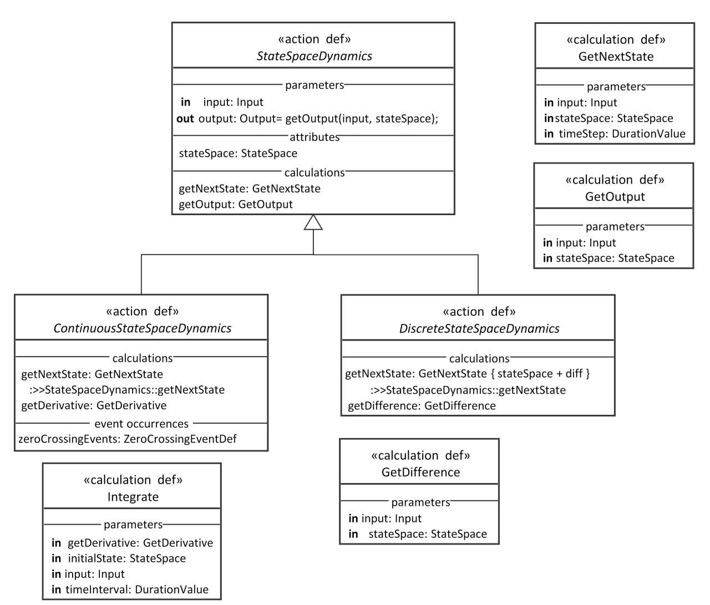

**Figure 55. State Space Representation action and calculation definitions**

*zeroCrossingEvents* defined in *ContinuousStateSpaceDynamics* give event occurrences when the derivative cross the zero. Some solvers, especially variable-step ones, need to identify such points for precise integration and thus implementations of *ContinuousStateSpaceDynamics* may notify zero-crossings with these event occurrences.

# <span id="page-567-0"></span>**9.4.5 Trade Studies**

# <span id="page-567-1"></span>**9.4.5.1 Trade Studies Overview**

This package provides a simple framework for defining trade-off study analysis cases.

# <span id="page-567-2"></span>**9.4.5.2 Elements**

# <span id="page-567-3"></span>**9.4.5.2.1 EvaluationFunction**

# **Element**

CalculationDefinition

# **Description**

An *EvaluationFunction* is a calculation that evaluates a *TradeStudy* alternative, producing a *ScalarValue* that can be compared with the evaluation of other alternatives.

# **General Types**

Calculation

# **Features**

alternative : Anything

The alternative to be evaluated

result : ScalarValue {redefines result}

A *ScalarValue* representing the evaluation of the given alternative.

# **Constraints**

None.

# <span id="page-568-0"></span>**9.4.5.2.2 MaximizeObjective**

# **Element**

RequirementDefinition

# **Description**

A *MaximizeObjective* is a *TradeStudyObjective* that requires that the *selectedAlternative* have the maximum *EvaluationFunction* value of all the given alternatives.

# **General Types**

TradeStudyObjective

# **Features**

alternatives : Anything [1..\*] {redefines alternatives}

best : ScalarValue {redefines best}

For a *MaximizeObjective*, the best value is the maximum one.

eval : EvaluationFunction {redefines eval}

selectedAlternative : Anything {redefines selectedAlternative}

# **Constraints**

None.

# <span id="page-568-1"></span>**9.4.5.2.3 MinimizeObjective**

# **Element**

# RequirementDefinition

# **Description**

A *MinimizeObjective* is a *TradeStudyObjective* that requires that the selectedAlternative have the minimum *EvaluationFunction* value of all the given alternatives.

# **General Types**

TradeStudyObjective

# **Features**

alternatives : Anything [1..\*] {redefines alternatives}

best : ScalarValue {redefines best}

For a *MinimizeObjective*, the best value is the minimum one.

eval : EvaluationFunction {redefines eval}

selectedAlternative : Anything {redefines selectedAlternative}

# **Constraints**

None.

# <span id="page-569-0"></span>**9.4.5.2.4 TradeStudy**

# **Element**

AnalysisCaseDefinition

# **Description**

A *TradeStudy* is an analysis case whose subject is a set of alternatives (at least one) and whose result is a selection of one of those alternatives. The alternatives are evaluated based on a given *ObjectiveFunction* and the selection is made such that it satisfies the objective of the *TradeStudy* (which must be a *TradeStudyObjective*).

# **General Types**

AnalysisCase

# **Features**

evaluationFunction : EvaluationFunction [0..\*]

The *EvaluationFunction* to be used to evaluate the alternatives.

In a *TradeStudy* usage, redefine this feature to provide the desired calculation (or bind it to a calculation usage that does so).

selectedAlternative : Anything

The alternative selected by this *TradeStudy*, which is the one that meets the requirement of the *tradeStudyObjective*.

studyAlternatives : Anything [1..\*] {redefines subj}

The set of alternatives being considered in this *TradeStudy*.

In a *TradeStudy* usage, bind this feature to the actual collection of alternatives to be considered.

tradeStudyObjective : TradeStudyObjective

The objective of this *TradeStudy*.

Redefine this feature to give it a definition that is a concrete specialization of *TradeStudyObjective*. That can either be one of the specializations provided in this package, or a more specific user-defined one.

# **Constraints**

None.

# <span id="page-570-0"></span>**9.4.5.2.5 TradeStudyObjective**

# **Element**

RequirementDefinition

# **Description**

A *TradeStudyObjective* is the base definition for the objective of a *TradeStudy*. The requirement is to choose from a given set of alternatives the *selectedAlternative* for that has the best evaluation according to a given *EvaluationFunction*. What value is considered "best" is not defined in the abstract base definition but must be computed in any concrete specialization.

# **General Types**

RequirementCheck

# **Features**

alternatives : Anything [1..\*]

The alternatives being considered in the *TradeStudy* for which this *TradeStudyObjective* is the objective.

best : ScalarValue

Out of the evaluation results of all the given alternatives, the one that is considered "best", in the sense that it is the value the *selectedAlternative* should have. This value must be computed in any concrete specialization of *TradeStudyObjective/em>.*

eval : EvaluationFunction

The *EvaluationFunction* to be used in evaluating the given alternatives.

selectedAlternative : Anything {redefines subj}

The alternative that should be selected, as evaluated using the given *EvaluationFunction*.

# **Constraints**

# [no name]

eval(selectedAlternative) == best

# <span id="page-571-0"></span>**9.5 Cause and Effect Domain Library**

# <span id="page-571-1"></span>**9.5.1 Cause and Effect Domain Library Overview**

The Cause and Effect Domain Library contains a library model of cause and effect relationships and metadata supporting its use.

# <span id="page-571-2"></span>**9.5.2 Causation Connections**

# <span id="page-571-3"></span>**9.5.2.1 Causation Connections Overview**

This package provides a library model modeling causes, effects, and causation connections between them.

# <span id="page-571-4"></span>**9.5.2.2 Elements**

# <span id="page-571-5"></span>**9.5.2.2.1 Causation**

# **Element**

ConnectionDefinition

# **Description**

A *Causation* is a binary *Multicausation* in which a single cause occurrence causes a single effect occurrence. (However, a single cause can separately have multiple effects, and a single effect can have separate *Causation* connections with multiple causes.)

# **General Types**

Multicausation

BinaryConnection

# **Features**

theCause : Occurrence {subsets causes, redefines source}

The single causing occurrence.

theCauses : Occurrence [0..\*]

Owned cross feature for *theCause*.

theEffect : Occurrence {subsets effects, redefines target}

The single effect occurrence resulting from the cause.

theEffects : Occurrence [0..\*]

Owned cross feature for *theEffect*.

# **Constraints**

<span id="page-572-0"></span>

| None.                                                             |
|-------------------------------------------------------------------|
| 9.5.2.2.2<br>causations                                           |
| Element                                                           |
| ConnectionUsage                                                   |
| Description                                                       |
| causations is the base feature for<br>Causation ConnectionUsages. |
| General Types                                                     |
| multicausations                                                   |
| Causation                                                         |
| Features                                                          |
| None.                                                             |
| Constraints                                                       |
| None.                                                             |
| 9.5.2.2.3<br>causes                                               |
| Element                                                           |
| OccurrenceUsage                                                   |
| Description                                                       |
| Occurrences that are causes.                                      |
| General Types                                                     |
| occurrences                                                       |
| Features                                                          |
| None.                                                             |
| Constraints                                                       |
| None.                                                             |
| 9.5.2.2.4<br>effects                                              |
| Element                                                           |

<span id="page-572-2"></span><span id="page-572-1"></span>OccurrenceUsage

*Occurrences* that are effects.

# **General Types**

occurrences

# **Features**

None.

# **Constraints**

None.

# <span id="page-573-0"></span>**9.5.2.2.5 Multicausation**

# **Element**

ConnectionDefinition

# **Description**

A *Multicausation* connection models the situation in which one set of occurrences causes another. All causes must at least exist before all effects.

To create a *Multicausation* connection, specialize this connection definition adding specific end features of the relavent types. Ends representing causes should subset *causes*, while ends representing effects should subset *effects*. There must be at least one cause and at least one effect.

# **General Types**

Connection

# **Features**

```
causes : Occurrence [1..*] {subsets participant}
```

The causing *Occurrences*. (Constant for each Multicausation instance.)

Redefines *CausationConnections::causes* in the context of *Multicausation*.

effects : Occurrence [1..\*] {subsets participant}

The effect *Occurrences* caused by the causing *Occurrences*. (Constant for each Multicausation instance.)

Redefines *CausationConnections::effects* in the context of *Multicausation*.

# **Constraints**

# disjointCauseEffect

*causes* must be disjoint from *effects*.

isEmpty(intersection(causes, effects))

# <span id="page-574-0"></span>**9.5.2.2.6 multicausations**

# **Element**

ConnectionUsage

# **Description**

*multicausations* is the base feature for *Multicausation* ConnectionUsages.

# **General Types**

Multicausation

connections

# **Features**

None.

# **Constraints**

None.

# <span id="page-574-1"></span>**9.5.3 Cause and Effect**

# <span id="page-574-2"></span>**9.5.3.1 Cause and Effect Overview**

This package provides language-extension metadata for cause-effect modeling.

# <span id="page-574-3"></span>**9.5.3.2 Elements**

# <span id="page-574-4"></span>**9.5.3.2.1 CausationMetadata**

# **Element**

MetadataDefinition

# **Description**

*CausationMetadata* allows for the specification of additional metadata about a cause-effect ConnectionDefinition or ConnectionUsage..

# **General Types**

MetadataItem

# **Features**

annotatedElement1 : ConnectionDefinition {subsets annotatedElement}

annotatedElement2 : ConnectionUsage {subsets annotatedElement}

isNecessary : Boolean

Whether all the causes are necessary for all the effects to occur. If this is false (the default), then some or all of the effects may still have occurred even if some of the causes did not.

isSufficient : Boolean

Whether the causes were sufficient for all the effects to occur. If this is false (the default), then it may be the case that some other occurrences were also necessary for some or all of the effects to have occurred.

probability : Real [0..1]

The probability that the causes will actually result in effects occurring.

# **Constraints**

None.

# <span id="page-575-0"></span>**9.5.3.2.2 CausationSemanticMetadata**

# **Element**

MetadataDefinition

# **Description**

*CausationMetadata* (short name *causation*) is *SemanticMetadata* for a *Causation* connection.

# **General Types**

SemanticMetadata

CausationMetadata

# **Features**

baseType : Type {redefines baseType}

Base type is *CausationConnections::causations*.

# **Constraints**

None.

# <span id="page-575-1"></span>**9.5.3.2.3 CauseMetadata**

# **Element**

MetadataDefinition

# **Description**

*CauseMetadata* (short name *cause*) identifies a Usage as being a cause occurrence. It is intended to be used to tag the cause ends of a *Multicausation*.

# **General Types**

SemanticMetadata

MetadataItem

# **Features**

annotatedElement : Usage {redefines annotatedElement}

baseType : Type {redefines baseType}

Base type is *CausationConnections::causes*.

# **Constraints**

None.

# <span id="page-576-0"></span>**9.5.3.2.4 EffectMetadata**

# **Element**

MetadataDefinition

# **Description**

*EffectMetadata* (short name *effect*) identifies a Usage as being a effect occurrence. It is intended to be used to tag the effect ends of a *Multicausation*.

# **General Types**

SemanticMetadata

MetadataItem

# **Features**

annotatedElement : Usage {redefines annotatedElement}

baseType : Type {redefines baseType}

Base type is *CausationConnections::effects*.

# **Constraints**

None.

# <span id="page-576-1"></span>**9.5.3.2.5 MulticausationSemanticMetadata**

# **Element**

MetadataDefinition

# **Description**

*MulticausationMetadata* (short name *multicausation*) is *SemanticMetadata* for a *Multicausation* connection.

# **General Types**

SemanticMetadata

# CausationMetadata

# **Features**

baseType : Type {redefines baseType}

Base type is *CausationConnections::multicausations*.

# **Constraints**

None.

# <span id="page-577-0"></span>**9.6 Requirement Derivation Domain Library**

# <span id="page-577-1"></span>**9.6.1 Requirement Derivation Domain LIbrary Overview**

The Requirement Derivation Domain Library contains a library model of requirement derivation relationships and metadata supporting its use.

# <span id="page-577-2"></span>**9.6.2 Derivation Connections**

# <span id="page-577-3"></span>**9.6.2.1 Derivation Connections Overview**

This package provides a library model for derivation connections between requirements.

# <span id="page-577-4"></span>**9.6.2.2 Elements**

# <span id="page-577-5"></span>**9.6.2.2.1 Derivation**

# **Element**

ConnectionDefinition

# **Description**

A *Derivation* connection asserts that one or more *derivedRequirements* are derived from a single *originalRequirement*. This means that any subject that satisfies the *originalRequirement* should, in itself or though other things related to it, satisfy each of the *derivedRequirements*.

A ConnectionUsage typed by *Derivation* must have RequirementUsages for all its ends. The single end for the original requirement should subset *originalRequirement*, while the rest of the ends should subset *derivedRequirements*.

# **General Types**

Connection

# **Features**

derivedRequirements : RequirementCheck [1..\*] {subsets participant}

The one or more requirements that are derived from the original requirement.

Redefines *DerivationConnections::derivedRequirements* in the context of *Derivation*.

originalRequirement : RequirementCheck {subsets participant}

The single original requirement.

Redefines *DerivationConnections::originalRequirement* in the context of *Derivation*.

participant : RequirementCheck [2..\*] {redefines participant}

All the *participants* in a *Derivation* must be requirements.

# **Constraints**

originalImpliesDerived

Whenever the *originalRequirement* is satisfied, all of the *derivedRequirements* must also be satisfied.

originalRequirement.result implies allTrue(derivedRequirements.result)

originalNotDerived

The original requirement must not be a derived requirement.

derivedRequirements->excludes(originalRequirement)

# <span id="page-578-0"></span>**9.6.2.2.2 derivations**

# **Element**

ConnectionUsage

# **Description**

*derivations* is the base feature for *Derivation* ConnectionUsages.

# **General Types**

Derivation

connections

**Features**

None.

# **Constraints**

None.

# <span id="page-578-1"></span>**9.6.2.2.3 derivedRequirements**

# **Element**

RequirementUsage

# **Description**

*derivedRequirements* are the derived requirements in *Derivation* connections.

# **General Types**

<span id="page-579-4"></span><span id="page-579-3"></span><span id="page-579-2"></span><span id="page-579-1"></span><span id="page-579-0"></span>

| occurrences                                                                                          |
|------------------------------------------------------------------------------------------------------|
| Features                                                                                             |
| None.                                                                                                |
| Constraints                                                                                          |
| None.                                                                                                |
| 9.6.2.2.4<br>originalRequirements                                                                    |
| Element                                                                                              |
| RequirementUsage                                                                                     |
| Description                                                                                          |
| originalRequirements are the original requirements in<br>Derivation connections.                     |
| General Types                                                                                        |
| occurrences                                                                                          |
| Features                                                                                             |
| None.                                                                                                |
| Constraints                                                                                          |
| None.                                                                                                |
| 9.6.3<br>Requirement Derivation                                                                      |
| 9.6.3.1<br>Requirement Derivation Overview                                                           |
| This package provides language-extension metadata for modeling requirement derivation.               |
| 9.6.3.2<br>Elements                                                                                  |
| 9.6.3.2.1<br>DerivationMetadata                                                                      |
| Element                                                                                              |
| MetadataDefinition                                                                                   |
| Description                                                                                          |
| DerivationMetadata (short name<br>derivation) is<br>SemanticMetadata for a<br>Derivation connection. |
| General Types                                                                                        |
| SemanticMetadata                                                                                     |
| MetadataItem                                                                                         |
| Features                                                                                             |

annotatedElement1 : ConnectionDefinition {subsets annotatedElement}

annotatedElement2 : ConnectionUsage {subsets annotatedElement}

baseType : Type

Base type is *DerivationConnections::derivations*.

# **Constraints**

None.

# <span id="page-580-0"></span>**9.6.3.2.2 DerivedRequirementMetadata**

# **Element**

MetadataDefinition

# **Description**

*DerivedlRequirementMetadata* (short name *derive*) identifies a Usage as a derived requirement. It is intended to be used to tag the derived requirement ends of a *Derivation*.

# **General Types**

SemanticMetadata

MetadataItem

# **Features**

annotatedElement : Usage

baseType : Type

Base type is *DerivationConnections::derivedRequirements*.

# **Constraints**

None.

# <span id="page-580-1"></span>**9.6.3.2.3 OriginalRequirementMetadata**

# **Element**

MetadataDefinition

# **Description**

*OriginalRequirementMetadata* (short name *original*) identifies a Usage as an original requirement. It is intended to be used to tag the original requirement end of a *Derivation*.

# **General Types**

SemanticMetadata

# MetadataItem

# **Features**

annotatedElement : Usage

baseType : Type

Base type is *DerivationConnections::originalRequirements*.

# **Constraints**

None.

# <span id="page-581-0"></span>**9.7 Geometry Domain Library**

# <span id="page-581-1"></span>**9.7.1 Geometry Domain Library Overview**

The Geometry Domain Library contains a general library model of physical items with spatial extent and a library model of specific spatial items that represent basic geometric shapes.

# <span id="page-581-2"></span>**9.7.2 Spatial Items**

# <span id="page-581-3"></span>**9.7.2.1 Spatial Items Overview**

This package models physical items that have a spatial extent and act as a spatial frame of reference for obtaining position and displacement vectors of points within them.

# <span id="page-581-4"></span>**9.7.2.2 Elements**

# <span id="page-581-5"></span>**9.7.2.2.1 CurrentDisplacementOf**

# **Element**

CalculationDefinition

# **Description**

The *CurrentDisplacementOf* two *Points* relative to a *SpatialItem* and a *Clock* is the *DisplacementOf* the *Points* relative to the *SpacialItem*, at the *currentTime* of the *Clock*.

# **General Types**

CurrentDisplacementOf

# **Features**

clock : Clock {redefines clock}

displacementVector : Displacement3dVector {redefines displacementVector}

frame : SpatialItem {redefines frame}

point1 : Point {redefines point1}

point2 : Point {redefines point2}

# **Constraints**

None.

# <span id="page-582-0"></span>**9.7.2.2.2 CurrentPositionOf**

# **Element**

CalculationDefinition

# **Description**

The *CurrentPositionOf* a *Point* relative to a *SpatialItem* and a *Clock* is the *PositionOf* the *Point* relative to the *SpatialItem* at the *currentTime* of the *Clock*.

# **General Types**

CurrentPositionOf

# **Features**

clock : Clock {redefines clock}

point : Point {redefines point}

positionVector : Position3dVector {redefines positionVector}

spatialItem : SpatialItem {redefines frame}

# **Constraints**

None.

# <span id="page-582-1"></span>**9.7.2.2.3 DisplacementOf**

# **Element**

CalculationDefinition

# **Description**

The *DisplacementOf* two *Points* relative to a *SpatialItem*, at a specific *TimeInstantValue* relative to a given *Clock*, is the *displacementVector* computed as the difference between the *PositionOf* the first *Point* and *PositionOf* the second *Point*, relative to that *SpatialItem*, at that *timeInstant*

# **General Types**

DisplacementOf

# **Features**

clock : Clock {redefines clock}

displacementVector : Displacement3dVector {redefines displacementVector}

frame : SpatialItem {redefines frame}

```
point1 : Point {redefines point1}
point2 : Point {redefines point2}
time : TimeInstantValue {redefines time}
```

# **Constraints**

zeroDisplacementConstraint

If either *point1* or *point2* occurs within the other, then the *displacementVector* is the zero vector.

```
(point1.spaceTimeEnclosedOccurrences->includes(point2) or
point2.spaceTimeEnclosedOccurrences->includes(point1)) implies
    isZeroVector(displacementVector)
```

# <span id="page-583-0"></span>**9.7.2.2.4 PositionOf**

# **Element**

CalculationDefinition

# **Description**

The *PositionOf* a *Point* relative to a *SpatialItem*, at a specific *TimeInstantValue* relative to a given *Clock*, is a *positionVector* that is a *VectorQuantityValue* in the *coordinateFrame* of the *SpatialItem*. The default *Clock* is the *localClock* of the *SpatialItem*.

# **General Types**

PositionOf

# **Features**

```
clock : Clock {redefines clock}
point : Point {redefines point}
positionVector : Position3dVector {redefines positionVector}
spatialItem : SpatialItem {redefines frame}
time : TimeInstantValue {redefines time}
```

# **Constraints**

positionTimePrecondition

The given *point* must exist at the given *time*.

```
TimeOf(point.startShot) <= time and
time <= TimeOf(point.endShot)
```

spacePositionConstraint

The result *positionVector* is equal to the *PositionOf* the *Point spaceShot* of the frame that encloses the given *point*, at the given *time*.

```
(frame.spaceShots as Point)->forAll{in p : Point;
    p.spaceTimeEnclosedOccurrences->includes(point) implies
    positionVector == PositionOf(p, time, frame)
}
```

# <span id="page-584-0"></span>**9.7.2.2.5 SpatialItem**

# **Element**

ItemDefinition

# **Description**

A *SpatialItem* is an *Item* with a three-dimensional spatial extent that also acts as a *SpatialFrame* of reference.

# **General Types**

Item

SpatialFrame

# **Features**

componentItems : SpatialItem [0..\*] {subsets subitems}

A *SpatialItem* with *componentItems* is entirely made up of those items (the *SpatialItem* occurs only as a collection of its *componentItems*). By default they have the same *localClock* and equivalent *coordinateFrame* as the *SpatialItem* they make up. A *SpatialItem* without componentItems occurs on its own, separately from its *subitems*.

coordinateFrame : VectorMeasurementReference

The three-dimensional *VectorMeasurementReference* to be used as the measurement reference for position and displacement vector values relative to this *SpatialItem*.

localClock : Clock {redefines localClock}

A local *Clock* to be used as the corresponding time reference within this *SpatialItem*. By default this is the singleton *Time::universalClock*.

originPoint : Point

The *Point* at the origin of the *coordinateFrame* of this *SpatialItem*.

# **Constraints**

originPointConstraint

The *CurrentPositionOf* the *originPoint* must always be a zero vector.

isZeroVector(CurrentPositionOf(originPoint, SpatialItem::self))

# <span id="page-585-0"></span>**9.7.3 Shape Items**

# <span id="page-585-1"></span>**9.7.3.1 Shape Items Overview**

This package defines basic geometric *Items*, most of which can be used as *shapes* of other *Items* (see [7.10](#page-87-0) ). Their *innerSpaceDimensions* are either 1 (*Curves*) or 2 (*Surfaces*), which is the number of variables needed to identify any space point occupied by an Item, without regard to higher dimensional spaces in which it might be embedded (see *Occurrences* and *Objects* in [KerML]). All are *StructuredSpaceObjects* (*Paths* and *Shells* for *Curves* and *Surfaces*, respectively), except for *Lines*. This enables them to divide their *spaceSlices* into *faces*, *edges*, and *vertices*, identifying *Surfaces*, *Curve*, and *Points*, respectively. *Paths* have no *faces*, but *Shells* do. All the *Paths* and *Shells* are closed (*isClosed*=true, they have no *shape*), except for *Discs*, enabling them to be *shapes* of other *Items*.

# <span id="page-585-2"></span>**9.7.3.2 Elements**

# <span id="page-585-3"></span>**9.7.3.2.1 Circle**

# **Element**

ItemDefinition

# **Description**

A *Circle* is an *Ellipse* with semiaxes equal to its *radius*.

# **General Types**

Ellipse

# **Features**

radius : LengthValue

semiMajorAxis : LengthValue {redefines semiMajorAxis}

semiMinorAxis : LengthValue {redefines semiMinorAxis}

# **Constraints**

None.

# <span id="page-585-4"></span>**9.7.3.2.2 CircularCone**

# **Element**

ItemDefinition

# **Description**

A *CircularCone* is a *Cone* with a circular base.

# **General Types**

Cone

# **Features**

base : CircularDisc {redefines base}

radius : LengthValue

semiMajorAxis {redefines semiMajorAxis}

semiMinorAxis {redefines semiMinorAxis}

# **Constraints**

None.

# <span id="page-586-0"></span>**9.7.3.2.3 CircularCylinder**

# **Element**

ItemDefinition

# **Description**

A *CircularCylinder* is a *Cylinder* with two circular sides.

# **General Types**

Cylinder

# **Features**

af : CircularDisc {redefines af}

base : CircularDisc {redefines base}

radius : LengthValue

semiMajorAxis {redefines semiMajorAxis}

semiMinorAxis {redefines semiMinorAxis}

# **Constraints**

None.

# <span id="page-586-1"></span>**9.7.3.2.4 CircularDisc**

# **Element**

# **Description**

A *CircularDisc* is a *Disc* bound by a *Circle*.

# **General Types**

Disc

# **Features**

edges : Circle {redefines edges}

```
radius : LengthValue
semiMajorAxis {redefines semiMajorAxis}
semiMinorAxis {redefines semiMinorAxis}
shape : Circle {redefines shape}
```

# **Constraints**

None.

# <span id="page-587-0"></span>**9.7.3.2.5 Cone**

# **Element**

ItemDefinition

# **Description**

A *Cone* has one elliptical sides joined to a point by a curved side.

# **General Types**

ConeOrCylinder

# **Features**

```
af [0] {redefines af}
apex {subsets vertices}
edges [2] {redefines edges}
faces [2] {redefines faces}
```

# **Constraints**

None.

# <span id="page-587-1"></span>**9.7.3.2.6 ConeOrCylinder**

# **Element**

ItemDefinition

# **Description**

A *ConeOrCylinder* is a *Cone* or a *Cylinder* with a given elliptical base, height, width (perpendicular distance from the base to the center of the top side or vertex), and offsets of this perpendicular at the base from the center of the base.

# **General Types**

Shell

# **Features**

```
ae [0..2] {subsets edges}
af : Disc [0..1] {subsets faces}
base : Disc {subsets faces}
be [2] {subsets edges}
cf {subsets faces}
edges [2..4] {redefines edges}
faces : Surface [2..3] {redefines faces}
height : LengthValue
semiMajorAxis : LengthValue
semiMinorAxis : LengthValue
vertices [0..1] {redefines vertices}
xoffset : LengthValue
yoffset : LengthValue
```

# **Constraints**

None.

# <span id="page-588-0"></span>**9.7.3.2.7 ConicSection**

# **Element**

ItemDefinition

# **Description**

A *ConicSection* is a closed *PlanarCurve*, possibly disconnected, see *Hyperbola*.

# **General Types**

Path

PlanarCurve

# **Features**

```
edges [1..2] {redefines edges}
isClosed {redefines isClosed}
vertices [0] {redefines vertices}
```

# **Constraints**

None.

# <span id="page-589-0"></span>**9.7.3.2.8 ConicSurface**

# **Element**

ItemDefinition

# **Description**

A *ConicSurface* is a *Surface* that has *ConicSection* cross-sections.

# **General Types**

Shell

# **Features**

```
edges [0] {redefines edges}
```

faces [1..2] {redefines faces}

genus {redefines genus}

vertices [0] {redefines vertices}

# **Constraints**

None.

# <span id="page-589-1"></span>**9.7.3.2.9 Cuboid**

# **Element**

ItemDefinition

# **Description**

A *Cuboid* is a *Polyhedron* with six sides, all quadrilateral.

# **General Types**

CuboidOrTriangularPrism

# **Features**

edges [24] {redefines edges}

faces [6] {redefines faces}

ff : Quadrilateral {redefines ff}

rf : Quadrilateral {redefines rf}

# **Constraints**

None.

# <span id="page-590-0"></span>**9.7.3.2.10 CuboidOrTriangularPrism**

# **Element**

ItemDefinition

# **Description**

A *CuboidOrTriangularPrism* is a *Polyhedron* that is either a *Cuboid* or *TriangularPrism*.

# **General Types**

Polyhedron

# **Features**

```
bf : Quadrilateral {subsets faces}
bfe [2] {subsets edges}
bflv [3] {subsets vertices}
bfrv [3] {subsets vertices}
bre [2] {subsets edges}
brlv [3] {subsets vertices}
brrv [3] {subsets vertices}
bsle [2] {subsets edges}
bsre [2] {subsets edges}
edges [0..*] {redefines edges}
faces [5..6] {redefines faces}
ff : Polygon {subsets faces}
rf : Polygon {subsets faces}
slf : Quadrilateral {subsets faces}
srf : Quadrilateral [0..1] {subsets faces}
tf : Quadrilateral {subsets faces}
tfe [2] {subsets edges}
tflv [3] {subsets vertices}
tfrv [0..3] {subsets vertices}
tre [2] {subsets edges}
trlv [3] {subsets vertices}
```

```
trrv [0..3] {subsets vertices}
tsle [2] {subsets edges}
tsre [0..2] {subsets edges}
ufle [2] {subsets edges}
ufre [0..2] {subsets edges}
urle [2] {subsets edges}
urre [0..2] {subsets edges}
vertices [24] {redefines vertices}
Constraints
None.
9.7.3.2.11 Cylinder
Element
ItemDefinition
Description
A Cylinder has two elliptical sides joined by a curved side.
General Types
ConeOrCylinder
Features
ae [2] {redefines ae}
af {redefines af}
edges [4] {redefines edges}
faces [3] {redefines faces}
vertices [0] {redefines vertices}
Constraints
```

None.

# <span id="page-591-1"></span>**9.7.3.2.12 Disc**

# **Element**

ItemDefinition

# **Description**

A *Disc* is a *Shell* bound by an *Ellipse*. **General Types** Shell PlanarSurface **Features** edges : Ellipse {redefines edges} faces : PlanarSurface {redefines faces} semiMajorAxis : LengthValue semiMinorAxis : LengthValue shape : Ellipse {redefines shape} vertices [0] {redefines vertices} **Constraints** None. **9.7.3.2.13 EccentricCone Element** ItemDefinition **Description** An *EccentricCone* is a *Cone* with least one positive offset. **General Types** Cone **Features** None. **Constraints** None. **9.7.3.2.14 EccentricCylinder**

# <span id="page-592-1"></span><span id="page-592-0"></span>**Element**

ItemDefinition

# **Description**

<span id="page-593-1"></span><span id="page-593-0"></span>

| An<br>EccentricCylinder is a<br>Cylinder                                         |
|----------------------------------------------------------------------------------|
| General Types                                                                    |
| Cylinder                                                                         |
| Features                                                                         |
| None.                                                                            |
| Constraints                                                                      |
| None.                                                                            |
| 9.7.3.2.15<br>Ellipse                                                            |
| Element                                                                          |
| ItemDefinition                                                                   |
| Description                                                                      |
| An<br>Ellipse is a<br>ConicSection in the shape of an ellipse of given semiaxes. |
| General Types                                                                    |
| ConicSection                                                                     |
| Features                                                                         |
| edges {redefines edges}                                                          |
| semiMajorAxis : LengthValue                                                      |
| semiMinorAxis : LengthValue                                                      |
| Constraints                                                                      |
| None.                                                                            |
| 9.7.3.2.16<br>Ellipsoid                                                          |
| Element                                                                          |
| ItemDefinition                                                                   |
| Description                                                                      |
| An<br>Ellipsoid is a<br>ConicSurface with only elliptical cross-sections.        |
| General Types                                                                    |
| ConicSurface                                                                     |
| Features                                                                         |
|                                                                                  |

faces {redefines faces}

semiAxis1 : LengthValue

semiAxis2 : LengthValue

semiAxis3 : LengthValue

# **Constraints**

None.

# <span id="page-594-0"></span>**9.7.3.2.17 Hyperbola**

# **Element**

ItemDefinition

# **Description**

A *Hyperbola* is a planar *Path* in the shape of a hyperbola with given axes.

# **General Types**

ConicSection

# **Features**

conjugateAxis : LengthValue

tranverseAxis : LengthValue

# **Constraints**

None.

# <span id="page-594-1"></span>**9.7.3.2.18 Hyperboloid**

# **Element**

ItemDefinition

# **Description**

A *Hyperboloid* is a *ConicSurface* with only hyperbolic cross-sections.

# **General Types**

ConicSurface

# **Features**

conjugateAxis : LengthValue

transverseAxis : LengthValue

# **Constraints**

<span id="page-595-1"></span><span id="page-595-0"></span>

| None.                                                                                 |
|---------------------------------------------------------------------------------------|
| 9.7.3.2.19<br>Line                                                                    |
| Element                                                                               |
| ItemDefinition                                                                        |
| Description                                                                           |
| A<br>Line is a<br>PlanarCurve that is straight.                                       |
| General Types                                                                         |
| PlanarCurve                                                                           |
| Features                                                                              |
| outerSpaceDimension [01] {redefines outerSpaceDimension}                              |
| Constraints                                                                           |
| None.                                                                                 |
| 9.7.3.2.20<br>Parabola                                                                |
| Element                                                                               |
| ItemDefinition                                                                        |
| Description                                                                           |
| A<br>Parabola is a planar<br>Path in the shape of a parabola of a given focal length. |
| General Types                                                                         |
| ConicSection                                                                          |
| Features                                                                              |
| edges {redefines edges}                                                               |
| focalDistance : LengthValue                                                           |
| Constraints                                                                           |
| None.                                                                                 |
| 9.7.3.2.21<br>Paraboloid                                                              |
| Element                                                                               |
| ItemDefinition                                                                        |

<span id="page-595-2"></span>**Description**

A *Paraboloid* is a *ConicSurface* with only parabolic cross-sections.

# **General Types**

ConicSurface

# **Features**

faces {redefines faces}

focalDistance : LengthValue

# **Constraints**

None.

# <span id="page-596-0"></span>**9.7.3.2.22 Path**

# **Element**

ItemDefinition

# **Description**

*Path* is the most general structured *Curve*.

# **General Types**

Item

Curve

StructuredSpaceObject

# **Features**

edges [1..\*] {redefines edges}

faces [0] {redefines faces}

vertices {redefines vertices}

# **Constraints**

None.

# <span id="page-596-1"></span>**9.7.3.2.23 PlanarCurve**

# **Element**

ItemDefinition

# **Description**

A *PlanarCurve* is a *Curve* with a given *length* embeddable in a plane.

# <span id="page-597-0"></span>**General Types** Item Curve **Features** length : LengthValue outerSpaceDimension [0..1] {redefines outerSpaceDimension} **Constraints** None. **9.7.3.2.24 PlanarSurface Element** ItemDefinition **Description** A *PlanarSurface* is a *Surface* with given *area* that is flat. **General Types** Item Surface **Features** area : LengthValue outerSpaceDimension {redefines outerSpaceDimension} shape : PlanarCurve {redefines shape} **Constraints**

# <span id="page-597-1"></span>**9.7.3.2.25 Polygon**

**Element**

None.

ItemDefinition

**Description**

A *Polygon* is a closed planar *Path* with straight edges.

**General Types**

Path

# PlanarCurve

# **Features**

```
edges : Line {redefines edges}
isClosed {redefines isClosed}
```

# **Constraints**

None.

# <span id="page-598-0"></span>**9.7.3.2.26 Polyhedron**

# **Element**

ItemDefinition

# **Description**

A *Polyhedron* is a closed *Shell* with polygonal sides.

# **General Types**

Shell

# **Features**

```
edges {redefines edges}
faces : Polygon [2..*] {redefines faces}
genus {redefines genus}
isClosed
outerSpaceDimension {redefines outerSpaceDimension}
vertices [0..*] {redefines vertices}
```

# **Constraints**

None.

# <span id="page-598-1"></span>**9.7.3.2.27 Pyramid**

# **Element**

ItemDefinition

# **Description**

p>A *Pyramid* is a *Polyhedron* with the sides of a polygon (base) forming the bases of triangles that join at an apex point. Its *height* is the perpindicular distance from the base to the apex, and its offsets are between this perpindicular at the base and the center of the base.

# **General Types**

Polyhedron

# **Features**

```
apex [0..*] {redefines vertices}
```

base {subsets faces}

edges [0..\*] {redefines edges}

faces [0..\*]

height : LengthValue

wall : Triangle [0..\*] {subsets faces}

wallNumber : Positive

xoffset : LengthValue

yoffset : LengthValue

# **Constraints**

None.

# <span id="page-599-0"></span>**9.7.3.2.28 Quadrilateral**

# **Element**

ItemDefinition

# **Description**

A *Quadrilateral* is a four-sided *Polygon*.

# **General Types**

Polygon

# **Features**

e1

e2

e3

edges [4] {redefines edges}

v12 [2] {subsets vertices, ordered}

v23 [2] {subsets vertices, ordered}

v34 [2] {subsets vertices, ordered}

v41 [2] {subsets vertices, ordered}

vertices [8] {redefines vertices}

# **Constraints**

None.

# <span id="page-600-0"></span>**9.7.3.2.29 Rectangle**

# **Element**

ItemDefinition

# **Description**

A *Rectangle* is a *Quadrilateral* with four right angles and given *length* and *width*.

# **General Types**

Quadrilateral

# **Features**

length : LengthValue

width : LengthValue

# **Constraints**

None.

# <span id="page-600-1"></span>**9.7.3.2.30 RectangularCuboid**

# **Element**

ItemDefinition

# **Description**

A *RectangularCuboid* is a *Cuboid* with all *Rectangular* sides.

# **General Types**

Cuboid

# **Features**

bf : Rectangle {redefines bf}

ff : Rectangle {redefines ff}

height : LengthValue

length : LengthValue

rf : Rectangle {redefines rf}

slf : Rectangle {redefines slf}

srf : Rectangle {redefines srf}

tf : Rectangle {redefines tf}

width : LengthValue

# **Constraints**

None.

# <span id="page-601-0"></span>**9.7.3.2.31 RectangularPyramid**

# **Element**

ItemDefinition

# **Description**

A *RectangularPyramid* is a *Pyramid* with a rectangular base.

# **General Types**

Pyramid

# **Features**

base : Rectangle {redefines base}

baseLength : LengthValue

baseWidth : LengthValue

# **Constraints**

None.

# <span id="page-601-1"></span>**9.7.3.2.32 RectangularToroid**

# **Element**

ItemDefinition

# **Description**

A *RectangularToroid* is a revolution of a *Rectangle*.

# **General Types**

Toriod

# **Features**

rectangleLength : LengthValue

rectangleWidth : LengthValue

<span id="page-602-0"></span>revolvedCurve : Rectangle {redefines revolvedCurve} **Constraints** None. **9.7.3.2.33 RightCircularCone Element** ItemDefinition **Description** A *RightCircularCone* is a *CircularCone* with zero offsets. **General Types** CircularCone **Features** xoffset {redefines xoffset} yoffset {redefines yoffset} **Constraints** None. **9.7.3.2.34 RightCircularCylinder Element** ItemDefinition **Description** A *RightCircularCylinder* is a *CircularCylinder* with zero offsets. **General Types** CircularCylinder **Features** xoffset {redefines xoffset} yoffset {redefines yoffset} **Constraints** None. **9.7.3.2.35 RightTriangle**

<span id="page-602-2"></span><span id="page-602-1"></span>**Element**

# ItemDefinition

# **Description**

A *RightTriangle* is a *Triangle* with edges opposite the *hypotenuse* at right angles.

# **General Types**

Triangle

# **Features**

hypotenuse {redefines e3}

xoffset {redefines xoffset}

# **Constraints**

None.

# <span id="page-603-0"></span>**9.7.3.2.36 RightTriangularPrism**

# **Element**

ItemDefinition

# **Description**

A *RightTriangularPrism* is a *TriangularPrism* with two right triangular sides, with given *length*, *width*, and *height*.

# **General Types**

TriangularPrism

# **Features**

bf : Rectangle {redefines bf}

ff : RightTriangle {redefines ff}

height : LengthValue

length : LengthValue

rf : RightTriangle {redefines rf}

slf : Rectangle {redefines slf}

tf : Rectangle {redefines tf}

width : LengthValue

# **Constraints**

None.

# <span id="page-604-0"></span>**9.7.3.2.37 Shell**

# **Element**

ItemDefinition

# **Description**

*Shell* is the most general structured *Surface*.

# **General Types**

Item

StructuredSpaceObject

Surface

# **Features**

None.

# **Constraints**

None.

# <span id="page-604-1"></span>**9.7.3.2.38 Sphere**

# **Element**

ItemDefinition

# **Description**

A *Sphere* is an *Ellipsoid* with all the same semiaxes.

# **General Types**

Ellipsoid

# **Features**

radius : LengthValue

semiAxis1 {redefines semiAxis1}

semiAxis2 {redefines semiAxis2}

semiAxis3 {redefines semiAxis3}

# **Constraints**

None.

# <span id="page-604-2"></span>**9.7.3.2.39 Tetrahedron**

# **Element**

# ItemDefinition

# **Description**

A *Tetrahedron* is *Pyramid* with a triangular base.

# **General Types**

Pyramid

# **Features**

base : Triangle {redefines base}

baseLength : LengthValue

baseWidth : LengthValue

# **Constraints**

None.

# <span id="page-605-0"></span>**9.7.3.2.40 Toriod**

# **Element**

ItemDefinition

# **Description**

A *Toroid* is a surface generated from revolving a planar closed curve about an line coplanar with the curve. It is single sided with one hole.

# **General Types**

Shell

# **Features**

edges [0] {redefines edges}

faces {redefines faces}

genus {redefines genus}

revolutionRadius : LengthValue

revolvedCurve : PlanarCurve

vertices [0] {redefines vertices}

# **Constraints**

None.

# <span id="page-605-1"></span>**9.7.3.2.41 Torus**

# **Element**

ItemDefinition

# **Description**

A *Torus* is a revolution of a *Circle*.

# **General Types**

Toriod

# **Features**

```
majorRadius {redefines revolutionRadius}
```

minorRadius : LengthValue

revolvedCurve : Circle {redefines revolvedCurve}

# **Constraints**

None.

# <span id="page-606-0"></span>**9.7.3.2.42 Triangle**

# **Element**

ItemDefinition

# **Description**

A *Triangle* is three-sided Polygon with given *length* (base), width (perpindicular distance from base to apex), and offset of this perpindicular at the base from the center of the base.

# **General Types**

Polygon

# **Features**

```
apex [2] {subsets vertices, ordered}
```

base {subsets edges}

e2 {subsets edges}

e3 {subsets edges}

edges [3] {redefines edges}

length : LengthValue

v12 [2] {subsets vertices, ordered}

v31 [2] {subsets vertices, ordered}

vertices [6] {redefines vertices}

width : LengthValue

xoffset : LengthValue

# **Constraints**

None.

# <span id="page-607-0"></span>**9.7.3.2.43 TriangularPrism**

# **Element**

ItemDefinition

# **Description**

A *TriangularPrism* is a *Polyhedron* with five sides, two triangular and the others quadrilateral.

# **General Types**

CuboidOrTriangularPrism

# **Features**

edges [18] {redefines edges}

faces [5] {redefines faces}

ff : Triangle {redefines ff}

rf : Triangle {redefines rf}

# **Constraints**

None.

# <span id="page-607-1"></span>**9.8 Quantities and Units Domain Library**

# <span id="page-607-2"></span>**9.8.1 Quantities and Units Domain Library Overview**

For any system model, a solid foundation for the representation of physical quantities, their units, scales, and quantity dimensions, as well as coordinate frames is essential. Quantity attributes are needed to specify many characteristics of a system of interest and its elements. The foundation should be a shareable resource that can be reused in models within and across projects as well as organizations in order to facilitate collaboration and model interoperability.

The Quantities and Units Domain Library defines reusable and extensible model elements for physical quantities, including vector and tensor quantities, quantity dimensions, measurement units, measurement scales, coordinate frames, coordinate transformations and vector spaces. The library also enables the specification of coherent systems of quantities and systems of units, as well as the operators and functions needed to support quantity arithmetic in expressions.

The most widely accepted, scrutinized, and globally used specification of quantities and units is captured and maintained in:

- the International System of Quantities (ISQ)
- the International System of Units (SI)

The ISQ and SI are formally standardized through the ISO/IEC 80000 series of standards. The top level concepts and semantics defined in this domain library are derived from and mapped to the concepts and semantics specified in [ISO 80000-1] and [VIM], as directly as possible, but staying at a generic level. This enables the representation of the ISQ and the SI, but also of any other system of quantities or system of units.

The data model specifies a precise representation of the relationships between quantities, units, scales, quantity dimensions, coordinate frames, coordinate transformations and vectors spaces. As a result, both robust automated conversion between quantity values expressed in compatible measurement units or scales is enabled, as well as static type and quantity dimension analysis of expressions and constraints.

This library further contains lower level packages that specify the actual quantities, units and scales as standardized in parts 3 to 13 of the ISO/IEC 80000 series as SysML AttributeDefinitions and AttributeUsages, that represent the complete ISQ and SI. These packages provide a broad common basis, that can be extended and tailored for use by particular communities of practice and industry sectors.

Apart from SI, the system of US Customary Units is still in wide industrial use, in particular in North America. The library therefore also contains a package of US Customary Units, as specified in [NIST SP-811], and including their relationships with ISQ quantities as well as the conversion factors to corresponding SI units.

# <span id="page-608-0"></span>**9.8.2 Quantities**

# <span id="page-608-1"></span>**9.8.2.1 Quantities Overview**

# **Taxonomy**

The *Quantities* package defines the root elements to represent quantities and their values.

*TensorQuantityValue* (an AttributeDefinition ) and *tensorQuantities* (an AttributeUsage) are defined to represent quantities at the most general level, and can represent any nth order tensor quantity. Then, *VectorQuantityValue* and *vectorQuantities* are defined as order 1 specializations of the tensor quantity concepts, and finally, *ScalarQuantityValue* and *scalarQuantities* as order 0 specializations of the vector quantity concepts.

# **Quantity Values**

A quantity value is defined as a tuple of:

- a sequence of one or more mathematical numbers (as AttributeUsage *num*),
- a measurement reference (as AttributeUsage *mRef*).

For a *ScalarQuantityValue*, the sequence of numbers collapses to one single number, and the measurement reference is typically a measurement unit or scale. For a *VectorQuantityValue*, there must be as many numbers as needed to define the magnitude and direction of the vector quantity, and a measurement reference that typically specifies a coordinate frame, e.g., a sequence of 3 numbers for the vector components in a standard orthonormal Cartesian 3D vector space with the same measurement unit on each of the axes. For a *TensorQuantityValue*, the measurement reference must establish a reference frame compliant with the full dimensionality of the tensor quantity involved.

**Note.** The specification of a quantity value as a tuple of its numerical value and a measurement reference has the big advantage that the type of a quantity value becomes independent from the choice of measurement reference. For example: a *power* expressed as 1.5 watt has the same type (AttributeDefinition *PowerValue*) as a *power* expressed as 1500 milliwatt. This is an improvement over SysML v1, where the choice of measurement unit or scale was embedded in the value property type.

# **Free versus Bound Quantities and Vector Spaces**

A *TensorQuantityValue* can be defined with respect to a free vector space product or a bound vector space product. Similarly, a *VectorQuantityValue* can be defined with respect to a free or a bound vector space, and a *ScalarQuantityValue* with respect to a free or bound number line, which can be regarded as a one-dimensional vector space. In a free vector space, vectors can be added and vectors can be multiplied by a scalar number, where both operations yield a new free vector. Free vectors have only magnitude and direction. A bound vector space includes a particular choice of origin, and vectors in such a space can not be added nor multiplied by scalars. AttributeUsage *isBound* is used to capture this: *false* specifies a free vector space (product), and *true* specifies a bound vector space (product).

Examples that (informally) illustrate the distinction between free and bound vector quantities are given by pairs of quantities of the same quantity dimension:

- 1. *Displacement vector (free) and position vector (bound), both of quantity dimension length.* Two displacement vectors can be added and yield a resulting displacement vector. A displacement vector can also be multiplied with a scalar factor, which changes only its magnitude. Two position vectors can not be added, nor can a position vector be multiplied by a scalar number. A position vector is always bound to the origin of its bound vector space. One can however subtract one position vector from another, and the result is a displacement vector. It is the displacement to get from the position defined by the first vector to that defined by the second vector.
- 2. *Duration (free scalar) and time instant (bound scalar), both of quantity dimension time.* Durations can be added and multiplied, time instants cannot. Time instant values can only be specified with respect to a measurement reference that is a time scale with some particular choice of zero. Such a time scale is the same as a (time) coordinate axis in a one-dimensional bound vector space.

# <span id="page-609-0"></span>**9.8.2.2 Elements**

# <span id="page-609-1"></span>**9.8.2.2.1 3dVectorQuantityValue**

# **Element**

AttributeDefinition

# **Description**

Most general representation of real 3-vector quantities.

Alias: *ThreeDVectorQuantityValue*

# **General Types**

VectorQuantityValue

# **Features**

num : Real [3] {redefines num}

# **Constraints**

None.

# <span id="page-609-2"></span>**9.8.2.2.2 QuantityDimension**

# **Element**

AttributeDefinition

# **Description**

A *QuantityDimension* is the product of powers of the set of base quantities defined for a particular system of quantities, units and scales.

# **General Types**

None.

# **Features**

quantityPowerFactors : QuantityPowerFactor [0..\*] {ordered}

# **Constraints**

None.

# <span id="page-610-0"></span>**9.8.2.2.3 QuantityPowerFactor**

# **Element**

AttributeDefinition

# **Description**

A *QuantityPowerFactor* is a representation of a quantity power factor, being the combination of a quantity and an exponent.

A sequence of *QuantityPowerFactors* for the *baseQuantities* of a*SystemOfQuantities* define the *QuantityDimension* of a scalar quantity.

# **General Types**

None.

# **Features**

exponent : Real

quantity : ScalarQuantityValue

# **Constraints**

None.

# <span id="page-610-1"></span>**9.8.2.2.4 scalarQuantities**

# **Element**

AttributeUsage

# **Description**

AttributeUsage *scalarQuantities : ScalarQuantityValue[\*] nonunique* is the subset of *vectorQuantities* that defines a top-level general self-standing attribute that can be used to consistently specify scalar quantities of *Occurrences*.

Any particular scalar quantity attribute is specified by subsetting *scalarQuantities*. In other words, the codomain of a scalar quantity attribute is a suitable specialization of *ScalarQuantityValue*.

# **General Types**

ScalarQuantityValue

vectorQuantities

# **Features**

None.

# **Constraints**

None.

# <span id="page-611-0"></span>**9.8.2.2.5 ScalarQuantityValue**

# **Element**

AttributeDefinition

# **Description**

A *ScalarQuantityValue* is an abstract AttributeDefinition that specializes *VectorQuantityValue*. It represents a scalar quantity value as a tuple of a Number *num* and a ScalarMeasurementReference mRef. By definition it has *order* zero. The *ScalarMeasurementReference* is typically a *MeasurementUnit* or a MeasurementScale*MeasurementUnitMeasurementScale*.

# **General Types**

NumericalValue

VectorQuantityValue

# **Features**

mRef : ScalarMeasurementReference {redefines mRef}

Specification of the ScalarMeasurementReference for the value of the scalar quantity.

# **Constraints**

oneElement

dimensions[1] == 1

# <span id="page-611-1"></span>**9.8.2.2.6 SystemOfQuantities**

# **Element**

AttributeDefinition

# **Description**

A *SystemOfQuantities* represents the essentials of [VIM] concept "system of quantities" (https://jcgm.bipm.org/ vim/en/1.3.html), defined as a "set of quantities together with a set of noncontradictory equations relating those quantities". In order to establish such a set of noncontradictory equations a set of *baseQuantities* is selected. Subsequently the system of quantities is completed by adding derived quantities which are products of powers of the base quantities.

| General Types |  |
|---------------|--|
|---------------|--|

None.

# **Features**

baseQuantities : ScalarQuantityValue [0..\*] {ordered}

# **Constraints**

None.

# <span id="page-612-0"></span>**9.8.2.2.7 tensorQuantities**

# **Element**

AttributeUsage

# **Description**

AttributeUsage *tensorQuantities : TensorQuantityValue[\*] nonunique* defines a top-level general self-standing attribute that can be used to consistently specify quantities of *Occurrences*.

Any particular tensor quantity attribute is specified by subsetting *tensorQuantities*. In other words, the codomain of a tensor quantity attribute is a suitable specialization of *TensorQuantityValue*.

# **General Types**

dataValues

TensorQuantityValue

# **Features**

None.

# **Constraints**

None.

# <span id="page-612-1"></span>**9.8.2.2.8 TensorQuantityValue**

# **Element**

AttributeDefinition

# **Description**

A *TensorQuantityValue* is an abstract AttributeDefinition and a specialization of *Collections::Array* that represents a tensor quantity value as a sequence of Numbers and a *TensorMeasurementReference*.

The dimensionality of the tensor quantity is specified in *dimensions*, from which the *order* of the tensor is derived. In engineering the name 'tensor' is typically used if its order is 2 or greater, but mathematically a tensor can have order 0 or 1.

A *TensorQuantityValue* must have the same *dimensions* and *order* as the *TensorMeasurementReference* that it references via AttributeUsage *mRef*.

It is possible to specify the contravariant and covariant order of a tensor quantity through the AttributeUsages *contravariantOrder* and *covariantOrder*, the sum of which must be equal to *order*. In applications where it is not important to distinguish between contravariant and covariant tensors (or vectors), the convention is to use contravariant by default and therefore set *contravariantOrder* equal to *order*, and *covariantOrder* equal to zero.

# **General Types**

Array

# **Features**

contravariantOrder : Positive

The number of contravariant indices of the tensor quantity.

covariantOrder : Positive

The number of covariant indices of the tensor quantity.

dimensions : Positive [0..\*] {redefines dimensions, ordered, nonunique}

A sequence of positive integer numbers that define the dimensionality of the tensor quantity.

Examples: for a second order 3D tensor dimensions = (3, 3); for fourth order 2D tensor dimensions = (2, 2, 2, 2);

The dimensions must be the same as the dimensions of the associated mRef.

isBound : Boolean

Assertion whether this tensor quantity is defined in a free (isBound == false) or bound (isBound == true) vector space product.

mRef : TensorMeasurementReference

Specification of the TensorMeasurementReference for the value of the tensor quantity.

num : Number [1..\*] {redefines elements, ordered, nonunique}

Sequence of numbers that specify the numerical value of the tensor quantity.

order : Natural {redefines rank}

Order of the tensor quantity. The *order* is equal to the *order* of the associated *TensorMeasurementReference mRef*.

# **Constraints**

# boundMatch

(isBound == mRef.isBound) or (not isBound and mRef.isBound)

orderSum

contravariantOrder + covariantOrder == order

# <span id="page-614-0"></span>**9.8.2.2.9 vectorQuantities**

# **Element**

AttributeUsage

# **Description**

AttributeUsage *vectorQuantities : VectorQuantityValue[\*] nonunique* is the subset of *tensorQuantities* that defines a top-level general self-standing attribute that can be used to consistently specify vector quantities of *Occurrences*.

Any particular vector quantity attribute is specified by subsetting *vectorQuantities*. In other words, the codomain of a vector quantity attribute is a suitable specialization of *VectorQuantityValue*.

# **General Types**

tensorQuantities

VectorQuantityValue

# **Features**

None.

# **Constraints**

None.

# <span id="page-614-1"></span>**9.8.2.2.10 VectorQuantityValue**

# **Element**

AttributeDefinition

# **Description**

A *VectorQuantityValue* is an AttributeDefinition that represents the value of a vector quantity by a tuple of *Numbers* and a *VectorMeasurementReference*. It is a specialization of *TensorQuantityValue* and has order one.

A *VectorQuantityValue* can be free (isBound == false) or bound (isBound == true). A value of a free vector quantity is expressed using a free *VectorMeasurementReference*, in which there is no particular choice of zero or origin. A value of a bound vector quantity is expressed using a bound *VectorMeasurementReference* that includes a specified choice of origin. In both cases the *VectorMeasurementReference* typically defines a coordinate system.

# **General Types**

NumericalVectorValue

TensorQuantityValue

# **Features**

mRef : VectorMeasurementReference {redefines mRef}

Specification of the *VectorMeasurementReference* for the value of the vector quantity.

# **Constraints**

[no name]

order == 1

# <span id="page-615-0"></span>**9.8.3 Measurement References**

# <span id="page-615-1"></span>**9.8.3.1 Measurement References Overview**

This package defines the general AttributeDefinitions and AttributeUsages to construct measurement references. This includes:

- measurement units,
- ordinal, logarithmic and cyclic measurement scales,
- unit conversions,
- coordinate frames and coordinate transformations,
- measurement unit prefixes to denote multiples (such as *mega*) and sub-multiples (such as *nano*).

It also defines concepts to represent quantity dimensions, which form the basis for dimensional analysis of quantity expressions.

# <span id="page-615-2"></span>**9.8.3.2 Elements**

# <span id="page-615-3"></span>**9.8.3.2.1 3dCoordinateFrame**

# **Element**

AttributeDefinition

# **Description**

# **General Types**

CoordinateFrame

# **Features**

dimensions : Positive {redefines dimensions}

# **Constraints**

None.

# <span id="page-615-4"></span>**9.8.3.2.2 AffineTransformationMatrix3d**

# **Element**

# AttributeDefinition

# **Description**

*AffineTransformationMatrix3d* is a three dimensional *CoordinateTransformation* specified via an affine 4x4 transformation matrix

The interpretation of the matrix is as follows:

- The upper left 3x3 matrix represents the rotation matrix.
- The upper right 3x1 column vector represents the translation vector.
- The bottom row must be the row vector (0, 0, 0, 1).

I.e. the matrix has the following form:

```
( R, R, R, T,
  R, R, R, T,
  R, R, R, T,
  0, 0, 0, 1 )
```

where the cells marked R form the rotation matrix and the cells marked T form the translation vector.

**Note:** See https://en.wikipedia.org/wiki/Transformation\_matrix, under affine transformations for a general explanation.

# **General Types**

Array

CoordinateTransformation

# **Features**

```
dimensions : Positive [0..*] {redefines dimensions, ordered, nonunique}
```

The *dimensions* of an *AffineTransformationMatric3d* are *(4,4)*.

elements : Real [16] {redefines elements, ordered, nonunique}

# **Constraints**

validSourceDimensions

```
source.dimensions == 3
```

# <span id="page-616-0"></span>**9.8.3.2.3 ConversionByConvention**

# **Element**

AttributeDefinition

# **Description**

*ConversionByConvention* is a *UnitConversion* that is defined according to some convention.

An example is the conversion relationship between "foot" (the owning *MeasurementUnit*) and "metre" (the *referenceUnit MeasurementUnit*), with *conversionFactor* 3048/10000, since 1 foot = 0.3048 metre, as defined in [NIST SP-811].

# **General Types**

UnitConversion

# **Features**

None.

# **Constraints**

None.

# <span id="page-617-0"></span>**9.8.3.2.4 ConversionByPrefix**

# **Element**

AttributeDefinition

# **Description**

*ConversionByPrefix* is a *UnitConversion* that is defined through reference to a named [ISO/IEC 80000-1] *UnitPrefix*, which represents a conversion factor that is a decimal or binary multiple or sub-multiple.

Example 1: "kilometre" (symbol "km") with the 'kilo' *UnitPrefix* denoting conversion factor 1000 and *referenceUnit* "metre".

Example 2: "nanofarad" (*symbol* "nF") with the 'nano' *UnitPrefix* denoting conversion factor 1E-9 and *referenceUnit* "farad".

Example 3: "mebibyte" (symbol "MiB" or alias "MiByte") with the 'mebi' *UnitPrefix* denoting conversion factor 1024^2 (a binary multiple) and *referenceUnit* "byte".

See also *SIPrefixes*.

# **General Types**

UnitConversion

# **Features**

conversionFactor : Real {redefines conversionFactor}

The *Number* value of the ratio between the quantity expressed in the owning *MeasurementUnit* over the quantity expressed in the *referenceUnit*.

prefix : UnitPrefix

A *UnitPrefix* that represents one of the named unit prefixes defined in [ISO/IEC 80000-1] as a decimal or binary multiple or sub-multiple.

# **Constraints**

None.

# <span id="page-618-0"></span>**9.8.3.2.5 CoordinateFrame**

# **Element**

AttributeDefinition

# **Description**

A *CoordinateFrame* is a *VectorMeasurementReference* with the specific purpose to quantify (i.e., coordinatize) a vector space, and optionally locate and orient it with respect to another *CoordinateFrame*.

The optional attribute *transformation* enables specification of the location and orientation of this *CoordinateFrame* as with respect to another (reference) *CoordinateFrame*. If the *target* of the *transformation* is this *CoordinateFrame*, the *transformation* specifies a *CoordinateFrame* that is nested inside the *CoordinateFrame* that is the *source* of the *transformation*. The primary use of this is to specify a chain of nested coordinate frames follows the composite structure of a physical architecture. Typically the *source CoordinateFrame* of the *transformation* is the frame is the frame of the next higher containing *Item* or *Part* in a composite structure.

# **General Types**

VectorMeasurementReference

# **Features**

transformation : CoordinateTransformation [0..1]

# **Constraints**

None.

# <span id="page-618-1"></span>**9.8.3.2.6 CoordinateFramePlacement**

# **Element**

AttributeDefinition

# **Description**

*CoordinateFramePlacement* is a *CoordinateTransformation* by placement of the target frame in the source frame. Attribute *origin* specifies the location of the origin of the target frame through a vector in the source frame. Attribute *basisDirections* specifies the orientation of the *target* frame by specifying the directions of the respective basis vectors of the *target* frame via direction vectors in the *source* frame. An empty sequence of *basisDirections* signifies no change of orientation of the *target* frame with respect to the *source* frame.

# **General Types**

CoordinateTransformation

# **Features**

basisDirections : VectorQuantityValue [0..\*] {ordered, nonunique}

origin : VectorQuantityValue

# **Constraints**

# validBasisDirectionsDimensions

```
basisDirections->forAll { in basisDirection : VectorQuantityValue;
    basisDirection.dimensions->equals(source.dimensions)
validBasisDirectionsSize
size(basisDirections) == 0 or size(basisDirections) == source.dimensions#(1)
validOriginDimensions
origin.dimensions == source.dimensions
```

# <span id="page-619-0"></span>**9.8.3.2.7 CoordinateTransformation**

# **Element**

AttributeDefinition

# **Description**

A *CoordinateTransformation* is an AttributeDefinition that defines the transformation relationship between two coordinate systems, that are represented by *VectorMeasurementReferences*, typically *CoordinateFrames*.

# **General Types**

None.

# **Features**

```
source : VectorMeasurementReference
target : VectorMeasurementReference
```

# **Constraints**

```
[no name]
forall(bd: basisDirections | bd.mRef == source)
[no name]
size(basisDirections) == source.dimensions[1]
[no name]
origin.mRef == source
validSourceTargetDimensions
source.dimensions == target.dimensions
```

# <span id="page-619-1"></span>**9.8.3.2.8 countQuantities**

# **Element**

<span id="page-620-1"></span><span id="page-620-0"></span>

| Description                                                                                               |
|-----------------------------------------------------------------------------------------------------------|
| General Types                                                                                             |
| dimensionOneQuantities                                                                                    |
| CountValue                                                                                                |
| Features                                                                                                  |
| None.                                                                                                     |
| Constraints                                                                                               |
| None.                                                                                                     |
| 9.8.3.2.9<br>CountValue                                                                                   |
| Element                                                                                                   |
| AttributeDefinition                                                                                       |
| Description                                                                                               |
| CountValue is an explicit definition of a generic "count" quantity as a<br>DimensionOneValue.             |
| General Types                                                                                             |
| DimensionOneValue                                                                                         |
| Features                                                                                                  |
| None.                                                                                                     |
| Constraints                                                                                               |
| None.                                                                                                     |
| 9.8.3.2.10<br>CyclicRatioScale                                                                            |
| Element                                                                                                   |
| AttributeDefinition                                                                                       |
| Description                                                                                               |
| CyclicRationScale is a<br>MeasurementScale that represents a ratio scale with a periodic cycle.           |
| Example 1: "cyclic degree" (to express planar angular measures) with<br>modulus 360 and<br>unit 'degree'. |
| Example 2: "hour of day" with<br>modulus 24 and<br>unit 'hour'.                                           |
| General Types                                                                                             |

AttributeUsage

# MeasurementScale

# **Features**

modulus : Number

Attribute modulus is a Number that defines the modulus, i.e. periodic cycle, of this CyclicRatioScale.

# **Constraints**

None.

# <span id="page-621-0"></span>**9.8.3.2.11 DefinitionalQuantityValue**

# **Element**

AttributeDefinition

# **Description**

A *DefinitionalQuantityValue* is a representation of a particular quantity value that is used in the definition of a *MeasurementReference*. Typically such a particular value is defined by convention. It can be used to define a selected reference value, such as the meaning of zero on a measurement scale or the origin of a top-level coordinate system.

# **General Types**

None.

# **Features**

definition : String

num : Number [1..\*]

# **Constraints**

None.

# <span id="page-621-1"></span>**9.8.3.2.12 DerivedUnit**

# **Element**

AttributeDefinition

# **Description**

*DerivedUnit* is a *MeasurementUnit* that represents a measurement unit that depends on one or more powers of other measurement units.

# **General Types**

MeasurementUnit

# **Features**

<span id="page-622-0"></span>

| None.                                                                                                      |
|------------------------------------------------------------------------------------------------------------|
| Constraints                                                                                                |
| None.                                                                                                      |
| 9.8.3.2.13<br>dimensionOneQuantities                                                                       |
| Element                                                                                                    |
| AttributeUsage                                                                                             |
| Description                                                                                                |
| General Types                                                                                              |
| DimensionOneValue                                                                                          |
| scalarQuantities                                                                                           |
| Features                                                                                                   |
| None.                                                                                                      |
| Constraints                                                                                                |
| None.                                                                                                      |
| 9.8.3.2.14<br>DimensionOneUnit                                                                             |
| Element                                                                                                    |
| AttributeDefinition                                                                                        |
| Description                                                                                                |
| DimensionOneUnit is an explicit definition of "unit of dimension one", also known as "dimensionless unit". |
| General Types                                                                                              |
| DerivedUnit                                                                                                |
| Features                                                                                                   |
| unitPowerFactors : UnitPowerFactor [0]                                                                     |
| Constraints                                                                                                |
| None.                                                                                                      |
| 9.8.3.2.15<br>DimensionOneValue                                                                            |
| Element                                                                                                    |
| AttributeDefinition                                                                                        |

<span id="page-622-2"></span><span id="page-622-1"></span>**Description**

A *DimensionOneValue* is a *ScalarQuantityValue with a DimensionOneUnit.*

# **General Types**

ScalarQuantityValue

# **Features**

mRef : DimensionOneUnit {redefines mRef}

# **Constraints**

None.

# <span id="page-623-0"></span>**9.8.3.2.16 IntervalScale**

# **Element**

AttributeDefinition

# **Description**

*IntervalScale* is a *MeasurementScale* that represents a linear interval measurement scale, i.e. a scale on which only intervals between two values are meaningful and not their ratios.

**Implementation note:** In order to enable quantity value conversion between an *IntervalScale* and another *MeasurementScale*, the offset (sometimes also called zero shift) between the source and target scales must be known. This offset can be indirectly defined through a *QuantityValueMapping*, see *quanityValueMapping* of *MeasurementScale*. This will be aligned with, and possibly replaced by, a 1D coordinate transformation, so that scalar and vector transformations are handled in the same way.

# **General Types**

MeasurementScale

# **Features**

isBound : Boolean {redefines isBound}

For an *IntervalScale isBound* is always true, since the scale must include a definition of what zero means.

# **Constraints**

None.

# <span id="page-623-1"></span>**9.8.3.2.17 LogarithmicScale**

# **Element**

AttributeDefinition

# **Description**

*LogarithmicScale* is a *MeasurementScale* that represents a logarithmic measurement scale that is defined as follows. The numeric value v of a ratio quantity expressed on a logarithmic scale equivalent with a value x of the same quantity expressed on a ratio scale (i.e. only using a *MeasurementUnit*) is computed as follows:

```
\(v = f \cdot \log_b (x/x_{ref})^a \)
```

where: \(f\) is a multiplication factor, \(\log\_b\) is the log function for the given logarithm base \(b\), \(x\) is the actual quantity, \(x\_{ref}\) is a reference quantity, \(a\) is an exponent.

# **General Types**

MeasurementScale

# **Features**

exponent : Number

The exponent \(a\) in the logarithmic value expression.

factor : Number

The multiplication factor \(f\) in the logarithmic value expression.

logarithmBase : Number

A *Number* that specifies the logarithmic base.

The *logarithmicBase* is typically 10, 2 or *e* (for the natural logarithm).

referenceQuantity : ScalarQuantityValue [0..1]

The reference quantity value (denominator) \(x\_{ref}\) in the logarithmic value expression.

# **Constraints**

None.

# <span id="page-624-0"></span>**9.8.3.2.18 MeasurementScale**

# **Element**

AttributeDefinition

# **Description**

*MeasurementScale* is a *MeasurementReference* that represents a measurement scale.

Note: the majority of scalar quantities can be expressed by just using a *MeasurementUnit* directly as its *MeasurementReference*. This implies expression of a *ScalarQuantityValue* on a ratio scale. However, for full coverage of all quantity value expressions, additional explicit measurement scales with additional semantics are needed, such as ordinal scale, interval scale, ratio scale with additional limit values, cyclic ratio scale and logarithmic scale.

# **General Types**

ScalarMeasurementReference

# **Features**

quantityValueMapping : QuantityValueMapping [0..1]

An optional *QuantityValueMapping* that specifies the relationship between this *MeasurementScale* and another *MeasurementReference* in terms of equivalent *QuantityValues*.

unit : MeasurementUnit

The *MeasurementUnit* that defines an interval of one on this *MeasurementScale*.

# **Constraints**

None.

# <span id="page-625-0"></span>**9.8.3.2.19 MeasurementUnit**

# **Element**

AttributeDefinition

# **Description**

A *MeasurementUnit* is a *ScalarMeasurementReference* that represents a measurement unit. As defined in [VIM] a measurement unit is a "real scalar quantity, defined and adopted by convention, with which any other quantity of the same kind can be compared to express the ratio of the two quantities as a number".

Direct use of a *MeasurementUnit* as the *mRef* attribute of a *ScalarQuantitiyValue*, establishes expressing the *ScalarQuantitiyValue* on a ratio scale.

# **General Types**

ScalarMeasurementReference

# **Features**

isBound : Boolean {redefines isBound}

*isBound* is always *false* for a *MeasurementUnit*.

unitConversion : UnitConversion [0..1]

Optional *UnitConversion* that specifies a linear conversion relationship with respect to another *MeasurementUnit*. This can be used to support automated quantity value conversion.

unitPowerFactors : UnitPowerFactor [1..\*] {ordered}

A product of powers of base units, that define the quantity dimension of this measurement unit.

# **Constraints**

None.

# <span id="page-625-1"></span>**9.8.3.2.20 NullTransformation**

# **Element**

AttributeDefinition

# **Description**

*NullTransformation* is an *AffineTransformationMatrix3d* that places the target *CoordinateFrame* at the same position and orientation as the source *CoordinateFrame*.

The interpretation of the matrix is as follows:

- The rotation matrix is diagonal, with 1 as values.
- The translation vector is all zeros.

I.e. the matrix has the following form:

```
( 1, 0, 0, 0,
  0, 1, 0, 0,
  0, 0, 1, 0,
  0, 0, 0, 1 )
```

# **General Types**

AffineTransformationMatrix3d

**Features**

None.

**Constraints**

None.

# <span id="page-626-0"></span>**9.8.3.2.21 nullTransformation**

**Element**

AttributeUsage

**Description**

**General Types**

NullTransformation

**Features**

None.

**Constraints**

None.

<span id="page-626-1"></span>**9.8.3.2.22 one**

**Element**

AttributeUsage

**Description**

**General Types**

<span id="page-627-0"></span>

| DimensionOneUnit                                                                                                                                                                                                                                |
|-------------------------------------------------------------------------------------------------------------------------------------------------------------------------------------------------------------------------------------------------|
| Features                                                                                                                                                                                                                                        |
| None.                                                                                                                                                                                                                                           |
| Constraints                                                                                                                                                                                                                                     |
| None.                                                                                                                                                                                                                                           |
| 9.8.3.2.23<br>OrdinalScale                                                                                                                                                                                                                      |
| Element                                                                                                                                                                                                                                         |
| AttributeDefinition                                                                                                                                                                                                                             |
| Description                                                                                                                                                                                                                                     |
| An<br>OrdinalScale is a<br>MeasurementScale that represents an ordinal measurement scale, i.e. a scale on which<br>only the ordering of quantity values is meaningful, not the intervals between any pair of values and neither their<br>ratio. |
| Note:<br>In order to keep the library simple the associated<br>unit of an<br>OrdinalScale shall be set to the unit of<br>dimension one, although a unit is meaningless for an<br>OrdinalScale.                                                  |
| Implementation note:<br>The unit attribute of<br>MeasurementScale should be made optional, and its multiplicity be<br>redefined in the specialization of<br>MeasurementScale.                                                                   |
| General Types                                                                                                                                                                                                                                   |
| MeasurementScale                                                                                                                                                                                                                                |
| Features                                                                                                                                                                                                                                        |
| None.                                                                                                                                                                                                                                           |
| Constraints                                                                                                                                                                                                                                     |
| None.                                                                                                                                                                                                                                           |
| 9.8.3.2.24<br>QuantityValueMapping                                                                                                                                                                                                              |
| Element                                                                                                                                                                                                                                         |
| AttributeDefinition                                                                                                                                                                                                                             |
| Description                                                                                                                                                                                                                                     |
| QuantityValueMapping is an<br>AttributeDefinition that represents the mapping of equivalent quantity values                                                                                                                                     |

<span id="page-627-1"></span>expressed on two different measurement scales.

Example: The mapping between the temperature value of 0.01 degree Celsius on the celsius temperature scale to the equivalent temperature value of 273.16 K on the kelvin temperature scale, would specify a *mappedQuantityValue* referencing the *DefinitionalQuantityValue* (0.01, "absolute thermodynamic temperature of the triple point of water") of the celsius interval scale, and a *referenceQuantityValue* referencing the

*DefinitionalQuantityValue* (273.16, "absolute thermodynamic temperature of the triple point of water") of the kelvin ratio scale.

# **General Types**

None.

# **Features**

mappedQuantityValue : DefinitionalQuantityValue

referenceQuantityValue : DefinitionalQuantityValue

# **Constraints**

None.

# <span id="page-628-0"></span>**9.8.3.2.25 Rotation**

# **Element**

AttributeDefinition

# **Description**

Representation of a rotation about an axis over an angle.

Attribute *axisDirection* specifies the direction of the rotation axis. Attribute *angle* specifies the angle of rotation, where a positive value implies right-handed rotation. Attribute *isIntrinsic* asserts whether the intermediate coordinate frame moves with the rotation or not, i.e. whether an instrinsic or extrinsic rotation is specified.

See https://en.wikipedia.org/wiki/Davenport\_chained\_rotations for details.

# **General Types**

TranslationOrRotation

# **Features**

angle : AngularMeasureValue

axisDirection : VectorQuantityValue

isIntrinsic : Boolean

Default is *true*.

# **Constraints**

None.

# <span id="page-628-1"></span>**9.8.3.2.26 ScalarMeasurementReference**

# **Element**

# AttributeDefinition

# **Description**

A *ScalarMeasurementReference* is a specialization of *VectorMeasurementReference*. It represents a single measurement reference for a *ScalarQuantityValue* or for a component of a tensor or vector quantity. Its *order* is zero. *ScalarMeasurementReference* is also a generalization of *MeasurementUnit* and *MeasurementScale*, which in turn can be regarded as the basis vector for respectively a free or bound scalar quantity. It establishes how to interpret the *num* numerical value of a *ScalarQuantityValue* or a component of a tensor or vector quantity value, and establishes its actual quantity dimension.

# **General Types**

VectorMeasurementReference

# **Features**

dimensions : Positive [0..1] {redefines dimensions, ordered, nonunique}

isOrthogonal : Boolean {redefines isOrthogonal}

A *ScalarMeasurementReference* always has *isOrthogonal = true*.

mRefs : ScalarMeasurementReference [1..\*] {redefines mRefs, ordered}

negativeValueConnotation : String [0..1]

Optionally specifies the connotation of negative quantity values for this *ScalarMeasurementReference*.

An example is "east" for positive values on the *MeasurementReference* (*CyclicRatioScale*) for "longitude" and "west" for negative values.

positiveValueConnotation : String [0..1]

Optionally specifies the connotation of positive quantity values for this *ScalarMeasurementReference*.

An example is "east" for positive values on the *MeasurementReference* (*CyclicRatioScale*) for "longitude" and "west" for negative values.

quantityDimension : QuantityDimension

# **Constraints**

None.

# <span id="page-629-0"></span>**9.8.3.2.27 SimpleUnit**

# **Element**

AttributeDefinition

# **Description**

*SimpleUnit* is a *MeasurementUnit* that does not depend on any other measurement unit.

Note: As a consequence the *unitPowerFactor* of a *SimpleUnit* references itself with an *exponent* of one.

# **General Types**

MeasurementUnit

# **Features**

unitPowerFactors : UnitPowerFactor {redefines unitPowerFactors}

# **Constraints**

exponentIsOne

this.unitPowerFactor1.exponent == 1

ExponentIsOne

self.unitPowerFactor.exponent = 1

# <span id="page-630-0"></span>**9.8.3.2.28 SystemOfUnits**

# **Element**

AttributeDefinition

# **Description**

A *SystemOfUnits* represents the essentials of [VIM] concept "system of units" ([https://jcgm.bipm.org/vim/en/](https://jcgm.bipm.org/vim/en/1.13.html) [1.13.html](https://jcgm.bipm.org/vim/en/1.13.html)), defined as a "set of base units and derived units, together with their multiples and submultiples, defined in accordance with given rules, for a given system of quantities". The *baseUnits* are a particular selection of measurement units for each of the base quantities of a *SystemOfQuantities*, that form the basis on top of which all other (derived) units are defined.

# **General Types**

None.

# **Features**

baseUnits : SimpleUnit [1..\*] {ordered}

longName : String

systemOfQuantities : SystemOfQuantities

# **Constraints**

None.

# <span id="page-630-1"></span>**9.8.3.2.29 TensorMeasurementReference**

# **Element**

AttributeDefinition

# **Description**

A *TensorMeasurementReference* is an abstract AttributeDefinition and a specialization of *Collections::Array*, that represents the [VIM] concept *measurement reference*, but generalized for tensor, vector and scalar quantities.

[VIM] defines measurement reference as a measurement unit, a measurement procedure, a reference material, or a combination of such. In this generalized definition, the measurement references for all components in all dimensions of the *QuantityValue* are specified through the *mRefs* attribute, which are all *ScalarMeasurementReferences*.

As an example a Cartesian 3-dimensional 3x3 moment of inertia tensor would have the following attributes:

```
attribute def Cartesian3dMomentOfInertiaMeasurementReference :> TensorMeasurementReference {
    attribute :>> dimensions = (3, 3);
    attribute :>> isBound = false;
    attribute :>> mRefs: MomentOfInertiaUnit[9];
}
```

The shortName of a *TensorMeasurementReference* is the unique symbol by which the measurement reference is known. The name of a *TensorMeasurementReference* is spelled-out human readable name of the measurement reference.

# **General Types**

Array

# **Features**

definitionalQuantityValues : DefinitionalQuantityValue [0..\*]

isBound : Boolean

Default is *false*.

mRefs : ScalarMeasurementReference [1..\*] {redefines elements, ordered, nonunique}

order : Natural {redefines rank}

# **Constraints**

None.

# <span id="page-631-0"></span>**9.8.3.2.30 Translation**

# **Element**

AttributeDefinition

# **Description**

Representation of a translation with respect to a coordinate frame.

Attribute *translationVector* specifies the displacement vector that constitutes the translation.

# **General Types**

TranslationOrRotation

**Features**

translationVector : VectorQuantityValue

**Constraints**

None.

<span id="page-632-0"></span>**9.8.3.2.31 TranslationOrRotation**

**Element**

AttributeDefinition

**Description**

*TranslationOrRotation* is an abstract union of *Translation* and *Rotation*

**General Types**

None.

**Features**

None.

**Constraints**

None.

# <span id="page-632-1"></span>**9.8.3.2.32 TranslationRotationSequence**

**Element**

AttributeDefinition

# **Description**

A *TranslationRotationSequence* is a coordinate frame transformation specified by a sequence of translations and/or rotations.

**Note:** This is a *CoordinateTransformation* that is convenient for interpretation by humans. In particular a sequence of rotations about the principal axes of a coordinate frame is much more easy understandable than a rotation about an arbitrary axis. Any sequence can be reduced to a single combination of a translation and a rotation about a particular axis, but in general the original sequence cannot be retrieved as there are infinitely many sequences representing the reduced transformation.

**General Types**

List

CoordinateTransformation

**Features**

elements : TranslationOrRotation [1..\*] {redefines elements, ordered, nonunique}

None.

# <span id="page-633-0"></span>**9.8.3.2.33 UnitConversion**

# **Element**

AttributeDefinition

# **Description**

*UnitConversion* is an AttributeDefinition that represents a linear conversion relationship between one measurement unit and another measurement unit, that acts as a reference.

# **General Types**

None.

# **Features**

conversionFactor : Real

The *Real* value of the ratio between the quantity expressed in the owning *MeasurementUnit* over the quantity expressed in the *referenceUnit*.

isExact : Boolean

Default is *true*.

referenceUnit : MeasurementUnit

Establishes the reference *MeasurementUnit* with respect to which this *UnitConversion* is defined.

# **Constraints**

None.

# <span id="page-633-1"></span>**9.8.3.2.34 UnitPowerFactor**

# **Element**

AttributeDefinition

# **Description**

*UnitPowerFactor* is an AttributeDefinition that represents a power factor of a *MeasurementUnit* and an exponent.

**Note:** A collection of *UnitPowerFactors* defines a unit power product.

# **General Types**

None.

# **Features**

exponent : Real

A *Real* that specifies the exponent of this *UnitPowerFactor*.

unit : MeasurementUnit

The *MeasurementUnit* of this *UnitPowerFactor*.

# **Constraints**

None.

# <span id="page-634-0"></span>**9.8.3.2.35 UnitPrefix**

# **Element**

AttributeDefinition

# **Description**

*UnitPrefix* is an AttributeDefinition that represents a named multiple or sub-multiple measurement unit prefix as defined in ISO/IEC 80000-1.

# **General Types**

None.

# **Features**

conversionFactor : Real

A *Real* that specifies the value of multiple or sub-multiple of this *UnitPrefix*.

longName : String

symbol : String

The short symbolic name of this *UnitPrefix*.

Examples are: "k" for "kilo", "m" for "milli", "MeBi" for "mega binary".

# **Constraints**

None.

# <span id="page-634-1"></span>**9.8.3.2.36 VectorMeasurementReference**

# **Element**

AttributeDefinition

# **Description**

A *VectorMeasurementReference* is a specialization of *TensorMeasurementReference* for vector quantities that are typed by a *VectorQuantityValue*. Its *order* is typically one, but can be zero in case of a specialization to *ScalarMeasurementReference*. It implicitly defines a vector space of dimension N equal to

dimensions[1]. The N basis unit vectors that span the vector space are defined by the *mRefs* which each are a *ScalarMeasurementReference*, typically a *MeasurementUnit* or an *IntervalScale*.

It is possible to specify purely symbolic vector spaces, without committing to particular measurement units or scales by setting the measurement references for all dimensions to unit one and quantity of dimension one, thereby basically reverting to the representation of a purely mathematical vector space.

A *VectorMeasurementReference* can be used to represent a coordinate frame for a vector space. See the *CoordinateFrame* specialization.

The attribute *isOrthogonal* indicates whether the inner products of the basis vectors of the vector space specified by *are orthogonal or not.*

# **General Types**

TensorMeasurementReference

# **Features**

```
dimensions : Positive [0..1] {redefines dimensions}
isOrthogonal : Boolean
```

# **Constraints**

```
placementCheck
```

```
size(placement) == 0 | placement.target == self
```

# <span id="page-635-0"></span>**9.8.4 ISQ**

# <span id="page-635-1"></span>**9.8.4.1 ISQ Overview**

The *ISQ* package specifies a complete set of predefined quantity types for the *International System of Quantities (ISQ)*. The ISQ itself is specified as a *SystemOfQuantities*. The quantity types are specified as specializations of *TensorQuantityValue*, *VectorQuantityValue*, *ScalarQuantityValue*, that capture all quantities defined in ISO/IEC 80000 parts 3 to 13. It also defines all *TensorMeasurementReference*,

*VectorMeasurementReference* and *ScalarMeasurementReference* specializations needed to define concrete *MeasurementReference* AttributeDefinitions needed to specify the actual measurement units and scales, coordinate frames and vector space products in other library packages.

The *ISQ* package comprises the following sub-packages via import:

- *ISQBase* for ISO/IEC 80000 base quantities and general concepts
- *ISQSpaceTime* for [ISO 80000-3] "Space and Time"
- *ISQMechanics* for [ISO 80000-4] "Mechanics"
- *ISQThermodynamics* for [ISO 80000-5] "Thermodynamics"
- *ISQElectromagnetism* for [IEC 80000-6] "Electromagnetism"
- *ISQLight* for [ISO 80000-7] "Light"
- *ISQAcoustics* for [ISO 80000-8] "Acoustics"
- *ISQChemistryMolecular* for [ISO 80000-9] "Physical chemistry and molecular physics"
- *ISQAtomicNuclear* for [ISO 80000-10] "Atomic and nuclear physics"
- *ISQCharacteristicNumbers* for [ISO 80000-11] "Characteristic numbers"
- *ISQCondensedMatter* for [ISO 80000-12] "Condensed matter physics"
- *ISQInformation* for [IEC 80000-13] "Information science and technology"

<span id="page-636-1"></span><span id="page-636-0"></span>Since package *ISQ* imports all other sub-packages, the statement **import** ISQ::\*; suffices to make the whole ISQ

# available in a user model. **9.8.4.2 Elements 9.8.4.2.1 amountOfSubstance Element** AttributeUsage **Description General Types** AmountOfSubstanceValue scalarQuantities **Features** None. **Constraints** None. **9.8.4.2.2 AmountOfSubstanceUnit Element** AttributeDefinition **Description General Types** SimpleUnit **Features** None. **Constraints** None. **9.8.4.2.3 AmountOfSubstanceValue Element**

<span id="page-636-3"></span><span id="page-636-2"></span>AttributeDefinition

**Description**

**General Types**

# <span id="page-637-1"></span><span id="page-637-0"></span>ScalarQuantityValue **Features** mRef : AmountOfSubstanceUnit {redefines mRef} num : Real {redefines num} **Constraints** None. **9.8.4.2.4 AngularMeasureValue Element Description General Types** None. **Features** None. **Constraints** None. **9.8.4.2.5 Cartesian3dSpatialCoordinateFrame Element** AttributeDefinition **Description General Types** Spatial3dCoordinateFrame **Features** isOrthogonal : Boolean {redefines isOrthogonal} mRefs : LengthValue [3] {redefines mRefs} xUnit : LengthUnit yUnit : LengthUnit zUnit : LengthUnit **Constraints** None.

# **9.8.4.2.6 Displacement3dVector**

<span id="page-638-2"></span><span id="page-638-1"></span><span id="page-638-0"></span>

| Element                                          |
|--------------------------------------------------|
| AttributeDefinition                              |
| Description                                      |
| General Types                                    |
| 3dVectorQuantityValue                            |
| Features                                         |
| isBound : Boolean {redefines isBound}            |
| mRef : Spatial3dCoordinateFrame {redefines mRef} |
| Constraints                                      |
| None.                                            |
| 9.8.4.2.7<br>duration                            |
| Element                                          |
| AttributeUsage                                   |
| Description                                      |
| General Types                                    |
| DurationValue                                    |
| scalarQuantities                                 |
| Features                                         |
| None.                                            |
| Constraints                                      |
| None.                                            |
| 9.8.4.2.8<br>DurationUnit                        |
| Element                                          |
| AttributeDefinition                              |
| Description                                      |
| General Types                                    |
| SimpleUnit                                       |
| Features                                         |
|                                                  |

<span id="page-639-2"></span><span id="page-639-1"></span><span id="page-639-0"></span>

| None.                                |
|--------------------------------------|
| Constraints                          |
| None.                                |
| 9.8.4.2.9<br>DurationValue           |
| Element                              |
| AttributeDefinition                  |
| Description                          |
| General Types                        |
| ScalarQuantityValue                  |
| Features                             |
| mRef : DurationUnit {redefines mRef} |
| num : Real {redefines num}           |
| Constraints                          |
| None.                                |
| 9.8.4.2.10<br>electricCurrent        |
| Element                              |
| AttributeUsage                       |
| Description                          |
| General Types                        |
| ElectricCurrentValue                 |
| scalarQuantities                     |
| Features                             |
| None.                                |
| Constraints                          |
| None.                                |
| 9.8.4.2.11<br>ElectricCurrentUnit    |
| Element                              |
| AttributeDefinition                  |
| Description                          |

<span id="page-640-1"></span><span id="page-640-0"></span>

| General Types                               |
|---------------------------------------------|
| SimpleUnit                                  |
| Features                                    |
| None.                                       |
| Constraints                                 |
| None.                                       |
| 9.8.4.2.12<br>ElectricCurrentValue          |
| Element                                     |
| AttributeDefinition                         |
| Description                                 |
| General Types                               |
| ScalarQuantityValue                         |
| Features                                    |
| mRef : ElectricCurrentUnit {redefines mRef} |
| num : Real {redefines num}                  |
| Constraints                                 |
| None.                                       |
| 9.8.4.2.13<br>length                        |
| Element                                     |
| AttributeUsage                              |
| Description                                 |
| General Types                               |
| LengthValue                                 |
| scalarQuantities                            |
| Features                                    |
| None.                                       |
| Constraints                                 |
| None.                                       |

# <span id="page-641-1"></span><span id="page-641-0"></span>**9.8.4.2.14 LengthUnit Element** AttributeDefinition **Description General Types** SimpleUnit **Features** None. **Constraints** None. **9.8.4.2.15 LengthValue Element** AttributeDefinition **Description General Types** ScalarQuantityValue **Features** mRef : LengthUnit {redefines mRef} num : Real {redefines num} **Constraints** None. **9.8.4.2.16 luminousIntensity Element** AttributeUsage **Description General Types** LuminousIntensityValue

<span id="page-641-2"></span>scalarQuantities

<span id="page-642-2"></span><span id="page-642-1"></span><span id="page-642-0"></span>

| None.                                         |
|-----------------------------------------------|
| Constraints                                   |
| None.                                         |
| 9.8.4.2.17<br>LuminousIntensityUnit           |
| Element                                       |
| AttributeDefinition                           |
| Description                                   |
| General Types                                 |
| SimpleUnit                                    |
| Features                                      |
| None.                                         |
| Constraints                                   |
| None.                                         |
| 9.8.4.2.18<br>LuminousIntensityValue          |
| Element                                       |
| AttributeDefinition                           |
| Description                                   |
| General Types                                 |
| ScalarQuantityValue                           |
| Features                                      |
| mRef : LuminousIntensityUnit {redefines mRef} |
| num : Real {redefines num}                    |
| Constraints                                   |
| None.                                         |
| 9.8.4.2.19<br>mass                            |
| Element                                       |
| AttributeUsage                                |
| Description                                   |
| General Types                                 |

<span id="page-643-2"></span><span id="page-643-1"></span><span id="page-643-0"></span>

| MassValue                        |
|----------------------------------|
| scalarQuantities                 |
| Features                         |
| None.                            |
| Constraints                      |
| None.                            |
| 9.8.4.2.20<br>MassUnit           |
| Element                          |
| AttributeDefinition              |
| Description                      |
| General Types                    |
| SimpleUnit                       |
| Features                         |
| None.                            |
| Constraints                      |
| None.                            |
| 9.8.4.2.21<br>MassValue          |
| Element                          |
| AttributeDefinition              |
| Description                      |
| General Types                    |
| ScalarQuantityValue              |
| Features                         |
| mRef : MassUnit {redefines mRef} |
| num : Real {redefines num}       |
| Constraints                      |
| None.                            |
| 9.8.4.2.22<br>Position3dVector   |
| Element                          |

<span id="page-644-1"></span><span id="page-644-0"></span>**Description General Types** 3dVectorQuantityValue **Features** isBound : Boolean {redefines isBound} mRef : Spatial3dCoordinateFrame {redefines mRef} **Constraints** None. **9.8.4.2.23 Spatial3dCoordinateFrame Element** AttributeDefinition **Description General Types** 3dCoordinateFrame **Features** isBound : Boolean {redefines isBound} **Constraints** None. **9.8.4.2.24 thermodynamicTemperature Element** AttributeUsage **Description General Types** ThermodynamicTemperatureValue scalarQuantities **Features** None. **Constraints**

AttributeDefinition

<span id="page-645-2"></span><span id="page-645-1"></span><span id="page-645-0"></span>

| None.                                                                                                                      |
|----------------------------------------------------------------------------------------------------------------------------|
| 9.8.4.2.25<br>ThermodynamicTemperatureUnit                                                                                 |
| Element                                                                                                                    |
| AttributeDefinition                                                                                                        |
| Description                                                                                                                |
| General Types                                                                                                              |
| SimpleUnit                                                                                                                 |
| Features                                                                                                                   |
| None.                                                                                                                      |
| Constraints                                                                                                                |
| None.                                                                                                                      |
| 9.8.4.2.26<br>ThermodynamicTemperatureValue                                                                                |
| Element                                                                                                                    |
| AttributeDefinition                                                                                                        |
| Description                                                                                                                |
| General Types                                                                                                              |
| ScalarQuantityValue                                                                                                        |
| Features                                                                                                                   |
| mRef : ThermodynamicTemperatureUnit {redefines mRef}                                                                       |
| num : Real {redefines num}                                                                                                 |
| Constraints                                                                                                                |
| None.                                                                                                                      |
| 9.8.4.2.27<br>universalCartesianSpatial3dCoordinateFrame                                                                   |
| Element                                                                                                                    |
| AttributeUsage                                                                                                             |
| Description                                                                                                                |
| A singleton<br>CartesianSpatial3dCoordinateFrame that can be used as a default universal Cartesian 3D<br>coordinate frame. |

attributeValues

Cartesian3dSpatialCoordinateFrame

# **Features**

mRefs : LengthValue [3] {redefines mRefs}

By default, the *universalCartesianSpatial3dCoordinateFrame* uses meters as the units on all three axes.

transformation : CoordinateTransformation [0] {redefines transformation}

The *universalCartesianSpatial3dCoordinateFrame*

# **Constraints**

None.

# <span id="page-646-0"></span>**9.8.5 SI Prefixes**

# <span id="page-646-1"></span>**9.8.5.1 SI Prefixes Overview**

This package specifies the SI unit prefixes as defined in [ISO 80000-1], so that they can be used in automated quantity value conversion.

ISO/IEC 80000-1 unit prefixes for decimal multiples and sub-multiples. See also https://en.wikipedia.org/wiki/ Unit\_prefix.

| Name  | Symbol | Value |
|-------|--------|-------|
| yocto | y      | 10-24 |
| zepto | z      | 10-21 |
| atto  | a      | 10-18 |
| femto | f      | 10-15 |
| pico  | p      | 10-12 |
| nano  | n      | 10-9  |
| micro | μ      | 10-6  |
| milli | m      | 10-3  |
| centi | c      | 10-2  |
| deci  | d      | 10-1  |
| deca  | da     | 101   |
| hecto | h      | 102   |
| kilo  | k      | 103   |
| mega  | M      | 106   |

| Name  | Symbol | Value |
|-------|--------|-------|
| giga  | G      | 109   |
| tera  | T      | 1012  |
| peta  | P      | 1015  |
| exa   | E      | 1018  |
| zetta | Z      | 1021  |
| yotta | Y      | 1024  |

ISO/IEC 80000-1 prefixes for binary multiples, i.e. multiples of 1024 (= 210). See also https://en.wikipedia.org/wiki/ Binary\_prefix.

| Name | Symbol | Value |
|------|--------|-------|
| kibi | Ki     | 1024  |
| mebi | Mi     | 10242 |
| gibi | Gi     | 10243 |
| tebi | Ti     | 10244 |
| pebi | Pi     | 10245 |
| exbi | Ei     | 10246 |
| zebi | Zi     | 10247 |
| yobi | Yi     | 10248 |

# <span id="page-647-0"></span>**9.8.5.2 Elements**

# <span id="page-647-1"></span>**9.8.6 SI**

# <span id="page-647-2"></span>**9.8.6.1 SI Overview**

This package specifies the measurement units as defined in ISO/IEC 80000 parts 3 to 13, the International System of (Measurement) Units -- Système International d'Unités (SI).

The statement **import** SI::\*; suffices to make all SI units available in a user model.

# <span id="page-647-3"></span>**9.8.6.2 Elements**

# <span id="page-647-4"></span>**9.8.7 US Customary Units**

# <span id="page-647-5"></span>**9.8.7.1 US Customary Units Overview**

This package specifies all US Customary measurement units, with conversion factors to compatible SI units, as defined in Appendix B "Conversion Factors" of [NIST SP-811].

The statement **import** USCustomaryUnits::\*; suffices to make all US Customary measurement units available in a user model.

# <span id="page-648-0"></span>**9.8.7.2 Elements**

# <span id="page-648-1"></span>**9.8.8 Time**

# <span id="page-648-2"></span>**9.8.8.1 Time Overview**

This package specifies concepts to support time-related quantities and metrology, beyond the quantities duration and time as defined in [ISO 80000-3].

Representations of the Gregorian calendar date and time of day as specified by the [ISO 8601-1] standard are included. Also the Coordinated Universal Time (UTC) time scale is captured.

# <span id="page-648-3"></span>**9.8.8.2 Elements**

# <span id="page-648-4"></span>**9.8.8.2.1 Clock**

# **Element**

PartDefinition

# **Description**

A *Clock* provides a *currentTime* as a TimeInstantValue that advances montonically over its lifetime.

# **General Types**

Clock

# **Features**

currentTime : TimeInstantValue {redefines currentTime}

# **Constraints**

None.

# <span id="page-648-5"></span>**9.8.8.2.2 Date**

# **Element**

AttributeDefinition

# **Description**

Generic representation of a time instant as a calendar date.

# **General Types**

TimeInstantValue

# **Features**

None.

# **Constraints**

None.

# <span id="page-649-1"></span><span id="page-649-0"></span>**9.8.8.2.3 DateTime Element** AttributeDefinition **Description** Generic representation of a time instant as a calendar date and time of day. **General Types** TimeInstantValue **Features** None. **Constraints** None. **9.8.8.2.4 DurationOf Element** CalculationDefinition **Description** *DurationOf* returns the duration of a given *Occurrence* relative to a given *Clock*, which is equal to the *TimeOf* the end snapshot of the *Occurrence* minus the *TimeOf* **General Types** DurationOf **Features** clock : Clock {redefines clock} Default is inherited *Occurrence::localClock*. duration : DurationValue {redefines duration} o : Occurrence {redefines o}

# **Constraints**

None.

# <span id="page-649-2"></span>**9.8.8.2.5 Iso8601DateTime**

# **Element**

AttributeDefinition

# **Description**

Representation of an ISO 8601-1 date and time in extended string format.

# **General Types**

UtcTimeInstantValue

# **Features**

num : Real {redefines num}

val : Iso8601DateTimeEncoding

# **Constraints**

None.

# <span id="page-650-0"></span>**9.8.8.2.6 Iso8601DateTimeEncoding**

# **Element**

AttributeDefinition

# **Description**

Extended string encoding of an ISO 8601-1 date and time.

# **General Types**

String

# **Features**

None.

# **Constraints**

None.

# <span id="page-650-1"></span>**9.8.8.2.7 Iso8601DateTimeStructure**

# **Element**

AttributeDefinition

# **Description**

Representation of an ISO 8601 date and time with explicit date and time component attributes.

# **General Types**

UtcTimeInstantValue

# **Features**

day : Natural

<span id="page-651-0"></span>hour : Natural hourOffset : Integer microsecond : Natural minute : Natural minuteOffset : Integer month : Natural num : Real {redefines num} second : Natural year : Integer **Constraints** None. **9.8.8.2.8 timeInstant Element** AttributeUsage **Description General Types** TimeInstantValue scalarQuantities **Features** None. **Constraints** None. **9.8.8.2.9 TimeInstantValue Element** AttributeDefinition **Description**

<span id="page-651-1"></span>Representation of a time instant quantity. Also known as instant (of time) or point in time.

# **General Types**

ScalarQuantityValue

# **Features**

mRef : TimeScale {redefines mRef}

num : Real {redefines num}

# **Constraints**

None.

# <span id="page-652-0"></span>**9.8.8.2.10 TimeOf**

# **Element**

CalculationDefinition

# **Description**

*TimeOf* returns a *TimeInstantValue* for a given *Occurrence* relative to a given *Clock*. This *TimeInstantValue* is the time of the start of the *Occurrence*, which is considered to be synchronized with the snapshot of the *Clock* with a *currentTime* equal to the returned *timeInstant*

# **General Types**

Evaluation

TimeOf

# **Features**

clock : Clock {redefines clock}

Default is inherited *Occurrence::localClock*.

o : Occurrence {redefines o}

timeInstant : TimeInstantValue {redefines timeInstant}

# **Constraints**

startTimeConstraint

The *TimeOf* an *Occurrence*

timeContinuityConstraint

If one *Occurrence* happens immediately before another, then the *TimeOf* the end snapshot of the first Occurrence equals the *TimeOf* the second *Occurrence*.

timeOrderingConstraint

If one *Occurrence* happens before another, then the *TimeOf* the end snapshot of the first *Occurrence* is no greater than the *TimeOf* the second *Occurrence*.

# **9.8.8.2.11 TimeOfDay**

<span id="page-653-1"></span><span id="page-653-0"></span>

| Element                                                                                                                                                                                                                                                           |
|-------------------------------------------------------------------------------------------------------------------------------------------------------------------------------------------------------------------------------------------------------------------|
| AttributeDefinition                                                                                                                                                                                                                                               |
| Description                                                                                                                                                                                                                                                       |
| Generic representation of a time instant as a time of day.                                                                                                                                                                                                        |
| General Types                                                                                                                                                                                                                                                     |
| TimeInstantValue                                                                                                                                                                                                                                                  |
| Features                                                                                                                                                                                                                                                          |
| None.                                                                                                                                                                                                                                                             |
| Constraints                                                                                                                                                                                                                                                       |
| None.                                                                                                                                                                                                                                                             |
| 9.8.8.2.12<br>TimeScale                                                                                                                                                                                                                                           |
| Element                                                                                                                                                                                                                                                           |
| AttributeDefinition                                                                                                                                                                                                                                               |
| Description                                                                                                                                                                                                                                                       |
| Generic time scale to express a time instant, including a textual definition of the meaning of zero time instant value.<br>Attribute<br>definitionalEpoch captures the specification of the time instant with value zero, also known as the<br>(reference) epoch. |
| General Types                                                                                                                                                                                                                                                     |
| IntervalScale                                                                                                                                                                                                                                                     |
| Features                                                                                                                                                                                                                                                          |
| definitionalEpoch : DefinitionalQuantityValue                                                                                                                                                                                                                     |
| definitionalQuantityValues : DefinitionalQuantityValue {redefines definitionalQuantityValues}                                                                                                                                                                     |
| unit : DurationUnit                                                                                                                                                                                                                                               |
| Constraints                                                                                                                                                                                                                                                       |
| None.                                                                                                                                                                                                                                                             |
| 9.8.8.2.13<br>universalClock                                                                                                                                                                                                                                      |
|                                                                                                                                                                                                                                                                   |

# <span id="page-653-2"></span>**Element**

PartUsage

# **Description**

<span id="page-654-0"></span>*universalClock* is a single *Clock* that can be used as a default universal time reference. **General Types** universalClock parts Clock **Features** None. **Constraints** None. **9.8.8.2.14 UTC Element** AttributeDefinition **Description** Representation of the Coordinated Universal Time (UTC) time scale. UTC is the primary time standard by which the world regulates clocks and time. It is within about 1 second of mean solar time at 0° longitude and is not adjusted for daylight saving time. UTC is obtained from International Atomic Time (TAI) by the insertion of leap seconds according to the advice of the International Earth Rotation and Reference Systems Service (IERS) to ensure approximate agreement with the time derived from the rotation of the Earth. **General Types** TimeScale **Features** definitionalEpoch : DefinitionalQuantityValue {redefines definitionalEpoch} unit : DurationUnit {redefines unit} **Constraints** None. **9.8.8.2.15 utcTimeInstant Element** AttributeUsage

<span id="page-654-1"></span>**Description**

**General Types**

<span id="page-655-0"></span>

| Features                                                                                       |
|------------------------------------------------------------------------------------------------|
| None.                                                                                          |
| Constraints                                                                                    |
| None.                                                                                          |
| 9.8.8.2.16<br>UtcTimeInstantValue                                                              |
| Element                                                                                        |
| AttributeDefinition                                                                            |
| Description                                                                                    |
| Representation of a time instant expressed on the Coordinated Universal Time (UTC) time scale. |
| General Types                                                                                  |
| DateTime                                                                                       |
| Features                                                                                       |
| mRef : UTC {redefines mRef}                                                                    |
| Constraints                                                                                    |
| None.                                                                                          |
| 9.8.9<br>Quantity Calculations                                                                 |
| 9.8.9.1<br>Quantity Calculations Overview                                                      |
| Basics                                                                                         |

<span id="page-655-2"></span><span id="page-655-1"></span>In order to enable the use of quantities in expressions this library package specifies the mathematical operators and functions to support quantity arithmetic, and some convenience functions.

Any scalar quantity has a quantity dimension (see [9.8.2.2.2](#page-609-2) ) that specifies the product of powers of base quantities of the applicable system of quantities. Rules for valid quantity dimensions of the variables in quantity expressions are given below, after definition of the possible quantity expression operations. Such rules specify a necessary but not a sufficient condition for valid quantity expressions. For example, *EnergyValue* and *TorqueValue* have the same quantity dimension (L<sup>2</sup> ·M·T-2 in ISQ), but it is not valid to add an *energy* quantity to a *torque* quantity. Also each *ScalarMeasurementReference* has a quantity dimension, that can be used to check the validity of using constructed quantity values in quantity expressions.

To enable enforcement of model-evaluable type checking on quantity expressions, all direct specializations of (abstract) *ScalarQuantityValue*, *VectorQuantityValue* and *TensorQuantityValue* must be disjoint. AttributeDefinitions for quantity types at this first level of specialization are referred to as *top level quantity types*. Furthermore all lower level specializations of quantity AttributeDefinitions and AttributeUsages must be disjoint at each sibling level. For example, a *kineticEnergy* quantity cannot also be a

UtcTimeInstantValue

timeInstant

*potentialEnergy* quantity. Both however, are subsettings of generic *energy* (defined by *EnergyValue*), that is a *top level quantity type*, so they may be added, subtracted, equated or compared.

# **ScalarQuantityValue Construction**

Construction of a literal or variable *ScalarQuantityValue* is done through the [ operator, matched by a closing ]. The signature of the corresponding CalculationDefinition is:

```
calc def '[' specializes BaseFunctions::'[' {
  in num: Number[1];
  in mRef: ScalarMeasurementReference[1];
  return quantity : ScalarQuantityValue[1];
}
```

Examples are:

```
attribute mass : MassValue[1] = 24.5 [kg];
attribute x : Real[1] := 58.0;
attribute speed : SpeedValue[1] := 3*x [m/s];
attribute :>> ISQ::width default 250.0 [mm];
```

The provided *ScalarMeasurementReference* must have a quantity dimension that is the same as the quantity dimension of the scalar quantity attribute being bound, assigned, defaulted or compared.

# **Basics**

In order to enable the use of quantities in expressions this library package specifies the mathematical operators and functions to support quantity arithmetic, and some convenience functions.

Any scalar quantity has a quantity dimension (see [9.8.2.2.2](#page-609-2) ) that specifies the product of powers of base quantities of the applicable system of quantities. Rules for valid quantity dimensions of the variables in quantity expressions are given below, after definition of the possible quantity expression operations. Such rules specify a necessary but not a sufficient condition for valid quantity expressions. For example, *EnergyValue* and *TorqueValue* have the same quantity dimension (L<sup>2</sup> ·M·T-2 in ISQ), but it is not valid to add an *energy* quantity to a *torque* quantity. Also each *ScalarMeasurementReference* has a quantity dimension, that can be used to check the validity of using constructed quantity values in quantity expressions.

To enable enforcement of model-evaluable type checking on quantity expressions, all direct specializations of (abstract) *ScalarQuantityValue*, *VectorQuantityValue* and *TensorQuantityValue* must be disjoint. AttributeDefinitions for quantity types at this first level of specialization are referred to as *top level quantity types*. Furthermore all lower level specializations of quantity AttributeDefinitions and AttributeUsages must be disjoint at each sibling level. For example, a *kineticEnergy* quantity cannot also be a *potentialEnergy* quantity. Both however, are subsettings of generic *energy* (defined by *EnergyValue*), that is a *top level quantity type*, so they may be added, subtracted, equated or compared.

# **ScalarQuantityValue Construction**

Construction of a literal or variable *ScalarQuantityValue* is done through the [ operator, matched by a closing ]. The signature of the corresponding CalculationDefinition is:

```
calc def '[' specializes BaseFunctions::'[' {
  in num: Number[1];
  in mRef: ScalarMeasurementReference[1];
  return quantity : ScalarQuantityValue[1];
}
```

Examples are:

```
attribute mass : MassValue[1] = 24.5 [kg];
attribute x : Real[1] := 58.0;
attribute speed : SpeedValue[1] := 3*x [m/s];
attribute :>> ISQ::width default 250.0 [mm];
```

The provided *ScalarMeasurementReference* must have a quantity dimension that is the same as the quantity dimension of the scalar quantity attribute being bound, assigned, defaulted or compared.

# **ScalarQuantityValue Operations**

The following table enumerates the scalar quantity operations. In order to enable concise formulations the following symbols for quantity AttributeUsages are defined:

- *x* is defined by *ScalarValues::Real*, i.e. *x* is a real number
- *b* is defined by *ScalarValues::Boolean*, i.e. *b* is a boolean
- *mr* is defined by *ScalarMeasurementReference*, i.e. *mr* is a scalar measurement reference, typically a measurement unit
- *s1*, *s2*, *s3* are defined by *ScalarQuantityValue*, i.e. they are free or bound scalar quantities
- *fs1*, *fs2*, *fs3* are defined by *ScalarQuantityValue {:>> isBound = false}*, i.e. they are free scalar quantities
- *bs1*, *bs2*, *bs3* are defined by *ScalarQuantityValue {:>> isBound = true}*, i.e. they are bound scalar quantities

**Note.** For completeness also invalid operations are listed, for which the result is empty, and an implementation should raise a warning or error.

**Note.** A mathematical number or a quantity defined by *DimensionOneValue* has by definition quantity dimension 1, i.e. all exponents in the product of powers of the base quantities are zero.

| Operator or<br>function expression | Result | Description                                                                                            |
|------------------------------------|--------|--------------------------------------------------------------------------------------------------------|
| fs1+fs2                            | fs3    | Addition of two free scalar quantities returns a free scalar quantity.                                 |
| fs1+bs2                            | bs3    | Addition of a free and a bound scalar quantity returns a bound scalar quantity.                        |
| fs1+fs2                            | bs3    | Addition of a bound and a free scalar quantity returns a bound scalar quantity.                        |
| bs1+bs2                            |        | ERROR. Two bound scalar quantities cannot be added.                                                    |
| fs1-fs2                            | fs3    | Subtraction of a free scalar quantity from a free scalar quantity returns a free<br>scalar quantity.   |
| fs1-bs2                            | bs3    | Subtraction of a bound scalar quantity from a free scalar quantity returns a<br>bound scalar quantity. |
| bs1-fs2                            | bs3    | Subtraction of a free scalar quantity from a bound scalar quantity returns a<br>bound scalar quantity. |
| bs1-bs2                            | fs3    | Subtraction of a bound scalar quantity from a bound scalar quantity returns a<br>free scalar quantity. |
| fs1*x or<br>x*fs1                  | fs3    | Multiplication of a free scalar quantity with a real returns a free scalar quantity.                   |
| bs1*x or<br>x*bs1                  |        | ERROR. A bound scalar quantity cannot be an operand in a multiplication.                               |
| fs1*fs2                            | fs3    | Multiplication of two free scalar quantities returns a free scalar quantity.                           |

| Operator or<br>function expression      | Result | Description                                                                                                                                       |
|-----------------------------------------|--------|---------------------------------------------------------------------------------------------------------------------------------------------------|
| fs1*bs2 or<br>bs1*fs2 or<br>bs1*fs2     |        | ERROR. A bound scalar quantity cannot be an operand in a multiplication.                                                                          |
| fs1/fs2                                 | fs3    | Division of two free scalar quantities returns a free scalar quantity.                                                                            |
| fs1/bs2 or<br>bs1/<br>fs2 or<br>bs1/fs2 |        | ERROR. A bound scalar quantity cannot be an operand in a division.                                                                                |
| fs1^x                                   | fs3    | Exponentiation of a free scalar quantity returns a free scalar quantity.                                                                          |
| bs1^x                                   |        | ERROR. A bound scalar quantity cannot be an operand in an exponentiation.                                                                         |
| isZero(s1)                              | b      | Function that asserts whether given scalar quantity is zero or not by returning a<br>boolean.                                                     |
| isUnit(s1)                              | b      | Function that asserts whether given scalar quantity is 1 or not by returning a<br>boolean.                                                        |
| abs(s1)                                 | s3     | Return scalar quantity of same type with absolute numerical value.                                                                                |
| max(s1, s2)                             | s3     | Return maximum value scalar quantity of same type and<br>mRef of maximum<br>value operand. See note 1.                                            |
| min(s1, s2)                             | s3     | Return minimum value scalar quantity of same type and<br>mRef of minimum<br>value operand. See note 1.                                            |
| sqrt(s1)                                | s3     | Return square root value of given scalar quantity. Its quantity dimension<br>exponents are halved.                                                |
| floor(s1)                               | s3     | Return floor value scalar quantity of same type and<br>mRef as operand.                                                                           |
| round(s1)                               | s3     | Return scalar quantity of same type and<br>mRef as operand, with numerical value<br>rounded to nearest integer.                                   |
| sum(s1[0*])                             | s3     | Return scalar quantity of same type and<br>mRef as operand, with numerical value<br>equal to cumulative sum of the elements in the operand.       |
| product(s1[0*])                         | s3     | Return scalar quantity of same type and<br>mRef as operand, with numerical value<br>equal to cumulative product of the elements in the operand.   |
| ConvertQuantity(s1,<br>mr)              | s3     | Return scalar quantity of same type but with numerical value converted to<br>given target scalar measurement reference.                           |
| s1 == s2                                | b      | Return true if scalar quantity operands have equal (effective) value, else false.<br>See Note 1.                                                  |
| s1 != s2                                | b      | Return true if scalar quantity operands do not have equal (effective) value, else<br>false. See Note 1.                                           |
| s1 < s2                                 | b      | Return true if (effective) value of first scalar quantity operand is less than value<br>of second operand, else false. See Note 1.                |
| s1 <= s2                                | b      | Return true if (effective) value of first scalar quantity operand is less than or<br>equal to value of second operand, else false. See Note 1.    |
| s1 > s2                                 | b      | Return true if (effective) value of first scalar quantity operand is greater than<br>value of second operand, else false. See Note 1.             |
| s1 >= s2                                | b      | Return true if (effective) value of first scalar quantity operand is greater than of<br>equal to value of second operand, else false. See Note 1. |

**Note 1.** Operands of *min*, *max* functions, and relational operators must have the same *top level quantity type* and be both either free or bound, but may have different *mRefs*.

The rules for valid quantity dimensions for the above operations are:

- 1. The operands and result of addition (+) and subtraction (-) operations must all have the same quantity dimension, and be of the same *top level quantity type*.
- 2. The operands of multiplication (\*) operations may differ. The result must have a quantity dimension, in which the exponent for each base quantity is the sum of the exponents of the corresponding base quantity of each of the operands.
- 3. The operands of division (/) operations may differ. The result must have a quantity dimension, in which the exponent for each base quantity is the difference of the exponent of the corresponding base quantity of the first operand minus the exponent of the second operand.
- 4. The first operand of the exponentiation operator (^) may have any quantity dimension. The result must have a quantity dimension, in which the exponent for each base quantity is the sum of the exponent of the corresponding base quantity of the first operand plus the value of the second operand (the exponent of the exponentiation operation).

# <span id="page-659-0"></span>**9.8.9.2 Elements**

# <span id="page-659-1"></span>**9.8.10 Vector Calculations**

# <span id="page-659-2"></span>**9.8.10.1 Vector Calculations Overview**

# **Basics**

In order to enable the use of quantities in expressions this library package specifies the mathematical operators and functions to support vector quantity arithmetic, and some convenience functions. See [9.8.9.1](#page-655-2) for a general introduction.

# **VectorQuantityValue Construction**

Construction of a literal or variable *VectorQuantityValue* is done through the [ operator, matched by a closing ]. The signature of the corresponding CalculationDefinition is:

```
calc def '[' specializes BaseFunctions::'[' {
  in num : Number[1..n]; // a sequence of numbers that are the numerical values of the vector components
  in mRef : VectorMeasurementReference[1];
  return quantity : VectorQuantityValue[1];
  private attribute n = mRef.flattenedSize;
}
```

Typically the measurement reference for a vector quantity is a *CoordinateFrame*, which is a specialization of *VectorMeasurementReference*.

Examples are:

```
attribute datum : ISQ::CartesianSpatial3dCoordinateFrame {
  doc /* The datum is the top level coordinate frame of the system-of-interest */
  :>> mRefs = (mm, mm, mm); // the units on all 3 Cartesian axes are milllimetre
}
attribute posVec :>> cartesianPosition3dVector = (200.0, 350.0, 80.0) [datum];
```

The quantity dimensions of the components of a *VectorQuantityValue* are specified through the *mRefs* (defined by ScalarMeasurementReference[1..\*]) of the *mRef : VectorMeasurementReference[1]* AttributeUsage of the vector quantity. This allows to enforce the rules of scalar quantity arithmetic to the components of vector quantities, when they are bound, assigned, defaulted, compared or the result of a vector quantity expression evaluation.

# **Basics**

In order to enable the use of quantities in expressions this library package specifies the mathematical operators and functions to support vector quantity arithmetic, and some convenience functions. See [9.8.9.1](#page-655-2) for a general introduction.

# **VectorQuantityValue Construction**

Construction of a literal or variable *VectorQuantityValue* is done through the [ operator, matched by a closing ]. The signature of the corresponding CalculationDefinition is:

```
calc def '[' specializes BaseFunctions::'[' {
  in num : Number[1..n]; // a sequence of numbers that are the numerical values of the vector components
  in mRef : VectorMeasurementReference[1];
  return quantity : VectorQuantityValue[1];
  private attribute n = mRef.flattenedSize;
}
```

Typically the measurement reference for a vector quantity is a *CoordinateFrame*, which is a specialization of *VectorMeasurementReference*.

Examples are:

```
attribute datum : ISQ::CartesianSpatial3dCoordinateFrame {
  doc /* The datum is the top level coordinate frame of the system-of-interest */
  :>> mRefs = (mm, mm, mm); // the units on all 3 Cartesian axes are milllimetre
}
attribute posVec :>> cartesianPosition3dVector = (200.0, 350.0, 80.0) [datum];
```

The quantity dimensions of the components of a *VectorQuantityValue* are specified through the *mRefs* (defined by ScalarMeasurementReference[1..\*]) of the *mRef : VectorMeasurementReference[1]* AttributeUsage of the vector quantity. This allows to enforce the rules of scalar quantity arithmetic to the components of vector quantities, when they are bound, assigned, defaulted, compared or the result of a vector quantity expression evaluation.

# **VectorQuantityValue Operations**

The following table enumerates the vector quantity operations. In order to enable concise formulations the following symbols for quantity AttributeUsages are defined:

- *x* is defined by *ScalarValues::Real*, i.e. *x* is a real number
- *b* is defined by *ScalarValues::Boolean*, i.e. *b* is a boolean
- *fs* is defined by *ScalarQuantityValue {:>> isBound = false}*, i.e. it is a free scalar quantity
- *bs* is defined by *ScalarQuantityValue {:>> isBound = true}*, i.e. it is a bound scalar quantity
- *v1*, *v2*, *v3* are defined by *VectorQuantityValue*, i.e. they are free or bound vector quantities
- *fv1*, *fv2*, *fv3* are defined by *VectorQuantityValue {:>> isBound = false}*, i.e. they are free vector quantities
- *bv1*, *bv2*, *bv3* are defined by *VectorQuantityValue {:>> isBound = true}*, i.e. they are bound vector quantities
- *ct* is defined by *CoordinateTransformation*, i.e. it is a coordinate transformation

**Note.** For completeness also invalid operations are listed, for which the result is empty, and an implementation should raise a warning or error.

| Operator or<br>function expression | Result | Description                                                                                                                                                                                      |
|------------------------------------|--------|--------------------------------------------------------------------------------------------------------------------------------------------------------------------------------------------------|
| fv1+fv2                            | fv3    | Addition of two free vector quantities returns a free vector quantity.                                                                                                                           |
| fv1+bv2                            | bv3    | Addition of a free and a bound vector quantity returns a bound vector quantity.                                                                                                                  |
| fv1+fv2                            | bv3    | Addition of a bound and a free vector quantity returns a bound vector quantity.                                                                                                                  |
| bv1+bv2                            |        | ERROR. Two bound vector quantities cannot be added.                                                                                                                                              |
| fv1-fv2                            | fv3    | Subtraction of a free vector quantity from a free vector quantity returns a free<br>vector quantity.                                                                                             |
| fv1-bv2                            | bv3    | Subtraction of a bound vector quantity from a free vector quantity returns a<br>bound vector quantity.                                                                                           |
| bv1-fv2                            | bv3    | Subtraction of a free vector quantity from a bound vector quantity returns a<br>bound vector quantity.                                                                                           |
| bv1-bv2                            | fv3    | Subtraction of a bound vector quantity from a bound vector quantity returns a<br>free vector quantity.                                                                                           |
| fv1*x or<br>x*fv1                  | fv3    | Multiplication of a free vector quantity and a real returns a free vector quantity.                                                                                                              |
| bv1*x or<br>x*bv1                  |        | ERROR. A bound vector quantity cannot be an operand in a multiplication.                                                                                                                         |
| fv1/x                              | fv3    | Division of a free vector quantity by a real returns a free vector quantity.                                                                                                                     |
| bv1/x                              |        | ERROR. A bound vector quantity cannot be an operand in a division.                                                                                                                               |
| fs*fv1 or<br>fv1*fs                | fv3    | Multiplication of a free scalar quantity and a free vector quantity returns a free<br>vector quantity.                                                                                           |
| fs*bv1 or<br>bv1*fs                |        | ERROR. A bound vector quantity cannot be an operand in a multiplication.                                                                                                                         |
| fv1/fs                             | fv3    | Division of a free vector quantity by a free scalar quantity returns a free vector<br>quantity.                                                                                                  |
| bv1/bs                             |        | ERROR. A bound vector quantity or a bound scalar quantity cannot be an<br>operand in a division.                                                                                                 |
| inner(v1, v2)                      | x      | Inner product (aka dot product) of two vector quantities returns a real number.                                                                                                                  |
| outer(v1, v2)                      | v3     | Outer product (aka cross product) of two vector quantities returns a free vector<br>quantity if both operands are free vectors, else a bound vector quantity.                                    |
| norm(v1)                           | fs     | Norm of a vector quantity returns a free scalar quantity representing the<br>magnitude of the vector.                                                                                            |
| angle(v1, v2)                      | fs     | Angle of two vector quantities returns a scalar quantity representing the angle<br>(in radian) between the two vectors.                                                                          |
| isZeroVectorQuantity(v1) b         |        | Function that asserts whether given vector quantity is a zero vector or not by<br>returning a boolean.                                                                                           |
| isUnitVectorQuantity(v1) b         |        | Function that asserts whether given vector quantity is a unit vector or not by<br>returning a boolean.                                                                                           |
| transform(ct,<br>v1)               | v3     | Transform a vector quantity according to a coordinate transformation, which<br>returns a vector quantity transformed into the target coordinate frame of the<br>given coordinate transformation. |

The rules for valid quantity dimensions for the above operations are:

- 1. The vector quantities for all operands and results must have compatible *mRef : VectorMeasurementReference[1]*. Here compatible means that the *mRef* of each vector quantity must have the same dimensions, and their *mRef.mRefs* must have the same quantity dimension for each vector component.
- 2. The operands and result of addition (+) and subtraction (-) operations must all have the same *mRef : VectorMeasurementReference[1]*, and be of the same *top level quantity type*.
- 3. The operands of a multiplication (\*) operation can be any free vector quantity and free scalar quantity. The result of a must have an *mRef*, in which for each vector component the exponent for each base quantity is the sum of the exponent of the corresponding base quantity of the component of the vector operand plus the exponent of the scalar operand.
- 4. The operands of a division (/) operation can be any free vector quantity and free scalar quantity. The result of a must have an *mRef*, in which for each vector component the exponent for each base quantity is the difference of the exponent of the corresponding base quantity of the component of the vector operand minus the exponent of the scalar operand.
- 5. The operands of the inner product must all have the same *mRef*, i.e. coordinate frame, and therefore component-wise the same quantity dimensions.
- 6. The operands and the result of the outer product must all have the same *mRef*, i.e. coordinate frame, and therefore component-wise the same quantity dimensions.
- 7. The operand of the norm, *isZeroVectorQuantity*, *isUnitVectorQuantity* can be any vector quantity. The result of the norm function is a free scalar quantity that has an *mRef* compatible with the magnitude of the vector quantity operand.
- 8. For the transform function, the *mRef* of the vector quantity operand must be the source coordinate frame of the coordinate transformation operand. The result vector quantity must have an *mRef* that is equal to the *target* coordinate frame of the coordinate transformation operand. This specifies all involved quantity dimensions.

# <span id="page-662-0"></span>**9.8.10.2 Elements**

# <span id="page-662-1"></span>**9.8.11 Tensor Calculations**

# <span id="page-662-2"></span>**9.8.11.1 Tensor Calculations Overview**

# **Basics**

In order to enable the use of quantities in expressions this library package specifies the mathematical operators and functions to support tensor quantity arithmetic, and some convenience functions. See [9.8.9.1](#page-655-2) for a general introduction.

# **TensorQuantityValue Construction**

Construction of a literal or variable *TensorQuantityValue* is done through the [ operator, matched by a closing ]. The signature of the corresponding CalculationDefinition is:

```
calc def '[' specializes BaseFunctions::'[' {
  in num : Number[1..n] ordered; // a sequence of numbers that are the numerical values of the tensor components
  in mRef : TensorMeasurementReference[1];
  return quantity : TensorQuantityValue[1];
  private attribute n = mRef.flattenedSize;
}
```

The quantity dimensions of the components of a *TensorQuantityValue* are specified through the *mRefs* (defined by *ScalarMeasurementReference[1..\*]*) of the *mRef : TensorMeasurementReference[1]* AttributeUsage of the tensor quantity. This allows to enforce the rules of scalar quantity arithmetic to the components of tensor quantities, when they are bound, assigned, defaulted, compared or the result of a tensor quantity expression evaluation.

# **Basics**

In order to enable the use of quantities in expressions this library package specifies the mathematical operators and functions to support tensor quantity arithmetic, and some convenience functions. See [9.8.9.1](#page-655-2) for a general introduction.

# **TensorQuantityValue Construction**

Construction of a literal or variable *TensorQuantityValue* is done through the [ operator, matched by a closing ]. The signature of the corresponding CalculationDefinition is:

```
calc def '[' specializes BaseFunctions::'[' {
  in num : Number[1..n] ordered; // a sequence of numbers that are the numerical values of the tensor components
  in mRef : TensorMeasurementReference[1];
  return quantity : TensorQuantityValue[1];
  private attribute n = mRef.flattenedSize;
}
```

The quantity dimensions of the components of a *TensorQuantityValue* are specified through the *mRefs* (defined by *ScalarMeasurementReference[1..\*]*) of the *mRef : TensorMeasurementReference[1]* AttributeUsage of the tensor quantity. This allows to enforce the rules of scalar quantity arithmetic to the components of tensor quantities, when they are bound, assigned, defaulted, compared or the result of a tensor quantity expression evaluation.

# **TensorQuantityValue Operations**

The following table enumerates the tensor quantity operations. In order to enable concise formulations the following symbols for AttributeUsages are defined:

- *x* is defined by *ScalarValues::Real*, i.e. *x* is a real number
- *b* is defined by *ScalarValues::Boolean*, i.e. *b* is a boolean
- *v1*, *v2*, *v3* are defined by *VectorQuantityValue*, i.e. they are vector quantities
- *T1*, *T2*, *T3* are defined by *TensorQuantityValue*, i.e. they are tensor quantities
- *ct* is defined by *CoordinateTransformation*, i.e. it is a coordinate transformation

| Operator or<br>function expression | Result | Description                                                                                                                                                                                              |
|------------------------------------|--------|----------------------------------------------------------------------------------------------------------------------------------------------------------------------------------------------------------|
| T1+T2                              | T3     | Addition of two tensor quantities returns a tensor quantity, with all<br>corresponding component values added.                                                                                           |
| T1-T2                              | T3     | Subtraction of a tensor quantity from another tensor quantity returns a tensor<br>quantity, with all corresponding component values of the second operand<br>subtracted from those of the first operand. |
| T1*x or<br>x*T1                    | T3     | Multiplication of a tensor quantity and a real number returns a tensor quantity,<br>with all component values multiplied by<br>x.                                                                        |
| T1/x                               | T3     | Division of a tensor quantity with a real number returns a tensor quantity, with<br>all component values divided by<br>x.                                                                                |
| T1*v1 or<br>v1*T1                  | v3     | Multiplication of a tensor quantity and a vector quantity returns a vector<br>quantity. The tensor and vector must have compatible (covariant and<br>contravariant) dimensions.                          |
| isZeroTensorQuantity(T1) b         |        | Function that asserts whether given tensor quantity is a zero tensor or not by<br>returning a boolean.                                                                                                   |

| Operator or<br>function expression | Result | Description                                                                                                                                                                                      |
|------------------------------------|--------|--------------------------------------------------------------------------------------------------------------------------------------------------------------------------------------------------|
| isUnitTensorQuantity(T1) b         |        | Function that asserts whether given tensor quantity is a unit tensor or not by<br>returning a boolean.                                                                                           |
| transform(ct,<br>T1)               | T3     | Transform a tensor quantity according to a coordinate transformation, which<br>returns a tensor quantity transformed into the target coordinate frame of the<br>given coordinate transformation. |

# <span id="page-664-0"></span>**9.8.11.2 Elements**

# <span id="page-664-1"></span>**9.8.12 Measurement Ref Calculations**

# <span id="page-664-2"></span>**9.8.12.1 Measurement Ref Calculations Overview**

Similar to computations with *ScalarQuantityValues* and *VectorQuantityValues* in quantity expressions, it is also possible to create measurement reference expressions to compute with *MeasurementUnits* and *CoordinateFrames*.

# **MeasurementUnit and CoordinateFrame Operations**

The following table enumerates the measurement unit and coordinate frame operations. In order to enable concise formulations the following symbols for AttributeUsages are defined:

- *x* is defined by *ScalarValues::Real*, i.e. *x* is a real number
- *u1*, *u2*, *u3* are defined by *MeasurementUnit*, i.e. they are measurement units
- *fcf1*, *fcf2* are defined by *CoordinateFrame{:>> isBound = false;}*, i.e. they are free coordinate frames
- *bcf1*, *bcf2* are defined by *CoordinateFrame{:>> isBound = true;}*, i.e. they are bound coordinate frames

| Operator or<br>function expression | Result | Description                                                                                                                                                                                                                                                                                 |
|------------------------------------|--------|---------------------------------------------------------------------------------------------------------------------------------------------------------------------------------------------------------------------------------------------------------------------------------------------|
| u1*u2                              | u3     | Multiplication of two measurement units returns a (derived) measurement unit,<br>with quantity dimension exponents changed such that the exponent of the first<br>operand is added to that of the second, for each base quantity. Equal terms in<br>nominator and denominator cancel out.   |
| u1/u2                              | u3     | Division of two measurement units returns a (derived) measurement unit, with<br>quantity dimension exponents changed such that the exponent of the second<br>operand is subtracted from that of the second, for each base quantity. Equal<br>terms in nominator and denominator cancel out. |
| u1^x                               | u3     | Exponentiation of a measurement unit returns a (derived) measurement unit.                                                                                                                                                                                                                  |
| cf1*u1                             | cf2    | Return a coordinate frame (with<br>isBound default false), that has its quantity<br>dimension exponents for all component<br>mRefs changed by adding the<br>corresponding base quantity exponent of the measurement unit.                                                                   |
| bf1*u1                             | cf2    | Return a coordinate frame (with<br>isBound default true), that has its<br>quantity dimension exponents for all component<br>mRefs changed by adding the<br>corresponding base quantity exponent of the measurement unit.                                                                    |
| cf1/u1                             | cf2    | Return a coordinate frame (with<br>isBound default false), that has its<br>quantity dimension exponents for all component<br>mRefs changed by subtracting<br>the corresponding base quantity exponent of the measurement unit.                                                              |

| Operator or<br>function expression | Result | Description                                                                                                                                                                                                                   |
|------------------------------------|--------|-------------------------------------------------------------------------------------------------------------------------------------------------------------------------------------------------------------------------------|
| bf1/u1                             | cf2    | Return a coordinate frame (with<br>isBound default true), that has its<br>quantity dimension exponents for all component<br>mRefs changed by subtracting<br>the corresponding base quantity exponent of the measurement unit. |

Examples of measurement unit expressions are:

```
attribute <'m/s'> 'metre per second' : SpeedUnit = m/s;
attribute <'N⋅m'> 'newton metre' : EnergyUnit = N*m;
```

Examples of coordinate frame and measurement unit expressions are:

```
attribute spatialCF: CartesianSpatial3dCoordinateFrame[1] { :>> mRefs = (m, m, m); }
attribute velocityCF: CartesianVelocity3dCoordinateFrame[1] = spatialCF/s { :>> isBound = false; } ;
attribute accelarationCF: CartesianAcceleration3dCoordinateFrame[1] = velocityCF/s;
```

# <span id="page-665-0"></span>**9.8.12.2 Elements**

# <span id="page-666-0"></span>**A Annex: Example Model**

(Informative)

# <span id="page-666-1"></span>**A.1 Introduction**

The example presented in this Annex is intended to illustrate how SysML can be used to model a system. The example is a simple vehicle model that highlights selected language features. Both the graphical and corresponding textual notation are presented.

# <span id="page-666-2"></span>**A.2 Model Organization**

The *SimpleVehicleModel* is organized into a hierarchy of packages, where some packages contain nested packages. The *Definitions* package contains nested packages for part definitions, attribute definitions, port definitions, item definitions, action definitions, requirements definitions, and other kinds of definition elements. The *VehicleConfigurations* package contains two design configurations that are modeled as usages of the definition elements from the *Definitions* package. Each vehicle configuration contains packages that contain its parts, actions, and requirements. This model includes separate packages for

*VehicleAnalysis*, *VehicleVerification*, *Individuals*, and *View\_Viewpoints.* The *VehicleAnalysis* package contains analysis cases to analyze the system, and the *VehicleVerification* package contains verification cases and the verification system to verify the system. The *Views\_Viewpoints* package specifies user-defined views. Additional packages that are not shown include a *MissionContext* package that contains use cases for how the vehicle is used in a particular context, and a *VehicleFamily* package that contains a model with variation points from which specific vehicle configurations can be derived. The package for the International System of Quantities (*ISQ*) is imported into this model from the SysML model library so its content can be used to specify standard quantities and units. Imported packages can be shown with a dashed outline package symbol as shown in the figure or with an import relationship between the importing package and the imported package.

<span id="page-666-3"></span>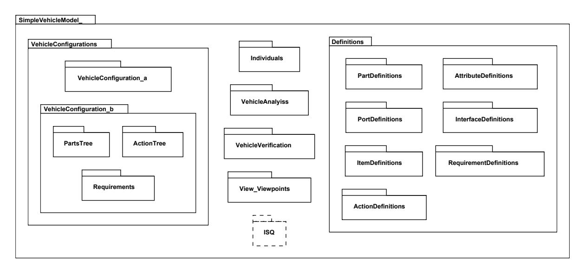

**Figure 56. Model Organization for SimpleVehicleModel**

```
package SimpleVehicleModel{
    private import ISQ::*;
    package Definitions { ... }
    package VehicleConfigurations{
        package VehicleConfiguration_a{ ... }
```

```
package VehicleConfiguration_b{
            package PartsTree{ ... }
            package ActionTree{ ... }
            package Requirements{ ... }
        }
    }
    package VehicleAnalysis{ ... }
    package VehicleVerification{ ... }
    package Individuals{ ... }
    package Views_Viewpoints{ ... }
    ...
}
```

The packages of a system model are often organized and managed to enable team members to work collaboratively on different aspects of the model, where each package contains cohesive content that can be worked on independently. The *VehicleConfigurations* package would typically import packages for each major system element (e.g., subsystem) to aid in collaborative development, although this was not done for this simple example.

# <span id="page-667-0"></span>**A.3 Definitions**

The *Definitions* package contains a nested *PartDefinitions* package that contains definitions for the parts that are used to represent the vehicle configurations. This includes the part definition for a *Vehicle*, whose features include attributes, ports, actions, and states.

<span id="page-667-1"></span>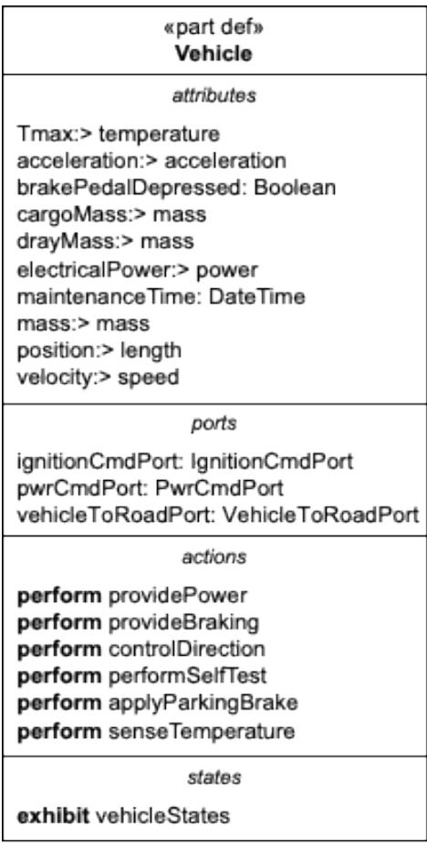

**Figure 57. Part Definition for Vehicle**

```
part def Vehicle {
    attribute mass:>ISQ::mass;
    attribute dryMass:>ISQ::mass;
    attribute cargoMass:>ISQ::mass;
    attribute position:>ISQ::length;
    attribute velocity:>ISQ::speed;
    attribute acceleration:>ISQ::acceleration;
    attribute electricalPower:>ISQ::power;
    attribute Tmax:>ISQ::temperature;
    attribute maintenanceTime: Time::DateTime;
    attribute brakePedalDepressed: Boolean;
    port ignitionCmdPort: IgnitionCmdPort;
    port pwrCmdPort: PwrCmdPort;
    port vehicleToRoadPort: VehicleToRoadPort;
    perform action providePower;
    perform action provideBraking;
    perform action controlDirection;
    perform action performSelfTest;
    perform action applyParkingBrake;
    perform action senseTemperature;
    exhibit state vehicleStates;
}
```

The attributes called *mass*, *dryMass*, and *cargoMass* are each a kind of the base *mass* attribute imported from the standard SysML *ISQ* library model (see [9.8.4](#page-635-0) ). Values of the attribute quantities contained in this library can then be assigned standard units from the *SI* (see [9.8.6](#page-647-1) ) or *USCustomaryUnits* (see [9.8.7](#page-647-4) ) library models. For example, the value of the *mass* of the *Vehicle* can be assigned the unit of kilogram (*SI::kg*). The *Vehicle* also contains other quantity attributes such as its *position* and *velocity*.

The *Vehicle* contains three ports called *ignitionCmdPort*, *pwrCmdPort* and *vehicleToRoadPort*, which are interaction points that provide ignition and fuel commands to the vehicle, and transfer vehicle torque to the road. The *Vehicle* performs the action *providePower* to accelerate the vehicle, and other actions that include *performSelfTest* and *applyParkingBrake*. In addition, the *Vehicle* exhibits its *vehicleStates*.

The *Vehicle* represents a class of individual vehicles which is defined by its attributes, ports, actions, and states. Other part definitions can be specified in a similar way to build a reusable library of part definitions.

The part definition for *FuelTank* contains an attribute called *mass* and an attribute called *fuelKind*. The attribute *fuelKind* is defined by the enumeration *FuelKind* that contains literal values for different kinds of fuel such as *gas* and *diesel*. The *FuelTank* also contains an item called *fuel.* An item is often used to represent something that flows through a system or is stored by a system. The fuel is not considered to be part of the *FuelTank*, so *fuel* is modeled as a referential feature (shown graphically using the white diamond symbol instead of the black diamond).

<span id="page-669-0"></span>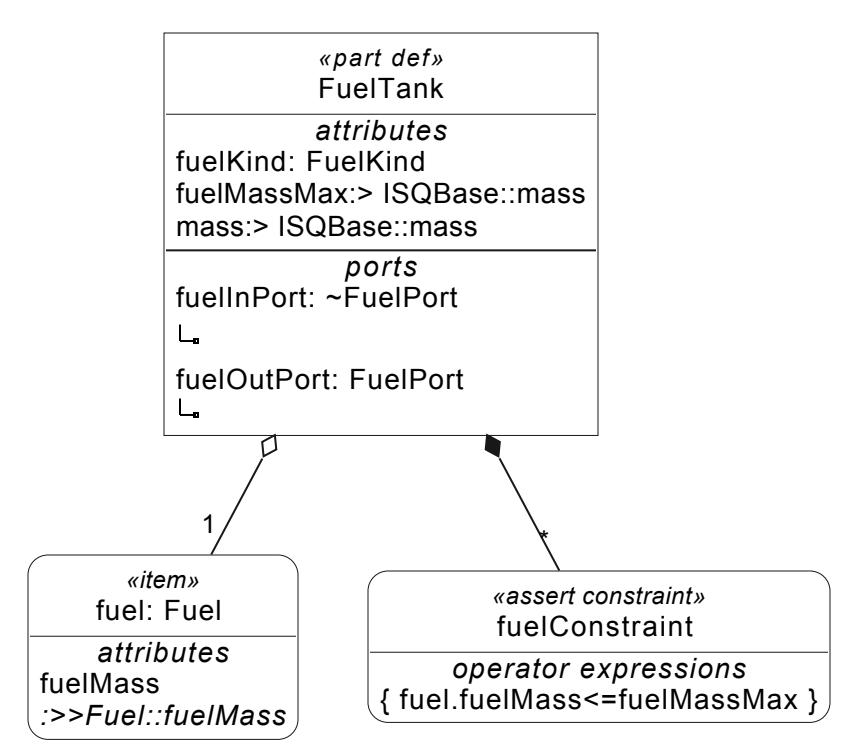

**Figure 58. Part Definition for FuelTank Referencing Fuel it Stores**

```
part def FuelTank{
    attribute mass :> ISQ::mass;
    attribute fuelKind:FuelKind;
    ref item fuel:Fuel{
        attribute redefines fuelMass;
    }
    attribute fuelMassMax:>ISQ::mass;
    assert constraint fuelConstraint {fuel.fuelMass<=fuelMassMax}
    port fuelOutPort:FuelPort;
    port fuelInPort:~FuelPort;
}
```

The *fuel* contains an attribute called *fuelMass*. The *FuelTank* contains an attribute called *fuelMassMax*, which represents the maximum amount of fuel that a *FuelTank* can store. A constraint is imposed that the *fuelMass* must be less than or equal to the *fuelMassMax*. The constraint is asserted to be true because, if the *fuelMass* exceeds the *fuelMassMax*, the model would be inconsistent and the model validation should generate an error. If assert is not used with the constraint, the model could evaluate the constraint to be false, and the model validation should not generate an error.

The *FuelTank* also contains a *fuelInPort* and a *fuelOutPort*. The *fuelOutPort* is defined by *FuelPort that* contains a directed feature to represent the fuel flowing out of this port. The *fuelInPort* is defined by a port definition that is the conjugate of the *FuelPort*. The conjugate is notated with a tilda (~) in front of the port definition name*.* The conjugate reverses the direction of each directed feature of the port that it conjugates, which in this case reverses the direction of the fuel to flow in to the port instead of out from the port*.* Note that the directed features are not shown in the figure but are specified as part of the definition of *FuelPort*.

The part definition for *Axle* contains the attribute *mass*. *FrontAxle* is a specialization of *Axle* that inherits its *mass* attribute and contains an additional attribute called *steeringAngle*.

<span id="page-670-0"></span>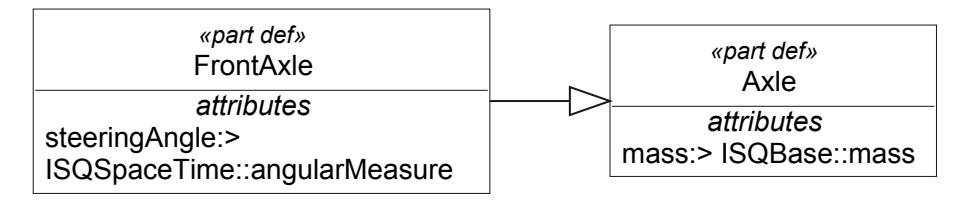

**Figure 59. Axle and its Subclass FrontA**

```
part def Axle{
    attribute mass:>ISQ::mass;
}
part def FrontAxle:>Axle{
    attribute steeringAngle:>ISQ::angularMeasure;
}
```

The *Definitions* package also contains several other kinds of definition elements. The port definition *FuelPort* contains an item called *fuel* that can flow out of the port. The *fuel* is defined by the item definition *Fuel that* contains a *mass* attribute. The interface definition *FuelInterface* is used to connect a *fuelOutPort* to a *fuelInPort*. The definition also specifies that *Fuel* flows across this interface. The item definition *FuelCmd* contains an attribute called *throttleLevel* that is defined by a *Real*. The action definition *ProvidePower* contains an input item *fuelCmd* that is defined by *FuelCmd.* It also contains an output attribute called *wheelToRoadTorque* that has multiplicity of 2, and is defined by the attribute definition *TorqueValue*.

<span id="page-670-1"></span>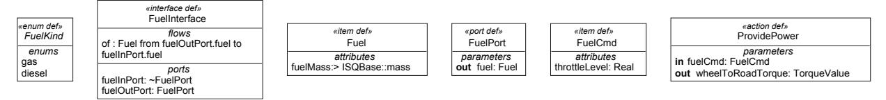

**Figure 60. Example Definition Elements**

```
action def ProvidePower {
    in item fuelCmd:FuelCmd;
    out wheelToRoadTorque:TorqueValue[2];
}
item def FuelCmd{
    attribute throttleLevel:Real;
}
port def FuelPort{
    out item fuel:Fuel;
}
item def Fuel{
    attribute fuelMass:>ISQ::mass;
}
interface def FuelInterface{
    end fuelOutPort:FuelPort;
    end fuelInPort:~FuelPort;
    flow of Fuel from fuelOutPort.fuel to fuelInPort.fuel;
}
enum def FuelKind {gas; diesel;}
```

# <span id="page-671-0"></span>**A.4 Parts**

The *VehicleConfigurations* package contains two usages of the *Vehicle* part definition called *vehicle\_a* and *vehicle\_b*. The *vehicle\_b* configuration is shown below. The part *vehicle\_b* inherits features from its part definition *Vehicle*. It can then redefine or subset its inherited features and add new features. As an example, *vehicle\_b* redefines the *mass* attribute it inherited from *Vehicle* and further constrains it's mass to be the sum of its *dryMass*, *cargoMass*, and *fuelMass*. It redefines other features including other attributes, ports, actions, and states in a similar manner. Its actions are redefined to perform actions that are contained in the *ActionTree*. For example, the inherited action from *Vehicle* to *providePower* is redefined by *ActionTree::providePower*. As described in [A.6](#page-676-0) , the *providePower* contained in *ActionTree* is decomposed into other actions.

```
«part»
               vehicle_b: Vehicle
cargoMass default 0 [kg]
:>>Vehicle::cargoMass
avgFuelEconomy:>
AttributeDefinitions::distancePerVolume
dryMass=sum(partMasses)
:>>Vehicle::dryMass
mass=dryMass+cargoMass+fuelTank.fuel.fuelMass
:>>Vehicle::mass
partMasses
                   attributes
vehicleStates
:>>Vehicle::vehicleStates
                  exhibit states
fuelTank: FuelTank
                     parts
providePower:> ActionTree::providePower
:>>Vehicle::providePower
performSelfTest:>
ActionTree::performSelfTest
:>>Vehicle::performSelfTest
applyParkingBrake:>
ActionTree::applyParkingBrake
:>>Vehicle::applyParkingBrake
senseTemperature:>
ActionTree::senseTemperature
:>>Vehicle::senseTemperature
                perform actions
fuelCmdPort: FuelCmdPort
:>>Vehicle::pwrCmdPort
setSpeedPort: ~SetSpeedPort
vehicleToRoadPort
:>>Vehicle::vehicleToRoadPort
                     ports
```

**Figure 61. Part Usage for vehicle\_b**

```
part vehicle_b:Vehicle{
    attribute mass redefines mass=
        dryMass+cargoMass+fuelTank.fuel.fuelMass;
    attribute dryMass redefines dryMass=sum(partMasses);
    attribute redefines cargoMass default 0 [kg];
    attribute partMasses=(...); // collection of part.mass
    attribute fuelEconomy :> distancePerVolume;
    port fuelCmdPort:FuelCmdPort redefines pwrCmdPort{
        in item fuelCmd redefines pwrCmd;
    port setSpeedPort:~SetSpeedPort;
    port vehicleToRoadPort redefines vehicleToRoadPort{
        port wheelToRoadPort1;WheelToRoadPort;
```

```
port wheelToRoadPort2:WheelOtRoadPort;
    }
    perform ActionTree::providePower redefines providePower;
    perform ActionTree::performSelfTest redefines performSelfTest;
    perform ActionTree::applyParkingBrake redefines applyParkingBrake;
    perform ActionTree::senseTemperature redefines senseTemperature;
    exhibit States::vehicleStates redefines vehicleStates;
    }
    part fuelTank:FuelTank{
    ...
    }
    ...
}
```

A *parts tree* is a representation of the decomposition of a part into its constituent parts. Different part usages with the same definition, such as *vehicle\_a* and *vehicle\_b*, can have different decompositions. As shown below, *vehicle\_b* is composed of several parts, including an *engine*, *starterMotor*, *transmission*, *driveshaft*, *frontAxleAssembly*, *rearAxleAssembly*, *fuelTank*, and *vehicleSoftware*. The *frontAxleAssembly* contains a *frontAxle* and two *frontWheels* as designated by the multiplicity [2]. The *rearAxleAssembly* contains a *rearAxle*, *differential*, *rearWheel1*, and *rearWheel2.* Note that some of the definition elements are elided from the figure but are visible in the textual notation. As always, views of the model only show selected aspects of the model.

<span id="page-672-0"></span>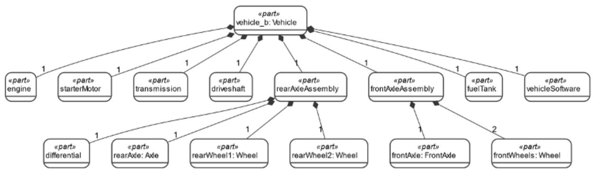

**Figure 62. Parts Tree for vehicle\_b**

```
part vehicle_b:Vehicle {
    ...
    part starterMotor:StarterMotor;
    part fuelTank:FuelTank;
    part engine:Engine;
    part transmission:Transmission;
    part driveshaft:Driveshaft;
    part rearAxleAssembly{
        part differential:Differential;
        part rearAxle:Axle;
        part rearWheel1:Wheel;
        part rearWheel2:Wheel;
    }
    part frontAxleAssembly{
        part frontAxle:FrontAxle;
        part frontWheels:Wheel[2];
    }
    part vehicleSoftware:VehicleSoftware;
}
```

The *VehicleConfigurations* package also contains the *engine4Cyl* variant that subsets *engine*. In general, an *engine* can contain 4 to 8 *cylinders*. The *engine4Cyl* variant redefines the set of 4..8 cylinders to be exactly

4 *cylinders*, and then subsets the set of 4 cylinders to create *cylinder1*, *cylinder2*, *cylinder3*, and *cylinder4*. (See also the example of variability modeling in [A.12](#page-687-0) .)

<span id="page-673-1"></span>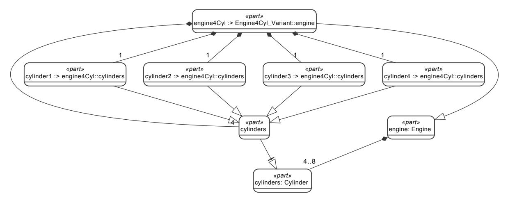

# **Figure 63. Variant engine4Cyl**

```
part engine:Engine{
    part cylinders:Cylinder [4..8] ordered;
}
part engine4Cyl:>engine{
    part redefines cylinders[4];
    part cylinder1[1] subsets cylinders;
    part cylinder2[1] subsets cylinders;
    part cylinder3[1] subsets cylinders;
    part cylinder4[1] subsets cylinders;
}
```

# <span id="page-673-0"></span>**A.5 Parts Interconnection**

The various constituent parts of *vehicle\_b* are interconnected via their ports. The *fuelCmdPort* on *vehicle\_b* is delegated to the *fuelCmdPort* on the engine using a binding connection. The *controlPort* on the *vehicleController* is connected to the *engineControlPort* on the engine. The *controlPort* is defined by *ControlPort* and the *engineControlPort* is defined by a port definition that is the conjugate of the *ControlPort* (that is, the directions of all its directed features are reversed relative to those of the original port definition).

The *drivePwrPort* on the engine is connected to the *clutchPort* on the transmission by an interface. The interface is defined by an interface definition whose port at one end of the interface is defined as *DrivePwrPort* and whose port at the other end of the interface is defined as the conjugate of the *DrivePwrPort*. The *DrivePwrPort* contains the directed feature *out engineTorque:Torque*. The conjugate of the *DrivePwrPort* contains the directed feature *in engineTorque:Torque*.

The *fuelOutPort* on the *fuelTank* is connected to the *fuelInPort* on the *Engine* by an interface. This interface is defined by the interface definition *FuelInterface* which contains a flow of *Fuel*. This flow can be shown as a solid arrowhead on the connection between the ports but is not shown in this particular view.

Connections can be made directly between nested parts without having to establish a connection between the corresponding composite parts. For example, the port on the *driveShaft* can connect directly to a port on the *differential* without having to connect first to the *rearAxleAssembly* that composes the *differential*. Ports can also be nested within a composite port as shown by the *vehicleToRoadPort*, which contains a nested port for each rear wheel.

<span id="page-674-0"></span>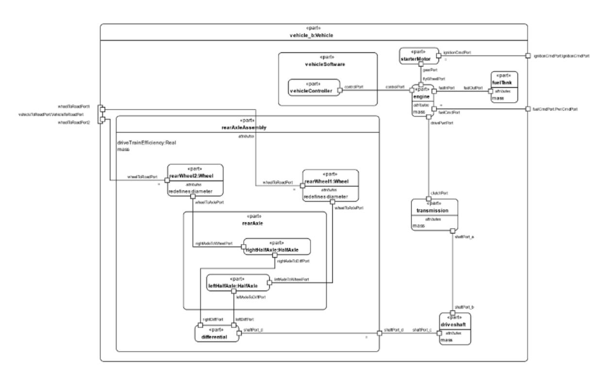

**Figure 64. Parts Interconnection for vehicle\_b**

```
part vehicle_b : Vehicle{
    port fuelCmdPort redefines pwrCmdPort;
    port vehicleToRoadPort redefines vehicleToRoadPort{
        port wheelToRoadPort1;
        port wheelToRoadPort2;
    }
    part fuelTank:FuelTank{
        port fuelOutPort;
    }
    part rearAxleAssembly{
        port shaftPort_d;
        part rearWheel1:Wheel{
            port :>>wheelToRoadPort;
            port :>>wheelToAxlePort;
        }
        part rearWheel2:Wheel{
            port :>>wheelToRoadPort;
            port :>>wheelToAxlePort;
        }
        part differential:Differential{
            port shaftPort_d;
            port leftDiffPort;
            port rightDiffPort;
        }
        part rearAxle{
            part leftHalfAxle:HalfAxle{
                port leftAxleToDiffPort;
                port leftAxleToWheelPort;
            }
            part rightHalfAxle:HalfAxle{
                port rightAxleToDiffPort;
                port rightAxleToWheelPort;
            }
```

```
}
    bind shaftPort_d = differential.shaftPort_d;
    connect differential.leftDiffPort
         to rearAxle.leftHalfAxle.leftAxleToDiffPort;
    connect differential.rightDiffPort
         to rearAxle.rightHalfAxle.rightAxleToDiffPort;
    connect rearAxle.leftHalfAxle.leftAxleToWheelPort
         to rearWheel1.wheelToAxlePort;
    connect rearAxle.rightHalfAxle.rightAxleToWheelPort
         to rearWheel2.wheelToAxlePort;
}
part starterMotor:StarterMotor{
    port ignitionCmdPort;
    port gearPort;
}
part engine:Engine{
    port fuelCmdPort;
    port drivePwrPort:DrivePwrPort;
    port fuelInPort;
    port flyWheelPort;
    port controlPort;
}
part transmission:Transmission{
    port clutchPort:~DrivePwrPort;
    port shaftPort_a;
}
part driveshaft:Driveshaft{
    port shaftPort_b;
    port shaftPort_c;
}
part vehicleSoftware:VehicleSoftware{
    part vehicleController {
        port controlPort;
    }
}
//connections
bind engine.fuelCmdPort = fuelCmdPort;
bind starterMotor.ignitionCmdPort = ignitionCmdPort;
interface engineToTransmissionInterface:EngineToTransmissionInterface
    connect engine.drivePwrPort to transmission.clutchPort;
interface fuelInterface:FuelInterface
    connect fuelTank.fuelOutPort to engine.fuelInPort;
connect vehicleSoftware.vehicleController.controlPort
     to engine.controlPort;
connect starterMotor.gearPort
     to engine.flyWheelPort;
connect transmission.shaftPort_a
     to driveshaft.shaftPort_b;
connect driveshaft.shaftPort_c
     to rearAxleAssembly.shaftPort_d;
bind rearAxleAssembly.rearWheel1.wheelToRoadPort
   = vehicleToRoadPort.wheelToRoadPort1;
bind rearAxleAssembly.rearWheel2.wheelToRoadPort
   = vehicleToRoadPort.wheelToRoadPort2;
```

}

# <span id="page-676-0"></span>**A.6 Actions**

The definition and usage pattern applies not only to parts and part definitions, but to most constructs in SysML. As shown below, the action *providePower* is defined by the action definition *ProvidePower*. The action *providePower* contains actions to *generateTorque*, *amplifyTorque*, *transferTorque*, and *distributeTorque*, each of which have their own definitions. The actions inherit their input and output parameters from their definition and redefine them as necessary (Note: the inherited parameters are not shown.)

<span id="page-676-1"></span>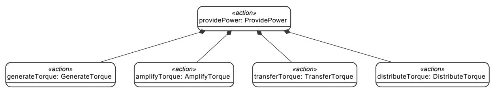

**Figure 65. Action providePower**

```
action providePower:ProvidePower{
    action generateTorque:GenerateTorque;
    action amplifyTorque:AmplifyTorque;
    action transferTorque:TransferTorque;
    action distributeTorque:DistributeTorque;
    ...
}
```

As shown in [Fig. 61](#page-671-1) , the part *vehicle\_b* performs the action *providePower*. The subparts of *vehicle\_b* then perform the appropriate subactions of *providePower*. For example, the part *engine* performs the action *providePower.generateTorque*, which redefines the *generateTorque* action inherited from its definition.

The output of each subaction of *providePower* is connected by a flow connection to the input of another subaction, except for *distributeTorque*, whose outputs are bound to the outputs of *providePower*. The input and output parameters are streaming unless designated as succession flows, meaning that the inputs continue to be consumed and the outputs continue to be produced as the action executes.

<span id="page-676-2"></span>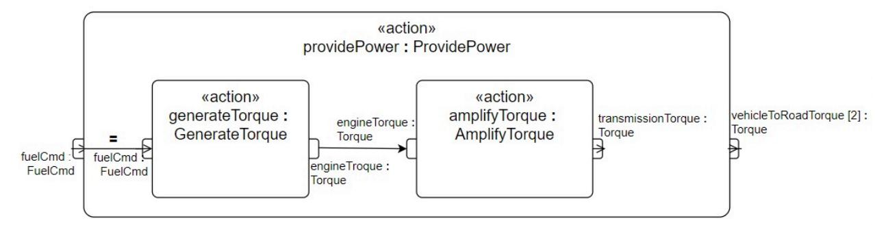

**Figure 66. Action flow for providePower**

```
action providePower:ProvidePower{
    ...
    bind fuelCmd = generateTorque.fuelCmd;
    flow generateTorque.engineTorque to amplifyTorque.engineTorque;
    flow amplifyTorque.transmissionTorque to transferTorque.transmissionTorque;
    flow transferTorque.driveshaftTorque to distributeTorque.driveshaftTorque;
    bind distributeTorque.wheelToRoadTorque = wheelToRoadTorque;
}
```

The *transportPassenger\_1* use case contains a sequence of actions for a *Vehicle* to transport passengers. The use case is defined by a use case definition called *TransportPassenger*. The actions *passenger1GetInVehicle* and *driverGetInvehicle* are performed concurrently after the start of the use case. After both these actions complete, an accept action is triggered upon receipt of an *IgnitionCmd*. After this, the actions *driveVehicleToDestination* and *providePower* can proceed concurrently. Once these are both completed, then the actions *passenger1GetOutOfVehicle* and *driverGetOutOfvehicle* are preformed concurrently, after which the *transportPassenger* use case is done. The fork and join control nodes and the successions (i.e., first and then) are used to control the action sequence.

<span id="page-677-0"></span>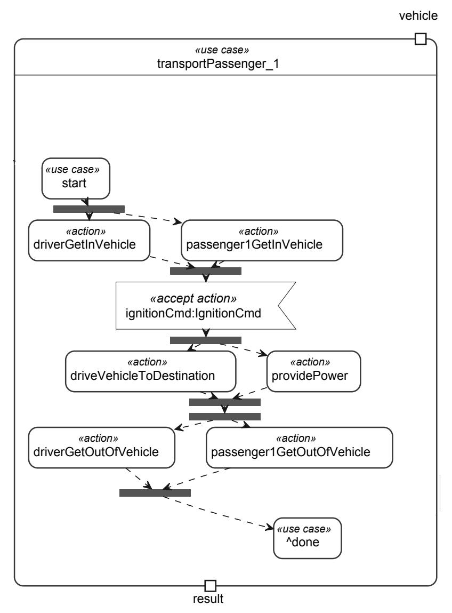

**Figure 67. Action flow for transportPassenger**

```
use case transportPassenger_1:TransportPassenger{
    //action declarations
    ...
    first start;
    then fork fork1;
        then driverGetInVehicle;
        then passenger1GetInVehicle;
    first driverGetInVehicle then join1;
```

```
first passenger1GetInVehicle then join1;
    first join1 then trigger;
    first trigger then fork2;
    fork fork2;
        then driveVehicleToDestination;
        then providePower;
    first driveVehicleToDestination then join2;
    first providePower then join2;
    first join2 then fork3;
    fork fork3;
         then driverGetOutOfVehicle;
         then passenger1GetOutOfVehicle;
    first driverGetOutOfVehicle then join3;
    first passenger1GetOutOfVehicle then join3;
    first join3 then done;
}
```

# <span id="page-678-0"></span>**A.7 States**

The states of a *Vehicle* enable selected actions to be performed. The *Vehicle* exhibits its state *vehicleStates*. This state is a parallel state, so its substates *operatingStates* and *healthStates* are concurrent. The states *operatingStates* and *healthStates* are not parallel, so only one of each of their substates can be active at any given time.

<span id="page-679-0"></span>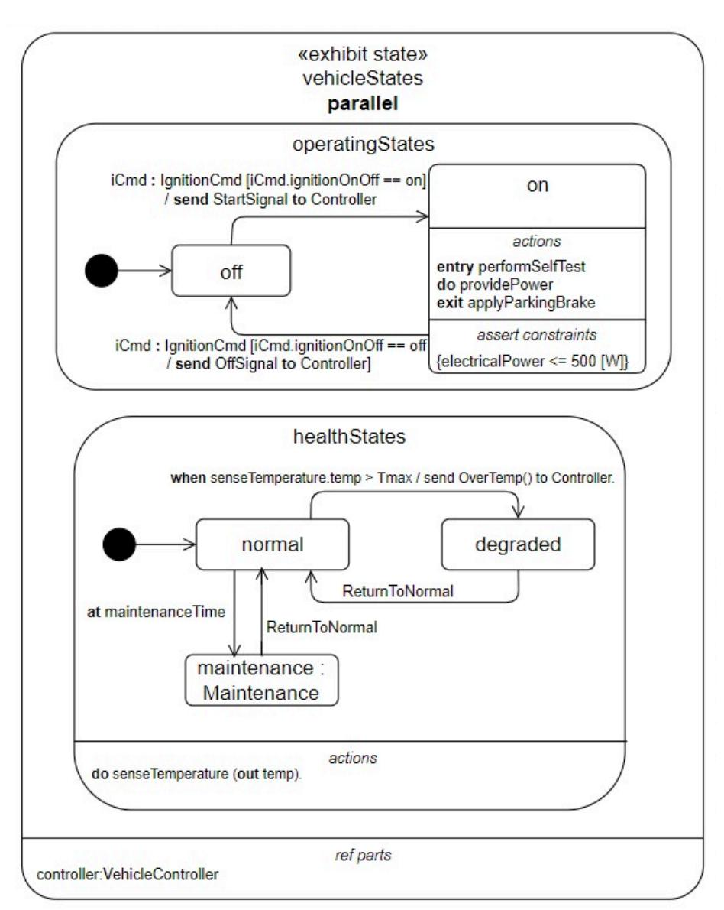

**Figure 68. Vehicle States**

```
exhibit state vehicleStates parallel {
    ref controller;
    state operatingStates {
        ...
    }
    state healthStates {
        ...
    }
}
```

Note that the state *vehicleStates* has a referential feature *controller:VehicleController*. This allows the substates of *vehicleStates* to send a signal to the *controlller* or one of its ports, or to access any other feature of *controller*.

The *operatingStates* are further decomposed into *off*, *starting*, and *on* states, with an entry transition to the *off* substate. Upon receipt of an *ignitionCmd*, the *off-starting* transition fires if the *ignitionCmd* is in the *on* position and the *brakePedalDepressed* is true. A *StartSignal* is sent to the *controller* as part of this transition, after which *operatingStates* enters its *starting* substate. The state *operatingStates* also includes transitions from the substates *starting* to *on* and *on* to *off*.

The *ignitionCmd* is defined by the item definition *IgnitionCmd*, which contains an attribute defined by an enumeration with values *on* and *off*. This pattern is used to represent a variety of signals that may be sent by send actions and accepted by accept actions.

The *on* state has an entry action to *performSelfTest*, which is performed upon entry to the state. When the entry action completes, the do action to *providePower* starts, and it continues to be performed until the state is exited. Prior to exiting the state, the exit action to *applyParkingBrake* is performed. The state also has a constraint that the *electricalPower* must not exceed 500 watts.

```
state operatingStates {
    entry action initial;
    state off;
    state starting;
    state on {
        entry performSelfTest;
        do providePower;
        exit applyParkingBrake;
        constraint {electricalPower<=500[W]}
    }
    transition initial then off;
    transition 'off-starting'
        first off
        accept ignitionCmd:IgnitionCmd via ignitionCmdPort
            if ignitionCmd.ignitionOnOff==IgnitionOnOff::on and brakePedalDepressed
        do send new StartSignal() to controller
        then starting;
    transition 'starting-on'
        first starting
        accept VehicleOnSignal
        then on;
    transition 'on-off'
        first on
        accept VehicleOffSignal
        do send new OffSignal() to controller
        then off;
}
```

The *healthStates* are decomposed into *normal*, *maintenance* and *degraded* states. Starting in the *normal* state, *healthStates* continually monitors the vehicle temperature and, when the temperature exceeds the allowed maximum, it transitions to the *degraded* state and notifies the *controller*. It also transitions from *normal* to *maintenance* when it is time for vehicle maintenance. In either case, it transitions back to the *normal* state on receipt of a ReturnToNormal signal.

```
state healthStates {
    entry action initial;
    do senseTemperature{
        out temp;
    }
```

```
state normal;
    state maintenance;
    state degraded;
    transition initial then normal;
    transition 'normal-maintenance'
        first normal
        accept at maintenanceTime
        then maintenance;
    transition 'normal-degraded'
        first normal
        accept when senseTemperature.temp > Tmax
        do send new OverTemp() to controller
        then degraded;
    transition 'maintenance-normal'
        first maintenance
        accept ReturnToNormal
        then normal;
    transition 'degraded-normal'
        first degraded
        accept ReturnToNormal
        then normal;
}
```

# <span id="page-681-0"></span>**A.8 Requirements**

The requirement definition *MassRequirement* has a shall statement that "The actual mass shall be less than the required mass". This statement is formalized using attributes for *massRequired* and *massActual* and the constraint expression *{massActual<=massRequired}*.

<span id="page-681-1"></span>

| «requirement def»                      |
|----------------------------------------|
| MassRequirement                        |
| doc                                    |
| The actual mass shall be less than the |
| required mass                          |
| attributes                             |
| massActual:> ISQBase::mass             |
| massRequired:> ISQBase::mass           |
| constraints                            |
| require {massActual<=massRequired}     |

**Figure 69. Requirement Definition MassRequirement**

```
requirement def MassRequirement{
    doc /*The actual mass shall be less than the required mass*/
    attribute massRequired:>ISQ::mass;
    attribute massActual:>ISQ::mass;
    require constraint {massActual<=massRequired}
}
```

The *vehicleSpecification* is a requirement that contains other requirements. It has a dependency to *marketSurvey* (not shown) that indicates its requirements are dependent on the market survey. The subject of the *vehicleSpecification* is *vehicle:Vehicle*, which enables the requirements contained in the specification to reference the features of *vehicle*. One of the requirements contained in the specification is the *vehicleMassRequirement*, which is defined by *MassRequirement*. The *massRequired* attribute is redefined

to have a specific value of 2000 kg in the context of this *vehicleSpecification*. The attribute *massActual* is redefined to be the sum of the *dryMass* and *fuelMassActual* of the *vehicle*, where the *fuelMassActual* is assumed to be a full tank of gas that weighs 60 kg. The *vehicleSpecficiation* also contains *vehicleFuelEconomyRequirements* for both city and highway.

Although not shown, the mass requirement is allocated to the mass of the vehicle using the allocate relationship, and the engine mass requirement is derived from the vehicle mass requirement using the derivation relationship.

<span id="page-682-0"></span>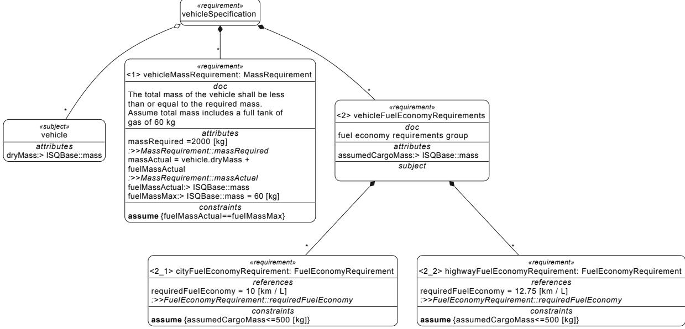

**Figure 70. Requirements Group vehicleSpecification**

```
item marketSurvey;
dependency from vehicleSpecification to marketSurvey;
requirement vehicleSpecification{
    subject vehicle:Vehicle;
    requirement <'1'> vehicleMassRequirement : MassRequirement {
        doc /* The total mass of a vehicle shall be less than or equal to the required mass.
        Assume total mass includes a full tank of gas of 60 kg*/
        attribute redefines massRequired=2000 [kg];
        attribute redefines massActual = vehicle.dryMass + fuelMassActual;
        attribute fuelMassActual:>ISQ::mass;
        attribute fuelMassMax:>ISQ::mass = 60 [kg];
        assume constraint {fuelMassActual==fuelMassMax}
    }
    allocate vehicleMassRequirement to PartsTree::vehicle_b.mass;
    requirement <'2'> vehicleFuelEconomyRequirements {
        doc /* fuel economy requirements group */
        attribute assumedCargoMass:>ISQ::mass;
        requirement <'2_1'> cityFuelEconomyRequirement : FuelEconomyRequirement {
            redefines requiredFuelEconomy= 10 [km / L];
            assume constraint {assumedCargoMass>=500 [kg]}
        }
        requirement <'2_2'> highwayFuelEconomyRequirement : FuelEconomyRequirement {
            redefines requiredFuelEconomy= 12.75 [km / L];
            assume constraint {assumedCargoMass>=500 [kg]}
        }
    }
}
requirement engineSpecification{
```

```
subject engine1:Engine;
   requirement <'1'> enegineMassRequirement : MassRequirement {
   ...
   }
   #derivation connection{
       end #original ::> vehicleSpecification.vehicleMassRequirement;
       end #derive ::> engineSpecification.engineMassRequirement;
   }
}
```

In order to evaluate whether *vehicle\_b* satisfies the *vehicleMassRequirement*, the *massActual* must be bound to the *mass* of *vehicle\_b*. This is accomplished by asserting that *vehicle\_b* satisfies the *vehicleSpecification* and binding the *actualMass* of the requirement to the *mass* of *vehicle\_b*. Asserting *vehicle\_b* satisfies the requirement is equivalent to imposing the mass constraint contained in the requirement on *vehicle\_b*.

```
satisfy vehicleSpecification by vehicle_b {
    requirement vehicleMassRequirement :>> vehicleMassRequirement {
        attribute redefines massActual = vehicle_b.mass;
        attribute redefines fuelMassActual = vehicle_b.fuelTank.fuel.fuelMass;
    }
}
```

# <span id="page-683-0"></span>**A.9 Analysis**

The *FuelEconomyAnalyisModel* package contains an analysis case called *fuelEconomyAnalysis*. The objective for this analysis case is to estimate the fuel economy of the vehicle. Its subject is the part *vehicle\_b*. The analysis case accepts a nominal driving scenario as an input, and returns a *calculatedFuelEconomy* in *KilometersPerLitre* as an output.

The analysis includes the following calculations to determine the result:

- *• TraveledDistance (scenario)*
- *• AverageTravelTimePerDistance (scenario)*
- *• ComputeBSFC (vehicle\_b.engine)*
- *• BestFuelConsumptionPerDistance (vehicle\_b.mass, bsfc, tpd\_avg, distance)*
- *• IdlingFuelConsumptionPerTime (vehicle\_b.engine)*
- *• FuelConsumption (f\_a, f\_b, tpd\_avg)*

**Figure 71. Analysis Case fuelEconomyAnalysis**

```
analysis fuelEconomyAnalysis {
    in attribute scenario: Scenario;
    subject = vehicle_b;
    objective fuelEconomyAnalysisObjective {
        doc /* estimate the vehicle fuel economy */
    }
    attribute distance = TraveledDistance(scenario);
    attribute tpd_avg = AverageTravelTimePerDistance(scenario);
    attribute bsfc = ComputeBSFC(vehicle_b.engine);
    attribute f_a =
        BestFuelConsumptionPerDistance(vehicle_b.mass, bsfc, tpd_avg, distance);
    attribute f_b = IdlingFuelConsumptionPerTime(vehicle_b.engine);
    return attribute calculatedFuelEconomy:>distancePerVolume =
        FuelConsumption(f_a, f_b, tpd_avg);
}
```

# <span id="page-684-0"></span>**A.10 Verification**

The simple verification case *massTests* is a usage of the verification case definition *MassTest*. The verification objective is to verify the *vehicleMassRequirement*. The subject of the verification case is *vehicle\_b*. The verification case includes actions to *weighVehicle* and *evaluatePassFail*.

The *massVerificationSystem* performs the *massTests*. It is composed of an *operator* and a *scale*. The *scale* performs the action to *weighVehicle,* and the *operator* performs the action to *evaluatePassFail*. The verification case returns a verdict of *pass* or *fail* based on whether the measured mass satisfies the mass requirement.

<span id="page-685-0"></span>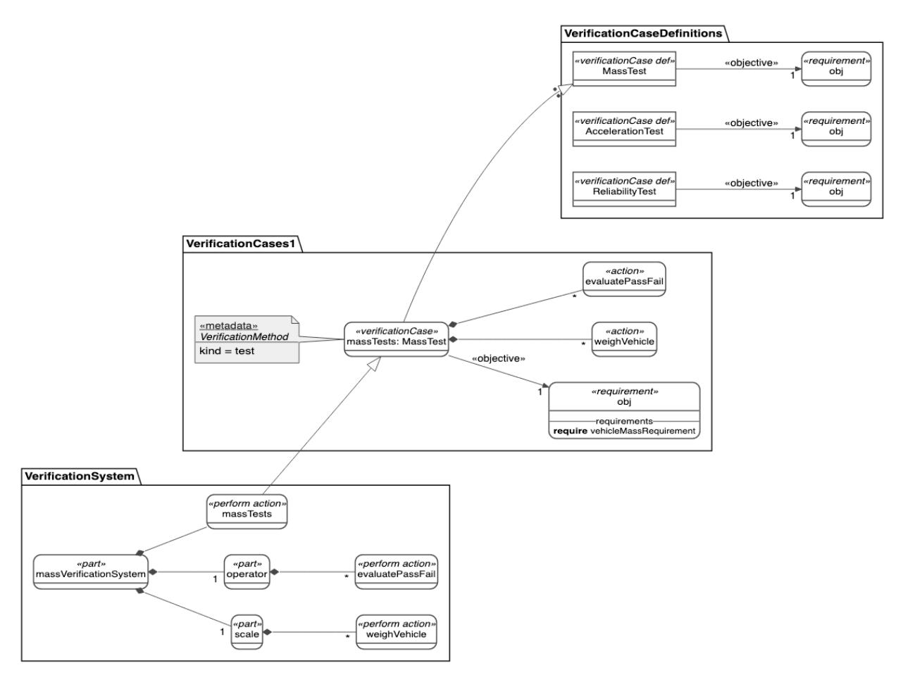

**Figure 72. Vehicle Mass Verification Test**

```
package VerificationCaseDefinitions{
    verification def MassTest;
    verification def AccelerationTest;
    verification def ReliabilityTest;
}
package VerificationCases1{
    verification massTests:MassTest {
        subject = vehicle_b;
        objective {
            verify vehicleSpecification.vehicleMassRequirement{
                redefines massActual=weighVehicle.massMeasured;
            }
        }
        metadata VerificationMethod{
            kind = VerificationMethodKind::test;
        }
        action weighVehicle {
            out massMeasured:>ISQ::mass;
        }
        then action evaluatePassFail {
            in massMeasured:>ISQ::mass;
            out verdict = PassIf(
                vehicleSpecification.vehicleMassRequirement(vehicle_b)
            );
        }
        flow from weighVehicle.massMeasured to evaluatePassFail.massMeasured;
        return :>> verdict = evaluatePassFail.verdict;
```

```
}
}
package VerificationSystem{
    part massVerificationSystem{
        perform massTests;
        part scale{
            perform massTests.weighVehicle;
        }
        part operator{
            perform massTests.evaluatePassFail;
        }
    }
}
```

# <span id="page-686-0"></span>**A.11 View and Viewpoint**

The *SafetyEngineer* is a stakeholder with a concern for *VehicleSafety*. The *safetyViewpoint* frames this concern. The view *vehiclePartsTree\_Safety* is a *PartsTreeView* that satisfies the *SafetyViewpoint*, and, therefore, addresses the *VehicleSafety* concern.

The view definition *TreeView* defines views that are rendered as tree diagrams. The view definition *PartsTreeView* specializes *TreeView* with a filter condition that only *PartUsages* should be included in the view. The view usage *vehiclePartsTree\_Safety* adds the further condition to only include parts that have the metadata annotation for *Safety*. This view then exposes all the nested parts of *vehicle\_b*, such that those parts meeting all the filter criteria are rendered in a tree diagram.

<span id="page-686-1"></span>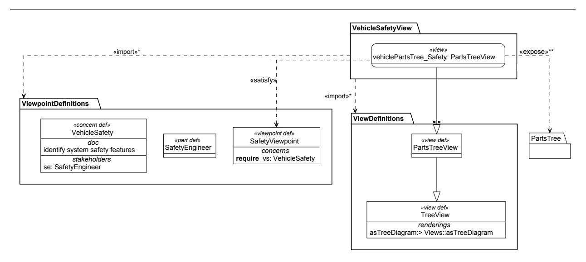

**Figure 73. Vehicle Safety View**

```
package Viewpoints{
    part def SafetyEngineer;
    concern def VehicleSafety {
        doc /* Vehicle must have necessary safety features. */
        stakeholder se:SafetyEngineer;
    }
    viewpoint safetyViewpoint{
        frame concern vs:VehicleSafety;
    }
}
package ViewDefinitions{
    view def TreeView {
```

```
render asTreeDiagram;
    }
    view def PartsTreeView:>TreeView {
        filter @SysML::PartUsage;
    }
}
package VehicleViews{
    view vehiclePartsTree_Safety:PartsTreeView{
        satisfy safetyViewpoint;
        filter @Safety;
        expose vehicle_b::**;
    }
}
```

<span id="page-687-1"></span>**Figure 74. Rendering of view vehiclePartsTree\_Safety**

# <span id="page-687-0"></span>**A.12 Variability**

The part *vehicleFamily* models a family of *Vehicles* that allows variations in the subparts *engine*, *transmission* and *sunroof*. In particular, the part *engine* has two variants, *engine4Cyl* and *engine6Cyl*, which constrain *engine.cylinders* to have multiplicity 4 and 6, respectively. The part *cylinders* of *engine6Cyl* has an attribute *diameter* that is also a variation point, with two variants for *smallDiameter* and *largeDiameter*. There are also two choices for the *transmission* and a *sunroof* is optional. The choice of a selected variant at one variation point can constrain the available choices at another variation point. For this example, the choices are constrained to be a 4 cylinder engine with a manual transmission or a 6 cylinder engine with an automatic transmission.

<span id="page-687-2"></span>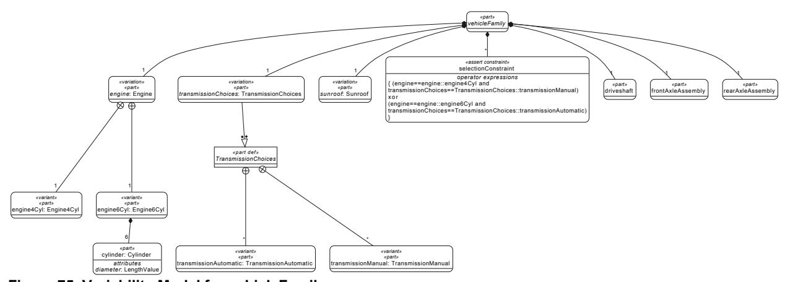

**Figure 75. Variability Model for vehicleFamily**

```
variation part def TransmissionChoices:>Transmission {
    variant part transmissionAutomatic:TransmissionAutomatic;
    variant part transmissionManual:TransmissionManual;
}
abstract part vehicleFamily:>vehicle_a{
    variation part engine:Engine{
        variant part engine4Cyl:Engine4Cyl;
        variant part engine6Cyl:Engine6Cyl{
            part cylinder:Cylinder [6]{
```

```
variation attribute diameter:LengthValue{
                    variant attribute smallDiameter:LengthValue;
                    variant attribute largeDiagmeter:LengthValue;
                }
            }
        }
    }
    variation part transmission:TransmissionChoices;
    variation part sunroof:Sunroof;
    assert constraint selectionConstraint {
        (engine==engine::engine4Cyl and
            transmission==TransmissionChoices::transmissionManual) xor
        (engine==engine::engine6Cyl and
            transmission==TransmissionChoices::transmissionAutomatic)
    }
}
```

# <span id="page-688-0"></span>**A.13 Individuals**

The part definition *Vehicle* represents a class of individual vehicles with common characteristics. The parts *vehicle\_a* and *vehicle\_b* are usages of *Vehicle* with different part decompositions. There can be many individual vehicles that conform to *vehicle\_a* or *vehicle\_b*.

The individual part definition *Vehicle\_1* is a specialization of *Vehicle* that restricts the part definition to a single individual. A usage *vehicle\_1* of this definition represents that individual within a specific context. This usage can also subset *vehicle\_b and* inherit the parts hierarchy and other features of *vehicle\_b*.

Additional individual definitions *FrontAxleAssembly\_1*, *FrontAxle\_1*, *Wheel\_1*, *Wheel\_2*, etc., are similarly specializations of their respective part definitions. The *vehicle\_1.frontAxleAssembly* is a usage of *FrontAxleAssembly\_1*, whose *frontAxle* is a usage of *FrontAxle\_1*, whose *wheels* are *Wheel\_1* and *Wheel\_2*. In this way, vehicle\_1 can decompose into a hierarchy of individual parts.

An individual definition and usage can be created for any definition and usage element. An individual action for example, represents a particular performance of an action with individual inputs and outputs.

The part definition *VehicleRoadContext* defines a context containing *vehicle:Vehicle* and *road:Road* subparts. The individual definition *VehicleRoadContext\_1* is a specialization of *VehicleRoadContext* whose subparts are constrained to be usages of the individual definitions *Vehicle\_1* and *Road\_1*.

As shown below, there is a time slice of *VehicleRoadContext\_1* from *t0* to *t2* called *t0\_t2\_a* with three snapshots *t0\_a*, *t1\_a* and *t2\_a*, at the times *t0*, *t1* and *t2*, respectively. Each context snapshot contains snapshots of *Vehicle\_1* and *Road\_1* at the respective times. Each of the vehicle and road snapshots are characterized by specific values for their attributes. In addition, the vehicle snapshot contains snapshots of its individual parts consistent with the decomposition of *vehicle\_1*.

An analysis may be used to compute the values of the attributes for each snapshot. The analysis results reflect the time history of the individuals, which may be visualized using typical time-based plots and data representations.

<span id="page-689-0"></span>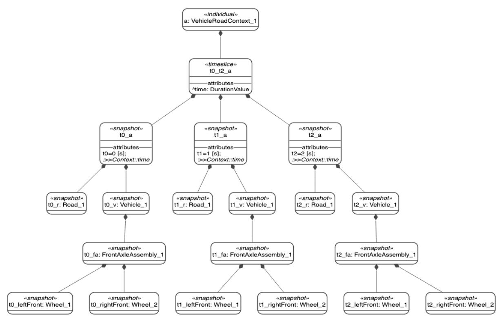

**Figure 76. Vehicle Individuals and Snapshots**

```
individual a:VehicleRoadContext_1{
    timeslice t0_t2_a{
        snapshot t0_a {
            attribute t0 redefines time=0 [s];
            snapshot t0_r:Road_1{
                :>>incline=0;
                :>>friction=.1;
            }
            snapshot t0_v:Vehicle_1{
                :>>position=0 [m];
                :>>velocity=0 [m];
                :>>acceleration=1.96 [m/s**2];
                snapshot t0_fa:FrontAxleAssembly_1{
                     snapshot t0_leftFront:Wheel_1;
                     snapshot t0_rightFront:Wheel_2;
                }
            }
        }
        snapshot t1_a{
            attribute t1 redefines time=1 [s];
            snapshot t1_r:Road_1{
                :>>incline=0;
                :>>friction=.1;
            }
            snapshot t1_v:Vehicle_1{
                :>>position=.98 [m];
                :>>velocity=1.96 [m/s];
                :>>acceleration=1.96 [m/s**2];
                snapshot t1_fa:FrontAxleAssembly_1{
                     snapshot t1_leftFront:Wheel_1;
                     snapshot t1_rightFront:Wheel_2;
                }
            }
```

```
}
        snapshot t2_a{
            attribute t2 redefines time=2 [s];
            snapshot t2_r:Road_1{
                 :>>incline =0;
                 :>>friction=.1;
            }
            snapshot t2_v:Vehicle_1{
                 :>>position=3.92 [m];
                 :>>velocity=3.92 [m/s];
                 :>>acceleration=1.96 [m/s**2];
                 snapshot t2_fa:FrontAxleAssembly_1{
                     snapshot t2_leftFront:Wheel_1;
                     snapshot t2_rightFront:Wheel_2;
                 }
            }
        }
    }
}
```