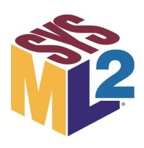

# **OMG Systems Modeling Language™ (SysML®)**

Version 2.0

# **Part 2: SysML v1 to SysML v2 Transformation**

**\_\_\_\_\_\_\_\_\_\_\_\_\_\_\_\_\_\_\_\_\_\_\_\_\_\_\_\_\_\_\_\_\_\_\_\_\_\_\_\_\_\_\_\_\_\_\_\_\_\_\_\_\_\_\_\_\_\_\_\_\_\_\_\_\_\_\_\_\_\_\_\_\_\_\_\_\_\_\_**

**OMG Document Number:** formal/2025-09-05

**Date:** September 2025

**Standard document URL:** <https://www.omg.org/spec/SysML/2.0/Transformation/>

**Machine Readable File(s):** <https://www.omg.org/spec/SysML/20250201/>

**\_\_\_\_\_\_\_\_\_\_\_\_\_\_\_\_\_\_\_\_\_\_\_\_\_\_\_\_\_\_\_\_\_\_\_\_\_\_\_\_\_\_\_\_\_\_\_\_\_\_\_\_\_\_\_\_\_\_\_\_\_\_\_\_\_\_\_\_\_\_\_\_\_\_\_\_\_\_\_**

```
Copyright © 2019-2025, 88solutions Corporation
Copyright © 2019-2025, Airbus
Copyright © 2019-2025, Aras Corporation
Copyright © 2019-2025, Association of Universities for Research in Astronomy (AURA)
Copyright © 2019-2025, BigLever Software
Copyright © 2019-2025, Boeing
Copyright © 2022-2025, Budapest University of Technology and Economics
Copyright © 2021-2025, Commissariat à l'énergie atomique et aux énergies alternatives (CEA)
Copyright © 2019-2025, Contact Software GmbH
Copyright © 2019-2025, Dassault Systèmes (No Magic)
Copyright © 2019-2025, DSC Corporation
Copyright © 2020-2025, DEKonsult
Copyright © 2020-2025, Delligatti Associates LLC
Copyright © 2019-2025, The Charles Stark Draper Laboratory, Inc.
Copyright © 2020-2025, ESTACA
Copyright © 2023-2025, Galois, Inc.
Copyright © 2019-2025, GfSE e.V.
Copyright © 2019-2025, George Mason University
Copyright © 2019-2025, IBM
Copyright © 2019-2025, Idaho National Laboratory
Copyright © 2019-2025, INCOSE
Copyright © 2019-2025, Intercax LLC
Copyright © 2019-2025, Jet Propulsion Laboratory (California Institute of Technology)
Copyright © 2019-2025, Kenntnis LLC
Copyright © 2020-2025, Kungliga Tekniska högskolon (KTH)
Copyright © 2019-2025, LightStreet Consulting LLC
Copyright © 2019-2025, Lockheed Martin Corporation
Copyright © 2019-2025, Maplesoft
Copyright © 2021-2025, MID GmbH
Copyright © 2020-2025, MITRE
Copyright © 2019-2025, Model Alchemy Consulting
Copyright © 2019-2025, Model Driven Solutions, Inc.
Copyright © 2019-2025, Model Foundry Pty. Ltd.
Copyright © 2023-2025, Object Management Group, Inc.
Copyright © 2019-2025, On-Line Application Research Corporation (OAC)
Copyright © 2019-2025, oose eG
Copyright © 2019-2025, Østfold University College
Copyright © 2019-2025, PTC
Copyright © 2020-2025, Qualtech Systems, Inc.
Copyright © 2019-2025, SAF Consulting
Copyright © 2019-2025, Simula Research Laboratory AS
Copyright © 2019-2025, System Strategy, Inc.
Copyright © 2019-2025, Thematix Partners, LLC
Copyright © 2019-2025, Tom Sawyer
Copyright © 2023-2025, Tucson Embedded Systems, Inc.
Copyright © 2019-2025, Universidad de Cantabria
Copyright © 2019-2025, University of Alabama in Huntsville
Copyright © 2019-2025, University of Detroit Mercy
Copyright © 2019-2025, University of Kaiserslauten
```

Copyright © 2020-2025, Willert Software Tools GmbH (SodiusWillert)

#### USE OF SPECIFICATION - TERMS, CONDITIONS & NOTICES

The material in this document details an Object Management Group specification in accordance with the terms, conditions and notices set forth below. This document does not represent a commitment to implement any portion of this specification in any companys products. The information contained in this document is subject to change without notice.

## LICENSES

The companies listed above have granted to the Object Management Group, Inc. (OMG) a nonexclusive, royalty-free, paid up, worldwide license to copy and distribute this document and to modify this document and distribute copies of the modified version. Each of the copyright holders listed above has agreed that no person shall be deemed to have infringed the copyright in the included material of any such copyright holder by reason of having used the specification set forth herein or having conformed any computer software to the specification.

Subject to all of the terms and conditions below, the owners of the copyright in this specification hereby grant you a fully-paid up, non-exclusive, nontransferable, perpetual, worldwide license (without the right to sublicense), to use this specification to create and distribute software and special purpose specifications that are based upon this specification, and to use, copy, and distribute this specification as provided under the Copyright Act; provided that: (1) both the copyright notice identified above and this permission notice appear on any copies of this specification; (2) the use of the specifications is for informational purposes and will not be copied or posted on any network computer or broadcast in any media and will not be otherwise resold or transferred for commercial purposes; and (3) no modifications are made to this specification. This limited permission automatically terminates without notice if you breach any of these terms or conditions. Upon termination, you will destroy immediately any copies of the specifications in your possession or control.

#### PATENTS

The attention of adopters is directed to the possibility that compliance with or adoption of OMG specifications may require use of an invention covered by patent rights. OMG shall not be responsible for identifying patents for which a license may be required by any OMG specification, or for conducting legal inquiries into the legal validity or scope of those patents that are brought to its attention. OMG specifications are prospective and advisory only. Prospective users are responsible for protecting themselves against liability for infringement of patents.

#### GENERAL USE RESTRICTIONS

Any unauthorized use of this specification may violate copyright laws, trademark laws, and communications regulations and statutes. This document contains information which is protected by copyright. All Rights Reserved. No part of this work covered by copyright herein may be reproduced or used in any form or by any means--graphic, electronic, or mechanical, including photocopying, recording, taping, or information storage and retrieval systems--without permission of the copyright owner.

## DISCLAIMER OF WARRANTY

WHILE THIS PUBLICATION IS BELIEVED TO BE ACCURATE, IT IS PROVIDED "AS IS" AND MAY CONTAIN ERRORS OR MISPRINTS. THE OBJECT MANAGEMENT GROUP AND THE COMPANIES LISTED ABOVE MAKE NO WARRANTY OF ANY KIND, EXPRESS OR IMPLIED, WITH REGARD TO THIS PUBLICATION, INCLUDING BUT NOT LIMITED TO ANY WARRANTY OF TITLE OR

OWNERSHIP, IMPLIED WARRANTY OF MERCHANTABILITY OR WARRANTY OF FITNESS FOR A PARTICULAR PURPOSE OR USE. IN NO EVENT SHALL THE OBJECT MANAGEMENT GROUP OR ANY OF THE COMPANIES LISTED ABOVE BE LIABLE FOR ERRORS CONTAINED HEREIN OR FOR DIRECT, INDIRECT, INCIDENTAL, SPECIAL, CONSEQUENTIAL, RELIANCE OR COVER DAMAGES, INCLUDING LOSS OF PROFITS, REVENUE, DATA OR USE, INCURRED BY ANY USER OR ANY THIRD PARTY IN CONNECTION WITH THE FURNISHING, PERFORMANCE, OR USE OF THIS MATERIAL, EVEN IF ADVISED OF THE POSSIBILITY OF SUCH DAMAGES.

The entire risk as to the quality and performance of software developed using this specification is borne by you. This disclaimer of warranty constitutes an essential part of the license granted to you to use this specification.

#### RESTRICTED RIGHTS LEGEND

Use, duplication or disclosure by the U.S. Government is subject to the restrictions set forth in subparagraph (c) (1) (ii) of The Rights in Technical Data and Computer Software Clause at DFARS 252.227-7013 or in subparagraph (c)(1) and (2) of the Commercial Computer Software - Restricted Rights clauses at 48 C.F.R. 52.227-19 or as specified in 48 C.F.R. 227-7202-2 of the DoD F.A.R. Supplement and its successors, or as specified in 48 C.F.R. 12.212 of the Federal Acquisition Regulations and its successors, as applicable. The specification copyright owners are as indicated above and may be contacted through the Object Management Group, 9C Medway Road, PMB 274, Milford, MA 01757, U.S.A.

## TRADEMARKS

CORBA®, CORBA logos®, FIBO®, Financial Industry Business Ontology®, Financial Instrument Global Identifier®, IIOP®, IMM®, Model Driven Architecture®, MDA®, Object Management Group®, OMG®, OMG Logo®, SoaML®, SOAML®, SysML®, UAF®, Unified Modeling Language™, UML®, UML Cube Logo®, VSIPL®, and XMI® are registered trademarks of the Object Management Group, Inc.

For a complete list of trademarks, see: [https://www.omg.org/legal/tm\\_list.htm](https://www.omg.org/legal/tm_list.htm). All other products or company names mentioned are used for identification purposes only, and may be trademarks of their respective owners.

#### COMPLIANCE

The copyright holders listed above acknowledge that the Object Management Group (acting itself or through its designees) is and shall at all times be the sole entity that may authorize developers, suppliers and sellers of computer software to use certification marks, trademarks or other special designations to indicate compliance with these materials.

Software developed under the terms of this license may claim compliance or conformance with this specification if and only if the software compliance is of a nature fully matching the applicable compliance points as stated in the specification. Software developed only partially matching the applicable compliance points may claim only that the software was based on this specification, but may not claim compliance or conformance with this specification. In the event that testing suites are implemented or approved by Object Management Group, Inc., software developed using this specification may claim compliance or conformance with the specification only if the software satisfactorily completes the testing suites.

#### OMG'S ISSUE REPORTING PROCEDURE

All OMG specifications are subject to continuous review and improvement. As part of this process we encourage readers to report any ambiguities, inconsistencies, or inaccuracies they may find by completing the Issue Reporting Form listed on the main web page [https://www.omg.org](http://www.omg.org/), under Documents, Report a Bug/Issue.

# **Preface**

## **OMG**

Founded in 1989, the Object Management Group, Inc. (OMG) is an open membership, not-for-profit computer industry standards consortium that produces and maintains computer industry specifications for interoperable, portable, and reusable enterprise applications in distributed, heterogeneous environments. Membership includes Information Technology vendors, end users, government agencies, and academia.

OMG member companies write, adopt, and maintain its specifications following a mature, open process. OMG's specifications implement the Model Driven Architecture® (MDA®), maximizing ROI through a fulllifecycle approach to enterprise integration that covers multiple operating systems, programming languages, middleware and networking infrastructures, and software development environments. OMG's specifications include: UML® (Unified Modeling Language™); CORBA® (Common Object Request Broker Architecture); CWM™ (Common Warehouse Metamodel); and industry-specific standards for dozens of vertical markets.

More information on the OMG is available at <https://www.omg.org/>.

## **OMG Specifications**

As noted, OMG specifications address middleware, modeling, and vertical domain frameworks. All OMG Specifications are available from the OMG website at: <https://www.omg.org/spec>

All of OMG's formal specifications may be downloaded without charge from our website. (Products implementing OMG specifications are available from individual suppliers.) Copies of specifications, available in PostScript and PDF format, may be obtained from the Specifications Catalog cited above or by contacting the Object Management Group, Inc. at:

OMG Headquarters 9C Medway Road, PMB 274 Milford, MA 01757 USA

Tel: +1-781-444-0404 Fax: +1-781-444-0320

Email: [pubs@omg.org](mailto:pubs@omg.org)

Certain OMG specifications are also available as ISO standards. Please consult [https://www.iso.org](https://www.iso.org/)

## **Issues**

All OMG specifications are subject to continuous review and improvement. As part of this process we encourage readers to report any ambiguities, inconsistencies, or inaccuracies they may find by completing the Issue Reporting Form listed on the main web page [https://www.omg.org,](https://www.omg.org/) under Specifications, Report an Issue.

| 1 Scope1                                       |  |
|------------------------------------------------|--|
| 2 Conformance3                                 |  |
| 3 Normative References5                        |  |
| 4 Terms and Definitions7                       |  |
| 5 Symbols9                                     |  |
| 6 Introduction11                               |  |
| 6.1 Mapping Approach11                         |  |
| 6.2 Acknowledgements11                         |  |
| 7 Mappings13                                   |  |
| 7.1 Overview13                                 |  |
| 7.2 Foundations13                              |  |
| 7.2.1 Overview13                               |  |
| 7.2.2 Foundational class specifications14      |  |
| 7.2.2.1 UniqueMapping14                        |  |
| 7.2.2.2 Factory14                              |  |
| 7.2.2.3 Mapping14                              |  |
| 7.2.2.4 MainMapping15                          |  |
| 7.2.2.5 Initializer16                          |  |
| 7.3 Mapping Helper and Library16               |  |
| 7.3.1 Helper16                                 |  |
| 7.3.2 SysML v1 Library22                       |  |
| 7.4 Initializers25                             |  |
| 7.4.1 Overview25                               |  |
| 7.4.2 Mapping Specifications25                 |  |
| 7.4.2.1 KerML Initializers25                   |  |
| 7.4.2.1.1 ToAnnotatingElement_Init25           |  |
| 7.4.2.1.2 ToAnnotation_Init25                  |  |
| 7.4.2.1.3 ToAssociation_Init26                 |  |
| 7.4.2.1.4 ToBehavior_Init26                    |  |
| 7.4.2.1.5 ToClassifier_Init26                  |  |
| 7.4.2.1.6 ToComment_Init27                     |  |
| 7.4.2.1.7 ToConjugation_Init27                 |  |
| 7.4.2.1.8 ToConnector_Init27                   |  |
| 7.4.2.1.9 ToDocumentation_Init28               |  |
| 7.4.2.1.10 ToElement_Init28                    |  |
|                                                |  |
| 7.4.2.1.11 ToEndFeatureMembership_Init29       |  |
| 7.4.2.1.12 ToExpression_Init29                 |  |
| 7.4.2.1.13 ToFeature_Init29                    |  |
| 7.4.2.1.14 ToFeatureChainExpression_Init30     |  |
| 7.4.2.1.15 ToFeatureChaining_Init31            |  |
| 7.4.2.1.16 ToFeatureMembership_Init31          |  |
| 7.4.2.1.17 ToFeatureReferenceExpression_Init31 |  |
| 7.4.2.1.18 ToFeatureTyping_Init32              |  |
| 7.4.2.1.19 ToFeatureValue_Init32               |  |
| 7.4.2.1.20 ToFlow_Init33                       |  |
| 7.4.2.1.21 ToFunction_Init33                   |  |
| 7.4.2.1.22 ToImport_Init33                     |  |
| 7.4.2.1.23 ToInteraction_Init34                |  |
| 7.4.2.1.24 ToInvocationExpression_Init34       |  |
| 7.4.2.1.25 ToMembership_Init34                 |  |
| 7.4.2.1.26 ToMembershipImport_Init35           |  |
| 7.4.2.1.27 ToNamespace_Init35                  |  |
| 7.4.2.1.28 ToNamespaceImport_Init36            |  |
| 7.4.2.1.29 ToOperatorExpression_Init36         |  |

|                                               | 7.4.2.1.31 ToPackage_Init37                     |  |
|-----------------------------------------------|-------------------------------------------------|--|
|                                               | 7.4.2.1.32 ToParameterMembership_Init37         |  |
|                                               | 7.4.2.1.33 ToPredicate_Init37                   |  |
|                                               | 7.4.2.1.34 ToRedefinition_Init38                |  |
|                                               | 7.4.2.1.35 ToReferenceSubsetting_Init38         |  |
|                                               | 7.4.2.1.36 ToRelationship_Init38                |  |
|                                               | 7.4.2.1.37 ToReturnParameterMembership_Init39   |  |
|                                               | 7.4.2.1.38 ToSpecialization_Init39              |  |
|                                               | 7.4.2.1.39 ToStep_Init40                        |  |
|                                               | 7.4.2.1.40 ToSubclassification_Init40           |  |
|                                               | 7.4.2.1.41 ToSubsetting_Init40                  |  |
|                                               | 7.4.2.1.42 ToSuccession_Init41                  |  |
|                                               | 7.4.2.1.43 ToSuccessionItemFlow_Init41          |  |
|                                               | 7.4.2.1.44 ToTextualRepresentation_Init41       |  |
|                                               | 7.4.2.1.45 ToType_Init42                        |  |
|                                               | 7.4.2.1.46 ToTypeFeaturing_Init42               |  |
| 7.4.2.2 System Initializers43                 |                                                 |  |
|                                               | 7.4.2.2.1 ToActionUsage_Init43                  |  |
|                                               | 7.4.2.2.2 ToActorMembership_Init43              |  |
|                                               | 7.4.2.2.3 ToAssignmentActionUsage_Init43        |  |
|                                               | 7.4.2.2.4 ToBindingConnectorAsUsage_Init44      |  |
|                                               | 7.4.2.2.5 ToCalculationUsage_Init44             |  |
|                                               | 7.4.2.2.6 ToConjugatedPortDefinition_Init44     |  |
|                                               | 7.4.2.2.7 ToConjugatedPortTyping_Init44         |  |
|                                               | 7.4.2.2.8 ToConnectionUsage_Init45              |  |
|                                               | 7.4.2.2.9 ToConstraintDefinition_Init45         |  |
|                                               | 7.4.2.2.10 ToConstraintUsage_Init45             |  |
|                                               | 7.4.2.2.11 ToDefinition_Init45                  |  |
|                                               | 7.4.2.2.12 ToEventOccurerenceUsage_Init46       |  |
|                                               | 7.4.2.2.13 ToFlowUsage_Init46                   |  |
|                                               | 7.4.2.2.14 ToItemDefinition_Init47              |  |
|                                               | 7.4.2.2.15 ToItemFeature_Init47                 |  |
|                                               | 7.4.2.2.16 ToItemUsage_Init47                   |  |
|                                               | 7.4.2.2.17 ToMetadataUsage_Init47               |  |
|                                               | 7.4.2.2.18 ToObjectiveMembership_Init48         |  |
|                                               | 7.4.2.2.19 ToOccurenceDefinition_Init48         |  |
|                                               | 7.4.2.2.20 ToOccurrenceUsage_Init48             |  |
|                                               |                                                 |  |
|                                               | 7.4.2.2.21 ToPartUsage_Init49                   |  |
|                                               | 7.4.2.2.22 ToPerformActionUsage_Init49          |  |
|                                               | 7.4.2.2.23 ToPortConjugation_Init49             |  |
|                                               | 7.4.2.2.24 ToPortDefinition_Init50              |  |
|                                               | 7.4.2.2.25 ToReferenceUsage_Init50              |  |
|                                               | 7.4.2.2.26 ToRequirementUsage_Init50            |  |
|                                               | 7.4.2.2.27 ToStateSubactionMembership_Init50    |  |
|                                               | 7.4.2.2.28 ToStateUsage_Init51                  |  |
|                                               | 7.4.2.2.29 ToSubjectMembership_Init51           |  |
|                                               | 7.4.2.2.30 ToTransitionUsage_Init51             |  |
|                                               | 7.4.2.2.31 ToTriggerInvocationExpression_Init51 |  |
|                                               | 7.4.2.2.32 ToUsage_Init52                       |  |
| 7.5 Factories52                               |                                                 |  |
| 7.5.1 Overview52                              |                                                 |  |
| 7.5.2 Mapping Specifications52                |                                                 |  |
| 7.5.2.1 LiteralString_Factory52               |                                                 |  |
| 7.5.2.2 StringParameterFeature_Factory53      |                                                 |  |
| 7.5.2.3 StringParameterFeatureValue_Factory53 |                                                 |  |
|                                               |                                                 |  |

| 7.5.2.5 SubjectMembership_Factory54                                 |  |
|---------------------------------------------------------------------|--|
| 7.5.2.6 AssignmentActionUsage_Factory54                             |  |
| 7.5.2.7 AssignmentActionUsageFeatureMembership2_Factory55           |  |
| 7.5.2.8 AssignmentActionUsageFeatureMembership3_Factory55           |  |
| 7.5.2.9 AssignmentActionUsageOwningMembership_Factory55             |  |
| 7.5.2.10 AssignmentActionUsageParameterMembership_Factory56         |  |
| 7.5.2.11 AssignmentActionUsageReferenceUsageIn1_Factory56           |  |
| 7.5.2.12 AssignmentActionUsageTargetReferenceUsageIn2_Factory57     |  |
| 7.5.2.13 AssignmentActionUsageTargetReferenceUsageIn3_Factory57     |  |
| 7.5.2.14 DirectedReferenceUsage_Factory57                           |  |
| 7.5.2.15 DirectedReferenceUsageParameterMembership_Factory58        |  |
| 7.5.2.16 EmptyObjectiveMembership_Factory58                         |  |
| 7.5.2.17 EmptyRequirementUsage_Factory58                            |  |
| 7.5.2.18 EmptySubject_Factory59                                     |  |
| 7.5.2.19 EmptySubjectMembership_Factory59                           |  |
| 7.5.2.20 FeatureTyping_Factory59                                    |  |
| 7.5.2.21 FlowEndParameterMembership_Factory60                       |  |
| 7.5.2.22 FlowItem_Factory60                                         |  |
| 7.5.2.23 FlowItemFeatureMembership_Factory61                        |  |
| 7.5.2.24 FlowUsage_Factory61                                        |  |
| 7.5.2.25 FlowUsageFeatureMembership_Factory62                       |  |
| 7.5.2.26 InformationFlowEventOccurrenceUsage_Factory62              |  |
| 7.5.2.27 InformationFlowReferenceSubsetting_Factory63               |  |
| 7.5.2.28 LiteralBoolean_Factory63                                   |  |
| 7.5.2.29 LiteralNull_Factory64                                      |  |
| 7.5.2.30 LiteralRational_Factory64                                  |  |
| 7.5.2.31 LowerBound_Factory65                                       |  |
| 7.5.2.32 MultiplicityElement_Factory65                              |  |
| 7.5.2.33 MultiplicityLowerBoundMembership_Factory65                 |  |
| 7.5.2.34 MultiplicityMembership_Factory66                           |  |
| 7.5.2.35 MultiplicityUpperBoundMembership_Factory67                 |  |
| 7.5.2.36 ObjectFlowItemFlowEndRedefinition_Factory67                |  |
| 7.5.2.37 ParameterMembership_Factory67                              |  |
| 7.5.2.38 ReferenceSubsetting_Factory68                              |  |
|                                                                     |  |
| 7.5.2.39 ReferenceUsage_Factory68                                   |  |
| 7.5.2.40 ReturnParameterFeature_Factory68                           |  |
| 7.5.2.41 ReturnParameterFeatureMembership_Factory69                 |  |
| 7.5.2.42 Subsetting_Factory69                                       |  |
| 7.5.2.43 UpperBound_Factory69                                       |  |
| 7.6 Generic Mappings70                                              |  |
| 7.6.1 Overview70                                                    |  |
| 7.6.2 Common Mappings70                                             |  |
| 7.6.2.1 CommonFeatureReferenceExpression_Mapping70                  |  |
| 7.6.2.2 CommonMembership_Mapping71                                  |  |
| 7.6.2.3 CommonParameterReferenceUsageInMembership_Mapping71         |  |
| 7.6.2.4 CommonParameterReferenceUsageIn_Mapping72                   |  |
| 7.6.2.5 CommonParameterReferenceUsageInFeatureTyping_Mapping73      |  |
| 7.6.2.6 CommonParameterReferenceUsageInUntyped_Mapping73            |  |
| 7.6.2.7 CommonReturnParameterFeature_Mapping74                      |  |
| 7.6.2.8 CommonReturnParameterFeatureTyping_Mapping75                |  |
| 7.6.2.9 CommonReturnParameterFeatureUntyped_Mapping75               |  |
| 7.6.2.10 CommonReturnParameterFeatureMembership_Mapping76           |  |
| 7.6.2.11 CommonReturnParameterReferenceUsageMembership_Mapping77    |  |
| 7.6.2.12 CommonReturnParameterReferenceUsage_Mapping78              |  |
| 7.6.2.13 CommonReturnParameterReferenceUsageFeatureTyping_Mapping78 |  |
|                                                                     |  |

| 7.6.2.14 CommonReturnParameterReferenceUsageUntyped_Mapping79           |  |
|-------------------------------------------------------------------------|--|
| 7.6.2.15 CommonReferenceUsageIn_Mapping80                               |  |
| 7.6.2.16 CommonReferenceUsageInFeatureMembership_Mapping80              |  |
| 7.6.2.17 CommonReferenceUsageInFeatureTyping_Mapping81                  |  |
| 7.6.2.18 CommonReferenceUsageInUntyped_Mapping82                        |  |
| 7.7 Mappings from UML4SysML metaclasses82                               |  |
| 7.7.1 Overview82                                                        |  |
| 7.7.2 Actions83                                                         |  |
| 7.7.2.1 Overview83                                                      |  |
| 7.7.2.2 UML4SysML::Actions elements not mapped84                        |  |
| 7.7.2.3 Mapping Specifications85                                        |  |
| 7.7.2.3.1 Accept Event Actions85                                        |  |
| 7.7.2.3.1.1 AcceptCallAction_Mapping85                                  |  |
| 7.7.2.3.1.2 AcceptEventAction_Mapping86                                 |  |
| 7.7.2.3.1.3 AEAChangeExpressionMembership_Mapping87                     |  |
| 7.7.2.3.1.4 AEAChangeParameter_Mapping87                                |  |
| 7.7.2.3.1.5 AEAChangeParameterFeatureValue_Mapping88                    |  |
| 7.7.2.3.1.6 AEAChangeParameterTrigger_Mapping89                         |  |
| 7.7.2.3.1.7 AEAChangeParameterTriggerExpression_Mapping89               |  |
| 7.7.2.3.1.8 AEAChangeParameterResultExpressionMembership_Mapping90      |  |
| 7.7.2.3.1.9 AEAChangeParameterFeatureChainExpression_Mapping91          |  |
| 7.7.2.3.1.10 AEAChangeParameterFeatureMembership_Mapping91              |  |
| 7.7.2.3.1.11 AEAChangeParameterFeature_Mapping92                        |  |
| 7.7.2.3.1.12 AEAChangeParameterExpressionFeatureValue_Mapping92         |  |
| 7.7.2.3.1.13 AEAChangeParameterFeatureReferenceExpression_Mapping93     |  |
| 7.7.2.3.1.14 AEAChangeParameterMembership_Mapping94                     |  |
| 7.7.2.3.1.15 AEAChangeParameterParameterMembership_Mapping94            |  |
| 7.7.2.3.1.16 AEAReceiverParameter_Mapping95                             |  |
| 7.7.2.3.1.17 AEAReceiverParameterMembership_Mapping96                   |  |
| 7.7.2.3.1.18 AEAReceiverFeatureValue_Mapping96                          |  |
| 7.7.2.3.1.19 AEASignalParameter_Mapping97                               |  |
| 7.7.2.3.1.20 AEASignalParameterFeatureTyping_Mapping98                  |  |
| 7.7.2.3.1.21 AEAParameterMembership_Mapping98                           |  |
| 7.7.2.3.1.22 AEAReceiverFeatureReferenceExpression_Mapping99            |  |
| 7.7.2.3.1.23 AEAReceiverFeatureReferenceExpressionMembership_Mapping100 |  |
| 7.7.2.3.1.24 ReplyAction_Mapping101                                     |  |
| 7.7.2.3.1.25 UnmarshallAction_Mapping101                                |  |
| 7.7.2.3.2 Actions102                                                    |  |
| 7.7.2.3.2.1 CommonAction_Mapping102                                     |  |
| 7.7.2.3.2.2 OpaqueAction_Mapping102                                     |  |
| 7.7.2.3.2.3 OABody_Mapping103                                           |  |
| 7.7.2.3.2.4 OABodyMembership_Mapping104                                 |  |
| 7.7.2.3.2.5 Pin_Mapping105                                              |  |
|                                                                         |  |
| 7.7.2.3.2.6 ValuePin_Mapping106                                         |  |
| 7.7.2.3.2.7 ValuePinFeatureValue_Mapping107                             |  |
| 7.7.2.3.2.8 ValuePinUntyped_Mapping107                                  |  |
| 7.7.2.3.3 Invocation Actions108                                         |  |
| 7.7.2.3.3.1 BroadcastSignalAction_Mapping108                            |  |
| 7.7.2.3.3.2 CallBehaviorAction_Mapping109                               |  |
| 7.7.2.3.3.3 CBAFeatureTyping_Mapping109                                 |  |
| 7.7.2.3.3.4 CallOperationAction_Mapping110                              |  |
| 7.7.2.3.3.5 COAOutputPinFeature_Mapping111                              |  |
| 7.7.2.3.3.6 COAOutputPinFeatureChainExpression_Mapping112               |  |
| 7.7.2.3.3.7 COAOutputPinFeatureChainExpressionMembership_Mapping112     |  |
| 7.7.2.3.3.8 COAOutputPinFeatureFeature_Mapping113                       |  |
| 7.7.2.3.3.9 COAOutputPinFeatureFeatureMembership_Mapping113             |  |

| 7.7.2.3.3.10 COAOutputPinFeatureFeatureValue_Mapping114                  |  |
|--------------------------------------------------------------------------|--|
| 7.7.2.3.3.11 COAOutputPinFeatureMembership_Mapping115                    |  |
| 7.7.2.3.3.12 COAOutputPinFeatureReferenceExpression_Mapping115           |  |
| 7.7.2.3.3.13 COAOutputPinFeatureReferenceExpressionMembership_Mapping116 |  |
| 7.7.2.3.3.14 COAOutputPinParameterMembership_Mapping116                  |  |
| 7.7.2.3.3.15 COAOutputPinReferenceUsage_Mapping117                       |  |
| 7.7.2.3.3.16 COAOutputPinReferenceUsageFeatureValue_Mapping118           |  |
| 7.7.2.3.3.17 COAPerformAction_Mapping118                                 |  |
| 7.7.2.3.3.18 COAPerformActionFeatureMembership_Mapping119                |  |
| 7.7.2.3.3.19 COAPerformActionReferenceSubsetting_Mapping120              |  |
| 7.7.2.3.3.20 COAPerformActionFeature_Mapping120                          |  |
| 7.7.2.3.3.21 COAPerformActionFeatureChainingOperation_Mapping121         |  |
| 7.7.2.3.3.22 COAPerformActionFeatureChainingTarget_Mapping122            |  |
| 7.7.2.3.3.23 SendObjectAction_Mapping122                                 |  |
| 7.7.2.3.3.24 SendSignalAction_Mapping123                                 |  |
| 7.7.2.3.3.25 SSAFeatureMembership_Mapping124                             |  |
| 7.7.2.3.3.26 SSAParameterMembership_Mapping124                           |  |
| 7.7.2.3.3.27 SSAReferenceUsage_Mapping125                                |  |
| 7.7.2.3.3.28 SSAItemParameterMembership_Mapping125                       |  |
| 7.7.2.3.3.29 SSAItemReferenceUsage_Mapping126                            |  |
| 7.7.2.3.3.30 SSAItemReferenceUsageFeatureValue_Mapping127                |  |
| 7.7.2.3.3.31 SSAItemReferenceUsageFeatureTyping_Mapping127               |  |
| 7.7.2.3.3.32 SSAItemReferenceUsageInvocationExpression_Mapping128        |  |
| 7.7.2.3.3.33 SSATargetParameterMembership_Mapping129                     |  |
| 7.7.2.3.3.34 SSATargetReferenceUsage_Mapping129                          |  |
| 7.7.2.3.3.35 SSATargetReferenceUsageFeatureValue_Mapping130              |  |
| 7.7.2.3.3.36 SSATargetReferenceUsageFeatureValueMembership_Mapping131    |  |
|                                                                          |  |
| 7.7.2.3.3.37 SSATargetReferenceUsageFeatureValueExpression_Mapping131    |  |
| 7.7.2.3.3.38 SSASendActionUsage_Mapping132                               |  |
| 7.7.2.3.3.39 StartClassifierBehaviorAction_Mapping133                    |  |
| 7.7.2.3.3.40 StartObjectBehaviorAction_Mapping133                        |  |
| 7.7.2.3.4 Link Actions134                                                |  |
| 7.7.2.3.4.1 ClearAssociationAction_Mapping134                            |  |
| 7.7.2.3.4.2 CreateLinkAction_Mapping134                                  |  |
| 7.7.2.3.4.3 CreateLinkObjectAction_Mapping135                            |  |
| 7.7.2.3.4.4 DestroyLinkAction_Mapping135                                 |  |
| 7.7.2.3.4.5 ReadLinkAction_Mapping136                                    |  |
| 7.7.2.3.4.6 ReadLinkObjectEndAction_Mapping137                           |  |
| 7.7.2.3.4.7 ReadLinkObjectEndQualifierAction_Mapping137                  |  |
| 7.7.2.3.5 Object Actions138                                              |  |
| 7.7.2.3.5.1 CreateObjectAction_Mapping138                                |  |
| 7.7.2.3.5.2 COAInvocationExpessionFeatureTyping_Mapping139               |  |
| 7.7.2.3.5.3 COAInvocationExpression_Mapping139                           |  |
| 7.7.2.3.5.4 COAPin_Mapping140                                            |  |
| 7.7.2.3.5.5 COAPinFeatureValue_Mapping140                                |  |
| 7.7.2.3.5.6 DestroyObjectAction_Mapping141                               |  |
| 7.7.2.3.5.7 DOADestroyActionUsage_Mapping142                             |  |
| 7.7.2.3.5.8 DOADestroyActionUsageFeatureMembership_Mapping143            |  |
| 7.7.2.3.5.9 DOADestroyActionUsageFeatureReferenceExpression_Mapping143   |  |
| 7.7.2.3.5.10 DOADestroyActionUsageMembership_Mapping144                  |  |
| 7.7.2.3.5.11 DOADestroyActionUsageFeatureTyping_Mapping144               |  |
| 7.7.2.3.5.12 DOADestroyActionUsageFeatureValue_Mapping145                |  |
| 7.7.2.3.5.13 DOADestroyActionUsageReferenceUsage_Mapping146              |  |
| 7.7.2.3.5.14 DOADestroyFeatureMembership_Mapping146                      |  |
| 7.7.2.3.5.15 ReadIsClassifiedObjectAction_Mapping147                     |  |
| 7.7.2.3.5.16 RICOAFeatureValue_Mapping148                                |  |
|                                                                          |  |

| 7.7.2.3.5.17 RICOAFeatureValueOperatorExpression_Mapping148                    |  |
|--------------------------------------------------------------------------------|--|
| 7.7.2.3.5.18 RICOAFeatureValueOperatorExpressionFeature_Mapping149             |  |
| 7.7.2.3.5.19 RICOAFeatureValueOperatorExpressionFeatureValue_Mapping150        |  |
| 7.7.2.3.5.20 RICOAFeatureValueOperatorFeatureReferenceExpression_Mapping150    |  |
| 7.7.2.3.5.21 RICOAFeatureValueOperatorMembership_Mapping151                    |  |
| 7.7.2.3.5.22 RICOAFeatureValueOperatorParameterMembership_Mapping151           |  |
| 7.7.2.3.5.23 RICOAOutputPin_Mapping152                                         |  |
| 7.7.2.3.5.24 ReadExtentAction_Mapping153                                       |  |
| 7.7.2.3.5.25 REAFeatureValue_Mapping154                                        |  |
| 7.7.2.3.5.26 REAFeatureValueOperatorExpression_Mapping154                      |  |
| 7.7.2.3.5.27 REAFeatureValueOperatorExpressionFeature_Mapping155               |  |
| 7.7.2.3.5.28 REAFeatureValueOperatorExpressionFeatureTyping_Mapping156         |  |
| 7.7.2.3.5.29 REAFeatureValueOperatorExpressionMembership_Mapping156            |  |
| 7.7.2.3.5.30 REAOutputPin_Mapping157                                           |  |
| 7.7.2.3.5.31 ReadSelfAction_Mapping158                                         |  |
| 7.7.2.3.5.32 RSAFeatureValue_Mapping158                                        |  |
| 7.7.2.3.5.33 RSAFeatureValueFeatureReferenceExpression_Mapping159              |  |
| 7.7.2.3.5.34 RSAFeatureValueMembership_Mapping159                              |  |
| 7.7.2.3.5.35 RSAOutputPin_Mapping160                                           |  |
| 7.7.2.3.5.36 ReclassifyObjectAction_Mapping161                                 |  |
| 7.7.2.3.5.37 TestIdentityAction_Mapping161                                     |  |
| 7.7.2.3.5.38 TIAOperatorExpression_Mapping162                                  |  |
| 7.7.2.3.5.39 TIAResultExpressionMembership_Mapping163                          |  |
| 7.7.2.3.5.40 ValueSpecificationAction_Mapping164                               |  |
| 7.7.2.3.5.41 VSAOutputPin_Mapping165                                           |  |
| 7.7.2.3.5.42 VSAOutputPinFeatureValue_Mapping165                               |  |
| 7.7.2.3.6 Other Actions166                                                     |  |
| 7.7.2.3.6.1 RaiseExceptionAction_Mapping166                                    |  |
| 7.7.2.3.6.2 ReduceAction_Mapping167                                            |  |
| 7.7.2.3.7 Structural Feature Actions167                                        |  |
| 7.7.2.3.7.1 AddStructuralFeatureValueAction_Mapping167                         |  |
| 7.7.2.3.7.2 ASFVAFeatureTyping_Mapping168                                      |  |
| 7.7.2.3.7.3 ASFVAObjectFeatureMembership_Mapping169                            |  |
|                                                                                |  |
| 7.7.2.3.7.4 ASFVAObjectReferenceUsage_Mapping169                               |  |
| 7.7.2.3.7.5 ASFVAObjectReferenceUsageFeatureTyping_Mapping170                  |  |
| 7.7.2.3.7.6 ASFVAObjectReferenceUsageRedefinition_Mapping170                   |  |
| 7.7.2.3.7.7 ASFVATargetFeatureChainExpression_Mapping171                       |  |
| 7.7.2.3.7.8 ASFVATargetFeatureMembership_Mapping172                            |  |
| 7.7.2.3.7.9 ASFVATargetFeatureValue_Mapping172                                 |  |
| 7.7.2.3.7.10 ASFVATargetParameterExpressionFeature_Mapping173                  |  |
| 7.7.2.3.7.11 ASFVATargetParameterExpressionFeatureMembership_Mapping174        |  |
| 7.7.2.3.7.12 ASFVATargetParameterExpressionMembership_Mapping174               |  |
| 7.7.2.3.7.13 ASFVATargetParameterFeature_Mapping175                            |  |
| 7.7.2.3.7.14 ASFVATargetParameterFeatureExpressionMembership_Mapping175        |  |
| 7.7.2.3.7.15 ASFVATargetParameterFeatureReferenceExpression_Mapping176         |  |
| 7.7.2.3.7.16 ASFVATargetParameterFeatureValue_Mapping177                       |  |
| 7.7.2.3.7.17 ASFVATargetParameterMembership_Mapping177                         |  |
| 7.7.2.3.7.18 ASFVATargetReferenceUsage_Mapping178                              |  |
| 7.7.2.3.7.19 ASFVATargetReferenceUsageRedefinition_Mapping179                  |  |
| 7.7.2.3.7.20 ClearStructuralFeatureAction_Mapping179                           |  |
| 7.7.2.3.7.21 ReadStructuralFeatureAction_Mapping180                            |  |
| 7.7.2.3.7.22 RSFAReferenceUsage_Mapping181                                     |  |
| 7.7.2.3.7.23 RSFAReferenceUsageExpressionFeature_Mapping181                    |  |
| 7.7.2.3.7.24 RSFAReferenceUsageExpressionFeatureMembership_Mapping182          |  |
| 7.7.2.3.7.25 RSFAReferenceUsageExpressionFeatureReferenceExpression_Mapping183 |  |
| 7.7.2.3.7.26 RSFAReferenceUsageExpressionFeatureValue_Mapping183               |  |

| 7.7.2.3.7.27 RSFAReferenceUsageFeatureChainExpression_Mapping184           |  |
|----------------------------------------------------------------------------|--|
| 7.7.2.3.7.28 RSFAReferenceUsageFeatureChainExpressionFeature_Mapping185    |  |
| 7.7.2.3.7.29 RSFAReferenceUsageFeatureChainExpressionMembership_Mapping185 |  |
| 7.7.2.3.7.30 RSFAReferenceUsageFeatureMembership_Mapping186                |  |
| 7.7.2.3.7.31 RSFAReferenceUsageFeatureValue_Mapping186                     |  |
| 7.7.2.3.7.32 RSFAReferenceUsageMembership_Mapping187                       |  |
| 7.7.2.3.7.33 RSFAReferenceUsageParameterMembership_Mapping188              |  |
| 7.7.2.3.7.34 RemoveStructuralFeatureValueAction_Mapping188                 |  |
| 7.7.2.3.8 Structured Actions189                                            |  |
| 7.7.2.3.8.1 LoopNode_Mapping189                                            |  |
| 7.7.2.3.8.2 SequenceNode_Mapping189                                        |  |
| 7.7.2.3.8.3 StructuredActivityNode_Mapping190                              |  |
| 7.7.2.3.9 Variable Actions191                                              |  |
| 7.7.2.3.9.1 AddVariableValueAction_Mapping191                              |  |
| 7.7.2.3.9.2 AVVAFeatureTyping_Mapping192                                   |  |
| 7.7.2.3.9.3 AVVAFeatureValue_Mapping192                                    |  |
| 7.7.2.3.9.4 AVVAIsReplaceAll_Mapping193                                    |  |
| 7.7.2.3.9.5 AVVAIsReplaceAllFeatureMembership_Mapping194                   |  |
| 7.7.2.3.9.6 AVVAIsReplaceAllRedefinition_Mapping194                        |  |
| 7.7.2.3.9.7 AVVAIsReplaceAllValue_Mapping195                               |  |
| 7.7.2.3.9.8 AVVAValueExpressionMembership_Mapping196                       |  |
| 7.7.2.3.9.9 AVVAValueFeatureReferenceExpression_Mapping196                 |  |
| 7.7.2.3.9.10 AVVAVariable_Mapping197                                       |  |
| 7.7.2.3.9.11 AVVAVariableFeatureMembership_Mapping198                      |  |
| 7.7.2.3.9.12 AVVAVariableRedefinition_Mapping198                           |  |
| 7.7.2.3.9.13 ClearVariableAction_Mapping199                                |  |
| 7.7.2.3.9.14 CVAFeatureMembership_Mapping200                               |  |
| 7.7.2.3.9.15 CVAReferenceUsage_Mapping200                                  |  |
| 7.7.2.3.9.16 CVAReferenceUsageFeatureValue_Mapping201                      |  |
| 7.7.2.3.9.17 ReadVariableAction_Mapping202                                 |  |
| 7.7.2.3.9.18 RVAFeatureMembership_Mapping202                               |  |
| 7.7.2.3.9.19 RVAReferenceUsage_Mapping203                                  |  |
| 7.7.2.3.9.20 RVAReferenceUsageFeatureReferenceExpression_Mapping204        |  |
| 7.7.2.3.9.21 RVAReferenceUsageFeatureTyping_Mapping204                     |  |
| 7.7.2.3.9.22 RVAReferenceUsageFeatureValue_Mapping205                      |  |
| 7.7.2.3.9.23 RVAReferenceUsageExpressionMembership_Mapping206              |  |
| 7.7.2.3.9.24 RemoveVariableValueAction_Mapping206                          |  |
| 7.7.2.3.9.25 RVVAFeatureTyping_Mapping207                                  |  |
| 7.7.2.3.9.26 RVVAVariable_Mapping208                                       |  |
| 7.7.2.3.9.27 RVVAVariableExpressionMembership_Mapping208                   |  |
| 7.7.2.3.9.28 RVVAVariableFeatureMembership_Mapping209                      |  |
| 7.7.2.3.9.29 RVVAVariableFeatureReferenceExpression_Mapping210             |  |
| 7.7.2.3.9.30 RVVAVariableFeatureValue_Mapping210                           |  |
| 7.7.2.3.9.31 RVVAVariableRedefinition_Mapping211                           |  |
| 7.7.3 Activities211                                                        |  |
| 7.7.3.1 Overview212                                                        |  |
| 7.7.3.2 UML4SysML::Activities elements not mapped212                       |  |
| 7.7.3.3 Mapping Specifications213                                          |  |
| 7.7.3.3.1 ActivityAsDefinition_Mapping213                                  |  |
| 7.7.3.3.2 ActivityEdgeInitialNodeFeatureMembership_Mapping213              |  |
| 7.7.3.3.3 ActivityEdgeMetadata_Mapping214                                  |  |
| 7.7.3.3.4 ActivityEdgeMetadataFeatureMembership_Mapping215                 |  |
| 7.7.3.3.5 ActivityEdgeMetadataFeatureTyping_Mapping215                     |  |
| 7.7.3.3.6 ActivityEdgeMetadataFeatureValue_Mapping216                      |  |
| 7.7.3.3.7 ActivityEdgeMetadataOwningMembership_Mapping217                  |  |
| 7.7.3.3.8 ActivityEdgeMetadataRedefinition_Mapping217                      |  |
|                                                                            |  |

| 7.7.3.3.9 ActivityEdgeMetadataReferenceUsage_Mapping218                   |  |
|---------------------------------------------------------------------------|--|
| 7.7.3.3.10 ActivityEdgeSourceEndFeature_Mapping219                        |  |
| 7.7.3.3.11 ActivityEdgeSourceInitialNode_Mapping219                       |  |
| 7.7.3.3.12 ActivityEdgeSourceEndFeatureMembership_Mapping220              |  |
| 7.7.3.3.13 ActivityEdgeSourceInitialNodeSubsetting_Mapping221             |  |
| 7.7.3.3.14 ActivityEdgeSourceEndSubsetting_Mapping221                     |  |
| 7.7.3.3.15 ActivityEdgeTransitionUsageSourceMembership_Mapping222         |  |
| 7.7.3.3.16 ActivityFinalNode_Mapping223                                   |  |
| 7.7.3.3.17 CentralBufferNode_Mapping223                                   |  |
| 7.7.3.3.18 CommonActivityEdgeSuccessionAsUsage_Mapping224                 |  |
| 7.7.3.3.19 CommonVariable_Mapping225                                      |  |
| 7.7.3.3.20 ControlFlowTransitionUsage_Mapping226                          |  |
| 7.7.3.3.21 ControlFlowFinalNodeFeatureMembership_Mapping227               |  |
| 7.7.3.3.22 ControlFlowTargetFinalNodeSubsetting_Mapping228                |  |
| 7.7.3.3.23 ControlFlowSuccessionAsUsage_Mapping228                        |  |
| 7.7.3.3.24 ControlFlowTargetFinalNode_Mapping230                          |  |
| 7.7.3.3.25 ControlFlowTargetEndFeature_Mapping230                         |  |
| 7.7.3.3.26 ControlFlowTargetFeatureMembership_Mapping231                  |  |
| 7.7.3.3.27 ControlFlowTargetEndSubsetting_Mapping232                      |  |
| 7.7.3.3.28 ControlFlowTransitionUsageFeatureMembership_Mapping232         |  |
| 7.7.3.3.29 ControlNodeObjectFlowFeatureMembership_Mapping233              |  |
| 7.7.3.3.30 ControlNodeObjectFlowFeatureValue_Mapping234                   |  |
| 7.7.3.3.31 ControlNodeObjectFlowReferenceUsage_Mapping235                 |  |
| 7.7.3.3.32 DataStoreNode_Mapping236                                       |  |
| 7.7.3.3.33 DecisionNode_Mapping236                                        |  |
| 7.7.3.3.34 FlowFinalNodeMembership_Mapping237                             |  |
| 7.7.3.3.35 ForkNode_Mapping238                                            |  |
|                                                                           |  |
| 7.7.3.3.36 ForkNodeObjectFlowFeatureReferenceExpression_Mapping239        |  |
| 7.7.3.3.37 ForkNodeObjectFlowMembership_Mapping240                        |  |
| 7.7.3.3.38 JoinMergeNodeObjectFlowFeature_Mapping241                      |  |
| 7.7.3.3.39 JoinMergeNodeObjectFlowFeatureReferenceExpression_Mapping241   |  |
| 7.7.3.3.40 JoinMergeNodeObjectFlowFeatureValue_Mapping242                 |  |
| 7.7.3.3.41 JoinMergeNodeObjectFlowMembership_Mapping243                   |  |
| 7.7.3.3.42 JoinMergeNodeObjectFlowOperatorExpression_Mapping243           |  |
| 7.7.3.3.43 JoinMergeNodeObjectFlowParameterMembership_Mapping244          |  |
| 7.7.3.3.44 InitialNodeMembership_Mapping245                               |  |
| 7.7.3.3.45 JoinNode_Mapping245                                            |  |
| 7.7.3.3.46 MergeNode_Mapping247                                           |  |
| 7.7.3.3.47 ObjectFlow_Mapping248                                          |  |
| 7.7.3.3.48 ObjectFlowFeatureMembership_Mapping250                         |  |
| 7.7.3.3.49 ObjectFlowGuardFeatureMembership_Mapping250                    |  |
| 7.7.3.3.50 ObjectFlowGuard_Mapping251                                     |  |
| 7.7.3.3.51 ObjectFlowGuardSuccessionTargetEndFeature_Mapping252           |  |
| 7.7.3.3.52 ObjectFlowGuardSuccessionTargetEndFeatureMembership_Mapping253 |  |
| 7.7.3.3.53 ObjectFlowGuardSuccessionTargetEndSubsetting_Mapping253        |  |
| 7.7.3.3.54 ObjectFlowItemFeature_Mapping254                               |  |
| 7.7.3.3.55 ObjectFlowItemFeatureMembership_Mapping255                     |  |
| 7.7.3.3.56 ObjectFlowItemFeatureTyping_Mapping255                         |  |
| 7.7.3.3.57 ObjectFlowItemFeatureUntyped_Mapping256                        |  |
| 7.7.3.3.58 ObjectFlowEndFeatureMembership_Mapping256                      |  |
| 7.7.3.3.59 ObjectFlowItemFlowEnd_Mapping257                               |  |
| 7.7.3.3.60 ObjectFlowItemFlowEndReferenceUsage_Mapping258                 |  |
| 7.7.3.3.61 ObjectFlowItemFlowEndFeatureMembership_Mapping259              |  |
| 7.7.3.3.62 ObjectFlowItemFlowEndRedefinition_Mapping260                   |  |
| 7.7.3.3.63 ObjectFlowItemFlowEndSubsetting_Mapping260                     |  |
| 7.7.3.3.64 ObjectFlowTransitionUsageFeatureMembership_Mapping261          |  |

| 7.7.3.3.65 VariableAttribute_Mapping262                                         |  |
|---------------------------------------------------------------------------------|--|
| 7.7.3.3.66 VariableFeatureTyping_Mapping262                                     |  |
| 7.7.3.3.67 VariableItem_Mapping263                                              |  |
| 7.7.3.3.68 VariableMembership_Mapping264                                        |  |
| 7.7.4 Classification264                                                         |  |
| 7.7.4.1 Overview264                                                             |  |
| 7.7.4.2 Mapping Specifications265                                               |  |
| 7.7.4.2.1 BehavioralFeature_Mapping265                                          |  |
| 7.7.4.2.2 Classifier_Mapping265                                                 |  |
| 7.7.4.2.3 DefaultLowerBound_Mapping266                                          |  |
| 7.7.4.2.4 DefaultMultiplicityBoundFeatureMembership_Mapping267                  |  |
| 7.7.4.2.5 DefaultMultiplicityElement_Mapping267                                 |  |
| 7.7.4.2.6 DefaultMultiplicityLowerBoundFeatureMembership_Mapping268             |  |
| 7.7.4.2.7 DefaultMultiplicityMembership_Mapping269                              |  |
| 7.7.4.2.8 DefaultMultiplicityUpperBoundFeatureMembership_Mapping269             |  |
| 7.7.4.2.9 DefaultUpperBound_Mapping270                                          |  |
| 7.7.4.2.10 DefaultValue_Mapping271                                              |  |
| 7.7.4.2.11 ElementFeatureMembership_Mapping271                                  |  |
| 7.7.4.2.12 Generalization_Mapping272                                            |  |
| 7.7.4.2.13 InstanceSpecificationLink_Mapping273                                 |  |
| 7.7.4.2.14 InstanceSpecification_Mapping274                                     |  |
| 7.7.4.2.15 InstanceSpecificationFeatureTyping_Mapping275                        |  |
| 7.7.4.2.16 InstanceValue_Mapping276                                             |  |
| 7.7.4.2.17 InstanceValueMembership_Mapping277                                   |  |
| 7.7.4.2.18 LowerBoundValueFeatureMembership_Mapping277                          |  |
| 7.7.4.2.19 MultiplicityElement_Mapping278                                       |  |
| 7.7.4.2.20 MultiplicityLowerBoundOwningMembership_Mapping279                    |  |
| 7.7.4.2.21 MultiplicityMembership_Mapping279                                    |  |
| 7.7.4.2.22 MultiplicityUpperBoundOwningMembership_Mapping280                    |  |
|                                                                                 |  |
| 7.7.4.2.23 Operation_Mapping281                                                 |  |
| 7.7.4.2.24 Parameter_Mapping282                                                 |  |
| 7.7.4.2.25 ParameterDefaultValue_Mapping283                                     |  |
| 7.7.4.2.26 ParameterMembership_Mapping284                                       |  |
| 7.7.4.2.27 ParameterSet_Mapping284                                              |  |
| 7.7.4.2.28 ParameterSetMembership_Mapping286                                    |  |
| 7.7.4.2.29 ParameterSetParameterFeatureMembership_Mapping286                    |  |
| 7.7.4.2.30 ParameterSetParameterReferenceUsage_Mapping287                       |  |
| 7.7.4.2.31 ParameterSetParameterReferenceUsageFeatureValue_Mapping287           |  |
| 7.7.4.2.32 ParameterSetParameterReferenceUsageFeatureValueExpression_Mapping288 |  |
| 7.7.4.2.33 ParameterSetParameterReferenceUsageMembership_Mapping289             |  |
| 7.7.4.2.34 ParameterToFeatureTyping_Mapping289                                  |  |
| 7.7.4.2.35 PropertyCommon_Mapping290                                            |  |
| 7.7.4.2.36 PropertySubsetting_Mapping291                                        |  |
| 7.7.4.2.37 PropertyTypedByClassInterface_Mapping292                             |  |
| 7.7.4.2.38 PropertyUntyped_Mapping293                                           |  |
| 7.7.4.2.39 Realization_Mapping294                                               |  |
| 7.7.4.2.40 Slot_Mapping294                                                      |  |
| 7.7.4.2.41 SlotMembership_Mapping294                                            |  |
| 7.7.4.2.42 SlotFeatureTyping_Mapping295                                         |  |
| 7.7.4.2.43 SlotValue_Mapping296                                                 |  |
| 7.7.4.2.44 StructuralFeature_Mapping297                                         |  |
| 7.7.4.2.45 StructuralFeatureMembership_Mapping298                               |  |
| 7.7.4.2.46 StructuralFeatureToFeatureTyping_Mapping298                          |  |
| 7.7.4.2.47 TypedElementFeatureTyping_Mapping299                                 |  |
| 7.7.4.2.48 UpperBoundValueFeatureMembership_Mapping300                          |  |
|                                                                                 |  |

| 7.7.5 CommonBehavior300                                                 |  |
|-------------------------------------------------------------------------|--|
| 7.7.5.1 Overview300                                                     |  |
| 7.7.5.2 UML4SysML::CommonBehavior elements not mapped301                |  |
| 7.7.5.3 Mapping Specifications301                                       |  |
| 7.7.5.3.1 Behavior_Mapping301                                           |  |
| 7.7.5.3.2 ChangeEvent_Mapping302                                        |  |
| 7.7.5.3.3 ChangeEventReturnParameter_Mapping302                         |  |
| 7.7.5.3.4 ChangeEventReturnParameterMembership_Mapping303               |  |
| 7.7.5.3.5 ChangeTriggerBindingConnector_Mapping304                      |  |
| 7.7.5.3.6 ChangeTriggerConstraintUsage_Mapping304                       |  |
| 7.7.5.3.7 ChangeTriggerEndFeatureMembership_Mapping305                  |  |
| 7.7.5.3.8 ChangeTriggerEventChainingFeature_Mapping306                  |  |
| 7.7.5.3.9 ChangeTriggerEventReturnParameterChainingFeature_Mapping306   |  |
| 7.7.5.3.10 ChangeTriggerExpressionFeature_Mapping307                    |  |
| 7.7.5.3.11 ChangeTriggerExpressionFeatureMembership_Mapping308          |  |
| 7.7.5.3.12 ChangeTriggerExpressionFeatureReferenceExpression_Mapping308 |  |
| 7.7.5.3.13 ChangeTriggerExpressionFeatureTyping_Mapping309              |  |
| 7.7.5.3.14 ChangeTriggerExpressionFeatureValue_Mapping309               |  |
| 7.7.5.3.15 ChangeTriggerExpressionInvocationExpression_Mapping310       |  |
| 7.7.5.3.16 ChangeTriggerExpressionParameterMembership_Mapping311        |  |
| 7.7.5.3.17 ChangeTriggerFeature_Mapping311                              |  |
| 7.7.5.3.18 ChangeTriggerFeatureMembership_Mapping312                    |  |
| 7.7.5.3.19 ChangeTriggerFeatureValue_Mapping313                         |  |
| 7.7.5.3.20 ChangeTriggerInvocationExpression_Mapping313                 |  |
| 7.7.5.3.21 ChangeTriggerReferenceSubsetting_Mapping314                  |  |
| 7.7.5.3.22 ChangeTriggerReferenceUsage_Mapping315                       |  |
| 7.7.5.3.23 ChangeTriggerReturnEndFeatureMembership_Mapping315           |  |
| 7.7.5.3.24 ChangeTriggerReturnParameter_Mapping316                      |  |
| 7.7.5.3.25 ChangeTriggerReturnParameterMembership_Mapping317            |  |
| 7.7.5.3.26 ChangeTriggerReturnReferenceSubsetting_Mapping317            |  |
| 7.7.5.3.27 ChangeTriggerReturnReferenceUsage_Mapping318                 |  |
| 7.7.5.3.28 OpaqueBehavior_Mapping319                                    |  |
| 7.7.5.3.29 OpaqueBehaviorMembership_Mapping320                          |  |
| 7.7.5.3.30 OpaqueBehaviorSpecification_Mapping320                       |  |
| 7.7.5.3.31 SignalTriggerReferenceUsage_Mapping321                       |  |
| 7.7.5.3.32 SignalTriggerReferenceUsageFeatureTyping_Mapping322          |  |
| 7.7.5.3.33 TimeEvent_Mapping322                                         |  |
| 7.7.5.3.34 TimeTriggerBindingConnector_Mapping323                       |  |
| 7.7.5.3.35 TimeTriggerCalculationUsage_Mapping324                       |  |
| 7.7.5.3.36 TimeTriggerEndFeatureMembership_Mapping325                   |  |
| 7.7.5.3.37 TimeTriggerEventChainingFeature_Mapping325                   |  |
| 7.7.5.3.38 TimeTriggerEventReturnParameterChainingFeature_Mapping326    |  |
| 7.7.5.3.39 TimeTriggerExpressionFeature_Mapping327                      |  |
| 7.7.5.3.40 TimeTriggerExpressionFeatureTyping_Mapping327                |  |
| 7.7.5.3.41 TimeTriggerExpressionFeatureValue_Mapping328                 |  |
| 7.7.5.3.42 TimeTriggerExpressionInvocationExpression_Mapping328         |  |
| 7.7.5.3.43 TimeTriggerExpressionParameterMembership_Mapping329          |  |
| 7.7.5.3.44 TimeTriggerFeature_Mapping330                                |  |
| 7.7.5.3.45 TimeTriggerFeatureMembership_Mapping330                      |  |
|                                                                         |  |
| 7.7.5.3.46 TimeTriggerFeatureTyping_Mapping331                          |  |
| 7.7.5.3.47 TimeTriggerFeatureValue_Mapping332                           |  |
| 7.7.5.3.48 TimeTriggerInvocationExpression_Mapping332                   |  |
| 7.7.5.3.49 TimeTriggerReferenceSubsetting_Mapping333                    |  |
| 7.7.5.3.50 TimeTriggerReferenceUsage_Mapping334                         |  |
| 7.7.5.3.51 TimeTriggerReturnEndFeatureMembership_Mapping335             |  |
| 7.7.5.3.52 TimeTriggerReturnParameter_Mapping335                        |  |

| 7.7.5.3.54 TimeTriggerReturnReferenceSubsetting_Mapping336             |  |
|------------------------------------------------------------------------|--|
| 7.7.5.3.55 TimeTriggerReturnReferenceUsage_Mapping337                  |  |
| 7.7.5.3.56 Trigger_Mapping338                                          |  |
| 7.7.5.3.57 TriggerParameterMembership_Mapping338                       |  |
| 7.7.6 CommonStructure339                                               |  |
| 7.7.6.1 Overview339                                                    |  |
| 7.7.6.2 Mapping Specifications340                                      |  |
| 7.7.6.2.1 Abstraction_Mapping340                                       |  |
| 7.7.6.2.2 Comment_Mapping340                                           |  |
| 7.7.6.2.3 CommentAnnotation_Mapping341                                 |  |
| 7.7.6.2.4 CommentOwnership_Mapping342                                  |  |
| 7.7.6.2.5 Constraint_Mapping343                                        |  |
| 7.7.6.2.6 ConstrainedElementFeatureMembership_Mapping344               |  |
| 7.7.6.2.7 ConstraintUsageFeatureTyping_Mapping344                      |  |
| 7.7.6.2.8 ConstraintUsage_Mapping345                                   |  |
| 7.7.6.2.9 Dependency_Mapping346                                        |  |
| 7.7.6.2.10 DirectedRelationship_Mapping346                             |  |
| 7.7.6.2.11 ElementMain_Mapping347                                      |  |
| 7.7.6.2.12 ElementMembership_Mapping348                                |  |
| 7.7.6.2.13 ElementOwnership_Mapping349                                 |  |
| 7.7.6.2.14 ElementOwningMembership_Mapping349                          |  |
| 7.7.6.2.15 NamedElementMain_Mapping350                                 |  |
| 7.7.6.2.16 Namespace_Mapping351                                        |  |
| 7.7.6.2.17 Relationship_Mapping351                                     |  |
| 7.7.6.2.18 Usage_Mapping352                                            |  |
| 7.7.7 InformationFlows353                                              |  |
| 7.7.7.1 Overview353                                                    |  |
| 7.7.7.2 Mapping Specifications353                                      |  |
| 7.7.7.2.1 InformationFlow_Mapping353                                   |  |
| 7.7.7.2.2 InformationFlowConveyedFeatureMembership_Mapping354          |  |
| 7.7.7.2.3 InformationFlowEnd_Mapping354                                |  |
| 7.7.7.2.4 InformationFlowEndFeatureMembership_Mapping355               |  |
|                                                                        |  |
| 7.7.7.2.5 InformationFlowFeatureTyping_Mapping356                      |  |
| 7.7.7.2.6 InformationFlowSubclassification_Mapping356                  |  |
| 7.7.7.2.7 InformationItem_Mapping357                                   |  |
| 7.7.7.2.8 InformationItemFlowConveyedItemUsage_Mapping357              |  |
| 7.7.7.2.9 InformationItemFlowConveyedItemUsageFeatureTyping_Mapping358 |  |
| 7.7.8 Interactions359                                                  |  |
| 7.7.8.1 Overview359                                                    |  |
| 7.7.8.2 UML4SysML::Interactions elements not mapped359                 |  |
| 7.7.8.3 Mapping Specifications360                                      |  |
| 7.7.8.3.1 ActionExecutionSpecification_Mapping360                      |  |
| 7.7.8.3.2 BehaviorExecutionSpecification_Mapping360                    |  |
| 7.7.8.3.3 CombinedFragment_Mapping361                                  |  |
| 7.7.8.3.4 CombinedFragmentMembership_Mapping362                        |  |
| 7.7.8.3.5 ExecutionSpecificationMembership_Mapping362                  |  |
| 7.7.8.3.6 Interaction_Mapping363                                       |  |
| 7.7.8.3.7 InteractionOperand_Mapping364                                |  |
| 7.7.8.3.8 InteractionOperandMembership_Mapping365                      |  |
| 7.7.8.3.9 InteractionUse_Mapping366                                    |  |
| 7.7.8.3.10 InteractionUseMembership_Mapping366                         |  |
| 7.7.8.3.11 InteractionUseFeatureTyping_Mapping367                      |  |
| 7.7.8.3.12 LifelineMembership_Mapping368                               |  |
| 7.7.8.3.13 LifelinePartUsage_Mapping368                                |  |
| 7.7.8.3.14 LifelineFeatureTyping_Mapping369                            |  |

| 7.7.8.3.15 Message_Mapping370                                                   |  |
|---------------------------------------------------------------------------------|--|
| 7.7.8.3.16 MessageMembership_Mapping370                                         |  |
| 7.7.8.3.17 StateInvariant_Mapping371                                            |  |
| 7.7.8.3.18 StateInvariantMembership_Mapping372                                  |  |
| 7.7.8.3.19 StateInvariantFeatureTyping_Mapping372                               |  |
| 7.7.9 Packages373                                                               |  |
| 7.7.9.1 Overview373                                                             |  |
| 7.7.9.2 UML4SysML::Packages elements not mapped373                              |  |
| 7.7.9.3 Mapping Specifications374                                               |  |
| 7.7.9.3.1 ElementImport_Mapping374                                              |  |
| 7.7.9.3.2 Model_Mapping375                                                      |  |
| 7.7.9.3.3 ModelViewpointMetadataUsage_Mapping375                                |  |
| 7.7.9.3.4 ModelViewpointMetadataFeatureMembership_Mapping376                    |  |
| 7.7.9.3.5 ModelViewpointMetadataReferenceUsage_Mapping377                       |  |
| 7.7.9.3.6 ModelViewpointMetadataFeatureTyping_Mapping377                        |  |
| 7.7.9.3.7 ModelViewpointMetadataMembership_Mapping378                           |  |
| 7.7.9.3.8 ModelViewpointMetadataFeatureValue_Mapping379                         |  |
| 7.7.9.3.9 ModelViewpointMetadataRedefinition_Mapping379                         |  |
| 7.7.9.3.10 ModelViewpointValue_Mapping380                                       |  |
| 7.7.9.3.11 Package_Mapping381                                                   |  |
| 7.7.9.3.12 PackageImport_Mapping382                                             |  |
| 7.7.9.3.13 PackageURIMetadataUsage_Mapping382                                   |  |
| 7.7.9.3.14 PackageURIFeatureMembership_Mapping383                               |  |
| 7.7.9.3.15 PackageURIFeatureTyping_Mapping384                                   |  |
| 7.7.9.3.16 PackageURIMetadataReferenceUsage_Mapping385                          |  |
| 7.7.9.3.17 PackageURIMetadataFeatureValue_Mapping385                            |  |
| 7.7.9.3.18 PackageURIMetadataMembership_Mapping386                              |  |
| 7.7.9.3.19 PackageURIRedefinition_Mapping387                                    |  |
| 7.7.9.3.20 PackageURIValue_Mapping387                                           |  |
| 7.7.9.3.21 Profile_Mapping388                                                   |  |
| 7.7.9.3.22 ProfileMetadataMembership_Mapping389                                 |  |
| 7.7.9.3.23 ProfileMetadataUsage_Mapping389                                      |  |
| 7.7.9.3.24 StereotypeMetadataDefinition_Mapping390                              |  |
| 7.7.9.3.25 StereotypeMetadataDefinitionMembership_Mapping390                    |  |
| 7.7.9.3.26 StereotypeOccurenceUsage_Mapping391                                  |  |
| 7.7.9.3.27 StereotypeOccurenceUsageFeatureTyping_Mapping392                     |  |
| 7.7.9.3.28 StereotypeOccurenceUsageMembership_Mapping392                        |  |
| 7.7.9.3.29 StereotypeOccurenceUsageMultiplicityMembership_Mapping393            |  |
| 7.7.9.3.30 StereotypeOccurenceUsageMultiplicityRange_Mapping394                 |  |
| 7.7.9.3.31 StereotypeOccurenceUsageMultiplicityRangeInfinity_Mapping394         |  |
| 7.7.9.3.32 StereotypeOccurenceUsageInfinityReturnParameter_Mapping395           |  |
| 7.7.9.3.33 StereotypeOccurenceUsageInfinityReturnParameterMembership_Mapping395 |  |
| 7.7.9.3.34 StereotypeOccurenceUsageMultiplicityRangeMembership_Mapping396       |  |
| 7.7.10 SimpleClassifiers397                                                     |  |
| 7.7.10.1 Overview397                                                            |  |
| 7.7.10.2 Mapping Specifications397                                              |  |
|                                                                                 |  |
| 7.7.10.2.1 Attribute_Mapping397                                                 |  |
| 7.7.10.2.2 AttributeRedefined_Mapping398                                        |  |
| 7.7.10.2.3 AttributeRedefinedRedefinition_Mapping399                            |  |
| 7.7.10.2.4 AttributeRedefinedMembership_Mapping400                              |  |
| 7.7.10.2.5 AttributeRedefinedFeatureTyping_Mapping400                           |  |
| 7.7.10.2.6 BehavioredClassifier_Mapping401                                      |  |
| 7.7.10.2.7 BehavioredClassifierFeatureMembership_Mapping402                     |  |
| 7.7.10.2.8 BehavioredClassifierFeatureTyping_Mapping403                         |  |
| 7.7.10.2.9 BehavioredClassifierActionUsage_Mapping403                           |  |
| 7.7.10.2.10 DataType_Mapping404                                                 |  |

| 7.7.10.2.11 Enumeration_Mapping404                                  |  |
|---------------------------------------------------------------------|--|
| 7.7.10.2.12 EnumerationLiteral_Mapping405                           |  |
| 7.7.10.2.13 EnumerationVariantMembership_Mapping406                 |  |
| 7.7.10.2.14 Interface_Mapping406                                    |  |
| 7.7.10.2.15 InterfaceConjugatedPortDefinition_Mapping407            |  |
| 7.7.10.2.16 InterfaceConjugatedPortDefinitionMembership_Mapping408  |  |
| 7.7.10.2.17 InterfacePortConjugation_Mapping409                     |  |
| 7.7.10.2.18 InterfaceRealization_Mapping409                         |  |
| 7.7.10.2.19 PrimitiveType_Mapping410                                |  |
| 7.7.10.2.20 Reception_Mapping411                                    |  |
| 7.7.10.2.21 ReceptionFeatureTyping_Mapping411                       |  |
| 7.7.10.2.22 Signal_Mapping412                                       |  |
| 7.7.11 StateMachines412                                             |  |
| 7.7.11.1 Overview412                                                |  |
| 7.7.11.2 Mapping Specifications413                                  |  |
| 7.7.11.2.1 ChangeTriggerReferenceUsage_Mapping413                   |  |
| 7.7.11.2.2 CommonPseudostate_Mapping413                             |  |
| 7.7.11.2.3 ConnectionPointReference_Mapping414                      |  |
| 7.7.11.2.4 DoBehaviorStateSubactionMembership_Mapping415            |  |
| 7.7.11.2.5 EntryBehaviorStateSubactionMembership_Mapping416         |  |
| 7.7.11.2.6 ExitBehaviorStateSubactionMembership_Mapping416          |  |
| 7.7.11.2.7 FinalState_Mapping417                                    |  |
| 7.7.11.2.8 InitialState_Mapping417                                  |  |
| 7.7.11.2.9 InitialStateSubactionMembership_Mapping418               |  |
| 7.7.11.2.10 PseudoState_Mapping419                                  |  |
|                                                                     |  |
| 7.7.11.2.11 Region_Mapping419                                       |  |
| 7.7.11.2.12 State_Mapping420                                        |  |
| 7.7.11.2.13 StateBehaviorPerformActionUsage_Mapping422              |  |
| 7.7.11.2.14 StateBehaviorPerformActionUsageFeatureTyping_Mapping422 |  |
| 7.7.11.2.15 StateBehaviorStateSubactionMembership_Mapping423        |  |
| 7.7.11.2.16 StateDefinition_Mapping423                              |  |
| 7.7.11.2.17 TimeTriggerReferenceUsage_Mapping424                    |  |
| 7.7.11.2.18 Transition_Mapping425                                   |  |
| 7.7.11.2.19 TransitionSuccession_Mapping426                         |  |
| 7.7.11.2.20 TransitionSourceToSubsetting_Mapping427                 |  |
| 7.7.11.2.21 TransitionSuccessionSource_Mapping427                   |  |
| 7.7.11.2.22 TransitionSuccessionSourceMembership_Mapping428         |  |
| 7.7.11.2.23 TransitionSuccessionTarget_Mapping429                   |  |
| 7.7.11.2.24 TransitionSuccessionTargetMembership_Mapping430         |  |
| 7.7.11.2.25 TransitionTargetToSubsetting_Mapping430                 |  |
| 7.7.11.2.26 TransitionTriggerFeatureMembership_Mapping431           |  |
| 7.7.12 StructuredClassifiers432                                     |  |
| 7.7.12.1 Overview432                                                |  |
| 7.7.12.2 Mapping Specifications432                                  |  |
| 7.7.12.2.1 AssociationClass_Mapping432                              |  |
| 7.7.12.2.2 AssociationCommon_Mapping433                             |  |
| 7.7.12.2.3 AssociationMetadataUsage_Mapping434                      |  |
| 7.7.12.2.4 AssociationMetadataUsageFeatureMembership_Mapping435     |  |
| 7.7.12.2.5 AssociationMetadataUsageFeatureTyping_Mapping435         |  |
| 7.7.12.2.6 AssociationMetadataUsageFeature_Mapping436               |  |
| 7.7.12.2.7 AssociationMetadataUsageFeatureValue_Mapping436          |  |
| 7.7.12.2.8 AssociationMetadataUsageMembership_Mapping437            |  |
| 7.7.12.2.9 AssociationMetadataUsageRedefinition_Mapping438          |  |
| 7.7.12.2.10 Class_Mapping438                                        |  |
| 7.7.12.2.11 ConnectionDefEnd_Mapping439                             |  |
| 7.7.12.2.12 ConnectionDefEndMembership_Mapping440                   |  |

| 7.7.12.2.13 ConnectionEndToSubsetting_Mapping441                        |  |
|-------------------------------------------------------------------------|--|
| 7.7.12.2.14 Connector_Mapping442                                        |  |
| 7.7.12.2.15 ConnectorEndToFeatureCommon_Mapping443                      |  |
| 7.7.12.2.16 ConnectorEndToMembership_Mapping443                         |  |
| 7.7.12.2.17 ConnectorEndToOwnedFeature_Mapping444                       |  |
| 7.7.12.2.18 ConnectorEndToSubsettedFeature_Mapping445                   |  |
| 7.7.12.2.19 ConnectorEndToSubsettedFeatureMembership_Mapping445         |  |
| 7.7.12.2.20 ConnectorType_Mapping446                                    |  |
| 7.7.12.2.21 ConnectorTypeDerived_Mapping447                             |  |
| 7.7.12.2.22 CrossSubsetting_Mapping448                                  |  |
| 7.7.12.2.23 End_Mapping448                                              |  |
| 7.7.12.2.24 EndMembership_Mapping449                                    |  |
| 7.7.12.2.25 EndToSubsettedFeature_Mapping449                            |  |
| 7.7.12.2.26 EndToSubsettedFeatureChaining_Mapping450                    |  |
| 7.7.12.2.27 MultiplicityReferenceUsage_Mapping451                       |  |
| 7.7.12.2.28 NonOwnedEndSubsetting_Mapping451                            |  |
| 7.7.12.2.29 NonOwnedEndToSubsettedFeatureMembership_Mapping452          |  |
| 7.7.12.2.30 NonOwnedEnd_Mapping453                                      |  |
| 7.7.12.2.31 NonOwnedEndMembership_Mapping454                            |  |
| 7.7.12.2.32 NonOwnedEndSubsettingMembership_Mapping454                  |  |
| 7.7.12.2.33 NonOwnedEndFeatureTyping_Mapping455                         |  |
| 7.7.12.2.34 OwnedEnd_Mapping455                                         |  |
| 7.7.12.2.35 OwnedEndMembership_Mapping457                               |  |
| 7.7.12.2.36 Port_Mapping457                                             |  |
| 7.7.12.2.37 PortUntyped_Mapping458                                      |  |
| 7.7.12.2.38 PropertyToFeatureChaining_Mapping459                        |  |
| 7.7.12.2.39 QualifierMembership_Mapping459                              |  |
| 7.7.13 UseCases460                                                      |  |
| 7.7.13.1 Overview460                                                    |  |
| 7.7.13.2 UML4SysML::UseCases elements not mapped460                     |  |
| 7.7.13.3 Mapping Specifications460                                      |  |
| 7.7.13.3.1 Actor_Mapping460                                             |  |
| 7.7.13.3.2 Include_Mapping461                                           |  |
| 7.7.13.3.3 IncludeFeatureTyping_Mapping462                              |  |
| 7.7.13.3.4 UseCase_Mapping462                                           |  |
| 7.7.13.3.5 UseCaseActor_Mapping464                                      |  |
| 7.7.13.3.6 UseCaseActorFeatureTyping_Mapping464                         |  |
| 7.7.13.3.7 UseCaseActorMembership_Mapping465                            |  |
| 7.7.13.3.8 UseCaseEmptySubjectReferenceUsage_Mapping466                 |  |
| 7.7.13.3.9 UseCaseObjectiveMembership_Mapping466                        |  |
| 7.7.13.3.10 UseCaseObjectiveRequirementUsage_Mapping467                 |  |
| 7.7.13.3.11 UseCaseObjectiveSubjectMembership_Mapping467                |  |
| 7.7.13.3.12 UseCaseSubjectFeatureTyping_Mapping468                      |  |
| 7.7.13.3.13 UseCaseSubjectMembership_Mapping469                         |  |
| 7.7.13.3.14 UseCaseSubjectReferenceUsage_Mapping469                     |  |
| 7.7.14 Values470                                                        |  |
| 7.7.14.1 Overview470                                                    |  |
| 7.7.14.2 UML4SysML::Values elements not mapped471                       |  |
| 7.7.14.3 Mapping Specifications471                                      |  |
| 7.7.14.3.1 EqualOperatorExpressionFeature_Mapping471                    |  |
| 7.7.14.3.2 EqualOperatorExpressionFeatureValue_Mapping472               |  |
| 7.7.14.3.3 EqualOperatorExpressionOperandParameterMembership_Mapping472 |  |
| 7.7.14.3.4 Expression_Mapping473                                        |  |
| 7.7.14.3.5 ExpressionElse_Mapping474                                    |  |
| 7.7.14.3.6 ExpressionElseMembership_Mapping474                          |  |
| 7.7.14.3.7 ExpressionElseSpecification_Mapping475                       |  |
|                                                                         |  |

| 7.7.14.3.8 LiteralBoolean_Mapping476                                           |  |
|--------------------------------------------------------------------------------|--|
| 7.7.14.3.9 LiteralInteger_Mapping476                                           |  |
| 7.7.14.3.10 LiteralNull_Mapping477                                             |  |
| 7.7.14.3.11 LiteralReal_Mapping477                                             |  |
| 7.7.14.3.12 LiteralSpecificationCommon_Mapping478                              |  |
| 7.7.14.3.13 LiteralSpecificationFeatureTyping_Mapping479                       |  |
| 7.7.14.3.14 LiteralString_Mapping479                                           |  |
| 7.7.14.3.15 LiteralUnlimitedUnbounded_Mapping480                               |  |
| 7.7.14.3.16 LiteralUnlimitedInteger_Mapping480                                 |  |
| 7.7.14.3.17 OpaqueExpressionAsValue_Mapping481                                 |  |
| 7.7.14.3.18 OpaqueExpression_Mapping482                                        |  |
| 7.7.14.3.19 OpaqueExpressionFeature_Mapping483                                 |  |
| 7.7.14.3.20 OpaqueExpressionFeatureFeature_Mapping483                          |  |
| 7.7.14.3.21 OpaqueExpressionFeatureFeatureMembership_Mapping484                |  |
| 7.7.14.3.22 OpaqueExpressionFeatureValue_Mapping484                            |  |
| 7.7.14.3.23 OpaqueExpressionFeatureValueExpression_Mapping485                  |  |
| 7.7.14.3.24 OpaqueExpressionFeatureValueExpressionMembership_Mapping486        |  |
| 7.7.14.3.25 OpaqueExpressionMembership_Mapping486                              |  |
| 7.7.14.3.26 OpaqueExpressionParameterMembership_Mapping487                     |  |
| 7.7.14.3.27 OpaqueExpressionReferenceUsageReturnParameterMembership_Mapping488 |  |
| 7.7.14.3.28 OpaqueExpressionReferenceUsage_Mapping488                          |  |
| 7.7.14.3.29 OpaqueExpressionReferenceUsageFeatureTyping_Mapping489             |  |
| 7.7.14.3.30 OpaqueExpressionReferenceUsageUntyped_Mapping489                   |  |
| 7.7.14.3.31 OpaqueExpressionSpecification_Mapping490                           |  |
| 7.7.14.3.32 TimeExpression_Mapping491                                          |  |
| 7.7.14.3.33 ValueSpecification_Mapping492                                      |  |
| 7.8 Mappings from SysML v1.7 stereotypes492                                    |  |
| 7.8.1 Overview492                                                              |  |
| 7.8.2 Activities493                                                            |  |
| 7.8.2.1 Overview493                                                            |  |
| 7.8.2.2 SysML::Activities elements not mapped493                               |  |
| 7.8.2.3 Mapping Specifications493                                              |  |
| 7.8.2.3.1 ProbabilityMetadataUsage_Mapping493                                  |  |
| 7.8.2.3.2 ProbabilityMetadataUsageFeatureMembership_Mapping494                 |  |
| 7.8.2.3.3 ProbabilityMetadataUsageFeatureTyping_Mapping495                     |  |
| 7.8.2.3.4 ProbabilityMetadataUsageReferenceUsage_Mapping495                    |  |
| 7.8.2.3.5 ProbabilityMetadataUsageReferenceUsageFeatureValue_Mapping496        |  |
| 7.8.2.3.6 ProbabilityMetadataUsageReferenceUsageRedefinition_Mapping497        |  |
| 7.8.2.3.7 ProbabilityOwningMembership_Mapping498                               |  |
| 7.8.2.3.8 RateMetadataUsage_Mapping498                                         |  |
| 7.8.2.3.9 RateMetadataUsageContinuousFeatureMembership_Mapping499              |  |
| 7.8.2.3.10 RateMetadataUsageFeatureValue_Mapping500                            |  |
| 7.8.2.3.11 RateMetadataUsageContinuousReferenceUsage_Mapping501                |  |
| 7.8.2.3.12 RateMetadataUsageContinuousReferenceUsageRedefinition_Mapping502    |  |
| 7.8.2.3.13 RateMetadataUsageDiscreteFeatureMembership_Mapping502               |  |
| 7.8.2.3.14 RateMetadataUsageDiscreteReferenceUsage_Mapping503                  |  |
| 7.8.2.3.15 RateMetadataUsageDiscreteReferenceUsageRedefinition_Mapping504      |  |
| 7.8.2.3.16 RateMetadataUsageFeatureTyping_Mapping504                           |  |
|                                                                                |  |
| 7.8.2.3.17 RateOwningMembership_Mapping505                                     |  |
| 7.8.2.3.18 Model Libraries506                                                  |  |
| 7.8.2.3.18.1 ControlValues506                                                  |  |
| 7.8.2.3.18.1.1 ControlValueKind506                                             |  |
| 7.8.3 Allocations506                                                           |  |
| 7.8.3.1 Overview506                                                            |  |
| 7.8.3.2 SysML::Allocations elements not mapped506                              |  |

| 7.8.3.3 Mapping Specifications506                                   |  |
|---------------------------------------------------------------------|--|
| 7.8.3.3.1 Allocation_Mapping506                                     |  |
| 7.8.3.3.2 AllocationFeatureMembership_Mapping507                    |  |
| 7.8.3.3.3 AllocationFeatureTyping_Mapping508                        |  |
| 7.8.3.3.4 AllocationReferenceUsage_Mapping509                       |  |
| 7.8.3.3.5 AllocationSourceReferenceUsageRedefinition_Mapping510     |  |
| 7.8.3.3.6 AllocationTargetFeatureMembership_Mapping510              |  |
| 7.8.3.3.7 AllocationTargetReferenceUsage_Mapping511                 |  |
| 7.8.3.3.8 AllocationTargetReferenceUsageRedefinition_Mapping511     |  |
| 7.8.3.3.9 AllocationUsage_Mapping512                                |  |
| 7.8.3.3.10 AllocationUsageEndFeatureMembership_Mapping513           |  |
| 7.8.3.3.11 AllocationUsageFeature_Mapping513                        |  |
| 7.8.3.3.12 AllocationUsageFeatureChaining_Mapping514                |  |
| 7.8.3.3.13 AllocationUsageFeatureChainingChainedFeature_Mapping515  |  |
| 7.8.3.3.14 AllocationUsageFeatureMembership_Mapping515              |  |
| 7.8.3.3.15 AllocationUsageFeatureSubsetting_Mapping516              |  |
| 7.8.3.3.16 AllocationUsageFeatureSubsettingFeature_Mapping517       |  |
| 7.8.3.3.17 AllocationUsageTargetEndFeatureMembership_Mapping517     |  |
| 7.8.3.3.18 AllocationUsageTargetFeature_Mapping518                  |  |
| 7.8.3.3.19 AllocationUsageTargetFeatureChaining_Mapping518          |  |
| 7.8.3.3.20 AllocationUsageTargetFeatureSubsetting_Mapping519        |  |
| 7.8.3.3.21 AllocationUsageTargetFeatureSubsettingFeature_Mapping520 |  |
| 7.8.4 Blocks520                                                     |  |
| 7.8.4.1 Overview520                                                 |  |
| 7.8.4.2 SysML::Blocks elements not mapped521                        |  |
| 7.8.4.3 Mapping Specifications522                                   |  |
| 7.8.4.3.1 AssociationBlock_Mapping522                               |  |
| 7.8.4.3.2 BindingConnector_Mapping522                               |  |
|                                                                     |  |
| 7.8.4.3.3 Block_Mapping523                                          |  |
| 7.8.4.3.4 EncapsulatedBlock_Mapping524                              |  |
| 7.8.4.3.5 EncapsulatedBlockMetadataMembership_Mapping525            |  |
| 7.8.4.3.6 EncapsulatedBlockMetadata_Mapping526                      |  |
| 7.8.4.3.7 EncapsulatedBlockMetadataFeatureMembership_Mapping526     |  |
| 7.8.4.3.8 EncapsulatedBlockMetadataFeatureTyping_Mapping527         |  |
| 7.8.4.3.9 EncapsulatedBlockMetadataReferenceUsage_Mapping527        |  |
| 7.8.4.3.10 EncapsulatedBlockMetadataFeatureValue_Mapping528         |  |
| 7.8.4.3.11 EncapsulatedBlockMetadataRedefinition_Mapping529         |  |
| 7.8.4.3.12 FlowPropertyPart_Mapping529                              |  |
| 7.8.4.3.13 PartProperty_Mapping530                                  |  |
| 7.8.4.3.14 Model Libraries531                                       |  |
| 7.8.4.3.14.1 PrimitiveValueTypes531                                 |  |
| 7.8.4.3.14.1.1 Boolean531                                           |  |
| 7.8.4.3.14.1.2 Complex531                                           |  |
| 7.8.4.3.14.1.3 Integer531                                           |  |
| 7.8.4.3.14.1.4 Number531                                            |  |
| 7.8.4.3.14.1.5 Real532                                              |  |
| 7.8.4.3.14.1.6 String532                                            |  |
| 7.8.4.3.14.2 UnitAndQuantityKind532                                 |  |
| 7.8.4.3.14.2.1 QuantityKind532                                      |  |
| 7.8.4.3.14.2.2 Unit532                                              |  |
| 7.8.4.3.15 ValueType_Mapping532                                     |  |
| 7.8.5 ConstraintBlocks533                                           |  |
| 7.8.5.1 Overview533                                                 |  |
| 7.8.5.2 Mapping Specifications533                                   |  |
| 7.8.5.2.1 ConstraintBlock_Mapping533                                |  |
| 7.8.5.2.2 ConstraintParameter_Mapping534                            |  |

| 7.8.6 Model Elements535                                                |  |
|------------------------------------------------------------------------|--|
| 7.8.6.1 Overview535                                                    |  |
| 7.8.6.2 SysML::ModelElements elements not mapped535                    |  |
| 7.8.6.3 Mapping Specifications535                                      |  |
| 7.8.6.3.1 ProblemRationaleMetadataFeatureMembership_Mapping535         |  |
| 7.8.6.3.2 ProblemRationaleMetadataFeatureTyping_Mapping536             |  |
| 7.8.6.3.3 ProblemRationaleMetadataReferenceUsage_Mapping537            |  |
| 7.8.6.3.4 ProblemRationaleMetadataFeatureValue_Mapping537              |  |
| 7.8.6.3.5 ProblemRationaleMetadataMembership_Mapping538                |  |
| 7.8.6.3.6 Concern_Mapping538                                           |  |
| 7.8.6.3.7 ConcernDocumentation_Mapping540                              |  |
| 7.8.6.3.8 ConcernOwningMembership_Mapping540                           |  |
| 7.8.6.3.9 ConcernStakeholderMembership_Mapping541                      |  |
| 7.8.6.3.10 ConcernStakeholderPartUsage_Mapping542                      |  |
| 7.8.6.3.11 ConcernStakeholderPartUsageFeatureTyping_Mapping542         |  |
| 7.8.6.3.12 ConcernStakeholderPartUsageOwningMembership_Mapping543      |  |
| 7.8.6.3.13 ConcernStakeholderPartUsageFeature_Mapping544               |  |
| 7.8.6.3.14 ElementGroup_Mapping544                                     |  |
| 7.8.6.3.15 ElementGroupMetadaMembership_Mapping545                     |  |
| 7.8.6.3.16 ElementGroupMetadataFeatureMembership_Mapping546            |  |
| 7.8.6.3.17 ElementGroupMetadataFeatureTyping_Mapping547                |  |
| 7.8.6.3.18 ElementGroupMetadataFeatureValue_Mapping547                 |  |
| 7.8.6.3.19 ElementGroupMetadataRedefinition_Mapping548                 |  |
| 7.8.6.3.20 ElementGroupMetadataReferenceUsage_Mapping549               |  |
| 7.8.6.3.21 ElementGroupMetadataUsage_Mapping549                        |  |
| 7.8.6.3.22 ProblemRationale_Mapping550                                 |  |
| 7.8.6.3.23 ProblemRationaleMetadataRedefinition_Mapping551             |  |
| 7.8.6.3.24 ProblemRationaleMetadataUsage_Mapping552                    |  |
| 7.8.6.3.25 Stakeholder_Mapping552                                      |  |
| 7.8.6.3.26 StakeholderMetadataUsage_Mapping554                         |  |
| 7.8.6.3.27 StakeholderMetadataFeatureMembership_Mapping554             |  |
| 7.8.6.3.28 StakeholderMetadataFeatureTyping_Mapping555                 |  |
| 7.8.6.3.29 StakeholderMetadataOwningMembership555                      |  |
| 7.8.6.3.30 StakeholderMetadataReferenceUsage_Mapping556                |  |
| 7.8.6.3.31 StakeholderMetadataReferenceUsageFeatureValue_Mapping557    |  |
| 7.8.6.3.32 StakeholderMetadataReferenceUsageRedefinition_Mapping557    |  |
|                                                                        |  |
| 7.8.6.3.33 Viewpoint_Mapping558                                        |  |
| 7.8.6.3.34 ViewpointConcernReferenceSubsetting_Mapping560              |  |
| 7.8.6.3.35 ViewpointConcernUsage_Mapping560                            |  |
| 7.8.6.3.36 ViewpointConstraintUsage_Mapping561                         |  |
| 7.8.6.3.37 ViewpointConstraintUsageDocumentation_Mapping562            |  |
| 7.8.6.3.38 ViewpointConstraintUsageOwningMembership_Mapping562         |  |
| 7.8.6.3.39 ViewpointFramedConcernMembership_Mapping563                 |  |
| 7.8.6.3.40 ViewpointLanguagesMetadataFeatureMembership_Mapping564      |  |
| 7.8.6.3.41 ViewpointLanguagesMetadataFeatureValue_Mapping564           |  |
| 7.8.6.3.42 ViewpointLanguagesMetadataRedefinition_Mapping565           |  |
| 7.8.6.3.43 ViewpointLanguagesMetadataReferenceUsage_Mapping565         |  |
| 7.8.6.3.44 ViewpointMetadataFeatureTyping_Mapping566                   |  |
| 7.8.6.3.45 ViewpointLanguagesMetadataOperatorExpression_Mapping567     |  |
| 7.8.6.3.46 ViewpointMetadataOwningMembership_Mapping567                |  |
| 7.8.6.3.47 ViewpointMetadataUsage_Mapping568                           |  |
| 7.8.6.3.48 ViewpointPresentationsMetadataFeatureMembership_Mapping569  |  |
| 7.8.6.3.49 ViewpointPresentationsMetadataFeatureValue_Mapping569       |  |
| 7.8.6.3.50 ViewpointPresentationsMetadataOperatorExpression_Mapping570 |  |
| 7.8.6.3.51 ViewpointPresentationsMetadataRedefinition_Mapping571       |  |
| 7.8.6.3.52 ViewpointPresentationsMetadataReferenceUsage_Mapping571     |  |

| 7.8.6.3.53 ViewpointRenderingFeatureMembership_Mapping572                 |  |
|---------------------------------------------------------------------------|--|
| 7.8.6.3.54 ViewpointRenderingUsage_Mapping573                             |  |
| 7.8.6.3.55 ViewpointRenderingUsageActionUsage_Mapping573                  |  |
| 7.8.6.3.56 ViewpointRenderingUsageActionUsageFeatureMembership_Mapping574 |  |
| 7.8.6.3.57 ViewpointRenderingUsageActionUsageFeatureTyping_Mapping575     |  |
| 7.8.6.3.58 ViewpointRequirementConstraintMembership_Mapping575            |  |
| 7.8.6.3.59 ViewpointSatisfyFeatureMembership_Mapping576                   |  |
| 7.8.6.3.60 ViewpointSatisfyRequirementUsage_Mapping576                    |  |
| 7.8.6.3.61 ViewpointSatisfyRequirementUsageReferenceSubsetting_Mapping577 |  |
| 7.8.6.3.62 ViewpointViewpointUsage_Mapping578                             |  |
| 7.8.6.3.63 ViewpointViewpointUsageFeatureMembership_Mapping578            |  |
| 7.8.7 PortsAndFlows579                                                    |  |
| 7.8.7.1 Overview579                                                       |  |
| 7.8.7.2 SysML::Ports&Flows elements not mapped580                         |  |
| 7.8.7.3 Mapping Specifications580                                         |  |
| 7.8.7.3.1 AcceptChangeStructuralFeatureEventAction_Mapping580             |  |
| 7.8.7.3.2 CommonFullPort_Mapping581                                       |  |
| 7.8.7.3.3 ConjugatedPortDefinition_Mapping581                             |  |
| 7.8.7.3.4 FlowProperty_Mapping582                                         |  |
| 7.8.7.3.5 FlowPropertyAttribute_Mapping583                                |  |
| 7.8.7.3.6 FlowPropertyUntyped_Mapping584                                  |  |
| 7.8.7.3.7 FullPort_Mapping585                                             |  |
| 7.8.7.3.8 FullPortMetadata_Mapping585                                     |  |
| 7.8.7.3.9 FullPortMetadataFeatureMembership_Mapping586                    |  |
| 7.8.7.3.10 FullPortMetadataFeatureTyping_Mapping587                       |  |
| 7.8.7.3.11 FullPortMetadataOwningMembership_Mapping587                    |  |
|                                                                           |  |
| 7.8.7.3.12 FullPortMetadataReferenceUsage_Mapping588                      |  |
| 7.8.7.3.13 FullPortMetadataReferenceUsageFeatureValue_Mapping588          |  |
| 7.8.7.3.14 FullPortMetadataReferenceUsageRedefinition_Mapping589          |  |
| 7.8.7.3.15 FullPortUntyped_Mapping590                                     |  |
| 7.8.7.3.16 InterfaceBlock_Mapping591                                      |  |
| 7.8.7.3.17 InterfaceBlockConjugated_Mapping591                            |  |
| 7.8.7.3.18 InterfaceBlockOwningMembership_Mapping592                      |  |
| 7.8.7.3.19 OperationDirectedFeature_Mapping593                            |  |
| 7.8.7.3.20 PortConjugation_Mapping593                                     |  |
| 7.8.8 Requirements594                                                     |  |
| 7.8.8.1 Overview594                                                       |  |
| 7.8.8.2 SysML::Requirements elements not mapped595                        |  |
| 7.8.8.3 Mapping Specifications595                                         |  |
| 7.8.8.3.1 DeriveReqt_Mapping595                                           |  |
| 7.8.8.3.2 DeriveReqtFeatureTyping_Mapping596                              |  |
| 7.8.8.3.3 DeriveReqtSourceEndFeatureMembership_Mapping596                 |  |
| 7.8.8.3.4 DeriveReqtSourceFeature_Mapping597                              |  |
| 7.8.8.3.5 DeriveReqtSourceFeatureReferenceSubsetting_Mapping598           |  |
| 7.8.8.3.6 DeriveReqtTargetEndFeatureMembership_Mapping598                 |  |
| 7.8.8.3.7 DeriveReqtTargetFeature_Mapping599                              |  |
| 7.8.8.3.8 DeriveReqtTargetFeatureReferenceSubsetting_Mapping600           |  |
|                                                                           |  |
| 7.8.8.3.9 Refine_Mapping600                                               |  |
| 7.8.8.3.10 RefineAnnotation_Mapping601                                    |  |
| 7.8.8.3.11 RefineMetadataFeatureMembership_Mapping602                     |  |
| 7.8.8.3.12 RefineMetadataReferenceUsage_Mapping602                        |  |
| 7.8.8.3.13 RefineMetadataReferenceUsageFeatureValue_Mapping603            |  |
| 7.8.8.3.14 RefineMetadataReferenceUsageRedefinition_Mapping604            |  |
| 7.8.8.3.15 RefineMetadataUsage_Mapping604                                 |  |
| 7.8.8.3.16 RefineMetadataUsageFeatureTyping_Mapping605                    |  |
| 7.8.8.3.17 Requirement_Mapping605                                         |  |

| 7.8.8.3.18 RequirementDocumentation_Mapping607                                 |  |
|--------------------------------------------------------------------------------|--|
| 7.8.8.3.19 RequirementDocumentationMembership_Mapping607                       |  |
| 7.8.8.3.20 RequirementSubject_Mapping608                                       |  |
| 7.8.8.3.21 RequirementSubjectMembership_Mapping608                             |  |
| 7.8.8.3.22 Satisfy_Mapping609                                                  |  |
| 7.8.8.3.23 SatisfyReferenceUsage_Mapping610                                    |  |
| 7.8.8.3.24 SatisfyReferenceUsageFeatureMembership_Mapping611                   |  |
| 7.8.8.3.25 SatisfySubjectReferenceUsage_Mapping612                             |  |
| 7.8.8.3.26 SatisfySubjectReferenceUsageValue_Mapping612                        |  |
| 7.8.8.3.27 SatisfySubjectReferenceUsageValueFeature_Mapping613                 |  |
| 7.8.8.3.28 SatisfySubjectReferenceUsageFeatureChaining_Mapping614              |  |
| 7.8.8.3.29 SatisfySubjectReferenceUsageValueFeatureChainingProperty_Mapping614 |  |
| 7.8.8.3.30 SatisfySubjectReferenceUsageFeatureValue_Mapping615                 |  |
| 7.8.8.3.31 SatisfySubjectReferenceUsageValueOwningMembership_Mapping616        |  |
| 7.8.8.3.32 SatisfySubjectSubjectMembership_Mapping616                          |  |
| 7.8.8.3.33 SatisfyFeatureTyping_Mapping617                                     |  |
| 7.8.8.3.34 SatisfyReferenceUsageFeatureTyping_Mapping618                       |  |
| 7.8.8.3.35 TestCaseActivity_Mapping618                                         |  |
| 7.8.8.3.36 TestCaseActivityReturnParameterMembership_Mapping619                |  |
| 7.8.8.3.37 TestCaseVerifyObjectiveMembership_Mapping620                        |  |
| 7.8.8.3.38 TestCaseVerifyObjectiveRequirementUsage_Mapping620                  |  |
| 7.8.8.3.39 TestCaseVerifyRequirementUsageReferenceSubsetting_Mapping621        |  |
| 7.8.8.3.40 TestCaseVerifyRequirementUsage_Mapping622                           |  |
| 7.8.8.3.41 Trace_Mapping622                                                    |  |
| 7.8.8.3.42 TraceAnnotation_Mapping623                                          |  |
| 7.8.8.3.43 TraceMetadataFeatureMembership_Mapping624                           |  |
| 7.8.8.3.44 TraceMetadataReferenceUsage_Mapping625                              |  |
| 7.8.8.3.45 TraceMetadataReferenceUsageFeatureValue_Mapping625                  |  |
| 7.8.8.3.46 TraceMetadataReferenceUsageRedefinition_Mapping626                  |  |
| 7.8.8.3.47 TraceMetadataUsage_Mapping626                                       |  |
| 7.8.8.3.48 TraceMetadataUsageFeatureTyping_Mapping627                          |  |
| 7.8.8.3.49 Verify_Mapping628                                                   |  |
| 7.8.8.3.50 Model Libraries629                                                  |  |
| 7.8.8.3.50.1 Verdicts629                                                       |  |
| 7.8.8.3.50.1.1 VerdictKind629                                                  |  |

| 1. List of all mappings83                                   |  |
|-------------------------------------------------------------|--|
| 2. List of SysML v1 elements not mapped of this section84   |  |
| 3. List of all mappings212                                  |  |
| 4. List of SysML v1 elements not mapped of this section212  |  |
| 5. List of all mappings264                                  |  |
| 6. List of all mappings300                                  |  |
| 7. List of SysML v1 elements not mapped of this section301  |  |
| 8. List of all mappings339                                  |  |
| 9. List of all mappings353                                  |  |
| 10. List of all mappings359                                 |  |
| 11. List of SysML v1 elements not mapped of this section359 |  |
| 12. List of all mappings373                                 |  |
| 13. List of SysML v1 elements not mapped of this section373 |  |
| 14. List of all mappings397                                 |  |
| 15. List of all mappings412                                 |  |
| 16. List of all mappings432                                 |  |
| 17. List of all mappings460                                 |  |
| 18. List of SysML v1 elements not mapped of this section460 |  |
| 19. List of all mappings470                                 |  |
| 20. List of SysML v1 elements not mapped of this section471 |  |
| 21. List of all mappings493                                 |  |
| 22. List of SysML v1 elements not mapped of this section493 |  |
| 23. List of all mappings506                                 |  |
| 24. List of SysML v1 elements not mapped of this section506 |  |
| 25. List of all mappings520                                 |  |
| 26. List of SysML v1 elements not mapped of this section521 |  |
| 27. List of all mappings533                                 |  |
| 28. List of all mappings535                                 |  |
| 29. List of SysML v1 elements not mapped of this section535 |  |
| 30. List of all mappings579                                 |  |
| 31. List of SysML v1 elements not mapped of this section580 |  |
| 32. List of all mappings594                                 |  |
| 33. List of SysML v1 elements not mapped of this section595 |  |

## <span id="page-32-0"></span>**1 Scope**

This specification describes a transformation for a semantic translation from SysML v1 [SysMLv1] to SysML v2 [SysMLv2] in a precise way. (In this document, "SysML v1" refers to SysML v1.7, the last version of SysML prior to v2.0, and "SysML v2" refers to SysML v2.0, or whatever version corresponds to the current version of this specification.)

The main intent is to provide the rules on which automated conversions of SysML v1 models to the SysML v2 standard can be developed. In addition, this annex can be considered an educational document that provides useful information for people who would like to compare using SysML v2 and using SysML v1.

More sophisticated applications of this transformation can also be envisaged. For instance, a SysML v1 conformant tool could use this transformation to implement a limited subset of the SysML v2 API that will provide "SysMLv2-like" read-only access to its SysMLv1 models for external applications.

## <span id="page-34-0"></span>**2 Conformance**

A tool shall demonstrate *conformance* with this specification by meeting all of the following requirements.

- 1. The tool shall implement the UML4SysML abstract syntax and SysML v1 profile conformant with [SysMLv1]. The tool should, but is not required, to provide the ability to import a SysML v1 model using standard XMI Model Interchange format [XMI].
- 2. The tool shall implement the SysML v2 abstract syntax conformant with [SysML v2]. The tool should, but is not required, to provide the ability to export a SysML v2 model KerML-standard model interchange project (see [KerML], Clause 10; see also [SysML v2], Clause 2).
- 3. The tool shall implement a transformation from an abstract syntax representation of an input SysML v1 model to the abstract syntax representation of an output SysML v2, as specified in of this specification.

A tool may claim *partial conformance* with this specification by satisfying the first two requirements above, but only implementing an identified subset of the mappings specified in and . (Note that care must also be taken that certain mappings depend on other mappings, and so cannot reasonably be implemented separately.)

**Note.** A tool that conforms to [SysMLv2] is not required to necessarily implement a transformation conformant with this specification, or it may implement a SysML v1 to v2 transformation that is not claimed to conform with the transformation defined in this specification.

## <span id="page-36-0"></span>**3 Normative References**

The following normative documents contain provisions which, through reference in this text, constitute provisions of this specification.

[KerML] *Kernel Modeling Language (KerML),* Version 1.0 <https://www.omg.org/spec/KerML/1.0>

[MOF] *Meta Object Facility,* Version 2.5.1 <https://www.omg.org/spec/MOF/2.5.1>

[OCL] *Object Constraint Language,* Version 2.4 <https://www.omg.org/spec/OCL/2.4>

[SysML v1] *OMG Systems Modeling Language (SysML),* Version 1.7 <https://www.omg.org/spec/SysML/1.7>

[SysML v2] *OMG Systems Modeling Language (SysML),* Version 2.0 <https://www.omg.org/spec/SysML/2.0>

[UML] *Unified Modeling Language (UML),* Version 2.5.1 <https://www.omg.org/spec/UML/2.5.1>

[XMI] *XML Metadata Interchange,* Version 2.5.1 <https://www.omg.org/spec/XMI/2.5.1>

## <span id="page-38-0"></span>**4 Terms and Definitions**

Various terms and definitions are specified throughout the body of this specification.

## <span id="page-40-0"></span>**5 Symbols**

No special symbols are defined in this specification.

## <span id="page-42-0"></span>**6 Introduction**

## <span id="page-42-1"></span>**6.1 Mapping Approach**

The SysML v1 to v2 transformation is specified by directional mappings between UML metaclasses or stereotypes that are part of the SysML v1 specification [SysMLv1] (referenced below as the "SysML v1 scope") on the one hand, and the set of the metaclasses defined in the KerML [KerML] and SysMLv2 [SysMLv2] specifications (referenced below as "SysML v2") in the other hand. Some library classes are also involved.

Each mapping is a directed relationship that reifies a semantic link between a concept belonging to the SysML v1 scope on the source side and one concept belonging to SysML v2 (or one conforming library element) on the target side. As a set, those mappings constitute a declarative specification of a formal transformation that describes how the information encoded by the SysML v1 concepts can be reliably represented using constructs of SysML v2 metaclass instances.

In this approach, a mapping is represented by a UML class that has a pair of associations. One provides the from end that designates the source SysML v1 concept, while the other provides the to end that designates the target SysML v2 metaclass.

In addition to those associations, a mapping class provides a set of operations defining how the values of nonderived properties of the target metaclass instance have to be computed based on property values reachable from the source object. The computation algorithm is provided by the body condition of those operations and expressed using OCL code.

Note that the values assigned to the properties of the target object shall be instances of SysML v2 metaclasses, coming themselves from transformations of SysMLv1 objects to SysMLv2 objects. Since the specification is declarative, the order in which the individual transformations shall happen is not imposed. It is up to a conforming implementation to deal with this. Instead, the getMapped static operation is provided for referring to the result of a transformation from within an OCL rule. It returns a (possibly undefined) value, that is typed by the target metaclass of the mapping class from which it is invoked.

Each mapping class enables the transformation of any object that has the type specified by the from role to an object of the type specified by the to role, as long as it is not overloaded by a more specific mapping definition. In other words, assume a mapping is specified for the class A (i.e., it has A typing its from property), then it applies to any instance of a class B if B is a subclass of A and if there is no specialization of that mapping class specified for B (i.e., that has B typing its from property).

It is possible to restrict the applicability of a mapping specification to a specific subset of objects. This is achieved by the filter static operation that is evaluated against each candidate object. Only objects of the appropriate type for which this filter operation returns true shall be translated according to the specifications of that mapping class. The default filter operation always returns true.

Some mapping classes have one or more qualifiers for their to attribute. In such a case, each of those qualifiers reflects the specific property of the source type (i.e. the type of the from attribute) that has the same name and the same type. For those specific mappings, it is expected to get one instance of the target class (as specified by the type of the to attribute") for each actual combination of value of those properties for a given instance of object of the source type, assuming they pass the applicability filter as described above.

## <span id="page-42-2"></span>**6.2 Acknowledgements**

The primary authors of this specification document (and also developers of a proof-of-concept implementation of it) are:

• Yves Bernard, Airbus

• Tim Weilkiens, oose

The specification was formally submitted for standardization by the following organizations:

- 88solutions Corporation
- Dassault Systèmes
- GfSE e.V.
- IBM
- INCOSE
- Intercax LLC
- Lockheed Martin Corporation
- MITRE
- Model Driven Solutions, Inc.
- PTC
- Simula Research Laboratory AS
- Thematix Partners LLC

However, work on the specification was also supported by over 200 people in over 80 organizations that participated in the SysML v2 Submission Team (SST), by contributing use cases, providing critical review and comment, and validating the language design. The following individuals had leadership roles in the SST:

- Manas Bajaj, Intercax LLC (API and services development lead)
- Yves Bernard, Airbus (v1 to v2 transformation co-lead)
- Bjorn Cole, Lockheed Martin Corporation (metamodel development co-lead)
- Sanford Friedenthal, SAF Consulting (SST co-lead, requirements V&V lead)
- Charles Galey, Lockheed Martin Corporation (metamodel development co-lead)
- Karen Ryan, Siemens (metamodel development co-lead)
- Ed Seidewitz, Model Driven Solutions (SST co-lead, pilot implementation lead)
- Tim Weilkiens, oose (v1 to v2 transformation co-lead)

The specification was prepared using CATIA Magic/No Magic modeling tools and the OpenMBEE system for model publication [\(http://www.openmbee.org](http://www.openmbee.org/)), supported by the 3DEXPERIENCE platform, with the invaluable support of the following individuals:

- Tyler Anderson, Dassault Systèmes
- Christopher Delp, Jet Propulsion Laboratory
- Jackson Galloway, Dassault Systèmes
- Ivan Gomes, Twingineer
- Doris Lam, Jet Propulsion Laboratory
- Robert Karban, Jet Propulsion Laboratory
- Christopher Klotz, Dassault Systèmes
- John Watson, Lightstreet Consulting

## <span id="page-44-0"></span>**7 Mappings**

## <span id="page-44-1"></span>**7.1 Overview**

This Clause is organized in order to match the packages that subdivide the model of the transformation. The Foundations package gathers the abstract classes that represent the concepts on top of which the mapping approach is built. The next subclause presents a utility class named Helper that provides reusable operations that simplify the OCL statements defining the computation rules of target properties and make them more readable. Libraries play an important role in SysML v2, and a specific one has been created in order to represent semantics equivalent to those of UML/SysML concepts, where needed. It is presented in this subclause as well.

The three next subclauses are dedicated to initializers, factories and generic mappings, respectively. They do not specify mappings, strictly speaking. Instead, they factorize more or less advanced OCL code that will be reused by the actual mapping specifications that are contained in the two last subclauses. The first of them is dedicated to UML metaclass from the UML4SYSML scope, while the second deals with SysML stereotypes more specifically.

## <span id="page-44-2"></span>**7.2 Foundations**

## <span id="page-44-3"></span>**7.2.1 Overview**

The concepts defined by KerML/SysML v2 are relatively similar to those of UML/SysML v1, but the ways they are built are different. This makes the specification of the global transformation quite complex. In order to keep it manageable, specific kinds of foundational classes are provided. They represent concepts on which classical "model to model" transformation technologies rely:

- The mappings built on top of the abstract class Mapping shall be executed only when they are explicitly called. Each call shall produce a new target element, whatever the source element. It specifies a from property typed by the UML::CommonStructure::Element metaclass that shall be redefined by any of its subclass for specifying the convenient type of source element. Also it specifies a default (neutral) filter and a set of getMapped operations for various purposes: regular mapping result, qualified mapping result and mapping result for a collection of elements.
- The mappings built on top of the abstract class UniqueMapping*,* specified as a specialization of the Mapping class, shall produce only one target element for a given source element, whatever the number of time they are called.
- The mappings built on top of the abstract class MainMapping*,* specified as a specialization of the UniqueMapping class, shall be systematically executed (i.e. implicitly called) for all the elements that match both theirs source type and filter. There can be at most one main mapping for a given source type and only one target element shall be produced for a given source element.

The corresponding classes are located the the Foundations package.

Sometimes, it is necessary to be able to generate elements in the target model without having to provide an explicit link with a source element. In such a case, a mapping class is not appropriate. Instead the mapping framework provides the concept of a Factory.

Last, the concept of an Initializer allows the factorization of the specification of properties' default values that can be inherited by mappings and factories, as convenient.

In the model of the transformation that is specified here, all of the abstract classes of this Foundations package are subject to direct or indirect subclassing. In other words, this specification is built as a set of interrelated initializers, factories, regular, unique and main mappings, where the initializers' operation factorizes the specification of default values for their target element, wherever possible. Those "default operations" are either used as-is or redefined by mappings or factories that can inherit for a specific initializer, as appropriate.

## <span id="page-45-0"></span>**7.2.2 Foundational class specifications**

#### <span id="page-45-1"></span>**7.2.2.1 UniqueMapping**

#### **Description**

The mappings built on top of the abstract class UniqueMapping are a specific kind of Mappings that are intended to produce only one target element for a given source element, whatever the number of time they are called.If a getMapped is called several time with the same source element, the target element returned shall always be the same.

## **General Classes**

• Mapping (from Foundations)

#### <span id="page-45-2"></span>**7.2.2.2 Factory**

## **Description**

Similarly to the well-known to the homonyms software design pattern, a Factory can be used for specifying the production of a target element without any link with a source element. Factories have in common with mapping classes the operations that specify how the properties of the target element shall be computed and the "to" property that specifies the type of the target element. However factories do not define source element. Instead, they can have parameters. Those parameters, if any, shall be specified by properties with appropriate types and multiplicities. Factories are expected to provide a "create" operation with parameters matching in type and multiplicity the properties that are intended to specify them.

#### **General Classes**

• Initializer (from Foundations)

#### <span id="page-45-3"></span>**7.2.2.3 Mapping**

#### **Description**

This is the generic abstract class that provides the basic features of any mapping class mapping. The mappings built on top of the abstract class Mapping are intended to be executed only when explicitly called (e.g. by the rule of another mapping class). It specifies a "from" property typed by the UML::CommonStructure::Element metaclass that shall be redefined by any of its subclass for specifying the convenient type of source element. Also it specifies a default (neutral) filter and a set of getMapped operations for various purposes: regular mapping result, qualified mapping result and mapping result for a collection of elements. Each call to the getMapped operation shall produce a new target element, whatever the source element provided. Instances of Mapping class are represent a link between one source element and the target element produced by the transformation specified by that mapping class.

#### **General Classes**

• Initializer (from Foundations)

#### **Association Ends**

• from : Element [1]

## **Operations**

• filter (in src : Element) : Boolean [1] returns "true" if the element provided as the actual parameter value can have a mapping to an instance of the type specified by the "to" attribute (i.e. can be used as a value for the "from" attribute)

true

• getMapped (in fromVar : Element) : Element [1]

#### **postConditions:**

```
self.filter(fromVar) and
self.to.allFeatures()->selectByKind(UML::Property)->reject(isDerived)
->forAll(p | let ops: Operation = self.allFeatures()
    ->selectByKind(UML::Operation)->any(o | o.name = p.name) in
    p = ops()) and
result = self.to
```

• getMapped (in fromVar : Element, in qual : Element) : Element [1]

## **postConditions:**

```
self.filter(fromVar) and
self.to.allFeatures()->selectByKind(UML::Property)->reject(isDerived)
->forAll(p | let ops: Operation = self.allFeatures()
    ->selectByKind(UML::Operation)->any(o | o.name = p.name) in
    if ops.ownedParameter
        ->select(p | p.direction = UML::ParameterDirectionKind::_'in')
        ->size()=1 then
        p = ops(qual)
    else if ops.ownedParameter
        ->select(p | p.direction = UML::ParameterDirectionKind::_'in')
        ->size()=0 then
        p = ops()
    else
        invalid
    endif endif) and
result = self.to
```

• getMappedColl (in fromColl : Element) : Element [0..\*]

#### **postConditions:**

```
result = fromColl->collect(e | self.getMapped(e))
```

#### <span id="page-46-0"></span>**7.2.2.4 MainMapping**

### **Description**

The mappings built on top of the abstract class MainMapping are a specific kind of UniqueMappings class that are always implicitly called for any element in the source model that match both their source type (as specified by their "from" property) and their filter condition. If more than one main mapping is specified for a given source type, they shall have filters that specify mutually exclusive conditions. Also, as with any unique mapping, only one target element shall be produced for a given source element.

#### **General Classes**

• UniqueMapping (from Foundations)

## <span id="page-47-0"></span>**7.2.2.5 Initializer**

## **Description**

The abstract class Initializer is the common ancestor of Mapping and Factory. It specifies a "to" property typed by the KerML::Root::Element metaclass that shall be redefined by any of its subclass for specifying the convenient type of target element. Initializers are intended to specify reusable properties' computation rules, mainly for initializing them with default values. Those rules will be inherited or redefined by the sub-classes, as appropriate.

#### **Attributes**

• /inputs [0..\*]

#### **Association Ends**

• to : Element [1]

## <span id="page-47-1"></span>**7.3 Mapping Helper and Library**

## <span id="page-47-2"></span>**7.3.1 Helper**

#### **Description**

The Helper class contains operations that are used by multiple mapping classes. The specification is in the bodyCondition.

## **Operations**

• actionOwnedRelationship (in src : Element) : Relationship [0..\*] Reusable mapping rule for owned relationships of a UML4SysML::Action mapping.

```
let actionInputPin: Set(UML::Element) =
    src.ownedElement->select(e | e.oclIsTypeOf(UML::ActionInputPin)) in
let triggers: Set(UML::Element) =
    src.ownedElement->select(e | e.oclIsKindOf(UML::Trigger)) in
let toElementFMS: Set(UML::Element) =
    src.ownedElement->select(e | e.oclIsKindOf(UML::Pin)) in
let toElementOMS: Set(UML::Element) =
    (((src.ownedElement - toElementFMS) - actionInputPin) - triggers) in
toElementOMS->collect(e | ElementOwningMembership_Mapping.getMapped(e))
->union(toElementFMS->collect(e | ElementFeatureMembership_Mapping.getMapped(e)))
```

• activityOwnedRelationship (in src : Element) : Relationship [0..\*] Reusable mapping rule for owned relationships of a UML4SysML::Activity mapping.

```
let initialNodes: Set(UML!Element) = src.ownedElement
  ->select(e | e.oclIsKindOf(UML!InitialNode)) in
let flowFinalNodes: Set(UML!Element) = src.ownedElement
  ->select(e | e.oclIsKindOf(UML!FlowFinalNode)) in
let elementsFMS: Set(UML!Element) = (src.ownedElement
  ->select(e | e.oclIsKindOf(UML!ControlNode)
    or e.oclIsKindOf(UML!Action)
    or e.oclIsKindOf(UML!ActivityEdge)
    or e.oclIsKindOf(UML!Property))-initialNodes)-flowFinalNodes in
let parameters: Set(UML!Parameter) = src.ownedElement
```

```
->select(e | e.oclIsKindOf(UML!Parameter)) in
let ignoreParameterNodes: Set(UML!ActivityParameterNode) = src.ownedElement
  ->select(e | e.oclIsKindOf(UML!ActivityParameterNode)) in
let ignoreActivityPartition: Set(UML!ActivityPartition) = src.ownedElement
  ->select(e | e.oclIsKindOf(UML!ActivityPartition)) in
let ignoreInterruptibleActivityRegion: Set(UML!InterruptibleActivityRegion)
  = src.ownedElement
    ->select(e | e.oclIsKindOf(UML!InterruptibleActivityRegion)) in
let ownedClassifier: Sequence(UML!Classifier) = src.ownedElement
  ->select(e | e.oclIsKindOf(UML!Classifier)) in
let variables: Sequence(UML!Variable) = src.ownedElement
  ->select(e | e.oclIsKindOf(UML!Variable)) in
let parameterSets: Set(UML!ParameterSet) = src.ownedElement
  ->select(e | e.oclIsKindOf(UML!ParameterSet)) in
let elementsOMS: Set(UML!Element) = (((((((((((src.ownedElement-initialNodes)-
  flowFinalNodes)-elementsFMS)-parameters)-ignoreParameterNodes)-
  ignoreActivityPartition)-ignoreInterruptibleActivityRegion)-ownedClassifier)-
  variables)-parameterSets)-Set{src.classifierBehavior}) in
let memberships: Sequence(UML!Element) = elementsOMS
  ->collect(e | thisModule.ElementOwningMembership_Mapping((e)))
   ->union(initialNodes
     ->collect(e | thisModule.InitialNodeMembership_Mapping((e))))
   ->union(flowFinalNodes
     ->collect(e | thisModule.FlowFinalNodeMembership_Mapping((e))))
   ->union(elementsFMS
     ->collect(e | thisModule.ElementFeatureMembership_Mapping((e))))
   ->union(variables
     ->collect(e | thisModule.VariableMembership_Mapping((e))))
   ->union(parameterSets
     ->collect(e | thisModule.ParameterSetMembership_Mapping((e))))
   ->union(ownedClassifier
     ->collect(e | thisModule.ElementOwningMembership_Mapping((e)))) in
if src.classifierBehavior.oclIsUndefined() then
  memberships
else
  memberships
    ->append(thisModule.BehavioredClassifierFeatureMembership_Mapping((src)))
endif
```

• createUUID () : String [1]

Creates a UUID. The specification is implementation-specific and therefore cannot provided here.

• excludedPin (in pin : Pin) : Boolean [1] Checks if a pin is excluded from the transformation, because it is already defined as a parameter in the SysMLv1Library.

```
if (pin.owner.oclIsTypeOf(UML::AddVariableValueAction) and
    (pin.name = 'value' or pin.name = 'insertAt')) then
    true
else if (pin.owner.oclIsTypeOf(UML::AddStructuralFeatureValueAction) and
    (pin.name = 'value' or pin.name = 'insertAt' or pin.name = 'object')) then
    true
else
    false
endif endif
```

• getAppliedStereotypes (in element : Element) : Stereotype [0..\*] Returns the list of applied stereotypes. The specification is implementation-specific and therefore cannot provided here.

• getEnumerationType (in t : Enumeration) : EnumerationDefinition [1] Maps a given UML4SysM::Enumeration to the appropriate SysML v2 EnumerationDefinition.

```
let enum: SYSML2::EnumerationDefinition =
    Enumeration_Mapping.getMapped(t) in
if enum.oclIsKindOf(SYSML2::EnumerationDefinition) then
    enum
else if t.name = 'VerdictKind' then
        SYSML2::EnumerationDefinition.allInstances()
        ->any(e | e.qualifiedName = 'VerificationCases::VerdictKind')
     else if t = UML::ParameterDirectionKind then
        KerML::FeatureDirectionKind
        else if t.qualifiedName =
            'SysML::Libraries::ControlValues::ControlValueKind' then
            SYSML2::EnumerationDefinition.allInstances()
            ->any(e | e.qualifiedName =
                'SysMLv1Library::Enumerations::ControlValueKind')
            else
                SYSML2::EnumerationDefinition.allInstances()
                ->any(e | e.qualifiedName =
                     'SysMLv1Library::Enumerations::' + t.name)
            endif
        endif
    endif
endif
```

• getFlowDirectionKind (in v : EnumerationLiteral) : FeatureDirectionKind [1] Maps a given SysMLv1 feature direction enumeration literal to a SysML v2 FeatureDirectionKind enumeration literal.

```
if v.enumeration.qualifiedName =
    'SysML::Ports&Flows::FlowDirectionKind' then
    if v.name = 'out' then
        KerML::FeatureDirectionKind::_'out'
    else if v.name = 'in' then
        KerML::FeatureDirectionKind::_'in'
    else if v.name = 'inout' then
        KerML::FeatureDirectionKind::inout
    else
        invalid
    endif endif endif
else
    invalid
endif
```

- getID (in src : Element) : String [1] Returns the identifier of a UML4SysML::Element. The specification is implementation-specific and therefore cannot provided here.
- getKerMLFeatureDirectionKind (in v : EnumerationLiteral) : FeatureDirectionKind [1] Maps a given SysMLv1 feature direction enumeration literal to a SysML v2 FeatureDirectionKind enumeration literal.

```
if v.enumeration.qualifiedName =
   'SysML::Ports&Flows::FeatureDirectionKind' or
```

```
v.enumeration.qualifiedName = 'SysML::Ports&Flows::FeatureDirection' then
    if v = SysML::FeatureDirectionKind::provided then
        KerML::FeatureDirectionKind::_'out'
    else if (v = SysML::FeatureDirectionKind::required) then
        KerML::FeatureDirectionKind::_'in'
    else if (v = SysML::FeatureDirectionKind::providedRequired) then
        KerML::FeatureDirectionKind::inout
    else
        invalid
    endif endif endif
else
    invalid
endif
```

• getKerMLParameterDirectionKind (in v : ParameterDirectionKind) : FeatureDirectionKind [1] Maps a given SysMLv1 parameter direction enumeration literal to a SysML v2 FeatureDirectionKind enumeration literal.

```
if v = UML::ParameterDirectionKind::_'in' then
    KerML::FeatureDirectionKind::_'in'
else if (v = UML::ParameterDirectionKind::return) then
    KerML::FeatureDirectionKind::out
else if (v = UML::ParameterDirectionKind::out) then
    KerML::FeatureDirectionKind::out
else if (v = UML::ParameterDirectionKind::inout) then
    KerML::FeatureDirectionKind::inout
else
    invalid
endif endif endif endif
```

• getKerMLVisibilityKind (in v : VisibilityKind) : VisibilityKind [1] Maps a given UML4SysML::VisibilityKind enumeration literal to a SysML v2 VisibilityKind enumeration literal.

```
if (v = UML::VisibilityKind::public) then
    KerML::VisibilityKind::public
else if (v = UML::VisibilityKind::protected) then
    KerML::VisibilityKind::protected
else if (v = UML::VisibilityKind::private) then
    KerML::VisibilityKind::private
else if (v = UML::VisibilityKind::package) then
    KerML::VisibilityKind::public
else
    invalid
endif endif endif endif
```

• getMetadataByName (in mdName : String) : AttributeDefinition [1] Returns the metadata attribute definition element for a given metadata name.

```
SYSML2::AttributeDefiniton.allInstances()->any(e | e.name = mdName)
```

• getMultiplicityRangeByName (in name : String) : MultiplicityRange [0..1] This operation retrieve a frequently used multiplicity range defiend in the KerML Base Library

```
SYSML2::DataType.allInstances()
->any(e | e.qualifiedName = 'Base::' + name)
```

• getRequirementStereotype (in element : NamedElement) : Stereotype [0..1] Returns the requirement stereotype for a given element.

```
let stereotypes: Set(UML::Stereotype) =
    Helper.getAppliedStereotypes(element) in
stereotypes->any(s | s.general->collect(g | g.qualifiedName)
->includes('SysML::Requirements::AbstractRequirement'))
```

• getScalarValueType (in t : DataType) : DataType [1] Maps a given SysMLv1 primitive type to a SysMLv2 scalar value type.

```
if t.oclIsUndefined()
  or t.name = ''
  or t.name.oclIsUndefined()
  or t.qualifiedName.oclIsUndefined() then
        OclUndefined
else if (t.qualifiedName = 'SysML::Libraries::PrimitiveValueTypes::UnlimitedNatural')
    or t.qualifiedName.indexOf('PrimitiveTypes::UnlimitedNatural') > 0 then
    SYSML2::DataType.allInstances()
    ->any(e | e.qualifiedName = 'ScalarValues::Natural')
else
    SYSML2::DataType.allInstances()
    ->any(e | e.qualifiedName = 'ScalarValues::' + t.name)
endif endif
```

• getScalarValueTypeByName (in ptName : String) : DataType [1] Maps a given SysMLv1 primitive type name string to a SysMLv2 scalar value type.

```
SYSML2::DataType.allInstances()
->any(e | e.qualifiedName = 'ScalarValues::' + ptName)
```

- getTagValue (in element : Element, in stereotypeName : String, in tagValueName : String) [1] Returns the value of a stereotype property. The specification is implementation-specific and therefore cannot provided here.
- getTagValueAsElement (in element : Element, in stereotypeName : String, in tagValueName : String) : Element [1]
  - Returns the value of a stereotype property. The specification is implementation-specific and therefore cannot provided here.
- getTagValueAsElementColl (in element : Element, in stereotypeName : String, in tagValueName : String) : Element [0..\*]
  - Returns the value of a stereotype property as a collection. The specification is implementation-specific and therefore cannot provided here.
- getTagValueAsString (in element : Element, in stereotypeName : String, in tagValueName : String) : String [1] Returns the value of a stereotype property as a string. The specification is implementation-specific and
- getTagValueAsStringColl (in element : Element, in stereotypeName : String, in tagValueName : String) : String [0..\*]
  - Returns the value of a stereotype property as a string collection. The specification is implementationspecific and therefore cannot provided here.

therefore cannot provided here.

• globalNamespace () : Namespace [1]

```
KerML::Package.allInstances()->any(p | p.owningNamespace->isEmpty())
```

- hasMainMapping (in element : Element) : Boolean [1]
- hasStereotypeApplied (in element : Element, in stereotypeName : String) : Boolean [1] Returns true if the given stereotype is applied to the element. The specification is implementation-specific and therefore cannot provided here.
- isConnectionDef (in association : Association) : Boolean [1] Checks if a UML4SysML::Association is mapped to a SysML v2 ConnectionDefinition.

```
-- Case 1: composite association with
-- multiplicity 1..1 on owner side
let case1: Boolean = association.memberEnd
->exists(e | not e.isComposite and e.lower=1) and
association.memberEnd->exists(e | e.isComposite) in
-- Case 2: association is not composite and
-- there is no owned end with multiplicity 0..*
let case2: Boolean = not association.memberEnd
->exists(e | e.isComposite) and
not association.ownedEnd
->exists(e | e.lower = 0 and e.upper = -1) in
association.oclIsTypeOf(UML::AssociationClass) or
case1 or
case2
```

• isInScope (in element : Element) : Boolean [1] The isInScope operation is intended to define the scope on which the transformation will apply. If the

isInScope operation return "true" for a given model element, this element shall be consider by the transformation. Especially, main mappings - if any - will apply to it. It shall be ignored otherwise.

• isRequirement (in element : Element) : Boolean [1] Checks whether the stereotype AbstractRequirement is applied to the given element.

```
let stereotypes: Set(UML::Stereotype) =
    Helper.getAppliedStereotypes(element) in
stereotypes->exists(s | s.general->collect(g | g.qualifiedName)
->includes('SysML::Requirements::AbstractRequirement'))
```

• packageOwnedRelationship (in src : Element) : Relationship [0..\*] Reusable mapping rule for owned relationships of a UML4SysML::Package mapping.

```
let pkg: UML::Package = src.oclAsType(UML::Package) in
 if pkg.oclIsUndefined() then
   Set{}
 else
   let useCaseAssociations : Set(UML::Association) =
     pkg.ownedType->select(e | e.oclIsKindOf(UML::Association))
     ->select(a | a.memberEnd->exists(e | e.type.oclIsKindOf(UML::UseCase))) in
   let unmappedAssociations : Set(UML::Association) = pkg.ownedType
     ->select(e | e.oclIsKindOf(UML::Association))
     ->reject(a | Helper.isConnectionDef(a)) in
   let imports: Set(UML::PackageImport) = pkg.packageImport
```

```
->select(pi | Helper.isInScope(pi.importedPackage)) in
   let informationFlows: Set(UML::InformationFlow) = pkg.packagedElement
     ->select(e | e.oclIsKindOf(UML::InformationFlow))
     ->reject(i | i.realization->isEmpty() and i.realizingConnector->isEmpty()) in
   let fromIF: Set(SysMLv2::ConnectionUsage) = informationFlows
     ->collect(i | i.realization->collect(r | InformationFlow_Mapping.getMapped(i, r)))
     ->flatten()->asSet()
     ->union(informationFlows->collect(i | i.realizingConnector
     ->collect(r | InformationFlow_Mapping.getMapped(i, r)))
     ->flatten()->asSet())->asSet() in
   let relationships: Set(SysMLv2::Relationship) = pkg.ownedComment
     ->reject(c | c.annotatedElement->includes(pkg))
     ->collect(c| CommentOwnership_Mapping.getMapped(c))->asSet()
     ->union(((pkg.ownedType-useCaseAssociations)-unmappedAssociations)
     ->collect(e | ElementOwningMembership_Mapping.getMapped(e))->asSet())
     ->union(imports->collect(i | PackageImport_Mapping.getMapped(i))->asSet())
     ->union(pkg.ownedElement
     ->select(e | e.oclIsKindOf(UML::Dependency)
       or e.oclIsKindOf(UML::Package)
       or (e.oclIsKindOf(UML::InstanceSpecification)
       and e.oclAsType(UML::InstanceSpecification).classifier->notEmpty()))
     ->collect(e | ElementOwningMembership_Mapping.getMapped(e))->asSet())
     ->union(fromIF)->asSet() in
if pkg.URI.oclIsUndefined() or pkg.URI = '' then
 relationships
else
 relationships->including(PackageURIMetadataMembership_Mapping.getMapped(pkg))
endif endif
```

• stateOwnedRelationship (in src : Element) : Relationship [0..\*] Reusable mapping rule for owned relationships of a UML4SysML::State mapping.

```
let initialState : Set(UML::Element) =
    from.ownedElement->select(e | e.oclIsKindOf(UML::Pseudostate) and
    e.oclAsType(UML::Pseudostate).kind = UML::PseudostateKind::initial) in
let toElementOMS : Set(UML::Element) = from.ownedElement - initialState in
toElementOMS->collect(e | ElementOwningMembership_Mapping.getMapped(e))
->union(initialState->collect(e | InitialStateMembership_Mapping.getMapped(e)))
```

## <span id="page-53-0"></span>**7.3.2 SysML v1 Library**

The SysML v1 library is a SysML v2 model library with metadata definitions for annotating some model elements resulting from a transformation from a SysML v1 model using the SysML v1 to SysML v2 transformation.

```
package SysMLv1Library {
    doc /*
     * The SysMLv1Library defines library elements and metadata for
     * SysML elements which cannot mapped to a SysML v2 element.
     */
    // Library elements
    action def AddValueAction {
        in insertAt : ScalarValues::Natural [0..1];
        in value : ScalarValues::Integer;
        in isReplaceAll : ScalarValues::Boolean = false;
        in target;
        if not isReplaceAll {
```

```
if insertAt == * {
            assign target := SequenceFunctions::including(target, value);
        }
        else {
            assign target :=
                SequenceFunctions::includingAt(target, value, insertAt);
        }
    } else {
        target := value;
    }
}
action def AddStructuralFeatureValueAction :> AddValueAction {
    in object;
}
action def RemoveVariableValueAction :> Actions::AssignmentAction {
    in removeAt: ScalarValues::Integer [0..1];
    in value : ScalarValues::Integer;
    in isRemoveDuplicates : ScalarValues::Boolean = false;
    in variable;
    // isRemoveDuplicates not covered yet
    if isRemoveDuplicates {
        if removeAt {
            assign variable :=
                SequenceFunctions::excludingAt(variable, value, removeAt);
        } else {
            assign variable := SequenceFunctions::excluding(variable, value);
        }
    }
}
// Metadata
metadata def ActivityEdgeData {
    doc /* Metadata definition for UML::ActivityEdge::weight property */
    attribute weight : ScalarValues::Natural;
}
metadata def AssociationData {
    doc /* Metadata definition for
     * UML::StructuredClassifiers::Association::isDerived property mapping
     */
    attribute isDerived : ScalarValues::Boolean;
}
metadata def BlockData {
    doc /* Metadata definition for
     * SysML::Blocks::Block::isEncapsulated property
     */
    attribute isEncapsulated : ScalarValues::Boolean;
}
metadata def ElementGroupData {
    doc /* Metadata definition for the criterion
     * of a SysML::ModelElements::ElementGroup
     */
    attribute criterion : ScalarValues::String;
}
metadata def ModelData :> PackageData {
```

```
doc /* Metadata definition for the UML::Model::viewpoint property */
    :> annotatedElement : SysML::Package;
    attribute 'viewpoint' : ScalarValues::String;
}
metadata def PackageData {
    doc /* Metadata definition for the UML::Package::URI property */
    :> annotatedElement : SysML::Package;
    attribute URI : ScalarValues::String;
}
metadata def ParameterSetData {
    doc /* Metadata definition for tagging parameters
     * mapped from a UML::ParameterSet
     */
    attribute isParameterSet : ScalarValues::Boolean;
}
metadata def PortData {
    doc /* Metadata definition for tagging SysML v2 ports
     * mapped from a SysML::Ports&Flows::FullPort element
     */
    :> annotatedElement : SysML::PartUsage;
    attribute isFullPort : ScalarValues::Boolean;
}
metadata def ProbabilityData {
    doc /* Metadata definition for SysML::Activities::Probability stereotype */
    attribute probability : ScalarValues::Real;
}
metadata def RateData {
    doc /* Metadata definition for SysML::Activities::Rate and
     * specialized Discrete and Continuous stereotypes
     */
    :> annotatedElement : SysML::PartUsage;
    part rate;
    attribute isDiscrete : ScalarValues::Boolean;
    attribute isConcrete : ScalarValues::Boolean;
}
metadata def RefineData {
    doc /* Metadata definition for tagging SysML v2 dependencies
     * mapped from a SysML::Requirements::Refine relationship
     */
    :> annotatedElement : SysML::Dependency;
    attribute isRefine : ScalarValues::Boolean;
}
metadata def StakeholderData {
    doc /* Metadata definition for tagging SysML v2 item definitions
     * mapped from a SysML::ModelElements::Stakeholder element
     */
    :> annotatedElement : SysML::ItemDefinition;
    attribute isStakeholder : ScalarValues::Boolean;
}
metadata def traceData {
    doc /* Metadata definition for tagging SysML v2 dependencies
     * mapped from a SysML::Requirements::Trace relationship
     */
    :> annotatedElement : SysML::Dependency;
    attribute isTrace : ScalarValues::Boolean;
```

```
}
    metadata def ViewpointData {
        doc /* Metadata definition for SysML::ModelElements::Viewpoint properties */
        attribute languages [0..*] : ScalarValues::String;
        attribute presentations [0..*] : ScalarValues::String;
    }
    package Enumerations {
        enum def ControlValueKind {
            doc /* The ControlValueKind enumeration is a type for
             * treating control values as data and for UML control pins.
             */
            enum disable;
            enum enable;
        }
    }
}
```

## <span id="page-56-0"></span>**7.4 Initializers**

## <span id="page-56-1"></span>**7.4.1 Overview**

The classes presented in this subclause provide set of rules that provide default values for all non-derived features of their target metaclasses. Intentionally, initializers do not specify any "source" element. This makes them easier to specialize but prevents them from being able to provide a computation algorithm for some target features. In such a case, the operation matching the feature will be specified as abstract.

## <span id="page-56-2"></span>**7.4.2 Mapping Specifications**

#### <span id="page-56-3"></span>**7.4.2.1 KerML Initializers**

## <span id="page-56-4"></span>**7.4.2.1.1 ToAnnotatingElement\_Init**

#### **Description**

Initializes the properties of the SysML v2 element AnnotatingElement.

## **General Classes**

• ToElement\_Init (from KerMLInitializers)

#### **Association Ends**

```
• to : AnnotatingElement [1]
  {redefines: ToElement_Init::to}
```

## **Operations**

```
• annotation () : Annotation [0..*]
    Set{}
```

## <span id="page-56-5"></span>**7.4.2.1.2 ToAnnotation\_Init**

#### **Description**

Initializes the properties of the SysML v2 element Annotation.

#### **General Classes**

• ToRelationship\_Init (from KerMLInitializers)

#### **Association Ends**

```
• to : Annotation [1]
  {redefines: ToRelationship_Init::to}
```

#### **Operations**

- annotatedElement () : Element [1] {redefines target, abstract}
- annotatingElement () : AnnotatingElement [1] {redefines source, abstract}
- owningAnnotatedElement () : Element [0..1]

null

#### <span id="page-57-0"></span>**7.4.2.1.3 ToAssociation\_Init**

#### **Description**

Initializes the properties of the SysML v2 element Association.

## **General Classes**

- ToClassifier\_Init (from KerMLInitializers)
- ToRelationship\_Init (from KerMLInitializers)

#### **Association Ends**

```
• to : Association [1]
  {redefines: ToRelationship_Init::to}
  {redefines: ToClassifier_Init::to}
```

#### <span id="page-57-1"></span>**7.4.2.1.4 ToBehavior\_Init**

## **Description**

Initializes the properties of the SysML v2 element Behavior.

#### **General Classes**

• ToClassifier\_Init (from KerMLInitializers)

## **Association Ends**

```
• to : Behavior [1]
   {redefines: ToClassifier_Init::to}
```

#### <span id="page-57-2"></span>**7.4.2.1.5 ToClassifier\_Init**

## **Description**

Initializes the properties of the SysML v2 element Classifier.

#### **General Classes**

• ToType\_Init (from KerMLInitializers)

#### **Association Ends**

• to : Classifier [1] {redefines: ToType\_Init::to}

## <span id="page-58-0"></span>**7.4.2.1.6 ToComment\_Init**

#### **Description**

Initializes the properties of the SysML v2 element Comment.

#### **General Classes**

• ToAnnotatingElement\_Init (from KerMLInitializers)

## **Association Ends**

```
• to : Comment [1]
  {redefines: ToAnnotatingElement_Init::to}
```

#### **Operations**

```
• body () : String [1]{abstract}
• locale () : String [1]
```

null

## <span id="page-58-1"></span>**7.4.2.1.7 ToConjugation\_Init**

#### **Description**

Initializes the properties of the SysML v2 element Conjugation.

## **General Classes**

• ToRelationship\_Init (from KerMLInitializers)

## **Association Ends**

```
• to : Conjugation [1]
  {redefines: ToRelationship_Init::to}
```

#### **Operations**

- conjugatedType () : Type [1] {redefines source, abstract}
- originalType () : Type [1] {redefines target, abstract}

#### <span id="page-58-2"></span>**7.4.2.1.8 ToConnector\_Init**

## **Description**

Initializes the properties of the SysML v2 element Connector.

#### **General Classes**

- ToFeature\_Init (from KerMLInitializers)
- ToRelationship\_Init (from KerMLInitializers)

#### **Association Ends**

```
• to : Connector [1]
  {redefines: ToFeature_Init::to}
  {redefines: ToRelationship_Init::to}
```

## **Operations**

```
• isDirected () : Boolean [1]
```

## <span id="page-59-0"></span>**7.4.2.1.9 ToDocumentation\_Init**

false

## **Description**

Initializes the properties of the SysML v2 element Documentation.

#### **General Classes**

• ToComment\_Init (from KerMLInitializers)

#### **Association Ends**

```
• to : Documentation [1]
  {redefines: ToComment_Init::to}
```

## <span id="page-59-1"></span>**7.4.2.1.10 ToElement\_Init**

#### **Description**

This is the general abstract class to be used as an ancestor for any class mapping specification.

## **General Classes**

• Initializer (from Foundations)

#### **Association Ends**

```
• to : Element [1]
   {redefines: Initializer::to}
```

## **Operations**

```
• aliasId () : String [0..*]
    Set{}
• declaredName () : String [0..1]
    null
```

```
• elementId () : String [1]
    Helper.createUUID()
• ownedRelationship () : Relationship [0..*]
    Set{}
• shortName () : String [0..1]
```

**Constraints**

null

• from\_and\_to\_types from.oclIsKindOf(factory.srcType) and to.oclIsKindOf(factory.tgtType)

## <span id="page-60-0"></span>**7.4.2.1.11 ToEndFeatureMembership\_Init**

#### **Description**

Initializes the properties of the SysML v2 element EndFeatureMembership.

## **General Classes**

• ToFeatureMembership\_Init (from KerMLInitializers)

## **Association Ends**

• to : EndFeatureMembership [1] {redefines: ToFeatureMembership\_Init::to}

#### <span id="page-60-1"></span>**7.4.2.1.12 ToExpression\_Init**

## **Description**

Initializes the properties of the SysML v2 element Expression.

#### **General Classes**

• ToStep\_Init (from KerMLInitializers)

#### **Association Ends**

• to : Expression [1] {redefines: ToStep\_Init::to}

#### <span id="page-60-2"></span>**7.4.2.1.13 ToFeature\_Init**

## **Description**

Initializes the properties of the SysML v2 element Feature.

#### **General Classes**

• ToType\_Init (from KerMLInitializers)

## **Association Ends**

```
• to : Feature [1]
  {redefines: ToType_Init::to}
```

#### **Operations**

```
• direction () : FeatureDirectionKind [0..1]
    null
• isComposite () : Boolean [1]
    false
• isDerived () : Boolean [1]
    false
• isEnd () : Boolean [1]
    false
• isOrdered () : Boolean [1]
    false
• isPortion () : Boolean [1]
    false
• isReadOnly () : Boolean [1]
    false
• isUnique () : Boolean [1]
```

#### <span id="page-61-0"></span>**7.4.2.1.14 ToFeatureChainExpression\_Init**

#### **Description**

true

Initializes the properties of the SysML v2 element FeatureChainExpression.

## **General Classes**

• ToOperatorExpression\_Init (from KerMLInitializers)

#### **Association Ends**

• to : FeatureChainExpression [1] {redefines: ToOperatorExpression\_Init::to}

## <span id="page-62-0"></span>**7.4.2.1.15 ToFeatureChaining\_Init**

#### **Description**

Initializes the properties of the SysML v2 element FeatureChaining.

## **General Classes**

• ToRelationship\_Init (from KerMLInitializers)

#### **Association Ends**

• to : FeatureChaining [1] {redefines: ToRelationship\_Init::to}

#### **Operations**

• chainingFeature () : Feature [1] {redefines target, abstract}

## <span id="page-62-1"></span>**7.4.2.1.16 ToFeatureMembership\_Init**

## **Description**

Initializes the properties of the SysML v2 element FeatureMembership.

## **General Classes**

- ToOwningMembership\_Init (from KerMLInitializers)
- ToTypeFeaturing\_Init (from KerMLInitializers)

## **Association Ends**

```
• to : FeatureMembership [1]
  {redefines: ToTypeFeaturing_Init::to}
  {redefines: ToOwningMembership_Init::to}
```

## **Operations**

• ownedMemberFeature () : Feature [1] {redefines ownedMemberElement}

```
self.upperBound
```

• ownedRelatedElement () : Element [0..\*] {redefines ownedRelatedElement}

```
Set{self.ownedMemberFeature()}
```

#### <span id="page-62-2"></span>**7.4.2.1.17 ToFeatureReferenceExpression\_Init**

## **Description**

Initializes the properties of the SysML v2 element FeatureReferenceExpression.

#### **General Classes**

• ToExpression\_Init (from KerMLInitializers)

#### **Association Ends**

• to : FeatureReferenceExpression [1] {redefines: ToExpression\_Init::to}

## <span id="page-63-0"></span>**7.4.2.1.18 ToFeatureTyping\_Init**

#### **Description**

Initializes the properties of the SysML v2 element FeatureTyping.

## **General Classes**

• ToSpecialization\_Init (from KerMLInitializers)

#### **Association Ends**

```
• to : FeatureTyping [1]
  {redefines: ToSpecialization_Init::to}
```

## **Operations**

- type () : Type [1] {redefines general, abstract}
- typedFeature () : Feature [1] {redefines specific, abstract}

#### <span id="page-63-1"></span>**7.4.2.1.19 ToFeatureValue\_Init**

## **Description**

Initializes the properties of the SysML v2 element FeatureValue.

#### **General Classes**

• ToOwningMembership\_Init (from KerMLInitializers)

## **Association Ends**

```
• to : FeatureValue [1]
  {redefines: ToOwningMembership_Init::to}
```

#### **Operations**

- featureWithValue () : Feature [1] {redefines ownedMemberElement, abstract}
- isDefault () : Boolean [1]

false

• isInitial () : Boolean [1]

```
false
```

• ownedRelatedElement () : Element [0..\*] {redefines ownedRelatedElement}

```
Set{self.value()}
```

• value () : Expression [1] {redefines ownedMemberElement, abstract}

#### <span id="page-64-0"></span>**7.4.2.1.20 ToFlow\_Init**

#### **Description**

Initializes the properties of the SysML v2 element Flow.

#### **General Classes**

• ToConnector\_Init (from KerMLInitializers)

## **Association Ends**

```
• to : Flow [1]
  {redefines: ToConnector_Init::to}
```

#### <span id="page-64-1"></span>**7.4.2.1.21 ToFunction\_Init**

## **Description**

Initializes the properties of the SysML v2 element Function.

## **General Classes**

• ToBehavior\_Init (from KerMLInitializers)

#### **Association Ends**

```
• to : Function [1]
  {redefines: ToBehavior_Init::to}
```

## <span id="page-64-2"></span>**7.4.2.1.22 ToImport\_Init**

## **Description**

Initializes the properties of the SysML v2 element Import.

## **General Classes**

• ToRelationship\_Init (from KerMLInitializers)

#### **Association Ends**

```
• to : Import [1]
  {redefines: ToRelationship_Init::to}
```

## **Operations**

• importedMemberName () : String [0..1]

```
null
```

• isImportAll () : Boolean [1]

false

• isRecursive () : Boolean [1]

false

• visibility () : VisibilityKind [1]

KerML::VisibilityKind::public

#### <span id="page-65-0"></span>**7.4.2.1.23 ToInteraction\_Init**

#### **Description**

Initializes the properties of the SysML v2 element Interaction.

#### **General Classes**

- ToAssociation\_Init (from KerMLInitializers)
- ToBehavior\_Init (from KerMLInitializers)

#### **Association Ends**

```
• to : Interaction [1]
  {redefines: ToAssociation_Init::to}
  {redefines: ToBehavior_Init::to}
```

## <span id="page-65-1"></span>**7.4.2.1.24 ToInvocationExpression\_Init**

#### **Description**

Initializes the properties of the SysML v2 element InvocationExpression.

## **General Classes**

• ToExpression\_Init (from KerMLInitializers)

#### **Association Ends**

• to : InvocationExpression [1] {redefines: ToExpression\_Init::to}

## <span id="page-65-2"></span>**7.4.2.1.25 ToMembership\_Init**

#### **Description**

Initializes the properties of the SysML v2 element Membership.

#### **General Classes**

• ToRelationship\_Init (from KerMLInitializers)

#### **Association Ends**

```
• to : Membership [1]
  {redefines: ToRelationship_Init::to}
```

#### **Operations**

- memberElement () : Element [1] {redefines target, abstract}
- memberName () : String [0..1]

null

• memberShortName () : String [0..1]

null

- membershipOwningNamespace () : Element [0..\*] {redefines source, abstract}
- visibility () : VisibilityKind [1]

KerML::VisibilityKind::public

## <span id="page-66-0"></span>**7.4.2.1.26 ToMembershipImport\_Init**

#### **Description**

Initializes the properties of the SysML v2 element MembershipImport.

## **General Classes**

• ToImport\_Init (from KerMLInitializers)

#### **Association Ends**

```
• to : MembershipImport [1]
  {redefines: ToImport_Init::to}
```

## **Operations**

• importedMembership () : Namespace [1] {redefines target, abstract}

#### <span id="page-66-1"></span>**7.4.2.1.27 ToNamespace\_Init**

## **Description**

Initializes the properties of the SysML v2 element Namespace.

#### **General Classes**

• ToElement\_Init (from KerMLInitializers)

#### **Association Ends**

• to : Namespace [1] {redefines: ToElement\_Init::to}

#### <span id="page-67-0"></span>**7.4.2.1.28 ToNamespaceImport\_Init**

#### **Description**

Initializes the properties of the SysML v2 element NamespaceImport.

#### **General Classes**

• ToImport\_Init (from KerMLInitializers)

## **Association Ends**

• to : NamespaceImport [1] {redefines: ToImport\_Init::to}

## **Operations**

• importedNamespace () : Namespace [1] {redefines target, abstract}

## <span id="page-67-1"></span>**7.4.2.1.29 ToOperatorExpression\_Init**

#### **Description**

Initializes the properties of the SysML v2 element OperatorExpression.

## **General Classes**

• ToExpression\_Init (from KerMLInitializers)

## **Association Ends**

• to : OperatorExpression [1] {redefines: ToExpression\_Init::to}

#### **Operations**

• operator () : String [1]{abstract}

## <span id="page-67-2"></span>**7.4.2.1.30 ToOwningMembership\_Init**

#### **Description**

Initializes the properties of the SysML v2 element OwningMembership.

## **General Classes**

• ToMembership\_Init (from KerMLInitializers)

#### **Association Ends**

• to : OwningMembership [1] {redefines: ToMembership\_Init::to}

#### **Operations**

- ownedMemberElement () : Element [1] {redefines memberElement, abstract}
- ownedRelatedElement () : Element [0..\*] {redefines ownedRelatedElement}

```
Set{self.ownedMemberElement()}
```

#### <span id="page-68-0"></span>**7.4.2.1.31 ToPackage\_Init**

## **Description**

Initializes the properties of the SysML v2 element Package.

#### **General Classes**

• ToNamespace\_Init (from KerMLInitializers)

## **Association Ends**

```
• to : Package [1]
  {redefines: ToNamespace_Init::to}
```

## <span id="page-68-1"></span>**7.4.2.1.32 ToParameterMembership\_Init**

#### **Description**

Initializes the properties of the SysML v2 element ParameterMembership.

#### **General Classes**

• ToFeatureMembership\_Init (from KerMLInitializers)

#### **Association Ends**

```
• to : ParameterMembership [1]
  {redefines: ToFeatureMembership_Init::to}
  {redefines: ElementOwningMembership_Mapping::to}
```

#### **Operations**

• ownedMemberParameter () : Feature [1] {redefines ownedMemberFeature}

```
null
```

• ownedRelatedElement () : Element [0..\*] {redefines ownedRelatedElement}

```
Set{self.ownedMemberParameter()}
```

#### <span id="page-68-2"></span>**7.4.2.1.33 ToPredicate\_Init**

#### **Description**

Initializes the properties of the SysML v2 element Predicate.

#### **General Classes**

• ToFunction\_Init (from KerMLInitializers)

#### **Association Ends**

```
• to : Predicate [1]
  {redefines: ToFunction_Init::to}
```

#### <span id="page-69-0"></span>**7.4.2.1.34 ToRedefinition\_Init**

#### **Description**

Initializes the properties of the SysML v2 element Redefinition.

#### **General Classes**

• ToSubsetting\_Init (from KerMLInitializers)

#### **Association Ends**

```
• to : Redefinition [1]
  {redefines: ToSubsetting_Init::to}
```

#### **Operations**

- redefinedFeature () : Feature [1] {redefines subsettedFeature, abstract}
- redefiningFeature () : Feature [1]{abstract}

#### <span id="page-69-1"></span>**7.4.2.1.35 ToReferenceSubsetting\_Init**

## **Description**

Initializes the properties of the SysML v2 element ReferenceSubsetting.

#### **General Classes**

• ToSubsetting\_Init (from KerMLInitializers)

## **Association Ends**

```
• to : ReferenceSubsetting [1]
  {redefines: ToSubsetting_Init::to}
```

#### **Operations**

• referencedFeature () : Feature [1] {redefines subsettedFeature, abstract}

#### <span id="page-69-2"></span>**7.4.2.1.36 ToRelationship\_Init**

#### **Description**

Initializes the properties of the SysML v2 element Relationship.

#### **General Classes**

• ToElement\_Init (from KerMLInitializers)

#### **Association Ends**

```
• to : Relationship [1]
  {redefines: ToElement_Init::to}
```

## **Operations**

```
• ownedRelatedElement () : Element [0..*]
    Set{}
• source () : Element [0..*]
    Set{}
```

• target () : Element [0..\*]

Set{}

## <span id="page-70-0"></span>**7.4.2.1.37 ToReturnParameterMembership\_Init**

## **Description**

Initializes the properties of the SysML v2 element ReturnParameterMembership.

## **General Classes**

• ToParameterMembership\_Init (from KerMLInitializers)

#### **Association Ends**

• to : ReturnParameterMembership [1] {redefines: ToParameterMembership\_Init::to}

## **Operations**

• isComposite (in src : Element) : Boolean [1] returns "true" if the element provided as the actual parameter value can have a mapping to an instance of the type specified by the "to" attribute (i.e. can be used as a value for the "from" attribute)

false

#### <span id="page-70-1"></span>**7.4.2.1.38 ToSpecialization\_Init**

#### **Description**

Initializes the properties of the SysML v2 element Specialization.

#### **General Classes**

• ToRelationship\_Init (from KerMLInitializers)

#### **Association Ends**

• to : Specialization [1] {redefines: ToRelationship\_Init::to}

#### **Operations**

• general () : Type [1] {redefines target, abstract} • specific () : Type [1] {redefines source, abstract}

#### <span id="page-71-0"></span>**7.4.2.1.39 ToStep\_Init**

## **Description**

Initializes the properties of the SysML v2 element Step.

#### **General Classes**

• ToFeature\_Init (from KerMLInitializers)

## **Association Ends**

```
• to : Step [1]
   {redefines: ToFeature_Init::to}
```

#### <span id="page-71-1"></span>**7.4.2.1.40 ToSubclassification\_Init**

#### **Description**

Initializes the properties of the SysML v2 element Subclassification.

#### **General Classes**

• ToSpecialization\_Init (from KerMLInitializers)

## **Association Ends**

```
• to : Subclassification [1]
  {redefines: ToSpecialization_Init::to}
```

#### **Operations**

```
• subclassifier () : Classifier [1]
```

• superclassifier () : Classifier [1]

null

null

#### <span id="page-71-2"></span>**7.4.2.1.41 ToSubsetting\_Init**

#### **Description**

Initializes the properties of the SysML v2 element Subsetting.

#### **General Classes**

• ToSpecialization\_Init (from KerMLInitializers)

#### **Association Ends**

```
• to : Subsetting [1]
  {redefines: ToSpecialization_Init::to}
```

## **Operations**

• ownedRelatedElement () : Element [0..\*] {redefines ownedRelatedElement}

```
Set{}
```

• subsettedFeature () : Feature [1] {redefines general, abstract}

## <span id="page-72-0"></span>**7.4.2.1.42 ToSuccession\_Init**

## **Description**

Initializes the properties of the SysML v2 element Succession.

#### **General Classes**

• ToConnector\_Init (from KerMLInitializers)

## **Association Ends**

```
• to : Succession [1]
  {redefines: ToConnector_Init::to}
```

#### <span id="page-72-1"></span>**7.4.2.1.43 ToSuccessionItemFlow\_Init**

#### **Description**

Initializes the properties of the SysML v2 element SuccessionFlow.

#### **General Classes**

- ToItemFlow\_Init (from KerMLInitializers)
- ToSuccession\_Init (from KerMLInitializers)

## **Association Ends**

```
• to : SuccessionFlow [1]
  {redefines: ToSuccession_Init::to}
  {redefines: ToItemFlow_Init::to}
```

#### <span id="page-72-2"></span>**7.4.2.1.44 ToTextualRepresentation\_Init**

#### **Description**

Initializes the properties of the SysML v2 element TextualRepresentation.

#### **General Classes**

• ToAnnotatingElement\_Init (from KerMLInitializers)

#### **Association Ends**

• to : TextualRepresentation [1] {redefines: ToAnnotatingElement\_Init::to}

#### **Operations**

```
• body () : String [1]{abstract}
• language () : String [1]{abstract}
```

## <span id="page-73-0"></span>**7.4.2.1.45 ToType\_Init**

## **Description**

Initializes the properties of the SysML v2 element Type.

#### **General Classes**

• ToNamespace\_Init (from KerMLInitializers)

## **Association Ends**

```
• to : Type [1]
  {redefines: ToNamespace_Init::to}
```

#### **Operations**

```
• isAbstract () : Boolean [1]
```

```
false
```

• isSufficient () : Boolean [1]

false

#### <span id="page-73-1"></span>**7.4.2.1.46 ToTypeFeaturing\_Init**

#### **Description**

Initializes the properties of the SysML v2 element TypeFeaturing.

## **General Classes**

• ToRelationship\_Init (from KerMLInitializers)

#### **Association Ends**

```
• to : TypeFeaturing [1]
  {redefines: ToRelationship_Init::to}
```

## **Operations**

• featureOfType () : Feature [1] {redefines source, abstract}

• featuringType () : Type [1] {redefines target, abstract}

## <span id="page-74-0"></span>**7.4.2.2 System Initializers**

#### <span id="page-74-1"></span>**7.4.2.2.1 ToActionUsage\_Init**

## **Description**

Initializes the properties of the SysML v2 element ActionUsage.

#### **General Classes**

- ToStep\_Init (from KerMLInitializers)
- ToUsage\_Init (from SystemInitializers)

## **Association Ends**

```
• to : ActionUsage [1]
  {redefines: ToStep_Init::to}
  {redefines: ToUsage_Init::to}
```

## **Operations**

• isComposite () : Boolean [1] {redefines isComposite}

true

## <span id="page-74-2"></span>**7.4.2.2.2 ToActorMembership\_Init**

## **Description**

Initializes the properties of the SysML v2 element ActorMembership.

#### **General Classes**

• ToParameterMembership\_Init (from KerMLInitializers)

## **Association Ends**

```
• to : ActorMembership [1]
  {redefines: ToParameterMembership_Init::to}
```

#### <span id="page-74-3"></span>**7.4.2.2.3 ToAssignmentActionUsage\_Init**

## **Description**

Initializes the properties of the SysML v2 element AssignmentActionUsage.

#### **General Classes**

• ToActionUsage\_Init (from SystemInitializers)

#### **Association Ends**

• to : AssignmentActionUsage [1] {redefines: ToActionUsage\_Init::to}

## <span id="page-75-0"></span>**7.4.2.2.4 ToBindingConnectorAsUsage\_Init**

## **Description**

Initializes the properties of the SysML v2 element BindingConnectorAsUsage.

#### **General Classes**

• ToConnectionUsage\_Init (from SystemInitializers)

## **Association Ends**

• to : BindingConnectorAsUsage [1] {redefines: ToConnectionUsage\_Init::to}

## <span id="page-75-1"></span>**7.4.2.2.5 ToCalculationUsage\_Init**

## **Description**

Initializes the properties of the SysML v2 element CalculationUsage.

#### **General Classes**

• ToActionUsage\_Init (from SystemInitializers)

#### **Association Ends**

• to : CalculationUsage [1] {redefines: ToActionUsage\_Init::to}

## <span id="page-75-2"></span>**7.4.2.2.6 ToConjugatedPortDefinition\_Init**

#### **Description**

Initializes the properties of the SysML v2 element ConjugatedPortDefinition.

## **General Classes**

• ToPortDefinition\_Init (from SystemInitializers)

#### **Association Ends**

• to : ConjugatedPortDefinition [1] {redefines: ToPortDefinition\_Init::to}

## <span id="page-75-3"></span>**7.4.2.2.7 ToConjugatedPortTyping\_Init**

#### **Description**

Initializes the properties of the SysML v2 element ConjugatedPortTyping.

## **General Classes**

• ToFeatureTyping\_Init (from KerMLInitializers)

#### **Association Ends**

• to : ConjugatedPortTyping [1] {redefines: ToFeatureTyping\_Init::to}

#### **Operations**

- conjugatedPortDefinition () : ConjugatedPortDefinition [1] {redefines type, abstract}
- portDefinition () : PortDefinition [1]{abstract}

## <span id="page-76-0"></span>**7.4.2.2.8 ToConnectionUsage\_Init**

#### **Description**

Initializes the properties of the SysML v2 element ConnectionUsage.

#### **General Classes**

• ToPartUsage\_Init (from SystemInitializers)

#### **Association Ends**

• to : ConnectionUsage [1] {redefines: ToPartUsage\_Init::to}

## <span id="page-76-1"></span>**7.4.2.2.9 ToConstraintDefinition\_Init**

#### **Description**

Initializes the properties of the SysML v2 element ConstraintDefinition.

#### **General Classes**

• ToDefinition\_Init (from SystemInitializers)

## **Association Ends**

• to : ConstraintDefinition [1] {redefines: ToDefinition\_Init::to} {redefines: ToFunction\_Init::to}

## <span id="page-76-2"></span>**7.4.2.2.10 ToConstraintUsage\_Init**

#### **Description**

Initializes the properties of the SysML v2 element ConstraintUsage.

## **General Classes**

• ToUsage\_Init (from SystemInitializers)

#### **Association Ends**

• to : ConstraintUsage [1] {redefines: ToUsage\_Init::to}

#### <span id="page-76-3"></span>**7.4.2.2.11 ToDefinition\_Init**

#### **Description**

Initializes the properties of the SysML v2 element Definition.

#### **General Classes**

• ToClassifier\_Init (from KerMLInitializers)

#### **Association Ends**

```
• to : Definition [1]
   {redefines: ToClassifier_Init::to}
```

#### **Operations**

• isVariation () : Boolean [1]

false

#### <span id="page-77-0"></span>**7.4.2.2.12 ToEventOccurerenceUsage\_Init**

## **Description**

Initializes the properties of the SysML v2 element EventOccurrenceUsage.

## **General Classes**

• ToOccurrenceUsage\_Init (from SystemInitializers)

#### **Association Ends**

```
• to : EventOccurrenceUsage [1]
  {redefines: ToOccurrenceUsage_Init::to}
```

#### <span id="page-77-1"></span>**7.4.2.2.13 ToFlowUsage\_Init**

#### **Description**

Initializes the properties of the SysML v2 element FlowUsage.

## **General Classes**

- ToActionUsage\_Init (from SystemInitializers)
- ToConnector\_Init (from KerMLInitializers)

#### **Association Ends**

```
• to : FlowUsage [1]
  {redefines: ToConnector_Init::to}
  {redefines: ToActionUsage_Init::to}
```

#### **Operations**

• isDirected () : Boolean [1] {redefines isDirected}

true

## <span id="page-78-0"></span>**7.4.2.2.14 ToItemDefinition\_Init**

## **Description**

Initializes the properties of the SysML v2 element ItemDefinition.

#### **General Classes**

• ToDefinition\_Init (from SystemInitializers)

#### **Association Ends**

```
• to : ItemDefinition [1]
  {redefines: ToDefinition_Init::to}
```

## <span id="page-78-1"></span>**7.4.2.2.15 ToItemFeature\_Init**

## **Description**

Initializes the properties of the SysML v2 element ItemFeature.

#### **General Classes**

• ToFeature\_Init (from KerMLInitializers)

#### **Association Ends**

```
• to : PayloadFeature [1]
  {redefines: ToFeature_Init::to}
```

## <span id="page-78-2"></span>**7.4.2.2.16 ToItemUsage\_Init**

#### **Description**

Generic mapping class for mappings to the SysML v2 element ItemUsage.

## **General Classes**

• ToOccurrenceUsage\_Init (from SystemInitializers)

#### **Association Ends**

```
• to : ItemUsage [1]
  {redefines: ToOccurrenceUsage_Init::to}
```

## <span id="page-78-3"></span>**7.4.2.2.17 ToMetadataUsage\_Init**

#### **Description**

Initializes the properties of the SysML v2 element MetadataUsage.

## **General Classes**

• ToUsage\_Init (from SystemInitializers)

#### **Association Ends**

• to : MetadataUsage [1] {redefines: ToUsage\_Init::to}

## <span id="page-79-0"></span>**7.4.2.2.18 ToObjectiveMembership\_Init**

#### **Description**

Initializes the properties of the SysML v2 element ObjectiveMembership.

#### **General Classes**

• ToFeatureMembership\_Init (from KerMLInitializers)

#### **Association Ends**

• to : ObjectiveMembership [1] {redefines: ToFeatureMembership\_Init::to}

## <span id="page-79-1"></span>**7.4.2.2.19 ToOccurenceDefinition\_Init**

#### **Description**

Initializes the properties of the SysML v2 element OccurrenceDefinition.

#### **General Classes**

• ToDefinition\_Init (from SystemInitializers)

## **Association Ends**

• to : OccurrenceDefinition [1] {redefines: ToDefinition\_Init::to}

#### **Operations**

• isIndividual () : Boolean [1]

false

#### <span id="page-79-2"></span>**7.4.2.2.20 ToOccurrenceUsage\_Init**

#### **Description**

Initializes the properties of the SysML v2 element OccurrenceUsage.

## **General Classes**

• ToUsage\_Init (from SystemInitializers)

## **Association Ends**

• to : OccurrenceUsage [1] {redefines: ToUsage\_Init::to}

#### **Operations**

```
• isIndividual () : Boolean [1]
```

```
false
```

• portionKind () : PortionKind [1]

```
invalid
```

#### <span id="page-80-0"></span>**7.4.2.2.21 ToPartUsage\_Init**

## **Description**

Initializes the properties of the SysML v2 element PartUsage.

#### **General Classes**

• ToUsage\_Init (from SystemInitializers)

#### **Association Ends**

```
• to : PartUsage [1]
  {redefines: ToUsage_Init::to}
```

#### <span id="page-80-1"></span>**7.4.2.2.22 ToPerformActionUsage\_Init**

#### **Description**

Initializes the properties of the SysML v2 element PerformActionUsage.

## **General Classes**

• ToActionUsage\_Init (from SystemInitializers)

#### **Association Ends**

```
• to : PerformActionUsage [1]
  {redefines: ToActionUsage_Init::to}
```

## <span id="page-80-2"></span>**7.4.2.2.23 ToPortConjugation\_Init**

#### **Description**

Initializes the properties of the SysML v2 element PortConjugation.

## **General Classes**

• ToConjugation\_Init (from KerMLInitializers)

#### **Association Ends**

```
• to : PortConjugation [1]
  {redefines: ToConjugation_Init::to}
```

#### **Operations**

• originalPortDefinition () : PortDefinition [1] {redefines originalType, abstract}

#### <span id="page-81-0"></span>**7.4.2.2.24 ToPortDefinition\_Init**

## **Description**

Initializes the properties of the SysML v2 element PortDefinition.

## **General Classes**

• ToDefinition\_Init (from SystemInitializers)

## **Association Ends**

• to : PortDefinition [1] {redefines: ToDefinition\_Init::to}

## <span id="page-81-1"></span>**7.4.2.2.25 ToReferenceUsage\_Init**

## **Description**

Provides the basic features to map to a ReferenceUsage element.

#### **General Classes**

• ToUsage\_Init (from SystemInitializers)

## **Association Ends**

• to : ReferenceUsage [1] {redefines: ToUsage\_Init::to}

#### <span id="page-81-2"></span>**7.4.2.2.26 ToRequirementUsage\_Init**

## **Description**

Initializes the properties of the SysML v2 element RequirementUsage.

#### **General Classes**

• ToUsage\_Init (from SystemInitializers)

## **Association Ends**

• to : RequirementUsage [1] {redefines: ToUsage\_Init::to}

#### <span id="page-81-3"></span>**7.4.2.2.27 ToStateSubactionMembership\_Init**

## **Description**

Initializes the properties of the SysML v2 element StateSubactionMembership.

#### **General Classes**

• ToFeatureMembership\_Init (from KerMLInitializers)

#### **Association Ends**

• to : StateSubactionMembership [1] {redefines: ToFeatureMembership\_Init::to}

## <span id="page-82-0"></span>**7.4.2.2.28 ToStateUsage\_Init**

#### **Description**

Initializes the properties of the SysML v2 element StateUsage.

#### **General Classes**

• ToActionUsage\_Init (from SystemInitializers)

## **Association Ends**

• to : StateUsage [1] {redefines: ToActionUsage\_Init::to}

#### <span id="page-82-1"></span>**7.4.2.2.29 ToSubjectMembership\_Init**

## **Description**

Initializes the properties of the SysML v2 element SubjectMembership.

## **General Classes**

• ToParameterMembership\_Init (from KerMLInitializers)

## **Association Ends**

• to : SubjectMembership [1] {redefines: ToParameterMembership\_Init::to}

#### <span id="page-82-2"></span>**7.4.2.2.30 ToTransitionUsage\_Init**

## **Description**

Initializes the properties of the SysML v2 element TransitionUsage.

#### **General Classes**

• ToActionUsage\_Init (from SystemInitializers)

#### **Association Ends**

• to : TransitionUsage [1] {redefines: ToActionUsage\_Init::to}

#### <span id="page-82-3"></span>**7.4.2.2.31 ToTriggerInvocationExpression\_Init**

## **Description**

Initializes the properties of the SysML v2 element TriggerInvocationExpression.

#### **General Classes**

• ToInvocationExpression\_Init (from KerMLInitializers)

#### **Association Ends**

• to : TriggerInvocationExpression [1] {redefines: ToInvocationExpression\_Init::to}

#### **Operations**

• kind () : TriggerKind [0..1] {redefines direction, abstract}

#### <span id="page-83-0"></span>**7.4.2.2.32 ToUsage\_Init**

## **Description**

Initializes the properties of the SysML v2 element Usage.

#### **General Classes**

• ToFeature\_Init (from KerMLInitializers)

## **Association Ends**

```
• to : Usage [1]
  {redefines: ToFeature_Init::to}
```

#### **Operations**

• isVariation () : Boolean [1]

false

## <span id="page-83-1"></span>**7.5 Factories**

## <span id="page-83-2"></span>**7.5.1 Overview**

The classes presented in this subclause specify facilities for creating elements in the target model form an arbitrary set of zero to many input parameters. After the target element is created, no link between it and an the value of inputs parameter (if any) will be preserved.

## <span id="page-83-3"></span>**7.5.2 Mapping Specifications**

#### <span id="page-83-4"></span>**7.5.2.1 LiteralString\_Factory**

#### **Description**

Factory class to create a LiteralString element.

#### **General Classes**

- Factory (from Foundations)
- ToExpression\_Init (from KerMLInitializers)

#### **Association Ends**

```
• string : String [1]
• to : LiteralString [1]
   {redefines: ToExpression_Init::to}
```

#### **Operations**

```
• create (in string : String) : LiteralString [1]
```

• ownedRelationship () : Relationship [0..\*] {redefines ownedRelationship}

```
Set{ReturnParameterFeatureMembership_Factory.create()}
```

## <span id="page-84-0"></span>**7.5.2.2 StringParameterFeature\_Factory**

#### **Description**

Factory class to create a feature element representing a string.

## **General Classes**

- Factory (from Foundations)
- ToFeature\_Init (from KerMLInitializers)

## **Association Ends**

• string : String [1]

#### **Operations**

- create (in string : String) : Feature [1]
- ownedRelationship () : Relationship [0..\*] {redefines ownedRelationship}

```
Set{StringParameterFeatureValue_Factory.create(string)}
```

## <span id="page-84-1"></span>**7.5.2.3 StringParameterFeatureValue\_Factory**

#### **Description**

Factory class to create a string feature value relationship for a feature element.

## **General Classes**

- Factory (from Foundations)
- ToFeatureValue\_Init (from KerMLInitializers)

#### **Association Ends**

• string : String [1]

## **Operations**

- create (in string : String) : FeatureValue [1]
- value () : Expression [1] {redefines value}

```
LiteralString_Factory.create(string)
```

## <span id="page-85-0"></span>**7.5.2.4 StringParameterMembership\_Factory**

#### **Description**

Factory class to create a parameter membership relationship for a feature element representing a string.

#### **General Classes**

- Factory (from Foundations)
- ToParameterMembership\_Init (from KerMLInitializers)

#### **Association Ends**

• string : String [1]

## **Operations**

- create (in string : String) : ParameterMembership [1]
- ownedMemberParameter () : Feature [1] {redefines ownedMemberParameter}

```
StringParameterFeature_Factory.create(string)
```

#### <span id="page-85-1"></span>**7.5.2.5 SubjectMembership\_Factory**

## **Description**

Factory class to create a subject membership relationship for a given subject.

#### **General Classes**

- Factory (from Foundations)
- ToSubjectMembership\_Init (from SystemInitializers)

#### **Association Ends**

• subject : Type [1]

#### **Operations**

- create (in subject : Type) : SubjectMembership [1]
- ownedMemberParameter () : Feature [1] {redefines ownedMemberParameter}

subject

#### <span id="page-85-2"></span>**7.5.2.6 AssignmentActionUsage\_Factory**

#### **Description**

Factory to create an assignment action usage.

## **General Classes**

- Factory (from Foundations)
- ToAssignmentActionUsage\_Init (from SystemInitializers)

#### **Operations**

- create () : AssignmentActionUsage [1]
- ownedRelationship () : Relationship [0..\*] {redefines ownedRelationship}

```
Set{AssignmentActionUsageParameterMembership_Factory.create(),
DirectedReferenceUsageParameterMembership_Factory.create(
  KerML::FeatureDirectionKind::_'in')}
```

#### <span id="page-86-0"></span>**7.5.2.7 AssignmentActionUsageFeatureMembership2\_Factory**

#### **Description**

Factory class to create a feature membership relationship for a feature element created by the factory class AssignmentActionUsageTargetReferenceUsageIn2\_Factory.

#### **General Classes**

- Factory (from Foundations)
- ToFeatureMembership\_Init (from KerMLInitializers)

#### **Operations**

- create () : FeatureMembership [1]
- ownedMemberFeature () : Feature [1] {redefines ownedMemberFeature}

```
AssignmentActionUsageTargetReferenceUsageIn2_Factory.create()
```

## <span id="page-86-1"></span>**7.5.2.8 AssignmentActionUsageFeatureMembership3\_Factory**

#### **Description**

Factory class to create a feature membership relationship for a feature element created by the factory class AssignmentActionUsageTargetReferenceUsageIn3\_Factory.

#### **General Classes**

- Factory (from Foundations)
- ToFeatureMembership\_Init (from KerMLInitializers)

## **Operations**

- create () : FeatureMembership [1]
- ownedMemberFeature () : Feature [1] {redefines ownedMemberFeature}

AssignmentActionUsageTargetReferenceUsageIn3\_Factory.create()

## <span id="page-86-2"></span>**7.5.2.9 AssignmentActionUsageOwningMembership\_Factory**

#### **Description**

Factory class to create a owning membership relationship for an element created by the factory class AssignmentActionUsage\_Factory.

#### **General Classes**

- Factory (from Foundations)
- ToOwningMembership\_Init (from KerMLInitializers)

#### **Operations**

- create () : OwningMembership [1]
- ownedMemberElement () : Element [1] {redefines ownedMemberElement}

```
AssignmentActionUsage_Factory.create()
```

## <span id="page-87-0"></span>**7.5.2.10 AssignmentActionUsageParameterMembership\_Factory**

#### **Description**

Factory class to create a parameter membership relationship for a feature element created by the factory class AssignmentActionUsageReferenceUsageIn1\_Factory.

## **General Classes**

- Factory (from Foundations)
- ToParameterMembership\_Init (from KerMLInitializers)

#### **Operations**

- create () : ParameterMembership [1]
- ownedMemberParameter () : Feature [1] {redefines ownedMemberParameter}

```
AssignmentActionUsageReferenceUsageIn1_Factory.create()
```

#### <span id="page-87-1"></span>**7.5.2.11 AssignmentActionUsageReferenceUsageIn1\_Factory**

## **Description**

Factory class creating a reference usage element with direction "in" as parameter of an assignment action usage.

#### **General Classes**

- Factory (from Foundations)
- ToReferenceUsage\_Init (from SystemInitializers)

## **Operations**

- create () : ReferenceUsage [1]
- direction () : FeatureDirectionKind [0..1] {redefines direction}

```
KerML::FeatureDirectionKind::_'in'
```

• ownedRelationship () : Relationship [0..\*] {redefines ownedRelationship}

```
Set{AssignmentActionUsageFeatureMembership2_Factory.create()}
```

## <span id="page-88-0"></span>**7.5.2.12 AssignmentActionUsageTargetReferenceUsageIn2\_Factory**

#### **Description**

Factory class creating a reference usage element as an owned feature of the reference usage of an assignment action usage.

#### **General Classes**

- Factory (from Foundations)
- ToReferenceUsage\_Init (from SystemInitializers)

## **Operations**

- create () : ReferenceUsage [1]
- ownedRelationship () : Relationship [0..\*] {redefines ownedRelationship}

Set{AssignmentActionUsageFeatureMembership3\_Factory.create()}

## <span id="page-88-1"></span>**7.5.2.13 AssignmentActionUsageTargetReferenceUsageIn3\_Factory**

#### **Description**

Factory class creating a reference usage element as an owned feature of the reference usage of an assignment action usage.

#### **General Classes**

- Factory (from Foundations)
- ToReferenceUsage\_Init (from SystemInitializers)

#### **Operations**

• create () : ReferenceUsage [1]

#### <span id="page-88-2"></span>**7.5.2.14 DirectedReferenceUsage\_Factory**

#### **Description**

Factory class creating a reference usage element with a given direction and without owned relationships.

#### **General Classes**

- Factory (from Foundations)
- ToReferenceUsage\_Init (from SystemInitializers)

#### **Association Ends**

• featureDirectionKind : FeatureDirectionKind [1]

#### **Operations**

- create (in featureDirectionKind : FeatureDirectionKind) : ReferenceUsage [1]
- direction () : FeatureDirectionKind [0..1] {redefines direction}

## <span id="page-89-0"></span>**7.5.2.15 DirectedReferenceUsageParameterMembership\_Factory**

#### **Description**

Factory class to create a parameter membership relationship for a feature element created by the factory class DirectedReferenceUsage\_Factory.

## **General Classes**

- Factory (from Foundations)
- ToParameterMembership\_Init (from KerMLInitializers)

#### **Association Ends**

• featureDirectionKind : FeatureDirectionKind [1]

#### **Operations**

- create (in featureDirectionKind : FeatureDirectionKind) : ParameterMembership [1]
- ownedMemberParameter () : Feature [1] {redefines ownedMemberParameter}

DirectedReferenceUsage\_Factory.create(featureDirectionKind)

#### <span id="page-89-1"></span>**7.5.2.16 EmptyObjectiveMembership\_Factory**

#### **Description**

Factory class to create an objective membership without a source in the SysML v1 model.

## **General Classes**

- Factory (from Foundations)
- ToObjectiveMembership\_Init (from SystemInitializers)

#### **Operations**

- create () : ObjectiveMembership [1]
- ownedMemberFeature () : Feature [1] {redefines ownedMemberFeature}

EmptyRequirementUsage\_Factory.create()

#### <span id="page-89-2"></span>**7.5.2.17 EmptyRequirementUsage\_Factory**

#### **Description**

Factory class to create a requirement usage without a source in the SysML v1 model.

## **General Classes**

- Factory (from Foundations)
- ToRequirementUsage\_Init (from SystemInitializers)

#### **Operations**

- create () : RequirementUsage [1]
- ownedRelationship () : Relationship [0..\*] {redefines ownedRelationship}

```
Set{
EmptySubjectMembership_Factory.create(),
ReturnParameterFeatureMembership_Factory.create()}
```

#### <span id="page-90-0"></span>**7.5.2.18 EmptySubject\_Factory**

## **Description**

Factory class to create a reference usage representing a subject without a source in the SysML v1 model.

#### **General Classes**

- Factory (from Foundations)
- ToReferenceUsage\_Init (from SystemInitializers)

## **Operations**

- create () : ReferenceUsage [1]
- direction () : FeatureDirectionKind [0..1] {redefines direction}

```
KerML::FeatureDirectionKind::_'in'
```

## <span id="page-90-1"></span>**7.5.2.19 EmptySubjectMembership\_Factory**

#### **Description**

Factory class to create a memberhsip relationship for a reference usage representing a subject without a source in the SysML v1 model.

#### **General Classes**

- Factory (from Foundations)
- ToSubjectMembership\_Init (from SystemInitializers)

## **Operations**

- create () : SubjectMembership [1]
- ownedMemberParameter () : Feature [1] {redefines ownedMemberParameter}

```
EmptySubject_Factory.create()
```

#### <span id="page-90-2"></span>**7.5.2.20 FeatureTyping\_Factory**

#### **Description**

Factory class to create a FeatureTyping relationship. The create parameter is set as the type.

#### **General Classes**

- Factory (from Foundations)
- ToFeatureTyping\_Init (from KerMLInitializers)

#### **Association Ends**

• type : NamedElement [1]

## **Operations**

- create (in type : NamedElement) : FeatureTyping [1]
- type () : Type [1] {redefines type}

type

### <span id="page-91-0"></span>**7.5.2.21 FlowEndParameterMembership\_Factory**

#### **Description**

Factory class to create a ParameterMembership relationship for an end of a FlowUsage as a target element for a UML4SysML::InformationFlow that is realized by a UML4SysML::Connector.

#### **General Classes**

- Factory (from Foundations)
- ToParameterMembership\_Init (from KerMLInitializers)

#### **Association Ends**

- end : NamedElement [1]
- informationFlow : InformationFlow [1]

#### **Operations**

- create (in informationFlow : InformationFlow, in end : NamedElement) : ParameterMembership [1]
- ownedMemberParameter () : Feature [1] {redefines ownedMemberParameter}

InformationFlowEventOccurrenceUsage\_Factory.create(informationFlow, end)

#### <span id="page-91-1"></span>**7.5.2.22 FlowItem\_Factory**

#### **Description**

Factory class to create a ItemFeature element as a target element for the flowing entity specified by an UML4SysML::InformationFlow.

## **General Classes**

- Factory (from Foundations)
- ToItemFeature\_Init (from SystemInitializers)

#### **Association Ends**

• item : NamedElement [1]

## **Operations**

- create (in item : NamedElement) : PayloadFeature [1]
- ownedRelationship () : Relationship [0..\*] {redefines ownedRelationship}

```
if item.oclIsKindOf(UML::Classifier) then
    Set{FeatureTyping_Factory.create(item)}
else if item.oclIsKindOf(UML::Property) then
        Set{ReferenceSubsetting_Factory.create(item)}
     else
        Set{}
     endif
endif
```

## <span id="page-92-0"></span>**7.5.2.23 FlowItemFeatureMembership\_Factory**

#### **Description**

Factory class to create a FeatureMembership relationship for an ItemFeature as a target element for the flowing entity specified by an UML4SysML::InformationFlow.

#### **General Classes**

- Factory (from Foundations)
- ToFeatureMembership\_Init (from KerMLInitializers)

#### **Association Ends**

• item : NamedElement [1]

#### **Operations**

- create (in item : NamedElement) : FeatureMembership [1]
- ownedMemberFeature () : Feature [1] {redefines ownedMemberFeature}

```
FlowItem_Factory.create(item)
```

#### <span id="page-92-1"></span>**7.5.2.24 FlowUsage\_Factory**

#### **Description**

Factory class to create a FlowUsage as a target element for a UML4SysML::InformationFlow that is realized by a UML4SysML::Connector. The factory class only supports UML4SysML::InformationFlows which have exactly one source and one target element, which is implicitly assured since connectors in SysML may only ever have two ends.

#### **General Classes**

- Factory (from Foundations)
- ToFlowUsage\_Init (from SystemInitializers)

## **Association Ends**

• informationFlow : InformationFlow [1]

## **Operations**

- create (in informationFlow : InformationFlow) : FlowUsage [1]
- ownedRelationship () : Relationship [0..\*] {redefines ownedRelationship}

```
let relationships : Set(KerML::Relationship) =
  informationFlow.realizingConnector->collect(c|Subsetting_Factory.create(c))
  ->including(FeatureTyping_Factory.create(informationFlow))
  ->including(FlowEndParameterMembership_Factory.create(
                informationFlow,informationFlow.source.get(0)))
  ->including(FlowEndParameterMembership_Factory.create(
                informationFlow,informationFlow.target.get(0))) in
let itemProperty : UML::Property =
  if Helper.hasStereotypeApplied(informationFlow,
       'SysML::Ports&Flows::ItemFlow') then
    Helper.getTagValueAsElement(informationFlow,
       'SysML::Ports&Flows::ItemFlow', 'itemProperty')
  else
    invalid
  endif in
if itemProperty.oclIsUndefined() then
  relationships->union(informationFlow.conveyed->flatten()
    ->collect(i | FlowItemFeatureMembership_Factory.create(i)))
else
  relationships->including(
    FlowItemFeatureMembership_Factory.create(itemProperty))
endif
```

## <span id="page-93-0"></span>**7.5.2.25 FlowUsageFeatureMembership\_Factory**

#### **Description**

Factory class to create a FeatureMembership relationship for a FlowUsage as a target element for a UML4SysML::InformationFlow that is realized by a UML4SysML::Connector.

## **General Classes**

- Factory (from Foundations)
- ToFeatureMembership\_Init (from KerMLInitializers)

## **Association Ends**

• informationFlow : InformationFlow [1]

## **Operations**

- create (in informationFlow : InformationFlow) : FeatureMembership [1]
- ownedMemberFeature () : Feature [1] {redefines ownedMemberFeature}

```
FlowUsage_Factory.create(informationFlow)
```

#### <span id="page-93-1"></span>**7.5.2.26 InformationFlowEventOccurrenceUsage\_Factory**

## **Description**

#### **General Classes**

- Factory (from Foundations)
- ToEventOccurerenceUsage\_Init (from SystemInitializers)

#### **Association Ends**

- end : NamedElement [1]
- informationFlow : InformationFlow [1]

#### **Operations**

- create (in informationFlow : InformationFlow, in end : NamedElement) : EventOccurrenceUsage [1]
- ownedRelationship () : Relationship [0..\*] {redefines ownedRelationship}

Set{InformationFlowReferenceSubsetting\_Factory.create(informationFlow, end)}

## <span id="page-94-0"></span>**7.5.2.27 InformationFlowReferenceSubsetting\_Factory**

#### **Description**

Factory class to create a ReferenceSubsetting relationship for an end of a FlowUsage subsetting the target element of an end element of an UML4SysML::InformationFlow.

#### **General Classes**

- Factory (from Foundations)
- ToReferenceSubsetting\_Init (from KerMLInitializers)

## **Association Ends**

- end : NamedElement [1]
- informationFlow : InformationFlow [1]

#### **Operations**

- create (in informationFlow : InformationFlow, in end : NamedElement) : ReferenceSubsetting [1]
- referencedFeature () : Feature [1] {redefines referencedFeature}

InformationFlowEnd\_Mapping.getMapped(informationFlow, end)

#### <span id="page-94-1"></span>**7.5.2.28 LiteralBoolean\_Factory**

#### **Description**

Factory class to create a LiteralBoolean element.

## **General Classes**

- Factory (from Foundations)
- ToExpression\_Init (from KerMLInitializers)

#### **Association Ends**

• boolean : Boolean [1]

• to : LiteralBoolean [1] {redefines: ToExpression\_Init::to}

#### **Operations**

- create (in boolean : Boolean) : LiteralBoolean [1]
- ownedRelationship () : Relationship [0..\*] {redefines ownedRelationship}

Set{ReturnParameterFeatureMembership\_Factory.create()}

## <span id="page-95-0"></span>**7.5.2.29 LiteralNull\_Factory**

## **Description**

Factory class to create a LiteralNull element.

#### **General Classes**

- Factory (from Foundations)
- ToExpression\_Init (from KerMLInitializers)

#### **Association Ends**

• to : NullExpression [1] {redefines: ToExpression\_Init::to}

#### **Operations**

- create () : NullExpression [1]
- ownedRelationship () : Relationship [0..\*] {redefines ownedRelationship}

Set{ReturnParameterFeatureMembership\_Factory.create()}

## <span id="page-95-1"></span>**7.5.2.30 LiteralRational\_Factory**

#### **Description**

Factory class to create a LiteralRational element.

## **General Classes**

- Factory (from Foundations)
- ToExpression\_Init (from KerMLInitializers)

#### **Association Ends**

```
• real : Real [1]
• to : LiteralRational [1]
  {redefines: ToExpression_Init::to}
```

#### **Operations**

- create (in real : Real) : LiteralReal [1]
- ownedRelationship () : Relationship [0..\*] {redefines ownedRelationship}

```
Set{ReturnParameterFeatureMembership_Factory.create()}
```

## <span id="page-96-0"></span>**7.5.2.31 LowerBound\_Factory**

#### **Description**

#### **General Classes**

• Factory (from Foundations)

#### **Association Ends**

- multiplicityLowerBoundMembership : MultiplicityLowerBoundMembership\_Factory [1]
- to : LiteralInteger [1] {redefines: Initializer::to}

#### **Operations**

```
• create (in lowerValue : Integer) : LiteralInteger [1]
```

• ownedRelationship () : Relationship [0..\*]

```
Set{ReturnParameterFeatureMembership_Factory.create()}
```

• value () : Integer [1]

lowerValue

## <span id="page-96-1"></span>**7.5.2.32 MultiplicityElement\_Factory**

#### **Description**

#### **General Classes**

- Factory (from Foundations)
- ToFeature\_Init (from KerMLInitializers)

## **Association Ends**

- lowerValue : Integer [1]
- multiplicityLowerBoundMembership : MultiplicityLowerBoundMembership\_Factory [1]
- multiplicityUpperBoundMembership : MultiplicityUpperBoundMembership\_Factory [1]
- upperValue : Integer [1]

## **Operations**

- create (in lowerValue : Integer, in upperValue : Integer) : Feature [1]
- ownedRelationship () : Relationship [0..\*] {redefines ownedRelationship}

Set{self.multiplicityLowerBoundMembership, self.multiplicityUpperBoundMembership}

#### <span id="page-96-2"></span>**7.5.2.33 MultiplicityLowerBoundMembership\_Factory**

## **Description**

#### **General Classes**

- Factory (from Foundations)
- ToFeatureMembership\_Init (from KerMLInitializers)

#### **Association Ends**

- lowerBound : LowerBound\_Factory [1]
- multiplicityElement : MultiplicityElement\_Factory [1]

#### **Operations**

- create () : FeatureMembership [1]
- ownedMemberFeature () : Feature [1] {redefines ownedMemberFeature}

self.lowerBound

## <span id="page-97-0"></span>**7.5.2.34 MultiplicityMembership\_Factory**

#### **Description**

#### **General Classes**

- Factory (from Foundations)
- ToFeatureMembership\_Init (from KerMLInitializers)

#### **Association Ends**

• lowerValue : Integer [1] • upperValue : Integer [1]

#### **Operations**

- create (in lowerValue : Integer, in upperValue : Integer) : FeatureMembership [1]
- ownedMemberFeature () : Feature [1] {redefines ownedMemberFeature}

```
if upperValue = 1 then
    if lowerValue = 0 then
        Helper.getMultiplicityRangeByName('zeroOrOne')
    else if lowerValue = 1 then
        Helper.getMultiplicityRangeByName('exactlyOne')
    else
        MultiplicityElement_Factory.create(lowerValue, upperValue)
    endif endif
else if upperValue = -1 then
    if lowerValue = 0 then
        Helper.getMultiplicityRangeByName('zeroToMany')
    else if lowerValue = 1 then
        Helper.getMultiplicityRangeByName('oneToMany')
    else
        MultiplicityElement_Factory.create(lowerValue, upperValue)
    endif endif
else
        MultiplicityElement_Factory.create(lowerValue, upperValue)
endif endif
```

## <span id="page-98-0"></span>**7.5.2.35 MultiplicityUpperBoundMembership\_Factory**

## **Description**

#### **General Classes**

- Factory (from Foundations)
- ToFeatureMembership\_Init (from KerMLInitializers)

#### **Association Ends**

- multiplicityElement : MultiplicityElement\_Factory [1]
- upperBound : UpperBound\_Factory [1]

#### **Operations**

• create (in upperValue : Integer) : FeatureMembership [1]

## <span id="page-98-1"></span>**7.5.2.36 ObjectFlowItemFlowEndRedefinition\_Factory**

#### **Description**

## **General Classes**

- Factory (from Foundations)
- ToRedefinition\_Init (from KerMLInitializers)

#### **Association Ends**

• feature : Feature [1]

#### **Operations**

- create (in feature : Feature) : Redefinition [1]
- redefinedFeature () : Feature [1] {redefines redefinedFeature}

feature

#### <span id="page-98-2"></span>**7.5.2.37 ParameterMembership\_Factory**

#### **Description**

Factory class to create a ParameterMembership relationship.

## **General Classes**

- Factory (from Foundations)
- ToParameterMembership\_Init (from KerMLInitializers)

#### **Operations**

- create () : ParameterMembership [1]
- ownedMemberParameter () : Feature [1] {redefines ownedMemberParameter}

ReferenceUsage\_Factory.create()

## <span id="page-99-0"></span>**7.5.2.38 ReferenceSubsetting\_Factory**

#### **Description**

Factory class to create a ReferenceSubseeting relationship. The create parameter is set as the referenced feature.

#### **General Classes**

- Factory (from Foundations)
- ToReferenceSubsetting\_Init (from KerMLInitializers)

#### **Association Ends**

• property : Property [1]

## **Operations**

- create (in property : Property) : ReferenceSubsetting [1]
- referencedFeature () : Feature [1] {redefines referencedFeature}

property

#### <span id="page-99-1"></span>**7.5.2.39 ReferenceUsage\_Factory**

## **Description**

Factory class to create a ReferenceUsage element with direction 'in'.

## **General Classes**

- Factory (from Foundations)
- ToReferenceUsage\_Init (from SystemInitializers)

#### **Operations**

- create () : ReferenceUsage [1]
- direction () : FeatureDirectionKind [0..1] {redefines direction}

```
KerML::FeatureDirectionKind::_'in'
```

#### <span id="page-99-2"></span>**7.5.2.40 ReturnParameterFeature\_Factory**

#### **Description**

Factory class to create a feature element with direction 'out' representing a return parameter.

#### **General Classes**

- Factory (from Foundations)
- ToFeature\_Init (from KerMLInitializers)

## **Operations**

• create () : Feature [1]

• direction () : FeatureDirectionKind [0..1] {redefines direction}

```
KerML::FeatureDirectionKind::_'out'
```

## <span id="page-100-0"></span>**7.5.2.41 ReturnParameterFeatureMembership\_Factory**

#### **Description**

Factory class to create a feature membership relationship for a feature element with direction 'out' representing a return parameter.

## **General Classes**

- Factory (from Foundations)
- ToReturnParameterMembership\_Init (from KerMLInitializers)

#### **Operations**

- create () : ReturnParameterMembership [1]
- ownedMemberParameter () : Feature [1] {redefines ownedMemberParameter}

```
ReturnParameterFeature_Factory.create()
```

#### <span id="page-100-1"></span>**7.5.2.42 Subsetting\_Factory**

#### **Description**

Factory class to create a Subsetting relationship. The create parameter is set as the subsetted feature.

## **General Classes**

- Factory (from Foundations)
- ToSubsetting\_Init (from KerMLInitializers)

## **Association Ends**

• subsetted : NamedElement [1]

#### **Operations**

- create (in subsetted : NamedElement) : Subsetting [1]
- subsettedFeature () : Feature [1] {redefines subsettedFeature}

subsetted

#### <span id="page-100-2"></span>**7.5.2.43 UpperBound\_Factory**

#### **Description**

## **General Classes**

• Factory (from Foundations)

## **Association Ends**

```
• multiplicityUpperBoundMembership : MultiplicityUpperBoundMembership_Factory [1]
```

```
• to : LiteralInteger [1]
   {redefines: Initializer::to}
```

#### **Operations**

```
• create (in upperValue : Integer) : LiteralInteger [1]
```

• ownedRelationship () : Relationship [0..\*]

Set{ReturnParameterFeatureMembership\_Factory.create()}

• value () : Integer [1]

upperValue

## <span id="page-101-0"></span>**7.6 Generic Mappings**

## <span id="page-101-1"></span>**7.6.1 Overview**

Generic mappings are partial definitions of transformation rules that are intended to factorize reusable algorithms for making the global specification more compact and easier to read and maintain. Basically, they provide a default value for all the non-derived attributes of their target metaclass wherever possible, or declare an abstract operation for them otherwise. They are similar to initializers, except that they have a source element defined. The operations provided by the generic mappings can be redefined by their specialization, as appropriate according to the source type specified by the redefinition of their from attribute.

All of these generic mappings are abstract.

## <span id="page-101-2"></span>**7.6.2 Common Mappings**

#### <span id="page-101-3"></span>**7.6.2.1 CommonFeatureReferenceExpression\_Mapping**

#### **Description**

Common mapping class for a feature reference expression.

## **General Mappings**

ToFeatureReferenceExpression\_Init Mapping

#### **Mapping Source**

TypedElement

#### **Mapping Target**

FeatureReferenceExpression

## **Owned Mappings**

(none)

#### **Applicable filters**

(none)

## **Mapping rules**

In addition to the inherited rules, the following lists the mapping class specific mapping rules for the target element properties.

• FeatureReferenceExpression::ownedRelationship () : Relationship [0..\*]

```
Set{CommonMembership_Mapping.getMapped(from),
CommonReturnParameterFeatureMembership_Mapping.getMapped(from)}
```

## <span id="page-102-0"></span>**7.6.2.2 CommonMembership\_Mapping**

#### **Description**

Creates a membership relationship for *memberElement()*.

#### **General Mappings**

ToMembership\_Init Mapping

## **Mapping Source**

TypedElement

#### **Mapping Target**

Membership

#### **Owned Mappings**

(none)

#### **Applicable filters**

(none)

#### **Mapping rules**

In addition to the inherited rules, the following lists the mapping class specific mapping rules for the target element properties.

• Membership::memberElement () : Element [1]

from

#### <span id="page-102-1"></span>**7.6.2.3 CommonParameterReferenceUsageInMembership\_Mapping**

## **Description**

Creates a membership relationship for *memberElement()*.

## **General Mappings**

ToParameterMembership\_Init Mapping

#### **Mapping Source**

Element

#### **Mapping Target**

ParameterMembership

#### **Owned Mappings**

(none)

#### **Applicable filters**

(none)

## **Mapping rules**

In addition to the inherited rules, the following lists the mapping class specific mapping rules for the target element properties.

• ParameterMembership::ownedMemberParameter () : Feature [1]

```
if not from.oclIsKindOf(UML::TypedElement) then
    CommonParameterReferenceUsageIn_Mapping.getMapped(from)
else if from.oclAsType(UML::TypedElement).type.oclIsUndefined() then
        CommonParameterReferenceUsageIn_Mapping.getMapped(from)
    else
        CommonParameterReferenceUsageInUntyped_Mapping.getMapped(from)
    endif
endif
```

#### <span id="page-103-0"></span>**7.6.2.4 CommonParameterReferenceUsageIn\_Mapping**

## **Description**

Common mapping class that creates a parameter reference usage element with direction 'in' and with a type.

#### **General Mappings**

CommonParameterReferenceUsageInUntyped\_Mapping Mapping

## **Mapping Source**

Element

#### **Mapping Target**

ReferenceUsage

#### **Owned Mappings**

(none)

## **Applicable filters**

(none)

#### **Mapping rules**

In addition to the inherited rules, the following lists the mapping class specific mapping rules for the target element properties.

• ReferenceUsage::ownedRelationship () : Relationship [0..\*]

```
if from.oclIsKindOf(UML::TypedElement) then
Set{CommonParameterReferenceUsageInFeatureTyping_Mapping.getMapped(from)}
else Set{} endif
```

#### <span id="page-104-0"></span>**7.6.2.5 CommonParameterReferenceUsageInFeatureTyping\_Mapping**

#### **Description**

Creates a feature typing relationship owned by the element *typedFeature()*.

#### **General Mappings**

ToFeatureTyping\_Init Mapping

## **Mapping Source**

Element

#### **Mapping Target**

FeatureTyping

## **Owned Mappings**

(none)

#### **Applicable filters**

(none)

#### **Mapping rules**

In addition to the inherited rules, the following lists the mapping class specific mapping rules for the target element properties.

• FeatureTyping::type () : Type [1]

```
if from.oclIsKindOf(UML::TypedElement)
then
if from.oclAsType(UML::TypedElement).type.oclIsKindOf(UML::PrimitiveType) then
    Helper.getScalarValueType(from.oclAsType(UML::TypedElement).type)
else
    from.oclAsType(UML::TypedElement).type
endif
else invalid endif
```

## <span id="page-104-1"></span>**7.6.2.6 CommonParameterReferenceUsageInUntyped\_Mapping**

## **Description**

Common mapping class that creates a parameter reference usage element with direction 'in' and without a type.

## **General Mappings**

ToReferenceUsage\_Init Mapping

**Mapping Source**

Element

**Mapping Target**

ReferenceUsage

**Owned Mappings**

(none)

**Applicable filters**

(none)

#### **Mapping rules**

In addition to the inherited rules, the following lists the mapping class specific mapping rules for the target element properties.

• ReferenceUsage::direction () : FeatureDirectionKind [0..1]

```
KerML::FeatureDirectionKind::_'in'
```

## <span id="page-105-0"></span>**7.6.2.7 CommonReturnParameterFeature\_Mapping**

#### **Description**

Common mapping class that creates a parameter feature element with a type.

## **General Mappings**

CommonReturnParameterFeatureUntyped\_Mapping Mapping

**Mapping Source**

Element

**Mapping Target**

Feature

**Owned Mappings**

(none)

**Applicable filters**

(none)

## **Mapping rules**

In addition to the inherited rules, the following lists the mapping class specific mapping rules for the target element properties.

• Feature::ownedRelationship () : Relationship [0..\*]

```
if from.oclIsKindOf(UML::Property) then
    Set{CommonReturnParameterFeatureTyping_Mapping.getMapped(from)}
else
    Set{}
endif
```

## <span id="page-106-0"></span>**7.6.2.8 CommonReturnParameterFeatureTyping\_Mapping**

#### **Description**

Creates a feature typing relationship owned by the element *typedFeature()*.

#### **General Mappings**

ToFeatureTyping\_Init Mapping

## **Mapping Source**

Element

#### **Mapping Target**

FeatureTyping

#### **Owned Mappings**

(none)

#### **Applicable filters**

(none)

## **Mapping rules**

In addition to the inherited rules, the following lists the mapping class specific mapping rules for the target element properties.

• FeatureTyping::type () : Type [1]

```
if from.oclIsKindOf(UML::Property)
then
if from.oclAsType(UML::TypedElement).type.oclIsKindOf(UML::PrimitiveType) then
    Helper.getScalarValueType(from.oclAsType(UML::TypedElement).type)
else
    from.oclAsType(UML::TypedElement).type
endif
else invalid endif
```

#### <span id="page-106-1"></span>**7.6.2.9 CommonReturnParameterFeatureUntyped\_Mapping**

#### **Description**

Common mapping class that creates a parameter feature element without a type.

#### **General Mappings**

ToFeature\_Init Mapping

**Mapping Source**

Element

**Mapping Target**

Feature

**Owned Mappings**

(none)

**Applicable filters**

(none)

#### **Mapping rules**

In addition to the inherited rules, the following lists the mapping class specific mapping rules for the target element properties.

• Feature::direction () : FeatureDirectionKind [0..1]

KerML::FeatureDirectionKind::\_'out'

#### <span id="page-107-0"></span>**7.6.2.10 CommonReturnParameterFeatureMembership\_Mapping**

#### **Description**

Creates a feature membership relationship for *ownedMemberFeature()*.

#### **General Mappings**

ToReturnParameterMembership\_Init Mapping

**Mapping Source**

Element

**Mapping Target**

ReturnParameterMembership

**Owned Mappings**

(none)

**Applicable filters**

(none)

## **Mapping rules**

In addition to the inherited rules, the following lists the mapping class specific mapping rules for the target element properties.

• ReturnParameterMembership::ownedMemberParameter () : Feature [1]

```
if not from.oclIsKindOf(UML::TypedElement) then
    CommonReturnParameterFeatureUntyped_Mapping.getMapped(from)
else if from.oclAsType(UML::TypedElement).type.oclIsUndefined() then
        CommonReturnParameterFeatureUntyped_Mapping.getMapped(from)
     else
        CommonReturnParameterFeatureUntyped_Mapping.getMapped(from)
     endif
endif
```

## <span id="page-108-0"></span>**7.6.2.11 CommonReturnParameterReferenceUsageMembership\_Mapping**

## **Description**

Creates a membership relationship for *memberElement()*.

#### **General Mappings**

ToReturnParameterMembership\_Init Mapping

## **Mapping Source**

Element

#### **Mapping Target**

ReturnParameterMembership

#### **Owned Mappings**

(none)

## **Applicable filters**

(none)

#### **Mapping rules**

In addition to the inherited rules, the following lists the mapping class specific mapping rules for the target element properties.

• ReturnParameterMembership::ownedMemberParameter () : Feature [0..1]

```
if not from.oclIsKindOf(UML::TypedElement) then
    CommonReturnParameterReferenceUsageUntyped_Mapping.getMapped(from)
else if from.oclAsType(UML::TypedElement).type.oclIsUndefined() then
        CommonReturnParameterReferenceUsageUntyped_Mapping.getMapped(from)
     else
```

```
CommonReturnParameterReferenceUsageUntyped_Mapping.getMapped(from)
     endif
endif
```

#### <span id="page-109-0"></span>**7.6.2.12 CommonReturnParameterReferenceUsage\_Mapping**

#### **Description**

Creates a reference usage.

#### **General Mappings**

CommonReturnParameterReferenceUsageUntyped\_Mapping Mapping

#### **Mapping Source**

Element

#### **Mapping Target**

ReferenceUsage

#### **Owned Mappings**

(none)

#### **Applicable filters**

(none)

#### **Mapping rules**

In addition to the inherited rules, the following lists the mapping class specific mapping rules for the target element properties.

• ReferenceUsage::ownedRelationship () : Relationship [0..\*]

```
if from.oclIsKindOf(UML::TypedElement) then
Set{CommonReturnParameterReferenceUsageFeatureTyping_Mapping.getMapped(from)}
else Set{} endif
```

## <span id="page-109-1"></span>**7.6.2.13 CommonReturnParameterReferenceUsageFeatureTyping\_Mapping**

#### **Description**

Creates a feature typing relationship owned by the element *typedFeature()*.

#### **General Mappings**

ToFeatureTyping\_Init Mapping

#### **Mapping Source**

Element

## **Mapping Target**

FeatureTyping

#### **Owned Mappings**

(none)

#### **Applicable filters**

(none)

#### **Mapping rules**

In addition to the inherited rules, the following lists the mapping class specific mapping rules for the target element properties.

• FeatureTyping::type () : Type [1]

```
if from.oclIsKindOf(UML::TypedElement)
then
if from.oclAsType(UML::TypedElement).type.oclIsKindOf(UML::PrimitiveType) then
    Helper.getScalarValueType(from.oclAsType(UML::TypedElement).type)
else
    from.oclAsType(UML::TypedElement).type
endif
else invalid endif
```

## <span id="page-110-0"></span>**7.6.2.14 CommonReturnParameterReferenceUsageUntyped\_Mapping**

## **Description**

Creates a reference usage.

#### **General Mappings**

ToReferenceUsage\_Init Mapping

## **Mapping Source**

Element

#### **Mapping Target**

ReferenceUsage

#### **Owned Mappings**

(none)

## **Applicable filters**

(none)

#### **Mapping rules**

In addition to the inherited rules, the following lists the mapping class specific mapping rules for the target element properties.

• ReferenceUsage::direction () : FeatureDirectionKind [0..1]

```
KerML::FeatureDirectionKind::_'out'
```

## <span id="page-111-0"></span>**7.6.2.15 CommonReferenceUsageIn\_Mapping**

#### **Description**

Common mapping class that creates a reference usage element with direction 'in'.

#### **General Mappings**

CommonReferenceUsageInUntyped\_Mapping Mapping

#### **Mapping Source**

TypedElement

#### **Mapping Target**

ReferenceUsage

#### **Owned Mappings**

(none)

## **Applicable filters**

(none)

#### **Mapping rules**

In addition to the inherited rules, the following lists the mapping class specific mapping rules for the target element properties.

• ReferenceUsage::ownedRelationship () : Relationship [0..\*]

Common mapping class that creates a reference usage element with direction 'in'.

```
Set{CommonReferenceUsageInFeatureTyping_Mapping.getMapped(from)}
```

#### <span id="page-111-1"></span>**7.6.2.16 CommonReferenceUsageInFeatureMembership\_Mapping**

#### **Description**

Creates a feature membership relationship for *ownedMemberFeature()*.

#### **General Mappings**

ToFeatureMembership\_Init Mapping

#### **Mapping Source**

TypedElement

## **Mapping Target**

FeatureMembership

#### **Owned Mappings**

(none)

#### **Applicable filters**

(none)

#### **Mapping rules**

In addition to the inherited rules, the following lists the mapping class specific mapping rules for the target element properties.

• FeatureMembership::ownedMemberFeature () : Feature [1]

```
if from.type.oclIsUndefined() then
    CommonReferenceUsageInUntyped_Mapping.getMapped(from)
else
    CommonReferenceUsageIn_Mapping.getMapped(from)
endif
```

#### <span id="page-112-0"></span>**7.6.2.17 CommonReferenceUsageInFeatureTyping\_Mapping**

#### **Description**

Creates a feature typing relationship owned by the element *typedFeature()*.

## **General Mappings**

ToFeatureTyping\_Init Mapping

## **Mapping Source**

TypedElement

#### **Mapping Target**

FeatureTyping

### **Owned Mappings**

(none)

#### **Applicable filters**

(none)

#### **Mapping rules**

In addition to the inherited rules, the following lists the mapping class specific mapping rules for the target element properties.

• FeatureTyping::type () : Type [1]

```
if from.type.oclIsKindOf(UML::PrimitiveType) then
    Helper.getScalarValueType(from.type)
else
    from.type
endif
```

## <span id="page-113-0"></span>**7.6.2.18 CommonReferenceUsageInUntyped\_Mapping**

## **Description**

Common mapping class that creates an untyped reference usage element with direction 'in'.

#### **General Mappings**

ToReferenceUsage\_Init Mapping

## **Mapping Source**

TypedElement

## **Mapping Target**

ReferenceUsage

#### **Owned Mappings**

(none)

#### **Applicable filters**

(none)

## **Mapping rules**

In addition to the inherited rules, the following lists the mapping class specific mapping rules for the target element properties.

• ReferenceUsage::declaredName () : String [0..1]

```
from.name
```

• ReferenceUsage::direction () : FeatureDirectionKind [0..1]

```
KerML::FeatureDirectionKind::_'in'
```

## <span id="page-113-1"></span>**7.7 Mappings from UML4SysML metaclasses**

## <span id="page-113-2"></span>**7.7.1 Overview**

UML4SysML is the subset of UML containing all model elements that are reused by SysML. The complete list of model elements is defined in [SysMLv1], subclause 4.1.

## <span id="page-114-0"></span>**7.7.2 Actions**

#### <span id="page-114-1"></span>**7.7.2.1 Overview**

**Table 1. List of all mappings**

<span id="page-114-2"></span>

| SysML v1 Abstract Syntax/Stereotype | SysML v2 Abstract Syntax     |
|-------------------------------------|------------------------------|
| AcceptCallAction                    | AcceptActionUsage            |
| AcceptEventAction                   | AcceptActionUsage            |
| ActionInputPin                      | ReferenceUsage               |
| AddStructuralFeatureValueAction     | ActionUsage                  |
| AddVariableValueAction              | ActionUsage                  |
| BroadcastSignalAction               | ActionUsage                  |
| CallBehaviorAction                  | ActionUsage                  |
| CallOperationAction                 | ActionUsage                  |
| Clause                              | not mapped; see next section |
| ClearAssociationAction              | ActionUsage                  |
| ClearStructuralFeatureAction        | ActionUsage                  |
| ClearVariableAction                 | ActionUsage                  |
| ConditionalNode                     | Namespace<br>ActionUsage     |
| CreateLinkAction                    | ActionUsage                  |
| CreateLinkObjectAction              | ActionUsage                  |
| CreateObjectAction                  | ActionUsage                  |
| DestroyLinkAction                   | ActionUsage                  |
| DestroyObjectAction                 | ActionUsage                  |
| InputPin                            | ReferenceUsage               |
| LinkEndCreationData                 | not mapped; see next section |
| LinkEndData                         | not mapped; see next section |
| LinkEndDestructionData              | not mapped; see next section |
| LoopNode                            | Namespace<br>ActionUsage     |
| OpaqueAction                        | ActionUsage                  |
| OutputPin                           | ReferenceUsage               |
| RaiseExceptionAction                | ActionUsage                  |
| ReadExtentAction                    | ActionUsage                  |
| ReadIsClassifiedObjectAction        | ActionUsage                  |
| ReadLinkAction                      | ActionUsage                  |
| ReadLinkObjectEndAction             | ActionUsage                  |

| SysML v1 Abstract Syntax/Stereotype | SysML v2 Abstract Syntax |
|-------------------------------------|--------------------------|
| ReadSelfAction                      | ActionUsage              |
| ReadStructuralFeatureAction         | ActionUsage              |
| ReadVariableAction                  | ActionUsage              |
| ReclassifyObjectAction              | ActionUsage              |
| ReduceAction                        | ActionUsage              |
| RemoveStructuralFeatureValueAction  | ActionUsage              |
| RemoveVariableValueAction           | ActionUsage              |
| ReplyAction                         | ActionUsage              |
| SendObjectAction                    | ActionUsage              |
| SendSignalAction                    | ActionUsage              |
| SequenceNode                        | Namespace<br>ActionUsage |
| StartClassifierBehaviorAction       | ActionUsage              |
| StartObjectBehaviorAction           | ActionUsage              |
| StructuredActivityNode              | Namespace<br>ActionUsage |
| TestIdentityAction                  | CalculationUsage         |
| UnmarshallAction                    | ActionUsage              |
| ValuePin                            | ReferenceUsage           |
| ValueSpecificationAction            | ActionUsage              |

#### <span id="page-115-0"></span>**7.7.2.2 UML4SysML::Actions elements not mapped**

#### **Table 2. List of SysML v1 elements not mapped of this section**

<span id="page-115-1"></span>

| SysML v1 Concept       | Rationale                                                                                                                                                                                                              |
|------------------------|------------------------------------------------------------------------------------------------------------------------------------------------------------------------------------------------------------------------|
| AcceptCallAction       | Since the CallEvent is not supported by SysML v2, the<br>AcceptCallAction is also not covered. It is mapped to an<br>empty action usage to keep the connections within the<br>activity respectively action definition. |
| ActionInputPin         | The UML4SysML::ActionInputPin concept is not<br>covered by SysML v2. The model element is mapped as<br>a input or output pin, but without the special action<br>input pin semantics.                                   |
| Clause                 | Mapping is not specified yet.                                                                                                                                                                                          |
| ConditionalNode        | Mapping is not specified yet.                                                                                                                                                                                          |
| LinkEndCreationData    | Mapping is not specified yet.                                                                                                                                                                                          |
| LinkEndData            | Mapping is not specified yet.                                                                                                                                                                                          |
| LinkEndDestructionData | Mapping is not specified yet.                                                                                                                                                                                          |

| SysML v1 Concept              | Rationale                                                                                                                                                                                                                                                                                                                  |
|-------------------------------|----------------------------------------------------------------------------------------------------------------------------------------------------------------------------------------------------------------------------------------------------------------------------------------------------------------------------|
| ReclassifyObjectAction        | The UML4SysML::ReclassifyObjectAction is not<br>supported by SysML v2. It is mapped to an empty<br>action usage to keep the connections within the activity<br>respectively action definition.                                                                                                                             |
| ReplyAction                   | The UML4SysML::ReplyAction is only used with<br>UML4SysML::AcceptCallAction. Since we have no<br>mapping of AcceptCallAction to SysML v2, there is<br>also no mapping for ReplyAction. However, it is<br>mapped to an empty action usage to keep the<br>connections within the activity respectively action<br>definition. |
| StartClassifierBehaviorAction | The UML4SysML::StartClassifierBehaviorAction is not<br>supported by SysML v2. It is mapped to an empty<br>action usage to keep the connections within the activity<br>respectively action definition.                                                                                                                      |
| StartObjectBehaviorAction     | The UML4SysML::StartObjectBehaviorAction is not<br>supported by SysML v2. It is mapped to an empty<br>action usage to keep the connections within the activity<br>respectively action definition.                                                                                                                          |
| UnmarshallAction              | Mapping is not specified yet.                                                                                                                                                                                                                                                                                              |

## <span id="page-116-0"></span>**7.7.2.3 Mapping Specifications**

#### <span id="page-116-1"></span>**7.7.2.3.1 Accept Event Actions**

#### <span id="page-116-2"></span>**7.7.2.3.1.1 AcceptCallAction\_Mapping**

#### **Description**

Since the CallEvent is not supported by SysML v2, the AcceptCallAction is also not covered. It is mapped to an empty action usage to keep the connections within the activity respectively action definition.

#### **General Mappings**

AcceptEventAction\_Mapping

**Mapping Source**

AcceptCallAction

**Mapping Target**

AcceptActionUsage

**Owned Mappings**

(none)

**Applicable filters**

(none)

#### <span id="page-117-0"></span>**7.7.2.3.1.2 AcceptEventAction\_Mapping**

#### **Description**

The UML4SysML::AcceptEventAction is mapped to a AcceptActionUsage element.

If the trigger is a signal, it is mapped to an accept parameter typed by the signal.

SysMLv2 does not support more than one trigger. Therefore only the first specified trigger of the action is transformed. All further triggers are ignored.

The following shows an example of what the textual SysML v2 syntax of the result of the transformation may look like.

```
action acceptEventActionSignalEvent1 accept : SysMLv1Signal via sysMLv1Port;
action acceptEventActionChangeEvent1 accept when when changeExpression.result {
        calc changeExpression {
                return : ScalarValues::Boolean;
                language "OCL"
                         /*
                          * x > 0
                          */
        }
}
```

#### **General Mappings**

CommonAction\_Mapping

#### **Mapping Source**

AcceptEventAction

## **Mapping Target**

AcceptActionUsage

#### **Owned Mappings**

(none)

#### **Applicable filters**

(none)

## **Mapping rules**

In addition to the inherited rules, the following lists the mapping class specific mapping rules for the target element properties.

• AcceptActionUsage::ownedRelationship () : Relationship [0..\*]

```
let relationships : Set(KerML::Relationship) = Helper.actionOwnedRelationship(from)
->including(AEAReceiverParameterMembership_Mapping.getMapped(from)) in
let relationshipsWithParameter : Set(KerML::Relationship) =
if (from.trigger.get(0).event.oclIsTypeOf(UML::SignalEvent) or
    from.trigger.get(0).event.oclIsTypeOf(UML::ChangeEvent)) then
```

```
relationships->including(AEAParameterMembership_Mapping.getMapped(from))
else
    relationships
endif in
if from.trigger.get(0).event.oclIsTypeOf(UML::ChangeEvent) then
    relationshipsWithParameter
        ->including(ElementFeatureMembership_Mapping.getMapped(
            from.trigger.get(0).event.oclAsType(UML::ChangeEvent).changeExpression))
else relationshipsWithParameter
endif
```

#### <span id="page-118-0"></span>**7.7.2.3.1.3 AEAChangeExpressionMembership\_Mapping**

#### **Description**

Creates a membership relationship for *memberElement()*.

#### **General Mappings**

ToFeatureMembership\_Init Mapping

#### **Mapping Source**

AcceptEventAction

#### **Mapping Target**

FeatureMembership

#### **Owned Mappings**

(none)

#### **Applicable filters**

(none)

#### **Mapping rules**

In addition to the inherited rules, the following lists the mapping class specific mapping rules for the target element properties.

• FeatureMembership::ownedMemberFeature () : Feature [1]

```
from.trigger.get(0).event.oclAsType(UML::ChangeEvent).changeExpression
```

#### <span id="page-118-1"></span>**7.7.2.3.1.4 AEAChangeParameter\_Mapping**

## **Description**

The mapping class transforms the change event specified at the AcceptEventAction.

#### **General Mappings**

ToReferenceUsage\_Init Mapping

## **Mapping Source**

AcceptEventAction **Mapping Target** ReferenceUsage **Owned Mappings** (none) **Applicable filters** (none) **Mapping rules** In addition to the inherited rules, the following lists the mapping class specific mapping rules for the target element properties. • ReferenceUsage::ownedRelationship () : Relationship [0..\*] Set{AEAChangeParameterFeatureValue\_Mapping.getMapped(from)} • ReferenceUsage::direction () : FeatureDirectionKind [0..1]

## <span id="page-119-0"></span>**7.7.2.3.1.5 AEAChangeParameterFeatureValue\_Mapping**

KerML::FeatureDirectionKind::\_'in'

#### **Description**

Creates a feature value relationship.

#### **General Mappings**

ToFeatureValue\_Init Mapping

#### **Mapping Source**

AcceptEventAction

#### **Mapping Target**

FeatureValue

## **Owned Mappings**

(none)

#### **Applicable filters**

(none)

#### **Mapping rules**

In addition to the inherited rules, the following lists the mapping class specific mapping rules for the target element properties.

• FeatureValue::value () : Expression [1]

AEAChangeParameterTrigger\_Mapping.getMapped(from)

#### <span id="page-120-0"></span>**7.7.2.3.1.6 AEAChangeParameterTrigger\_Mapping**

#### **Description**

The mapping class creates a TriggerInvocationExpression from the change event specified at the AcceptEventAction.

#### **General Mappings**

ToInvocationExpression\_Init Mapping

#### **Mapping Source**

AcceptEventAction

#### **Mapping Target**

TriggerInvocationExpression

#### **Owned Mappings**

(none)

#### **Applicable filters**

(none)

## **Mapping rules**

In addition to the inherited rules, the following lists the mapping class specific mapping rules for the target element properties.

• TriggerInvocationExpression::ownedRelationship () : Relationship [0..\*]

Set{AEAChangeParameterFeatureMembership\_Mapping.getMapped(from)}

#### <span id="page-120-1"></span>**7.7.2.3.1.7 AEAChangeParameterTriggerExpression\_Mapping**

## **Description**

The mapping class creates the trigger expression element for the change parameter of the SysML v2 AcceptActionUsage element.

#### **General Mappings**

ToExpression\_Init Mapping

#### **Mapping Source**

AcceptEventAction

**Mapping Target**

Expression

**Owned Mappings**

(none)

**Applicable filters**

(none)

#### **Mapping rules**

In addition to the inherited rules, the following lists the mapping class specific mapping rules for the target element properties.

• Expression::ownedRelationship () : Relationship [0..\*]

Set{AEAChangeParameterResultExpressionMembership\_Mapping.getMapped(from)}

#### <span id="page-121-0"></span>**7.7.2.3.1.8 AEAChangeParameterResultExpressionMembership\_Mapping**

#### **Description**

Creates a membership relationship for *memberElement()*.

## **General Mappings**

ToFeatureMembership\_Init Mapping

## **Mapping Source**

AcceptEventAction

### **Mapping Target**

ResultExpressionMembership

**Owned Mappings**

(none)

#### **Applicable filters**

(none)

## **Mapping rules**

In addition to the inherited rules, the following lists the mapping class specific mapping rules for the target element properties.

• ResultExpressionMembership::ownedMemberFeature () : Feature [1]

#### <span id="page-122-0"></span>**7.7.2.3.1.9 AEAChangeParameterFeatureChainExpression\_Mapping**

#### **Description**

The mapping class creates the feature chain expression element for the change parameter of the SysML v2 AcceptActionUsage element.

#### **General Mappings**

ToInvocationExpression\_Init Mapping

## **Mapping Source**

AcceptEventAction

#### **Mapping Target**

FeatureChainExpression

#### **Owned Mappings**

(none)

#### **Applicable filters**

(none)

## **Mapping rules**

In addition to the inherited rules, the following lists the mapping class specific mapping rules for the target element properties.

• FeatureChainExpression::ownedRelationship () : Relationship [0..\*]

Set{AEAChangeParameterParameterMembership\_Mapping.getMapped(from)}

#### <span id="page-122-1"></span>**7.7.2.3.1.10 AEAChangeParameterFeatureMembership\_Mapping**

## **Description**

Creates a feature membership relationship for *ownedMemberFeature()*.

#### **General Mappings**

ToFeatureMembership\_Init Mapping

## **Mapping Source**

AcceptEventAction

#### **Mapping Target**

FeatureMembership

#### **Owned Mappings**

(none)

#### **Applicable filters**

(none)

#### **Mapping rules**

In addition to the inherited rules, the following lists the mapping class specific mapping rules for the target element properties.

• FeatureMembership::ownedMemberFeature () : Feature [1]

AEAChangeParameterTriggerExpression\_Mapping.getMapped(from)

#### <span id="page-123-0"></span>**7.7.2.3.1.11 AEAChangeParameterFeature\_Mapping**

#### **Description**

The mapping class creates the feature for the feature chain expression element for the change parameter of the SysML v2 AcceptActionUsage element.

#### **General Mappings**

ToFeature\_Init Mapping

## **Mapping Source**

AcceptEventAction

#### **Mapping Target**

Feature

#### **Owned Mappings**

(none)

## **Applicable filters**

(none)

#### **Mapping rules**

In addition to the inherited rules, the following lists the mapping class specific mapping rules for the target element properties.

• Feature::ownedRelationship () : Relationship [0..\*]

```
Set{AEAChangeParameterExpressionFeatureValue_Mapping.getMapped(from)}
```

#### <span id="page-123-1"></span>**7.7.2.3.1.12 AEAChangeParameterExpressionFeatureValue\_Mapping**

#### **Description**

Creates a feature value relationship.

#### **General Mappings**

ToFeatureValue\_Init Mapping

#### **Mapping Source**

AcceptEventAction

#### **Mapping Target**

FeatureValue

#### **Owned Mappings**

(none)

#### **Applicable filters**

(none)

#### **Mapping rules**

In addition to the inherited rules, the following lists the mapping class specific mapping rules for the target element properties.

• FeatureValue::value () : Expression [1]

AEAChangeParameterFeatureReferenceExpression\_Mapping.getMapped(from)

## <span id="page-124-0"></span>**7.7.2.3.1.13 AEAChangeParameterFeatureReferenceExpression\_Mapping**

## **Description**

The mapping class creates the feature reference expression for the feature chain expression element for the change parameter of the SysML v2 AcceptActionUsage element.

#### **General Mappings**

ToFeatureReferenceExpression\_Init Mapping

## **Mapping Source**

AcceptEventAction

#### **Mapping Target**

FeatureReferenceExpression

## **Owned Mappings**

(none)

## **Applicable filters**

(none)

## **Mapping rules**

In addition to the inherited rules, the following lists the mapping class specific mapping rules for the target element properties.

• FeatureReferenceExpression::ownedRelationship () : Relationship [0..\*]

```
Set{AEAChangeParameterMembership_Mapping.getMapped(from)}
```

## <span id="page-125-0"></span>**7.7.2.3.1.14 AEAChangeParameterMembership\_Mapping**

#### **Description**

Creates a membership relationship for *memberElement()*.

## **General Mappings**

ToMembership\_Init Mapping

#### **Mapping Source**

AcceptEventAction

## **Mapping Target**

Membership

#### **Owned Mappings**

(none)

## **Applicable filters**

(none)

### **Mapping rules**

In addition to the inherited rules, the following lists the mapping class specific mapping rules for the target element properties.

• Membership::memberElement () : Element [1]

```
from.trigger.get(0).event.oclAsType(UML::ChangeEvent).changeExpression
```

#### <span id="page-125-1"></span>**7.7.2.3.1.15 AEAChangeParameterParameterMembership\_Mapping**

## **Description**

Creates a membership relationship for *memberElement()*.

#### **General Mappings**

ToParameterMembership\_Init Mapping

#### **Mapping Source**

AcceptEventAction

#### **Mapping Target**

ParameterMembership

#### **Owned Mappings**

(none)

#### **Applicable filters**

(none)

## **Mapping rules**

In addition to the inherited rules, the following lists the mapping class specific mapping rules for the target element properties.

• ParameterMembership::ownedMemberParameter () : Feature [1]

AEAChangeParameterFeature\_Mapping.getMapped(from)

## <span id="page-126-0"></span>**7.7.2.3.1.16 AEAReceiverParameter\_Mapping**

## **Description**

The mapping class creates the reference usage element for the receiver parameter of the SysML v2 AcceptActionUsage element.

#### **General Mappings**

ToReferenceUsage\_Init Mapping

#### **Mapping Source**

AcceptEventAction

**Mapping Target**

ReferenceUsage

#### **Owned Mappings**

(none)

#### **Applicable filters**

(none)

## **Mapping rules**

In addition to the inherited rules, the following lists the mapping class specific mapping rules for the target element properties.

• ReferenceUsage::direction () : FeatureDirectionKind [0..1]

```
KerML::FeatureDirectionKind::_'in'
```

• ReferenceUsage::ownedRelationship () : Relationship [0..\*]

```
if from.trigger.get(0).port->size() > 0
then Set{AEAReceiverFeatureValue_Mapping.getMapped(from)}
else Set{}
endif
```

#### <span id="page-127-0"></span>**7.7.2.3.1.17 AEAReceiverParameterMembership\_Mapping**

#### **Description**

Creates a membership relationship for *memberElement()*.

#### **General Mappings**

ToParameterMembership\_Init Mapping

#### **Mapping Source**

AcceptEventAction

## **Mapping Target**

ParameterMembership

#### **Owned Mappings**

(none)

#### **Applicable filters**

(none)

## **Mapping rules**

In addition to the inherited rules, the following lists the mapping class specific mapping rules for the target element properties.

• ParameterMembership::ownedMemberParameter () : Feature [1]

```
AEAReceiverParameter_Mapping.getMapped(from)
```

#### <span id="page-127-1"></span>**7.7.2.3.1.18 AEAReceiverFeatureValue\_Mapping**

## **Description**

Creates a feature value relationship.

#### **General Mappings**

ToFeatureValue\_Init Mapping **Mapping Source** AcceptEventAction **Mapping Target** FeatureValue **Owned Mappings** (none) **Applicable filters** (none) **Mapping rules** In addition to the inherited rules, the following lists the mapping class specific mapping rules for the target element properties. • FeatureValue::value () : Expression [1] AEAReceiverFeatureReferenceExpression\_Mapping.getMapped(from) **7.7.2.3.1.19 AEASignalParameter\_Mapping Description** The mapping class creates the reference usage element for the signal parameter of the SysML v2 AcceptActionUsage element. **General Mappings** ToReferenceUsage\_Init Mapping **Mapping Source** AcceptEventAction **Mapping Target** ReferenceUsage **Owned Mappings** (none) **Applicable filters** (none)

<span id="page-128-0"></span>**Mapping rules**

In addition to the inherited rules, the following lists the mapping class specific mapping rules for the target element properties.

• ReferenceUsage::ownedRelationship () : Relationship [0..\*]

```
Set{AEASignalParameterFeatureTyping_Mapping.getMapped(from)}
```

• ReferenceUsage::direction () : FeatureDirectionKind [0..1]

```
KerML::FeatureDirectionKind::_'in'
```

#### <span id="page-129-0"></span>**7.7.2.3.1.20 AEASignalParameterFeatureTyping\_Mapping**

#### **Description**

Creates a feature typing relationship owned by the element *typedFeature()*.

#### **General Mappings**

```
ToFeatureTyping_Init
Mapping
```

## **Mapping Source**

AcceptEventAction

#### **Mapping Target**

FeatureTyping

#### **Owned Mappings**

(none)

## **Applicable filters**

(none)

#### **Mapping rules**

In addition to the inherited rules, the following lists the mapping class specific mapping rules for the target element properties.

• FeatureTyping::type () : Type [1]

```
let event : UML::Event = from.trigger.get(0).event in
if event.oclIsTypeOf(UML::SignalEvent) then
    event.oclAsType(UML::SignalEvent).signal
else invalid endif
```

#### <span id="page-129-1"></span>**7.7.2.3.1.21 AEAParameterMembership\_Mapping**

#### **Description**

The mapping class creates the parameter membership relationship for the element that can be received by the accept action. The source of the element is the trigger of the UML4SysML::AcceptEventAction.

Currently, more than one trigger is not supported by the transformation.

#### **General Mappings**

ToParameterMembership\_Init Mapping

#### **Mapping Source**

AcceptEventAction

#### **Mapping Target**

ParameterMembership

#### **Owned Mappings**

(none)

#### **Applicable filters**

(none)

## **Mapping rules**

In addition to the inherited rules, the following lists the mapping class specific mapping rules for the target element properties.

• ParameterMembership::ownedMemberParameter () : Feature [1]

```
if from.trigger.get(0).event.oclIsTypeOf(UML::SignalEvent) then
    AEASignalParameter_Mapping.getMapped(from)
else if from.trigger.get(0).event.oclIsTypeOf(UML::ChangeEvent) then
    AEAChangeParameter_Mapping.getMapped(from)
else
    invalid
endif endif
```

#### <span id="page-130-0"></span>**7.7.2.3.1.22 AEAReceiverFeatureReferenceExpression\_Mapping**

#### **Description**

The mapping class creates the feature reference expression for the reference usage element for the receiver parameter of the SysML v2 AcceptActionUsage element.

#### **General Mappings**

ToFeatureReferenceExpression\_Init Mapping

## **Mapping Source**

AcceptEventAction

#### **Mapping Target**

FeatureReferenceExpression

#### **Owned Mappings**

(none)

#### **Applicable filters**

(none)

#### **Mapping rules**

In addition to the inherited rules, the following lists the mapping class specific mapping rules for the target element properties.

• FeatureReferenceExpression::ownedRelationship () : Relationship [0..\*]

```
Set{AEAReceiverFeatureReferenceExpressionMembership_Mapping.getMapped(from),
ReturnParameterFeatureMembership_Factory.create()}
```

#### <span id="page-131-0"></span>**7.7.2.3.1.23 AEAReceiverFeatureReferenceExpressionMembership\_Mapping**

## **Description**

Creates a membership relationship for *memberElement()*.

#### **General Mappings**

ToMembership\_Init Mapping

## **Mapping Source**

AcceptEventAction

#### **Mapping Target**

Membership

#### **Owned Mappings**

(none)

#### **Applicable filters**

(none)

#### **Mapping rules**

In addition to the inherited rules, the following lists the mapping class specific mapping rules for the target element properties.

• Membership::memberElement () : Element [1]

```
if from.trigger.get(0).port->size() > 0 then
    from.trigger.get(0).port.get(0)
else
    invalid
endif
```

#### <span id="page-132-0"></span>**7.7.2.3.1.24 ReplyAction\_Mapping**

#### **Description**

The UML4SysML::ReplyAction is only used with UML4SysML::AcceptCallAction. Since we have no mapping of AcceptCallAction to SysML v2, there is also no mapping for ReplyAction. However, it is mapped to an empty action usage to keep the connections within the activity respectively action definition.

## <span id="page-132-1"></span>**General Mappings** CommonAction\_Mapping **Mapping Source** ReplyAction **Mapping Target** ActionUsage **Owned Mappings** (none) **Applicable filters** (none) **7.7.2.3.1.25 UnmarshallAction\_Mapping Description** The mapping of UML4SysML::UnmarshallAction is not specified yet. It is currently mapped to an empty action usage to keep the connections within the activity respectively action definition. **General Mappings** CommonAction\_Mapping **Mapping Source** UnmarshallAction **Mapping Target** ActionUsage **Owned Mappings** (none)

**Applicable filters**

(none)

## <span id="page-133-0"></span>**7.7.2.3.2 Actions**

## <span id="page-133-1"></span>**7.7.2.3.2.1 CommonAction\_Mapping**

#### **Description**

Base mapping class for model elements of kind UML4SysML::Action. The target element is a SysML v2 ActionUsage.

#### **General Mappings**

ToActionUsage\_Init NamedElementMain\_Mapping

#### **Mapping Source**

Action

## **Mapping Target**

ActionUsage

#### **Owned Mappings**

(none)

#### **Applicable filters**

(none)

#### **Mapping rules**

In addition to the inherited rules, the following lists the mapping class specific mapping rules for the target element properties.

• ActionUsage::ownedRelationship () : Relationship [0..\*]

```
let actionInputPin: Set(UML::Element) =
    from.ownedElement->select(e | e.oclIsTypeOf(UML::ActionInputPin)) in
let triggers: Set(UML::Element) =
    from.ownedElement->select(e | e.oclIsKindOf(UML::Trigger)) in
let toElementFMS: Set(UML::Element) =
    from.ownedElement->select(e | e.oclIsKindOf(UML::Pin)) in
let toElementOMS: Set(UML::Element) =
    (((from.ownedElement-toElementFMS)-
    actionInputPin)-triggers)-from.ownedElement in
toElementOMS->collect(e | ElementOwningMembership_Mapping.getMapped(e))
  ->asSet()
->union(self.oclAsType(ElementMain_Mapping).ownedRelationship())
->union(toElementFMS
  ->collect(e | ElementFeatureMembership_Mapping.getMapped(e))->asSet())
```

• ActionUsage::isComposite () : Boolean [1]

true

#### <span id="page-133-2"></span>**7.7.2.3.2.2 OpaqueAction\_Mapping**

#### **Description**

The UML4SysML::OpaqueAction is mapped to a SysML v2 ActionUsage with a textual representation.

The following shows an example of the expected SysMLv2 textual syntax of a UML4SysML::OpaqueAction.

```
action thisIsAOpaqueAction {
  in x : ScalarValues::Integer;
  in y : ScalarValues::Integer;
  out result : ScalarValues::Boolean;
  language "OCL"
  /*
   * x = y + 1;
  */
}
```

#### **General Mappings**

CommonAction\_Mapping

#### **Mapping Source**

OpaqueAction

#### **Mapping Target**

ActionUsage

#### **Owned Mappings**

(none)

## **Applicable filters**

(none)

#### **Mapping rules**

In addition to the inherited rules, the following lists the mapping class specific mapping rules for the target element properties.

• ActionUsage::ownedRelationship () : Relationship [0..\*]

```
if from.body->size() > 0 then
Helper.actionOwnedRelationship(from)->append(OABodyMembership_Mapping.getMapped(from))
else
Helper.actionOwnedRelationship(from)
endif
```

#### <span id="page-134-0"></span>**7.7.2.3.2.3 OABody\_Mapping**

#### **Description**

The languages and bodies of a UML4SysML::OpaqueAction are mapped to SysMLv2 TextualRepresentations.

## **General Mappings**

ToAnnotatingElement\_Init Mapping

## **Mapping Source**

OpaqueAction

#### **Mapping Target**

TextualRepresentation

#### **Owned Mappings**

(none)

#### **Applicable filters**

(none)

#### **Mapping rules**

In addition to the inherited rules, the following lists the mapping class specific mapping rules for the target element properties.

• TextualRepresentation::body () : String [1]

```
if from.body.notEmpty() then from.body.first() else invalid endif
```

• TextualRepresentation::language () : String [1]

```
if from.language.notEmpty() then from.language.first() else invalid endif
```

#### <span id="page-135-0"></span>**7.7.2.3.2.4 OABodyMembership\_Mapping**

## **Description**

Creates a membership relationship for *memberElement()*.

#### **General Mappings**

ToOwningMembership\_Init Mapping

## **Mapping Source**

OpaqueAction

## **Mapping Target**

OwningMembership

#### **Owned Mappings**

(none)

#### **Applicable filters**

(none)

#### **Mapping rules**

In addition to the inherited rules, the following lists the mapping class specific mapping rules for the target element properties.

• OwningMembership::ownedMemberElement () : Element [1]

```
OABody_Mapping.getMapped(from)
```

#### <span id="page-136-0"></span>**7.7.2.3.2.5 Pin\_Mapping**

#### **Description**

Mapping class for model elements of kind UML4SysML::Pin. The operation ownedRelationship() makes a distinction between typed and untyped pins. The target element is a SysMLv2 ReferenceUsage.

The following shows an example of what the textual SysML v2 syntax of the result of the transformation may look like.

```
action def SysMLv1Activity {
        action sysMLv1Action {
                in sysMLv1InputPin : ScalarValues::Integer;
                out sysMLv1UntypedOutputPin;
        }
}
```

#### **General Mappings**

ToReferenceUsage\_Init NamedElementMain\_Mapping

#### **Mapping Source**

Pin

#### **Mapping Target**

ReferenceUsage

## **Owned Mappings**

(none)

#### **Applicable filters**

This mapping applies only if the following (OCL) condition implemented by the operation *filter(src : Element) : Boolean* is verified:

```
not Helper.excludedPin(src)
```

#### **Mapping rules**

In addition to the inherited rules, the following lists the mapping class specific mapping rules for the target element properties.

• ReferenceUsage::direction () : FeatureDirectionKind [0..1]

```
if from.oclIsTypeOf(UML::InputPin) then
    KerML::FeatureDirectionKind::_'in'
else if from.oclIsTypeOf(UML::OutputPin) then
    KerML::FeatureDirectionKind::_'out'
else
    invalid
endif endif
```

• ReferenceUsage::ownedRelationship () : Relationship [0..\*]

```
self.oclAsType(ElementMain_Mapping).ownedRelationship()
->including(MultiplicityMembership_Mapping.getMapped(from))
```

#### <span id="page-137-0"></span>**7.7.2.3.2.6 ValuePin\_Mapping**

#### **Description**

A UML4SysML::ValuePin is mapped to a SysML v2 ReferenceUsage with assigned value.

The following shows an example of what the textual SysML v2 syntax of the result of the transformation may look like.

```
action sysMLv1Action {
        in sysMLv1ValuePin1 : ScalarValues::Integer = 42;
        in sysMLv1ValuePin2 = {
                return result;
                language "English"
                /*
                  * this is a opaque expression
                  */
                }.result;
}
```

#### **General Mappings**

Pin\_Mapping

#### **Mapping Source**

ValuePin

## **Mapping Target**

ReferenceUsage

#### **Owned Mappings**

(none)

#### **Applicable filters**

This mapping applies only if the following (OCL) condition implemented by the operation *filter(src : Element) : Boolean* is verified:

```
not Helper.excludedPin(src) and not src.type.oclIsUndefined()
```

#### **Mapping rules**

In addition to the inherited rules, the following lists the mapping class specific mapping rules for the target element properties.

• ReferenceUsage::ownedRelationship () : Relationship [0..\*]

```
Set{PinFeatureTyping_Mapping.getMapped(from),
ValuePinFeatureValue_Mapping.getMapped(from),
MultiplicityMembership_Mapping.getMapped(from)}
```

## <span id="page-138-0"></span>**7.7.2.3.2.7 ValuePinFeatureValue\_Mapping**

## **Description**

The mapping class creates the value expression for the reference usage element.

#### **General Mappings**

ToFeatureValue\_Init Mapping

#### **Mapping Source**

ValuePin

#### **Mapping Target**

FeatureValue

#### **Owned Mappings**

(none)

## **Applicable filters**

(none)

#### **Mapping rules**

In addition to the inherited rules, the following lists the mapping class specific mapping rules for the target element properties.

```
• FeatureValue::value () : Expression [1]
  if from.value.oclIsUndefined() then invalid else from.value endif
```

#### <span id="page-138-1"></span>**7.7.2.3.2.8 ValuePinUntyped\_Mapping**

#### **Description**

Same as ValuePin\_Mapping, but for UML4SysML::ValuePins without a specified type.

The following shows an example of what the textual SysML v2 syntax of the result of the transformation may look like.

```
action sysMLv1Action {
        in sysMLv1ValuePin1 = 42;
}
```

#### **General Mappings**

Pin\_Mapping

#### **Mapping Source**

ValuePin

#### **Mapping Target**

ReferenceUsage

#### **Owned Mappings**

(none)

#### **Applicable filters**

This mapping applies only if the following (OCL) condition implemented by the operation *filter(src : Element) : Boolean* is verified:

```
not Helper.excludedPin(src) and src.type.oclIsUndefined()
```

#### **Mapping rules**

In addition to the inherited rules, the following lists the mapping class specific mapping rules for the target element properties.

• ReferenceUsage::ownedRelationship () : Relationship [0..\*]

```
self.oclAsType(Pin_Mapping).ownedRelationship()
  ->including(ValuePinFeatureValue_Mapping.getMapped(from))
```

## <span id="page-139-0"></span>**7.7.2.3.3 Invocation Actions**

## <span id="page-139-1"></span>**7.7.2.3.3.1 BroadcastSignalAction\_Mapping**

## **Description**

The UML4SysML::BroadcastSignalAction is mapped to a SysML v2 ActionUsage. The details of the mapping are not defined yet.

#### **General Mappings**

CommonAction\_Mapping

## **Mapping Source**

BroadcastSignalAction

#### **Mapping Target**

ActionUsage

#### **Owned Mappings**

(none)

#### **Applicable filters**

(none)

## <span id="page-140-0"></span>**7.7.2.3.3.2 CallBehaviorAction\_Mapping**

#### **Description**

A UML4SysML::CallBehaviorAction is mapped to a SysML v2 ActionUsage.

The following shows an example of what the textual SysML v2 syntax of the result of the transformation may look like.

```
action def SysMLv1Activity1 {
        action sysMLv1CallBehaviorAction : SysMLv1Activity2;
}
action def SysMLv1Activity2;
```

#### **General Mappings**

CommonAction\_Mapping

#### **Mapping Source**

CallBehaviorAction

#### **Mapping Target**

ActionUsage

## **Owned Mappings**

(none)

#### **Applicable filters**

(none)

#### **Mapping rules**

In addition to the inherited rules, the following lists the mapping class specific mapping rules for the target element properties.

• ActionUsage::ownedRelationship () : Relationship [0..\*]

```
Helper.actionOwnedRelationship(from)
->append(CBAFeatureTyping_Mapping.getMapped(from))
```

#### <span id="page-140-1"></span>**7.7.2.3.3.3 CBAFeatureTyping\_Mapping**

#### **Description**

Creates a feature typing relationship owned by the element *typedFeature()*.

#### **General Mappings**

ToFeatureTyping\_Init Mapping

#### **Mapping Source**

CallBehaviorAction

#### **Mapping Target**

FeatureTyping

#### **Owned Mappings**

(none)

#### **Applicable filters**

(none)

#### **Mapping rules**

In addition to the inherited rules, the following lists the mapping class specific mapping rules for the target element properties.

```
• FeatureTyping::type () : Type [1]
  from.behavior
```

#### <span id="page-141-0"></span>**7.7.2.3.3.4 CallOperationAction\_Mapping**

#### **Description**

A UML4SysML::CallOperationAction is mapped to a SysML v2 ActionUsage which calls the operation.

The following shows an example of what the textual SysML v2 syntax of the result of the transformation may look like.

```
action sysMLv1CallOperationAction {
  in paramIn;
  in target : ThisIsABlock;
  out paramReturn = target.sysMLv1Operation;
}
```

#### **General Mappings**

CommonAction\_Mapping

## **Mapping Source**

CallOperationAction

#### **Mapping Target**

ActionUsage

#### **Owned Mappings**

(none)

#### **Applicable filters**

(none)

#### **Mapping rules**

In addition to the inherited rules, the following lists the mapping class specific mapping rules for the target element properties.

• ActionUsage::ownedRelationship () : Relationship [0..\*]

```
Helper.actionOwnedRelationship(from)
->including(COAPerformActionFeatureMembership_Mapping.getMapped(from))
```

#### <span id="page-142-0"></span>**7.7.2.3.3.5 COAOutputPinFeature\_Mapping**

## **Description**

The mapping class creates the feature element for the output parameter.

#### **General Mappings**

ToFeature\_Init Mapping

#### **Mapping Source**

OutputPin

#### **Mapping Target**

Feature

#### **Owned Mappings**

(none)

#### **Applicable filters**

(none)

#### **Mapping rules**

In addition to the inherited rules, the following lists the mapping class specific mapping rules for the target element properties.

```
• Feature::direction () : FeatureDirectionKind [0..1]
```

```
KerML::FeatureDirectionKind::_'in'
```

• Feature::ownedRelationship () : Relationship [0..\*]

Set{COAOutputPinFeatureFeatureValue\_Mapping.getMapped(from), COAOutputPinFeatureFeatureMembership\_Mapping.getMapped(from)}

#### <span id="page-143-0"></span>**7.7.2.3.3.6 COAOutputPinFeatureChainExpression\_Mapping**

#### **Description**

The mapping class creates the feature chain expression for the output parameter feature value.

#### **General Mappings**

ToInvocationExpression\_Init Mapping

## **Mapping Source**

OutputPin

#### **Mapping Target**

FeatureChainExpression

#### **Owned Mappings**

(none)

#### **Applicable filters**

(none)

#### **Mapping rules**

In addition to the inherited rules, the following lists the mapping class specific mapping rules for the target element properties.

• FeatureChainExpression::ownedRelationship () : Relationship [0..\*]

```
Set{COAOutputPinParameterMembership_Mapping.getMapped(from),
COAOutputPinFeatureChainExpressionMembership_Mapping.getMapped(from),
ReturnParameterFeatureMembership_Factory.create()}
```

## <span id="page-143-1"></span>**7.7.2.3.3.7 COAOutputPinFeatureChainExpressionMembership\_Mapping**

#### **Description**

Creates a membership relationship for *memberElement()*.

## **General Mappings**

ToMembership\_Init Mapping

## **Mapping Source**

OutputPin

#### **Mapping Target**

Membership

**Owned Mappings**

(none)

**Applicable filters**

(none)

#### **Mapping rules**

In addition to the inherited rules, the following lists the mapping class specific mapping rules for the target element properties.

• Membership::memberElement () : Element [1]

from.owner.oclAsType(UML::CallOperationAction).operation

#### <span id="page-144-0"></span>**7.7.2.3.3.8 COAOutputPinFeatureFeature\_Mapping**

## **Description**

Creates a feature element for the UML4SysML::CallOperationAction mapping.

#### **General Mappings**

ToFeature\_Init Mapping

**Mapping Source**

OutputPin

**Mapping Target**

Feature

**Owned Mappings**

(none)

**Applicable filters**

(none)

### <span id="page-144-1"></span>**7.7.2.3.3.9 COAOutputPinFeatureFeatureMembership\_Mapping**

## **Description**

Creates a feature membership relationship for *ownedMemberFeature()*.

#### **General Mappings**

ToFeatureMembership\_Init Mapping

## **Mapping Source**

#### OutputPin

#### **Mapping Target**

FeatureMembership

#### **Owned Mappings**

(none)

#### **Applicable filters**

(none)

#### **Mapping rules**

In addition to the inherited rules, the following lists the mapping class specific mapping rules for the target element properties.

• FeatureMembership::ownedMemberFeature () : Feature [1]

COAOutputPinFeatureFeature\_Mapping.getMapped(from)

#### <span id="page-145-0"></span>**7.7.2.3.3.10 COAOutputPinFeatureFeatureValue\_Mapping**

#### **Description**

Creates a feature value relationship.

## **General Mappings**

ToFeatureValue\_Init Mapping

## **Mapping Source**

OutputPin

### **Mapping Target**

FeatureValue

#### **Owned Mappings**

(none)

#### **Applicable filters**

(none)

## **Mapping rules**

In addition to the inherited rules, the following lists the mapping class specific mapping rules for the target element properties.

• FeatureValue::value () : Expression [1]

#### <span id="page-146-0"></span>**7.7.2.3.3.11 COAOutputPinFeatureMembership\_Mapping**

#### **Description**

Creates a feature membership relationship for *ownedMemberFeature()*.

#### **General Mappings**

ToFeatureMembership\_Init Mapping

#### **Mapping Source**

OutputPin

#### **Mapping Target**

FeatureMembership

#### **Owned Mappings**

(none)

#### **Applicable filters**

(none)

#### **Mapping rules**

In addition to the inherited rules, the following lists the mapping class specific mapping rules for the target element properties.

• FeatureMembership::ownedMemberFeature () : Feature [1]

COAOutputPinReferenceUsage\_Mapping.getMapped(from)

#### <span id="page-146-1"></span>**7.7.2.3.3.12 COAOutputPinFeatureReferenceExpression\_Mapping**

#### **Description**

The mapping class creates the feature reference expression for the output parameter.

## **General Mappings**

ToFeatureReferenceExpression\_Init Mapping

## **Mapping Source**

OutputPin

## **Mapping Target**

FeatureReferenceExpression

#### **Owned Mappings**

(none)

#### **Applicable filters**

(none)

#### **Mapping rules**

In addition to the inherited rules, the following lists the mapping class specific mapping rules for the target element properties.

• FeatureReferenceExpression::ownedRelationship () : Relationship [0..\*]

Set{COAOutputPinFeatureReferenceExpressionMembership\_Mapping.getMapped(from), ReturnParameterFeatureMembership\_Factory.create()}

#### <span id="page-147-0"></span>**7.7.2.3.3.13 COAOutputPinFeatureReferenceExpressionMembership\_Mapping**

#### **Description**

Creates a membership relationship for *memberElement()*.

#### **General Mappings**

ToMembership\_Init Mapping

## **Mapping Source**

OutputPin

#### **Mapping Target**

Membership

#### **Owned Mappings**

(none)

#### **Applicable filters**

(none)

#### **Mapping rules**

In addition to the inherited rules, the following lists the mapping class specific mapping rules for the target element properties.

• Membership::memberElement () : Element [1]

```
from.owner.oclAsType(UML::CallOperationAction).target
```

#### <span id="page-147-1"></span>**7.7.2.3.3.14 COAOutputPinParameterMembership\_Mapping**

## **Description**

Creates a membership relationship for *memberElement()*.

#### **General Mappings**

ToParameterMembership\_Init Mapping

#### **Mapping Source**

OutputPin

#### **Mapping Target**

ParameterMembership

#### **Owned Mappings**

(none)

#### **Applicable filters**

(none)

#### **Mapping rules**

In addition to the inherited rules, the following lists the mapping class specific mapping rules for the target element properties.

• ParameterMembership::visibility () : VisibilityKind [1]

```
KerML::VisibilityKind::private
```

• ParameterMembership::ownedMemberParameter () : Feature [1]

COAOutputPinFeature\_Mapping.getMapped(from)

#### <span id="page-148-0"></span>**7.7.2.3.3.15 COAOutputPinReferenceUsage\_Mapping**

#### **Description**

Creates a reference usage.

## **General Mappings**

ToReferenceUsage\_Init Mapping

#### **Mapping Source**

OutputPin

## **Mapping Target**

ReferenceUsage

#### **Owned Mappings**

(none)

#### **Applicable filters**

(none)

#### **Mapping rules**

In addition to the inherited rules, the following lists the mapping class specific mapping rules for the target element properties.

• ReferenceUsage::ownedRelationship () : Relationship [0..\*]

Set{COAOutputPinReferenceUsageFeatureValue\_Mapping.getMapped(from)}

#### <span id="page-149-0"></span>**7.7.2.3.3.16 COAOutputPinReferenceUsageFeatureValue\_Mapping**

#### **Description**

Creates a feature value relationship.

#### **General Mappings**

ToFeatureValue\_Init Mapping

#### **Mapping Source**

OutputPin

#### **Mapping Target**

FeatureValue

## **Owned Mappings**

(none)

#### **Applicable filters**

(none)

#### **Mapping rules**

In addition to the inherited rules, the following lists the mapping class specific mapping rules for the target element properties.

• FeatureValue::value () : Expression [1]

COAOutputPinFeatureChainExpression\_Mapping.getMapped(from)

#### <span id="page-149-1"></span>**7.7.2.3.3.17 COAPerformAction\_Mapping**

## **Description**

The mapping class creates the PerformActionUsage element.

## **General Mappings**

ToPerformActionUsage\_Init Mapping **Mapping Source** CallOperationAction **Mapping Target** PerformActionUsage **Owned Mappings** (none) **Applicable filters** (none) **Mapping rules** In addition to the inherited rules, the following lists the mapping class specific mapping rules for the target element properties. • PerformActionUsage::ownedRelationship () : Relationship [0..\*] Set{COAPerformActionReferenceSubsetting\_Mapping.getMapped(from)} **7.7.2.3.3.18 COAPerformActionFeatureMembership\_Mapping Description** Creates a feature membership relationship for *ownedMemberFeature()*. **General Mappings** ToEndFeatureMembership\_Init Mapping **Mapping Source** CallOperationAction **Mapping Target** EndFeatureMembership **Owned Mappings** (none) **Applicable filters** (none)

<span id="page-150-0"></span>**Mapping rules**

In addition to the inherited rules, the following lists the mapping class specific mapping rules for the target element properties.

• EndFeatureMembership::ownedMemberFeature () : Feature [1]

COAPerformAction\_Mapping.getMapped(from)

#### <span id="page-151-0"></span>**7.7.2.3.3.19 COAPerformActionReferenceSubsetting\_Mapping**

#### **Description**

Creates a subsetting relationship.

#### **General Mappings**

ToReferenceSubsetting\_Init Mapping

#### **Mapping Source**

CallOperationAction

#### **Mapping Target**

ReferenceSubsetting

#### **Owned Mappings**

(none)

#### **Applicable filters**

(none)

#### **Mapping rules**

In addition to the inherited rules, the following lists the mapping class specific mapping rules for the target element properties.

• ReferenceSubsetting::ownedRelatedElement () : Element [0..\*]

Set{COAPerformActionFeature\_Mapping.getMapped(from)}

#### <span id="page-151-1"></span>**7.7.2.3.3.20 COAPerformActionFeature\_Mapping**

#### **Description**

The mapping class creates the feature element for the perform action usage.

## **General Mappings**

ToFeature\_Init Mapping

#### **Mapping Source**

CallOperationAction

#### **Mapping Target**

Feature

#### **Owned Mappings**

(none)

#### **Applicable filters**

(none)

#### **Mapping rules**

In addition to the inherited rules, the following lists the mapping class specific mapping rules for the target element properties.

• Feature::ownedRelationship () : Relationship [0..\*]

```
Set{COAPerformActionFeatureChainingTarget_Mapping.getMapped(from),
COAPerformActionFeatureChainingOperation_Mapping.getMapped(from)}
```

#### <span id="page-152-0"></span>**7.7.2.3.3.21 COAPerformActionFeatureChainingOperation\_Mapping**

#### **Description**

The mapping class creates the feature chaining element for the operation of the perform action usage.

#### **General Mappings**

ToFeatureChaining\_Init Mapping

## **Mapping Source**

CallOperationAction

#### **Mapping Target**

FeatureChaining

#### **Owned Mappings**

(none)

#### **Applicable filters**

(none)

#### **Mapping rules**

In addition to the inherited rules, the following lists the mapping class specific mapping rules for the target element properties.

• FeatureChaining::chainingFeature () : Feature [1]

```
from.operation
```

#### <span id="page-153-0"></span>**7.7.2.3.3.22 COAPerformActionFeatureChainingTarget\_Mapping**

#### **Description**

The mapping class creates the feature chaining element for the target element of the perform action usage.

#### **General Mappings**

ToFeatureChaining\_Init Mapping

#### **Mapping Source**

CallOperationAction

#### **Mapping Target**

FeatureChaining

#### **Owned Mappings**

(none)

#### **Applicable filters**

(none)

#### **Mapping rules**

In addition to the inherited rules, the following lists the mapping class specific mapping rules for the target element properties.

• FeatureChaining::chainingFeature () : Feature [1] from.target

#### <span id="page-153-1"></span>**7.7.2.3.3.23 SendObjectAction\_Mapping**

#### **Description**

A UML4SysML::SendObjectAction is mapped to a SysMLv2 ActionUsage that includes a SendActionUsage.

The following shows an example of what the textual SysML v2 syntax of the result of the transformation may look like.

```
action sysMLv1SendObjectAction {
        in target : SysMLv1Block;
        send SysMLv1Objectl() to target;
}
part def SysMLv1Block;
item def SysMLv1Object;
```

#### **General Mappings**

SendSignalAction\_Mapping

#### **Mapping Source**

SendObjectAction

**Mapping Target**

ActionUsage

**Owned Mappings**

(none)

**Applicable filters**

(none)

#### <span id="page-154-0"></span>**7.7.2.3.3.24 SendSignalAction\_Mapping**

#### **Description**

A UML4SysML::SendSignalAction is mapped to a SysMLv2 ActionUsage that includes a SendActionUsage.

The following shows an example of what the textual SysML v2 syntax of the result of the transformation may look like.

```
action sysMLv1SendSignalAction {
        in target : SysMLv1Block;
        send SysMLv1Signal() to target;
}
part def SysMLv1Block;
item def SysMLv1Signal;
```

#### **General Mappings**

CommonAction\_Mapping

**Mapping Source**

SendSignalAction

**Mapping Target**

ActionUsage

**Owned Mappings**

(none)

**Applicable filters**

(none)

#### **Mapping rules**

In addition to the inherited rules, the following lists the mapping class specific mapping rules for the target element properties.

• ActionUsage::ownedRelationship () : Relationship [0..\*]

```
Helper.actionOwnedRelationship(from)
->including(SSAFeatureMembership_Mapping.getMapped(from))
```

#### <span id="page-155-0"></span>**7.7.2.3.3.25 SSAFeatureMembership\_Mapping**

#### **Description**

Creates a feature membership relationship for *ownedMemberFeature()*.

#### **General Mappings**

ToFeatureMembership\_Init Mapping

## **Mapping Source**

InvocationAction

#### **Mapping Target**

FeatureMembership

## **Owned Mappings**

(none)

#### **Applicable filters**

(none)

#### **Mapping rules**

In addition to the inherited rules, the following lists the mapping class specific mapping rules for the target element properties.

• FeatureMembership::ownedMemberFeature () : Feature [1]

SSASendActionUsage\_Mapping.getMapped(from)

#### <span id="page-155-1"></span>**7.7.2.3.3.26 SSAParameterMembership\_Mapping**

#### **Description**

Creates a membership relationship for *memberElement()*.

#### **General Mappings**

ToParameterMembership\_Init Mapping

#### **Mapping Source**

InvocationAction

#### **Mapping Target**

ParameterMembership

#### **Owned Mappings**

(none)

#### **Applicable filters**

(none)

#### **Mapping rules**

In addition to the inherited rules, the following lists the mapping class specific mapping rules for the target element properties.

• ParameterMembership::ownedMemberParameter () : Feature [1]

SSAReferenceUsage\_Mapping.getMapped(from)

#### <span id="page-156-0"></span>**7.7.2.3.3.27 SSAReferenceUsage\_Mapping**

#### **Description**

Creates a reference usage.

#### **General Mappings**

ToReferenceUsage\_Init Mapping

#### **Mapping Source**

InvocationAction

#### **Mapping Target**

ReferenceUsage

#### **Owned Mappings**

(none)

#### **Applicable filters**

(none)

## **Mapping rules**

In addition to the inherited rules, the following lists the mapping class specific mapping rules for the target element properties.

• ReferenceUsage::direction () : FeatureDirectionKind [0..1]

```
KerML::FeatureDirectionKind::_'in'
```

#### <span id="page-156-1"></span>**7.7.2.3.3.28 SSAItemParameterMembership\_Mapping**

## **Description**

Creates a membership relationship for *memberElement()*.

## **General Mappings** ToParameterMembership\_Init Mapping **Mapping Source**

InvocationAction

**Mapping Target**

ParameterMembership

**Owned Mappings**

(none)

#### **Applicable filters**

(none)

## **Mapping rules**

In addition to the inherited rules, the following lists the mapping class specific mapping rules for the target element properties.

• ParameterMembership::ownedMemberParameter () : Feature [1]

SSAItemReferenceUsage\_Mapping.getMapped(from)

#### <span id="page-157-0"></span>**7.7.2.3.3.29 SSAItemReferenceUsage\_Mapping**

#### **Description**

Creates a reference usage.

#### **General Mappings**

ToReferenceUsage\_Init Mapping

**Mapping Source**

InvocationAction

**Mapping Target**

ReferenceUsage

**Owned Mappings**

(none)

**Applicable filters**

(none)

## **Mapping rules**

In addition to the inherited rules, the following lists the mapping class specific mapping rules for the target element properties.

• ReferenceUsage::ownedRelationship () : Relationship [0..\*]

```
Set{SSAItemReferenceUsageFeatureValue_Mapping.getMapped(from)}
```

• ReferenceUsage::direction () : FeatureDirectionKind [0..1]

```
KerML::FeatureDirectionKind::_'in'
```

#### <span id="page-158-0"></span>**7.7.2.3.3.30 SSAItemReferenceUsageFeatureValue\_Mapping**

#### **Description**

Creates a feature value relationship.

## **General Mappings**

ToFeatureValue\_Init Mapping

#### **Mapping Source**

InvocationAction

#### **Mapping Target**

FeatureValue

#### **Owned Mappings**

(none)

#### **Applicable filters**

(none)

## **Mapping rules**

In addition to the inherited rules, the following lists the mapping class specific mapping rules for the target element properties.

• FeatureValue::value () : Expression [1]

```
SSAItemReferenceUsageInvocationExpression_Mapping.getMapped(from)
```

#### <span id="page-158-1"></span>**7.7.2.3.3.31 SSAItemReferenceUsageFeatureTyping\_Mapping**

#### **Description**

Creates a feature typing relationship owned by the element *typedFeature()*.

#### **General Mappings**

ToFeatureTyping\_Init Mapping

## **Mapping Source**

InvocationAction

#### **Mapping Target**

FeatureTyping

#### **Owned Mappings**

(none)

#### **Applicable filters**

(none)

#### **Mapping rules**

In addition to the inherited rules, the following lists the mapping class specific mapping rules for the target element properties.

• FeatureTyping::type () : Type [1]

```
if from.oclIsTypeOf(UML::SendSignalAction) then
    from.signal
else if from.oclIsTypeOf(UML::SendObjectAction) then
    from.request
else
    invalid
endif endif
```

#### <span id="page-159-0"></span>**7.7.2.3.3.32 SSAItemReferenceUsageInvocationExpression\_Mapping**

#### **Description**

The mapping class creates the invocation expression for the SysML v2 SendActionUsage.

## **General Mappings**

ToInvocationExpression\_Init Mapping

#### **Mapping Source**

InvocationAction

## **Mapping Target**

InvocationExpression

#### **Owned Mappings**

(none)

## **Applicable filters**

(none)

#### **Mapping rules**

In addition to the inherited rules, the following lists the mapping class specific mapping rules for the target element properties.

• InvocationExpression::ownedRelationship () : Relationship [0..\*]

```
Set{SSAItemReferenceUsageFeatureTyping_Mapping.getMapped(from),
ReturnParameterFeatureMembership_Factory.create()}
```

## <span id="page-160-0"></span>**7.7.2.3.3.33 SSATargetParameterMembership\_Mapping**

#### **Description**

Creates a membership relationship for *memberElement()*.

#### **General Mappings**

ToParameterMembership\_Init Mapping

## **Mapping Source**

InvocationAction

## **Mapping Target**

ParameterMembership

## **Owned Mappings**

(none)

#### **Applicable filters**

(none)

#### **Mapping rules**

In addition to the inherited rules, the following lists the mapping class specific mapping rules for the target element properties.

• ParameterMembership::ownedMemberParameter () : Feature [1]

```
SSATargetReferenceUsage_Mapping.getMapped(from)
```

#### <span id="page-160-1"></span>**7.7.2.3.3.34 SSATargetReferenceUsage\_Mapping**

## **Description**

Creates a reference usage.

## **General Mappings**

ToReferenceUsage\_Init Mapping

#### **Mapping Source**

InvocationAction

#### **Mapping Target**

ReferenceUsage

#### **Owned Mappings**

(none)

#### **Applicable filters**

(none)

## **Mapping rules**

In addition to the inherited rules, the following lists the mapping class specific mapping rules for the target element properties.

• ReferenceUsage::direction () : FeatureDirectionKind [0..1]

```
KerML::FeatureDirectionKind::_'in'
```

• ReferenceUsage::ownedRelationship () : Relationship [0..\*]

Set{SSATargetReferenceUsageFeatureValue\_Mapping.getMapped(from)}

## <span id="page-161-0"></span>**7.7.2.3.3.35 SSATargetReferenceUsageFeatureValue\_Mapping**

## **Description**

Creates a feature value relationship.

#### **General Mappings**

ToFeatureValue\_Init Mapping

## **Mapping Source**

InvocationAction

#### **Mapping Target**

FeatureValue

#### **Owned Mappings**

(none)

## **Applicable filters**

(none)

## **Mapping rules**

In addition to the inherited rules, the following lists the mapping class specific mapping rules for the target element properties.

• FeatureValue::value () : Expression [1] SSATargetReferenceUsageFeatureValueExpression\_Mapping.getMapped(from)

#### <span id="page-162-0"></span>**7.7.2.3.3.36 SSATargetReferenceUsageFeatureValueMembership\_Mapping**

#### **Description**

Creates a membership relationship for *memberElement()*.

#### **General Mappings**

ToMembership\_Init Mapping

#### **Mapping Source**

InvocationAction

## **Mapping Target**

Membership

## **Owned Mappings**

(none)

#### **Applicable filters**

(none)

#### **Mapping rules**

In addition to the inherited rules, the following lists the mapping class specific mapping rules for the target element properties.

• Membership::memberElement () : Element [1]

from.target

#### <span id="page-162-1"></span>**7.7.2.3.3.37 SSATargetReferenceUsageFeatureValueExpression\_Mapping**

#### **Description**

The mapping class creates the feature reference expression for the target reference usage element of the SysML v2 SendActionUsage.

#### **General Mappings**

ToFeatureReferenceExpression\_Init Mapping

## **Mapping Source**

InvocationAction

#### **Mapping Target**

FeatureReferenceExpression

#### **Owned Mappings**

(none)

## **Applicable filters**

(none)

#### **Mapping rules**

In addition to the inherited rules, the following lists the mapping class specific mapping rules for the target element properties.

• FeatureReferenceExpression::ownedRelationship () : Relationship [0..\*]

Set{SSATargetReferenceUsageFeatureValueMembership\_Mapping.getMapped(from), ReturnParameterFeatureMembership\_Factory.create()}

#### <span id="page-163-0"></span>**7.7.2.3.3.38 SSASendActionUsage\_Mapping**

#### **Description**

The mapping class creates the SysML v2 element SendActionUsage for the UML4SysML::SendSignalAction mapping.

#### **General Mappings**

ToActionUsage\_Init Mapping

## **Mapping Source**

InvocationAction

#### **Mapping Target**

SendActionUsage

## **Owned Mappings**

(none)

## **Applicable filters**

(none)

#### **Mapping rules**

In addition to the inherited rules, the following lists the mapping class specific mapping rules for the target element properties.

• SendActionUsage::ownedRelationship () : Relationship [0..\*]

```
Set{SSAItemParameterMembership_Mapping.getMapped(from),
SSAParameterMembership_Mapping.getMapped(from),
SSATargetParameterMembership_Mapping.getMapped(from)}
```

#### <span id="page-164-0"></span>**7.7.2.3.3.39 StartClassifierBehaviorAction\_Mapping**

#### **Description**

The UML4SysML::StartClassifierBehaviorAction is not supported by SysML v2. It is mapped to an empty action usage to keep the connections within the activity respectively action definition.

#### **General Mappings**

CommonAction\_Mapping

**Mapping Source**

StartClassifierBehaviorAction

**Mapping Target**

ActionUsage

**Owned Mappings**

(none)

**Applicable filters**

(none)

#### <span id="page-164-1"></span>**7.7.2.3.3.40 StartObjectBehaviorAction\_Mapping**

#### **Description**

The UML4SysML::StartObjectBehaviorAction is not supported by SysML v2. It is mapped to an empty action usage to keep the connections within the activity respectively action definition.

## **General Mappings**

CommonAction\_Mapping

**Mapping Source**

StartObjectBehaviorAction

**Mapping Target**

ActionUsage

**Owned Mappings**

(none)

**Applicable filters**

(none)

## <span id="page-165-0"></span>**7.7.2.3.4 Link Actions**

#### <span id="page-165-1"></span>**7.7.2.3.4.1 ClearAssociationAction\_Mapping**

#### **Description**

The UML4SysML::ClearAssociationAction is mapped to a SysML v2 ActionUsage. The details of the mapping are not defined yet.

## **General Mappings**

CommonAction\_Mapping

#### **Mapping Source**

ClearAssociationAction

#### **Mapping Target**

ActionUsage

#### **Owned Mappings**

(none)

#### **Applicable filters**

(none)

#### <span id="page-165-2"></span>**7.7.2.3.4.2 CreateLinkAction\_Mapping**

#### **Description**

The UML4SysML::CreateLinkAction is mapped to a SysML v2 ActionUsage. The details of the mapping are not completely defined yet.

#### **General Mappings**

CommonAction\_Mapping

#### **Mapping Source**

CreateLinkAction

## **Mapping Target**

ActionUsage

#### **Owned Mappings**

(none)

#### **Applicable filters**

(none)

## **Mapping rules**

In addition to the inherited rules, the following lists the mapping class specific mapping rules for the target element properties.

• ActionUsage::ownedRelationship () : Relationship [0..\*]

```
let linkEndCreationData : Set(UML::Element) =
    from.ownedElement->select(e | e.oclIsTypeOf(UML::LinkEndCreationData)) in
let actionInputPin: Set(UML::Element) =
    from.ownedElement->select(e | e.oclIsTypeOf(UML::ActionInputPin)) in
let triggers: Set(UML::Element) =
    from.ownedElement->select(e | e.oclIsKindOf(UML::Trigger)) in
let toElementFMS: Set(UML::Element) =
    from.ownedElement->select(e | e.oclIsKindOf(UML::Pin)) in
let toElementOMS: Set(UML::Element) =
    ((((from.ownedElement - toElementFMS) - actionInputPin)
        - triggers) - linkEndCreationData) in
toElementOMS->collect(e | ElementOwningMembership_Mapping.getMapped(e))
->union(toElementFMS->collect(e | ElementFeatureMembership_Mapping.getMapped(e)))
```

#### <span id="page-166-0"></span>**7.7.2.3.4.3 CreateLinkObjectAction\_Mapping**

#### **Description**

A UML4SysML::CreateLinkObjectAction is mapped to a SysML v2 ActionUsage. The details of the mapping are not defined yet.

#### **General Mappings**

CreateLinkAction\_Mapping

#### **Mapping Source**

CreateLinkObjectAction

## **Mapping Target**

ActionUsage

#### **Owned Mappings**

(none)

#### **Applicable filters**

(none)

#### <span id="page-166-1"></span>**7.7.2.3.4.4 DestroyLinkAction\_Mapping**

#### **Description**

The UML4SysML::DestroyLinkAction is mapped to a SysML v2 ActionUsage. The details of the mapping are not completely defined yet.

#### **General Mappings**

CommonAction\_Mapping

## **Mapping Source**

DestroyLinkAction

#### **Mapping Target**

ActionUsage

#### **Owned Mappings**

(none)

#### **Applicable filters**

(none)

#### **Mapping rules**

In addition to the inherited rules, the following lists the mapping class specific mapping rules for the target element properties.

• ActionUsage::ownedRelationship () : Relationship [0..\*]

```
let actionInputPin: Set(UML::Element) =
    from.ownedElement->select(e | e.oclIsTypeOf(UML::ActionInputPin)) in
let triggers: Set(UML::Element) =
    from.ownedElement->select(e | e.oclIsKindOf(UML::Trigger)) in
let linkData: Set(UML::Element) =
    from.ownedElement->select( e | e.oclIsKindOf(UML::LinkEndData) or
    e.oclIsKindOf(UML::LinkEndDestructionData)) in
let toElementFMS: Set(UML::Element) =
    from.ownedElement->select(e | e.oclIsKindOf(UML::Pin)) in
let toElementOMS: Set(UML::Element) =
    ((((from.ownedElement - toElementFMS) - actionInputPin)
         - triggers) - linkData) in
toElementOMS->collect(e | ElementOwningMembership_Mapping.getMapped(e))
->union(toElementFMS->collect(e | ElementFeatureMembership_Mapping.getMapped(e)))
```

#### <span id="page-167-0"></span>**7.7.2.3.4.5 ReadLinkAction\_Mapping**

## **Description**

The UML4SysML::ReadLinkAction is mapped to a SysML v2 ActionUsage. The details of the mapping are not completely defined yet.

#### **General Mappings**

CommonAction\_Mapping

**Mapping Source**

ReadLinkAction

**Mapping Target**

ActionUsage

#### **Owned Mappings**

(none)

#### **Applicable filters**

(none)

#### **Mapping rules**

In addition to the inherited rules, the following lists the mapping class specific mapping rules for the target element properties.

• ActionUsage::ownedRelationship () : Relationship [0..\*]

```
let actionInputPin: Set(UML::Element) =
    from.ownedElement->select(e | e.oclIsTypeOf(UML::ActionInputPin)) in
let triggers: Set(UML::Element) =
    from.ownedElement->select(e | e.oclIsKindOf(UML::Trigger)) in
let linkData: Set(UML::Element) =
    from.ownedElement->select( e | e.oclIsKindOf(UML::LinkEndData)) in
let toElementFMS: Set(UML::Element) =
    from.ownedElement->select(e | e.oclIsKindOf(UML::Pin)) in
let toElementOMS: Set(UML::Element) =
    ((((from.ownedElement - toElementFMS) - actionInputPin)
        - triggers) - linkData) in
toElementOMS->collect(e | ElementOwningMembership_Mapping.getMapped(e))
->union(toElementFMS->collect(e | ElementFeatureMembership_Mapping.getMapped(e)))
```

#### <span id="page-168-0"></span>**7.7.2.3.4.6 ReadLinkObjectEndAction\_Mapping**

#### **Description**

The UML4SysML::ReadLinkObjectEndAction is mapped to a SysML v2 ActionUsage. The details of the mapping are not defined yet.

#### **General Mappings**

CommonAction\_Mapping

## **Mapping Source**

ReadLinkObjectEndAction

#### **Mapping Target**

ActionUsage

#### **Owned Mappings**

(none)

## **Applicable filters**

(none)

#### <span id="page-168-1"></span>**7.7.2.3.4.7 ReadLinkObjectEndQualifierAction\_Mapping**

#### **Description**

The UML4SysML::ReadLinkObjectEndQualifierAction is mapped to a SysML v2 ActionUsage. The details of the mapping are not defined yet.

#### **General Mappings**

CommonAction\_Mapping

#### **Mapping Source**

ReadLinkObjectEndQualifierAction

## **Mapping Target**

ActionUsage

#### **Owned Mappings**

(none)

## **Applicable filters**

(none)

#### <span id="page-169-0"></span>**7.7.2.3.5 Object Actions**

#### <span id="page-169-1"></span>**7.7.2.3.5.1 CreateObjectAction\_Mapping**

#### **Description**

A UML4SysML::CreateObjectAction is mapped to a SysML v2 ActionUsage.

The following shows an example of what the textual SysML v2 syntax of the result of the transformation may look like.

```
action def SysMLv1Activity {
        action sysMLv1CreateObjectAction {
                 out result : SysMLv1Block = SysMLv1Block();
        }
}
part def SysMLv1Block;
```

#### **General Mappings**

CommonAction\_Mapping

#### **Mapping Source**

CreateObjectAction

#### **Mapping Target**

ActionUsage

#### **Owned Mappings**

(none)

#### **Applicable filters**

(none)

#### <span id="page-170-0"></span>**7.7.2.3.5.2 COAInvocationExpessionFeatureTyping\_Mapping**

#### **Description**

Creates a feature typing relationship owned by the element *typedFeature()*.

#### **General Mappings**

ToFeatureTyping\_Init Mapping

## **Mapping Source**

CreateObjectAction

#### **Mapping Target**

FeatureTyping

## **Owned Mappings**

(none)

#### **Applicable filters**

(none)

#### **Mapping rules**

In addition to the inherited rules, the following lists the mapping class specific mapping rules for the target element properties.

• FeatureTyping::type () : Type [1]

from.classifier

#### <span id="page-170-1"></span>**7.7.2.3.5.3 COAInvocationExpression\_Mapping**

#### **Description**

The mapping class creates the invocation expression to create the object.

## **General Mappings**

ToInvocationExpression\_Init Mapping

#### **Mapping Source**

CreateObjectAction

## **Mapping Target**

InvocationExpression

#### **Owned Mappings**

(none)

## **Applicable filters**

(none)

#### **Mapping rules**

In addition to the inherited rules, the following lists the mapping class specific mapping rules for the target element properties.

• InvocationExpression::ownedRelationship () : Relationship [0..\*]

```
Set{COAInvocationExpessionFeatureTyping_Mapping.getMapped(from),
CommonReturnParameterFeatureMembership_Mapping.getMapped(from.result)}
```

#### <span id="page-171-0"></span>**7.7.2.3.5.4 COAPin\_Mapping**

#### **Description**

The mapping class creates the output parameter of the ActionUsage for the mapping of UML4SysML::CreateObjectAction.

#### **General Mappings**

Pin\_Mapping

#### **Mapping Source**

OutputPin

#### **Mapping Target**

ReferenceUsage

#### **Owned Mappings**

(none)

#### **Applicable filters**

This mapping applies only if the following (OCL) condition implemented by the operation *filter(src : Element) : Boolean* is verified:

```
src.owner.oclIsTypeOf(UML::CreateObjectAction)
```

#### **Mapping rules**

In addition to the inherited rules, the following lists the mapping class specific mapping rules for the target element properties.

• ReferenceUsage::ownedRelationship () : Relationship [0..\*]

```
Set{PinFeatureTyping_Mapping.getMapped(from),
COAPinFeatureValue_Mapping.getMapped(from)}
```

#### <span id="page-171-1"></span>**7.7.2.3.5.5 COAPinFeatureValue\_Mapping**

#### **Description**

Creates a feature value relationship.

#### **General Mappings**

ToFeatureValue\_Init Mapping

#### **Mapping Source**

OutputPin

#### **Mapping Target**

FeatureValue

## **Owned Mappings**

(none)

#### **Applicable filters**

(none)

#### **Mapping rules**

In addition to the inherited rules, the following lists the mapping class specific mapping rules for the target element properties.

• FeatureValue::value () : Expression [1] COAInvocationExpression\_Mapping.getMapped(from.owner)

## <span id="page-172-0"></span>**7.7.2.3.5.6 DestroyObjectAction\_Mapping**

## **Description**

The UML4SysML::DestroyObjectAction is conceptually mapped to the SysML v2 library function OccurrenceFunctions::destroy.

The following shows an example of what the textual SysML v2 syntax of the result of the transformation may look like.

```
action def SysMLv1Activity {
        action sysMLv1DestroyObjectAction {
                in target : SysMLv1Block;
                  action : OccurrenceFunctions::destroy {
                         in occ = target;
                }
        }
}
part def SysMLv1Block;
```

#### **General Mappings**

CommonAction\_Mapping

## **Mapping Source**

DestroyObjectAction

**Mapping Target**

ActionUsage

**Owned Mappings**

(none)

**Applicable filters**

(none)

#### **Mapping rules**

In addition to the inherited rules, the following lists the mapping class specific mapping rules for the target element properties.

• ActionUsage::ownedRelationship () : Relationship [0..\*]

```
Helper.actionOwnedRelationship(from)
->including(DOADestroyFeatureMembership_Mapping.getMapped(from))
```

#### <span id="page-173-0"></span>**7.7.2.3.5.7 DOADestroyActionUsage\_Mapping**

#### **Description**

The mapping class creates the action usage for the destroy function.

## **General Mappings**

ToActionUsage\_Init Mapping

#### **Mapping Source**

DestroyObjectAction

**Mapping Target**

ActionUsage

**Owned Mappings**

(none)

**Applicable filters**

(none)

## **Mapping rules**

In addition to the inherited rules, the following lists the mapping class specific mapping rules for the target element properties.

• ActionUsage::ownedRelationship () : Relationship [0..\*]

Set{DOADestroyActionUsageFeatureTyping\_Mapping.getMapped(from), DOADestroyActionUsageFeatureMembership\_Mapping.getMapped(from)}

#### <span id="page-174-0"></span>**7.7.2.3.5.8 DOADestroyActionUsageFeatureMembership\_Mapping**

#### **Description**

Creates a feature membership relationship for *ownedMemberFeature()*.

#### **General Mappings**

ToFeatureMembership\_Init Mapping

#### **Mapping Source**

DestroyObjectAction

#### **Mapping Target**

FeatureMembership

#### **Owned Mappings**

(none)

#### **Applicable filters**

(none)

#### **Mapping rules**

In addition to the inherited rules, the following lists the mapping class specific mapping rules for the target element properties.

• FeatureMembership::ownedMemberFeature () : Feature [1]

DOADestroyActionUsageReferenceUsage\_Mapping.getMapped(from)

#### <span id="page-174-1"></span>**7.7.2.3.5.9 DOADestroyActionUsageFeatureReferenceExpression\_Mapping**

#### **Description**

The mapping class creates the feature reference expression for the UML4SysML::DestroyObjectAction mapping.

#### **General Mappings**

ToFeatureReferenceExpression\_Init Mapping

#### **Mapping Source**

DestroyObjectAction

#### **Mapping Target**

FeatureReferenceExpression

#### **Owned Mappings**

(none)

#### **Applicable filters**

(none)

#### **Mapping rules**

In addition to the inherited rules, the following lists the mapping class specific mapping rules for the target element properties.

• FeatureReferenceExpression::ownedRelationship () : Relationship [0..\*]

```
Set{DOADestroyActionUsageMembership_Mapping.getMapped(from),
ReturnParameterFeatureMembership_Factory.create()}
```

#### <span id="page-175-0"></span>**7.7.2.3.5.10 DOADestroyActionUsageMembership\_Mapping**

## **Description**

Creates a membership relationship for *memberElement()*.

#### **General Mappings**

ToMembership\_Init Mapping

#### **Mapping Source**

DestroyObjectAction

#### **Mapping Target**

Membership

#### **Owned Mappings**

(none)

#### **Applicable filters**

(none)

#### **Mapping rules**

In addition to the inherited rules, the following lists the mapping class specific mapping rules for the target element properties.

• Membership::memberElement () : Element [1]

```
from.target
```

#### <span id="page-175-1"></span>**7.7.2.3.5.11 DOADestroyActionUsageFeatureTyping\_Mapping**

## **Description**

Creates a feature typing relationship owned by the element *typedFeature()*.

#### **General Mappings**

ToFeatureTyping\_Init Mapping

## **Mapping Source**

DestroyObjectAction

#### **Mapping Target**

FeatureTyping

#### **Owned Mappings**

(none)

#### **Applicable filters**

(none)

#### **Mapping rules**

In addition to the inherited rules, the following lists the mapping class specific mapping rules for the target element properties.

• FeatureTyping::type () : Type [1]

```
SysMLv2::Function.allInstances(
)->any(e | e.qualifiedName = 'OccurrenceFunctions::destroy')
```

#### <span id="page-176-0"></span>**7.7.2.3.5.12 DOADestroyActionUsageFeatureValue\_Mapping**

#### **Description**

Creates a feature value relationship.

#### **General Mappings**

ToFeatureValue\_Init Mapping

#### **Mapping Source**

DestroyObjectAction

#### **Mapping Target**

FeatureValue

## **Owned Mappings**

(none)

#### **Applicable filters**

(none)

## **Mapping rules**

In addition to the inherited rules, the following lists the mapping class specific mapping rules for the target element properties.

• FeatureValue::value () : Expression [1]

DOADestroyActionUsageFeatureReferenceExpression\_Mapping.getMapped(from)

#### <span id="page-177-0"></span>**7.7.2.3.5.13 DOADestroyActionUsageReferenceUsage\_Mapping**

#### **Description**

Creates a reference usage.

## **General Mappings**

ToReferenceUsage\_Init Mapping

#### **Mapping Source**

DestroyObjectAction

## **Mapping Target**

ReferenceUsage

#### **Owned Mappings**

(none)

#### **Applicable filters**

(none)

### **Mapping rules**

In addition to the inherited rules, the following lists the mapping class specific mapping rules for the target element properties.

• ReferenceUsage::ownedRelationship () : Relationship [0..\*]

Set{DOADestroyActionUsageFeatureValue\_Mapping.getMapped(from)}

#### <span id="page-177-1"></span>**7.7.2.3.5.14 DOADestroyFeatureMembership\_Mapping**

## **Description**

Creates a feature membership relationship for *ownedMemberFeature()*.

#### **General Mappings**

ToFeatureMembership\_Init Mapping

#### **Mapping Source**

DestroyObjectAction

## **Mapping Target**

FeatureMembership

#### **Owned Mappings**

(none)

#### **Applicable filters**

(none)

## **Mapping rules**

In addition to the inherited rules, the following lists the mapping class specific mapping rules for the target element properties.

• FeatureMembership::ownedMemberFeature () : Feature [1] DOADestroyActionUsage\_Mapping.getMapped(from)

## <span id="page-178-0"></span>**7.7.2.3.5.15 ReadIsClassifiedObjectAction\_Mapping**

#### **Description**

The UML4SysML::ReadIsClassifiedObjectAction is conceptually mapped to a SysML v2 ActionUsage.

The following shows an example of what the textual SysML v2 syntax of the result of the transformation may look like.

```
action def SysMLv1Activity {
        action sysMLv1ReadIsClassifiedObjectActionDirect {
                in object;
                out result : ScalarValues::Boolean =
                         object istype ThisIsABlock;
        }
        action sysMLv1ReadIsClassifiedObjectActionNonDirect {
                in object;
                out result : ScalarValues::Boolean =
                         object hastype ThisIsABlock;
        }
}
```

## **General Mappings**

CommonAction\_Mapping

#### **Mapping Source**

ReadIsClassifiedObjectAction

#### **Mapping Target**

## ActionUsage

#### **Owned Mappings**

(none)

#### **Applicable filters**

(none)

#### <span id="page-179-0"></span>**7.7.2.3.5.16 RICOAFeatureValue\_Mapping**

#### **Description**

Creates a feature value relationship.

#### **General Mappings**

ToFeatureValue\_Init Mapping

#### **Mapping Source**

ReadIsClassifiedObjectAction

#### **Mapping Target**

FeatureValue

#### **Owned Mappings**

(none)

#### **Applicable filters**

(none)

## **Mapping rules**

In addition to the inherited rules, the following lists the mapping class specific mapping rules for the target element properties.

• FeatureValue::value () : Expression [1]

RICOAFeatureValueOperatorExpression\_Mapping.getMapped(from)

### <span id="page-179-1"></span>**7.7.2.3.5.17 RICOAFeatureValueOperatorExpression\_Mapping**

## **Description**

The mapping class creates the operator expression for the UML4SysML::ReadIsClassifiedObjectAction mapping.

#### **General Mappings**

ToOperatorExpression\_Init Mapping

## **Mapping Source**

ReadIsClassifiedObjectAction

## **Mapping Target**

OperatorExpression

#### **Owned Mappings**

(none)

#### **Applicable filters**

(none)

#### **Mapping rules**

In addition to the inherited rules, the following lists the mapping class specific mapping rules for the target element properties.

• OperatorExpression::operator () : String [1]

```
if from.isDirect then 'istype' else 'hastype' endif
```

• OperatorExpression::ownedRelationship () : Relationship [0..\*]

Set{RICOAFeatureValueOperatorParameterMembership\_Mapping.getMapped(from)}

#### <span id="page-180-0"></span>**7.7.2.3.5.18 RICOAFeatureValueOperatorExpressionFeature\_Mapping**

#### **Description**

The mapping class creates the feature for the operator expression of the UML4SysML::ReadIsClassifiedObjectAction mapping.

## **General Mappings**

ToFeature\_Init Mapping

#### **Mapping Source**

ReadIsClassifiedObjectAction

**Mapping Target**

Feature

**Owned Mappings**

(none)

**Applicable filters**

(none)

**Mapping rules**

In addition to the inherited rules, the following lists the mapping class specific mapping rules for the target element properties.

• Feature::direction () : FeatureDirectionKind [0..1]

```
KerML::FeatureDirectionKind::_'in'
```

• Feature::ownedRelationship () : Relationship [0..\*]

Set{RICOAFeatureValueOperatorExpressionFeatureValue\_Mapping.getMapped(from)}

#### <span id="page-181-0"></span>**7.7.2.3.5.19 RICOAFeatureValueOperatorExpressionFeatureValue\_Mapping**

#### **Description**

Creates a feature value relationship.

#### **General Mappings**

ToFeatureValue\_Init Mapping

#### **Mapping Source**

ReadIsClassifiedObjectAction

#### **Mapping Target**

FeatureValue

#### **Owned Mappings**

(none)

## **Applicable filters**

(none)

#### **Mapping rules**

In addition to the inherited rules, the following lists the mapping class specific mapping rules for the target element properties.

• FeatureValue::value () : Expression [1]

RICOAFeatureValueOperatorFeatureReferenceExpression\_Mapping.getMapped(from)

#### <span id="page-181-1"></span>**7.7.2.3.5.20 RICOAFeatureValueOperatorFeatureReferenceExpression\_Mapping**

#### **Description**

The mapping class creates the feature reference expression for the UML4SysML::ReadIsClassifiedObjectAction mapping.

#### **General Mappings**

ToFeatureReferenceExpression\_Init Mapping

#### **Mapping Source**

ReadIsClassifiedObjectAction

#### **Mapping Target**

FeatureReferenceExpression

## **Owned Mappings**

(none)

#### **Applicable filters**

(none)

## **Mapping rules**

In addition to the inherited rules, the following lists the mapping class specific mapping rules for the target element properties.

• FeatureReferenceExpression::ownedRelationship () : Relationship [0..\*]

```
Set{RICOAFeatureValueOperatorMembership_Mapping.getMapped(from),
CommonReturnParameterFeatureMembership_Mapping.getMapped(from)}
```

#### <span id="page-182-0"></span>**7.7.2.3.5.21 RICOAFeatureValueOperatorMembership\_Mapping**

#### **Description**

Creates a membership relationship for *memberElement()*.

#### **General Mappings**

ToMembership\_Init Mapping

#### **Mapping Source**

ReadIsClassifiedObjectAction

#### **Mapping Target**

Membership

#### **Owned Mappings**

(none)

#### **Applicable filters**

(none)

#### <span id="page-182-1"></span>**7.7.2.3.5.22 RICOAFeatureValueOperatorParameterMembership\_Mapping**

#### **Description**

Creates a membership relationship for *memberElement()*.

#### **General Mappings**

ToParameterMembership\_Init Mapping

#### **Mapping Source**

ReadIsClassifiedObjectAction

#### **Mapping Target**

ParameterMembership

#### **Owned Mappings**

(none)

#### **Applicable filters**

(none)

#### **Mapping rules**

In addition to the inherited rules, the following lists the mapping class specific mapping rules for the target element properties.

• ParameterMembership::visibility () : VisibilityKind [1]

```
KerML::VisibilityKind::private
```

• ParameterMembership::ownedMemberParameter () : Feature [1]

RICOAFeatureValueOperatorExpressionFeature\_Mapping.getMapped(from)

#### <span id="page-183-0"></span>**7.7.2.3.5.23 RICOAOutputPin\_Mapping**

#### **Description**

The mapping class creates the output parameter of the ActionUsage element for the UML4SysML::ReadIsClassifiedObjectAction mapping.

#### **General Mappings**

Pin\_Mapping

#### **Mapping Source**

OutputPin

## **Mapping Target**

ReferenceUsage

#### **Owned Mappings**

(none)

## **Applicable filters**

This mapping applies only if the following (OCL) condition implemented by the operation *filter(src : Element) : Boolean* is verified:

```
src.owner.oclIsTypeOf(UML::ReadIsClassifiedObjectAction)
```

#### **Mapping rules**

In addition to the inherited rules, the following lists the mapping class specific mapping rules for the target element properties.

• ReferenceUsage::ownedRelationship () : Relationship [0..\*]

```
Set{TypedElementFeatureTyping_Mapping.getMapped(from),
RICOAFeatureValue_Mapping.getMapped(from.owner),
MultiplicityMembership_Mapping.getMapped(from)}
```

#### <span id="page-184-0"></span>**7.7.2.3.5.24 ReadExtentAction\_Mapping**

## **Description**

A UML4SysML::ReadExtentAction is mapped to a SysML v2 ActionUsage.

The following shows an example of what the textual SysML v2 syntax of the result of the transformation may look like.

```
action def SysMLv1Activity {
        action sysMLv1ReadExtentAction {
                out thisIsTheOutputPin : SysMLv1Block =
                         all SysMLv1Block;
        }
}
part def SysMLv1Block;
```

## **General Mappings**

CommonAction\_Mapping

#### **Mapping Source**

ReadExtentAction

#### **Mapping Target**

ActionUsage

## **Owned Mappings**

(none)

#### **Applicable filters**

(none)

#### **Mapping rules**

In addition to the inherited rules, the following lists the mapping class specific mapping rules for the target element properties.

• ActionUsage::ownedRelationship () : Relationship [0..\*]

Helper.actionOwnedRelationship(from)

#### <span id="page-185-0"></span>**7.7.2.3.5.25 REAFeatureValue\_Mapping**

#### **Description**

Creates a feature value relationship.

#### **General Mappings**

ToFeatureValue\_Init Mapping

#### **Mapping Source**

OutputPin

#### **Mapping Target**

FeatureValue

## **Owned Mappings**

(none)

#### **Applicable filters**

(none)

#### **Mapping rules**

In addition to the inherited rules, the following lists the mapping class specific mapping rules for the target element properties.

• FeatureValue::value () : Expression [1]

REAFeatureValueOperatorExpression\_Mapping.getMapped(from)

#### <span id="page-185-1"></span>**7.7.2.3.5.26 REAFeatureValueOperatorExpression\_Mapping**

#### **Description**

The mapping class creates the operator expression for the UML4SysML::ReadExtentAction mapping.

## **General Mappings**

ToOperatorExpression\_Init Mapping

#### **Mapping Source**

OutputPin

#### **Mapping Target**

OperatorExpression

#### **Owned Mappings**

(none)

## **Applicable filters**

(none)

#### **Mapping rules**

In addition to the inherited rules, the following lists the mapping class specific mapping rules for the target element properties.

• OperatorExpression::ownedRelationship () : Relationship [0..\*]

```
Set{REAFeatureValueOperatorExpressionMembership_Mapping.getMapped(from),
CommonReturnParameterFeatureMembership_Mapping.getMapped(from)}
```

• OperatorExpression::operator () : String [1]

'all'

#### <span id="page-186-0"></span>**7.7.2.3.5.27 REAFeatureValueOperatorExpressionFeature\_Mapping**

#### **Description**

The mapping class creates the feature for the operator expression for the UML4SysML::ReadExtentAction mapping.

#### **General Mappings**

ToFeature\_Init Mapping

#### **Mapping Source**

OutputPin

#### **Mapping Target**

Feature

## **Owned Mappings**

(none)

#### **Applicable filters**

(none)

#### **Mapping rules**

In addition to the inherited rules, the following lists the mapping class specific mapping rules for the target element properties.

• Feature::ownedRelationship () : Relationship [0..\*]

Set{REAFeatureValueOperatorExpressionFeatureTyping\_Mapping.getMapped(from)}

#### <span id="page-187-0"></span>**7.7.2.3.5.28 REAFeatureValueOperatorExpressionFeatureTyping\_Mapping**

#### **Description**

Creates a feature typing relationship owned by the element *typedFeature()*.

#### **General Mappings**

ToFeatureTyping\_Init Mapping

#### **Mapping Source**

OutputPin

#### **Mapping Target**

FeatureTyping

#### **Owned Mappings**

(none)

#### **Applicable filters**

(none)

#### **Mapping rules**

In addition to the inherited rules, the following lists the mapping class specific mapping rules for the target element properties.

• FeatureTyping::type () : Type [1]

from.owner.classifier

#### <span id="page-187-1"></span>**7.7.2.3.5.29 REAFeatureValueOperatorExpressionMembership\_Mapping**

#### **Description**

Creates a membership relationship for *memberElement()*.

## **General Mappings**

ToFeatureMembership\_Init Mapping

#### **Mapping Source**

OutputPin

#### **Mapping Target**

FeatureMembership

#### **Owned Mappings**

(none)

#### **Applicable filters**

(none)

#### **Mapping rules**

In addition to the inherited rules, the following lists the mapping class specific mapping rules for the target element properties.

• FeatureMembership::ownedMemberFeature () : Feature [1]

REAFeatureValueOperatorExpressionFeature\_Mapping.getMapped(from)

#### <span id="page-188-0"></span>**7.7.2.3.5.30 REAOutputPin\_Mapping**

## **Description**

The mapping class creates the output parameter of the ActionUsage for the mapping of UML4SysML::ReadExtentAction.

#### **General Mappings**

Pin\_Mapping

#### **Mapping Source**

OutputPin

#### **Mapping Target**

ReferenceUsage

## **Owned Mappings**

(none)

## **Applicable filters**

This mapping applies only if the following (OCL) condition implemented by the operation *filter(src : Element) : Boolean* is verified:

src.owner.oclIsTypeOf(UML::ReadExtentAction)

#### **Mapping rules**

In addition to the inherited rules, the following lists the mapping class specific mapping rules for the target element properties.

• ReferenceUsage::ownedRelationship () : Relationship [0..\*]

```
Set {TypedElementFeatureTyping_Mapping.getMapped(from),
REAFeatureValue_Mapping.getMapped(from)}
->union(self.oclAsType(Pin_Mapping).ownedRelationship())
```

#### <span id="page-189-0"></span>**7.7.2.3.5.31 ReadSelfAction\_Mapping**

#### **Description**

A UML4SysML::ReadSelfAction is mapped to a SysML v2 ActionUsage.

The following shows an example of what the textual SysML v2 syntax of the result of the transformation may look like.

```
action def SysMLv1Activity {
        action sysMLv1ReadSelfAction {
                out : Base::Anything = this;
        }
}
```

## **General Mappings**

CommonAction\_Mapping

#### **Mapping Source**

ReadSelfAction

#### **Mapping Target**

ActionUsage

#### **Owned Mappings**

(none)

## **Applicable filters**

(none)

#### <span id="page-189-1"></span>**7.7.2.3.5.32 RSAFeatureValue\_Mapping**

#### **Description**

Creates a feature value relationship.

## **General Mappings**

ToFeatureValue\_Init Mapping

#### **Mapping Source**

OutputPin

## **Mapping Target**

FeatureValue

#### **Owned Mappings**

(none)

#### **Applicable filters**

(none)

#### **Mapping rules**

In addition to the inherited rules, the following lists the mapping class specific mapping rules for the target element properties.

• FeatureValue::value () : Expression [1]

RSAFeatureValueFeatureReferenceExpression\_Mapping.getMapped(from)

#### <span id="page-190-0"></span>**7.7.2.3.5.33 RSAFeatureValueFeatureReferenceExpression\_Mapping**

#### **Description**

The mapping class creates the feature reference expression for the mapping of UML4SysML::ReadSelfAction.

#### **General Mappings**

ToFeatureReferenceExpression\_Init Mapping

#### **Mapping Source**

OutputPin

#### **Mapping Target**

FeatureReferenceExpression

#### **Owned Mappings**

(none)

#### **Applicable filters**

(none)

## **Mapping rules**

In addition to the inherited rules, the following lists the mapping class specific mapping rules for the target element properties.

• FeatureReferenceExpression::ownedRelationship () : Relationship [0..\*]

```
Set{RSAFeatureValueMembership_Mapping.getMapped(from),
CommonReturnParameterFeatureMembership_Mapping.getMapped(from)}
```

#### <span id="page-190-1"></span>**7.7.2.3.5.34 RSAFeatureValueMembership\_Mapping**

## **Description**

Creates a membership relationship for *memberElement()*.

#### **General Mappings**

ToMembership\_Init Mapping

#### **Mapping Source**

OutputPin

#### **Mapping Target**

Membership

#### **Owned Mappings**

(none)

#### **Applicable filters**

(none)

#### **Mapping rules**

In addition to the inherited rules, the following lists the mapping class specific mapping rules for the target element properties.

• Membership::memberElement () : Element [1]

```
SYSML2::Feature.allInstances()
->any(e | e.qualifiedName = 'Occurrences::Occurrence::this')
```

#### <span id="page-191-0"></span>**7.7.2.3.5.35 RSAOutputPin\_Mapping**

#### **Description**

The mapping class creates the output parameter of the ActionUsage for the mapping of UML4SysML::ReadSelfAction.

## **General Mappings**

Pin\_Mapping

#### **Mapping Source**

OutputPin

#### **Mapping Target**

ReferenceUsage

## **Owned Mappings**

(none)

#### **Applicable filters**

This mapping applies only if the following (OCL) condition implemented by the operation *filter(src : Element) : Boolean* is verified:

```
src.owner.oclIsKindOf(UML::ReadSelfAction)
```

#### **Mapping rules**

In addition to the inherited rules, the following lists the mapping class specific mapping rules for the target element properties.

• ReferenceUsage::ownedRelationship () : Relationship [0..\*]

```
Set{TypedElementFeatureTyping_Mapping.getMapped(from),
RSAFeatureValue_Mapping.getMapped(from)}
->union(self.oclAsType(Pin_Mapping).ownedRelationship())
```

• ReferenceUsage::isUnique () : Boolean [1]

false

• ReferenceUsage::isAbstract () : Boolean [1]

true

#### <span id="page-192-0"></span>**7.7.2.3.5.36 ReclassifyObjectAction\_Mapping**

#### **Description**

The UML4SysML::ReclassifyObjectAction is not supported by SysML v2. It is mapped to an empty action usage to keep the connections within the activity respectively action definition.

#### **General Mappings**

CommonAction\_Mapping

## **Mapping Source**

ReclassifyObjectAction

#### **Mapping Target**

ActionUsage

#### **Owned Mappings**

(none)

#### **Applicable filters**

(none)

#### <span id="page-192-1"></span>**7.7.2.3.5.37 TestIdentityAction\_Mapping**

#### **Description**

A UML4SysML::TestIdentityAction is mapped to a SysML v2 ActionUsage.

The following shows an example of what the textual SysML v2 syntax of the result of the transformation may look like.

```
action def SysMLv1Activity {
        action sysMLv1TestIdentityAction {
                in firstParameter;
                in secondParameter;
                out result : ScalarValues::Boolean =
                         firstParameter == secondParameter;
        }
}
```

#### **General Mappings**

CommonAction\_Mapping

#### **Mapping Source**

TestIdentityAction

#### **Mapping Target**

CalculationUsage

## **Owned Mappings**

(none)

#### **Applicable filters**

(none)

#### **Mapping rules**

In addition to the inherited rules, the following lists the mapping class specific mapping rules for the target element properties.

• CalculationUsage::ownedRelationship () : Relationship [0..\*]

```
Helper.actionOwnedRelationship(from)
->including(TIAResultExpressionMembership_Mapping.getMapped(from))
```

#### <span id="page-193-0"></span>**7.7.2.3.5.38 TIAOperatorExpression\_Mapping**

#### **Description**

The mapping class creates the operator expression for the UML4SysML::TestIdentityAction mapping.

#### **General Mappings**

ToOperatorExpression\_Init Mapping

#### **Mapping Source**

TestIdentityAction

#### **Mapping Target**

OperatorExpression

#### **Owned Mappings**

(none)

#### **Applicable filters**

(none)

#### **Mapping rules**

In addition to the inherited rules, the following lists the mapping class specific mapping rules for the target element properties.

• OperatorExpression::operator () : String [1] '=='

• OperatorExpression::ownedRelationship () : Relationship [0..\*]

Set{EqualOperatorExpressionOperandParameterMembership\_Mapping.getMapped(from.first), EqualOperatorExpressionOperandParameterMembership\_Mapping.getMapped(from.second), CommonReturnParameterFeatureMembership\_Mapping.getMapped(from.result)}

#### <span id="page-194-0"></span>**7.7.2.3.5.39 TIAResultExpressionMembership\_Mapping**

#### **Description**

Creates a membership relationship for *memberElement()*.

#### **General Mappings**

ToFeatureMembership\_Init Mapping

#### **Mapping Source**

TestIdentityAction

## **Mapping Target**

ResultExpressionMembership

#### **Owned Mappings**

(none)

## **Applicable filters**

(none)

## **Mapping rules**

In addition to the inherited rules, the following lists the mapping class specific mapping rules for the target element properties.

• ResultExpressionMembership::ownedMemberFeature () : Feature [0..1]

TIAOperatorExpression\_Mapping.getMapped(from)

#### <span id="page-195-0"></span>**7.7.2.3.5.40 ValueSpecificationAction\_Mapping**

#### **Description**

A UML4SysML::ValueSpecificationAction is mapped to a SysML v2 ActionUsage.

The following shows an example of what the textual SysML v2 syntax of the result of the transformation may look like.

```
action def SysMLv1Acticity {
        action sysMLv1ValueSpecificationAction1 {
                out result : ScalarValues::Integer = 42;
        }
        action sysMLv1ValueSpecificationAction2 {
                out result = sysMLv1OpaqueExpression.result;
                         calc sysMLv1OpaqueExpression {
                             language "Math"
                             /*
                              * 42 + 23
                             */
                           }
        }
}
```

#### **General Mappings**

CommonAction\_Mapping

#### **Mapping Source**

ValueSpecificationAction

## **Mapping Target**

ActionUsage

#### **Owned Mappings**

(none)

#### **Applicable filters**

(none)

## **Mapping rules**

In addition to the inherited rules, the following lists the mapping class specific mapping rules for the target element properties.

• ActionUsage::ownedRelationship () : Relationship [0..\*]

```
let toElementFMS: Set(UML::Element) =
    from.ownedElement->select(e | e.oclIsKindOf(UML::Pin)) in
let toElementOMS: Set(UML::Element) =
    (from.ownedElement - toElementFMS) - Set{from.value} in
toElementFMS->collect(e | ElementFeatureMembership_Mapping.getMapped(e))
->union(toElementOMS->collect(e | ElementOwningMembership_Mapping.getMapped(e)))
```

#### <span id="page-196-0"></span>**7.7.2.3.5.41 VSAOutputPin\_Mapping**

#### **Description**

The mapping class creates the output parameter of the ActionUsage for the mapping of UML4SysML::ValueSpecificationAction.

#### **General Mappings**

Pin\_Mapping

#### **Mapping Source**

OutputPin

#### **Mapping Target**

ReferenceUsage

#### **Owned Mappings**

(none)

#### **Applicable filters**

This mapping applies only if the following (OCL) condition implemented by the operation *filter(src : Element) : Boolean* is verified:

```
src.owner.oclIsKindOf(UML::ValueSpecificationAction)
```

#### **Mapping rules**

In addition to the inherited rules, the following lists the mapping class specific mapping rules for the target element properties.

• ReferenceUsage::ownedRelationship () : Relationship [0..\*]

```
let relationships : Set(KerML::Relatiomship) =
  self.oclAsType(Pin_Mapping).ownedRelationship()
  ->including(VSAOutputPinFeatureValue_Mapping.getMapped(from)) in
if from.type.oclIsUndefined() then
  relationships
else
  relationships
    ->including(TypedElementFeatureTyping_Mapping.getMapped(from))
endif
```

#### <span id="page-196-1"></span>**7.7.2.3.5.42 VSAOutputPinFeatureValue\_Mapping**

#### **Description**

Creates a feature value relationship.

## **General Mappings**

ToFeatureValue\_Init Mapping

#### **Mapping Source**

OutputPin

#### **Mapping Target**

FeatureValue

## **Owned Mappings**

(none)

#### **Applicable filters**

(none)

## **Mapping rules**

In addition to the inherited rules, the following lists the mapping class specific mapping rules for the target element properties.

• FeatureValue::value () : Expression [1]

```
if from.owner.value.oclIsTypeOf(UML::OpaqueExpression) then
    OpaqueExpressionAsValue_Mapping.getMapped(from.owner.value)
else
    from.owner.value
endif
```

## <span id="page-197-0"></span>**7.7.2.3.6 Other Actions**

#### <span id="page-197-1"></span>**7.7.2.3.6.1 RaiseExceptionAction\_Mapping**

## **Description**

The UML4SysML::RaiseExceptionAction is mapped to a SysML v2 ActionUsage. The details of the mapping are not defined yet.

## **General Mappings**

CommonAction\_Mapping

#### **Mapping Source**

RaiseExceptionAction

#### **Mapping Target**

ActionUsage

## **Owned Mappings**

(none)

## **Applicable filters**

(none)

#### <span id="page-198-0"></span>**7.7.2.3.6.2 ReduceAction\_Mapping**

#### **Description**

The UML4SysML::ReduceAction is mapped to a SysML v2 ActionUsage. The details of the mapping are not defined yet.

#### **General Mappings**

CommonAction\_Mapping

## **Mapping Source**

ReduceAction

#### **Mapping Target**

ActionUsage

#### **Owned Mappings**

(none)

#### **Applicable filters**

(none)

#### <span id="page-198-1"></span>**7.7.2.3.7 Structural Feature Actions**

#### <span id="page-198-2"></span>**7.7.2.3.7.1 AddStructuralFeatureValueAction\_Mapping**

#### **Description**

A UML4SysML::AddStructuralFeatureValueAction is mapped to a SysML v2 ActionUsage defined by the SysML v1 library action definition SysMLv1Library::AddStructuralFeatureValueAction.

The following shows an example of what the textual SysML v2 syntax of the result of the transformation may look like.

```
action thisIsAAddStructuralFeatureValueAction
  : SysMLv1Library::AddStructuralFeatureValueAction {
    :>> target := object.thisIsAnAttribute;
    :>> object : ThisIsABlock;
}
part def SysMLv1Block {
    attribute sysMLv1Property;
}
```

## **General Mappings**

CommonAction\_Mapping

#### **Mapping Source**

AddStructuralFeatureValueAction

#### **Mapping Target**

ActionUsage

#### **Owned Mappings**

(none)

#### **Applicable filters**

(none)

#### **Mapping rules**

In addition to the inherited rules, the following lists the mapping class specific mapping rules for the target element properties.

• ActionUsage::ownedRelationship () : Relationship [0..\*]

```
Set{ASFVAFeatureTyping_Mapping.getMapped(from),
ASFVATargetFeatureMembership_Mapping.getMapped(from),
ASFVAObjectFeatureMembership_Mapping.getMapped(from)}
```

#### <span id="page-199-0"></span>**7.7.2.3.7.2 ASFVAFeatureTyping\_Mapping**

#### **Description**

Creates a feature typing relationship owned by the element *typedFeature()*.

## **General Mappings**

ToFeatureTyping\_Init Mapping

## **Mapping Source**

AddStructuralFeatureValueAction

#### **Mapping Target**

FeatureTyping

#### **Owned Mappings**

(none)

#### **Applicable filters**

(none)

## **Mapping rules**

In addition to the inherited rules, the following lists the mapping class specific mapping rules for the target element properties.

• FeatureTyping::type () : Type [1]

```
SYSML2::ActionDefinition.allInstances()
->any(m | m.qualifiedName = 'SysMLv1Library::AddStructuralFeatureValueAction')
```

#### <span id="page-200-0"></span>**7.7.2.3.7.3 ASFVAObjectFeatureMembership\_Mapping**

#### **Description**

Creates a feature membership relationship for *ownedMemberFeature()*.

#### **General Mappings**

ToFeatureMembership\_Init Mapping

## **Mapping Source**

AddStructuralFeatureValueAction

#### **Mapping Target**

FeatureMembership

## **Owned Mappings**

(none)

#### **Applicable filters**

(none)

#### **Mapping rules**

In addition to the inherited rules, the following lists the mapping class specific mapping rules for the target element properties.

• FeatureMembership::ownedMemberFeature () : Feature [1]

ASFVAObjectReferenceUsage\_Mapping.getMapped(from)

#### <span id="page-200-1"></span>**7.7.2.3.7.4 ASFVAObjectReferenceUsage\_Mapping**

#### **Description**

Creates a reference usage.

## **General Mappings**

UniqueMapping ToReferenceUsage\_Init

#### **Mapping Source**

AddStructuralFeatureValueAction

## **Mapping Target**

ReferenceUsage

#### **Owned Mappings**

(none)

#### **Applicable filters**

(none)

#### **Mapping rules**

In addition to the inherited rules, the following lists the mapping class specific mapping rules for the target element properties.

• ReferenceUsage::ownedRelationship () : Relationship [0..\*]

Set{ASFVAObjectReferenceUsageRedefinition\_Mapping.getMapped(from), ASFVAObjectReferenceUsageFeatureTyping\_Mapping.getMapped(from)}

#### <span id="page-201-0"></span>**7.7.2.3.7.5 ASFVAObjectReferenceUsageFeatureTyping\_Mapping**

#### **Description**

Creates a feature typing relationship owned by the element *typedFeature()*.

#### **General Mappings**

ToFeatureTyping\_Init Mapping

#### **Mapping Source**

AddStructuralFeatureValueAction

#### **Mapping Target**

FeatureTyping

#### **Owned Mappings**

(none)

#### **Applicable filters**

(none)

#### **Mapping rules**

In addition to the inherited rules, the following lists the mapping class specific mapping rules for the target element properties.

```
• FeatureTyping::type () : Type [1]
```

from.structuralFeature.owner

#### <span id="page-201-1"></span>**7.7.2.3.7.6 ASFVAObjectReferenceUsageRedefinition\_Mapping**

#### **Description**

Creates a redefinition relationship for the *redefiningFeature()* and the *redefinedFeature()*.

#### **General Mappings**

ToRedefinition\_Init Mapping

#### **Mapping Source**

AddStructuralFeatureValueAction

#### **Mapping Target**

Redefinition

#### **Owned Mappings**

(none)

#### **Applicable filters**

(none)

#### **Mapping rules**

In addition to the inherited rules, the following lists the mapping class specific mapping rules for the target element properties.

• Redefinition::redefinedFeature () : Feature [1]

```
SYSML2::ReferenceUsage.allInstances()
->any(m | m.qualifiedName = 'SysMLv1Library::AddStructuralFeatureValueAction::object')
```

## <span id="page-202-0"></span>**7.7.2.3.7.7 ASFVATargetFeatureChainExpression\_Mapping**

#### **Description**

The mapping class creates the feature chain expression element for the target element of the UML4SysML::AddStructuralFeatureValueAction mapping.

## **General Mappings**

ToFeatureChainExpression\_Init Mapping

#### **Mapping Source**

AddStructuralFeatureValueAction

#### **Mapping Target**

FeatureChainExpression

## **Owned Mappings**

(none)

#### **Applicable filters**

(none)

#### **Mapping rules**

In addition to the inherited rules, the following lists the mapping class specific mapping rules for the target element properties.

• FeatureChainExpression::ownedRelationship () : Relationship [0..\*]

```
Set{ASFVATargetParameterMembership_Mapping.getMapped(from),
ASFVATargetParameterFeatureExpressionMembership_Mapping.getMapped(from),
ReturnParameterFeatureMembership_Factory.create()}
```

#### <span id="page-203-0"></span>**7.7.2.3.7.8 ASFVATargetFeatureMembership\_Mapping**

## **Description**

Creates a feature membership relationship for *ownedMemberFeature()*.

#### **General Mappings**

ToFeatureMembership\_Init Mapping

#### **Mapping Source**

AddStructuralFeatureValueAction

#### **Mapping Target**

FeatureMembership

#### **Owned Mappings**

(none)

#### **Applicable filters**

(none)

## **Mapping rules**

In addition to the inherited rules, the following lists the mapping class specific mapping rules for the target element properties.

• FeatureMembership::ownedMemberFeature () : Feature [1]

ASFVATargetReferenceUsage\_Mapping.getMapped(from)

#### <span id="page-203-1"></span>**7.7.2.3.7.9 ASFVATargetFeatureValue\_Mapping**

#### **Description**

Creates a feature value relationship.

#### **General Mappings**

ToFeatureValue\_Init Mapping

#### **Mapping Source**

AddStructuralFeatureValueAction

#### **Mapping Target**

FeatureValue

## **Owned Mappings**

(none)

#### **Applicable filters**

(none)

## **Mapping rules**

In addition to the inherited rules, the following lists the mapping class specific mapping rules for the target element properties.

• FeatureValue::value () : Expression [1]

ASFVATargetFeatureChainExpression\_Mapping.getMapped(from)

• FeatureValue::isInitial () : Boolean [1]

true

#### <span id="page-204-0"></span>**7.7.2.3.7.10 ASFVATargetParameterExpressionFeature\_Mapping**

## **Description**

The mapping class creates the feature element of the feature reference expression for the target element of the UML4SysML::AddStructuralFeatureValueAction mapping.

#### **General Mappings**

ToFeature\_Init Mapping

#### **Mapping Source**

AddStructuralFeatureValueAction

#### **Mapping Target**

Feature

#### **Owned Mappings**

(none)

#### **Applicable filters**

(none)

#### <span id="page-205-0"></span>**7.7.2.3.7.11 ASFVATargetParameterExpressionFeatureMembership\_Mapping**

#### **Description**

Creates a feature membership relationship for *ownedMemberFeature()*.

#### **General Mappings**

ToFeatureMembership\_Init Mapping

## **Mapping Source**

AddStructuralFeatureValueAction

#### **Mapping Target**

FeatureMembership

## **Owned Mappings**

(none)

#### **Applicable filters**

(none)

#### **Mapping rules**

In addition to the inherited rules, the following lists the mapping class specific mapping rules for the target element properties.

• FeatureMembership::ownedMemberFeature () : Feature [1]

ASFVATargetParameterExpressionFeature\_Mapping.getMapped(from)

#### <span id="page-205-1"></span>**7.7.2.3.7.12 ASFVATargetParameterExpressionMembership\_Mapping**

#### **Description**

Creates a membership relationship for *memberElement()*.

## **General Mappings**

ToMembership\_Init Mapping

#### **Mapping Source**

AddStructuralFeatureValueAction

## **Mapping Target**

Membership

#### **Owned Mappings**

(none)

#### **Applicable filters**

(none)

#### **Mapping rules**

In addition to the inherited rules, the following lists the mapping class specific mapping rules for the target element properties.

• Membership::memberElement () : Element [1] ASFVAObjectReferenceUsage\_Mapping.getMapped(from)

#### <span id="page-206-0"></span>**7.7.2.3.7.13 ASFVATargetParameterFeature\_Mapping**

#### **Description**

The mapping class creates the feature element for the target element of the UML4SysML::AddStructuralFeatureValueAction mapping.

#### **General Mappings**

ToFeature\_Init Mapping

#### **Mapping Source**

AddStructuralFeatureValueAction

## **Mapping Target**

Feature

#### **Owned Mappings**

(none)

#### **Applicable filters**

(none)

## **Mapping rules**

In addition to the inherited rules, the following lists the mapping class specific mapping rules for the target element properties.

```
• Feature::direction () : FeatureDirectionKind [0..1]
```

```
KerML::FeatureDirectionKind::_'in'
```

• Feature::ownedRelationship () : Relationship [0..\*]

```
Set{ASFVATargetParameterFeatureValue_Mapping.getMapped(from),
ASFVATargetParameterExpressionFeatureMembership_Mapping.getMapped(from)}
```

#### <span id="page-206-1"></span>**7.7.2.3.7.14 ASFVATargetParameterFeatureExpressionMembership\_Mapping**

## **Description**

Creates a membership relationship for *memberElement()*.

#### **General Mappings**

ToMembership\_Init Mapping

#### **Mapping Source**

AddStructuralFeatureValueAction

#### **Mapping Target**

Membership

#### **Owned Mappings**

(none)

#### **Applicable filters**

(none)

#### **Mapping rules**

In addition to the inherited rules, the following lists the mapping class specific mapping rules for the target element properties.

• Membership::memberElement () : Element [1]

from.structuralFeature

## <span id="page-207-0"></span>**7.7.2.3.7.15 ASFVATargetParameterFeatureReferenceExpression\_Mapping**

## **Description**

The mapping class creates the feature reference expression element for the target element of the UML4SysML::AddStructuralFeatureValueAction mapping.

#### **General Mappings**

ToFeatureReferenceExpression\_Init Mapping

## **Mapping Source**

AddStructuralFeatureValueAction

#### **Mapping Target**

FeatureReferenceExpression

#### **Owned Mappings**

(none)

## **Applicable filters**

(none)

#### **Mapping rules**

In addition to the inherited rules, the following lists the mapping class specific mapping rules for the target element properties.

• FeatureReferenceExpression::ownedRelationship () : Relationship [0..\*]

Set{ASFVATargetParameterExpressionMembership\_Mapping.getMapped(from), ReturnParameterFeatureMembership\_Factory.create()}

## <span id="page-208-0"></span>**7.7.2.3.7.16 ASFVATargetParameterFeatureValue\_Mapping**

#### **Description**

Creates a feature value relationship.

#### **General Mappings**

ToFeatureValue\_Init Mapping

## **Mapping Source**

AddStructuralFeatureValueAction

#### **Mapping Target**

FeatureValue

#### **Owned Mappings**

(none)

#### **Applicable filters**

(none)

#### **Mapping rules**

In addition to the inherited rules, the following lists the mapping class specific mapping rules for the target element properties.

• FeatureValue::value () : Expression [1]

ASFVATargetParameterFeatureReferenceExpression\_Mapping.getMapped(from)

#### <span id="page-208-1"></span>**7.7.2.3.7.17 ASFVATargetParameterMembership\_Mapping**

## **Description**

Creates a membership relationship for *memberElement()*.

## **General Mappings**

ToParameterMembership\_Init Mapping

#### **Mapping Source**

AddStructuralFeatureValueAction

#### **Mapping Target**

ParameterMembership

#### **Owned Mappings**

(none)

#### **Applicable filters**

(none)

## **Mapping rules**

In addition to the inherited rules, the following lists the mapping class specific mapping rules for the target element properties.

• ParameterMembership::visibility () : VisibilityKind [1]

```
KerML::VisibilityKind::private
```

• ParameterMembership::ownedMemberParameter () : Feature [1]

ASFVATargetParameterFeature\_Mapping.getMapped(from)

## <span id="page-209-0"></span>**7.7.2.3.7.18 ASFVATargetReferenceUsage\_Mapping**

## **Description**

Creates a reference usage.

#### **General Mappings**

ToReferenceUsage\_Init Mapping

## **Mapping Source**

AddStructuralFeatureValueAction

#### **Mapping Target**

ReferenceUsage

#### **Owned Mappings**

(none)

## **Applicable filters**

(none)

## **Mapping rules**

In addition to the inherited rules, the following lists the mapping class specific mapping rules for the target element properties.

• ReferenceUsage::ownedRelationship () : Relationship [0..\*]

```
Set{ASFVATargetReferenceUsageRedefinition_Mapping.getMapped(from),
ASFVATargetFeatureValue_Mapping.getMapped(from),
AssignmentActionUsageOwningMembership_Factory.create()}
```

#### <span id="page-210-0"></span>**7.7.2.3.7.19 ASFVATargetReferenceUsageRedefinition\_Mapping**

## **Description**

Creates a redefinition relationship for the *redefiningFeature()* and the *redefinedFeature()*.

#### **General Mappings**

ToRedefinition\_Init Mapping

#### **Mapping Source**

AddStructuralFeatureValueAction

#### **Mapping Target**

Redefinition

#### **Owned Mappings**

(none)

#### **Applicable filters**

(none)

#### **Mapping rules**

In addition to the inherited rules, the following lists the mapping class specific mapping rules for the target element properties.

• Redefinition::redefinedFeature () : Feature [1]

```
SYSML2::ReferenceUsage.allInstances()
->any(m | m.qualifiedName = 'SysMLv1Library::AddValueAction::target')
```

## <span id="page-210-1"></span>**7.7.2.3.7.20 ClearStructuralFeatureAction\_Mapping**

## **Description**

The UML4SysML::ClearStructuralFeatureAction is mapped to a SysML v2 ActionUsage. The details of the mapping are not defined yet.

#### **General Mappings**

CommonAction\_Mapping

#### **Mapping Source**

ClearStructuralFeatureAction

#### **Mapping Target**

ActionUsage

#### **Owned Mappings**

(none)

#### **Applicable filters**

(none)

#### <span id="page-211-0"></span>**7.7.2.3.7.21 ReadStructuralFeatureAction\_Mapping**

## **Description**

A UML4SysML::ReadStructuralFeatureAction is mapped to a SysML v2 ActionUsage that returns the value of the specified structural feature of the given object.

The following shows an example of what the textual SysML v2 syntax of the result of the transformation may look like.

```
action def SysMLv1Activity {
        action sysMLv1ReadStructuralFeatureAction {
                in object : SysMLv1Block;
                out result = object.sysMLv1Property;
        }
}
part def SysMLv1Block {
        attribute sysMLv1Property;
}
```

## **General Mappings**

CommonAction\_Mapping

#### **Mapping Source**

ReadStructuralFeatureAction

#### **Mapping Target**

ActionUsage

## **Owned Mappings**

(none)

#### **Applicable filters**

(none)

#### **Mapping rules**

In addition to the inherited rules, the following lists the mapping class specific mapping rules for the target element properties.

• ActionUsage::ownedRelationship () : Relationship [0..\*]

```
Helper.actionOwnedRelationship(from)
->including(RSFAReferenceUsageFeatureMembership_Mapping.getMapped(from))
```

#### <span id="page-212-0"></span>**7.7.2.3.7.22 RSFAReferenceUsage\_Mapping**

#### **Description**

Creates a reference usage.

#### **General Mappings**

ToReferenceUsage\_Init Mapping

## **Mapping Source**

ReadStructuralFeatureAction

#### **Mapping Target**

ReferenceUsage

#### **Owned Mappings**

(none)

#### **Applicable filters**

(none)

#### **Mapping rules**

In addition to the inherited rules, the following lists the mapping class specific mapping rules for the target element properties.

```
• ReferenceUsage::direction () : FeatureDirectionKind [0..1]
```

```
KerML::FeatureDirectionKind::_'out'
```

• ReferenceUsage::ownedRelationship () : Relationship [0..\*]

```
Set{RSFAReferenceUsageFeatureValue_Mapping.getMapped(from)}
```

#### <span id="page-212-1"></span>**7.7.2.3.7.23 RSFAReferenceUsageExpressionFeature\_Mapping**

## **Description**

The mapping class creates the feature of the feature chain expression for the reference usage of the UML4SysML::ReadStructuralFeatureValueAction mapping.

#### **General Mappings**

ToFeature\_Init Mapping **Mapping Source** ReadStructuralFeatureAction **Mapping Target** Feature **Owned Mappings** (none) **Applicable filters** (none) **Mapping rules** In addition to the inherited rules, the following lists the mapping class specific mapping rules for the target element properties. • Feature::ownedRelationship () : Relationship [0..\*] Set{RSFAReferenceUsageExpressionFeatureValue\_Mapping.getMapped(from), RSFAReferenceUsageExpressionFeatureMembership\_Mapping.getMapped(from)} **7.7.2.3.7.24 RSFAReferenceUsageExpressionFeatureMembership\_Mapping Description** Creates a feature membership relationship for *ownedMemberFeature()*. **General Mappings** ToFeatureMembership\_Init Mapping **Mapping Source** ReadStructuralFeatureAction **Mapping Target** FeatureMembership **Owned Mappings** (none) **Applicable filters**

<span id="page-213-0"></span>(none)

**Mapping rules**

In addition to the inherited rules, the following lists the mapping class specific mapping rules for the target element properties.

• FeatureMembership::ownedMemberFeature () : Feature [1]

RSFAReferenceUsageFeatureChainExpressionFeature\_Mapping.getMapped(from)

#### <span id="page-214-0"></span>**7.7.2.3.7.25 RSFAReferenceUsageExpressionFeatureReferenceExpression\_Mapping**

#### **Description**

The mapping class creates the feature reference expression element for the UML4SysML::RemoveStructuralFeatureValueAction mapping.

#### **General Mappings**

ToFeatureReferenceExpression\_Init Mapping

#### **Mapping Source**

ReadStructuralFeatureAction

#### **Mapping Target**

FeatureReferenceExpression

#### **Owned Mappings**

(none)

#### **Applicable filters**

(none)

## **Mapping rules**

In addition to the inherited rules, the following lists the mapping class specific mapping rules for the target element properties.

• FeatureReferenceExpression::ownedRelationship () : Relationship [0..\*]

Set{RSFAReferenceUsageExpressionFeatureMembership\_Mapping.getMapped(from), ReturnParameterFeatureMembership\_Factory.create()}

#### <span id="page-214-1"></span>**7.7.2.3.7.26 RSFAReferenceUsageExpressionFeatureValue\_Mapping**

#### **Description**

Creates a feature value relationship.

## **General Mappings**

ToFeatureValue\_Init Mapping

#### **Mapping Source**

ReadStructuralFeatureAction

**Mapping Target**

FeatureValue

**Owned Mappings**

(none)

**Applicable filters**

(none)

#### **Mapping rules**

In addition to the inherited rules, the following lists the mapping class specific mapping rules for the target element properties.

• FeatureValue::value () : Expression [1]

RSFAReferenceUsageExpressionFeatureReferenceExpression\_Mapping.getMapped(from)

#### <span id="page-215-0"></span>**7.7.2.3.7.27 RSFAReferenceUsageFeatureChainExpression\_Mapping**

#### **Description**

The mapping class creates the feature chain expression element for the reference usage of the UML4SysML::ReadStructuralFeatureValueAction mapping.

#### **General Mappings**

ToFeatureChainExpression\_Init Mapping

## **Mapping Source**

ReadStructuralFeatureAction

**Mapping Target**

FeatureChainExpression

**Owned Mappings**

(none)

**Applicable filters**

(none)

#### **Mapping rules**

In addition to the inherited rules, the following lists the mapping class specific mapping rules for the target element properties.

• FeatureChainExpression::ownedRelationship () : Relationship [0..\*]

Set{RSFAReferenceUsageParameterMembership\_Mapping.getMapped(from), RSFAReferenceUsageMembership\_Mapping.getMapped(from), ReturnParameterFeatureMembership\_Factory.create()}

#### <span id="page-216-0"></span>**7.7.2.3.7.28 RSFAReferenceUsageFeatureChainExpressionFeature\_Mapping**

## **Description**

The mapping class creates the feature element for the feature chain expression for the UML4SysML::RemoveStructuralFeatureValueAction mapping.

## **General Mappings** ToFeature\_Init Mapping

**Mapping Source**

ReadStructuralFeatureAction

**Mapping Target**

Feature

**Owned Mappings**

(none)

**Applicable filters**

(none)

## <span id="page-216-1"></span>**7.7.2.3.7.29 RSFAReferenceUsageFeatureChainExpressionMembership\_Mapping**

## **Description**

Creates a membership relationship for *memberElement()*.

## **General Mappings**

ToMembership\_Init Mapping

#### **Mapping Source**

ReadStructuralFeatureAction

**Mapping Target**

Membership

**Owned Mappings**

(none)

**Applicable filters**

(none)

#### **Mapping rules**

In addition to the inherited rules, the following lists the mapping class specific mapping rules for the target element properties.

• Membership::memberElement () : Element [1]

from.structuralFeature

#### <span id="page-217-0"></span>**7.7.2.3.7.30 RSFAReferenceUsageFeatureMembership\_Mapping**

## **Description**

Creates a feature membership relationship for *ownedMemberFeature()*.

#### **General Mappings**

ToFeatureMembership\_Init Mapping

## **Mapping Source**

ReadStructuralFeatureAction

#### **Mapping Target**

FeatureMembership

#### **Owned Mappings**

(none)

#### **Applicable filters**

(none)

#### **Mapping rules**

In addition to the inherited rules, the following lists the mapping class specific mapping rules for the target element properties.

• FeatureMembership::ownedMemberFeature () : Feature [1]

RSFAReferenceUsageFeatureValue\_Mapping.getMapped(from)

#### <span id="page-217-1"></span>**7.7.2.3.7.31 RSFAReferenceUsageFeatureValue\_Mapping**

#### **Description**

Creates a feature value relationship.

#### **General Mappings**

ToFeatureValue\_Init Mapping

#### **Mapping Source**

ReadStructuralFeatureAction

**Mapping Target**

FeatureValue

**Owned Mappings**

(none)

**Applicable filters**

(none)

#### **Mapping rules**

In addition to the inherited rules, the following lists the mapping class specific mapping rules for the target element properties.

• FeatureValue::value () : Expression [1]

RSFAReferenceUsageFeatureChainExpression\_Mapping.getMapped(from)

#### <span id="page-218-0"></span>**7.7.2.3.7.32 RSFAReferenceUsageMembership\_Mapping**

#### **Description**

Creates a membership relationship for *memberElement()*.

## **General Mappings**

ToMembership\_Init Mapping

## **Mapping Source**

ReadStructuralFeatureAction

**Mapping Target**

Membership

**Owned Mappings**

(none)

**Applicable filters**

(none)

## **Mapping rules**

In addition to the inherited rules, the following lists the mapping class specific mapping rules for the target element properties.

• Membership::memberElement () : Element [1]

#### <span id="page-219-0"></span>**7.7.2.3.7.33 RSFAReferenceUsageParameterMembership\_Mapping**

#### **Description**

Creates a membership relationship for *memberElement()*.

#### **General Mappings**

ToParameterMembership\_Init Mapping

#### **Mapping Source**

ReadStructuralFeatureAction

## **Mapping Target**

ParameterMembership

#### **Owned Mappings**

(none)

#### **Applicable filters**

(none)

#### **Mapping rules**

In addition to the inherited rules, the following lists the mapping class specific mapping rules for the target element properties.

• ParameterMembership::ownedMemberParameter () : Feature [1]

RSFAReferenceUsageExpressionFeature\_Mapping.getMapped(from)

#### <span id="page-219-1"></span>**7.7.2.3.7.34 RemoveStructuralFeatureValueAction\_Mapping**

#### **Description**

The UML4SysML::RemoveStructuralFeatureValueAction is mapped to a SysML v2 ActionUsage. The details of the mapping are not defined yet.

#### **General Mappings**

CommonAction\_Mapping

#### **Mapping Source**

RemoveStructuralFeatureValueAction

## **Mapping Target**

ActionUsage

#### **Owned Mappings**

<span id="page-220-1"></span><span id="page-220-0"></span>(none) **Applicable filters** (none) **7.7.2.3.8 Structured Actions 7.7.2.3.8.1 LoopNode\_Mapping Description** The UML4SysML::LoopNode is mapped to a SysML v2 ActionUsage. The details of the mapping are not defined yet. **General Mappings** StructuredActivityNode\_Mapping **Mapping Source** LoopNode **Mapping Target** ActionUsage **Owned Mappings** (none) **Applicable filters** (none) **7.7.2.3.8.2 SequenceNode\_Mapping Description** The UML4SysML::SequenceNode is mapped to a SysML v2 ActionUsage. The details of the mapping are not defined yet. **General Mappings** CommonAction\_Mapping StructuredActivityNode\_Mapping **Mapping Source** SequenceNode **Mapping Target** ActionUsage **Owned Mappings**

<span id="page-220-2"></span>(none)

#### **Applicable filters**

(none)

#### <span id="page-221-0"></span>**7.7.2.3.8.3 StructuredActivityNode\_Mapping**

## **Description**

The UML4SysML::StructuredActivityNode is mapped to a SysML v2 ActionUsage. The details of the mapping are not defined yet.

## **General Mappings**

CommonAction\_Mapping

#### **Mapping Source**

StructuredActivityNode

## **Mapping Target**

ActionUsage

## **Owned Mappings**

(none)

#### **Applicable filters**

(none)

## **Mapping rules**

In addition to the inherited rules, the following lists the mapping class specific mapping rules for the target element properties.

• ActionUsage::ownedRelationship () : Relationship [0..\*]

```
let initialNodes : Set(UML::Element) =
    from.ownedElement->select(e | e.oclIsKindOf(UML::InitialNode)) in
let finalNodes : Set(UML::Element) =
    from.ownedElement->select(e | e.oclIsKindOf(UML::FinalNode)) in
let objectFlowsWithGuard : Set(UML::ObjectFlow) =
    from.ownedElement->select(e | e.oclIsKindOf(UML::ObjectFlow)
        and not e.oclAsType(UML::ObjectFlow).guard.oclIsUndefined()) in
let objectFlows : Set(UML::ObjectFlow) =
    from.ownedElement->select(e | e.oclIsKindOf(UML::ObjectFlow)) in
let ignoreInterruptibleActivityRegion: Set(UML::InterruptibleActivityRegion) =
    from.ownedElement
      ->select(e | e.oclIsKindOf(UML::InterruptibleActivityRegion)) in
let elementsFMS : Set(UML::Element) =
    ((from.ownedElement->select(e | e.oclIsKindOf(UML::ControlNode) or
        e.oclIsKindOf(UML::Action) or (e.oclIsKindOf(UML::ControlFlow) or
        e.oclIsKindOf(UML::Pin))) - initialNodes) - finalNodes) in
let elementsOMS: Set(UML::Element) =
    ((((((from.ownedElement-initialNodes)-finalNodes)-objectFlowsWithGuard)
        -objectFlows)-elementsFMS)-ignoreInterruptibleActivityRegion) in
elementsOMS->collect(e | ElementOwningMembership_Mapping.getMapped(e))
  ->union(elementsFMS->collect(e | ElementFeatureMembership_Mapping.getMapped(e)))
```

```
->union(initialNodes->collect(e | InitialNodeMembership_Mapping.getMapped(e)))
->union(finalNodes->collect(e | FlowFinalNodeMembership_Mapping.getMapped(e)))
->union(objectFlowsWithGuard
->collect(e | ObjectFlowGuardFeatureMembership_Mapping.getMapped(e)))
->union(objectFlows->collect(e | ObjectFlowFeatureMembership_Mapping.getMapped(e)))
```

## <span id="page-222-0"></span>**7.7.2.3.9 Variable Actions**

#### <span id="page-222-1"></span>**7.7.2.3.9.1 AddVariableValueAction\_Mapping**

#### **Description**

A UML4SysML::AddVariableValueAction is mapped to a SysML v2 ActionUsage defined by the SysML v1 library action definition SysMLv1Library::AddValueAction. The following shows an example of what the textual SysML v2 syntax of the result of the transformation may look like.

```
action def SysMLv1Activity {
        private attribute sysMLv1Variable1 : ScalarValues::Integer;
        private attribute sysMLv1Variable2 [0..*] : ScalarValues::Integer;
        action sysMLv1AddVariableValueAction1 : SysMLv1Library::AddValueAction {
                :>> target := sysMLv1Variable1;
        }
        action sysMLv1AddVariableValueAction1 : SysMLv1Library::AddValueAction {
                :>> target := thisIsAVariable;
                :>> isReplaceAll := true;
        }
}
```

## **General Mappings**

CommonAction\_Mapping

## **Mapping Source**

AddVariableValueAction

#### **Mapping Target**

ActionUsage

#### **Owned Mappings**

(none)

## **Applicable filters**

(none)

#### **Mapping rules**

In addition to the inherited rules, the following lists the mapping class specific mapping rules for the target element properties.

• ActionUsage::ownedRelationship () : Relationship [0..\*]

```
let relationships : Set(KerML::Relationship) =
  Set{AVVAFeatureTyping_Mapping.getMapped(from)}
  ->including(AVVAVariableFeatureMembership_Mapping.getMapped(from)) in
if from.isReplaceAll then
  relationships
    ->including(AVVAIsReplaceAllFeatureMembership_Mapping.getMapped(from))
else
  relationships
endif
```

#### <span id="page-223-0"></span>**7.7.2.3.9.2 AVVAFeatureTyping\_Mapping**

#### **Description**

Creates a feature typing relationship owned by the element *typedFeature()*.

#### **General Mappings**

ToFeatureTyping\_Init Mapping

#### **Mapping Source**

AddVariableValueAction

#### **Mapping Target**

FeatureTyping

#### **Owned Mappings**

(none)

#### **Applicable filters**

(none)

#### **Mapping rules**

In addition to the inherited rules, the following lists the mapping class specific mapping rules for the target element properties.

• FeatureTyping::type () : Type [1]

```
SYSML2::ActionDefinition.allInstances()
->any(m | m.qualifiedName = 'SysMLv1Library::AddValueAction')
```

#### <span id="page-223-1"></span>**7.7.2.3.9.3 AVVAFeatureValue\_Mapping**

#### **Description**

Creates a feature value relationship.

#### **General Mappings**

ToFeatureValue\_Init Mapping

#### **Mapping Source**

AddVariableValueAction

#### **Mapping Target**

FeatureValue

## **Owned Mappings**

(none)

#### **Applicable filters**

(none)

## **Mapping rules**

In addition to the inherited rules, the following lists the mapping class specific mapping rules for the target element properties.

• FeatureValue::value () : Expression [1]

AVVAValueFeatureReferenceExpression\_Mapping.getMapped(from)

#### <span id="page-224-0"></span>**7.7.2.3.9.4 AVVAIsReplaceAll\_Mapping**

#### **Description**

The mapping class creates a reference usage element as mapping target for the AddVariableValueAction::isReplaceAll property.

#### **General Mappings**

ToReferenceUsage\_Init Mapping

#### **Mapping Source**

AddVariableValueAction

**Mapping Target**

ReferenceUsage

**Owned Mappings**

(none)

**Applicable filters**

(none)

**Mapping rules**

In addition to the inherited rules, the following lists the mapping class specific mapping rules for the target element properties.

• ReferenceUsage::ownedRelationship () : Relationship [0..\*]

```
Set{AVVAIsReplaceAllRedefinition_Mapping.getMapped(from),
AVVAIsReplaceAllValue_Mapping.getMapped(from),
AssignmentActionUsageOwningMembership_Factory.create()}
```

#### <span id="page-225-0"></span>**7.7.2.3.9.5 AVVAIsReplaceAllFeatureMembership\_Mapping**

## **Description**

Creates a feature membership relationship for *ownedMemberFeature()*.

#### **General Mappings**

ToFeatureMembership\_Init Mapping

#### **Mapping Source**

AddVariableValueAction

#### **Mapping Target**

FeatureMembership

#### **Owned Mappings**

(none)

#### **Applicable filters**

(none)

#### **Mapping rules**

In addition to the inherited rules, the following lists the mapping class specific mapping rules for the target element properties.

• FeatureMembership::ownedMemberFeature () : Feature [1]

```
AVVAIsReplaceAll_Mapping.getMapped(from)
```

#### <span id="page-225-1"></span>**7.7.2.3.9.6 AVVAIsReplaceAllRedefinition\_Mapping**

#### **Description**

Creates a redefinition relationship for the *redefiningFeature()* and the *redefinedFeature()*.

#### **General Mappings**

ToRedefinition\_Init Mapping

## **Mapping Source**

AddVariableValueAction

#### **Mapping Target**

Redefinition

#### **Owned Mappings**

(none)

#### **Applicable filters**

(none)

#### **Mapping rules**

In addition to the inherited rules, the following lists the mapping class specific mapping rules for the target element properties.

• Redefinition::redefinedFeature () : Feature [1]

```
SYSML2::ReferenceUsage.allInstances()
->any(m | m.qualifiedName = 'SysMLv1Library::AddValueAction::isReplaceAll')
```

#### <span id="page-226-0"></span>**7.7.2.3.9.7 AVVAIsReplaceAllValue\_Mapping**

#### **Description**

The mapping class maps the value of the AddVariableValueAction::isReplaceAll property.

#### **General Mappings**

ToFeatureValue\_Init Mapping

#### **Mapping Source**

AddVariableValueAction

#### **Mapping Target**

FeatureValue

#### **Owned Mappings**

(none)

#### **Applicable filters**

(none)

#### **Mapping rules**

In addition to the inherited rules, the following lists the mapping class specific mapping rules for the target element properties.

• FeatureValue::value () : Expression [1]

#### <span id="page-227-0"></span>**7.7.2.3.9.8 AVVAValueExpressionMembership\_Mapping**

#### **Description**

Creates a membership relationship for *memberElement()*.

#### **General Mappings**

ToMembership\_Init Mapping

#### **Mapping Source**

AddVariableValueAction

#### **Mapping Target**

Membership

#### **Owned Mappings**

(none)

#### **Applicable filters**

(none)

#### **Mapping rules**

In addition to the inherited rules, the following lists the mapping class specific mapping rules for the target element properties.

• Membership::memberElement () : Element [1]

from.variable

#### <span id="page-227-1"></span>**7.7.2.3.9.9 AVVAValueFeatureReferenceExpression\_Mapping**

#### **Description**

The mapping class creates the feature reference expression element for the UML4SysML::AddStructuralFeatureValueAction mapping.

#### **General Mappings**

ToFeatureReferenceExpression\_Init Mapping

## **Mapping Source**

AddVariableValueAction

#### **Mapping Target**

FeatureReferenceExpression

#### **Owned Mappings**

(none)

#### **Applicable filters**

(none)

#### **Mapping rules**

In addition to the inherited rules, the following lists the mapping class specific mapping rules for the target element properties.

• FeatureReferenceExpression::ownedRelationship () : Relationship [0..\*]

```
Set{AVVAValueExpressionMembership_Mapping.getMapped(from),
ReturnParameterFeatureMembership_Factory.create()}
```

#### <span id="page-228-0"></span>**7.7.2.3.9.10 AVVAVariable\_Mapping**

## **Description**

The mapping class creates a reference usage element for the UML4SysML::AddVariableValueAction mapping.

#### **General Mappings**

ToReferenceUsage\_Init Mapping

#### **Mapping Source**

AddVariableValueAction

#### **Mapping Target**

ReferenceUsage

#### **Owned Mappings**

(none)

#### **Applicable filters**

(none)

#### **Mapping rules**

In addition to the inherited rules, the following lists the mapping class specific mapping rules for the target element properties.

• ReferenceUsage::ownedRelationship () : Relationship [0..\*]

```
Set{AVVAVariableRedefinition_Mapping.getMapped(from),
AVVAFeatureValue_Mapping.getMapped(from),
AssignmentActionUsageOwningMembership_Factory.create()}
```

#### <span id="page-229-0"></span>**7.7.2.3.9.11 AVVAVariableFeatureMembership\_Mapping**

#### **Description**

Creates a feature membership relationship for *ownedMemberFeature()*.

#### **General Mappings**

ToFeatureMembership\_Init Mapping

## **Mapping Source**

AddVariableValueAction

#### **Mapping Target**

FeatureMembership

#### **Owned Mappings**

(none)

#### **Applicable filters**

(none)

#### **Mapping rules**

In addition to the inherited rules, the following lists the mapping class specific mapping rules for the target element properties.

• FeatureMembership::ownedMemberFeature () : Feature [1]

AVVAVariable\_Mapping.getMapped(from)

#### <span id="page-229-1"></span>**7.7.2.3.9.12 AVVAVariableRedefinition\_Mapping**

#### **Description**

Creates a redefinition relationship for the *redefiningFeature()* and the *redefinedFeature()*.

## **General Mappings**

ToRedefinition\_Init Mapping

#### **Mapping Source**

AddVariableValueAction

## **Mapping Target**

Redefinition

#### **Owned Mappings**

(none)

#### **Applicable filters**

(none)

#### **Mapping rules**

In addition to the inherited rules, the following lists the mapping class specific mapping rules for the target element properties.

• Redefinition::redefinedFeature () : Feature [1]

```
SYSML2::ReferenceUsage.allInstances()
->any(m | m.qualifiedName = 'SysMLv1Library::AddValueAction::target')
```

#### <span id="page-230-0"></span>**7.7.2.3.9.13 ClearVariableAction\_Mapping**

#### **Description**

The UML4SysML::ClearVariableAction is mapped to a SysML v2 ActionUsage that sets the attribute usage representing the variable to null.

The expected SysML v2 textual notation of a SysMLv1::ClearVariableAction is as follows

```
action def SysMLv1Activity {
        private attribute sysMLv1Variable : ScalarValues::Integer;
        action sysMLv1ClearVariableAction {
                sysMLv1Variable := null;
        }
}
```

#### **General Mappings**

CommonAction\_Mapping

#### **Mapping Source**

ClearVariableAction

## **Mapping Target**

ActionUsage

#### **Owned Mappings**

(none)

#### **Applicable filters**

(none)

#### **Mapping rules**

In addition to the inherited rules, the following lists the mapping class specific mapping rules for the target element properties.

• ActionUsage::ownedRelationship () : Relationship [0..\*]

```
Helper.actionOwnedRelationship(from)
->including(CVAFeatureMembership_Mapping.getMapped(from))
```

#### <span id="page-231-0"></span>**7.7.2.3.9.14 CVAFeatureMembership\_Mapping**

#### **Description**

Creates a feature membership relationship for *ownedMemberFeature()*.

#### **General Mappings**

ToFeatureMembership\_Init Mapping

#### **Mapping Source**

ClearVariableAction

#### **Mapping Target**

FeatureMembership

#### **Owned Mappings**

(none)

#### **Applicable filters**

(none)

#### **Mapping rules**

In addition to the inherited rules, the following lists the mapping class specific mapping rules for the target element properties.

• FeatureMembership::ownedMemberFeature () : Feature [1]

CVAReferenceUsage\_Mapping.getMapped(from)

#### <span id="page-231-1"></span>**7.7.2.3.9.15 CVAReferenceUsage\_Mapping**

#### **Description**

Creates a reference usage.

#### **General Mappings**

ToReferenceUsage\_Init Mapping

#### **Mapping Source**

ClearVariableAction

#### **Mapping Target**

ReferenceUsage

#### **Owned Mappings**

(none)

#### **Applicable filters**

(none)

#### **Mapping rules**

In addition to the inherited rules, the following lists the mapping class specific mapping rules for the target element properties.

• ReferenceUsage::ownedRelationship () : Relationship [0..\*]

```
Set{CVAReferenceUsageFeatureValue_Mapping.getMapped(from),
AssignmentActionUsageOwningMembership_Factory.create()}
```

• ReferenceUsage::declaredName () : String [0..1]

from.variable.name

#### <span id="page-232-0"></span>**7.7.2.3.9.16 CVAReferenceUsageFeatureValue\_Mapping**

#### **Description**

Creates a feature value relationship.

#### **General Mappings**

ToFeatureValue\_Init Mapping

## **Mapping Source**

ClearVariableAction

#### **Mapping Target**

FeatureValue

#### **Owned Mappings**

(none)

## **Applicable filters**

(none)

#### **Mapping rules**

In addition to the inherited rules, the following lists the mapping class specific mapping rules for the target element properties.

• FeatureValue::value () : Expression [1]

```
LiteralNull_Factory.create()
```

#### <span id="page-233-0"></span>**7.7.2.3.9.17 ReadVariableAction\_Mapping**

#### **Description**

A UML4SysML::ReadVariableValueAction is mapped to a SysML v2 ActionUsage with an out parameter that returns the value of the attribute usage that is the transformation target of the UML4SysML::Variable.

The following shows an example of what the textual SysML v2 syntax of the result of the transformation may look like.

```
action def SysMLv1Activity {
        private attribute sysMLv1Variable : ScalarValues::Integer;
        action sysMLv1ReadVariableAction {
                out result : ScalarValues::Integer = sysMLv1Variable;
        }
}
```

#### **General Mappings**

CommonAction\_Mapping

#### **Mapping Source**

ReadVariableAction

#### **Mapping Target**

ActionUsage

## **Owned Mappings**

(none)

#### **Applicable filters**

(none)

#### **Mapping rules**

In addition to the inherited rules, the following lists the mapping class specific mapping rules for the target element properties.

```
• ActionUsage::ownedRelationship () : Relationship [0..*]
  Set{RVAFeatureMembership_Mapping.getMapped(from)}
```

#### <span id="page-233-1"></span>**7.7.2.3.9.18 RVAFeatureMembership\_Mapping**

#### **Description**

Creates a feature membership relationship for *ownedMemberFeature()*.

## **General Mappings**

```
ToFeatureMembership_Init
Mapping
```

## **Mapping Source**

ReadVariableAction

#### **Mapping Target**

FeatureMembership

#### **Owned Mappings**

(none)

#### **Applicable filters**

(none)

## **Mapping rules**

In addition to the inherited rules, the following lists the mapping class specific mapping rules for the target element properties.

• FeatureMembership::ownedMemberFeature () : Feature [1]

RVAReferenceUsage\_Mapping.getMapped(from.result)

#### <span id="page-234-0"></span>**7.7.2.3.9.19 RVAReferenceUsage\_Mapping**

#### **Description**

Creates a reference usage.

#### **General Mappings**

ToReferenceUsage\_Init Mapping

#### **Mapping Source**

Pin

## **Mapping Target**

ReferenceUsage

## **Owned Mappings**

(none)

#### **Applicable filters**

(none)

#### **Mapping rules**

In addition to the inherited rules, the following lists the mapping class specific mapping rules for the target element properties.

• ReferenceUsage::ownedRelationship () : Relationship [0..\*]

```
let featureTyping : Set(KerML::FeatureTyping) =
    if from.type.oclIsUndefined() then
        Set{}
    else
        Set{RVAReferenceUsageFeatureTyping_Mapping.getMapped(from)}
    endif in
featureTyping
->including(RVAReferenceUsageFeatureValue_Mapping.getMapped(from))
```

#### <span id="page-235-0"></span>**7.7.2.3.9.20 RVAReferenceUsageFeatureReferenceExpression\_Mapping**

#### **Description**

The mapping class creates the feature reference expression element for the UML4SysML::ReadVariableAction mapping.

#### **General Mappings**

ToFeatureReferenceExpression\_Init Mapping

## **Mapping Source**

Pin

## **Mapping Target**

FeatureReferenceExpression

#### **Owned Mappings**

(none)

#### **Applicable filters**

(none)

## **Mapping rules**

In addition to the inherited rules, the following lists the mapping class specific mapping rules for the target element properties.

• FeatureReferenceExpression::ownedRelationship () : Relationship [0..\*]

```
Set{RVAReferenceUsageExpressionMembership_Mapping.getMapped(from),
ReturnParameterFeatureMembership_Factory.create()}
```

#### <span id="page-235-1"></span>**7.7.2.3.9.21 RVAReferenceUsageFeatureTyping\_Mapping**

#### **Description**

Creates a feature typing relationship owned by the element *typedFeature()*.

# <span id="page-236-0"></span>**General Mappings** TypedElementFeatureTyping\_Mapping **Mapping Source** Pin **Mapping Target** FeatureTyping **Owned Mappings** (none) **Applicable filters** (none) **7.7.2.3.9.22 RVAReferenceUsageFeatureValue\_Mapping Description** Creates a feature value relationship. **General Mappings** ToFeatureValue\_Init Mapping **Mapping Source** Pin **Mapping Target** FeatureValue **Owned Mappings** (none) **Applicable filters** (none)

#### **Mapping rules**

In addition to the inherited rules, the following lists the mapping class specific mapping rules for the target element properties.

• FeatureValue::value () : Expression [1]

RVAReferenceUsageFeatureReferenceExpression\_Mapping.getMapped(from)

#### <span id="page-237-0"></span>**7.7.2.3.9.23 RVAReferenceUsageExpressionMembership\_Mapping**

#### **Description**

Creates a membership relationship for *memberElement()*.

#### **General Mappings**

ToMembership\_Init Mapping

## **Mapping Source**

Pin

#### **Mapping Target**

Membership

#### **Owned Mappings**

(none)

#### **Applicable filters**

(none)

#### **Mapping rules**

In addition to the inherited rules, the following lists the mapping class specific mapping rules for the target element properties.

• Membership::memberElement () : Element [1]

```
from.owner.oclAsType(UML::ReadVariableAction).variable
```

#### <span id="page-237-1"></span>**7.7.2.3.9.24 RemoveVariableValueAction\_Mapping**

## **Description**

A UML4SysML::RemoveVariableValueAction is mapped to a SysML v2 ActionUsage defined by the SysML v1 library action definition SysMLv1Library::RemoveVariableValueAction.

The following shows an example of what the textual SysML v2 syntax of the result of the transformation may look like.

```
action def SysMLv1Activity {
        private sysMLv1Variable : ScalarValues::Integer;
        action sysMLv1RemoveVariableValueAction
            : SysMLv1Library::RemoveVariableValueAction {
                :>> variable := sysMLv1Variable;
        }
}
```

## **General Mappings**

CommonAction\_Mapping

#### **Mapping Source**

RemoveVariableValueAction

#### **Mapping Target**

ActionUsage

## **Owned Mappings**

(none)

#### **Applicable filters**

(none)

## **Mapping rules**

In addition to the inherited rules, the following lists the mapping class specific mapping rules for the target element properties.

• ActionUsage::ownedRelationship () : Relationship [0..\*]

```
Helper.actionOwnedRelationship(from)
->including(RVVAFeatureTyping_Mapping.getMapped(from))
->including(RVVAVariableFeatureMembership_Mapping.getMapped(from))
```

#### <span id="page-238-0"></span>**7.7.2.3.9.25 RVVAFeatureTyping\_Mapping**

## **Description**

Creates a feature typing relationship owned by the element *typedFeature()*.

#### **General Mappings**

ToFeatureTyping\_Init Mapping

## **Mapping Source**

RemoveVariableValueAction

#### **Mapping Target**

FeatureTyping

#### **Owned Mappings**

(none)

#### **Applicable filters**

(none)

#### **Mapping rules**

In addition to the inherited rules, the following lists the mapping class specific mapping rules for the target element properties.

• FeatureTyping::type () : Type [1]

```
SYSML2::ActionDefinition.allInstances()
->any(m | m.qualifiedName = 'SysMLv1Library::RemoveVariableValueAction')
```

#### <span id="page-239-0"></span>**7.7.2.3.9.26 RVVAVariable\_Mapping**

#### **Description**

The mapping class creates a reference usage element for the UML4SysML::RemoveVariableValueAction mapping.

#### **General Mappings**

ToReferenceUsage\_Init Mapping

#### **Mapping Source**

RemoveVariableValueAction

#### **Mapping Target**

ReferenceUsage

#### **Owned Mappings**

(none)

#### **Applicable filters**

(none)

#### **Mapping rules**

In addition to the inherited rules, the following lists the mapping class specific mapping rules for the target element properties.

• ReferenceUsage::ownedRelationship () : Relationship [0..\*]

```
Set{RVVAVariableRedefinition_Mapping.getMapped(from),
RVVAVariableFeatureValue_Mapping.getMapped(from),
AssignmentActionUsageOwningMembership_Factory.create()}
```

## <span id="page-239-1"></span>**7.7.2.3.9.27 RVVAVariableExpressionMembership\_Mapping**

## **Description**

Creates a membership relationship for *memberElement()*.

#### **General Mappings**

ToMembership\_Init Mapping

#### **Mapping Source**

RemoveVariableValueAction

**Mapping Target**

Membership

**Owned Mappings**

(none)

**Applicable filters**

(none)

#### **Mapping rules**

In addition to the inherited rules, the following lists the mapping class specific mapping rules for the target element properties.

• Membership::memberElement () : Element [1]

from.variable

#### <span id="page-240-0"></span>**7.7.2.3.9.28 RVVAVariableFeatureMembership\_Mapping**

#### **Description**

Creates a feature membership relationship for *ownedMemberFeature()*.

## **General Mappings**

ToFeatureMembership\_Init Mapping

## **Mapping Source**

RemoveVariableValueAction

### **Mapping Target**

FeatureMembership

**Owned Mappings**

(none)

#### **Applicable filters**

(none)

## **Mapping rules**

In addition to the inherited rules, the following lists the mapping class specific mapping rules for the target element properties.

• FeatureMembership::ownedMemberFeature () : Feature [1]

#### <span id="page-241-0"></span>**7.7.2.3.9.29 RVVAVariableFeatureReferenceExpression\_Mapping**

#### **Description**

The mapping class creates the feature reference expression element for the UML4SysML::RemoveVariableValueAction mapping.

#### **General Mappings**

ToFeatureReferenceExpression\_Init Mapping

#### **Mapping Source**

RemoveVariableValueAction

#### **Mapping Target**

FeatureReferenceExpression

#### **Owned Mappings**

(none)

#### **Applicable filters**

(none)

## **Mapping rules**

In addition to the inherited rules, the following lists the mapping class specific mapping rules for the target element properties.

• FeatureReferenceExpression::ownedRelationship () : Relationship [0..\*]

```
Set{RVVAVariableExpressionMembership_Mapping.getMapped(from),
ReturnParameterFeatureMembership_Factory.create()}
```

#### <span id="page-241-1"></span>**7.7.2.3.9.30 RVVAVariableFeatureValue\_Mapping**

#### **Description**

Creates a feature value relationship.

## **General Mappings**

ToFeatureValue\_Init Mapping

#### **Mapping Source**

RemoveVariableValueAction

## **Mapping Target**

FeatureValue

#### **Owned Mappings**

(none)

#### **Applicable filters**

(none)

#### **Mapping rules**

In addition to the inherited rules, the following lists the mapping class specific mapping rules for the target element properties.

• FeatureValue::value () : Expression [1] RVVAVariableFeatureReferenceExpression\_Mapping.getMapped(from)

#### <span id="page-242-0"></span>**7.7.2.3.9.31 RVVAVariableRedefinition\_Mapping**

#### **Description**

Creates a redefinition relationship for the *redefiningFeature()* and the *redefinedFeature()*.

#### **General Mappings**

ToRedefinition\_Init Mapping

#### **Mapping Source**

RemoveVariableValueAction

## **Mapping Target**

Redefinition

#### **Owned Mappings**

(none)

#### **Applicable filters**

(none)

## **Mapping rules**

In addition to the inherited rules, the following lists the mapping class specific mapping rules for the target element properties.

• Redefinition::redefinedFeature () : Feature [1]

```
SYSML2::ReferenceUsage.allInstances()
->any(m | m.qualifiedName = 'SysMLv1Library::RemoveVariableValueAction::variable')
```

## <span id="page-242-1"></span>**7.7.3 Activities**

#### <span id="page-243-0"></span>**7.7.3.1 Overview**

**Table 3. List of all mappings**

<span id="page-243-2"></span>

| SysML v1 Abstract Syntax/Stereotype | SysML v2 Abstract Syntax               |
|-------------------------------------|----------------------------------------|
| Activity                            | ActionDefinition                       |
| ActivityFinalNode                   | TerminateActionUsage                   |
| ActivityParameterNode               | not mapped; see next section           |
| ActivityPartition                   | not mapped; see next section           |
| CentralBufferNode                   | ActionUsage                            |
| ControlFlow                         | TransitionUsage<br>SuccessionAsUsage   |
| DataStoreNode                       | ActionUsage                            |
| DecisionNode                        | DecisionNode                           |
| ExceptionHandler                    | not mapped; see next section           |
| FlowFinalNode                       | not mapped; see next section           |
| ForkNode                            | ForkNode                               |
| InitialNode                         | not mapped; see next section           |
| InterruptibleActivityRegion         | not mapped; see next section           |
| JoinNode                            | JoinNode                               |
| MergeNode                           | MergeNode                              |
| ObjectFlow                          | TransitionUsage<br>SuccessionFlowUsage |
| Variable                            | ItemUsage<br>AttributeUsage            |

## <span id="page-243-1"></span>**7.7.3.2 UML4SysML::Activities elements not mapped**

## **Table 4. List of SysML v1 elements not mapped of this section**

<span id="page-243-3"></span>

| SysML v1 Concept            | Rationale                                                                                                                                                                                                                                                                                                                      |
|-----------------------------|--------------------------------------------------------------------------------------------------------------------------------------------------------------------------------------------------------------------------------------------------------------------------------------------------------------------------------|
| ActivityFinalNode           | Mapping is not specified yet.                                                                                                                                                                                                                                                                                                  |
| ActivityParameterNode       | The parameter of the activity is mapped from SysML v1<br>to SysML v2. The additional concept of the activity<br>parameter node is necessary for the token semantic of<br>SysML v1 activities, which is not part of SysML v2.<br>Therefore, the additional concept of the activity<br>parameter node is not mapped to SysML v2. |
| ActivityPartition           | Mapping is not specified yet.                                                                                                                                                                                                                                                                                                  |
| ExceptionHandler            | Mapping is not specified yet.                                                                                                                                                                                                                                                                                                  |
| InterruptibleActivityRegion | Mapping is not specified yet.                                                                                                                                                                                                                                                                                                  |

#### <span id="page-244-0"></span>**7.7.3.3 Mapping Specifications**

## <span id="page-244-1"></span>**7.7.3.3.1 ActivityAsDefinition\_Mapping**

#### **Description**

A UML4SysML::Activity is mapped to a SysMLv2 ActionDefinition.

The following shows an example of what the textual SysML v2 syntax of the result of the transformation may look like.

```
action def SysMLv1Activity {
  in parIn : SysMLv1Block;
  out parOut;
  out parReturn;
}
part def SysMLv1Block;
```

#### **General Mappings**

Behavior\_Mapping

## **Mapping Source**

Activity

## **Mapping Target**

ActionDefinition

#### **Owned Mappings**

(none)

#### **Applicable filters**

(none)

#### **Mapping rules**

In addition to the inherited rules, the following lists the mapping class specific mapping rules for the target element properties.

• ActionDefinition::ownedRelationship () : Relationship [0..\*]

```
let relationships : Set(KerML::Relationship) =
    Helper.activityOwnedRelationship(from) in
let parameters : Set(UML::Paramter) =
    from.ownedElement->select(e | e.oclIsKindOf(UML::Parameter)) in
relationships->union(parameters
    ->collect(p | ParameterMembership_Mapping.getMapped(p))
)
```

## <span id="page-244-2"></span>**7.7.3.3.2 ActivityEdgeInitialNodeFeatureMembership\_Mapping**

## **Description**

Creates a feature membership relationship for *ownedMemberFeature()*.

#### **General Mappings**

ToEndFeatureMembership\_Init Mapping

#### **Mapping Source**

InitialNode

## **Mapping Target**

EndFeatureMembership

#### **Owned Mappings**

(none)

#### **Applicable filters**

(none)

#### **Mapping rules**

In addition to the inherited rules, the following lists the mapping class specific mapping rules for the target element properties.

• EndFeatureMembership::ownedMemberFeature () : Feature [1]

ActivityEdgeSourceInitialNode\_Mapping.getMapped(from)

## <span id="page-245-0"></span>**7.7.3.3.3 ActivityEdgeMetadata\_Mapping**

#### **Description**

Adds metadata to the transformation target elements of UML4SysML::ControlFlow and UML::ObjectFlow to map the UML4SysML::ActivityEdge::weight property which has no direct target in SysML v2.

#### **General Mappings**

ToMetadataUsage\_Init Mapping

## **Mapping Source**

ActivityEdge

#### **Mapping Target**

MetadataUsage

#### **Owned Mappings**

(none)

## **Applicable filters**

(none)

#### **Mapping rules**

In addition to the inherited rules, the following lists the mapping class specific mapping rules for the target element properties.

• MetadataUsage::ownedRelationship () : Relationship [0..\*]

```
Set{ActivityEdgeMetadataFeatureTyping_Mapping.getMapped(from),
ActivityEdgeMetadataFeatureMembership_Mapping.getMapped(from)}
```

• MetadataUsage::declaredName () : String [0..1]

'weight'

## <span id="page-246-0"></span>**7.7.3.3.4 ActivityEdgeMetadataFeatureMembership\_Mapping**

## **Description**

Creates a feature membership relationship for *ownedMemberFeature()*.

#### **General Mappings**

ToFeatureMembership\_Init Mapping

## **Mapping Source**

ActivityEdge

#### **Mapping Target**

FeatureMembership

#### **Owned Mappings**

(none)

## **Applicable filters**

(none)

#### **Mapping rules**

In addition to the inherited rules, the following lists the mapping class specific mapping rules for the target element properties.

• FeatureMembership::ownedMemberFeature () : Feature [1]

ActivityEdgeMetadataReferenceUsage\_Mapping.getMapped(from)

## <span id="page-246-1"></span>**7.7.3.3.5 ActivityEdgeMetadataFeatureTyping\_Mapping**

## **Description**

Creates a feature typing relationship owned by the element *typedFeature()*.

#### **General Mappings**

ToFeatureTyping\_Init Mapping **Mapping Source**

**Mapping Target**

FeatureTyping

ActivityEdge

**Owned Mappings**

(none)

**Applicable filters**

(none)

#### **Mapping rules**

In addition to the inherited rules, the following lists the mapping class specific mapping rules for the target element properties.

• FeatureTyping::type () : Type [1]

```
SYSML2::MetadataDefinition.allInstances()
->any(m | m.qualifiedName = 'SysMLv1Library::ActivityEdgeData')
```

## <span id="page-247-0"></span>**7.7.3.3.6 ActivityEdgeMetadataFeatureValue\_Mapping**

#### **Description**

Creates a feature value relationship.

#### **General Mappings**

ToFeatureValue\_Init Mapping

**Mapping Source**

ActivityEdge

**Mapping Target**

FeatureValue

**Owned Mappings**

(none)

**Applicable filters**

(none)

**Mapping rules**

In addition to the inherited rules, the following lists the mapping class specific mapping rules for the target element properties.

• FeatureValue::value () : Expression [1] from.weight

## <span id="page-248-0"></span>**7.7.3.3.7 ActivityEdgeMetadataOwningMembership\_Mapping**

#### **Description**

Creates a owning membership relationship for *ownedMemberElement()*.

#### **General Mappings**

ToOwningMembership\_Init Mapping

#### **Mapping Source**

ActivityEdge

#### **Mapping Target**

OwningMembership

#### **Owned Mappings**

(none)

## **Applicable filters**

(none)

#### **Mapping rules**

In addition to the inherited rules, the following lists the mapping class specific mapping rules for the target element properties.

• OwningMembership::ownedMemberElement () : Element [1]

ActivityEdgeMetadata\_Mapping.getMapped(from)

#### <span id="page-248-1"></span>**7.7.3.3.8 ActivityEdgeMetadataRedefinition\_Mapping**

## **Description**

Creates a redefinition relationship for the *redefiningFeature()* and the *redefinedFeature()*.

#### **General Mappings**

ToRedefinition\_Init Mapping

## **Mapping Source**

ActivityEdge

#### **Mapping Target**

Redefinition

#### **Owned Mappings**

(none)

#### **Applicable filters**

(none)

#### **Mapping rules**

In addition to the inherited rules, the following lists the mapping class specific mapping rules for the target element properties.

• Redefinition::redefinedFeature () : Feature [1]

```
SYSML2::AttributeUsage.allInstances()
->any(m | m.qualifiedName = 'SysMLv1Library::ActivityEdgeData::weight')
```

## <span id="page-249-0"></span>**7.7.3.3.9 ActivityEdgeMetadataReferenceUsage\_Mapping**

## **Description**

Creates a reference usage.

#### **General Mappings**

ToReferenceUsage\_Init Mapping

#### **Mapping Source**

ActivityEdge

#### **Mapping Target**

ReferenceUsage

## **Owned Mappings**

(none)

#### **Applicable filters**

(none)

## **Mapping rules**

In addition to the inherited rules, the following lists the mapping class specific mapping rules for the target element properties.

• ReferenceUsage::ownedRelationship () : Relationship [0..\*]

Set{ActivityEdgeMetadataRedefinition\_Mapping.getMapped(from), ActivityEdgeMetadataFeatureValue\_Mapping.getMapped(from)}

## <span id="page-250-0"></span>**7.7.3.3.10 ActivityEdgeSourceEndFeature\_Mapping**

#### **Description**

Creates a SysML v2 feature for the source activity node of the SysML v1 activity edge which subsets the SysML v2 target element of the source activity node.

#### **General Mappings**

ToFeature\_Init Mapping

#### **Mapping Source**

Element

#### **Mapping Target**

Feature

#### **Owned Mappings**

(none)

#### **Applicable filters**

(none)

#### **Mapping rules**

In addition to the inherited rules, the following lists the mapping class specific mapping rules for the target element properties.

• Feature::isEnd () : Boolean [1]

true

• Feature::ownedRelationship () : Relationship [0..\*]

Set{ActivityEdgeSourceEndSubsetting\_Mapping.getMapped(from)}

#### <span id="page-250-1"></span>**7.7.3.3.11 ActivityEdgeSourceInitialNode\_Mapping**

#### **Description**

The UML4SysML::InitialNode is mapped to a subsetted feature of the SysML v2 library element Actions::start.

#### **General Mappings**

ToFeature\_Init Mapping

#### **Mapping Source**

InitialNode

#### **Mapping Target**

Feature

#### **Owned Mappings**

(none)

#### **Applicable filters**

(none)

#### **Mapping rules**

In addition to the inherited rules, the following lists the mapping class specific mapping rules for the target element properties.

• Feature::isEnd () : Boolean [1]

true

• Feature::ownedRelationship () : Relationship [0..\*]

Set{ActivityEdgeSourceInitialNodeSubsetting\_Mapping.getMapped(from)}

#### <span id="page-251-0"></span>**7.7.3.3.12 ActivityEdgeSourceEndFeatureMembership\_Mapping**

#### **Description**

Creates a feature membership relationship for *ownedMemberFeature()*.

#### **General Mappings**

ToEndFeatureMembership\_Init Mapping

## **Mapping Source**

Element

#### **Mapping Target**

EndFeatureMembership

**Owned Mappings**

(none)

#### **Applicable filters**

(none)

#### **Mapping rules**

In addition to the inherited rules, the following lists the mapping class specific mapping rules for the target element properties.

• EndFeatureMembership::ownedMemberFeature () : Feature [1]

```
ActivityEdgeSourceEndFeature_Mapping.getMapped(from)
```

## <span id="page-252-0"></span>**7.7.3.3.13 ActivityEdgeSourceInitialNodeSubsetting\_Mapping**

#### **Description**

Creates a subsetting relationship.

#### **General Mappings**

ToReferenceSubsetting\_Init Mapping

#### **Mapping Source**

InitialNode

#### **Mapping Target**

ReferenceSubsetting

#### **Owned Mappings**

(none)

## **Applicable filters**

(none)

#### **Mapping rules**

In addition to the inherited rules, the following lists the mapping class specific mapping rules for the target element properties.

• ReferenceSubsetting::referencedFeature () : Feature [1]

```
SYSML2::ActionUsage.allInstances()
->any(m | m.qualifiedName = 'Actions::Action::start')
```

#### <span id="page-252-1"></span>**7.7.3.3.14 ActivityEdgeSourceEndSubsetting\_Mapping**

#### **Description**

Creates a subsetting relationship.

## **General Mappings**

ToReferenceSubsetting\_Init Mapping

#### **Mapping Source**

Element

#### **Mapping Target**

ReferenceSubsetting

#### **Owned Mappings**

(none)

#### **Applicable filters**

(none)

#### **Mapping rules**

In addition to the inherited rules, the following lists the mapping class specific mapping rules for the target element properties.

• ReferenceSubsetting::referencedFeature () : Feature [1]

from

#### <span id="page-253-0"></span>**7.7.3.3.15 ActivityEdgeTransitionUsageSourceMembership\_Mapping**

#### **Description**

Creates a membership relationship for *memberElement()*.

#### **General Mappings**

ToMembership\_Init Mapping

#### **Mapping Source**

ActivityNode

## **Mapping Target**

Membership

#### **Owned Mappings**

(none)

#### **Applicable filters**

(none)

## **Mapping rules**

In addition to the inherited rules, the following lists the mapping class specific mapping rules for the target element properties.

• Membership::memberElement () : Element [1]

```
if from.oclIsTypeOf(UML::ActivityParameterNode) then
    from.parameter
```

```
else
    from
endif
```

#### <span id="page-254-0"></span>**7.7.3.3.16 ActivityFinalNode\_Mapping**

#### **Description**

A UML4SysML::ActivityFinalNode is mapped to SysML v2 TerminateAction.

The following shows an example of what the textual SysML v2 syntax of the result of the transformation may look like.

```
action def SysMLv1Activity {
  first start;
  then action action1;
  then termine;
}
```

#### **General Mappings**

NamedElementMain\_Mapping ToActionUsage\_Init

## **Mapping Source**

ActivityFinalNode

#### **Mapping Target**

TerminateActionUsage

## **Owned Mappings**

(none)

## **Applicable filters**

(none)

#### <span id="page-254-1"></span>**7.7.3.3.17 CentralBufferNode\_Mapping**

#### **Description**

The mapping of the UML4SysML::CentralBufferNode is not defined in detail yet. It will be an action usage which contains the behavior of a central buffer node.

## **General Mappings**

ToActionUsage\_Init NamedElementMain\_Mapping

#### **Mapping Source**

CentralBufferNode

#### **Mapping Target**

#### ActionUsage

#### **Owned Mappings**

(none)

#### **Applicable filters**

(none)

#### <span id="page-255-0"></span>**7.7.3.3.18 CommonActivityEdgeSuccessionAsUsage\_Mapping**

#### **Description**

The mapping class provides a common mapping of a UML4SysML::ActivityEdge to a SysMLv2 SucessionAsUsage. The mapping is used for UML4SysML::ControlFlows and UML4SysML::ObjectFlows.

#### **General Mappings**

```
ToConnector_Init
Mapping
```

#### **Mapping Source**

ActivityEdge

#### **Mapping Target**

SuccessionAsUsage

#### **Owned Mappings**

(none)

#### **Applicable filters**

(none)

## **Mapping rules**

In addition to the inherited rules, the following lists the mapping class specific mapping rules for the target element properties.

• SuccessionAsUsage::ownedRelationship () : Relationship [0..\*]

```
let relationships : Set(KerML::Relationship) = Set{
if from.source.oclIsKindOf(UML::InitialNode) then
  ActivityEdgeInitialNodeFeatureMembership_Mapping.getMapped(from.source)
else if from.source.oclIsKindOf(UML::ActivityParameterNode) then
    ActivityEdgeSourceEndFeatureMembership_Mapping.getMapped(
      from.source.parameter)
  else
    ActivityEdgeSourceEndFeatureMembership_Mapping.getMapped(from.source)
  endif
endif,
if from.oclIsKindOf(UML::ObjectFlow) then
  ObjectFlowGuardSuccessionTargetEndFeatureMembership_Mapping.getMapped(from)
else if from.target.oclIsKindOf(UML::FinalNode) then
```

```
ControlFlowFinalNodeFeatureMembership_Mapping.getMapped(from.target)
  else
    ControlFlowTargetFeatureMembership_Mapping.getMapped(from.target)
  endif
endif} in
if from.guard.oclIsUndefined() then
  relationships
else
  relationships
  ->including(ElementFeatureMembership_Mapping.getMapped(from.guard))
endif
```

#### <span id="page-256-0"></span>**7.7.3.3.19 CommonVariable\_Mapping**

#### **Description**

Abstract mapping class for UML4SysML::Variable which is defined in the context of UML4SysML::Activity. A UML4SysML::Variable is mapped to a SysMLv2 AttributeUsage or SysMLv2 ItemUsage. See specialized mapping classes for the specific mapping rules.

## **General Mappings**

PropertyCommon\_Mapping

#### **Mapping Source**

Variable

#### **Mapping Target**

Feature

#### **Owned Mappings**

(none)

#### **Applicable filters**

(none)

#### **Mapping rules**

In addition to the inherited rules, the following lists the mapping class specific mapping rules for the target element properties.

```
• Feature::isComposite () : Boolean [1]
  false
• Feature::isEnd () : Boolean [1]
```

• Feature::isDerived () : Boolean [1]

false

false

• Feature::ownedRelationship () : Relationship [0..\*]

```
let typing: KerML::FeatureTyping =
    VariableFeatureTyping_Mapping.getMapped(from) in
if typing.oclIsUndefined() then
    Set{MultiplicityMembership_Mapping.getMapped(from)}
else
    Set{MultiplicityMembership_Mapping.getMapped(from), typing}
endif
```

## <span id="page-257-0"></span>**7.7.3.3.20 ControlFlowTransitionUsage\_Mapping**

#### **Description**

A UML4SysML::ControlFlow with a guard condition is mapped to a SysMLv2 TransitionUsage.

The following shows an example of what the textual SysML v2 syntax of the result of the transformation may look like.

```
action def SysMLv1Activity {
        action sysMLv1Action1;
        succession sysMLv1ControlFlow first sysMLv1Action1
                if guardCondition.result then sysMLv1Action2 {
                  calc guardCondition {
                     return : ScalarValues::Boolean;
                     language "English"
                     /*
                      * thisIsAGuard
                      */
                  }
                }
        action sysMLv1Action2;
}
```

#### **General Mappings**

ToTransitionUsage\_Init NamedElementMain\_Mapping

## **Mapping Source**

ControlFlow

#### **Mapping Target**

TransitionUsage

#### **Owned Mappings**

(none)

## **Applicable filters**

This mapping applies only if the following (OCL) condition implemented by the operation *filter(src : Element) : Boolean* is verified:

```
not src.guard.oclIsUndefined()
```

## **Mapping rules**

In addition to the inherited rules, the following lists the mapping class specific mapping rules for the target element properties.

• TransitionUsage::ownedRelationship () : Relationship [0..\*]

```
let relationships : Set(KerML::Relationship)=
  self.oclAsType(ElementMain_Mapping).ownedRelationship()
  ->union(Set{
    ActivityEdgeTransitionUsageSourceMembership_Mapping.getMapped(
      from.source),
    CommonParameterReferenceUsageInMembership_Mapping.getMapped(
      from.source),
    ControlFlowTransitionUsageFeatureMembership_Mapping.getMapped(
      from),
    CommonActivityEdgeSuccessionAsUsage_Mapping.getMapped(from),
    CommonReturnParameterReferenceUsageMembership_Mapping.getMapped(
      from)}) in
let relationshipsWithGuard : Set(KerML::Relationship) =
if from.guard.oclIsTypeOf(UML::OpaqueExpression) then
  relationships
  ->including(ElementFeatureMembership_Mapping.getMapped(from.guard))
else
  relationships
endif in
let relationshipsConsideringWeight : Set(KerML::Relationship) =
if from.weight.oclIsUndefined() then
  relationshipsWithGuard
else
  relationshipsWithGuard
  ->including(ActivityEdgeMetadataOwningMembership_Mapping.getMapped(from))
endif in
if Helper.hasStereotypeApplied(from, 'SysML::Activities::Probability') then
  relationshipsConsideringWeight
  ->including(ProbabilityOwningMembership_Mapping.getMapped(from))
else
  relationshipsConsideringWeight
endif
```

#### <span id="page-258-0"></span>**7.7.3.3.21 ControlFlowFinalNodeFeatureMembership\_Mapping**

## **Description**

Creates a feature membership relationship for *ownedMemberFeature()*.

#### **General Mappings**

ToEndFeatureMembership\_Init Mapping

## **Mapping Source**

ActivityNode

#### **Mapping Target**

EndFeatureMembership

#### **Owned Mappings**

(none)

#### **Applicable filters**

(none)

#### **Mapping rules**

In addition to the inherited rules, the following lists the mapping class specific mapping rules for the target element properties.

• EndFeatureMembership::ownedMemberFeature () : Feature [1]

```
ControlFlowTargetFinalNode_Mapping.getMapped(from)
```

## <span id="page-259-0"></span>**7.7.3.3.22 ControlFlowTargetFinalNodeSubsetting\_Mapping**

## **Description**

Creates a subsetting relationship.

#### **General Mappings**

ToReferenceSubsetting\_Init Mapping

#### **Mapping Source**

FinalNode

#### **Mapping Target**

ReferenceSubsetting

#### **Owned Mappings**

(none)

## **Applicable filters**

(none)

#### **Mapping rules**

In addition to the inherited rules, the following lists the mapping class specific mapping rules for the target element properties.

• ReferenceSubsetting::referencedFeature () : Feature [1]

```
SYSML2::ActionUsage.allInstances()
->any(m | m.qualifiedName = 'Actions::Action::done')
```

#### <span id="page-259-1"></span>**7.7.3.3.23 ControlFlowSuccessionAsUsage\_Mapping**

#### **Description**

A UML4SysML::ControlFlow without a guard condition is mapped to a SysMLv2 SuccessionAsUsage.

The following shows an example of what the textual SysML v2 syntax of the result of the transformation may look like.

```
action def SysMLv1Activity {
        action sysMLv1Action1;
        succession sysMLv1ControlFlow
                first sysMLv1Action1 then sysMLv1Action2;
        action sysMLv1Action2;
}
```

#### **General Mappings**

NamedElementMain\_Mapping CommonActivityEdgeSuccessionAsUsage\_Mapping

## **Mapping Source**

ControlFlow

#### **Mapping Target**

SuccessionAsUsage

#### **Owned Mappings**

(none)

#### **Applicable filters**

This mapping applies only if the following (OCL) condition implemented by the operation *filter(src : Element) : Boolean* is verified:

```
src.guard.oclIsUndefined()
```

#### **Mapping rules**

In addition to the inherited rules, the following lists the mapping class specific mapping rules for the target element properties.

• SuccessionAsUsage::ownedRelationship () : Relationship [0..\*]

```
let relationships : Set(KerML::Relationship) = Set{
if from.source.oclIsKindOf(UML::InitialNode) then
    ActivityEdgeInitialNodeFeatureMembership_Mapping.getMapped(from.source)
else
    ActivityEdgeSourceEndFeatureMembership_Mapping.getMapped(from.source)
endif,
if from.oclIsKindOf(UML::ObjectFlow) then
    ObjectFlowGuardSuccessionTargetEndFeatureMembership_Mapping.getMapped(from)
else if from.target.oclIsKindOf(UML::FinalNode) then
        ControlFlowFinalNodeFeatureMembership_Mapping.getMapped(from.target)
     else
        ControlFlowTargetFeatureMembership_Mapping.getMapped(from.target)
     endif
endif} in
let relationshipsWithGuard : Set(KerML::Relationship) =
if from.guard.oclIsUndefined() then
    relationships
else
    relationships
    ->including(ElementFeatureMembership_Mapping.getMapped(from.guard))
endif in
```

```
let relationshipsConsideringWeight : Set(KerML::Relationship) =
if from.weight.oclIsUndefined() then
    relationshipsWithGuard
else
    relationshipsWithGuard
    ->including(ActivityEdgeMetadataOwningMembership_Mapping.getMapped(from))
endif in
(if Helper.hasStereotypeApplied(from, 'SysML::Activities::Probability') then
    relationshipsConsideringWeight
    ->including(ProbabilityOwningMembership_Mapping.getMapped(from))
else
    relationshipsConsideringWeight
endif)->union(self.oclAsType(ElementMain_Mapping).ownedRelationship())
```

#### <span id="page-261-0"></span>**7.7.3.3.24 ControlFlowTargetFinalNode\_Mapping**

## **Description**

The mapping class maps a UML4SysML::FinalNode to a Feature which will be subsetted by Actions::Action::done. The subsetting is created by the mapping class ControlFlowTargetFinalNodeSubsetting\_Mapping.

#### **General Mappings**

ToFeature\_Init Mapping

## **Mapping Source**

FinalNode

## **Mapping Target**

Feature

#### **Owned Mappings**

(none)

#### **Applicable filters**

(none)

## **Mapping rules**

In addition to the inherited rules, the following lists the mapping class specific mapping rules for the target element properties.

```
• Feature::ownedRelationship () : Relationship [0..*]
```

```
Set{ControlFlowTargetFinalNodeSubsetting_Mapping.getMapped(from)}
```

• Feature::isEnd () : Boolean [1]

true

## <span id="page-261-1"></span>**7.7.3.3.25 ControlFlowTargetEndFeature\_Mapping**

## **Description**

The mapping class maps the UML4SysML::ActivityNode to a Feature which is subsetted by the mapping target of the UML4SysML::ActivityNode. The subsetting is created by the mapping class ControlFlowTargetEndSubsetting\_Mapping.

#### **General Mappings**

ToFeature\_Init Mapping

**Mapping Source**

ActivityNode

**Mapping Target**

Feature

**Owned Mappings**

(none)

**Applicable filters**

(none)

#### **Mapping rules**

In addition to the inherited rules, the following lists the mapping class specific mapping rules for the target element properties.

• Feature::isEnd () : Boolean [1]

true

• Feature::ownedRelationship () : Relationship [0..\*]

Set{ControlFlowTargetEndSubsetting\_Mapping.getMapped(from)}

#### <span id="page-262-0"></span>**7.7.3.3.26 ControlFlowTargetFeatureMembership\_Mapping**

#### **Description**

Creates a feature membership relationship for *ownedMemberFeature()*.

#### **General Mappings**

ToEndFeatureMembership\_Init Mapping

#### **Mapping Source**

ActivityNode

#### **Mapping Target**

EndFeatureMembership

#### **Owned Mappings**

(none)

#### **Applicable filters**

(none)

#### **Mapping rules**

In addition to the inherited rules, the following lists the mapping class specific mapping rules for the target element properties.

• EndFeatureMembership::ownedMemberFeature () : Feature [1]

ControlFlowTargetEndFeature\_Mapping.getMapped(from)

#### <span id="page-263-0"></span>**7.7.3.3.27 ControlFlowTargetEndSubsetting\_Mapping**

#### **Description**

Creates a subsetting relationship.

## **General Mappings**

ToReferenceSubsetting\_Init Mapping

#### **Mapping Source**

ActivityNode

#### **Mapping Target**

ReferenceSubsetting

## **Owned Mappings**

(none)

#### **Applicable filters**

(none)

#### **Mapping rules**

In addition to the inherited rules, the following lists the mapping class specific mapping rules for the target element properties.

• ReferenceSubsetting::referencedFeature () : Feature [1]

from

## <span id="page-263-1"></span>**7.7.3.3.28 ControlFlowTransitionUsageFeatureMembership\_Mapping**

## **Description**

Creates a feature membership relationship for *ownedMemberFeature()*.

#### **General Mappings**

ToFeatureMembership\_Init Mapping

#### **Mapping Source**

ControlFlow

#### **Mapping Target**

TransitionFeatureMembership

#### **Owned Mappings**

(none)

#### **Applicable filters**

(none)

## **Mapping rules**

In addition to the inherited rules, the following lists the mapping class specific mapping rules for the target element properties.

• TransitionFeatureMembership::ownedMemberFeature () : Feature [1]

```
if from.guard.oclIsKindOf(UML::OpaqueExpression) then
    OpaqueExpressionAsValue_Mapping.getMapped(from.guard)
else
    from.guard
endif
```

• TransitionFeatureMembership::kind () : TransitionFeatureKind [1]

KerML::TransitionFeatureKind::guard

#### <span id="page-264-0"></span>**7.7.3.3.29 ControlNodeObjectFlowFeatureMembership\_Mapping**

## **Description**

Creates a feature membership relationship for *ownedMemberFeature()*.

#### **General Mappings**

ToFeatureMembership\_Init UniqueMapping

## **Mapping Source**

ObjectFlow

## **Mapping Target**

FeatureMembership

#### **Owned Mappings**

(none)

#### **Applicable filters**

(none)

#### **Mapping rules**

In addition to the inherited rules, the following lists the mapping class specific mapping rules for the target element properties.

• FeatureMembership::ownedMemberFeature () : Feature [1]

ControlNodeObjectFlowReferenceUsage\_Mapping.getMapped(from)

#### <span id="page-265-0"></span>**7.7.3.3.30 ControlNodeObjectFlowFeatureValue\_Mapping**

#### **Description**

Creates a feature value relationship.

## **General Mappings**

ToFeatureValue\_Init UniqueMapping

#### **Mapping Source**

ObjectFlow

## **Mapping Target**

FeatureValue

#### **Owned Mappings**

(none)

#### **Applicable filters**

(none)

## **Mapping rules**

In addition to the inherited rules, the following lists the mapping class specific mapping rules for the target element properties.

• FeatureValue::value () : Expression [1]

```
if from.source.oclIsTypeOf(UML::ForkNode) then
  ForkNodeObjectFlowFeatureReferenceExpression_Mapping.getMapped(from)
else if from.source.oclIsTypeOf(UML::JoinNode)
    or from.source.oclIsTypeOf(UML::MergeNode) then
  JoinMergeNodeObjectFlowOperatorExpression_Mapping.getMapped(from)
else
    OclUndefined
endif endif
```

## <span id="page-266-0"></span>**7.7.3.3.31 ControlNodeObjectFlowReferenceUsage\_Mapping**

## **Description**

Creates a reference usage.

#### **General Mappings**

ToReferenceUsage\_Init UniqueMapping

#### **Mapping Source**

ObjectFlow

#### **Mapping Target**

ReferenceUsage

#### **Owned Mappings**

(none)

#### **Applicable filters**

(none)

#### **Mapping rules**

In addition to the inherited rules, the following lists the mapping class specific mapping rules for the target element properties.

• ReferenceUsage::direction () : FeatureDirectionKind [0..1]

```
if from.target.oclIsTypeOf(UML::ForkNode)
  or from.target.oclIsTypeOf(UML::JoinNode)
  or from.target.oclIsTypeOf(UML::MergeNode) then
 KerML::FeatureDirectionKind::_'in'
else if from.source.oclIsTypeOf(UML::ForkNode)
  or from.target.oclIsTypeOf(UML::JoinNode)
  or from.target.oclIsTypeOf(UML::MergeNode) then
  KerML::FeatureDirectionKind::_'out'
else
  OclUndefined
endif endif
```

• ReferenceUsage::isUnique () : Boolean [1]

```
if from.source.oclIsTypeOf(UML::JoinNode) then
  if from.source.oclAsType(UML::JoinNode).isCombineDuplicate then
    true
  else
    false
  endif
else
  true
endif
```

• ReferenceUsage::ownedRelationship () : Relationship [0..\*]

```
if from.source.oclIsTypeOf(UML::ForkNode)
  or from.source.oclIsTypeOf(UML::JoinNode)
  or from.source.oclIsTypeOf(UML::MergeNode) then
    Set{ControlNodeObjectFlowFeatureValue_Mapping.getMapped(from)}
else
  Set{}
endif
```

• ReferenceUsage::declaredName () : String [0..1]

```
if from.target.oclIsTypeOf(UML::ForkNode)
  or from.target.oclIsTypeOf(UML::JoinNode)
  or from.target.oclIsTypeOf(UML::MergeNode) then
  'inputObject' + from.target.incoming->indexOf(from).toString()
else if from.source.oclIsTypeOf(UML::ForkNode)
  or from.source.oclIsTypeOf(UML::JoinNode)
  or from.target.oclIsTypeOf(UML::MergeNode) then
  'outputObject' + from.source.outgoing->indexOf(from).toString()
else
  OclUndefined
endif endif
```

#### <span id="page-267-0"></span>**7.7.3.3.32 DataStoreNode\_Mapping**

#### **Description**

The mapping of the UML4SysML::DataStoreNode is not defined in detail yet. It will an action usage which contains the behavior of a data store node.

#### **General Mappings**

CentralBufferNode\_Mapping

## **Mapping Source**

DataStoreNode

#### **Mapping Target**

ActionUsage

#### **Owned Mappings**

(none)

## **Applicable filters**

(none)

#### <span id="page-267-1"></span>**7.7.3.3.33 DecisionNode\_Mapping**

## **Description**

The UML4SysML::DecisionNode is mapped to a SysMLv2 DecisionNode.

There is no suitable element in SysML v2 for the else condition of an outgoing UML4SysML::ActivityEdge. Therefore, it is mapped to a TextualRepresentation with language "SysML v1" and body "else" (see ExpressionElse\_Mapping class).

The following shows an example of what the textual SysML v2 syntax of the result of the transformation may look like.

```
action def SysMLv1Activity {
        action sysMLv1Action1;
        succession sysMLv1ControlFlow1 first sysMLv1Action1 then sysMLv1DecisionNode;
        decide sysMLv1DecisionNode;
        succession sysMLv1ControlFlow2 first sysMLv1DecisionNode if {
                return : ScalarValues::Boolean;
                // guard expression, for example, opaque expression
        }.result then sysMLv1Action2;
        succession flow2 first sysMLv1DecisionNode if {
                return : ScalarValues::Boolean;
                language "SysMLv1"
                /*
                 * else
                  */
        }.result then sysMLv1Action2;
        action sysMLv1Action2;
}
```

## **General Mappings**

ToUsage\_Init NamedElementMain\_Mapping

#### **Mapping Source**

DecisionNode

#### **Mapping Target**

DecisionNode

#### **Owned Mappings**

(none)

## **Applicable filters**

(none)

#### **Mapping rules**

In addition to the inherited rules, the following lists the mapping class specific mapping rules for the target element properties.

• DecisionNode::isComposite () : Boolean [1]

true

#### <span id="page-268-0"></span>**7.7.3.3.34 FlowFinalNodeMembership\_Mapping**

#### **Description**

The mapping class creates a membership relationship to the action usage library element Actions::Action::done.

## **General Mappings**

ToMembership\_Init Mapping

#### **Mapping Source**

FlowFinalNode

#### **Mapping Target**

Membership

#### **Owned Mappings**

(none)

#### **Applicable filters**

(none)

#### **Mapping rules**

In addition to the inherited rules, the following lists the mapping class specific mapping rules for the target element properties.

• Membership::memberElement () : Element [1]

```
SysMLv2::ActionUsage.allInstances()
->any(e | e.qualifiedName = 'Actions::Action::done')
```

## <span id="page-269-0"></span>**7.7.3.3.35 ForkNode\_Mapping**

#### **Description**

A UML4SysML::ForkNode is mapped to a SysMLv2 ForkNode. If object flows are connected with the UML4SYsML::ForkNode, corresponding input and output parameters are created to transfer the objects through the ForkNode.

The following shows an example of what the textual SysML v2 syntax of the result of the transformation may look like.

```
action def SysMLv1Activity {
  succession cf1 first sysMLv1Action1 then sysMLv1ForkNodeA;
  succession cf2 first sysMLv1Action2 then sysMLv1ForkNodeA;
  succession cf3 first sysMLv1ForkNodeA then sysMLv1Action4;
  succession flow of1 from sysMLv1Action1.result to sysMLv1ForkNodeB.inputObject1;
  succession flow of2 from sysMLv1ForkNodeB.outputObject1 to sysMLv1Action2.inputValue;
  succession flow of3 from sysMLv1ForkNodeB.outputObject2 to sysMLv1Action3.inputValue;
  fork sysMLv1ForkNodeA;
  fork sysMLv1ForkNodeB {
    in ref inputObject1;
    out ref outputObject1 = inputObject1;
    out ref outputObject2 = inputObject1;
  }
  action sysMLv1Action1 {
    out item result;
  }
  action sysMLv1Action2 {
```

```
in item inputValue;
  }
  action sysMLv1Action3 {
    in item inputValue;
  }
  action sysMLv1Action4;
}
```

#### **General Mappings**

CommonAction\_Mapping

**Mapping Source**

ForkNode

**Mapping Target**

ForkNode

**Owned Mappings**

(none)

**Applicable filters**

(none)

#### **Mapping rules**

In addition to the inherited rules, the following lists the mapping class specific mapping rules for the target element properties.

• ForkNode::ownedRelationship () : Relationship [0..\*]

```
if not (src.incoming->forAll(e | e.oclIsTypeOf(UML::ControlFlow))
  and src.outgoing->forAll(e | e.oclIsTypeOf(UML::ControlFlow))) then
    from.ownedElement->collect(e |
      ElementOwningMembership_Mapping.getMapped(e))->asSet()
    ->union(from.incoming
      ->collect(i |
        ControlNodeObjectFlowFeatureMembership_Mapping.getMapped(i))->asSet())
    ->union(from.outgoing
      ->collect(i |
        ControlNodeObjectFlowFeatureMembership_Mapping.getMapped(i))->asSet())
else
  Set{}
endif
```

#### <span id="page-270-0"></span>**7.7.3.3.36 ForkNodeObjectFlowFeatureReferenceExpression\_Mapping**

#### **Description**

Creates a feature reference expression.

## **General Mappings**

UniqueMapping ToFeatureReferenceExpression\_Init **Mapping Source** ObjectFlow **Mapping Target** FeatureReferenceExpression **Owned Mappings** (none) **Applicable filters** (none) **Mapping rules** In addition to the inherited rules, the following lists the mapping class specific mapping rules for the target element properties. • FeatureReferenceExpression::ownedRelationship () : Relationship [0..\*] Set{ForkNodeObjectFlowMembership\_Mapping.getMapped(from)} ->including(ReturnParameterFeatureMembership\_Factory.create()) **7.7.3.3.37 ForkNodeObjectFlowMembership\_Mapping Description** Creates a membership relationship for *memberElement()*. **General Mappings** ToMembership\_Init UniqueMapping **Mapping Source** ObjectFlow **Mapping Target** Membership **Owned Mappings** (none)

**Mapping rules**

(none)

<span id="page-271-0"></span>**Applicable filters**

In addition to the inherited rules, the following lists the mapping class specific mapping rules for the target element properties.

• Membership::memberElement () : Element [1]

```
ControlNodeObjectFlowReferenceUsage_Mapping.getMapped(
  from.source.oclAsType(UML::ForkNode).incoming
  ->asOrderedSet()->first())
```

#### <span id="page-272-0"></span>**7.7.3.3.38 JoinMergeNodeObjectFlowFeature\_Mapping**

#### **Description**

Creates a feature for the operator expression created by JoinMergeNodeObjectFlowOperatorExpression\_Mapping.

#### **General Mappings**

ToFeature\_Init UniqueMapping

#### **Mapping Source**

ObjectFlow

#### **Mapping Target**

Feature

#### **Owned Mappings**

(none)

#### **Applicable filters**

(none)

#### **Mapping rules**

In addition to the inherited rules, the following lists the mapping class specific mapping rules for the target element properties.

• Feature::ownedRelationship () : Relationship [0..\*]

```
Set{JoinMergeNodeObjectFlowFeatureValue_Mapping.getMapped(from)}
```

#### <span id="page-272-1"></span>**7.7.3.3.39 JoinMergeNodeObjectFlowFeatureReferenceExpression\_Mapping**

#### **Description**

Creates a feature reference expression.

#### **General Mappings**

ToFeatureReferenceExpression\_Init UniqueMapping

#### **Mapping Source**

#### ObjectFlow

## **Mapping Target**

FeatureReferenceExpression

#### **Owned Mappings**

(none)

#### **Applicable filters**

(none)

#### **Mapping rules**

In addition to the inherited rules, the following lists the mapping class specific mapping rules for the target element properties.

• FeatureReferenceExpression::ownedRelationship () : Relationship [0..\*]

```
Set{JoinMergeNodeObjectFlowMembership_Mapping.getMapped(from)}
->including(ReturnParameterFeatureMembership_Factory.create())
```

## <span id="page-273-0"></span>**7.7.3.3.40 JoinMergeNodeObjectFlowFeatureValue\_Mapping**

## **Description**

Creates a feature value relationship.

#### **General Mappings**

UniqueMapping ToFeatureValue\_Init

#### **Mapping Source**

ObjectFlow

#### **Mapping Target**

FeatureValue

#### **Owned Mappings**

(none)

## **Applicable filters**

(none)

#### **Mapping rules**

In addition to the inherited rules, the following lists the mapping class specific mapping rules for the target element properties.

• FeatureValue::value () : Expression [1]

#### <span id="page-274-0"></span>**7.7.3.3.41 JoinMergeNodeObjectFlowMembership\_Mapping**

#### **Description**

Creates a membership relationship for *memberElement()*.

#### **General Mappings**

ToMembership\_Init UniqueMapping

## **Mapping Source**

ObjectFlow

#### **Mapping Target**

Membership

#### **Owned Mappings**

(none)

#### **Applicable filters**

(none)

#### **Mapping rules**

In addition to the inherited rules, the following lists the mapping class specific mapping rules for the target element properties.

• Membership::memberElement () : Element [1]

ControlNodeObjectFlowReferenceUsage\_Mapping.getMapped(from)

#### <span id="page-274-1"></span>**7.7.3.3.42 JoinMergeNodeObjectFlowOperatorExpression\_Mapping**

## **Description**

Creates an operator expression to combine the input objects.

#### **General Mappings**

ToOperatorExpression\_Init UniqueMapping

## **Mapping Source**

ObjectFlow

#### **Mapping Target**

OperatorExpression

#### **Owned Mappings**

(none)

#### **Applicable filters**

(none)

#### **Mapping rules**

In addition to the inherited rules, the following lists the mapping class specific mapping rules for the target element properties.

• OperatorExpression::ownedRelationship () : Relationship [0..\*]

```
if from.source.oclIsKindOf(UML::ControlNode) then
  from.source.oclAsType(UML::ControlNode).incoming
  ->collect(o | JoinMergeNodeObjectFlowParameterMembership_Mapping.getMapped(o))
  ->including(ReturnParameterFeatureMembership_Factory.create())
else
  Set{}
endif
```

• OperatorExpression::operator () : String [1]

','

## <span id="page-275-0"></span>**7.7.3.3.43 JoinMergeNodeObjectFlowParameterMembership\_Mapping**

#### **Description**

Creates a membership relationship for *memberElement()*.

## **General Mappings**

ToParameterMembership\_Init UniqueMapping

#### **Mapping Source**

ObjectFlow

#### **Mapping Target**

ParameterMembership

### **Owned Mappings**

(none)

#### **Applicable filters**

(none)

## **Mapping rules**

In addition to the inherited rules, the following lists the mapping class specific mapping rules for the target element properties.

• ParameterMembership::ownedMemberParameter () : Feature [1]

## <span id="page-276-0"></span>**7.7.3.3.44 InitialNodeMembership\_Mapping**

#### **Description**

The mapping class creates a membership relationship to the action usage library element Actions::Action::start.

## **General Mappings**

ToMembership\_Init Mapping

## **Mapping Source**

InitialNode

#### **Mapping Target**

Membership

#### **Owned Mappings**

(none)

#### **Applicable filters**

(none)

#### **Mapping rules**

In addition to the inherited rules, the following lists the mapping class specific mapping rules for the target element properties.

• Membership::memberName () : String [0..1]

```
if from.name = '' then null else from.name endif
```

• Membership::memberElement () : Element [1]

```
SysMLv2::ActionUsage.allInstances()
->any(e | e.qualifiedName = 'Actions::Action::start')
```

#### <span id="page-276-1"></span>**7.7.3.3.45 JoinNode\_Mapping**

## **Description**

A UML4SysML::JoinNode is mapped to a SysMLv2 JoinNode. If object flows are connected with the UML4SYsML::JoinNode, corresponding input and output parameters are created to transfer the objects through the JoinNode.

The output object is specified as follows if UML4SysML::JoinNode::isCombineDuplicate is false:

```
out ref outputObject1 nonunique = (inputObject1, inputObject2)
```

The following shows an example of what the textual SysML v2 syntax of the result of the transformation may look like.

```
action def SysMLv1Activity {
  succession cf1 first sysMLv1Action1 then sysMLv1JoinNodeA;
  succession cf2 first sysMLv1Action2 then sysMLv1JoinNodeA;
  succession flow of1 from sysMLv1Action2.result to sysMLv1JoinNodeB.inputObject1;
  succession flow of2 from sysMLv1Action3.result to sysMLv1JoinNodeB.inputObject2;
  succession flow of3 from sysMLv1JoinNodeB.outputObject1 to sysMLv1Action4.inputValue;
  join sysMLv1JoinNodeA;
  join sysMLv1JoinNodeB {
    in ref inputObject1;
    in ref inputObject2;
    out ref outputObject1 = (inputObject1, inputObject2);
  }
  action sysMLv1Action1;
  action sysMLv1Action2 {
    out item result;
  }
  action sysMLv1Action3 {
    out item result;
  }
  action sysMLv1Action4 {
    in item inputValue;
  }
}
```

#### **General Mappings**

CommonAction\_Mapping

#### **Mapping Source**

JoinNode

#### **Mapping Target**

JoinNode

#### **Owned Mappings**

(none)

#### **Applicable filters**

(none)

#### **Mapping rules**

In addition to the inherited rules, the following lists the mapping class specific mapping rules for the target element properties.

• JoinNode::ownedRelationship () : Relationship [0..\*]

```
if not (src.incoming->forAll(e | e.oclIsTypeOf(UML::ControlFlow))
  and src.outgoing->forAll(e | e.oclIsTypeOf(UML::ControlFlow))) then
    from.ownedElement
      ->collect(e | ElementOwningMembership_Mapping.getMapped(e))->asSet()
      ->union(from.incoming
```

```
->collect(i |
          ControlNodeObjectFlowFeatureMembership_Mapping.getMapped(i))->asSet())
      ->union(from.outgoing
        ->collect(i |
          ControlNodeObjectFlowFeatureMembership_Mapping.getMapped(i))->asSet())
else
  Set{}
endif
```

## <span id="page-278-0"></span>**7.7.3.3.46 MergeNode\_Mapping**

#### **Description**

A UML4SysML::MergeNode is mapped to a SysMLv2 MergeNode. If object flows are connected with the UML4SYsML::MergeNode, corresponding input and output parameters are created to transfer the objects through the MergeNode.

The following shows an example of what the textual SysML v2 syntax of the result of the transformation may look like.

```
action def SysMLv1Activity {
  succession cf1 first sysMLv1Action1 then sysMLv1MergeNodeA;
  succession cf2 first sysMLv1Action2 then sysMLv1MergeNodeA;
  succession flow of1 from sysMLv1Action2.result to sysMLv1MergeNodeB.inputObject1;
  succession flow of2 from sysMLv1Action3.result to sysMLv1MergeNodeB.inputObject2;
  succession flow of3 from sysMLv1MergeNodeB.outputObject1 to sysMLv1Action4.inputValue;
  merge sysMLv1MergeNodeA;
  merge sysMLv1MergeNodeB {
    in ref inputObject1;
    in ref inputObject2;
    out ref outputObject1 = (inputObject1, inputObject2);
  }
  action sysMLv1Action1;
  action sysMLv1Action2 {
    out item result;
  }
  action sysMLv1Action3 {
    out item result;
  }
  action sysMLv1Action4 {
    in item inputValue;
  }
}
```

#### **General Mappings**

CommonAction\_Mapping

**Mapping Source**

MergeNode

**Mapping Target**

MergeNode

**Owned Mappings**

(none)

#### **Applicable filters**

(none)

#### **Mapping rules**

In addition to the inherited rules, the following lists the mapping class specific mapping rules for the target element properties.

• MergeNode::ownedRelationship () : Relationship [0..\*]

```
if not (src.incoming->forAll(e | e.oclIsTypeOf(UML::ControlFlow))
  and src.outgoing->forAll(e | e.oclIsTypeOf(UML::ControlFlow))) then
    from.ownedElement
      ->collect(e | ElementOwningMembership_Mapping.getMapped(e))->asSet()
      ->union(from.incoming
        ->collect(i |
          ControlNodeObjectFlowFeatureMembership_Mapping.getMapped(i))->asSet())
      ->union(from.outgoing
        ->collect(i |
          ControlNodeObjectFlowFeatureMembership_Mapping.getMapped(i))->asSet())
else
  Set{}
endif
```

## <span id="page-279-0"></span>**7.7.3.3.47 ObjectFlow\_Mapping**

## **Description**

A UML4SysML::ObjectFlowFlow without a guard condition is mapped to a SysMLv2 SuccessionFlowUsage.

The following shows an example of what the textual SysML v2 syntax of the result of the transformation may look like.

```
action def SysMLv1Acticity {
        action sysMLv1Action1 {
                out outputValue;
        }
        succession flow sysMLv1ObjectFlow of ScalarValues::String
                from sysMLv1Action1.outputValue to sysMLv1Action1.inputValue;
        action sysMLv1Action2 {
                out inputValue;
        }
}
```

#### **General Mappings**

ToConnector\_Init NamedElementMain\_Mapping ToFlowUsage\_Init

#### **Mapping Source**

ObjectFlow

#### **Mapping Target**

SuccessionFlowUsage

#### **Owned Mappings**

(none)

#### **Applicable filters**

This mapping applies only if the following (OCL) condition implemented by the operation *filter(src : Element) : Boolean* is verified:

```
src.guard.oclIsUndefined()
and (not src.target.oclIsTypeOf(UML::ActivityFinalNode))
```

#### **Mapping rules**

In addition to the inherited rules, the following lists the mapping class specific mapping rules for the target element properties.

• SuccessionFlowUsage::ownedRelationship () : Relationship [0..\*]

```
let relationships : Set(KerML::Relationship) =
  let sourceFeatureMembership : KerML::FeatureMembership
    = ObjectFlowEndFeatureMembership_Mapping.getMapped(from.source) in
  let targetFeatureMembership : KerML::FeatureMembership
    = ObjectFlowEndFeatureMembership_Mapping.getMapped(from.target) in
  if from.source.oclIsKindOf(UML::ObjectNode) then
    Set{ObjectFlowItemFeatureMembership_Mapping.getMapped(from),
    sourceFeatureMembership, targetFeatureMembership}
  else
    Set{sourceFeatureMembership, targetFeatureMembership}
  endif in
let relationshipsConsideringWeight : Set(KerML::Relationship) =
if from.weight.oclIsUndefined() then
  relationships
else
  relationships
    ->including(ActivityEdgeMetadataOwningMembership_Mapping.getMapped(from))
endif in
let relationshipsConsideringRate : Set(KerML::Relationship) =
if (Helper.hasStereotypeApplied(from, 'SysML::Activities::Rate') or
  Helper.hasStereotypeApplied(from, 'SysML::Activities::Discrete') or
  Helper.hasStereotypeApplied(from, 'SysML::Activities::Continuous')) then
  relationshipsConsideringWeight
    ->including(RateOwningMembership_Mapping.getMapped(from))
else
  relationshipsConsideringWeight
endif in
self.oclAsType(ElementMain_Mapping).ownedRelationship()->union(
  if Helper.hasStereotypeApplied(from, 'SysML::Activities::Probability') then
    relationshipsConsideringRate
      ->including(ProbabilityOwningMembership_Mapping.getMapped(from))
   else
    relationshipsConsideringRate
   endif
)
```

## <span id="page-281-0"></span>**7.7.3.3.48 ObjectFlowFeatureMembership\_Mapping**

## **Description**

Creates a feature membership relationship for *ownedMemberFeature()*.

#### **General Mappings**

ToFeatureMembership\_Init Mapping

## **Mapping Source**

ObjectFlow

#### **Mapping Target**

FeatureMembership

#### **Owned Mappings**

(none)

#### **Applicable filters**

(none)

#### **Mapping rules**

In addition to the inherited rules, the following lists the mapping class specific mapping rules for the target element properties.

• FeatureMembership::ownedMemberFeature () : Feature [1]

ObjectFlow\_Mapping.getMapped(from)

## <span id="page-281-1"></span>**7.7.3.3.49 ObjectFlowGuardFeatureMembership\_Mapping**

## **Description**

Creates a feature membership relationship for *ownedMemberFeature()*.

#### **General Mappings**

ToFeatureMembership\_Init Mapping

## **Mapping Source**

ObjectFlow

#### **Mapping Target**

FeatureMembership

#### **Owned Mappings**

(none)

#### **Applicable filters**

(none)

#### **Mapping rules**

In addition to the inherited rules, the following lists the mapping class specific mapping rules for the target element properties.

• FeatureMembership::ownedMemberFeature () : Feature [1] ObjectFlowGuard\_Mapping.getMapped(from)

#### <span id="page-282-0"></span>**7.7.3.3.50 ObjectFlowGuard\_Mapping**

## **Description**

A UML4SysML::ObjectFlowFlow with a guard condition is mapped to a combined SysMLv2 TransitionUsage and SysMLv2 SuccessionFlowUsage.

The following shows an example of what the textual SysML v2 syntax of the result of the transformation may look like.

```
action def SysMLv1Activity {
        action sysMLv1Action1 {
                out outputValue;
        }
        first sysMLv1Action1 if guardCondition.result then sysMLv1ObjectFlow {
          calc guardCondition {
            return : ScalarValues::Boolean;
            language "English"
            /*
             * guard says ok
             */
          }
        }
        succession flow sysMLv1ObjectFlow of SysMLv1Block from
                sysMLv1Action1.outputValue to sysMLv1Action2.inputValue;
        action sysMLv1Action2 {
                out inputValue;
        }
}
```

#### **General Mappings**

ToTransitionUsage\_Init NamedElementMain\_Mapping

#### **Mapping Source**

ObjectFlow

#### **Mapping Target**

TransitionUsage

#### **Owned Mappings**

(none)

#### **Applicable filters**

This mapping applies only if the following (OCL) condition implemented by the operation *filter(src : Element) : Boolean* is verified:

```
(not src.guard.oclIsUndefined())
and (not src.target.oclIsTypeOf(UML::ActivityFinalNode))
```

#### **Mapping rules**

In addition to the inherited rules, the following lists the mapping class specific mapping rules for the target element properties.

• TransitionUsage::ownedRelationship () : Relationship [0..\*]

```
Set{
ActivityEdgeTransitionUsageSourceMembership_Mapping.getMapped(from.source),
CommonParameterReferenceUsageInMembership_Mapping.getMapped(from.source),
ObjectFlowTransitionUsageFeatureMembership_Mapping.getMapped(from),
ObjectFlowGuardSuccessionTargetEndFeatureMembership_Mapping.getMapped(from),
CommonActivityEdgeSuccessionAsUsage_Mapping.getMapped(from),
CommonReturnParameterReferenceUsageMembership_Mapping.getMapped(from)
}->union(self.oclAsType(ElementMain_Mapping).ownedRelationship())
```

#### <span id="page-283-0"></span>**7.7.3.3.51 ObjectFlowGuardSuccessionTargetEndFeature\_Mapping**

#### **Description**

Creates a feature element for the UML4SysML::ObjectFlow mapping.

#### **General Mappings**

ToFeature\_Init Mapping

#### **Mapping Source**

ObjectFlow

#### **Mapping Target**

Feature

## **Owned Mappings**

• objectFlowGuardSuccessionTargetEndSubsetting : ObjectFlowGuardSuccessionTargetEndSubsetting\_Mapping

#### **Applicable filters**

(none)

#### **Mapping rules**

In addition to the inherited rules, the following lists the mapping class specific mapping rules for the target element properties.

• Feature::isEnd () : Boolean [1] true

• Feature::ownedRelationship () : Relationship [0..\*]

Set{objectFlowGuardSuccessionTargetEndSubsetting.to}

#### <span id="page-284-0"></span>**7.7.3.3.52 ObjectFlowGuardSuccessionTargetEndFeatureMembership\_Mapping**

#### **Description**

Creates a feature membership relationship for *ownedMemberFeature()*.

#### **General Mappings**

ToEndFeatureMembership\_Init Mapping

#### **Mapping Source**

ObjectFlow

#### **Mapping Target**

EndFeatureMembership

## **Owned Mappings**

(none)

#### **Applicable filters**

(none)

#### **Mapping rules**

In addition to the inherited rules, the following lists the mapping class specific mapping rules for the target element properties.

• EndFeatureMembership::ownedMemberFeature () : Feature [1]

ObjectFlowGuardSuccessionTargetEndFeature\_Mapping.getMapped(from)

#### <span id="page-284-1"></span>**7.7.3.3.53 ObjectFlowGuardSuccessionTargetEndSubsetting\_Mapping**

#### **Description**

Creates a subsetting relationship.

#### **General Mappings**

ToSubsetting\_Init Mapping

#### **Mapping Source**

ObjectFlow

#### **Mapping Target**

Subsetting

#### **Owned Mappings**

• objectFlowGuardSuccessionTargetEndFeature : ObjectFlowGuardSuccessionTargetEndFeature\_Mapping

## **Applicable filters**

(none)

#### **Mapping rules**

In addition to the inherited rules, the following lists the mapping class specific mapping rules for the target element properties.

• Subsetting::subsettedFeature () : Feature [1]

ObjectFlow\_Mapping.getMapped(from)

• Subsetting::subsettingFeature () : Feature [1]

objectFlowGuardSuccessionTargetEndFeature.to

#### <span id="page-285-0"></span>**7.7.3.3.54 ObjectFlowItemFeature\_Mapping**

#### **Description**

The mapping class maps the source UML4SysML::ObjectNode to a ItemFeature which is typed by the UML4SysML::ObjectNode type.

#### **General Mappings**

ObjectFlowItemFeatureUntyped\_Mapping

**Mapping Source**

ObjectNode

**Mapping Target**

PayloadFeature

**Owned Mappings**

(none)

**Applicable filters**

(none)

## **Mapping rules**

In addition to the inherited rules, the following lists the mapping class specific mapping rules for the target element properties.

• PayloadFeature::ownedRelationship () : Relationship [0..\*]

```
Set{ObjectFlowItemFeatureTyping_Mapping.getMapped(from)}
```

#### <span id="page-286-0"></span>**7.7.3.3.55 ObjectFlowItemFeatureMembership\_Mapping**

#### **Description**

Creates a feature membership relationship for *ownedMemberFeature()*.

## **General Mappings**

ToFeatureMembership\_Init Mapping

#### **Mapping Source**

ObjectFlow

#### **Mapping Target**

FeatureMembership

## **Owned Mappings**

(none)

#### **Applicable filters**

(none)

#### **Mapping rules**

In addition to the inherited rules, the following lists the mapping class specific mapping rules for the target element properties.

• FeatureMembership::ownedMemberFeature () : Feature [1]

```
if from.source.type.oclIsUndefined() then
    ObjectFlowItemFeatureUntyped_Mapping.getMapped(from.source)
else
    ObjectFlowItemFeature_Mapping.getMapped(from.source)
endif
```

#### <span id="page-286-1"></span>**7.7.3.3.56 ObjectFlowItemFeatureTyping\_Mapping**

#### **Description**

Creates a feature typing relationship owned by the element *typedFeature()*.

#### **General Mappings**

<span id="page-287-0"></span>

| TypedElementFeatureTyping_Mapping                                                        |
|------------------------------------------------------------------------------------------|
| Mapping Source                                                                           |
| ObjectNode                                                                               |
| Mapping Target                                                                           |
| FeatureTyping                                                                            |
| Owned Mappings                                                                           |
| (none)                                                                                   |
| Applicable filters                                                                       |
| (none)                                                                                   |
| 7.7.3.3.57<br>ObjectFlowItemFeatureUntyped_Mapping                                       |
| Description                                                                              |
| The mapping class maps the source UML4SysML::ObjectNode to a ItemFeature without a type. |
| General Mappings                                                                         |
| ToFeature_Init                                                                           |
| Mapping Source                                                                           |
| ObjectNode                                                                               |
| Mapping Target                                                                           |
| PayloadFeature                                                                           |
| Owned Mappings                                                                           |
| (none)                                                                                   |
| Applicable filters                                                                       |
| (none)                                                                                   |
| 7.7.3.3.58<br>ObjectFlowEndFeatureMembership_Mapping                                     |
| Description                                                                              |
| Creates a feature membership relationship for<br>ownedMemberFeature().                   |
| General Mappings                                                                         |
|                                                                                          |

Mapping

**Mapping Source**

<span id="page-287-1"></span>ToEndFeatureMembership\_Init

ActivityNode

#### **Mapping Target**

EndFeatureMembership

#### **Owned Mappings**

(none)

#### **Applicable filters**

(none)

#### **Mapping rules**

In addition to the inherited rules, the following lists the mapping class specific mapping rules for the target element properties.

• EndFeatureMembership::ownedMemberFeature () : Feature [1]

ObjectFlowItemFlowEnd\_Mapping.getMapped(from)

#### <span id="page-288-0"></span>**7.7.3.3.59 ObjectFlowItemFlowEnd\_Mapping**

#### **Description**

The mapping class maps a UML4SysML::ActivityNode to a ItemFlowEnd which is subsetted by the transformation target of the UML4SysML::ActivityNode.

## **General Mappings**

ToFeature\_Init Mapping

## **Mapping Source**

ActivityNode

## **Mapping Target**

FlowEnd

#### **Owned Mappings**

(none)

## **Applicable filters**

(none)

## **Mapping rules**

In addition to the inherited rules, the following lists the mapping class specific mapping rules for the target element properties.

• FlowEnd::ownedRelationship () : Relationship [0..\*]

```
Set{ObjectFlowItemFlowEndSubsetting_Mapping.getMapped(from),
ObjectFlowItemFlowEndFeatureMembership_Mapping.getMapped(from)}
```

• FlowEnd::isEnd () : Boolean [1]

true

## <span id="page-289-0"></span>**7.7.3.3.60 ObjectFlowItemFlowEndReferenceUsage\_Mapping**

#### **Description**

Creates a feature element for the UML4SysML::ObjectFlow mapping.

#### **General Mappings**

ToReferenceUsage\_Init Mapping

#### **Mapping Source**

ActivityNode

#### **Mapping Target**

ReferenceUsage

#### **Owned Mappings**

(none)

#### **Applicable filters**

(none)

#### **Mapping rules**

In addition to the inherited rules, the following lists the mapping class specific mapping rules for the target element properties.

• ReferenceUsage::ownedRelationship () : Relationship [0..\*]

```
let redefinition : KerML::Redefinition =
  if from.owner.oclIsTypeOf(UML::AddVariableValueAction) or
    from.owner.oclIsTypeOf(UML::AddStructuralFeatureValueAction) then
      if from.name = 'value' then
        ObjectFlowItemFlowEndRedefinition_Factory.create(
          SYSML2::ReferenceUsage.allInstances()
          ->any(m | m.qualifiedName = 'SysMLv1Library::AddValueAction::value'))
      else if from.name = 'insertAt' then
        ObjectFlowItemFlowEndRedefinition_Factory.create(
          SYSML2::ReferenceUsage.allInstances()
          ->any(m | m.qualifiedName = 'SysMLv1Library::AddValueAction::insertAt'))
      else if from.owner.oclIsTypeOf(UML::AddStructuralFeatureValueAction)
        and (from.name = 'object') then
         ObjectFlowItemFlowEndRedefinition_Factory.create(
           SYSML2::ReferenceUsage.allInstances()
           ->any(m | m.qualifiedName =
            'SysMLv1Library::AddStructuralFeatureValueAction::object'))
```

```
else
        ObjectFlowItemFlowEndRedefinition_Factory.create(
          ElementMain_Mapping.getMapped(from))
      endif endif endif
else
  if from.oclIsTypeOf(UML::ActivityParameterNode) then
    ObjectFlowItemFlowEndRedefinition_Factory.create(
      ElementMain_Mapping.getMapped(from.oclAsType(
        UML::ActivityParameterNode).parameter))
    else if from.oclIsTypeOf(UML::FlowFinalNode) then
      ObjectFlowItemFlowEndRedefinition_Factory.create(
        ElementMain_Mapping.getMapped(
        SysMLv2::ActionUsage.allInstances()
        ->any(e | e.qualifiedName = 'Actions::Action::done')))
    else
        ObjectFlowItemFlowEndRedefinition_Factory.create(
          ElementMain_Mapping.getMapped(from))
    endif endif
endif in
Set{redefinition}
```

## <span id="page-290-0"></span>**7.7.3.3.61 ObjectFlowItemFlowEndFeatureMembership\_Mapping**

## **Description**

Creates a feature membership relationship for *ownedMemberFeature()*.

#### **General Mappings**

ToFeatureMembership\_Init Mapping

#### **Mapping Source**

ActivityNode

#### **Mapping Target**

FeatureMembership

#### **Owned Mappings**

(none)

#### **Applicable filters**

(none)

#### **Mapping rules**

In addition to the inherited rules, the following lists the mapping class specific mapping rules for the target element properties.

• FeatureMembership::ownedMemberFeature () : Feature [1]

```
ObjectFlowItemFlowEndReferenceUsage_Mapping.getMapped(from)
```

## <span id="page-291-0"></span>**7.7.3.3.62 ObjectFlowItemFlowEndRedefinition\_Mapping Description** Creates a redefinition relationship for the *redefiningFeature()* and the *redefinedFeature()*. **General Mappings** ToRedefinition\_Init Mapping **Mapping Source** ActivityNode **Mapping Target** Redefinition **Owned Mappings** (none) **Applicable filters** (none) **7.7.3.3.63 ObjectFlowItemFlowEndSubsetting\_Mapping Description** Creates a subsetting relationship. **General Mappings** ToReferenceSubsetting\_Init Mapping **Mapping Source** ActivityNode **Mapping Target** ReferenceSubsetting **Owned Mappings** (none)

**Mapping rules**

<span id="page-291-1"></span>**Applicable filters**

(none)

In addition to the inherited rules, the following lists the mapping class specific mapping rules for the target element properties.

• ReferenceSubsetting::referencedFeature () : Feature [1]

```
if from.oclIsKindOf(UML::ActivityParameterNode) then
    Parameter_Mapping.getMapped(from.parameter)
else if from.oclIsKindOf(UML::Pin) then
        CommonAction_Mapping.getMapped(from.owner)
    else if from.oclIsKindOf(UML::InitialNode) then
            SysMLv2::ActionUsage.allInstances()
            ->any(e | e.qualifiedName = 'Actions::Action::start')
        else if from.oclIsKindOf(UML::FinalNode) then
                SysMLv2::ActionUsage.allInstances()
                ->any(e | e.qualifiedName = 'Actions::Action::done')
            else
                from
            endif
        endif
    endif
endif
```

#### <span id="page-292-0"></span>**7.7.3.3.64 ObjectFlowTransitionUsageFeatureMembership\_Mapping**

#### **Description**

Creates a feature membership relationship for *ownedMemberFeature()*.

#### **General Mappings**

ToFeatureMembership\_Init Mapping

#### **Mapping Source**

ObjectFlow

## **Mapping Target**

TransitionFeatureMembership

#### **Owned Mappings**

(none)

#### **Applicable filters**

(none)

## **Mapping rules**

In addition to the inherited rules, the following lists the mapping class specific mapping rules for the target element properties.

• TransitionFeatureMembership::kind () : TransitionFeatureKind [1]

```
KerML::TransitionFeatureKind::guard
```

• TransitionFeatureMembership::ownedMemberFeature () : Feature [1]

```
if from.guard.oclIsKindOf(UML::OpaqueExpression) then
    OpaqueExpressionAsValue_Mapping.getMapped(from.guard)
else
    from.guard
endif
```

## <span id="page-293-0"></span>**7.7.3.3.65 VariableAttribute\_Mapping**

#### **Description**

A UML4SysML::Variable is mapped to a SysML v2 AttributeUsage if the type of the variable is of kind UML4SysML::DataType.

The following shows an example of what the textual SysML v2 syntax of the result of the transformation may look like.

```
action def SysMLv1Activity {
  private attribute sysmlv1Variable : ScalarValues::Integer;
}
```

## **General Mappings**

NamedElementMain\_Mapping CommonVariable\_Mapping

#### **Mapping Source**

Variable

#### **Mapping Target**

AttributeUsage

## **Owned Mappings**

(none)

#### **Applicable filters**

This mapping applies only if the following (OCL) condition implemented by the operation *filter(src : Element) : Boolean* is verified:

```
src.type.oclIsKindOf(UML::DataType)
```

#### **Mapping rules**

The mapping class only has inherited rules. See the mapping classes in the general mapping section for details.

#### <span id="page-293-1"></span>**7.7.3.3.66 VariableFeatureTyping\_Mapping**

#### **Description**

Creates a feature typing relationship owned by the element *typedFeature()*.

#### **General Mappings**

TypedElementFeatureTyping\_Mapping

#### **Mapping Source**

Variable

#### **Mapping Target**

FeatureTyping

## **Owned Mappings**

(none)

#### **Applicable filters**

(none)

## <span id="page-294-0"></span>**7.7.3.3.67 VariableItem\_Mapping**

#### **Description**

A UML4SysML::Variable is mapped to a SysML v2 ItemUsage if the type of the variable is not of kind UML4SysML::DataType.

The following shows an example of what the textual SysML v2 syntax of the result of the transformation may look like.

```
action def SysMLv1Activity {
  private item sysmlv1Variable : SysMLv1Block;
}
part def SysMLv1Block;
```

#### **General Mappings**

NamedElementMain\_Mapping CommonVariable\_Mapping

#### **Mapping Source**

Variable

#### **Mapping Target**

ItemUsage

## **Owned Mappings**

(none)

#### **Applicable filters**

This mapping applies only if the following (OCL) condition implemented by the operation *filter(src : Element) : Boolean* is verified:

```
not src.type.oclIsKindOf(UML::DataType)
```

#### **Mapping rules**

The mapping class only has inherited rules. See the mapping classes in the general mapping section for details.

## <span id="page-295-0"></span>**7.7.3.3.68 VariableMembership\_Mapping**

#### **Description**

Creates a membership relationship for *memberElement()*.

#### **General Mappings**

ElementFeatureMembership\_Mapping

#### **Mapping Source**

Variable

#### **Mapping Target**

FeatureMembership

#### **Owned Mappings**

(none)

#### **Applicable filters**

(none)

#### **Mapping rules**

In addition to the inherited rules, the following lists the mapping class specific mapping rules for the target element properties.

• FeatureMembership::visibility () : VisibilityKind [1]

KerML::VisibilityKind::private

## <span id="page-295-1"></span>**7.7.4 Classification**

#### <span id="page-295-2"></span>**7.7.4.1 Overview**

#### **Table 5. List of all mappings**

<span id="page-295-3"></span>

| SysML v1 Abstract Syntax/Stereotype | SysML v2 Abstract Syntax     |
|-------------------------------------|------------------------------|
| Generalization                      | Subclassification            |
| GeneralizationSet                   | not mapped; see next section |
| InstanceSpecification               | PartUsage<br>ConnectionUsage |
| InstanceValue                       | FeatureReferenceExpression   |
| Operation                           | PerformActionUsage           |
| Parameter                           | ReferenceUsage               |
| ParameterSet                        | not mapped; see next section |

| SysML v1 Abstract Syntax/Stereotype | SysML v2 Abstract Syntax                                       |
|-------------------------------------|----------------------------------------------------------------|
| Property                            | OccurrenceUsage<br>Feature<br>ReferenceUsage<br>AttributeUsage |
| Slot                                | Feature                                                        |
| Substitution                        | Dependency                                                     |

## <span id="page-296-0"></span>**7.7.4.2 Mapping Specifications**

## <span id="page-296-1"></span>**7.7.4.2.1 BehavioralFeature\_Mapping**

## **Description**

The mapping class is the abstract base class for UML4SysML::BehavioralFeature mappings.

#### **General Mappings**

ToUsage\_Init Namespace\_Mapping

## **Mapping Source**

BehavioralFeature

#### **Mapping Target**

Usage

#### **Owned Mappings**

(none)

#### **Applicable filters**

(none)

## <span id="page-296-2"></span>**7.7.4.2.2 Classifier\_Mapping**

#### **Description**

The mapping class is the abstract base class for all mapping classes that map specializations of UML4SysML::Classifier elements.

#### **General Mappings**

ToClassifier\_Init Namespace\_Mapping

## **Mapping Source**

Classifier

#### **Mapping Target**

Classifier

## **Owned Mappings**

(none)

#### **Applicable filters**

(none)

#### **Mapping rules**

In addition to the inherited rules, the following lists the mapping class specific mapping rules for the target element properties.

• Classifier::ownedRelationship () : Relationship [0..\*]

```
let generalizations : Set(UML::Generalization) =
    from.ownedElement->select(e | e.oclIsKindOf(UML::Generalization))->asSet() in
let toElementFMS: Set(UML::Element) =
    from.ownedElement->select(e | e.oclIsKindOf(UML::Feature))->asSet() in
let toElementOMS: Set(UML::Element) =
    ((from.ownedElement - toElementFMS) - generalizations) - from.ownedComment in
toElementOMS->collect(e | ElementOwningMembership_Mapping.getMapped(e))
  ->asSet()
->union(toElementFMS->collect(e | ElementFeatureMembership_Mapping.getMapped(e))
  ->asSet())
->union(generalizations->collect(e | Generalization_Mapping.getMapped(e))
  ->asSet())
->union(self.oclAsType(ElementMain_Mapping).ownedRelationship())
```

• Classifier::isAbstract () : Boolean [1]

from.isAbstract

#### <span id="page-297-0"></span>**7.7.4.2.3 DefaultLowerBound\_Mapping**

## **Description**

The mapping class creates the default lower bound of a multiplicity element.

#### **General Mappings**

ToExpression\_Init Mapping

## **Mapping Source**

Element

#### **Mapping Target**

LiteralInteger

#### **Owned Mappings**

(none)

## **Applicable filters**

(none)

## **Mapping rules**

In addition to the inherited rules, the following lists the mapping class specific mapping rules for the target element properties.

• LiteralInteger::ownedRelationship () : Relationship [0..\*] Set{CommonReturnParameterFeatureMembership\_Mapping.getMapped(from)}

• LiteralInteger::value () : Integer [1]

1

#### <span id="page-298-0"></span>**7.7.4.2.4 DefaultMultiplicityBoundFeatureMembership\_Mapping**

#### **Description**

Creates a feature membership relationship for *ownedMemberFeature()*.

#### **General Mappings**

ToFeatureMembership\_Init Mapping

## **Mapping Source**

Element

#### **Mapping Target**

FeatureMembership

## **Owned Mappings**

(none)

## **Applicable filters**

(none)

#### **Mapping rules**

In addition to the inherited rules, the following lists the mapping class specific mapping rules for the target element properties.

• FeatureMembership::isComposite () : Boolean [1]

true

## <span id="page-298-1"></span>**7.7.4.2.5 DefaultMultiplicityElement\_Mapping**

#### **Description**

The mapping class creates a feature element representing the default multiplicity.

#### **General Mappings**

ToFeature\_Init Mapping **Mapping Source** Element **Mapping Target** MultiplicityRange **Owned Mappings** (none) **Applicable filters** (none) **Mapping rules** In addition to the inherited rules, the following lists the mapping class specific mapping rules for the target element properties. • MultiplicityRange::isUnique () : Boolean [1] true • MultiplicityRange::ownedRelationship () : Relationship [0..\*] OrderedSet{DefaultMultiplicityLowerBoundFeatureMembership\_Mapping.getMapped(from), DefaultMultiplicityUpperBoundFeatureMembership\_Mapping.getMapped(from)} • MultiplicityRange::declaredName () : String [0..1] 'defaultMultiplicity' **7.7.4.2.6 DefaultMultiplicityLowerBoundFeatureMembership\_Mapping Description** Creates a feature membership relationship for *ownedMemberFeature()*. **General Mappings** DefaultMultiplicityBoundFeatureMembership\_Mapping **Mapping Source** Element **Mapping Target** FeatureMembership

(none)

<span id="page-299-0"></span>**Owned Mappings**

#### **Applicable filters**

(none)

#### **Mapping rules**

In addition to the inherited rules, the following lists the mapping class specific mapping rules for the target element properties.

• FeatureMembership::ownedMemberFeature () : MultiplicityRange [1]

DefaultLowerBound\_Mapping.getMapped(from)

## <span id="page-300-0"></span>**7.7.4.2.7 DefaultMultiplicityMembership\_Mapping**

## **Description**

Creates a membership relationship for *memberElement()*.

#### **General Mappings**

Mapping

ToOwningMembership\_Init

#### **Mapping Source**

Element

#### **Mapping Target**

OwningMembership

#### **Owned Mappings**

(none)

## **Applicable filters**

(none)

#### **Mapping rules**

In addition to the inherited rules, the following lists the mapping class specific mapping rules for the target element properties.

• OwningMembership::ownedMemberElement () : Element [1]

DefaultMultiplicityElement\_Mapping.getMapped(from)

## <span id="page-300-1"></span>**7.7.4.2.8 DefaultMultiplicityUpperBoundFeatureMembership\_Mapping**

## **Description**

Creates a feature membership relationship for *ownedMemberFeature()*.

#### **General Mappings**

DefaultMultiplicityBoundFeatureMembership\_Mapping

## **Mapping Source** Element **Mapping Target** FeatureMembership **Owned Mappings** (none) **Applicable filters** (none) **Mapping rules** In addition to the inherited rules, the following lists the mapping class specific mapping rules for the target element properties. • FeatureMembership::ownedMemberFeature () : MultiplicityRange [1] DefaultUpperBound\_Mapping.getMapped(from) **7.7.4.2.9 DefaultUpperBound\_Mapping Description** The mapping class creates the default upper bound of a multiplicity element. **General Mappings** ToExpression\_Init Mapping **Mapping Source** Element **Mapping Target** LiteralInteger **Owned Mappings** (none) **Applicable filters**

<span id="page-301-0"></span>(none)

**Mapping rules**

In addition to the inherited rules, the following lists the mapping class specific mapping rules for the target element properties.

• LiteralInteger::ownedRelationship () : Relationship [0..\*] Set{CommonReturnParameterFeatureMembership\_Mapping.getMapped(from)} • LiteralInteger::value () : Integer [1]

## <span id="page-302-0"></span>**7.7.4.2.10 DefaultValue\_Mapping**

## **Description**

1

The expected SysML v2 textual syntax of a mapped SysML v2 default value is as follows:

```
attribute sysMLv1Property : ScalarValues::String default := "default value";
```

## **General Mappings**

ToFeatureValue\_Init Mapping

#### **Mapping Source**

Property

#### **Mapping Target**

FeatureValue

## **Owned Mappings**

(none)

#### **Applicable filters**

(none)

#### **Mapping rules**

In addition to the inherited rules, the following lists the mapping class specific mapping rules for the target element properties.

```
• FeatureValue::isDefault () : Boolean [1]
  true
• FeatureValue::value () : Expression [1]
```

#### <span id="page-302-1"></span>**7.7.4.2.11 ElementFeatureMembership\_Mapping**

from.defaultValue

#### **Description**

Creates a feature membership relationship for *ownedMemberFeature()*.

#### **General Mappings**

ToFeatureMembership\_Init Mapping

#### **Mapping Source**

Element

#### **Mapping Target**

FeatureMembership

#### **Owned Mappings**

(none)

#### **Applicable filters**

(none)

#### **Mapping rules**

In addition to the inherited rules, the following lists the mapping class specific mapping rules for the target element properties.

• FeatureMembership::ownedMemberFeature () : Feature [1]

```
NamedElementMain_Mapping.getMapped(from)
```

• FeatureMembership::visibility () : VisibilityKind [1]

```
if from.oclIsKindOf(UML::NamedElement) then
Helper.getKerMLVisibilityKind(from.oclAsType(UML::NamedElement).visibility)
else KerML::VisibilityKind::public endif
```

#### <span id="page-303-0"></span>**7.7.4.2.12 Generalization\_Mapping**

#### **Description**

A UML4SysML::Generalization relationship is mapped to a SysML v2 Subclassification.

The following shows an example of what the textual SysML v2 syntax of the result of the transformation may look like.

```
part def SysMLv1BlockGeneral;
part def SysMLv1BlockSpecial :> SysMLv1BlockGeneral;
```

## **General Mappings**

ToSpecialization\_Init ElementMain\_Mapping

#### **Mapping Source**

Generalization

#### **Mapping Target**

Subclassification

#### **Owned Mappings**

(none)

#### **Applicable filters**

(none)

#### **Mapping rules**

In addition to the inherited rules, the following lists the mapping class specific mapping rules for the target element properties.

• Subclassification::superclassifier () : Classifier [1]

```
if from.general.oclIsTypeOf(UML::PrimitiveType)
            and not (Helper.getScalarValueType(from.general)
                = invalid) then
    Helper.getScalarValueType(from.general)
else
    Classifier_Mapping.getMapped(from.general)
endif
```

• Subclassification::subclassifier () : Classifier [1]

```
Classifier_Mapping.getMapped(from.specific)
```

#### <span id="page-304-0"></span>**7.7.4.2.13 InstanceSpecificationLink\_Mapping**

#### **Description**

The UML4SysML::InstanceSpecification that is a link is mapped to a SysMLv2 ConnectionUsage.

The following shows an example of what the textual SysML v2 syntax of the result of the transformation may look like.

```
part def SysMLv1Block1;
part def SysMLv1Block2;
connection def SysMLv1Association {
        end : SysMLv1Block1[1];
        end : SysMLv1Block2[1];
}
part sysMLv1InstanceSpecification1 : SysMLv1Block1;
part sysMLv1InstanceSpecification2 : SysMLv1Block2;
connection sysMLv1Link : SysMLv1Association
        connect sysMLv1InstanceSpecification1 to sysMLv1InstanceSpecification2;
```

#### **General Mappings**

NamedElementMain\_Mapping ToConnectionUsage\_Init

## **Mapping Source**

InstanceSpecification

#### **Mapping Target**

ConnectionUsage

## **Owned Mappings**

(none)

#### **Applicable filters**

This mapping applies only if the following (OCL) condition implemented by the operation *filter(src : Element) : Boolean* is verified:

```
src.classifier->select( c | c.oclIsTypeOf(UML::Association))->size() > 0
```

## **Mapping rules**

In addition to the inherited rules, the following lists the mapping class specific mapping rules for the target element properties.

• ConnectionUsage::ownedRelationship () : Relationship [0..\*]

```
self.oclAsType(ElementMain_Mapping).ownedRelationship()
->union(SlotMembership_Mapping.getMappedColl(from.slot)->asSet())
->union(from.classifier
  ->collect(g |
    InstanceSpecificationFeatureTyping_Mapping.getMapped(from, g))
    ->asSet())
  ->asSet()
```

## <span id="page-305-0"></span>**7.7.4.2.14 InstanceSpecification\_Mapping**

## **Description**

The UML4SysML::InstanceSpecification that is not a link is mapped to a SysMLv2 PartDefinition.

The following shows an example of what the textual SysML v2 syntax of the result of the transformation may look like.

```
part def SysMLv1Block {
        attribute sysMLv1ValueProperty : ScalarValues::String;
}
part sysMLv1InstanceSpecification : SysMLv1Block {
        redefines sysMLv1ValueProperty = "Hello InstanceSpecification";
}
```

#### **General Mappings**

NamedElementMain\_Mapping ToPartUsage\_Init

## **Mapping Source**

InstanceSpecification

#### **Mapping Target**

PartUsage

#### **Owned Mappings**

(none)

#### **Applicable filters**

This mapping applies only if the following (OCL) condition implemented by the operation *filter(src : Element) : Boolean* is verified:

```
src.classifier->select( c | c.oclIsTypeOf(UML::Association))->size() = 0
```

## **Mapping rules**

In addition to the inherited rules, the following lists the mapping class specific mapping rules for the target element properties.

• PartUsage::ownedRelationship () : Relationship [0..\*]

```
SlotMembership_Mapping.getMappedColl(from.slot)->asSet()
->union(from.classifier
  ->collect(g |
    InstanceSpecificationFeatureTyping_Mapping.getMapped(from, g))
    ->asSet())
->union(self.oclAsType(ElementMain_Mapping).ownedRelationship())
->asSet()
```

• PartUsage::ownedFeatureMembership () : FeatureMembership [0..\*]

```
from.classifier
->collect(c | InstanceSpecificationToGeneralization_Mapping.getMapped(from, c))
```

## <span id="page-306-0"></span>**7.7.4.2.15 InstanceSpecificationFeatureTyping\_Mapping**

#### **Description**

Creates a feature typing relationship owned by the element *typedFeature()*.

## **General Mappings**

ToFeatureTyping\_Init Mapping

#### **Mapping Source**

InstanceSpecification

#### **Mapping Target**

FeatureTyping with qualifier: classifier:Classifier

#### **Owned Mappings**

(none)

#### **Applicable filters**

(none)

#### **Mapping rules**

In addition to the inherited rules, the following lists the mapping class specific mapping rules for the target element properties.

```
• FeatureTyping::type (in classifier : Classifier) : Type [1]
  Classifier_Mapping.getMapped(classifier)
```

## <span id="page-307-0"></span>**7.7.4.2.16 InstanceValue\_Mapping**

#### **Description**

The UML4SysML::InstanceValue is mapped to a SysMLv2 FeatureReferenceExpression.

The following shows an example of what the textual SysML v2 syntax of the result of the transformation may look like.

```
part def SysMLv1Block1;
part sysMLv1InstanceSpecification : SysMLv1Block1;
part def SysMLv1Block2 {
        part sysMLv1PartProperty : SysMLv1Block1
                = sysMLv1InstanceSpecification;
}
```

#### **General Mappings**

ValueSpecification\_Mapping

## **Mapping Source**

InstanceValue

## **Mapping Target**

FeatureReferenceExpression

#### **Owned Mappings**

(none)

#### **Applicable filters**

(none)

## **Mapping rules**

In addition to the inherited rules, the following lists the mapping class specific mapping rules for the target element properties.

• FeatureReferenceExpression::ownedRelationship () : Relationship [0..\*]

```
self.oclAsType(ElementMain_Mapping).ownedRelationship()
->including(InstanceValueMembership_Mapping.getMapped(from.instance))
->including(ReturnParameterFeatureMembership_Factory.create())
```

## <span id="page-308-0"></span>**7.7.4.2.17 InstanceValueMembership\_Mapping**

#### **Description**

Creates a membership relationship for *memberElement()*.

#### **General Mappings**

ToMembership\_Init Mapping

#### **Mapping Source**

InstanceSpecification

#### **Mapping Target**

Membership

#### **Owned Mappings**

(none)

#### **Applicable filters**

(none)

#### **Mapping rules**

In addition to the inherited rules, the following lists the mapping class specific mapping rules for the target element properties.

• Membership::memberElement () : Element [1]

from

#### <span id="page-308-1"></span>**7.7.4.2.18 LowerBoundValueFeatureMembership\_Mapping**

#### **Description**

Creates a feature membership relationship for *ownedMemberFeature()*.

## **General Mappings**

ToFeatureMembership\_Init

## **Mapping Source**

MultiplicityElement

#### **Mapping Target**

FeatureMembership

#### **Owned Mappings**

(none)

#### **Applicable filters**

(none)

## **Mapping rules**

In addition to the inherited rules, the following lists the mapping class specific mapping rules for the target element properties.

• FeatureMembership::ownedMemberFeature () : Feature [0..1]

LiteralInteger\_Mapping.getMapped(from.lowerValue)

#### <span id="page-309-0"></span>**7.7.4.2.19 MultiplicityElement\_Mapping**

#### **Description**

A UML4SysML::MultiplicityElement is mapped to a SysML v2 MultiplicityRange.

#### **General Mappings**

ToFeature\_Init Mapping

#### **Mapping Source**

MultiplicityElement

#### **Mapping Target**

MultiplicityRange

## **Owned Mappings**

(none)

#### **Applicable filters**

(none)

#### **Mapping rules**

In addition to the inherited rules, the following lists the mapping class specific mapping rules for the target element properties.

• MultiplicityRange::isUnique () : Boolean [1]

```
from.isUnique
```

• MultiplicityRange::ownedRelationship () : Relationship [0..\*]

OrderedSet{MultiplicityLowerBoundOwningMembership\_Mapping.getMapped(from), MultiplicityUpperBoundOwningMembership\_Mapping.getMapped(from)}

• MultiplicityRange::declaredName () : String [0..1]

```
'multiplicity'
```

#### <span id="page-310-0"></span>**7.7.4.2.20 MultiplicityLowerBoundOwningMembership\_Mapping**

#### **Description**

Creates a owning membership relationship for *ownedMemberElement()*.

#### **General Mappings**

ToOwningMembership\_Init Mapping

#### **Mapping Source**

MultiplicityElement

#### **Mapping Target**

OwningMembership

#### **Owned Mappings**

(none)

#### **Applicable filters**

(none)

#### **Mapping rules**

In addition to the inherited rules, the following lists the mapping class specific mapping rules for the target element properties.

• OwningMembership::ownedMemberElement () : Element [1]

```
if from.lowerValue.oclIsUndefined() then
    DefaultLowerBound_Mapping.getMapped(from)
else
    from.lowerValue
endif
```

• OwningMembership::memberName () : String [0..1]

#### <span id="page-310-1"></span>**7.7.4.2.21 MultiplicityMembership\_Mapping**

#### **Description**

Creates a membership relationship for *memberElement()*.

#### **General Mappings**

ToOwningMembership\_Init Mapping

<sup>&#</sup>x27;lowerBound'

#### **Mapping Source**

MultiplicityElement

#### **Mapping Target**

OwningMembership

#### **Owned Mappings**

(none)

#### **Applicable filters**

(none)

## **Mapping rules**

In addition to the inherited rules, the following lists the mapping class specific mapping rules for the target element properties.

• OwningMembership::ownedMemberElement () : Element [1]

MultiplicityElement\_Mapping.getMapped(from)

## <span id="page-311-0"></span>**7.7.4.2.22 MultiplicityUpperBoundOwningMembership\_Mapping**

#### **Description**

Creates a owning membership relationship for *ownedMemberElement()*.

#### **General Mappings**

ToOwningMembership\_Init Mapping

## **Mapping Source**

MultiplicityElement

#### **Mapping Target**

OwningMembership

#### **Owned Mappings**

(none)

## **Applicable filters**

(none)

#### **Mapping rules**

In addition to the inherited rules, the following lists the mapping class specific mapping rules for the target element properties.

• OwningMembership::memberName () : String [0..1]

```
'upperBound'
```

• OwningMembership::ownedMemberElement () : Element [1]

```
if from.upperValue.oclIsUndefined() then
    DefaultUpperBound_Mapping.getMapped(from)
else
    from.upperValue
endif
```

#### <span id="page-312-0"></span>**7.7.4.2.23 Operation\_Mapping**

#### **Description**

A UML4SysML::Operation is mapped to a SysML v2 PerformActionUsage.

The following shows an example of what the textual SysML v2 syntax of the result of the transformation may look like.

```
part def SysMLv1Block {
          perform action sysMLv1Operation {
                  in parIn : ScalarValues::Boolean;
                 out result : ScalarValues::Integer;
          }
}
```

## **General Mappings**

BehavioralFeature\_Mapping ToPerformActionUsage\_Init

#### **Mapping Source**

Operation

## **Mapping Target**

PerformActionUsage

#### **Owned Mappings**

(none)

#### **Applicable filters**

(none)

## **Mapping rules**

In addition to the inherited rules, the following lists the mapping class specific mapping rules for the target element properties.

• PerformActionUsage::ownedRelationship () : Relationship [0..\*]

```
let parameters: Set(UML::Element) =
  from.ownedElement->select(e | e.oclIsKindOf(UML::Parameter)) in
let parameterSets: Set(UML::Element) =
  from.ownedElement->select(e | e.oclIsKindOf(UML::ParameterSet)) in
self.oclAsType(ElementMain_Mapping).ownedRelationship()
->union(parameters->collect(e |
  ParameterMembership_Mapping.getMapped(e))->asSet())
->union(parameterSets->collect(e |
  ParameterSetMembership_Mapping.getMapped(e))->asSet())
```

## <span id="page-313-0"></span>**7.7.4.2.24 Parameter\_Mapping**

#### **Description**

A UML4SysML::Parameter is mapped to a SysML v2 ReferenceUsage.

The following shows an example of what the textual SysML v2 syntax of the result of the transformation may look like.

```
action def SysMLv1Activity {
        in parIn : ScalarValues::Boolean;
}
```

## **General Mappings**

ToReferenceUsage\_Init NamedElementMain\_Mapping

#### **Mapping Source**

Parameter

#### **Mapping Target**

ReferenceUsage

#### **Owned Mappings**

(none)

#### **Applicable filters**

(none)

#### **Mapping rules**

In addition to the inherited rules, the following lists the mapping class specific mapping rules for the target element properties.

• ReferenceUsage::declaredName () : String [0..1]

```
if from.direction = UML::ParameterDirectionKind::return then
  'result'
else
  from.name
endif
```

• ReferenceUsage::direction () : FeatureDirectionKind [0..1]

Helper.getKerMLParameterDirectionKind(from.direction)

• ReferenceUsage::ownedRelationship () : Relationship [0..\*]

```
let typings: Set(KerML::FeatureTyping) =
    if from.type.oclIsUndefined() then
        Set{}
    else
        Set{ParameterToFeatureTyping_Mapping.getMapped(from)}
    endif in
let multiplicities: Set(KerML::Relationship) =
    Set{MultiplicityMembership_Mapping.getMapped(from)} in
let defaultValues: Set(KerML::Relationship) =
    if from.defaultValue.oclIsUndefined() then
        Set{}
    else
        Set{ParameterDefaultValue_Mapping.getMapped(from)}
    endif in
self.oclAsType(ElementMain_Mapping).ownedRelationship()
->union(typings)
->union(multiplicities)
->union(defaultValues)
```

#### <span id="page-314-0"></span>**7.7.4.2.25 ParameterDefaultValue\_Mapping**

#### **Description**

The following shows an example of what the textual SysML v2 syntax of the result of the transformation may look like.

```
attribute value : ScalarValues::String default := "default value";
```

#### **General Mappings**

ToFeatureValue\_Init Mapping

#### **Mapping Source**

Parameter

#### **Mapping Target**

FeatureValue

## **Owned Mappings**

(none)

#### **Applicable filters**

(none)

#### **Mapping rules**

In addition to the inherited rules, the following lists the mapping class specific mapping rules for the target element properties.

• FeatureValue::isDefault () : Boolean [1]

true

• FeatureValue::value () : Expression [1]

from.defaultValue

#### <span id="page-315-0"></span>**7.7.4.2.26 ParameterMembership\_Mapping**

#### **Description**

Creates a membership relationship for *memberElement()*.

#### **General Mappings**

ToParameterMembership\_Init Mapping

#### **Mapping Source**

Parameter

#### **Mapping Target**

ParameterMembership

## **Owned Mappings**

(none)

#### **Applicable filters**

(none)

#### **Mapping rules**

In addition to the inherited rules, the following lists the mapping class specific mapping rules for the target element properties.

• ParameterMembership::ownedMemberParameter () : Feature [1]

```
Parameter_Mapping.getMapped(from)
```

#### <span id="page-315-1"></span>**7.7.4.2.27 ParameterSet\_Mapping**

#### **Description**

A UML4SysML::ParameterSet is mapped to a SysML v2 ReferenceUsage.

The following shows an example of what the textual SysML v2 syntax of the result of the transformation may look like.

```
action def SysMLv1Activity {
        in parIn [0..1];
        inout parInOut [0..1];
        out parOut [0..1];
        out parReturn [0..1];
        sysMLv1ParameterSet1 [1] {
                ref parIn = SysMLv1Activity::parIn;
                assert constraint sysMLv1ParameterSet1Condition {
                         language "English"
                         /*
                          * opaque expression parameter set 1
                         */
                }
        }
        sysMLv1ParameterSet2 [1] {
                ref parInOut = SysMLv1Activity::parInOut;
                ref parOut = SysMLv1Activity::parOut;
                ref parReturn = SysMLv1Activity::parReturn;
        }
}
```

## **General Mappings**

ToReferenceUsage\_Init Mapping

#### **Mapping Source**

ParameterSet

#### **Mapping Target**

ReferenceUsage

## **Owned Mappings**

(none)

#### **Applicable filters**

(none)

#### **Mapping rules**

In addition to the inherited rules, the following lists the mapping class specific mapping rules for the target element properties.

• ReferenceUsage::ownedRelationship () : Relationship [0..\*]

```
from.parameter
->collect(p | ParameterSetParameterFeatureMembership_Mapping.getMapped(from, p))
->asSet()
```

• ReferenceUsage::declaredName () : String [0..1]

from.name

## <span id="page-317-0"></span>**7.7.4.2.28 ParameterSetMembership\_Mapping**

#### **Description**

Creates a membership relationship for *memberElement()*.

#### **General Mappings**

ToFeatureMembership\_Init Mapping

## **Mapping Source**

ParameterSet

#### **Mapping Target**

FeatureMembership

#### **Owned Mappings**

(none)

#### **Applicable filters**

(none)

#### **Mapping rules**

In addition to the inherited rules, the following lists the mapping class specific mapping rules for the target element properties.

• FeatureMembership::ownedMemberFeature () : Feature [1]

ParameterSet\_Mapping.getMapped(from)

#### <span id="page-317-1"></span>**7.7.4.2.29 ParameterSetParameterFeatureMembership\_Mapping**

## **Description**

Creates a feature membership relationship for *ownedMemberFeature()*.

#### **General Mappings**

ToFeatureMembership\_Init Mapping

## **Mapping Source**

ParameterSet

#### **Mapping Target**

FeatureMembership with qualifier: parameter:Parameter

#### **Owned Mappings**

(none)

#### **Applicable filters**

(none)

#### **Mapping rules**

In addition to the inherited rules, the following lists the mapping class specific mapping rules for the target element properties.

• FeatureMembership::ownedMemberFeature (in parameter : Parameter) : Feature [1]

ParameterSetParameterReferenceUsage\_Mapping.getMapped(parameter)

#### <span id="page-318-0"></span>**7.7.4.2.30 ParameterSetParameterReferenceUsage\_Mapping**

## **Description**

The mapping class creates the reference usage element for the UML4SysML::ParameterSet mapping.

#### **General Mappings**

ToReferenceUsage\_Init Mapping

#### **Mapping Source**

Parameter

#### **Mapping Target**

ReferenceUsage

## **Owned Mappings**

(none)

#### **Applicable filters**

(none)

#### **Mapping rules**

In addition to the inherited rules, the following lists the mapping class specific mapping rules for the target element properties.

• ReferenceUsage::ownedRelationship () : Relationship [0..\*]

Set{ParameterSetParameterReferenceUsageFeatureValue\_Mapping.getMapped(from), MultiplicityMembership\_Mapping.getMapped(from)}

#### <span id="page-318-1"></span>**7.7.4.2.31 ParameterSetParameterReferenceUsageFeatureValue\_Mapping**

## **Description**

The mapping class creates the feature reference expression for the reference usage element of the UML4SysML::ParameterSet mapping.

#### **General Mappings**

ToFeatureValue\_Init Mapping

#### **Mapping Source**

Parameter

## **Mapping Target**

FeatureValue

#### **Owned Mappings**

(none)

#### **Applicable filters**

(none)

#### **Mapping rules**

In addition to the inherited rules, the following lists the mapping class specific mapping rules for the target element properties.

• FeatureValue::value () : Expression [1]

ParameterSetParameterReferenceUsageFeatureValueExpression\_Mapping.getMapped(from)

#### <span id="page-319-0"></span>**7.7.4.2.32 ParameterSetParameterReferenceUsageFeatureValueExpression\_Mapping**

#### **Description**

The mapping class creates the feature reference expression for the UML4SysML::ParameterSet mapping.

## **General Mappings**

ToFeatureReferenceExpression\_Init Mapping

#### **Mapping Source**

Parameter

## **Mapping Target**

FeatureReferenceExpression

#### **Owned Mappings**

(none)

#### **Applicable filters**

(none)

#### **Mapping rules**

In addition to the inherited rules, the following lists the mapping class specific mapping rules for the target element properties.

• FeatureReferenceExpression::ownedRelationship () : Relationship [0..\*]

Set{ParameterSetParameterReferenceUsageMembership\_Mapping.getMapped(from), CommonReturnParameterFeatureMembership\_Mapping.getMapped(from)}

## <span id="page-320-0"></span>**7.7.4.2.33 ParameterSetParameterReferenceUsageMembership\_Mapping**

#### **Description**

Creates a membership relationship for *memberElement()*.

#### **General Mappings**

ToMembership\_Init Mapping

#### **Mapping Source**

Parameter

#### **Mapping Target**

Membership

#### **Owned Mappings**

(none)

#### **Applicable filters**

(none)

#### **Mapping rules**

In addition to the inherited rules, the following lists the mapping class specific mapping rules for the target element properties.

• Membership::memberElement () : Element [1]

from

#### <span id="page-320-1"></span>**7.7.4.2.34 ParameterToFeatureTyping\_Mapping**

## **Description**

Creates a feature typing relationship owned by the element *typedFeature()*.

#### **General Mappings**

TypedElementFeatureTyping\_Mapping Mapping

## **Mapping Source** Parameter **Mapping Target** FeatureTyping **Owned Mappings** (none) **Applicable filters** (none) **Mapping rules** In addition to the inherited rules, the following lists the mapping class specific mapping rules for the target element properties. • FeatureTyping::typedFeature () : Feature [1] parameter.to **7.7.4.2.35 PropertyCommon\_Mapping Description** The mapping class is the abstract base class for UML4SysML::Property mappings. **General Mappings** StructuralFeature\_Mapping Mapping **Mapping Source** Property **Mapping Target** Feature **Owned Mappings** (none)

<span id="page-321-0"></span>**Applicable filters**

**Mapping rules**

(none)

In addition to the inherited rules, the following lists the mapping class specific mapping rules for the target element properties.

• Feature::isEnd () : Boolean [1]

```
if from.association.oclIsUndefined() then
    false
else
    from.association.ownedEnd->includes(from)
endif
```

• Feature::isComposite () : Boolean [1]

```
from.isComposite
```

• Feature::isDerived () : Boolean [1]

```
from.isDerived
```

• Feature::ownedRelationship () : Relationship [0..\*]

```
let typings: Set(KerML::FeatureTyping) = if from.type.oclIsUndefined() then
    Set{}
else
    Set{StructuralFeatureToFeatureTyping_Mapping.getMapped(from)}
endif in
let subsettings: Set(KerML::Subsetting) = from.subsettedProperty
    ->collect(p | PropertySubsetting_Mapping.getMapped(from, p))->asSet() in
let defaultValue: Set(KerML::OwningMembership) =
    if from.defaultValue.oclIsUndefined() then
        Set{}
    else
        Set{DefaultValue_Mapping.getMapped(from)}
    endif in
typings->union(subsettings)->union(defaultValue)
->including(MultiplicityMembership_Mapping.getMapped(from))->asSet()
```

## <span id="page-322-0"></span>**7.7.4.2.36 PropertySubsetting\_Mapping**

## **Description**

Creates a subsetting relationship.

#### **General Mappings**

ToSubsetting\_Init Mapping

## **Mapping Source**

Property

#### **Mapping Target**

Subsetting with qualifier: subsettedProperty:Property

#### **Owned Mappings**

(none)

#### **Applicable filters**

(none)

#### **Mapping rules**

In addition to the inherited rules, the following lists the mapping class specific mapping rules for the target element properties.

```
• Subsetting::subsettedFeature (in subsettedProperty : Property) : Feature [1]
  Property_Mapping.getMapped(subsettedProperty)
```

```
• Subsetting::subsettingFeature () : Feature [1]
  Property_Mapping.getMapped(from)
```

## <span id="page-323-0"></span>**7.7.4.2.37 PropertyTypedByClassInterface\_Mapping**

## **Description**

A UML4SysML::Property typed by a UML4SysML::Class or UML4SysML::Interface is mapped to a SysML v2 OccurrenceUsage.

The following shows an example of what the textual SysML v2 syntax of the result of the transformation may look like.

```
part def SysMLv1Block {
        occurrence sysMLv1Property1 [0..1] : SysMLv1Class;
        ref occurrence sysMLv1ReferencedProperty [0..1] : SysMLv1Class;
        occurrence sysMLv1Property2 [0..1] : SysMLv1Interface;
}
```

#### **General Mappings**

PropertyCommon\_Mapping NamedElementMain\_Mapping

#### **Mapping Source**

Property

#### **Mapping Target**

OccurrenceUsage

## **Owned Mappings**

(none)

#### **Applicable filters**

This mapping applies only if the following (OCL) condition implemented by the operation *filter(src : Element) : Boolean* is verified:

```
if src.oclIsTypeOf(UML::Property) then
    let p: UML::Property = src.oclAsType(UML::Property) in
```

```
if p.type.oclIsUndefined() then
        false
    else
        (p.type.oclIsTypeOf(UML::Class) or
        p.type.oclIsTypeOf(UML::Interface)) and
        not (p.name.indexOf('base_') > 0) and
        (p.association.oclIsUndefined() or p.association.ownedEnd->excludes(p))
    endif
else
    false
endif
```

#### **Mapping rules**

The mapping class only has inherited rules. See the mapping classes in the general mapping section for details.

#### <span id="page-324-0"></span>**7.7.4.2.38 PropertyUntyped\_Mapping**

#### **Description**

A UML4SysML::Property is mapped to a SysML v2 Feature. The mapping class maps properties without a type.

The following shows an example of what the textual SysML v2 syntax of the result of the transformation may look like.

```
part def SysMLv1Block {
        attribute sysMLv1Property;
}
```

#### **General Mappings**

PropertyCommon\_Mapping ToReferenceUsage\_Init NamedElementMain\_Mapping

#### **Mapping Source**

Property

#### **Mapping Target**

ReferenceUsage

## **Owned Mappings**

(none)

#### **Applicable filters**

This mapping applies only if the following (OCL) condition implemented by the operation *filter(src : Element) : Boolean* is verified:

```
src.type.oclIsUndefined() and not
Helper.hasStereotypeApplied(src.owner, 'SysML::ConstraintBlocks::ConstraintBlock')
```

## **Mapping rules**

The mapping class only has inherited rules. See the mapping classes in the general mapping section for details.

## <span id="page-325-0"></span>**7.7.4.2.39 Realization\_Mapping**

## **Description**

A UML4SysML::Realization relationship is mapped to a SysML v2 Dependency.

#### **General Mappings**

Abstraction\_Mapping

**Mapping Source**

Realization

**Mapping Target**

Dependency

**Owned Mappings**

(none)

**Applicable filters**

(none)

## <span id="page-325-1"></span>**7.7.4.2.40 Slot\_Mapping**

#### **Description**

A UML4SysML::Slot is mapped to a SysML v2 Feature.

#### **General Mappings**

ToFeature\_Init ElementMain\_Mapping

**Mapping Source**

Slot

**Mapping Target**

Feature

**Owned Mappings**

(none)

**Applicable filters**

(none)

#### <span id="page-325-2"></span>**7.7.4.2.41 SlotMembership\_Mapping**

**Description**

Creates a membership relationship for *memberElement()*.

#### **General Mappings**

ToFeatureMembership\_Init Mapping

## **Mapping Source**

Slot

#### **Mapping Target**

FeatureMembership

## **Owned Mappings**

(none)

#### **Applicable filters**

(none)

#### **Mapping rules**

In addition to the inherited rules, the following lists the mapping class specific mapping rules for the target element properties.

• FeatureMembership::ownedMemberFeature () : Feature [1]

from

• FeatureMembership::isReadOnly () : Boolean [1]

from.isReadOnly

• FeatureMembership::memberName () : String [0..1]

from.definingFeature.name

#### <span id="page-326-0"></span>**7.7.4.2.42 SlotFeatureTyping\_Mapping**

#### **Description**

Creates a feature typing relationship owned by the element *typedFeature()*.

## **General Mappings**

ToFeatureTyping\_Init Mapping

#### **Mapping Source**

Slot

#### **Mapping Target**

FeatureTyping

#### **Owned Mappings**

(none)

#### **Applicable filters**

(none)

#### **Mapping rules**

In addition to the inherited rules, the following lists the mapping class specific mapping rules for the target element properties.

• FeatureTyping::type () : Type [1] ElementMain\_Mapping.getMapped(from)

#### <span id="page-327-0"></span>**7.7.4.2.43 SlotValue\_Mapping**

#### **Description**

Issue here since a KerML feature cannot have more than one FeatureValue while a UML4SysML::Slot can. How to manage collection of values?

#### **General Mappings**

ToFeatureValue\_Init Mapping

#### **Mapping Source**

ValueSpecification

## **Mapping Target**

FeatureValue

#### **Owned Mappings**

(none)

#### **Applicable filters**

This mapping applies only if the following (OCL) condition implemented by the operation *filter(src : Element) : Boolean* is verified:

```
src.owner.oclIsKindOf(UML::Slot)
```

#### **Mapping rules**

In addition to the inherited rules, the following lists the mapping class specific mapping rules for the target element properties.

- FeatureValue::value () : Expression [1] from
- FeatureValue::featureWithValue () : Feature [1]

```
Slot_Mapping.getMapped(from.owner)
```

## <span id="page-328-0"></span>**7.7.4.2.44 StructuralFeature\_Mapping**

#### **Description**

The mapping class is the abstract base class for all UML4SysML::StructuralFeature mappings.

#### **General Mappings**

ToFeature\_Init Mapping

## **Mapping Source**

StructuralFeature

#### **Mapping Target**

Feature

#### **Owned Mappings**

(none)

#### **Applicable filters**

(none)

#### **Mapping rules**

In addition to the inherited rules, the following lists the mapping class specific mapping rules for the target element properties.

```
• Feature::isUnique () : Boolean [1]
```

```
from.isUnique
```

• Feature::isOrdered () : Boolean [1]

```
from.isOrdered
```

- Feature::isReadOnly () : Boolean [1] *abstract rule*
- Feature::ownedRelationship () : Relationship [0..\*]

```
let typing: KerML::FeatureTyping =
    StructuralFeatureToFeatureTyping_Mapping.getMapped(from) in
if typing.oclIsUndefined() then
    Set{MultiplicityMembership_Mapping.getMapped(from)}
else
    Set{MultiplicityMembership_Mapping.getMapped(from), typing}
endif
```

• Feature::isAbstract () : Boolean [1]

false

## <span id="page-329-0"></span>**7.7.4.2.45 StructuralFeatureMembership\_Mapping**

## **Description**

Creates a feature membership relationship for *ownedMemberFeature()*.

#### **General Mappings**

ToFeatureMembership\_Init Mapping

#### **Mapping Source**

StructuralFeature

#### **Mapping Target**

FeatureMembership

#### **Owned Mappings**

(none)

#### **Applicable filters**

(none)

#### **Mapping rules**

In addition to the inherited rules, the following lists the mapping class specific mapping rules for the target element properties.

• FeatureMembership::visibility () : VisibilityKind [1]

```
if (from.oclIsKindOf(UML::NamedElement)) then
    Helper.getKerMLVisibilityKind(from.oclAsType(UML::NamedElement).visibility)
else
    KerML::VisibilityKind::public
endif
```

• FeatureMembership::ownedMemberFeature () : Feature [0..1]

```
NamedElementMain_Mapping.getMapped(from)
```

#### <span id="page-329-1"></span>**7.7.4.2.46 StructuralFeatureToFeatureTyping\_Mapping**

#### **Description**

Creates a feature typing relationship owned by the element *typedFeature()*.

#### **General Mappings**

TypedElementFeatureTyping\_Mapping

#### **Mapping Source**

StructuralFeature

#### **Mapping Target**

FeatureTyping

#### **Owned Mappings**

(none)

#### **Applicable filters**

(none)

## <span id="page-330-0"></span>**7.7.4.2.47 TypedElementFeatureTyping\_Mapping**

## **Description**

Creates a feature typing relationship owned by the element *typedFeature()*.

#### **General Mappings**

ToFeatureTyping\_Init Mapping

## **Mapping Source**

TypedElement

#### **Mapping Target**

FeatureTyping

#### **Owned Mappings**

(none)

## **Applicable filters**

This mapping applies only if the following (OCL) condition implemented by the operation *filter(src : Element) : Boolean* is verified:

```
not src.type.oclIsUndefined()
```

## **Mapping rules**

In addition to the inherited rules, the following lists the mapping class specific mapping rules for the target element properties.

• FeatureTyping::type () : Type [1]

```
if from.type.oclIsKindOf(UML::PrimitiveType) then
    Helper.getScalarValueType(from.type)
else if from.type.oclIsKindOf(UML::Enumeration) then
    Helper.getEnumerationType(from.type)
else
    Classifier_Mapping.getMapped(from.type)
endif endif
```

## <span id="page-331-0"></span>**7.7.4.2.48 UpperBoundValueFeatureMembership\_Mapping**

## **Description**

Creates a feature membership relationship for *ownedMemberFeature()*.

#### **General Mappings**

ToFeatureMembership\_Init

## **Mapping Source**

MultiplicityElement

#### **Mapping Target**

FeatureMembership

#### **Owned Mappings**

(none)

#### **Applicable filters**

(none)

#### **Mapping rules**

In addition to the inherited rules, the following lists the mapping class specific mapping rules for the target element properties.

• FeatureMembership::ownedMemberFeature () : Feature [0..1]

```
if from.upper <> -1 then
    LiteralUnlimitedToInteger_Mapping.getMapped(from.upperValue)
else
    LiteralUnlimitedToUnbounded_Mapping.getMapped(from.upperValue)
endif
```

## <span id="page-331-1"></span>**7.7.5 CommonBehavior**

## <span id="page-331-2"></span>**7.7.5.1 Overview**

**Table 6. List of all mappings**

<span id="page-331-3"></span>

| SysML v1 Abstract Syntax/Stereotype | SysML v2 Abstract Syntax     |
|-------------------------------------|------------------------------|
| AnyReceiveEvent                     | not mapped; see next section |
| CallEvent                           | not mapped; see next section |
| ChangeEvent                         | CalculationUsage             |
| FunctionBehavior                    | ActionDefinition             |
| OpaqueBehavior                      | ActionDefinition             |
| SignalEvent                         | not mapped; see next section |
| TimeEvent                           | CalculationUsage             |

| SysML v1 Abstract Syntax/Stereotype | SysML v2 Abstract Syntax |
|-------------------------------------|--------------------------|
| Trigger                             | AcceptActionUsage        |

#### <span id="page-332-0"></span>**7.7.5.2 UML4SysML::CommonBehavior elements not mapped**

#### **Table 7. List of SysML v1 elements not mapped of this section**

<span id="page-332-3"></span>

| SysML v1 Concept | Rationale                                                   |
|------------------|-------------------------------------------------------------|
| CallEvent        | The concept of a CallEvent is not supported by SysML<br>v2. |

## <span id="page-332-1"></span>**7.7.5.3 Mapping Specifications**

## <span id="page-332-2"></span>**7.7.5.3.1 Behavior\_Mapping**

## **Description**

The mapping class is the abstract base class for all UML4SysML::Behavior mappings.

## **General Mappings**

ToBehavior\_Init Class\_Mapping

#### **Mapping Source**

Behavior

## **Mapping Target**

Behavior

#### **Owned Mappings**

(none)

#### **Applicable filters**

(none)

## **Mapping rules**

In addition to the inherited rules, the following lists the mapping class specific mapping rules for the target element properties.

• Behavior::ownedRelationship () : Relationship [0..\*]

```
let parameters: Set(UML::Element) =
    from.ownedElement->select(e | e.oclIsKindOf(UML::Parameter)) in
let parameterSets: Set(UML::Element) =
    from.ownedElement->select(e | e.oclIsKindOf(UML::ParameterSet)) in
let features: Set(UML::Element) =
    from.ownedElement->select(e | e.oclIsKindOf(UML::Property)) in
let elementsOMS: Set(UML::Element) =
    (((from.ownedElement - parameters) parameterSets) - features) in
elementsOMS->collect(e | ElementOwningMembership_Mapping.getMapped(e))
->union(features->collect(e | PropertyMembership_Mapping.getMapped(e)))
```

```
->union(parameters->collect(e | ParameterMembership_Mapping.getMapped(e)))
->union(parameterSets->collect(e | ParameterSetMembership_Mapping.getMapped(e)))
```

#### <span id="page-333-0"></span>**7.7.5.3.2 ChangeEvent\_Mapping**

#### **Description**

Main mapping class for the mapping of UML4SysML::ChangeEvent.

```
calc sysMLv1ChangeEvent1 {
  language "language"
  /* change expression */
}
```

## **General Mappings**

NamedElementMain\_Mapping ToCalculationUsage\_Init

## **Mapping Source**

ChangeEvent

#### **Mapping Target**

CalculationUsage

#### **Owned Mappings**

(none)

#### **Applicable filters**

(none)

## **Mapping rules**

In addition to the inherited rules, the following lists the mapping class specific mapping rules for the target element properties.

• CalculationUsage::ownedRelationship () : Relationship [0..\*]

```
from.ownedComment->reject(c | c.annotatedElement->includes(from))
  ->collect(c| CommentOwnership_Mapping.getMapped(c))->asSet()
  ->including(ElementOwningMembership_Mapping.getMapped(from.changeExpression))
```

#### <span id="page-333-1"></span>**7.7.5.3.3 ChangeEventReturnParameter\_Mapping**

#### **Description**

Creates the reference usage for the return parameter of the calculation usage which is the target of the UML4SysML::ChangeEvent mapping.

#### **General Mappings**

UniqueMapping ToReferenceUsage\_Init **Mapping Source** ChangeEvent **Mapping Target** ReferenceUsage **Owned Mappings** (none) **Applicable filters** (none) **Mapping rules** In addition to the inherited rules, the following lists the mapping class specific mapping rules for the target element properties. • ReferenceUsage::direction () : FeatureDirectionKind [0..1] KerML::FeatureDirectionKind::\_'out' **7.7.5.3.4 ChangeEventReturnParameterMembership\_Mapping Description** Creates a membership relationship for *memberElement()*. **General Mappings** UniqueMapping ToReturnParameterMembership\_Init **Mapping Source** ChangeEvent **Mapping Target** ReturnParameterMembership **Owned Mappings** (none) **Applicable filters** (none)

<span id="page-334-0"></span>**Mapping rules**

In addition to the inherited rules, the following lists the mapping class specific mapping rules for the target element properties.

• ReturnParameterMembership::ownedMemberParameter () : Feature [1]

ChangeEventReturnParameter\_Mapping.getMapped(from)

#### <span id="page-335-0"></span>**7.7.5.3.5 ChangeTriggerBindingConnector\_Mapping**

## **Description**

Creates the binding connector between the result of the trigger calculation usage and the result of the time event calculation usage.

#### **General Mappings**

ToBindingConnectorAsUsage\_Init UniqueMapping

#### **Mapping Source**

Trigger

#### **Mapping Target**

BindingConnectorAsUsage

## **Owned Mappings**

(none)

#### **Applicable filters**

(none)

#### **Mapping rules**

In addition to the inherited rules, the following lists the mapping class specific mapping rules for the target element properties.

• BindingConnectorAsUsage::ownedRelationship () : Relationship [0..\*]

```
Set{ChangeTriggerReturnEndFeatureMembership_Mapping.getMapped(from)}
->including(ChangeTriggerEndFeatureMembership_Mapping.getMapped(from))
```

#### <span id="page-335-1"></span>**7.7.5.3.6 ChangeTriggerConstraintUsage\_Mapping**

#### **Description**

Creates the constraint usage of the target of the mapping of a UML4SysML::Trigger referencing a UML4SysML::ChangeEvent.

#### **General Mappings**

ToConstraintUsage\_Init UniqueMapping

## **Mapping Source**

Trigger

#### **Mapping Target**

ConstraintUsage

#### **Owned Mappings**

(none)

#### **Applicable filters**

(none)

## **Mapping rules**

In addition to the inherited rules, the following lists the mapping class specific mapping rules for the target element properties.

• ConstraintUsage::ownedRelationship () : Relationship [0..\*]

```
Set{ChangeTriggerFeatureMembership_Mapping.getMapped(from)}
```

->including(ChangeTriggerReturnParameterMembership\_Mapping.getMapped(from))

## <span id="page-336-0"></span>**7.7.5.3.7 ChangeTriggerEndFeatureMembership\_Mapping**

#### **Description**

Creates a feature membership relationship for *ownedMemberFeature()*.

## **General Mappings**

ToEndFeatureMembership\_Init UniqueMapping

#### **Mapping Source**

Trigger

## **Mapping Target**

EndFeatureMembership

#### **Owned Mappings**

(none)

#### **Applicable filters**

(none)

## **Mapping rules**

In addition to the inherited rules, the following lists the mapping class specific mapping rules for the target element properties.

• EndFeatureMembership::ownedMemberFeature () : Feature [1]

ChangeTriggerReferenceUsage\_Mapping.getMapped(from)

## <span id="page-337-0"></span>**7.7.5.3.8 ChangeTriggerEventChainingFeature\_Mapping**

#### **Description**

Creates the chaining feature for the event for the mapping of a UML4SysML::Trigger referencing a UML4SysML::ChangeEvent.

## **General Mappings**

UniqueMapping ToFeatureChaining\_Init

#### **Mapping Source**

Trigger

#### **Mapping Target**

FeatureChaining

## **Owned Mappings**

(none)

#### **Applicable filters**

(none)

#### **Mapping rules**

In addition to the inherited rules, the following lists the mapping class specific mapping rules for the target element properties.

• FeatureChaining::chainingFeature () : Feature [1]

from.event

#### <span id="page-337-1"></span>**7.7.5.3.9 ChangeTriggerEventReturnParameterChainingFeature\_Mapping**

#### **Description**

Creates the chaining feature for the return parameter for the mapping of a UML4SysML::Trigger referencing a UML4SysML::ChangeEvent.

### **General Mappings**

ToFeatureChaining\_Init UniqueMapping

#### **Mapping Source**

Trigger

**Mapping Target**

FeatureChaining

**Owned Mappings**

(none)

**Applicable filters**

(none)

#### **Mapping rules**

In addition to the inherited rules, the following lists the mapping class specific mapping rules for the target element properties.

• FeatureChaining::chainingFeature () : Feature [1] ChangeEventReturnParameter\_Mapping.getMapped(from.event)

## <span id="page-338-0"></span>**7.7.5.3.10 ChangeTriggerExpressionFeature\_Mapping**

#### **Description**

Creates the feature for the trigger invocation expression of the target of the mapping of a UML4SysML::Trigger referencing a UML4SysML::ChangeEvent.

## **General Mappings**

ToFeature\_Init UniqueMapping

**Mapping Source**

Trigger

**Mapping Target**

Feature

**Owned Mappings**

(none)

**Applicable filters**

(none)

## **Mapping rules**

In addition to the inherited rules, the following lists the mapping class specific mapping rules for the target element properties.

• Feature::ownedRelationship () : Relationship [0..\*]

## <span id="page-339-0"></span>**7.7.5.3.11 ChangeTriggerExpressionFeatureMembership\_Mapping**

#### **Description**

Creates a feature membership relationship for *ownedMemberFeature()*.

#### **General Mappings**

UniqueMapping ToFeatureMembership\_Init

#### **Mapping Source**

Trigger

#### **Mapping Target**

FeatureMembership

#### **Owned Mappings**

(none)

#### **Applicable filters**

(none)

#### **Mapping rules**

In addition to the inherited rules, the following lists the mapping class specific mapping rules for the target element properties.

• FeatureMembership::ownedMemberFeature () : Feature [1]

ChangeTriggerExpressionInvocationExpression\_Mapping.getMapped(from)

#### <span id="page-339-1"></span>**7.7.5.3.12 ChangeTriggerExpressionFeatureReferenceExpression\_Mapping**

## **Description**

Creates the feature reference expression for the feature value in the trigger invocation expression of the target of the mapping of a UML4SysML::Trigger referencing a UML4SysML::ChangeEvent.

#### **General Mappings**

UniqueMapping ToFeatureReferenceExpression\_Init

#### **Mapping Source**

Trigger

#### **Mapping Target**

FeatureReferenceExpression

#### **Owned Mappings**

(none)

#### **Applicable filters**

(none)

#### **Mapping rules**

In addition to the inherited rules, the following lists the mapping class specific mapping rules for the target element properties.

• FeatureReferenceExpression::ownedRelationship () : Relationship [0..\*]

```
Set{ChangeTriggerExpressionFeatureMembership_Mapping.getMapped(from)}
->including(ReturnParameterFeatureMembership_Factory.create())
```

## <span id="page-340-0"></span>**7.7.5.3.13 ChangeTriggerExpressionFeatureTyping\_Mapping**

## **Description**

Creates a feature typing relationship owned by the element *typedFeature()*.

## **General Mappings**

ToFeatureTyping\_Init UniqueMapping

#### **Mapping Source**

Trigger

#### **Mapping Target**

FeatureTyping

#### **Owned Mappings**

(none)

## **Applicable filters**

(none)

#### **Mapping rules**

In addition to the inherited rules, the following lists the mapping class specific mapping rules for the target element properties.

• FeatureTyping::type () : Type [1]

```
TransitionChangeTriggerConstraintUsage_Mapping.getMapped(from)
```

#### <span id="page-340-1"></span>**7.7.5.3.14 ChangeTriggerExpressionFeatureValue\_Mapping**

## **Description**

Creates a feature value relationship. **General Mappings** UniqueMapping ToFeatureValue\_Init **Mapping Source** Trigger **Mapping Target** FeatureValue **Owned Mappings** (none) **Applicable filters** (none) **Mapping rules** In addition to the inherited rules, the following lists the mapping class specific mapping rules for the target element properties. • FeatureValue::value () : Expression [1] ChangeTriggerExpressionFeatureReferenceExpression\_Mapping.getMapped(from) **7.7.5.3.15 ChangeTriggerExpressionInvocationExpression\_Mapping Description** Creates the invocation expression for the trigger invocation expression of the target of the mapping of a UML4SysML::Trigger referencing a UML4SysML::ChangeEvent. **General Mappings** ToInvocationExpression\_Init UniqueMapping **Mapping Source** Trigger **Mapping Target** InvocationExpression **Owned Mappings**

<span id="page-341-0"></span>(none)

(none)

#### **Mapping rules**

In addition to the inherited rules, the following lists the mapping class specific mapping rules for the target element properties.

• InvocationExpression::ownedRelationship () : Relationship [0..\*]

```
Set{ChangeTriggerExpressionFeatureTyping_Mapping.getMapped(from)}
->including(ReturnParameterFeatureMembership_Factory.create())
```

#### <span id="page-342-0"></span>**7.7.5.3.16 ChangeTriggerExpressionParameterMembership\_Mapping**

#### **Description**

Creates a membership relationship for *memberElement()*.

### **General Mappings**

ToParameterMembership\_Init UniqueMapping

#### **Mapping Source**

Trigger

#### **Mapping Target**

ParameterMembership

#### **Owned Mappings**

(none)

## **Applicable filters**

(none)

#### **Mapping rules**

In addition to the inherited rules, the following lists the mapping class specific mapping rules for the target element properties.

• ParameterMembership::ownedMemberParameter () : Feature [1] ChangeTriggerExpressionFeature\_Mapping.getMapped(from)

#### <span id="page-342-1"></span>**7.7.5.3.17 ChangeTriggerFeature\_Mapping**

## **Description**

Creates the feature for the mapping of a UML4SysML::Trigger referencing a UML4SysML::ChangeEvent.

## **General Mappings**

ToFeature\_Init UniqueMapping **Mapping Source** Trigger **Mapping Target** Feature **Owned Mappings** (none) **Applicable filters** (none) **Mapping rules** In addition to the inherited rules, the following lists the mapping class specific mapping rules for the target element properties. • Feature::ownedRelationship () : Relationship [0..\*] Set{ChangeTriggerEventChainingFeature\_Mapping.getMapped(from)} ->including(ChangeTriggerEventReturnParameterChainingFeature\_Mapping.getMapped(from)) **7.7.5.3.18 ChangeTriggerFeatureMembership\_Mapping Description** Creates a feature membership relationship for *ownedMemberFeature()*. **General Mappings** UniqueMapping ToFeatureMembership\_Init **Mapping Source** Trigger **Mapping Target** FeatureMembership **Owned Mappings** (none) **Applicable filters**

<span id="page-343-0"></span>(none)

#### **Mapping rules**

In addition to the inherited rules, the following lists the mapping class specific mapping rules for the target element properties.

• FeatureMembership::ownedMemberFeature () : Feature [1]

ChangeTriggerBindingConnector\_Mapping.getMapped(from)

## <span id="page-344-0"></span>**7.7.5.3.19 ChangeTriggerFeatureValue\_Mapping**

#### **Description**

Creates a feature value relationship.

#### **General Mappings**

ToFeatureValue\_Init UniqueMapping

#### **Mapping Source**

Trigger

#### **Mapping Target**

FeatureValue

#### **Owned Mappings**

(none)

#### **Applicable filters**

(none)

## **Mapping rules**

In addition to the inherited rules, the following lists the mapping class specific mapping rules for the target element properties.

• FeatureValue::value () : Expression [1]

ChangeTriggerInvocationExpression\_Mapping.getMapped(from)

#### <span id="page-344-1"></span>**7.7.5.3.20 ChangeTriggerInvocationExpression\_Mapping**

#### **Description**

Creates the trigger invocation expression of the target of the mapping of a UML4SysML::Trigger referencing a UML4SysML::ChangeEvent.

#### **General Mappings**

ToTriggerInvocationExpression\_Init UniqueMapping

#### **Mapping Source**

Trigger

#### **Mapping Target**

TriggerInvocationExpression

#### **Owned Mappings**

(none)

#### **Applicable filters**

(none)

#### **Mapping rules**

In addition to the inherited rules, the following lists the mapping class specific mapping rules for the target element properties.

• TriggerInvocationExpression::ownedRelationship () : Relationship [0..\*]

```
Set{ChangeTriggerExpressionParameterMembership_Mapping.getMapped(from)}
->including(ReturnParameterFeatureMembership_Factory.create())
```

• TriggerInvocationExpression::kind () : TriggerKind [0..1]

```
SysML::Systems::Actions::TriggerKind::when
```

#### <span id="page-345-0"></span>**7.7.5.3.21 ChangeTriggerReferenceSubsetting\_Mapping**

#### **Description**

Creates a subsetting relationship.

## **General Mappings**

UniqueMapping ToReferenceSubsetting\_Init

#### **Mapping Source**

Trigger

## **Mapping Target**

ReferenceSubsetting

#### **Owned Mappings**

(none)

#### **Applicable filters**

(none)

## **Mapping rules**

In addition to the inherited rules, the following lists the mapping class specific mapping rules for the target element properties.

• ReferenceSubsetting::referencedFeature () : Feature [1]

```
ChangeTriggerFeature_Mapping.getMapped(from)
```

• ReferenceSubsetting::ownedRelatedElement () : Element [0..\*]

```
Set{ChangeTriggerFeature_Mapping.getMapped(from)}
```

#### <span id="page-346-0"></span>**7.7.5.3.22 ChangeTriggerReferenceUsage\_Mapping**

#### **Description**

Creates a reference usage.

#### **General Mappings**

UniqueMapping ToReferenceUsage\_Init

#### **Mapping Source**

Trigger

#### **Mapping Target**

ReferenceUsage

#### **Owned Mappings**

(none)

#### **Applicable filters**

(none)

## **Mapping rules**

In addition to the inherited rules, the following lists the mapping class specific mapping rules for the target element properties.

```
• ReferenceUsage::direction () : FeatureDirectionKind [0..1]
```

```
KerML::FeatureDirectionKind::_'in'
```

• ReferenceUsage::ownedRelationship () : Relationship [0..\*]

```
Set{ChangeTriggerFeatureValue_Mapping.getMapped(from)}
```

## <span id="page-346-1"></span>**7.7.5.3.23 ChangeTriggerReturnEndFeatureMembership\_Mapping**

## **Description**

Creates a feature membership relationship for *ownedMemberFeature()*.

#### **General Mappings**

UniqueMapping ToEndFeatureMembership\_Init **Mapping Source** Trigger **Mapping Target** EndFeatureMembership **Owned Mappings** (none) **Applicable filters** (none) **Mapping rules** In addition to the inherited rules, the following lists the mapping class specific mapping rules for the target element properties. • EndFeatureMembership::ownedMemberFeature () : Feature [1] ChangeTriggerReturnReferenceUsage\_Mapping.getMapped(from) **7.7.5.3.24 ChangeTriggerReturnParameter\_Mapping Description** Creates the return parameter feature for the mapping of a UML4SysML::Trigger referencing a UML4SysML::ChangeEvent. **General Mappings** UniqueMapping ToReferenceUsage\_Init **Mapping Source** Trigger **Mapping Target** ReferenceUsage **Owned Mappings** (none) **Applicable filters** (none)

<span id="page-347-0"></span>**Mapping rules**

In addition to the inherited rules, the following lists the mapping class specific mapping rules for the target element properties.

• ReferenceUsage::direction () : FeatureDirectionKind [0..1] KerML::FeatureDirectionKind::\_'out'

## <span id="page-348-0"></span>**7.7.5.3.25 ChangeTriggerReturnParameterMembership\_Mapping**

#### **Description**

Creates a membership relationship for *memberElement()*.

#### **General Mappings**

ToReturnParameterMembership\_Init UniqueMapping

#### **Mapping Source**

Trigger

#### **Mapping Target**

ReturnParameterMembership

#### **Owned Mappings**

(none)

## **Applicable filters**

(none)

#### **Mapping rules**

In addition to the inherited rules, the following lists the mapping class specific mapping rules for the target element properties.

• ReturnParameterMembership::ownedMemberParameter () : Feature [1]

ChangeTriggerReturnParameter\_Mapping.getMapped(from)

#### <span id="page-348-1"></span>**7.7.5.3.26 ChangeTriggerReturnReferenceSubsetting\_Mapping**

## **Description**

Creates a subsetting relationship.

#### **General Mappings**

ToReferenceSubsetting\_Init UniqueMapping

## **Mapping Source**

Trigger

#### **Mapping Target**

ReferenceSubsetting

#### **Owned Mappings**

(none)

#### **Applicable filters**

(none)

#### **Mapping rules**

In addition to the inherited rules, the following lists the mapping class specific mapping rules for the target element properties.

• ReferenceSubsetting::referencedFeature () : Feature [1]

ChangeTriggerReturnParameter\_Mapping.getMapped(from)

#### <span id="page-349-0"></span>**7.7.5.3.27 ChangeTriggerReturnReferenceUsage\_Mapping**

#### **Description**

Creates a reference usage.

#### **General Mappings**

UniqueMapping ToReferenceUsage\_Init

#### **Mapping Source**

Trigger

## **Mapping Target**

ReferenceUsage

#### **Owned Mappings**

(none)

#### **Applicable filters**

(none)

## **Mapping rules**

In addition to the inherited rules, the following lists the mapping class specific mapping rules for the target element properties.

• ReferenceUsage::ownedRelationship () : Relationship [0..\*]

Set{ChangeTriggerReturnReferenceSubsetting\_Mapping.getMapped(from)}

• ReferenceUsage::isEnd () : Boolean [1] true

## <span id="page-350-0"></span>**7.7.5.3.28 OpaqueBehavior\_Mapping**

#### **Description**

A UML4SysML::OpaqueBehavior is mapped to a SysML v2 ActionDefinition.

The following shows an example of what the textual SysML v2 syntax of the result of the transformation may look like.

```
action def SysMLv1OpaqueBehavior {
        language "Built-in Math"
        /*
         * result = 42 + 23;
        */
}
```

## **General Mappings**

Behavior\_Mapping

## **Mapping Source**

OpaqueBehavior

#### **Mapping Target**

ActionDefinition

#### **Owned Mappings**

(none)

## **Applicable filters**

This mapping applies only if the following (OCL) condition implemented by the operation *filter(src : Element) : Boolean* is verified:

```
src.owner.oclIsKindOf(UML::Package)
```

### **Mapping rules**

In addition to the inherited rules, the following lists the mapping class specific mapping rules for the target element properties.

• ActionDefinition::ownedRelationship () : Relationship [0..\*]

```
let parameters : Set(UML::Parameter) =
    from.ownedElement->select(e | e.oclIsKindOf(UML::Parameter)) in
let parameterSets : Set(UML::ParameterSet) =
    from.ownedElement->select(e | e.oclIsKindOf(UML::ParameterSet)) in
let features : Set(UML::Property) =
    from.ownedElement->select(e | e.oclIsKindOf(UML::Property)) in
let elementsOMS: Set(UML::Element) =
```

```
(((from.ownedElement - parameters) - parameterSets) - features) in
elementsOMS->collect(e | ElementOwningMembership_Mapping.getMapped(e))
->union(features->collect(e | PropertyMembership_Mapping.getMapped(e)))
->union(parameters->collect(e | ParameterMembership_Mapping.getMapped(e)))
->union(parameterSets->collect(e | ParameterSetMembership_Mapping.getMapped(e)))
->union(from.language
    ->collect(l | OpaqueBehaviorMembership_Mapping.getMapped(from, l)))
```

#### <span id="page-351-0"></span>**7.7.5.3.29 OpaqueBehaviorMembership\_Mapping**

## **Description**

Creates a membership relationship for *memberElement()*.

#### **General Mappings**

ToOwningMembership\_Init Mapping

#### **Mapping Source**

OpaqueBehavior

#### **Mapping Target**

OwningMembership with qualifier: language:String

#### **Owned Mappings**

(none)

#### **Applicable filters**

(none)

#### **Mapping rules**

In addition to the inherited rules, the following lists the mapping class specific mapping rules for the target element properties.

• OwningMembership::ownedMemberElement (in language : String) : Element [1]

```
OpaqueBehaviorSpecification_Mapping.getMapped(from, language)
```

#### <span id="page-351-1"></span>**7.7.5.3.30 OpaqueBehaviorSpecification\_Mapping**

#### **Description**

The mapping class creates the SysML v2 TextualRepresentation elements from the languages and bodies properties of the given UML4SysML::OpaqueBehavior.

#### **General Mappings**

ToTextualRepresentation\_Init Mapping

#### **Mapping Source**

OpaqueBehavior

#### **Mapping Target**

TextualRepresentation with qualifier: language:String

#### **Owned Mappings**

(none)

#### **Applicable filters**

(none)

#### **Mapping rules**

In addition to the inherited rules, the following lists the mapping class specific mapping rules for the target element properties.

• TextualRepresentation::body () : String [1]

```
let index:Integer = from.language->indexOf(language) in
from._'body'->at(index)
```

• TextualRepresentation::language () : String [1]

language

#### <span id="page-352-0"></span>**7.7.5.3.31 SignalTriggerReferenceUsage\_Mapping**

#### **Description**

Creates a reference usage.

## **General Mappings**

UniqueMapping ToReferenceUsage\_Init

#### **Mapping Source**

Trigger

## **Mapping Target**

ReferenceUsage

#### **Owned Mappings**

(none)

#### **Applicable filters**

(none)

## **Mapping rules**

In addition to the inherited rules, the following lists the mapping class specific mapping rules for the target element properties.

• ReferenceUsage::direction () : FeatureDirectionKind [0..1] KerML::FeatureDirectionKind::\_'in'

• ReferenceUsage::ownedRelationship () : Relationship [0..\*]

Set{SignalTriggerReferenceUsageFeatureTyping\_Mapping.getMapped(from)}

#### <span id="page-353-0"></span>**7.7.5.3.32 SignalTriggerReferenceUsageFeatureTyping\_Mapping**

#### **Description**

Creates a feature typing relationship owned by the element *typedFeature()*.

#### **General Mappings**

UniqueMapping ToFeatureTyping\_Init

#### **Mapping Source**

Trigger

#### **Mapping Target**

FeatureTyping

#### **Owned Mappings**

(none)

#### **Applicable filters**

(none)

## **Mapping rules**

In addition to the inherited rules, the following lists the mapping class specific mapping rules for the target element properties.

```
• FeatureTyping::type () : Type [1]
  from.event.oclAsType(UML::SignalEvent).signal
```

#### <span id="page-353-1"></span>**7.7.5.3.33 TimeEvent\_Mapping**

#### **Description**

Main mapping class for the mapping of UML4SysML::TimeEvent.

```
calc sysMLv1TimeEvent1 {
  language "language"
  /* duration */
}
```

#### **General Mappings**

NamedElementMain\_Mapping ToCalculationUsage\_Init

#### **Mapping Source**

TimeEvent

#### **Mapping Target**

CalculationUsage

#### **Owned Mappings**

(none)

#### **Applicable filters**

(none)

## **Mapping rules**

In addition to the inherited rules, the following lists the mapping class specific mapping rules for the target element properties.

• CalculationUsage::ownedRelationship () : Relationship [0..\*]

```
from.ownedComment
  ->reject(c | c.annotatedElement->includes(from))
  ->collect(c| CommentOwnership_Mapping.getMapped(c))->asSet()
  ->including(OpaqueExpressionMembership_Mapping.getMapped(from.when.expr))
```

## <span id="page-354-0"></span>**7.7.5.3.34 TimeTriggerBindingConnector\_Mapping**

## **Description**

Creates the binding connector between the result of the trigger calculation usage and the result of the time event calculation usage.

#### **General Mappings**

UniqueMapping ToBindingConnectorAsUsage\_Init

#### **Mapping Source**

Trigger

#### **Mapping Target**

BindingConnectorAsUsage

#### **Owned Mappings**

(none)

#### **Applicable filters**

(none)

#### **Mapping rules**

In addition to the inherited rules, the following lists the mapping class specific mapping rules for the target element properties.

• BindingConnectorAsUsage::ownedRelationship () : Relationship [0..\*]

```
Set{TimeTriggerReturnEndFeatureMembership_Mapping.getMapped(from)}
->including(TimeTriggerEndFeatureMembership_Mapping.getMapped(from))
```

## <span id="page-355-0"></span>**7.7.5.3.35 TimeTriggerCalculationUsage\_Mapping**

## **Description**

Creates the calculation usage of the target of the mapping of a UML4SysML::Trigger referencing a UML4SysML::TimeEvent.

#### **General Mappings**

UniqueMapping ToCalculationUsage\_Init

#### **Mapping Source**

Trigger

#### **Mapping Target**

CalculationUsage

## **Owned Mappings**

(none)

#### **Applicable filters**

(none)

#### **Mapping rules**

In addition to the inherited rules, the following lists the mapping class specific mapping rules for the target element properties.

• CalculationUsage::declaredName () : String [0..1]

```
from.name
```

• CalculationUsage::ownedRelationship () : Relationship [0..\*]

```
Set{TimeTriggerReturnParameterMembership_Mapping.getMapped(from)}
->including(TimeTriggerFeatureMembership_Mapping.getMapped(from))
```

#### <span id="page-356-0"></span>**7.7.5.3.36 TimeTriggerEndFeatureMembership\_Mapping**

#### **Description**

Creates a feature membership relationship for *ownedMemberFeature()*.

#### **General Mappings**

ToEndFeatureMembership\_Init UniqueMapping

#### **Mapping Source**

Trigger

#### **Mapping Target**

EndFeatureMembership

#### **Owned Mappings**

(none)

#### **Applicable filters**

(none)

#### **Mapping rules**

In addition to the inherited rules, the following lists the mapping class specific mapping rules for the target element properties.

• EndFeatureMembership::ownedMemberFeature () : Feature [1]

TimeTriggerReferenceUsage\_Mapping.getMapped(from)

#### <span id="page-356-1"></span>**7.7.5.3.37 TimeTriggerEventChainingFeature\_Mapping**

#### **Description**

Creates the chaining feature for the event for the mapping of a UML4SysML::Trigger referencing a UML4SysML::TimeEvent.

## **General Mappings**

ToFeatureChaining\_Init UniqueMapping

#### **Mapping Source**

Trigger

## **Mapping Target**

FeatureChaining

#### **Owned Mappings**

(none)

#### **Applicable filters**

(none)

#### **Mapping rules**

In addition to the inherited rules, the following lists the mapping class specific mapping rules for the target element properties.

• FeatureChaining::chainingFeature () : Feature [1]

from.event

## <span id="page-357-0"></span>**7.7.5.3.38 TimeTriggerEventReturnParameterChainingFeature\_Mapping**

## **Description**

Creates the chaining feature for the return parameter for the mapping of a UML4SysML::Trigger referencing a UML4SysML::TimeEvent.

## **General Mappings**

UniqueMapping ToFeatureChaining\_Init

#### **Mapping Source**

Trigger

#### **Mapping Target**

FeatureChaining

## **Owned Mappings**

(none)

#### **Applicable filters**

(none)

#### **Mapping rules**

In addition to the inherited rules, the following lists the mapping class specific mapping rules for the target element properties.

• FeatureChaining::chainingFeature () : Feature [1]

TimeTriggerReturnParameter\_Mapping.getMapped(from)

## <span id="page-358-0"></span>**7.7.5.3.39 TimeTriggerExpressionFeature\_Mapping**

## **Description**

Creates the feature for the trigger invocation expression of the target of the mapping of a UML4SysML::Trigger referencing a UML4SysML::TimeEvent.

## **General Mappings**

UniqueMapping ToFeature\_Init

#### **Mapping Source**

Trigger

#### **Mapping Target**

Feature

#### **Owned Mappings**

(none)

#### **Applicable filters**

(none)

#### **Mapping rules**

In addition to the inherited rules, the following lists the mapping class specific mapping rules for the target element properties.

• Feature::ownedRelationship () : Relationship [0..\*]

Set{TimeTriggerExpressionFeatureValue\_Mapping.getMapped(from)}

#### <span id="page-358-1"></span>**7.7.5.3.40 TimeTriggerExpressionFeatureTyping\_Mapping**

#### **Description**

Creates a feature typing relationship owned by the element *typedFeature()*.

#### **General Mappings**

ToFeatureTyping\_Init UniqueMapping

## **Mapping Source**

Trigger

#### **Mapping Target**

FeatureTyping

#### **Owned Mappings**

(none)

#### **Applicable filters**

(none)

#### **Mapping rules**

In addition to the inherited rules, the following lists the mapping class specific mapping rules for the target element properties.

• FeatureTyping::type () : Type [1]

TransitionTimeTriggerCalculationUsage\_Mapping.getMapped(from)

#### <span id="page-359-0"></span>**7.7.5.3.41 TimeTriggerExpressionFeatureValue\_Mapping**

#### **Description**

Creates a feature value relationship.

#### **General Mappings**

ToFeatureValue\_Init UniqueMapping

#### **Mapping Source**

Trigger

## **Mapping Target**

FeatureValue

#### **Owned Mappings**

(none)

## **Applicable filters**

(none)

## **Mapping rules**

In addition to the inherited rules, the following lists the mapping class specific mapping rules for the target element properties.

• FeatureValue::value () : Expression [1]

TimeTriggerExpressionInvocationExpression\_Mapping.getMapped(from)

## <span id="page-359-1"></span>**7.7.5.3.42 TimeTriggerExpressionInvocationExpression\_Mapping**

#### **Description**

Creates the invocation expression for the trigger invocation expression of the target of the mapping of a UML4SysML::Trigger referencing a UML4SysML::TimeEvent.

#### **General Mappings**

UniqueMapping ToInvocationExpression\_Init

#### **Mapping Source**

Trigger

#### **Mapping Target**

InvocationExpression

#### **Owned Mappings**

(none)

#### **Applicable filters**

(none)

## **Mapping rules**

In addition to the inherited rules, the following lists the mapping class specific mapping rules for the target element properties.

• InvocationExpression::ownedRelationship () : Relationship [0..\*]

```
Set{TimeTriggerExpressionFeatureTyping_Mapping.getMapped(from)}
->including(ReturnParameterFeatureMembership_Factory.create())
```

#### <span id="page-360-0"></span>**7.7.5.3.43 TimeTriggerExpressionParameterMembership\_Mapping**

#### **Description**

Creates a membership relationship for *memberElement()*.

#### **General Mappings**

UniqueMapping ToParameterMembership\_Init

#### **Mapping Source**

Trigger

#### **Mapping Target**

ParameterMembership

## **Owned Mappings**

(none)

#### **Applicable filters**

(none)

#### **Mapping rules**

In addition to the inherited rules, the following lists the mapping class specific mapping rules for the target element properties.

• ParameterMembership::ownedMemberParameter () : Feature [1]

```
TimeTriggerExpressionFeature_Mapping.getMapped(from)
```

## <span id="page-361-0"></span>**7.7.5.3.44 TimeTriggerFeature\_Mapping**

#### **Description**

Creates the feature for the mapping of a UML4SysML::Trigger referencing a UML4SysML::TimeEvent.

#### **General Mappings**

UniqueMapping ToFeature\_Init

#### **Mapping Source**

Trigger

#### **Mapping Target**

Feature

#### **Owned Mappings**

(none)

#### **Applicable filters**

(none)

## **Mapping rules**

In addition to the inherited rules, the following lists the mapping class specific mapping rules for the target element properties.

• Feature::ownedRelationship () : Relationship [0..\*]

```
Set{TimeTriggerEventChainingFeature_Mapping.getMapped(from)}
->including(TimeTriggerEventReturnParameterChainingFeature_Mapping.getMapped(from))
```

#### <span id="page-361-1"></span>**7.7.5.3.45 TimeTriggerFeatureMembership\_Mapping**

## **Description**

Creates a feature membership relationship for *ownedMemberFeature()*.

#### **General Mappings**

ToFeatureMembership\_Init UniqueMapping

## **Mapping Source** Trigger **Mapping Target** FeatureMembership **Owned Mappings** (none) **Applicable filters** (none) **Mapping rules** In addition to the inherited rules, the following lists the mapping class specific mapping rules for the target element properties. • FeatureMembership::ownedMemberFeature () : Feature [1] TimeTriggerBindingConnector\_Mapping.getMapped(from) **7.7.5.3.46 TimeTriggerFeatureTyping\_Mapping Description** Creates a feature typing relationship owned by the element *typedFeature()*. **General Mappings** UniqueMapping ToFeatureTyping\_Init **Mapping Source**

<span id="page-362-0"></span>Trigger

**Mapping Target**

FeatureTyping

**Owned Mappings**

(none)

**Applicable filters**

(none)

**Mapping rules**

In addition to the inherited rules, the following lists the mapping class specific mapping rules for the target element properties.

• FeatureTyping::type () : Type [1]

```
if from.event.oclAsType(UML::TimeEvent).isRelative then
  SYSML2::AttributeDefinition.allInstances()
  ->any(m | m.qualifiedName = 'ISQ::DurationValue')
else
  SYSML2::AttributeDefinition.allInstances()
  ->any(m | m.qualifiedName = 'Time:TimeInstantValue')
endif
```

#### <span id="page-363-0"></span>**7.7.5.3.47 TimeTriggerFeatureValue\_Mapping**

#### **Description**

Creates a feature value relationship.

## **General Mappings**

ToFeatureValue\_Init UniqueMapping

#### **Mapping Source**

Trigger

#### **Mapping Target**

FeatureValue

## **Owned Mappings**

(none)

#### **Applicable filters**

(none)

#### **Mapping rules**

In addition to the inherited rules, the following lists the mapping class specific mapping rules for the target element properties.

• FeatureValue::value () : Expression [1] TimeTriggerInvocationExpression\_Mapping.getMapped(from)

#### <span id="page-363-1"></span>**7.7.5.3.48 TimeTriggerInvocationExpression\_Mapping**

#### **Description**

Creates the trigger invocation expression of the target of the mapping of a UML4SysML::Trigger referencing a UML4SysML::TimeEvent.

#### **General Mappings**

ToTriggerInvocationExpression\_Init UniqueMapping

## **Mapping Source**

Trigger

#### **Mapping Target**

TriggerInvocationExpression

#### **Owned Mappings**

(none)

#### **Applicable filters**

(none)

#### **Mapping rules**

In addition to the inherited rules, the following lists the mapping class specific mapping rules for the target element properties.

• TriggerInvocationExpression::ownedRelationship () : Relationship [0..\*]

```
Set{TimeTriggerExpressionParameterMembership_Mapping.getMapped(from)}
```

• TriggerInvocationExpression::kind () : TriggerKind [0..1]

```
if from.event.oclAsType(UML::TimeEvent).isRelative then
  SysML::Systems::Actions::TriggerKind::after
else
  SysML::Systems::Actions::TriggerKind::at
endif
```

#### <span id="page-364-0"></span>**7.7.5.3.49 TimeTriggerReferenceSubsetting\_Mapping**

#### **Description**

Creates a subsetting relationship.

#### **General Mappings**

ToReferenceSubsetting\_Init UniqueMapping

#### **Mapping Source**

Trigger

## **Mapping Target**

ReferenceSubsetting

## **Owned Mappings**

(none)

#### **Applicable filters**

(none)

#### **Mapping rules**

In addition to the inherited rules, the following lists the mapping class specific mapping rules for the target element properties.

```
• ReferenceSubsetting::referencedFeature () : Feature [1]
```

```
TimeTriggerFeature_Mapping.getMapped(from)
```

• ReferenceSubsetting::ownedRelatedElement () : Element [0..\*]

```
Set{TimeTriggerFeature_Mapping.getMapped(from)}
```

## <span id="page-365-0"></span>**7.7.5.3.50 TimeTriggerReferenceUsage\_Mapping**

#### **Description**

Creates a reference usage.

#### **General Mappings**

ToReferenceUsage\_Init UniqueMapping

#### **Mapping Source**

Trigger

## **Mapping Target**

ReferenceUsage

#### **Owned Mappings**

(none)

#### **Applicable filters**

(none)

#### **Mapping rules**

In addition to the inherited rules, the following lists the mapping class specific mapping rules for the target element properties.

• ReferenceUsage::direction () : FeatureDirectionKind [0..1]

```
KerML::FeatureDirectionKind::_'in'
```

• ReferenceUsage::ownedRelationship () : Relationship [0..\*]

```
Set{TimeTriggerFeatureValue_Mapping.getMapped(from)}
```

## <span id="page-366-0"></span>**7.7.5.3.51 TimeTriggerReturnEndFeatureMembership\_Mapping**

## **Description**

Creates a feature membership relationship for *ownedMemberFeature()*.

#### **General Mappings**

ToEndFeatureMembership\_Init UniqueMapping

## **Mapping Source**

Trigger

#### **Mapping Target**

EndFeatureMembership

#### **Owned Mappings**

(none)

## **Applicable filters**

(none)

#### **Mapping rules**

In addition to the inherited rules, the following lists the mapping class specific mapping rules for the target element properties.

• EndFeatureMembership::ownedMemberFeature () : Feature [1]

TimeTriggerReturnReferenceUsage\_Mapping.getMapped(from)

## <span id="page-366-1"></span>**7.7.5.3.52 TimeTriggerReturnParameter\_Mapping**

## **Description**

Creates the return parameter feature for the mapping of a UML4SysML::Trigger referencing a UML4SysML::TimeEvent.

#### **General Mappings**

UniqueMapping ToReferenceUsage\_Init

## **Mapping Source**

Trigger

#### **Mapping Target**

ReferenceUsage

#### **Owned Mappings**

(none)

#### **Applicable filters**

(none)

#### **Mapping rules**

In addition to the inherited rules, the following lists the mapping class specific mapping rules for the target element properties.

• ReferenceUsage::ownedRelationship () : Relationship [0..\*] Set{TimeTriggerFeatureTyping\_Mapping.getMapped(from)}

## <span id="page-367-0"></span>**7.7.5.3.53 TimeTriggerReturnParameterMembership\_Mapping**

## **Description**

Creates a membership relationship for *memberElement()*.

## **General Mappings**

UniqueMapping ToReturnParameterMembership\_Init

## **Mapping Source**

Trigger

## **Mapping Target**

ReturnParameterMembership

#### **Owned Mappings**

(none)

#### **Applicable filters**

(none)

## **Mapping rules**

In addition to the inherited rules, the following lists the mapping class specific mapping rules for the target element properties.

• ReturnParameterMembership::ownedMemberParameter () : Feature [1]

```
TimeTriggerReturnParameter_Mapping.getMapped(from)
```

## <span id="page-367-1"></span>**7.7.5.3.54 TimeTriggerReturnReferenceSubsetting\_Mapping**

#### **Description**

Creates a subsetting relationship.

## **General Mappings**

UniqueMapping ToReferenceSubsetting\_Init **Mapping Source** Trigger **Mapping Target** ReferenceSubsetting **Owned Mappings** (none) **Applicable filters** (none) **Mapping rules** In addition to the inherited rules, the following lists the mapping class specific mapping rules for the target element properties. • ReferenceSubsetting::referencedFeature () : Feature [1] TimeTriggerReturnParameter\_Mapping.getMapped(from) **7.7.5.3.55 TimeTriggerReturnReferenceUsage\_Mapping Description** Creates a reference usage. **General Mappings** UniqueMapping ToReferenceUsage\_Init **Mapping Source** Trigger **Mapping Target** ReferenceUsage **Owned Mappings** (none) **Applicable filters** (none)

<span id="page-368-0"></span>**Mapping rules**

In addition to the inherited rules, the following lists the mapping class specific mapping rules for the target element properties.

• ReferenceUsage::isEnd () : Boolean [1] true

• ReferenceUsage::ownedRelationship () : Relationship [0..\*]

```
Set{TimeTriggerReturnReferenceSubsetting_Mapping.getMapped(from)}
```

#### <span id="page-369-0"></span>**7.7.5.3.56 Trigger\_Mapping**

#### **Description**

A UML4SysML::Trigger is mapped to a SysML v2 AcceptActionUsage.

#### **General Mappings**

NamedElementMain\_Mapping ToActionUsage\_Init

#### **Mapping Source**

Trigger

#### **Mapping Target**

AcceptActionUsage

#### **Owned Mappings**

(none)

#### **Applicable filters**

(none)

## **Mapping rules**

In addition to the inherited rules, the following lists the mapping class specific mapping rules for the target element properties.

• AcceptActionUsage::ownedRelationship () : Relationship [0..\*]

```
from.ownedComment
->reject(c | c.annotatedElement->includes(from))
  ->collect(c| CommentOwnership_Mapping.getMapped(c))->asSet()
->including(TriggerParameterMembership_Mapping.getMapped(from))
->including(ParameterMembership_Factory.create())
```

## <span id="page-369-1"></span>**7.7.5.3.57 TriggerParameterMembership\_Mapping**

## **Description**

Creates a membership relationship for *memberElement()*.

#### **General Mappings**

UniqueMapping ToParameterMembership\_Init

## **Mapping Source**

Trigger

#### **Mapping Target**

ParameterMembership

## **Owned Mappings**

(none)

#### **Applicable filters**

(none)

#### **Mapping rules**

In addition to the inherited rules, the following lists the mapping class specific mapping rules for the target element properties.

• ParameterMembership::ownedMemberParameter () : Feature [1]

```
if from.event.oclIsKindOf(UML::SignalEvent) then
  SignalTriggerReferenceUsage_Mapping.getMapped(from)
else if from.event.oclIsKindOf(UML::TimeEvent) then
  TimeTriggerReferenceUsage_Mapping.getMapped(from)
else if from.event.oclIsKindOf(UML::ChangeEvent) then
  ChangeTriggerReferenceUsage_Mapping.getMapped(from)
else
  OclUndefined
endif endif endif
```

## <span id="page-370-0"></span>**7.7.6 CommonStructure**

#### <span id="page-370-1"></span>**7.7.6.1 Overview**

**Table 8. List of all mappings**

<span id="page-370-2"></span>

| SysML v1 Abstract Syntax/Stereotype | SysML v2 Abstract Syntax |
|-------------------------------------|--------------------------|
| Abstraction                         | Dependency               |
| Comment                             | Comment                  |
| Constraint                          | ConstraintDefinition     |
| Dependency                          | Dependency               |
| ElementImport                       | MembershipImport         |
| PackageImport                       | NamespaceImport          |
| Realization                         | Dependency               |

| SysML v1 Abstract Syntax/Stereotype | SysML v2 Abstract Syntax |
|-------------------------------------|--------------------------|
| Usage                               | Dependency               |

#### <span id="page-371-0"></span>**7.7.6.2 Mapping Specifications**

#### <span id="page-371-1"></span>**7.7.6.2.1 Abstraction\_Mapping**

#### **Description**

A UML4SysML::Abstraction relationship is mapped to a SysML v2 Dependency relationship.

#### **General Mappings**

Dependency\_Mapping

#### **Mapping Source**

Abstraction

#### **Mapping Target**

Dependency

#### **Owned Mappings**

(none)

#### **Applicable filters**

(none)

#### <span id="page-371-2"></span>**7.7.6.2.2 Comment\_Mapping**

#### **Description**

A UML4SysML::Comment is mapped to a SysML v2 Comment.

The following shows an example of what the textual SysML v2 syntax of the result of the transformation may look like.

```
part def SysMLv1Block1;
part def SysMLv1Block2;
action def SysMLv1Activitiy {
        comment about SysMLv1Activity, SysMLv1Block1
                /* comment body */
}
comment about SysMLv1Block1, SysMLv1Block /* comment body */
```

#### **General Mappings**

ElementMain\_Mapping ToAnnotatingElement\_Init

#### **Mapping Source**

Comment

#### **Mapping Target**

Comment

#### **Owned Mappings**

(none)

#### **Applicable filters**

This mapping applies only if the following (OCL) condition implemented by the operation *filter(src : Element) : Boolean* is verified:

```
not Helper.hasStereotypeApplied(src, 'SysML::ModelElements::ElementGroup')
```

## **Mapping rules**

In addition to the inherited rules, the following lists the mapping class specific mapping rules for the target element properties.

• Comment::ownedRelationship () : Relationship [0..\*]

```
self.oclAsType(ElementMain_Mapping).ownedRelationship()
->union(self.annotation()->asSet())
```

• Comment::annotation () : Annotation [0..\*]

```
from.annotatedElement
->collect(e | CommentAnnotation_Mapping.getMapped(from, e))
```

• Comment::body () : String [1]

```
if from.body->isEmpty() then '' else from.body endif
```

#### <span id="page-372-0"></span>**7.7.6.2.3 CommentAnnotation\_Mapping**

#### **Description**

The mapping class creates the annotation relationship for the UML4SysML::Comment mapping.

## **General Mappings**

ToAnnotation\_Init Mapping

#### **Mapping Source**

Comment

#### **Mapping Target**

Annotation with qualifier: annotatedElement:Element

#### **Owned Mappings**

(none)

#### **Applicable filters**

(none)

#### **Mapping rules**

In addition to the inherited rules, the following lists the mapping class specific mapping rules for the target element properties.

• Annotation::owningAnnotatedElement () : Element [0..1] null

• Annotation::annotatedElement (in annotatedElement : Element) : Element [1]

ElementMain\_Mapping.getMapped(annotatedElement)

• Annotation::annotatingElement () : AnnotatingElement [1]

Comment\_Mapping.getMapped(from)

## <span id="page-373-0"></span>**7.7.6.2.4 CommentOwnership\_Mapping**

#### **Description**

That mapping class creates an ownership relation that is convenient for a Comment. In SysMLv1/UML can be owned by any kind of element, including some that are not translated to SysMLv2 Namespaces.

#### **General Mappings**

ToAnnotation\_Init UniqueMapping

#### **Mapping Source**

Comment

#### **Mapping Target**

Annotation

## **Owned Mappings**

(none)

#### **Applicable filters**

(none)

#### **Mapping rules**

In addition to the inherited rules, the following lists the mapping class specific mapping rules for the target element properties.

• Annotation::annotatedElement () : Element [1]

```
ElementMain_Mapping.getMapped(from.owner)
```

• Annotation::ownedRelatedElement () : Element [0..\*]

```
Set{self.annotatingElement()}
```

• Annotation::annotatingElement () : AnnotatingElement [1]

```
Comment_Mapping.getMapped(from)
```

## <span id="page-374-0"></span>**7.7.6.2.5 Constraint\_Mapping**

#### **Description**

A UML4SysML::Constraint is mapped to a SysML v2 ConstraintDefinition and AssertConstraintUsages for the constrained elements.

The following shows an example of what the textual SysML v2 syntax of the result of the transformation may look like.

```
part def SysMLv1Block {
        constraint def SysMLv1Constraint {
                calc sysMLv1Constraint {
                          language "English"
                         /*
                          * constraint specification
                          */
                 }
        }
        assert constraint assert_sysMLv1Constraint : SysMLv1Constraint;
}
```

## **General Mappings**

ToConstraintDefinition\_Init NamedElementMain\_Mapping

#### **Mapping Source**

Constraint

## **Mapping Target**

ConstraintDefinition

#### **Owned Mappings**

(none)

#### **Applicable filters**

(none)

## **Mapping rules**

In addition to the inherited rules, the following lists the mapping class specific mapping rules for the target element properties.

• ConstraintDefinition::ownedRelationship () : Relationship [0..\*]

```
self.oclAsType(ElementMain_Mapping).ownedRelationship()
->union(Set{ElementFeatureMembership_Mapping.getMapped(from.specification),
CommonReturnParameterReferenceUsageMembership_Mapping.getMapped(from.specification)})
```

#### <span id="page-375-0"></span>**7.7.6.2.6 ConstrainedElementFeatureMembership\_Mapping**

#### **Description**

Creates a feature membership relationship for *ownedMemberFeature()*.

#### **General Mappings**

ToFeatureMembership\_Init Mapping

#### **Mapping Source**

Constraint

#### **Mapping Target**

FeatureMembership

#### **Owned Mappings**

(none)

#### **Applicable filters**

(none)

#### **Mapping rules**

In addition to the inherited rules, the following lists the mapping class specific mapping rules for the target element properties.

• FeatureMembership::ownedMemberFeature () : Feature [1]

ConstraintUsage\_Mapping.getMapped(from)

#### <span id="page-375-1"></span>**7.7.6.2.7 ConstraintUsageFeatureTyping\_Mapping**

#### **Description**

Creates a feature typing relationship owned by the element *typedFeature()*.

#### **General Mappings**

ToFeatureTyping\_Init Mapping

#### **Mapping Source**

Constraint

#### **Mapping Target**

FeatureTyping

#### **Owned Mappings**

(none)

#### **Applicable filters**

(none)

#### **Mapping rules**

In addition to the inherited rules, the following lists the mapping class specific mapping rules for the target element properties.

• FeatureTyping::type () : Type [1] from

#### <span id="page-376-0"></span>**7.7.6.2.8 ConstraintUsage\_Mapping**

#### **Description**

The mapping class creates the SysML v2 AssertConstraintUsage elements for the constrained elements of the UML4SysML::Constraint mapping.

#### **General Mappings**

ToUsage\_Init Mapping

#### **Mapping Source**

Constraint

## **Mapping Target**

AssertConstraintUsage

#### **Owned Mappings**

(none)

#### **Applicable filters**

(none)

## **Mapping rules**

In addition to the inherited rules, the following lists the mapping class specific mapping rules for the target element properties.

• AssertConstraintUsage::declaredName () : String [0..1]

```
'assert_' + from.name
```

• AssertConstraintUsage::ownedRelationship () : Relationship [0..\*]

```
from.ownedComment->reject(c | c.annotatedElement->includes(from))
```

```
->collect(c| CommentOwnership_Mapping.getMapped(c))->asSet()
->union(Set{ConstraintUsageFeatureTyping_Mapping.getMapped(from),
CommonReturnParameterReferenceUsageMembership_Mapping.getMapped(from)})
```

#### <span id="page-377-0"></span>**7.7.6.2.9 Dependency\_Mapping**

#### **Description**

A UML4SysML::Dependency relationship is mapped to a SysML v2 Dependency relationship.

## **General Mappings**

DirectedRelationship\_Mapping

#### **Mapping Source**

Dependency

#### **Mapping Target**

Dependency

#### **Owned Mappings**

(none)

#### **Applicable filters**

(none)

#### **Mapping rules**

In addition to the inherited rules, the following lists the mapping class specific mapping rules for the target element properties.

```
• Dependency::client () : Element [0..*]
```

```
from.source->collect(e | ElementMain_Mapping.getMapped(e))
```

• Dependency::declaredName () : String [0..1]

from.name

• Dependency::supplier () : Element [0..\*]

```
from.target->collect(e | ElementMain_Mapping.getMapped(e))
```

#### <span id="page-377-1"></span>**7.7.6.2.10 DirectedRelationship\_Mapping**

#### **Description**

The mapping class is the abstract base class for all UML4SysML::DirectedRelationship mappings.

#### **General Mappings**

Relationship\_Mapping

#### **Mapping Source**

DirectedRelationship

#### **Mapping Target**

Relationship

## **Owned Mappings**

(none)

#### **Applicable filters**

(none)

## **Mapping rules**

In addition to the inherited rules, the following lists the mapping class specific mapping rules for the target element properties.

```
• Relationship::target () : Element [0..*]
```

```
from.target->collect(e | ElementMain_Mapping.getMapped(e))
```

• Relationship::source () : Element [0..\*]

```
from.source->collect(e | ElementMain_Mapping.getMapped(e))
```

#### <span id="page-378-0"></span>**7.7.6.2.11 ElementMain\_Mapping**

#### **Description**

This is the general abstract class to be used as an ancestor for any class mapping specification.

## **General Mappings**

ToElement\_Init MainMapping

#### **Mapping Source**

Element

#### **Mapping Target**

Element

#### **Owned Mappings**

(none)

#### **Applicable filters**

(none)

#### **Mapping rules**

In addition to the inherited rules, the following lists the mapping class specific mapping rules for the target element properties.

• Element::ownedRelationship () : Relationship [0..\*]

```
from.ownedComment->reject(c | c.annotatedElement->includes(from))
  ->collect(c| CommentOwnership_Mapping.getMapped(c))->asSet()
• Element::elementId () : String [1]
  Helper.getID(from)
```

#### <span id="page-379-0"></span>**7.7.6.2.12 ElementMembership\_Mapping**

#### **Description**

Creates a membership relationship for *memberElement()*.

#### **General Mappings**

ToMembership\_Init Mapping

#### **Mapping Source**

Element

#### **Mapping Target**

Membership

#### **Owned Mappings**

(none)

#### **Applicable filters**

(none)

## **Mapping rules**

In addition to the inherited rules, the following lists the mapping class specific mapping rules for the target element properties.

• Membership::membershipOwningNamespace () : Element [0..\*]

```
Set{ElementMain_Mapping(from)}
-- will not be used since corresponding attribute is derived,
-- but required for redefinition
```

• Membership::memberElement () : Element [1]

```
ElementMain_Mapping.getMapped(from)
```

• Membership::visibility () : VisibilityKind [1]

```
if (from.oclIsKindOf(UML::NamedElement)) then
    from.oclAsType(UML::NamedElement).visibility
else
    KerML::VisibilityKind::public
endif
```

## <span id="page-380-0"></span>**7.7.6.2.13 ElementOwnership\_Mapping**

#### **Description**

The mapping class is the abstract base class for mappings that target ownership relationships.

#### **General Mappings**

ToRelationship\_Init UniqueMapping

#### **Mapping Source**

Element

#### **Mapping Target**

Relationship

#### **Owned Mappings**

(none)

## **Applicable filters**

(none)

#### **Mapping rules**

In addition to the inherited rules, the following lists the mapping class specific mapping rules for the target element properties.

```
• Relationship::source () : Element [0..*]
```

```
OrderedSet{ElementMain_Mapping.getMapped(from.owner)}
```

• Relationship::ownedRelatedElement () : Element [0..\*]

```
self.target()
```

• Relationship::target () : Element [0..\*]

```
OrderedSet{ElementMain_Mapping.getMapped(from)}
```

## <span id="page-380-1"></span>**7.7.6.2.14 ElementOwningMembership\_Mapping**

## **Description**

Creates a owning membership relationship for *ownedMemberElement()*.

## **General Mappings**

ElementMembership\_Mapping ElementOwnership\_Mapping

#### **Mapping Source**

Element

#### **Mapping Target**

OwningMembership

#### **Owned Mappings**

(none)

#### **Applicable filters**

(none)

#### **Mapping rules**

In addition to the inherited rules, the following lists the mapping class specific mapping rules for the target element properties.

• OwningMembership::ownedRelatedElement () : Element [0..\*]

```
Set{self.ownedMemberElement()}
```

• OwningMembership::membershipOwningNamespace () : Element [0..\*]

```
Set{ElementMain_Mapping(from)}
-- will not be used since corresponding attribute is derived,
-- but required for redefinition
```

• OwningMembership::ownedMemberElement () : Element [1]

```
ElementMain_Mapping.getMapped(from)
```

#### <span id="page-381-0"></span>**7.7.6.2.15 NamedElementMain\_Mapping**

#### **Description**

The mapping class is the abstract base class for mappings of UML4SysML::NamedElements.

#### **General Mappings**

ElementMain\_Mapping

## **Mapping Source**

NamedElement

#### **Mapping Target**

Element

## **Owned Mappings**

(none)

#### **Applicable filters**

(none)

#### **Mapping rules**

In addition to the inherited rules, the following lists the mapping class specific mapping rules for the target element properties.

• Element::declaredName () : String [0..1] from.name

#### <span id="page-382-0"></span>**7.7.6.2.16 Namespace\_Mapping**

#### **Description**

The mapping class is the abstract base class for UML4SysML::Namespace mappings.

## **General Mappings**

ToNamespace\_Init NamedElementMain\_Mapping

#### **Mapping Source**

Namespace

## **Mapping Target**

Namespace

#### **Owned Mappings**

(none)

## **Applicable filters**

(none)

## **Mapping rules**

In addition to the inherited rules, the following lists the mapping class specific mapping rules for the target element properties.

• Namespace::ownedImport () : Import [0..\*] Set{}

#### <span id="page-382-1"></span>**7.7.6.2.17 Relationship\_Mapping**

#### **Description**

Th mapping class is the abstract base class for UML4SysML::Relationship mappings.

## **General Mappings**

ToRelationship\_Init ElementMain\_Mapping

#### **Mapping Source**

Relationship

#### **Mapping Target**

Relationship

#### **Owned Mappings**

(none)

#### **Applicable filters**

(none)

#### **Mapping rules**

In addition to the inherited rules, the following lists the mapping class specific mapping rules for the target element properties.

• Relationship::ownedRelatedElement () : Element [0..\*]

```
from.relatedElement->select(e | from.ownedElement->includes(e))
->collect(e | ElementMain_Mapping.getMapped(e))
```

• Relationship::owningRelatedElement () : Element [0..1]

```
ElementMain_Mapping.getMapped(from.owner)
```

#### <span id="page-383-0"></span>**7.7.6.2.18 Usage\_Mapping**

#### **Description**

A UML4SysML::Usage relationship is mapped to a SysML v2 Dependency relationship.

#### **General Mappings**

Dependency\_Mapping

#### **Mapping Source**

Usage

#### **Mapping Target**

Dependency

## **Owned Mappings**

(none)

#### **Applicable filters**

(none)

## <span id="page-384-0"></span>**7.7.7 InformationFlows**

#### <span id="page-384-1"></span>**7.7.7.1 Overview**

#### **Table 9. List of all mappings**

<span id="page-384-4"></span>

| SysML v1 Abstract Syntax/Stereotype | SysML v2 Abstract Syntax     |
|-------------------------------------|------------------------------|
| InformationFlow                     | not mapped; see next section |
| InformationItem                     | ItemDefinition               |

## <span id="page-384-2"></span>**7.7.7.2 Mapping Specifications**

## <span id="page-384-3"></span>**7.7.7.2.1 InformationFlow\_Mapping**

#### **Description**

A UML4SysML::InformationFlow is mapped to a FlowDefinition, if the UML4SysML::InformationFlow has defined realizing connectors or if it is realized by an association. If the information flow has more that one realizing connector, a FlowDefinition element is created for each of them.

## **General Mappings**

ToConnectionUsage\_Init UniqueMapping

#### **Mapping Source**

InformationFlow

#### **Mapping Target**

FlowDefinition with qualifier: realization:NamedElement

## **Owned Mappings**

(none)

#### **Applicable filters**

This mapping applies only if the following (OCL) condition implemented by the operation *filter(src : Element) : Boolean* is verified:

```
src.oclIsKindOf(UML::InformationFlow) and
(src.oclAsType(UML::InformationFlow).realizingConnector->notEmpty()
or src.oclAsType(UML::InformationFlow).realization->notEmpty())
```

#### **Mapping rules**

In addition to the inherited rules, the following lists the mapping class specific mapping rules for the target element properties.

• FlowDefinition::ownedRelationship () : Relationship [0..\*]

```
from.informationSource
  ->collect(s | InformationFlowEndFeatureMembership_Mapping.getMapped(from, s))
    ->asSet()
```

```
->union(from.informationTarget
  ->collect(t | InformationFlowEndFeatureMembership_Mapping.getMapped(from, t))
    ->asSet())
->union(from.conveyed
  ->collect(i | InformationFlowConveyedFeatureMembership_Mapping.getMapped(i))
    ->asSet())
->union(from.realization->select( a | a.oclIsKindOf(UML::Association))
  ->collect(r | InformationFlowSubclassification_Mapping.getMapped(from, r))
    ->asSet())
->asOrderedSet()
```

#### <span id="page-385-0"></span>**7.7.7.2.2 InformationFlowConveyedFeatureMembership\_Mapping**

## **Description**

Creates a feature membership relationship for *ownedMemberFeature()*.

#### **General Mappings**

ToFeatureMembership\_Init Mapping

#### **Mapping Source**

Classifier

#### **Mapping Target**

FeatureMembership

#### **Owned Mappings**

(none)

#### **Applicable filters**

(none)

## **Mapping rules**

In addition to the inherited rules, the following lists the mapping class specific mapping rules for the target element properties.

• FeatureMembership::ownedMemberFeature () : Feature [1]

InformationItemFlowConveyedItemUsage\_Mapping.getMapped(from)

#### <span id="page-385-1"></span>**7.7.7.2.3 InformationFlowEnd\_Mapping**

#### **Description**

The mapping class creates the source feature of the FlowDefinition for the mapping of UML4SysML::InformationFlow.

## **General Mappings**

ToFeature\_Init UniqueMapping

#### **Mapping Source**

InformationFlow

#### **Mapping Target**

Feature with qualifier: end:NamedElement

## **Owned Mappings**

(none)

#### **Applicable filters**

(none)

## **Mapping rules**

In addition to the inherited rules, the following lists the mapping class specific mapping rules for the target element properties.

• Feature::ownedRelationship () : Relationship [0..\*]

```
Set{InformationFlowFeatureTyping_Mapping.getMapped(from, end)}
```

• Feature::isEnd () : Boolean [1]

true

## <span id="page-386-0"></span>**7.7.7.2.4 InformationFlowEndFeatureMembership\_Mapping**

#### **Description**

The mapping class creates the source and the target membership relationships of the FlowDefinition for the UML4SysML::InformationFlow mapping.

#### **General Mappings**

ToFeatureMembership\_Init UniqueMapping

## **Mapping Source**

InformationFlow

#### **Mapping Target**

FeatureMembership with qualifier: end:NamedElement

#### **Owned Mappings**

(none)

#### **Applicable filters**

(none)

#### **Mapping rules**

In addition to the inherited rules, the following lists the mapping class specific mapping rules for the target element properties.

• FeatureMembership::ownedMemberFeature (in end : NamedElement) : Feature [1]

InformationFlowEnd\_Mapping.getMapped(from, end)

## <span id="page-387-0"></span>**7.7.7.2.5 InformationFlowFeatureTyping\_Mapping**

#### **Description**

Creates a feature typing relationship owned by the element *typedFeature()*.

#### **General Mappings**

ToFeatureTyping\_Init UniqueMapping

#### **Mapping Source**

InformationFlow

#### **Mapping Target**

FeatureTyping with qualifier: element:NamedElement

#### **Owned Mappings**

(none)

#### **Applicable filters**

(none)

## **Mapping rules**

In addition to the inherited rules, the following lists the mapping class specific mapping rules for the target element properties.

• FeatureTyping::type (in source : NamedElement) : Type [1]

ElementMain\_Mapping.getMapped(element)

#### <span id="page-387-1"></span>**7.7.7.2.6 InformationFlowSubclassification\_Mapping**

#### **Description**

Creates a Subclassification relationship between the target element of the UML4SysML::InformationFlow mapping and the target element of the UML4SysML::Association which realizes the flow.

#### **General Mappings**

ToSubclassification\_Init Mapping

#### **Mapping Source**

InformationFlow

#### **Mapping Target**

Subclassification with qualifier: element:Relationship

#### **Owned Mappings**

(none)

#### **Applicable filters**

(none)

#### **Mapping rules**

In addition to the inherited rules, the following lists the mapping class specific mapping rules for the target element properties.

• Subclassification::superclassifier () : Classifier [1]

element

• Subclassification::subclassifier () : Classifier [1]

from

## <span id="page-388-0"></span>**7.7.7.2.7 InformationItem\_Mapping**

## **Description**

A UML4SysML::InformationItem is mapped to a SysML v2 ItemDefinition.

#### **General Mappings**

Classifier\_Mapping

#### **Mapping Source**

InformationItem

## **Mapping Target**

ItemDefinition

## **Owned Mappings**

(none)

#### **Applicable filters**

(none)

## <span id="page-388-1"></span>**7.7.7.2.8 InformationItemFlowConveyedItemUsage\_Mapping**

#### **Description**

Creates an ItemUsage element representing the conveyed classifier of an UML4SysML::InformationFlow.

## **General Mappings** ToItemUsage\_Init Mapping **Mapping Source** Classifier **Mapping Target** ItemUsage **Owned Mappings** (none) **Applicable filters** (none) **Mapping rules** In addition to the inherited rules, the following lists the mapping class specific mapping rules for the target element properties. • ItemUsage::ownedRelationship () : Relationship [0..\*] Set{InformationItemFlowConveyedItemUsageFeatureTyping\_Mapping.getMapped(from)} **7.7.7.2.9 InformationItemFlowConveyedItemUsageFeatureTyping\_Mapping Description** Creates a feature typing relationship owned by the element *typedFeature()*. **General Mappings** ToFeatureTyping\_Init Mapping **Mapping Source** Classifier **Mapping Target** FeatureTyping **Owned Mappings** (none) **Applicable filters**

<span id="page-389-0"></span>(none)

#### **Mapping rules**

In addition to the inherited rules, the following lists the mapping class specific mapping rules for the target element properties.

• FeatureTyping::type () : Type [1]

from

## <span id="page-390-0"></span>**7.7.8 Interactions**

#### <span id="page-390-1"></span>**7.7.8.1 Overview**

#### **Table 10. List of all mappings**

<span id="page-390-3"></span>

| SysML v1 Abstract Syntax/Stereotype | SysML v2 Abstract Syntax     |
|-------------------------------------|------------------------------|
| ActionExecutionSpecification        | ActionUsage                  |
| BehaviorExecutionSpecification      | ActionUsage                  |
| CombinedFragment                    | Interaction                  |
| ConsiderIgnoreFragment              | Interaction                  |
| Continuation                        | not mapped; see next section |
| DestructionOccurrenceSpecification  | not mapped; see next section |
| ExecutionOccurrenceSpecification    | not mapped; see next section |
| Gate                                | not mapped; see next section |
| GeneralOrdering                     | not mapped; see next section |
| Interaction                         | Interaction<br>Behavior      |
| InteractionConstraint               | ConstraintDefinition         |
| InteractionOperand                  | Namespace<br>Interaction     |
| InteractionUse                      | Step                         |
| Lifeline                            | PartUsage                    |
| Message                             | Flow                         |
| MessageOccurrenceSpecification      | not mapped; see next section |
| OccurrenceSpecification             | not mapped; see next section |
| PartDecomposition                   | Step                         |
| StateInvariant                      | Invariant                    |

## <span id="page-390-2"></span>**7.7.8.2 UML4SysML::Interactions elements not mapped**

#### **Table 11. List of SysML v1 elements not mapped of this section**

<span id="page-390-4"></span>

| SysML v1 Concept       | Rationale                     |
|------------------------|-------------------------------|
| ConsiderIgnoreFragment | Mapping is not specified yet. |
| Continuation           | Mapping is not specified yet. |

| SysML v1 Concept                   | Rationale                     |
|------------------------------------|-------------------------------|
| DestructionOccurrenceSpecification | Mapping is not specified yet. |
| ExecutionOccurrenceSpecification   | Mapping is not specified yet. |
| Gate                               | Mapping is not specified yet. |
| GeneralOrdering                    | Mapping is not specified yet. |
| InteractionConstraint              | Mapping is not specified yet. |
| MessageOccurrenceSpecification     | Mapping is not specified yet. |
| OccurrenceSpecification            | Mapping is not specified yet. |
| PartDecomposition                  | Mapping is not specified yet. |

#### <span id="page-391-0"></span>**7.7.8.3 Mapping Specifications**

## <span id="page-391-1"></span>**7.7.8.3.1 ActionExecutionSpecification\_Mapping**

#### **Description**

A UML4SysML::ActionExecutionSpecification is mapped to a SysML v2 ActionUsage.

#### **General Mappings**

ToActionUsage\_Init NamedElementMain\_Mapping

#### **Mapping Source**

ActionExecutionSpecification

## **Mapping Target**

ActionUsage

#### **Owned Mappings**

(none)

#### **Applicable filters**

(none)

## <span id="page-391-2"></span>**7.7.8.3.2 BehaviorExecutionSpecification\_Mapping**

## **Description**

A UML4SysML::BehaviorExecutionSpecification is mapped to a SysML v2 ActionUsage.

#### **General Mappings**

ToActionUsage\_Init NamedElementMain\_Mapping

#### **Mapping Source**

BehaviorExecutionSpecification

#### **Mapping Target**

ActionUsage

#### **Owned Mappings**

(none)

#### **Applicable filters**

(none)

#### <span id="page-392-0"></span>**7.7.8.3.3 CombinedFragment\_Mapping**

#### **Description**

A UML4SysML::CombinedFragment is mapped to a SysMLv2 Interaction.

## **General Mappings**

NamedElementMain\_Mapping ToInteraction\_Init

## **Mapping Source**

CombinedFragment

## **Mapping Target**

Interaction

#### **Owned Mappings**

(none)

#### **Applicable filters**

(none)

## **Mapping rules**

In addition to the inherited rules, the following lists the mapping class specific mapping rules for the target element properties.

• Interaction::ownedRelationship () : Relationship [0..\*]

```
let operands: Set(UML::Element) =
  from.ownedElement->select(e | e.oclIsKindOf(UML::InteractionOperand)) in
let occurrencesSpecs: Set(UML::Element) =
  from.ownedElement->select(e | e.oclIsKindOf(UML::OccurrenceSpecification)) in
let elements: Set(UML::Element) =
  (from.ownedElement - operands) - occurrencesSpecs in
    elements->collect(e |
      ElementOwningMembership_Mapping.getMapped(e))->asSet()
    ->union(operands->collect(e |
```

```
InteractionOperandMembership_Mapping.getMapped(e))->asSet())
->union(self.oclAsType(ElementMain_Mapping).ownedRelationship())
```

## <span id="page-393-0"></span>**7.7.8.3.4 CombinedFragmentMembership\_Mapping**

#### **Description**

Creates a membership relationship for *memberElement()*.

#### **General Mappings**

ToFeatureMembership\_Init Mapping

## **Mapping Source**

CombinedFragment

#### **Mapping Target**

FeatureMembership

#### **Owned Mappings**

(none)

#### **Applicable filters**

(none)

#### **Mapping rules**

In addition to the inherited rules, the following lists the mapping class specific mapping rules for the target element properties.

• FeatureMembership::memberFeature () : Feature [1]

```
ElementMain_Mapping.getMapped(from)
```

• FeatureMembership::ownedMemberFeature () : Feature [0..1]

```
self.memberFeature()
```

#### <span id="page-393-1"></span>**7.7.8.3.5 ExecutionSpecificationMembership\_Mapping**

#### **Description**

Creates a membership relationship for *memberElement()*.

#### **General Mappings**

ToEndFeatureMembership\_Init Mapping

#### **Mapping Source**

ExecutionSpecification

#### **Mapping Target**

EndFeatureMembership

#### **Owned Mappings**

(none)

#### **Applicable filters**

(none)

#### **Mapping rules**

In addition to the inherited rules, the following lists the mapping class specific mapping rules for the target element properties.

• EndFeatureMembership::ownedMemberFeature () : Feature [0..1]

```
self.memberFeature()
```

• EndFeatureMembership::memberFeature () : Feature [1]

```
ElementMain_Mapping.getMapped(from)
```

#### <span id="page-394-0"></span>**7.7.8.3.6 Interaction\_Mapping**

#### **Description**

A UML4SysML::Interaction is mapped to a SysMLv2 Interaction.

#### **General Mappings**

Namespace\_Mapping ToInteraction\_Init

#### **Mapping Source**

Interaction

#### **Mapping Target**

Interaction

## **Owned Mappings**

(none)

#### **Applicable filters**

(none)

#### **Mapping rules**

In addition to the inherited rules, the following lists the mapping class specific mapping rules for the target element properties.

• Interaction::ownedRelationship () : Relationship [0..\*]

```
let lifelines: Set(UML::Element) = from.lifeline in
let messageOccurrences: Set(UML::Element) =
  from.ownedElement->select(e |
    e.oclIsKindOf(UML::MessageOccurrenceSpecification)) in
let executionOccurrences: Set(UML::Element) =
  from.fragment->select(e | e.oclIsKindOf(UML::ExecutionSpecification)) in
let occurrencesSpecs: Set(UML::Element) =
  from.fragment->select(e | e.oclIsKindOf(UML::OccurrenceSpecification)) in
let messages: Set(UML::Element) = from.message in
let invariants: Set(UML::Element) =
  from.fragment->select(e | e.oclIsKindOf(UML::StateInvariant)) in
let interactionUsages: Set(UML::Element) =
  from.fragment->select(e | e.oclIsKindOf(UML::InteractionUse)) in
let combinedFragments: Set(UML::Element) =
  from.ownedElement->select( e | e.oclIsKindOf(UML::CombinedFragment)) in
let continuations: Set(UML::Element) =
  from.ownedElement->select(e | e.oclIsKindOf(UML::Continuation)) in
let elements: Set(UML::Element) =
  (((((((((from.ownedElement - lifelines) - messageOccurrences)
  - executionOccurrences) - occurrencesSpecs) - messages) -
  combinedFragments) - invariants) -
  interactionUsages) - continuations) - from.ownedComment in
elements->collect(e | ElementOwningMembership_Mapping.getMapped(e))->asSet()
->union(lifelines->collect(e | LifelineMembership_Mapping.getMapped(e))->asSet())
->union(executionOccurrences
  ->collect(e | ExecutionSpecificationMembership_Mapping.getMapped(e))->asSet())
->union(messages->collect(e | MessageMembership_Mapping.getMapped(e))->asSet())
->union(combinedFragments
  ->collect(e | CombinedFragmentMembership_Mapping.getMapped(e))->asSet())
->union(invariants
  ->collect(e | StateInvariantMembership_Mapping.getMapped(e))->asSet())
->union(interactionUsages
  ->collect(e | InteractionUseMembership_Mapping.getMapped(e))->asSet())
->union(self.oclAsType(ElementMain_Mapping).ownedRelationship())
```

## <span id="page-395-0"></span>**7.7.8.3.7 InteractionOperand\_Mapping**

#### **Description**

A UML4SysML::InteractionOperand is mapped to a SysML v2 Interaction.

## **General Mappings**

NamedElementMain\_Mapping ToInteraction\_Init

#### **Mapping Source**

InteractionOperand

## **Mapping Target**

Interaction

#### **Owned Mappings**

(none)

#### **Applicable filters**

(none)

## **Mapping rules**

In addition to the inherited rules, the following lists the mapping class specific mapping rules for the target element properties.

• Interaction::ownedRelationship () : Relationship [0..\*]

```
let executionOccurrences: Set(UML::Element) =
    from.ownedElement->select(e | e.oclIsKindOf(UML::ExecutionSpecification)) in
let occurrencesSpecs: Set(UML::Element) =
    from.ownedElement->select(e | e.oclIsKindOf(UML::OccurrenceSpecification)) in
let continuations: Set(UML::Element) =
    from.ownedElement->select(e | e.oclIsKindOf(UML::Continuation)) in
let elements: Set(UML::Element) =
    (((from.ownedElement - executionOccurrences) - occurrencesSpecs) -
    continuations) - from.ownedComment in
elements->collect(e | ElementOwningMembership_Mapping.getMapped(e))->asSet()
->union(self.oclAsType(ElementMain_Mapping).ownedRelationship())
->union(executionOccurrences
    ->collect(e |ExecutionSpecificationMembership_Mapping.getMapped(e))->asSet())
```

## <span id="page-396-0"></span>**7.7.8.3.8 InteractionOperandMembership\_Mapping**

#### **Description**

Creates a membership relationship for *memberElement()*.

## **General Mappings**

ToFeatureMembership\_Init Mapping

#### **Mapping Source**

InteractionOperand

## **Mapping Target**

FeatureMembership

#### **Owned Mappings**

(none)

#### **Applicable filters**

(none)

## **Mapping rules**

In addition to the inherited rules, the following lists the mapping class specific mapping rules for the target element properties.

• FeatureMembership::ownedMemberFeature () : Feature [0..1]

```
self.memberFeature()
```

• FeatureMembership::memberFeature () : Feature [1]

```
ElementMain_Mapping.getMapped(from)
```

#### <span id="page-397-0"></span>**7.7.8.3.9 InteractionUse\_Mapping**

#### **Description**

A UML4SysML::InteractionUse is mapped to a SysML v2 Step.

#### **General Mappings**

ToStep\_Init Namespace\_Mapping

#### **Mapping Source**

InteractionUse

#### **Mapping Target**

Step

#### **Owned Mappings**

(none)

#### **Applicable filters**

(none)

## **Mapping rules**

In addition to the inherited rules, the following lists the mapping class specific mapping rules for the target element properties.

• Step::ownedRelationship () : Relationship [0..\*]

```
self.oclAsType(ElementMain_Mapping).ownedRelationship()
->including(InteractionUseFeatureTyping_Mapping.getMapped(from))
```

#### <span id="page-397-1"></span>**7.7.8.3.10 InteractionUseMembership\_Mapping**

#### **Description**

Creates a membership relationship for *memberElement()*.

## **General Mappings**

Mapping **Mapping Source** InteractionUse **Mapping Target** FeatureMembership

ToFeatureMembership\_Init

**Owned Mappings**

(none)

**Applicable filters**

(none)

#### **Mapping rules**

In addition to the inherited rules, the following lists the mapping class specific mapping rules for the target element properties.

• FeatureMembership::ownedMemberFeature () : Feature [0..1] self.memberFeature()

• FeatureMembership::memberFeature () : Feature [1] ElementMain\_Mapping.getMapped(from)

## <span id="page-398-0"></span>**7.7.8.3.11 InteractionUseFeatureTyping\_Mapping**

#### **Description**

Creates a feature typing relationship owned by the element *typedFeature()*.

## **General Mappings**

ToFeatureTyping\_Init Mapping

**Mapping Source**

InteractionUse

**Mapping Target**

FeatureTyping

**Owned Mappings**

(none)

**Applicable filters**

(none)

## **Mapping rules**

In addition to the inherited rules, the following lists the mapping class specific mapping rules for the target element properties.

• FeatureTyping::type () : Type [1] ElementMain\_Mapping.getMapped(from.refersTo)

#### <span id="page-399-0"></span>**7.7.8.3.12 LifelineMembership\_Mapping**

#### **Description**

Creates a membership relationship for *memberElement()*.

#### **General Mappings**

ToFeatureMembership\_Init Mapping

#### **Mapping Source**

Lifeline

#### **Mapping Target**

FeatureMembership

## **Owned Mappings**

(none)

#### **Applicable filters**

(none)

## **Mapping rules**

In addition to the inherited rules, the following lists the mapping class specific mapping rules for the target element properties.

• FeatureMembership::ownedMemberFeature () : Feature [0..1]

```
self.memberFeature()
```

• FeatureMembership::memberFeature () : Feature [1]

```
ElementMain_Mapping.getMapped(from)
```

## <span id="page-399-1"></span>**7.7.8.3.13 LifelinePartUsage\_Mapping**

#### **Description**

A UML4SysML::Lifeline is mapped to a SysML v2 PartUsage.

#### **General Mappings**

ToPartUsage\_Init NamedElementMain\_Mapping

#### **Mapping Source**

Lifeline

#### **Mapping Target**

PartUsage

#### **Owned Mappings**

(none)

#### **Applicable filters**

(none)

## **Mapping rules**

In addition to the inherited rules, the following lists the mapping class specific mapping rules for the target element properties.

• PartUsage::ownedRelationship () : Relationship [0..\*]

```
self.oclAsType(ElementMain_Mapping).ownedRelationship()
->including(LifelineFeatureTyping_Mapping.getMapped(from))
```

#### <span id="page-400-0"></span>**7.7.8.3.14 LifelineFeatureTyping\_Mapping**

#### **Description**

Creates a feature typing relationship owned by the element *typedFeature()*.

#### **General Mappings**

ToFeatureTyping\_Init Mapping

## **Mapping Source**

Lifeline

#### **Mapping Target**

FeatureTyping

#### **Owned Mappings**

(none)

#### **Applicable filters**

(none)

#### **Mapping rules**

In addition to the inherited rules, the following lists the mapping class specific mapping rules for the target element properties.

• FeatureTyping::type () : Type [1]

ElementMain\_Mapping.getMapped(from.represents.type)

## <span id="page-401-0"></span>**7.7.8.3.15 Message\_Mapping**

#### **Description**

A UML4SysML::Message is mapped to a SysML v2 ItemFlow.

#### **General Mappings**

ToItemFlow\_Init NamedElementMain\_Mapping

#### **Mapping Source**

Message

#### **Mapping Target**

Flow

#### **Owned Mappings**

(none)

## **Applicable filters**

(none)

#### <span id="page-401-1"></span>**7.7.8.3.16 MessageMembership\_Mapping**

#### **Description**

Creates a membership relationship for *memberElement()*.

#### **General Mappings**

ToFeatureMembership\_Init

## **Mapping Source**

Message

#### **Mapping Target**

FeatureMembership

#### **Owned Mappings**

(none)

#### **Applicable filters**

(none)

#### **Mapping rules**

In addition to the inherited rules, the following lists the mapping class specific mapping rules for the target element properties.

• FeatureMembership::memberFeature () : Feature [1]

```
ElementMain_Mapping.getMapped(from)
```

• FeatureMembership::ownedMemberFeature () : Feature [0..1]

```
self.memberFeature()
```

## <span id="page-402-0"></span>**7.7.8.3.17 StateInvariant\_Mapping**

#### **Description**

A UML4SysML::StateInvariant is mapped to a SysML v2 Invariant.

#### **General Mappings**

ToExpression\_Init Namespace\_Mapping

#### **Mapping Source**

StateInvariant

#### **Mapping Target**

Invariant

#### **Owned Mappings**

(none)

## **Applicable filters**

(none)

#### **Mapping rules**

In addition to the inherited rules, the following lists the mapping class specific mapping rules for the target element properties.

• Invariant::ownedRelationship () : Relationship [0..\*]

```
self.oclAsType(ElementMain_Mapping).ownedRelationship()
->including(StateInvariantFeatureTyping_Mapping.getMapped(from))
```

## <span id="page-403-0"></span>**7.7.8.3.18 StateInvariantMembership\_Mapping**

## **Description**

Creates a membership relationship for *memberElement()*.

#### **General Mappings**

ToFeatureMembership\_Init Mapping

## **Mapping Source**

StateInvariant

#### **Mapping Target**

FeatureMembership

#### **Owned Mappings**

(none)

#### **Applicable filters**

(none)

#### **Mapping rules**

In addition to the inherited rules, the following lists the mapping class specific mapping rules for the target element properties.

• FeatureMembership::memberFeature () : Feature [1]

```
ElementMain_Mapping.getMapped(from)
```

• FeatureMembership::ownedMemberFeature () : Feature [0..1]

```
self.memberFeature()
```

#### <span id="page-403-1"></span>**7.7.8.3.19 StateInvariantFeatureTyping\_Mapping**

#### **Description**

Creates a feature typing relationship owned by the element *typedFeature()*.

## **General Mappings**

ToFeatureTyping\_Init Mapping

#### **Mapping Source**

StateInvariant

#### **Mapping Target**

FeatureTyping

#### **Owned Mappings**

(none)

#### **Applicable filters**

(none)

#### **Mapping rules**

In addition to the inherited rules, the following lists the mapping class specific mapping rules for the target element properties.

• FeatureTyping::type () : Type [1]

ElementMain\_Mapping.getMapped(from.invariant)

## <span id="page-404-0"></span>**7.7.9 Packages**

## <span id="page-404-1"></span>**7.7.9.1 Overview**

**Table 12. List of all mappings**

<span id="page-404-3"></span>

| SysML v1 Abstract Syntax/Stereotype | SysML v2 Abstract Syntax                                       |
|-------------------------------------|----------------------------------------------------------------|
| Extension                           | ConnectionDefinition                                           |
| ExtensionEnd                        | OccurrenceUsage<br>Feature<br>ReferenceUsage<br>AttributeUsage |
| Image                               | not mapped; see next section                                   |
| Model                               | Package                                                        |
| Package                             | Package                                                        |
| PackageMerge                        | not mapped; see next section                                   |
| Profile                             | Package                                                        |
| ProfileApplication                  | not mapped; see next section                                   |
| Stereotype                          | MetadataDefinition                                             |

## <span id="page-404-2"></span>**7.7.9.2 UML4SysML::Packages elements not mapped**

**Table 13. List of SysML v1 elements not mapped of this section**

<span id="page-404-4"></span>

| SysML v1 Concept | Rationale                                                                                       |
|------------------|-------------------------------------------------------------------------------------------------|
| Extension        | The mapping of the extension relationship is performed<br>in the context of Stereotype_Mapping. |
| ExtensionEnd     | The mapping of the extension end property is performed<br>in the context of Stereotype_Mapping. |
| Image            | Mapping is not specified yet.                                                                   |
| PackageMerge     | The concept of the PackageMerge relationship is not<br>supported by SysML v2.                   |

## <span id="page-405-0"></span>**7.7.9.3 Mapping Specifications**

## <span id="page-405-1"></span>**7.7.9.3.1 ElementImport\_Mapping**

#### **Description**

A UML4SysML::ElementImport is mapped to a SysMLv2 MembershipImport. The following shows an example of what the textual SysML v2 syntax of the result of the transformation may look like.

```
package SysMLv1Package1 {
    import SysMLv1Package2::SysMLv1Block;
    import SysMLv1Package2::SysMLv1ValueType;
}
package SysMLv1Package2 {
   part def SysMLv1Block;
   attribute def SysMLv1ValueType;
}
```

#### **General Mappings**

ToMembershipImport\_Init NamedElementMain\_Mapping

## **Mapping Source**

ElementImport

#### **Mapping Target**

MembershipImport

#### **Owned Mappings**

(none)

## **Applicable filters**

This mapping applies only if the following (OCL) condition implemented by the operation *filter(src : Element) : Boolean* is verified:

```
if src.oclIsKindOf(UML::ElementImport) then
    Helper.hasMainMapping(src.oclAsType(UML::ElementImport).importedElement)
else
    false
endif
```

## **Mapping rules**

In addition to the inherited rules, the following lists the mapping class specific mapping rules for the target element properties.

• MembershipImport::importedMembership () : Namespace [1]

```
ElementOwningMembership_Mapping.getMapped(from.importedElement)
```

• MembershipImport::importedMemberName () : String [0..1]

```
from.alias
```

• MembershipImport::visibility () : VisibilityKind [1]

```
Helper.getKerMLVisibilityKind(from.visibility)
```

#### <span id="page-406-0"></span>**7.7.9.3.2 Model\_Mapping**

#### **Description**

SysMLv2 has no explicit model element for a model. The UML4SysML::Model element is mapped to a SysMLv2 Package. The property "viewpoint" is mapped to a metadata defined in the SysML v1 library. The expected SysML v2 textual notation of a UML4SysML::Model with URI and viewpoint is as follows. If URI or viewpoint are not set in the source model, the metadata is not generated.

```
package SysMLv1Model {
  @SysMLv1Library::PackageData {URI="https://omg.org";}
  @SysMLv1Library::ModelData {'viewpoint'="The viewpoint of the model element.";}
}
```

#### **General Mappings**

Package\_Mapping

**Mapping Source**

Model

**Mapping Target**

Package

#### **Owned Mappings**

(none)

#### **Applicable filters**

(none)

#### **Mapping rules**

In addition to the inherited rules, the following lists the mapping class specific mapping rules for the target element properties.

• Package::ownedRelationship () : Relationship [0..\*]

```
let relationships : Set(KerML::Relationship) =
    self.oclAsType(Package_Mapping).ownedRelationship() in
if from.viewpoint.oclIsUndefined() or from.viewpoint = '' then
    relationships
else
    relationships
    ->including(ModelViewpointMetadataMembership_Mapping.getMapped(from))
endif
```

#### <span id="page-406-1"></span>**7.7.9.3.3 ModelViewpointMetadataUsage\_Mapping**

#### **Description**

The mapping class creates the annotating feature to annotate the generated Package element with metadata to store the UML4SysML::Model::viewpoint property.

#### **General Mappings**

ToMetadataUsage\_Init Mapping

## **Mapping Source**

Model

#### **Mapping Target**

MetadataUsage

#### **Owned Mappings**

(none)

#### **Applicable filters**

(none)

#### **Mapping rules**

In addition to the inherited rules, the following lists the mapping class specific mapping rules for the target element properties.

• MetadataUsage::declaredName () : String [0..1]

```
'viewpoint'
```

• MetadataUsage::ownedRelationship () : Relationship [0..\*]

Set{ModelViewpointMetadataFeatureTyping\_Mapping.getMapped(from), ModelViewpointMetadataFeatureMembership\_Mapping.getMapped(from)}

#### <span id="page-407-0"></span>**7.7.9.3.4 ModelViewpointMetadataFeatureMembership\_Mapping**

## **Description**

The mapping class creates the feature membership relationship for the metadata feature to store the UML4SysML::Model::viewpoint property.

#### **General Mappings**

ToFeatureMembership\_Init Mapping

#### **Mapping Source**

Model

#### **Mapping Target**

FeatureMembership

#### **Owned Mappings**

(none)

#### **Applicable filters**

(none)

#### **Mapping rules**

In addition to the inherited rules, the following lists the mapping class specific mapping rules for the target element properties.

• FeatureMembership::ownedMemberFeature () : Feature [0..1]

ModelViewpointMetadataReferenceUsage\_Mapping.getMapped(from)

#### <span id="page-408-0"></span>**7.7.9.3.5 ModelViewpointMetadataReferenceUsage\_Mapping**

#### **Description**

The mapping class creates the MetadataFeature for the mapping of the property UML4SysML::Model::viewpoint.

#### **General Mappings**

ToReferenceUsage\_Init Mapping

#### **Mapping Source**

Model

#### **Mapping Target**

ReferenceUsage

## **Owned Mappings**

(none)

#### **Applicable filters**

(none)

#### **Mapping rules**

In addition to the inherited rules, the following lists the mapping class specific mapping rules for the target element properties.

• ReferenceUsage::ownedRelationship () : Relationship [0..\*]

```
Set{ModelViewpointMetadataRedefinition_Mapping.getMapped(from),
ModelViewpointMetadataFeatureValue_Mapping.getMapped(from)}
```

#### <span id="page-408-1"></span>**7.7.9.3.6 ModelViewpointMetadataFeatureTyping\_Mapping**

## **Description**

The mapping class creates the FeatureTyping relationship for the AnnotatingFeature for the metadata to store the UML4SysML::Model::viewpoint property.

#### **General Mappings**

ToFeatureTyping\_Init Mapping

## **Mapping Source**

Model

## **Mapping Target**

FeatureTyping

#### **Owned Mappings**

(none)

#### **Applicable filters**

(none)

#### **Mapping rules**

In addition to the inherited rules, the following lists the mapping class specific mapping rules for the target element properties.

• FeatureTyping::type () : Type [1]

```
SysMLv2::MetadataDefinition.allInstances()
->any(m | m.qualifiedName = 'SysMLv1Library::ModelData')
```

#### <span id="page-409-0"></span>**7.7.9.3.7 ModelViewpointMetadataMembership\_Mapping**

#### **Description**

The mapping class creates a membership relationship for the metadata feature value for the UML4SysML::Model::viewpoint property.

## **General Mappings**

ToOwningMembership\_Init Mapping

#### **Mapping Source**

Model

## **Mapping Target**

OwningMembership

#### **Owned Mappings**

(none)

#### **Applicable filters**

(none)

#### **Mapping rules**

In addition to the inherited rules, the following lists the mapping class specific mapping rules for the target element properties.

• OwningMembership::ownedMemberElement () : Element [1]

ModelViewpointMetadataUsage\_Mapping.getMapped(from)

## <span id="page-410-0"></span>**7.7.9.3.8 ModelViewpointMetadataFeatureValue\_Mapping**

## **Description**

The mapping class maps the value of the property UML4SysML::Model::viewpoint.

#### **General Mappings**

ToFeatureValue\_Init Mapping

#### **Mapping Source**

Model

#### **Mapping Target**

FeatureValue

#### **Owned Mappings**

(none)

## **Applicable filters**

(none)

#### **Mapping rules**

In addition to the inherited rules, the following lists the mapping class specific mapping rules for the target element properties.

• FeatureValue::value () : Expression [1]

ModelViewpointValue\_Mapping.getMapped(from)

## <span id="page-410-1"></span>**7.7.9.3.9 ModelViewpointMetadataRedefinition\_Mapping**

## **Description**

The mapping class creates the redefinition of the attribute for the metadata UML4SysML::Model::viewpoint.

#### **General Mappings**

ToRedefinition\_Init Mapping

## **Mapping Source**

Model

#### **Mapping Target**

Redefinition

## **Owned Mappings**

(none)

#### **Applicable filters**

(none)

#### **Mapping rules**

In addition to the inherited rules, the following lists the mapping class specific mapping rules for the target element properties.

• Redefinition::redefinedFeature () : Feature [1]

```
let m : SYSML2::Membership =
    SYSML2::AttributeUsage.allInstances()
    ->collect(dt | dt.owningRelationship)
    ->select(r | r.oclIsKindOf(SYSML2::Membership))
    ->any(m | m.memberName = 'viewpoint') in
if (m.oclIsUndefined()) then
    invalid
else
    m.memberElement
endif
```

#### <span id="page-411-0"></span>**7.7.9.3.10 ModelViewpointValue\_Mapping**

#### **Description**

The mapping class maps the value expression of the property UML4SysML::Model::viewpoint.

#### **General Mappings**

ToExpression\_Init Mapping

#### **Mapping Source**

Model

#### **Mapping Target**

LiteralString

## **Owned Mappings**

(none)

#### **Applicable filters**

(none)

#### **Mapping rules**

In addition to the inherited rules, the following lists the mapping class specific mapping rules for the target element properties.

• LiteralString::value () : String [1] LiteralString\_Factory.create(from.viewpoint)

#### <span id="page-412-0"></span>**7.7.9.3.11 Package\_Mapping**

#### **Description**

A UML4SysML::Package is mapped to a SysML v2 Package. The property "URI" is mapped to a metadata if it has a value. The expected SysML v2 textual notation of a UML4SysML::Package is as follows:

```
package ThisIsAPackageWithURI {
  metadata SysMLv1Library::PackageData {URI="https://omg.org";}
}
```

#### **General Mappings**

Namespace\_Mapping

## **Mapping Source**

Package

#### **Mapping Target**

Package

#### **Owned Mappings**

(none)

#### **Applicable filters**

(none)

#### **Mapping rules**

In addition to the inherited rules, the following lists the mapping class specific mapping rules for the target element properties.

• Package::ownedRelationship () : Relationship [0..\*]

```
Helper.packageOwnedRelationship(from)
```

## <span id="page-413-0"></span>**7.7.9.3.12 PackageImport\_Mapping**

## **Description**

A UML4SysML::PackageImport is mapped to a SysML v2 NamespaceImport. The following shows an example of what the textual SysML v2 syntax of the result of the transformation may look like.

```
import SysMLv1Package::*;
```

#### **General Mappings**

ToNamespaceImport\_Init ElementMain\_Mapping

#### **Mapping Source**

PackageImport

#### **Mapping Target**

NamespaceImport

#### **Owned Mappings**

(none)

#### **Applicable filters**

This mapping applies only if the following (OCL) condition implemented by the operation *filter(src : Element) : Boolean* is verified:

```
if src.oclIsKindOf(UML::PackageImport) then
    Helper.isInScope(src.oclAsType(UML::PackageImport).importedPackage)
else
    false
endif
```

## **Mapping rules**

In addition to the inherited rules, the following lists the mapping class specific mapping rules for the target element properties.

```
• NamespaceImport::visibility () : VisibilityKind [0..1]
```

```
Helper.getKerMLVisibilityKind(from.visibility)
```

• NamespaceImport::importedNamespace () : Namespace [1]

```
Namespace_Mapping.getMapped(from.importedPackage)
```

## <span id="page-413-1"></span>**7.7.9.3.13 PackageURIMetadataUsage\_Mapping**

## **Description**

The mapping class creates the annotating feature to annotate the generated Package element with metadata to store the UML4SysML::Package::URI property.

#### **General Mappings**

ToMetadataUsage\_Init Mapping

#### **Mapping Source**

Package

#### **Mapping Target**

MetadataUsage

#### **Owned Mappings**

(none)

#### **Applicable filters**

(none)

#### **Mapping rules**

In addition to the inherited rules, the following lists the mapping class specific mapping rules for the target element properties.

• MetadataUsage::ownedRelationship () : Relationship [0..\*]

```
Set{PackageURIFeatureTyping_Mapping.getMapped(from),
PackageURIFeatureMembership_Mapping.getMapped(from)}
```

• MetadataUsage::declaredName () : String [0..1]

'URI'

#### <span id="page-414-0"></span>**7.7.9.3.14 PackageURIFeatureMembership\_Mapping**

#### **Description**

The mapping class creates the feature membership relationship for the metadata feature to store the UML4SysML::Package::URI property.

#### **General Mappings**

ToFeatureMembership\_Init Mapping

#### **Mapping Source**

Package

## **Mapping Target**

FeatureMembership

#### **Owned Mappings**

(none)

#### **Applicable filters**

(none)

#### **Mapping rules**

In addition to the inherited rules, the following lists the mapping class specific mapping rules for the target element properties.

• FeatureMembership::ownedMemberFeature () : Feature [1] PackageURIMetadataReferenceUsage\_Mapping.getMapped(from)

## <span id="page-415-0"></span>**7.7.9.3.15 PackageURIFeatureTyping\_Mapping**

## **Description**

The mapping class creates the FeatureTyping relationship for the AnnotatingFeature for the metadata to store the UML4SysML::Package::URI property.

#### **General Mappings**

ToFeatureTyping\_Init Mapping

#### **Mapping Source**

Package

#### **Mapping Target**

FeatureTyping

## **Owned Mappings**

(none)

#### **Applicable filters**

(none)

#### **Mapping rules**

In addition to the inherited rules, the following lists the mapping class specific mapping rules for the target element properties.

• FeatureTyping::type () : Type [1]

```
let m: SysMLv2::Membership = SysMLv2::AttributeDefinition.allInstances()
->collect(dt | dt.owningRelationship)
->select(r | r.oclIsKindOf(SysMLv2::Membership))
->any(m | m.memberName = 'PackageData' ) in
if (m.oclIsUndefined()) then
          invalid
else
    m.memberElement
endif
```

## <span id="page-416-0"></span>**7.7.9.3.16 PackageURIMetadataReferenceUsage\_Mapping**

## **Description**

The mapping class creates the MetadataFeature for the mapping of the property UML4SysML::Package::URI.

#### **General Mappings**

ToReferenceUsage\_Init Mapping

#### **Mapping Source**

Package

#### **Mapping Target**

ReferenceUsage

#### **Owned Mappings**

(none)

#### **Applicable filters**

(none)

#### **Mapping rules**

In addition to the inherited rules, the following lists the mapping class specific mapping rules for the target element properties.

• ReferenceUsage::ownedRelationship () : Relationship [0..\*]

```
Set{PackageURIRedefinition_Mapping.getMapped(from),
PackageURIMetadataFeatureValue_Mapping.getMapped(from)}
```

#### <span id="page-416-1"></span>**7.7.9.3.17 PackageURIMetadataFeatureValue\_Mapping**

#### **Description**

The mapping class maps the value of the property UML4SysML::Package::URI.

## **General Mappings**

ToFeatureValue\_Init Mapping

#### **Mapping Source**

Package

## **Mapping Target**

FeatureValue

#### **Owned Mappings**

(none)

#### **Applicable filters**

(none)

#### **Mapping rules**

In addition to the inherited rules, the following lists the mapping class specific mapping rules for the target element properties.

• FeatureValue::value () : Expression [1] PackageURIValue\_Mapping.getMapped(from)

• FeatureValue::featureWithValue () : Feature [1] packageURIMetadataReferenceUsage.to

## <span id="page-417-0"></span>**7.7.9.3.18 PackageURIMetadataMembership\_Mapping**

## **Description**

The mapping class creates a membership relationship for the metadata feature value for the UML4SysML::Package::URI property.

#### **General Mappings**

ToOwningMembership\_Init Mapping

#### **Mapping Source**

Package

#### **Mapping Target**

OwningMembership

#### **Owned Mappings**

(none)

#### **Applicable filters**

(none)

#### **Mapping rules**

In addition to the inherited rules, the following lists the mapping class specific mapping rules for the target element properties.

• OwningMembership::ownedMemberElement () : Element [1]

PackageURIMetadataUsage\_Mapping.getMapped(from)

## <span id="page-418-0"></span>**7.7.9.3.19 PackageURIRedefinition\_Mapping**

## **Description**

The mapping class creates the redefinition of the attribute for the metadata UML4SysML::Package::URI.

#### **General Mappings**

ToRedefinition\_Init Mapping

#### **Mapping Source**

Package

#### **Mapping Target**

Redefinition

#### **Owned Mappings**

(none)

#### **Applicable filters**

(none)

#### **Mapping rules**

In addition to the inherited rules, the following lists the mapping class specific mapping rules for the target element properties.

• Redefinition::redefinedFeature () : Feature [1]

```
let m : SysMLv2::Membership =
    SysMLv2::AttributeUsage.allInstances()
    ->collect(dt | dt.owningRelationship)
    ->select(r | r.oclIsKindOf(SYSML2::Membership))
    ->any(m | m.memberName = 'URI') in
if (m.oclIsUndefined()) then
    invalid
else
    m.memberElement
endif
```

#### <span id="page-418-1"></span>**7.7.9.3.20 PackageURIValue\_Mapping**

#### **Description**

The mapping class maps the value expression of the property UML4SysML::Package::URI.

#### **General Mappings**

ToExpression\_Init Mapping

#### **Mapping Source**

Package **Mapping Target** LiteralString

**Owned Mappings**

(none)

**Applicable filters**

(none)

#### **Mapping rules**

In addition to the inherited rules, the following lists the mapping class specific mapping rules for the target element properties.

• LiteralString::value () : String [1] from.URI

#### <span id="page-419-0"></span>**7.7.9.3.21 Profile\_Mapping**

#### **Description**

A UML4SysML::Profile is mapped to a SysML v2 Package.

**General Mappings**

Package\_Mapping

**Mapping Source**

Profile

**Mapping Target**

Package

**Owned Mappings**

(none)

**Applicable filters**

(none)

#### **Mapping rules**

In addition to the inherited rules, the following lists the mapping class specific mapping rules for the target element properties.

• Package::ownedRelationship () : Relationship [0..\*]

```
self.oclAsType(Package_Mapping).ownedRelationship()
->including(ProfileMetadataMembership_Mapping.getMapped(from))
```

## <span id="page-420-0"></span>**7.7.9.3.22 ProfileMetadataMembership\_Mapping**

#### **Description**

The mapping class creates a membership relationship for the metadata feature value for the UML4SysML::Model::viewpoint property.

#### **General Mappings**

ToOwningMembership\_Init Mapping

#### **Mapping Source**

Profile

#### **Mapping Target**

OwningMembership

#### **Owned Mappings**

(none)

#### **Applicable filters**

(none)

#### **Mapping rules**

In addition to the inherited rules, the following lists the mapping class specific mapping rules for the target element properties.

• OwningMembership::ownedMemberElement () : Element [1]

ProfileMetadataUsage\_Mapping.getMapped(from)

#### <span id="page-420-1"></span>**7.7.9.3.23 ProfileMetadataUsage\_Mapping**

## **Description**

The mapping class creates the annotating feature to annotate the generated Package element with metadata to store the UML4SysML::Model::viewpoint property.

#### **General Mappings**

ToMetadataUsage\_Init Mapping

#### **Mapping Source**

Profile

#### **Mapping Target**

<span id="page-421-0"></span>MetadataUsage **Owned Mappings** (none) **Applicable filters** (none) **Mapping rules** In addition to the inherited rules, the following lists the mapping class specific mapping rules for the target element properties. • MetadataUsage::declaredName () : String [0..1] 'Profile' **7.7.9.3.24 StereotypeMetadataDefinition\_Mapping Description** A UML4SysML::Stereotype is mapped to a SysML v2 MetadataDefinition. **General Mappings** Class\_Mapping **Mapping Source** Stereotype **Mapping Target** MetadataDefinition **Owned Mappings** (none) **Applicable filters** (none) **7.7.9.3.25 StereotypeMetadataDefinitionMembership\_Mapping Description**

<span id="page-421-1"></span>Creates a membership relationship for *memberElement()*.

#### **General Mappings**

ElementOwningMembership\_Mapping

#### **Mapping Source**

Stereotype

#### **Mapping Target**

OwningMembership

#### **Owned Mappings**

(none)

#### **Applicable filters**

(none)

#### **Mapping rules**

In addition to the inherited rules, the following lists the mapping class specific mapping rules for the target element properties.

• OwningMembership::ownedMemberElement () : Element [0..1]

ElementMain\_Mapping.getMapped(from)

## <span id="page-422-0"></span>**7.7.9.3.26 StereotypeOccurenceUsage\_Mapping**

#### **Description**

The mapping class maps the usage of a stereotype to a SysML v2 OccurrenceUsage.

#### **General Mappings**

ToOccurrenceUsage\_Init Mapping

#### **Mapping Source**

Stereotype

## **Mapping Target**

OccurrenceUsage

## **Owned Mappings**

(none)

## **Applicable filters**

(none)

#### **Mapping rules**

In addition to the inherited rules, the following lists the mapping class specific mapping rules for the target element properties.

• OccurrenceUsage::ownedRelationship () : Relationship [0..\*]

Set{StereotypeOccurenceUsageFeatureTyping\_Mapping.getMapped(from), StereotypeOccurenceUsageMultiplicityMembership\_Mapping.getMapped(from)}

#### <span id="page-423-0"></span>**7.7.9.3.27 StereotypeOccurenceUsageFeatureTyping\_Mapping**

#### **Description**

Creates a feature typing relationship owned by the element *typedFeature()*.

#### **General Mappings**

ToFeatureTyping\_Init Mapping

#### **Mapping Source**

Stereotype

#### **Mapping Target**

FeatureTyping

#### **Owned Mappings**

(none)

#### **Applicable filters**

(none)

#### **Mapping rules**

In addition to the inherited rules, the following lists the mapping class specific mapping rules for the target element properties.

• FeatureTyping::type () : Type [1]

StereotypeOccurenceDefinition\_Mapping.getMapped(from)

#### <span id="page-423-1"></span>**7.7.9.3.28 StereotypeOccurenceUsageMembership\_Mapping**

#### **Description**

Creates a membership relationship for *memberElement()*.

## **General Mappings**

ToMembership\_Init Mapping

#### **Mapping Source**

Stereotype

## **Mapping Target**

Membership

#### **Owned Mappings**

(none)

#### **Applicable filters**

(none)

#### **Mapping rules**

In addition to the inherited rules, the following lists the mapping class specific mapping rules for the target element properties.

• Membership::memberElement () : Element [1]

StereotypeOccurenceUsage\_Mapping.getMapped(from)

#### <span id="page-424-0"></span>**7.7.9.3.29 StereotypeOccurenceUsageMultiplicityMembership\_Mapping**

#### **Description**

Creates a membership relationship for *memberElement()*.

## **General Mappings**

ToMembership\_Init Mapping

#### **Mapping Source**

Stereotype

#### **Mapping Target**

Membership

## **Owned Mappings**

(none)

#### **Applicable filters**

(none)

#### **Mapping rules**

In addition to the inherited rules, the following lists the mapping class specific mapping rules for the target element properties.

• Membership::memberElement () : Element [1]

```
self.ownedMemberElement()
```

• Membership::ownedMemberElement () : Element [0..1]

StereotypeOccurenceUsageMultiplicityRange\_Mapping.getMapped(from)

## <span id="page-425-0"></span>**7.7.9.3.30 StereotypeOccurenceUsageMultiplicityRange\_Mapping**

## **Description**

The mapping class creates the multiplicity range element for the UML4SysML::Stereotype mapping.

#### **General Mappings**

ToFeature\_Init Mapping

#### **Mapping Source**

Stereotype

#### **Mapping Target**

MultiplicityRange

#### **Owned Mappings**

(none)

#### **Applicable filters**

(none)

#### **Mapping rules**

In addition to the inherited rules, the following lists the mapping class specific mapping rules for the target element properties.

• MultiplicityRange::ownedRelationship () : Relationship [0..\*]

Set{StereotypeOccurenceUsageMultiplicityRangeMembership\_Mapping.getMapped(from)}

## <span id="page-425-1"></span>**7.7.9.3.31 StereotypeOccurenceUsageMultiplicityRangeInfinity\_Mapping**

## **Description**

The mapping class creates the literal infinity element for the multiplicity range element for the UML4SysML::Stereotype mapping.

#### **General Mappings**

ToExpression\_Init Mapping

#### **Mapping Source**

Stereotype

#### **Mapping Target**

LiteralInfinity

## **Owned Mappings**

(none)

#### **Applicable filters**

(none)

#### **Mapping rules**

In addition to the inherited rules, the following lists the mapping class specific mapping rules for the target element properties.

• LiteralInfinity::ownedRelationship () : Relationship [0..\*]

Set{StereotypeOccurenceUsageInfinityReturnParameterMembership\_Mapping.getMapped(from)}

#### <span id="page-426-0"></span>**7.7.9.3.32 StereotypeOccurenceUsageInfinityReturnParameter\_Mapping**

#### **Description**

The mapping class creates the return parameter relationship for the literal infinity element for the multiplicity range element for the UML4SysML::Stereotype mapping.

#### **General Mappings**

ToFeature\_Init Mapping

## **Mapping Source**

Stereotype

#### **Mapping Target**

Feature

#### **Owned Mappings**

(none)

## **Applicable filters**

(none)

#### **Mapping rules**

In addition to the inherited rules, the following lists the mapping class specific mapping rules for the target element properties.

• Feature::direction () : FeatureDirectionKind [0..1]

SysMLv2::FeatureDirectionKind::out

## <span id="page-426-1"></span>**7.7.9.3.33 StereotypeOccurenceUsageInfinityReturnParameterMembership\_Mapping**

## **Description**

#### **General Mappings**

ToReturnParameterMembership\_Init Mapping

#### **Mapping Source**

Stereotype

#### **Mapping Target**

ReturnParameterMembership

#### **Owned Mappings**

(none)

#### **Applicable filters**

(none)

## **Mapping rules**

In addition to the inherited rules, the following lists the mapping class specific mapping rules for the target element properties.

• ReturnParameterMembership::ownedMemberParameter () : Feature [0..1]

```
StereotypeOccurenceUsageInfinityReturnParameter_Mapping.getMapped(from)
```

• ReturnParameterMembership::memberParameter () : Feature [1]

```
self.ownedMemberParameter()
```

• ReturnParameterMembership::ownedRelatedElement () : Element [0..\*]

```
let member: KerML::Element = self.ownedMemberParameter() in
if member.oclIsUndefined() then
    Set{}
else
    Set{self.ownedMemberParameter()}
endif
```

#### <span id="page-427-0"></span>**7.7.9.3.34 StereotypeOccurenceUsageMultiplicityRangeMembership\_Mapping**

#### **Description**

Creates a membership relationship for *memberElement()*.

#### **General Mappings**

ToMembership\_Init Mapping

## **Mapping Source**

Stereotype

#### **Mapping Target**

Membership

#### **Owned Mappings**

(none)

#### **Applicable filters**

(none)

#### **Mapping rules**

In addition to the inherited rules, the following lists the mapping class specific mapping rules for the target element properties.

• Membership::memberElement () : Element [1]

```
self.ownedMemberElement()
```

• Membership::ownedMemberElement () : Element [0..1]

StereotypeOccurenceUsageMultiplicityRangeInfinity\_Mapping.getMapped(from)

## <span id="page-428-0"></span>**7.7.10 SimpleClassifiers**

#### <span id="page-428-1"></span>**7.7.10.1 Overview**

#### **Table 14. List of all mappings**

<span id="page-428-4"></span>

| SysML v1 Abstract Syntax/Stereotype | SysML v2 Abstract Syntax            |
|-------------------------------------|-------------------------------------|
| DataType                            | AttributeDefinition                 |
| Enumeration                         | EnumerationDefinition               |
| EnumerationLiteral                  | ConnectionUsage<br>EnumerationUsage |
| Interface                           | PortDefinition                      |
| InterfaceRealization                | Dependency                          |
| PrimitiveType                       | AttributeDefinition                 |
| Reception                           | ItemUsage                           |
| Signal                              | ItemDefinition                      |

## <span id="page-428-2"></span>**7.7.10.2 Mapping Specifications**

## <span id="page-428-3"></span>**7.7.10.2.1 Attribute\_Mapping**

## **Description**

An UML4SysML::Property is mapped to a SysMLv2 AttributeUsage.

#### **General Mappings**

PropertyCommon\_Mapping NamedElementMain\_Mapping

#### **Mapping Source**

Property

#### **Mapping Target**

AttributeUsage

## **Owned Mappings**

(none)

#### **Applicable filters**

This mapping applies only if the following (OCL) condition implemented by the operation *filter(src : Element) : Boolean* is verified:

```
if src.oclIsKindOf(UML::Property) and not
    Helper.hasStereotypeApplied(src.owner,
        'SysML::ConstraintBlocks::ConstraintBlock') then
        let p: UML::Property = src.oclAsType(UML::Property) in
        if p.type.oclIsUndefined() then
            false
        else
         p.type.oclIsKindOf(UML::DataType) and
         (p.association.oclIsUndefined() or p.association.ownedEnd->excludes(p))
        endif
else
    false
endif
```

#### **Mapping rules**

The mapping class only has inherited rules. See the mapping classes in the general mapping section for details.

## <span id="page-429-0"></span>**7.7.10.2.2 AttributeRedefined\_Mapping**

## **Description**

An UML4SysML::SimpleClassifiers::Property is mapped to a SysML v2 AttributeUsage.

#### **General Mappings**

PropertyCommon\_Mapping

#### **Mapping Source**

Property

## **Mapping Target**

ReferenceUsage

#### **Owned Mappings**

(none)

#### **Applicable filters**

(none)

#### **Mapping rules**

In addition to the inherited rules, the following lists the mapping class specific mapping rules for the target element properties.

• ReferenceUsage::ownedRelationship () : Relationship [0..\*]

```
let typing: KerML::FeatureTyping =
    AssociationToFeatureTyping_Mapping.getMapped(from) in
let subsetting: Set(KerML::Subsetting) =
    from.subsettedProperty
    ->collect(p | PropertySubsetting_Mapping.getMapped(from, p))->asSet() in
let subsettingMultiplicityTyping: Set(KerML::Relationship) =
    subsetting
    ->union(Set{AttributeRedefinedRedefinition_Mapping.getMapped(from)})->union(
        if typing.oclIsUndefined() then
            Set{MultiplicityMembership_Mapping.getMapped(from)}
        else
            Set{MultiplicityMembership_Mapping.getMapped(from), typing}
        endif)->asSet() in
if from.defaultValue.oclIsUndefined() then
    subsettingMultiplicityTyping
else
    subsettingMultiplicityTyping
    ->including(PropertyDefaultValue_Mapping.getMapped(from))
endif
```

## <span id="page-430-0"></span>**7.7.10.2.3 AttributeRedefinedRedefinition\_Mapping**

## **Description**

Creates a redefinition relationship for the *redefiningFeature()* and the *redefinedFeature()*.

#### **General Mappings**

ToRedefinition\_Init Mapping

**Mapping Source**

Property

**Mapping Target**

Redefinition

**Owned Mappings**

(none)

**Applicable filters**

(none)

**Mapping rules**

In addition to the inherited rules, the following lists the mapping class specific mapping rules for the target element properties.

• Redefinition::redefinedFeature () : Feature [1]

```
from.redefinedProperty.get(0)
```

## <span id="page-431-0"></span>**7.7.10.2.4 AttributeRedefinedMembership\_Mapping**

## **Description**

Creates a membership relationship for *memberElement()*.

#### **General Mappings**

ElementFeatureMembership\_Mapping

#### **Mapping Source**

Element

## **Mapping Target**

FeatureMembership

#### **Owned Mappings**

(none)

#### **Applicable filters**

This mapping applies only if the following (OCL) condition implemented by the operation *filter(src : Element) : Boolean* is verified:

```
src.oclIsKindOf(UML::Property)
and (src.oclAsType(UML::Property).redefinedElement->size() > 0)
```

#### **Mapping rules**

In addition to the inherited rules, the following lists the mapping class specific mapping rules for the target element properties.

• FeatureMembership::ownedMemberFeature () : Feature [0..1]

```
AttributeRedefined_Mapping.getMapped(from)
```

#### <span id="page-431-1"></span>**7.7.10.2.5 AttributeRedefinedFeatureTyping\_Mapping**

#### **Description**

Creates a feature typing relationship owned by the element *typedFeature()*.

#### **General Mappings**

StructuralFeatureToFeatureTyping\_Mapping

## **Mapping Source**

StructuralFeature

**Mapping Target**

FeatureTyping

**Owned Mappings**

(none)

**Applicable filters**

(none)

#### <span id="page-432-0"></span>**7.7.10.2.6 BehavioredClassifier\_Mapping**

#### **Description**

The abstract mapping class maps the abstract metaclass UML4SysML::BehavioredClassifiers to a SysMLv2 Classifier. The mapping class is used by concrete mapping classes, for example, Block\_Mapping.

#### **General Mappings**

Classifier\_Mapping

**Mapping Source**

BehavioredClassifier

**Mapping Target**

Classifier

**Owned Mappings**

(none)

**Applicable filters**

(none)

## **Mapping rules**

In addition to the inherited rules, the following lists the mapping class specific mapping rules for the target element properties.

• Classifier::ownedRelationship () : Relationship [0..\*]

```
let toElementFMS: Set(UML::Element) =
    from.ownedElement->select(e | (e.oclIsKindOf(UML::Property) and
        (e.oclAsType(UML::Property).redefinedProperty->size() = 0)) or
         e.oclIsKindOf(UML::Operation) or e.oclIsKindOf(UML::Connector)) in
let redefinedAttributes: Set(UML::Element) =
    from.ownedElement->select(e | from.oclIsKindOf(UML::DataType) and
        (e.oclAsType(UML::Property).redefinedProperty->size() > 0)) in
let generalizations : Set(UML::Generalization) =
    from.ownedElement
```

```
->select(e | e.oclIsKindOf(UML::Generalization)) in
let constraints : Set(UML::Constraint) =
    UML::Constraint.allInstances()
    ->select( c | c.constrainedElement->includes(from)) in
let toElementOMS: Set(UML::Element) =
    (((from.ownedElement - toElementFMS) - redefinedAttributes) -
    generalizations) - from.ownedComment in
let relationships: Sequence(KerML::Relationship) =
toElementOMS->collect(e | ElementOwningMembership_Mapping.getMapped(e))->asSet()
->union(toElementFMS->collect(e |
    ElementFeatureMembership_Mapping.getMapped(e))->asSet())
->union(constraints->collect(e |
    ConstrainedElementFeatureMembership_Mapping.getMapped(e))->asSet())
->union(redefinedAttributes->collect(e |
    AttributeRedefinedMembership_Mapping.getMapped(e))->asSet())
->union(generalizations->collect(e |
    Generalization_Mapping.getMapped(e))->asSet())
->union(self.oclAsType(ElementMain_Mapping).ownedRelationship()) in
if from.classifierBehavior.oclIsUndefined() then
    relationships
else
    relationships
    ->including(BehavioredClassifierFeatureMembership_Mapping.getMapped(from))
endif
```

#### <span id="page-433-0"></span>**7.7.10.2.7 BehavioredClassifierFeatureMembership\_Mapping**

#### **Description**

#### **General Mappings**

ToFeatureMembership\_Init Mapping

#### **Mapping Source**

BehavioredClassifier

#### **Mapping Target**

FeatureMembership

## **Owned Mappings**

(none)

#### **Applicable filters**

(none)

#### **Mapping rules**

In addition to the inherited rules, the following lists the mapping class specific mapping rules for the target element properties.

• FeatureMembership::ownedMemberFeature () : Feature [0..1]

BehavioredClassifierActionUsage\_Mapping.getMapped(from)

## <span id="page-434-0"></span>**7.7.10.2.8 BehavioredClassifierFeatureTyping\_Mapping**

## **Description**

Creates a feature typing relationship owned by the element *typedFeature()*.

#### **General Mappings**

ToFeatureTyping\_Init Mapping

## **Mapping Source**

BehavioredClassifier

#### **Mapping Target**

FeatureTyping

#### **Owned Mappings**

(none)

#### **Applicable filters**

(none)

#### **Mapping rules**

In addition to the inherited rules, the following lists the mapping class specific mapping rules for the target element properties.

• FeatureTyping::type () : Type [1]

## <span id="page-434-1"></span>**7.7.10.2.9 BehavioredClassifierActionUsage\_Mapping**

## **Description**

The BehavioredClassifierToPerformActionUsage\_Mapping class creates a PerformActionUsage element to call the transformed SysML v1 classifier behavior.

#### **General Mappings**

from

ToActionUsage\_Init Mapping

#### **Mapping Source**

BehavioredClassifier

#### **Mapping Target**

ActionUsage

## **Owned Mappings**

(none)

#### **Applicable filters**

(none)

#### **Mapping rules**

In addition to the inherited rules, the following lists the mapping class specific mapping rules for the target element properties.

```
• ActionUsage::declaredName () : String [0..1]
   'classifierBehavior'
```

• ActionUsage::ownedRelationship () : Relationship [0..\*]

```
Set{BehavioredClassifierFeatureTyping_Mapping.getMapped(from)}
```

## <span id="page-435-0"></span>**7.7.10.2.10 DataType\_Mapping**

#### **Description**

A UML4SysML::SimpleClassifiers::DataType is mapped to a SysML v2 AttributeDefinition. The mapping also cover the transformation of UML4SysML::PrimitiveType elements.

The following shows an example of what the textual SysML v2 syntax of the result of the transformation may look like.

```
part def SysMLv1Block {
        attribute sysMLv1Property : ScalarValues::Integer;
}
```

## **General Mappings**

Classifier\_Mapping

**Mapping Source**

DataType

**Mapping Target**

AttributeDefinition

**Owned Mappings**

(none)

**Applicable filters**

(none)

#### <span id="page-435-1"></span>**7.7.10.2.11 Enumeration\_Mapping**

#### **Description**

A UML4SysML::Enumeration is mapped to a SysML v2 EnumerationDefinition.

The following shows an example of what the textual SysML v2 syntax of the result of the transformation may look like.

```
enum def SysMLv1Enumeration {
        enum sysMLv1Literal1;
        enum sysMLv1Literal2;
}
```

#### **General Mappings**

DataType\_Mapping

#### **Mapping Source**

Enumeration

#### **Mapping Target**

EnumerationDefinition

#### **Owned Mappings**

(none)

#### **Applicable filters**

(none)

#### **Mapping rules**

In addition to the inherited rules, the following lists the mapping class specific mapping rules for the target element properties.

• EnumerationDefinition::ownedRelationship () : Relationship [0..\*]

```
self.oclAsType(Classifier_Mapping).ownedRelationship()
->union(from.ownedLiteral->collect(e |
  EnumerationVariantMembership_Mapping.getMapped(e))->asSet())
```

• EnumerationDefinition::isVariation () : Boolean [1]

true

#### <span id="page-436-0"></span>**7.7.10.2.12 EnumerationLiteral\_Mapping**

#### **Description**

A UML4SysML::EnumerationLiteral is mapped to a SysML v2 EnumerationUsage.

#### **General Mappings**

```
ToFeature_Init
InstanceSpecification_Mapping
```

#### **Mapping Source**

EnumerationLiteral

#### **Mapping Target**

EnumerationUsage

#### **Owned Mappings**

(none)

#### **Applicable filters**

(none)

## <span id="page-437-0"></span>**7.7.10.2.13 EnumerationVariantMembership\_Mapping**

#### **Description**

The EnumerationVariantMembership\_Mapping class creates the variant membership relationship between the enumeration definition and a enumeration usage.

#### **General Mappings**

ToOwningMembership\_Init Mapping

#### **Mapping Source**

EnumerationLiteral

## **Mapping Target**

VariantMembership

#### **Owned Mappings**

(none)

#### **Applicable filters**

(none)

## **Mapping rules**

In addition to the inherited rules, the following lists the mapping class specific mapping rules for the target element properties.

• VariantMembership::ownedMemberElement () : Element [1]

from

#### <span id="page-437-1"></span>**7.7.10.2.14 Interface\_Mapping**

#### **Description**

A UML4SysML::Interface is mapped to a SysMLv2 PortDefinition. The mapping also includes the generation of an appropriate ConjugatedPortDefinition. That mappings is performed by the mapping classes InterfaceConjugatedPortDefinitionMembership\_Mapping, InterfacePortConjugation\_Mapping, and InterfaceConjugatedPortDefinition\_Mapping.

The following shows an example of what the textual SysML v2 syntax of the result of the transformation may look like.

```
port def SysMLv1Interface {
        attribute sysMLv1Property;
}
```

## **General Mappings**

ToPortDefinition\_Init Classifier\_Mapping

#### **Mapping Source**

Interface

## **Mapping Target**

PortDefinition

#### **Owned Mappings**

• conjugatedPortDefinitionMembership : InterfaceConjugatedPortDefinitionMembership\_Mapping

#### **Applicable filters**

(none)

#### **Mapping rules**

In addition to the inherited rules, the following lists the mapping class specific mapping rules for the target element properties.

• PortDefinition::ownedRelationship () : Relationship [0..\*]

```
self.oclAsType(Classifier_Mapping).ownedRelationship()
->including(conjugatedPortDefinitionMembership)
```

#### <span id="page-438-0"></span>**7.7.10.2.15 InterfaceConjugatedPortDefinition\_Mapping**

## **Description**

As part of the mapping from a UML4SysML::Interface to a SysMLv2 PortDefinition, this mapping class is used to create the appropriate ConjugatedPortDefinition.

#### **General Mappings**

ToPortDefinition\_Init Mapping

#### **Mapping Source**

Interface

#### **Mapping Target**

ConjugatedPortDefinition

#### **Owned Mappings**

(none)

#### **Applicable filters**

(none)

#### **Mapping rules**

In addition to the inherited rules, the following lists the mapping class specific mapping rules for the target element properties.

• ConjugatedPortDefinition::declaredName () : String [0..1]

```
'~'+from.name
```

• ConjugatedPortDefinition::ownedRelationship () : Relationship [0..\*]

Set{InterfacePortConjugation\_Mapping.getMapped(from)}

#### <span id="page-439-0"></span>**7.7.10.2.16 InterfaceConjugatedPortDefinitionMembership\_Mapping**

## **Description**

As part of the mapping from a UML4SysML::Interface to a SysML v2 PortDefinition, this mapping class is used to create the membership relationship for the ConjugatedPortDefinition.

#### **General Mappings**

ToOwningMembership\_Init Mapping

## **Mapping Source**

Interface

#### **Mapping Target**

OwningMembership

## **Owned Mappings**

(none)

#### **Applicable filters**

(none)

#### **Mapping rules**

In addition to the inherited rules, the following lists the mapping class specific mapping rules for the target element properties.

• OwningMembership::ownedMemberElement () : Element [1]

```
InterfaceConjugatedPortDefinition_Mapping.getMapped(from)
```

#### <span id="page-440-0"></span>**7.7.10.2.17 InterfacePortConjugation\_Mapping**

## **Description**

As part of the mapping from a UML4SysML::Interface to a SysML v2 PortDefinition, this mapping class is used to create the appropriate PortConjugation relationship.

## **General Mappings**

ToRelationship\_Init Mapping

#### **Mapping Source**

Interface

#### **Mapping Target**

PortConjugation

#### **Owned Mappings**

(none)

#### **Applicable filters**

(none)

#### **Mapping rules**

In addition to the inherited rules, the following lists the mapping class specific mapping rules for the target element properties.

• PortConjugation::conjugatedType () : Type [1]

```
SysMLv2::ConjugatedPortDefinition.allInstances()
->collect(cpd | cpd.owningRelationship)
->select(r | r.oclIsKindOf(SysMLv2::Membership))
->any(m | m.memberName = from.name)
```

• PortConjugation::originalPortDefinition () : PortDefinition [1]

from

## <span id="page-440-1"></span>**7.7.10.2.18 InterfaceRealization\_Mapping**

## **Description**

A UML4SysML::InterfaceRealization is mapped to a SysMLv2 Subclassification relationship.

#### **General Mappings**

ToSpecialization\_Init Mapping **Mapping Source** InterfaceRealization **Mapping Target** Subclassification **Owned Mappings** (none) **Applicable filters** (none) **Mapping rules** In addition to the inherited rules, the following lists the mapping class specific mapping rules for the target element properties. • Subclassification::subclassifier () : Type [1] Classifier\_Mapping.getMapped(from.specific) • Subclassification::superclassifier () : Type [1] Classifier\_Mapping.getMapped(from.general) **7.7.10.2.19 PrimitiveType\_Mapping Description** The PrimitiveType\_Mapping class maps a UML4SysML::PrimitiveType to a SysML v2 AttributeDefinition. **General Mappings** DataType\_Mapping **Mapping Source** PrimitiveType **Mapping Target** AttributeDefinition **Owned Mappings**

<span id="page-441-0"></span>(none)

**Applicable filters**

## <span id="page-442-0"></span>**7.7.10.2.20 Reception\_Mapping**

## **Description**

A UML4SysML::Reception is mapped to a SysML v2 AttributeUsage with feature direction "in".

#### **General Mappings**

BehavioralFeature\_Mapping

## **Mapping Source**

Reception

#### **Mapping Target**

ItemUsage

#### **Owned Mappings**

(none)

#### **Applicable filters**

(none)

#### **Mapping rules**

In addition to the inherited rules, the following lists the mapping class specific mapping rules for the target element properties.

```
• ItemUsage::direction () : FeatureDirectionKind [0..1]
```

```
SysMLv2::FeatureDirectionKind::in
```

• ItemUsage::ownedRelationship () : Relationship [0..\*]

```
self.oclAsType(ElementMain_Mapping).ownedRelationship()
->including(ReceptionFeatureTyping_Mapping.getMapped(from))
```

#### <span id="page-442-1"></span>**7.7.10.2.21 ReceptionFeatureTyping\_Mapping**

#### **Description**

A UML4SysML::Reception is mapped to SysML v2 AttributeUsage. The ReceptionToFeatureTyping\_Mapping class creates the type of the AttributeUsage which is the Signal of the Reception.

#### **General Mappings**

TypedElementFeatureTyping\_Mapping

#### **Mapping Source**

Reception

#### **Mapping Target**

FeatureTyping

#### **Owned Mappings**

(none)

#### **Applicable filters**

(none)

#### **Mapping rules**

In addition to the inherited rules, the following lists the mapping class specific mapping rules for the target element properties.

• FeatureTyping::type () : Type [1]

Classifier\_Mapping.getMapped(from.signal)

## <span id="page-443-0"></span>**7.7.10.2.22 Signal\_Mapping**

## **Description**

A UML4SysML::Signal is mapped to a SysML v2 ItemDefinition.

#### **General Mappings**

Classifier\_Mapping

#### **Mapping Source**

Signal

#### **Mapping Target**

ItemDefinition

#### **Owned Mappings**

(none)

#### **Applicable filters**

(none)

## <span id="page-443-1"></span>**7.7.11 StateMachines**

#### <span id="page-443-2"></span>**7.7.11.1 Overview**

#### **Table 15. List of all mappings**

<span id="page-443-3"></span>

| SysML v1 Abstract Syntax/Stereotype | SysML v2 Abstract Syntax  |
|-------------------------------------|---------------------------|
| ConnectionPointReference            | StateUsage                |
| FinalState                          | StateUsage                |
| Pseudostate                         | StateUsage<br>ActionUsage |

| SysML v1 Abstract Syntax/Stereotype | SysML v2 Abstract Syntax |
|-------------------------------------|--------------------------|
| Region                              | StateUsage               |
| State                               | StateUsage               |
| StateMachine                        | StateDefinition          |
| Transition                          | TransitionUsage          |

## <span id="page-444-0"></span>**7.7.11.2 Mapping Specifications**

#### <span id="page-444-1"></span>**7.7.11.2.1 ChangeTriggerReferenceUsage\_Mapping**

#### **Description**

\*\*\* not specified yet \*\*\*

#### **General Mappings**

UniqueMapping ToReferenceUsage\_Init

#### **Mapping Source**

Trigger

#### **Mapping Target**

ReferenceUsage

#### **Owned Mappings**

(none)

## **Applicable filters**

(none)

#### **Mapping rules**

In addition to the inherited rules, the following lists the mapping class specific mapping rules for the target element properties.

• ReferenceUsage::isEnd () : Boolean [1]

true

• ReferenceUsage::ownedRelationship () : Relationship [0..\*]

Set{ChangeTriggerReferenceSubsetting\_Mapping.getMapped(from)}

#### <span id="page-444-2"></span>**7.7.11.2.2 CommonPseudostate\_Mapping**

#### **Description**

Abstract mapping class for common rules for pseudostates mappings.

#### **General Mappings**

Namespace\_Mapping

#### **Mapping Source**

Pseudostate

#### **Mapping Target**

Namespace

#### **Owned Mappings**

(none)

#### **Applicable filters**

(none)

## **Mapping rules**

In addition to the inherited rules, the following lists the mapping class specific mapping rules for the target element properties.

• Namespace::ownedRelationship () : Relationship [0..\*]

```
let toFeatureMS : Set(UML::Element) =
    from.ownedElement->select(e | e.oclIsKindOf(UML::Region))->asSet() in
let toElementOMS : Set(UML::Element) =
    from.ownedElement - toFeatureMS in
toElementOMS
->collect(e | ElementOwningMembership_Mapping.getMapped(e))->asSet()
->union(toFeatureMS
->collect(e | ElementFeatureMembership_Mapping.getMapped(e))->asSet())
->union(self.oclAsType(ElementMain_Mapping).ownedRelationship())
```

#### <span id="page-445-0"></span>**7.7.11.2.3 ConnectionPointReference\_Mapping**

#### **Description**

A UML4SysML::ConnectionPointReference element is mapped to a SysML v2 StateUsage.

#### **General Mappings**

Namespace\_Mapping ToStateUsage\_Init

#### **Mapping Source**

ConnectionPointReference

#### **Mapping Target**

StateUsage

## **Owned Mappings**

(none)

#### **Applicable filters**

(none)

#### **Mapping rules**

In addition to the inherited rules, the following lists the mapping class specific mapping rules for the target element properties.

• StateUsage::isComposite () : Boolean [1]

false

• StateUsage::ownedRelationship () : Relationship [0..\*]

```
let toFeatureMS : Set(UML::Element) =
  from.ownedElement->select(e | e.oclIsKindOf(UML::Region)) in
let toElementOMS : Set(UML::Element) =
  (from.ownedElement - toFeatureMS) - from.ownedComment in
toElementOMS->collect(e | ElementOwningMembership_Mapping.getMapped(e))
  ->asSet()
->union(toFeatureMS
  ->collect(e | ElementFeatureMembership_Mapping.getMapped(e))->asSet())
->union(self.oclAsType(ElementMain_Mapping).ownedRelationship())
```

## <span id="page-446-0"></span>**7.7.11.2.4 DoBehaviorStateSubactionMembership\_Mapping**

#### **Description**

Creates a state subaction membership relationship for *memberFeature()*.

## **General Mappings**

StateBehaviorStateSubactionMembership\_Mapping

#### **Mapping Source**

Behavior

#### **Mapping Target**

StateSubactionMembership

## **Owned Mappings**

(none)

#### **Applicable filters**

(none)

#### **Mapping rules**

In addition to the inherited rules, the following lists the mapping class specific mapping rules for the target element properties.

• StateSubactionMembership::kind () : StateSubactionKind [1]

SysMLv2::SubactionKind::do

## <span id="page-447-0"></span>**7.7.11.2.5 EntryBehaviorStateSubactionMembership\_Mapping**

#### **Description**

Creates a state subaction membership relationship for *memberFeature()*.

#### **General Mappings**

StateBehaviorStateSubactionMembership\_Mapping

**Mapping Source**

Behavior

#### **Mapping Target**

StateSubactionMembership

#### **Owned Mappings**

(none)

#### **Applicable filters**

(none)

#### **Mapping rules**

In addition to the inherited rules, the following lists the mapping class specific mapping rules for the target element properties.

• StateSubactionMembership::kind () : StateSubactionKind [1]

SysMLv2::SubactionKind::entry

#### <span id="page-447-1"></span>**7.7.11.2.6 ExitBehaviorStateSubactionMembership\_Mapping**

#### **Description**

Creates a state subaction membership relationship for *memberFeature()*.

## **General Mappings**

StateBehaviorStateSubactionMembership\_Mapping

#### **Mapping Source**

Behavior

#### **Mapping Target**

StateSubactionMembership

#### **Owned Mappings**

(none)

#### **Applicable filters**

(none)

#### **Mapping rules**

In addition to the inherited rules, the following lists the mapping class specific mapping rules for the target element properties.

• StateSubactionMembership::kind () : StateSubactionKind [1]

SysMLv2::SubactionKind::exit

## <span id="page-448-0"></span>**7.7.11.2.7 FinalState\_Mapping**

## **Description**

A UML4SysML::FinalState is mapped to a SysML v2 StateUsage. The details of the mapping are not defined yet.

#### **General Mappings**

State\_Mapping

#### **Mapping Source**

FinalState

#### **Mapping Target**

StateUsage

#### **Owned Mappings**

(none)

#### **Applicable filters**

This mapping applies only if the following (OCL) condition implemented by the operation *filter(src : Element) : Boolean* is verified:

```
src.oclIsTypeOf(UML::FinalState)
```

#### **Mapping rules**

The mapping class only has inherited rules. See the mapping classes in the general mapping section for details.

#### <span id="page-448-1"></span>**7.7.11.2.8 InitialState\_Mapping**

## **Description**

The mapping class maps a Pseudostate with kind = initial to a SysML v2 ActionUsage.

## **General Mappings** CommonPseudostate\_Mapping **Mapping Source** Pseudostate

**Mapping Target**

ActionUsage

**Owned Mappings**

(none)

#### **Applicable filters**

This mapping applies only if the following (OCL) condition implemented by the operation *filter(src : Element) : Boolean* is verified:

```
(src.kind = PseudostateKind::initial)
```

#### **Mapping rules**

The mapping class only has inherited rules. See the mapping classes in the general mapping section for details.

## <span id="page-449-0"></span>**7.7.11.2.9 InitialStateSubactionMembership\_Mapping**

## **Description**

Creates a StateSubactionMembership relationship.

#### **General Mappings**

ToStateSubactionMembership\_Init Mapping

**Mapping Source**

Pseudostate

**Mapping Target**

StateSubactionMembership

**Owned Mappings**

(none)

**Applicable filters**

(none)

**Mapping rules**

In addition to the inherited rules, the following lists the mapping class specific mapping rules for the target element properties.

• StateSubactionMembership::kind () : StateSubactionKind [1]

```
SysMLv2::SubactionKind::entry
```

• StateSubactionMembership::ownedMemberFeature () : Feature [1]

```
InitialState_Mapping.getMapped(from)
```

#### <span id="page-450-0"></span>**7.7.11.2.10 PseudoState\_Mapping**

## **Description**

A UML4SysML::PseudoState is mapped to a SysML v2 StateUsage.

#### **General Mappings**

CommonPseudostate\_Mapping ToStateUsage\_Init

## **Mapping Source**

Pseudostate

#### **Mapping Target**

StateUsage

#### **Owned Mappings**

(none)

#### **Applicable filters**

This mapping applies only if the following (OCL) condition implemented by the operation *filter(src : Element) : Boolean* is verified:

```
(src.kind <> PseudostateKind::initial)
```

#### **Mapping rules**

The mapping class only has inherited rules. See the mapping classes in the general mapping section for details.

## <span id="page-450-1"></span>**7.7.11.2.11 Region\_Mapping**

#### **Description**

A UML4SysML::Region is mapped to SysML v2 StateUsage.

#### **General Mappings**

Namespace\_Mapping ToStateUsage\_Init

## **Mapping Source**

Region

#### **Mapping Target**

StateUsage

#### **Owned Mappings**

(none)

#### **Applicable filters**

(none)

#### **Mapping rules**

In addition to the inherited rules, the following lists the mapping class specific mapping rules for the target element properties.

• StateUsage::ownedRelationship () : Relationship [0..\*]

```
let initialState : Set(UML::Pseudostate) =
  from.ownedElement->select(e | e.oclIsKindOf(UML::Pseudostate)
    and e.oclAsType(UML::Pseudostate).kind = PseudostateKind::initial)->asSet() in
let toFeatureMS : Set(UML::Element) =
  from.ownedElement->select(e | e.oclIsKindOf(UML::Region))->asSet() in
let toElementOMS : Set(UML::Element) =
  ((from.ownedElement - initialState) - toFeatureMS) - from.ownedComment in
toElementOMS->collect(e | ElementOwningMembership_Mapping.getMapped(e))->asSet()
->union(toFeatureMS->collect(e |
  ElementFeatureMembership_Mapping.getMapped(e))->asSet())
->union(initialState->collect(e |
  InitialStateMembership_Mapping.getMapped(e))->asSet())
->union(self.oclAsType(ElementMain_Mapping).ownedRelationship())
```

#### <span id="page-451-0"></span>**7.7.11.2.12 State\_Mapping**

#### **Description**

A UML4SysML::State is mapped to a SysMLv2 StateUsage. If it is a composite state, it is mapped to a parallel state.

The following shows an example of what the textual SysML v2 syntax of the result of the transformation may look like.

```
state SysMLv1State parallel {
  entry; then SysMLv1StateA;
  state SysMLv1StateA;
}
```

#### **General Mappings**

Namespace\_Mapping ToStateUsage\_Init

## **Mapping Source**

State

#### **Mapping Target**

StateUsage

#### **Owned Mappings**

(none)

#### **Applicable filters**

(none)

#### **Mapping rules**

In addition to the inherited rules, the following lists the mapping class specific mapping rules for the target element properties.

• StateUsage::isParallel () : Boolean [1]

from.isComposite

• StateUsage::ownedRelationship () : Relationship [0..\*]

```
let toFeatureMS : Set(UML::Element) =
  from.ownedElement->select(e | e.oclIsKindOf(UML::Region))->asSet() in
let toElementOMS : Set(UML::Element) =
  (from.ownedElement - toFeatureMS) - from.ownedComment in
let relationships : Set(KerML::Relationship) =
toElementOMS
  ->collect(e | ElementOwningMembership_Mapping.getMapped(e))->asSet()
->union(toFeatureMS
  ->collect(e | ElementFeatureMembership_Mapping.getMapped(e))->asSet())
->union(self.oclAsType(ElementMain_Mapping).ownedRelationship()) in
let consideredEntry : Set(KerML::Relationship) =
if (from.entry.oclIsUndefined()) then
  relationships
else
  relationships
  ->including(
    EntryBehaviorStateSubactionMembership_Mapping.getMapped(
     from.entry))
endif in
let consideredDo : Set(KerML::Relationship) =
if (from.doActivity.oclIsUndefined()) then
  consideredEntry
else
  consideredEntry
    ->including(DoBehaviorStateSubactionMembership_Mapping.getMapped(
      from.doActivity))
endif in
if (from.exit.oclIsUndefined()) then
  consideredDo
else
  consideredDo
    ->including(ExitBehaviorStateSubactionMembership_Mapping.getMapped(
```

```
from.exit))
endif
```

## <span id="page-453-0"></span>**7.7.11.2.13 StateBehaviorPerformActionUsage\_Mapping**

## **Description**

The mapping class creates a perform action usage typed by the target element of the mapping of the source behavior element.

#### **General Mappings**

ToPerformActionUsage\_Init Mapping

#### **Mapping Source**

Behavior

#### **Mapping Target**

PerformActionUsage

#### **Owned Mappings**

(none)

#### **Applicable filters**

(none)

#### **Mapping rules**

In addition to the inherited rules, the following lists the mapping class specific mapping rules for the target element properties.

• PerformActionUsage::ownedRelationship () : Relationship [0..\*]

Set{StateBehaviorPerformActionUsageFeatureTyping\_Mapping.getMapped(from)}

#### <span id="page-453-1"></span>**7.7.11.2.14 StateBehaviorPerformActionUsageFeatureTyping\_Mapping**

## **Description**

Creates a feature typing relationship owned by the element *typedFeature()*.

#### **General Mappings**

ToFeatureTyping\_Init Mapping

## **Mapping Source**

Behavior

#### **Mapping Target**

FeatureTyping

#### **Owned Mappings**

(none)

#### **Applicable filters**

(none)

#### **Mapping rules**

In addition to the inherited rules, the following lists the mapping class specific mapping rules for the target element properties.

• FeatureTyping::type () : Type [1] from

#### <span id="page-454-0"></span>**7.7.11.2.15 StateBehaviorStateSubactionMembership\_Mapping**

#### **Description**

Abstract mapping class for mapping classes for state behavior mappings (enty, do and exit).

#### **General Mappings**

ToStateSubactionMembership\_Init Mapping

## **Mapping Source**

Behavior

#### **Mapping Target**

StateSubactionMembership

## **Owned Mappings**

(none)

#### **Applicable filters**

(none)

#### **Mapping rules**

In addition to the inherited rules, the following lists the mapping class specific mapping rules for the target element properties.

• StateSubactionMembership::ownedMemberFeature () : Feature [1]

StateBehaviorPerformActionUsage\_Mapping.getMapped(from)

#### <span id="page-454-1"></span>**7.7.11.2.16 StateDefinition\_Mapping**

#### **Description**

A UML4SysML::StateMachine is mapped to a SysML v2 StateDefinition.

#### **General Mappings**

Behavior\_Mapping

#### **Mapping Source**

StateMachine

#### **Mapping Target**

StateDefinition

#### **Owned Mappings**

(none)

## **Applicable filters**

(none)

#### **Mapping rules**

In addition to the inherited rules, the following lists the mapping class specific mapping rules for the target element properties.

• StateDefinition::ownedRelationship () : Relationship [0..\*]

```
let initialState : Set(UML::Element) =
  from.ownedElement
  ->select(e | e.oclIsKindOf(UML::Pseudostate) and
  e.oclAsType(UML::Pseudostate).kind = UML::PseudostateKind::initial) in
let toParameterMS : Set(UML::Element) =
  from.ownedElement->select(e | e.oclIsKindOf(UML::Parameter)) in
let parameterSets: Set(UML::Element) =
  from.ownedElement->select(e | e.oclIsKindOf(UML::ParameterSet)) in
let toFeatureMS : Set(UML::Element) =
  from.ownedElement->select(e | e.oclIsKindOf(UML::Region)
    or e.oclIsKindOf(UML::ChangeEvent) or e.oclIsKindOf(UML::TimeEvent)) in
let rejectedElements : Set(UML::Element) =
  from.ownedElement->select(e | e.oclIsKindOf(UML::SignalEvent)) in
let toElementOMS : Set(UML::Element) =
  ((from.ownedElement - toFeatureMS) - toParameterMS) - initialState in
toElementOMS->collect(e | ElementOwningMembership_Mapping.getMapped(e))
->union(toFeatureMS->collect(e | ElementFeatureMembership_Mapping.getMapped(e)))
->union(toParameterMS->collect(e | ParameterMembership_Mapping.getMapped(e)))
->union(parameterSets->collect(e | ParameterSetMembership_Mapping.getMapped(e)))
->union(initialState->collect(e | InitialStateMembership_Mapping.getMapped(e)))
```

• StateDefinition::isParallel () : Boolean [1]

```
from.region->size() > 1
```

## <span id="page-455-0"></span>**7.7.11.2.17 TimeTriggerReferenceUsage\_Mapping**

## **Description**

```
*** not specified yet ***
```

#### **General Mappings**

ToReferenceUsage\_Init UniqueMapping

#### **Mapping Source**

Trigger

## **Mapping Target**

ReferenceUsage

#### **Owned Mappings**

(none)

#### **Applicable filters**

(none)

#### **Mapping rules**

In addition to the inherited rules, the following lists the mapping class specific mapping rules for the target element properties.

• ReferenceUsage::ownedRelationship () : Relationship [0..\*]

```
Set{TimeTriggerReferenceSubsetting_Mapping.getMapped(from)}
```

• ReferenceUsage::isEnd () : Boolean [1]

true

#### <span id="page-456-0"></span>**7.7.11.2.18 Transition\_Mapping**

#### **Description**

A UML4SysML::Transition is mapped to a SysML v2 TransitionUsage.

#### **General Mappings**

Namespace\_Mapping ToTransitionUsage\_Init

## **Mapping Source**

Transition

#### **Mapping Target**

TransitionUsage

#### **Owned Mappings**

(none)

#### **Applicable filters**

(none)

#### **Mapping rules**

In addition to the inherited rules, the following lists the mapping class specific mapping rules for the target element properties.

• TransitionUsage::ownedRelationship () : Relationship [0..\*]

```
self.oclAsType(ElementMain_Mapping).ownedRelationship()
->union((from.ownedElement - from.ownedComment)
  ->collect(e | ElementOwningMembership_Mapping.getMapped(e))->asSet())
->union(from.trigger->select(t | t.event.oclIsKindOf(UML::ChangeEvent)
  or t.event.oclIsKindOf(UML::TimeEvent))
  ->collect(e | TransitionTriggerFeatureMembership_Mapping.getMapped(e))
    ->asSet())
->including(TransitionSuccession_Mapping.getMapped(from))
```

• TransitionUsage::target () : ActionUsage [1]

from.target

• TransitionUsage::source () : ActionUsage [1]

from.source

#### <span id="page-457-0"></span>**7.7.11.2.19 TransitionSuccession\_Mapping**

#### **Description**

The mapping class creates the source Feature element of the Succession that is part of the TransitionUsage that is the target element of the UML4SysML::Transition mapping.

#### **General Mappings**

ToConnector\_Init ToMembership\_Init Mapping

#### **Mapping Source**

Transition

**Mapping Target**

Succession

## **Owned Mappings**

(none)

## **Applicable filters**

(none)

#### **Mapping rules**

In addition to the inherited rules, the following lists the mapping class specific mapping rules for the target element properties.

• Succession::ownedRelationship () : Relationship [0..\*]

OrderedSet{TransitionSuccessionSourceMembership\_Mapping.getMapped(from), TransitionSuccessionTargetMembership\_Mapping.getMapped(from)}

#### <span id="page-458-0"></span>**7.7.11.2.20 TransitionSourceToSubsetting\_Mapping**

#### **Description**

Creates a subsetting relationship.

## **General Mappings**

ToSubsetting\_Init Mapping

#### **Mapping Source**

Transition

#### **Mapping Target**

Subsetting

#### **Owned Mappings**

(none)

#### **Applicable filters**

(none)

#### **Mapping rules**

In addition to the inherited rules, the following lists the mapping class specific mapping rules for the target element properties.

```
• Subsetting::subsettedFeature () : Feature [1]
```

```
ElementMain_Mapping.getMapped(from.source)
```

• Subsetting::subsettingFeature () : Feature [1]

TransitionSuccessionSource\_Mapping.getMapped(from)

## <span id="page-458-1"></span>**7.7.11.2.21 TransitionSuccessionSource\_Mapping**

#### **Description**

The mapping class creates the Succession element that is part of the TransitionUsage that is the target element of the UML4SysML::Transition mapping.

#### **General Mappings**

ToFeature\_Init Mapping **Mapping Source** Transition

**Mapping Target**

Feature

**Owned Mappings**

(none)

**Applicable filters**

(none)

#### **Mapping rules**

In addition to the inherited rules, the following lists the mapping class specific mapping rules for the target element properties.

• Feature::ownedRelationship () : Relationship [0..\*]

Set{TransitionSourceToSubsetting\_Mapping.getMapped(from)}

• Feature::isEnd () : Boolean [1]

true

• Feature::declaredName () : String [0..1]

'source'

#### <span id="page-459-0"></span>**7.7.11.2.22 TransitionSuccessionSourceMembership\_Mapping**

## **Description**

Creates a membership relationship for *memberElement()*.

#### **General Mappings**

ToEndFeatureMembership\_Init Mapping

## **Mapping Source**

Transition

#### **Mapping Target**

EndFeatureMembership

#### **Owned Mappings**

(none)

#### **Applicable filters**

(none)

#### **Mapping rules**

In addition to the inherited rules, the following lists the mapping class specific mapping rules for the target element properties.

• EndFeatureMembership::ownedMemberFeature () : Feature [1]

TransitionSuccessionSource\_Mapping.getMapped(from)

## <span id="page-460-0"></span>**7.7.11.2.23 TransitionSuccessionTarget\_Mapping**

#### **Description**

The mapping class creates the target Feature element of the Succession that is part of the TransitionUsage that is the target element of the UML4SysML::Transition mapping.

## **General Mappings**

ToFeature\_Init Mapping

#### **Mapping Source**

Transition

#### **Mapping Target**

Feature

## **Owned Mappings**

(none)

#### **Applicable filters**

(none)

#### **Mapping rules**

In addition to the inherited rules, the following lists the mapping class specific mapping rules for the target element properties.

```
• Feature::isEnd () : Boolean [1]
```

true

• Feature::declaredName () : String [0..1]

```
'target'
```

• Feature::ownedRelationship () : Relationship [0..\*]

```
Set{TransitionTargetToSubsetting_Mapping.getMapped(from)}
```

## <span id="page-461-0"></span>**7.7.11.2.24 TransitionSuccessionTargetMembership\_Mapping**

## **Description**

Creates a membership relationship for *memberElement()*.

#### **General Mappings**

ToEndFeatureMembership\_Init Mapping

#### **Mapping Source**

Transition

#### **Mapping Target**

EndFeatureMembership

#### **Owned Mappings**

(none)

#### **Applicable filters**

(none)

#### **Mapping rules**

In addition to the inherited rules, the following lists the mapping class specific mapping rules for the target element properties.

• EndFeatureMembership::ownedMemberFeature () : Feature [1]

TransitionSuccessionTarget\_Mapping.getMapped(from)

## <span id="page-461-1"></span>**7.7.11.2.25 TransitionTargetToSubsetting\_Mapping**

## **Description**

Creates a subsetting relationship.

#### **General Mappings**

ToSubsetting\_Init Mapping

## **Mapping Source**

Transition

#### **Mapping Target**

Subsetting

#### **Owned Mappings**

(none)

#### **Applicable filters**

(none)

#### **Mapping rules**

In addition to the inherited rules, the following lists the mapping class specific mapping rules for the target element properties.

```
• Subsetting::subsettedFeature () : Feature [1]
  ElementMain_Mapping.getMapped(from.target)
```

• Subsetting::subsettingFeature () : Feature [1]

TransitionSuccessionTarget\_Mapping.getMapped(from)

#### <span id="page-462-0"></span>**7.7.11.2.26 TransitionTriggerFeatureMembership\_Mapping**

#### **Description**

Creates a feature membership relationship for *ownedMemberFeature()*.

#### **General Mappings**

ToFeatureMembership\_Init UniqueMapping

## **Mapping Source**

Trigger

#### **Mapping Target**

FeatureMembership

## **Owned Mappings**

(none)

#### **Applicable filters**

(none)

#### **Mapping rules**

In addition to the inherited rules, the following lists the mapping class specific mapping rules for the target element properties.

• FeatureMembership::ownedMemberFeature () : Feature [1]

```
if from.event.oclIsKindOf(UML::TimeEvent) then
  TimeTriggerCalculationUsage_Mapping.getMapped(from)
```

```
else if from.event.oclIsKindOf(UML::ChangeEvent) then
  ChangeTriggerConstraintUsage_Mapping.getMapped(from)
else
  OclUndefined
endif endif
```

## <span id="page-463-0"></span>**7.7.12 StructuredClassifiers**

#### <span id="page-463-1"></span>**7.7.12.1 Overview**

**Table 16. List of all mappings**

<span id="page-463-4"></span>

| SysML v1 Abstract Syntax/Stereotype | SysML v2 Abstract Syntax                                  |
|-------------------------------------|-----------------------------------------------------------|
| Association                         | ConnectionDefinition                                      |
| AssociationClass                    | OccurrenceDefinition<br>ConnectionDefinition              |
| Class                               | OccurrenceDefinition                                      |
| Connector                           | ConnectionUsage                                           |
| ConnectorEnd                        | Feature                                                   |
| Port                                | PortUsage<br>OccurrenceUsage<br>Feature<br>AttributeUsage |

#### <span id="page-463-2"></span>**7.7.12.2 Mapping Specifications**

## <span id="page-463-3"></span>**7.7.12.2.1 AssociationClass\_Mapping**

## **Description**

A UML4SysML::AssociationClass is mapped to a SysML v2 ConnectionDefinition. The following shows an example of what the textual SysML v2 syntax of the result of the transformation may look like.

```
part def SysMLv1Block1;
part def SysMLv1Block2;
connection def SysMLv1AssociationBlock {
        end : SysMLv1Block1;
        end : SysMLv1Block2;
}
```

#### **General Mappings**

AssociationCommon\_Mapping

## **Mapping Source**

AssociationClass

#### **Mapping Target**

ConnectionDefinition

#### **Owned Mappings**

(none)

#### **Applicable filters**

This mapping applies only if the following (OCL) condition implemented by the operation *filter(src : Element) : Boolean* is verified:

```
not Helper.hasStereotypeApplied(src, 'SysML::Blocks::Block')
```

## **Mapping rules**

In addition to the inherited rules, the following lists the mapping class specific mapping rules for the target element properties.

• ConnectionDefinition::ownedRelationship () : Relationship [0..\*]

```
let nonOwnedEnds: OrderedSet(UML::Property) =
    (from.memberEnd-from.ownedEnd)->asOrderedSet() in
let generalizations : Set(UML::Generalization) =
    from.ownedElement->select(e | e.oclIsKindOf(UML::Generalization)) in
let others: OrderedSet(UML::Element) =
    ((from.ownedElement-from.memberEnd)-generalizations)->asOrderedSet() in
nonOwnedEnds->collect(e | NonOwnedEndMembership_Mapping.getMapped(e))
->union(from.ownedEnd->collect(e | OwnedEndMembership_Mapping.getMapped(e)))
->union(generalizations->collect(e | Generalization_Mapping.getMapped(e)))
->union(others->collect(e | ElementOwningMembership_Mapping.getMapped(e)))
->asOrderedSet()
```

## <span id="page-464-0"></span>**7.7.12.2.2 AssociationCommon\_Mapping**

## **Description**

A UML4SysML::Association is mapped to a SysML v2 ConnectionDefinition. This is the abstract base class of all concrete association mapping classes.

#### **General Mappings**

Classifier\_Mapping Relationship\_Mapping

#### **Mapping Source**

Association

#### **Mapping Target**

Association

#### **Owned Mappings**

(none)

## **Applicable filters**

This mapping applies only if the following (OCL) condition implemented by the operation *filter(src : Element) : Boolean* is verified:

```
src.memberEnd->select( m | m.type.oclIsKindOf(UML::UseCase))->isEmpty()
```

#### **Mapping rules**

In addition to the inherited rules, the following lists the mapping class specific mapping rules for the target element properties.

• Association::ownedRelationship () : Relationship [0..\*]

```
let nonOwnedEnds: OrderedSet(UML::Property) =
    (from.memberEnd-from.ownedEnd)->asOrderedSet() in
nonOwnedEnds->collect(e | NonOwnedEndMembership_Mapping.getMapped(e))->asOrderedSet()
->union(self.oclAsType(Classifier_Mapping).ownedRelationship()->asOrderedSet())
->asOrderedSet()
```

#### <span id="page-465-0"></span>**7.7.12.2.3 AssociationMetadataUsage\_Mapping**

#### **Description**

The mapping class creates the MetadataUsage element to annotate a ConnectionDefinition that its mapping source element is a derived association.

#### **General Mappings**

ToMetadataUsage\_Init Mapping

## **Mapping Source**

Association

#### **Mapping Target**

MetadataUsage

#### **Owned Mappings**

(none)

## **Applicable filters**

(none)

#### **Mapping rules**

In addition to the inherited rules, the following lists the mapping class specific mapping rules for the target element properties.

• MetadataUsage::ownedRelationship () : Relationship [0..\*]

```
Set{AssociationToFeatureTyping_Mapping.getMapped(from),
AssociationMetadataUsageFeatureMembership_Mapping.getMapped(from)}
```

## <span id="page-466-0"></span>**7.7.12.2.4 AssociationMetadataUsageFeatureMembership\_Mapping**

## **Description**

Creates a feature membership relationship for *ownedMemberFeature()*.

#### **General Mappings**

ToFeatureMembership\_Init Mapping

## **Mapping Source**

Association

#### **Mapping Target**

FeatureMembership

#### **Owned Mappings**

(none)

#### **Applicable filters**

(none)

#### **Mapping rules**

In addition to the inherited rules, the following lists the mapping class specific mapping rules for the target element properties.

• FeatureMembership::ownedMemberFeature () : Feature [1]

AssociationMetadataUsageFeature\_Mapping.getMapped(from)

## <span id="page-466-1"></span>**7.7.12.2.5 AssociationMetadataUsageFeatureTyping\_Mapping**

## **Description**

Creates a feature typing relationship owned by the element *typedFeature()*.

#### **General Mappings**

ToFeatureTyping\_Init Mapping

## **Mapping Source**

Association

#### **Mapping Target**

FeatureTyping

#### **Owned Mappings**

(none)

#### **Applicable filters**

(none)

#### **Mapping rules**

In addition to the inherited rules, the following lists the mapping class specific mapping rules for the target element properties.

• FeatureTyping::type () : Type [1]

```
SYSML2::MetadataDefinition.allInstances()
->any(m | m.qualifiedName = 'SysMLv1Library::AssociationData')
```

## <span id="page-467-0"></span>**7.7.12.2.6 AssociationMetadataUsageFeature\_Mapping**

#### **Description**

The mapping class creates the feature of the MetadataUsage.

#### **General Mappings**

ToFeature\_Init Mapping

#### **Mapping Source**

Association

#### **Mapping Target**

Feature

#### **Owned Mappings**

(none)

#### **Applicable filters**

(none)

#### **Mapping rules**

In addition to the inherited rules, the following lists the mapping class specific mapping rules for the target element properties.

• Feature::ownedRelationship () : Relationship [0..\*]

```
Set{AssociationMetadataUsageRedefinition_Mapping.getMapped(from),
AssociationMetadataUsageFeatureValue_Mapping.getMapped(from)}
```

#### <span id="page-467-1"></span>**7.7.12.2.7 AssociationMetadataUsageFeatureValue\_Mapping**

## **Description**

Creates a feature value relationship.

#### **General Mappings**

ToFeatureValue\_Init Mapping

**Mapping Source**

Association

**Mapping Target**

FeatureValue

**Owned Mappings**

(none)

**Applicable filters**

(none)

## **Mapping rules**

In addition to the inherited rules, the following lists the mapping class specific mapping rules for the target element properties.

• FeatureValue::value () : Expression [1]

LiteralBoolean\_Factory.create(from.isDerived)

## <span id="page-468-0"></span>**7.7.12.2.8 AssociationMetadataUsageMembership\_Mapping**

#### **Description**

Creates a membership relationship for *memberElement()*.

## **General Mappings**

ToOwningMembership\_Init Mapping

**Mapping Source**

Association

**Mapping Target**

OwningMembership

**Owned Mappings**

(none)

**Applicable filters**

(none)

#### **Mapping rules**

In addition to the inherited rules, the following lists the mapping class specific mapping rules for the target element properties.

• OwningMembership::ownedMemberElement () : Element [1]

```
AssociationMetadataUsage_Mapping.getMapped(from)
```

## <span id="page-469-0"></span>**7.7.12.2.9 AssociationMetadataUsageRedefinition\_Mapping**

#### **Description**

Creates a redefinition relationship for the *redefiningFeature()* and the *redefinedFeature()*.

## **General Mappings**

ToRedefinition\_Init Mapping

#### **Mapping Source**

Association

#### **Mapping Target**

Redefinition

#### **Owned Mappings**

(none)

#### **Applicable filters**

(none)

## **Mapping rules**

In addition to the inherited rules, the following lists the mapping class specific mapping rules for the target element properties.

• Redefinition::redefinedFeature () : Feature [1]

```
SYSML2::AttributeUsage.allInstances()
->any(m | m.qualifiedName = 'SysMLv1Library::AssociationData::isDerived')
```

#### <span id="page-469-1"></span>**7.7.12.2.10 Class\_Mapping**

#### **Description**

A UML4SysML::Class is mapped to a SysML v2 OccurrenceDefinition. The following shows an example of what the textual SysML v2 syntax of the result of the transformation may look like.

```
occurrence def UML4SysMLClass;
```

## **General Mappings**

<span id="page-470-0"></span>BehavioredClassifier\_Mapping **Mapping Source** Class **Mapping Target** OccurrenceDefinition **Owned Mappings** (none) **Applicable filters** This mapping applies only if the following (OCL) condition implemented by the operation *filter(src : Element) : Boolean* is verified: not Helper.isRequirement(src) and not src.oclIsTypeOf(UML::AssociationClass) **Mapping rules** The mapping class only has inherited rules. See the mapping classes in the general mapping section for details. **7.7.12.2.11 ConnectionDefEnd\_Mapping Description** \*\*\* not specified yet \*\*\* **General Mappings** UniqueMapping End\_Mapping **Mapping Source** Property **Mapping Target** Feature **Owned Mappings** (none) **Applicable filters** (none) **Mapping rules**

In addition to the inherited rules, the following lists the mapping class specific mapping rules for the target element properties.

• Feature::ownedRelationship () : Relationship [0..\*]

```
let crossFMultiplicity: Set(SysML2::ReferenceUsage) =
    if from.association.ownedEnd->includes(from) and
        not ((from.opposite.isComposite and from.lower = 0) or
        (from.lower = 0 and from.upper = -1)) then
        Set {MultiplicityReferenceUsage_Mapping.getMapped(from)}
    else
        Set{}
    endif in
let typings: Set(KerML::FeatureTyping) = if from.type.oclIsUndefined() then
    Set{}
else
    Set{StructuralFeatureToFeatureTyping_Mapping.getMapped(from)}
endif in
let subsettings: Set(KerML::CrossSubsetting) =
    if from.association.ownedEnd->excludes(from) and from.opposite.lower = 0 and
        not (from.isComposite or from.opposite.upper = -1) then
        Set{CrossSubsetting_Mapping.getMapped(from)}
    else
        Set{}
    endif in
let defaultValue: Set(KerML::OwningMembership) =
    if from.defaultValue.oclIsUndefined() then
        Set{}
    else
        Set{DefaultValue_Mapping.getMapped(from)}
    endif in
crossFMultiplicity->union(typings)
    ->union(subsettings)->union(defaultValue)
    ->including(MultiplicityMembership_Factory.create(1,1))->asSet()
```

#### <span id="page-471-0"></span>**7.7.12.2.12 ConnectionDefEndMembership\_Mapping**

#### **Description**

Creates a membership relationship for *memberElement()*.

## **General Mappings**

UniqueMapping ToFeatureMembership\_Init

#### **Mapping Source**

Property

#### **Mapping Target**

FeatureMembership

#### **Owned Mappings**

(none)

#### **Applicable filters**

(none)

## **Mapping rules**

In addition to the inherited rules, the following lists the mapping class specific mapping rules for the target element properties.

• FeatureMembership::ownedMemberFeature () : Feature [1]

```
ConnectionDefEnd_Mapping.getMapped(from)
```

#### <span id="page-472-0"></span>**7.7.12.2.13 ConnectionEndToSubsetting\_Mapping**

#### **Description**

Creates a subsetting relationship.

## **General Mappings**

ToSubsetting\_Init Mapping

#### **Mapping Source**

ConnectorEnd

#### **Mapping Target**

Subsetting

## **Owned Mappings**

(none)

#### **Applicable filters**

(none)

#### **Mapping rules**

In addition to the inherited rules, the following lists the mapping class specific mapping rules for the target element properties.

• Subsetting::subsettingFeature () : Feature [1]

```
ConnectorEndToOwnedFeature_Mapping.getMapped(from)
```

• Subsetting::subsettedFeature () : Feature [1]

```
let propertyPath: OrderedSet(UML::Property) =
    Helper.getTagValueAsElementColl
    (src, 'SysML::Blocks::NestedConnectorEnd','propertyPath')
    ->asOrderedSet() in
if propertyPath->isEmpty() then
    ElementMain_Mapping.getMapped(from.role)
else
    ConnectorEndToSubsettedFeature_Mapping.getMapped(from)
endif
```

• Subsetting::ownedRelationship () : Relationship [0..\*]

```
let propertyPath: OrderedSet(UML::Property) =
    Helper.getTagValueAsElementColl
        (from, 'SysML::Blocks::NestedConnectorEnd','propertyPath')
    ->asOrderedSet() in
if propertyPath->notEmpty() then
        OrderedSet{ConnectorEndToSubsettedFeatureMembership_Mapping.getMapped(from)}
else
        OrderedSet{}
endif
```

#### <span id="page-473-0"></span>**7.7.12.2.14 Connector\_Mapping**

#### **Description**

A UML4SysML::Connector is mapped to a SysMLv2 ConnectionUsage. The following shows an example of what the textual SysML v2 syntax of the result of the transformation may look like.

```
part def SysMLv1Block3 {
        part sysMLv1PartProperty1 : SysMLv1Block1;
        part sysMLv1PartProperty2 : SysMLv1Block2;
        connection sysMLv1Connector connect sysMLv1PartProperty1 to sysMLv1PartProperty2;
}
part def SysMLv1Block1;
part def SysMLv1Block2;
```

#### **General Mappings**

NamedElementMain\_Mapping ToConnector\_Init

## **Mapping Source**

Connector

#### **Mapping Target**

ConnectionUsage

#### **Owned Mappings**

(none)

## **Applicable filters**

(none)

#### **Mapping rules**

In addition to the inherited rules, the following lists the mapping class specific mapping rules for the target element properties.

• ConnectionUsage::ownedRelationship () : Relationship [0..\*]

```
from.end->collect(e | ConnectorEndToMembership_Mapping.getMapped(e))->asSet()
    ->union(self.oclAsType(ElementMain_Mapping).ownedRelationship())
```

## <span id="page-474-0"></span>**7.7.12.2.15 ConnectorEndToFeatureCommon\_Mapping**

## **Description**

The mapping class is the abstract base class for UML4SysML::ConnectorEnd mapping classes.

#### **General Mappings**

ToFeature\_Init Mapping

#### **Mapping Source**

ConnectorEnd

#### **Mapping Target**

Feature

## **Owned Mappings**

(none)

#### **Applicable filters**

(none)

#### **Mapping rules**

In addition to the inherited rules, the following lists the mapping class specific mapping rules for the target element properties.

• Feature::isOrdered () : Boolean [1]

from.isOrdered

## <span id="page-474-1"></span>**7.7.12.2.16 ConnectorEndToMembership\_Mapping**

## **Description**

Creates a membership relationship for *memberElement()*.

#### **General Mappings**

ToFeatureMembership\_Init Mapping

## **Mapping Source**

ConnectorEnd

#### **Mapping Target**

EndFeatureMembership

#### **Owned Mappings**

(none)

#### **Applicable filters**

(none)

#### **Mapping rules**

In addition to the inherited rules, the following lists the mapping class specific mapping rules for the target element properties.

• EndFeatureMembership::ownedMemberFeature () : Feature [1]

ConnectorEndToOwnedFeature\_Mapping.getMapped(from)

#### <span id="page-475-0"></span>**7.7.12.2.17 ConnectorEndToOwnedFeature\_Mapping**

#### **Description**

The mapping class creates the SysML v2 Feature element for the UML4SysML::ConnectorEnd mapping.

## **General Mappings**

ConnectorEndToFeatureCommon\_Mapping ElementMain\_Mapping

#### **Mapping Source**

ConnectorEnd

## **Mapping Target**

Feature

#### **Owned Mappings**

(none)

## **Applicable filters**

(none)

## **Mapping rules**

In addition to the inherited rules, the following lists the mapping class specific mapping rules for the target element properties.

• Feature::ownedRelationship () : Relationship [0..\*]

```
let subsetting: KerML::Subsetting =
    ConnectionEndToSubsetting_Mapping.getMapped(from) in
if subsetting.oclIsUndefined() then
    OrderedSet{MultiplicityMembership_Mapping.getMapped(from)}
else
    OrderedSet{MultiplicityMembership_Mapping.getMapped(from), subsetting}
endif
```

## <span id="page-476-0"></span>**7.7.12.2.18 ConnectorEndToSubsettedFeature\_Mapping**

## **Description**

The mapping class maps UML4SysML::ConnectorEnd that are part of a SysML::Ports&Flows::NestedConnectorEnd.

#### **General Mappings**

ConnectorEndToFeatureCommon\_Mapping

#### **Mapping Source**

ConnectorEnd

#### **Mapping Target**

Feature

#### **Owned Mappings**

(none)

## **Applicable filters**

This mapping applies only if the following (OCL) condition implemented by the operation *filter(src : Element) : Boolean* is verified:

```
let propertyPath: OrderedSet(UML::Property) =
Helper.getTagValueAsElementColl(src, 'SysML::Blocks::NestedConnectorEnd','propertyPath')
->asOrderedSet() in
propertyPath->notEmpty()
```

#### **Mapping rules**

In addition to the inherited rules, the following lists the mapping class specific mapping rules for the target element properties.

• Feature::declaredName () : String [0..1]

```
'featureChain'
```

• Feature::ownedRelationship () : Relationship [0..\*]

```
let propertyPath: OrderedSet(UML::Property) =
    Helper.getTagValueAsElementColl
    (from, 'SysML::Blocks::NestedConnectorEnd','propertyPath')
    ->asOrderedSet() in
let chain: OrderedSet(KerML::FeatureChaining) =
    propertyPath->collect(p | PropertyToFeatureChaining_Mapping.getMapped(p))
    ->asOrderedSet()
    ->including(PropertyToFeatureChaining_Mapping.getMapped(from.role)) in
chain->union(OrderedSet{MultiplicityMembership_Mapping.getMapped(from)})
```

## <span id="page-476-1"></span>**7.7.12.2.19 ConnectorEndToSubsettedFeatureMembership\_Mapping**

## **Description**

Creates a feature membership relationship for *ownedMemberFeature()*.

#### **General Mappings**

ToFeatureMembership\_Init Mapping

#### **Mapping Source**

ConnectorEnd

#### **Mapping Target**

EndFeatureMembership

#### **Owned Mappings**

(none)

#### **Applicable filters**

(none)

#### **Mapping rules**

In addition to the inherited rules, the following lists the mapping class specific mapping rules for the target element properties.

• EndFeatureMembership::ownedMemberFeature () : Feature [1]

ConnectorEndToSubsettedFeature\_Mapping.getMapped(from)

## <span id="page-477-0"></span>**7.7.12.2.20 ConnectorType\_Mapping**

#### **Description**

A UML4SysML::Association is mapped to a SysML v2 ConnectionDefinition.

## **General Mappings**

AssociationCommon\_Mapping

#### **Mapping Source**

Association

#### **Mapping Target**

ConnectionDefinition

## **Owned Mappings**

(none)

#### **Applicable filters**

This mapping applies only if the following (OCL) condition implemented by the operation *filter(src : Element) : Boolean* is verified:

```
let this: UML::Association = src.oclAsType(UML::Association) in
if this.oclIsUndefined() then
    false
else
    not src.memberEnd->exists( m | m.type.oclIsKindOf(UML::UseCase)) and
    not src.isDerived and
    not src.oclIsTypeOf(UML::AssociationClass) and
    Helper.isConnectionDef(src)
endif
```

#### **Mapping rules**

In addition to the inherited rules, the following lists the mapping class specific mapping rules for the target element properties.

• ConnectionDefinition::ownedRelationship () : Relationship [0..\*]

```
from.memberEnd
  ->collect(e | ConnectionDefEndMembership_Mapping.getMapped(e))
    ->asOrderedSet()
```

## <span id="page-478-0"></span>**7.7.12.2.21 ConnectorTypeDerived\_Mapping**

#### **Description**

The mapping class is a concrete mapping class of the abstract AssociationCommon\_Mapping class for mappings of derived associations. The UML4SysML::Association::isDerived property is not supported in SysML v2. To preserve the information, it is stored in a metadata annotation.

## **General Mappings**

AssociationCommon\_Mapping

#### **Mapping Source**

Association

#### **Mapping Target**

ConnectionDefinition

## **Owned Mappings**

(none)

#### **Applicable filters**

This mapping applies only if the following (OCL) condition implemented by the operation *filter(src : Element) : Boolean* is verified:

```
(src.memberEnd->select( m | m.type.oclIsKindOf(UML::UseCase))->isEmpty()) and
(let this: UML::Association = src.oclAsType(UML::Association) in
if this.oclIsUndefined() then
    false
else
    this.isDerived and
    not this.oclIsTypeOf(UML::AssociationClass) and
```

```
Helper.isConnectionDef(this)
endif)
```

#### **Mapping rules**

In addition to the inherited rules, the following lists the mapping class specific mapping rules for the target element properties.

• ConnectionDefinition::ownedRelationship () : Relationship [0..\*]

```
self.oclAsType(AssociationCommon_Mapping).ownedRelationship()
->including(AssociationMetadataUsageMembership_Mapping.getMapped(from))
```

## <span id="page-479-0"></span>**7.7.12.2.22 CrossSubsetting\_Mapping**

#### **Description**

Creates a subsetting relationship.

#### **General Mappings**

UniqueMapping ToSubsetting\_Init

#### **Mapping Source**

Property

#### **Mapping Target**

CrossSubsetting

#### **Owned Mappings**

(none)

#### **Applicable filters**

(none)

## **Mapping rules**

In addition to the inherited rules, the following lists the mapping class specific mapping rules for the target element properties.

• CrossSubsetting::subsettedFeature () : Feature [1] NonOwnedEnd\_Mapping.getMapped(from)

#### <span id="page-479-1"></span>**7.7.12.2.23 End\_Mapping**

#### **Description**

The mapping class is the abstract base class of mapping classes for properties that are defined by association ends.

#### **General Mappings**

PropertyCommon\_Mapping

#### **Mapping Source**

Property

#### **Mapping Target**

Feature

## **Owned Mappings**

(none)

#### **Applicable filters**

This mapping applies only if the following (OCL) condition implemented by the operation *filter(src : Element) : Boolean* is verified:

```
src.oclIsKindOf(UML::Property) and
not src.oclAsType(UML::Property).association.oclIsUndefined()
```

#### **Mapping rules**

In addition to the inherited rules, the following lists the mapping class specific mapping rules for the target element properties.

• Feature::isEnd () : Boolean [1] true

#### <span id="page-480-0"></span>**7.7.12.2.24 EndMembership\_Mapping**

#### **Description**

Creates a membership relationship for *memberElement()*.

## **General Mappings**

StructuralFeatureMembership\_Mapping

#### **Mapping Source**

Property

#### **Mapping Target**

EndFeatureMembership

## **Owned Mappings**

(none)

#### **Applicable filters**

(none)

#### <span id="page-480-1"></span>**7.7.12.2.25 EndToSubsettedFeature\_Mapping**

#### **Description**

The mapping class creates a feature element for the UML4SysML::ConnectorEnd mapping.

#### **General Mappings**

PropertyCommon\_Mapping

#### **Mapping Source**

Property

#### **Mapping Target**

Feature

#### **Owned Mappings**

(none)

#### **Applicable filters**

This mapping applies only if the following (OCL) condition implemented by the operation *filter(src : Element) : Boolean* is verified:

```
let property: UML::Property = src.oclAsType(UML::Property) in
not property.association.oclIsUndefined()
and property.association.ownedEnd->excludes(property)
```

## **Mapping rules**

In addition to the inherited rules, the following lists the mapping class specific mapping rules for the target element properties.

• Feature::ownedRelationship () : Relationship [0..\*]

```
let chain: OrderedSet(KerML::FeatureChaining) =
    OrderedSet{EndToSubsettedFeatureChaining_Mapping.getMapped(from)} in
chain->including(MultiplicityMembership_Mapping.getMapped(from))
```

#### <span id="page-481-0"></span>**7.7.12.2.26 EndToSubsettedFeatureChaining\_Mapping**

#### **Description**

The mapping class creates a feature chaining element for the UML4SysML::ConnectorEnd mapping.

## **General Mappings**

ToRelationship\_Init Mapping

#### **Mapping Source**

Property

## **Mapping Target**

FeatureChaining

#### **Owned Mappings**

(none)

#### **Applicable filters**

(none)

#### **Mapping rules**

In addition to the inherited rules, the following lists the mapping class specific mapping rules for the target element properties.

• FeatureChaining::declaredName () : String [0..1]

```
'featureChain'
```

• FeatureChaining::chainingFeature () : Feature [1]

from

#### <span id="page-482-0"></span>**7.7.12.2.27 MultiplicityReferenceUsage\_Mapping**

#### **Description**

Creates a reference usage.

#### **General Mappings**

UniqueMapping ToReferenceUsage\_Init

#### **Mapping Source**

Property

#### **Mapping Target**

ReferenceUsage

## **Owned Mappings**

(none)

#### **Applicable filters**

(none)

#### **Mapping rules**

In addition to the inherited rules, the following lists the mapping class specific mapping rules for the target element properties.

• ReferenceUsage::ownedRelationship () : Relationship [0..\*]

```
Set{MultiplicityMembership_Factory.create(from.lower,from.upper)}
```

#### <span id="page-482-1"></span>**7.7.12.2.28 NonOwnedEndSubsetting\_Mapping**

#### **Description**

<span id="page-483-0"></span>

| Creates a subsetting relationship.                                                                                                     |
|----------------------------------------------------------------------------------------------------------------------------------------|
|                                                                                                                                        |
| General Mappings                                                                                                                       |
| ToSubsetting_Init<br>Mapping                                                                                                           |
| Mapping Source                                                                                                                         |
| Property                                                                                                                               |
| Mapping Target                                                                                                                         |
| Subsetting                                                                                                                             |
| Owned Mappings                                                                                                                         |
| (none)                                                                                                                                 |
| Applicable filters                                                                                                                     |
| (none)                                                                                                                                 |
| Mapping rules                                                                                                                          |
| In addition to the inherited rules, the following lists the mapping class specific mapping rules for the target element<br>properties. |
| •<br>Subsetting::subsettedFeature () : Feature [1]                                                                                     |
| from                                                                                                                                   |
| 7.7.12.2.29<br>NonOwnedEndToSubsettedFeatureMembership_Mapping                                                                         |
| Description                                                                                                                            |
| Creates a feature membership relationship for<br>ownedMemberFeature().                                                                 |
| General Mappings                                                                                                                       |
| ToFeatureMembership_Init<br>Mapping                                                                                                    |
| Mapping Source                                                                                                                         |
| Property                                                                                                                               |
| Mapping Target                                                                                                                         |
| FeatureMembership                                                                                                                      |
| Owned Mappings                                                                                                                         |
| (none)                                                                                                                                 |
| Applicable filters                                                                                                                     |

This mapping applies only if the following (OCL) condition implemented by the operation *filter(src : Element) : Boolean* is verified:

```
src.oclIsKindOf(UML::Property) and
not src.oclAsType(UML::Property).association.oclIsUndefined()
```

#### **Mapping rules**

In addition to the inherited rules, the following lists the mapping class specific mapping rules for the target element properties.

• FeatureMembership::ownedMemberFeature () : Feature [1]

```
EndToSubsettedFeature_Mapping.getMapped(from)
```

#### <span id="page-484-0"></span>**7.7.12.2.30 NonOwnedEnd\_Mapping**

#### **Description**

The mapping class maps UML4SysML::Property elements that are not owned by an association to a SysML v2 Feature element.

#### **General Mappings**

End\_Mapping UniqueMapping

#### **Mapping Source**

Property

#### **Mapping Target**

Feature

#### **Owned Mappings**

• nonOwnedEndTyping : NonOwnedEndFeatureTyping\_Mapping

#### **Applicable filters**

(none)

#### **Mapping rules**

In addition to the inherited rules, the following lists the mapping class specific mapping rules for the target element properties.

• Feature::ownedRelationship () : Relationship [0..\*]

```
Set{MultiplicityMembership_Mapping.getMapped(from),
nonOwnedEndTyping.to,
NonOwnedEndSubsettingMembership_Mapping.getMapped(from),
NonOwnedEndToSubsettedFeatureMembership_Mapping.getMapped(from)}
->union(from.qualifier
->collect(q | ElementFeatureMembership_Mapping.getMapped(q))->asSet())
```

• Feature::declaredName () : String [0..1]

## <span id="page-485-0"></span>**7.7.12.2.31 NonOwnedEndMembership\_Mapping**

#### **Description**

Creates a membership relationship for *memberElement()*.

#### **General Mappings**

EndMembership\_Mapping

#### **Mapping Source**

Property

#### **Mapping Target**

EndFeatureMembership

#### **Owned Mappings**

(none)

#### **Applicable filters**

This mapping applies only if the following (OCL) condition implemented by the operation *filter(src : Element) : Boolean* is verified:

```
src.oclIsKindOf(UML::Property)
    and not src.oclAsType(UML::Property).association.oclIsUndefined()
    and src.oclAsType(UML::Property).association.ownedEnd->excludes(src)
```

#### **Mapping rules**

In addition to the inherited rules, the following lists the mapping class specific mapping rules for the target element properties.

• EndFeatureMembership::ownedMemberFeature () : Feature [1]

```
NonOwnedEnd_Mapping.getMapped(from)
```

## <span id="page-485-1"></span>**7.7.12.2.32 NonOwnedEndSubsettingMembership\_Mapping**

#### **Description**

Creates a membership relationship for *memberElement()*.

#### **General Mappings**

ToOwningMembership\_Init Mapping

## **Mapping Source**

Property

## **Mapping Target**

OwningMembership

#### **Owned Mappings**

(none)

#### **Applicable filters**

(none)

#### **Mapping rules**

In addition to the inherited rules, the following lists the mapping class specific mapping rules for the target element properties.

• OwningMembership::ownedMemberElement () : Element [1]

NonOwnedEndSubsetting\_Mapping.getMapped(from)

## <span id="page-486-0"></span>**7.7.12.2.33 NonOwnedEndFeatureTyping\_Mapping**

## **Description**

Creates a feature typing relationship owned by the element *typedFeature()*.

#### **General Mappings**

StructuralFeatureToFeatureTyping\_Mapping UniqueMapping

## **Mapping Source**

Property

#### **Mapping Target**

FeatureTyping

#### **Owned Mappings**

• nonOwnedEnd : NonOwnedEnd\_Mapping

## **Applicable filters**

(none)

#### <span id="page-486-1"></span>**7.7.12.2.34 OwnedEnd\_Mapping**

#### **Description**

The mapping class maps UML4SysML::Property elements that are owned by an association to a SysML v2 Feature element.

#### **General Mappings**

End\_Mapping NamedElementMain\_Mapping

#### **Mapping Source**

Property

#### **Mapping Target**

Feature

## **Owned Mappings**

(none)

#### **Applicable filters**

This mapping applies only if the following (OCL) condition implemented by the operation *filter(src : Element) : Boolean* is verified:

```
let p: UML::Property = src.oclAsType(UML::Property) in
not p.oclIsUndefined() and
(not p.association.oclIsUndefined()
    and p.association.ownedEnd->includes(p)) and
(not p.association.memberEnd
->select( m | (not m.type.oclIsUndefined())
    and m.type.oclIsTypeOf(UML::UseCase))->notEmpty())
```

#### **Mapping rules**

In addition to the inherited rules, the following lists the mapping class specific mapping rules for the target element properties.

• Feature::ownedRelationship () : Relationship [0..\*]

```
let qualifiers: Set(KerML::FeatureMembership) =
    from.qualifier
    ->collect(q | ElementFeatureMembership_Mapping.getMapped(q))->asSet() in
let typing: KerML::FeatureTyping =
    StructuralFeatureToFeatureTyping_Mapping.getMapped(from) in
let subsetting: Set(KerML::Subsetting) =
    from.subsettedProperty
    ->collect(p | PropertySubsetting_Mapping.getMapped(from, p))->asSet() in
let subsettingMultiplicityTyping: Set(KerML::Relationship) =
    subsetting->union(if typing.oclIsUndefined() then
                        Set{MultiplicityMembership_Mapping.getMapped(from)}
                      else
                        Set{MultiplicityMembership_Mapping.getMapped(from), typing}
                      endif)->asSet() in
let relationships: Set(KerML::Relationship) = qualifiers->union(
    if from.defaultValue.oclIsTypeOf(UML::OpaqueExpression) then
        subsettingMultiplicityTyping
        ->including(ElementOwningMembership_Mapping.getMapped(from.defaultValue))
    else
        subsettingMultiplicityTyping
    endif) in
if from.defaultValue.oclIsUndefined() then
    relationships
else
    relationships->including(
        if from.defaultValue.oclIsTypeOf(UML::OpaqueExpression) then
```

```
DefaultValueOpaqueExpression_Mapping.getMapped(from.defaultValue)
        else
            DefaultValue_Mapping.getMapped(from.defaultValue)
        endif)
endif
```

## <span id="page-488-0"></span>**7.7.12.2.35 OwnedEndMembership\_Mapping**

## **Description**

Creates a membership relationship for *memberElement()*.

#### **General Mappings**

EndMembership\_Mapping

## **Mapping Source**

Property

#### **Mapping Target**

EndFeatureMembership

#### **Owned Mappings**

(none)

#### **Applicable filters**

This mapping applies only if the following (OCL) condition implemented by the operation *filter(src : Element) : Boolean* is verified:

```
src.oclIsKindOf(UML::Property)
    and not src.oclAsType(UML::Property).association.oclIsUndefined()
    and src.oclAsType(UML::Property).association.ownedEnd->includes(src)
```

#### **Mapping rules**

In addition to the inherited rules, the following lists the mapping class specific mapping rules for the target element properties.

• EndFeatureMembership::ownedMemberFeature () : Feature [1]

```
OwnedEnd_Mapping.getMapped(from)
```

#### <span id="page-488-1"></span>**7.7.12.2.36 Port\_Mapping**

#### **Description**

A UML4SysML::Port that is typed by an interface block is mapped to a SysML v2 PortUsage.

The following shows an example of what the textual SysML v2 syntax of the result of the transformation may look like.

```
port sysMLv1Port : SysMLv1InterfaceBlock;
port def SysMLv1InterfaceBlock
```

#### **General Mappings**

PropertyCommon\_Mapping NamedElementMain\_Mapping

#### **Mapping Source**

Port

#### **Mapping Target**

PortUsage

#### **Owned Mappings**

(none)

#### **Applicable filters**

This mapping applies only if the following (OCL) condition implemented by the operation *filter(src : Element) : Boolean* is verified:

```
if src.oclIsTypeOf(UML::Port) and
not Helper.hasStereotypeApplied(src.owner,
'SysML::ConstraintBlocks::ConstraintBlock' ) then
    let p: UML::Port = src.oclAsType(UML::Port) in
    if p.type.oclIsUndefined() then
        false
    else
        true
    endif
else
    false
endif
```

## **Mapping rules**

The mapping class only has inherited rules. See the mapping classes in the general mapping section for details.

#### <span id="page-489-0"></span>**7.7.12.2.37 PortUntyped\_Mapping**

#### **Description**

A UML4SysML::Port that is untyped is mapped to a SysML v2 PortUsage.

The following shows an example of what the textual SysML v2 syntax of the result of the transformation may look like.

```
port sysMLv1Port;
```

#### **General Mappings**

PropertyUntyped\_Mapping

#### **Mapping Source**

Port

**Mapping Target**

PortUsage

**Owned Mappings**

(none)

**Applicable filters**

(none)

#### <span id="page-490-0"></span>**7.7.12.2.38 PropertyToFeatureChaining\_Mapping**

#### **Description**

The mapping class creates the SysML v2 FeatureChaining for the UML4SysML::Property mapping.

#### **General Mappings**

ToRelationship\_Init Mapping

**Mapping Source**

Property

**Mapping Target**

FeatureChaining

**Owned Mappings**

(none)

**Applicable filters**

(none)

## **Mapping rules**

In addition to the inherited rules, the following lists the mapping class specific mapping rules for the target element properties.

• FeatureChaining::chainingFeature () : Feature [1]

ElementMain\_Mapping.getMapped(from)

#### <span id="page-490-1"></span>**7.7.12.2.39 QualifierMembership\_Mapping**

#### **Description**

Creates a membership relationship for *memberElement()*.

## **General Mappings**

StructuralFeatureMembership\_Mapping

**Mapping Source**

StructuralFeature

**Mapping Target**

FeatureMembership

**Owned Mappings**

(none)

**Applicable filters**

(none)

## <span id="page-491-0"></span>**7.7.13 UseCases**

## <span id="page-491-1"></span>**7.7.13.1 Overview**

#### **Table 17. List of all mappings**

<span id="page-491-5"></span>

| SysML v1 Abstract Syntax/Stereotype | SysML v2 Abstract Syntax     |
|-------------------------------------|------------------------------|
| Actor                               | PartDefinition               |
| Extend                              | not mapped; see next section |
| ExtensionPoint                      | not mapped; see next section |
| Include                             | IncludeUseCaseUsage          |
| UseCase                             | UseCaseDefinition            |

## <span id="page-491-2"></span>**7.7.13.2 UML4SysML::UseCases elements not mapped**

#### **Table 18. List of SysML v1 elements not mapped of this section**

<span id="page-491-6"></span>

| SysML v1 Concept | Rationale                                                                                                                                                                 |
|------------------|---------------------------------------------------------------------------------------------------------------------------------------------------------------------------|
| Extend           | The semantics of the UML4SysML::Extend relationship<br>is not supported by SysML v2.                                                                                      |
| ExtensionPoint   | The semantics of the UML4SysML::Extend relationship<br>is not supported by SysML v2 Therefore,<br>UML4SysML::ExtensionPoint is also not covered by<br>the transformation. |

#### <span id="page-491-3"></span>**7.7.13.3 Mapping Specifications**

## <span id="page-491-4"></span>**7.7.13.3.1 Actor\_Mapping**

## **Description**

A UML4SysML::Actor is mapped to a SysML v2 PartDefinition. The following shows an example of what the textual SysML v2 syntax of the result of the transformation may look like.

part def SysMLv1Actor;

#### **General Mappings**

ElementMain\_Mapping BehavioredClassifier\_Mapping

#### **Mapping Source**

Actor

#### **Mapping Target**

PartDefinition

#### **Owned Mappings**

(none)

#### **Applicable filters**

(none)

#### <span id="page-492-0"></span>**7.7.13.3.2 Include\_Mapping**

#### **Description**

A UML4SysML::Include is mapped to a SysML v2 IncludeUseCaseUsage. The following shows an example of what the textual SysML v2 syntax of the result of the transformation may look like.

```
use case def SysMLv1UseCase1 {
        include use case : SysMLv1UseCase2;
}
use case def SysMLv1UseCase2;
```

#### **General Mappings**

ToOccurrenceUsage\_Init NamedElementMain\_Mapping

#### **Mapping Source**

Include

#### **Mapping Target**

IncludeUseCaseUsage

## **Owned Mappings**

(none)

#### **Applicable filters**

(none)

#### **Mapping rules**

In addition to the inherited rules, the following lists the mapping class specific mapping rules for the target element properties.

• IncludeUseCaseUsage::ownedRelationship () : Relationship [0..\*]

```
Set{IncludeFeatureTyping_Mapping.getMapped(from),
ReturnParameterFeatureMembership_Factory.create(),
EmptySubjectMembership_Factory.create()}
->union(self.oclAsType(ElementMain_Mapping).ownedRelationship())
```

## <span id="page-493-0"></span>**7.7.13.3.3 IncludeFeatureTyping\_Mapping**

#### **Description**

Creates a feature typing relationship owned by the element *typedFeature()*.

#### **General Mappings**

ToFeatureTyping\_Init Mapping

#### **Mapping Source**

Include

## **Mapping Target**

FeatureTyping

#### **Owned Mappings**

(none)

#### **Applicable filters**

(none)

#### **Mapping rules**

In addition to the inherited rules, the following lists the mapping class specific mapping rules for the target element properties.

```
• FeatureTyping::type () : Type [1]
  from.addition
```

#### <span id="page-493-1"></span>**7.7.13.3.4 UseCase\_Mapping**

## **Description**

A UML4SysML::UseCase is mapped to a SysML v2 UseCaseDefinition. The expected SysML v2 textual syntax of a mapped UML4SysML::UseCase with a defined subject is as follows.

```
use case def SysMLv1UseCase {
  subject subject_SysMLv1Block : SysMLv1Block;
}
part def SysMLv1Block;
```

Currently, only one use case subject is supported by the mapping class. Since the UML4SysML::Extend relationship is not considered by the SysML v1 to SysML v2 transformation, the extension points of a use case are also not mapped.

## **General Mappings**

BehavioredClassifier\_Mapping NamedElementMain\_Mapping

#### **Mapping Source**

UseCase

#### **Mapping Target**

UseCaseDefinition

#### **Owned Mappings**

(none)

#### **Applicable filters**

(none)

#### **Mapping rules**

In addition to the inherited rules, the following lists the mapping class specific mapping rules for the target element properties.

• UseCaseDefinition::ownedRelationship () : Relationship [0..\*]

```
let properties : Set(UML::Element) =
    from.ownedElement->select(e | e.oclIsKindOf(UML::Property) and
        e.oclAsType(UML::Property).association.oclIsUndefined()) in
let actors : Set(UML::Property) =
    UML::Association.allInstances()
        ->collect(m | m.memberEnd)
        ->flatten()
        ->select( m | m.type = from)->collect(a | a.owningAssociation)
        ->collect( p | p.memberEnd->select( m | not (m.type = from) ))->flatten() in
let extensionPoints : Sequence(UML::Element) =
    from.ownedElement->select(e | e.oclIsKindOf(UML::ExtensionPoint)) in
let extend : Sequence(UML::Element) =
    from.ownedElement->select(e | e.oclIsKindOf(UML::Extend)) in
let include : Sequence(UML::Element) =
    from.ownedElement->select(e | e.oclIsKindOf(UML::Include)) in
let elements : Set(UML::Element) =
    ((((from.ownedElement-properties) - extensionPoints) - extend) - include) in
let relationships : Sequence(KerML::Relationship) =
elements->collect(e | ElementOwningMembership_Mapping.getMapped(e))
->union(properties->collect(e | PropertyMembership_Mapping.getMapped(e)))
->including(UseCaseSubjectMembership_Mapping.getMapped(from))
->including(UseCaseObjectiveMembership_Mapping.getMapped(from))
->including(CommonReturnParameterReferenceUsageMembership_Mapping.getMapped(from))
->union(actors->collect(e | UseCaseActorMembership_Mapping.getMapped(e))) in
if from.classifierBehavior.oclIsUndefined() then
    relationships
else
    relationships
```

->including(BehavioredClassifierFeatureMembership\_Mapping.getMapped(from)) endif

## <span id="page-495-0"></span>**7.7.13.3.5 UseCaseActor\_Mapping**

#### **Description**

The mapping class creates the PartUsage representing an actor of the use case.

#### **General Mappings**

ToPartUsage\_Init Mapping

#### **Mapping Source**

Property

#### **Mapping Target**

PartUsage

#### **Owned Mappings**

(none)

#### **Applicable filters**

(none)

#### **Mapping rules**

In addition to the inherited rules, the following lists the mapping class specific mapping rules for the target element properties.

• PartUsage::declaredName () : String [0..1]

from.name

• PartUsage::ownedRelationship () : Relationship [0..\*]

Set{UseCaseActorFeatureTyping\_Mapping.getMapped(from)}

#### <span id="page-495-1"></span>**7.7.13.3.6 UseCaseActorFeatureTyping\_Mapping**

#### **Description**

Creates a feature typing relationship owned by the element *typedFeature()*.

#### **General Mappings**

ToFeatureTyping\_Init Mapping

#### **Mapping Source**

Property

#### **Mapping Target**

FeatureTyping

#### **Owned Mappings**

(none)

#### **Applicable filters**

(none)

#### **Mapping rules**

In addition to the inherited rules, the following lists the mapping class specific mapping rules for the target element properties.

• FeatureTyping::type () : Type [1] from.type

#### <span id="page-496-0"></span>**7.7.13.3.7 UseCaseActorMembership\_Mapping**

#### **Description**

Creates a membership relationship for *memberElement()*.

#### **General Mappings**

ToActorMembership\_Init Mapping

#### **Mapping Source**

Property

## **Mapping Target**

ActorMembership

#### **Owned Mappings**

(none)

#### **Applicable filters**

(none)

## **Mapping rules**

In addition to the inherited rules, the following lists the mapping class specific mapping rules for the target element properties.

• ActorMembership::ownedMemberParameter () : Feature [1]

```
UseCaseActor_Mapping.getMapped(from)
```

## <span id="page-497-0"></span>**7.7.13.3.8 UseCaseEmptySubjectReferenceUsage\_Mapping**

## **Description**

|                  | The mapping class creates an "empty" ReferenceUsage for the subject, if the subject is not given at the SysML v1 |  |
|------------------|------------------------------------------------------------------------------------------------------------------|--|
| UseCase element. |                                                                                                                  |  |

#### **General Mappings**

ToReferenceUsage\_Init Mapping

#### **Mapping Source**

UseCase

#### **Mapping Target**

ReferenceUsage

#### **Owned Mappings**

(none)

#### **Applicable filters**

(none)

## <span id="page-497-1"></span>**7.7.13.3.9 UseCaseObjectiveMembership\_Mapping**

#### **Description**

Creates a membership relationship for *memberElement()*.

## **General Mappings**

ToObjectiveMembership\_Init Mapping

#### **Mapping Source**

UseCase

#### **Mapping Target**

ObjectiveMembership

## **Owned Mappings**

(none)

#### **Applicable filters**

(none)

#### **Mapping rules**

In addition to the inherited rules, the following lists the mapping class specific mapping rules for the target element properties.

• ObjectiveMembership::ownedMemberFeature () : Feature [1]

UseCaseObjectiveRequirementUsage\_Mapping.getMapped(from)

#### <span id="page-498-0"></span>**7.7.13.3.10 UseCaseObjectiveRequirementUsage\_Mapping**

#### **Description**

The mapping class creates the RequirementUsage element for the use case objective. The element is not set by an element from the SysML v1 UseCase.

#### **General Mappings**

ToRequirementUsage\_Init Mapping

#### **Mapping Source**

UseCase

#### **Mapping Target**

RequirementUsage

#### **Owned Mappings**

(none)

#### **Applicable filters**

(none)

#### **Mapping rules**

In addition to the inherited rules, the following lists the mapping class specific mapping rules for the target element properties.

• RequirementUsage::ownedRelationship () : Relationship [0..\*]

```
Set{UseCaseObjectiveSubjectMembership_Mapping.getMapped(from),
CommonReturnParameterReferenceUsageMembership_Mapping.getMapped(from)}
```

## <span id="page-498-1"></span>**7.7.13.3.11 UseCaseObjectiveSubjectMembership\_Mapping**

## **Description**

Creates a membership relationship for *memberElement()*.

#### **General Mappings**

ToSubjectMembership\_Init Mapping

## **Mapping Source**

UseCase

#### **Mapping Target**

SubjectMembership

#### **Owned Mappings**

(none)

#### **Applicable filters**

(none)

#### **Mapping rules**

In addition to the inherited rules, the following lists the mapping class specific mapping rules for the target element properties.

• SubjectMembership::ownedMemberParameter () : Feature [1]

UseCaseEmptySubjectReferenceUsage\_Mapping.getMapped(from)

#### <span id="page-499-0"></span>**7.7.13.3.12 UseCaseSubjectFeatureTyping\_Mapping**

#### **Description**

Creates a feature typing relationship owned by the element *typedFeature()*.

#### **General Mappings**

ToFeatureTyping\_Init Mapping

#### **Mapping Source**

UseCase

## **Mapping Target**

FeatureTyping

## **Owned Mappings**

(none)

#### **Applicable filters**

(none)

#### **Mapping rules**

In addition to the inherited rules, the following lists the mapping class specific mapping rules for the target element properties.

• FeatureTyping::type () : Type [1]

## <span id="page-500-0"></span>**7.7.13.3.13 UseCaseSubjectMembership\_Mapping**

#### **Description**

Creates a membership relationship for *memberElement()*.

#### **General Mappings**

ToSubjectMembership\_Init Mapping

## **Mapping Source**

UseCase

## **Mapping Target**

SubjectMembership

#### **Owned Mappings**

(none)

#### **Applicable filters**

(none)

#### **Mapping rules**

In addition to the inherited rules, the following lists the mapping class specific mapping rules for the target element properties.

• SubjectMembership::ownedMemberParameter () : Feature [1]

```
if from.subject->size() > 0 then
    UseCaseSubjectReferenceUsage_Mapping.getMapped(from)
else
    UseCaseEmptySubjectReferenceUsage_Mapping.getMapped(from)
endif
```

## <span id="page-500-1"></span>**7.7.13.3.14 UseCaseSubjectReferenceUsage\_Mapping**

#### **Description**

The mapping class creates the ReferenceUsage element for the subject.

#### **General Mappings**

UseCaseEmptySubjectReferenceUsage\_Mapping

## **Mapping Source**

UseCase

## **Mapping Target**

ReferenceUsage

#### **Owned Mappings**

(none)

#### **Applicable filters**

(none)

#### **Mapping rules**

In addition to the inherited rules, the following lists the mapping class specific mapping rules for the target element properties.

```
• ReferenceUsage::ownedRelationship () : Relationship [0..*]
```

```
Set{UseCaseSubjectFeatureTyping_Mapping.getMapped(from)}
```

• ReferenceUsage::declaredName () : String [0..1]

```
'subject_' + from.subject->get(0).name
```

## <span id="page-501-0"></span>**7.7.14 Values**

## <span id="page-501-1"></span>**7.7.14.1 Overview**

#### **Table 19. List of all mappings**

<span id="page-501-2"></span>

| SysML v1 Abstract Syntax/Stereotype | SysML v2 Abstract Syntax         |
|-------------------------------------|----------------------------------|
| Duration                            | Expression                       |
| DurationConstraint                  | ConstraintDefinition             |
| DurationInterval                    | Expression                       |
| DurationObservation                 | not mapped; see next section     |
| Expression                          | Expression<br>OperatorExpression |
| Interval                            | Expression                       |
| IntervalConstraint                  | ConstraintDefinition             |
| LiteralBoolean                      | LiteralBoolean                   |
| LiteralInteger                      | LiteralInteger                   |
| LiteralNull                         | NullExpression                   |
| LiteralReal                         | LiteralRational                  |
| LiteralString                       | LiteralString                    |
| LiteralUnlimitedNatural             | LiteralInfinity                  |
| OpaqueExpression                    | CalculationUsage                 |
| StringExpression                    | Expression<br>OperatorExpression |
| TimeConstraint                      | ConstraintDefinition             |

| SysML v1 Abstract Syntax/Stereotype | SysML v2 Abstract Syntax     |
|-------------------------------------|------------------------------|
| TimeExpression                      | Expression                   |
| TimeInterval                        | Expression                   |
| TimeObservation                     | not mapped; see next section |

## <span id="page-502-0"></span>**7.7.14.2 UML4SysML::Values elements not mapped**

#### **Table 20. List of SysML v1 elements not mapped of this section**

<span id="page-502-3"></span>

| SysML v1 Concept    | Rationale                     |
|---------------------|-------------------------------|
| Duration            | Mapping is not specified yet. |
| DurationConstraint  | Mapping is not specified yet. |
| DurationInterval    | Mapping is not specified yet. |
| DurationObservation | Mapping is not specified yet. |
| Interval            | Mapping is not specified yet. |
| IntervalConstraint  | Mapping is not specified yet. |
| StringExpression    | Mapping is not specified yet. |
| TimeConstraint      | Mapping is not specified yet. |
| TimeInterval        | Mapping is not specified yet. |
| TimeObservation     | Mapping is not specified yet. |

## <span id="page-502-1"></span>**7.7.14.3 Mapping Specifications**

#### <span id="page-502-2"></span>**7.7.14.3.1 EqualOperatorExpressionFeature\_Mapping**

#### **Description**

The mapping class creates the feature element for the equal operator.

## **General Mappings**

ToFeature\_Init Mapping

#### **Mapping Source**

TypedElement

#### **Mapping Target**

Feature

## **Owned Mappings**

(none)

#### **Applicable filters**

(none)

#### **Mapping rules**

In addition to the inherited rules, the following lists the mapping class specific mapping rules for the target element properties.

• Feature::ownedRelationship () : Relationship [0..\*]

Set{EqualOperatorExpressionFeatureValue\_Mapping.getMapped(from)}

## <span id="page-503-0"></span>**7.7.14.3.2 EqualOperatorExpressionFeatureValue\_Mapping**

#### **Description**

Creates a feature value relationship.

#### **General Mappings**

ToFeatureValue\_Init Mapping

#### **Mapping Source**

TypedElement

#### **Mapping Target**

FeatureValue

#### **Owned Mappings**

(none)

#### **Applicable filters**

(none)

## **Mapping rules**

In addition to the inherited rules, the following lists the mapping class specific mapping rules for the target element properties.

• FeatureValue::value () : Expression [1]

CommonFeatureReferenceExpression\_Mapping.getMapped(from)

#### <span id="page-503-1"></span>**7.7.14.3.3 EqualOperatorExpressionOperandParameterMembership\_Mapping**

#### **Description**

Creates a membership relationship for *memberElement()*.

## **General Mappings**

ToParameterMembership\_Init Mapping

#### **Mapping Source**

TypedElement

#### **Mapping Target**

ParameterMembership

#### **Owned Mappings**

(none)

#### **Applicable filters**

(none)

#### **Mapping rules**

In addition to the inherited rules, the following lists the mapping class specific mapping rules for the target element properties.

• ParameterMembership::visibility () : VisibilityKind [1]

```
KerML::VisibilityKind::private
```

• ParameterMembership::ownedMemberParameter () : Feature [1]

EqualOperatorExpressionFeature\_Mapping.getMapped(from)

#### <span id="page-504-0"></span>**7.7.14.3.4 Expression\_Mapping**

## **Description**

A UML4SysML::Expression element is mapped to a SysML v2 OperatorExpression element.

#### **General Mappings**

ToExpression\_Init NamedElementMain\_Mapping

## **Mapping Source**

Expression

#### **Mapping Target**

OperatorExpression

#### **Owned Mappings**

(none)

## **Applicable filters**

(none)

## **Mapping rules**

In addition to the inherited rules, the following lists the mapping class specific mapping rules for the target element properties.

• OperatorExpression::operator () : String [1]

from.symbol

## <span id="page-505-0"></span>**7.7.14.3.5 ExpressionElse\_Mapping**

## **Description**

A UML4SysML::Expression element with operator "else" is mapped to a SysML v2 TextualRepresentation element with language set to "SysMLv1" and body set to "else".

## **General Mappings**

Expression\_Mapping

#### **Mapping Source**

Expression

#### **Mapping Target**

OperatorExpression

#### **Owned Mappings**

(none)

## **Applicable filters**

This mapping applies only if the following (OCL) condition implemented by the operation *filter(src : Element) : Boolean* is verified:

```
src.symbol = 'else'
```

#### **Mapping rules**

In addition to the inherited rules, the following lists the mapping class specific mapping rules for the target element properties.

• OperatorExpression::ownedRelationship () : Relationship [0..\*]

```
self.oclAsType(ElementMain_Mapping).ownedRelationship()
  ->including(ExpressionElseMembership_Mapping.getMapped(from))
```

## <span id="page-505-1"></span>**7.7.14.3.6 ExpressionElseMembership\_Mapping**

#### **Description**

Creates the membership relationship for the textual representation for the else guard condition specification.

#### **General Mappings**

ToOwningMembership\_Init Mapping **Mapping Source** Expression **Mapping Target** OwningMembership **Owned Mappings** (none) **Applicable filters** (none) **Mapping rules** In addition to the inherited rules, the following lists the mapping class specific mapping rules for the target element properties. • OwningMembership::ownedMemberElement () : Element [1] ExpressionElseSpecification\_Mapping.getMapped(from) **7.7.14.3.7 ExpressionElseSpecification\_Mapping Description** Creates the textual representation for the else guard condition specification. **General Mappings** ToTextualRepresentation\_Init Mapping **Mapping Source** Expression **Mapping Target** TextualRepresentation **Owned Mappings** (none) **Applicable filters** (none)

<span id="page-506-0"></span>**Mapping rules**

In addition to the inherited rules, the following lists the mapping class specific mapping rules for the target element properties.

```
• TextualRepresentation::body () : String [1]
   'else'
```

• TextualRepresentation::language () : String [1]

'SysMLv1'

## <span id="page-507-0"></span>**7.7.14.3.8 LiteralBoolean\_Mapping**

## **Description**

The mapping class maps UML4SysML::LiteralBoolean to SysML v2 LiteralBoolean.

#### **General Mappings**

LiteralSpecificationCommon\_Mapping

**Mapping Source**

LiteralBoolean

#### **Mapping Target**

LiteralBoolean

## **Owned Mappings**

(none)

#### **Applicable filters**

(none)

#### **Mapping rules**

In addition to the inherited rules, the following lists the mapping class specific mapping rules for the target element properties.

```
• LiteralBoolean::value () : Boolean [1]
```

from.value

#### <span id="page-507-1"></span>**7.7.14.3.9 LiteralInteger\_Mapping**

#### **Description**

The mapping class maps UML4SysML::LiteralInteger to SysML v2 LiteralInteger.

## **General Mappings**

LiteralSpecificationCommon\_Mapping

## **Mapping Source**

LiteralInteger

**Mapping Target**

LiteralInteger

**Owned Mappings**

(none)

**Applicable filters**

(none)

#### **Mapping rules**

In addition to the inherited rules, the following lists the mapping class specific mapping rules for the target element properties.

• LiteralInteger::value () : Integer [1]

from.value

## <span id="page-508-0"></span>**7.7.14.3.10 LiteralNull\_Mapping**

#### **Description**

The mapping class maps UML4SysML::LiteralNull to SysML v2 NullExpression.

#### **General Mappings**

LiteralSpecificationCommon\_Mapping

**Mapping Source**

LiteralNull

**Mapping Target**

NullExpression

**Owned Mappings**

(none)

**Applicable filters**

(none)

#### <span id="page-508-1"></span>**7.7.14.3.11 LiteralReal\_Mapping**

#### **Description**

The mapping class maps UML4SysML::LiteralReal to SysML v2 LiteralRational.

#### **General Mappings**

<span id="page-509-0"></span>

| LiteralSpecificationCommon_Mapping                                                                                                     |
|----------------------------------------------------------------------------------------------------------------------------------------|
| Mapping Source                                                                                                                         |
| LiteralReal                                                                                                                            |
| Mapping Target                                                                                                                         |
| LiteralRational                                                                                                                        |
| Owned Mappings                                                                                                                         |
| (none)                                                                                                                                 |
| Applicable filters                                                                                                                     |
| (none)                                                                                                                                 |
| Mapping rules                                                                                                                          |
| In addition to the inherited rules, the following lists the mapping class specific mapping rules for the target element<br>properties. |
| •<br>LiteralRational::value () : Real [1]                                                                                              |
| from.value                                                                                                                             |
| 7.7.14.3.12<br>LiteralSpecificationCommon_Mapping                                                                                      |
| Description                                                                                                                            |
| The mapping class the is abstract base class for all concrete UML4SysML::LiteralSpecification mappings.                                |
| General Mappings                                                                                                                       |
| ValueSpecification_Mapping                                                                                                             |
| Mapping Source                                                                                                                         |
| LiteralSpecification                                                                                                                   |
| Mapping Target                                                                                                                         |
| LiteralExpression                                                                                                                      |
| Owned Mappings                                                                                                                         |
| (none)                                                                                                                                 |
| Applicable filters                                                                                                                     |
| (none)                                                                                                                                 |
| Mapping rules                                                                                                                          |

In addition to the inherited rules, the following lists the mapping class specific mapping rules for the target element properties.

• LiteralExpression::ownedRelationship () : Relationship [0..\*]

```
let ownerships: Set(SYSML2::Relationship) =
    self.oclAsType(ElementMain_Mapping).ownedRelationship()
    ->including(CommonReturnParameterFeatureMembership_Mapping.getMapped(from)) in
if from.type.oclIsUndefined() then
    ownerships
else
    ownerships->including(LiteralSpecificationTyping_Mapping.getMapped(from))
endif
```

## <span id="page-510-0"></span>**7.7.14.3.13 LiteralSpecificationFeatureTyping\_Mapping**

#### **Description**

Creates a feature typing relationship owned by the element *typedFeature()*.

#### **General Mappings**

TypedElementFeatureTyping\_Mapping

#### **Mapping Source**

LiteralSpecification

## **Mapping Target**

FeatureTyping

#### **Owned Mappings**

(none)

#### **Applicable filters**

(none)

## <span id="page-510-1"></span>**7.7.14.3.14 LiteralString\_Mapping**

## **Description**

The mapping class maps UML4SysML::LiteralString to the SysML v2 LiteralString.

#### **General Mappings**

LiteralSpecificationCommon\_Mapping

#### **Mapping Source**

LiteralString

## **Mapping Target**

LiteralString

#### **Owned Mappings**

(none)

#### **Applicable filters**

(none)

#### **Mapping rules**

In addition to the inherited rules, the following lists the mapping class specific mapping rules for the target element properties.

• LiteralString::value () : String [1] if from.value.oclIsUndefined() then '' else from.value endif

#### <span id="page-511-0"></span>**7.7.14.3.15 LiteralUnlimitedUnbounded\_Mapping**

#### **Description**

The mapping class maps UML4SysML::LiteralUnlimited to SysML v2 LiteralInfinity if it is the unlimited value.

#### **General Mappings**

LiteralUnlimitedInteger\_Mapping

#### **Mapping Source**

LiteralUnlimitedNatural

#### **Mapping Target**

LiteralInfinity

#### **Owned Mappings**

(none)

#### **Applicable filters**

This mapping applies only if the following (OCL) condition implemented by the operation *filter(src : Element) : Boolean* is verified:

```
(from.value = -1)
```

#### **Mapping rules**

The mapping class only has inherited rules. See the mapping classes in the general mapping section for details.

#### <span id="page-511-1"></span>**7.7.14.3.16 LiteralUnlimitedInteger\_Mapping**

#### **Description**

The mapping class maps UML4SysML::LiteralUnlimited to SysML v2 LiteralInteger if it is not the unlimited value.

#### **General Mappings**

LiteralSpecificationCommon\_Mapping **Mapping Source** LiteralUnlimitedNatural **Mapping Target** LiteralInteger **Owned Mappings** (none) **Applicable filters** (none) **Mapping rules** In addition to the inherited rules, the following lists the mapping class specific mapping rules for the target element properties. • LiteralInteger::value () : Integer [1] from.value **7.7.14.3.17 OpaqueExpressionAsValue\_Mapping Description** The mapping class maps a UML4SysML::OpaqueExpression if it is used as a value to a SysML v2 FeatureChainExpression. **General Mappings** ToExpression\_Init Mapping **Mapping Source** OpaqueExpression **Mapping Target** FeatureChainExpression **Owned Mappings** (none) **Applicable filters**

<span id="page-512-0"></span>(none)

**Mapping rules**

In addition to the inherited rules, the following lists the mapping class specific mapping rules for the target element properties.

• FeatureChainExpression::ownedRelationship () : Relationship [0..\*]

```
Set{OpaqueExpressionParameterMembership_Mapping.getMapped(from),
CommonReturnParameterFeatureMembership_Mapping.getMapped(from)}
```

## <span id="page-513-0"></span>**7.7.14.3.18 OpaqueExpression\_Mapping**

#### **Description**

A UML4SysML::OpaqueExpression element is mapped to a SysMLv2 CalculationUsage element.. The following shows an example of what the textual SysML v2 syntax of the result of the transformation may look like.

```
calc sysMLv1OpaqueExpression {
        return result : ScalarValues::Integer;
        language "Built-in Math"
        /*
         * result = 42 + 23;
        */
}
```

#### **General Mappings**

CommonAction\_Mapping ValueSpecification\_Mapping

## **Mapping Source**

OpaqueExpression

#### **Mapping Target**

CalculationUsage

#### **Owned Mappings**

(none)

## **Applicable filters**

This mapping applies only if the following (OCL) condition implemented by the operation *filter(src : Element) : Boolean* is verified:

```
if src.owner.oclIsKindOf(UML::TimeExpression) then
  not src.owner.owner.oclIsKindOf(UML::TimeEvent)
else
  true
endif
```

## **Mapping rules**

In addition to the inherited rules, the following lists the mapping class specific mapping rules for the target element properties.

• CalculationUsage::ownedRelationship () : Relationship [0..\*]

Set{OpaqueExpressionMembership\_Mapping.getMapped(from), OpaqueExpressionReferenceUsageReturnParameterMembership\_Mapping.getMapped(from)} ->union(self.oclAsType(ElementMain\_Mapping).ownedRelationship())

#### <span id="page-514-0"></span>**7.7.14.3.19 OpaqueExpressionFeature\_Mapping**

#### **Description**

The mapping class creates the feature of the FeatureChainExpression.

#### **General Mappings**

ToFeature\_Init Mapping

#### **Mapping Source**

OpaqueExpression

#### **Mapping Target**

Feature

#### **Owned Mappings**

(none)

#### **Applicable filters**

(none)

#### **Mapping rules**

In addition to the inherited rules, the following lists the mapping class specific mapping rules for the target element properties.

• Feature::ownedRelationship () : Relationship [0..\*]

```
Set{OpaqueExpressionFeatureValue_Mapping.getMapped(from),
OpaqueExpressionFeatureFeatureMembership_Mapping.getMapped(from)}
```

#### <span id="page-514-1"></span>**7.7.14.3.20 OpaqueExpressionFeatureFeature\_Mapping**

#### **Description**

The mapping class creates the Feature of the FeatureReferenceExpression.

#### **General Mappings**

ToFeature\_Init Mapping

## **Mapping Source**

OpaqueExpression

#### **Mapping Target**

Feature

#### **Owned Mappings**

(none)

#### **Applicable filters**

(none)

#### <span id="page-515-0"></span>**7.7.14.3.21 OpaqueExpressionFeatureFeatureMembership\_Mapping**

#### **Description**

Creates a feature membership relationship for *ownedMemberFeature()*.

#### **General Mappings**

ToFeatureMembership\_Init Mapping

#### **Mapping Source**

OpaqueExpression

#### **Mapping Target**

FeatureMembership

## **Owned Mappings**

(none)

#### **Applicable filters**

(none)

#### **Mapping rules**

In addition to the inherited rules, the following lists the mapping class specific mapping rules for the target element properties.

• FeatureMembership::ownedMemberFeature () : Feature [1]

OpaqueExpressionFeatureFeature\_Mapping.getMapped(from)

#### <span id="page-515-1"></span>**7.7.14.3.22 OpaqueExpressionFeatureValue\_Mapping**

#### **Description**

Creates a feature value relationship.

#### **General Mappings**

ToFeatureValue\_Init Mapping

#### **Mapping Source**

OpaqueExpression

#### **Mapping Target**

FeatureValue

#### **Owned Mappings**

(none)

#### **Applicable filters**

(none)

## **Mapping rules**

In addition to the inherited rules, the following lists the mapping class specific mapping rules for the target element properties.

• FeatureValue::value () : Expression [1]

OpaqueExpressionFeatureValueExpression\_Mapping.getMapped(from)

## <span id="page-516-0"></span>**7.7.14.3.23 OpaqueExpressionFeatureValueExpression\_Mapping**

#### **Description**

The mapping class creates the value of the FeatureChainExpression that is a FeatureReferenceExpression.

#### **General Mappings**

ToExpression\_Init Mapping

## **Mapping Source**

OpaqueExpression

#### **Mapping Target**

FeatureReferenceExpression

#### **Owned Mappings**

(none)

## **Applicable filters**

(none)

#### **Mapping rules**

In addition to the inherited rules, the following lists the mapping class specific mapping rules for the target element properties.

• FeatureReferenceExpression::ownedRelationship () : Relationship [0..\*]

Set{OpaqueExpressionFeatureValueExpressionMembership\_Mapping.getMapped(from), ReturnParameterFeatureMembership\_Factory.create()}

#### <span id="page-517-0"></span>**7.7.14.3.24 OpaqueExpressionFeatureValueExpressionMembership\_Mapping**

#### **Description**

Creates a membership relationship for *memberElement()*.

## **General Mappings**

ToMembership\_Init Mapping

#### **Mapping Source**

OpaqueExpression

#### **Mapping Target**

Membership

#### **Owned Mappings**

(none)

#### **Applicable filters**

(none)

#### **Mapping rules**

In addition to the inherited rules, the following lists the mapping class specific mapping rules for the target element properties.

• Membership::memberElement () : Element [1]

from

#### <span id="page-517-1"></span>**7.7.14.3.25 OpaqueExpressionMembership\_Mapping**

## **Description**

Creates a membership relationship for *memberElement()*.

## **General Mappings**

ToOwningMembership\_Init Mapping

#### **Mapping Source**

OpaqueExpression

#### **Mapping Target**

OwningMembership

## **Owned Mappings**

(none)

#### **Applicable filters**

(none)

#### **Mapping rules**

In addition to the inherited rules, the following lists the mapping class specific mapping rules for the target element properties.

• OwningMembership::ownedMemberElement () : Element [1]

OpaqueExpressionSpecification\_Mapping.getMapped(from)

#### <span id="page-518-0"></span>**7.7.14.3.26 OpaqueExpressionParameterMembership\_Mapping**

#### **Description**

Creates a membership relationship for *memberElement()*.

#### **General Mappings**

ToParameterMembership\_Init Mapping

#### **Mapping Source**

OpaqueExpression

## **Mapping Target**

ParameterMembership

#### **Owned Mappings**

(none)

#### **Applicable filters**

(none)

## **Mapping rules**

In addition to the inherited rules, the following lists the mapping class specific mapping rules for the target element properties.

• ParameterMembership::ownedMemberParameter () : Feature [1]

OpaqueExpressionFeature\_Mapping.getMapped(from)

## <span id="page-519-0"></span>**7.7.14.3.27 OpaqueExpressionReferenceUsageReturnParameterMembership\_Mapping**

## **Description**

Creates a membership relationship for *memberElement()*.

#### **General Mappings**

ToReturnParameterMembership\_Init Mapping

## **Mapping Source**

OpaqueExpression

#### **Mapping Target**

ReturnParameterMembership

## **Owned Mappings**

(none)

#### **Applicable filters**

(none)

#### **Mapping rules**

In addition to the inherited rules, the following lists the mapping class specific mapping rules for the target element properties.

• ReturnParameterMembership::ownedMemberParameter () : Feature [1]

```
if from.type.oclIsUndefined() then
    OpaqueExpressionReferenceUsageUntyped_Mapping.getMapped(from)
else
    OpaqueExpressionReferenceUsage_Mapping.getMapped(from)
endif
```

## <span id="page-519-1"></span>**7.7.14.3.28 OpaqueExpressionReferenceUsage\_Mapping**

#### **Description**

The mapping class creates the return parameter reference usage of the calculation usage.

## **General Mappings**

ToReferenceUsage\_Init Mapping

## **Mapping Source**

OpaqueExpression

## **Mapping Target**

ReferenceUsage

#### **Owned Mappings**

(none)

#### **Applicable filters**

(none)

#### **Mapping rules**

In addition to the inherited rules, the following lists the mapping class specific mapping rules for the target element properties.

• ReferenceUsage::ownedRelationship () : Relationship [0..\*]

Set{OpaqueExpressionReferenceUsageFeatureTyping\_Mapping.getMapped(from)}

• ReferenceUsage::direction () : FeatureDirectionKind [0..1]

KerML::FeatureDirectionKind::\_'out'

#### <span id="page-520-0"></span>**7.7.14.3.29 OpaqueExpressionReferenceUsageFeatureTyping\_Mapping**

#### **Description**

Creates a feature typing relationship owned by the element *typedFeature()*.

#### **General Mappings**

TypedElementFeatureTyping\_Mapping

#### **Mapping Source**

OpaqueExpression

## **Mapping Target**

FeatureTyping

#### **Owned Mappings**

(none)

#### **Applicable filters**

(none)

## <span id="page-520-1"></span>**7.7.14.3.30 OpaqueExpressionReferenceUsageUntyped\_Mapping**

#### **Description**

The mapping class creates the return parameter reference usage of the calculation usage, if the UML4SysML::OpaqueExpression is untyped.

#### **General Mappings**

ToReferenceUsage\_Init Mapping

#### **Mapping Source**

OpaqueExpression

#### **Mapping Target**

ReferenceUsage

#### **Owned Mappings**

(none)

#### **Applicable filters**

(none)

## **Mapping rules**

In addition to the inherited rules, the following lists the mapping class specific mapping rules for the target element properties.

• ReferenceUsage::direction () : FeatureDirectionKind [0..1]

```
KerML::FeatureDirectionKind::_'out'
```

#### <span id="page-521-0"></span>**7.7.14.3.31 OpaqueExpressionSpecification\_Mapping**

#### **Description**

The mapping class creates the specification of the calculation usage based on the language and body of the UML4SysML::OpaqueExpression.

#### **General Mappings**

ToTextualRepresentation\_Init Mapping

#### **Mapping Source**

OpaqueExpression

#### **Mapping Target**

TextualRepresentation

## **Owned Mappings**

(none)

#### **Applicable filters**

(none)

#### **Mapping rules**

In addition to the inherited rules, the following lists the mapping class specific mapping rules for the target element properties.

• TextualRepresentation::language () : String [1]

```
if from.language->size() = 0 then invalid else from.language.get(0) endif
```

• TextualRepresentation::body () : String [1]

```
if from.body->size() = 0 then invalid else from.body.get(0) endif
```

## <span id="page-522-0"></span>**7.7.14.3.32 TimeExpression\_Mapping**

## **Description**

A UML4SysML::TimeExpression is mapped to a SysML v2 Expression. The details of the mapping are not specified yet.

## **General Mappings**

ValueSpecification\_Mapping

#### **Mapping Source**

TimeExpression

#### **Mapping Target**

Expression

#### **Owned Mappings**

(none)

#### **Applicable filters**

This mapping applies only if the following (OCL) condition implemented by the operation *filter(src : Element) : Boolean* is verified:

```
not src.owner.oclIsKindOf(UML::TimeEvent)
```

#### **Mapping rules**

In addition to the inherited rules, the following lists the mapping class specific mapping rules for the target element properties.

• Expression::ownedRelationship () : Relationship [0..\*]

```
let ownedComments : Set(KerML::Relationship) =
  from.ownedComment->reject(c | c.annotatedElement->includes(from))
  ->collect(c| CommentOwnership_Mapping.getMapped(c))->asSet() in
let expression : Set(KerML::Relationship) = if from.expr.oclIsUndefined() then
  Set{}
else
  Set{ElementOwningMembership_Mapping.getMapped(from.expr)}
endif in
(if from.type.oclIsUndefined() then
  Set{CommonReturnParameterFeatureMembership_Mapping.getMapped(from)}
else
```

```
Set{LiteralSpecificationTyping_Mapping.getMapped(from),
    CommonReturnParameterFeatureMembership_Mapping.getMapped(from)}
endif)
->union(ownedComments)
->union(expression)
```

## <span id="page-523-0"></span>**7.7.14.3.33 ValueSpecification\_Mapping**

#### **Description**

The mapping class is the abstract base class of all mapping classes for special value specifications.

#### **General Mappings**

NamedElementMain\_Mapping ToExpression\_Init

#### **Mapping Source**

ValueSpecification

#### **Mapping Target**

Expression

#### **Owned Mappings**

(none)

## **Applicable filters**

(none)

#### **Mapping rules**

In addition to the inherited rules, the following lists the mapping class specific mapping rules for the target element properties.

• Expression::ownedRelationship () : Relationship [0..\*]

```
(if from.type.oclIsUndefined() then
    Set{CommonReturnParameterFeatureMembership_Mapping.getMapped(from)}
else
    Set{LiteralSpecificationTyping_Mapping.getMapped(from),
    CommonReturnParameterFeatureMembership_Mapping.getMapped(from)}
endif)->union(self.oclAsType(ElementMain_Mapping).ownedRelationship())
```

## <span id="page-523-1"></span>**7.8 Mappings from SysML v1.7 stereotypes**

## <span id="page-523-2"></span>**7.8.1 Overview**

The following subclauses of Mappings from SysML v1.7 stereotypes are organized according to the main packages of SysML v1.

## <span id="page-524-0"></span>**7.8.2 Activities**

#### <span id="page-524-1"></span>**7.8.2.1 Overview**

**Table 21. List of all mappings**

<span id="page-524-5"></span>

| SysML v1 Abstract Syntax/Stereotype | SysML v2 Abstract Syntax |
|-------------------------------------|--------------------------|
| Continuous                          | MetadataUsage            |
| ControlOperator                     |                          |
| Discrete                            | MetadataUsage            |
| NoBuffer                            |                          |
| Optional                            |                          |
| Overwrite                           |                          |
| Probability                         | MetadataUsage            |
| Rate                                | MetadataUsage            |

## <span id="page-524-2"></span>**7.8.2.2 SysML::Activities elements not mapped**

**Table 22. List of SysML v1 elements not mapped of this section**

<span id="page-524-6"></span>

| SysML v1 Concept | Rationale                                                                                                                                                                                                                                                                             |
|------------------|---------------------------------------------------------------------------------------------------------------------------------------------------------------------------------------------------------------------------------------------------------------------------------------|
| ControlOperator  | The concept that an action can control other actions is<br>not supported by SysML v2.                                                                                                                                                                                                 |
| NoBuffer         | Mapping is not specified yet.                                                                                                                                                                                                                                                         |
| Optional         | The stereotype states that the lower multiplicity of the<br>parameter is 0. Since the multiplicity of the parameter is<br>transformed, the additional statement that the parameter<br>is optional is redundant. Therefore, the stereotype is not<br>considered in the transformation. |
| Overwrite        | Mapping is not specified yet.                                                                                                                                                                                                                                                         |

#### <span id="page-524-3"></span>**7.8.2.3 Mapping Specifications**

#### <span id="page-524-4"></span>**7.8.2.3.1 ProbabilityMetadataUsage\_Mapping**

#### **Description**

A SysML::Activities::Probability is mapped to a SysML v2 MetadataUsage owned by the appropriate target element of the UML4SysML::ActivityEdge or UML4SysML::ParameterSet.

The following shows an example of what the textual SysML v2 syntax of the result of the transformation may look like.

```
action def SysMLv1Activity {
    action sysMLv1Action1;
    succession sysMLv1ControlFlow1 first sysMLv1Action1 then sysMLv1Action2 {
        @SysMLv1Library::ProbabilityData {probability = 0.42;}
    }
    action sysMLv1Action2;
}
```

#### **General Mappings**

ToMetadataUsage\_Init Mapping

#### **Mapping Source**

Element

#### **Mapping Target**

MetadataUsage

#### **Owned Mappings**

(none)

#### **Applicable filters**

This mapping applies only if the following (OCL) condition implemented by the operation *filter(src : Element) : Boolean* is verified:

```
Helper.hasStereotypeApplied(src, 'SysML::Activities::Probability')
```

#### **Mapping rules**

In addition to the inherited rules, the following lists the mapping class specific mapping rules for the target element properties.

• MetadataUsage::ownedRelationship () : Relationship [0..\*]

```
Set{ProbabilityMetadataUsageFeatureTyping_Mapping.getMapped(from),
ProbabilityMetadataUsageFeatureMembership_Mapping.getMapped(from)}
```

#### <span id="page-525-0"></span>**7.8.2.3.2 ProbabilityMetadataUsageFeatureMembership\_Mapping**

#### **Description**

Creates a feature membership relationship for *ownedMemberFeature()*.

#### **General Mappings**

ToFeatureMembership\_Init Mapping

#### **Mapping Source**

Element

#### **Mapping Target**

FeatureMembership

## **Owned Mappings**

(none)

#### **Applicable filters**

This mapping applies only if the following (OCL) condition implemented by the operation *filter(src : Element) : Boolean* is verified:

```
Helper.hasStereotypeApplied(src, 'SysML::Activities::Probability')
```

#### **Mapping rules**

In addition to the inherited rules, the following lists the mapping class specific mapping rules for the target element properties.

• FeatureMembership::ownedMemberFeature () : Feature [1]

```
ProbabilityMetadataUsageReferenceUsage_Mapping.getMapped(from)
```

### <span id="page-526-0"></span>**7.8.2.3.3 ProbabilityMetadataUsageFeatureTyping\_Mapping**

## **Description**

Creates a feature typing relationship owned by the element *typedFeature()*.

#### **General Mappings**

ToFeatureTyping\_Init Mapping

## **Mapping Source**

Element

#### **Mapping Target**

FeatureTyping

#### **Owned Mappings**

(none)

#### **Applicable filters**

This mapping applies only if the following (OCL) condition implemented by the operation *filter(src : Element) : Boolean* is verified:

```
Helper.hasStereotypeApplied(src, 'SysML::Activities::Probability')
```

#### **Mapping rules**

In addition to the inherited rules, the following lists the mapping class specific mapping rules for the target element properties.

• FeatureTyping::type () : Type [1]

```
SYSML2::MetadataDefinition.allInstances()
->any(m | m.qualifiedName = 'SysMLv1Library::ProbabilityData')
```

#### <span id="page-526-1"></span>**7.8.2.3.4 ProbabilityMetadataUsageReferenceUsage\_Mapping**

#### **Description**

Creates a reference usage.

#### **General Mappings**

ToReferenceUsage\_Init Mapping

## **Mapping Source**

Element

#### **Mapping Target**

ReferenceUsage

#### **Owned Mappings**

(none)

#### **Applicable filters**

This mapping applies only if the following (OCL) condition implemented by the operation *filter(src : Element) : Boolean* is verified:

```
Helper.hasStereotypeApplied(src, 'SysML::Activities::Probability')
```

#### **Mapping rules**

In addition to the inherited rules, the following lists the mapping class specific mapping rules for the target element properties.

• ReferenceUsage::ownedRelationship () : Relationship [0..\*]

Set{ProbabilityMetadataUsageReferenceUsageRedefinition\_Mapping.getMapped(from), ProbabilityMetadataUsageReferenceUsageFeatureValue\_Mapping.getMapped(from)}

## <span id="page-527-0"></span>**7.8.2.3.5 ProbabilityMetadataUsageReferenceUsageFeatureValue\_Mapping**

## **Description**

Creates a feature value relationship.

#### **General Mappings**

ToFeatureValue\_Init Mapping

## **Mapping Source**

Element

## **Mapping Target**

FeatureValue

#### **Owned Mappings**

(none)

#### **Applicable filters**

This mapping applies only if the following (OCL) condition implemented by the operation *filter(src : Element) : Boolean* is verified:

```
Helper.hasStereotypeApplied(src, 'SysML::Activities::Probability')
```

## **Mapping rules**

In addition to the inherited rules, the following lists the mapping class specific mapping rules for the target element properties.

• FeatureValue::value () : Expression [1]

```
let probability : OclAny =
Helper.getTagValue(from, 'SysML::Activities::Probability', 'probability') in
LiteralRational_Factory.create(probability)
```

#### <span id="page-528-0"></span>**7.8.2.3.6 ProbabilityMetadataUsageReferenceUsageRedefinition\_Mapping**

#### **Description**

Creates a redefinition relationship for the *redefiningFeature()* and the *redefinedFeature()*.

#### **General Mappings**

ToRedefinition\_Init Mapping

## **Mapping Source**

Element

#### **Mapping Target**

Redefinition

#### **Owned Mappings**

(none)

## **Applicable filters**

This mapping applies only if the following (OCL) condition implemented by the operation *filter(src : Element) : Boolean* is verified:

```
Helper.hasStereotypeApplied(src, 'SysML::Activities::Probability')
```

## **Mapping rules**

In addition to the inherited rules, the following lists the mapping class specific mapping rules for the target element properties.

• Redefinition::redefinedFeature () : Feature [1]

```
SYSML2::AttributeUsage.allInstances()
->any(m | m.qualifiedName = 'SysMLv1Library::ProbabilityData::probability')
```

## <span id="page-529-0"></span>**7.8.2.3.7 ProbabilityOwningMembership\_Mapping**

#### **Description**

Creates a owning membership relationship for *ownedMemberElement()*.

#### **General Mappings**

ToOwningMembership\_Init Mapping

#### **Mapping Source**

Element

#### **Mapping Target**

OwningMembership

#### **Owned Mappings**

(none)

#### **Applicable filters**

This mapping applies only if the following (OCL) condition implemented by the operation *filter(src : Element) : Boolean* is verified:

```
Helper.hasStereotypeApplied(src, 'SysML::Activities::Probability')
```

#### **Mapping rules**

In addition to the inherited rules, the following lists the mapping class specific mapping rules for the target element properties.

• OwningMembership::ownedMemberElement () : Element [1]

```
ProbabilityMetadataUsage_Mapping.getMapped(from)
```

#### <span id="page-529-1"></span>**7.8.2.3.8 RateMetadataUsage\_Mapping**

#### **Description**

A SysML::Activities::Rate and the specializations SysML::Activities::Discrete and SysML::Activities::Continuous are mapped to a SysML v2 MetadataUsage owned by the appropriate target element of the UML4SysML::ActivityEdge or UML4SysML::Parameter.

The following shows an example of what the textual SysML v2 syntax of the result of the transformation may look like.

```
succession flow sysMLv1ObjectFlow of SysMLv1Block
    from sysMLv1Action1.outputValue to sysMLv1Action1.inputValue {
        @SysMLv1Library::RateData {isDiscrete = true;}
}
```

The mapping of the rate instance value is not supported yet.

#### **General Mappings**

ToMetadataUsage\_Init Mapping

#### **Mapping Source**

Element

#### **Mapping Target**

MetadataUsage

#### **Owned Mappings**

(none)

#### **Applicable filters**

This mapping applies only if the following (OCL) condition implemented by the operation *filter(src : Element) : Boolean* is verified:

```
Helper.hasStereotypeApplied(src, 'SysML::Activities::Rate')
or Helper.hasStereotypeApplied(src, 'SysML::Activities::Continuous')
or Helper.hasStereotypeApplied(src, 'SysML::Activities::Discrete')
```

#### **Mapping rules**

In addition to the inherited rules, the following lists the mapping class specific mapping rules for the target element properties.

• MetadataUsage::ownedRelationship () : Relationship [0..\*]

```
let relationships : Set(KerML::Relationship) =
    Set{RateMetadataUsageFeatureTyping_Mapping.getMapped(from)} in
if Helper.hasStereotypeApplied(from, 'SysML::Activities::Discrete') then
    relationships
    ->including(
        RateMetadataUsageDiscreteFeatureMembership_Mapping.getMapped(from))
else if Helper.hasStereotypeApplied(from, 'SysML::Activities::Continuous') then
        relationships
        ->including(
            RateMetadataUsageContinuousFeatureMembership_Mapping.getMapped(from))
     else
        relationships
     endif
endif
```

## <span id="page-530-0"></span>**7.8.2.3.9 RateMetadataUsageContinuousFeatureMembership\_Mapping**

## **Description**

Creates a feature membership relationship for *ownedMemberFeature()*.

## **General Mappings**

ToFeatureMembership\_Init Mapping **Mapping Source** Element **Mapping Target** FeatureMembership **Owned Mappings** (none) **Applicable filters** This mapping applies only if the following (OCL) condition implemented by the operation *filter(src : Element) : Boolean* is verified: Helper.hasStereotypeApplied(src, 'SysML::Activities::Continuous') **Mapping rules** In addition to the inherited rules, the following lists the mapping class specific mapping rules for the target element properties. • FeatureMembership::ownedMemberFeature () : Feature [1] RateMetadataUsageContinuousReferenceUsage\_Mapping.getMapped(from) **7.8.2.3.10 RateMetadataUsageFeatureValue\_Mapping Description** Creates a feature value relationship. **General Mappings** ToFeatureValue\_Init Mapping **Mapping Source** Element **Mapping Target** FeatureValue **Owned Mappings**

**Applicable filters**

<span id="page-531-0"></span>(none)

This mapping applies only if the following (OCL) condition implemented by the operation *filter(src : Element) : Boolean* is verified:

```
Helper.hasStereotypeApplied(src, 'SysML::Activities::Rate')
or Helper.hasStereotypeApplied(src, 'SysML::Activities::Continuous')
or Helper.hasStereotypeApplied(src, 'SysML::Activities::Discrete')
```

#### **Mapping rules**

In addition to the inherited rules, the following lists the mapping class specific mapping rules for the target element properties.

• FeatureValue::value () : Expression [1] LiteralBoolean\_Factory.create(true)

## <span id="page-532-0"></span>**7.8.2.3.11 RateMetadataUsageContinuousReferenceUsage\_Mapping**

## **Description**

Creates a reference usage.

#### **General Mappings**

ToReferenceUsage\_Init Mapping

## **Mapping Source**

Element

## **Mapping Target**

ReferenceUsage

#### **Owned Mappings**

(none)

#### **Applicable filters**

This mapping applies only if the following (OCL) condition implemented by the operation *filter(src : Element) : Boolean* is verified:

```
Helper.hasStereotypeApplied(src, 'SysML::Activities::Continuous')
```

#### **Mapping rules**

In addition to the inherited rules, the following lists the mapping class specific mapping rules for the target element properties.

• ReferenceUsage::ownedRelationship () : Relationship [0..\*]

Set{RateMetadataUsageContinuousReferenceUsageRedefinition\_Mapping.getMapped(from), RateMetadataUsageFeatureValue\_Mapping.getMapped(from)}

## <span id="page-533-0"></span>**7.8.2.3.12 RateMetadataUsageContinuousReferenceUsageRedefinition\_Mapping**

## **Description**

Creates a redefinition relationship for the *redefiningFeature()* and the *redefinedFeature()*.

#### **General Mappings**

ToRedefinition\_Init Mapping

#### **Mapping Source**

Element

#### **Mapping Target**

Redefinition

#### **Owned Mappings**

(none)

## **Applicable filters**

This mapping applies only if the following (OCL) condition implemented by the operation *filter(src : Element) : Boolean* is verified:

```
Helper.hasStereotypeApplied(src, 'SysML::Activities::Continuous')
```

## **Mapping rules**

In addition to the inherited rules, the following lists the mapping class specific mapping rules for the target element properties.

• Redefinition::redefinedFeature () : Feature [1]

```
SYSML2::AttributeUsage.allInstances()
->any(m | m.qualifiedName = 'SysMLv1Library::RateData::isContinuous')
```

#### <span id="page-533-1"></span>**7.8.2.3.13 RateMetadataUsageDiscreteFeatureMembership\_Mapping**

#### **Description**

Creates a feature membership relationship for *ownedMemberFeature()*.

#### **General Mappings**

ToFeatureMembership\_Init Mapping

#### **Mapping Source**

Element

#### **Mapping Target**

FeatureMembership

#### **Owned Mappings**

(none)

#### **Applicable filters**

This mapping applies only if the following (OCL) condition implemented by the operation *filter(src : Element) : Boolean* is verified:

```
Helper.hasStereotypeApplied(src, 'SysML::Activities::Discrete')
```

#### **Mapping rules**

In addition to the inherited rules, the following lists the mapping class specific mapping rules for the target element properties.

• FeatureMembership::ownedMemberFeature () : Feature [1]

RateMetadataUsageDiscreteReferenceUsage\_Mapping.getMapped(from)

## <span id="page-534-0"></span>**7.8.2.3.14 RateMetadataUsageDiscreteReferenceUsage\_Mapping**

#### **Description**

Creates a reference usage.

#### **General Mappings**

ToReferenceUsage\_Init Mapping

## **Mapping Source**

Element

#### **Mapping Target**

ReferenceUsage

#### **Owned Mappings**

(none)

#### **Applicable filters**

This mapping applies only if the following (OCL) condition implemented by the operation *filter(src : Element) : Boolean* is verified:

```
Helper.hasStereotypeApplied(src, 'SysML::Activities::Discrete')
```

## **Mapping rules**

In addition to the inherited rules, the following lists the mapping class specific mapping rules for the target element properties.

• ReferenceUsage::ownedRelationship () : Relationship [0..\*]

Set{RateMetadataUsageDiscreteReferenceUsageRedefinition\_Mapping.getMapped(from), RateMetadataUsageFeatureValue\_Mapping.getMapped(from)}

#### <span id="page-535-0"></span>**7.8.2.3.15 RateMetadataUsageDiscreteReferenceUsageRedefinition\_Mapping**

#### **Description**

Creates a redefinition relationship for the *redefiningFeature()* and the *redefinedFeature()*.

#### **General Mappings**

ToRedefinition\_Init Mapping

#### **Mapping Source**

Element

#### **Mapping Target**

Redefinition

#### **Owned Mappings**

(none)

#### **Applicable filters**

This mapping applies only if the following (OCL) condition implemented by the operation *filter(src : Element) : Boolean* is verified:

```
Helper.hasStereotypeApplied(src, 'SysML::Activities::Discrete')
```

## **Mapping rules**

In addition to the inherited rules, the following lists the mapping class specific mapping rules for the target element properties.

• Redefinition::redefinedFeature () : Feature [1]

```
SYSML2::AttributeUsage.allInstances()
->any(m | m.qualifiedName = 'SysMLv1Library::RateData::isDiscrete')
```

#### <span id="page-535-1"></span>**7.8.2.3.16 RateMetadataUsageFeatureTyping\_Mapping**

## **Description**

Creates a feature typing relationship owned by the element *typedFeature()*.

#### **General Mappings**

ToFeatureTyping\_Init Mapping

## **Mapping Source**

Element

#### **Mapping Target**

FeatureTyping

#### **Owned Mappings**

(none)

#### **Applicable filters**

This mapping applies only if the following (OCL) condition implemented by the operation *filter(src : Element) : Boolean* is verified:

```
Helper.hasStereotypeApplied(src, 'SysML::Activities::Rate')
or Helper.hasStereotypeApplied(src, 'SysML::Activities::Continuous')
or Helper.hasStereotypeApplied(src, 'SysML::Activities::Discrete')
```

#### **Mapping rules**

In addition to the inherited rules, the following lists the mapping class specific mapping rules for the target element properties.

• FeatureTyping::type () : Type [1]

```
SYSML2::MetadataDefinition.allInstances()
->any(m | m.qualifiedName = 'SysMLv1Library::RateData')
```

## <span id="page-536-0"></span>**7.8.2.3.17 RateOwningMembership\_Mapping**

#### **Description**

Creates a owning membership relationship for *ownedMemberElement()*.

## **General Mappings**

ToOwningMembership\_Init Mapping

#### **Mapping Source**

Element

## **Mapping Target**

OwningMembership

#### **Owned Mappings**

(none)

#### **Applicable filters**

This mapping applies only if the following (OCL) condition implemented by the operation *filter(src : Element) : Boolean* is verified:

```
Helper.hasStereotypeApplied(src, 'SysML::Activities::Rate')
or Helper.hasStereotypeApplied(src, 'SysML::Activities::Continuous')
or Helper.hasStereotypeApplied(src, 'SysML::Activities::Discrete')
```

#### **Mapping rules**

In addition to the inherited rules, the following lists the mapping class specific mapping rules for the target element properties.

• OwningMembership::ownedMemberElement () : Element [1]

```
RateMetadataUsage_Mapping.getMapped(from)
```

## <span id="page-537-0"></span>**7.8.2.3.18 Model Libraries**

#### <span id="page-537-1"></span>**7.8.2.3.18.1 ControlValues**

#### <span id="page-537-2"></span>**7.8.2.3.18.1.1 ControlValueKind**

The enumeration ControlValueKind is mapped to the SysML v2 enumeration definition SysMLv1Library::Enumerations::ControlValueKind (see [7.3.2](#page-53-0) ).

## <span id="page-537-3"></span>**7.8.3 Allocations**

#### <span id="page-537-4"></span>**7.8.3.1 Overview**

#### **Table 23. List of all mappings**

<span id="page-537-8"></span>

| SysML v1 Abstract Syntax/Stereotype | SysML v2 Abstract Syntax |
|-------------------------------------|--------------------------|
| Allocate                            | AllocationUsage          |
| AllocateActivityPartition           |                          |

## <span id="page-537-5"></span>**7.8.3.2 SysML::Allocations elements not mapped**

#### **Table 24. List of SysML v1 elements not mapped of this section**

<span id="page-537-9"></span>

| SysML v1 Concept          | Rationale                     |
|---------------------------|-------------------------------|
| AllocateActivityPartition | Mapping is not specified yet. |

#### <span id="page-537-6"></span>**7.8.3.3 Mapping Specifications**

## <span id="page-537-7"></span>**7.8.3.3.1 Allocation\_Mapping**

## **Description**

A SysML::Allocations::Allocate is mapped to a SysML v2 AllocationDefinition if it is an allocation between definition elements.

The following shows an example of what the textual SysML v2 syntax of the result of the transformation may look like.

```
action def SysMLv1Activity {
        action sysMLv1Action;
}
part def SysMLv1Block {
        part sysMLv1PartProperty : AnotherSysMLv1Block;
}
part def AnotherSysMLv1Block;
// Allocation of definition
allocation def SysMLv1Allocation {
        end :>> source : SysMLv1Activity;
        end :>> target : SysMLv1Block;
```

```
}
// Allocation of usage
allocation def {
        end :>> source : SysMLv1Activity;
        end :>> target : SysMLv1Block;
        allocate source.sysMLv1Action to target.sysMLv1PartProperty;
}
// Allocation of usage to definition
allocation def {
        end :>> source : SysMLv1Activity;
        end :>> target : SysMLv1Block;
        allocate source.sysMLv1Action to target;
}
```

#### **General Mappings**

Abstraction\_Mapping

#### **Mapping Source**

Abstraction

#### **Mapping Target**

AllocationDefinition

#### **Owned Mappings**

(none)

#### **Applicable filters**

This mapping applies only if the following (OCL) condition implemented by the operation *filter(src : Element) : Boolean* is verified:

```
(Helper.hasStereotypeApplied(src, 'SysML::Allocations::Allocate'))
```

#### **Mapping rules**

In addition to the inherited rules, the following lists the mapping class specific mapping rules for the target element properties.

• AllocationDefinition::ownedRelationship () : Relationship [0..\*]

```
let relationships : Set(KerML::Relationship) =
    Set{AllocationSourceFeatureMembership_Mapping.getMapped(from.client.get(0)),
    AllocationTargetFeatureMembership_Mapping.getMapped(from.supplier.get(0))}
    ->union(self.oclAsType(ElementMain_Mapping).ownedRelationship()) in
if from.client.get(0).oclIsKindOf(UML::Type) then
    relationships
else
    relationships->including(AllocationUsageFeatureMembership_Mapping.getMapped(from))
endif
```

#### <span id="page-538-0"></span>**7.8.3.3.2 AllocationFeatureMembership\_Mapping**

#### **Description**

Creates a feature membership relationship for *ownedMemberFeature()*. **General Mappings**

ToFeatureMembership\_Init Mapping

**Mapping Source**

NamedElement

**Mapping Target**

FeatureMembership

**Owned Mappings**

(none)

**Applicable filters**

(none)

#### **Mapping rules**

In addition to the inherited rules, the following lists the mapping class specific mapping rules for the target element properties.

• FeatureMembership::ownedMemberFeature () : Feature [1]

AllocationSourceReferenceUsage\_Mapping.getMapped(from)

#### <span id="page-539-0"></span>**7.8.3.3.3 AllocationFeatureTyping\_Mapping**

#### **Description**

Creates a feature typing relationship owned by the element *typedFeature()*.

## **General Mappings**

ToFeatureTyping\_Init Mapping

**Mapping Source**

NamedElement

**Mapping Target**

FeatureTyping

**Owned Mappings**

(none)

**Applicable filters**

(none)

## **Mapping rules**

In addition to the inherited rules, the following lists the mapping class specific mapping rules for the target element properties.

• FeatureTyping::type () : Type [1]

```
if from.oclIsKindOf(UML::Type) then
    from
else
    from.owner
endif
```

#### <span id="page-540-0"></span>**7.8.3.3.4 AllocationReferenceUsage\_Mapping**

#### **Description**

Creates a reference usage.

#### **General Mappings**

ToReferenceUsage\_Init UniqueMapping

#### **Mapping Source**

NamedElement

#### **Mapping Target**

ReferenceUsage

## **Owned Mappings**

(none)

#### **Applicable filters**

(none)

#### **Mapping rules**

In addition to the inherited rules, the following lists the mapping class specific mapping rules for the target element properties.

• ReferenceUsage::ownedRelationship () : Relationship [0..\*]

```
Set{AllocationFeatureTyping_Mapping.getMapped(from),
AllocationSourceReferenceUsageRedefinition_Mapping.getMapped(from)}
```

• ReferenceUsage::isEnd () : Boolean [1]

true

## <span id="page-541-0"></span>**7.8.3.3.5 AllocationSourceReferenceUsageRedefinition\_Mapping**

## **Description**

Creates a redefinition relationship for the *redefiningFeature()* and the *redefinedFeature()*.

#### **General Mappings**

ToRedefinition\_Init

## **Mapping Source**

NamedElement

#### **Mapping Target**

Redefinition

#### **Owned Mappings**

(none)

#### **Applicable filters**

(none)

#### **Mapping rules**

In addition to the inherited rules, the following lists the mapping class specific mapping rules for the target element properties.

• Redefinition::redefinedFeature () : Feature [1]

```
SYSML2::ReferenceUsage.allInstances()
->any(m | m.qualifiedName = 'Allocations::Allocation::source')
```

#### <span id="page-541-1"></span>**7.8.3.3.6 AllocationTargetFeatureMembership\_Mapping**

#### **Description**

Creates a feature membership relationship for *ownedMemberFeature()*.

#### **General Mappings**

ToFeatureMembership\_Init

## **Mapping Source**

NamedElement

#### **Mapping Target**

FeatureMembership

#### **Owned Mappings**

(none)

#### **Applicable filters**

(none)

#### **Mapping rules**

In addition to the inherited rules, the following lists the mapping class specific mapping rules for the target element properties.

• FeatureMembership::ownedMemberFeature () : Feature [1]

AllocationTargetReferenceUsage\_Mapping.getMapped(from)

## <span id="page-542-0"></span>**7.8.3.3.7 AllocationTargetReferenceUsage\_Mapping**

## **Description**

Creates a reference usage.

#### **General Mappings**

ToReferenceUsage\_Init UniqueMapping

#### **Mapping Source**

NamedElement

#### **Mapping Target**

ReferenceUsage

#### **Owned Mappings**

(none)

## **Applicable filters**

(none)

#### **Mapping rules**

In addition to the inherited rules, the following lists the mapping class specific mapping rules for the target element properties.

• ReferenceUsage::ownedRelationship () : Relationship [0..\*]

```
Set{AllocationFeatureTyping_Mapping.getMapped(from),
AllocationTargetReferenceUsageRedefinition_Mapping.getMapped(from)}
```

• ReferenceUsage::isEnd () : Boolean [1]

true

#### <span id="page-542-1"></span>**7.8.3.3.8 AllocationTargetReferenceUsageRedefinition\_Mapping**

#### **Description**

Creates a redefinition relationship for the *redefiningFeature()* and the *redefinedFeature()*.

#### **General Mappings**

ToRedefinition\_Init

**Mapping Source**

NamedElement

**Mapping Target**

Redefinition

#### **Owned Mappings**

(none)

#### **Applicable filters**

(none)

#### **Mapping rules**

In addition to the inherited rules, the following lists the mapping class specific mapping rules for the target element properties.

• Redefinition::redefinedFeature () : Feature [1]

```
SYSML2::ReferenceUsage.allInstances()
->any(m | m.qualifiedName = 'Allocations::Allocation::target')
```

## <span id="page-543-0"></span>**7.8.3.3.9 AllocationUsage\_Mapping**

#### **Description**

A SysML::Allocations::Allocate is mapped to a SysML v2 AllocationUsage owned by a AllocationDefinition if a usage element is source or target of the allocation relationship.

#### **General Mappings**

ToUsage\_Init Mapping

## **Mapping Source**

Abstraction

#### **Mapping Target**

AllocationUsage

#### **Owned Mappings**

(none)

## **Applicable filters**

(none)

#### **Mapping rules**

In addition to the inherited rules, the following lists the mapping class specific mapping rules for the target element properties.

• AllocationUsage::ownedRelationship () : Relationship [0..\*]

Set{AllocationUsageSourceEndFeatureMembership\_Mapping.getMapped(from.client.get(0)), AllocationUsageTargetEndFeatureMembership\_Mapping.getMapped(from.target.get(0))}

## <span id="page-544-0"></span>**7.8.3.3.10 AllocationUsageEndFeatureMembership\_Mapping**

#### **Description**

Creates a feature membership relationship for *ownedMemberFeature()*.

#### **General Mappings**

ToEndFeatureMembership\_Init Mapping

#### **Mapping Source**

NamedElement

## **Mapping Target**

EndFeatureMembership

#### **Owned Mappings**

(none)

#### **Applicable filters**

(none)

#### **Mapping rules**

In addition to the inherited rules, the following lists the mapping class specific mapping rules for the target element properties.

• EndFeatureMembership::ownedMemberFeature () : Feature [1]

AllocationUsageSourceFeature\_Mapping.getMapped(from)

#### <span id="page-544-1"></span>**7.8.3.3.11 AllocationUsageFeature\_Mapping**

## **Description**

Creates a feature element as an end of the allocation usage relationship.

## **General Mappings**

ToFeature\_Init Mapping

## **Mapping Source** NamedElement **Mapping Target** Feature **Owned Mappings**

**Applicable filters**

(none)

(none)

## **Mapping rules**

In addition to the inherited rules, the following lists the mapping class specific mapping rules for the target element properties.

• Feature::ownedRelationship () : Relationship [0..\*] Set{AllocationUsageSourceFeatureSubsetting\_Mapping.getMapped(from)}

## <span id="page-545-0"></span>**7.8.3.3.12 AllocationUsageFeatureChaining\_Mapping**

## **Description**

Creates the first feature chaining element for the subsetting feature for the feature element which represents an end of the allocation usage relationship.

#### **General Mappings**

ToFeatureChaining\_Init Mapping

**Mapping Source**

NamedElement

**Mapping Target**

FeatureChaining

**Owned Mappings**

(none)

**Applicable filters**

(none)

**Mapping rules**

In addition to the inherited rules, the following lists the mapping class specific mapping rules for the target element properties.

• FeatureChaining::chainingFeature () : Feature [1]

AllocationSourceReferenceUsage\_Mapping.getMapped(from)

#### <span id="page-546-0"></span>**7.8.3.3.13 AllocationUsageFeatureChainingChainedFeature\_Mapping**

#### **Description**

Creates the second feature chaining element for the subsetting feature for the feature element which represents an end of the allocation usage relationship.

## **General Mappings**

ToFeatureChaining\_Init Mapping

#### **Mapping Source**

NamedElement

#### **Mapping Target**

FeatureChaining

#### **Owned Mappings**

(none)

#### **Applicable filters**

(none)

#### **Mapping rules**

In addition to the inherited rules, the following lists the mapping class specific mapping rules for the target element properties.

• FeatureChaining::chainingFeature () : Feature [1]

from

#### <span id="page-546-1"></span>**7.8.3.3.14 AllocationUsageFeatureMembership\_Mapping**

#### **Description**

Creates a feature membership relationship for *ownedMemberFeature()*.

#### **General Mappings**

ToFeatureMembership\_Init Mapping

## **Mapping Source**

Abstraction

#### **Mapping Target**

FeatureMembership

#### **Owned Mappings**

(none)

#### **Applicable filters**

(none)

#### **Mapping rules**

In addition to the inherited rules, the following lists the mapping class specific mapping rules for the target element properties.

• FeatureMembership::ownedMemberFeature () : Feature [1]

```
AllocationUsage_Mapping.getMapped(from)
```

#### <span id="page-547-0"></span>**7.8.3.3.15 AllocationUsageFeatureSubsetting\_Mapping**

## **Description**

Creates a subsetting relationship.

#### **General Mappings**

ToReferenceSubsetting\_Init Mapping

#### **Mapping Source**

NamedElement

## **Mapping Target**

ReferenceSubsetting

#### **Owned Mappings**

(none)

#### **Applicable filters**

(none)

## **Mapping rules**

In addition to the inherited rules, the following lists the mapping class specific mapping rules for the target element properties.

• ReferenceSubsetting::ownedRelatedElement () : Element [0..\*]

```
if from.oclIsKindOf(UML::Type) then
    Set{}
```

```
else
    Set{AllocationUsageSourceFeatureSubsettingFeature_Mapping.getMapped(from)}
endif
```

## <span id="page-548-0"></span>**7.8.3.3.16 AllocationUsageFeatureSubsettingFeature\_Mapping**

#### **Description**

Creates the subsetting feature for the feature element which represents an end of the allocation usage relationship.

#### **General Mappings**

ToFeature\_Init Mapping

#### **Mapping Source**

NamedElement

#### **Mapping Target**

Feature

#### **Owned Mappings**

(none)

#### **Applicable filters**

(none)

#### **Mapping rules**

In addition to the inherited rules, the following lists the mapping class specific mapping rules for the target element properties.

• Feature::ownedRelationship () : Relationship [0..\*]

```
Set{AllocationUsageSourceFeatureChaining_Mapping.getMapped(from),
AllocationUsageFeatureChainingChainedFeature_Mapping.getMapped(from)}
```

#### <span id="page-548-1"></span>**7.8.3.3.17 AllocationUsageTargetEndFeatureMembership\_Mapping**

#### **Description**

Creates a feature membership relationship for *ownedMemberFeature()*.

#### **General Mappings**

ToEndFeatureMembership\_Init

## **Mapping Source**

NamedElement

### **Mapping Target**

EndFeatureMembership

#### **Owned Mappings**

(none)

#### **Applicable filters**

(none)

#### **Mapping rules**

In addition to the inherited rules, the following lists the mapping class specific mapping rules for the target element properties.

• EndFeatureMembership::ownedMemberFeature () : Feature [1]

AllocationUsageTargetFeature\_Mapping.getMapped(from)

#### <span id="page-549-0"></span>**7.8.3.3.18 AllocationUsageTargetFeature\_Mapping**

#### **Description**

Creates a feature element as an end of the allocation usage relationship.

#### **General Mappings**

ToFeature\_Init

#### **Mapping Source**

NamedElement

#### **Mapping Target**

Feature

#### **Owned Mappings**

(none)

#### **Applicable filters**

(none)

#### **Mapping rules**

In addition to the inherited rules, the following lists the mapping class specific mapping rules for the target element properties.

• Feature::ownedRelationship () : Relationship [0..\*]

Set{AllocationUsageTargetFeatureSubsetting\_Mapping.getMapped(from)}

#### <span id="page-549-1"></span>**7.8.3.3.19 AllocationUsageTargetFeatureChaining\_Mapping**

## **Description**

Creates the first feature chaining element for the subsetting feature for the feature element which represents an end of the allocation usage relationship.

## **General Mappings** ToFeatureChaining\_Init **Mapping Source** NamedElement **Mapping Target** FeatureChaining **Owned Mappings** (none) **Applicable filters** (none) **Mapping rules** In addition to the inherited rules, the following lists the mapping class specific mapping rules for the target element properties. • FeatureChaining::chainingFeature () : Feature [1] AllocationTargetReferenceUsage\_Mapping.getMapped(from) **7.8.3.3.20 AllocationUsageTargetFeatureSubsetting\_Mapping Description** Creates a subsetting relationship. **General Mappings** ToReferenceSubsetting\_Init **Mapping Source** NamedElement **Mapping Target** ReferenceSubsetting **Owned Mappings** (none) **Applicable filters**

<span id="page-550-0"></span>(none)

**Mapping rules**

In addition to the inherited rules, the following lists the mapping class specific mapping rules for the target element properties.

• ReferenceSubsetting::ownedRelatedElement () : Element [0..\*]

```
if from.oclIsKindOf(UML::Type) then
    Set{}
else
    Set{AllocationUsageTargetFeatureSubsettingFeature_Mapping.getMapped(from)}
endif
```

## <span id="page-551-0"></span>**7.8.3.3.21 AllocationUsageTargetFeatureSubsettingFeature\_Mapping**

#### **Description**

Creates the subsetting feature for the feature element which represents an end of the allocation usage relationship.

#### **General Mappings**

ToFeature\_Init

#### **Mapping Source**

NamedElement

## **Mapping Target**

Feature

## **Owned Mappings**

(none)

#### **Applicable filters**

(none)

#### **Mapping rules**

In addition to the inherited rules, the following lists the mapping class specific mapping rules for the target element properties.

• Feature::ownedRelationship () : Relationship [0..\*]

```
Set{AllocationUsageTargetFeatureChaining_Mapping.getMapped(from),
AllocationUsageFeatureChainingChainedFeature_Mapping.getMapped(from)}
```

## <span id="page-551-1"></span>**7.8.4 Blocks**

#### <span id="page-551-2"></span>**7.8.4.1 Overview**

#### **Table 25. List of all mappings**

<span id="page-551-3"></span>

| SysML v1 Abstract Syntax/Stereotype | SysML v2 Abstract Syntax |
|-------------------------------------|--------------------------|
| AdjunctProperty                     |                          |
| BindingConnector                    | BindingConnectorAsUsage  |

| SysML v1 Abstract Syntax/Stereotype | SysML v2 Abstract Syntax         |
|-------------------------------------|----------------------------------|
| Block                               | PartDefinition<br>PartDefinition |
| BoundReference                      |                                  |
| ClassifierBehaviorProperty          |                                  |
| ConnectorProperty                   |                                  |
| DistributedProperty                 |                                  |
| EndPathMultiplicity                 |                                  |
| NestedConnectorEnd                  |                                  |
| ParticipantProperty                 |                                  |
| PropertySpecificType                |                                  |
| ValueType                           | AttributeDefinition              |

#### <span id="page-552-0"></span>**7.8.4.2 SysML::Blocks elements not mapped**

#### **Table 26. List of SysML v1 elements not mapped of this section**

<span id="page-552-1"></span>

| SysML v1 Concept                 | Rationale                                                                                                                                                                                                  |
|----------------------------------|------------------------------------------------------------------------------------------------------------------------------------------------------------------------------------------------------------|
| AdjunctProperty                  | The concept of adjunct properties is not needed in<br>SysML v2, where the principal of the adjunct property<br>can be used directly in the appropriate place.                                              |
| BoundReference                   | Mapping is not specified yet.                                                                                                                                                                              |
| ClassifierBehaviorProperty       | The classifier behavior is already mapped to a property<br>which also plays the role of the classifier behavior<br>property. Therefore, there is no explicit mapping of a<br>classifier behavior property. |
| ConnectorProperty                | The connector property is a special case of an adjunct<br>property and is not mapped, just like the adjunct<br>property.                                                                                   |
| DirectedRelationshipPropertyPath | The stereotype is abstract is therefore not mapped. The<br>concept of the DirectedRelationshipPropertyPath is<br>included in the SysML v2 language.                                                        |
| DistributedProperty              | Mapping is not specified yet.                                                                                                                                                                              |
| ElementPropertyPath              | The stereotype is abstract is therefore not mapped. The<br>concept of the ElementPropertyPath is included in the<br>SysML v2 language.                                                                     |
| EndPathMultiplicity              | Mapping is not specified yet.                                                                                                                                                                              |
| NestedConnectorEnd               | The concept of NestedConnectorEnd is already included<br>in the SysML v2 language. It is not required to do an<br>explicit mapping.                                                                        |
| ParticipantProperty              | Mapping is not specified yet.                                                                                                                                                                              |
| PropertySpecificType             | Mapping is not specified yet.                                                                                                                                                                              |

#### <span id="page-553-0"></span>**7.8.4.3 Mapping Specifications**

## <span id="page-553-1"></span>**7.8.4.3.1 AssociationBlock\_Mapping**

#### **Description**

An AssociationBlock is mapped to a SysML v2 ConnectionDefinition.

The SysML::Blocks::ParticipantProperties transformation is not defined yet. Therefore, the mapping is currently identical with the mapping of UML4SysML::AssociationClass.

#### **General Mappings**

AssociationClass\_Mapping

#### **Mapping Source**

AssociationClass

#### **Mapping Target**

ConnectionDefinition

#### **Owned Mappings**

(none)

#### **Applicable filters**

This mapping applies only if the following (OCL) condition implemented by the operation *filter(src : Element) : Boolean* is verified:

```
Helper.hasStereotypeApplied(src, 'SysML::Blocks::Block')
```

## **Mapping rules**

The mapping class only has inherited rules. See the mapping classes in the general mapping section for details.

## <span id="page-553-2"></span>**7.8.4.3.2 BindingConnector\_Mapping**

## **Description**

A SysML::Blocks::BindingConnector is mapped to a SysML v2 BindingConnectorAsUsage.

The following shows an example of what the textual SysML v2 syntax of the result of the transformation may look like.

```
part def SysMLv1Block1 {
        part sysMLv1PartProperty1 : SysMLv1Block2;
        part sysMLv1PartProperty2 : SysMLv1Block2;
        binding sysMLv1BindingConnector
            bind sysMLv1PartProperty1 = sysMLv1PartProperty2;
}
part def SysMLv1Block2;
```

## **General Mappings**

Connector\_Mapping

**Mapping Source**

Connector

**Mapping Target**

BindingConnectorAsUsage

**Owned Mappings**

(none)

#### **Applicable filters**

This mapping applies only if the following (OCL) condition implemented by the operation *filter(src : Element) : Boolean* is verified:

Helper.hasStereotypeApplied(src, 'SysML::Blocks::BindingConnector')

#### **Mapping rules**

The mapping class only has inherited rules. See the mapping classes in the general mapping section for details.

## <span id="page-554-0"></span>**7.8.4.3.3 Block\_Mapping**

## **Description**

A SysML::Blocks::Block is mapped to a SysML v2 PartDefinition.

The following shows an example of what the textual SysML v2 syntax of the result of the transformation may look like.

part definition SysMLv1Block;

#### **General Mappings**

Class\_Mapping

**Mapping Source**

Class

**Mapping Target**

PartDefinition

**Owned Mappings**

(none)

#### **Applicable filters**

This mapping applies only if the following (OCL) condition implemented by the operation *filter(src : Element) : Boolean* is verified:

```
not src.oclIsTypeOf(UML::AssociationClass)
   and Helper.hasStereotypeApplied(src, 'SysML::Blocks::Block')
   and not Helper.hasStereotypeApplied(src, 'SysML::ConstraintBlocks::ConstraintBlock')
   and not Helper.hasStereotypeApplied(src, 'SysML::Ports&Flows::InterfaceBlock')
```

#### **Mapping rules**

The mapping class only has inherited rules. See the mapping classes in the general mapping section for details.

#### <span id="page-555-0"></span>**7.8.4.3.4 EncapsulatedBlock\_Mapping**

#### **Description**

A SysML::Block with *isEncapsulated=true* is mapped to a SysML v2 PartDefinition, and, additionally, gets a metadata feature defined by the SysML v1 library which represents the SysML v1 isEncapsulated property.

The following shows an example of what the textual SysML v2 syntax of the result of the transformation may look like.

```
part def SysMLv1EncapsulatedBlock {
  @SysMLv1Library::BlockData {isEncapsulated = true;}
}
```

#### **General Mappings**

Block\_Mapping

#### **Mapping Source**

Class

#### **Mapping Target**

PartDefinition

#### **Owned Mappings**

(none)

## **Applicable filters**

This mapping applies only if the following (OCL) condition implemented by the operation *filter(src : Element) : Boolean* is verified:

```
not src.oclIsTypeOf(UML::AssociationClass) and
   Helper.hasStereotypeApplied(src, 'SysML::Blocks::Block') and
   not Helper.hasStereotypeApplied(src, 'SysML::ConstraintBlocks::ConstraintBlock') and
   not Helper.hasStereotypeApplied(src, 'SysML::Ports&Flows::InterfaceBlock') and
   Helper.getTagValue(src, 'SysML::Blocks::Block', 'isEncapsulated')
```

#### **Mapping rules**

In addition to the inherited rules, the following lists the mapping class specific mapping rules for the target element properties.

• PartDefinition::ownedRelationship () : Relationship [0..\*]

```
let toElementFMS: Set(UML::Element) =
    from.ownedElement->select(e | e.oclIsKindOf(UML::Property) and
    (e.oclAsType(UML::Property).redefinedProperty->size() = 0)) in
let redefinedAttributes: Set(UML::Element) =
    from.ownedElement->select(e | from.oclIsKindOf(UML::DataType) and
    (e.oclAsType(UML::Property).redefinedProperty->size() > 0)) in
let generalizations : Set(UML::Generalization) =
    from.ownedElement->select(e | e.oclIsKindOf(UML::Generalization)) in
let toElementOMS: Set(UML::Element) =
    (((from.ownedElement - toElementFMS) - redefinedAttributes) -
    generalizations) in
let relationships: Sequence(UML::Element) =
toElementOMS->collect(e | ElementOwningMembership_Mapping.getMapped(e))
->union(toElementFMS
    ->collect(e | ElementFeatureMembership_Mapping.getMapped(e)))
->union(redefinedAttributes
    ->collect(e | AttributeRedefinedMembership_Mapping.getMapped(e)))
->union(generalizations->collect(e | Generalization_Mapping.getMapped(e)))
->including(EncapsulatedBlockMetadataMembership_Mapping.getMapped(from)) in
if from.classifierBehavior.oclIsUndefined() then
    relationships
else
    relationships
    ->append(BehavioredClassifierFeatureMembership_Mapping.getMapped(from))
endif
```

#### <span id="page-556-0"></span>**7.8.4.3.5 EncapsulatedBlockMetadataMembership\_Mapping**

#### **Description**

Creates a membership relationship for *memberElement()*.

## **General Mappings**

ToOwningMembership\_Init Mapping

#### **Mapping Source**

Class

## **Mapping Target**

OwningMembership

#### **Owned Mappings**

(none)

#### **Applicable filters**

(none)

## **Mapping rules**

In addition to the inherited rules, the following lists the mapping class specific mapping rules for the target element properties.

• OwningMembership::ownedMemberElement () : Element [1]

## <span id="page-557-0"></span>**7.8.4.3.6 EncapsulatedBlockMetadata\_Mapping**

#### **Description**

The mapping class creates the metadata for the property SysML::Blocks::Block::isEncapsulated.

#### **General Mappings**

ToMetadataUsage\_Init Mapping

#### **Mapping Source**

Class

#### **Mapping Target**

MetadataUsage

#### **Owned Mappings**

(none)

#### **Applicable filters**

(none)

#### **Mapping rules**

In addition to the inherited rules, the following lists the mapping class specific mapping rules for the target element properties.

• MetadataUsage::ownedRelationship () : Relationship [0..\*]

```
Set{EncapsulatedBlockMetadataFeatureTyping_Mapping.getMapped(from),
EncapsulatedBlockMetadataFeatureMembership_Mapping.getMapped(from)}
```

#### <span id="page-557-1"></span>**7.8.4.3.7 EncapsulatedBlockMetadataFeatureMembership\_Mapping**

#### **Description**

Creates a feature membership relationship for *ownedMemberFeature()*.

## **General Mappings**

ToFeatureMembership\_Init Mapping

#### **Mapping Source**

Class

## **Mapping Target**

FeatureMembership

#### **Owned Mappings**

(none)

#### **Applicable filters**

(none)

#### **Mapping rules**

In addition to the inherited rules, the following lists the mapping class specific mapping rules for the target element properties.

• FeatureMembership::ownedMemberFeature () : Feature [0..1]

EncapsulatedBlockMetadataReferenceUsage\_Mapping.getMapped(from)

#### <span id="page-558-0"></span>**7.8.4.3.8 EncapsulatedBlockMetadataFeatureTyping\_Mapping**

#### **Description**

Creates a feature typing relationship owned by the element *typedFeature()*.

#### **General Mappings**

ToFeatureTyping\_Init Mapping

#### **Mapping Source**

Class

#### **Mapping Target**

FeatureTyping

## **Owned Mappings**

(none)

#### **Applicable filters**

(none)

#### **Mapping rules**

In addition to the inherited rules, the following lists the mapping class specific mapping rules for the target element properties.

• FeatureTyping::type () : Type [1]

```
SYSML2::MetadataDefinition.allInstances()
->any(m | m.qualifiedName = 'SysMLv1Library::BlockData')
```

#### <span id="page-558-1"></span>**7.8.4.3.9 EncapsulatedBlockMetadataReferenceUsage\_Mapping**

## **Description**

Creates a reference usage. **General Mappings** ToReferenceUsage\_Init Mapping **Mapping Source** Class **Mapping Target** ReferenceUsage **Owned Mappings** (none) **Applicable filters** (none) **Mapping rules** In addition to the inherited rules, the following lists the mapping class specific mapping rules for the target element properties. • ReferenceUsage::ownedRelationship () : Relationship [0..\*] Set{EncapsulatedBlockMetadataRedefinition\_Mapping.getMapped(from), EncapsulatedBlockMetadataFeatureValue\_Mapping.getMapped(from)} **7.8.4.3.10 EncapsulatedBlockMetadataFeatureValue\_Mapping Description** Creates a feature value relationship. **General Mappings** ToFeatureValue\_Init Mapping **Mapping Source** Class **Mapping Target** FeatureValue **Owned Mappings** (none)

<span id="page-559-0"></span>**Applicable filters**

(none)

#### **Mapping rules**

In addition to the inherited rules, the following lists the mapping class specific mapping rules for the target element properties.

• FeatureValue::value () : Expression [1] LiteralBoolean\_Factory.create(true)

#### <span id="page-560-0"></span>**7.8.4.3.11 EncapsulatedBlockMetadataRedefinition\_Mapping**

#### **Description**

Creates a redefinition relationship for the *redefiningFeature()* and the *redefinedFeature()*.

#### **General Mappings**

ToRedefinition\_Init Mapping

## **Mapping Source**

Class

#### **Mapping Target**

Redefinition

## **Owned Mappings**

(none)

#### **Applicable filters**

(none)

#### **Mapping rules**

In addition to the inherited rules, the following lists the mapping class specific mapping rules for the target element properties.

• Redefinition::redefinedFeature () : Feature [1]

```
SYSML2::AttributeUsage.allInstances()
->any(m | m.qualifiedName = 'SysMLv1Library::BlockData::isEncapsulated')
```

## <span id="page-560-1"></span>**7.8.4.3.12 FlowPropertyPart\_Mapping**

## **Description**

A UML4SysML::Property which is typed by a block and to which the SysML v1 stereotype FlowProperty has been applied is mapped as in the general mapping class PartProperty\_Mapping but the target feature is always referential and the flow direction specified in the stereotype FlowProperty is considered.

## **General Mappings**

PartProperty\_Mapping

## **Mapping Source**

Property

#### **Mapping Target**

PartUsage

#### **Owned Mappings**

(none)

#### **Applicable filters**

This mapping applies only if the following (OCL) condition implemented by the operation *filter(src : Element) : Boolean* is verified:

```
Helper.hasStereotypeApplied(src, 'SysML::Ports&Flows::FlowProperty')
    and not src.type.oclIsUndefined()
    and src.type.oclIsKindOf(UML::Class)
    and Helper.hasStereotypeApplied(src.type, 'SysML::Blocks::Block')
```

## **Mapping rules**

In addition to the inherited rules, the following lists the mapping class specific mapping rules for the target element properties.

```
• PartUsage::isComposite () : Boolean [1]
  false
```

• PartUsage::direction () : FeatureDirectionKind [0..1]

```
Helper.getFlowDirectionKind(
Helper.getTagValue(from,
'SysML::Ports&Flows::FlowProperty', 'direction'))
```

#### <span id="page-561-0"></span>**7.8.4.3.13 PartProperty\_Mapping**

#### **Description**

A UML4SysML::Property which is typed by a block is mapped to a SysML::PartUsage. The derived property Property::isComposite is directly mapped to PartUsage::isComposite.

The following shows an example of what the textual SysML v2 syntax of the result of the transformation may look like.

```
part def SysMLv1Block1 {
        part sysMLv1PartProperty1 : SysMLv1Block2;
        ref part sysMLv1ReferencedPartProperty2 : SysMLv1Block2;
}
part def SysMLv1Block2;
```

## **General Mappings**

PropertyTypedByClassInterface\_Mapping

#### **Mapping Source**

Property

#### **Mapping Target**

PartUsage

## **Owned Mappings**

(none)

#### **Applicable filters**

This mapping applies only if the following (OCL) condition implemented by the operation *filter(src : Element) : Boolean* is verified:

```
if src.oclIsKindOf(UML::Property) and not src.oclIsKindOf(UML::Port) then
    let p: UML::Property = src.oclAsType(UML::Property) in
    not p.type.oclIsUndefined() and
    Helper.hasStereotypeApplied(p.type, 'SysML::Blocks::Block') and
    (p.association.oclIsUndefined() or p.association.ownedEnd->excludes(p))
else
    false
endif
```

#### **Mapping rules**

The mapping class only has inherited rules. See the mapping classes in the general mapping section for details.

#### <span id="page-562-0"></span>**7.8.4.3.14 Model Libraries**

#### <span id="page-562-1"></span>**7.8.4.3.14.1 PrimitiveValueTypes**

The SysML v1 model library PrimitiveValueTypes contains primitive types that are mapped to the appropriate scalar values in SysML v2.

#### <span id="page-562-2"></span>**7.8.4.3.14.1.1 Boolean**

The SysML v1 primitive type Boolean is mapped to the SysML v2 ScalarValues::Boolean element.

## <span id="page-562-3"></span>**7.8.4.3.14.1.2 Complex**

The SysML v1 primitive type Complex is mapped to the SysML v2 ScalarValues::Complex element.

#### <span id="page-562-4"></span>**7.8.4.3.14.1.3 Integer**

The SysML v1 primitive type Integer is mapped to the SysML v2 ScalarValues::Integer element.

#### <span id="page-562-5"></span>**7.8.4.3.14.1.4 Number**

The SysML v1 primitive type Number is abstract. Therefore, no mapping is defined for it.

## <span id="page-563-0"></span>**7.8.4.3.14.1.5 Real**

The SysML v1 primitive type Real is mapped to the SysML v2 ScalarValues::Real element.

#### <span id="page-563-1"></span>**7.8.4.3.14.1.6 String**

The SysML v1 primitive type String is mapped to the SysML v2 ScalarValues::String element.

#### <span id="page-563-2"></span>**7.8.4.3.14.2 UnitAndQuantityKind**

The SysML v1 model library UnitAndQuantityKind contains the blocks Unit and QuantityKind.

#### <span id="page-563-3"></span>**7.8.4.3.14.2.1 QuantityKind**

The mapping of the SysML v1 QuantityKind element is not specified yet.

#### <span id="page-563-4"></span>**7.8.4.3.14.2.2 Unit**

The mapping of the SysML v1 QuantityKind element is not specified yet.

## <span id="page-563-5"></span>**7.8.4.3.15 ValueType\_Mapping**

## **Description**

A SysML::Blocks::ValueType is mapped to a SysML v2 AttributeDefinition.

The following shows an example of what the textual SysML v2 syntax of the result of the transformation may look like.

attribute definition SysMLv1ValueType;

#### **General Mappings**

DataType\_Mapping

## **Mapping Source**

DataType

#### **Mapping Target**

AttributeDefinition

#### **Owned Mappings**

(none)

## **Applicable filters**

This mapping applies only if the following (OCL) condition implemented by the operation *filter(src : Element) : Boolean* is verified:

```
Helper.hasStereotypeApplied(from, 'SysML::Blocks::ValueType')
```

## **Mapping rules**

The mapping class only has inherited rules. See the mapping classes in the general mapping section for details.

## <span id="page-564-0"></span>**7.8.5 ConstraintBlocks**

#### <span id="page-564-1"></span>**7.8.5.1 Overview**

#### **Table 27. List of all mappings**

<span id="page-564-4"></span>

| SysML v1 Abstract Syntax/Stereotype | SysML v2 Abstract Syntax |
|-------------------------------------|--------------------------|
| ConstraintBlock                     | ConstraintDefinition     |

#### <span id="page-564-2"></span>**7.8.5.2 Mapping Specifications**

## <span id="page-564-3"></span>**7.8.5.2.1 ConstraintBlock\_Mapping**

## **Description**

A SysML::ConstraintBlocks::ConstraintBlock is mapped to a SysML v2 ConstraintDefinition.

The following shows an example of what the textual SysML v2 syntax of the result of the transformation may look like.

```
onstraint def SysMLv1ConstraintBlock {
        in attribute a : ScalarValues::Integer;
        in attribute b : ScalarValues::Integer;
        in attribute c : ScalarValues::Integer;
        constraint constraintExpression {
                language "OCL2.0"
                /*
                 * c == a + b
                 */
         }
}
```

#### **General Mappings**

Class\_Mapping

#### **Mapping Source**

Class

#### **Mapping Target**

ConstraintDefinition

#### **Owned Mappings**

(none)

#### **Applicable filters**

This mapping applies only if the following (OCL) condition implemented by the operation *filter(src : Element) : Boolean* is verified:

```
Helper.hasStereotypeApplied(src, 'SysML::ConstraintBlocks::ConstraintBlock')
```

## **Mapping rules**

In addition to the inherited rules, the following lists the mapping class specific mapping rules for the target element properties.

• ConstraintDefinition::ownedRelationship () : Relationship [0..\*]

```
let generalizations : Set(UML::Generalization) =
    from.ownedElement->select(e | e.oclIsKindOf(UML::Generalization)) in
let toElementFMS : Set(UML::Element) =
    from.ownedElement
    ->select(e | e.oclIsKindOf(UML::Property) or e.oclIsKindOf(UML::Constraint)) in
let toElementOMS: Set(UML::Element) =
    (from.ownedElement - generalizations) - toElementFMS in
toElementOMS->collect(e | ElementOwningMembership_Mapping.getMapped(e))
->union(toElementFMS->collect(e | ElementFeatureMembership_Mapping.getMapped(e)))
->union(generalizations->collect(e | Generalization_Mapping.getMapped(e)))
->including(CommonReturnParameterReferenceUsageMembership_Mapping.getMapped(from))
```

#### <span id="page-565-0"></span>**7.8.5.2.2 ConstraintParameter\_Mapping**

#### **Description**

The mapping class maps SysML v1 constraint parameter to SysML v2 attribute usages.

#### **General Mappings**

PropertyCommon\_Mapping NamedElementMain\_Mapping

#### **Mapping Source**

Property

#### **Mapping Target**

AttributeUsage

#### **Owned Mappings**

(none)

## **Applicable filters**

This mapping applies only if the following (OCL) condition implemented by the operation *filter(src : Element) : Boolean* is verified:

```
if src.oclIsKindOf(UML::Property) and
Helper.hasStereotypeApplied(src.owner, 'SysML::ConstraintBlocks::ConstraintBlock') then
    let p: UML::Property = src.oclAsType(UML::Property) in
    if p.type.oclIsUndefined() then
        false
    else
        true
    endif
else
    false
endif
```

## **Mapping rules**

The mapping class only has inherited rules. See the mapping classes in the general mapping section for details.

## <span id="page-566-0"></span>**7.8.6 Model Elements**

#### <span id="page-566-1"></span>**7.8.6.1 Overview**

#### **Table 28. List of all mappings**

<span id="page-566-5"></span>

| SysML v1 Abstract Syntax/Stereotype | SysML v2 Abstract Syntax |
|-------------------------------------|--------------------------|
| Conform                             |                          |
| ElementGroup                        | Package                  |
| Expose                              |                          |
| Problem                             | Comment                  |
| Rationale                           | Comment                  |
| Stakeholder                         | ItemDefinition           |
| View                                |                          |
| Viewpoint                           |                          |

## <span id="page-566-2"></span>**7.8.6.2 SysML::ModelElements elements not mapped**

#### **Table 29. List of SysML v1 elements not mapped of this section**

<span id="page-566-6"></span>

| SysML v1 Concept | Rationale                     |
|------------------|-------------------------------|
| Conform          | Mapping is not specified yet. |
| Expose           | Mapping is not specified yet. |
| View             | Mapping is not specified yet. |

#### <span id="page-566-3"></span>**7.8.6.3 Mapping Specifications**

#### <span id="page-566-4"></span>**7.8.6.3.1 ProblemRationaleMetadataFeatureMembership\_Mapping**

#### **Description**

Creates a feature membership relationship for *ownedMemberFeature()*.

#### **General Mappings**

ToFeatureMembership\_Init Mapping

#### **Mapping Source**

Comment

#### **Mapping Target**

FeatureMembership

## **Owned Mappings**

(none)

#### **Applicable filters**

(none)

#### **Mapping rules**

In addition to the inherited rules, the following lists the mapping class specific mapping rules for the target element properties.

• FeatureMembership::ownedMemberFeature () : Feature [0..1] ProblemRationaleMetadataReferenceUsage\_Mapping.getMapped(from)

## <span id="page-567-0"></span>**7.8.6.3.2 ProblemRationaleMetadataFeatureTyping\_Mapping**

## **Description**

Creates a feature typing relationship owned by the element *typedFeature()*.

#### **General Mappings**

ToFeatureTyping\_Init Mapping

#### **Mapping Source**

Comment

#### **Mapping Target**

FeatureTyping

#### **Owned Mappings**

(none)

## **Applicable filters**

(none)

#### **Mapping rules**

In addition to the inherited rules, the following lists the mapping class specific mapping rules for the target element properties.

• FeatureTyping::type () : Type [1]

```
if Helper.hasStereotypeApplied(from, 'SysML::ModelElements::Problem') then
  SYSML2::MetadataDefinition.allInstances()
    ->any(m | m.qualifiedName = 'ModelingMetadata::Issue')
else if Helper.hasStereotypeApplied(from, 'SysML::ModelElements::Rationale') then
  SYSML2::MetadataDefinition.allInstances()
    ->any(m | m.qualifiedName = 'ModelingMetadata::Rationale')
else invalid endif endif
```

#### <span id="page-568-0"></span>**7.8.6.3.3 ProblemRationaleMetadataReferenceUsage\_Mapping**

## **Description**

Creates a reference usage.

#### **General Mappings**

ToReferenceUsage\_Init Mapping

## **Mapping Source**

Comment

## **Mapping Target**

ReferenceUsage

#### **Owned Mappings**

(none)

#### **Applicable filters**

(none)

#### **Mapping rules**

In addition to the inherited rules, the following lists the mapping class specific mapping rules for the target element properties.

• ReferenceUsage::ownedRelationship () : Relationship [0..\*]

Set{ProblemRationaleMetadataRedefinition\_Mapping.getMapped(from), ProblemRationaleMetadataFeatureValue\_Mapping.getMapped(from)}

#### <span id="page-568-1"></span>**7.8.6.3.4 ProblemRationaleMetadataFeatureValue\_Mapping**

#### **Description**

Creates a feature value relationship.

## **General Mappings**

ToFeatureValue\_Init Mapping

#### **Mapping Source**

Comment

## **Mapping Target**

FeatureValue

#### **Owned Mappings**

(none)

#### **Applicable filters**

(none)

#### **Mapping rules**

In addition to the inherited rules, the following lists the mapping class specific mapping rules for the target element properties.

• FeatureValue::value () : Expression [1] LiteralString\_Factory.create(from.body)

#### <span id="page-569-0"></span>**7.8.6.3.5 ProblemRationaleMetadataMembership\_Mapping**

#### **Description**

Creates a membership relationship for *memberElement()*.

## **General Mappings**

ToOwningMembership\_Init Mapping

#### **Mapping Source**

Comment

## **Mapping Target**

OwningMembership

#### **Owned Mappings**

(none)

## **Applicable filters**

(none)

## **Mapping rules**

In addition to the inherited rules, the following lists the mapping class specific mapping rules for the target element properties.

• OwningMembership::ownedMemberElement () : Element [1]

ProblemRationaleMetadataUsage\_Mapping.getMapped(from)

#### <span id="page-569-1"></span>**7.8.6.3.6 Concern\_Mapping**

#### **Description**

The concern comments of a SysML::ModelElements::Stakeholder or a SysML::ModelElements::Viewpoint are mapped to SysML v2 ConcernUsages. The concern comments of the stakeholder are mapped to ConcernUsages which reference the stakeholder item definition.

The following shows an example of what the textual SysML v2 syntax of the result of the transformation may look like.

```
item def SysMLv1Stakeholder {
        @SysMLv1Library::StakeholderData {isStakeholder = true;}
}
concern concernCommentXMI_ID {
        doc /* concern string */
        stakeholder : SysMLv1Stakeholder;
}
```

## **General Mappings**

Comment\_Mapping

#### **Mapping Source**

Comment

#### **Mapping Target**

ConcernUsage

#### **Owned Mappings**

(none)

#### **Applicable filters**

This mapping applies only if the following (OCL) condition implemented by the operation *filter(src : Element) : Boolean* is verified:

```
(not Helper.hasStereotypeApplied(src, 'SysML::ModelElements::ElementGroup')) and
((UML::Classifier.allInstances()
->select(s |
    Helper.hasStereotypeApplied(s, 'SysML::ModelElements::Stakeholder'))
->collect(c |
    Helper.getTagValue(c, 'SysML::ModelElements::Stakeholder', 'concernList'))
    ->flatten()
->includes(src)) or
(UML::Classifier.allInstances()
->select(s |
    Helper.hasStereotypeApplied(s, 'SysML::ModelElements::Viewpoint'))
->collect(c |
    Helper.getTagValue(c, 'SysML::ModelElements::Viewpoint', 'concernList'))
->flatten()->includes(src)))
```

## **Mapping rules**

In addition to the inherited rules, the following lists the mapping class specific mapping rules for the target element properties.

• ConcernUsage::ownedRelationship () : Relationship [0..\*]

```
let toStakeholderMS : Set(UML::Classifier) =
```

```
UML::Classifier.allInstances()
    ->select(s |
        Helper.hasStereotypeApplied(s, 'SysML::ModelElements::Stakeholder'))
    ->select(s |
        Helper.getTagValue(s, 'SysML::ModelElements::Stakeholder', 'concernList')
    ->flatten()->includes(from))->asSet() in
toStakeholderMS
->including(
    CommonReturnParameterReferenceUsageMembership_Mapping.getMapped(from))
->including(EmptySubjectMembership_Factory.create())
->union(self.oclAsType(Comment_Mapping).ownedRelationship())
```

#### <span id="page-571-0"></span>**7.8.6.3.7 ConcernDocumentation\_Mapping**

#### **Description**

The mapping class creates the documentation element with the body string of the UML4SysML::Comment model element representing a concern.

#### **General Mappings**

ToDocumentation\_Init Mapping

#### **Mapping Source**

Comment

#### **Mapping Target**

Documentation

## **Owned Mappings**

(none)

#### **Applicable filters**

(none)

#### **Mapping rules**

In addition to the inherited rules, the following lists the mapping class specific mapping rules for the target element properties.

• Documentation::body () : String [1]

from.body

#### <span id="page-571-1"></span>**7.8.6.3.8 ConcernOwningMembership\_Mapping**

#### **Description**

Creates a owning membership relationship for *ownedMemberElement()*.

#### **General Mappings**

ToOwningMembership\_Init Mapping

**Mapping Source**

Comment

**Mapping Target**

OwningMembership

**Owned Mappings**

(none)

**Applicable filters**

(none)

#### **Mapping rules**

In addition to the inherited rules, the following lists the mapping class specific mapping rules for the target element properties.

• OwningMembership::ownedMemberElement () : Element [1]

ConcernDocumentation\_Mapping.getMapped(from)

## <span id="page-572-0"></span>**7.8.6.3.9 ConcernStakeholderMembership\_Mapping**

#### **Description**

Creates a membership relationship for *memberElement()*.

## **General Mappings**

ToParameterMembership\_Init Mapping

**Mapping Source**

Classifier

**Mapping Target**

StakeholderMembership

**Owned Mappings**

(none)

**Applicable filters**

(none)

#### **Mapping rules**

In addition to the inherited rules, the following lists the mapping class specific mapping rules for the target element properties.

• StakeholderMembership::ownedMemberParameter () : Feature [1]

ConcernStakeholderPartUsage\_Mapping.getMapped(from)

## <span id="page-573-0"></span>**7.8.6.3.10 ConcernStakeholderPartUsage\_Mapping**

#### **Description**

In SysML v1, the stakeholder element has concerns. In SysML v2, the Concern element has stakeholders. This mapping class creates a PartUsage of the type of the stakeholder for the concern element.

#### **General Mappings**

ToPartUsage\_Init Mapping

## **Mapping Source**

Classifier

#### **Mapping Target**

PartUsage

#### **Owned Mappings**

(none)

## **Applicable filters**

(none)

#### **Mapping rules**

In addition to the inherited rules, the following lists the mapping class specific mapping rules for the target element properties.

• PartUsage::ownedRelationship () : Relationship [0..\*]

Set{ConcernStakeholderPartUsageFeatureTyping\_Mapping.getMapped(from), ConcernStakeholderPartUsageOwningMembership\_Mapping.getMapped(from)}

## <span id="page-573-1"></span>**7.8.6.3.11 ConcernStakeholderPartUsageFeatureTyping\_Mapping**

#### **Description**

Creates a feature typing relationship owned by the element *typedFeature()*.

## **General Mappings**

ToFeatureTyping\_Init Mapping

| Mapping Source                                                                                                                         |
|----------------------------------------------------------------------------------------------------------------------------------------|
| Classifier                                                                                                                             |
| Mapping Target                                                                                                                         |
| FeatureTyping                                                                                                                          |
| Owned Mappings                                                                                                                         |
| (none)                                                                                                                                 |
| Applicable filters                                                                                                                     |
| (none)                                                                                                                                 |
| Mapping rules                                                                                                                          |
| In addition to the inherited rules, the following lists the mapping class specific mapping rules for the target element<br>properties. |
| •<br>FeatureTyping::type () : Type [1]                                                                                                 |
| from                                                                                                                                   |
| 7.8.6.3.12<br>ConcernStakeholderPartUsageOwningMembership_Mapping                                                                      |
| Description                                                                                                                            |
| Creates a owning membership relationship for<br>ownedMemberElement().                                                                  |
| General Mappings                                                                                                                       |
| ToOwningMembership_Init<br>Mapping                                                                                                     |
| Mapping Source                                                                                                                         |
| Classifier                                                                                                                             |
| Mapping Target                                                                                                                         |
| OwningMembership                                                                                                                       |
| Owned Mappings                                                                                                                         |
| (none)                                                                                                                                 |
| Applicable filters                                                                                                                     |

<span id="page-574-0"></span>(none)

**Mapping rules**

In addition to the inherited rules, the following lists the mapping class specific mapping rules for the target element properties.

• OwningMembership::ownedMemberElement () : Element [1]

ConcernStakeholderPartUsageFeature\_Mapping.getMapped(from)

#### <span id="page-575-0"></span>**7.8.6.3.13 ConcernStakeholderPartUsageFeature\_Mapping**

#### **Description**

The mapping class creates a feature element for the concern stakeholder part usage.

#### **General Mappings**

ToFeature\_Init Mapping

#### **Mapping Source**

Classifier

#### **Mapping Target**

Multiplicity

#### **Owned Mappings**

(none)

## **Applicable filters**

(none)

#### <span id="page-575-1"></span>**7.8.6.3.14 ElementGroup\_Mapping**

#### **Description**

A SysML::ModelElements::ElementGroup element is mapped to a SysML v2 Package with membership import relationships representing the grouping.

The following shows an example of what the textual SysML v2 syntax of the result of the transformation may look like.

```
package ElementGroupModel {
    part def SysMLv1Block1;
    attribute def SysMLv1ValueType;
    part def SysMLv1Block2 {
        part sysMLv1PartProperty:SysMLv1Block1;
    }
}
package SysMLv1ElementGroup {
    import ElementGroupModel::SysMLv1Block1;
    import ElementGroupModel::SysMLv1ValueType;
    import ElementGroupModel::SysMLv1Block2::sysMLv1PartProperty;
    @SysMLv1Library::ElementGroupData {criterion = "criterion string";}
}
```

#### **General Mappings**

Comment\_Mapping

#### **Mapping Source**

Comment

#### **Mapping Target**

Package

#### **Owned Mappings**

(none)

#### **Applicable filters**

This mapping applies only if the following (OCL) condition implemented by the operation *filter(src : Element) : Boolean* is verified:

```
Helper.hasStereotypeApplied(src, 'SysML::ModelElements::ElementGroup')
```

#### **Mapping rules**

In addition to the inherited rules, the following lists the mapping class specific mapping rules for the target element properties.

• Package::ownedRelationship () : Relationship [0..\*]

```
let elements : Set(KerML::Relationahip) =
    Helper.getTagValueAsElementColl(from,
        'SysML::ModelElements::ElementGroup', 'member')
    ->collect(e | CommonElementImport_Mapping.getMapped(e)) in
elements->including(ElementGroupMetadaMembership_Mapping.getMapped(from))
->union(self.oclAsType(ElementMain_Mapping).ownedRelationship())
```

• Package::declaredName () : String [0..1]

```
Helper.getTagValueAsString(from, 'SysML::ModelElements::ElementGroup', 'name')
```

#### <span id="page-576-0"></span>**7.8.6.3.15 ElementGroupMetadaMembership\_Mapping**

#### **Description**

Creates a membership relationship for *memberElement()*.

#### **General Mappings**

ToOwningMembership\_Init Mapping

#### **Mapping Source**

Comment

#### **Mapping Target**

OwningMembership

#### **Owned Mappings**

(none)

#### **Applicable filters**

(none)

#### **Mapping rules**

In addition to the inherited rules, the following lists the mapping class specific mapping rules for the target element properties.

• OwningMembership::ownedMemberElement () : Element [1]

ElementGroupMetadataUsage\_Mapping.getMapped(from)

#### <span id="page-577-0"></span>**7.8.6.3.16 ElementGroupMetadataFeatureMembership\_Mapping**

## **Description**

Creates a feature membership relationship for *ownedMemberFeature()*.

#### **General Mappings**

ToFeatureMembership\_Init Mapping

#### **Mapping Source**

Comment

## **Mapping Target**

FeatureMembership

#### **Owned Mappings**

(none)

#### **Applicable filters**

(none)

## **Mapping rules**

In addition to the inherited rules, the following lists the mapping class specific mapping rules for the target element properties.

• FeatureMembership::ownedMemberFeature () : Feature [1]

ElementGroupMetadataReferenceUsage\_Mapping.getMapped(from)

## <span id="page-578-0"></span>**7.8.6.3.17 ElementGroupMetadataFeatureTyping\_Mapping**

## **Description**

Creates a feature typing relationship owned by the element *typedFeature()*.

#### **General Mappings**

ToFeatureTyping\_Init Mapping

## **Mapping Source**

Comment

#### **Mapping Target**

FeatureTyping

#### **Owned Mappings**

(none)

#### **Applicable filters**

(none)

#### **Mapping rules**

In addition to the inherited rules, the following lists the mapping class specific mapping rules for the target element properties.

• FeatureTyping::type () : Type [1]

```
SYSML2::MetadataDefinition.allInstances()
->any(m | m.qualifiedName = 'SysMLv1Library::ElementGroupData')
```

#### <span id="page-578-1"></span>**7.8.6.3.18 ElementGroupMetadataFeatureValue\_Mapping**

#### **Description**

Creates a feature value relationship.

## **General Mappings**

ToFeatureValue\_Init Mapping

#### **Mapping Source**

Comment

## **Mapping Target**

FeatureValue

## **Owned Mappings**

(none)

#### **Applicable filters**

(none)

#### **Mapping rules**

In addition to the inherited rules, the following lists the mapping class specific mapping rules for the target element properties.

• FeatureValue::value () : Expression [1]

```
let criterion: String =
  Helper.getTagValueAsString(
    from,
    'SysML::ModelElements::ElementGroup', 'criterion') in
LiteralString_Factory.create(criterion)
```

#### <span id="page-579-0"></span>**7.8.6.3.19 ElementGroupMetadataRedefinition\_Mapping**

#### **Description**

Creates a redefinition relationship for the *redefiningFeature()* and the *redefinedFeature()*.

## **General Mappings**

ToRedefinition\_Init Mapping

#### **Mapping Source**

Comment

#### **Mapping Target**

Redefinition

## **Owned Mappings**

(none)

#### **Applicable filters**

(none)

#### **Mapping rules**

In addition to the inherited rules, the following lists the mapping class specific mapping rules for the target element properties.

• Redefinition::redefinedFeature () : Feature [1]

```
let m : SYSML2::Membership =
    SYSML2::AttributeUsage.allInstances()
    ->collect(dt | dt.owningRelationship)
    ->select(r | r.oclIsKindOf(SYSML2::Membership))
```

```
->any(m | m.memberName = 'criterion') in
if (m.oclIsUndefined()) then
        invalid
else
    m.memberElement
endif
```

## <span id="page-580-0"></span>**7.8.6.3.20 ElementGroupMetadataReferenceUsage\_Mapping**

#### **Description**

Creates a reference usage.

#### **General Mappings**

ToReferenceUsage\_Init Mapping

## **Mapping Source**

Comment

#### **Mapping Target**

ReferenceUsage

#### **Owned Mappings**

(none)

#### **Applicable filters**

(none)

## **Mapping rules**

In addition to the inherited rules, the following lists the mapping class specific mapping rules for the target element properties.

• ReferenceUsage::ownedRelationship () : Relationship [0..\*]

```
Set{ElementGroupMetadataRedefinition_Mapping.getMapped(from),
ElementGroupMetadataFeatureValue_Mapping.getMapped(from)}
```

#### <span id="page-580-1"></span>**7.8.6.3.21 ElementGroupMetadataUsage\_Mapping**

#### **Description**

The mapping class creates the metadata usage element for the SysML::ModelElements::ElementGroup mapping.

#### **General Mappings**

ToMetadataUsage\_Init Mapping

#### **Mapping Source**

Comment

#### **Mapping Target**

MetadataUsage

#### **Owned Mappings**

(none)

#### **Applicable filters**

(none)

#### **Mapping rules**

In addition to the inherited rules, the following lists the mapping class specific mapping rules for the target element properties.

• MetadataUsage::ownedRelationship () : Relationship [0..\*]

```
Set{ElementGroupMetadataFeatureTyping_Mapping.getMapped(from),
ElementGroupMetadataFeatureMembership_Mapping.getMapped(from)}
```

## <span id="page-581-0"></span>**7.8.6.3.22 ProblemRationale\_Mapping**

#### **Description**

The mapping class combines the mapping of SysML::ModelElements::Problem and SysML::ModelElements::Rationale. The SysML::ModelElements::Problem is mapped to the library element ModelingMetadata::Issue and the SysML::ModelElements::Rationale is mapped to ModelingMetadata::Rationale.

The expected SysML v2 textual syntax of the mapping is as follows.

```
@ModelingMetadata::Issue {text = "This is a problem statement";}
@ModelingMetadata::Rationale {text = "This is a rationale statement";}
```

#### **General Mappings**

Comment\_Mapping

#### **Mapping Source**

Comment

**Mapping Target**

Comment

#### **Owned Mappings**

(none)

#### **Applicable filters**

This mapping applies only if the following (OCL) condition implemented by the operation *filter(src : Element) : Boolean* is verified:

```
(not Helper.hasStereotypeApplied(src, 'SysML::ModelElements::ElementGroup')) and
(Helper.hasStereotypeApplied(src, 'SysML::ModelElements::Problem') or
Helper.hasStereotypeApplied(src, 'SysML::ModelElements::Rationale'))
```

#### **Mapping rules**

In addition to the inherited rules, the following lists the mapping class specific mapping rules for the target element properties.

• Comment::ownedRelationship () : Relationship [0..\*]

```
self.oclAsType(ElementMain_Mapping).ownedRelationship()
->including(ProblemRationaleMetadataMembership_Mapping.getMapped(from))
```

#### <span id="page-582-0"></span>**7.8.6.3.23 ProblemRationaleMetadataRedefinition\_Mapping**

#### **Description**

Creates a redefinition relationship for the *redefiningFeature()* and the *redefinedFeature()*.

#### **General Mappings**

ToRedefinition\_Init Mapping

#### **Mapping Source**

Comment

#### **Mapping Target**

Redefinition

## **Owned Mappings**

(none)

#### **Applicable filters**

(none)

#### **Mapping rules**

In addition to the inherited rules, the following lists the mapping class specific mapping rules for the target element properties.

• Redefinition::redefinedFeature () : Feature [1]

```
if Helper.hasStereotypeApplied(from, 'SysML::ModelElements::Problem') then
  SYSML2::AttributeUsage.allInstances()
  ->any(m | m.qualifiedName = 'ModelingMetadata::Issue::text')
else if Helper.hasStereotypeApplied(from, 'SysML::ModelElements::Rationale') then
  SYSML2::AttributeUsage.allInstances()
  ->any(m | m.qualifiedName = 'ModelingMetadata::Rationale::text')
else
  invalid
endif
endif
```

## <span id="page-583-0"></span>**7.8.6.3.24 ProblemRationaleMetadataUsage\_Mapping**

## **Description**

The mapping class creates the metadata usage element for the SysML::ModelElements::Problem and SysML::ModelElements::Rationale transformation target.

## **General Mappings**

ToMetadataUsage\_Init Mapping

## **Mapping Source**

Comment

#### **Mapping Target**

MetadataUsage

#### **Owned Mappings**

(none)

#### **Applicable filters**

(none)

#### **Mapping rules**

In addition to the inherited rules, the following lists the mapping class specific mapping rules for the target element properties.

• MetadataUsage::ownedRelationship () : Relationship [0..\*]

```
Set{ProblemRationaleMetadataFeatureTyping_Mapping.getMapped(from),
ProblemRationaleMetadataFeatureMembership_Mapping.getMapped(from)}
```

## <span id="page-583-1"></span>**7.8.6.3.25 Stakeholder\_Mapping**

## **Description**

A SysML::ModelElements::Stakeholder is mapped to a SysML v2 ItemDefinition with metadata to tag it as a stakeholder. The concern comments of the stakeholder are mapped to ConcernUsages which reference the stakeholder item definition.

The following shows an example of what the textual SysML v2 syntax of the result of the transformation may look like.

```
item def SysMLv1Stakeholder {@SysMLv1Library::StakeholderData {isStakeholder = true;}}
concern concernCommentXMI_ID {
        doc /* concern string */
        stakeholder : SysMLv1Stakeholder;
}
```

#### **General Mappings**

Class\_Mapping

#### **Mapping Source**

Class

#### **Mapping Target**

ItemDefinition

#### **Owned Mappings**

(none)

#### **Applicable filters**

This mapping applies only if the following (OCL) condition implemented by the operation *filter(src : Element) : Boolean* is verified:

```
Helper.hasStereotypeApplied(src, 'SysML::ModelElements::Stakeholder')
```

#### **Mapping rules**

In addition to the inherited rules, the following lists the mapping class specific mapping rules for the target element properties.

• ItemDefinition::ownedRelationship () : Relationship [0..\*]

```
let toElementFMS: Set(UML::Element) =
  from.ownedElement
  ->select(e | (e.oclIsKindOf(UML::Property) and
    (e.oclAsType(UML::Property).redefinedProperty->size()
      = 0)) or e.oclIsKindOf(UML::Operation)) in
let redefinedAttributes: Set(UML::Element) =
  from.ownedElement
  ->select(e | from.oclIsKindOf(UML::DataType) and
   (e.oclAsType(UML::Property).redefinedProperty->size() > 0)) in
let generalizations : Set(UML::Generalization) =
  from.ownedElement
  ->select(e | e.oclIsKindOf(UML::Generalization)) in
let constraints : Set(UML::Constraint) =
  UML::Constraint.allInstances()
  ->select( c | c.constrainedElement->includes(from)) in
let toElementOMS: Set(UML::Element) =
  (((from.ownedElement - toElementFMS) - redefinedAttributes) -
  generalizations) in
let relationships: Sequence(KerML::Relationship) =
toElementOMS->collect(e | ElementOwningMembership_Mapping.getMapped(e))
->union(toElementFMS->collect(e | ElementFeatureMembership_Mapping.getMapped(e)))
->union(constraints
  ->collect(e | ConstrainedElementFeatureMembership_Mapping.getMapped(e)))
->union(redefinedAttributes
  ->collect(e | AttributeRedefinedMembership_Mapping.getMapped(e)))
->union(generalizations->collect(e | Generalization_Mapping.getMapped(e)))
->including(StakeholderMetadataOwningMembership_Mapping.getMapped(from)) in
if from.classifierBehavior.oclIsUndefined() then
  relationships
else
  relationships
```

->append(BehavioredClassifierFeatureMembership\_Mapping.getMapped(from)) endif

## <span id="page-585-0"></span>**7.8.6.3.26 StakeholderMetadataUsage\_Mapping**

#### **Description**

The mapping class creates the metadata usage element for the SysML::ModelElements::Stakeholder mapping.

#### **General Mappings**

ToMetadataUsage\_Init Mapping

#### **Mapping Source**

Classifier

#### **Mapping Target**

MetadataUsage

#### **Owned Mappings**

(none)

#### **Applicable filters**

(none)

#### **Mapping rules**

In addition to the inherited rules, the following lists the mapping class specific mapping rules for the target element properties.

• MetadataUsage::ownedRelationship () : Relationship [0..\*]

```
Set{StakeholderMetadataFeatureTyping_Mapping.getMapped(from),
StakeholderMetadataFeatureMembership_Mapping.getMapped(from)}
```

#### <span id="page-585-1"></span>**7.8.6.3.27 StakeholderMetadataFeatureMembership\_Mapping**

#### **Description**

Creates a feature membership relationship for *ownedMemberFeature()*.

#### **General Mappings**

ToFeatureMembership\_Init Mapping

#### **Mapping Source**

Classifier

#### **Mapping Target**

FeatureMembership

#### **Owned Mappings**

(none)

#### **Applicable filters**

(none)

#### **Mapping rules**

In addition to the inherited rules, the following lists the mapping class specific mapping rules for the target element properties.

• FeatureMembership::ownedMemberFeature () : Feature [1]

StakeholderMetadataReferenceUsage\_Mapping.getMapped(from)

#### <span id="page-586-0"></span>**7.8.6.3.28 StakeholderMetadataFeatureTyping\_Mapping**

#### **Description**

Creates a feature typing relationship owned by the element *typedFeature()*.

#### **General Mappings**

ToFeatureTyping\_Init Mapping

#### **Mapping Source**

Classifier

#### **Mapping Target**

FeatureTyping

## **Owned Mappings**

(none)

#### **Applicable filters**

(none)

#### **Mapping rules**

In addition to the inherited rules, the following lists the mapping class specific mapping rules for the target element properties.

• FeatureTyping::type () : Type [1]

```
SYSML2::MetadataDefinition.allInstances()
->any(m | m.qualifiedName = 'SysMLv1Library::StakeholderData')
```

#### <span id="page-586-1"></span>**7.8.6.3.29 StakeholderMetadataOwningMembership**

## **Description**

Creates a owning membership relationship for *ownedMemberElement()*. **General Mappings** ToOwningMembership\_Init Mapping **Mapping Source** Classifier **Mapping Target** OwningMembership **Owned Mappings** (none) **Applicable filters** (none) **Mapping rules** In addition to the inherited rules, the following lists the mapping class specific mapping rules for the target element properties. • OwningMembership::ownedMemberElement () : Element [1] StakeholderMetadataUsage\_Mapping.getMapped(from) **7.8.6.3.30 StakeholderMetadataReferenceUsage\_Mapping Description** Creates a reference usage. **General Mappings** ToReferenceUsage\_Init Mapping **Mapping Source** Classifier **Mapping Target** ReferenceUsage **Owned Mappings**

<span id="page-587-0"></span>(none)

(none)

## **Mapping rules**

In addition to the inherited rules, the following lists the mapping class specific mapping rules for the target element properties.

• ReferenceUsage::ownedRelationship () : Relationship [0..\*]

Set{StakeholderMetadataReferenceUsageRedefinition\_Mapping.getMapped(from), StakeholderMetadataReferenceUsageFeatureValue\_Mapping.getMapped(from)}

## <span id="page-588-0"></span>**7.8.6.3.31 StakeholderMetadataReferenceUsageFeatureValue\_Mapping**

#### **Description**

Creates a feature value relationship.

#### **General Mappings**

ToFeatureValue\_Init Mapping

#### **Mapping Source**

Classifier

## **Mapping Target**

FeatureValue

## **Owned Mappings**

(none)

#### **Applicable filters**

(none)

#### **Mapping rules**

In addition to the inherited rules, the following lists the mapping class specific mapping rules for the target element properties.

```
• FeatureValue::value () : Expression [1]
  LiteralBoolean_Factory.create(true)
```

#### <span id="page-588-1"></span>**7.8.6.3.32 StakeholderMetadataReferenceUsageRedefinition\_Mapping**

## **Description**

Creates a redefinition relationship for the *redefiningFeature()* and the *redefinedFeature()*.

#### **General Mappings**

ToRedefinition\_Init Mapping

#### **Mapping Source**

Classifier

#### **Mapping Target**

Redefinition

#### **Owned Mappings**

(none)

#### **Applicable filters**

(none)

## **Mapping rules**

In addition to the inherited rules, the following lists the mapping class specific mapping rules for the target element properties.

• Redefinition::redefinedFeature () : Feature [1]

```
SYSML2::AttributeUsage.allInstances()
->any(m | m.qualifiedName = 'SysMLv1Library::StakeholderData::isStakeholder')
```

#### <span id="page-589-0"></span>**7.8.6.3.33 Viewpoint\_Mapping**

#### **Description**

A SysML::ModelElements::Viewpoint is mapped to a SysML v2 ViewDefinition with an owned SysML v2 ViewpointUsage. In SysML v1, the viewpoint combines the purpose and stakeholder concerns as well as presentation information. This is covered by a SysML v2 ViewDefinition with owned SysML v2 ViewpointUsage.

The following shows an example of what the textual SysML v2 syntax of the result of the transformation may look like.

```
view def SysMLv1Viewpoint {
        viewpoint sysMLv1Viewpoint {
                frame concern1XmiID1;
                frame concern2XmiID2;
                metadata SysMLv1Library::ViewpointData {
                        languages = ("language1","language2");
                        presentations = ("presentation1", "presentation2");
                }
                require constraint {
                        doc /* thisIsThePurpose */
                }
        }
        satisfy sysMLv1Viewpoint;
        rendering {
                action : SysMLv1ViewpointMethodBehavior1;
                action : SysMLv1ViewpointMethodBehavior2;
        }
}
action def SysMLv1ViewpointMethodBehavior1;
action def SysMLv1ViewpointMethodBehavior2;
item def SysMLv1Stakeholder {@SysMLv1Library::StakeholderData {isStakeholder = true;}}
```

```
concern concern1XmiID1 {
        doc /* Concern1 */
        stakeholder : SysMLv1Stakeholder;
}
concern concern2XmiID2 {
        doc /* Concern2 */
        stakeholder : SysMLv1Stakeholder;
}
```

#### **General Mappings**

Class\_Mapping

#### **Mapping Source**

Class

#### **Mapping Target**

ViewDefinition

#### **Owned Mappings**

(none)

#### **Applicable filters**

This mapping applies only if the following (OCL) condition implemented by the operation *filter(src : Element) : Boolean* is verified:

```
Helper.hasStereotypeApplied(src, 'SysML::ModelElements::Viewpoint')
```

#### **Mapping rules**

In addition to the inherited rules, the following lists the mapping class specific mapping rules for the target element properties.

• ViewDefinition::ownedRelationship () : Relationship [0..\*]

```
let toElementFMS: Set(UML::Element) =
    from.ownedElement->select(e | (e.oclIsKindOf(UML::Property) and
        (e.oclAsType(UML::Property).redefinedProperty->size() = 0)) or
        e.oclIsKindOf(UML::Comment)) in
let redefinedAttributes: Set(UML::Element) =
    from.ownedElement->select(e | from.oclIsKindOf(UML::DataType) and
        (e.oclAsType(UML::Property).redefinedProperty->size() > 0)) in
let generalizations : Set(UML::Generalization) =
    from.ownedElement->select(e | e.oclIsKindOf(UML::Generalization)) in
let toElementOMS: Set(UML::Element) =
    (((from.ownedElement - toElementFMS) - redefinedAttributes) -
    generalizations) in
let relationships: Sequence(UML::Element) =
toElementOMS->collect(e | ElementOwningMembership_Mapping.getMapped(e))
->union(toElementFMS->collect(e | ElementFeatureMembership_Mapping.getMapped(e)))
->union(redefinedAttributes
    ->collect(e | AttributeRedefinedMembership_Mapping.getMapped(e)))
->union(generalizations->collect(e | Generalization_Mapping.getMapped(e)))
->including(ViewpointViewpointUsageFeatureMembership_Mapping.getMapped(from))
```

```
->including(ViewpointSatisfyFeatureMembership_Mapping.getMapped(from))
->including(ViewpointRenderingFeatureMembership_Mapping.getMapped(from))
->including(
    CommonReturnParameterReferenceUsageMembership_Mapping.getMapped(from)) in
if from.classifierBehavior.oclIsUndefined() then
    relationships
else
    relationships
    ->append(BehavioredClassifierFeatureMembership_Mapping.getMapped(from))
endif
```

#### <span id="page-591-0"></span>**7.8.6.3.34 ViewpointConcernReferenceSubsetting\_Mapping**

## **Description**

Creates a subsetting relationship.

#### **General Mappings**

ToReferenceSubsetting\_Init Mapping

#### **Mapping Source**

Comment

#### **Mapping Target**

ReferenceSubsetting

## **Owned Mappings**

(none)

#### **Applicable filters**

(none)

#### **Mapping rules**

In addition to the inherited rules, the following lists the mapping class specific mapping rules for the target element properties.

• ReferenceSubsetting::referencedFeature () : Feature [1]

from

#### <span id="page-591-1"></span>**7.8.6.3.35 ViewpointConcernUsage\_Mapping**

#### **Description**

The mapping class creates the concern usage element for the SysML::ModelElements::Viewpoint mapping.

#### **General Mappings**

ToRequirementUsage\_Init Mapping

#### **Mapping Source**

Comment

**Mapping Target**

ConcernUsage

**Owned Mappings**

(none)

**Applicable filters**

(none)

#### **Mapping rules**

In addition to the inherited rules, the following lists the mapping class specific mapping rules for the target element properties.

• ConcernUsage::ownedRelationship () : Relationship [0..\*]

```
Set{ViewpointConcernReferenceSubsetting_Mapping.getMapped(from),
EmptySubjectMembership_Factory.create(),
CommonReturnParameterReferenceUsageMembership_Mapping.getMapped(from)}
```

## <span id="page-592-0"></span>**7.8.6.3.36 ViewpointConstraintUsage\_Mapping**

#### **Description**

The mapping class creates the constraint usage element for the SysML::ModelElements::Viewpoint mapping.

## **General Mappings**

ToConstraintUsage\_Init Mapping

**Mapping Source**

Class

**Mapping Target**

ConstraintUsage

**Owned Mappings**

(none)

**Applicable filters**

(none)

**Mapping rules**

In addition to the inherited rules, the following lists the mapping class specific mapping rules for the target element properties.

• ConstraintUsage::ownedRelationship () : Relationship [0..\*]

```
Set{ViewpointConstraintUsageOwningMembership_Mapping.getMapped(from),
ReturnParameterFeatureMembership_Factory.create()}
```

## <span id="page-593-0"></span>**7.8.6.3.37 ViewpointConstraintUsageDocumentation\_Mapping**

#### **Description**

The mapping class creates the documentation element for the SysML::ModelElements::Viewpoint mapping.

## **General Mappings**

ToDocumentation\_Init Mapping

#### **Mapping Source**

Class

#### **Mapping Target**

Documentation

#### **Owned Mappings**

(none)

#### **Applicable filters**

(none)

## **Mapping rules**

In addition to the inherited rules, the following lists the mapping class specific mapping rules for the target element properties.

```
• Documentation::body () : String [1]
```

```
Helper.getTagValueAsString(from, 'SysML::ModelElements::Viewpoint', 'purpose')
```

#### <span id="page-593-1"></span>**7.8.6.3.38 ViewpointConstraintUsageOwningMembership\_Mapping**

## **Description**

Creates a owning membership relationship for *ownedMemberElement()*.

## **General Mappings**

ToOwningMembership\_Init Mapping

#### **Mapping Source**

Class

#### **Mapping Target**

OwningMembership

#### **Owned Mappings**

(none)

#### **Applicable filters**

(none)

#### **Mapping rules**

In addition to the inherited rules, the following lists the mapping class specific mapping rules for the target element properties.

• OwningMembership::ownedMemberElement () : Element [1]

ViewpointConstraintUsageDocumentation\_Mapping.getMapped(from)

#### <span id="page-594-0"></span>**7.8.6.3.39 ViewpointFramedConcernMembership\_Mapping**

#### **Description**

Creates a membership relationship for *memberElement()*.

#### **General Mappings**

ToFeatureMembership\_Init Mapping

#### **Mapping Source**

Comment

## **Mapping Target**

FramedConcernMembership

#### **Owned Mappings**

(none)

#### **Applicable filters**

(none)

## **Mapping rules**

In addition to the inherited rules, the following lists the mapping class specific mapping rules for the target element properties.

• FramedConcernMembership::ownedMemberFeature () : Feature [1]

ViewpointConcernUsage\_Mapping.getMapped(from)

## <span id="page-595-0"></span>**7.8.6.3.40 ViewpointLanguagesMetadataFeatureMembership\_Mapping**

## **Description**

Creates a feature membership relationship for *ownedMemberFeature()*.

#### **General Mappings**

ToFeatureMembership\_Init Mapping

#### **Mapping Source**

Class

#### **Mapping Target**

FeatureMembership

#### **Owned Mappings**

(none)

#### **Applicable filters**

(none)

#### **Mapping rules**

In addition to the inherited rules, the following lists the mapping class specific mapping rules for the target element properties.

• FeatureMembership::ownedMemberFeature () : Feature [1]

ViewpointLanguagesMetadataReferenceUsage\_Mapping.getMapped(from)

## <span id="page-595-1"></span>**7.8.6.3.41 ViewpointLanguagesMetadataFeatureValue\_Mapping**

## **Description**

Creates a feature value relationship.

#### **General Mappings**

ToFeatureValue\_Init Mapping

## **Mapping Source**

Class

#### **Mapping Target**

FeatureValue

#### **Owned Mappings**

(none)

#### **Applicable filters**

(none)

#### **Mapping rules**

In addition to the inherited rules, the following lists the mapping class specific mapping rules for the target element properties.

• FeatureValue::value () : Expression [1] ViewpointLanguagesMetadataOperatorExpression\_Mapping.getMapped(from)

## <span id="page-596-0"></span>**7.8.6.3.42 ViewpointLanguagesMetadataRedefinition\_Mapping**

## **Description**

Creates a redefinition relationship for the *redefiningFeature()* and the *redefinedFeature()*.

## **General Mappings**

ToRedefinition\_Init Mapping

#### **Mapping Source**

Class

## **Mapping Target**

Redefinition

#### **Owned Mappings**

(none)

## **Applicable filters**

(none)

## **Mapping rules**

In addition to the inherited rules, the following lists the mapping class specific mapping rules for the target element properties.

• Redefinition::redefinedFeature () : Feature [1]

```
SYSML2::AttributeUsage.allInstances()
->any(m | m.qualifiedName = 'SysMLv1Library::ViewpointData::languages')
```

#### <span id="page-596-1"></span>**7.8.6.3.43 ViewpointLanguagesMetadataReferenceUsage\_Mapping**

#### **Description**

Creates a reference usage.

#### **General Mappings**

ToReferenceUsage\_Init Mapping

#### **Mapping Source**

Class

## **Mapping Target**

ReferenceUsage

#### **Owned Mappings**

(none)

#### **Applicable filters**

(none)

#### **Mapping rules**

In addition to the inherited rules, the following lists the mapping class specific mapping rules for the target element properties.

• ReferenceUsage::ownedRelationship () : Relationship [0..\*]

```
Set{ViewpointLanguagesMetadataRedefinition_Mapping.getMapped(from),
ViewpointLanguagesMetadataFeatureValue_Mapping.getMapped(from)}
```

#### <span id="page-597-0"></span>**7.8.6.3.44 ViewpointMetadataFeatureTyping\_Mapping**

#### **Description**

Creates a feature typing relationship owned by the element *typedFeature()*.

#### **General Mappings**

ToFeatureTyping\_Init Mapping

#### **Mapping Source**

Class

## **Mapping Target**

FeatureTyping

## **Owned Mappings**

(none)

#### **Applicable filters**

(none)

#### **Mapping rules**

In addition to the inherited rules, the following lists the mapping class specific mapping rules for the target element properties.

• FeatureTyping::type () : Type [1]

```
SYSML2::MetadataDefinition.allInstances()
->any(m | m.qualifiedName = 'SysMLv1Library::ViewpointData')
```

## <span id="page-598-0"></span>**7.8.6.3.45 ViewpointLanguagesMetadataOperatorExpression\_Mapping**

#### **Description**

The mapping class creates the operator expression for the list of languages of the SysML::ModelElements::Viewpoint mapping.

## **General Mappings**

ToOperatorExpression\_Init Mapping

#### **Mapping Source**

Class

#### **Mapping Target**

OperatorExpression

#### **Owned Mappings**

(none)

#### **Applicable filters**

(none)

## **Mapping rules**

In addition to the inherited rules, the following lists the mapping class specific mapping rules for the target element properties.

• OperatorExpression::ownedRelationship () : Relationship [0..\*]

```
Helper.getTagValueAsStringColl(from, 'SysML::ModelElements::Viewpoint', 'language')
->collect(e | StringParameterMembership_Factory.create(e))
```

• OperatorExpression::operator () : String [1]

','

## <span id="page-598-1"></span>**7.8.6.3.46 ViewpointMetadataOwningMembership\_Mapping**

#### **Description**

Creates a owning membership relationship for *ownedMemberElement()*.

## **General Mappings**

ToOwningMembership\_Init Mapping

**Mapping Source**

Class

**Mapping Target**

OwningMembership

**Owned Mappings**

(none)

**Applicable filters**

(none)

#### **Mapping rules**

In addition to the inherited rules, the following lists the mapping class specific mapping rules for the target element properties.

• OwningMembership::ownedMemberElement () : Element [1]

ViewpointMetadataUsage\_Mapping.getMapped(from)

## <span id="page-599-0"></span>**7.8.6.3.47 ViewpointMetadataUsage\_Mapping**

#### **Description**

The mapping class creates the metadata usage element for the SysML::ModelElements::Viewpoint mapping.

## **General Mappings**

ToMetadataUsage\_Init Mapping

**Mapping Source**

Class

**Mapping Target**

MetadataUsage

**Owned Mappings**

(none)

**Applicable filters**

(none)

#### **Mapping rules**

In addition to the inherited rules, the following lists the mapping class specific mapping rules for the target element properties.

• MetadataUsage::ownedRelationship () : Relationship [0..\*]

```
Set{ViewpointMetadataFeatureTyping_Mapping.getMapped(from),
ViewpointLanguagesMetadataFeatureMembership_Mapping.getMapped(from),
ViewpointPresentationsMetadataFeatureMembership_Mapping.getMapped(from)}
```

#### <span id="page-600-0"></span>**7.8.6.3.48 ViewpointPresentationsMetadataFeatureMembership\_Mapping**

#### **Description**

Creates a feature membership relationship for *ownedMemberFeature()*.

## **General Mappings**

ToFeatureMembership\_Init Mapping

## **Mapping Source**

Class

#### **Mapping Target**

FeatureMembership

#### **Owned Mappings**

(none)

#### **Applicable filters**

(none)

#### **Mapping rules**

In addition to the inherited rules, the following lists the mapping class specific mapping rules for the target element properties.

• FeatureMembership::ownedMemberFeature () : Feature [1]

ViewpointPresentationsMetadataReferenceUsage\_Mapping.getMapped(from)

#### <span id="page-600-1"></span>**7.8.6.3.49 ViewpointPresentationsMetadataFeatureValue\_Mapping**

## **Description**

Creates a feature value relationship.

#### **General Mappings**

ToFeatureValue\_Init Mapping

<span id="page-601-0"></span>

| Mapping Source                                                                                                                         |
|----------------------------------------------------------------------------------------------------------------------------------------|
| Class                                                                                                                                  |
| Mapping Target                                                                                                                         |
| FeatureValue                                                                                                                           |
| Owned Mappings                                                                                                                         |
| (none)                                                                                                                                 |
| Applicable filters                                                                                                                     |
| (none)                                                                                                                                 |
| Mapping rules                                                                                                                          |
| In addition to the inherited rules, the following lists the mapping class specific mapping rules for the target element<br>properties. |
| •<br>FeatureValue::value () : Expression [1]                                                                                           |
| ViewpointPresentationsMetadataOperatorExpression_Mapping.getMapped(from)                                                               |
| 7.8.6.3.50<br>ViewpointPresentationsMetadataOperatorExpression_Mapping                                                                 |
| Description                                                                                                                            |
| The mapping class creates the operator expression for the list of presentations of the<br>SysML::ModelElements::Viewpoint mapping.     |
| General Mappings                                                                                                                       |
| ToOperatorExpression_Init<br>Mapping                                                                                                   |
| Mapping Source                                                                                                                         |
| Class                                                                                                                                  |
| Mapping Target                                                                                                                         |
| OperatorExpression                                                                                                                     |
| Owned Mappings                                                                                                                         |
| (none)                                                                                                                                 |
| Applicable filters                                                                                                                     |
| (none)                                                                                                                                 |

**Mapping rules**

In addition to the inherited rules, the following lists the mapping class specific mapping rules for the target element properties.

• OperatorExpression::operator () : String [1]

','

• OperatorExpression::ownedRelationship () : Relationship [0..\*]

```
Helper.getTagValueAsStringColl(from,
    'SysML::ModelElements::Viewpoint', 'presentation')
    ->collect(e | StringParameterMembership_Factory.create(e))
```

## <span id="page-602-0"></span>**7.8.6.3.51 ViewpointPresentationsMetadataRedefinition\_Mapping**

## **Description**

Creates a redefinition relationship for the *redefiningFeature()* and the *redefinedFeature()*.

#### **General Mappings**

ToRedefinition\_Init Mapping

#### **Mapping Source**

Class

#### **Mapping Target**

Redefinition

#### **Owned Mappings**

(none)

## **Applicable filters**

(none)

#### **Mapping rules**

In addition to the inherited rules, the following lists the mapping class specific mapping rules for the target element properties.

• Redefinition::redefinedFeature () : Feature [1]

```
SYSML2::AttributeUsage.allInstances()
->any(m | m.qualifiedName = 'SysMLv1Library::ViewpointData::presentations')
```

#### <span id="page-602-1"></span>**7.8.6.3.52 ViewpointPresentationsMetadataReferenceUsage\_Mapping**

#### **Description**

Creates a reference usage.

## **General Mappings**

ToReferenceUsage\_Init Mapping **Mapping Source** Class **Mapping Target** ReferenceUsage **Owned Mappings** (none) **Applicable filters** (none) **Mapping rules** In addition to the inherited rules, the following lists the mapping class specific mapping rules for the target element properties. • ReferenceUsage::ownedRelationship () : Relationship [0..\*] Set{ViewpointPresentationsMetadataRedefinition\_Mapping.getMapped(from), ViewpointPresentationsMetadataFeatureValue\_Mapping.getMapped(from)} **7.8.6.3.53 ViewpointRenderingFeatureMembership\_Mapping Description** Creates a feature membership relationship for *ownedMemberFeature()*. **General Mappings** ToFeatureMembership\_Init Mapping **Mapping Source** Class **Mapping Target** FeatureMembership **Owned Mappings** (none) **Applicable filters**

<span id="page-603-0"></span>(none)

**Mapping rules**

In addition to the inherited rules, the following lists the mapping class specific mapping rules for the target element properties.

• FeatureMembership::ownedMemberFeature () : Feature [1]

```
ViewpointRenderingUsage_Mapping.getMapped(from)
```

#### <span id="page-604-0"></span>**7.8.6.3.54 ViewpointRenderingUsage\_Mapping**

#### **Description**

The mapping class creates the rendering usage element for the SysML::ModelElements::Viewpoint mapping class.

#### **General Mappings**

ToPartUsage\_Init Mapping

#### **Mapping Source**

Class

#### **Mapping Target**

RenderingUsage

#### **Owned Mappings**

(none)

## **Applicable filters**

(none)

#### **Mapping rules**

In addition to the inherited rules, the following lists the mapping class specific mapping rules for the target element properties.

• RenderingUsage::ownedRelationship () : Relationship [0..\*]

```
from.ownedOperation
->select( o | Helper.hasStereotypeApplied(o, 'Create') )
->collect( e |
    ViewpointRenderingUsageActionUsageFeatureMembership_Mapping.getMapped(e))
```

#### <span id="page-604-1"></span>**7.8.6.3.55 ViewpointRenderingUsageActionUsage\_Mapping**

## **Description**

The mapping class creates the action usage element for the rendering usage element for the SysML::ModelElements::Viewpoint mapping class.

#### **General Mappings**

ToActionUsage\_Init Mapping

<span id="page-605-0"></span>

| Mapping Source                                                                                                                         |
|----------------------------------------------------------------------------------------------------------------------------------------|
| Class                                                                                                                                  |
| Mapping Target                                                                                                                         |
| ActionUsage                                                                                                                            |
| Owned Mappings                                                                                                                         |
| (none)                                                                                                                                 |
| Applicable filters                                                                                                                     |
| (none)                                                                                                                                 |
| Mapping rules                                                                                                                          |
| In addition to the inherited rules, the following lists the mapping class specific mapping rules for the target element<br>properties. |
| •<br>ActionUsage::ownedRelationship () : Relationship [0*]                                                                             |
| Set{ViewpointRenderingUsageActionUsageFeatureTyping_Mapping.getMapped(from)}                                                           |
| 7.8.6.3.56<br>ViewpointRenderingUsageActionUsageFeatureMembership_Mapping                                                              |
| Description                                                                                                                            |
| Creates a feature membership relationship for<br>ownedMemberFeature().                                                                 |
| General Mappings                                                                                                                       |
| ToFeatureMembership_Init<br>Mapping                                                                                                    |
| Mapping Source                                                                                                                         |
| Class                                                                                                                                  |
| Mapping Target                                                                                                                         |
| FeatureMembership                                                                                                                      |
| Owned Mappings                                                                                                                         |
| (none)                                                                                                                                 |
| Applicable filters                                                                                                                     |
| (none)                                                                                                                                 |

**Mapping rules**

In addition to the inherited rules, the following lists the mapping class specific mapping rules for the target element properties.

• FeatureMembership::ownedMemberFeature () : Feature [1] ViewpointRenderingUsageActionUsage\_Mapping.getMapped(from)

## <span id="page-606-0"></span>**7.8.6.3.57 ViewpointRenderingUsageActionUsageFeatureTyping\_Mapping**

## **Description**

Creates a feature typing relationship owned by the element *typedFeature()*.

#### **General Mappings**

ToFeatureTyping\_Init Mapping

#### **Mapping Source**

Class

#### **Mapping Target**

FeatureTyping

#### **Owned Mappings**

(none)

## **Applicable filters**

(none)

#### <span id="page-606-1"></span>**7.8.6.3.58 ViewpointRequirementConstraintMembership\_Mapping**

#### **Description**

Creates a membership relationship for *memberElement()*.

#### **General Mappings**

ToFeatureMembership\_Init Mapping

## **Mapping Source**

Class

#### **Mapping Target**

RequirementConstraintMembership

#### **Owned Mappings**

(none)

#### **Applicable filters**

(none)

#### **Mapping rules**

In addition to the inherited rules, the following lists the mapping class specific mapping rules for the target element properties.

• RequirementConstraintMembership::ownedMemberFeature () : Feature [1]

ViewpointConstraintUsage\_Mapping.getMapped(from)

## <span id="page-607-0"></span>**7.8.6.3.59 ViewpointSatisfyFeatureMembership\_Mapping**

## **Description**

Creates a feature membership relationship for *ownedMemberFeature()*.

#### **General Mappings**

ToFeatureMembership\_Init Mapping

#### **Mapping Source**

Class

#### **Mapping Target**

FeatureMembership

#### **Owned Mappings**

(none)

## **Applicable filters**

(none)

#### **Mapping rules**

In addition to the inherited rules, the following lists the mapping class specific mapping rules for the target element properties.

• FeatureMembership::ownedMemberFeature () : Feature [1]

ViewpointSatisfyRequirementUsage\_Mapping.getMapped(from)

## <span id="page-607-1"></span>**7.8.6.3.60 ViewpointSatisfyRequirementUsage\_Mapping**

## **Description**

The mapping class creates the satisfy requirement usage element for the SysML::ModelElements::Viewpoint mapping.

#### **General Mappings**

<span id="page-608-0"></span>ToRequirementUsage\_Init Mapping **Mapping Source** Class **Mapping Target** SatisfyRequirementUsage **Owned Mappings** (none) **Applicable filters** (none) **Mapping rules** In addition to the inherited rules, the following lists the mapping class specific mapping rules for the target element properties. • SatisfyRequirementUsage::ownedRelationship () : Relationship [0..\*] Set{ViewpointSatisfyRequirementUsageReferenceSubsetting\_Mapping.getMapped(from), EmptySubjectMembership\_Factory.create(), ReturnParameterFeatureMembership\_Factory.create()} **7.8.6.3.61 ViewpointSatisfyRequirementUsageReferenceSubsetting\_Mapping Description** Creates a subsetting relationship. **General Mappings** ToReferenceSubsetting\_Init Mapping **Mapping Source** Class **Mapping Target** ReferenceSubsetting **Owned Mappings** (none) **Applicable filters** (none)

#### **Mapping rules**

In addition to the inherited rules, the following lists the mapping class specific mapping rules for the target element properties.

• ReferenceSubsetting::referencedFeature () : Feature [1]

ViewpointViewpointUsage\_Mapping.getMapped(from)

## <span id="page-609-0"></span>**7.8.6.3.62 ViewpointViewpointUsage\_Mapping**

#### **Description**

The mapping class creates the embedded viewpoint usage for the SysML::ModelElements::Viewpoint mapping.

## **General Mappings**

ToUsage\_Init Mapping

#### **Mapping Source**

Class

#### **Mapping Target**

ViewpointUsage

#### **Owned Mappings**

(none)

#### **Applicable filters**

(none)

## **Mapping rules**

In addition to the inherited rules, the following lists the mapping class specific mapping rules for the target element properties.

• ViewpointUsage::ownedRelationship () : Relationship [0..\*]

```
Helper.getTagValueAsElementColl(
    from, 'SysML::ModelElements::Viewpoint', 'concernList')
->collect(e | ViewpointFramedConcernMembership_Mapping.getMapped(e))
->including(ViewpointMetadataOwningMembership_Mapping.getMapped(from))
->including(EmptySubjectMembership_Factory.create())
->including(ViewpointRequirementConstraintMembership_Mapping.getMapped(from))
```

• ViewpointUsage::declaredName () : String [0..1]

```
from.name.substring(1,1).toLowerCase() + from.name.substring(2, from.name.size())
```

#### <span id="page-609-1"></span>**7.8.6.3.63 ViewpointViewpointUsageFeatureMembership\_Mapping**

#### **Description**

Creates a feature membership relationship for *ownedMemberFeature()*.

#### **General Mappings**

ToFeatureMembership\_Init Mapping

#### **Mapping Source**

Class

#### **Mapping Target**

FeatureMembership

#### **Owned Mappings**

(none)

#### **Applicable filters**

(none)

#### **Mapping rules**

In addition to the inherited rules, the following lists the mapping class specific mapping rules for the target element properties.

• FeatureMembership::ownedMemberFeature () : Feature [1]

ViewpointViewpointUsage\_Mapping.getMapped(from)

## <span id="page-610-0"></span>**7.8.7 PortsAndFlows**

#### <span id="page-610-1"></span>**7.8.7.1 Overview**

#### **Table 30. List of all mappings**

<span id="page-610-2"></span>

| SysML v1 Abstract Syntax/Stereotype      | SysML v2 Abstract Syntax                                         |
|------------------------------------------|------------------------------------------------------------------|
| AcceptChangeStructuralFeatureEventAction | AcceptActionUsage                                                |
| AddFlowPropertyValueOnNestedPortAction   |                                                                  |
| ChangeStructuralFeatureEvent             |                                                                  |
| DirectedFeature                          | PerformActionUsage                                               |
| FlowProperty                             | AttributeUsage<br>OccurrenceUsage<br>ReferenceUsage<br>PartUsage |
| FullPort                                 | PartUsage                                                        |
| InterfaceBlock                           | PortDefinition                                                   |
| InvocationOnNestedPortAction             |                                                                  |
| ItemFlow                                 |                                                                  |

| SysML v1 Abstract Syntax/Stereotype | SysML v2 Abstract Syntax |
|-------------------------------------|--------------------------|
| ProxyPort                           |                          |
| TriggerOnNestedPort                 |                          |
| ~InterfaceBlock                     | PortDefinition           |

## <span id="page-611-0"></span>**7.8.7.2 SysML::Ports&Flows elements not mapped**

#### **Table 31. List of SysML v1 elements not mapped of this section**

<span id="page-611-3"></span>

| SysML v1 Concept                       | Rationale                     |
|----------------------------------------|-------------------------------|
| AddFlowPropertyValueOnNestedPortAction | Mapping is not specified yet. |
| ChangeStructuralFeatureEvent           | Mapping is not specified yet. |
| InvocationOnNestedPortAction           | Mapping is not specified yet. |
| TriggerOnNestedPort                    | Mapping is not specified yet. |

#### <span id="page-611-1"></span>**7.8.7.3 Mapping Specifications**

#### <span id="page-611-2"></span>**7.8.7.3.1 AcceptChangeStructuralFeatureEventAction\_Mapping**

## **Description**

The SysML::PortsAndFlows::AcceptChangeStructuralFeatureEventAction element is mapped to SysML v2 AcceptActionUsage. The details of the mapping are not defined yet.

#### **General Mappings**

AcceptEventAction\_Mapping

#### **Mapping Source**

AcceptEventAction

#### **Mapping Target**

AcceptActionUsage

## **Owned Mappings**

(none)

#### **Applicable filters**

This mapping applies only if the following (OCL) condition implemented by the operation *filter(src : Element) : Boolean* is verified:

```
Helper.hasStereotypeApplied(src,
'SysML::Ports&Flows::AcceptChangeStructuralFeatureEventAction')
```

## **Mapping rules**

The mapping class only has inherited rules. See the mapping classes in the general mapping section for details.

## <span id="page-612-0"></span>**7.8.7.3.2 CommonFullPort\_Mapping**

## **Description**

The abstract mapping class is the base class of the mapping classes for the SysML::Ports&Flows::FullPort mappings.

## **General Mappings**

PropertyCommon\_Mapping

#### **Mapping Source**

Port

#### **Mapping Target**

PartUsage

#### **Owned Mappings**

(none)

#### **Applicable filters**

(none)

#### **Mapping rules**

In addition to the inherited rules, the following lists the mapping class specific mapping rules for the target element properties.

• PartUsage::ownedRelationship () : Relationship [0..\*]

```
let typings: Set(KerML::FeatureTyping) = if from.type.oclIsUndefined() then
    Set{}
else
    Set{StructuralFeatureToFeatureTyping_Mapping.getMapped(from)}
endif in
let subsettings: Set(KerML::Subsetting) = from.subsettedProperty
    ->collect(p | PropertySubsetting_Mapping.getMapped(from, p))->asSet() in
let defaultValue: Set(KerML::OwningMembership) =
if from.defaultValue.oclIsUndefined() then
    Set{}
else
    Set{DefaultValue_Mapping.getMapped(from)}
endif in
typings->union(subsettings)->union(defaultValue)
->including(MultiplicityMembership_Mapping.getMapped(from))->asSet()
->including(FullPortMetadataOwningMembership_Mapping.getMapped(from))
```

#### <span id="page-612-1"></span>**7.8.7.3.3 ConjugatedPortDefinition\_Mapping**

#### **Description**

A SysML::Ports&Flows::InterfaceBlock element is mapped to a SysML v2 ConjugatedPortDefinition owned by the PortDefinition that is the target element of the main mapping of the SysML::Ports&Flows::InterfaceBlock.

#### **General Mappings**

ToClassifier\_Init Mapping

#### **Mapping Source**

Class

#### **Mapping Target**

ConjugatedPortDefinition

#### **Owned Mappings**

• portConjugation : PortConjugation\_Mapping

## **Applicable filters**

This mapping applies only if the following (OCL) condition implemented by the operation *filter(src : Element) : Boolean* is verified:

```
Helper.hasStereotypeApplied(src, 'SysML::Ports&Flows::InterfaceBlock')
```

#### **Mapping rules**

In addition to the inherited rules, the following lists the mapping class specific mapping rules for the target element properties.

• ConjugatedPortDefinition::ownedRelationship () : Relationship [0..\*]

```
Set{portConjugation.to}
```

#### <span id="page-613-0"></span>**7.8.7.3.4 FlowProperty\_Mapping**

#### **Description**

A UML4SysML::Property which satisfies the filter condition of PropertyTypedByClassInterface\_Mapping and to which the SysML v1 stereotype FlowProperty has been applied is mapped as in the general mapping class PropertyTypedByClassInterface\_Mapping but the target feature is always referential and the flow direction specified in the stereotype FlowProperty is considered.

#### **General Mappings**

PropertyTypedByClassInterface\_Mapping

## **Mapping Source**

Property

#### **Mapping Target**

OccurrenceUsage

#### **Owned Mappings**

(none)

#### **Applicable filters**

This mapping applies only if the following (OCL) condition implemented by the operation *filter(src : Element) : Boolean* is verified:

```
Helper.hasStereotypeApplied(src, 'SysML::Ports&Flows::FlowProperty')
    and ((not src.type.oclIsUndefined())
        and (src.type.oclIsKindOf(UML::Class)
        or src.type.oclIsKindOf(UML::Interface)))
```

#### **Mapping rules**

In addition to the inherited rules, the following lists the mapping class specific mapping rules for the target element properties.

• OccurrenceUsage::isComposite () : Boolean [1]

false

• OccurrenceUsage::direction () : FeatureDirectionKind [0..1]

```
Helper.getFlowDirectionKind(Helper.getTagValue(from,
'SysML::Ports&Flows::FlowProperty', 'direction'))
```

## <span id="page-614-0"></span>**7.8.7.3.5 FlowPropertyAttribute\_Mapping**

## **Description**

A UML4SysML::Property which satisfies the filter condition of Attribute\_Mapping and to which the SysML v1 stereotype FlowProperty has been applied is mapped as in the general mapping class Attribute\_Mapping with consideration of the flow direction specified in the stereotype FlowProperty.

## **General Mappings**

Attribute\_Mapping

#### **Mapping Source**

Property

#### **Mapping Target**

AttributeUsage

## **Owned Mappings**

(none)

#### **Applicable filters**

This mapping applies only if the following (OCL) condition implemented by the operation *filter(src : Element) : Boolean* is verified:

```
Helper.hasStereotypeApplied(src, 'SysML::Ports&Flows::FlowProperty')
    and (not src.type.oclIsUndefined() and src.type.oclIsKindOf(UML::DataType))
```

#### **Mapping rules**

In addition to the inherited rules, the following lists the mapping class specific mapping rules for the target element properties.

• AttributeUsage::direction () : FeatureDirectionKind [0..1]

```
Helper.getFlowDirectionKind(Helper.getTagValue(from,
'SysML::Ports&Flows::FlowProperty', 'direction'))
```

## <span id="page-615-0"></span>**7.8.7.3.6 FlowPropertyUntyped\_Mapping**

#### **Description**

A UML4SysML::Property which satisfies the filter condition of PropertyUntyped\_Mapping and to which the SysML v1 stereotype FlowProperty has been applied is mapped as in the general mapping class PropertyUntyped\_Mapping but the target feature is always referential and the flow direction specified in the stereotype FlowProperty is considered.

## **General Mappings**

PropertyUntyped\_Mapping

#### **Mapping Source**

Property

#### **Mapping Target**

ReferenceUsage

## **Owned Mappings**

(none)

#### **Applicable filters**

This mapping applies only if the following (OCL) condition implemented by the operation *filter(src : Element) : Boolean* is verified:

```
Helper.hasStereotypeApplied(src, 'SysML::Ports&Flows::FlowProperty')
  and src.type.oclIsUndefined()
  and not Helper.hasStereotypeApplied(src.owner,
    'SysML::ConstraintBlocks::ConstraintBlock')
```

#### **Mapping rules**

In addition to the inherited rules, the following lists the mapping class specific mapping rules for the target element properties.

• ReferenceUsage::isComposite () : Boolean [1]

false

• ReferenceUsage::direction () : FeatureDirectionKind [0..1]

```
Helper.getFlowDirectionKind(Helper.getTagValue(from,
'SysML::Ports&Flows::FlowProperty', 'direction'))
```

## <span id="page-616-0"></span>**7.8.7.3.7 FullPort\_Mapping**

## **Description**

A SysML::Ports&Flows::FullPort element is mapped to a part usage in SysML v2 with metadata that marks the part usage as a full port. The metadata is defined in the SysML v1 library for SysML v2.

The mapping class FullPortUntyped\_Mapping does the same for full ports that have no type.

The following shows an example of what the textual SysML v2 syntax of the result of the transformation may look like.

```
part sysMLv1FullPort : SysMLv1Block {SysMLv1Library::PortData {isFullPort = true;}}
```

#### **General Mappings**

Port\_Mapping CommonFullPort\_Mapping

## **Mapping Source**

Port

#### **Mapping Target**

PartUsage

#### **Owned Mappings**

(none)

#### **Applicable filters**

This mapping applies only if the following (OCL) condition implemented by the operation *filter(src : Element) : Boolean* is verified:

```
(not src.type.oclIsUndefined()) and
Helper.hasStereotypeApplied(src, 'SysML::Ports&Flows::FullPort')
```

#### **Mapping rules**

The mapping class only has inherited rules. See the mapping classes in the general mapping section for details.

#### <span id="page-616-1"></span>**7.8.7.3.8 FullPortMetadata\_Mapping**

## **Description**

Create the metadata usage element to annotate a port with the information that its SysML v1 mapping source element is a SysML v1 full port element.

#### **General Mappings**

ToMetadataUsage\_Init Mapping

## **Mapping Source**

Port

#### **Mapping Target**

MetadataUsage

#### **Owned Mappings**

(none)

#### **Applicable filters**

(none)

#### **Mapping rules**

In addition to the inherited rules, the following lists the mapping class specific mapping rules for the target element properties.

• MetadataUsage::ownedRelationship () : Relationship [0..\*]

```
Set{FullPortMetadataFeatureTyping_Mapping.getMapped(from),
FullPortMetadataFeatureMembership_Mapping.getMapped(from)}
```

## <span id="page-617-0"></span>**7.8.7.3.9 FullPortMetadataFeatureMembership\_Mapping**

## **Description**

Creates a feature membership relationship for *ownedMemberFeature()*.

#### **General Mappings**

ToFeatureMembership\_Init Mapping

#### **Mapping Source**

Port

#### **Mapping Target**

FeatureMembership

#### **Owned Mappings**

(none)

## **Applicable filters**

(none)

#### **Mapping rules**

In addition to the inherited rules, the following lists the mapping class specific mapping rules for the target element properties.

• FeatureMembership::ownedMemberFeature () : Feature [1]

## <span id="page-618-0"></span>**7.8.7.3.10 FullPortMetadataFeatureTyping\_Mapping**

## **Description**

Creates a feature typing relationship owned by the element *typedFeature()*.

#### **General Mappings**

ToFeatureTyping\_Init Mapping

## **Mapping Source**

Port

#### **Mapping Target**

FeatureTyping

#### **Owned Mappings**

(none)

#### **Applicable filters**

(none)

#### **Mapping rules**

In addition to the inherited rules, the following lists the mapping class specific mapping rules for the target element properties.

• FeatureTyping::type () : Type [1]

```
SYSML2::MetadataDefinition.allInstances()
->any(m | m.qualifiedName = 'SysMLv1Library::PortData')
```

#### <span id="page-618-1"></span>**7.8.7.3.11 FullPortMetadataOwningMembership\_Mapping**

#### **Description**

Creates a owning membership relationship for *ownedMemberElement()*.

## **General Mappings**

ToOwningMembership\_Init Mapping

#### **Mapping Source**

Port

## **Mapping Target**

OwningMembership

#### **Owned Mappings**

(none)

#### **Applicable filters**

(none)

#### **Mapping rules**

In addition to the inherited rules, the following lists the mapping class specific mapping rules for the target element properties.

• OwningMembership::ownedMemberElement () : Element [1]

FullPortMetadata\_Mapping.getMapped(from)

#### <span id="page-619-0"></span>**7.8.7.3.12 FullPortMetadataReferenceUsage\_Mapping**

#### **Description**

Creates a reference usage.

## **General Mappings**

ToReferenceUsage\_Init Mapping

#### **Mapping Source**

Port

#### **Mapping Target**

ReferenceUsage

## **Owned Mappings**

(none)

#### **Applicable filters**

(none)

#### **Mapping rules**

In addition to the inherited rules, the following lists the mapping class specific mapping rules for the target element properties.

• ReferenceUsage::ownedRelationship () : Relationship [0..\*]

```
Set{FullPortMetadataReferenceUsageRedefinition_Mapping.getMapped(from),
FullPortMetadataReferenceUsageFeatureValue_Mapping.getMapped(from)}
```

#### <span id="page-619-1"></span>**7.8.7.3.13 FullPortMetadataReferenceUsageFeatureValue\_Mapping**

## **Description**

Creates a feature value relationship. **General Mappings** ToFeatureValue\_Init Mapping **Mapping Source** Port **Mapping Target** FeatureValue **Owned Mappings** (none) **Applicable filters** (none) **Mapping rules** In addition to the inherited rules, the following lists the mapping class specific mapping rules for the target element properties. • FeatureValue::value () : Expression [1] LiteralBoolean\_Factory.create(true) **7.8.7.3.14 FullPortMetadataReferenceUsageRedefinition\_Mapping Description** Creates a redefinition relationship for the *redefiningFeature()* and the *redefinedFeature()*. **General Mappings** ToRedefinition\_Init Mapping **Mapping Source** Port **Mapping Target** Redefinition **Owned Mappings**

**Applicable filters**

<span id="page-620-0"></span>(none)

(none)

#### **Mapping rules**

In addition to the inherited rules, the following lists the mapping class specific mapping rules for the target element properties.

• Redefinition::redefinedFeature () : Feature [1]

```
SYSML2::AttributeUsage.allInstances()
->any(m | m.qualifiedName = 'SysMLv1Library::PortData::isFullPort')
```

## <span id="page-621-0"></span>**7.8.7.3.15 FullPortUntyped\_Mapping**

#### **Description**

A SysML::Ports&Flows::FullPort element is mapped to a part usage in SysML v2 with metadata that marks the part usage as a full port. The metadata is defined in the SysML v1 library for SysML v2.

The mapping class FullPort\_Mapping does the same for full ports with a type.

The following shows an example of what the textual SysML v2 syntax of the result of the transformation may look like.

```
part sysMLv1FullPort {SysMLv1Library::PortData {isFullPort = true;}}
```

## **General Mappings**

PortUntyped\_Mapping CommonFullPort\_Mapping

#### **Mapping Source**

Port

## **Mapping Target**

PartUsage

#### **Owned Mappings**

(none)

#### **Applicable filters**

This mapping applies only if the following (OCL) condition implemented by the operation *filter(src : Element) : Boolean* is verified:

```
src.type.oclIsUndefined() and
Helper.hasStereotypeApplied(src, 'SysML::Ports&Flows::FullPort')
```

#### **Mapping rules**

The mapping class only has inherited rules. See the mapping classes in the general mapping section for details.

## <span id="page-622-0"></span>**7.8.7.3.16 InterfaceBlock\_Mapping**

## **Description**

A SysML::Ports&Flows::InterfaceBlock element is mapped to a SysML v2 PortDefinition.

The following shows an example of what the textual SysML v2 syntax of the result of the transformation may look like.

```
port def SysMLv1InterfaceBlock;
```

#### **General Mappings**

Block\_Mapping

#### **Mapping Source**

Class

#### **Mapping Target**

PortDefinition

#### **Owned Mappings**

(none)

#### **Applicable filters**

This mapping applies only if the following (OCL) condition implemented by the operation *filter(src : Element) : Boolean* is verified:

```
Helper.hasStereotypeApplied(src, 'SysML::Ports&Flows::InterfaceBlock')
```

#### **Mapping rules**

In addition to the inherited rules, the following lists the mapping class specific mapping rules for the target element properties.

• PortDefinition::ownedRelationship () : Relationship [0..\*]

```
self.oclAsType(Block_Mapping).ownedRelationship()
  ->including(InterfaceBlockOwningMembership_Mapping.getMapped(from))
```

#### <span id="page-622-1"></span>**7.8.7.3.17 InterfaceBlockConjugated\_Mapping**

#### **Description**

A SysML::Ports&Flows::~InterfaceBlock element is mapped to a SysML v2 PortDefinition. The SysML v1 constraints ensure that the port definition is compatible with the appropriate port definition, which is the target of the mapping of the original interface block. Instead of the special tilde symbol, the port definition name gets a "c" symbol as a prefix. The following shows an example of what the textual SysML v2 syntax of the result of the transformation may look like.

```
port def cSysMLv1InterfaceBlock;
```

#### **General Mappings**

InterfaceBlock\_Mapping

#### **Mapping Source**

Class

#### **Mapping Target**

PortDefinition

#### **Owned Mappings**

(none)

#### **Applicable filters**

This mapping applies only if the following (OCL) condition implemented by the operation *filter(src : Element) : Boolean* is verified:

```
Helper.hasStereotypeApplied(src, 'SysML::Ports&Flows::~InterfaceBlock')
```

#### **Mapping rules**

In addition to the inherited rules, the following lists the mapping class specific mapping rules for the target element properties.

• PortDefinition::declaredName () : String [0..1]

```
'c' + from.name.substring(2,from.name.size())
```

#### <span id="page-623-0"></span>**7.8.7.3.18 InterfaceBlockOwningMembership\_Mapping**

#### **Description**

Creates a owning membership relationship for *ownedMemberElement()*.

#### **General Mappings**

ToOwningMembership\_Init Mapping

#### **Mapping Source**

Class

#### **Mapping Target**

OwningMembership

## **Owned Mappings**

(none)

#### **Applicable filters**

(none)

#### **Mapping rules**

In addition to the inherited rules, the following lists the mapping class specific mapping rules for the target element properties.

• OwningMembership::ownedMemberElement () : Element [1]

```
ConjugatedPortDefinition_Mapping.getMapped(from)
```

## <span id="page-624-0"></span>**7.8.7.3.19 OperationDirectedFeature\_Mapping**

#### **Description**

The mapping class sets the direction of the perform action usage if the SysML v1 mapping source operation has the stereotype SysML::Ports&Flows::DirectedFeature applied.

#### **General Mappings**

Operation\_Mapping

#### **Mapping Source**

Operation

#### **Mapping Target**

PerformActionUsage

## **Owned Mappings**

(none)

#### **Applicable filters**

This mapping applies only if the following (OCL) condition implemented by the operation *filter(src : Element) : Boolean* is verified:

```
Helper.hasStereotypeApplied(src, 'SysML::Ports&Flows::DirectedFeature')
```

#### **Mapping rules**

In addition to the inherited rules, the following lists the mapping class specific mapping rules for the target element properties.

• PerformActionUsage::direction () : FeatureDirectionKind [0..1]

```
Helper.getKerMLFeatureDirectionKind(
Helper.getTagValueAsElement(
from,'SysML::Ports&Flows::DirectedFeature', 'featureDirection'
))
```

#### <span id="page-624-1"></span>**7.8.7.3.20 PortConjugation\_Mapping**

#### **Description**

Creates a PortConjugation between a PortDefinition and a ConjugatedPortDefinition element.

#### **General Mappings**

ToConjugation\_Init Mapping

#### **Mapping Source**

Class

#### **Mapping Target**

PortConjugation

#### **Owned Mappings**

• conjugatedPortDefinition : ConjugatedPortDefinition\_Mapping

#### **Applicable filters**

(none)

## **Mapping rules**

In addition to the inherited rules, the following lists the mapping class specific mapping rules for the target element properties.

• PortConjugation::originalPortDefinition () : Type [1]

from

• PortConjugation::conjugatedType () : Type [1]

conjugatedPortDefinition.to

## <span id="page-625-0"></span>**7.8.8 Requirements**

#### <span id="page-625-1"></span>**7.8.8.1 Overview**

#### **Table 32. List of all mappings**

<span id="page-625-2"></span>

| SysML v1 Abstract Syntax/Stereotype | SysML v2 Abstract Syntax          |
|-------------------------------------|-----------------------------------|
| Copy                                |                                   |
| DeriveReqt                          | ConnectionUsage                   |
| Refine                              | Dependency                        |
| Requirement                         | RequirementUsage                  |
| Satisfy                             | SatisfyRequirementUsage           |
| TestCase                            | VerificationCaseDefinition        |
| Trace                               | Dependency                        |
| Verify                              | RequirementVerificationMembership |

## <span id="page-626-0"></span>**7.8.8.2 SysML::Requirements elements not mapped**

**Table 33. List of SysML v1 elements not mapped of this section**

<span id="page-626-3"></span>

| SysML v1 Concept | Rationale                                         |
|------------------|---------------------------------------------------|
| Copy             | The copy relationship is not covered by SysML v2. |

## <span id="page-626-1"></span>**7.8.8.3 Mapping Specifications**

## <span id="page-626-2"></span>**7.8.8.3.1 DeriveReqt\_Mapping**

## **Description**

A SysML::Requirements::DeriveReqt relationship is mapped to a SysML v2 DerivationConnections::Derivation model library element.

The following shows an example of what the textual SysML v2 syntax of the result of the transformation may look like.

```
requirement <'id1'> SysMLv1Requirement {
        doc /*
               * requirement text
               */
}
requirement <'id2'> SysMLv1RequirementDerived {
        doc /*
               * requirement text
               */
}
connection : DerivationConnections::Derivation
    connect SysMLv1RequirementDerived to SysMLv1Requirement;
```

## **General Mappings**

Abstraction\_Mapping ToConnectionUsage\_Init

## **Mapping Source**

Abstraction

## **Mapping Target**

ConnectionUsage

#### **Owned Mappings**

(none)

#### **Applicable filters**

This mapping applies only if the following (OCL) condition implemented by the operation *filter(src : Element) : Boolean* is verified:

```
Helper.hasStereotypeApplied(src, 'SysML::Requirements::DeriveReqt')
```

#### **Mapping rules**

In addition to the inherited rules, the following lists the mapping class specific mapping rules for the target element properties.

• ConnectionUsage::ownedRelationship () : Relationship [0..\*]

```
Set{DeriveReqtFeatureTyping_Mapping.getMapped(from),
DeriveReqtSourceEndFeatureMembership_Mapping.getMapped(from),
DeriveReqtTargetEndFeatureMembership_Mapping.getMapped(from)}
->union(self.oclAsType(ElementMain_Mapping).ownedRelationship())
```

## <span id="page-627-0"></span>**7.8.8.3.2 DeriveReqtFeatureTyping\_Mapping**

#### **Description**

Creates a feature typing relationship owned by the element *typedFeature()*.

#### **General Mappings**

ToFeatureTyping\_Init Mapping

#### **Mapping Source**

Dependency

#### **Mapping Target**

FeatureTyping

#### **Owned Mappings**

(none)

#### **Applicable filters**

(none)

#### **Mapping rules**

In addition to the inherited rules, the following lists the mapping class specific mapping rules for the target element properties.

```
• FeatureTyping::type () : Type [1]
```

```
SYSML2::ConnectionDefinition.allInstances()
->any(m | m.qualifiedName = 'DerivationConnections::Derivation')
```

## <span id="page-627-1"></span>**7.8.8.3.3 DeriveReqtSourceEndFeatureMembership\_Mapping**

#### **Description**

Creates a feature membership relationship for *ownedMemberFeature()*.

#### **General Mappings**

ToEndFeatureMembership\_Init Mapping

## <span id="page-628-0"></span>**Mapping Source** Dependency **Mapping Target** EndFeatureMembership **Owned Mappings** (none) **Applicable filters** (none) **Mapping rules** In addition to the inherited rules, the following lists the mapping class specific mapping rules for the target element properties. • EndFeatureMembership::ownedMemberFeature () : Feature [1] DeriveReqtSourceFeature\_Mapping.getMapped(from) **7.8.8.3.4 DeriveReqtSourceFeature\_Mapping Description** The mapping class creates the source feature of the ConnectionUsage relationship for the mapping of the SysML v1 deriveReqt relationship. **General Mappings** ToFeature\_Init Mapping **Mapping Source** Dependency **Mapping Target** Feature **Owned Mappings** (none) **Applicable filters** (none)

**Mapping rules**

In addition to the inherited rules, the following lists the mapping class specific mapping rules for the target element properties.

• Feature::ownedRelationship () : Relationship [0..\*]

Set{DeriveReqtSourceFeatureReferenceSubsetting\_Mapping.getMapped(from)}

#### <span id="page-629-0"></span>**7.8.8.3.5 DeriveReqtSourceFeatureReferenceSubsetting\_Mapping**

#### **Description**

Creates a subsetting relationship.

#### **General Mappings**

ToReferenceSubsetting\_Init Mapping

#### **Mapping Source**

Dependency

#### **Mapping Target**

ReferenceSubsetting

## **Owned Mappings**

(none)

## **Applicable filters**

(none)

#### **Mapping rules**

In addition to the inherited rules, the following lists the mapping class specific mapping rules for the target element properties.

• ReferenceSubsetting::referencedFeature () : Feature [1]

```
from.client->any(c | true)
```

#### <span id="page-629-1"></span>**7.8.8.3.6 DeriveReqtTargetEndFeatureMembership\_Mapping**

## **Description**

Creates a feature membership relationship for *ownedMemberFeature()*.

#### **General Mappings**

ToEndFeatureMembership\_Init Mapping

## **Mapping Source**

Dependency

#### **Mapping Target**

EndFeatureMembership

#### **Owned Mappings**

(none)

#### **Applicable filters**

(none)

#### **Mapping rules**

In addition to the inherited rules, the following lists the mapping class specific mapping rules for the target element properties.

• EndFeatureMembership::ownedMemberFeature () : Feature [1]

DeriveReqtTargetFeature\_Mapping.getMapped(from)

#### <span id="page-630-0"></span>**7.8.8.3.7 DeriveReqtTargetFeature\_Mapping**

#### **Description**

The mapping class creates the target feature of the ConnectionUsage relationship for the mapping of the SysML v1 deriveReqt relationship.

#### **General Mappings**

ToFeature\_Init Mapping

## **Mapping Source**

Dependency

#### **Mapping Target**

Feature

#### **Owned Mappings**

(none)

## **Applicable filters**

(none)

#### **Mapping rules**

In addition to the inherited rules, the following lists the mapping class specific mapping rules for the target element properties.

• Feature::ownedRelationship () : Relationship [0..\*]

Set{DeriveReqtTargetFeatureReferenceSubsetting\_Mapping.getMapped(from)}

## <span id="page-631-0"></span>**7.8.8.3.8 DeriveReqtTargetFeatureReferenceSubsetting\_Mapping**

## **Description**

Creates a subsetting relationship.

#### **General Mappings**

ToReferenceSubsetting\_Init Mapping

#### **Mapping Source**

Dependency

#### **Mapping Target**

ReferenceSubsetting

#### **Owned Mappings**

(none)

#### **Applicable filters**

(none)

#### **Mapping rules**

In addition to the inherited rules, the following lists the mapping class specific mapping rules for the target element properties.

• ReferenceSubsetting::referencedFeature () : Feature [1]

```
from.supplier->any(c | true)
```

## <span id="page-631-1"></span>**7.8.8.3.9 Refine\_Mapping**

## **Description**

A SysML::Requirements::Refine relationship is mapped to a SysML v2 Dependency relationship annotated with a metadata usage tagging it as a former SysML v1 refine relationship.

The following shows an example of what the textual SysML v2 syntax of the result of the transformation may look like.

```
requirement <'id1'> SysMLv1Requirement {
        doc /*
               * requirement text
               */
}
use case def SysMLv1UseCase;
dependency from SysMLv1UseCase to SysMLv1Requirement {
        @SysMLv1Library::RefineData {isRefine = true;}
}
```

#### **General Mappings**

Abstraction\_Mapping

## **Mapping Source**

Abstraction

#### **Mapping Target**

Dependency

#### **Owned Mappings**

(none)

#### **Applicable filters**

This mapping applies only if the following (OCL) condition implemented by the operation *filter(src : Element) : Boolean* is verified:

```
Helper.hasStereotypeApplied(src, 'SysML::Requirements::Refine')
```

#### **Mapping rules**

In addition to the inherited rules, the following lists the mapping class specific mapping rules for the target element properties.

• Dependency::ownedRelationship () : Relationship [0..\*]

```
self.oclAsType(ElementMain_Mapping).ownedRelationship()
->including(RefineAnnotation_Mapping.getMapped(from))
```

#### <span id="page-632-0"></span>**7.8.8.3.10 RefineAnnotation\_Mapping**

#### **Description**

The mapping class creates the annotation relationship for the SysML::Requirements::Refine mapping.

#### **General Mappings**

ToAnnotation\_Init Mapping

#### **Mapping Source**

Abstraction

#### **Mapping Target**

Annotation

#### **Owned Mappings**

(none)

#### **Applicable filters**

(none)

## **Mapping rules**

In addition to the inherited rules, the following lists the mapping class specific mapping rules for the target element properties.

• Annotation::annotatingElement () : AnnotatingElement [1]

RefineMetadataUsage\_Mapping.getMapped(from)

## <span id="page-633-0"></span>**7.8.8.3.11 RefineMetadataFeatureMembership\_Mapping**

#### **Description**

Creates a feature membership relationship for *ownedMemberFeature()*.

#### **General Mappings**

ToFeatureMembership\_Init Mapping

#### **Mapping Source**

Abstraction

#### **Mapping Target**

FeatureMembership

#### **Owned Mappings**

(none)

#### **Applicable filters**

(none)

## **Mapping rules**

In addition to the inherited rules, the following lists the mapping class specific mapping rules for the target element properties.

• FeatureMembership::ownedMemberFeature () : Feature [1]

RefineMetadataReferenceUsage\_Mapping.getMapped(from)

#### <span id="page-633-1"></span>**7.8.8.3.12 RefineMetadataReferenceUsage\_Mapping**

#### **Description**

Creates a reference usage.

## **General Mappings**

ToReferenceUsage\_Init Mapping

#### **Mapping Source**

Abstraction

**Mapping Target**

ReferenceUsage

**Owned Mappings**

(none)

**Applicable filters**

(none)

#### **Mapping rules**

In addition to the inherited rules, the following lists the mapping class specific mapping rules for the target element properties.

• ReferenceUsage::ownedRelationship () : Relationship [0..\*]

Set{RefineMetadataReferenceUsageRedefinition\_Mapping.getMapped(from), RefineMetadataReferenceUsageFeatureValue\_Mapping.getMapped(from)}

#### <span id="page-634-0"></span>**7.8.8.3.13 RefineMetadataReferenceUsageFeatureValue\_Mapping**

## **Description**

Creates a feature value relationship.

#### **General Mappings**

ToFeatureValue\_Init Mapping

**Mapping Source**

Abstraction

**Mapping Target**

FeatureValue

**Owned Mappings**

(none)

**Applicable filters**

(none)

#### **Mapping rules**

In addition to the inherited rules, the following lists the mapping class specific mapping rules for the target element properties.

• FeatureValue::value () : Expression [1]

#### <span id="page-635-0"></span>**7.8.8.3.14 RefineMetadataReferenceUsageRedefinition\_Mapping**

#### **Description**

Creates a redefinition relationship for the *redefiningFeature()* and the *redefinedFeature()*.

#### **General Mappings**

ToRedefinition\_Init Mapping

## **Mapping Source**

Abstraction

#### **Mapping Target**

Redefinition

#### **Owned Mappings**

(none)

#### **Applicable filters**

(none)

#### **Mapping rules**

In addition to the inherited rules, the following lists the mapping class specific mapping rules for the target element properties.

• Redefinition::redefinedFeature () : Feature [1]

```
SYSML2::AttributeUsage.allInstances()
->any(m | m.qualifiedName = 'SysMLv1Library::RefineData::isRefine')
```

#### <span id="page-635-1"></span>**7.8.8.3.15 RefineMetadataUsage\_Mapping**

#### **Description**

Create the metadata usage element to annotate a dependency relationship with the information that its SysML v1 mapping source element is a SysML v1 refine relationship.

#### **General Mappings**

ToMetadataUsage\_Init Mapping

## **Mapping Source**

Abstraction

#### **Mapping Target**

MetadataUsage

#### **Owned Mappings**

(none)

#### **Applicable filters**

(none)

#### **Mapping rules**

In addition to the inherited rules, the following lists the mapping class specific mapping rules for the target element properties.

• MetadataUsage::ownedRelationship () : Relationship [0..\*]

```
Set{RefineMetadataUsageFeatureTyping_Mapping.getMapped(from),
RefineMetadataFeatureMembership_Mapping.getMapped(from)}
```

## <span id="page-636-0"></span>**7.8.8.3.16 RefineMetadataUsageFeatureTyping\_Mapping**

## **Description**

Creates a feature typing relationship owned by the element *typedFeature()*.

## **General Mappings**

ToFeatureTyping\_Init Mapping

#### **Mapping Source**

Abstraction

#### **Mapping Target**

FeatureTyping

#### **Owned Mappings**

(none)

## **Applicable filters**

(none)

#### **Mapping rules**

In addition to the inherited rules, the following lists the mapping class specific mapping rules for the target element properties.

```
• FeatureTyping::type () : Type [1]
```

```
SYSML2::MetadataDefinition.allInstances()
->any(m | m.qualifiedName = 'SysMLv1Library::RefineData')
```

#### <span id="page-636-1"></span>**7.8.8.3.17 Requirement\_Mapping**

#### **Description**

A SysML::Requirement is mapped to a SysML v2 RequirementUsage.

The following shows an example of what the textual SysML v2 syntax of the result of the transformation may look like.

```
requirement <'id1'> SysMLv1Requirement {
        doc /*
                       * requirement text
                */
        requirement <'id2'> SysMLv1NestedRequirement {
                 doc /*
                               * requirement text
                                  */
        }
}
```

#### **General Mappings**

NamedElementMain\_Mapping ToRequirementUsage\_Init

## **Mapping Source**

Class

#### **Mapping Target**

RequirementUsage

## **Owned Mappings**

(none)

#### **Applicable filters**

This mapping applies only if the following (OCL) condition implemented by the operation *filter(src : Element) : Boolean* is verified:

```
Helper.isRequirement(src)
```

#### **Mapping rules**

In addition to the inherited rules, the following lists the mapping class specific mapping rules for the target element properties.

• RequirementUsage::ownedRelationship () : Relationship [0..\*]

```
self.oclAsType(ElementMain_Mapping).ownedRelationship()
->including(CommonReturnParameterReferenceUsageMembership_Mapping.getMapped(from))
->including(RequirementDocumentationMembership_Mapping.getMapped(from))
->including(RequirementSubjectMembership_Mapping.getMapped(from))
```

• RequirementUsage::reqId () : String [1]

```
let stereotype: UML::Stereotype = Helper.getRequirementStereotype(from) in
Helper.getTagValueAsString(from, stereotype.qualifiedName, 'id')
```

## <span id="page-638-0"></span>**7.8.8.3.18 RequirementDocumentation\_Mapping**

## **Description**

The mapping class creates a Comment contained in a Requirement which contains the SysML::Requirements::AbstractRequirement::text property.

## **General Mappings**

ToDocumentation\_Init Mapping

## **Mapping Source**

Class

#### **Mapping Target**

Documentation

## **Owned Mappings**

(none)

#### **Applicable filters**

(none)

#### **Mapping rules**

In addition to the inherited rules, the following lists the mapping class specific mapping rules for the target element properties.

• Documentation::body () : String [1]

```
let stereotype: UML::Stereotype = Helper.getRequirementStereotype(from) in
Helper.getTagValueAsString(from, stereotype.qualifiedName, 'text')
```

## <span id="page-638-1"></span>**7.8.8.3.19 RequirementDocumentationMembership\_Mapping**

## **Description**

Creates a membership relationship for *memberElement()*.

#### **General Mappings**

ToOwningMembership\_Init Mapping

## **Mapping Source**

Class

#### **Mapping Target**

OwningMembership

#### **Owned Mappings**

(none)

#### **Applicable filters**

(none)

#### **Mapping rules**

In addition to the inherited rules, the following lists the mapping class specific mapping rules for the target element properties.

• OwningMembership::ownedMemberElement () : Element [1]

RequirementDocumentation\_Mapping.getMapped(from)

#### <span id="page-639-0"></span>**7.8.8.3.20 RequirementSubject\_Mapping**

#### **Description**

The mapping class creates the subject reference usage element of the requirement. It is not used since the concept does not exist SysML v1.

#### **General Mappings**

ToReferenceUsage\_Init Mapping

#### **Mapping Source**

Class

## **Mapping Target**

ReferenceUsage

#### **Owned Mappings**

(none)

#### **Applicable filters**

(none)

## **Mapping rules**

In addition to the inherited rules, the following lists the mapping class specific mapping rules for the target element properties.

• ReferenceUsage::direction () : FeatureDirectionKind [0..1]

```
KerML::FeatureDirectionKind::_'in'
```

#### <span id="page-639-1"></span>**7.8.8.3.21 RequirementSubjectMembership\_Mapping**

#### **Description**

The subject is not used, because it is not a SysML v1 concept, but must be created for a SysML v2 requirement.

#### **General Mappings**

ToParameterMembership\_Init Mapping

#### **Mapping Source**

Class

#### **Mapping Target**

SubjectMembership

## **Owned Mappings**

(none)

#### **Applicable filters**

(none)

#### **Mapping rules**

In addition to the inherited rules, the following lists the mapping class specific mapping rules for the target element properties.

• SubjectMembership::ownedMemberParameter () : Feature [0..1]

```
RequirementSubject_Mapping.getMapped(from)
```

#### <span id="page-640-0"></span>**7.8.8.3.22 Satisfy\_Mapping**

#### **Description**

A SysML::Requirements::Satisfy relationship is mapped to a SysML v2 SatisfyRequirementUsage.

The following shows an example of what the textual SysML v2 syntax of the result of the transformation may look like.

```
// satisfy relationship from a block
part def SysMLv1Block {
        part sysMLv1PartProperty;
}
requirement <'ReqId1'> SysMLv1Requirement { doc /* requirement text */ }
ref :SysMLv1Block = all SysMLv1Block {
        satisfy requirement SysMLv1Requirement by self;
}
// satisfy relationship from a part property
satisfy SysMLv1Requirement by sysML1BlockUsage.sysMLv1PartProperty {
        sysMLv1BlockUsage : SysMLv1Block;
}
```

#### **General Mappings**

ToOccurrenceUsage\_Init Abstraction\_Mapping

## **Mapping Source**

Abstraction

#### **Mapping Target**

SatisfyRequirementUsage

#### **Owned Mappings**

(none)

## **Applicable filters**

This mapping applies only if the following (OCL) condition implemented by the operation *filter(src : Element) : Boolean* is verified:

```
let satisfy: UML::Abstraction = src.oclAsType(UML::Abstraction) in
    if satisfy.oclIsUndefined() then
        false
    else
        Helper.hasStereotypeApplied(satisfy, 'SysML::Requirements::Satisfy')
    endif
```

## **Mapping rules**

In addition to the inherited rules, the following lists the mapping class specific mapping rules for the target element properties.

• SatisfyRequirementUsage::ownedRelationship () : Relationship [0..\*]

```
let relationships : Set(KerML::Relationship) =
    self.oclAsType(ElementMain_Mapping).ownedRelationship()
->including(SatisfyFeatureTyping_Mapping.getMapped(from))
->including(SatisfySubjectSubjectMembership_Mapping.getMapped(from))
->including(CommonReturnParameterReferenceUsageMembership_Mapping.getMapped(from)) in
if from.client->any(c | true).oclIsKindOf(UML::Property) then
    relationships
    ->including(SatisfyReferenceUsageFeatureMembership_Mapping.getMapped(from))
else
    relationships
endif
```

#### <span id="page-641-0"></span>**7.8.8.3.23 SatisfyReferenceUsage\_Mapping**

## **Description**

Creates a reference usage.

#### **General Mappings**

ToReferenceUsage\_Init Mapping

## **Mapping Source**

Abstraction

#### **Mapping Target**

ReferenceUsage

#### **Owned Mappings**

(none)

#### **Applicable filters**

(none)

#### **Mapping rules**

In addition to the inherited rules, the following lists the mapping class specific mapping rules for the target element properties.

• ReferenceUsage::declaredName () : String [0..1]

```
from.client
->any(c | true).owner.name.substring(1,1).toLowerCase()
+ from.client
->any(c | true).owner.name.
substring(2,from.client->any(c | true).owner.name.size())
+ 'SatisfyClientUsage'
```

• ReferenceUsage::ownedRelationship () : Relationship [0..\*]

```
Set{SatisfyReferenceUsageFeatureTyping_Mapping.getMapped(from)}
```

#### <span id="page-642-0"></span>**7.8.8.3.24 SatisfyReferenceUsageFeatureMembership\_Mapping**

#### **Description**

Creates a feature membership relationship for *ownedMemberFeature()*.

#### **General Mappings**

ToFeatureMembership\_Init Mapping

#### **Mapping Source**

Abstraction

#### **Mapping Target**

FeatureMembership

## **Owned Mappings**

(none)

#### **Applicable filters**

(none)

#### **Mapping rules**

In addition to the inherited rules, the following lists the mapping class specific mapping rules for the target element properties.

• FeatureMembership::ownedMemberFeature () : Feature [1]

SatisfyReferenceUsage\_Mapping.getMapped(from)

## <span id="page-643-0"></span>**7.8.8.3.25 SatisfySubjectReferenceUsage\_Mapping**

#### **Description**

Creates a reference usage.

#### **General Mappings**

ToReferenceUsage\_Init Mapping

#### **Mapping Source**

Abstraction

#### **Mapping Target**

ReferenceUsage

#### **Owned Mappings**

(none)

#### **Applicable filters**

(none)

## **Mapping rules**

In addition to the inherited rules, the following lists the mapping class specific mapping rules for the target element properties.

• ReferenceUsage::ownedRelationship () : Relationship [0..\*]

```
Set{SatisfySubjectReferenceUsageFeatureValue_Mapping.getMapped(from)}
```

• ReferenceUsage::direction () : FeatureDirectionKind [0..1]

```
KerML::FeatureDirectionKind::_'in'
```

#### <span id="page-643-1"></span>**7.8.8.3.26 SatisfySubjectReferenceUsageValue\_Mapping**

#### **Description**

The mapping class create the feature reference expression for the subject of the SatisfyRequirementUsage element.

#### **General Mappings**

<span id="page-644-0"></span>ToFeatureReferenceExpression\_Init Mapping **Mapping Source** Abstraction **Mapping Target** FeatureReferenceExpression **Owned Mappings** (none) **Applicable filters** (none) **Mapping rules** In addition to the inherited rules, the following lists the mapping class specific mapping rules for the target element properties. • FeatureReferenceExpression::ownedRelationship () : Relationship [0..\*] Set{SatisfySubjectReferenceUsageValueOwningMembership\_Mapping.getMapped(from), ReturnParameterFeatureMembership\_Factory.create()} **7.8.8.3.27 SatisfySubjectReferenceUsageValueFeature\_Mapping Description** The mapping class creates the feature element for the feature reference expression of the subject of the SatisRequirementUsage element. **General Mappings** ToFeature\_Init Mapping **Mapping Source** Abstraction **Mapping Target** Feature **Owned Mappings** (none) **Applicable filters** (none)

#### **Mapping rules**

In addition to the inherited rules, the following lists the mapping class specific mapping rules for the target element properties.

• Feature::ownedRelationship () : Relationship [0..\*]

Set{SatisfySubjectReferenceUsageFeatureChaining\_Mapping.getMapped(from), SatisfySubjectReferenceUsageValueFeatureChainingProperty\_Mapping.getMapped(from)}

## <span id="page-645-0"></span>**7.8.8.3.28 SatisfySubjectReferenceUsageFeatureChaining\_Mapping**

#### **Description**

The mapping class creates the feature chaining element from SysML v2 SatisfyRequirementUsage's reference usage element.

## **General Mappings**

ToFeatureChaining\_Init Mapping

#### **Mapping Source**

Abstraction

#### **Mapping Target**

FeatureChaining

#### **Owned Mappings**

(none)

#### **Applicable filters**

(none)

## **Mapping rules**

In addition to the inherited rules, the following lists the mapping class specific mapping rules for the target element properties.

• FeatureChaining::chainingFeature () : Feature [1]

SatisfyReferenceUsage\_Mapping.getMapped(from)

#### <span id="page-645-1"></span>**7.8.8.3.29 SatisfySubjectReferenceUsageValueFeatureChainingProperty\_Mapping**

#### **Description**

The mapping class creates the feature chaining element from the source element of the SysML v1 satisfy relationship.

#### **General Mappings**

ToFeatureChaining\_Init Mapping

## **Mapping Source** Abstraction **Mapping Target** FeatureChaining **Owned Mappings** (none) **Applicable filters** (none) **Mapping rules** In addition to the inherited rules, the following lists the mapping class specific mapping rules for the target element properties. • FeatureChaining::chainingFeature () : Feature [1] from.client->any(c | true) **7.8.8.3.30 SatisfySubjectReferenceUsageFeatureValue\_Mapping Description** Creates a feature value relationship. **General Mappings** ToFeatureValue\_Init Mapping **Mapping Source** Abstraction **Mapping Target** FeatureValue **Owned Mappings** (none)

<span id="page-646-0"></span>**Applicable filters**

**Mapping rules**

(none)

In addition to the inherited rules, the following lists the mapping class specific mapping rules for the target element properties.

• FeatureValue::value () : Expression [1] SatisfySubjectReferenceUsageValue\_Mapping.getMapped(from)

## <span id="page-647-0"></span>**7.8.8.3.31 SatisfySubjectReferenceUsageValueOwningMembership\_Mapping**

#### **Description**

Creates a owning membership relationship for *ownedMemberElement()*.

#### **General Mappings**

ToOwningMembership\_Init Mapping

#### **Mapping Source**

Abstraction

#### **Mapping Target**

OwningMembership

#### **Owned Mappings**

(none)

## **Applicable filters**

(none)

#### **Mapping rules**

In addition to the inherited rules, the following lists the mapping class specific mapping rules for the target element properties.

• OwningMembership::ownedMemberElement () : Element [1]

SatisfySubjectReferenceUsageValueFeature\_Mapping.getMapped(from)

#### <span id="page-647-1"></span>**7.8.8.3.32 SatisfySubjectSubjectMembership\_Mapping**

## **Description**

Creates a membership relationship for *memberElement()*.

#### **General Mappings**

ToSubjectMembership\_Init Mapping

## **Mapping Source**

Abstraction

#### **Mapping Target**

SubjectMembership

#### **Owned Mappings**

(none)

#### **Applicable filters**

(none)

#### **Mapping rules**

In addition to the inherited rules, the following lists the mapping class specific mapping rules for the target element properties.

• SubjectMembership::ownedMemberParameter () : Feature [1]

SatisfySubjectReferenceUsage\_Mapping.getMapped(from)

#### <span id="page-648-0"></span>**7.8.8.3.33 SatisfyFeatureTyping\_Mapping**

#### **Description**

Creates a feature typing relationship owned by the element *typedFeature()*.

## **General Mappings**

ToFeatureTyping\_Init Mapping

#### **Mapping Source**

Abstraction

## **Mapping Target**

FeatureTyping

#### **Owned Mappings**

(none)

#### **Applicable filters**

(none)

## **Mapping rules**

In addition to the inherited rules, the following lists the mapping class specific mapping rules for the target element properties.

```
• FeatureTyping::type () : Type [1]
```

```
from.supplier->any(s | true)
```

## <span id="page-649-0"></span>**7.8.8.3.34 SatisfyReferenceUsageFeatureTyping\_Mapping**

## **Description**

Creates a feature typing relationship owned by the element *typedFeature()*.

#### **General Mappings**

ToFeatureTyping\_Init Mapping

## **Mapping Source**

Abstraction

#### **Mapping Target**

FeatureTyping

#### **Owned Mappings**

(none)

#### **Applicable filters**

(none)

#### **Mapping rules**

In addition to the inherited rules, the following lists the mapping class specific mapping rules for the target element properties.

```
• FeatureTyping::type () : Type [1]
  from.client->any(c | true).owner
```

## <span id="page-649-1"></span>**7.8.8.3.35 TestCaseActivity\_Mapping**

## **Description**

A SysML::Requirements::TestCase applied to an activity is mapped to a SysML v2 VerificationCaseDefinition element.

The following shows an example of what the textual SysML v2 syntax of the result of the transformation may look like.

```
verification def SysMLv1ActivityTestCase {
        return verdict : VerificationCases::VerdictKind;
}
```

#### **General Mappings**

ActivityAsDefinition\_Mapping

## **Mapping Source**

Activity

#### **Mapping Target**

VerificationCaseDefinition

## **Owned Mappings**

(none)

#### **Applicable filters**

This mapping applies only if the following (OCL) condition implemented by the operation *filter(src : Element) : Boolean* is verified:

```
Helper.hasStereotypeApplied(src, 'SysML::Requirements::TestCase')
```

#### **Mapping rules**

In addition to the inherited rules, the following lists the mapping class specific mapping rules for the target element properties.

• VerificationCaseDefinition::ownedRelationship () : Relationship [0..\*]

```
let relationships : Set(KerML::Relationship) =
    Helper.activityOwnedRelationship(from) in
let verdictParameter : Set(UML::Parameter) =
    from.ownedElement->select(e | e.oclIsKindOf(UML::Parameter) and
    (e.oclAsType(UML::Parameter).type.name = 'VerdictKind')) in
let parameters : Set(UML::Paramter) =
    ((from.ownedElement->select(e | e.oclIsKindOf(UML::Parameter))) -
    verdictParameter) in
let verifyRelationships : Set(UML::Abstraction) =
    from.clientDependency
    ->select( v |
        Helper.hasStereotypeApplied(v, 'SysML::Requirements::Verify')) in
relationships
->union(parameters->collect(p | ParameterMembership_Mapping.getMapped(p)))
->union(verdictParameter
    ->collect(vp |
        TestCaseActivityReturnParameterMembership_Mapping.getMapped(vp)))
->including(EmptySubjectMembership_Factory.create())
->including(EmptyObjectiveMembership_Factory.create())
->union(verifyRelationships->collect(v | Verify_Mapping.getMapped(v)))
```

#### <span id="page-650-0"></span>**7.8.8.3.36 TestCaseActivityReturnParameterMembership\_Mapping**

## **Description**

Creates a membership relationship for *memberElement()*.

## **General Mappings**

ParameterMembership\_Mapping

#### **Mapping Source**

Parameter

#### **Mapping Target**

ReturnParameterMembership

#### **Owned Mappings**

(none)

#### **Applicable filters**

(none)

## <span id="page-651-0"></span>**7.8.8.3.37 TestCaseVerifyObjectiveMembership\_Mapping**

#### **Description**

Creates a the objective membership relationship.

#### **General Mappings**

UniqueMapping ToFeatureMembership\_Init

#### **Mapping Source**

Abstraction

#### **Mapping Target**

ObjectiveMembership

## **Owned Mappings**

(none)

#### **Applicable filters**

(none)

#### **Mapping rules**

In addition to the inherited rules, the following lists the mapping class specific mapping rules for the target element properties.

• ObjectiveMembership::ownedMemberFeature () : Feature [1]

TestCaseVerifyObjectiveRequirementUsage\_Mapping.getMapped(from)

## <span id="page-651-1"></span>**7.8.8.3.38 TestCaseVerifyObjectiveRequirementUsage\_Mapping**

## **Description**

The mapping class creates the objective requirements usage of the SysML v2 verification case.

#### **General Mappings**

ToRequirementUsage\_Init UniqueMapping

## **Mapping Source** Abstraction **Mapping Target** RequirementUsage **Owned Mappings** (none) **Applicable filters** (none) **Mapping rules** In addition to the inherited rules, the following lists the mapping class specific mapping rules for the target element properties. • RequirementUsage::ownedRelationship () : Relationship [0..\*] Set{Verify\_Mapping.getMapped(from)} **7.8.8.3.39 TestCaseVerifyRequirementUsageReferenceSubsetting\_Mapping Description** Creates a subsetting relationship. **General Mappings** ToSubsetting\_Init Mapping **Mapping Source** Abstraction **Mapping Target** ReferenceSubsetting **Owned Mappings** (none) **Applicable filters**

<span id="page-652-0"></span>(none)

**Mapping rules**

In addition to the inherited rules, the following lists the mapping class specific mapping rules for the target element properties.

• ReferenceSubsetting::referencedFeature () : Feature [1]

```
from.supplier->get(0)
```

#### <span id="page-653-0"></span>**7.8.8.3.40 TestCaseVerifyRequirementUsage\_Mapping**

#### **Description**

The mapping class creates the requirements usage of the SysML v2 test case for the verify relationship.

#### **General Mappings**

ToUsage\_Init Mapping

#### **Mapping Source**

Abstraction

#### **Mapping Target**

RequirementUsage

#### **Owned Mappings**

(none)

## **Applicable filters**

(none)

#### **Mapping rules**

In addition to the inherited rules, the following lists the mapping class specific mapping rules for the target element properties.

• RequirementUsage::ownedRelationship () : Relationship [0..\*]

```
Set{TestCaseVerifyRequirementUsageReferenceSubsetting_Mapping.getMapped(from),
EmptySubjectMembership_Factory.create(),
CommonReturnParameterReferenceUsageMembership_Mapping.getMapped(from)}
```

#### <span id="page-653-1"></span>**7.8.8.3.41 Trace\_Mapping**

#### **Description**

A SysML::Requirements::Trace relationship is mapped to a SysML v2 Dependency relationship annotated with a metadata usage tagging it as a former SysML v1 trace relationship.

The following shows an example of what the textual SysML v2 syntax of the result of the transformation may look like.

```
requirement <'id1'> SysMLv1Requirement1 {
        doc /*
               * requirement text
```

```
*/
}
requirement <'id2'> SysMLv1Requirement2 {
        doc /*
               * requirement text
               */
}
dependency from SysMLv1Requirement1 to SysMLv1Requirement2 {
        @SysMLv1Library::TraceData {isTrace = true;}
}
```

## **General Mappings**

Abstraction\_Mapping

#### **Mapping Source**

Abstraction

#### **Mapping Target**

Dependency

#### **Owned Mappings**

(none)

## **Applicable filters**

This mapping applies only if the following (OCL) condition implemented by the operation *filter(src : Element) : Boolean* is verified:

```
Helper.hasStereotypeApplied(src, 'SysML::Requirements::Trace')
```

#### **Mapping rules**

In addition to the inherited rules, the following lists the mapping class specific mapping rules for the target element properties.

• Dependency::ownedRelationship () : Relationship [0..\*]

```
self.oclAsType(ElementMain_Mapping).ownedRelationship()
->including(TraceAnnotation_Mapping.getMapped(from))
```

## <span id="page-654-0"></span>**7.8.8.3.42 TraceAnnotation\_Mapping**

## **Description**

The mapping class creates the annotation relationship for the SysML::Requirements::Trace mapping.

#### **General Mappings**

ToAnnotation\_Init Mapping

## **Mapping Source**

Abstraction

#### **Mapping Target**

Annotation

#### **Owned Mappings**

(none)

## **Applicable filters**

(none)

#### **Mapping rules**

In addition to the inherited rules, the following lists the mapping class specific mapping rules for the target element properties.

• Annotation::annotatingElement () : AnnotatingElement [1]

TraceMetadataUsage\_Mapping.getMapped(from)

#### <span id="page-655-0"></span>**7.8.8.3.43 TraceMetadataFeatureMembership\_Mapping**

## **Description**

Creates a feature membership relationship for *ownedMemberFeature()*.

#### **General Mappings**

ToFeatureMembership\_Init Mapping

#### **Mapping Source**

Abstraction

## **Mapping Target**

FeatureMembership

#### **Owned Mappings**

(none)

#### **Applicable filters**

(none)

## **Mapping rules**

In addition to the inherited rules, the following lists the mapping class specific mapping rules for the target element properties.

• FeatureMembership::ownedMemberFeature () : Feature [1]

TraceMetadataReferenceUsage\_Mapping.getMapped(from)

#### <span id="page-656-0"></span>**7.8.8.3.44 TraceMetadataReferenceUsage\_Mapping**

## **Description**

Creates a reference usage.

#### **General Mappings**

ToReferenceUsage\_Init Mapping

#### **Mapping Source**

Abstraction

#### **Mapping Target**

ReferenceUsage

#### **Owned Mappings**

(none)

#### **Applicable filters**

(none)

#### **Mapping rules**

In addition to the inherited rules, the following lists the mapping class specific mapping rules for the target element properties.

• ReferenceUsage::ownedRelationship () : Relationship [0..\*]

Set{TraceMetadataReferenceUsageRedefinition\_Mapping.getMapped(from), TraceMetadataReferenceUsageFeatureValue\_Mapping.getMapped(from)}

#### <span id="page-656-1"></span>**7.8.8.3.45 TraceMetadataReferenceUsageFeatureValue\_Mapping**

#### **Description**

Creates a feature value relationship.

## **General Mappings**

ToFeatureValue\_Init Mapping

#### **Mapping Source**

Abstraction

## **Mapping Target**

FeatureValue

#### **Owned Mappings**

(none)

#### **Applicable filters**

(none)

#### **Mapping rules**

In addition to the inherited rules, the following lists the mapping class specific mapping rules for the target element properties.

• FeatureValue::value () : Expression [1] LiteralBoolean\_Factory.create(true)

## <span id="page-657-0"></span>**7.8.8.3.46 TraceMetadataReferenceUsageRedefinition\_Mapping**

#### **Description**

Creates a redefinition relationship for the *redefiningFeature()* and the *redefinedFeature()*.

## **General Mappings**

ToRedefinition\_Init Mapping

#### **Mapping Source**

Abstraction

## **Mapping Target**

Redefinition

#### **Owned Mappings**

(none)

#### **Applicable filters**

(none)

## **Mapping rules**

In addition to the inherited rules, the following lists the mapping class specific mapping rules for the target element properties.

• Redefinition::redefinedFeature () : Feature [1]

```
SYSML2::AttributeUsage.allInstances()
->any(m | m.qualifiedName = 'SysMLv1Library::TraceData::isTrace')
```

#### <span id="page-657-1"></span>**7.8.8.3.47 TraceMetadataUsage\_Mapping**

#### **Description**

Create the metadata usage element to annotate a dependency relationship with the information that its SysML v1 mapping source element is a SysML v1 trace relationship.

#### **General Mappings**

ToMetadataUsage\_Init Mapping

**Mapping Source**

Abstraction

**Mapping Target**

MetadataUsage

**Owned Mappings**

(none)

**Applicable filters**

(none)

#### **Mapping rules**

In addition to the inherited rules, the following lists the mapping class specific mapping rules for the target element properties.

• MetadataUsage::ownedRelationship () : Relationship [0..\*]

```
Set{TraceMetadataUsageFeatureTyping_Mapping.getMapped(from),
TraceMetadataFeatureMembership_Mapping.getMapped(from)}
```

#### <span id="page-658-0"></span>**7.8.8.3.48 TraceMetadataUsageFeatureTyping\_Mapping**

#### **Description**

Creates a feature typing relationship owned by the element *typedFeature()*.

#### **General Mappings**

ToFeatureTyping\_Init Mapping

**Mapping Source**

Abstraction

**Mapping Target**

FeatureTyping

**Owned Mappings**

(none)

**Applicable filters**

(none)

## **Mapping rules**

In addition to the inherited rules, the following lists the mapping class specific mapping rules for the target element properties.

• FeatureTyping::type () : Type [1] SYSML2::MetadataDefinition.allInstances() ->any(m | m.qualifiedName = 'SysMLv1Library::TraceData')

## <span id="page-659-0"></span>**7.8.8.3.49 Verify\_Mapping**

#### **Description**

A SysML::Requirements::Verify relationship is mapped to a SysML v2 RequirementVerificationMembership relationship.

The following shows an example of what the textual SysML v2 syntax of the result of the transformation may look like.

```
requirement <'id1'> SysMLv1Requirement {
        doc /*
               * requirement text
               */
}
verification def SysMLv1TestCase {
        objective objective_SysMLv1TestCase {
                verify SysMLv1Requirement;
        }
        return verdict : VerificationCases::VerdictKind;
}
```

## **General Mappings**

ToRelationship\_Init Mapping

#### **Mapping Source**

Abstraction

#### **Mapping Target**

RequirementVerificationMembership

#### **Owned Mappings**

(none)

#### **Applicable filters**

(none)

## **Mapping rules**

In addition to the inherited rules, the following lists the mapping class specific mapping rules for the target element properties.

• RequirementVerificationMembership::ownedRelatedElement () : Element [0..\*]

Set{TestCaseVerifyRequirementUsage\_Mapping.getMapped(from)}

#### <span id="page-660-0"></span>**7.8.8.3.50 Model Libraries**

## <span id="page-660-1"></span>**7.8.8.3.50.1 Verdicts**

#### <span id="page-660-2"></span>**7.8.8.3.50.1.1 VerdictKind**

The enumeration VerdictKind is mapped to the SysML v2 VerificationCases::VerdictKind model library element.