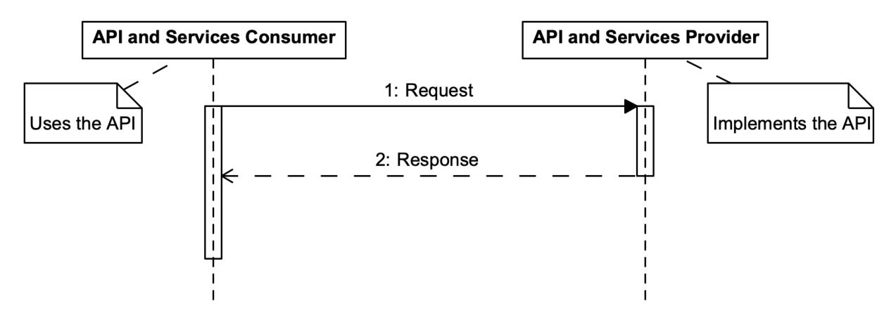
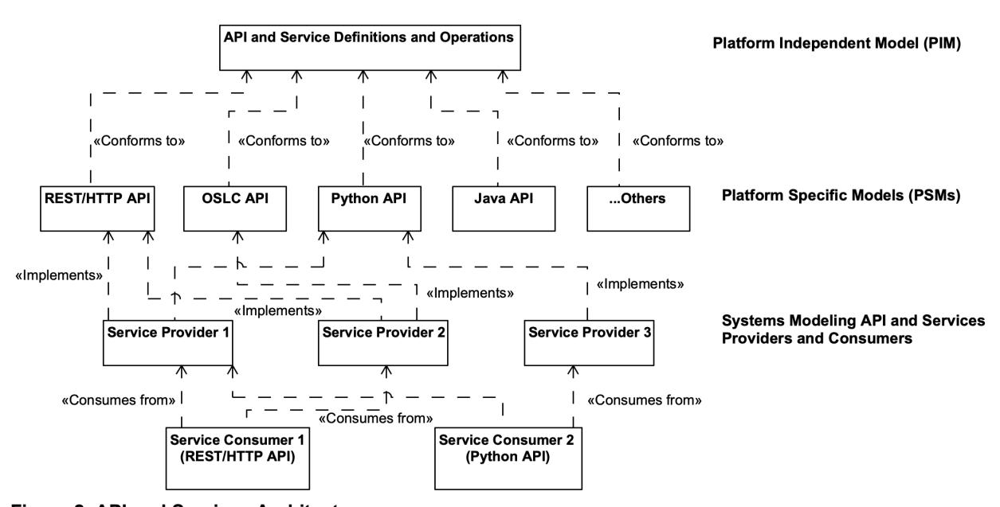
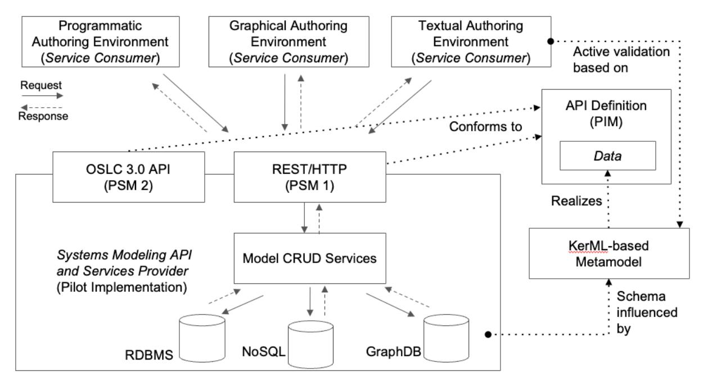
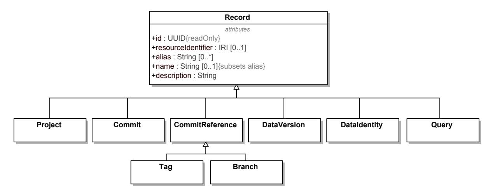
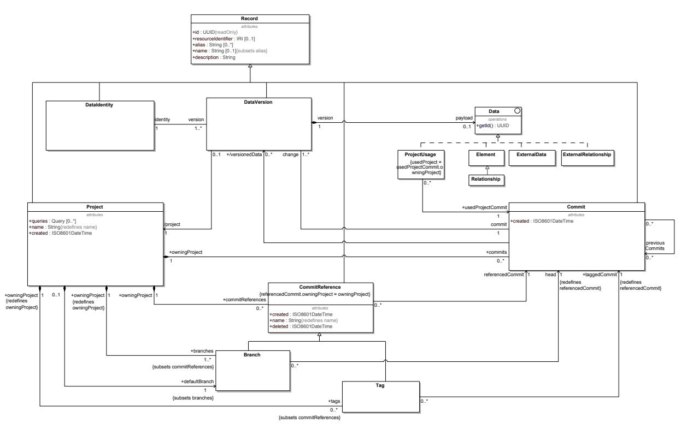
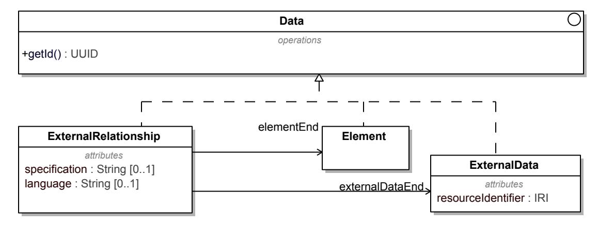
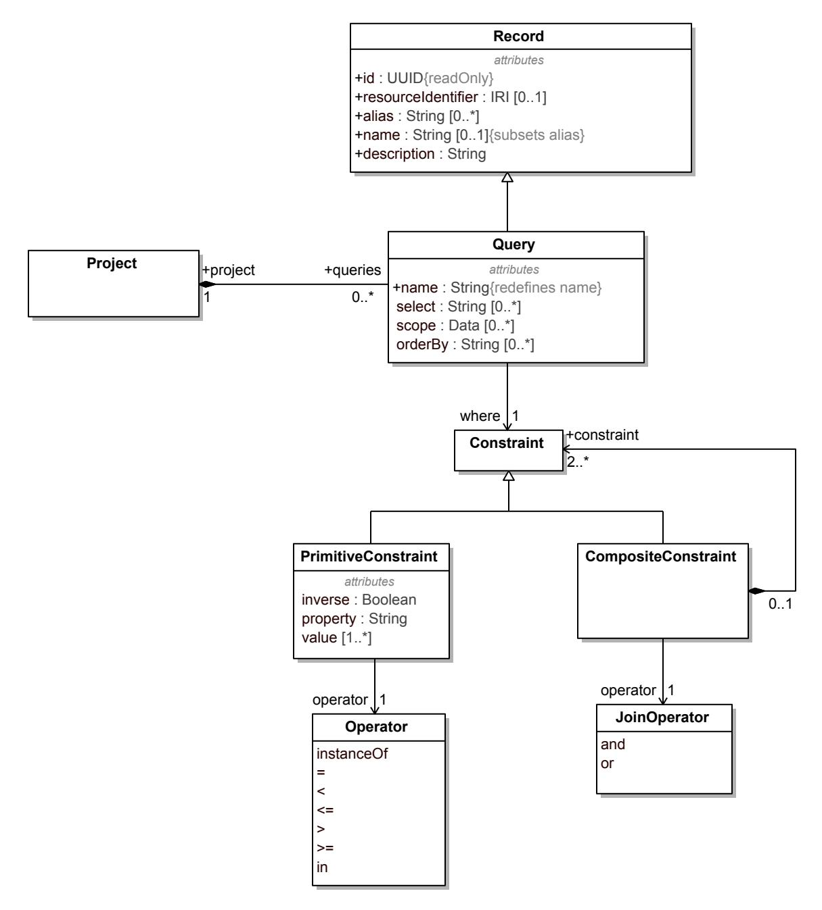
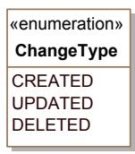

# **Systems Modeling Application Programming Interface (API) and Services**

Version 1.0

**\_\_\_\_\_\_\_\_\_\_\_\_\_\_\_\_\_\_\_\_\_\_\_\_\_\_\_\_\_\_\_\_\_\_\_\_\_\_\_\_\_\_\_\_\_\_\_\_\_\_\_\_\_\_\_\_\_\_\_\_\_\_\_\_\_\_\_\_\_\_\_\_\_\_\_\_\_\_\_**

**OMG Document Number:** formal/2025-09-04

**Date:** September 2025

**Standard document URL:** <https://www.omg.org/spec/SystemsModelingAPI/1.0/>

**Machine Readable File(s):** <https://www.omg.org/spec/SystemsModelingAPI/20250201/>

**\_\_\_\_\_\_\_\_\_\_\_\_\_\_\_\_\_\_\_\_\_\_\_\_\_\_\_\_\_\_\_\_\_\_\_\_\_\_\_\_\_\_\_\_\_\_\_\_\_\_\_\_\_\_\_\_\_\_\_\_\_\_\_\_\_\_\_\_\_\_\_\_\_\_\_\_\_\_\_**

```
Copyright © 2019-2025, 88solutions Corporation
Copyright © 2019-2025, Airbus
Copyright © 2019-2025, Aras Corporation
Copyright © 2019-2025, Association of Universities for Research in Astronomy (AURA)
Copyright © 2019-2025, BigLever Software
Copyright © 2019-2025, Boeing
Copyright © 2022-2025, Budapest University of Technology and Economics
Copyright © 2021-2025, Commissariat à l'énergie atomique et aux énergies alternatives (CEA)
Copyright © 2019-2025, Contact Software GmbH
Copyright © 2019-2025, Dassault Systèmes (No Magic)
Copyright © 2019-2025, DSC Corporation
Copyright © 2020-2025, DEKonsult
Copyright © 2020-2025, Delligatti Associates LLC
Copyright © 2019-2025, The Charles Stark Draper Laboratory, Inc.
Copyright © 2020-2025, ESTACA
Copyright © 2023-2025, Galois, Inc.
Copyright © 2019-2025, GfSE e.V.
Copyright © 2019-2025, George Mason University
Copyright © 2019-2025, IBM
Copyright © 2019-2025, Idaho National Laboratory
Copyright © 2019-2025, INCOSE
Copyright © 2019-2025, Intercax LLC
Copyright © 2019-2025, Jet Propulsion Laboratory (California Institute of Technology)
Copyright © 2019-2025, Kenntnis LLC
Copyright © 2020-2025, Kungliga Tekniska högskolon (KTH)
Copyright © 2019-2025, LightStreet Consulting LLC
Copyright © 2019-2025, Lockheed Martin Corporation
Copyright © 2019-2025, Maplesoft
Copyright © 2021-2025, MID GmbH
Copyright © 2020-2025, MITRE
Copyright © 2019-2025, Model Alchemy Consulting
Copyright © 2019-2025, Model Driven Solutions, Inc.
Copyright © 2019-2025, Model Foundry Pty. Ltd.
Copyright © 2023-2025, Object Management Group, Inc.
Copyright © 2019-2025, On-Line Application Research Corporation (OAC)
Copyright © 2019-2025, oose eG
Copyright © 2019-2025, Østfold University College
Copyright © 2019-2025, PTC
Copyright © 2020-2025, Qualtech Systems, Inc.
Copyright © 2019-2025, SAF Consulting
Copyright © 2019-2025, Simula Research Laboratory AS
Copyright © 2019-2025, System Strategy, Inc.
Copyright © 2019-2025, Thematix Partners, LLC
Copyright © 2019-2025, Tom Sawyer
Copyright © 2023-2025, Tucson Embedded Systems, Inc.
Copyright © 2019-2025, Universidad de Cantabria
Copyright © 2019-2025, University of Alabama in Huntsville
Copyright © 2019-2025, University of Detroit Mercy
Copyright © 2019-2025, University of Kaiserslauten
```

Copyright © 2020-2025, Willert Software Tools GmbH (SodiusWillert)

#### USE OF SPECIFICATION - TERMS, CONDITIONS & NOTICES

The material in this document details an Object Management Group specification in accordance with the terms, conditions and notices set forth below. This document does not represent a commitment to implement any portion of this specification in any companys products. The information contained in this document is subject to change without notice.

#### LICENSES

The companies listed above have granted to the Object Management Group, Inc. (OMG) a nonexclusive, royalty-free, paid up, worldwide license to copy and distribute this document and to modify this document and distribute copies of the modified version. Each of the copyright holders listed above has agreed that no person shall be deemed to have infringed the copyright in the included material of any such copyright holder by reason of having used the specification set forth herein or having conformed any computer software to the specification.

Subject to all of the terms and conditions below, the owners of the copyright in this specification hereby grant you a fully-paid up, non-exclusive, nontransferable, perpetual, worldwide license (without the right to sublicense), to use this specification to create and distribute software and special purpose specifications that are based upon this specification, and to use, copy, and distribute this specification as provided under the Copyright Act; provided that: (1) both the copyright notice identified above and this permission notice appear on any copies of this specification; (2) the use of the specifications is for informational purposes and will not be copied or posted on any network computer or broadcast in any media and will not be otherwise resold or transferred for commercial purposes; and (3) no modifications are made to this specification. This limited permission automatically terminates without notice if you breach any of these terms or conditions. Upon termination, you will destroy immediately any copies of the specifications in your possession or control.

#### PATENTS

The attention of adopters is directed to the possibility that compliance with or adoption of OMG specifications may require use of an invention covered by patent rights. OMG shall not be responsible for identifying patents for which a license may be required by any OMG specification, or for conducting legal inquiries into the legal validity or scope of those patents that are brought to its attention. OMG specifications are prospective and advisory only. Prospective users are responsible for protecting themselves against liability for infringement of patents.

#### GENERAL USE RESTRICTIONS

Any unauthorized use of this specification may violate copyright laws, trademark laws, and communications regulations and statutes. This document contains information which is protected by copyright. All Rights Reserved. No part of this work covered by copyright herein may be reproduced or used in any form or by any means--graphic, electronic, or mechanical, including photocopying, recording, taping, or information storage and retrieval systems--without permission of the copyright owner.

#### DISCLAIMER OF WARRANTY

WHILE THIS PUBLICATION IS BELIEVED TO BE ACCURATE, IT IS PROVIDED "AS IS" AND MAY CONTAIN ERRORS OR MISPRINTS. THE OBJECT MANAGEMENT GROUP AND THE COMPANIES LISTED ABOVE MAKE NO WARRANTY OF ANY KIND, EXPRESS OR IMPLIED, WITH REGARD TO THIS PUBLICATION, INCLUDING BUT NOT LIMITED TO ANY WARRANTY OF TITLE OR

OWNERSHIP, IMPLIED WARRANTY OF MERCHANTABILITY OR WARRANTY OF FITNESS FOR A PARTICULAR PURPOSE OR USE. IN NO EVENT SHALL THE OBJECT MANAGEMENT GROUP OR ANY OF THE COMPANIES LISTED ABOVE BE LIABLE FOR ERRORS CONTAINED HEREIN OR FOR DIRECT, INDIRECT, INCIDENTAL, SPECIAL, CONSEQUENTIAL, RELIANCE OR COVER DAMAGES, INCLUDING LOSS OF PROFITS, REVENUE, DATA OR USE, INCURRED BY ANY USER OR ANY THIRD PARTY IN CONNECTION WITH THE FURNISHING, PERFORMANCE, OR USE OF THIS MATERIAL, EVEN IF ADVISED OF THE POSSIBILITY OF SUCH DAMAGES.

The entire risk as to the quality and performance of software developed using this specification is borne by you. This disclaimer of warranty constitutes an essential part of the license granted to you to use this specification.

#### RESTRICTED RIGHTS LEGEND

Use, duplication or disclosure by the U.S. Government is subject to the restrictions set forth in subparagraph (c) (1) (ii) of The Rights in Technical Data and Computer Software Clause at DFARS 252.227-7013 or in subparagraph (c)(1) and (2) of the Commercial Computer Software - Restricted Rights clauses at 48 C.F.R. 52.227-19 or as specified in 48 C.F.R. 227-7202-2 of the DoD F.A.R. Supplement and its successors, or as specified in 48 C.F.R. 12.212 of the Federal Acquisition Regulations and its successors, as applicable. The specification copyright owners are as indicated above and may be contacted through the Object Management Group, 9C Medway Road, PMB 274, Milford, MA 01757, U.S.A.

#### TRADEMARKS

CORBA®, CORBA logos®, FIBO®, Financial Industry Business Ontology®, Financial Instrument Global Identifier®, IIOP®, IMM®, Model Driven Architecture®, MDA®, Object Management Group®, OMG®, OMG Logo®, SoaML®, SOAML®, SysML®, UAF®, Unified Modeling Language™, UML®, UML Cube Logo®, VSIPL®, and XMI® are registered trademarks of the Object Management Group, Inc.

For a complete list of trademarks, see: [https://www.omg.org/legal/tm\\_list.htm](https://www.omg.org/legal/tm_list.htm). All other products or company names mentioned are used for identification purposes only, and may be trademarks of their respective owners.

#### COMPLIANCE

The copyright holders listed above acknowledge that the Object Management Group (acting itself or through its designees) is and shall at all times be the sole entity that may authorize developers, suppliers and sellers of computer software to use certification marks, trademarks or other special designations to indicate compliance with these materials.

Software developed under the terms of this license may claim compliance or conformance with this specification if and only if the software compliance is of a nature fully matching the applicable compliance points as stated in the specification. Software developed only partially matching the applicable compliance points may claim only that the software was based on this specification, but may not claim compliance or conformance with this specification. In the event that testing suites are implemented or approved by Object Management Group, Inc., software developed using this specification may claim compliance or conformance with the specification only if the software satisfactorily completes the testing suites.

#### OMG'S ISSUE REPORTING PROCEDURE

All OMG specifications are subject to continuous review and improvement. As part of this process we encourage readers to report any ambiguities, inconsistencies, or inaccuracies they may find by completing the Issue Reporting Form listed on the main web page [https://www.omg.org](http://www.omg.org/), under Documents, Report a Bug/Issue.

# **Preface**

## **OMG**

Founded in 1989, the Object Management Group, Inc. (OMG) is an open membership, not-for-profit computer industry standards consortium that produces and maintains computer industry specifications for interoperable, portable, and reusable enterprise applications in distributed, heterogeneous environments. Membership includes Information Technology vendors, end users, government agencies, and academia.

OMG member companies write, adopt, and maintain its specifications following a mature, open process. OMG's specifications implement the Model Driven Architecture® (MDA®), maximizing ROI through a fulllifecycle approach to enterprise integration that covers multiple operating systems, programming languages, middleware and networking infrastructures, and software development environments. OMG's specifications include: UML® (Unified Modeling Language™); CORBA® (Common Object Request Broker Architecture); CWM™ (Common Warehouse Metamodel); and industry-specific standards for dozens of vertical markets.

More information on the OMG is available at <https://www.omg.org/>.

## **OMG Specifications**

As noted, OMG specifications address middleware, modeling, and vertical domain frameworks. All OMG Specifications are available from the OMG website at: <https://www.omg.org/spec>

All of OMG's formal specifications may be downloaded without charge from our website. (Products implementing OMG specifications are available from individual suppliers.) Copies of specifications, available in PostScript and PDF format, may be obtained from the Specifications Catalog cited above or by contacting the Object Management Group, Inc. at:

OMG Headquarters 9C Medway Road, PMB 274 Milford, MA 01757 USA

Tel: +1-781-444-0404 Fax: +1-781-444-0320

Email: [pubs@omg.org](mailto:pubs@omg.org)

Certain OMG specifications are also available as ISO standards. Please consult [https://www.iso.org](https://www.iso.org/)

## **Issues**

All OMG specifications are subject to continuous review and improvement. As part of this process we encourage readers to report any ambiguities, inconsistencies, or inaccuracies they may find by completing the Issue Reporting Form listed on the main web page [https://www.omg.org,](https://www.omg.org/) under Specifications, Report an Issue.

| 1 Scope1                                                   |  |
|------------------------------------------------------------|--|
| 2 Conformance3                                             |  |
| 3 Normative References7                                    |  |
| 4 Terms and Definitions9                                   |  |
| 5 Symbols11                                                |  |
| 6 Introduction13                                           |  |
| 6.1 API and Services Architecture13                        |  |
| 6.2 Document Conventions14                                 |  |
| 6.3 Document Organization15                                |  |
| 6.4 Acknowledgements15                                     |  |
| 7 Platform Independent Model (PIM)17                       |  |
| 7.1 API Model17                                            |  |
| 7.1.1 Record17                                             |  |
| 7.1.2 Project Data Versioning18                            |  |
| 7.1.3 ExternalData and ExternalRelationship22              |  |
| 7.1.4 Query24                                              |  |
| 7.2 API Services25                                         |  |
| 7.2.1 ProjectService25                                     |  |
| 7.2.2 ElementNavigationService27                           |  |
| 7.2.3 ProjectDataVersioningService28                       |  |
| 7.2.4 QueryService32                                       |  |
| 7.2.5 ExternalRelationshipService32                        |  |
| 7.2.6 ProjectUsageService33                                |  |
| 8 Platform Specific Models (PSMs)35                        |  |
| 8.1 REST/HTTP PSM35                                        |  |
| 8.1.1 Overview35                                           |  |
| 8.1.2 PIM API Model - REST/HTTP PSM Model Mapping35        |  |
| 8.1.3 PIM API Services - REST/HTTP PSM Endpoints Mapping36 |  |
| 8.2 OSLC 3.0 PSM42                                         |  |
| 8.2.1 Overview42                                           |  |
| 8.2.2 OSLC Nomenclature43                                  |  |
| 8.2.3 PIM API Model – OSLC PSM Resource Mapping44          |  |
| 8.2.4 PIM API Services – OSLC PSM Service Mapping45        |  |
| A Annex: Conformance Test Suite55                          |  |
| A.1 ProjectService Conformance Test Cases55                |  |
| A.2 ElementNavigationService Conformance Test Cases57      |  |
| A.3 ProjectDataVersioningService Conformance Test Cases61  |  |
| A.4 QueryService Conformance Test Cases72                  |  |
| A.5 ExternalRelationshipService Conformance Test Cases74   |  |
| A.6 ProjectUsageService Conformance Test Cases76           |  |
| A.7 Cross-Cutting Conformance Test Cases77                 |  |
| B Annex: API and Services Examples and Cookbook83          |  |
| B.1 Examples83                                             |  |
| B.2 Cookbook93                                             |  |

| 1. Operations25                                        |  |
|--------------------------------------------------------|--|
| 2. Operations27                                        |  |
| 3. Operations28                                        |  |
| 4. Operations28                                        |  |
| 5. Operations31                                        |  |
| 6. Operations32                                        |  |
| 7. Operations33                                        |  |
| 8. Operations33                                        |  |
| 9. PIM API Model - REST/HTTP PSM Model Mapping Table35 |  |
| 10. PIM to REST / HTTP PSM Mapping36                   |  |
| 11. PIM Concept to OSLC Resource type Mapping44        |  |
| 12. PIM API Services - OSLC Services Mapping45         |  |

| 1. API and Services Provider and Consumer3          |  |
|-----------------------------------------------------|--|
| 2. API and Services Architecture13                  |  |
| 3. Use of PIM and PSMs by Providers and Consumers14 |  |
| 4. Types of Records17                               |  |
| 5. Project Data Versioning API Model18              |  |
| 6. External Relationship API Model22                |  |
| 7. Query API Model24                                |  |
| 8. ProjectService Operations25                      |  |
| 9. ElementNavigationService Operations27            |  |
| 10. ProjectDataVersioningService Operations28       |  |
| 11. QueryService Operations32                       |  |
| 12. ExternalRelationshipService Operations32        |  |
| 13. ProjectUsageService Operations33                |  |

# <span id="page-14-0"></span>**1 Scope**

The purpose of this standard is to specify the Systems Modeling Application Programming Interface (API) and Services that provide standard services to access, navigate, and operate on KerML-based models [KerML], and, in particular, SysML models [SysML]. The standard services facilitate interoperability both across SysML modeling environments and between SysML modeling environments and other engineering tools and enterprise services.

The Systems Modeling API and Services specifies the types and details of the requests that can be made and responses that can be received by software applications that are consuming the services to software applications that are providing the services.

The Systems Modeling API and Services specification includes the Platform Independent Model (PIM) - see [Clause](#page-30-0) [7](#page-30-0) - and two Platform Specific Models (PSMs) - see [Clause 8](#page-48-0) : REST/HTTP PSM and OSLC PSM.

# <span id="page-16-0"></span>**2 Conformance**

This specification defines the Systems Modeling API and Services that provide standard services to access, navigate, and operate on KerML-based models [KerML] and, in particular, SysML models [SysML]. The specification comprises this document together with the content of the machine-readable files listed on the cover page. If there are any conflicts between this document and the machine-readable files, the machine-readable files take precedence.

A **Systems Modeling API and Services Provider** is a software application that provides the services defined in this specification.

A **Systems Modeling API and Services Consumer** is a software application that consumes the services defined in this specification and provided by the Service Provider.

Consumers send requests to Providers and receive responses with results, as illustrated in [Fig. 1](#page-16-1) below.

For brevity, this specification uses the phrase **Service Provider** for **Systems Modeling API and Services Provider**, and the term **Service Consumer** for **Systems Modeling API and Services Consumer**.

<span id="page-16-1"></span>

**Figure 1. API and Services Provider and Consumer**

A Service Provider can conform to this specification at the PSM or PIM level.

- 1. **PSM-level Conformance** A Service Provider demonstrating PSM-level Conformance implements one or more of the Systems Modeling API and Services PSMs defined in this specification. For example, a Provider can implement the REST/HTTP PSM, the OSLC PSM, or both. PSM-level conformance of Service Providers ensures interoperability of Service Consumers using the PSM across the different Service Providers. See [Clause 8](#page-48-0) .
- 2. **PIM-level Conformance** *-* A Service Provider demonstrating PIM-level Conformance implements a PSM that is not defined in this specification but is based on Systems Modeling API and Services PIM defined in this specification. The Service Provider shall define the PSM and the mapping from PIM to PSM with the goal that the new PSM may become part of future versions of this specification. See [Clause 7](#page-30-0) .

A Service Provider tool must demonstrate conformance to one or more services, as described below.

- 1. **ProjectService Conformance** A Service Provider must implement all the operations in the ProjectService, and demonstrate that the implementation successfully passes all the ProjectService Conformance Test Cases (see [A.1](#page-68-1) ) and Cross-Cutting Conformance Test Cases (see [A.7](#page-90-0) ).
- 2. **ProjectService Read Conformance** A Service Provider must implement the following operations in the ProjectService, and demonstrate that the implementation successfully passes all the ProjectService

Conformance Test Cases (see [A.1](#page-68-1) ) and Cross-Cutting Conformance Test Cases (see [A.7](#page-90-0) ) related to these operations. The UML attribute isQuery is set to true (isQuery=true) for these operations.

- 1. getProjectById
- 2. getProjects
- 3. **ElementNavigationService Conformance** A Service Provider must implement all the operations in the ElementNavigationService, and demonstrate that the implementation successfully passes all the ElementNavigationService Conformance Test Cases (see [A.2](#page-70-0) ) and Cross-Cutting Conformance Test Cases (see [A.7](#page-90-0) ). ElementNavigationService includes operations that get data and not create/modify any data. As such, the ElementNavigationService Conformance does not have a corresponding ElementNavigationService Read Conformance.
- 4. **ProjectDataVersioningService Conformance** A Service Provider must implement all the operations in the ProjectDataVersioningService, and demonstrate that the implementation successfully passes all the ProjectDataVersioningService Conformance Test Cases (see [A.3](#page-74-0) ) and Cross-Cutting Conformance Test Cases (see [A.7](#page-90-0) ).
- 5. **ProjectDataVersioningService Read Conformance** A Service Provider must implement the following operations in the ProjectDataVersioningService, and demonstrate that the implementation successfully passes all the ProjectDataVersioningService Conformance Test Cases (see [A.3](#page-74-0) ) anCross-Cutting Conformance Test Cases (see [A.7](#page-90-0) ) related to these operations. The UML attribute isQuery is set to true (isQuery=true) for these operations.
  - 1. getCommits
  - 2. getHeadCommit
  - 3. getCommitById
  - 4. getCommitChange
  - 5. getCommitChangeById
  - 6. getBranches
  - 7. getBranchById
  - 8. getDefaultBranch
  - 9. getTags
  - 10. getTagById
  - 11. getTaggedCommit
  - 12. diffCommits
- 6. **QueryService Conformance** A Service Provider must implement all the operations in the Query Service, and demonstrate that the implementation successfully passes all the QueryService Conformance Test Cases (see [A.4](#page-85-0) ) and Cross-Cutting Conformance Test Cases (see [A.7](#page-90-0) ).
- 7. **QueryService Read Conformance** A Service Provider must implement the following operation in the QueryService, and demonstrate that the implementation successfully passes all the QueryService Conformance Test Cases (see [A.4](#page-85-0) ) and Cross-Cutting Conformance Test Cases (see [A.7](#page-90-0) ) related to this operation. The UML attribute isQuery is set to true (isQuery=true) for this operation.
  - 1. executeQuery
- 8. **ExternalRelationshipService Conformance** A Service Provider must implement all the operations in the ExternalRelationshipService, and demonstrate that the implementation successfully passes all the ExternalRelationshipService Conformance Test Cases (see [A.5](#page-87-0) ) and Cross-Cutting Conformance Test Cases (see [A.7](#page-90-0) ). ExternalRelationshipService includes operations that get data and not create/modify any data. As such, the ExternalRelationshipService Conformance does not have a corresponding ExternalRelationshipService Read Conformance.
- 9. **ProjectUsageService Conformance** A Service Provider must implement all the operations in the ProjectUsageService, and demonstrate that the implementation successfully passes all the ProjectUsageService Conformance Test Cases (see [A.6](#page-89-0) ) and Cross-Cutting Conformance Test Cases (see [A.7](#page-90-0) ).
- 10. **ProjectUsageService Read Conformance** A Service Provider must implement the following operation in the ProjectUsageService, and demonstrate that the implementation successfully passes all the ProjectUsageService Conformance Test Cases (see [A.6](#page-89-0) ) and Cross-Cutting Conformance Test Cases (see [A.7](#page-90-0) ) related to this operation. The UML attribute isQuery is set to true (isQuery=true) for this operation.
  - 1. getProjectUsages

#### **Derived Property Conformance**

Various Element (KerML) data may have derived properties defined for them. However, not all Service Providers are required to perform the computations that evaluate these properties and obtain their values. There are two specific Derived Property Conformance levels, as described below. A Service Provider demonstrating Derived Property Conformance must demonstrate one of two conformance levels presented below. As with other Service Conformances, it is also permitted for a Service Provider to claim no Derived Property conformance.

Each of the two Derived Property Conformance levels described below has different guarantees on derived property values as inputs and derived property values as outputs of operations covered by this specification. These guarantees need to be met across all the services and operations supported by the Service Provider, such as in the case of operations that return Element data in the response, e.g. ElementNavigationService.getElementById or QueryService.executeQuery. Furthermore, the guarantees are to be met for all Elements, whether the Element was originally supplied by a Service Consumer in Service operations that write Element data (primarily ProjectDataVersioningService.createCommit), or however else the Service Provider obtains Project contents to store and output, such as import operations not covered by this specification.

The two Derived Property Conformance levels are the following:

- 1. **Derived Property Passthrough Conformance**: A Service Provider declaring this conformance level must take at face value any derived property values obtained, and store these values along with all the other non-derived property values of the Element, in order to be faithfully reproduced in any operation of any Service where the Service Provider returns the properties of this Element to the Service Consumer. In addition, if the Service Provider conforms with the QueryService, these stored derived property values must be usable in Query structures as PrimitiveConstraint properties. The Service Provider is not required to ever perform the derived property computations or verify that derived property values presented by a Service Consumer are correct. Any derived property values obtained as an input to an operation defined in this specification are accepted as-is.
- 2. **Derived Property Full Conformance**: A Service Provider declaring this conformance level must, for operations in any Service where Element (KerML) data is returned, guarantee that the derived properties for the Element are included in the response with their correctly computed, up-to-date value. Furthermore, if the Service Provider conforms with the QueryService, it also ensures that derived properties can be used in Query structures as PrimitiveConstraint properties, and that the query execution will consider the correctly computed and up-to-date values of such derived properties. In operations where Elements are given as input, the Service Consumer is free to omit derived properties, since their value will be computed by the Service Provider. Note that the actual time when the computation of derived feature values is to be performed, such as just in time when producing a response, or ahead of time upon the reception of the latest commit that affected the derived feature value, is an implementation detail of the Service Provider and not prescribed for Conformance. However, appropriate caution should be taken as the values of derived properties of a given Element may be affected by commits that do not directly change that Element.

# <span id="page-20-0"></span>**3 Normative References**

[GraphQL] GraphQL <https://graphql.org/>

[Gremlin] Gremlin Graph Traversal Machine and Language <https://tinkerpop.apache.org/gremlin.html>

[IRI] *Internationalized Resource Identifiers* (IRI) <https://www.w3.org/International/articles/idn-and-iri/>

[KerML] *Kernel Modeling Language (KerML),* Version 1.0 <https://www.omg.org/spec/KERML/1.0>

[MOFVD] *MOF2 Versioning and Development Lifecycle (MOFVDTM),* Version 2.0 <https://www.omg.org/spec/MOFVD/2.0>

[OpenAPI] *OpenAPI Specification* <https://www.openapis.org/>

[OSLC] *Open Services for Lifecycle Collaboration (OSLC)* <http://open-services.net/>

[QVT] *MOF Query/View/Transformation (QVTTM)*, Version 1.3 <https://www.omg.org/spec/QVT/1.3>

[SEBoK] *Systems Engineering Body of Knowledge (SEBoK)* [www.sebokwiki.org](http://www.sebokwiki.org/)

[SE Handbook] *INCOSE Systems Engineering Handbook* <https://www.incose.org/products-and-publications/se-handbook>

[SMOF] *MOF Support for Semantic Structures (SMOFTM)*, Version 1.0 <https://www.omg.org/spec/SMOF/1.0>

[SPARQL] *SPARQL Query Language for RDF* <https://www.w3.org/TR/rdf-sparql-query/>

[SQL] *ISO/IEC 9075:2016, Information technology — Database languages — SQL* <https://www.iso.org/standard/63555.html>

[STEP] *ISO 10303-233:2012 (STEP)* <https://www.iso.org/standard/55257.html>

[SysML] *OMG Systems Modeling Language (SysML®), Version 2.0* <https://www.omg.org/spec/SYSML/2.0>

[UML] *Unified Modeling Language (UML),* Version 2.5.1 <https://www.omg.org/spec/UML/2.5.1>

[UUID] *Universally Unique IDentifier (UUID) URN Namespace* <https://tools.ietf.org/html/rfc4122>

[XMI] *XML Metadata Interchange (XMI®)*, Version 2.5.1 <https://www.omg.org/spec/XMI/2.5.1>

# <span id="page-22-0"></span>**4 Terms and Definitions**

Various terms and definitions are specified throughout the body of this specification.

# <span id="page-24-0"></span>**5 Symbols**

There are no special symbols defined in this specification.

# <span id="page-26-0"></span>**6 Introduction**

### <span id="page-26-1"></span>**6.1 API and Services Architecture**

The Systems Modeling API and Services includes the following.

- **(1) Platform-Independent Model (PIM)** provides a service specification independent of any platform or technology. This specification defines each of the services and their operations with inputs and outputs. The PIM serves as the logical API model.
- **(2) Platform-Specific Models (PSMs)** are bindings of the PIM using a particular technology, such as REST/HTTP, SOAP, Java, and .NET. Multiple platform-specific models can exist for a given PIM. Two PSMs are provided in this specification:
  - REST/HTTP PSM a binding of the PIM as a REST/HTTP API using OpenAPI specification.
  - OSLC PSM a binding of the PIM as services based on the OSLC standard.

For each PSM, a mapping is defined. This mapping is used to generate the PSM from the PIM.

[Fig. 2](#page-26-2) illustrates the PIM, PSMs, Service Providers that implement API PSMs, and Service Consumers that consume the API PSMs from multiple Providers.

<span id="page-26-2"></span>

**Figure 2. API and Services Architecture**

Service specifications in the PIM do not prescribe or constrain the architecture of the Service Providers. For example, Service Providers with file-based, 3-tier application-based, or federated microservices-based architectures can all implement one or more PSMs derived from the same service specifications (PIM).

Service Consumers that use a specific PSM should be interoperable across multiple Service Providers that implement that PSM without requiring any modification in the consumer.

<span id="page-27-1"></span>

**Figure 3. Use of PIM and PSMs by Providers and Consumers**

[Fig. 3](#page-27-1) illustrates the role of PIM and PSMs in the context of Systems Modeling API and Services providers and consumers. The Systems Modeling API and Services, version 1.0, includes two PSMs, specifically the REST/HTTP PSM and OSLC 3.0 PSM.

A System Modeling API and Services provider implements either or both the PSMs using its native technology stack, such as databases and web-service frameworks. Service consumers, such as those used for programmatic, graphical, or textual authoring, navigation, and querying data use the PSMs (e.g. REST/HTTP API), agnostic of the native technology stack of the providers.

The choice of REST/HTTP PSM is key. Most modern programming languages provide libraries for consuming REST/HTTP APIs. Enterprise applications, written in any modern programming language, can consume the standard Systems Modeling API and Services, and interoperate with multiple providers.

### <span id="page-27-0"></span>**6.2 Document Conventions**

The following stylistic conventions are applied in the presentation of the Platform Independent Model (PIM) of the Systems Modeling API and Services.

### **Service definitions**

- 1. Names of classes representing services start with an uppercase letter and use the camel case notation, such as ElementNavigationService.
- 2. Names of operations representing the API calls available for each service start with a lowercase letter and are italicized, such as *getElementById*

#### **Input and output data**

- 1. Names of classes representing data that is the input or output of services start with an uppercase letter, such as Project and Data
- 2. Names of attributes representing the details of the data that is the input or output of services start with a lowercase letter and are italicized, such as *identifier*

The services and operations in the PIM are presented using class diagrams and tables with descriptions of each operation.

The input and output data for services in the PIM are presented using class diagrams followed by detailed descriptions.

### <span id="page-28-0"></span>**6.3 Document Organization**

The rest of this document is organized into two major clauses.

- [Clause 7](#page-30-0) Platform Independent Model (PIM) of the Systems Modeling API and Services
- [Clause 8](#page-48-0) Platform Specific Models (PSMs) of the Systems Modeling API and Services
  - [8.1](#page-48-1) REST/HTTP PSM
  - [8.2](#page-55-0) OSLC PSM

These clauses are followed by two annexes.

- [Annex A](#page-68-0) defines the suite of conformance tests that must be used to demonstrate the conformance of Service Providers to this specification - see [Clause 2](#page-16-0) .
- [Annex B](#page-96-0) includes the following.
  - Examples of requests and responses for the REST/HTTP API endpoints, and
  - Cookbook with a collection of recipes, as Jupyter notebooks, demonstrating patterns and examples for using the Systems Modeling API and Services

### <span id="page-28-1"></span>**6.4 Acknowledgements**

The primary authors of this specification document, the PIM, and the REST/HTTP PSM are:

- Manas Bajaj, Intercax LLC
- Ivan Gomes, Twingineer LLC

The primary authors of the OSLC PSM are:

- David Honey, IBM
- Jad El-Khoury, KTH Royal Institute of Technology
- Jim Amsden, IBM

Other contributors include:

• Tomas Vileiniskis, Dassault Systèmes

The specification was formally submitted for standardization by the following organizations:

- 88Solutions Corporation
- Dassault Systèmes
- GfSE e.V.
- IBM
- INCOSE
- Intercax LLC
- Lockheed Martin Corporation
- Model Driven Solutions, Inc.
- PTC
- Simula Research Laboratory AS

However, work on the specification was also supported by over 200 people in 80 organizations that participated in the SysML v2 Submission Team (SST). The following individuals had leadership roles in the SST:

- Manas Bajaj, Intercax LLC (API and services development lead)
- Yves Bernard, Airbus (v1 to v2 transformation co-lead)
- Bjorn Cole, Lockheed Martin Corporation (metamodel development co-lead)
- Sanford Friedenthal, SAF Consulting (SST co-lead, requirements V&V lead)
- Charles Galey, Lockheed Martin Corporation (metamodel development co-lead)
- Karen Ryan, Siemens (metamodel development co-lead)
- Ed Seidewitz, Model Driven Solutions (SST co-lead, pilot implementation lead)
- Tim Weilkiens, oose (v1 to v2 transformation co-lead)

The specification was prepared using CATIA Magic/No Magic modeling tools and the OpenMBEE system for model publication [\(http://www.openmbee.org](http://www.openmbee.org/)), supported by the 3DEXPERIENCE platform, with the invaluable support of the following individuals:

- Tyler Anderson, Dassault Systèmes
- Christopher Delp, Jet Propulsion Laboratory
- Jackson Galloway, Dassault Systèmes
- Ivan Gomes, Jet Propulsion Laboratory
- Robert Karban, Jet Propulsion Laboratory
- Christopher Klotz, Dassault Systèmes
- John Watson, Lightstreet consulting

The following individuals made significant contributions to the API and Services pilot implementation developed by the SST in conjunction with the development of this specification:

- Manas Bajaj, Intercax LLC
- Ivan Gomes, Twingineer LLC
- Brian Miller, Intercax LLC

# <span id="page-30-0"></span>**7 Platform Independent Model (PIM)**

### <span id="page-30-1"></span>**7.1 API Model**

### **7.1.1 Record**

<span id="page-30-3"></span><span id="page-30-2"></span>

**Figure 4. Types of Records**

**Record** - A Record represents any data that is consumed (input) or produced (output) by the Systems Modeling API and Services. A Record is an abstract concept from which other concrete concepts inherit. A Record has the following attributes:

- *id* is the UUID assigned to the record
- *resourceIdentifier* is an IRI for the record
- *alias* is a collection of other identifiers for this record, especially if the record was created or represented in other software applications and systems. Note that for DataIdentity and DataVersion records, this does not conflict with *Element.aliasIds* in KerML. Instead, it enables service providers to add other aliases on any record
- *name* is an optional human-friendly identifier for a record. The value assigned to the *name* for a given record must be in the set of values assigned to *alias* for that record
- *description* is a statement that provides details about the record.

### <span id="page-31-0"></span>**7.1.2 Project Data Versioning**

<span id="page-31-1"></span>

**Figure 5. Project Data Versioning API Model**

The class diagram above presents concepts related to Project and Data Versioning Service.

**Data** - Data represents any entity that can be created, updated, deleted, and queried by the Systems Modeling API and Services. In the PIM, Data is represented as an Interface that is realized by the following concepts in the scope of Systems Modeling API and Services.

- Element, root metaclass in the SysML v2 language metamodel
- External Data
- External Relationship
- Project Usage

Each realization of Data must implement the *getId()* operation that provides a valid UUID.

**Data Identity** - Data Identity is a subclass of Record that represents a unique, version-independent representation of Data through its lifecycle. A Data Identity is associated with 1 or more Data Version records that represent different versions of the same Data. A Data Identity record has the following additional attributes:

- *createdAt* is a derived attribute that references the Commit in a project in which the given Data was created
- *deletedAt* is a derived attribute that references the Commit in a project in which the given Data was deleted

**Data Version** - Data Version is a subclass of Record that represents Data at a specific version in its lifecycle. A Data Version record is associated with exactly one Data Identity record. Data Version serves as a wrapper for Data (*payload*) in the context of a Commit in a Project; associating the data identity with the state of the Data (payload) in the specific (range of) Commits, or no payload if no Data element with the given identifier is present at that

Commit. Different versions of the same Data, identified by the same UUID values returned by *Data.getId()*, are represented in the following manner:

- One (1) Data Identity record is created for all versions of the same Data, where Data Identity*.id* returns the same UUID value as *Data.getId()*
- A Data Version record is created for each version of Data (and, if needed, also for a Commit where no Data exists for the given identity), where:
  - Data Version*.payload* is set to Data if exists in the commit, null otherwise.
  - Data Version*.identity* is set to the Data Identity common to all versions of the same Data.
  - Data Version*.id* is set to a new, randomly generated UUID for the specific Data Version record.

Data Version record has the following additional attributes:

- *commit* is the project commit at which the wrapped data (*payload*) was created, modified, or deleted
- */project* is a derived attribute referencing the owning project

**Project** - Project is a subclass of Record that represents a container for other Records and an entry point for version management and data navigation. The Project record has the following attributes:

- *identifiedData* is a derived attribute that is the set of Data Identity records corresponding to the Data contained in the project
- *commit* is the set of all commits in the Project
- *commitReference* is the set of all commit references in the Project
- *branch* is the set of all the branches in the Project and a subset of *commitReference*
- *defaultBranch* is the default branch in the Project and a subset of *branch*
- *tag* is the set of all the tags in the Project and a subset of *commitReference*
- *usage* is the set of Project Usage records representing all other Projects being used by the given Project (*Project Usage.usedProject)*
- *queries* is the set of Query records owned by the project. Each Query record represents a saved query for the given project. See [7.1.4](#page-37-0) [Query](#page-37-0) for details.
- *name* is a human-friendly identifier for a Project
- *created* is the creation timestamp for the project, in ISO8601DateTIme format

A project also represents a permission target at which access and authorization controls may be applied to teams associated with a project.

**ProjectUsage** - ProjectUsage is a subclass of Record that represents the use of a Project in the context of another Project. ProjectUsage is represented as a realization of Data, and has the following attributes:

- *usedProject* references the Project being used
- *usedProjectCommit* references the Commit of the Project being used

**Commit** - Commit is a subclass of Record that represents the changes made to a Project at a specific point in time in its lifecycle, such as the creation, update, or deletion of data in a Project. A Project has 0 or more Commits. A Commit has the following additional attributes:

- *created* is the timestamp at which the Commit was created, in ISO8601DateTime format
- *owningProject* is the Project that owns the Commit
- *previousCommit* is the set of immediately preceding Commits
- *change* is the set of Data Version records representing Data that is created, updated, or deleted in the Commit
- *versionedData* is the set of cumulative Data Version records in a Project at the Commit

Clarifications and Invariants:

- Commit.*versionedData* must indicate only the Data records that actually exist at the given Commit; all listed DataVersion records must have their payload attribute set to a non-null Data record.
- Commit.*change* indicates deletions by listing DataVersion records with their *payload* attribute set to null. This is only valid if at least one Commit in *previousCommits* contains a DataVersion with the same *identity* in its *versionedData* (i.e. only existing Data records may be deleted).
- DataVersion.*identity* is unique among records listed in Commit.*versionedData* and in Commit.*change*.
- A Commit must resolve all conflicts in its parent Commits: if the Commit C has two parent Commits Ca and Cb in C.*previousCommits*, where Ca.*versionedData* lists a DataVersion Da but C.*versionedData* does not contain Da (either the Data associated with Da.*identity* is different, or not present at all), then C.*change* must list a DataVersion with Da.*identity.*
- Version histories must monotonically increase in time: for Commit C, the value of C.*created* must be strictly newer than the value of D.*created* for any commit D in C.*previousCommit*. An implementation should ensure that the selected timestamp resolution (which corresponds to a required number of decimals in the ISO 8601 second field) is sufficient to ensure the strict monotonicity of the timestamps for the supported number of Commits per second per branch.

The *versionedData* for a *Commit* is computed as follows:

- 1. Let *updatedNotDeleted* be all DataVersions in the change set of the *Commit*, excluding deletions.
- 2. Let *updatedIdentities* be all DataIdentities in the change set of the *Commit*, including deletions.
- 3. Let *retainedWithDuplicates* be the union of the *versionedData* of all the *previousCommits* of this *Commit*, excluding DataVersions whose identities are in the *updatedIdentities* of this commit.
- 4. Let *retained* be the set of DataVersions obtained from *retainedWithDuplicates* by choosing from each subset of duplicate DataVersions with the same identity a single one of them to include. See the Note below for additional clarification.
- 5. The *versionedData* of this *Commit* is the union of the *updatedNotDeleted* set and the *retained* set.

**Note.** If there are multiple *previousCommits*, *retainedWithDuplicates* may include DataVersions from different *previousCommits* with the same identity. If any of the *previousCommits* have DataVersions with the same identity but different payloads, then this *Commit* is required to have resolved this merge conflict by including merged DataVersions for the conflicting identities in its change set, so the conflicting DataVersions will not be included in *retainedWithDuplicates*. Therefore, any DataVersions in *retainedWithDuplicates* with the same identity must also have the same payload, and any one of them can be chosen for inclusion in the *versionedData* of this commit.

This is formalized in the following OCL:

```
let updatedNotDeleted : Set(DataVersion) = change->select(payload <> null) in
let updatedIdentities : Set(DataIdentity) = change.identity in
let retainedWithDuplicates : Bag(DataVersion) =
        previousCommits.versionedData->select(oldData |
                updatedIdentities->excludes(oldData.identity)
        ) in
let retained : Set(DataVersion) =
        retainedWithDuplicates.identity->asSet()->collect(retainedID |
                retainedWithDuplicates->any(identity == retainedID)
        )->asSet() in
versionedData = updatedNotDeleted->union(retained)
```

Commits are immutable. For a given Commit record, the value of Commit.*change* cannot be modified after a Commit has been created. If a modification is required, a new Commit record can be created with a different value of Commit.*change*.

Commits are not destructible<sup>1</sup> . A Commit record cannot be deleted during normal end-user operation. Commits represent the history and evolution of a Project. Deleting and mutating Commit records must be disabled for the normal end-user operations to preserve Project history.

<sup>1</sup>**Note.** A provider tool may provide administrative functions to repair the Commit graph of a Project but this is not considered a normal end-user operation.

**CommitReference** - CommitReference is an abstract subclass of Record that references a specific Commit (CommitReference.*referencedCommit*). Project.*commit* is the set of all the Commit records for a given Project. Project.*commitReferences* identifies specific Commit records in a Project that provide the context for navigating the Data in a Project. A CommitReference has the following additional attributes:

- *created* is the timestamp at which the CommitReference was created, in ISO8601DateTime format
- *deleted* is the timestamp at which the CommitReference was deleted, in ISO8601DateTime format
- *name* is a human-friendly identifier for a CommitReference, inherited from Record

Two special types of CommitReference are Branch and Tag, as described below.

**Branch** - Branch is an indirect subclass of Record (via CommitReference) that represents an independent line of development in a project. A Project can have 1 or more branches. When a Project is created, a default branch is also created. The default branch of a project can be changed, and a project can have only 1 default branch.

A Branch is a type of CommitReference. A Branch is a pointer to a commit (Branch*.head*). The commit history of a Project on a given branch can be computed by recursively navigating Commit*.previousCommit*, starting from the head commit of the branch (Branch*.head*). A Branch has the following additional attributes:

- *created* is the timestamp at which the Branch was created, in ISO8601DateTime format. This attribute is inherited from Commit Reference.
- *deleted* is the timestamp at which the Branch was deleted, in ISO8601DateTime format. This attribute is inherited from Commit Reference.
- *head* is the commit to which the branch is currently pointing. It represents the latest state of the project on the given branch
- *owningProject* is the project that owns the given branch

Branches are mutable. Since a Branch is a pointer to a Commit, it can be updated to point to a different Commit. If a new Commit is created on a Project Branch, the value of Branch*.head* refers to that new Commit.

Branches are destructible under normal end-user operation. Branches can be deleted and merged with other branches.

**Tag** - Tag is an indirect subclass of Record (via CommitReference) used for annotating specific commits-of-interest during Project development, such as for representing Project milestones, releases, baselines, or snapshots. A Project can have 0 or more tags. A Tag has the following additional attributes:

- *created* is the timestamp at which the Tag was created, in ISO8601DateTime format. This attribute is inherited from Commit Reference.
- *deleted* is the timestamp at which the Tag was deleted, in ISO8601DateTime format. This attribute is inherited from Commit Reference.
- *taggedCommit* is a pointer to a commit
- *owningProject* is the project that owns the given tag

Tags are immutable. Tag.*taggedCommit* cannot be modified after a Tag record has been created. If Tag.*taggedCommit* needs to be modified to refer to a different Commit record, then the existing Tag can be deleted and a new Tag can be created with the same name and description.

Tags are destructible under normal end-user operation.

The table below summarizes the Mutability and Destruction semantics for Commit, Branch, and Tag.

| Type of Record | Mutable | Destructible |
|----------------|---------|--------------|
| Commit         | No      | No           |
| Branch         | Yes     | Yes          |
| Tag            | No      | Yes          |

**Timestamps** - The following requirements and recommendations apply to timestamps:

- All attributes typed by ISO8601DateTime must be communicated over the API as either a time instant expressed directly on the UTC (Coordinated Universal Time) time scale, or on a local time scale with an explicit time shift with respect to UTC, as specified in [ISO8601-1]. The reason is to avoid any implicit dependency on timezone-specific representation of time instants.
  - Examples of valid UTC timestamps in [ISO8601-1] extended format are: 2024-12-18T16:45:34.635726Z and 2024-12-18T16:45:34.635726+00:00.
  - Examples of valid local timestamps in [ISO8601-1] extended format are: 2024-12-18T11:45:34.635726-05:00 and 2024-12-18T17:45:34.635726+01:00. These example values represent the same time instant as the previous UTC timestamp examples.
  - **Note**. Be aware that the explicit time shift for a selected timezone may change throughout a calendar year due to switching between standard and daylight saving time, typically by one hour.
- Service implementations should ensure that all timestamps for a given Project are expressed in UTC or apply a time shift for one selected timezone.
- For reasons of simplicity it is recommended that service implementations consistently apply UTC timestamps, if there is no requirement to support a local time scale.
- Computation of time intervals between two timestamps should make use of an appropriate software library that supports UTC-based arithmetic including handling of possible leap seconds.

### <span id="page-35-0"></span>**7.1.3 ExternalData and ExternalRelationship**

<span id="page-35-1"></span>

**Figure 6. External Relationship API Model**

The class diagram above presents concepts related to ExternalRelationship Service.

**ExternalRelationship** - ExternalRelationship is a realization of Data, and represents the relationship between a KerML Element [KerML] available from a service provider to ExternalData available over the web using an IRI. The ExternalData may be a KerML Element available from another service provider using an IRI. A hyperlink

between a KerML Element to a web resource is the most primitive example of an ExternalRelationship. An ExternalRelationship has the following attributes:

- *specification* is the formal representation of the semantics of the ExternalRelationship. The specification can be a collection of mathematical expressions. For example, an ExternalRelationship can be defined to map the attributes of a KerML Element to the attributes of an ExternalData. In this case, the specification would contain mathematical expressions, such as equations, representing the mapping. This is an optional attribute.
- *language* is the name of the expression language used for the specification. This is an optional attribute.

**ExternalData** - ExternalData is a realization of Data, and represents a resource available over the web using an IRI. ExternalData is defined only for the purpose of defining an ExternalRelationship. An ExternalData has the following additional attributes.

• *resourceIdentifier* is the IRI of the resource represented by the ExternalData

### **7.1.4 Query**

<span id="page-37-1"></span><span id="page-37-0"></span>

**Figure 7. Query API Model**

The class diagram above presents concepts related to the Query service.

**Query**- Query is a subclass of Record that represents a precise and language-independent request for information retrieval using the Systems Modeling API and Services. Query can be mapped to commonly used query languages, such as SQL, Gremlin, GraphQL, and SPARQL.

A Query record has the following attributes:

• *name* is a human-friendly identifier for a Query

- *select* is a list of properties of Data (or its realizations) that will be included for each Data object in the query response. If no properties are specified, then all the properties will be included for each Data object in the query response.
- *scope* is a list of Data objects that define the scope context for query execution. The default scope of a Query is the owning Project.
- *where* is a Constraint that represents the conditions that Data objects in the query response must satisfy
- *orderBy* is a list of properties of Data (or its realizations) that are used for sorting the Data objects in the query response. The order of properties in the list governs the sorting order.

**Constraint** - Constraint is an abstract concept that represents conditions that must be satisfied by Data objects in the query response.

**PrimitiveConstraint** is a concrete subtype of Constraint that represents simple conditions that can be modeled using the *property-operator-value* tuple, e.g. *mass <= 4 kg.*, or *type instanceOf Generalization.* A PrimitiveConstraint has the following attributes:

- *property* is a property of Data (or its realizations) that is being constrained
- *operator* is of type Enumeration whose literals are mathematical operators, as shown in the figure above
- *value* is either a list of primitive objects, such as String, Boolean, Integer, Double, UUID, or null. An explicit type is not assigned to this property since it can be any of the specified types above.
- *inverse* is of type Boolean. If true, a logical NOT operator is applied to the PrimitiveConstraint.

**CompositeConstraint** is a concrete subtype of Constraint that represents complex conditions composed of two or more Constraints using logical AND or OR operator. CompositeConstraint has the following attributes:

- *constraint* is the set of Constraints being composed
- *operator* is the logical operator for composing the Constraints

### <span id="page-38-0"></span>**7.2 API Services**

### <span id="page-38-3"></span><span id="page-38-1"></span>**7.2.1 ProjectService**

|                                                                                                                                                                                                                                                                                                                                                  | ProjectService |  |  |
|--------------------------------------------------------------------------------------------------------------------------------------------------------------------------------------------------------------------------------------------------------------------------------------------------------------------------------------------------|----------------|--|--|
|                                                                                                                                                                                                                                                                                                                                                  | operations     |  |  |
| getProjects() : Project [0*]{query}<br>getProjectById( projectId : UUID ) : Project [01]{query}<br>createProject( name : String, description : String [01] ) : Project<br>updateProject( projectId : UUID, name : String [01], description : String [01], defaultBranch : Branch [01] ) : Project<br>deleteProject( projectId : UUID ) : Project |                |  |  |

#### **Figure 8. ProjectService Operations**

#### **Table 1. Operations**

<span id="page-38-2"></span>

| Name          | Documentation                                                           |
|---------------|-------------------------------------------------------------------------|
| createProject | Create a new project with the given name and<br>description (optional). |
| getProjects   | Get all projects.                                                       |
| updateProject | Update the project with the given id (projectId).                       |

| Name           | Documentation                                                                                                                                                                                                                                                                                                                                                                                                                                                                                                                                                                                                                                                                                                                                                                                              |
|----------------|------------------------------------------------------------------------------------------------------------------------------------------------------------------------------------------------------------------------------------------------------------------------------------------------------------------------------------------------------------------------------------------------------------------------------------------------------------------------------------------------------------------------------------------------------------------------------------------------------------------------------------------------------------------------------------------------------------------------------------------------------------------------------------------------------------|
|                | Delete the project with the given id (projectId).                                                                                                                                                                                                                                                                                                                                                                                                                                                                                                                                                                                                                                                                                                                                                          |
|                | The following pre-condition must be satisfied for a<br>project to be deleted.                                                                                                                                                                                                                                                                                                                                                                                                                                                                                                                                                                                                                                                                                                                              |
|                | 1.<br>Project with given projectId exists.                                                                                                                                                                                                                                                                                                                                                                                                                                                                                                                                                                                                                                                                                                                                                                 |
|                | The following post-condition must be satisfied for a<br>project to be deleted.                                                                                                                                                                                                                                                                                                                                                                                                                                                                                                                                                                                                                                                                                                                             |
| deleteProject  | 1.<br>All operations of all services where projectId<br>(Id of the deleted project) is an input argument<br>will return null.                                                                                                                                                                                                                                                                                                                                                                                                                                                                                                                                                                                                                                                                              |
|                | Note that when a project is being deleted, elements<br>owned by the project may be used in other projects via<br>project usages. The detection of this condition and<br>subsequent behavior is left to the API and Service<br>providers. As a general recommendation, API and<br>Service providers may implement different behaviors,<br>such as, but not limited to, the following.                                                                                                                                                                                                                                                                                                                                                                                                                       |
|                | 1.<br>Allow projects to be deleted irrespective of<br>any of the elements from its latest tag<br>(commit), default or pre-specified branches,<br>being used in other projects, via project<br>usages. The Service provider guarantees that<br>future operations involving the using projects<br>will continue to work in the absence of<br>referenced elements owned by the deleted<br>project. It is up to the Service Provider to find<br>a way to implement this guarantee, such as by<br>suppressing such nonexistent element<br>references or reporting only unique identifiers<br>of nonexistent element references in operation<br>results.<br>2.<br>Allow projects to be deleted only if none of<br>the elements in a list of pre-specified commits<br>(e.g. latest tag and main branch) are being |
|                | used in the list of pre-specified commits (e.g.<br>latest tag or main branch) of another project,<br>via project usage.<br>3.<br>Allow projects to be deleted only if none of<br>their commits are referenced by project usages<br>in any of the commits of any other project.                                                                                                                                                                                                                                                                                                                                                                                                                                                                                                                             |
| getProjectById | Get project with the given id (projectId).                                                                                                                                                                                                                                                                                                                                                                                                                                                                                                                                                                                                                                                                                                                                                                 |

### <span id="page-40-2"></span><span id="page-40-0"></span>**7.2.2 ElementNavigationService**

#### getRootElements( project : Project, commit : Commit ) : Element [0..\*]{query} getRelationshipsByRelatedElement( project : Project, commit : Commit, elementId : UUID, direction : Direction ) : Relationship [0..\*]{query} getElementById( project : Project, commit : Commit, elementId : UUID ) : Element [0..1]{query} getElements( project : Project, commit : Commit ) : Element [0..\*]{query} *operations* **ElementNavigationService**

both out in **Direction** «enumeration»

**Figure 9. ElementNavigationService Operations**

Element is the root metaclass in the KerML abstract syntax [KerML]. Relationship is a subtype of Element. Both Element and Relationship realize the Data interface defined in the API Model (refer to 7.1.2 - Project Data Versioning).

**Table 2. Operations**

<span id="page-40-1"></span>

| Name                             | Documentation                                                                                    |
|----------------------------------|--------------------------------------------------------------------------------------------------|
| getRelationshipsByRelatedElement | Get relationships that are incoming, outgoing, or both<br>relative to the given related element. |
| getElements                      | Get all the elements in a given project at the given<br>commit.                                  |
| getElementById                   | Get element with the given id (elementId) in the given<br>project at the given commit.           |
| getRootElements                  | Get all the root elements in the given project at the<br>given commit.                           |

### <span id="page-41-3"></span><span id="page-41-0"></span>**7.2.3 ProjectDataVersioningService**

#### diffCommits( baseCommit : Commit, compareCommit : Commit, changeTypes : ChangeType [0..\*] ) : DataDifference [0..\*]{query} mergeIntoBranch( baseBranch : Branch, commitsToMerge : Commit [1..\*], resolution : Data [0..\*], description : String [0..1] ) : MergeResult deleteTag( project : Project, tagId : UUID ) : Tag [0..1] createTag( project : Project, tagName : String, taggedCommit : Commit ) : Tag [1] getTaggedCommit( project : Project, tag : Tag ) : Commit{query} getTagById( project : Project, tagId : UUID ) : Tag{query} getTags( project : Project ) : Tag [1..\*]{query} deleteBranch( project : Project, branchId : UUID ) : Branch [0..1] createBranch( project : Project, branchName : String, head : Commit ) : Branch [1] setDefaultBranch( project : Project, branchId : UUID ) : Project [1] getDefaultBranch( project : Project ) : Branch [1]{query} getBranchById( project : Project, branchId : UUID ) : Branch [0..1]{query} getBranches( project : Project ) : Branch [1..\*]{query} getCommitChangeById( project : Project, commit : Commit, changeId : UUID ) : DataVersion{query} getCommitChange( project : Project, commit : Commit, changeTypes : ChangeType [0..\*] ) : DataVersion [1..\*]{query} createCommit( change : DataVersion [1..\*], branch : Branch [0..1], previousCommits : Commit [0..\*], project : Project ) : Commit getCommitById( project : Project, commitId : UUID ) : Commit [0..1]{query} getHeadCommit( project : Project, branch : Branch [0..1] ) : Commit{query} getCommits( project : Project ) : Commit [0..\*]{query} *operations* **ProjectDataVersioningService**

| DataDifference                 |  |  |
|--------------------------------|--|--|
| attributes                     |  |  |
| baseData : DataVersion [01]    |  |  |
| compareData : DataVersion [01] |  |  |

| MergeResult                                                             |  |
|-------------------------------------------------------------------------|--|
| attributes<br>mergeCommit : Commit [01]<br>conflict : DataIdentity [0*] |  |



**Figure 10. ProjectDataVersioningService Operations**

#### **Table 4. Operations**

<span id="page-41-2"></span><span id="page-41-1"></span>

| Name            | Documentation                                                                                                                                          |
|-----------------|--------------------------------------------------------------------------------------------------------------------------------------------------------|
| deleteBranch    | Delete the branch with the given id (branchId) in the<br>given project.                                                                                |
| createTag       | Create a new tag with the given name (tagName) in the<br>given project, and set the taggedCommit of the new tag<br>as the given commit (taggedCommit). |
| getTagById      | Get the tag with the given id (tagId) in the given project.                                                                                            |
| getTaggedCommit | Get the tagged commit of the given tag in the given<br>project.                                                                                        |

| Name             | Documentation                                                                                                                                                                                                                                                                                                                                                                                                                                                                                                                                                                                                                                                                                                                                                                                                                                                                                                                                                                                                                                                                                                                                                                                                                                                                                                                                                                                                                                                                                                                                                                                                                                                                                                                                                                                                                                                                                                                                                                                                                                                                    |
|------------------|----------------------------------------------------------------------------------------------------------------------------------------------------------------------------------------------------------------------------------------------------------------------------------------------------------------------------------------------------------------------------------------------------------------------------------------------------------------------------------------------------------------------------------------------------------------------------------------------------------------------------------------------------------------------------------------------------------------------------------------------------------------------------------------------------------------------------------------------------------------------------------------------------------------------------------------------------------------------------------------------------------------------------------------------------------------------------------------------------------------------------------------------------------------------------------------------------------------------------------------------------------------------------------------------------------------------------------------------------------------------------------------------------------------------------------------------------------------------------------------------------------------------------------------------------------------------------------------------------------------------------------------------------------------------------------------------------------------------------------------------------------------------------------------------------------------------------------------------------------------------------------------------------------------------------------------------------------------------------------------------------------------------------------------------------------------------------------|
| diffCommits      | Get the difference between two commits -<br>compareCommit and baseCommit. The set of all<br>DataVersion records in a project at a given commit is<br>accessible as Commit.versionedData. From a set<br>theoretic perspective, this operation<br>gets<br>compareCommit.versionedData -<br>baseCommit.versionedData and returns a<br>DataDifference object with baseData and compareData<br>for each difference. If any data is present in the<br>compareCommit but absent in the baseCommit,<br>DataDifference.compareData will include the<br>corresponding DataVersion and<br>DataDifference.baseData will be empty. If any data is<br>absent in the compareCommit but present in the<br>baseCommit, DataDifference.compareData will be<br>empty and DataDifference.baseData will include the<br>corresponding DataVersion. If any data is present in<br>both but different in the compareCommit and<br>baseCommit, DataDifference.compareData and<br>DataDifference.baseData will include the corresponding<br>DataVersion records.<br>The operation diffCommits in<br>ProjectDataVersioningService has an optional argument<br>changeTypes that is a collection typed by the<br>enumeration ChangeType with three literals<br>(CREATED, UPDATED, DELETED).<br>If the argument changeTypes is passed, then only the<br>changes of the given type will be returned by the<br>operation as DataDifference objects. Some examples to<br>elaborate this behavior are included below.<br>If changeTypes = [], i.e. the argument is not specified,<br>then the DataDifference objects for all the data that was<br>created, updated, or deleted in the compareCommit<br>versus the baseCommit will be returned.<br>If changeTypes = ['DELETED'], then the<br>DataDifference objects for all the data that was deleted<br>in the compareCommit versus the baseCommit will be<br>returned. If changeTypes = ['CREATED', 'UPDATED'],<br>then the DataDifference objects for all the data that was<br>created or updated in the compareCommit versus the<br>baseCommit will be returned. |
| getCommits       | Get all the commits in the given project.                                                                                                                                                                                                                                                                                                                                                                                                                                                                                                                                                                                                                                                                                                                                                                                                                                                                                                                                                                                                                                                                                                                                                                                                                                                                                                                                                                                                                                                                                                                                                                                                                                                                                                                                                                                                                                                                                                                                                                                                                                        |
| getHeadCommit    | Get the head commit of the given branch in the given<br>project. If the branch is not specified, the default branch<br>of the project is used.                                                                                                                                                                                                                                                                                                                                                                                                                                                                                                                                                                                                                                                                                                                                                                                                                                                                                                                                                                                                                                                                                                                                                                                                                                                                                                                                                                                                                                                                                                                                                                                                                                                                                                                                                                                                                                                                                                                                   |
| setDefaultBranch | Set the branch with the given branchId as the default<br>branch of the given project.                                                                                                                                                                                                                                                                                                                                                                                                                                                                                                                                                                                                                                                                                                                                                                                                                                                                                                                                                                                                                                                                                                                                                                                                                                                                                                                                                                                                                                                                                                                                                                                                                                                                                                                                                                                                                                                                                                                                                                                            |

| Name                | Documentation                                                                                                                                                                                                                                                                                                                                                                                                                                                                                                                                                                                                                                                                                                                                                                                                                                                                                                                                                                                                                                                                                                                                                                                                                                                                                                                                                                                                                                                                                                                                                                                                                                                                                                                                                                                                                                                                                                                                                                                                                               |
|---------------------|---------------------------------------------------------------------------------------------------------------------------------------------------------------------------------------------------------------------------------------------------------------------------------------------------------------------------------------------------------------------------------------------------------------------------------------------------------------------------------------------------------------------------------------------------------------------------------------------------------------------------------------------------------------------------------------------------------------------------------------------------------------------------------------------------------------------------------------------------------------------------------------------------------------------------------------------------------------------------------------------------------------------------------------------------------------------------------------------------------------------------------------------------------------------------------------------------------------------------------------------------------------------------------------------------------------------------------------------------------------------------------------------------------------------------------------------------------------------------------------------------------------------------------------------------------------------------------------------------------------------------------------------------------------------------------------------------------------------------------------------------------------------------------------------------------------------------------------------------------------------------------------------------------------------------------------------------------------------------------------------------------------------------------------------|
| getCommitChangeById | Get the change with the given id (changeId) in the given<br>commit of the given project. The changeId is the id of<br>the DataVersion that changed in the commit.                                                                                                                                                                                                                                                                                                                                                                                                                                                                                                                                                                                                                                                                                                                                                                                                                                                                                                                                                                                                                                                                                                                                                                                                                                                                                                                                                                                                                                                                                                                                                                                                                                                                                                                                                                                                                                                                           |
| getBranches         | Get all the branches in the given project.                                                                                                                                                                                                                                                                                                                                                                                                                                                                                                                                                                                                                                                                                                                                                                                                                                                                                                                                                                                                                                                                                                                                                                                                                                                                                                                                                                                                                                                                                                                                                                                                                                                                                                                                                                                                                                                                                                                                                                                                  |
| createBranch        | Create a new branch with the given name (branchName)<br>in the given project, and set the head of the new branch<br>as the given commit (head).                                                                                                                                                                                                                                                                                                                                                                                                                                                                                                                                                                                                                                                                                                                                                                                                                                                                                                                                                                                                                                                                                                                                                                                                                                                                                                                                                                                                                                                                                                                                                                                                                                                                                                                                                                                                                                                                                             |
| createCommit        | Create a new commit with the given change (collection<br>of DataVersion records) in the given branch of the<br>project. If the branch is not specified, the default branch<br>of the project is used. Commit.change should include<br>the following for each Data object that needs to be<br>created, updated, or deleted in the new commit. (1)<br>Creating Data - Commit.change should include a<br>DataVersion record with DataVersion.payload<br>populated with the Data being created.<br>DataVersion.identity is either left empty, in which case<br>a new DataIdentity needs to be created by the Service<br>and assigned to DataVersion.identity in the new<br>commit; or provided a brand new value (one that does<br>not already exist in any of the<br>previousCommits) by the<br>client and accepted by the Service as is. (2) Updating<br>Data - Commit.change should include a DataVersion<br>record with DataVersion.payload populated with the<br>updated Data. DataVersion.identity should be populated<br>with the DataIdentity for which a new DataVersion<br>record will be created in the new commit. (3) Deleting<br>Data - Commit.change should include a DataVersion<br>record with DataVersion.payload not provided, thereby<br>indicating deletion of DataIdentity in the new commit.<br>DataVersion.identity should be populated with the<br>DataIdentity that will be deleted in the new commit.<br>When a DataIdentity is deleted in a commit, all its<br>versions (DataVersion) are also deleted, and any<br>references from other DataIdentity are also removed to<br>maintain data integrity. In addition, for Element Data<br>(KerML), deletion of an Element must also result in<br>deletion of incoming Relationships. When Element Data<br>(KerML) is created or updated, derived properties must<br>be computed or verified if the API provider claims<br>Derived Property Conformance. The deleted element -<br>DataIdentity and its DataVersion records - will be<br>accessible in previous commits. |

<span id="page-44-0"></span>

| Name             | Documentation                                                                                                                                                                                                                                                                                                                                                                                                                                                                                                                                                                                                                                                                                                                                           |
|------------------|---------------------------------------------------------------------------------------------------------------------------------------------------------------------------------------------------------------------------------------------------------------------------------------------------------------------------------------------------------------------------------------------------------------------------------------------------------------------------------------------------------------------------------------------------------------------------------------------------------------------------------------------------------------------------------------------------------------------------------------------------------|
| getCommitChange  | Get the change in the given commit of the given project.<br>The operation getCommitChange in<br>ProjectDataVersioningService has an optional argument<br>changeTypes that is a collection typed by the<br>enumeration ChangeType with three literals<br>(CREATED, UPDATED, DELETED).                                                                                                                                                                                                                                                                                                                                                                                                                                                                    |
|                  | If the argument changeTypes is passed, then only the<br>changes of the given type will be returned by the<br>operation as DataVersion records. Some examples to<br>elaborate this behavior are included below.                                                                                                                                                                                                                                                                                                                                                                                                                                                                                                                                          |
|                  | If changeTypes = [], i.e. the argument is not specified,<br>then the DataVersion records for all the data that was<br>created, updated, or deleted in the given commit will be<br>returned.                                                                                                                                                                                                                                                                                                                                                                                                                                                                                                                                                             |
|                  | If changeTypes = ['DELETED'], then the DataVersion<br>records for all the data that was deleted in the given<br>commit will be returned.                                                                                                                                                                                                                                                                                                                                                                                                                                                                                                                                                                                                                |
|                  | If changeTypes = ['CREATED', 'UPDATED'], then the<br>DataVersion records for all the data that was created or<br>updated in the given commit will be returned.                                                                                                                                                                                                                                                                                                                                                                                                                                                                                                                                                                                          |
| getBranchById    | Get the branch with the given id (branchId) in the given<br>project.                                                                                                                                                                                                                                                                                                                                                                                                                                                                                                                                                                                                                                                                                    |
| deleteTag        | Delete the tag with the given id (tadId) in the given<br>project.                                                                                                                                                                                                                                                                                                                                                                                                                                                                                                                                                                                                                                                                                       |
| mergeIntoBranch  | Merge the given commits (commitsToMerge) in the<br>given branch (baseBranch). The commits included in<br>commitsToMerge may be commits referenced by a<br>CommitReference, such as Branch.head or<br>Tag.taggedCommit, or any other commit in the owning<br>project (Project.commits). This operation returns a<br>MergeResult which will include either of the following:<br>(1) commit after the merge operation if successful, or<br>(2) a set of DataIdentity records representing the merge<br>conflicts if the merge operation is unsuccessful. Two<br>optional inputs may be provided: (1) resolution as a set<br>of Data that will resolve the merge conflicts, and (2)<br>description of the merged commit if this operation is<br>successful. |
| getDefaultBranch | Get the default branch of the given project.                                                                                                                                                                                                                                                                                                                                                                                                                                                                                                                                                                                                                                                                                                            |
| getCommitById    | Get the commit with the given id (commitId) in the<br>given project.                                                                                                                                                                                                                                                                                                                                                                                                                                                                                                                                                                                                                                                                                    |
| getTags          | Get all the tags in the given project.                                                                                                                                                                                                                                                                                                                                                                                                                                                                                                                                                                                                                                                                                                                  |

### <span id="page-45-3"></span><span id="page-45-0"></span>**7.2.4 QueryService**

#### executeQuery( query : Query, commit : Commit [0..1] ) : Data [0..\*]{query} executeQueryById( queryId : UUID, commit : Commit [0..1] ) : Data [0..\*] deleteQuery( project : Project, queryId : UUID ) : Query updateQuery( project : Project, updateQuery : Query ) : Query createQuery( name : String, project : Project, select : String [0..\*], scope : Data [0..\*], where : Constraint, orderBy : String [0..\*] ) : Query getQueryById( project : Project ) : Query [0..1] getQueries( project : Project ) : Query [0..\*] *operations* **QueryService**

#### **Figure 11. QueryService Operations**

#### **Table 6. Operations**

<span id="page-45-2"></span>

| Name             | Documentation                                                                                                                                                                                                   |
|------------------|-----------------------------------------------------------------------------------------------------------------------------------------------------------------------------------------------------------------|
| getQueries       | Get all the queries in the given project.                                                                                                                                                                       |
| getQueryById     | Get the query with the given id (queryId) in the given<br>project.                                                                                                                                              |
| updateQuery      | Update the given query (updateQuery) in the given<br>project.                                                                                                                                                   |
| createQuery      | Create a query in the given project with the given<br>inputs.                                                                                                                                                   |
| executeQuery     | Execute the given query in the owning project<br>(Query.project) at the given commit. If the commit is<br>not specified, then the head commit of the default<br>branch of the project will be used.             |
| deleteQuery      | Delete the query with the given id (queryId) in the given<br>project.                                                                                                                                           |
| executeQueryById | Execute the query with the given id in the owning<br>project (Query.project) at the given commit. If the<br>commit is not specified, then the head commit of the<br>default branch of the project will be used. |

### <span id="page-45-4"></span><span id="page-45-1"></span>**7.2.5 ExternalRelationshipService**

```
deleteExternalRelationship( project : Project, branch : Branch [0..1], externalRelationshipId : UUID )
createExternalRelationship( project : Project, branch : Branch [0..1], externalRelationship : ExternalRelationship )
getExternalRelationshipById( project : Project, commit : Commit, externalRelationshipId : UUID ) : ExternalRelationship [0..1]{query}
getExternalRelationshipsByElement( project : Project, commit : Commit, elementId : UUID ) : ExternalRelationship [0..*]{query}
getExternalRelationships( project : Project, commit : Commit ) : ExternalRelationship [0..*]{query}
                                                             operations
                                                  ExternalRelationshipService
```

**Figure 12. ExternalRelationshipService Operations**

#### **Table 7. Operations**

<span id="page-46-1"></span>

| Name                              | Documentation                                                                                                                                                      |
|-----------------------------------|--------------------------------------------------------------------------------------------------------------------------------------------------------------------|
| getExternalRelationshipById       | Get the external relationship with the given id<br>(externalRelationshipId).                                                                                       |
| getExternalRelationships          | Get all the external relationships in a given project at a<br>given commit.                                                                                        |
| deleteExternalRelationship        | Delete the external relationship with the given id<br>(externalRelationshipId).                                                                                    |
| createExternalRelationship        | Create an external relationship in a given project on a<br>given branch.                                                                                           |
| getExternalRelationshipsByElement | Get all the external relationships in the given project at<br>the given commit, where the id of elementEnd of the<br>external relationship is the given elementId. |

### <span id="page-46-3"></span><span id="page-46-0"></span>**7.2.6 ProjectUsageService**

| ProjectUsageService                                                                                                                                                                                                                                                                                     |
|---------------------------------------------------------------------------------------------------------------------------------------------------------------------------------------------------------------------------------------------------------------------------------------------------------|
| operations<br>getProjectUsages( project : Project, commit : Commit ) : ProjectUsage [0*]{query}<br>createProjectUsage( project : Project, branch : Branch [01], projectUsage : ProjectUsage ) : Commit<br>deleteProjectUsage( project : Project, branch : Branch [01], projectUsageId : UUID ) : Commit |

**Figure 13. ProjectUsageService Operations**

#### **Table 8. Operations**

<span id="page-46-2"></span>

| Name               | Documentation                                                                                                                                                                                                                                                                                                                                                                   |
|--------------------|---------------------------------------------------------------------------------------------------------------------------------------------------------------------------------------------------------------------------------------------------------------------------------------------------------------------------------------------------------------------------------|
| getProjectUsages   | Get all the project usages in the given project at the<br>given commit.                                                                                                                                                                                                                                                                                                         |
| deleteProjectUsage | Deletes the project usage with the given id<br>(projectUsageId) from the given project at the head<br>commit of the given branch. This operation returns a<br>new commit where the given project usage does not<br>exist, and sets the head of the given branch to the new<br>commit. If a project branch is not given, then the default<br>branch of the project will be used. |
| createProjectUsage | Create a new project usage in the given project at the<br>head commit of the given branch. This operation returns<br>a new commit that includes the new project usage, and<br>sets the head of the given branch to the new commit. If<br>a project branch is not given, then the default branch of<br>the project will be used.                                                 |

# <span id="page-48-0"></span>**8 Platform Specific Models (PSMs)**

### <span id="page-48-1"></span>**8.1 REST/HTTP PSM**

### <span id="page-48-2"></span>**8.1.1 Overview**

The REST/HTTP Platform-Specific Model (PSM) for the Systems Modeling API and Services is described using OpenAPI Specification (OAS) 3.1 and is included with this specification. The REST/HTTP PSM is described in the following sections.

- **PIM API Model REST/HTTP PSM Model Mapping**: This section presents the mapping from the PIM API Model concepts to the JSON Models in the REST/HTTP PSM (OpenAPI specification).
- **PIM API Services REST/HTTP PSM Endpoints Mapping**: This section presents the mapping from the PIM API Service definitions and operations to the API endpoints in the REST/HTTP PSM (OpenAPI specification).

### <span id="page-48-3"></span>**8.1.2 PIM API Model - REST/HTTP PSM Model Mapping**

The table below presents the mapping from the PIM API Model concepts to the JSON Models in the REST/HTTP PSM (OpenAPI specification).

**Table 9. PIM API Model - REST/HTTP PSM Model Mapping Table**

<span id="page-48-4"></span>

| PIM Concept             | REST/HTTP PSM Model (JSON) |
|-------------------------|----------------------------|
| Project                 | Project                    |
| Commit                  | Commit                     |
| Tag                     | Tag                        |
| Branch                  | Branch                     |
| Data                    | Data                       |
| DataIdentity            | DataIdentity               |
| DataVersion             | DataVersion                |
| Element                 | Element                    |
| Relationship            | Relationship               |
| ExternalData            | ExternalData               |
| ExternalRelationship    | ExternalRelationship       |
| ProjectUsage            | ProjectUsage               |
| Query                   | Query                      |
| PrimitiveConstraint     | PrimitiveConstraint        |
| CompositeConstraint     | CompositeConstraint        |
| DataDifference          | DataDifference             |
| MergeResult.mergeCommit | Commit                     |
| MergeResult.conflict    | DataIdentity [0*]          |

### <span id="page-49-0"></span>**8.1.3 PIM API Services - REST/HTTP PSM Endpoints Mapping**

The table below presents the mapping between the PIM Services to the REST/HTTP PSM Endpoints. This is followed by a detailed description of the pagination strategy used by the REST/HTTP PSM.

**Table 10. PIM to REST / HTTP PSM Mapping**

<span id="page-49-1"></span>

| PIM Service                      | REST / HTTP PSM Endpoint                                                                                                                                                                                                                                                                                                                                                                                                                                                                                                                                                                                                                      |
|----------------------------------|-----------------------------------------------------------------------------------------------------------------------------------------------------------------------------------------------------------------------------------------------------------------------------------------------------------------------------------------------------------------------------------------------------------------------------------------------------------------------------------------------------------------------------------------------------------------------------------------------------------------------------------------------|
| ProjectService                   |                                                                                                                                                                                                                                                                                                                                                                                                                                                                                                                                                                                                                                               |
| createProject                    | POST /projects                                                                                                                                                                                                                                                                                                                                                                                                                                                                                                                                                                                                                                |
| getProjects                      | GET /projects                                                                                                                                                                                                                                                                                                                                                                                                                                                                                                                                                                                                                                 |
| getProjectById                   | GET /projects/{projectId}                                                                                                                                                                                                                                                                                                                                                                                                                                                                                                                                                                                                                     |
| updateProject                    | PUT /projects/{projectId}                                                                                                                                                                                                                                                                                                                                                                                                                                                                                                                                                                                                                     |
| deleteProject                    | DELETE /projects/{projectId}                                                                                                                                                                                                                                                                                                                                                                                                                                                                                                                                                                                                                  |
| ElementNavigationService         |                                                                                                                                                                                                                                                                                                                                                                                                                                                                                                                                                                                                                                               |
| getElements                      | GET/projects/{projectId}/commits/{commitId}/elements                                                                                                                                                                                                                                                                                                                                                                                                                                                                                                                                                                                          |
| getElementById                   | GET /projects/{projectId}/commits/{commitId}/elements/{elementId}                                                                                                                                                                                                                                                                                                                                                                                                                                                                                                                                                                             |
| getRelationshipsByRelatedElement | GET<br>/projects/{projectId}/commits/{commitId}/elements/{relatedElementId}/<br>relationships<br>•<br>direction<br>query parameter with allowable values {in, out, both}                                                                                                                                                                                                                                                                                                                                                                                                                                                                      |
| getRootElements                  | GET<br>/projects/{projectId}/commits/{commitId}/roots                                                                                                                                                                                                                                                                                                                                                                                                                                                                                                                                                                                         |
| ProjectDataVersioningService     |                                                                                                                                                                                                                                                                                                                                                                                                                                                                                                                                                                                                                                               |
| getCommits                       | GET<br>/projects/{projectId}/commits                                                                                                                                                                                                                                                                                                                                                                                                                                                                                                                                                                                                          |
| getHeadCommit                    | •<br>GET<br>/projects/{projectId}/branches/{branchId} returns the branch<br>with the given branch<br>ID. If the branch ID is not provided, then<br>the ID of the default branch of the project is used. Use the<br>following steps to get the ID of the default branch.<br>◦<br>GET<br>/projects/{projectId} return the project with the<br>given project ID<br>◦<br>Project.defaultBranch provides the ID of the default<br>branch of the project<br>•<br>Branch.head provides the ID<br>of the head commit of the branch<br>•<br>GET<br>/projects/{projectId}/commits/{commitId} returns the head<br>commit with the the given commit<br>ID |
| getCommitById                    | GET /projects/{projectId}/commits/{commitId}                                                                                                                                                                                                                                                                                                                                                                                                                                                                                                                                                                                                  |
|                                  |                                                                                                                                                                                                                                                                                                                                                                                                                                                                                                                                                                                                                                               |

| PIM Service         | REST / HTTP PSM Endpoint                                                                                                                                                                                                                                                                                                                                                                                                                                                                                                                                                                                                                                                                                                                                                                                                                                                                                                                                                                                                                                                                                  |  |
|---------------------|-----------------------------------------------------------------------------------------------------------------------------------------------------------------------------------------------------------------------------------------------------------------------------------------------------------------------------------------------------------------------------------------------------------------------------------------------------------------------------------------------------------------------------------------------------------------------------------------------------------------------------------------------------------------------------------------------------------------------------------------------------------------------------------------------------------------------------------------------------------------------------------------------------------------------------------------------------------------------------------------------------------------------------------------------------------------------------------------------------------|--|
| createCommit        | POST /projects/{projectId}/commit<br>•<br>The body of the POST request is a CommitRequest.<br>•<br>The content of CommitRequest.change for creating, updating, and<br>deleting Data maps directly to the corresponding PIM operation<br>(createCommit), and is described below.<br>◦<br>For creating new Data, CommitRequest.change<br>should<br>include a DataVersion where DataVersion.payload<br>includes the Data being created and<br>DataVersion.identity<br>is either not specified or set to a<br>new DataIdentity that does not already exist in any of<br>the<br>previousCommits.<br>◦<br>For updating existing Data, CommitRequest.change<br>should include a DataVersion where<br>DataVersion.payload<br>includes the updated Data, and<br>DataVersion.identity<br>is the DataIdentity for which a<br>new DataVersion will be created in the commit.<br>◦<br>For deleting<br>existing Data, CommitRequest.change<br>should include a DataVersion where<br>DataVerision.payload<br>is not specified, and<br>DataVersion.identity<br>is the DataIdentity that will be<br>deleted in the commit. |  |
| getCommitChange     | GET /projects/{projectId}/commits/{commitId}/changes                                                                                                                                                                                                                                                                                                                                                                                                                                                                                                                                                                                                                                                                                                                                                                                                                                                                                                                                                                                                                                                      |  |
| getCommitChangeById | GET<br>/projects/{projectId}/commits/{commitId}/changes/{changeId}                                                                                                                                                                                                                                                                                                                                                                                                                                                                                                                                                                                                                                                                                                                                                                                                                                                                                                                                                                                                                                        |  |
| getBranches         | GET<br>/projects/{projectId}/branches                                                                                                                                                                                                                                                                                                                                                                                                                                                                                                                                                                                                                                                                                                                                                                                                                                                                                                                                                                                                                                                                     |  |
| getBranchById       | GET /projects/{projectId}/branches/{branchId}                                                                                                                                                                                                                                                                                                                                                                                                                                                                                                                                                                                                                                                                                                                                                                                                                                                                                                                                                                                                                                                             |  |
| getDefaultBranch    | •<br>GET<br>/projects/{projectId} returns a Project with the given ID<br>(projectId)<br>•<br>Project.defaultBranch<br>provides<br>the ID of the default branch of the<br>project                                                                                                                                                                                                                                                                                                                                                                                                                                                                                                                                                                                                                                                                                                                                                                                                                                                                                                                          |  |
| setDefaultBranch    | •<br>PUT<br>/projects/{projectId}<br>•<br>The body of the PUT request is a ProjectRequest. Set the ID of<br>the new default branch as ProjectRequest.defaultBranch<br>in the<br>body.                                                                                                                                                                                                                                                                                                                                                                                                                                                                                                                                                                                                                                                                                                                                                                                                                                                                                                                     |  |
| createBranch        | POST<br>/projects/{projectId}/branches                                                                                                                                                                                                                                                                                                                                                                                                                                                                                                                                                                                                                                                                                                                                                                                                                                                                                                                                                                                                                                                                    |  |
| deleteBranch        | DELETE /projects/{projectId}/branches/{branchId}                                                                                                                                                                                                                                                                                                                                                                                                                                                                                                                                                                                                                                                                                                                                                                                                                                                                                                                                                                                                                                                          |  |
| getTags             | GET /projects/{projectId}/tags                                                                                                                                                                                                                                                                                                                                                                                                                                                                                                                                                                                                                                                                                                                                                                                                                                                                                                                                                                                                                                                                            |  |
| getTagById          | GET /projects/{projectId}/tags/{tagId}                                                                                                                                                                                                                                                                                                                                                                                                                                                                                                                                                                                                                                                                                                                                                                                                                                                                                                                                                                                                                                                                    |  |

| PIM Service                 | REST / HTTP PSM Endpoint                                                                                                                                                                                                                                                               |  |
|-----------------------------|----------------------------------------------------------------------------------------------------------------------------------------------------------------------------------------------------------------------------------------------------------------------------------------|--|
| getTaggedCommit             | •<br>GET<br>/projects/{projectId}/tags/{tagId} returns the tag with the<br>given ID (tagId)<br>•<br>Tag.taggedCommit provides the ID of the tagged commit<br>•<br>GET<br>/projects/{projectId}/commits/{commitId} returns the<br>tagged commit given its ID (see the<br>previous step) |  |
| createTag                   | POST<br>/projects/{projectId}/tags                                                                                                                                                                                                                                                     |  |
| deleteTag                   | DELETE /projects/{projectId}/tags/{tagId}                                                                                                                                                                                                                                              |  |
| mergeIntoBranch             | POST<br>/projects/{projectId}/branches/{targetBranchId}/merge                                                                                                                                                                                                                          |  |
| diffCommits                 | GET /projects/{projectId}/commits/{compareCommitId}/diff                                                                                                                                                                                                                               |  |
| QueryService                |                                                                                                                                                                                                                                                                                        |  |
| getQueries                  | GET /projects/{projectId}/queries                                                                                                                                                                                                                                                      |  |
| getQueryById                | GET /projects/{projectId}/queries/{queryId}                                                                                                                                                                                                                                            |  |
| createQuery                 | POST<br>/projects/{projectId}/queries                                                                                                                                                                                                                                                  |  |
| updateQuery                 | PUT<br>/projects/{projectId}/queries/{queryId}                                                                                                                                                                                                                                         |  |
| deleteQuery                 | DELETE<br>/projects/{projectId}/queries/{queryId}                                                                                                                                                                                                                                      |  |
| executeQueryById            | GET /projects/{projectId}/queries/{queryId}/results                                                                                                                                                                                                                                    |  |
| executeQuery                | GET /projects/{projectId}/query-results<br>POST<br>/projects/{projectId}/query-results<br>Either the GET or the POST endpoint may be used. The POST endpoint is<br>provided for compatibility with clients that don't support GET requests with<br>a body                              |  |
| ExternalRelationshipService |                                                                                                                                                                                                                                                                                        |  |

| PIM Service                       | REST / HTTP PSM Endpoint                                                                                                                                                                                                                                                                                                                                                                                                                                                                                                                                                                                                                                                                                                                                                                                                                                                                        |  |
|-----------------------------------|-------------------------------------------------------------------------------------------------------------------------------------------------------------------------------------------------------------------------------------------------------------------------------------------------------------------------------------------------------------------------------------------------------------------------------------------------------------------------------------------------------------------------------------------------------------------------------------------------------------------------------------------------------------------------------------------------------------------------------------------------------------------------------------------------------------------------------------------------------------------------------------------------|--|
| getExternalRelationships          | •<br>POST<br>/projects/{projectId}/queries with QueryRequest<br>JSON<br>model<br>◦<br>Query.where<br>is set to a PrimitiveConstraint<br>◦<br>PrimitiveConstraint.property<br>= @type<br>◦<br>PrimitiveConstraint.value<br>= 'ExternalRelationship'<br>◦<br>PrimitiveConstraint.operator<br>= '='<br>•<br>Execute the query with the following request<br>◦<br>GET /projects/{projectId}/queries/{queryId}/results?<br>commitId={commitId}, where {projectId} and<br>{commitId} are the ids of the given<br>Project and<br>Commit                                                                                                                                                                                                                                                                                                                                                                |  |
| getExternalRelationshipsByElement | •<br>POST<br>/projects/{projectId}/queries with QueryRequest JSON<br>model<br>◦<br>Query.where<br>is set to a CompositeConstraint<br>◦<br>CompositeConstraint.constraints<br>includes the following<br>2 instances of PrimitiveConstraint with the<br>and<br>operator<br>▪<br>PrimitiveConstraint 1<br>▪<br>PrimitiveConstraint.property<br>=<br>@type<br>▪<br>PrimitiveConstraint.value<br>=<br>'ExternalRelationship'<br>▪<br>PrimitiveConstraint.operator<br>= '='<br>▪<br>PrimitiveConstraint 2<br>▪<br>PrimitiveConstraint.property<br>=<br>elementEnd<br>▪<br>PrimitiveConstraint.value<br>=<br>{elementId}<br>▪<br>PrimitiveConstraint.operator<br>= '='<br>•<br>Execute the query with the following request<br>◦<br>GET /projects/{projectId}/queries/{queryId}/results?<br>commitId={commitId}, where {projectId} and<br>{commitId} are the ids of the given<br>Project and<br>Commit |  |

| PIM Service                  | REST / HTTP PSM Endpoint                                                                                                                                                                                                                                                                                                                                                                                                                                                                                                                                                                                                                                                                                                                                                                                                                                                                    |  |
|------------------------------|---------------------------------------------------------------------------------------------------------------------------------------------------------------------------------------------------------------------------------------------------------------------------------------------------------------------------------------------------------------------------------------------------------------------------------------------------------------------------------------------------------------------------------------------------------------------------------------------------------------------------------------------------------------------------------------------------------------------------------------------------------------------------------------------------------------------------------------------------------------------------------------------|--|
| getExternalRelationshipsById | •<br>POST<br>/projects/{projectId}/queries with Query JSON model<br>◦<br>Query.where<br>is set to a CompositeConstraint<br>◦<br>CompositeConstraint.constraints<br>includes the following<br>2 instances of PrimitiveConstraint<br>with the<br>and<br>operator<br>▪<br>PrimitiveConstraint 1<br>▪<br>PrimitiveConstraint.property<br>=<br>@type<br>▪<br>PrimitiveConstraint.value<br>=<br>'ExternalRelationship'<br>▪<br>PrimitiveConstraint.operator<br>= '='<br>▪<br>PrimitiveConstraint 2<br>▪<br>PrimitiveConstraint.property<br>= @id<br>▪<br>PrimitiveConstraint.value<br>=<br>{externalRelationshipId}<br>▪<br>PrimitiveConstraint.operator<br>= '='<br>•<br>Execute the query with the following request<br>◦<br>GET /projects/{projectId}/queries/{queryId}/results?<br>commitId={commitId}, where {projectId} and<br>{commitId} are the ids of the given<br>Project and<br>Commit |  |
| createExternalRelationship   | •<br>POST /projects/{projectId}/commits?branchId={branchId} with<br>CommitRequest JSON model, such that:<br>◦<br>CommitRequest.change = DataVersion object with<br>specifics below<br>◦<br>DataVersion.payload = ExternalRelationship object                                                                                                                                                                                                                                                                                                                                                                                                                                                                                                                                                                                                                                                |  |
| deleteExternalRelationship   | •<br>POST /projects/{projectId}/commits?branchId={branchId} with<br>CommitRequest JSON model, such that:<br>◦<br>CommitRequest.change = DataVersion object with<br>specifics below<br>◦<br>DataVersion.payload = null<br>◦<br>DataVersion.identity = DataIdentity object with the<br>specifics below<br>▪<br>DataIdentity.id = {externalRelationshipId}                                                                                                                                                                                                                                                                                                                                                                                                                                                                                                                                     |  |
| Project Usage Service        |                                                                                                                                                                                                                                                                                                                                                                                                                                                                                                                                                                                                                                                                                                                                                                                                                                                                                             |  |

| PIM Service        | REST / HTTP PSM Endpoint                                                                                                                                                                                                                                                                                                                                                                                                                                                                                              |  |
|--------------------|-----------------------------------------------------------------------------------------------------------------------------------------------------------------------------------------------------------------------------------------------------------------------------------------------------------------------------------------------------------------------------------------------------------------------------------------------------------------------------------------------------------------------|--|
| getProjectUsages   | •<br>POST<br>/projects/{projectId}/queries with QueryRequest JSON<br>model<br>◦<br>Query.where<br>is set to a PrimitiveConstraint<br>◦<br>PrimitiveConstraint.property<br>= @type<br>◦<br>PrimitiveConstraint.value<br>= 'ProjectUsage'<br>◦<br>PrimitiveConstraint.operator<br>= '='<br>•<br>Execute the query with the following request<br>◦<br>GET /projects/{projectId}/queries/{queryId}/results?<br>commitId={commitId}, where {projectId} and<br>{commitId} are the ids of the given<br>Project and<br>Commit |  |
| createProjectUsage | •<br>POST<br>/projects/{projectId}/commits?branchId={branchId}<br>with<br>CommitRequest JSON model, such that:<br>◦<br>CommitRequest.change<br>= DataVersion with the<br>following inputs<br>▪<br>DataVersion.payload<br>= ProjectUsage with the<br>following inputs<br>▪<br>ProjectUsage.usedProjectCommit<br>=<br>{commitId} of the Project and<br>Commit being used.                                                                                                                                               |  |
| deleteProjectUsage | •<br>POST<br>/projects/{projectId}/commits?branchId={branchId}<br>with<br>CommitRequest JSON model, such that:<br>◦<br>CommitRequest.change<br>= DataVersion with the<br>following inputs<br>▪<br>DataVersion.identity<br>= DataIdentity with the<br>following inputs<br>▪<br>DataIdentity.id<br>= {projectUsageId}<br>▪<br>DataVersion.payload<br>= null                                                                                                                                                             |  |

#### **Pagination**

The REST/HTTP PSM uses a Cursor-based pagination strategy for the responses received from the GET requests. The following 3 query parameters can be specified in any GET request that returns a collection of records.

- 1. *page[size]* specifies the maximum number of records that will be returned per page in the response
- 2. *page[before]* specifies the URL of the page succeeding the page being requested
- 3. *and page[after]* specifies the URL of a page preceding the page being requested

If neither *page[before]* nor *page[after]* is specified, the first page is returned with the same number of records as specified in the *page[size]* query parameter. If the *page[size]* parameter is not specified, then a default page size is used, which can be set by the API provider.

The *Link* header in the response includes links (URLs) to the previous page and the next page, if any, for the given page in the response. The specification of these links is conformant to the [IETF Web Linking standard.](https://tools.ietf.org/html/rfc5988) As an example, the value of the *Link* response header is shown below. The *rel* value associated with each page link specifies the type of relationship the linked page has with the page returned in the response. Page link specified with *rel* value as *next* is the link for the next (or succeeding) page to the page returned in the response, and the page link specified with *rel* value as *prev* is the link for the previous (or preceding) page to the page returned in the response.

```
<http://sysml2-api-host:9000/projects?
    page[after]=MTYxODg2MTQ5NjYzMnwyMDEwOWY0MC00ODI1LTQxNmEtODZmNi03NTA4YWM0MmEwMjE&
    page[size]=3>; rel="next",
<http://sysml2-api-host:9000/projects?
    page[before]=MTYxODg2MTQ5NjYzMnwxMDg2MDFjMS1iNzk1LTRkMGEtYTFiYy1lZjEyYmMwNTU5ZjI&
    page[size]=3>; rel="prev"
```

#### **Example**

An example demonstrating the Cursor-based paginated responses received from GET requests to the */projects* endpoint is presented here. The term "User" in the example scenario presented below refers to an API user that could be a human user or a software program.

**Step 1** - User makes a GET request to the */projects* endpoint with *page[size]* query parameter set to 3. If successful, this request will return the first page with a maximum of 3 project records. The URL for this GET request is shown below.

```
http://sysml2-api-host:9000/projects?page[size]=3
```

**Step 2** - If there are more than 3 projects in the provider repository, the *Link* header in the response will provide the URL for the next page with *rel* value equal to *next.* The User gathers the link to the next page.

```
<http://sysml2-api-host:9000/projects?
    page[after]=MTYxODg2MjE2NTMxNXwwOGY0MzNkYi1iNmQ0LTQxYjgtOTAyMC1lODIwZWJjNDE3YmU&
    page[size]=3>; rel="next"
```

**Step 3** - User makes a GET request to the URL for the next page gathered from Step 2. The *Link* header in the response will provide the URL for the next page with *rel* value equal to *next*. Additionally, the *Link* header will include the URL for the previous page with *rel* value equal to *prev*.

```
<http://sysml2-dev.intercax.com:9000/projects?
    page[after]=MTYxODg2MjY4OTYxNHwyMDEwOWY0MC00ODI1LTQxNmEtODZmNi03NTA4YWM0MmEwMjE&
    page[size]=3>; rel="next",
<http://sysml2-dev.intercax.com:9000/projects?
    page[before]=MTYxODg2MjY4OTYxNHwxMDg2MDFjMS1iNzk1LTRkMGEtYTFiYy1lZjEyYmMwNTU5ZjI&
    page[size]=3>; rel="prev"
```

**Step 4** - User continues Step 3 until the *Link* header in the response does not include the URL for the next page (*rel* value as *next*).

### <span id="page-55-0"></span>**8.2 OSLC 3.0 PSM**

### <span id="page-55-1"></span>**8.2.1 Overview**

The OSLC Platform-Specific Model (PSM) for the Systems Modeling API and Services is described using OpenAPI Specification (OAS) 2.0 and is included with this specification.

Note that the URLs listed in the OpenAPI Specification are provided as examples only. With OSLC, all URLs are implementation-specific. A OSLC client typically relies on the OSLC discovery mechanism [\(https://docs.oasis](https://docs.oasis-open-projects.org/oslc-op/core/v3.0/ps01/discovery.html)[open-projects.org/oslc-op/core/v3.0/ps01/discovery.html\)](https://docs.oasis-open-projects.org/oslc-op/core/v3.0/ps01/discovery.html), to determine what services are provided by an OSLC server, as well as the necessary information (such as a service URL) to be able to consume any such service. At the least, an OSLC client requires a discovery URL to bootstrap this discovery for any particular server. The various approaches for bootstrapping and discovery are further detailed in the OSLC standard.

• [8.2.2](#page-56-0) presents a brief introduction to OSLC and its nomenclature.

- [8.2.3](#page-57-0) presents the mapping of PIM concepts to OSLC resource types
- [8.2.4](#page-58-0) presents the mapping of PIM services and operations to OSLC services

An OSLC implementation may typically need to realize a broader set of services than those defined by the PIM for full integration with other OSLC-compliant systems. Services such as Delegated UI for Selection and Creation, resource UI Preview, authentication, and support for arbitrary queries (beyond those defined in the PIM).

### <span id="page-56-0"></span>**8.2.2 OSLC Nomenclature**

#### **What is OSLC?**

Open Services for Lifecycle Collaboration (OSLC) is an open community creating specifications for integrating tools. OSLC specifications allow conforming independent software and product lifecycle tools to integrate their data and workflows in support of end-to-end lifecycle processes. OSLC is based on the W3C Linked Data and the use of RDF to represent artifacts using common vocabularies, and HTTP to discover, create, read, update, and delete such artifacts. For a more comprehensive introduction, see the [OSLC Primer](https://archive.open-services.net/resources/tutorials/oslc-primer) and the OSLC specifications at [https://open](https://open-services.net/specifications/)[services.net/specifications/](https://open-services.net/specifications/).

OSLC servers may support any or all of the following:

- 1. *Creation factories* for creating a resource of some RDF type associated with the factory. For example, a client might create a new change request by an HTTP POST including the RDF representation of the change request to be created to the URI of a change request creation factory.
- 2. REST services to read, update, and/or delete resources at the resource's URI.
- 3. *Query capabilities* that allow OSLC clients to query for resources of an RDF type associated with the query capability. For example, a client might query for change requests by an HTTP GET or POST to the query base URI of a query capability for change requests. See [OSLC Query Version 3.0](https://docs.oasis-open-projects.org/oslc-op/query/v3.0/ps01/oslc-query.html) for further details.
- 4. *Creation dialog* that allows some other application to embed it in an iFrame of an application dialog that allows a user to fill in information and create a resource of some type associated with the creation dialog.
- 5. *Selection dialog* that allows an application to display it to select a resource of some type associated with the dialog in order to create and persist a link to that resource in the application.
- 6. *Resource preview*, such as a pop-up display, that is shown as a rich hover when a user hovers over a link to a resource managed by the OSLC server.

### **OSLC Discovery**

OSLC clients and other servers discover the OSLC capabilities offered by a server through OSLC discovery. This allows clients to discover the URIs of creation factories, query capabilities, creation dialogs, and selection dialogs without the need for hard coding or constructing URIs for them. Discovery starts with a known URI for an OSLC *Service Provider Catalog*. That service provider catalog may reference zero, one, or many *service providers*. Servers that support the concept of project as a container of resources, often for access control, often define a service provider for each such container. A service provider may declare one or many services, each of which may define the creation factories, query capabilities, creation dialogs, and selection dialogs supported by that service. For more details, see [OSLC Core Version 3.0. Part 2: Discovery](https://docs.oasis-open-projects.org/oslc-op/core/v3.0/ps02/discovery.html).

A creation factory for a specific RDF type is discovered by:

- 1. Start with a known OSLC service provider catalog URI, perform HTTP GET.
- 2. Get the URIs of service providers from the response.
- 3. For each service provider, perform HTTP GET.
- 4. From the response, look for services described in the response data, that declare a creation factory for the RDF type.
- 5. Get the URI of the creation factory.

A query capability for a specific RDF type is discovered by:

- 1. Start with a known OSLC service provider catalog URI, perform HTTP GET.
- 2. Get the URIs of service providers from the response.
- 3. For each service provider, perform HTTP GET.
- 4. From the response, look for services described in the response data, that declare a query capability for the RDF type.
- 5. Get the query base URI of the query capability.

#### **OSLC Resource Shapes**

Resource shapes specify a standard way (using RDF) of describing resources of specific RDF types and their properties. For more details, see [OSLC Core Version 3.0. Part 6: Resource Shape](https://docs.oasis-open-projects.org/oslc-op/core/v3.0/ps02/resource-shape.html). Resource shapes may be discovered in a number of ways:

- 1. The definition of a creation factory may reference a resource shape that describes the properties that might be included in the RDF content POSTed to that creation factory.
- 2. The definition of a query capability may reference a resource shape that describes the properties of the query results and references a shape that describes the properties that might be queried as a condition, or selected to be included in the results.
- 3. A resource may reference an instance shape that describes the properties of that resource.

### **Linked Data Platform Containers**

Linked Data Platform Containers (LDPC) are a way of representing containers as an RDF resource. OSLC specifications specify LPDCs as a container representation. See [W3C Linked Data Platform 1.0](https://www.w3.org/TR/ldp/) for further information.

#### **OSLC Service Providers**

A "global" service provider will contain one or more services that cross all systems modeling projects. A service provider will be declared for each systems modeling project that provides capabilities specific to that project.

#### **RDF Media Types**

OSLC recommends that servers support RDF/XML (application/rdf+xml), Turtle (text/turtle, application/x-turtle), and JSON-LD ( application/ld+json).

### <span id="page-57-0"></span>**8.2.3 PIM API Model – OSLC PSM Resource Mapping**

The mapping from the PIM API Model to the OSLC PSM resource types includes the following.

- 1. Mapping from the KerML and SysML abstract syntax (Element and subtypes) to OSLC resource shapes and vocabulary. The package containing the resulting OSLC resource shapes and vocabulary is included with this specification - see *OSLC\_Systems\_Modeling\_Resource\_Shapes\_and\_Vocabulary.zip*.
- <span id="page-57-1"></span>2. Mapping from the API Model concepts to resource types in other OSLC specifications, such as OSLC Configuration Management specification and OSLC Query specification. This mapping is shown in the table below. References to the OSLC specifications mentioned in the table below are as follows.
  - 1. OSLC Configuration Management refers to OSLC Configuration Management Version 1.0 available at [https://oslc-op.github.io/oslc-specs/specs/config/oslc-config-mgt.html.](https://oslc-op.github.io/oslc-specs/specs/config/oslc-config-mgt.html)
  - 2. OSLC Query refers to OSLC Query Version 3.0 available at [https://docs.oasis-open](https://docs.oasis-open-projects.org/oslc-op/query/v3.0/os/oslc-query.html)[projects.org/oslc-op/query/v3.0/os/oslc-query.html](https://docs.oasis-open-projects.org/oslc-op/query/v3.0/os/oslc-query.html)

**Table 11. PIM Concept to OSLC Resource type Mapping**

| PIM Concept          | OSLC Resource Type (OSLC Specification)                                                                        | dcterms:identifier   |
|----------------------|----------------------------------------------------------------------------------------------------------------|----------------------|
| Project              | Component (oslc_config:Component)<br>(OSLC Configuration Management)                                           | PIM project id       |
| Branch               | Stream (oslc_config:Stream)<br>(OSLC Configuration Management)                                                 | PIM branch id        |
| Tag                  | Baseline (oslc_config:Baseline)<br>(OSLC Configuration Management)                                             | PIM tag id           |
| Commit               | Not supported by OSLC Configuration Management.                                                                | PIM commit id        |
| DataIdentity         | Concept resource<br>(OSLC Configuration Management)                                                            | PIM Data Identity id |
| DataVersion          | Version resource (oslc_config:VersionResource)<br>(OSLC Configuration Management)                              | PIM Data Version id  |
| Query                | OSLC Query<br>(OSLC Query)                                                                                     |                      |
| PrimitiveConstraint  | oslc.where<br>in OSLC Query<br>(OSLC Query)                                                                    |                      |
| CompositeConstraint  | oslc.where<br>in OSLC Query<br>(OSLC Query)                                                                    |                      |
| ProjectUsage         | Not Available.<br>PIM Project concept is mapped to OSLC Component<br>but OSLC does not define Component Usage. |                      |
| DataDifference       | Not Available                                                                                                  |                      |
| MergeResult          | Not Available                                                                                                  |                      |
| ExternalData         | Not Available                                                                                                  |                      |
| ExternalRelationship | Not Available                                                                                                  |                      |

### <span id="page-58-0"></span>**8.2.4 PIM API Services – OSLC PSM Service Mapping**

The table below presents the mapping between the PIM Services to the OSLC 3.0 PSM.

**Table 12. PIM API Services - OSLC Services Mapping**

<span id="page-58-1"></span>

| PIM Services   | OSLC PSM |
|----------------|----------|
| ProjectService |          |

| PIM Services   | OSLC PSM                                                                                                                                                                                                                                                                                                                                                                                                                                                                                                                                                                                                                                                                                                                                                                                                       |
|----------------|----------------------------------------------------------------------------------------------------------------------------------------------------------------------------------------------------------------------------------------------------------------------------------------------------------------------------------------------------------------------------------------------------------------------------------------------------------------------------------------------------------------------------------------------------------------------------------------------------------------------------------------------------------------------------------------------------------------------------------------------------------------------------------------------------------------|
| getProjectById | In OSLC, a Project<br>is identified by its URL. So simply perform a GET on the Project<br>URL.<br>To search for a project with a given dcterms:identifier (or any other property that is<br>deemed to return a single query result):<br>1.<br>Discover a query capability for components (oslc_config:Component). See<br>OSLC Discovery<br>section.<br>2.<br>Perform a GET on the query base, specifying a query for the<br>dcterms:identifier in a<br>oslc.where<br>query parameter, and specifying which<br>properties, if any, of the component should be returned in the query result<br>using an<br>oslc.select<br>query parameter.<br>Example: Query for components with identifier 123, returning all properties.<br>GET queryBaseUri?<br>oslc.where=dcterms%3Aidentifier%3D%22123%22&<br>oslc.select=* |
| createProject  | 1.<br>Discover a creation factory for components (oslc_config:Component).<br>See<br>OSLC Discovery<br>section.<br>2.<br>POST the RDF content describing the component (with a Content-Type<br>header set to an RDF media type supported by the server) to the creation<br>factory.<br>The RDF content should be compliant with the resource shape<br>specified for the creation factory, and that resource shape must be<br>compatible with the resource shape for Component as described in the<br>OSLC specification (see<br>https://docs.oasis-open-projects.org/oslc-op/<br>config/v1.0/ps01/config-resources.html#ComponentShape).<br>Example:<br>POST creationFactoryUri                                                                                                                                 |
| getProjects    | 1.<br>Discover a query capability for components (oslc_config:Component).<br>See<br>OSLC Discovery<br>section.<br>2.<br>Perform a GET on the query base, specifying which properties, if any, of<br>the component should be returned in the query result using an<br>oslc.select<br>query parameter.<br>Example: Query for components returning their name (dcterms:title) and id<br>(dcterms:identifier)<br>GET queryBaseUri?<br>oslc.select=dcterms%3Atitle%2Cdcterms%3Aidentifier                                                                                                                                                                                                                                                                                                                           |
| updateProject  | Execute an HTTP PUT with the revised content of the component. The RDF content<br>should be compliant with the instance resource shape of the Component, and this<br>should be compatible with the resource shape for Component as described in the<br>OSLC specification (see<br>https://docs.oasis-open-projects.org/oslc-op/config/v1.0/<br>ps01/config-resources.html#ComponentShape)                                                                                                                                                                                                                                                                                                                                                                                                                      |

| PIM Services                 | OSLC PSM                                                                                                                                                                                                                                                                                                                                                                                                                                                                                                                                                                                                                                                                                                                                                                                                                               |
|------------------------------|----------------------------------------------------------------------------------------------------------------------------------------------------------------------------------------------------------------------------------------------------------------------------------------------------------------------------------------------------------------------------------------------------------------------------------------------------------------------------------------------------------------------------------------------------------------------------------------------------------------------------------------------------------------------------------------------------------------------------------------------------------------------------------------------------------------------------------------|
| deleteProject                | Not supported directly. Deletion operation is not supported for Components in the<br>OSLC Configuration Management specification. See<br>https://oslc-op.github.io/oslc<br>specs/specs/config/config-resources.html#componentoperations. However, providers<br>may implement deletion operation for Components.                                                                                                                                                                                                                                                                                                                                                                                                                                                                                                                        |
| ElementNavigation<br>Service |                                                                                                                                                                                                                                                                                                                                                                                                                                                                                                                                                                                                                                                                                                                                                                                                                                        |
| getElements                  | 1.<br>Discover a query capability for elements (an API-specific RDF type) for<br>the specified project. See<br>OSLC Discovery<br>section.<br>2.<br>Perform a GET on the query base, specifying which properties, if any, of<br>the commit should be returned in the query result using an<br>oslc.select<br>query<br>parameter.<br>Example: Query for elements returning name (dcterms:title) and identifier<br>(dcterms:identifier).<br>GET queryBaseUri?<br>oslc.select=dcterms%3Atitle%2Cdcterms%3Aidentifier                                                                                                                                                                                                                                                                                                                       |
| getElementById               | In OSLC, an Element is identified by its URL. So simply perform a GET on the<br>Element URL.<br>To search for an Element with a given dcterms:identifier (or any other property that<br>is deemed to return a single query result):<br>1.<br>Discover a query capability for elements (an API-specific RDF type) for<br>the specified project. See<br>OSLC Discovery<br>section.<br>2.<br>Perform a GET on the query base, specifying a query for the<br>dcterms:identifier in a<br>oslc.where<br>query parameter, and specifying which<br>properties, if any, of the commit should be returned in the query result<br>using an<br>oslc.select<br>query parameter.<br>Example: Query for elements with identifier 123, returning all properties.<br>GET queryBaseUri?<br>oslc.where=dcterms%3Aidentifier%3D%22123%22&<br>oslc.select=* |

| PIM Services                         | OSLC PSM                                                                                                                                                                                                                                                                                                                                                                                                                                                                |
|--------------------------------------|-------------------------------------------------------------------------------------------------------------------------------------------------------------------------------------------------------------------------------------------------------------------------------------------------------------------------------------------------------------------------------------------------------------------------------------------------------------------------|
| getRelationshipsByRelated<br>Element | 1.<br>Discover the query capability for Elements for the particular project (and<br>its specific commit). See<br>OSLC Discovery<br>section.<br>2.<br>Perform a GET on the query base, setting the<br>oslc.where<br>query parameter<br>to:<br>1.<br>sysml:out<br>= URI of the subject element to get all the outgoing<br>Relationships from that element<br>2.<br>sysml:in<br>= URI of the subject<br>element to get all the incoming<br>Relationships to the<br>element |
|                                      | Example 1: Query for Relationships outgoing from an element<br><http: 123="" elements="" sysml2.server.com="">:<br/>GET queryBaseUri?<br/>oslc.where=sysml:out=<http: 123="" elements="" sysml2.server.com=""> and<br/>rdf:type=<http: metamodel%23relationship="" ns="" omg.org="" sysml="" v2=""><br/>&amp;oslc.prefix=sysml=<http: metamodel%23="" ns="" omg.org="" sysml="" v2=""></http:></http:></http:></http:>                                                  |
|                                      | Example 2: Query for Relationships incoming to an element<br><http: 123="" elements="" sysml2.server.com="">:<br/>GET queryBaseUri?<br/>oslc.where=sysml:in=<http: 123="" elements="" sysml2.server.com=""> and<br/>rdf:type=<http: metamodel%23relationship="" ns="" omg.org="" sysml="" v2=""><br/>&amp;oslc.prefix=sysml=<http: metamodel%23="" ns="" omg.org="" sysml="" v2=""></http:></http:></http:></http:>                                                     |
|                                      | For Direction equal to<br>both: perform and merge the separate queries on<br>in<br>and<br>out<br>values.                                                                                                                                                                                                                                                                                                                                                                |
| getRootElements                      | Not Available.<br>OSLC Query does not currently support the ability to search for resources, where<br>certain properties (owner in this case) are not set.                                                                                                                                                                                                                                                                                                              |
| ProjectDataVersioning<br>Service     |                                                                                                                                                                                                                                                                                                                                                                                                                                                                         |
| getBranchById                        | 1.<br>Discover a query capability for streams (oslc_config:Stream) for the<br>specified project. See<br>OSLC Discovery<br>section.<br>2.<br>Perform a GET on the query base, specifying a query for the<br>dcterms:identifier in a<br>oslc.where<br>query parameter, and specifying which<br>properties, if any, of the component should be returned in the query result<br>using an<br>oslc.select<br>query parameter.                                                 |
|                                      | Example: Query for streams with identifier 123, returning all properties.<br>GET queryBaseUri?<br>oslc.where=dcterms%3Aidentifier%3D%22123%22&<br>oslc.select=*                                                                                                                                                                                                                                                                                                         |

| PIM Services | OSLC PSM                                                                                                                                                                                                                                                                                                                                                                                                                                                                                               |
|--------------|--------------------------------------------------------------------------------------------------------------------------------------------------------------------------------------------------------------------------------------------------------------------------------------------------------------------------------------------------------------------------------------------------------------------------------------------------------------------------------------------------------|
| getTagById   | 1.<br>Discover a query capability for baselines (oslc_config:Baseline) for the<br>specified project. See<br>OSLC Discovery<br>section.<br>2.<br>Perform a GET on the query base, specifying a query for the<br>dcterms:identifier in a<br>oslc.where<br>query parameter, and specifying which<br>properties, if any, of the component should be returned in the query result<br>using an<br>oslc.select<br>query parameter.                                                                            |
|              | Example: Query for baselines with identifier 123, returning all properties.                                                                                                                                                                                                                                                                                                                                                                                                                            |
|              | GET queryBaseUri?<br>oslc.where=dcterms%3Aidentifier%3D%22123%22&<br>oslc.select=*                                                                                                                                                                                                                                                                                                                                                                                                                     |
| getCommits   | Not available. The OSLC Configuration Management specification does not define<br>any notion of a commit. Versions of specific resources may be fetched.                                                                                                                                                                                                                                                                                                                                               |
| getBranches  | 1.<br>Discover a query capability for streams (oslc_config:Stream) for the<br>specified project. See<br>OSLC Discovery<br>section.<br>2.<br>Perform a GET on the query base, specifying which properties, if any, of<br>the stream should be returned in the query result using an<br>oslc.select<br>query<br>parameter.<br>Example: Query for branches returning their name (dcterms:title) and id<br>(dcterms:identifier)<br>GET queryBaseUri?<br>oslc.select=dcterms%3Atitle%2Cdcterms%3Aidentifier |

| PIM Services        | OSLC PSM                                                                                                                                                                                                                                                                                                                                                                                                                                                                                                                                                                                                                                                                                                                                                                                                                                                                                                                                                                                                                                                                                                                                                                                                                                                                                                                                        |
|---------------------|-------------------------------------------------------------------------------------------------------------------------------------------------------------------------------------------------------------------------------------------------------------------------------------------------------------------------------------------------------------------------------------------------------------------------------------------------------------------------------------------------------------------------------------------------------------------------------------------------------------------------------------------------------------------------------------------------------------------------------------------------------------------------------------------------------------------------------------------------------------------------------------------------------------------------------------------------------------------------------------------------------------------------------------------------------------------------------------------------------------------------------------------------------------------------------------------------------------------------------------------------------------------------------------------------------------------------------------------------|
| createCommit        | Not available. The OSLC Configuration Management specification does not define<br>any notion of a commit. New versions may be created in the context of a stream or<br>change set. However, the OSLC Configuration Management specification does not<br>define any means to commit a change set or deliver the changes in a stream or change<br>set to another stream.<br>For creating new versions of a resource in the context of a stream or a change set, see<br>below.<br>1.<br>Execute a PUT on version resource concept URI with configuration context<br>parameter/header set to the URI of a stream (branch). Body contains the<br>updated RDF representation of the element version.<br>Note that this only supports a new commit along a branch with the previous latest<br>commit being its previous commit. If a client wants to commit from an earlier<br>version, they must first create a stream (branch) from that earlier baseline (commit)<br>and then use a PUT with that new stream.<br>The OSLC Configuration Management specification does not currently define any<br>mechanisms for creating new versions of multiple versioned resources in a single<br>REST operation.<br>Example 1:<br>PUT conceptResourceUri?<br>oslc_config.context=urlEncodedStreamUri<br>Example 2:<br>Headers: Configuration-Context=streamUri |
| getCommitById       | PUT conceptResourceUri<br>1.<br>Discover a query capability for commits (a API-specific RDF type) for the<br>specified project. See<br>OSLC Discovery<br>section.<br>2.<br>Perform a GET on the query base, specifying a query for the<br>dcterms:identifier in a<br>oslc.where<br>query parameter, and specifying which<br>properties, if any, of the commit should be returned in the query result<br>using an<br>oslc.select<br>query parameter.<br>Example: Query for commits with identifier 123, returning all properties.<br>GET queryBaseUri?<br>oslc.where=dcterms%3Aidentifier%3D%22123%22&<br>oslc.select=*                                                                                                                                                                                                                                                                                                                                                                                                                                                                                                                                                                                                                                                                                                                          |
| getCommitChange     | Not available. The OSLC Configuration Management specification does not define<br>any notion of a commit. New versions may be created in the context of a stream or<br>change set. However, the OSLC Configuration Management specification does not<br>define any means to commit a change set or deliver the changes in a stream or change<br>set to another stream.                                                                                                                                                                                                                                                                                                                                                                                                                                                                                                                                                                                                                                                                                                                                                                                                                                                                                                                                                                          |
| getCommitChangeById | Not available. The OSLC Configuration Management specification does not define<br>any notion of a commit. New versions may be created in the context of a stream or<br>change set. However, the OSLC Configuration Management specification does not<br>define any means to commit a change set or deliver the changes in a stream or change<br>set to another stream.                                                                                                                                                                                                                                                                                                                                                                                                                                                                                                                                                                                                                                                                                                                                                                                                                                                                                                                                                                          |

| PIM Services     | OSLC PSM                                                                                                                                                                                                                                                                                                                                                                                                                                                                                                                     |
|------------------|------------------------------------------------------------------------------------------------------------------------------------------------------------------------------------------------------------------------------------------------------------------------------------------------------------------------------------------------------------------------------------------------------------------------------------------------------------------------------------------------------------------------------|
| deleteBranch     | Execute an HTTP DELETE on the URI of the stream. Note that servers may reject<br>the delete request if the stream is used or referenced by other configurations.<br>A server may also support archiving (soft delete) a stream using a HTTP PUT with<br>content that includes a oslc:archived "true"^^xsd:boolean property.                                                                                                                                                                                                  |
| getDefaultBranch | Not available. The OSLC Configuration Management specification does not define<br>any notion of a default stream.                                                                                                                                                                                                                                                                                                                                                                                                            |
| deleteTag        | Execute an HTTP DELETE on the URI of the baseline. Note that a server might<br>reject a request to delete a baseline if it is used or referenced by other configurations.<br>A server may also support archiving (soft delete) a baseline using a HTTP PUT with<br>content that includes a oslc:archived "true"^^xsd:boolean property.                                                                                                                                                                                       |
| setDefaultBranch | Not available. The OSLC Configuration Management specification does not define<br>any notion of a default stream.                                                                                                                                                                                                                                                                                                                                                                                                            |
| getHeadCommit    | Not available. The OSLC Configuration Management specification does not define<br>any notion of a commit. New versions may be created in the context of a stream or<br>change set. However, OSLC Configuration Management does not define any means<br>to commit a change set or deliver the changes in a stream or change set to another<br>stream.                                                                                                                                                                         |
| getTaggedCommit  | Not available. The OSLC Configuration Management specification does not define<br>any notion of a commit. New versions may be created in the context of a stream or<br>change set. However, OSLC Configuration Management does not define any means<br>to commit a change set or deliver the changes in a stream or change set to another<br>stream. A baseline can provide a set of versioned resources but it is not a commit.                                                                                             |
| getTags          | 1.<br>Discover a query capability for baselines (oslc_config:Baseline) for the<br>specified project. See OSLC Discovery section.<br>2.<br>Perform a GET on the query base, specifying which properties, if any, of<br>the baseline should be returned in the query result using an oslc.select<br>query parameter.<br>Example: Query for tags returning their name (dcterms:title) and id<br>(dcterms:identifier)<br>GET queryBaseUri?<br>oslc.select=dcterms%3Atitle%2Cdcterms%3Aidentifier                                 |
| createTag        | 1.<br>Get the baselines LDPC URI from the RDF of a stream.<br>2.<br>POST the RDF representation of the baseline to the LDPC URI (with a<br>Content-Type header set to an RDF media type supported by the<br>server).<br>The RDF content should be compatible with the resource shape for<br>Baseline as described in the specification (see<br>https://docs.oasis-open<br>projects.org/oslc-op/config/v1.0/ps01/config<br>resources.html#BaselineShape)<br>Example: Create a baseline from a stream<br>POST baselinesLdpcUri |

| PIM Services     | OSLC PSM                                                                                                                                                                                                                                                                                                                                                                                                                                                                                                                                                                                                                                                                                                                                                                                                                                                                                                                                                                                                                                                                                                                                                                                                                                                                                                               |
|------------------|------------------------------------------------------------------------------------------------------------------------------------------------------------------------------------------------------------------------------------------------------------------------------------------------------------------------------------------------------------------------------------------------------------------------------------------------------------------------------------------------------------------------------------------------------------------------------------------------------------------------------------------------------------------------------------------------------------------------------------------------------------------------------------------------------------------------------------------------------------------------------------------------------------------------------------------------------------------------------------------------------------------------------------------------------------------------------------------------------------------------------------------------------------------------------------------------------------------------------------------------------------------------------------------------------------------------|
| createBranch     | A server might support either or both of the following:<br>A) Use a creation factory:<br>1.<br>Discover a creation factory for streams (oslc_config:Stream) for the<br>specified project. See<br>OSLC Discovery<br>section.<br>2.<br>POST the RDF content describing the stream (with a Content-Type header<br>set to an RDF media type supported by the server) to the creation<br>factory.<br>The RDF content should be compliant with the resource shape<br>specified for the creation factory, and that resource shape must be<br>compatible with the resource shape for Stream as described in the<br>specification (see<br>https://docs.oasis-open-projects.org/oslc-op/config/v1.0/<br>ps01/config-resources.html#StreamShape)<br>Example:<br>POST creationFactoryUri<br>or<br>B) Use the streams LDPC of a component<br>1.<br>Get the URI of the streams LDPC from the RDF of a component.<br>2.<br>POST the RDF content describing the stream (with a Content-Type header<br>set to an RDF media type supported by the server) to the LDPC.<br>The RDF<br>content should be compatible with the resource shape for Stream as<br>described in the specification (see<br>https://docs.oasis-open-projects.org/oslc<br>op/config/v1.0/ps01/config-resources.html#StreamShape)<br>Example:<br>POST streamsLdpcUri |
| mergeIntoBranch  | Not Available                                                                                                                                                                                                                                                                                                                                                                                                                                                                                                                                                                                                                                                                                                                                                                                                                                                                                                                                                                                                                                                                                                                                                                                                                                                                                                          |
| diffCommits      | Not Available                                                                                                                                                                                                                                                                                                                                                                                                                                                                                                                                                                                                                                                                                                                                                                                                                                                                                                                                                                                                                                                                                                                                                                                                                                                                                                          |
| QueryService     |                                                                                                                                                                                                                                                                                                                                                                                                                                                                                                                                                                                                                                                                                                                                                                                                                                                                                                                                                                                                                                                                                                                                                                                                                                                                                                                        |
| getQueryById     | Not Available<br>OSLC does not provide any RDF representation or persistence mechanisms of OSLC<br>queries.                                                                                                                                                                                                                                                                                                                                                                                                                                                                                                                                                                                                                                                                                                                                                                                                                                                                                                                                                                                                                                                                                                                                                                                                            |
| getQueries       | Not Available<br>OSLC does not provide any RDF representation or persistence mechanisms of OSLC<br>queries.                                                                                                                                                                                                                                                                                                                                                                                                                                                                                                                                                                                                                                                                                                                                                                                                                                                                                                                                                                                                                                                                                                                                                                                                            |
| executeQueryById | Not Available<br>OSLC does not provide any RDF representation or persistence mechanisms of OSLC<br>queries.                                                                                                                                                                                                                                                                                                                                                                                                                                                                                                                                                                                                                                                                                                                                                                                                                                                                                                                                                                                                                                                                                                                                                                                                            |
| createQuery      | Not Available<br>OSLC does not provide any RDF representation or persistence mechanisms of OSLC<br>queries.                                                                                                                                                                                                                                                                                                                                                                                                                                                                                                                                                                                                                                                                                                                                                                                                                                                                                                                                                                                                                                                                                                                                                                                                            |

| PIM Services                             | OSLC PSM                                                                                                                                                                                                                                                                                                                                                                                                                                  |
|------------------------------------------|-------------------------------------------------------------------------------------------------------------------------------------------------------------------------------------------------------------------------------------------------------------------------------------------------------------------------------------------------------------------------------------------------------------------------------------------|
| updateQuery                              | Not Available<br>OSLC does not provide any RDF representation or persistence mechanisms of OSLC<br>queries.                                                                                                                                                                                                                                                                                                                               |
| deleteQuery                              | Not Available<br>OSLC does not provide any RDF representation or persistence mechanisms of OSLC<br>queries.                                                                                                                                                                                                                                                                                                                               |
| executeQuery                             | 1.<br>Discover a query capability for the specified project. See<br>OSLC Discovery<br>section.<br>2.<br>Perform a GET on the query base, specifying the following. See OSLC<br>Query Capability in<br>OSLC Nomenclature<br>1.<br>The<br>oslc.where<br>query parameter to filter for the desired elements<br>2.<br>The<br>oslc.select<br>query parameter, to define the element properties<br>that should be returned in the query result. |
| ExternalRelationship<br>Service          | OSLC does/can not differentiate between properties/relationships/elements that are<br>external or otherwise.<br>The services below are just specific examples of the getElements and<br>getElementById service operation mappings<br>above.                                                                                                                                                                                               |
| getExternalRelationships<br>ById         | See<br>getElementById under ElementNavigationService                                                                                                                                                                                                                                                                                                                                                                                      |
| getExternalRelationships<br>ByElementEnd | See<br>getRelationshipsByRelatedElement under ElementNavigationService                                                                                                                                                                                                                                                                                                                                                                    |
| getExternalRelationships                 | See getElements under Element Navigation Service                                                                                                                                                                                                                                                                                                                                                                                          |
| createExternalRelationship               | Not available.                                                                                                                                                                                                                                                                                                                                                                                                                            |
| deleteExternalRelationship               | Not available.                                                                                                                                                                                                                                                                                                                                                                                                                            |
| ProjectUsageService                      |                                                                                                                                                                                                                                                                                                                                                                                                                                           |
| createProjectUsage                       | Not available. The OSLC Configuration Management specification does not define<br>any notion of component usage.                                                                                                                                                                                                                                                                                                                          |
| deleteProjectUsage                       | Not available. The OSLC Configuration Management specification does not define<br>any notion of component usage.                                                                                                                                                                                                                                                                                                                          |
| getProjectUsages                         | Not available. The OSLC Configuration Management specification does not define<br>any notion of component usage.                                                                                                                                                                                                                                                                                                                          |

# <span id="page-68-0"></span>**A Annex: Conformance Test Suite**

(Normative)

### <span id="page-68-1"></span>**A.1 ProjectService Conformance Test Cases**

### **Operation create\_project**

### **PIM-PS-001**

| Description            | Create Project - success                                                                                                                                                                                                                                                                                                                                                                                                                                                                                                                                                                                                                                                                                                                                                                                                                                                                             |
|------------------------|------------------------------------------------------------------------------------------------------------------------------------------------------------------------------------------------------------------------------------------------------------------------------------------------------------------------------------------------------------------------------------------------------------------------------------------------------------------------------------------------------------------------------------------------------------------------------------------------------------------------------------------------------------------------------------------------------------------------------------------------------------------------------------------------------------------------------------------------------------------------------------------------------|
| Input                  | 1.<br>_description : String[01]<br>2.<br>_name : String[1]                                                                                                                                                                                                                                                                                                                                                                                                                                                                                                                                                                                                                                                                                                                                                                                                                                           |
| Scenario               |                                                                                                                                                                                                                                                                                                                                                                                                                                                                                                                                                                                                                                                                                                                                                                                                                                                                                                      |
| Precondition<br>(OCL)  | let _record : Record = Record.allInstances()                                                                                                                                                                                                                                                                                                                                                                                                                                                                                                                                                                                                                                                                                                                                                                                                                                                         |
| Steps                  | Execute operation<br>create_project(name = _name, description = _description) :<br>Project[1]                                                                                                                                                                                                                                                                                                                                                                                                                                                                                                                                                                                                                                                                                                                                                                                                        |
| Result                 | 1.<br>Result, defined as<br>project : Project[1], is a created Project<br>2.<br>The<br>id attribute value of the created Project is randomly generated and universally<br>unique, including (but not limited to) not being used as the<br>id attribute value for any<br>previously existing Record<br>3.<br>A Branch is created and specified as the<br>defaultBranch attribute value for the<br>created Project<br>4.<br>The<br>id attribute value of the created Branch (defaultBranch) is randomly generated<br>and universally unique, including (but not limited to) not being used as the<br>id attribute<br>value for any previously existing Record.<br>5.<br>The<br>name attribute value of the created Branch (defaultBranch) is specified as<br>'main'<br>6.<br>The<br>description attribute value is specified as inputted<br>7.<br>The<br>name attribute value is specified as inputted |
| Postcondition<br>(OCL) | let project : Project = create_project(_name, _description)<br>project->size() = 1<br>Project.allInstances()->includes(project)<br>_record.id->excludes(project.id)<br>project.defaultBranch->notEmpty()<br>_record.id->excludes(project.defaultBranch.id)<br>project.defaultBranch.name = 'main'<br>project.description = _description<br>project.name = _name                                                                                                                                                                                                                                                                                                                                                                                                                                                                                                                                      |

### **Operation get\_projects**

### **PIM-PS-002**

| Description            | Get Projects - success                                                       |
|------------------------|------------------------------------------------------------------------------|
| Input                  | None                                                                         |
| Scenario               |                                                                              |
| Precondition<br>(OCL)  |                                                                              |
| Steps                  | Execute operation<br>get_projects() : Project[0*]                            |
| Result                 | Result, defined as<br>project : Project[0*], is all of the existing Projects |
| Postcondition<br>(OCL) | let project : Project = get_projects()<br>project = Project.allInstances()   |

### **Operation get\_project\_by\_id**

### **PIM-PS-003**

| Description            | Get Project by ID - exists                                                                                      |
|------------------------|-----------------------------------------------------------------------------------------------------------------|
| Input                  | 1.<br>_projectId : UUID[1]                                                                                      |
| Scenario               | A Project with an<br>id attribute value equal to<br>_projectId exists                                           |
| Precondition<br>(OCL)  | let _project : Project = Project.allInstances()->select(id = _projectId)<br>_project->size() = 1                |
| Steps                  | Execute operation<br>get_project_by_id(projectId = _projectId) : Project[01]                                    |
| Result                 | Result, defined as<br>project : Project[1], is the Project with an<br>id attribute value equal to<br>_projectId |
| Postcondition<br>(OCL) | let project : Project = get_project_by_id(_projectId)<br>project = _project                                     |

### **PIM-PS-004**

| Description | Get Project by ID - does not exist |
|-------------|------------------------------------|

| Input                  | 1.<br>_projectId : UUID[1]                                                                                                                                      |
|------------------------|-----------------------------------------------------------------------------------------------------------------------------------------------------------------|
| Scenario               | A Project with an<br>id attribute value equal to<br>_projectId does not exist                                                                                   |
| Precondition<br>(OCL)  | Project.allInstances()->select(projectId = _projectId)->isEmpty()                                                                                               |
| Steps                  | Execute operation<br>get_project_by_id(projectId = _projectId) : Project[01]                                                                                    |
| Result                 | 1.<br>Result, defined as<br>project : Project[0], does not include any Projects<br>2.<br>Result communicates that a Project with the provided ID does not exist |
| Postcondition<br>(OCL) | let project : Project = get_project_by_id(_projectId)<br>project->isEmpty()                                                                                     |

### <span id="page-70-0"></span>**A.2 ElementNavigationService Conformance Test Cases**

### **Operation get\_elements**

| Description            | Get Elements - success                                                                                                             |
|------------------------|------------------------------------------------------------------------------------------------------------------------------------|
| Input                  | 1.<br>_project : Project[1]<br>2.<br>_commit : Commit[1]                                                                           |
| Scenario               | 1.<br>The inputted Project exists<br>2.<br>The inputted Commit exists<br>3.<br>The inputted Commit belongs to the inputted Project |
| Precondition<br>(OCL)  | Project.allInstances()->includes(_project)<br>Commit.allInstance()->includes(_commit)<br>_commit.owningProject = _project          |
| Steps                  | Execute operation<br>get_elements(project = _project, commit = _commit) :<br>Element[0*]                                           |
| Result                 | Result, defined as<br>element : Element[0*], is all Elements at the inputted Commit                                                |
| Postcondition<br>(OCL) | let element : Element = get_elements(_project, _commit)<br>element = _commit.version.data->select(oclIsKindOf(Element))            |

### **Operation get\_element\_by\_id**

### **PIM-EN-002**

| Description            | Get Element by ID - success                                                                                                                                                                                                                                          |
|------------------------|----------------------------------------------------------------------------------------------------------------------------------------------------------------------------------------------------------------------------------------------------------------------|
| Input                  | 1.<br>_project : Project[1]<br>2.<br>_commit : Commit[1]<br>3.<br>_elementId : UUID[1]                                                                                                                                                                               |
| Scenario               | 1.<br>The inputted Project exists<br>2.<br>The inputted Commit exists<br>3.<br>The inputted Commit belongs to the inputted Project<br>4.<br>An Element with an<br>id attribute value equal to<br>_elementId exists at the inputted<br>Commit                         |
| Precondition<br>(OCL)  | Project.allInstances()->includes(_project)<br>Commit.allInstance()->includes(_commit)<br>_commit.owningProject = _project<br>let _element : Element = _commit.version->select(identity.id =<br>_elementId and data.oclIsKindOf(Element)).data<br>_element.size() = 1 |
| Steps                  | Execute operation<br>get_element_by_id(project = _project, commit = _commit,<br>elementId = _elementId) : Element[01]                                                                                                                                                |
| Result                 | Result, defined as<br>element : Element[1], is the Element with an<br>id attribute value equal to<br>_elementId at the inputted Commit                                                                                                                               |
| Postcondition<br>(OCL) | let element : Element = get_element_by_id(_project, _commit, _elementId)<br>element = _element                                                                                                                                                                       |

| Description | Get Element by ID - does not exist at Commit |
|-------------|----------------------------------------------|

| Input                  | 1.<br>_project : Project[1]<br>2.<br>_commit : Commit[1]<br>3.<br>_elementId : UUID[1]                                                                                                                                                               |
|------------------------|------------------------------------------------------------------------------------------------------------------------------------------------------------------------------------------------------------------------------------------------------|
| Scenario               | 1.<br>The inputted Project exists<br>2.<br>The inputted Commit exists<br>3.<br>The inputted Commit belongs to the inputted Project<br>4.<br>An Element with an<br>id attribute value equal to<br>_elementId does not exist at the<br>inputted Commit |
| Precondition<br>(OCL)  | Project.allInstances()->includes(_project)<br>Commit.allInstance()->includes(_commit)<br>_commit.owningProject = _project<br>_commit.version->select(identity.id = _elementId and<br>data.oclIsKindOf(Element)).data->isEmpty()                      |
| Steps                  | Execute operation<br>get_element_by_id(project = _project, commit = _commit,<br>elementId = _elementId) : Element[01]                                                                                                                                |
| Result                 | 1.<br>Result, defined as<br>element : Element[0], does not include any Elements<br>2.<br>Result communicates that an Element with the provided ID at the inputted Commit<br>does not exist                                                           |
| Postcondition<br>(OCL) | let element : Element = get_element_by_id(_project, _commit, _id)<br>element->isEmpty()                                                                                                                                                              |

### **Operation get\_relationships\_by\_source**

| Description | Get Relationships by source (Element) - success |
|-------------|-------------------------------------------------|

| Input                  | 1.<br>_project : Project[1]<br>2.<br>_commit : Commit[1]<br>3.<br>_elementId : UUID[1]                                                                                                                                                                        |
|------------------------|---------------------------------------------------------------------------------------------------------------------------------------------------------------------------------------------------------------------------------------------------------------|
| Scenario               | 1.<br>The inputted Project exists<br>2.<br>The inputted Commit exists<br>3.<br>The inputted Commit belongs to the inputted Project<br>4.<br>An Element with an<br>id attribute value equal to<br>_elementId exists at the inputted<br>Commit                  |
| Precondition<br>(OCL)  | Project.allInstances()->includes(_project)<br>Commit.allInstance()->includes(_commit)<br>_commit.owningProject = _project<br>let _element : Element = _commit.version->select(identity.id = _id and<br>data.oclIsKindOf(Element)).data<br>_element.size() = 1 |
| Steps                  | Execute operation<br>get_relationships_by_source(project = _project, commit =<br>_commit, elementId = _elementId) : Relationship[0*]                                                                                                                          |
| Result                 | Result, defined as<br>relationship : Relationship[0*], is all the Relationships whose<br>source attribute value includes the Element with<br>id attribute value equal to<br>_elementId                                                                        |
| Postcondition<br>(OCL) | let relationship : Relationship = get_relationship_by_source(_project,<br>_commit, _elementId)<br>relationship = _commit.version->select(data.oclIsKindOf(Relationship)<br>and data.source->includes(_element))                                               |

### **Operation get\_relationships\_by\_target**

| Description | Get Relationships by target (Element) - success |
|-------------|-------------------------------------------------|

| Input                  | 1.<br>_project : Project[1]<br>2.<br>_commit : Commit[1]<br>3.<br>_elementId : UUID[1]                                                                                                                                                                        |
|------------------------|---------------------------------------------------------------------------------------------------------------------------------------------------------------------------------------------------------------------------------------------------------------|
| Scenario               | 1.<br>The inputted Project exists<br>2.<br>The inputted Commit exists<br>3.<br>The inputted Commit belongs to the inputted Project<br>4.<br>An Element with an<br>id attribute value equal to<br>_elementId exists at the inputted<br>Commit                  |
| Precondition<br>(OCL)  | Project.allInstances()->includes(_project)<br>Commit.allInstance()->includes(_commit)<br>_commit.owningProject = _project<br>let _element : Element = _commit.version->select(identity.id = _id and<br>data.oclIsKindOf(Element)).data<br>_element.size() = 1 |
| Steps                  | Execute operation<br>get_relationships_by_target(project = _project, commit =<br>_commit, elementId = _elementId) : Relationship[0*]                                                                                                                          |
| Result                 | Result, defined as<br>relationship : Relationship[0*], is all the Relationships whose<br>target attribute value includes the Element with<br>id attribute value equal to<br>_elementId                                                                        |
| Postcondition<br>(OCL) | let relationship : Relationship = get_relationship_by_target(_project,<br>_commit, _elementId)<br>relationship = _commit.version->select(data.oclIsKindOf(Relationship)<br>and data.target->includes(_element))                                               |

## <span id="page-74-0"></span>**A.3 ProjectDataVersioningService Conformance Test Cases**

### **Operation create\_branch**

| Description | Create Branch - success |
|-------------|-------------------------|

| Input                  | 1.<br>_project : Project[1]<br>2.<br>_head : Commit[1]<br>3.<br>_name : String[1]                                                                                                                                                                                                                                                                                                                                                                                                                                                                                                                                          |
|------------------------|----------------------------------------------------------------------------------------------------------------------------------------------------------------------------------------------------------------------------------------------------------------------------------------------------------------------------------------------------------------------------------------------------------------------------------------------------------------------------------------------------------------------------------------------------------------------------------------------------------------------------|
| Scenario               | 1.<br>The inputted Project exists<br>2.<br>The inputted Commit (_head) exists<br>3.<br>The inputted Commit (_head) belongs to the inputted Project                                                                                                                                                                                                                                                                                                                                                                                                                                                                         |
| Precondition<br>(OCL)  | Project.allInstances()->includes(_project)<br>Commit.allInstance()->includes(_head)<br>_head.owningProject = _project<br>let _record : Record = Record.allInstances()                                                                                                                                                                                                                                                                                                                                                                                                                                                      |
| Steps                  | Execute operation<br>create_branch(project = _project, head = _head, name =<br>_name) : Branch[1]                                                                                                                                                                                                                                                                                                                                                                                                                                                                                                                          |
| Result                 | 1.<br>Result, defined as<br>branch : Branch[1], is a created Branch in the inputted Project<br>2.<br>The<br>id attribute value of the created Branch is randomly generated and universally<br>unique, including (but not limited to) not being used as the<br>id attribute value for any<br>previously existing Record.<br>3.<br>The<br>owningProject attribute value of the created Branch is specified as inputted, i.e.<br>equal to<br>_project<br>4.<br>The<br>head attribute value of the created Branch is specified as inputted<br>5.<br>The<br>name attribute value of the created Branch is specified as inputted |
| Postcondition<br>(OCL) | let branch : Branch = create_branch(_project, _head, _name)<br>branch->size() = 1<br>Branch.allInstances()->includes(branch)<br>_project.branch->includes(branch)<br>_record.id->excludes(branch.id)<br>branch.owningProject = _project<br>branch.head = _head<br>branch.name = _name                                                                                                                                                                                                                                                                                                                                      |

## **Operation get\_branches**

| Description | Get Branches - success      |
|-------------|-----------------------------|
| Input       | 1.<br>_project : Project[1] |
| Scenario    | The inputted Project exists |

| Precondition<br>(OCL)  | Project.allInstances()->includes(_project)                                         |
|------------------------|------------------------------------------------------------------------------------|
| Steps                  | Execute operation<br>get_branches(project = _project) : Branch[0*]                 |
| Result                 | Result, defined as<br>branch : Branch[0*], is all Branches in the inputted Project |
| Postcondition<br>(OCL) | let branch : Branch = get_branches(_project)<br>branch = _project.branch           |

### **Operation get\_branch\_by\_id**

### **PIM-PCB-003**

| Description            | Get Branch by ID - success                                                                                                             |
|------------------------|----------------------------------------------------------------------------------------------------------------------------------------|
| Input                  | 1.<br>_project : Project[1]<br>2.<br>_branchId : UUID[1]                                                                               |
| Scenario               | 1.<br>The inputted Project exists<br>2.<br>A Branch with an<br>id attribute value equal to<br>_branchId exists in the inputted Project |
| Precondition<br>(OCL)  | Project.allInstances()->includes(_project)<br>let _branch : Branch = _project.branch->select(id = _branchId)<br>_branch.size() = 1     |
| Steps                  | Execute operation<br>get_branch_by_id(project = _project, branchId = _branchId)<br>: Branch[01]                                        |
| Result                 | Result, defined as<br>branch : Branch[1], is the Branch with an<br>id attribute value equal to<br>_branchId in the inputted Project    |
| Postcondition<br>(OCL) | let branch : Branch = get_branch_by_id(_project, _branchId)<br>branch = _branch                                                        |

| Description | Get Branch by ID - does not exist in Project |
|-------------|----------------------------------------------|

| Input                  | 1.<br>_project : Project[1]<br>2.<br>_branchId : UUID[1]                                                                                                                                |
|------------------------|-----------------------------------------------------------------------------------------------------------------------------------------------------------------------------------------|
| Scenario               | 1.<br>The inputted Project exists<br>2.<br>A Branch with an<br>id attribute value equal to<br>_branchId does not exist in the inputted<br>Project                                       |
| Precondition<br>(OCL)  | Project.allInstances()->includes(_project)<br>_project.branch->select(id = _branchId)->isEmpty()                                                                                        |
| Steps                  | Execute operation<br>get_branch_by_id(project = _project, branchId = _branchId)<br>: Branch[01]                                                                                         |
| Result                 | 1.<br>Result, defined as<br>branch : Branch[0], does not include any Branches<br>2.<br>Result communicates that a Branch with the provided ID in the inputted Project does<br>not exist |
| Postcondition<br>(OCL) | let branch : Branch = get_branch_by_id(_project, _branchId)<br>branch->isEmpty()                                                                                                        |

### **Operation delete\_branch**

| Description           | Delete Branch - success                                                                                                                |
|-----------------------|----------------------------------------------------------------------------------------------------------------------------------------|
| Input                 | 1.<br>_project : Project[1]<br>2.<br>_branchId : UUID[1]                                                                               |
| Scenario              | 1.<br>The inputted Project exists<br>2.<br>A Branch with an<br>id attribute value equal to<br>_branchId exists in the inputted Project |
| Precondition<br>(OCL) | Project.allInstances()->includes(_project)<br>let _branch : Branch = _project.branch->select(id = _branchId)<br>_branch.size() = 1     |
| Steps                 | Execute operation<br>delete_branch(project = _project, branchId = _branchId) :<br>Branch[01]                                           |

| Result                 | 1.<br>Result, defined as<br>branch : Branch[1], is the Branch with an<br>id attribute value<br>equal to<br>_branchId in the inputted Project<br>2.<br>Branch with an<br>id attribute value equal to<br>_branchId does not exist                            |
|------------------------|------------------------------------------------------------------------------------------------------------------------------------------------------------------------------------------------------------------------------------------------------------|
| Postcondition<br>(OCL) | let branch : Branch = delete_branch(_project, _branchId)<br>_project.branch->excludes(branch)<br>Branch.allInstances()->excludes(branch)<br>_project.branch->select(id = _branchId)->isEmpty()<br>Branch.allInstances()->select(id = _branchId)->isEmpty() |

### **PIM-PCB-006**

| Description            | Delete Branch - does not exist in Project                                                                                                                                               |
|------------------------|-----------------------------------------------------------------------------------------------------------------------------------------------------------------------------------------|
| Input                  | 1.<br>_project : Project[1]<br>2.<br>_branchId : UUID[1]                                                                                                                                |
| Scenario               | 1.<br>The inputted Project exists<br>2.<br>A Branch with an<br>id attribute value equal to<br>_branchId does not exist in the inputted<br>Project                                       |
| Precondition<br>(OCL)  | Project.allInstances()->includes(_project)<br>_project.branch->select(id = _branchId)->isEmpty()                                                                                        |
| Steps                  | Execute operation<br>delete_branch(project = _project, branchId = _branchId) :<br>Branch[01]                                                                                            |
| Result                 | 1.<br>Result, defined as<br>branch : Branch[0], does not include any Branches<br>2.<br>Result communicates that a Branch with the provided ID in the inputted Project does<br>not exist |
| Postcondition<br>(OCL) | let branch : Branch = delete_branch(_project, _branchId)<br>branch->isEmpty()                                                                                                           |

## **Operation get\_default\_branch**

| Description | Get default Branch - success |
|-------------|------------------------------|

| Input                  | 1.<br>_project : Project[1]                                                                                        |
|------------------------|--------------------------------------------------------------------------------------------------------------------|
| Scenario               | The inputted Project exists                                                                                        |
| Precondition<br>(OCL)  | Project.allInstances()->includes(_project)                                                                         |
| Steps                  | Execute operation<br>get_default_branch(project = _project) : Branch[1]                                            |
| Result                 | 1.<br>Result, defined as<br>branch : Branch[1], is the<br>defaultBranch attribute value of<br>the inputted Project |
| Postcondition<br>(OCL) | let branch = get_default_branch(_project)<br>branch = _project.defaultBranch                                       |

### **Operation set\_default\_branch**

| Description            | Set default Branch - success                                                                                                                                                                                                      |
|------------------------|-----------------------------------------------------------------------------------------------------------------------------------------------------------------------------------------------------------------------------------|
| Input                  | 1.<br>_project : Project[1]<br>2.<br>_branchId : UUID[1]                                                                                                                                                                          |
| Scenario               | 1.<br>The inputted Project exists<br>2.<br>A Branch with an<br>id attribute value equal to<br>_branchId exists in the inputted Project                                                                                            |
| Precondition<br>(OCL)  | Project.allInstances()->includes(_project)<br>let _branch : Branch = _project.branch->select(id = _branchId)<br>_branch.size() = 1                                                                                                |
| Steps                  | Execute operation<br>set_default_branch(project = _project, branchId =<br>_branchId) : Project[1]                                                                                                                                 |
| Result                 | 1.<br>Result, defined as<br>project : Project[1], is the inputted Project<br>2.<br>The<br>defaultBranch attribute value of the inputted Project is specified as the Branch<br>with an<br>id attribute value equal to<br>_branchId |
| Postcondition<br>(OCL) | let project : Project = set_default_branch(_project, _branchId)<br>project.defaultBranch = _branch                                                                                                                                |

### **PIM-PCB-009**

| Description            | Set default Branch - does not exist in Project                                                                                                                                                                                                                            |
|------------------------|---------------------------------------------------------------------------------------------------------------------------------------------------------------------------------------------------------------------------------------------------------------------------|
| Input                  | 1.<br>_project : Project[1]<br>2.<br>_branchId : UUID[1]                                                                                                                                                                                                                  |
| Scenario               | 1.<br>The inputted Project exists<br>2.<br>A Branch with an<br>id attribute value equal to<br>_branchId does not exist in the inputted<br>Project                                                                                                                         |
| Precondition<br>(OCL)  | Project.allInstances()->includes(_project)<br>_project.branch->select(id = _branchId)->isEmpty()<br>let _defaultBranch : Branch = _project.defaultBranch                                                                                                                  |
| Steps                  | Execute operation<br>set_default_branch(project = _project, branchId =<br>_branchId) : Project[1]                                                                                                                                                                         |
| Result                 | 1.<br>Result, defined as<br>project : Project[1], is the inputted Project<br>2.<br>The<br>defaultBranch attribute value of the inputted Project is<br>unchanged<br>3.<br>Result communicates that a Branch with the provided ID in the inputted Project does<br>not exist |
| Postcondition<br>(OCL) | let project : Project = set_default_branch(_project, _branchId)<br>project.defaultBranch = _defaultBranch                                                                                                                                                                 |

### **Operation create\_commit**

| Description | Create Commit - success |
|-------------|-------------------------|

| Input                  | 1.<br>_project : Project[1]<br>2.<br>_change : DataVersion[1*]<br>3.<br>_branch : Branch[01]<br>4.<br>_previousCommit : Commit[0*]                                                                                                                                                                                                                                                                                                                                                                                                                                                                                                                                                                                                                                                                                                                                                                                     |
|------------------------|------------------------------------------------------------------------------------------------------------------------------------------------------------------------------------------------------------------------------------------------------------------------------------------------------------------------------------------------------------------------------------------------------------------------------------------------------------------------------------------------------------------------------------------------------------------------------------------------------------------------------------------------------------------------------------------------------------------------------------------------------------------------------------------------------------------------------------------------------------------------------------------------------------------------|
| Scenario               | 1.<br>The inputted Project exists<br>2.<br>The inputted Branch, optional and if provided, exists in the inputted Project<br>3.<br>The inputted Commits (_previousCommit), optional and if provided, exists in the<br>inputted Commit                                                                                                                                                                                                                                                                                                                                                                                                                                                                                                                                                                                                                                                                                   |
| Precondition<br>(OCL)  | Project.allInstances()->includes(_project)<br>_branch->isEmpty() or _project.branch->includes(_branch)<br>_previousCommit->isEmpty() or _previousCommit->forAll(owningProject =<br>_project)<br>let _record : Record = Record.allInstances()<br>let _head : Commit = _branch.head                                                                                                                                                                                                                                                                                                                                                                                                                                                                                                                                                                                                                                      |
| Steps                  | Execute operation<br>create_commit(project = _project, change = _change, branch<br>= _branch, previousCommit = _previousCommit) : Commit[1]                                                                                                                                                                                                                                                                                                                                                                                                                                                                                                                                                                                                                                                                                                                                                                            |
| Result                 | 1.<br>Result, defined as<br>commit : Commit[1], is a created Commit<br>2.<br>The<br>id attribute value of the created Commit is randomly generated and universally<br>unique, including (but not limited to) not being used as the<br>id attribute value for any<br>previously existing Record.<br>3.<br>The<br>owningProject attribute value of the created Commit is specified as inputted<br>(_project)<br>4.<br>The<br>change attribute value of the created Commit is specified as inputted<br>5.<br>The<br>previousCommit attribute value of the created Commit is specified as the union<br>of the head attribute value of the inputted Branch, if provided, and the inputted<br>Commits (_previousCommit)<br>6.<br>The<br>version attribute value of the created Commit includes the new changes<br>7.<br>The<br>head attribute value of the inputted Branch, if provided, is updated to the created<br>Commit |
| Postcondition<br>(OCL) | let commit : Commit = create_commit(_project, _change, _branch,<br>_previousCommit)<br>commit->size() = 1<br>_record.id->excludes(commit.id)<br>commit.owningProject = _project<br>commit.change = _change<br>commit.previousCommit = _head->union(_previousCommit)<br>commit.version->includes(_change)<br>_branch->isEmpty() or _branch.head = commit                                                                                                                                                                                                                                                                                                                                                                                                                                                                                                                                                                |

### **Operation get\_commit\_by\_id**

### **PIM-PCB-011**

| Description            | Get commit by ID - success                                                                                                             |
|------------------------|----------------------------------------------------------------------------------------------------------------------------------------|
| Input                  | 1.<br>_project : Project[1]<br>2.<br>_commitId : UUID[1]                                                                               |
| Scenario               | 1.<br>The inputted Project exists<br>2.<br>A Commit with an<br>id attribute value equal to<br>_commitId exists in the inputted Project |
| Precondition<br>(OCL)  | Project.allInstances()->includes(_project)<br>let _commit : Commit = _project.commit->select(id = _commitId)<br>_commit.size() = 1     |
| Steps                  | Execute operation<br>get_commit_by_id(project = _project, commitId = _commitId)<br>: Commit[01]                                        |
| Result                 | Result, defined as<br>commit : Commit[1], is the Commit with an<br>id attribute value equal to<br>_commitId in the inputted Project    |
| Postcondition<br>(OCL) | let commit : Commit = get_commit_by_id(_project, _commitId)<br>commit = _commit                                                        |

| Description           | Get commit by ID - does not exist in Project                                                                                                      |
|-----------------------|---------------------------------------------------------------------------------------------------------------------------------------------------|
| Input                 | 1.<br>_project : Project[1]<br>2.<br>_commitId : UUID[1]                                                                                          |
| Scenario              | 1.<br>The inputted Project exists<br>2.<br>A Commit with an<br>id attribute value equal to<br>_commitId does not exist in the<br>inputted Project |
| Precondition<br>(OCL) | Project.allInstances()->includes(_project)<br>_project.commit->select(id = _commitId)->isEmpty()                                                  |
| Steps                 | Execute operation<br>get_commit_by_id(project = _project, commitId = _commitId)<br>: Commit[01]                                                   |
| Result                | Result, defined as<br>commit : Commit[0], does not include any Commits                                                                            |

| Postcondition | let commit : Commit = get_commit_by_id(_project, _commitId) |
|---------------|-------------------------------------------------------------|
| (OCL)         | commit->isEmpty()                                           |

### **Operation get\_head**

### **PIM-PCB-013**

| Description            | Get head Commit of Branch - success                                                                                                |
|------------------------|------------------------------------------------------------------------------------------------------------------------------------|
| Input                  | 1.<br>_project : Project[1]<br>2.<br>_branch : Branch[1]                                                                           |
| Scenario               | 1.<br>The inputted Project exists<br>2.<br>The inputted Branch exists<br>3.<br>The inputted Branch belongs to the inputted Project |
| Precondition<br>(OCL)  | Project.allInstances()->includes(_project)<br>Branch.allInstance()->includes(_branch)<br>_branch.owningProject = _project          |
| Steps                  | Execute operation<br>get_head(project = _project, branch = _branch) :<br>Commit[01]                                                |
| Result                 | Result, defined as<br>head : Commit[01], is the Commit that is the<br>head attribute value of the<br>inputted Branch               |
| Postcondition<br>(OCL) | let head : Commit = get_head(_project, _branch)<br>Bag{0, 1}->includes(head->size())<br>head = _project.head                       |

| Description | Get head Commit of Branch - Branch does not exist |
|-------------|---------------------------------------------------|

| Input                  | 1.<br>_project : Project[1]<br>2.<br>_branch : Branch[1]                                                                                        |
|------------------------|-------------------------------------------------------------------------------------------------------------------------------------------------|
| Scenario               | 1.<br>The inputted Project exists<br>2.<br>The inputted Branch does not exist                                                                   |
| Precondition<br>(OCL)  | Project.allInstances()->includes(_project)<br>Branch.allInstance()->excludes(_branch)                                                           |
| Steps                  | Execute operation<br>get_head(project = _project, branch = _branch) :<br>Commit[01]                                                             |
| Result                 | 1.<br>Result, defined as<br>head : Commit[0], does not include any Commits<br>2.<br>Result communicates that the inputted Branch does not exist |
| Postcondition<br>(OCL) | let head : Commit = get_head(_project, _branch)<br>head->isEmpty()                                                                              |

| Description           | Get head Commit of Branch - Branch not in Project                                                                                          |
|-----------------------|--------------------------------------------------------------------------------------------------------------------------------------------|
| Input                 | 1.<br>_project : Project[1]<br>2.<br>_branch : Branch[1]                                                                                   |
| Scenario              | 1.<br>The inputted Project exists<br>2.<br>The inputted Branch exists<br>3.<br>The inputted Branch does not belong to the inputted Project |
| Precondition<br>(OCL) | Project.allInstances()->includes(_project)<br>Branch.allInstance()->includes(_branch)<br>_branch.owningProject <> _project                 |
| Steps                 | Execute operation<br>get_head(project = _project, branch = _branch) :<br>Commit[01]                                                        |

| Result        | 1.<br>Result, defined as<br>head : Commit[0], does not include any Commits<br>2.<br>Result communicates that the provided input is invalid |
|---------------|--------------------------------------------------------------------------------------------------------------------------------------------|
| Postcondition | let head : Commit = get_head(_project, _branch)                                                                                            |
| (OCL)         | head->isEmpty()                                                                                                                            |

### <span id="page-85-0"></span>**A.4 QueryService Conformance Test Cases**

### **Operation create\_query**

### **PIM-QS-001**

| Description           | Create Query - success                                                                                                                                       |
|-----------------------|--------------------------------------------------------------------------------------------------------------------------------------------------------------|
| Input                 | 1.<br>_project : Project[1]<br>2.<br>_select : String[0*]<br>3.<br>_scope : DataIdentity[0*]<br>4.<br>_where : Constraint[01]<br>5.<br>_orderBy : String[0*] |
| Scenario              | 1.<br>The inputted Project exists                                                                                                                            |
| Precondition<br>(OCL) | Project.allInstances()->includes(_project)<br>let _record : Record = Record.allInstances()                                                                   |
| Steps                 | Execute operation<br>create_query(project = _project, select = _select, scope =<br>_scope, where = _where, orderBy = _orderBy) : Query[1]                    |

| Result                 | 1.<br>Result, defined as<br>query : Query[1], is a created Query in the inputted Project<br>2.<br>The<br>id attribute value of the created Query is randomly generated and universally<br>unique, including (but not limited to) not being used as the<br>id attribute value for any<br>previously existing Record.<br>3.<br>The<br>owningProject attribute value of the created Query is specified as inputted, i.e.<br>equal to<br>_project<br>4.<br>The<br>select attribute value of the created Query is specified as inputted<br>5.<br>The<br>scope attribute value of the created Query is specified as inputted<br>6.<br>The<br>where attribute value of the created Query is specified as inputted<br>7.<br>The<br>orderBy attribute value of the created Query is specified as inputted |
|------------------------|--------------------------------------------------------------------------------------------------------------------------------------------------------------------------------------------------------------------------------------------------------------------------------------------------------------------------------------------------------------------------------------------------------------------------------------------------------------------------------------------------------------------------------------------------------------------------------------------------------------------------------------------------------------------------------------------------------------------------------------------------------------------------------------------------|
| Postcondition<br>(OCL) | let query : Query = create_query(_project, _select, _scope, _where,<br>_orderBy)<br>query->size() = 1<br>Query.allInstances()->includes(query)<br>_project.query->includes(query)<br>_record.id->excludes(query.id)<br>query.owningProject = _project<br>query.select = _select<br>query.scope = _scope<br>query.where = _where<br>query.orderBy = orderBy                                                                                                                                                                                                                                                                                                                                                                                                                                       |

### **PIM-QS-002**

| Description           | Execute Query - success                                                                                                                    |
|-----------------------|--------------------------------------------------------------------------------------------------------------------------------------------|
| Input                 | 1.<br>_query : Query[1]<br>2.<br>_commit : Commit[1]                                                                                       |
| Scenario              | 1.<br>The inputted Query exists<br>2.<br>The inputted Commit exists<br>3.<br>The inputted Query and Commit both belong to the same Project |
| Precondition<br>(OCL) | Query.allInstances()->includes(_query)<br>Commit.allInstances()->includes(_commit)<br>_query.owningProject = _commit.owningProject         |
| Steps                 | Execute operation<br>execute_query(query = _query, commit = _commit) :<br>Data[0*]                                                         |

| Result                 | 1.<br>Result, defined as<br>data : Data[0*], is all of the Datas at the inputted Commit<br>that satisfy the conditions of the inputted Query<br>2.<br>If inputted Query has a non-empty<br>scope attribute value, result only includes Data<br>within the Query's scope |
|------------------------|-------------------------------------------------------------------------------------------------------------------------------------------------------------------------------------------------------------------------------------------------------------------------|
| Postcondition<br>(OCL) | let data : Data = execute_query(_query, _commit)<br>_commit.versionedData->includesAll(data)<br>_query.scope->isEmpty() or _query.scope->includesAll(data)                                                                                                              |

### <span id="page-87-0"></span>**A.5 ExternalRelationshipService Conformance Test Cases**

### **Operation get\_external\_relationships**

### **PIM-ER-001**

| Description            | Get ExternalRelationships - success                                                                                                                                                             |
|------------------------|-------------------------------------------------------------------------------------------------------------------------------------------------------------------------------------------------|
| Input                  | 1.<br>_project : Project[1]<br>2.<br>_commit : Commit[1]                                                                                                                                        |
| Scenario               | 1.<br>The inputted Project exists<br>2.<br>The inputted Commit exists<br>3.<br>The inputted Commit belongs to the inputted Project                                                              |
| Precondition<br>(OCL)  | Project.allInstances()->includes(_project)<br>Commit.allInstance()->includes(_commit)<br>_commit.owningProject = _project                                                                       |
| Steps                  | Execute operation<br>get_external_relationships(project = _project, commit =<br>_commit) : ExternalRelationship[0*]                                                                             |
| Result                 | 1.<br>Result, defined as<br>externalRelationship : ExternalRelationship[0*], is<br>all of the existing ExternalRelationships at the inputted Commit                                             |
| Postcondition<br>(OCL) | let externalRelationship : ExternalRelationship =<br>get_external_relationships(_project, _commit)<br>externalRelationship =<br>_commit.version.data->select(oclIsKindOf(ExternalRelationship)) |

### **Operation get\_external\_relationship\_by\_id**

### **PIM-ER-002**

| Description            | Get ExternalRelationships by ID - success                                                                                                                                                                                                                                                                                                |
|------------------------|------------------------------------------------------------------------------------------------------------------------------------------------------------------------------------------------------------------------------------------------------------------------------------------------------------------------------------------|
| Input                  | 1.<br>_project : Project[1]<br>2.<br>_commit : Commit[1]<br>3.<br>_externalRelationshipId : UUID[1]                                                                                                                                                                                                                                      |
| Scenario               | 1.<br>The inputted Project exists<br>2.<br>The inputted Commit exists<br>3.<br>The inputted Commit belongs to the inputted Project<br>4.<br>An ExternalRelationship with an<br>id attribute value equal to<br>_externalRelationshipId exists at the inputted Commit                                                                      |
| Precondition<br>(OCL)  | Project.allInstances()->includes(_project)<br>Commit.allInstance()->includes(_commit)<br>_commit.owningProject = _project<br>let _externalRelationship : ExternalRelationship =<br>_commit.version->select(identity.id = _externalRelationshipId and<br>data.oclIsTypeOf(ExternalRelationship)).data<br>_externalRelationship.size() = 1 |
| Steps                  | Execute operation<br>get_external_relationship_by_id(project = _project, commit<br>= _commit,<br>externalRelationshipId = _externalRelationshipId) :<br>ExternalRelationship[01]                                                                                                                                                         |
| Result                 | 1.<br>Result, defined as<br>externalRelationship : ExternalRelationship[1], is the<br>Element with an<br>id attribute value equal to<br>_externalRelationshipId at the<br>inputted Commit                                                                                                                                                |
| Postcondition<br>(OCL) | let externalRelationship : ExternalRelationship =<br>get_external_relationship_by_id(_project, _commit,<br>_externalRelationshipId)<br>externalRelationship = _externalRelationship                                                                                                                                                      |

### **PIM-ER-003**

| Description | Get ExternalRelationships by ID - does not exist at Commit |
|-------------|------------------------------------------------------------|

| Input                  | 1.<br>_project : Project[1]<br>2.<br>_commit : Commit[1]<br>3.<br>_externalRelationshipId : UUID[1]                                                                                                                                                                         |
|------------------------|-----------------------------------------------------------------------------------------------------------------------------------------------------------------------------------------------------------------------------------------------------------------------------|
| Scenario               | 1.<br>The inputted Project exists<br>2.<br>The inputted Commit exists<br>3.<br>The inputted Commit belongs to the inputted Project<br>4.<br>An ExternalRelationship with an<br>id attribute value equal to<br>_externalRelationshipId does not exist at the inputted Commit |
| Precondition<br>(OCL)  | Project.allInstances()->includes(_project)<br>Commit.allInstance()->includes(_commit)<br>_commit.owningProject = _project<br>_commit.version->select(identity.id = _externalRelationshipId and<br>data.oclIsTypeOf(ExternalRelationship)).data->isEmpty()                   |
| Steps                  | Execute operation<br>get_external_relationship_by_id(project = _project, commit<br>=_commit, externalRelationshipId = _externalRelationshipId) :<br>ExternalRelationship[01]                                                                                                |
| Result                 | 1.<br>Result, defined as<br>externalRelationship : ExternalRelationship[0],<br>does<br>not include any ExternalRelationships<br>2.<br>Result communicates that an ExternalRelationship with the provided ID at the inputted<br>Commit does not exist                        |
| Postcondition<br>(OCL) | let externalRelationship : ExternalRelationship =<br>get_external_relationship_by_id(_project, _commit,<br>_externalRelationshipId)<br>externalRelationship->isEmpty()                                                                                                      |

### <span id="page-89-0"></span>**A.6 ProjectUsageService Conformance Test Cases**

## **Operation get\_project\_usages**

### **PIM-PU-001**

| Description | Get ProjectUsages - success |
|-------------|-----------------------------|

| Input                  | 1.<br>_project : Project[1]<br>2.<br>_commit : Commit[1]                                                                                                |
|------------------------|---------------------------------------------------------------------------------------------------------------------------------------------------------|
| Scenario               | 1.<br>The inputted Project exists<br>2.<br>The inputted Commit exists<br>3.<br>The inputted Commit belongs to the inputted Project                      |
| Precondition<br>(OCL)  | Project.allInstances()->includes(_project)<br>Commit.allInstance()->includes(_commit)<br>_commit.owningProject = _project                               |
| Steps                  | Execute operation<br>get_project_usages(project = _project, commit = _commit) :<br>ProjectUsage[0*]                                                     |
| Result                 | 1.<br>Result, defined as<br>projectUsage : ProjectUsage[0*], is all of the existing<br>ProjectUsages at the inputted Commit                             |
| Postcondition<br>(OCL) | let projectUsage : ProjectUsage =<br>get_project_usages(_project, _commit)<br>projectUsage =<br>_commit.version.data->select(oclIsKindOf(ProjectUsage)) |

### <span id="page-90-0"></span>**A.7 Cross-Cutting Conformance Test Cases**

### **Operations with Invalid Input**

| Description           | Execute operation - missing Project input |
|-----------------------|-------------------------------------------|
| Input                 | 1.<br>_project : Project[0]               |
| Scenario              |                                           |
| Precondition<br>(OCL) |                                           |

```
Steps
             Execute any of the following operations, defined as x(project : Project[1], …):
                  • get_elements(project = _project, …)
                  • get_element_by_id(project = _project, …)
                  • get_relationships_by_source(project = _project, …)
                  • get_relationships_by_target(project = _project, …)
                  • create_branch(project = _project, …)
                  • get_branches(project = _project)
                  • get_branch_by_id(project = _project, …)
                  • delete_branch(project = _project, …)
                  • get_default_branch(project = _project)
                  • set_default_branch(project = _project, …)
                  • create_commit(project = _project, …)
                  • get_commit_by_id(project = _project, …)
                  • get_head(project = _project, …)
                  • create_query(project = _project, …)
   Result 1. Result, defined as result : OclAny[0], does not include any OclAny
                  2. Result communicates that project is a required input
Postcondition
  (OCL)
             let result : OclAny = x(_project, …)
             result->isEmpty()
```

| Description           | Execute operation - missing Commit input                                                                                                                                                                                                                                                                                                         |
|-----------------------|--------------------------------------------------------------------------------------------------------------------------------------------------------------------------------------------------------------------------------------------------------------------------------------------------------------------------------------------------|
| Input                 | 1.<br>_commit : Commit[0]                                                                                                                                                                                                                                                                                                                        |
| Scenario              |                                                                                                                                                                                                                                                                                                                                                  |
| Precondition<br>(OCL) |                                                                                                                                                                                                                                                                                                                                                  |
| Steps                 | Execute any of the following operations, defined as<br>x(commit : Commit[1], …):<br>•<br>get_elements(…, commit = _commit)<br>•<br>get_element_by_id(…, commit = _commit, …)<br>•<br>get_relationships_by_source(…, commit = _commit, …)<br>•<br>get_relationships_by_target(…, commit = _commit, …)<br>•<br>create_branch(…, head = _commit, …) |

| Result                 | 1.<br>Result, defined as<br>result : OclAny[0], does not include any OclAny<br>2.<br>Result communicates that<br>commit is a required input |
|------------------------|---------------------------------------------------------------------------------------------------------------------------------------------|
| Postcondition<br>(OCL) | let result : OclAny = x(_commit, …)<br>result->isEmpty()                                                                                    |

| Description            | Execute operation - Project input does not exist                                                                                                                                                                                                                                                                                                                                                                                                                                                                                                                                                                                                                                                                                                                           |
|------------------------|----------------------------------------------------------------------------------------------------------------------------------------------------------------------------------------------------------------------------------------------------------------------------------------------------------------------------------------------------------------------------------------------------------------------------------------------------------------------------------------------------------------------------------------------------------------------------------------------------------------------------------------------------------------------------------------------------------------------------------------------------------------------------|
| Input                  | 1.<br>_project : Project[1]                                                                                                                                                                                                                                                                                                                                                                                                                                                                                                                                                                                                                                                                                                                                                |
| Scenario               | The inputted Project does not exist                                                                                                                                                                                                                                                                                                                                                                                                                                                                                                                                                                                                                                                                                                                                        |
| Precondition<br>(OCL)  | Project.allInstances()->excludes(_project)                                                                                                                                                                                                                                                                                                                                                                                                                                                                                                                                                                                                                                                                                                                                 |
| Steps                  | Execute any of the following operations, defined as<br>x(project : Project[1], …):<br>•<br>get_elements(project = _project, …)<br>•<br>get_element_by_id(project = _project, …)<br>•<br>get_relationships_by_source(project = _project, …)<br>•<br>get_relationships_by_target(project = _project, …)<br>•<br>create_branch(project = _project, …)<br>•<br>get_branches(project = _project)<br>•<br>get_branch_by_id(project = _project, …)<br>•<br>delete_branch(project = _project, …)<br>•<br>get_default_branch(project = _project)<br>•<br>set_default_branch(project = _project, …)<br>•<br>create_commit(project = _project, …)<br>•<br>get_commit_by_id(project = _project, …)<br>•<br>get_head(project = _project, …)<br>•<br>create_query(project = _project, …) |
| Result                 | 1.<br>Result, defined as<br>result : OclAny[0], does not include any OclAny<br>2.<br>Result communicates that the inputted Project does not exist                                                                                                                                                                                                                                                                                                                                                                                                                                                                                                                                                                                                                          |
| Postcondition<br>(OCL) | let result : OclAny = x(_project, …)<br>result->isEmpty()                                                                                                                                                                                                                                                                                                                                                                                                                                                                                                                                                                                                                                                                                                                  |

| Description            | Execute operation - Commit input does not exist                                                                                                                                                                                                                                                                                                  |
|------------------------|--------------------------------------------------------------------------------------------------------------------------------------------------------------------------------------------------------------------------------------------------------------------------------------------------------------------------------------------------|
| Input                  | 1.<br>_commit : Commit[1]                                                                                                                                                                                                                                                                                                                        |
| Scenario               | The inputted Commit does not exist                                                                                                                                                                                                                                                                                                               |
| Precondition<br>(OCL)  | Commit.allInstances()->excludes(_commit)                                                                                                                                                                                                                                                                                                         |
| Steps                  | Execute any of the following operations, defined as<br>x(commit : Commit[1], …):<br>•<br>get_elements(…, commit = _commit)<br>•<br>get_element_by_id(…, commit = _commit, …)<br>•<br>get_relationships_by_source(…, commit = _commit, …)<br>•<br>get_relationships_by_target(…, commit = _commit, …)<br>•<br>create_branch(…, head = _commit, …) |
| Result                 | 1.<br>Result, defined as<br>result : OclAny[0], does not include any OclAny<br>2.<br>Result communicates that the inputted Commit does not exist                                                                                                                                                                                                 |
| Postcondition<br>(OCL) | let result : OclAny = x(_commit, …)<br>result->isEmpty()                                                                                                                                                                                                                                                                                         |

| Description           | Execute operation - Commit input is not owned by Project input                                                                                     |
|-----------------------|----------------------------------------------------------------------------------------------------------------------------------------------------|
| Input                 | 1.<br>_project : Project[1]<br>2.<br>_commit : Commit[1]                                                                                           |
| Scenario              | 1.<br>The inputted Project exists<br>2.<br>The inputted Commit does not exist<br>3.<br>The inputted Commit does not belong to the inputted Project |
| Precondition<br>(OCL) | Project.allInstances()->includes(_project)<br>Commit.allInstances()->includes(_commit)<br>_commit.owningProject <> _project                        |

```
Steps
             Execute any of the following operations, defined as x(project : Project[1], commit :
             Commit[1], …):
                   • get_elements(project = _project, commit = _commit)
                   • get_element_by_id(project = _project, commit = _commit, …)
                   • get_relationships_by_source(project = _project, commit =
                     _commit, …)
                   • get_relationships_by_target(project = _project, commit =
                     _commit, …)
                   • create_branch(project = _project, head = _commit, …)
   Result 1. Result, defined as result : OclAny[0], does not include any OclAny
                  2. Result communicates that the provided input is invalid
Postcondition
   (OCL)
             let result : OclAny = x(_project, _commit, …)
             result->isEmpty()
```

| Description            | Execute operation - missing name input                                                                                                    |
|------------------------|-------------------------------------------------------------------------------------------------------------------------------------------|
| Input                  | 1.<br>_name : String[0]                                                                                                                   |
| Scenario               |                                                                                                                                           |
| Precondition<br>(OCL)  |                                                                                                                                           |
|                        | Execute any of the following operations, defined as<br>x(name : String[1], …) : OclAny:                                                   |
| Steps                  | •<br>create_project(name = _name, …)<br>•<br>create_branch(…, name = _name, …)                                                            |
| Result                 | 1.<br>Result, defined as<br>result : OclAny[0], does not include any OclAny<br>2.<br>Result communicates that<br>name is a required input |
| Postcondition<br>(OCL) | let result : OclAny = x(_name, …)<br>result->isEmpty()                                                                                    |

| Description | Execute operation - missing UUID input |
|-------------|----------------------------------------|

| Input                  | 1.<br>_id : UUID[0]                                                                                                                                                                                                                                                                                                                                                                                                                                                         |
|------------------------|-----------------------------------------------------------------------------------------------------------------------------------------------------------------------------------------------------------------------------------------------------------------------------------------------------------------------------------------------------------------------------------------------------------------------------------------------------------------------------|
| Scenario               |                                                                                                                                                                                                                                                                                                                                                                                                                                                                             |
| Precondition<br>(OCL)  |                                                                                                                                                                                                                                                                                                                                                                                                                                                                             |
| Steps                  | Execute any of the following operations, defined as<br>x(id : UUID[1], …) : OclAny:<br>•<br>get_project_by_id(projectId = _id)<br>•<br>get_element_by_id(…, elementId = _id)<br>•<br>get_relationships_by_source(…, elementId = _id)<br>•<br>get_relationships_by_target(…, elementId = _id)<br>•<br>get_branch_by_id(…, branchId = _id)<br>•<br>delete_branch(…, branchId = _id)<br>•<br>set_default_branch(…, branchId = _id)<br>•<br>get_commit_by_id(…, commitId = _id) |
| Result                 | 1.<br>Result, defined as<br>result : OclAny[0], does not include any OclAny<br>2.<br>Result communicates that the input for which<br>_id is used is a required input                                                                                                                                                                                                                                                                                                        |
| Postcondition<br>(OCL) | let result : OclAny = x(_id, …)<br>result->isEmpty()                                                                                                                                                                                                                                                                                                                                                                                                                        |

# <span id="page-96-0"></span>**B Annex: API and Services Examples and Cookbook**

(Informative)

### <span id="page-96-1"></span>**B.1 Examples**

In this section, examples of REST/HTTP PSM (API) requests and responses are presented. The examples are organized per the tags in the OpenAPI specification that group individual endpoints, such as Project, Branch, Commit, and Element. The tags defined in the OpenAPI specification of the REST/HTTP PSM are generally organized by PIM Services. For each request, the curl notation and the resulting response with JSON data are presented.

The term *Protocol://FQDN* in the request URLs indicates the protocol (e.g. http/https) and the Fully Qualified Domain Name (FQDN) of the System Modeling API and Services Provider, e.g. https://sysml2-test.omg.org.

### **Project**

### **GET /projects**

Gets all the projects.

#### **Request:**

```
curl -X GET "Protocol://FQDN/projects" -H "accept: application/json"
```

#### **Response:**

```
[
  {
    "@id": "09257c67-2dce-4177-a95a-f2ede95b3ef3",
    "@type": "Project",
    "defaultBranch": {
      "@id": "71904fd1-2d86-4bb3-a626-ca94097f746c"
    },
    "description": null,
    "name": "1c-Parts Tree Redefinition Mon Oct 18 21:43:35 CDT 2021"
  },
  {
    "@id": "0d885964-c176-4006-9809-4c74621da0f0",
    "@type": "Project",
    "defaultBranch": {
      "@id": "0a021fc1-b70c-4256-9342-41ed383d3933"
    },
    "description": null,
    "name": "Hello SysML v2"
  },
  {
    "@id": "11507ece-f27b-4b01-bc7e-1fe8cb4b665c",
    "@type": "Project",
    "defaultBranch": {
      "@id": "3e01a5f9-95bc-40de-8332-3d0d2c111d55"
    },
    "description": null,
    "name": "8-Requirements Wed Oct 20 14:24:05 CDT 2021"
  }
]
```

### **GET /projects/{projectId}**

Gets the project with id {projectId}.

#### **Request:**

```
curl -X GET "protocol://FQDN/projects/0d885964-c176-4006-9809-4c74621da0f0" -H
"accept: application/json"
```

#### **Response:**

```
{
  "@id": "0d885964-c176-4006-9809-4c74621da0f0",
  "@type": "Project",
  "defaultBranch": {
    "@id": "0a021fc1-b70c-4256-9342-41ed383d3933"
  },
  "description": null,
  "name": "Hello SysML v2"
}
```

### **POST /projects**

Creates a new project using the project data specified in the body of the request.

#### **Request:**

```
curl -X POST "Protocol://FQDN/projects" -H "accept: application/json" -H "Content-
Type: application/json" -d "{ \"@type\": \"Project\", \"description\": \"Getting
started with SysML v2 REST/HTTP API\", \"name\": \"SysML v2 API Start\"}"
```

#### **Response (body):**

```
{
  "@id": "6b5e80d1-7291-4eef-880c-c462ca5a3288",
  "@type": "Project",
  "defaultBranch": {
    "@id": "e9e33b09-ad9b-45ea-a85b-107dc862c1ff"
  },
  "description": "Getting started with SysML v2 REST/HTTP API",
  "name": "SysML v2 API Start"
}
```

### **Branch**

### **GET /projects/{projectId}/branches**

Gets all the branches in the project with id {projectId}.

#### **Request**:

```
curl -X GET "Protocol://FQDN/projects/6b5e80d1-7291-4eef-880c-c462ca5a3288/branches"
-H "accept: application/json"
```

#### **Response (body)**:

```
[
  {
    "@id": "e9e33b09-ad9b-45ea-a85b-107dc862c1ff",
```

```
"@type": "Branch",
    "head": {
      "@id": "068440fd-9294-4acf-bc61-00b9156c9dde"
    },
    "name": "main",
    "owningProject": {
      "@id": "6b5e80d1-7291-4eef-880c-c462ca5a3288"
    },
    "referencedCommit": {
      "@id": "068440fd-9294-4acf-bc61-00b9156c9dde"
    },
    "timestamp": "2021-11-06T15:45:34.967737-04:00"
  },
  {
    "@id": "feefb263-f330-49da-b679-1d65602bf611",
    "@type": "Branch",
    "head": {
      "@id": "068440fd-9294-4acf-bc61-00b9156c9dde"
    },
    "name": null,
    "owningProject": {
      "@id": "6b5e80d1-7291-4eef-880c-c462ca5a3288"
    },
    "referencedCommit": {
      "@id": "068440fd-9294-4acf-bc61-00b9156c9dde"
    },
    "timestamp": "2021-11-06T15:55:57.332349-04:00"
  }
]
```

### **GET /projects/{projectId}/branches/{branchId}**

Gets the branch with id {branchId} in the project with id {projectId}.

#### **Request**:

```
curl -X GET "Protocol://FQDN/projects/6b5e80d1-7291-4eef-880c-c462ca5a3288/branches/
e9e33b09-ad9b-45ea-a85b-107dc862c1ff" -H "accept: application/json"
```

#### **Response (body):**

```
{
  "@id": "e9e33b09-ad9b-45ea-a85b-107dc862c1ff",
  "@type": "Branch",
  "head": {
    "@id": "068440fd-9294-4acf-bc61-00b9156c9dde"
  },
  "name": "main",
  "owningProject": {
    "@id": "6b5e80d1-7291-4eef-880c-c462ca5a3288"
  },
  "referencedCommit": {
    "@id": "068440fd-9294-4acf-bc61-00b9156c9dde"
  },
  "timestamp": "2021-11-06T15:45:34.967737-04:00"
}
```

### **POST /projects/{projectId}/branches**

Creates a new branch in the project with id {projectId} using the branch data specified in the body of the request.

#### **Request:**

```
curl -X POST "Protocol://FQDN/projects/6b5e80d1-7291-4eef-880c-c462ca5a3288/branches"
-H "accept: application/json" -H "Content-Type: application/json" -d "{ \"@type\":
\"Branch\", \"head\": { \"@id\": \"068440fd-9294-4acf-bc61-00b9156c9dde\" },
\"name\": \"SysML v2 API Explore Branch\", \"owningProject\": { \"@id\":
\"6b5e80d1-7291-4eef-880c-c462ca5a3288\" }}"
```

#### **Response (body):**

```
{
  "@id": "feefb263-f330-49da-b679-1d65602bf611",
  "@type": "Branch",
  "head": {
    "@id": "068440fd-9294-4acf-bc61-00b9156c9dde"
  },
  "name": null,
  "owningProject": {
    "@id": "6b5e80d1-7291-4eef-880c-c462ca5a3288"
  },
  "referencedCommit": {
    "@id": "068440fd-9294-4acf-bc61-00b9156c9dde"
  },
  "timestamp": "2021-11-06T15:55:57.332349-04:00"
}
```

### **Tag**

### **GET /projects/{projectId}/tags**

Gets all the tags in the project with id {projectId}.

#### **Request:**

```
curl -X GET "Protocol://FQDN/projects/6b5e80d1-7291-4eef-880c-c462ca5a3288/tags" -H
"accept: application/json"
```

#### **Response:**

```
[
  {
    "@id": "d4657183-c4c1-45e9-90ac-dc984fc7c488",
    "@type": "Tag",
    "name": "Release 1",
    "owningProject": {
      "@id": "6b5e80d1-7291-4eef-880c-c462ca5a3288"
    },
    "referencedCommit": {
      "@id": "068440fd-9294-4acf-bc61-00b9156c9dde"
    },
    "taggedCommit": {
      "@id": "068440fd-9294-4acf-bc61-00b9156c9dde"
    },
    "timestamp": "2021-11-06T16:18:42.992149-04:00"
  }
]
```

### **POST /projects/{projectId}/tags**

Creates a new tag in the project with id {projectId} using the tag data specified in the body of the request.

#### **Request**:

```
curl -X POST "Protocol://FQDN/projects/6b5e80d1-7291-4eef-880c-c462ca5a3288/tags" -H
"accept: application/json" -H "Content-Type: application/json" -d "{ \"name\":
\"Release 1\", \"taggedCommit\": { \"@id\": \"068440fd-9294-4acf-
bc61-00b9156c9dde\" }}"
Response (body):
```

```
{
  "@id": "d4657183-c4c1-45e9-90ac-dc984fc7c488",
  "@type": "Tag",
  "name": "Release 1",
  "owningProject": {
    "@id": "6b5e80d1-7291-4eef-880c-c462ca5a3288"
  },
  "referencedCommit": {
    "@id": "068440fd-9294-4acf-bc61-00b9156c9dde"
  },
  "taggedCommit": {
    "@id": "068440fd-9294-4acf-bc61-00b9156c9dde"
  },
  "timestamp": "2021-11-06T16:18:42.992149-04:00"
}
```

### **GET /projects/{projectId}/tags/{tagId}**

Gets the tag with id {tagId} in the project with id {projectId}.

#### **Request**:

```
curl -X GET "Protocol://FQDN/projects/6b5e80d1-7291-4eef-880c-c462ca5a3288/tags/
d4657183-c4c1-45e9-90ac-dc984fc7c488" -H "accept: application/json"
```

#### **Response (body)**:

```
{
  "@id": "d4657183-c4c1-45e9-90ac-dc984fc7c488",
  "@type": "Tag",
  "name": "Release 1",
  "owningProject": {
    "@id": "6b5e80d1-7291-4eef-880c-c462ca5a3288"
  },
  "referencedCommit": {
    "@id": "068440fd-9294-4acf-bc61-00b9156c9dde"
  },
  "taggedCommit": {
    "@id": "068440fd-9294-4acf-bc61-00b9156c9dde"
  },
  "timestamp": "2021-11-06T16:18:42.992149-04:00"
}
```

### **Commit**

### **GET /projects/{projectId}/commits**

Gets all the commits in a project with id {projectId}.

#### **Request**:

```
curl -X GET "Protocol://FQDN/projects/6b5e80d1-7291-4eef-880c-c462ca5a3288/commits"
-H "accept: application/json"
```

#### **Response**:

```
[
  {
    "@id": "068440fd-9294-4acf-bc61-00b9156c9dde",
    "@type": "Commit",
    "owningProject": {
      "@id": "6b5e80d1-7291-4eef-880c-c462ca5a3288"
    },
    "previousCommit": null,
    "timestamp": "2021-11-06T15:54:11.867499-04:00"
  },
  {
    "@id": "cd4e9929-a51f-4f68-b87e-42b63083d9e6",
    "@type": "Commit",
    "owningProject": {
      "@id": "6b5e80d1-7291-4eef-880c-c462ca5a3288"
    },
    "previousCommit": {
      "@id": "068440fd-9294-4acf-bc61-00b9156c9dde"
    },
    "timestamp": "2021-11-06T16:39:46.579269-04:00"
  }
]
```

### **GET /projects/{projectId}/commits/{commitId}**

Gets the commit with id {commitId} in the project with id {projectId}.

#### **Request**:

```
curl -X GET "Protocol://FQDN/projects/6b5e80d1-7291-4eef-880c-c462ca5a3288/commits/
cd4e9929-a51f-4f68-b87e-42b63083d9e6" -H "accept: application/json"
```

### **Response (body)**:

```
{
  "@id": "cd4e9929-a51f-4f68-b87e-42b63083d9e6",
  "@type": "Commit",
  "change": [
    {
      "@id": "635e54a6-f091-4925-b784-96c5243ca99d",
      "identity": {
        "@id": "7787bf4a-48fb-4176-a495-d23b38c2f3ec",
        "@type": "DataIdentity"
      },
      "payload": null
    }
  ],
  "owningProject": {
    "@id": "6b5e80d1-7291-4eef-880c-c462ca5a3288"
  },
  "previousCommit": {
    "@id": "068440fd-9294-4acf-bc61-00b9156c9dde"
  },
  "timestamp": "2021-11-06T16:39:46.579269-04:00"
}
```

### **POST /projects/{projectId}/commits**

Creates a new commit in the given project with id {projectId} using the commit data specified in the body of the request. If the branch is not specified ({branchId} query parameter is absent), the default branch of the project will reference the new commit.

#### **Request**:

```
curl -X POST "Protocol://FQDN/projects/6b5e80d1-7291-4eef-880c-c462ca5a3288/commits"
-H "accept: application/json" -H "Content-Type: application/json" -d "{ \"@type\":
\"Commit\", \"change\": [ { \"@type\": \"DataVersion\", \"payload\":
{ \"@type\": \"PartDefinition\", \"name\":\"Vehicle_B\" },
\"identity\":{ \"@type\":\"DataIdentity\" } } ],
\"containingProject\": { \"id\": \"6b5e80d1-7291-4eef-880c-c462ca5a3288\"
}, \"previousCommit\": { \"id\":
\"d3b258d4-c2e3-4385-b044-e32f535ae673\" }}"
Response:
```

```
{
  "@id": "42122503-70f1-42e9-ac6d-9b1ea2790138",
  "@type": "Commit",
  "owningProject": {
    "@id": "6b5e80d1-7291-4eef-880c-c462ca5a3288"
  },
  "previousCommit": {
    "@id": "d3b258d4-c2e3-4385-b044-e32f535ae673"
  },
  "timestamp": "2021-11-06T17:01:11.031488-04:00"
}
```

### **Element**

### **GET /projects/{projectId}/commits/{commitId}/elements**

Gets all the elements at the commit with id {commitId} in the project with id {projectId}.

### **Request:**

```
curl -X GET "Protocol://FQDN/projects/6b5e80d1-7291-4eef-880c-c462ca5a3288/commits/
42122503-70f1-42e9-ac6d-9b1ea2790138/elements" -H "accept: application/json"
```

#### **Response:**

```
[
  {
    "@type": "PartDefinition",
    "@id": "4ace3d89-fd5d-4a03-a303-376eea6fbf29",
    "identifier": "4ace3d89-fd5d-4a03-a303-376eea6fbf29",
    "name": "Vehicle_B",
    ...
  },
  {
    "@type": "PartDefinition",
    "@id": "72f90039-064b-4e91-a21d-7c58813aa4c1",
    "identifier": "72f90039-064b-4e91-a21d-7c58813aa4c1",
    "name": "Vehicle_A",
    ...
  }
]
```

### **GET /projects/{projectId}/commits/{commitId}/elements/{elementId}**

Gets the element with id {elementId} at the commit with id {commitId} in the project with id {projectId}.

#### **Request**:

```
curl -X GET "Protocol://FQDN/projects/6b5e80d1-7291-4eef-880c-c462ca5a3288/commits/
42122503-70f1-42e9-ac6d-9b1ea2790138/elements/72f90039-064b-4e91-a21d-7c58813aa4c1"
-H "accept: application/json"
```

#### **Response:**

```
{
  "@type": "PartDefinition",
  "@id": "72f90039-064b-4e91-a21d-7c58813aa4c1",
  "name": "Vehicle_A",
  ...
}
```

### **Query**

### **GET /projects/{projectId}/queries**

Gets all the queries defined in the project with id {projectId}.

#### **Request:**

```
curl -X GET "Protocol://FQDN/projects/6b5e80d1-7291-4eef-880c-c462ca5a3288/queries"
-H "accept: application/json"
```

#### **Response (body):**

```
[
  {
    "@id": "1e368830-eee5-404a-be93-490a2b84d28f",
    "@type": "Query",
    "owningProject": {
      "@id": "6b5e80d1-7291-4eef-880c-c462ca5a3288"
    },
    "scope": [],
    "select": [
      "owner",
      "@type",
      "name",
      "@id"
    ],
    "where": {
      "@type": "PrimitiveConstraint",
      "inverse": false,
      "operator": "=",
      "property": "@type",
      "value": "PartDefinition"
    }
  },
  {
    "@id": "2cfc2123-90c3-48a9-a165-b50d21ab067d",
    "@type": "Query",
    "owningProject": {
      "@id": "6b5e80d1-7291-4eef-880c-c462ca5a3288"
    },
```

```
"scope": [],
  "select": [
    "owner",
    "@type",
    "name",
    "@id"
  ],
  "where": {
    "@type": "PrimitiveConstraint",
    "inverse": false,
    "operator": "=",
    "property": "@type",
    "value": "PartDefinition"
  }
},
{
  "@id": "930167d5-0d5e-4f2e-8544-8f66f200e56a",
  "@type": "Query",
  "owningProject": {
    "@id": "6b5e80d1-7291-4eef-880c-c462ca5a3288"
  },
  "scope": [],
  "select": [
    "owner",
    "@type",
    "name",
    "@id"
  ],
  "where": {
    "@type": "PrimitiveConstraint",
    "inverse": false,
    "operator": "=",
    "property": "name",
    "value": "Vehicle_A"
  }
},
{
  "@id": "ab894e8b-d6be-4af0-b029-b52058f20b93",
  "@type": "Query",
  "owningProject": {
    "@id": "6b5e80d1-7291-4eef-880c-c462ca5a3288"
  },
  "scope": [],
  "select": [
    "owner",
    "@type",
    "name",
    "@id"
  ],
  "where": {
    "@type": "PrimitiveConstraint",
    "inverse": false,
    "operator": "=",
    "property": "name",
    "value": "Vehicle_A"
  }
}
```

### **POST /projects/{projectId}/queries**

Creates a new query in project with id {projectId} using the query data specified in the body of the request.

]

#### **Request**:

```
curl -X POST "Protocol://FQDN/projects/6b5e80d1-7291-4eef-880c-c462ca5a3288/queries"
-H "accept: application/json" -H "Content-Type: application/json" -d "{ \"@type\":
\"Query\", \"select\": [ \"name\",\"@id\",\"@type\",\"owner\" ], \"where\":
{ \"@type\": \"PrimitiveConstraint\", \"inverse\": false, \"operator\":
\"=\", \"property\": \"@type\", \"value\": \"PartDefinition\" }}"
Response (body):
```

```
{
  "@id": "2cfc2123-90c3-48a9-a165-b50d21ab067d",
  "@type": "Query",
  "owningProject": {
    "@id": "6b5e80d1-7291-4eef-880c-c462ca5a3288"
  },
  "scope": [],
  "select": [
    "owner",
    "@type",
    "name",
    "@id"
  ],
  "where": {
    "@type": "PrimitiveConstraint",
    "inverse": false,
    "operator": "=",
    "property": "@type",
    "value": "PartDefinition"
  }
}
```

### **GET /projects/{projectId}/queries/{queryId}**

Gets the query with id {queryId} in project with id {projectId}.

#### **Request:**

curl -X GET "Protocol://FQDN/projects/6b5e80d1-7291-4eef-880c-c462ca5a3288/queries/ 2cfc2123-90c3-48a9-a165-b50d21ab067d" -H "accept: application/json"

#### **Response (body):**

```
{
  "@id": "2cfc2123-90c3-48a9-a165-b50d21ab067d",
  "@type": "Query",
  "owningProject": {
    "@id": "6b5e80d1-7291-4eef-880c-c462ca5a3288"
  },
  "scope": [],
  "select": [
    "owner",
    "@type",
    "name",
    "@id"
  ],
  "where": {
    "@type": "PrimitiveConstraint",
    "inverse": false,
    "operator": "=",
    "property": "@type",
```

```
"value": "PartDefinition"
  }
}
```

### **GET /projects/{projectId}/queries/{queryId}/results**

Executes the query with id {queryId} in project with id {projectId}. If the commit is not specified ({commitId} query parameter is absent), the query is executed at the head commit in the default branch of the project.

#### **Request:**

```
curl -X GET "Protocol://FQDN/projects/6b5e80d1-7291-4eef-880c-c462ca5a3288/queries/
2cfc2123-90c3-48a9-a165-b50d21ab067d/
results?commitId=42122503-70f1-42e9-ac6d-9b1ea2790138" -H "accept: application/json"
```

#### **Response (body):**

```
[
  {
    "@type": "PartDefinition",
    "@id": "4ace3d89-fd5d-4a03-a303-376eea6fbf29",
    "name": "Vehicle_B",
    "owner": null
  },
  {
    "@type": "PartDefinition",
    "@id": "72f90039-064b-4e91-a21d-7c58813aa4c1",
    "name": "Vehicle_A",
    "owner": null
  }
]
```

### <span id="page-106-0"></span>**B.2 Cookbook**

The Systems Modeling API Cookbook is a collection of recipes demonstrating patterns and examples for using the Systems Modeling API and Services. Each recipe is a Jupyter (IPython) notebook (see [https://jupyter.org](https://jupyter.org/)) with a series of API calls using the REST/HTTP PSM of the API.

The Systems Modeling API Cookbook is available as a zip file containing the Jupyter (IPython) notebooks with this specification.