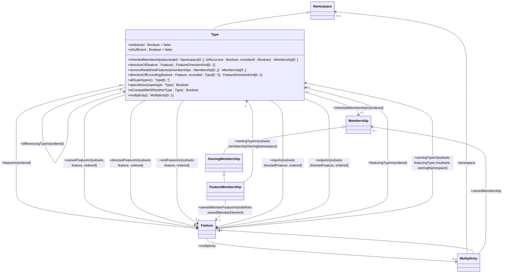
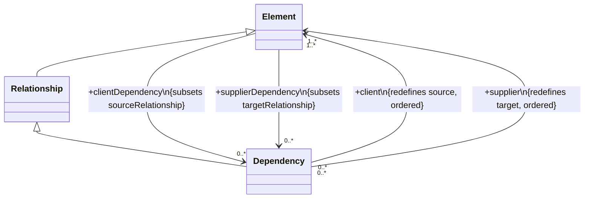
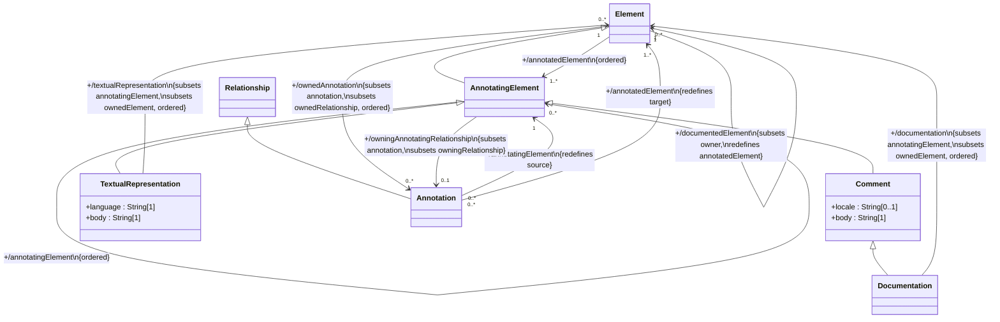
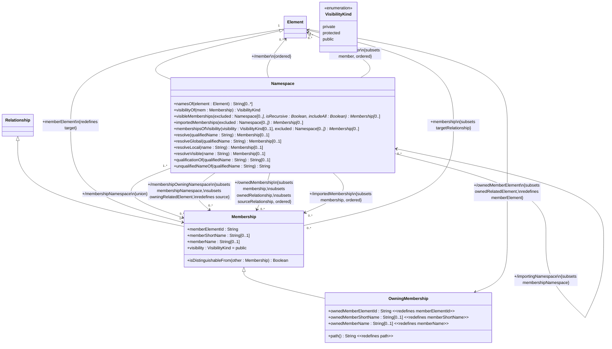
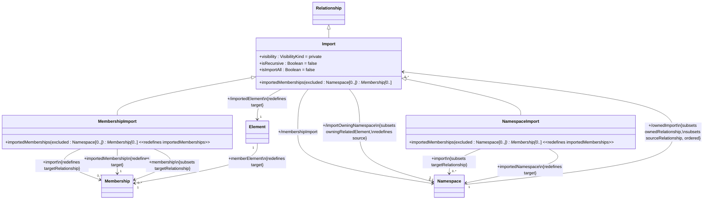
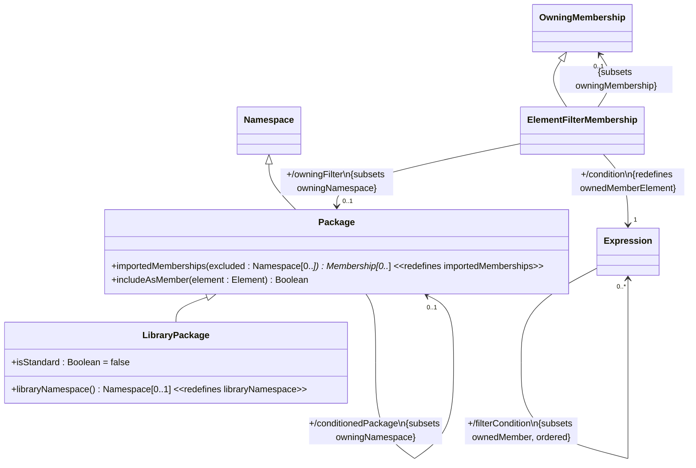
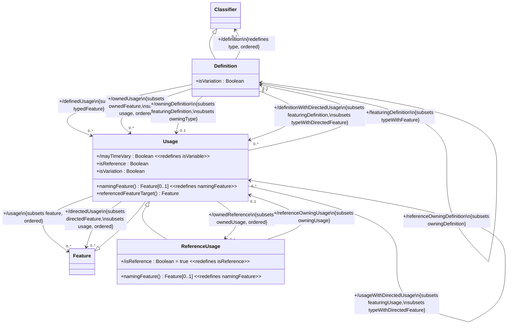
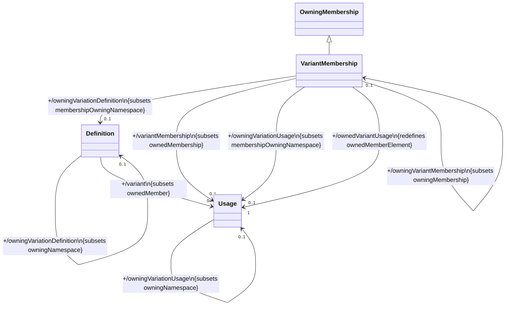

# KerML Abstract Syntax — Mermaid Diagrams

Reference diagrams from KerML 1.0 Beta 2 spec, Chapter 8.3.

## Figure 9. Types (8.3.3.1)

## Figure 3. Dependencies (8.3.3)

## Figure 4. Annotations (8.3.4)

## Figure 5. Namespaces (8.3.5)

## Figure 6. Imports (8.3.5)

## Figure 7. Packages (8.3.5)

## Figure 8. Definition and Usage — Overview (8.3.6.1)

## Figure 9. Variant Membership (8.3.6)

