# KerML Abstract Syntax — Mermaid Diagrams

Reference diagrams from KerML 1.0 Beta 2 spec, Chapter 8.3.
Source: screenshots in `docs/spec/kermlc/`.

## Figure 9. Types (8.3.3.1)

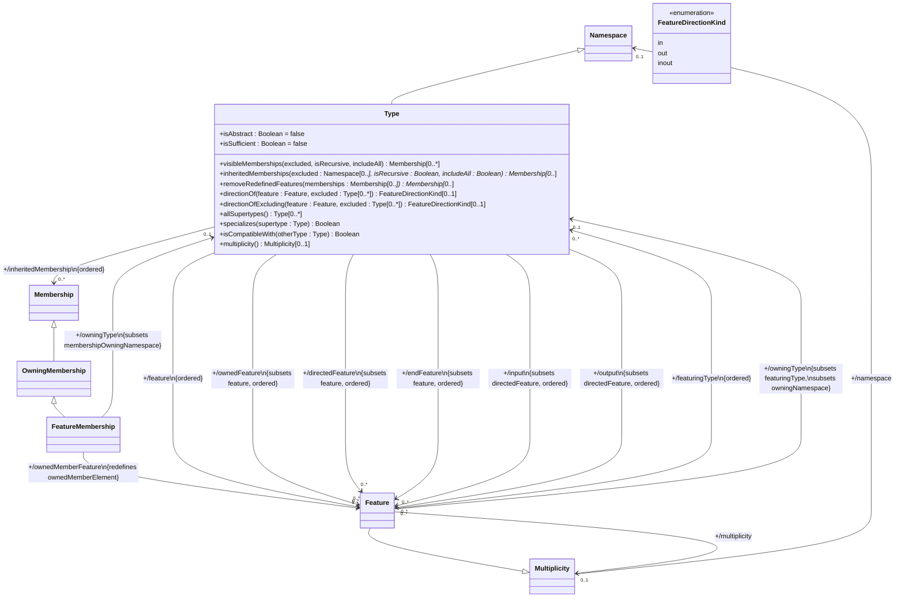

## Figure 10. Specialization (8.3.3.1)

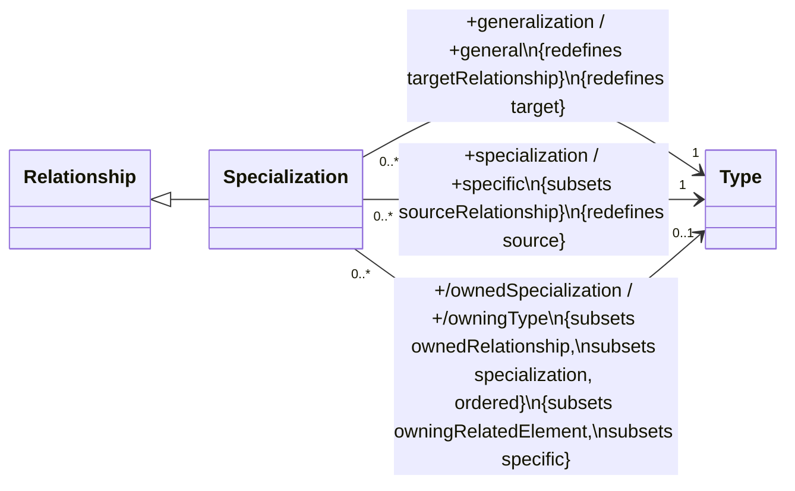

## Figure 11. Conjugation (8.3.3.1)

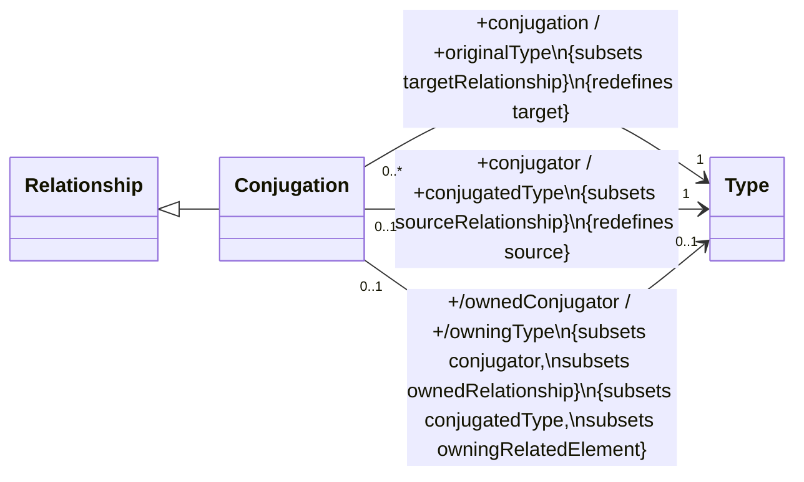

## Figure 12. Disjoining (8.3.3.1)

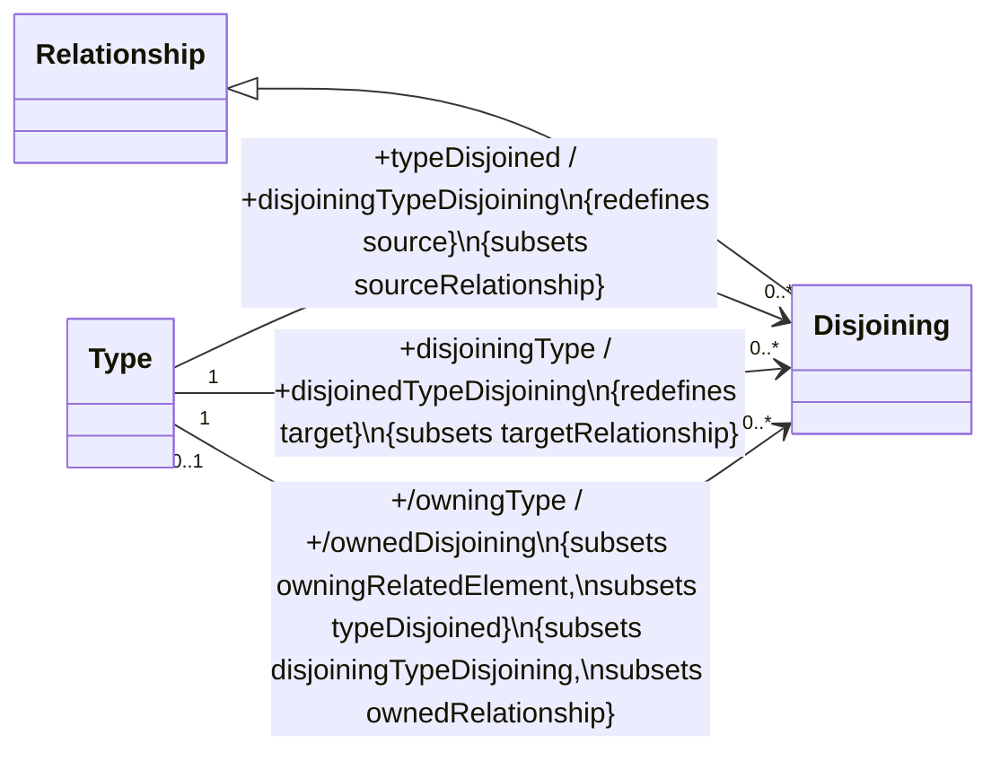

## Figure 13. Unioning (8.3.3.1)

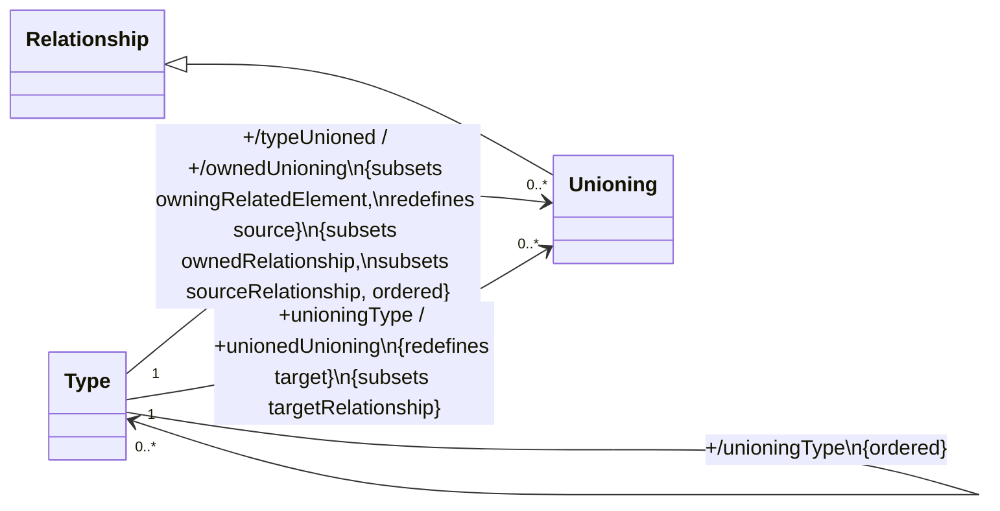

## Figure 14. Intersecting (8.3.3.1)

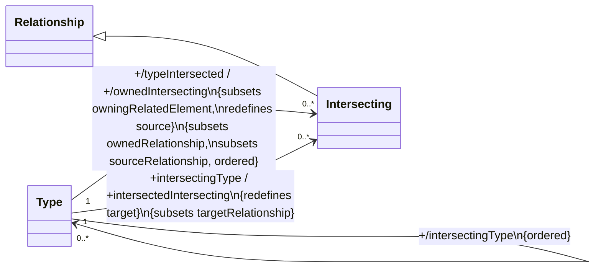

## Figure 15. Differencing (8.3.3.1)

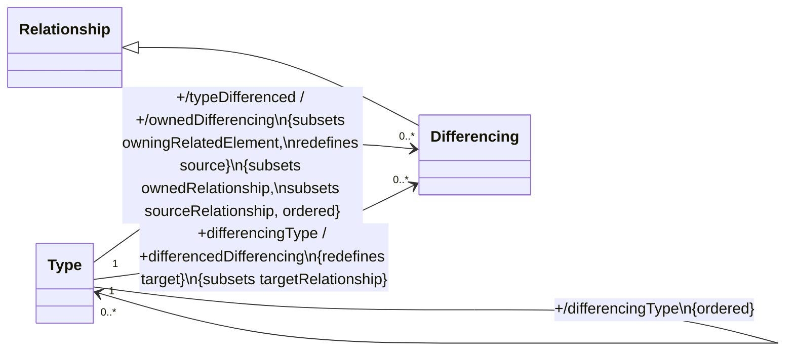

## Figure 17. Features (8.3.3.3)

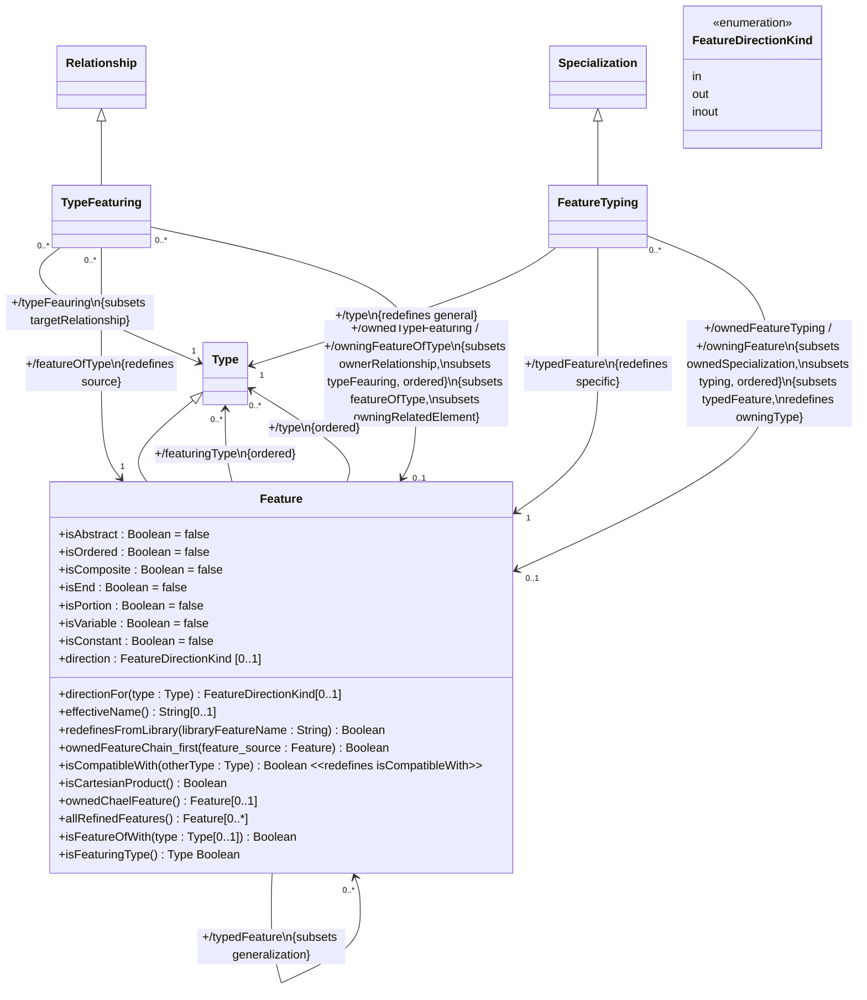

## Figure 18. Subsetting (8.3.3.3)

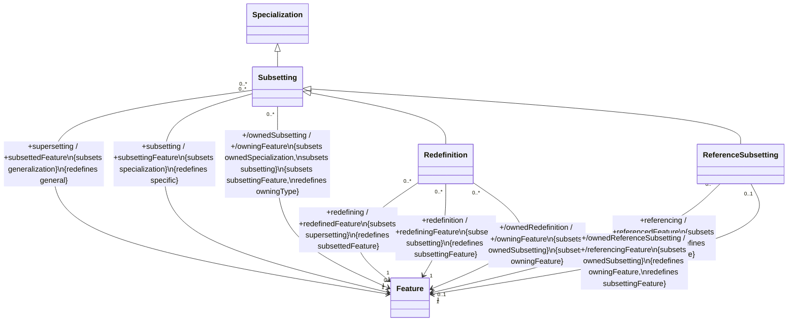

## Figure 19. Feature Chaining (8.3.3.3)

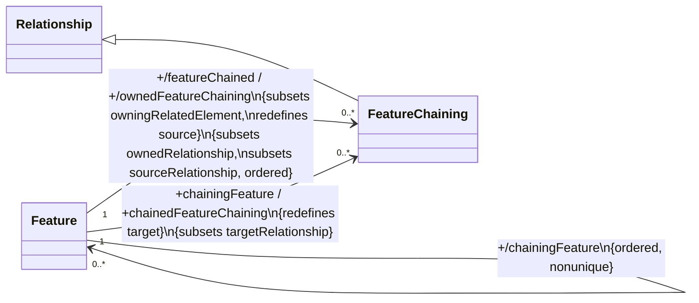

## Figure 20. Feature Inverting (8.3.3.3)

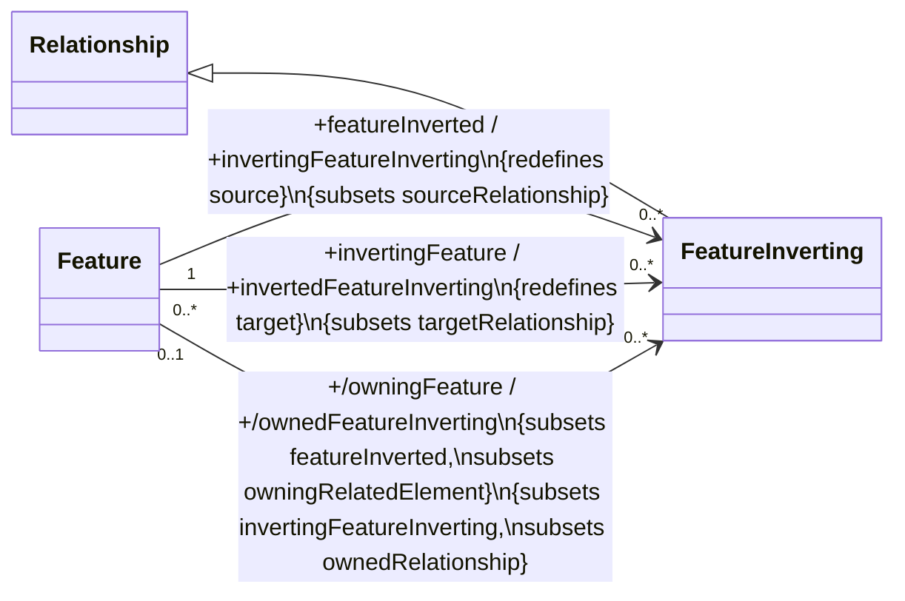

## Figure 21. End Feature Membership (8.3.3.3)

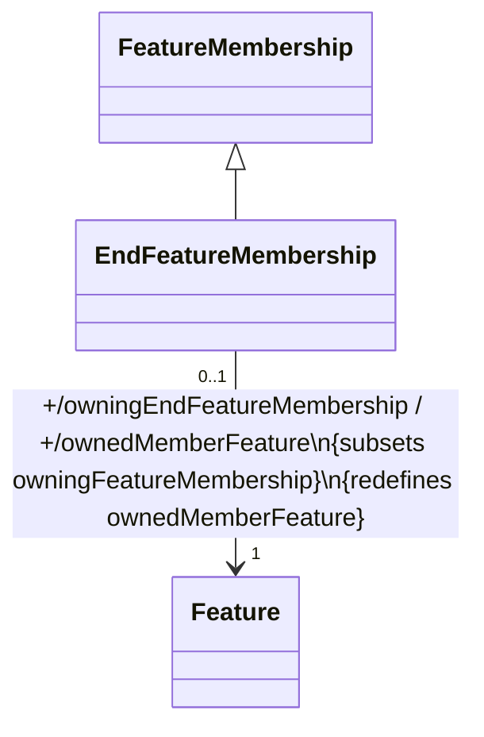

## Figure 22. Cross Subsetting (8.3.3.3)

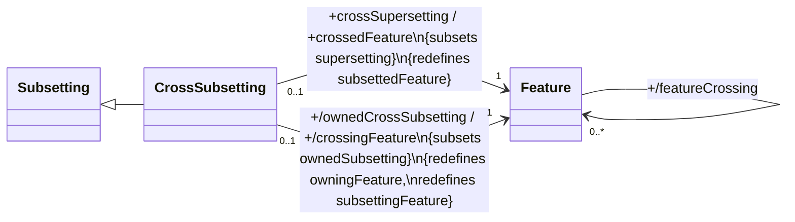
